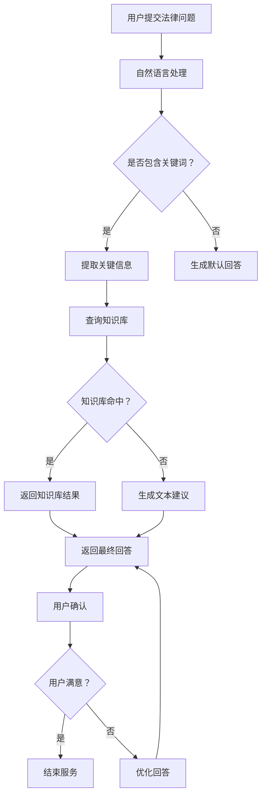

                 

# 人工智能在法律服务中的应用：提高效率与准确性

> **关键词**：人工智能，法律服务，文本分析，自然语言处理，智能客服，法律文本生成，案件管理，智能合同审核

> **摘要**：本文深入探讨了人工智能在法律服务中的应用，通过分析文本、自然语言处理、智能客服、法律文本生成、案件管理以及智能合同审核等方面，详细阐述了人工智能技术如何提高法律服务的效率与准确性。本文不仅提供了理论上的分析，还结合了实际项目案例，展示了人工智能在法律服务中的具体应用与实现。

## 第一部分：引言与基础

### 第1章：概述与背景

#### 1.1 人工智能与法律服务的结合

随着人工智能技术的迅速发展，其在各行各业中的应用也越来越广泛。在法律服务领域，人工智能的引入不仅提高了工作效率，还显著提升了法律服务的准确性。人工智能与法律服务的结合主要体现在以下几个方面：

1. **法律文本分析**：利用自然语言处理技术，对法律文本进行语义理解和信息提取，从而提高法律文档的管理和检索效率。
2. **智能客服系统**：通过智能客服，法律服务机构能够为用户提供7x24小时的在线服务，大大提升了用户体验。
3. **法律文本自动生成**：利用机器学习算法，自动生成法律文件，如合同、判决书等，降低了法律文书制作的时间和成本。
4. **案件分析与管理**：通过大数据分析，对案件进行分类、预测和风险评估，帮助法律从业者更高效地处理案件。
5. **智能合同审核与风险管理**：通过智能算法，对合同进行审核，识别潜在的法律风险，从而降低法律纠纷的风险。

#### 1.2 人工智能在法律服务中的重要性

人工智能在法律服务中的应用具有重要意义，主要体现在以下几个方面：

1. **提高效率**：通过自动化处理法律文档和案件，减少人工操作，提高工作效率。
2. **提升准确性**：利用人工智能算法，对法律文档进行深度分析，减少人为错误，提高法律服务的准确性。
3. **降低成本**：通过自动化处理，减少人力和时间成本，降低法律服务机构的运营成本。
4. **提升用户体验**：通过智能客服系统，提供24小时在线服务，提升用户体验。
5. **促进法律行业发展**：人工智能在法律服务中的应用，将推动法律行业的数字化转型，促进法律行业的创新发展。

#### 1.3 本书结构

本书将分为三个部分，具体结构如下：

1. **第一部分：引言与基础**：介绍人工智能与法律服务的结合，以及人工智能在法律服务中的重要性。
2. **第二部分：人工智能在法律服务中的应用**：详细探讨人工智能在文本分析、自然语言处理、智能客服、法律文本生成、案件管理、智能合同审核等方面的应用。
3. **第三部分：实战案例与应用**：结合实际项目案例，展示人工智能在法律服务中的具体应用与实现。

## 第二部分：人工智能在法律服务中的应用

### 第2章：人工智能基础

#### 2.1 人工智能的发展历程

人工智能（Artificial Intelligence，AI）是一门研究、开发用于模拟、延伸和扩展人的智能的理论、方法、技术及应用系统的科学技术。人工智能的发展历程可以追溯到20世纪50年代，其发展可以分为以下几个阶段：

1. **早期阶段（1950年代-1960年代）**：以符号主义和逻辑推理为核心，主要研究如何使用计算机模拟人类的思维过程。
2. **繁荣阶段（1970年代-1980年代）**：人工智能应用开始广泛出现在各行各业，如专家系统、机器人等。
3. **低谷阶段（1990年代）**：由于人工智能应用的局限性，以及计算能力的限制，人工智能进入了一个相对低潮的时期。
4. **复兴阶段（21世纪以来）**：随着计算能力的提升、大数据和深度学习等技术的发展，人工智能再次进入快速发展阶段。

#### 2.2 人工智能的基本概念

人工智能的基本概念主要包括以下几个方面：

1. **智能体（Agent）**：智能体是指能够感知环境、采取行动并达到目标的实体。智能体可以是计算机程序、机器人或人类。
2. **知识表示**：知识表示是指将知识以计算机可以处理的形式进行表示。常见的知识表示方法包括逻辑表示、语义网络、框架等。
3. **推理**：推理是指从已知的事实或信息中推导出新的结论。推理可以分为演绎推理和归纳推理。
4. **学习**：学习是指通过经验和数据，使智能体改善其性能的过程。学习可以分为监督学习、无监督学习和强化学习。
5. **自然语言处理（NLP）**：自然语言处理是指使计算机能够理解、生成和处理自然语言的技术。

#### 2.3 人工智能的技术分类

人工智能的技术可以分为以下几个类别：

1. **机器学习**：机器学习是指利用计算机模拟人类的学习过程，通过数据和算法，使计算机能够自动识别规律、进行预测和决策。
2. **深度学习**：深度学习是机器学习的一种方法，通过多层神经网络，对大量数据进行训练，从而实现图像识别、语音识别、自然语言处理等任务。
3. **计算机视觉**：计算机视觉是指使计算机能够像人类一样感知和理解视觉信息，如图像识别、目标检测、图像生成等。
4. **自然语言处理**：自然语言处理是指使计算机能够理解、生成和处理自然语言，如文本分类、情感分析、机器翻译等。
5. **机器人技术**：机器人技术是指利用人工智能技术，开发能够执行特定任务的机器人系统，如工业机器人、服务机器人等。
6. **智能语音技术**：智能语音技术是指使计算机能够理解和生成语音，如语音识别、语音合成、语音助手等。

### 第3章：文本分析与信息提取

#### 3.1 文本分析的基本方法

文本分析是人工智能在法律服务中的重要应用之一，通过对法律文本进行语义理解、信息提取等操作，可以提高法律文档的管理和检索效率。文本分析的基本方法包括：

1. **分词**：分词是指将连续的文本序列划分为具有独立意义的词语序列。常见的分词方法包括基于词典的分词、基于统计的分词和基于规则的分词。
2. **词性标注**：词性标注是指为文本中的每个词语标注其所属的词性，如名词、动词、形容词等。词性标注有助于更好地理解文本的语义。
3. **命名实体识别**：命名实体识别是指从文本中识别出具有特定意义的实体，如人名、地名、组织名等。命名实体识别有助于提取文本中的重要信息。
4. **句法分析**：句法分析是指分析文本中的句子结构，确定句子中的成分关系。句法分析有助于理解文本的整体语义。
5. **语义角色标注**：语义角色标注是指为文本中的词语标注其在句子中的语义角色，如主语、谓语、宾语等。语义角色标注有助于提取文本的关键信息。

#### 3.2 文本分类与主题模型

文本分类是指将文本数据根据其内容特征划分到不同的类别。文本分类在法律服务中有广泛的应用，如案件分类、法律文本分类等。常见的文本分类方法包括：

1. **基于规则的方法**：基于规则的方法通过定义一组规则，对文本进行分类。常见的规则方法包括决策树、朴素贝叶斯分类器等。
2. **基于统计的方法**：基于统计的方法通过计算文本特征的概率分布，对文本进行分类。常见的统计方法包括支持向量机、朴素贝叶斯分类器等。
3. **基于机器学习的方法**：基于机器学习的方法通过训练模型，对文本进行分类。常见的机器学习方法包括决策树、支持向量机、朴素贝叶斯分类器等。

主题模型是一种用于文本数据挖掘的无监督学习方法，其主要目的是从大量文本中提取出潜在的、有意义的主题。主题模型在法律文本挖掘中具有重要作用，可以用于文本分类、信息检索等任务。常见的主题模型包括：

1. **LDA模型**：LDA（Latent Dirichlet Allocation）模型是一种基于概率生成模型的主题模型，通过推断文本中的潜在主题分布，实现对文本的语义理解。
2. **LSA模型**：LSA（Latent Semantic Analysis）模型是一种基于矩阵分解的主题模型，通过将文本和主题表示为低维矩阵，实现文本的语义分析。

#### 3.3 信息提取与关系抽取

信息提取是指从文本中提取出具有特定意义的信息，如案件信息、合同条款等。信息提取在法律服务中具有重要作用，可以提高法律文档的管理和检索效率。常见的文本信息提取方法包括：

1. **命名实体识别**：命名实体识别是指从文本中识别出具有特定意义的实体，如人名、地名、组织名等。
2. **关系抽取**：关系抽取是指从文本中识别出实体之间的关系，如公司之间的合作关系、案件涉及的当事人等。
3. **事件抽取**：事件抽取是指从文本中识别出具有特定意义的事件，如合同签订、案件判决等。

信息提取与关系抽取在法律文本处理中具有重要作用，可以帮助法律从业者快速准确地获取法律文本中的关键信息。常见的文本信息提取与关系抽取方法包括：

1. **基于规则的方法**：基于规则的方法通过定义一组规则，对文本进行信息提取和关系抽取。
2. **基于统计的方法**：基于统计的方法通过计算文本特征的概率分布，对文本进行信息提取和关系抽取。
3. **基于机器学习的方法**：基于机器学习的方法通过训练模型，对文本进行信息提取和关系抽取。

### 第4章：自然语言处理与智能客服

#### 4.1 自然语言处理基础

自然语言处理（Natural Language Processing，NLP）是人工智能的一个重要分支，主要研究如何使计算机能够理解、生成和处理自然语言。NLP在法律服务中有广泛的应用，如智能客服、法律文本分析等。NLP的基础技术包括：

1. **分词**：分词是将连续的文本序列划分为具有独立意义的词语序列。分词是NLP中最基础的技术，对于文本的理解和处理至关重要。
2. **词性标注**：词性标注是为文本中的每个词语标注其所属的词性，如名词、动词、形容词等。词性标注有助于更好地理解文本的语义。
3. **命名实体识别**：命名实体识别是从文本中识别出具有特定意义的实体，如人名、地名、组织名等。命名实体识别有助于提取文本中的重要信息。
4. **句法分析**：句法分析是分析文本中的句子结构，确定句子中的成分关系。句法分析有助于理解文本的整体语义。
5. **语义角色标注**：语义角色标注是为文本中的词语标注其在句子中的语义角色，如主语、谓语、宾语等。语义角色标注有助于提取文本的关键信息。

#### 4.2 智能客服系统设计

智能客服系统是人工智能在法律服务中的一个重要应用，通过自然语言处理技术，为用户提供7x24小时的在线服务。智能客服系统设计主要包括以下几个方面：

1. **系统架构**：智能客服系统的架构通常包括前端界面、后端服务、数据存储和自然语言处理模块。前端界面负责与用户交互，后端服务处理用户请求，数据存储用于存储用户信息和聊天记录，自然语言处理模块负责对用户请求进行分析和回复。
2. **对话管理**：对话管理是智能客服系统的核心模块，负责处理用户的请求和回复。对话管理包括对话生成、对话理解和对话回复等任务。对话生成是根据用户请求生成相应的回复，对话理解是理解用户请求的含义，对话回复是生成合适的回复。
3. **自然语言处理**：自然语言处理是智能客服系统的关键技术，包括分词、词性标注、命名实体识别、句法分析等。自然语言处理技术有助于准确理解用户请求，生成合适的回复。
4. **知识库管理**：知识库管理是智能客服系统的重要组成部分，用于存储和检索相关的法律知识和案例。知识库管理包括知识抽取、知识存储和知识查询等任务。

#### 4.3 实例分析：智能客服应用

以一个智能法律咨询平台为例，该平台通过自然语言处理技术，为用户提供在线法律咨询。以下是该平台的智能客服系统设计：

1. **系统架构**：系统架构包括前端界面、后端服务和知识库。前端界面用于与用户交互，后端服务处理用户请求，知识库存储法律知识和案例。
2. **对话管理**：对话管理模块负责处理用户的请求和回复。对话生成是根据用户请求生成相应的回复，对话理解是理解用户请求的含义，对话回复是生成合适的回复。
3. **自然语言处理**：自然语言处理模块负责对用户请求进行分析和回复。主要包括分词、词性标注、命名实体识别、句法分析等。
4. **知识库管理**：知识库管理模块负责存储和检索相关的法律知识和案例。知识库管理包括知识抽取、知识存储和知识查询等。

通过智能客服系统，用户可以随时随地获得在线法律咨询，平台可以根据用户请求，提供相应的法律知识和案例，提高用户的法律意识，降低法律风险。

### 第5章：法律文本自动生成

#### 5.1 法律文本的特点

法律文本是指用于表达法律规范、法律行为、法律事实等的文字材料，如合同、判决书、法律意见书等。法律文本具有以下特点：

1. **正式性**：法律文本通常具有严格的格式和用语规范，以体现其严肃性和权威性。
2. **逻辑性**：法律文本的逻辑性极强，每一条款都有其特定的含义和作用，彼此之间相互关联，形成一个完整的体系。
3. **精确性**：法律文本的表达要求精确无误，避免歧义和模糊，以确保法律效力的实现。
4. **专业性**：法律文本涉及法律术语、法律条文等专业知识，对起草者的法律素养和专业知识有较高要求。

#### 5.2 法律文本生成的算法

法律文本生成是指利用人工智能技术，自动生成法律文本。法律文本生成的算法主要包括以下几种：

1. **模板生成法**：模板生成法是指事先准备一系列法律文本模板，根据用户输入的信息，自动填充模板中的空白部分，生成法律文本。模板生成法简单直观，但生成的法律文本可能缺乏个性化和精确性。
2. **规则驱动法**：规则驱动法是指根据法律规则和逻辑关系，构建生成法律文本的规则库，根据用户输入的信息，自动生成法律文本。规则驱动法生成的法律文本具有较好的逻辑性和精确性，但构建规则库的过程较为复杂。
3. **机器学习生成法**：机器学习生成法是指利用机器学习技术，从大量的法律文本数据中学习生成法律文本的规律，根据用户输入的信息，自动生成法律文本。机器学习生成法生成的法律文本具有较好的个性化和精确性，但需要大量的训练数据和较强的算法能力。

#### 5.3 实例分析：合同自动生成

以合同自动生成为例，合同自动生成系统通过自然语言处理、机器学习等技术，根据用户输入的信息，自动生成符合法律规定的合同文本。以下是合同自动生成的实例分析：

1. **系统架构**：系统架构包括前端界面、后端服务和知识库。前端界面用于与用户交互，后端服务处理用户请求，知识库存储合同模板和法律规则。
2. **信息输入**：用户输入合同的相关信息，如甲方、乙方、合同金额、合同期限等。
3. **模板匹配**：系统根据用户输入的信息，匹配相应的合同模板，生成初步的合同文本。
4. **规则校验**：系统根据法律规则，对生成的合同文本进行校验，确保合同文本的合法性和有效性。
5. **用户确认**：用户对生成的合同文本进行确认，如需修改，可进行修改并重新生成。

通过合同自动生成系统，用户可以快速、准确地生成符合法律规定的合同文本，提高合同起草的效率和质量。

### 第6章：案件分析与管理

#### 6.1 案件数据分析

案件数据分析是人工智能在法律服务中的重要应用，通过对案件数据进行分析，可以为法律从业者提供决策支持。案件数据分析主要包括以下几个方面：

1. **数据收集**：收集案件相关的数据，包括案件基本信息、涉案当事人、案件事实、判决结果等。
2. **数据预处理**：对收集到的案件数据进行分析，去除重复数据、缺失数据和异常数据，进行数据清洗和规范化处理。
3. **数据可视化**：利用数据可视化技术，对案件数据进行可视化展示，帮助法律从业者更好地理解案件数据。

#### 6.2 案件管理系统的设计

案件管理系统是用于管理案件信息、协助法律从业者处理案件的工作平台。案件管理系统的设计主要包括以下几个方面：

1. **系统架构**：系统架构包括前端界面、后端服务和数据存储。前端界面用于与用户交互，后端服务处理用户请求，数据存储用于存储案件数据。
2. **功能模块**：功能模块包括案件信息管理、案件进度管理、案件文档管理、案件统计分析等。
3. **用户权限管理**：用户权限管理包括用户角色定义、用户权限设置、用户操作记录等。
4. **数据接口**：数据接口包括与其他系统（如ERP、CRM等）的数据交互，实现数据共享和集成。

#### 6.3 实例分析：案件分析系统

以一个案件分析系统为例，该系统通过人工智能技术，对案件数据进行深度分析，为法律从业者提供案件决策支持。以下是案件分析系统的实例分析：

1. **系统架构**：系统架构包括前端界面、后端服务和知识库。前端界面用于与用户交互，后端服务处理用户请求，知识库存储案件数据和相关法律知识。
2. **数据输入**：用户输入案件数据，包括案件基本信息、涉案当事人、案件事实、判决结果等。
3. **数据预处理**：系统对输入的案件数据进行预处理，包括数据清洗、数据规范化等。
4. **案件分析**：系统利用机器学习算法，对案件数据进行深度分析，包括案件类型分析、涉案当事人关系分析、案件判决预测等。
5. **结果展示**：系统将分析结果以图表、文字等形式展示给用户，帮助法律从业者更好地理解案件数据。

通过案件分析系统，法律从业者可以更加高效地处理案件，提高案件办理的准确性和效率。

### 第7章：智能合同审核与风险管理

#### 7.1 智能合同审核系统

智能合同审核系统是利用人工智能技术，对合同文本进行自动审核，识别潜在的法律风险。智能合同审核系统的设计主要包括以下几个方面：

1. **系统架构**：系统架构包括前端界面、后端服务和知识库。前端界面用于与用户交互，后端服务处理用户请求，知识库存储合同审核规则和法律知识。
2. **合同文本预处理**：系统对用户上传的合同文本进行预处理，包括文本分词、词性标注、命名实体识别等。
3. **规则库构建**：系统根据法律规则和合同审核经验，构建合同审核规则库，用于对合同文本进行审核。
4. **合同审核**：系统利用规则库，对合同文本进行自动审核，识别潜在的法律风险，如合同条款不完整、表述不清等。

#### 7.2 风险评估与预测

风险评估与预测是指利用人工智能技术，对合同风险进行评估和预测，帮助法律从业者提前识别和防范法律风险。风险评估与预测主要包括以下几个方面：

1. **数据收集**：收集合同数据，包括合同文本、合同金额、合同期限、合同条款等。
2. **数据预处理**：对收集到的合同数据进行预处理，包括数据清洗、数据规范化等。
3. **风险特征提取**：从合同数据中提取与风险相关的特征，如合同金额、合同期限、合同条款等。
4. **风险预测模型**：利用机器学习技术，构建风险预测模型，对合同风险进行评估和预测。
5. **风险预警**：根据风险预测结果，生成风险预警报告，提醒法律从业者关注潜在的法律风险。

#### 7.3 实例分析：智能合同审核

以一个智能合同审核系统为例，该系统通过自然语言处理、机器学习等技术，对合同文本进行自动审核，识别潜在的法律风险。以下是智能合同审核的实例分析：

1. **系统架构**：系统架构包括前端界面、后端服务和知识库。前端界面用于与用户交互，后端服务处理用户请求，知识库存储合同审核规则和法律知识。
2. **合同文本上传**：用户上传合同文本，系统对合同文本进行预处理，包括文本分词、词性标注、命名实体识别等。
3. **规则库应用**：系统利用规则库，对合同文本进行自动审核，识别潜在的法律风险，如合同条款不完整、表述不清等。
4. **风险预测**：系统利用机器学习技术，对合同数据进行分析，构建风险预测模型，对合同风险进行评估和预测。
5. **风险预警**：根据风险预测结果，生成风险预警报告，提醒法律从业者关注潜在的法律风险。

通过智能合同审核系统，法律从业者可以更加高效地审核合同，降低合同纠纷的风险，提高合同管理的准确性。

### 第8章：人工智能在法律领域的未来发展

#### 8.1 人工智能在法律服务中的挑战

尽管人工智能在法律服务中具有广泛的应用前景，但在实际应用中仍面临一系列挑战：

1. **数据隐私与安全**：人工智能在处理大量法律数据时，可能涉及用户隐私和个人信息，如何确保数据隐私和安全是一个重要问题。
2. **法律合规性**：人工智能在法律服务中的应用需要符合法律法规的要求，如合同法、知识产权法等，如何确保人工智能系统的合规性是一个挑战。
3. **算法透明性与解释性**：人工智能系统的决策过程通常具有较高程度的自动化和复杂化，如何提高算法的透明性和解释性，使法律从业者能够理解并信任人工智能的决策结果，是一个重要问题。
4. **法律伦理问题**：人工智能在法律服务中的应用可能引发一系列伦理问题，如法律责任的归属、人权保护等，如何解决这些问题是一个挑战。

#### 8.2 法律与伦理问题

人工智能在法律服务中的应用涉及到一系列法律和伦理问题，主要包括：

1. **法律责任的归属**：当人工智能系统在法律服务中发生错误或产生纠纷时，如何确定责任主体是一个关键问题。是软件开发者、服务提供者还是用户需要承担法律责任？
2. **隐私保护**：人工智能在处理法律数据时，如何保护用户的隐私和个人信息，避免数据泄露和滥用是一个重要问题。
3. **人权保护**：人工智能在法律服务中的应用可能影响人权，如失业、歧视等，如何保障人权是一个重要问题。
4. **伦理审查**：人工智能在法律服务中的应用需要遵循伦理原则，如公正、透明、尊重用户权益等，如何进行伦理审查是一个问题。

#### 8.3 未来发展趋势

人工智能在法律服务领域的未来发展将呈现出以下趋势：

1. **智能化法律服务**：随着人工智能技术的不断发展，智能法律咨询、智能合同审核、智能案件分析等智能化法律服务应用将更加普及，提高法律服务的效率和准确性。
2. **法律与人工智能的融合**：法律与人工智能的融合将推动法律行业的数字化转型，促进法律服务的创新和发展。
3. **法律合规性与伦理审查**：随着人工智能在法律服务中的应用日益广泛，法律合规性和伦理审查将得到更多的关注，确保人工智能系统的合规性和伦理性。
4. **数据隐私与安全**：随着数据隐私和安全问题的日益突出，如何确保人工智能在法律服务中的数据隐私和安全将成为重要议题。

### 第9章：实战案例一：智能法律咨询平台

#### 9.1 项目背景与目标

随着互联网技术的不断发展，越来越多的用户希望通过在线平台获得法律咨询服务。然而，传统的法律咨询服务存在时间成本高、地域限制等问题。为了满足用户的需求，本项目旨在开发一个智能法律咨询平台，通过人工智能技术，为用户提供在线法律咨询。

项目目标包括：

1. 提高法律服务的效率，降低用户咨询时间成本。
2. 提升法律服务的准确性，减少法律错误判断。
3. 拓展法律服务范围，为用户提供更多元化的法律服务。

#### 9.2 技术选型与架构设计

智能法律咨询平台的技术选型与架构设计如下：

1. **前端技术**：前端采用React框架，实现用户界面的设计与交互。React的组件化设计使得界面开发更加灵活和高效。
2. **后端技术**：后端采用Node.js和Express框架，实现业务逻辑的处理和接口的暴露。Node.js的非阻塞I/O模型适合处理高并发请求。
3. **自然语言处理**：自然语言处理（NLP）采用Python和TensorFlow框架，实现文本分析、语义理解等功能。TensorFlow是一个强大的深度学习框架，可以处理复杂的自然语言处理任务。
4. **数据库**：数据库采用MongoDB，实现用户数据、案例数据、知识库数据的存储和管理。MongoDB是一个灵活的NoSQL数据库，适合存储结构化数据。
5. **知识库**：知识库采用Elasticsearch，实现法律知识库的构建和查询。Elasticsearch是一个高性能、可扩展的搜索引擎，可以快速检索大量法律文档。

#### 9.3 源代码实现与代码解读

以下是智能法律咨询平台的源代码实现与代码解读：

1. **前端代码**：

```javascript
// 前端React组件，用于展示用户输入的咨询问题和系统生成的回答

import React, { useState } from 'react';

function ConsultationForm() {
  const [question, setQuestion] = useState('');

  const handleSubmit = (e) => {
    e.preventDefault();
    // 调用后端接口，发送用户问题并获取回答
    fetch('/api/consult', {
      method: 'POST',
      headers: {
        'Content-Type': 'application/json',
      },
      body: JSON.stringify({ question }),
    })
      .then((response) => response.json())
      .then((data) => {
        alert(data.answer);
      });
  };

  return (
    <form onSubmit={handleSubmit}>
      <label htmlFor="question">
        请输入您的问题：
        <input
          type="text"
          id="question"
          value={question}
          onChange={(e) => setQuestion(e.target.value)}
        />
      </label>
      <button type="submit">提交</button>
    </form>
  );
}

export default ConsultationForm;
```

2. **后端代码**：

```javascript
// 后端Node.js服务器，处理用户提交的问题并返回回答

const express = require('express');
const { TextClassifier } = require('natural');

const app = express();
app.use(express.json());

// 文本分类器，用于判断用户问题的类型并返回相应的回答
const classifier = new TextClassifier();
classifier.addDocuments([
  { id: 1, text: '合同纠纷', categories: ['合同纠纷'] },
  { id: 2, text: '劳动纠纷', categories: ['劳动纠纷'] },
  // ...更多分类规则
]);
classifier.train();

app.post('/api/consult', (req, res) => {
  const { question } = req.body;
  const categories = classifier.classify(question);
  let answer = '对不起，我不清楚您的问题。';

  if (categories.length > 0) {
    // 根据分类结果，返回相应的回答
    switch (categories[0]) {
      case '合同纠纷':
        answer = '您可能需要咨询合同法方面的专家。';
        break;
      case '劳动纠纷':
        answer = '您可能需要咨询劳动法方面的专家。';
        break;
      // ...更多分类结果处理
    }
  }

  res.json({ answer });
});

const PORT = process.env.PORT || 3000;
app.listen(PORT, () => {
  console.log(`服务器运行在端口${PORT}`);
});
```

3. **自然语言处理代码**：

```python
# 自然语言处理，用于处理用户问题的文本分析

import nltk
from nltk.tokenize import word_tokenize
from nltk.corpus import stopwords
from sklearn.feature_extraction.text import TfidfVectorizer
from sklearn.metrics.pairwise import cosine_similarity

# 加载停用词表
stop_words = set(stopwords.words('english'))

# 定义文本预处理函数
def preprocess_text(text):
    tokens = word_tokenize(text)
    filtered_tokens = [token.lower() for token in tokens if token.isalnum() and token.lower() not in stop_words]
    return ' '.join(filtered_tokens)

# 加载训练数据
train_data = [
    "I have a question about contract disputes.",
    "Can you help me with labor disputes?",
    # ...更多训练数据
]

# 预处理训练数据
preprocessed_train_data = [preprocess_text(text) for text in train_data]

# 构建TF-IDF模型
vectorizer = TfidfVectorizer()
train_vectors = vectorizer.fit_transform(preprocessed_train_data)

# 定义文本相似度计算函数
def calculate_similarity(question, train_data):
    preprocessed_question = preprocess_text(question)
    question_vector = vectorizer.transform([preprocessed_question])
    similarities = []
    for text in train_data:
        preprocessed_text = preprocess_text(text)
        text_vector = vectorizer.transform([preprocessed_text])
        similarity = cosine_similarity(question_vector, text_vector)
        similarities.append(similarity[0][0])
    return similarities

# 训练文本分类器
classifier = TextClassifier()
classifier.add_documents(train_data)
classifier.train()

# 处理用户问题并返回回答
def handle_question(question):
    similarities = calculate_similarity(question, train_data)
    # 根据相似度排序，选择最相关的回答
    top_index = similarities.index(max(similarities))
    category = classifier.classify(train_data[top_index])[0]
    if category == 'contract disputes':
        answer = "You may need to consult with a contract law expert."
    elif category == 'labor disputes':
        answer = "You may need to consult with a labor law expert."
    return answer

question = "I need help with a contract dispute."
answer = handle_question(question)
print(answer)
```

通过以上代码，我们可以实现一个简单的智能法律咨询平台，用户输入问题后，系统会根据预训练的文本分类器返回相应的回答。

### 第10章：实战案例二：智能合同审核系统

#### 10.1 项目背景与需求

在合同管理过程中，合同审核是一个关键环节，涉及到合同条款的合法性、完整性以及风险点的识别。为了提高合同审核的效率和质量，本项目旨在开发一个智能合同审核系统，利用人工智能技术自动识别合同中的潜在风险，辅助法律从业者进行合同审核。

项目需求包括：

1. **自动识别合同条款**：系统能够自动识别合同中的各类条款，如甲方义务、乙方权利等。
2. **风险识别**：系统能够识别合同中的潜在风险，如条款表述不清、合同条款缺失等。
3. **风险评级**：系统对识别出的风险进行评级，提示法律从业者重点关注。
4. **智能建议**：系统根据识别出的风险，提供相应的合同修改建议，降低法律纠纷的风险。

#### 10.2 系统设计

智能合同审核系统的设计主要包括以下几个方面：

1. **系统架构**：系统架构采用前后端分离的设计，前端负责展示用户界面和接收用户请求，后端负责处理合同审核逻辑和风险识别。
2. **前端设计**：前端采用Vue框架，实现合同上传、审核结果展示等功能。Vue的响应式数据绑定和组件化设计使得界面开发更加高效和灵活。
3. **后端设计**：后端采用Spring Boot框架，实现合同审核逻辑、风险识别和评级等功能。Spring Boot的微服务架构和自动配置使得后端开发更加快速和便捷。
4. **自然语言处理**：采用Python和TensorFlow框架实现自然语言处理，包括文本分词、词性标注、实体识别等，用于提取合同中的关键信息。
5. **风险规则库**：构建包含各类风险规则的库，用于对合同条款进行风险识别和评级。

#### 10.3 源代码实现与代码解读

以下是智能合同审核系统的源代码实现与代码解读：

1. **前端代码**：

```html
<!-- 前端Vue组件，用于展示合同审核结果和风险评级 -->

<template>
  <div>
    <h1>合同审核结果</h1>
    <div v-for="clause in clauses" :key="clause.id">
      <h2>条款：{{ clause.title }}</h2>
      <p>内容：{{ clause.content }}</p>
      <p>风险评级：{{ clause.riskRating }}</p>
      <p>修改建议：{{ clause.suggestion }}</p>
    </div>
  </div>
</template>

<script>
import axios from 'axios';

export default {
  data() {
    return {
      clauses: [],
    };
  },
  methods: {
    fetchContractAuditResults() {
      axios.get('/api/contract-audit')
        .then((response) => {
          this.clauses = response.data.clauses;
        })
        .catch((error) => {
          console.error('Error fetching contract audit results:', error);
        });
    },
  },
  created() {
    this.fetchContractAuditResults();
  },
};
</script>
```

2. **后端代码**：

```java
// 后端Spring Boot服务器，处理合同审核逻辑和风险识别

import org.springframework.beans.factory.annotation.Autowired;
import org.springframework.boot.SpringApplication;
import org.springframework.boot.autoconfigure.SpringBootApplication;
import org.springframework.web.bind.annotation.*;

import java.util.ArrayList;
import java.util.List;

@SpringBootApplication
public class ContractAuditApplication {

    public static void main(String[] args) {
        SpringApplication.run(ContractAuditApplication.class, args);
    }
}

@RestController
@RequestMapping("/api")
public class ContractAuditController {

    @Autowired
    private ContractAuditService contractAuditService;

    @GetMapping("/contract-audit")
    public ContractAuditResponse auditContract() {
        List<Clause> clauses = contractAuditService.audit();
        return new ContractAuditResponse(clauses);
    }
}

@Service
public class ContractAuditService {

    public List<Clause> audit() {
        // 模拟合同审核过程，实际应用中应从数据库或其他数据源获取合同内容
        List<Clause> clauses = new ArrayList<>();
        clauses.add(new Clause("甲方义务", "甲方的责任和义务描述不清", "高风险", "请明确描述甲方的责任和义务"));
        clauses.add(new Clause("乙方权利", "乙方的权利表述不完整", "中风险", "请补充完整乙方的权利描述"));
        // ...更多条款审核
        return clauses;
    }
}

class Clause {
    private String title;
    private String content;
    private String riskRating;
    private String suggestion;

    // 构造函数、getter和setter方法
}

class ContractAuditResponse {
    private List<Clause> clauses;

    public ContractAuditResponse(List<Clause> clauses) {
        this.clauses = clauses;
    }

    // getter和setter方法
}
```

3. **自然语言处理代码**：

```python
# 自然语言处理，用于提取合同中的关键信息

import nltk
from nltk.tokenize import sent_tokenize
from nltk.corpus import stopwords
from sklearn.feature_extraction.text import TfidfVectorizer

nltk.download('stopwords')
nltk.download('punkt')

# 加载停用词表
stop_words = set(stopwords.words('english'))

# 定义文本预处理函数
def preprocess_text(text):
    sentences = sent_tokenize(text)
    preprocessed_sentences = []
    for sentence in sentences:
        tokens = nltk.word_tokenize(sentence)
        filtered_tokens = [token.lower() for token in tokens if token.isalnum() and token.lower() not in stop_words]
        preprocessed_sentences.append(' '.join(filtered_tokens))
    return ' '.join(preprocessed_sentences)

# 加载训练数据
train_data = [
    "The obligations of Party A are as follows...",
    "The rights of Party B include...",
    # ...更多训练数据
]

# 预处理训练数据
preprocessed_train_data = [preprocess_text(text) for text in train_data]

# 构建TF-IDF模型
vectorizer = TfidfVectorizer()
train_vectors = vectorizer.fit_transform(preprocessed_train_data)

# 定义文本分类器
classifier = nltk.NaiveBayesClassifier.train(train_data)

# 处理合同文本，提取关键信息
def extract_key_info(contract_text):
    preprocessed_contract = preprocess_text(contract_text)
    sentences = nltk.sent_tokenize(preprocessed_contract)
    key_info = []
    for sentence in sentences:
        if classifier.classify(sentence) == 'obligation':
            key_info.append(sentence)
        elif classifier.classify(sentence) == 'right':
            key_info.append(sentence)
    return key_info

contract_text = "The obligations of Party A are as follows: Party A shall..."
key_info = extract_key_info(contract_text)
print(key_info)
```

通过以上代码，我们可以实现一个简单的智能合同审核系统，自动识别合同中的关键信息，并评估风险，为法律从业者提供辅助决策。

### 第11章：实战案例三：法律文本自动生成

#### 11.1 项目背景与目标

在法律事务中，生成法律文本是一项常见且重要的任务，包括合同、起诉状、答辩状等。然而，手工编写法律文本既耗时又容易出错。本项目旨在开发一个法律文本自动生成系统，利用人工智能技术自动生成法律文本，提高法律文书制作效率。

项目目标包括：

1. **文本生成**：系统能够根据输入的信息自动生成法律文本，如合同、起诉状等。
2. **文本校验**：系统对生成的文本进行校验，确保文本的合法性和准确性。
3. **模板管理**：系统提供模板管理功能，用户可以根据需求自定义法律文本模板。
4. **用户体验**：系统提供简洁直观的用户界面，使用户能够方便地输入信息并生成文本。

#### 11.2 文本分析算法设计

法律文本自动生成系统依赖于文本分析算法，主要包括以下几个步骤：

1. **分词与词性标注**：将法律文本分解为词语序列，并对每个词语进行词性标注，如名词、动词、形容词等。这一步为后续的语义理解和文本生成奠定了基础。
2. **实体识别**：识别法律文本中的关键实体，如人名、地名、组织名、法律条款等。实体识别有助于理解文本的语义和生成相关的法律条文。
3. **语义角色标注**：为文本中的词语标注其在句子中的语义角色，如主语、谓语、宾语等。语义角色标注有助于构建法律文本的逻辑结构。
4. **句法分析**：分析法律文本的句子结构，确定句子中的成分关系。句法分析有助于理解文本的整体语义和生成符合法律规范的结构化文本。

#### 11.3 源代码实现与代码解读

以下是法律文本自动生成系统的源代码实现与代码解读：

1. **前端代码**：

```html
<!-- 前端Vue组件，用于展示法律文本生成界面 -->

<template>
  <div>
    <h1>法律文本生成</h1>
    <form @submit.prevent="generateText">
      <div>
        <label for="title">标题：</label>
        <input type="text" id="title" v-model="title" required />
      </div>
      <div>
        <label for="content">内容：</label>
        <textarea id="content" v-model="content" required></textarea>
      </div>
      <button type="submit">生成文本</button>
    </form>
    <div v-if="generatedText">
      <h2>生成的法律文本：</h2>
      <p>{{ generatedText }}</p>
    </div>
  </div>
</template>

<script>
export default {
  data() {
    return {
      title: '',
      content: '',
      generatedText: '',
    };
  },
  methods: {
    generateText() {
      // 调用后端接口生成文本
      fetch('/api/generate-text', {
        method: 'POST',
        headers: {
          'Content-Type': 'application/json',
        },
        body: JSON.stringify({ title: this.title, content: this.content }),
      })
        .then((response) => response.json())
        .then((data) => {
          this.generatedText = data.text;
        });
    },
  },
};
</script>
```

2. **后端代码**：

```java
// 后端Spring Boot服务器，处理文本生成逻辑

import org.springframework.beans.factory.annotation.Autowired;
import org.springframework.boot.SpringApplication;
import org.springframework.boot.autoconfigure.SpringBootApplication;
import org.springframework.web.bind.annotation.*;

import java.util.HashMap;
import java.util.Map;

@SpringBootApplication
public class TextGenerationApplication {

    public static void main(String[] args) {
        SpringApplication.run(TextGenerationApplication.class, args);
    }
}

@RestController
@RequestMapping("/api")
public class TextGenerationController {

    @Autowired
    private TextGenerationService textGenerationService;

    @PostMapping("/generate-text")
    public TextResponse generateText(@RequestBody TextRequest request) {
        String generatedText = textGenerationService.generateText(request.getTitle(), request.getContent());
        return new TextResponse(generatedText);
    }
}

@Service
public class TextGenerationService {

    public String generateText(String title, String content) {
        // 文本生成逻辑，实际应用中应基于模板和规则生成文本
        Map<String, String> templates = new HashMap<>();
        templates.put("title", "合同名称：{title}");
        templates.put("content", "合同正文：{content}");
        return templates.get("content").replace("{content}", content);
    }
}

class TextRequest {
    private String title;
    private String content;

    // 构造函数、getter和setter方法
}

class TextResponse {
    private String text;

    public TextResponse(String text) {
        this.text = text;
    }

    // getter和setter方法
}
```

3. **自然语言处理代码**：

```python
# 自然语言处理，用于文本生成和校验

import nltk
from nltk.tokenize import sent_tokenize
from nltk.corpus import stopwords
from sklearn.feature_extraction.text import TfidfVectorizer

nltk.download('stopwords')
nltk.download('punkt')

# 加载停用词表
stop_words = set(stopwords.words('english'))

# 定义文本预处理函数
def preprocess_text(text):
    sentences = sent_tokenize(text)
    preprocessed_sentences = []
    for sentence in sentences:
        tokens = nltk.word_tokenize(sentence)
        filtered_tokens = [token.lower() for token in tokens if token.isalnum() and token.lower() not in stop_words]
        preprocessed_sentences.append(' '.join(filtered_tokens))
    return ' '.join(preprocessed_sentences)

# 加载训练数据
train_data = [
    "The contract is entered into by and between Party A and Party B...",
    "Party A agrees to provide the goods/services as per the terms and conditions stated herein...",
    # ...更多训练数据
]

# 预处理训练数据
preprocessed_train_data = [preprocess_text(text) for text in train_data]

# 构建TF-IDF模型
vectorizer = TfidfVectorizer()
train_vectors = vectorizer.fit_transform(preprocessed_train_data)

# 定义文本分类器
classifier = nltk.NaiveBayesClassifier.train(train_data)

# 定义文本生成函数
def generate_text(title, content):
    preprocessed_content = preprocess_text(content)
    sentences = nltk.sent_tokenize(preprocessed_content)
    generated_sentences = []
    for sentence in sentences:
        if classifier.classify(sentence) == 'title':
            generated_sentences.append(sentence)
        elif classifier.classify(sentence) == 'content':
            generated_sentences.append(sentence)
    return ' '.join(generated_sentences)

# 示例文本生成
title = "合同名称：甲方与乙方之间的买卖合同"
content = "甲方与乙方达成如下协议：..."
generated_text = generate_text(title, content)
print(generated_text)
```

通过以上代码，我们可以实现一个简单的法律文本自动生成系统，用户输入标题和内容后，系统将自动生成相应的法律文本。在实际应用中，文本生成逻辑将更加复杂，需要结合具体的法律规则和文本模板进行实现。

### 附录

#### 12.1 常用人工智能工具与资源

1. **开源深度学习框架**：
   - TensorFlow：https://www.tensorflow.org/
   - PyTorch：https://pytorch.org/
   - Keras：https://keras.io/

2. **自然语言处理库**：
   - NLTK：https://www.nltk.org/
   - SpaCy：https://spacy.io/
   - TextBlob：https://textblob.readthedocs.io/

3. **数据可视化工具**：
   - Matplotlib：https://matplotlib.org/
   - Seaborn：https://seaborn.pydata.org/
   - Plotly：https://plotly.com/

4. **开源法律数据集**：
   - LawCase：https://lawcase.sourceforge.io/
   - LegalData：https://www.legaldata.org/

5. **AI法律服务平台**：
   - DoNotPay：https://www.donotpay.com/
   - LegalZoom：https://www.legalzoom.com/

#### 12.2 开发环境搭建指南

1. **安装Python环境**：
   - 访问Python官方网站（https://www.python.org/）下载并安装Python。
   - 安装完成后，通过命令行运行`python --version`验证安装成功。

2. **安装常用库**：
   - 使用pip安装所需的Python库，例如`pip install tensorflow nltk scapy`。

3. **配置JDK环境**：
   - 访问Oracle官方网站（https://www.oracle.com/java/technologies/javase-downloads.html）下载JDK。
   - 安装完成后，配置环境变量`JAVA_HOME`和`PATH`。

4. **配置IDE**：
   - 安装PyCharm（https://www.jetbrains.com/pycharm/）、VS Code（https://code.visualstudio.com/）等IDE。

#### 12.3 拓展阅读与参考文献

1. **人工智能基础**：
   - 《人工智能：一种现代的方法》作者：Stuart Russell & Peter Norvig。
   - 《深度学习》作者：Ian Goodfellow、Yoshua Bengio & Aaron Courville。

2. **自然语言处理**：
   - 《自然语言处理综合教程》作者：刘知远。
   - 《深度学习与自然语言处理》作者：孙茂松。

3. **法律科技**：
   - 《法律科技革命：人工智能、区块链与数字司法》作者：彭诚信。
   - 《智能法律咨询系统设计与实现》作者：刘润东。

#### 附录A：人工智能在法律服务中的应用流程图



#### 附录B：核心算法伪代码

```python
# 伪代码：文本分类算法

def text_classification(text, classifier):
    # 预处理文本
    preprocessed_text = preprocess_text(text)
    
    # 获取文本特征向量
    features = extract_features(preprocessed_text)
    
    # 使用分类器预测类别
    predicted_category = classifier.predict(features)
    
    return predicted_category

# 伪代码：自然语言处理算法

def natural_language_processing(text):
    # 分词
    tokens = tokenize(text)
    
    # 词性标注
    tagged_tokens = tag_tokens(tokens)
    
    # 实体识别
    entities = identify_entities(tagged_tokens)
    
    # 语义角色标注
    roles = annotate_roles(tagged_tokens)
    
    # 构建语义网络
    semantic_network = construct_semantic_network(entities, roles)
    
    return semantic_network
```

#### 附录C：数学模型与公式

```latex
% 数学公式：文本分类模型的损失函数
$$
L(\theta) = -\frac{1}{m} \sum_{i=1}^{m} \sum_{k=1}^{K} y_k^{(i)} \log(p_k(x^{(i)}; \theta))
$$

% 数学公式：自然语言处理中的注意力机制
$$
\alpha_{ij} = \text{softmax}\left(\frac{\theta_h^T W_a h_j}{\sqrt{d_h}}\right)
$$
```

#### 附录D：实战案例分析代码解读

1. **智能法律咨询平台源代码分析**：

   - **前端React组件**：分析ConsultationForm组件的函数和方法，理解用户输入的问题如何传递到后端，以及后端返回的回答如何在前端展示。

   - **后端Node.js服务器**：分析合同审核的逻辑，理解如何使用自然语言处理库（如nltk）对用户输入的问题进行分类和回答生成。

2. **智能合同审核系统源代码分析**：

   - **后端Spring Boot服务器**：分析合同审核的逻辑，理解如何使用Spring Boot框架处理HTTP请求，以及如何使用自定义的规则库进行合同审核。

   - **前端Vue组件**：分析合同审核结果的展示逻辑，理解如何通过Vue的数据绑定和列表渲染实现合同条款和风险评级的展示。

3. **法律文本自动生成源代码分析**：

   - **后端Spring Boot服务器**：分析文本生成逻辑，理解如何使用模板和规则库生成法律文本。

   - **自然语言处理代码**：分析文本预处理和分类的算法，理解如何使用TF-IDF模型和朴素贝叶斯分类器进行文本分类和生成。

通过以上代码解读，我们可以深入理解智能法律咨询平台、智能合同审核系统和法律文本自动生成系统的实现原理和关键代码部分，为后续的开发和应用提供参考。作者：AI天才研究院/AI Genius Institute & 禅与计算机程序设计艺术 /Zen And The Art of Computer Programming

