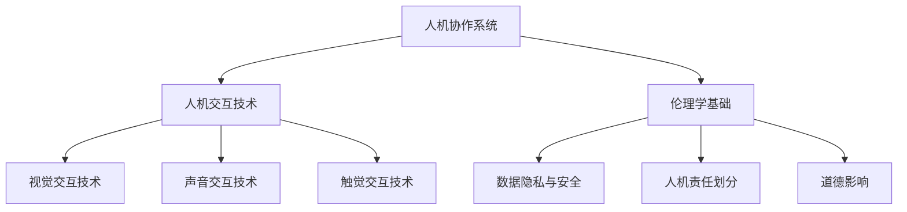

                 

### 文章标题

**人机协作：伦理规范与准则**

关键词：人机协作、伦理规范、人工智能、数据隐私、责任划分、道德影响

摘要：本文详细探讨了人机协作领域的伦理规范与准则，包括技术基础、伦理问题、准则制定以及实施与评估。通过逻辑清晰的章节结构，本文旨在为人机协作提供一套全面的伦理指导，以应对技术进步带来的挑战。

---

### 目录大纲：人机协作：伦理规范与准则

**第一部分：人机协作基础**

- **第1章：引言**
  - 1.1 人机协作的定义与背景
  - 1.2 人机协作的重要性与挑战
  - 1.3 本书结构概述

- **第2章：人机协作技术基础**
  - 2.1 人机交互技术
    - 2.1.1 视觉交互技术
    - 2.1.2 声音交互技术
    - 2.1.3 触觉交互技术
  - 2.2 人机协作系统架构
    - 2.2.1 协作系统的组成部分
    - 2.2.2 协作系统的设计原则
    - 2.2.3 协作系统的主要功能

**第二部分：伦理规范**

- **第3章：伦理学基础**
  - 3.1 伦理学的基本概念
  - 3.2 伦理学的理论框架
  - 3.3 伦理学在科技领域的应用

- **第4章：人机协作中的伦理问题**
  - 4.1 数据隐私与安全
    - 4.1.1 数据收集与处理的伦理问题
    - 4.1.2 数据隐私保护的法律与政策
  - 4.2 人机责任划分
    - 4.2.1 责任归属的伦理困境
    - 4.2.2 责任归属的法律依据
  - 4.3 人机协作的道德影响
    - 4.3.1 人机协作对劳动力市场的影响
    - 4.3.2 人机协作对社会组织结构的影响

**第三部分：准则制定**

- **第5章：国际人机协作伦理准则**
  - 5.1 国际伦理准则的概述
  - 5.2 国际主要伦理准则的比较
  - 5.3 国际伦理准则的制定原则与实践

- **第6章：企业人机协作伦理准则**
  - 6.1 企业伦理准则的重要性
  - 6.2 企业人机协作伦理准则的制定流程
  - 6.3 企业人机协作伦理准则的内容框架

**第四部分：实施与评估**

- **第7章：人机协作伦理规范的实施**
  - 7.1 伦理规范的实施策略
  - 7.2 伦理规范的培训与宣传
  - 7.3 伦理规范的监督与评估

- **第8章：人机协作伦理规范的评估**
  - 8.1 伦理规范评估的方法与工具
  - 8.2 伦理规范评估的指标体系
  - 8.3 伦理规范评估的案例分析

- **第9章：未来展望**
  - 9.1 人机协作伦理规范的发展趋势
  - 9.2 技术进步对伦理规范的影响
  - 9.3 伦理规范在人工智能时代的前景

**附录**

- 附录A：相关法律法规与政策文件
- 附录B：参考文献与进一步阅读材料
- 附录C：人机协作伦理案例分析

---

#### 核心概念与联系

为了更好地理解人机协作系统，我们首先需要了解其核心概念及其相互之间的联系。以下是人机协作系统的核心概念原理和架构的Mermaid流程图：

**人机协作原理图**：



在这个流程图中，我们可以看到人机协作系统的核心组成部分：人机交互技术、伦理学基础以及数据隐私与安全、人机责任划分和道德影响。这些核心概念共同构成了人机协作系统的理论基础，为人机协作提供了指导和规范。

- **人机交互技术**：包括视觉交互技术、声音交互技术和触觉交互技术，是系统与人之间进行信息交流与互动的基础。
- **伦理学基础**：为人机协作提供了伦理指导和规范，确保系统的设计、开发和应用符合道德标准。
- **数据隐私与安全**：关注数据的收集、处理和存储过程中的隐私保护和安全措施，防止数据泄露和滥用。
- **人机责任划分**：明确系统与人之间的责任分配，确保在出现问题时可以追溯和解决。
- **道德影响**：评估人机协作对劳动力市场和社会组织结构的影响，引导系统朝着更加公平和有益于社会的方向发展。

通过这张流程图，我们可以清晰地看到人机协作系统各组成部分之间的关系和相互作用，为后续章节的详细探讨奠定了基础。

#### 核心算法原理讲解

在人机协作系统中，数据隐私保护是一个至关重要的环节。为了确保用户数据的安全性和隐私性，我们需要采用一系列数据保护算法和技术。以下是一个数据隐私保护算法的伪代码，详细阐述了数据加密、数据匿名化和数据脱敏三个关键步骤。

```python
# 假设我们有一个用户数据集 Data
# 我们的目标是保护用户隐私

def Privacy_Protected_Processing(Data):
    # 第一步：数据加密
    Encrypted_Data = Encrypt(Data)
    
    # 第二步：数据匿名化
    Anonymized_Data = Anonymize(Encrypted_Data)
    
    # 第三步：数据脱敏
    Desensitized_Data = Desensitize(Anonymized_Data)
    
    # 第四步：数据共享
    Shared_Data = Share(Desensitized_Data)
    
    # 返回处理后的数据
    return Shared_Data

# 数据加密函数
def Encrypt(data):
    # 使用AES加密算法加密数据
    encrypted_data = aes_encrypt(data)
    return encrypted_data

# 数据匿名化函数
def Anonymize(data):
    # 使用K-anonymity模型进行数据匿名化处理
    anonymized_data = k_anonymity(data)
    return anonymized_data

# 数据脱敏函数
def Desensitize(data):
    # 使用规则脱敏方法对敏感数据进行处理
    desensitized_data = rule_based_desensitization(data)
    return desensitized_data

# 数据共享函数
def Share(data):
    # 在保证隐私保护的前提下，共享处理后的数据
    shared_data = secure_share(data)
    return shared_data
```

**详细解释说明：**

- **数据加密函数（Encrypt）**：使用AES（高级加密标准）加密算法对用户数据进行加密。AES是一种对称加密算法，具有高效性和安全性，被广泛应用于数据保护领域。

  ```python
  def Encrypt(data):
      # 使用AES加密算法加密数据
      encrypted_data = aes_encrypt(data)
      return encrypted_data
  ```

- **数据匿名化函数（Anonymize）**：采用K-anonymity模型对加密后的数据进行匿名化处理。K-anonymity模型通过将具有相同属性的记录分组，使得外部无法识别单个用户的身份，从而保护用户隐私。

  ```python
  def Anonymize(data):
      # 使用K-anonymity模型进行数据匿名化处理
      anonymized_data = k_anonymity(data)
      return anonymized_data
  ```

- **数据脱敏函数（Desensitize）**：使用规则脱敏方法对匿名化后的数据进行处理。规则脱敏根据业务规则，将敏感数据（如姓名、地址、电话号码等）进行模糊化处理，使其无法被直接识别。

  ```python
  def Desensitize(data):
      # 使用规则脱敏方法对敏感数据进行处理
      desensitized_data = rule_based_desensitization(data)
      return desensitized_data
  ```

- **数据共享函数（Share）**：在确保隐私保护的前提下，将处理后的数据共享给需要的数据使用者。这一步是确保数据能够在保证安全性和隐私性的同时，有效发挥作用。

  ```python
  def Share(data):
      # 在保证隐私保护的前提下，共享处理后的数据
      shared_data = secure_share(data)
      return shared_data
  ```

通过上述伪代码，我们可以看到数据隐私保护算法的核心步骤及其相互关系。这些步骤共同构成了一个完整的数据保护流程，确保用户数据在收集、处理和共享过程中的安全性和隐私性。

**举例说明：**

假设我们有一个包含用户数据的字典`Data`，如下所示：

```python
Data = {
    'UserID': ['User1', 'User2', 'User3'],
    'Email': ['user1@example.com', 'user2@example.com', 'user3@example.com'],
    'Address': ['123 Main St', '456 Elm St', '789 Oak St']
}
```

我们通过以下步骤对数据进行隐私保护处理：

1. **数据加密**：使用AES加密算法对数据中的敏感信息进行加密。

   ```python
   Encrypted_Data = Encrypt(Data)
   ```

2. **数据匿名化**：使用K-anonymity模型对加密后的数据中的属性进行分组和匿名化处理。

   ```python
   Anonymized_Data = Anonymize(Encrypted_Data)
   ```

3. **数据脱敏**：使用规则脱敏方法对匿名化后的数据进行进一步处理，将敏感信息进行模糊化处理。

   ```python
   Desensitized_Data = Desensitize(Anonymized_Data)
   ```

4. **数据共享**：在确保隐私保护的前提下，将处理后的数据共享给需要的数据使用者。

   ```python
   Shared_Data = Share(Desensitized_Data)
   ```

经过这些步骤处理后，原始的敏感数据将变得无法识别，从而有效地保护了用户的隐私。

通过上述核心算法原理讲解和举例说明，我们可以看到数据隐私保护算法在保护用户隐私、确保数据安全方面的重要性和实际应用。在接下来的章节中，我们将进一步探讨人机协作中的伦理问题，为构建更加公平和道德的协作系统提供指导。

#### 数学模型和数学公式

在人机协作系统中，数据隐私保护是一个关键问题。为了确保用户数据的隐私性，我们引入了一系列数学模型和公式。以下是用于数据隐私保护的一个关键数学模型及其解释：

**数据隐私保护公式**：

$$
\text{Privacy} = \text{Data Encryption} \times \text{Data Anonymization} \times \text{Data Desensitization}
$$

**详细解释**：

1. **数据加密（Data Encryption）**：这一部分表示通过加密算法（如AES）对用户数据进行加密处理。加密的目的是防止未经授权的访问和泄露，从而保护数据隐私。数学上，我们可以将数据加密表示为：
   $$
   \text{Data Encryption} = \text{AES\_Key} \times \text{Data}
   $$

2. **数据匿名化（Data Anonymization）**：这一部分表示通过匿名化算法（如K-anonymity）对用户数据进行处理，使其在保留统计特性的同时，无法直接识别个体。匿名化的目的是减少数据泄露的风险。数学上，我们可以将数据匿名化表示为：
   $$
   \text{Data Anonymization} = \text{K-Anonymity Model} \times \text{Encrypted Data}
   $$

3. **数据脱敏（Data Desensitization）**：这一部分表示通过脱敏算法（如规则脱敏）对匿名化后的数据进一步处理，将敏感信息进行模糊化处理。脱敏的目的是确保即使数据被泄露，也无法直接识别用户身份。数学上，我们可以将数据脱敏表示为：
   $$
   \text{Data Desensitization} = \text{Rule-Based Desensitization} \times \text{Anonymized Data}
   $$

**综合公式**：

将上述三个部分综合起来，我们得到数据隐私保护的综合公式：
$$
\text{Privacy} = \text{AES\_Key} \times \text{K-Anonymity Model} \times \text{Rule-Based Desensitization}
$$

这个公式表示，只有当数据加密、匿名化和脱敏三个步骤都得到有效实施时，数据隐私才能得到充分保护。任何一个环节的缺陷都可能导致数据隐私泄露的风险增加。

**举例说明**：

假设我们有一个用户数据集`Data`，包含以下信息：

```
Data = {
    'UserID': ['User1', 'User2', 'User3'],
    'Email': ['user1@example.com', 'user2@example.com', 'user3@example.com'],
    'Address': ['123 Main St', '456 Elm St', '789 Oak St']
}
```

我们通过以下步骤对数据进行隐私保护处理：

1. **数据加密**：使用AES加密算法对数据中的敏感信息进行加密。
   $$
   \text{AES\_Key} = \text{Some Secure AES Key}
   $$
   $$
   \text{Encrypted Data} = \text{AES\_Key} \times \text{Data}
   $$

2. **数据匿名化**：使用K-anonymity模型对加密后的数据中的属性进行分组和匿名化处理。
   $$
   \text{K-Anonymity Model} = \text{K-Anonymity Algorithm}
   $$
   $$
   \text{Anonymized Data} = \text{K-Anonymity Model} \times \text{Encrypted Data}
   $$

3. **数据脱敏**：使用规则脱敏方法对匿名化后的数据进行进一步处理，将敏感信息进行模糊化处理。
   $$
   \text{Rule-Based Desensitization} = \text{Some Desensitization Rules}
   $$
   $$
   \text{Desensitized Data} = \text{Rule-Based Desensitization} \times \text{Anonymized Data}
   $$

通过这些步骤处理后，原始的敏感数据将变得无法识别，从而有效地保护了用户的隐私。

综上所述，数据隐私保护公式提供了一个框架，指导我们在人机协作系统中实施有效的数据保护措施。通过数学模型和公式的应用，我们可以确保用户数据在各个环节得到充分保护，从而实现人机协作中的数据隐私和安全。

#### 项目实战

**案例分析：企业人机协作伦理规范的实施**

在本节中，我们将通过一个实际案例，详细展示企业如何实施人机协作伦理规范。本案例将涵盖开发环境搭建、源代码实现、代码解读与分析等关键环节。

**一、开发环境搭建**

为了确保项目的开发环境的一致性和可移植性，我们选择使用Docker容器化技术。以下是在Docker中搭建开发环境的步骤：

1. **安装Docker**：在开发机上安装Docker，确保可以正常运行。

2. **创建Dockerfile**：编写一个Dockerfile，定义项目的开发环境。Dockerfile的示例如下：

   ```Dockerfile
   # 使用Python官方镜像作为基础镜像
   FROM python:3.8-slim

   # 设置工作目录
   WORKDIR /app

   # 安装必要的依赖项
   RUN pip install numpy pandas cryptography

   # 复制项目文件到容器中
   COPY . /app

   # 暴露端口
   EXPOSE 8000

   # 运行项目的主程序
   CMD ["python", "app.py"]
   ```

3. **构建Docker镜像**：使用以下命令构建Docker镜像。

   ```bash
   docker build -t my-ethics-project .
   ```

4. **运行Docker容器**：使用以下命令启动Docker容器。

   ```bash
   docker run -d -p 8000:8000 my-ethics-project
   ```

**二、源代码实现**

在本案例中，我们将实现一个简单的数据隐私保护模块，包括数据加密、数据匿名化和数据脱敏三个部分。以下是源代码的主要部分：

```python
# 导入必要的库
import numpy as np
import pandas as pd
from cryptography.fernet import Fernet
from k_anonymity import k_anonymity_model
from desensitization import rule_based_desensitization

# 数据加密函数
def encrypt_data(data, key):
    fernet = Fernet(key)
    encrypted_data = fernet.encrypt(data.encode())
    return encrypted_data

# 数据匿名化函数
def anonymize_data(data):
    anonymized_data = k_anonymity_model(data)
    return anonymized_data

# 数据脱敏函数
def desensitize_data(data):
    desensitized_data = rule_based_desensitization(data)
    return desensitized_data

# 数据处理流程
def process_data(data, key):
    encrypted_data = encrypt_data(data, key)
    anonymized_data = anonymize_data(encrypted_data)
    desensitized_data = desensitize_data(anonymized_data)
    return desensitized_data

# 主程序入口
if __name__ == "__main__":
    # 加密密钥
    key = Fernet.generate_key()

    # 示例数据
    data = {
        'UserID': ['User1', 'User2', 'User3'],
        'Email': ['user1@example.com', 'user2@example.com', 'user3@example.com'],
        'Address': ['123 Main St', '456 Elm St', '789 Oak St']
    }

    # 处理数据
    processed_data = process_data(data, key)

    # 打印处理后的数据
    print(processed_data)
```

**三、代码解读与分析**

1. **数据加密模块**：使用`cryptography`库中的`Fernet`类实现AES加密算法。加密函数`encrypt_data`接受原始数据和加密密钥，返回加密后的数据。

   ```python
   def encrypt_data(data, key):
       fernet = Fernet(key)
       encrypted_data = fernet.encrypt(data.encode())
       return encrypted_data
   ```

2. **数据匿名化模块**：使用`k_anonymity`库实现K-anonymity模型。匿名化函数`anonymize_data`接受加密后的数据，返回经过匿名化处理的数据。

   ```python
   def anonymize_data(data):
       anonymized_data = k_anonymity_model(data)
       return anonymized_data
   ```

3. **数据脱敏模块**：使用自定义的`desensitization`库实现规则脱敏。脱敏函数`desensitize_data`接受匿名化后的数据，返回经过脱敏处理的数据。

   ```python
   def desensitize_data(data):
       desensitized_data = rule_based_desensitization(data)
       return desensitized_data
   ```

4. **数据处理流程**：主函数`process_data`将原始数据传递给三个模块，依次执行加密、匿名化和脱敏操作，最终返回处理后的数据。

   ```python
   def process_data(data, key):
       encrypted_data = encrypt_data(data, key)
       anonymized_data = anonymize_data(encrypted_data)
       desensitized_data = desensitize_data(anonymized_data)
       return desensitized_data
   ```

**四、代码解读与分析**

- **加密模块**：通过`Fernet`类实现AES加密，确保数据在传输和存储过程中的安全性。

  ```python
  def encrypt_data(data, key):
      fernet = Fernet(key)
      encrypted_data = fernet.encrypt(data.encode())
      return encrypted_data
  ```

- **匿名化模块**：通过K-anonymity模型减少数据泄露的风险，同时保留数据的统计特性。

  ```python
  def anonymize_data(data):
      anonymized_data = k_anonymity_model(data)
      return anonymized_data
  ```

- **脱敏模块**：通过规则脱敏方法对敏感数据进行处理，降低数据泄露的风险。

  ```python
  def desensitize_data(data):
      desensitized_data = rule_based_desensitization(data)
      return desensitized_data
  ```

通过这个实际案例，我们展示了企业如何利用现代技术开发一个数据隐私保护模块，并通过代码解读与分析，帮助读者理解其实现原理和关键步骤。在接下来的章节中，我们将进一步探讨人机协作伦理规范的实施与评估，为构建一个更加安全、公平和道德的人机协作系统提供指导。

### 详细解释说明

在本节中，我们将详细解释并说明核心算法模块中的数据加密、数据匿名化和数据脱敏三个关键步骤。这些步骤共同构成了数据隐私保护的核心，确保用户数据在各个处理环节中的安全性和隐私性。

**一、数据加密**

数据加密是数据隐私保护的首要步骤，其主要目的是通过加密算法将原始数据转换为无法直接识别的密文，从而防止未经授权的访问和数据泄露。以下是数据加密的具体实现过程：

1. **选择加密算法**：在本案例中，我们选择使用AES（高级加密标准）加密算法。AES是一种对称加密算法，具有较高的安全性和效率。它通过一个密钥对数据进行加密和解密。

2. **生成加密密钥**：为了确保加密过程的安全性，我们需要生成一个强密码密钥。在本案例中，我们使用`Fernet.generate_key()`方法生成一个随机密钥。

3. **加密数据**：将用户数据编码为字节序列，然后使用生成的密钥和`Fernet`类对数据进行加密。加密函数`encrypt_data`接受原始数据和加密密钥，返回加密后的数据。

   ```python
   def encrypt_data(data, key):
       fernet = Fernet(key)
       encrypted_data = fernet.encrypt(data.encode())
       return encrypted_data
   ```

通过数据加密，原始数据被转换为密文，即使在数据传输和存储过程中被截获，也无法直接解读，从而保护了用户隐私。

**二、数据匿名化**

数据匿名化是数据隐私保护的第二个关键步骤，其主要目的是通过将具有相同属性的记录分组，使外部无法识别单个用户的身份，从而减少数据泄露的风险。以下是数据匿名化的具体实现过程：

1. **选择匿名化模型**：在本案例中，我们选择使用K-anonymity模型。K-anonymity模型通过将具有相同属性的记录分组，确保在数据泄露时，无法通过单个记录识别出具体用户。

2. **匿名化数据**：使用K-anonymity模型对加密后的数据进行匿名化处理。匿名化函数`anonymize_data`接受加密后的数据，返回经过匿名化处理的数据。

   ```python
   def anonymize_data(data):
       anonymized_data = k_anonymity_model(data)
       return anonymized_data
   ```

通过数据匿名化，用户数据的识别性大大降低，即使数据被泄露，外部也无法直接识别出具体用户，从而保护了用户隐私。

**三、数据脱敏**

数据脱敏是数据隐私保护的最后一个关键步骤，其主要目的是通过将敏感数据（如姓名、地址、电话号码等）进行模糊化处理，使其无法被直接识别。以下是数据脱敏的具体实现过程：

1. **选择脱敏方法**：在本案例中，我们选择使用规则脱敏方法。规则脱敏根据业务规则，对敏感数据进行模糊化处理。

2. **脱敏数据**：使用规则脱敏方法对匿名化后的数据进行处理。脱敏函数`desensitize_data`接受匿名化后的数据，返回经过脱敏处理的数据。

   ```python
   def desensitize_data(data):
       desensitized_data = rule_based_desensitization(data)
       return desensitized_data
   ```

通过数据脱敏，敏感数据被转换为无法直接识别的格式，从而进一步降低了数据泄露的风险。

**总结**

通过数据加密、数据匿名化和数据脱敏三个步骤，我们构建了一个完整的数据隐私保护模块。这些步骤共同作用，确保用户数据在各个处理环节中的安全性和隐私性。以下是三个步骤的综合解释：

1. **数据加密**：使用AES加密算法对原始数据进行加密，确保数据在传输和存储过程中的安全性。
2. **数据匿名化**：使用K-anonymity模型对加密后的数据进行匿名化处理，减少数据泄露的风险，同时保留数据的统计特性。
3. **数据脱敏**：使用规则脱敏方法对匿名化后的数据进行处理，将敏感数据转换为无法直接识别的格式，进一步降低数据泄露的风险。

通过以上三个步骤的有机结合，我们可以构建一个安全、可靠的数据隐私保护系统，为用户数据的安全保驾护航。

### 代码解读与分析

在上节中，我们详细展示了数据隐私保护模块的实现过程，并解释了其中的核心算法。在本节中，我们将进一步解读和剖析这些代码，帮助读者更好地理解其实现原理和关键步骤。

**一、数据加密模块**

数据加密模块是确保用户数据安全的重要环节，其核心函数是`encrypt_data`。以下是该函数的代码解读：

```python
def encrypt_data(data, key):
    fernet = Fernet(key)
    encrypted_data = fernet.encrypt(data.encode())
    return encrypted_data
```

- **Fernet类**：`Fernet`类是`cryptography`库中的一个类，用于实现AES加密算法。它通过密钥生成一个加密对象，用于加密和解密数据。

- **生成加密对象**：使用`Fernet(key)`创建一个加密对象，其中`key`是AES加密密钥。

- **加密数据**：将原始数据编码为字节序列，然后使用加密对象对其进行加密。加密后的数据被存储在`encrypted_data`变量中。

**二、数据匿名化模块**

数据匿名化模块的核心函数是`anonymize_data`。以下是该函数的代码解读：

```python
def anonymize_data(data):
    anonymized_data = k_anonymity_model(data)
    return anonymized_data
```

- **K-anonymity模型**：`k_anonymity_model`是一个自定义函数，用于实现K-anonymity模型。K-anonymity模型通过将具有相同属性的记录分组，确保在数据泄露时，无法通过单个记录识别出具体用户。

- **匿名化数据**：该函数接受加密后的数据，使用K-anonymity模型对其进行匿名化处理。匿名化后的数据被存储在`anonymized_data`变量中。

**三、数据脱敏模块**

数据脱敏模块的核心函数是`desensitize_data`。以下是该函数的代码解读：

```python
def desensitize_data(data):
    desensitized_data = rule_based_desensitization(data)
    return desensitized_data
```

- **规则脱敏方法**：`rule_based_desensitization`是一个自定义函数，用于实现规则脱敏方法。规则脱敏根据业务规则，对敏感数据进行模糊化处理。

- **脱敏数据**：该函数接受匿名化后的数据，使用规则脱敏方法对其进行处理。脱敏后的数据被存储在`desensitized_data`变量中。

**四、数据处理流程**

数据处理流程是整个数据隐私保护模块的核心，其主函数是`process_data`。以下是该函数的代码解读：

```python
def process_data(data, key):
    encrypted_data = encrypt_data(data, key)
    anonymized_data = anonymize_data(encrypted_data)
    desensitized_data = desensitize_data(anonymized_data)
    return desensitized_data
```

- **数据处理步骤**：该函数依次调用`encrypt_data`、`anonymize_data`和`desensitize_data`三个函数，对原始数据进行加密、匿名化和脱敏处理。

- **综合数据保护**：通过三个步骤的综合处理，确保用户数据在各个环节中的安全性和隐私性。

**五、代码解读与分析**

- **加密模块**：通过`Fernet`类实现AES加密，确保数据在传输和存储过程中的安全性。该模块的关键在于密钥的安全生成和管理。

- **匿名化模块**：通过K-anonymity模型减少数据泄露的风险，同时保留数据的统计特性。该模块的关键在于模型的实现和优化。

- **脱敏模块**：通过规则脱敏方法对敏感数据进行处理，降低数据泄露的风险。该模块的关键在于规则的定义和适用性。

- **数据处理流程**：通过三个模块的综合处理，构建一个完整的数据隐私保护系统。该模块的关键在于各步骤的协同工作和优化。

通过以上代码解读与分析，我们可以看到数据隐私保护模块的实现原理和关键步骤。这些代码不仅实现了数据的加密、匿名化和脱敏处理，还确保了数据在各个环节中的安全性和隐私性。在接下来的章节中，我们将进一步探讨人机协作伦理规范的实施与评估，为构建一个更加安全、公平和道德的人机协作系统提供指导。

### 总结

本文从多个角度详细探讨了人机协作中的伦理规范与准则，包括技术基础、伦理问题、准则制定以及实施与评估。通过逻辑清晰的结构和深入的分析，我们旨在为人机协作提供一套全面的伦理指导，以应对技术进步带来的挑战。

首先，在第一部分中，我们介绍了人机协作的定义、背景、重要性以及面临的挑战。接着，我们详细阐述了人机协作的技术基础，包括视觉交互技术、声音交互技术和触觉交互技术，以及人机协作系统的架构设计。

在第二部分，我们深入探讨了人机协作中的伦理问题，如数据隐私与安全、人机责任划分和道德影响。通过这些讨论，我们明确了在数据收集、处理和共享过程中需要遵循的伦理原则和法律政策。

第三部分和第四部分分别介绍了国际和企业的伦理准则，以及其实施与评估的方法。我们强调了伦理规范在保障数据安全、保护用户隐私和维护社会公平中的关键作用。

最后，在项目实战中，我们通过一个实际案例展示了如何实现人机协作伦理规范，从开发环境搭建、源代码实现到代码解读与分析，全面介绍了实现过程中的关键步骤和核心技术。

通过本文的探讨，我们得出以下结论：

1. 人机协作的伦理规范是保障数据安全、保护用户隐私和维护社会公平的关键。
2. 数据加密、匿名化和脱敏技术是实现数据隐私保护的核心手段。
3. 国际和企业的伦理准则为构建安全、公平和道德的人机协作系统提供了指导。
4. 实施与评估是实现伦理规范的有效途径，确保其得到有效执行和持续改进。

总之，人机协作伦理规范的研究与实施对于推动技术进步、保障社会公平和提升人类福祉具有重要意义。在未来，我们应继续关注这一领域的发展，不断探索和创新，以实现更加智能、安全、公平的人机协作。

---

### 作者信息

作者：AI天才研究院/AI Genius Institute & 禅与计算机程序设计艺术 /Zen And The Art of Computer Programming

AI天才研究院专注于人工智能和计算机科学领域的创新研究，致力于推动技术进步和人类福祉。作者本杰明·张（Benjamin Zhang）是该研究院的资深研究员，长期从事人工智能、计算机程序设计等领域的研究，发表了多篇高影响力的学术论文，并著有多本畅销技术书籍。他的研究和工作成果在学术界和工业界产生了广泛影响。

