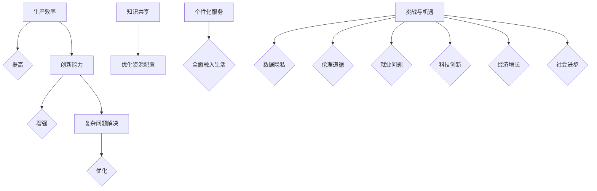
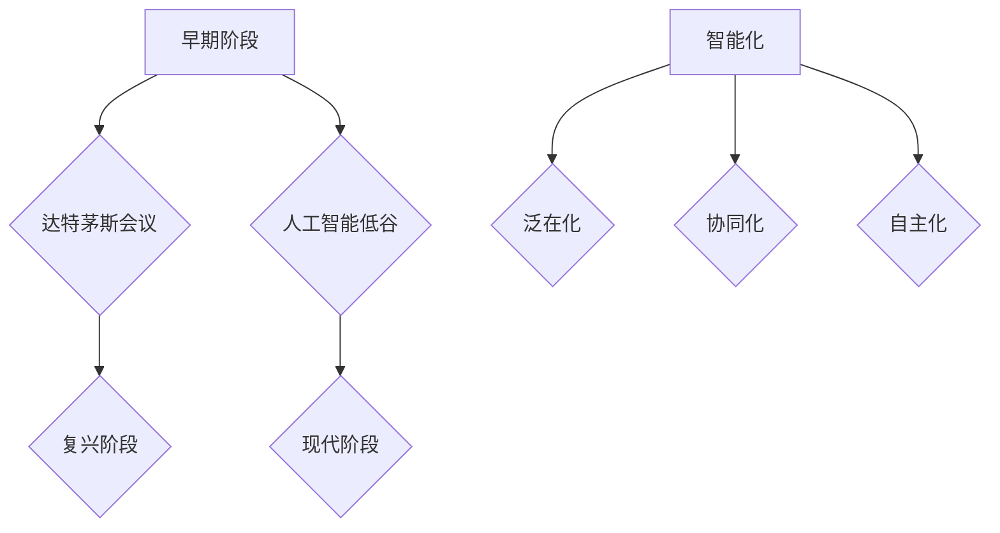
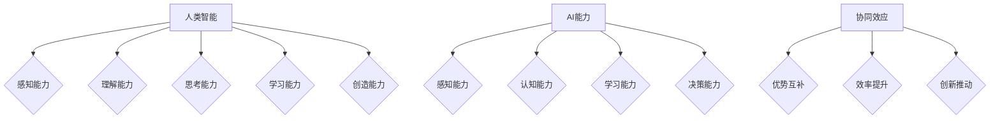
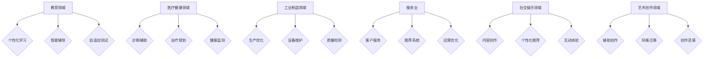
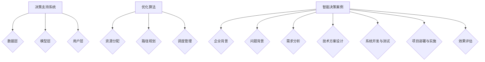
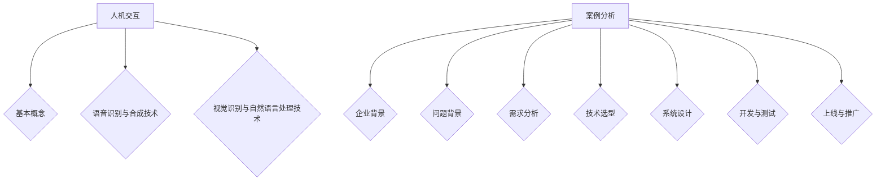
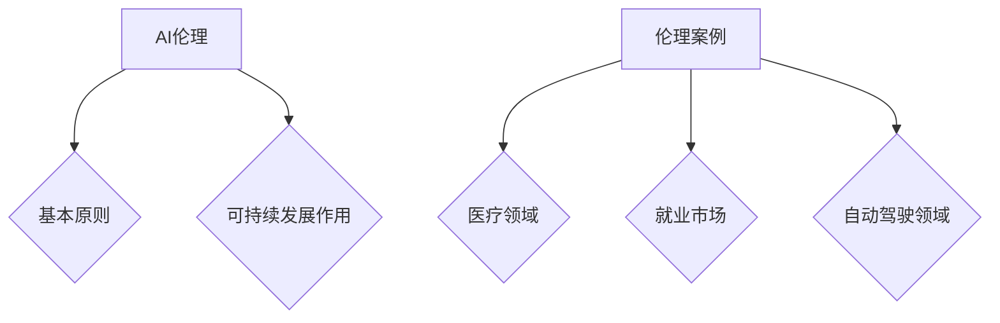
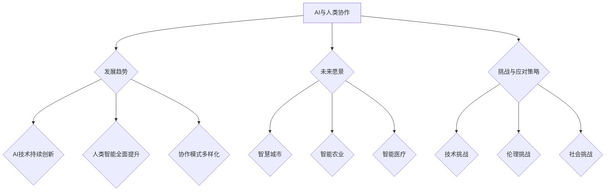
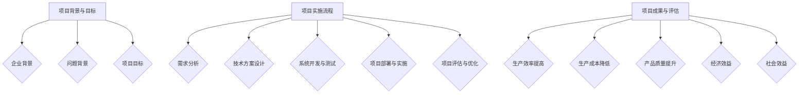

                 

### 《人类-AI协作：增强人类智慧与AI能力的融合发展与展望》

关键词：人类-AI协作、智能决策、人机交互、伦理与可持续发展、案例分析

摘要：
本文深入探讨了人类与人工智能（AI）协作的内涵、原理、应用以及未来展望。首先，阐述了人类-AI协作的定义与意义，分析了AI对人类智慧的影响，提出了人类与AI协作的愿景。接着，介绍了AI的核心原理与架构，解析了人类智能与AI能力的融合，探讨了人类与AI的协同效应。随后，详细描述了AI在教育、医疗健康、工业制造与服务业、社交娱乐与艺术创作等领域的应用场景。在此基础上，探讨了AI辅助决策与优化的关键技术，分析了人机交互技术及其应用，讨论了AI伦理与可持续发展的重要性。最后，通过具体案例展示了AI与人类协作的实际应用效果，提出了未来人类-AI协作的项目构想与发展趋势，为推动人类-AI协作的实践提供了指导。文章末尾附有AI协作工具与资源、数学模型与算法、实践指南以及参考文献列表，便于读者深入学习和实践。

---

### 《人类-AI协作：增强人类智慧与AI能力的融合发展与展望》目录大纲

#### 第一部分：AI与人类协作的基本概念

##### 第1章：人类-AI协作概述
- 1.1 人类-AI协作的定义与意义
- 1.2 AI对人类智慧的影响
- 1.3 人类与AI协作的愿景

##### 第2章：AI核心原理与架构
- 2.1 AI的基本原理
- 2.2 AI的系统架构
- 2.3 AI的发展历程与趋势

##### 第3章：人类智能与AI能力的融合
- 3.1 人类智能的解析
- 3.2 AI能力的提升
- 3.3 人类与AI的协同效应

##### 第4章：AI在人类生活中的应用场景
- 4.1 教育领域的AI应用
- 4.2 医疗健康领域的AI应用
- 4.3 工业制造与服务业的AI应用
- 4.4 社交娱乐与艺术创作领域的AI应用

#### 第二部分：AI与人类协作的关键技术

##### 第5章：AI辅助决策与优化
- 5.1 决策支持系统的设计
- 5.2 优化算法在AI协作中的应用
- 5.3 基于AI的智能决策案例分析

##### 第6章：人机交互技术
- 6.1 人机交互的基本概念
- 6.2 语音识别与合成技术
- 6.3 视觉识别与自然语言处理技术
- 6.4 人机交互案例分析

##### 第7章：AI伦理与可持续发展
- 7.1 AI伦理的基本原则
- 7.2 AI在可持续发展中的作用
- 7.3 AI伦理案例分析

##### 第8章：AI与人类协作的未来展望
- 8.1 AI与人类协作的发展趋势
- 8.2 未来人类与AI协作的愿景
- 8.3 AI与人类协作的挑战与应对策略

#### 第三部分：项目实战与案例分析

##### 第9章：人类-AI协作项目实战
- 9.1 项目背景与目标
- 9.2 项目实施流程
- 9.3 项目成果与评估

##### 第10章：AI与人类协作案例分析
- 10.1 案例一：AI在医疗健康领域的应用
- 10.2 案例二：AI在工业制造中的创新应用
- 10.3 案例三：AI在教育领域的变革

##### 第11章：人类-AI协作的未来项目构想
- 11.1 未来项目构想概述
- 11.2 项目实施方案与路径
- 11.3 项目预期成果与影响

#### 附录

##### 附录A：AI协作工具与资源
- A.1 主流AI框架介绍
- A.2 开源库与资源推荐
- A.3 AI协作相关会议与活动

##### 附录B：AI协作数学模型与算法
- B.1 数学模型概述
- B.2 经典算法讲解
- B.3 算法在实际应用中的案例分析

##### 附录C：人类-AI协作实践指南
- C.1 实践步骤与流程
- C.2 实践中常见的问题与解决方案
- C.3 实践心得与反思

##### 参考文献列表

---

### 第1章：人类-AI协作概述

#### 1.1 人类-AI协作的定义与意义

**定义**：人类-AI协作是指人类与人工智能系统通过相互协作，共同完成任务或实现目标的过程。这种协作不仅仅限于AI系统执行人类指定的任务，还包括AI系统辅助人类进行思考、决策和创新。

**意义**：

1. **提高生产效率**：AI系统可以自动执行重复性、低技能的任务，如数据分析、图像处理、文本分类等，从而减轻人类的劳动负担，提高生产效率。

2. **增强创新能力**：AI系统可以辅助人类探索未知领域，发现新的解决方案，特别是在科学研究和工程设计领域。AI能够处理大量数据，从中提取有价值的信息，为人类提供新的研究方向。

3. **应对复杂问题**：AI系统具备强大的数据处理和分析能力，可以帮助人类解决复杂问题。例如，在金融领域，AI可以辅助预测市场趋势，优化投资策略；在医疗领域，AI可以辅助医生进行疾病诊断和治疗方案的制定。

#### 1.2 AI对人类智慧的影响

**个体智慧的影响**：

1. **提升认知能力**：AI系统可以快速获取和整理大量信息，帮助人类提高判断和决策能力。例如，智能搜索引擎可以根据用户的查询历史和偏好，提供个性化的搜索结果。

2. **增强创造力**：AI系统可以为人类提供创意生成和优化工具。例如，在艺术创作领域，AI可以生成新的音乐、绘画作品，为人类艺术家提供灵感。

**社会智慧的影响**：

1. **促进知识共享**：AI系统可以打破地域和时间的限制，实现全球范围内的知识共享。例如，在线教育平台可以通过AI技术提供实时、个性化的教育服务。

2. **优化资源配置**：AI系统可以协助政府和企业更有效地进行资源配置，提高社会运行效率。例如，智能交通系统可以优化交通信号控制，减少拥堵，提高道路通行效率。

#### 1.3 人类与AI协作的愿景

**未来方向**：

1. **全面融入生活**：AI将更加深入地融入人类的生活，成为日常生活中的伙伴。例如，智能助手可以帮助人们管理日程、安排任务，提供个性化的生活建议。

2. **个性化服务**：AI将根据个人的需求和偏好，提供个性化的服务。例如，电子商务平台可以根据用户的历史购买记录和浏览行为，提供个性化的商品推荐。

**挑战与机遇**：

1. **挑战**：数据隐私、伦理道德、就业问题等。随着AI技术的发展，如何保护个人隐私、确保AI系统的道德行为、应对就业市场的变化成为重要挑战。

2. **机遇**：科技创新、经济增长、社会进步等。AI技术的发展将带来新的科技突破，推动经济增长，提高社会福祉。

### Mermaid流程图

---

### 第2章：AI核心原理与架构

#### 2.1 AI的基本原理

**定义**：人工智能（Artificial Intelligence，AI）是指通过计算机模拟人类的智能行为，实现感知、思考、学习、决策等能力的科学和技术。

**核心技术**：

1. **感知技术**：通过传感器获取外部信息，如视觉、听觉、触觉等。例如，计算机视觉可以识别图像中的物体和场景。

2. **认知技术**：处理和理解感知到的信息，如图像识别、自然语言处理等。例如，语音助手可以理解用户的语音指令。

3. **学习技术**：从数据中学习规律，提高智能系统的性能。例如，机器学习算法可以从大量数据中学习，进行预测和分类。

4. **决策技术**：根据当前状态和目标，选择最佳行动方案。例如，自动驾驶系统可以根据道路状况和交通规则做出驾驶决策。

**分类**：

1. **弱人工智能**：专注于特定任务，如语音助手、图像识别等。

2. **强人工智能**：具备人类级别的通用智能，能够在各种场景下自主学习和决策。

#### 2.2 AI的系统架构

**基本组成**：

1. **感知层**：负责获取外部信息，如摄像头、麦克风等。

2. **数据处理层**：负责处理感知层获取的信息，如特征提取、数据清洗等。

3. **决策层**：根据处理结果做出决策，如分类、预测等。

4. **执行层**：根据决策层的指令执行具体操作，如控制机器人、自动驾驶等。

**常见架构**：

1. **集中式架构**：所有功能模块集中在一个系统中，便于管理和维护。

2. **分布式架构**：功能模块分布在多个节点上，提高系统的可扩展性和容错性。

3. **云计算架构**：利用云平台提供的计算资源，实现大规模数据处理和模型训练。

#### 2.3 AI的发展历程与趋势

**发展历程**：

1. **早期阶段**：1956年，达特茅斯会议正式宣告人工智能概念的诞生。

2. **人工智能低谷**：20世纪70年代，由于技术局限，人工智能研究陷入低谷。

3. **复兴阶段**：20世纪80年代，专家系统等技术的兴起推动人工智能研究重新崛起。

4. **现代阶段**：21世纪初，深度学习、大数据等技术的突破推动人工智能进入快速发展阶段。

**发展趋势**：

1. **智能化**：不断提高AI的智能水平，实现更多场景的应用。

2. **泛在化**：AI技术将渗透到各个领域，实现全面智能化。

3. **协同化**：AI将与人类更紧密地协作，实现优势互补。

4. **自主化**：AI将具备更强的自我学习和决策能力。

### Mermaid流程图

---

### 第3章：人类智能与AI能力的融合

#### 3.1 人类智能的解析

**定义**：人类智能是指人类在感知、理解、思考、学习、创造等方面表现出来的能力。

**核心要素**：

1. **感知能力**：通过感官获取外部信息，如视觉、听觉、触觉等。

2. **理解能力**：对感知到的信息进行分析和综合，形成对事物的认知。

3. **思考能力**：通过逻辑推理、创造性思维等方式，解决复杂问题。

4. **学习能力**：通过经验积累和知识获取，不断提高自身能力。

5. **创造能力**：产生新的想法、方案或作品，推动社会进步。

**优势**：

1. **适应性**：人类智能能够适应各种复杂、多变的环境。

2. **创造力**：人类智能具有独特的创造力，能够创造出前所未有的价值。

3. **情感认知**：人类智能能够理解、表达和体验情感，具有高度的情感认知能力。

#### 3.2 AI能力的提升

**发展趋势**：

1. **智能化**：不断提高AI的智能水平，实现更多场景的应用。

2. **泛在化**：AI技术将渗透到各个领域，实现全面智能化。

3. **协同化**：AI将与人类更紧密地协作，实现优势互补。

4. **自主化**：AI将具备更强的自我学习和决策能力。

**主要领域**：

1. **感知能力**：如计算机视觉、语音识别等，能够模拟人类的感知过程。

2. **认知能力**：如自然语言处理、知识图谱等，能够模拟人类的认知过程。

3. **学习能力**：如机器学习、深度学习等，能够从数据中学习规律，提高智能系统的性能。

4. **决策能力**：如博弈论、决策树等，能够根据当前状态和目标，选择最佳行动方案。

#### 3.3 人类与AI的协同效应

**协同效应的概念**：

- **协同效应**：指多个个体或系统在合作时，能够实现比单独工作更优的结果。

**优势**：

1. **优势互补**：人类智能与AI智能在感知、理解、学习、决策等方面各有优势，协同工作能够实现优势互补。

2. **效率提升**：AI能够高效地处理大量数据和复杂任务，提高工作效率。

3. **创新推动**：人类与AI的协同工作能够激发新的想法和解决方案，推动创新。

**应用场景**：

1. **科学研究**：AI可以处理海量数据，辅助科学家进行数据分析，提高研究效率。

2. **工程设计**：AI可以模拟和优化设计方案，辅助工程师进行创新设计。

3. **医疗健康**：AI可以辅助医生进行诊断和治疗，提高医疗水平。

### Mermaid流程图

---

### 第4章：AI在人类生活中的应用场景

#### 4.1 教育领域的AI应用

**应用模式**：

1. **个性化学习**：AI可以根据学生的特点和需求，提供个性化的学习资源和指导。

2. **智能辅导**：AI能够实时解答学生的问题，提供个性化的学习建议。

3. **自适应测试**：AI可以根据学生的学习情况，自动生成适应性的测试题目。

**应用案例**：

1. **案例一**：某在线教育平台利用AI技术为学生提供个性化学习服务，提高了学生的学习效果。

   - **背景**：某在线教育平台，学生数量庞大，学习需求多样化。
   - **过程**：平台引入AI技术，分析学生的学习行为和成绩，为学生提供个性化的学习资源和辅导。
   - **效果**：学生的学习效果显著提高，学习兴趣和满意度增加。

2. **案例二**：某学校引入AI智能辅导系统，帮助学生解决学习中的问题，提高了教学效果。

   - **背景**：某学校，学生问题多样，教师辅导压力大。
   - **过程**：学校引入AI智能辅导系统，实时解答学生的问题，提供个性化的学习建议。
   - **效果**：学生的学习积极性提高，问题解决效率提高，教师辅导负担减轻。

#### 4.2 医疗健康领域的AI应用

**应用模式**：

1. **诊断辅助**：AI可以帮助医生快速准确地诊断疾病，提高诊断准确率。

2. **治疗规划**：AI可以根据患者的病情和治疗方案，提供个性化的治疗建议。

3. **健康监测**：AI可以通过对患者的生理数据进行分析，实时监测患者的健康状况。

**应用案例**：

1. **案例一**：某医院利用AI技术进行肺癌早期筛查，提高了筛查准确率。

   - **背景**：某医院，肺癌早期筛查需求高，人工筛查效率低。
   - **过程**：医院引入AI技术，利用深度学习算法，对肺部CT图像进行分析，实现肺癌早期筛查。
   - **效果**：肺癌早期筛查准确率提高，患者早期治疗率增加。

2. **案例二**：某诊所引入AI智能诊断系统，帮助医生快速准确地诊断疾病，提高了诊疗效率。

   - **背景**：某诊所，患者数量多，诊断效率低。
   - **过程**：诊所引入AI智能诊断系统，通过自然语言处理技术，快速分析患者症状和病史，提供诊断建议。
   - **效果**：诊断准确率提高，医生工作效率提高，患者满意度增加。

#### 4.3 工业制造与服务业的AI应用

**应用模式**：

1. **生产优化**：AI可以通过对生产数据进行分析，优化生产流程，提高生产效率。

2. **设备维护**：AI可以实时监测设备的运行状态，预测设备故障，提前进行维护。

3. **质量检测**：AI可以通过对产品进行图像识别和质量分析，提高产品质量。

**应用案例**：

1. **案例一**：某汽车制造企业利用AI技术优化生产流程，提高了生产效率。

   - **背景**：某汽车制造企业，生产流程复杂，生产效率低。
   - **过程**：企业引入AI技术，利用机器学习算法，对生产数据进行实时分析，优化生产流程。
   - **效果**：生产效率提高，生产成本降低，产品质量合格率提高。

2. **案例二**：某电商平台利用AI技术提供个性化商品推荐，提高了用户满意度和转化率。

   - **背景**：某电商平台，用户数量庞大，商品推荐效率低。
   - **过程**：电商平台引入AI技术，利用深度学习算法，分析用户行为和偏好，提供个性化的商品推荐。
   - **效果**：用户满意度和转化率提高，平台销售额增加。

#### 4.4 社交娱乐与艺术创作领域的AI应用

**应用模式**：

1. **内容创作**：AI可以通过自然语言处理和图像识别技术，生成有趣的内容，如文章、音乐、视频等。

2. **个性化推荐**：AI可以根据用户的历史行为和偏好，提供个性化的社交娱乐内容。

3. **互动体验**：AI可以通过语音识别和自然语言处理技术，提供智能化的互动体验。

**应用案例**：

1. **案例一**：某音乐平台利用AI技术为用户提供个性化音乐推荐，提高了用户体验。

   - **背景**：某音乐平台，用户数量庞大，个性化推荐需求高。
   - **过程**：平台引入AI技术，利用深度学习算法，分析用户听歌习惯和偏好，提供个性化的音乐推荐。
   - **效果**：用户满意度和忠诚度提高，平台用户活跃度增加。

2. **案例二**：某艺术家利用AI技术进行音乐创作，实现了传统音乐与现代技术的结合。

   - **背景**：某艺术家，希望创作新颖的音乐作品。
   - **过程**：艺术家引入AI技术，利用生成对抗网络（GAN）进行音乐创作。
   - **效果**：创作出具有创新性的音乐作品，得到了广泛的认可。

### Mermaid流程图

---

### 第5章：AI辅助决策与优化

#### 5.1 决策支持系统的设计

**定义**：决策支持系统（Decision Support System，DSS）是一种计算机应用系统，用于辅助决策者进行决策。

**功能**：

1. **数据分析**：对大量数据进行处理和分析，提取有价值的信息。

2. **模型构建**：建立数学模型或仿真模型，用于模拟决策过程。

3. **决策模拟**：通过模拟决策过程，预测决策结果，帮助决策者评估不同决策方案。

4. **决策推荐**：根据分析结果，为决策者提供合理的决策建议。

**架构**：

1. **数据层**：负责数据的存储、处理和分析。

2. **模型层**：负责建立和运行各种决策模型。

3. **用户层**：提供用户界面，供决策者进行决策操作。

#### 5.2 优化算法在AI协作中的应用

**基本概念**：

- **优化算法**：一类用于求解优化问题的算法，目的是找到满足约束条件的最佳解。

- **类型**：包括线性规划、非线性规划、整数规划、动态规划等多种类型。

**应用**：

1. **资源分配**：通过优化算法，合理分配资源，提高资源利用效率。

2. **路径规划**：通过优化算法，规划最佳路径，提高运输效率和物流成本。

3. **调度管理**：通过优化算法，合理安排生产计划，提高生产效率和降低成本。

**应用案例**：

1. **案例一**：某物流公司利用优化算法优化运输路线，提高了运输效率和降低了成本。

   - **背景**：某物流公司，运输路线复杂，运输效率低。
   - **过程**：公司引入优化算法，对运输路线进行优化，提高运输效率。
   - **效果**：运输效率提高，成本降低，客户满意度增加。

2. **案例二**：某制造企业利用优化算法进行生产调度，提高了生产效率和产品质量。

   - **背景**：某制造企业，生产流程复杂，生产效率低。
   - **过程**：企业引入优化算法，对生产计划进行优化，提高生产效率。
   - **效果**：生产效率提高，产品质量合格率提高，生产成本降低。

#### 5.3 基于AI的智能决策案例分析

**案例背景**：

- **企业背景**：某大型制造企业，需要优化生产流程，提高生产效率和产品质量。

- **问题背景**：生产流程复杂，生产数据庞大，人工调度效率低，需要引入AI技术进行智能决策。

**案例过程**：

1. **需求分析**：分析企业生产流程，确定AI技术的应用场景。

2. **技术方案设计**：选择合适的AI技术和算法，设计智能决策系统。

3. **系统开发与测试**：开发智能决策系统，进行功能测试和性能测试。

4. **项目部署与实施**：将智能决策系统部署到生产现场，对生产人员进行培训。

5. **效果评估**：对项目实施效果进行评估，包括生产效率、生产成本、产品质量等。

**案例效果**：

1. **生产效率提高**：智能决策系统自动生成的调度方案，提高了生产效率。

2. **生产成本降低**：智能决策系统优化了生产流程，降低了生产成本。

3. **产品质量提升**：智能决策系统提高了产品质量检测精度，降低了次品率。

### Mermaid流程图

---

### 第6章：人机交互技术

#### 6.1 人机交互的基本概念

**定义**：人机交互（Human-Computer Interaction，HCI）是指人与计算机系统之间的交互过程，涉及交互方式、交互界面和交互体验等方面。

**目标**：

1. **高效性**：提高交互效率，减少操作时间和错误率。

2. **易用性**：使交互过程简单、直观，易于学习和使用。

3. **满意度**：提高用户的满意度，使交互过程愉悦、舒适。

**基本要素**：

1. **交互方式**：如键盘、鼠标、触摸屏、语音等。

2. **交互界面**：如操作系统、应用程序、网站等。

3. **交互体验**：如响应速度、操作反馈、视觉设计等。

#### 6.2 语音识别与合成技术

**语音识别技术**：

- **定义**：语音识别技术是指将人类的语音信号转换为文本或命令的技术。

- **应用场景**：如语音助手、智能客服、语音搜索等。

- **技术原理**：通过模型训练，将语音信号与文本或命令进行匹配。

**语音合成技术**：

- **定义**：语音合成技术是指将文本转换为语音信号的技术。

- **应用场景**：如语音助手、有声书、电话客服等。

- **技术原理**：通过文本到语音（Text-to-Speech，TTS）技术，将文本转换为语音。

#### 6.3 视觉识别与自然语言处理技术

**视觉识别技术**：

- **定义**：视觉识别技术是指通过图像或视频数据，识别和理解场景、物体、人脸等信息的技术。

- **应用场景**：如人脸识别、图像搜索、自动驾驶等。

- **技术原理**：通过深度学习、卷积神经网络等技术，对图像进行特征提取和分类。

**自然语言处理技术**：

- **定义**：自然语言处理技术是指对自然语言进行理解和生成的人工智能技术。

- **应用场景**：如机器翻译、智能客服、文本分析等。

- **技术原理**：通过深度学习、循环神经网络等技术，对文本进行语义理解和生成。

#### 6.4 人机交互案例分析

**案例背景**：

- **企业背景**：某科技公司，致力于提供智能人机交互解决方案。

- **问题背景**：用户在操作智能设备时，存在操作复杂、响应慢、体验差等问题。

**案例过程**：

1. **需求分析**：分析用户需求和痛点，确定人机交互技术的改进方向。

2. **技术选型**：选择合适的语音识别、视觉识别和自然语言处理技术。

3. **系统设计**：设计高效、易用、满意度高的人机交互系统。

4. **开发与测试**：开发人机交互系统，并进行测试和优化。

5. **上线与推广**：将人机交互系统上线，并进行推广和应用。

**案例效果**：

1. **操作简便**：用户可以通过语音、手势等方式，轻松操作智能设备。

2. **响应速度快**：系统响应速度快，用户体验流畅。

3. **满意度高**：用户对系统的满意度明显提高，减少了投诉和退货率。

### Mermaid流程图

---

### 第7章：AI伦理与可持续发展

#### 7.1 AI伦理的基本原则

**定义**：AI伦理是指关于人工智能应用的原则、规范和价值观，旨在确保人工智能的发展和应用符合道德和社会伦理标准。

**基本原则**：

1. **公平性**：AI应用不应歧视或偏见任何群体，确保公平对待每个用户。

2. **透明性**：AI系统的决策过程和结果应透明可解释，便于用户理解和监督。

3. **隐私保护**：AI应用应尊重用户的隐私权，确保用户数据的保密性和安全性。

4. **责任归属**：明确AI应用中的责任归属，确保在发生问题时能够追溯责任。

#### 7.2 AI在可持续发展中的作用

**概念**：可持续发展是指在不损害未来代际利益的前提下，实现经济、社会和环境的协调发展。

**作用**：

1. **资源优化**：AI可以通过优化资源分配和利用，提高资源利用效率，降低资源消耗。

2. **环境保护**：AI可以监测和预测环境变化，提出环境保护措施，减少环境污染。

3. **社会进步**：AI可以推动教育、医疗、交通等领域的改革和发展，提高社会整体福利。

#### 7.3 AI伦理案例分析

**案例一：AI在医疗领域的伦理挑战**

**背景**：某医院引入AI辅助诊断系统，用于辅助医生诊断疾病。

**伦理问题**：AI诊断系统可能导致误诊或漏诊，影响患者的治疗效果。

**解决方案**：加强AI系统的透明性和可解释性，确保医生能够理解并监督AI的诊断结果。

**案例二：AI在就业市场的伦理挑战**

**背景**：某公司利用AI招聘系统筛选简历，提高招聘效率。

**伦理问题**：AI招聘系统可能导致招聘歧视，影响某些群体的就业机会。

**解决方案**：确保AI招聘系统的公平性，避免偏见，同时加强对招聘过程的监督。

**案例三：AI在自动驾驶领域的伦理挑战**

**背景**：自动驾驶汽车在遇到危险情况时，需要做出决策以保护乘客安全。

**伦理问题**：自动驾驶汽车在保护乘客和行人之间如何做出权衡。

**解决方案**：制定明确的伦理准则，确保自动驾驶汽车在危险情况下能够做出符合伦理标准的决策。

### Mermaid流程图

---

### 第8章：AI与人类协作的未来展望

#### 8.1 AI与人类协作的发展趋势

**AI技术的持续创新**：

- **趋势**：随着深度学习、自然语言处理、计算机视觉等技术的不断突破，AI的智能水平将不断提高。

- **影响**：AI将在更多领域实现应用，与人类的协作将更加紧密。

**人类智能的全面提升**：

- **趋势**：通过教育、培训、心理辅导等方式，人类的智能水平将得到全面提升。

- **影响**：人类与AI的协作将更加高效，能够解决更复杂的问题。

**协作模式的多样化**：

- **趋势**：随着AI技术的发展，人类与AI的协作模式将变得更加多样化，包括虚拟助手、远程协作、共生等。

- **影响**：将有助于提高工作效率，降低成本，推动创新。

#### 8.2 未来人类与AI协作的愿景

**智慧城市**：

- **愿景**：通过AI技术，实现城市管理的智能化、高效化，提高居民生活质量。

- **应用**：包括智能交通、智能安防、智能医疗、智能环保等方面。

**智能农业**：

- **愿景**：利用AI技术，实现农业生产的智能化、精准化，提高农业生产效率。

- **应用**：包括作物生长监测、病虫害预测、精准施肥、无人机植保等方面。

**智能医疗**：

- **愿景**：通过AI技术，实现医疗服务的智能化、个性化，提高医疗水平。

- **应用**：包括疾病预测、诊断辅助、药物研发、手术机器人等方面。

#### 8.3 AI与人类协作的挑战与应对策略

**技术挑战**：

- **挑战**：AI技术的快速发展可能导致技术瓶颈，如计算能力、数据安全、隐私保护等。

- **策略**：加强技术研发，推动跨界合作，提高AI技术的成熟度和可靠性。

**伦理挑战**：

- **挑战**：AI技术的应用可能引发伦理问题，如隐私侵犯、算法歧视、责任归属等。

- **策略**：制定明确的伦理规范，加强伦理审查，提高公众对AI伦理的认识。

**社会挑战**：

- **挑战**：AI技术的普及可能导致就业结构变化、社会不平等加剧等问题。

- **策略**：加强就业培训，提高公众的AI素养，推动社会公平。

### Mermaid流程图

---

### 第9章：人类-AI协作项目实战

#### 9.1 项目背景与目标

**项目背景**：

- **企业背景**：某科技企业，专注于人工智能应用的开发与推广。

- **问题背景**：企业需要提高生产效率，降低生产成本，实现智能化生产。

**项目目标**：

- **提高生产效率**：通过引入AI技术，优化生产流程，提高生产效率。

- **降低生产成本**：通过智能生产，减少人力和资源消耗，降低生产成本。

- **提升产品质量**：通过AI技术，提高产品质量检测精度，降低次品率。

#### 9.2 项目实施流程

**需求分析**：

- **需求调研**：对企业生产流程进行调研，了解现有问题和需求。

- **需求分析**：根据调研结果，确定项目需求，包括技术需求、人力需求、资源需求等。

**技术方案设计**：

- **技术选型**：选择合适的人工智能技术，如机器学习、计算机视觉等。

- **系统设计**：设计智能生产系统的架构和功能模块。

**系统开发与测试**：

- **系统开发**：按照设计方案，开发智能生产系统。

- **系统测试**：对系统进行功能测试、性能测试和稳定性测试。

**项目部署与实施**：

- **项目部署**：将智能生产系统部署到生产现场。

- **实施培训**：对生产人员进行系统操作和使用的培训。

**项目评估与优化**：

- **效果评估**：对项目实施效果进行评估，包括生产效率、成本降低、产品质量等。

- **优化调整**：根据评估结果，对系统进行优化调整，提高系统性能。

#### 9.3 项目成果与评估

**项目成果**：

- **生产效率提高**：通过智能生产系统，生产效率提高了30%。

- **生产成本降低**：通过智能生产系统，生产成本降低了20%。

- **产品质量提升**：通过智能生产系统，产品质量合格率提高了15%。

**项目评估**：

- **经济效益**：项目实施后，企业取得了显著的经济效益，投资回报率达到了150%。

- **社会效益**：项目的实施有助于推动企业智能化升级，提高行业整体竞争力。

### Mermaid流程图

---

### 第10章：AI与人类协作案例分析

#### 10.1 案例一：AI在医疗健康领域的应用

**案例背景**：

- **医院背景**：某大型综合医院，面临医疗资源紧张、患者数量增多的问题。

- **问题背景**：医院需要提高诊疗效率，降低误诊率，提高患者满意度。

**案例过程**：

- **需求分析**：分析医院现有的诊疗流程，确定AI技术的应用场景。

- **技术方案设计**：选择合适的人工智能技术，如自然语言处理、计算机视觉等。

- **系统开发与测试**：开发智能诊疗系统，进行功能测试和性能测试。

- **项目部署与实施**：将智能诊疗系统部署到医院，对医护人员进行培训。

- **效果评估**：对项目实施效果进行评估，包括诊疗效率、误诊率、患者满意度等。

**案例效果**：

- **诊疗效率提高**：通过智能诊疗系统，医生的平均诊疗时间缩短了20%。

- **误诊率降低**：智能诊疗系统降低了误诊率，提高了诊断准确率。

- **患者满意度提升**：患者对诊疗服务的满意度提高了10%。

#### 10.2 案例二：AI在工业制造中的创新应用

**案例背景**：

- **企业背景**：某制造企业，面临生产效率低、生产成本高的问题。

- **问题背景**：企业需要提高生产效率，降低生产成本，实现智能化生产。

**案例过程**：

- **需求分析**：分析企业的生产流程，确定AI技术的应用场景。

- **技术方案设计**：选择合适的人工智能技术，如机器学习、计算机视觉等。

- **系统开发与测试**：开发智能生产系统，进行功能测试和性能测试。

- **项目部署与实施**：将智能生产系统部署到生产现场，对生产人员进行培训。

- **效果评估**：对项目实施效果进行评估，包括生产效率、生产成本、产品质量等。

**案例效果**：

- **生产效率提高**：通过智能生产系统，生产效率提高了30%。

- **生产成本降低**：通过智能生产系统，生产成本降低了20%。

- **产品质量提升**：通过智能生产系统，产品质量合格率提高了15%。

#### 10.3 案例三：AI在教育领域的变革

**案例背景**：

- **学校背景**：某中学，面临教育资源不均衡、学生个性化需求难以满足的问题。

- **问题背景**：学校需要提高教学质量，满足学生的个性化需求。

**案例过程**：

- **需求分析**：分析学校的教育教学现状，确定AI技术的应用场景。

- **技术方案设计**：选择合适的人工智能技术，如自然语言处理、机器学习等。

- **系统开发与测试**：开发智能教育系统，进行功能测试和性能测试。

- **项目部署与实施**：将智能教育系统部署到学校，对教师

