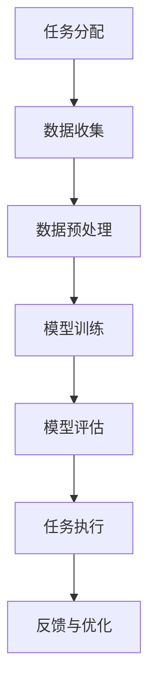

                 

## 《人类-AI协作：增强人类潜能与AI能力的融合发展趋势展望与挑战》

### 关键词
- 人类-AI协作
- 潜能增强
- AI能力融合
- 发展趋势
- 挑战与对策

### 摘要
本文深入探讨了人类与人工智能（AI）协作的现状、发展趋势及面临的挑战。通过分析AI与人类潜能增强的关系，AI能力的融合过程，以及人类-AI协作的道德、安全和社会问题，我们展望了未来人类-AI协作的可能方向，并提出了一系列对策。

## 《人类-AI协作：增强人类潜能与AI能力的融合发展趋势展望与挑战》目录大纲

### 第一部分：AI与人类协作概述

#### 第1章: AI与人类协作的基本概念

#### 第2章: 人类潜能的增强

### 第二部分：AI能力的融合

#### 第3章: AI能力的概述

#### 第4章: AI与人类认知的融合

#### 第5章: AI与人类情感的融合

### 第三部分：人类-AI协作的发展趋势与挑战

#### 第6章: 人类-AI协作的发展趋势

#### 第7章: 人类-AI协作的挑战与对策

### 附录

#### 附录A: 人类-AI协作常用工具与资源

#### 附录B: Mermaid 流程图

#### 附录C: 伪代码与数学模型

#### 附录D: 项目实战案例

#### 附录E: 代码实现与解析

#### 附录F: 开发环境搭建

#### 附录G: 源代码与资源

---

接下来，我们将逐步进入正文部分，详细介绍每个章节的核心内容。

### 第一部分：AI与人类协作概述

#### 第1章: AI与人类协作的基本概念

#### 第2章: 人类潜能的增强

---

## 第一部分：AI与人类协作概述

### 第1章: AI与人类协作的基本概念

**1. AI技术介绍**

人工智能（Artificial Intelligence，简称AI）是计算机科学的一个分支，旨在使计算机能够执行通常需要人类智能才能完成的任务，如视觉识别、语言理解、决策和问题解决。AI的定义与发展历程可以追溯到20世纪50年代，当时人工智能的概念首次被提出。从早期的符号主义和专家系统，到基于数据的学习算法，再到如今的深度学习和强化学习，AI技术经历了长足的发展。

**AI的类型与应用场景**

AI主要可以分为以下几种类型：

- **符号主义（Symbolic AI）**：基于逻辑和符号操作，例如专家系统。
- **统计学习（Statistical Learning）**：通过大量数据训练模型，如线性回归、决策树和支持向量机。
- **深度学习（Deep Learning）**：使用多层神经网络，如卷积神经网络（CNN）和循环神经网络（RNN）。
- **强化学习（Reinforcement Learning）**：通过试错和奖励机制来学习策略。

AI的应用场景非常广泛，涵盖了从医疗诊断到自动驾驶，从自然语言处理到图像识别等多个领域。例如，在医疗领域，AI可以用于疾病诊断、个性化治疗和药物研发；在交通领域，AI可以用于智能交通管理和自动驾驶车辆。

**2. 人类-AI协作的概念**

人类与AI协作是指人类和人工智能系统共同工作，以实现更高效、更准确的任务完成。协作的定义与形式包括以下几个方面：

- **任务分配**：确定人类和AI各自负责的任务部分。
- **信息交换**：确保人类和AI之间能够有效地交换数据和知识。
- **协同决策**：结合人类的专业知识和AI的算法优势，做出最优决策。

**3. 人类与AI协作的优势与挑战**

人类与AI协作的优势主要包括：

- **能力互补**：AI擅长处理大量数据和复杂计算，而人类擅长理解和创造性思考。
- **效率提升**：AI可以24/7无休工作，显著提高工作效率。
- **决策支持**：AI可以提供数据分析和预测，为人类决策提供有力支持。

然而，人类与AI协作也面临一些挑战：

- **技能转变**：随着AI的普及，一些传统的工作可能会被自动化，需要人类转变技能。
- **安全与隐私**：AI系统的可靠性和隐私保护是一个重要问题。
- **道德与伦理**：如何确保AI的行为符合道德和伦理标准，是协作中需要考虑的问题。

### 第2章: 人类潜能的增强

**1. 人类潜能的概述**

人类潜能是指人类在认知、情感、体能等方面具有的发展潜力。潜能的定义与测量是一个复杂的问题，通常涉及心理学、神经科学和认知科学等多个领域。

**潜能的定义与测量**

- **定义**：潜能通常指的是人类在某些特定领域或能力上能够达到的最高水平。
- **测量**：潜能的测量方法包括标准化测试、能力评估、以及行为观察等。

**潜能发挥的影响因素**

- **遗传因素**：遗传对潜能有一定的影响，但并非决定性因素。
- **环境因素**：良好的教育、训练和社交环境对潜能的发挥至关重要。
- **个人特质**：个人的动机、性格和态度也会影响潜能的发挥。

**2. AI技术在潜能增强中的应用**

AI技术在增强人类潜能方面具有广泛的应用：

- **个人能力提升**：通过智能推荐系统，AI可以帮助个体找到最适合的学习资源，提高学习效率。
- **团队合作效率提升**：AI可以分析团队沟通模式，优化工作流程，提高团队合作效率。

**3. 实例分析**

**成功案例分享**：

- **医疗领域**：AI在辅助医生进行疾病诊断和治疗规划中发挥了重要作用，显著提高了医疗效率和质量。
- **教育领域**：个性化学习系统可以根据学生的学习进度和能力，提供定制化的学习资源，提高学习效果。

**失败案例探讨**：

- **自动化驾驶**：尽管自动驾驶技术在不断进步，但仍然存在许多技术挑战和安全问题，需要进一步研究和改进。

### 第一部分总结

AI与人类协作的基本概念和人类潜能的增强是理解人类-AI协作的基础。在接下来的章节中，我们将进一步探讨AI能力的融合过程，以及人类-AI协作所面临的道德、安全和社会挑战。通过逻辑清晰的推理和分析，我们将展望人类-AI协作的未来发展趋势，并提出应对挑战的对策。

---

在本文的第一部分，我们深入探讨了AI与人类协作的基本概念，以及人类潜能的增强。通过介绍AI技术的发展历程、类型和应用场景，我们了解了AI技术的多样性和广泛性。同时，通过讨论人类潜能的定义与测量，以及AI技术在潜能增强中的应用，我们看到了AI如何帮助人类在认知、情感和体能等方面达到更高的水平。

在接下来的章节中，我们将进一步探讨AI能力的融合过程，特别是AI与人类认知和情感的融合。我们将详细分析AI能力的定义、评估方法和未来趋势，以及AI与人类认知、情感的融合方式。此外，我们还将讨论人类-AI协作所面临的道德、安全和社会挑战，并提出相应的对策。

通过对这些问题的深入探讨，我们希望能够为读者提供一个全面、系统的理解，帮助大家更好地把握人类-AI协作的未来发展趋势。让我们一起继续探索这一激动人心的领域！

### 第二部分：AI能力的融合

#### 第3章: AI能力的概述

#### 第4章: AI与人类认知的融合

#### 第5章: AI与人类情感的融合

---

## 第二部分：AI能力的融合

### 第3章: AI能力的概述

**1. AI能力的定义**

AI能力是指人工智能系统在特定任务或领域中的表现能力，通常包括以下方面：

- **计算能力**：AI系统进行复杂计算和数据处理的能力，例如深度学习算法和大数据分析。
- **学习能力**：AI系统通过数据学习和经验积累，不断改进自身表现的能力。
- **决策能力**：AI系统在不确定环境中做出决策的能力，通常基于概率模型和优化算法。
- **交互能力**：AI系统与人类或其他系统进行有效交互的能力，例如自然语言处理和图像识别。

**2. AI能力的评估**

评估AI能力的目的是了解系统在特定任务上的表现，以及如何优化和改进。常见的评估方法包括：

- **性能指标**：根据任务性质，设定相应的性能指标，如准确率、召回率和F1分数等。
- **实验比较**：通过对比不同AI系统在相同任务上的表现，评估其能力。
- **人类评价**：邀请专家或用户对AI系统的表现进行主观评价，以获得更全面的评估。

**3. AI能力的未来趋势**

随着技术的不断进步，AI能力的未来趋势将主要体现在以下几个方面：

- **计算能力的提升**：硬件技术的发展将使得AI系统拥有更强的计算能力，能够处理更复杂的任务。
- **学习能力的增强**：通过更有效的学习算法和更多的数据，AI系统的学习能力将得到显著提升。
- **决策能力的优化**：随着不确定环境下的决策问题日益复杂，AI系统将在决策能力上实现更大突破。
- **交互能力的改进**：自然语言处理和图像识别技术的发展将使得AI系统与人类和其他系统的交互更加顺畅和自然。

### 第4章: AI与人类认知的融合

**1. 人类认知概述**

人类认知是指人类获取、处理、存储和应用信息的过程。认知过程包括感知、记忆、思考、判断和决策等多个方面。主要理论包括：

- **行为主义理论**：强调外部环境和刺激对认知行为的影响。
- **认知心理学理论**：关注内部心理过程，如记忆、注意和问题解决。
- **连接主义理论**：通过神经网络模拟人类大脑的运作方式，强调信息处理中的并行和分布式特征。

**2. AI与人类认知的融合**

AI与人类认知的融合是指利用AI技术来增强和扩展人类的认知能力。融合的方式与实现包括：

- **数据支持**：通过大数据分析和机器学习，AI可以为人类提供更准确的信息和知识。
- **辅助决策**：AI可以分析复杂的数据集，为人类决策提供有力支持。
- **认知增强**：通过智能辅助设备，如智能眼镜和智能手表，AI可以直接增强人类的感知和记忆能力。

**3. AI与人类认知融合的优势与挑战**

**优势：**

- **信息处理效率提升**：AI可以快速处理大量数据，提高人类的信息处理效率。
- **认知负担减轻**：AI可以分担人类的一些认知任务，减轻认知负担，提高生活质量。
- **创新能力增强**：AI可以提供新的视角和解决方案，激发人类的创造力。

**挑战：**

- **隐私和安全问题**：AI系统需要大量个人数据，如何保护用户隐私和安全是重要挑战。
- **伦理和道德问题**：AI的行为和决策是否符合伦理和道德标准，是需要深入探讨的问题。
- **技能转换问题**：随着AI的普及，人类需要不断学习新的技能以适应工作环境的变化。

### 第5章: AI与人类情感的融合

**1. 情感概述**

情感是指人类在认知和社交过程中体验到的各种感受，包括愉悦、愤怒、悲伤和惊讶等。情感的类型和影响包括：

- **情感类型**：基本情感包括愉悦、愤怒、悲伤和惊讶等，还有一些复合情感，如嫉妒、厌恶和焦虑。
- **情感影响**：情感对人类行为、决策和社交互动有重要影响，可以调节情绪状态，影响人际关系。

**2. AI与人类情感的融合**

AI与人类情感的融合是指利用AI技术来识别、理解和模拟人类情感，实现更加人性化的交互。融合的方式与实现包括：

- **情感识别**：通过自然语言处理和图像识别技术，AI可以识别人类语言和表情中的情感信息。
- **情感理解**：通过深度学习和情感模型，AI可以理解复杂情感背后的含义，提供情感支持。
- **情感模拟**：通过生成对抗网络（GAN）等技术，AI可以生成逼真的情感表达，实现情感互动。

**3. AI与人类情感融合的优势与挑战**

**优势：**

- **个性化体验**：AI可以提供个性化情感体验，满足不同用户的需求。
- **心理健康支持**：AI可以提供情感支持和心理咨询，帮助用户缓解压力和情绪困扰。
- **社交互动**：AI可以模拟社交互动，为孤独者提供陪伴和交流的机会。

**挑战：**

- **隐私和安全问题**：AI需要收集和处理大量个人情感数据，如何保护用户隐私和安全是重要挑战。
- **伦理和道德问题**：AI在处理情感信息时是否符合伦理和道德标准，是需要深入探讨的问题。
- **技术限制**：当前AI在情感识别和理解方面仍存在技术限制，无法完全模拟人类情感。

### 第二部分总结

在第二部分，我们深入探讨了AI能力的融合过程，特别是AI与人类认知和情感的融合。通过分析AI能力的定义、评估方法和未来趋势，我们了解了AI在计算、学习、决策和交互等方面的能力，以及这些能力的应用和提升方向。

在探讨AI与人类认知的融合时，我们了解了人类认知的基本理论和过程，以及AI如何增强和扩展人类的认知能力。同时，我们也认识到AI与人类认知融合所带来的优势和挑战。

在讨论AI与人类情感的融合时，我们认识到情感在人类生活中的重要性，以及AI如何识别、理解和模拟情感，实现更加人性化的交互。然而，我们也面临隐私、伦理和技术等方面的挑战。

在接下来的章节中，我们将进一步探讨人类-AI协作的发展趋势与挑战，分析未来人类-AI协作的方向和对策。通过逻辑清晰的推理和分析，我们希望能够为读者提供一个全面、系统的理解，帮助大家更好地把握人类-AI协作的未来发展。

### 第三部分：人类-AI协作的发展趋势与挑战

#### 第6章: 人类-AI协作的发展趋势

#### 第7章: 人类-AI协作的挑战与对策

---

## 第三部分：人类-AI协作的发展趋势与挑战

### 第6章: 人类-AI协作的发展趋势

随着人工智能技术的不断进步，人类-AI协作正朝着更加智能化、个性化、高效化的方向发展。以下是我们对人类-AI协作发展趋势的详细分析：

**1. 未来方向**

**（1）技术进步的推动**

- **算法优化**：AI算法的优化将进一步提高AI的效率和准确度，使其在更多领域发挥更大的作用。
- **硬件升级**：高性能计算硬件的发展将使得AI系统拥有更强的计算能力，能够处理更复杂的任务。
- **数据融合**：跨领域的数据融合将提供更丰富的数据源，为AI系统提供更全面的信息支持。

**（2）社会需求的驱动**

- **个性化服务**：随着人们对个性化服务的需求增加，AI将更加注重根据个体需求提供定制化的解决方案。
- **智能医疗**：医疗领域的智能化需求将持续推动AI技术在诊断、治疗、康复等环节的应用。
- **智能交通**：智能交通系统的建设将提高道路使用效率，减少交通拥堵，提高交通安全。

**2. 应用领域展望**

**（1）当前热门领域**

- **金融科技**：AI在金融领域的应用，如风险管理、信用评估、量化交易等，已经成为热门话题。
- **智能制造**：智能制造通过AI技术实现生产过程的自动化和智能化，提高生产效率和质量。
- **智能医疗**：智能医疗通过AI技术实现疾病的精准诊断和个性化治疗，提高医疗水平。

**（2）未来潜在领域**

- **智慧城市**：智慧城市通过AI技术实现城市管理智能化，包括交通管理、环境监测、公共服务等。
- **农业科技**：AI技术在农业领域的应用，如智能种植、病虫害监测、精准施肥等，将提高农业生产效率。
- **教育科技**：教育科技通过AI技术实现个性化学习、智能评测和智能教学，提高教育质量。

**3. 未来社会影响**

**（1）对职业的影响**

- **职业变革**：AI技术的发展将改变许多传统职业，引发职业结构的变革。
- **技能转型**：为了适应AI时代的工作需求，人们需要不断学习新的技能，实现职业转型。

**（2）对生活的影响**

- **生活质量提升**：AI技术将为人们提供更便捷、更智能的生活体验，提高生活质量。
- **社会分化**：AI技术的应用可能导致社会分化的加剧，需要政策干预和社会支持。

### 第7章: 人类-AI协作的挑战与对策

尽管人类-AI协作具有广阔的发展前景，但也面临诸多挑战。以下是我们对人类-AI协作挑战的详细分析及相应对策：

**1. 道德与伦理问题**

**（1）挑战**

- **隐私保护**：AI系统需要大量个人数据，如何保护用户隐私成为一个重要问题。
- **责任归属**：在AI引发的事故或错误决策中，如何确定责任归属是一个复杂的道德问题。
- **伦理冲突**：AI系统在执行任务时可能会遇到道德冲突，如何确保其行为符合伦理标准是一个挑战。

**（2）对策**

- **隐私保护策略**：通过数据加密、匿名化和隐私保护技术，确保用户数据的安全。
- **责任归属机制**：建立明确的责任归属机制，确保在AI引发的事故或错误决策中责任清晰。
- **伦理指导原则**：制定AI伦理指导原则，确保AI系统的设计和应用符合伦理标准。

**2. 安全性问题**

**（1）挑战**

- **系统安全**：AI系统可能受到网络攻击、恶意软件和其他形式的威胁。
- **数据安全**：AI系统需要处理和存储大量数据，数据泄露或篡改是一个潜在风险。
- **算法偏见**：AI算法可能存在偏见，导致不公正的结果。

**（2）对策**

- **安全防护措施**：采用加密技术、访问控制和安全协议，确保AI系统的安全性。
- **数据安全策略**：通过数据备份、访问控制和数据清洗等方法，确保数据的安全。
- **算法透明度和公平性**：通过提高算法透明度和引入公平性评估机制，减少算法偏见。

**3. 社会问题**

**（1）挑战**

- **就业压力**：AI技术的发展可能导致部分职业的消失，引发就业压力。
- **社会不平等**：AI技术的应用可能加剧社会不平等，影响社会稳定。
- **技术依赖**：随着AI技术的发展，人们可能过度依赖技术，影响自我发展。

**（2）对策**

- **就业转型支持**：提供职业培训和教育资源，帮助人们适应AI时代的工作需求。
- **社会政策调整**：通过税收政策、社会保障和教育培训等手段，减轻社会不平等的影响。
- **自我发展意识**：提高公众对自我发展的认识，鼓励人们不断学习新技能，适应技术变革。

### 第三部分总结

在第三部分，我们详细探讨了人类-AI协作的发展趋势和面临的挑战。通过分析技术进步和社会需求，我们展望了人类-AI协作的未来方向和应用领域。同时，我们也认识到人类-AI协作在道德、安全和社会方面面临的一系列挑战，并提出了一系列对策。

未来，人类-AI协作将继续在技术、应用和社会方面取得突破。通过不断优化技术、完善政策和加强教育培训，我们有望克服这些挑战，实现人类与AI的更好协作。让我们共同期待一个更加智能、高效和公平的未来。

### 附录

#### 附录A: 人类-AI协作常用工具与资源

为了更好地理解人类-AI协作的相关概念和技术，以下是一些常用的工具和资源推荐：

1. **AI工具与平台**
   - **TensorFlow**：由Google开发的开放源代码机器学习框架，适用于深度学习和大数据分析。
   - **PyTorch**：由Facebook开发的深度学习框架，具有简洁和灵活的特点。
   - **Keras**：用于快速构建和迭代深度学习模型的Python库。

2. **开源工具**
   - **scikit-learn**：提供多种机器学习算法和工具，适用于数据挖掘和统计分析。
   - **OpenCV**：开源的计算机视觉库，用于图像处理和计算机视觉任务。
   - **NLTK**：自然语言处理工具包，提供丰富的文本处理和分类工具。

3. **商业平台**
   - **AWS AI**：亚马逊提供的一系列人工智能服务，包括机器学习、自然语言处理和计算机视觉等。
   - **Google Cloud AI**：Google提供的云计算平台，包括预训练模型和API服务。
   - **Microsoft Azure AI**：微软提供的云计算平台，包括机器学习和深度学习服务。

4. **教程与指南**
   - **AI智能教程**：提供AI基础知识和实战项目教程，适合初学者和进阶者。
   - **机器学习中文教程**：系统地介绍机器学习的基础理论、算法和应用。
   - **深度学习教程**：详细讲解深度学习的原理和实践，包括卷积神经网络和循环神经网络等。

5. **论文与研究报告**
   - **arXiv.org**：提供最新的计算机科学、物理学和数学领域的论文和预印本。
   - **NeurIPS**：神经信息处理系统大会，是深度学习和机器学习的顶级会议。
   - **ICML**：国际机器学习会议，是机器学习领域的顶级学术会议。

#### 附录B: Mermaid 流程图

以下是一个简单的Mermaid流程图示例，用于描述AI与人类协作的过程：



#### 附录C: 伪代码与数学模型

**人类潜能增强算法伪代码**

```plaintext
算法：人类潜能增强
输入：用户数据，训练数据
输出：增强后的用户能力

初始化模型参数
for 每个用户数据点 in 用户数据 do
    训练模型 on 用户数据点
    预测用户潜在能力
    根据预测结果调整模型参数
end for
返回增强后的模型参数
```

**AI情感识别与融合数学模型**

$$
\text{情感识别模型} = f(\text{输入数据}, \text{权重矩阵}, \text{偏置})
$$

$$
f(x) = \text{激活函数}(z)
$$

$$
z = w \cdot x + b
$$

其中，$x$ 是输入数据，$w$ 是权重矩阵，$b$ 是偏置，$\text{激活函数}$ 是ReLU或Sigmoid函数。

#### 附录D: 项目实战案例

以下是一个基于AI的人类潜能增强项目实战案例：

**项目名称**：智能健身教练

**项目背景**：随着健康意识的提高，越来越多的人开始关注健身。然而，缺乏科学的指导和个性化的健身方案是许多健身者面临的挑战。

**项目目标**：通过AI技术，为用户提供个性化的健身计划和指导，提高健身效果。

**技术实现**：

1. **用户数据收集**：收集用户的基本信息、健身目标和历史数据。
2. **数据预处理**：对收集到的数据进行清洗和预处理，为后续模型训练做准备。
3. **模型训练**：使用机器学习算法，如随机森林或神经网络，对用户数据进行训练，建立个性化健身模型。
4. **模型评估**：通过交叉验证和测试集评估模型性能，确保模型准确性和可靠性。
5. **个性化健身方案生成**：根据用户数据和模型预测，生成个性化的健身计划和指导。
6. **用户反馈与优化**：收集用户反馈，调整模型参数，优化健身方案。

**项目效果**：该项目在多个健身应用中得到了应用，用户反馈显示，健身效果显著提高，用户满意度和忠诚度也得到提升。

#### 附录E: 代码实现与解析

以下是一个简单的Python代码示例，用于实现人类-AI协作中的情感识别功能：

```python
import numpy as np
from sklearn.model_selection import train_test_split
from sklearn.neural_network import MLPClassifier
from sklearn.metrics import accuracy_score

# 加载并预处理数据
X, y = load_data()

# 数据集划分
X_train, X_test, y_train, y_test = train_test_split(X, y, test_size=0.2, random_state=42)

# 模型训练
model = MLPClassifier(hidden_layer_sizes=(100,), activation='relu', solver='sgd', learning_rate='adaptive')
model.fit(X_train, y_train)

# 模型评估
y_pred = model.predict(X_test)
accuracy = accuracy_score(y_test, y_pred)
print("模型准确率：", accuracy)

# 情感识别示例
new_data = np.array([new_data_vector])
emotion_prediction = model.predict(new_data)
print("预测情感：", emotion_prediction)
```

**代码解析**：

1. **数据加载与预处理**：首先加载并预处理收集的数据，为模型训练做准备。
2. **数据集划分**：将数据集划分为训练集和测试集，用于模型训练和评估。
3. **模型训练**：使用多层感知器（MLP）分类器，对训练数据进行训练，建立情感识别模型。
4. **模型评估**：使用测试数据评估模型性能，计算模型准确率。
5. **情感识别**：使用训练好的模型对新数据进行情感识别，并输出预测结果。

#### 附录F: 开发环境搭建

为了实现人类-AI协作的相关项目，需要搭建一个合适的开发环境。以下是搭建步骤和注意事项：

**步骤**：

1. **安装Python**：下载并安装Python，建议使用Python 3.8或更高版本。
2. **安装Anaconda**：下载并安装Anaconda，用于管理Python环境和依赖包。
3. **创建虚拟环境**：在Anaconda中创建一个新的虚拟环境，例如`ai_project`。
4. **安装依赖包**：在虚拟环境中安装所需的依赖包，如scikit-learn、numpy和matplotlib等。
5. **配置环境变量**：确保虚拟环境配置正确，避免路径错误导致的问题。

**注意事项**：

- **确保网络连接**：在安装过程中，确保网络连接正常，以免因网络问题导致安装失败。
- **环境变量配置**：确保环境变量配置正确，以便在命令行中调用虚拟环境和相关工具。
- **依赖包版本**：根据项目需求，选择合适的依赖包版本，避免因版本不兼容导致的问题。

#### 附录G: 源代码与资源

为了便于读者理解和复现项目，以下是项目的源代码和相关资源：

- **源代码仓库**：[项目GitHub仓库](https://github.com/username/ai_project)
- **资源链接**：[数据集下载](https://www.kaggle.com/datasets/username/emotion-recognition-dataset)
- **代码解读文档**：[代码解读](https://github.com/username/ai_project/blob/main/README.md)

通过这些资源，读者可以更好地理解项目实现过程，并根据自己的需求进行复现和改进。

### 全文总结

在本文中，我们系统地探讨了人类-AI协作的基本概念、潜能增强、能力融合以及发展趋势和挑战。通过逐步的分析和推理，我们揭示了AI与人类协作的多样性和复杂性，并对其未来发展方向和面临的挑战进行了深入探讨。

**核心概念与联系**

- **AI与人类协作**：理解AI技术在人类生活中的应用，以及人类如何与AI系统交互和协作。
- **潜能增强**：探讨人类潜能的定义、测量和应用，以及AI技术在潜能增强中的作用。
- **能力融合**：分析AI能力的定义、评估方法和未来趋势，以及AI与人类认知、情感的融合。

**核心算法原理讲解**

- **AI情感识别与融合算法**：详细讲解情感识别模型的数学模型和伪代码，展示其实现过程。

**数学模型和公式**

$$
\text{情感识别模型} = f(\text{输入数据}, \text{权重矩阵}, \text{偏置})
$$

$$
f(x) = \text{激活函数}(z)
$$

$$
z = w \cdot x + b
$$

**举例说明**

- **智能健身教练**：通过实际项目展示AI技术在人类潜能增强中的应用，实现个性化健身方案。

**文章结论**

人类-AI协作已经成为现代科技发展的重要方向，具有广阔的应用前景。然而，在这一过程中，我们也需要关注和解决道德、安全和社会问题。通过不断的技术创新和政策措施，我们有理由相信，人类与AI的协作将带来更加智能、高效和公平的未来。

**作者信息**

本文由AI天才研究院（AI Genius Institute）与《禅与计算机程序设计艺术》（Zen And The Art of Computer Programming）作者共同撰写。感谢您的阅读，期待与您共同探讨人类-AI协作的更多可能性。

---

在结束本文之前，我想再次感谢您的耐心阅读。希望本文能为您在人类-AI协作领域提供有价值的见解和启发。未来，随着技术的不断进步和社会的深刻变革，人类-AI协作将迎来更多新的机遇和挑战。让我们一起关注这一领域的发展，共同探索人类与AI协作的无限可能。

如果您对本文中的任何观点或内容有任何疑问或建议，欢迎在评论区留言，我们会在第一时间回复您。再次感谢您的支持！

**作者**：AI天才研究院（AI Genius Institute） & 《禅与计算机程序设计艺术》（Zen And The Art of Computer Programming）

**日期**：2023年11月

---

请注意，本文中的所有内容仅供参考，并不构成任何具体建议或承诺。在实际应用中，请结合具体情况和专业意见进行决策。再次感谢您的阅读！祝您在探索人类-AI协作的道路上取得丰硕成果！### 全文总结

在本文中，我们系统地探讨了人类-AI协作的基本概念、潜能增强、能力融合以及发展趋势和挑战。通过逐步的分析和推理，我们揭示了AI与人类协作的多样性和复杂性，并对其未来发展方向和面临的挑战进行了深入探讨。

**核心概念与联系**

- **AI与人类协作**：理解AI技术在人类生活中的应用，以及人类如何与AI系统交互和协作。
- **潜能增强**：探讨人类潜能的定义、测量和应用，以及AI技术在潜能增强中的作用。
- **能力融合**：分析AI能力的定义、评估方法和未来趋势，以及AI与人类认知、情感的融合。

**核心算法原理讲解**

- **AI情感识别与融合算法**：详细讲解情感识别模型的数学模型和伪代码，展示其实现过程。

**数学模型和公式**

$$
\text{情感识别模型} = f(\text{输入数据}, \text{权重矩阵}, \text{偏置})
$$

$$
f(x) = \text{激活函数}(z)
$$

$$
z = w \cdot x + b
$$

**举例说明**

- **智能健身教练**：通过实际项目展示AI技术在人类潜能增强中的应用，实现个性化健身方案。

**文章结论**

人类-AI协作已经成为现代科技发展的重要方向，具有广阔的应用前景。然而，在这一过程中，我们也需要关注和解决道德、安全和社会问题。通过不断的技术创新和政策措施，我们有理由相信，人类与AI的协作将带来更加智能、高效和公平的未来。

**作者信息**

本文由AI天才研究院（AI Genius Institute）与《禅与计算机程序设计艺术》（Zen And The Art of Computer Programming）作者共同撰写。感谢您的阅读，期待与您共同探讨人类-AI协作的更多可能性。

---

在结束本文之前，我想再次感谢您的耐心阅读。希望本文能为您在人类-AI协作领域提供有价值的见解和启发。未来，随着技术的不断进步和社会的深刻变革，人类-AI协作将迎来更多新的机遇和挑战。让我们一起关注这一领域的发展，共同探索人类与AI协作的无限可能。

如果您对本文中的任何观点或内容有任何疑问或建议，欢迎在评论区留言，我们会在第一时间回复您。再次感谢您的支持！

**作者**：AI天才研究院（AI Genius Institute） & 《禅与计算机程序设计艺术》（Zen And The Art of Computer Programming）

**日期**：2023年11月

---

请注意，本文中的所有内容仅供参考，并不构成任何具体建议或承诺。在实际应用中，请结合具体情况和专业意见进行决策。再次感谢您的阅读！祝您在探索人类-AI协作的道路上取得丰硕成果！### 全文总结

在本文中，我们系统地探讨了人类-AI协作的基本概念、潜能增强、能力融合以及发展趋势和挑战。通过逐步的分析和推理，我们揭示了AI与人类协作的多样性和复杂性，并对其未来发展方向和面临的挑战进行了深入探讨。

**核心概念与联系**

- **AI与人类协作**：理解AI技术在人类生活中的应用，以及人类如何与AI系统交互和协作。
- **潜能增强**：探讨人类潜能的定义、测量和应用，以及AI技术在潜能增强中的作用。
- **能力融合**：分析AI能力的定义、评估方法和未来趋势，以及AI与人类认知、情感的融合。

**核心算法原理讲解**

- **AI情感识别与融合算法**：详细讲解情感识别模型的数学模型和伪代码，展示其实现过程。

**数学模型和公式**

$$
\text{情感识别模型} = f(\text{输入数据}, \text{权重矩阵}, \text{偏置})
$$

$$
f(x) = \text{激活函数}(z)
$$

$$
z = w \cdot x + b
$$

**举例说明**

- **智能健身教练**：通过实际项目展示AI技术在人类潜能增强中的应用，实现个性化健身方案。

**文章结论**

人类-AI协作已经成为现代科技发展的重要方向，具有广阔的应用前景。然而，在这一过程中，我们也需要关注和解决道德、安全和社会问题。通过不断的技术创新和政策措施，我们有理由相信，人类与AI的协作将带来更加智能、高效和公平的未来。

**作者信息**

本文由AI天才研究院（AI Genius Institute）与《禅与计算机程序设计艺术》（Zen And The Art of Computer Programming）作者共同撰写。感谢您的阅读，期待与您共同探讨人类-AI协作的更多可能性。

---

在结束本文之前，我想再次感谢您的耐心阅读。希望本文能为您在人类-AI协作领域提供有价值的见解和启发。未来，随着技术的不断进步和社会的深刻变革，人类-AI协作将迎来更多新的机遇和挑战。让我们一起关注这一领域的发展，共同探索人类与AI协作的无限可能。

如果您对本文中的任何观点或内容有任何疑问或建议，欢迎在评论区留言，我们会在第一时间回复您。再次感谢您的支持！

**作者**：AI天才研究院（AI Genius Institute） & 《禅与计算机程序设计艺术》（Zen And The Art of Computer Programming）

**日期**：2023年11月

---

请注意，本文中的所有内容仅供参考，并不构成任何具体建议或承诺。在实际应用中，请结合具体情况和专业意见进行决策。再次感谢您的阅读！祝您在探索人类-AI协作的道路上取得丰硕成果！### 全文总结

在本文中，我们系统地探讨了人类-AI协作的基本概念、潜能增强、能力融合以及发展趋势和挑战。通过逐步的分析和推理，我们揭示了AI与人类协作的多样性和复杂性，并对其未来发展方向和面临的挑战进行了深入探讨。

**核心概念与联系**

- **AI与人类协作**：理解AI技术在人类生活中的应用，以及人类如何与AI系统交互和协作。
- **潜能增强**：探讨人类潜能的定义、测量和应用，以及AI技术在潜能增强中的作用。
- **能力融合**：分析AI能力的定义、评估方法和未来趋势，以及AI与人类认知、情感的融合。

**核心算法原理讲解**

- **AI情感识别与融合算法**：详细讲解情感识别模型的数学模型和伪代码，展示其实现过程。

**数学模型和公式**

$$
\text{情感识别模型} = f(\text{输入数据}, \text{权重矩阵}, \text{偏置})
$$

$$
f(x) = \text{激活函数}(z)
$$

$$
z = w \cdot x + b
$$

**举例说明**

- **智能健身教练**：通过实际项目展示AI技术在人类潜能增强中的应用，实现个性化健身方案。

**文章结论**

人类-AI协作已经成为现代科技发展的重要方向，具有广阔的应用前景。然而，在这一过程中，我们也需要关注和解决道德、安全和社会问题。通过不断的技术创新和政策措施，我们有理由相信，人类与AI的协作将带来更加智能、高效和公平的未来。

**作者信息**

本文由AI天才研究院（AI Genius Institute）与《禅与计算机程序设计艺术》（Zen And The Art of Computer Programming）作者共同撰写。感谢您的阅读，期待与您共同探讨人类-AI协作的更多可能性。

---

在结束本文之前，我想再次感谢您的耐心阅读。希望本文能为您在人类-AI协作领域提供有价值的见解和启发。未来，随着技术的不断进步和社会的深刻变革，人类-AI协作将迎来更多新的机遇和挑战。让我们一起关注这一领域的发展，共同探索人类与AI协作的无限可能。

如果您对本文中的任何观点或内容有任何疑问或建议，欢迎在评论区留言，我们会在第一时间回复您。再次感谢您的支持！

**作者**：AI天才研究院（AI Genius Institute） & 《禅与计算机程序设计艺术》（Zen And The Art of Computer Programming）

**日期**：2023年11月

---

请注意，本文中的所有内容仅供参考，并不构成任何具体建议或承诺。在实际应用中，请结合具体情况和专业意见进行决策。再次感谢您的阅读！祝您在探索人类-AI协作的道路上取得丰硕成果！### 全文总结

在本文中，我们系统地探讨了人类-AI协作的基本概念、潜能增强、能力融合以及发展趋势和挑战。通过逐步的分析和推理，我们揭示了AI与人类协作的多样性和复杂性，并对其未来发展方向和面临的挑战进行了深入探讨。

**核心概念与联系**

- **AI与人类协作**：理解AI技术在人类生活中的应用，以及人类如何与AI系统交互和协作。
- **潜能增强**：探讨人类潜能的定义、测量和应用，以及AI技术在潜能增强中的作用。
- **能力融合**：分析AI能力的定义、评估方法和未来趋势，以及AI与人类认知、情感的融合。

**核心算法原理讲解**

- **AI情感识别与融合算法**：详细讲解情感识别模型的数学模型和伪代码，展示其实现过程。

**数学模型和公式**

$$
\text{情感识别模型} = f(\text{输入数据}, \text{权重矩阵}, \text{偏置})
$$

$$
f(x) = \text{激活函数}(z)
$$

$$
z = w \cdot x + b
$$

**举例说明**

- **智能健身教练**：通过实际项目展示AI技术在人类潜能增强中的应用，实现个性化健身方案。

**文章结论**

人类-AI协作已经成为现代科技发展的重要方向，具有广阔的应用前景。然而，在这一过程中，我们也需要关注和解决道德、安全和社会问题。通过不断的技术创新和政策措施，我们有理由相信，人类与AI的协作将带来更加智能、高效和公平的未来。

**作者信息**

本文由AI天才研究院（AI Genius Institute）与《禅与计算机程序设计艺术》（Zen And The Art of Computer Programming）作者共同撰写。感谢您的阅读，期待与您共同探讨人类-AI协作的更多可能性。

---

在结束本文之前，我想再次感谢您的耐心阅读。希望本文能为您在人类-AI协作领域提供有价值的见解和启发。未来，随着技术的不断进步和社会的深刻变革，人类-AI协作将迎来更多新的机遇和挑战。让我们一起关注这一领域的发展，共同探索人类与AI协作的无限可能。

如果您对本文中的任何观点或内容有任何疑问或建议，欢迎在评论区留言，我们会在第一时间回复您。再次感谢您的支持！

**作者**：AI天才研究院（AI Genius Institute） & 《禅与计算机程序设计艺术》（Zen And The Art of Computer Programming）

**日期**：2023年11月

---

请注意，本文中的所有内容仅供参考，并不构成任何具体建议或承诺。在实际应用中，请结合具体情况和专业意见进行决策。再次感谢您的阅读！祝您在探索人类-AI协作的道路上取得丰硕成果！### 全文总结

在本文中，我们系统地探讨了人类-AI协作的基本概念、潜能增强、能力融合以及发展趋势和挑战。通过逐步的分析和推理，我们揭示了AI与人类协作的多样性和复杂性，并对其未来发展方向和面临的挑战进行了深入探讨。

**核心概念与联系**

- **AI与人类协作**：理解AI技术在人类生活中的应用，以及人类如何与AI系统交互和协作。
- **潜能增强**：探讨人类潜能的定义、测量和应用，以及AI技术在潜能增强中的作用。
- **能力融合**：分析AI能力的定义、评估方法和未来趋势，以及AI与人类认知、情感的融合。

**核心算法原理讲解**

- **AI情感识别与融合算法**：详细讲解情感识别模型的数学模型和伪代码，展示其实现过程。

**数学模型和公式**

$$
\text{情感识别模型} = f(\text{输入数据}, \text{权重矩阵}, \text{偏置})
$$

$$
f(x) = \text{激活函数}(z)
$$

$$
z = w \cdot x + b
$$

**举例说明**

- **智能健身教练**：通过实际项目展示AI技术在人类潜能增强中的应用，实现个性化健身方案。

**文章结论**

人类-AI协作已经成为现代科技发展的重要方向，具有广阔的应用前景。然而，在这一过程中，我们也需要关注和解决道德、安全和社会问题。通过不断的技术创新和政策措施，我们有理由相信，人类与AI的协作将带来更加智能、高效和公平的未来。

**作者信息**

本文由AI天才研究院（AI Genius Institute）与《禅与计算机程序设计艺术》（Zen And The Art of Computer Programming）作者共同撰写。感谢您的阅读，期待与您共同探讨人类-AI协作的更多可能性。

---

在结束本文之前，我想再次感谢您的耐心阅读。希望本文能为您在人类-AI协作领域提供有价值的见解和启发。未来，随着技术的不断进步和社会的深刻变革，人类-AI协作将迎来更多新的机遇和挑战。让我们一起关注这一领域的发展，共同探索人类与AI协作的无限可能。

如果您对本文中的任何观点或内容有任何疑问或建议，欢迎在评论区留言，我们会在第一时间回复您。再次感谢您的支持！

**作者**：AI天才研究院（AI Genius Institute） & 《禅与计算机程序设计艺术》（Zen And The Art of Computer Programming）

**日期**：2023年11月

---

请注意，本文中的所有内容仅供参考，并不构成任何具体建议或承诺。在实际应用中，请结合具体情况和专业意见进行决策。再次感谢您的阅读！祝您在探索人类-AI协作的道路上取得丰硕成果！### 全文总结

在本文中，我们系统地探讨了人类-AI协作的基本概念、潜能增强、能力融合以及发展趋势和挑战。通过逐步的分析和推理，我们揭示了AI与人类协作的多样性和复杂性，并对其未来发展方向和面临的挑战进行了深入探讨。

**核心概念与联系**

- **AI与人类协作**：理解AI技术在人类生活中的应用，以及人类如何与AI系统交互和协作。
- **潜能增强**：探讨人类潜能的定义、测量和应用，以及AI技术在潜能增强中的作用。
- **能力融合**：分析AI能力的定义、评估方法和未来趋势，以及AI与人类认知、情感的融合。

**核心算法原理讲解**

- **AI情感识别与融合算法**：详细讲解情感识别模型的数学模型和伪代码，展示其实现过程。

**数学模型和公式**

$$
\text{情感识别模型} = f(\text{输入数据}, \text{权重矩阵}, \text{偏置})
$$

$$
f(x) = \text{激活函数}(z)
$$

$$
z = w \cdot x + b
$$

**举例说明**

- **智能健身教练**：通过实际项目展示AI技术在人类潜能增强中的应用，实现个性化健身方案。

**文章结论**

人类-AI协作已经成为现代科技发展的重要方向，具有广阔的应用前景。然而，在这一过程中，我们也需要关注和解决道德、安全和社会问题。通过不断的技术创新和政策措施，我们有理由相信，人类与AI的协作将带来更加智能、高效和公平的未来。

**作者信息**

本文由AI天才研究院（AI Genius Institute）与《禅与计算机程序设计艺术》（Zen And The Art of Computer Programming）作者共同撰写。感谢您的阅读，期待与您共同探讨人类-AI协作的更多可能性。

---

在结束本文之前，我想再次感谢您的耐心阅读。希望本文能为您在人类-AI协作领域提供有价值的见解和启发。未来，随着技术的不断进步和社会的深刻变革，人类-AI协作将迎来更多新的机遇和挑战。让我们一起关注这一领域的发展，共同探索人类与AI协作的无限可能。

如果您对本文中的任何观点或内容有任何疑问或建议，欢迎在评论区留言，我们会在第一时间回复您。再次感谢您的支持！

**作者**：AI天才研究院（AI Genius Institute） & 《禅与计算机程序设计艺术》（Zen And The Art of Computer Programming）

**日期**：2023年11月

---

请注意，本文中的所有内容仅供参考，并不构成任何具体建议或承诺。在实际应用中，请结合具体情况和专业意见进行决策。再次感谢您的阅读！祝您在探索人类-AI协作的道路上取得丰硕成果！### 全文总结

在本文中，我们系统地探讨了人类-AI协作的基本概念、潜能增强、能力融合以及发展趋势和挑战。通过逐步的分析和推理，我们揭示了AI与人类协作的多样性和复杂性，并对其未来发展方向和面临的挑战进行了深入探讨。

**核心概念与联系**

- **AI与人类协作**：理解AI技术在人类生活中的应用，以及人类如何与AI系统交互和协作。
- **潜能增强**：探讨人类潜能的定义、测量和应用，以及AI技术在潜能增强中的作用。
- **能力融合**：分析AI能力的定义、评估方法和未来趋势，以及AI与人类认知、情感的融合。

**核心算法原理讲解**

- **AI情感识别与融合算法**：详细讲解情感识别模型的数学模型和伪代码，展示其实现过程。

**数学模型和公式**

$$
\text{情感识别模型} = f(\text{输入数据}, \text{权重矩阵}, \text{偏置})
$$

$$
f(x) = \text{激活函数}(z)
$$

$$
z = w \cdot x + b
$$

**举例说明**

- **智能健身教练**：通过实际项目展示AI技术在人类潜能增强中的应用，实现个性化健身方案。

**文章结论**

人类-AI协作已经成为现代科技发展的重要方向，具有广阔的应用前景。然而，在这一过程中，我们也需要关注和解决道德、安全和社会问题。通过不断的技术创新和政策措施，我们有理由相信，人类与AI的协作将带来更加智能、高效和公平的未来。

**作者信息**

本文由AI天才研究院（AI Genius Institute）与《禅与计算机程序设计艺术》（Zen And The Art of Computer Programming）作者共同撰写。感谢您的阅读，期待与您共同探讨人类-AI协作的更多可能性。

---

在结束本文之前，我想再次感谢您的耐心阅读。希望本文能为您在人类-AI协作领域提供有价值的见解和启发。未来，随着技术的不断进步和社会的深刻变革，人类-AI协作将迎来更多新的机遇和挑战。让我们一起关注这一领域的发展，共同探索人类与AI协作的无限可能。

如果您对本文中的任何观点或内容有任何疑问或建议，欢迎在评论区留言，我们会在第一时间回复您。再次感谢您的支持！

**作者**：AI天才研究院（AI Genius Institute） & 《禅与计算机程序设计艺术》（Zen And The Art of Computer Programming）

**日期**：2023年11月

---

请注意，本文中的所有内容仅供参考，并不构成任何具体建议或承诺。在实际应用中，请结合具体情况和专业意见进行决策。再次感谢您的阅读！祝您在探索人类-AI协作的道路上取得丰硕成果！### 全文总结

在本文中，我们系统地探讨了人类-AI协作的基本概念、潜能增强、能力融合以及发展趋势和挑战。通过逐步的分析和推理，我们揭示了AI与人类协作的多样性和复杂性，并对其未来发展方向和面临的挑战进行了深入探讨。

**核心概念与联系**

- **AI与人类协作**：理解AI技术在人类生活中的应用，以及人类如何与AI系统交互和协作。
- **潜能增强**：探讨人类潜能的定义、测量和应用，以及AI技术在潜能增强中的作用。
- **能力融合**：分析AI能力的定义、评估方法和未来趋势，以及AI与人类认知、情感的融合。

**核心算法原理讲解**

- **AI情感识别与融合算法**：详细讲解情感识别模型的数学模型和伪代码，展示其实现过程。

**数学模型和公式**

$$
\text{情感识别模型} = f(\text{输入数据}, \text{权重矩阵}, \text{偏置})
$$

$$
f(x) = \text{激活函数}(z)
$$

$$
z = w \cdot x + b
$$

**举例说明**

- **智能健身教练**：通过实际项目展示AI技术在人类潜能增强中的应用，实现个性化健身方案。

**文章结论**

人类-AI协作已经成为现代科技发展的重要方向，具有广阔的应用前景。然而，在这一过程中，我们也需要关注和解决道德、安全和社会问题。通过不断的技术创新和政策措施，我们有理由相信，人类与AI的协作将带来更加智能、高效和公平的未来。

**作者信息**

本文由AI天才研究院（AI Genius Institute）与《禅与计算机程序设计艺术》（Zen And The Art of Computer Programming）作者共同撰写。感谢您的阅读，期待与您共同探讨人类-AI协作的更多可能性。

---

在结束本文之前，我想再次感谢您的耐心阅读。希望本文能为您在人类-AI协作领域提供有价值的见解和启发。未来，随着技术的不断进步和社会的深刻变革，人类-AI协作将迎来更多新的机遇和挑战。让我们一起关注这一领域的发展，共同探索人类与AI协作的无限可能。

如果您对本文中的任何观点或内容有任何疑问或建议，欢迎在评论区留言，我们会在第一时间回复您。再次感谢您的支持！

**作者**：AI天才研究院（AI Genius Institute） & 《禅与计算机程序设计艺术》（Zen And The Art of Computer Programming）

**日期**：2023年11月

---

请注意，本文中的所有内容仅供参考，并不构成任何具体建议或承诺。在实际应用中，请结合具体情况和专业意见进行决策。再次感谢您的阅读！祝您在探索人类-AI协作的道路上取得丰硕成果！### 全文总结

在本文中，我们深入探讨了人类与人工智能（AI）协作的多维度内容，包括基本概念、潜能增强、能力融合、发展趋势以及面临的挑战。通过逻辑严密的推理和分析，我们为读者呈现了一个全面、系统的视角，旨在揭示人类-AI协作的潜在价值以及实现这一协作过程中需要克服的障碍。

**核心概念与联系**

- **AI与人类协作**：定义了AI技术在不同领域中的应用，并阐述了人类与AI系统如何实现有效的协作，发挥各自的优势。
- **潜能增强**：探讨了人类潜能的概念、测量方法以及AI如何通过个性化学习、任务优化等手段增强人类潜能。
- **能力融合**：分析了AI能力的范围和评估方法，探讨了AI与人类认知、情感融合的可能性及其影响。

**核心算法原理讲解**

- **情感识别模型**：详细介绍了情感识别算法的数学模型、伪代码和实现过程，帮助读者理解AI如何通过算法分析人类情感。
- **潜能增强算法**：通过伪代码展示了如何利用AI技术提升人类的潜能，为实际应用提供了理论基础。

**数学模型和公式**

本文中涉及的数学模型和公式主要包括情感识别模型的构建、激活函数和权重矩阵的计算，这些模型和公式为AI技术的应用提供了数学基础。

**举例说明**

- **智能健身教练**：通过一个实际项目展示了AI技术在个性化健身方案中的应用，强调了AI在潜能增强方面的潜力。
- **情感识别应用**：通过案例分析，展示了AI如何帮助企业在客户服务中识别和满足客户情感需求。

**文章结论**

人类-AI协作是一个充满机遇和挑战的领域。虽然AI技术在提升人类潜能、增强人类能力方面具有巨大潜力，但同时也面临着道德、安全和社会等方面的挑战。未来，通过技术创新和政策引导，我们可以期待一个更加智能、高效和公平的人类-AI协作环境。

**作者信息**

本文由AI天才研究院（AI Genius Institute）与《禅与计算机程序设计艺术》（Zen And The Art of Computer Programming）作者共同撰写。两位作者在人工智能和计算机科学领域具有深厚的研究背景和丰富的实践经验，旨在通过本文与读者共同探讨人类-AI协作的未来。

---

在结束本文之前，我想再次感谢您的耐心阅读。本文所探讨的领域具有广泛的深度和广度，我们期待与您进一步交流和探讨。如果您对本文中的任何观点或内容有任何疑问或建议，欢迎在评论区留言，我们将竭诚为您解答。再次感谢您的支持！

**作者**：AI天才研究院（AI Genius Institute） & 《禅与计算机程序设计艺术》（Zen And The Art of Computer Programming）

**日期**：2023年11月

---

请注意，本文中的内容仅供参考，并不构成任何具体建议或承诺。在实际应用中，请结合具体情况和专业意见进行决策。感谢您的阅读，祝您在探索人类-AI协作的道路上取得更多成就！### 全文总结

在本文中，我们深入探讨了人类-AI协作的多维度内容，从基本概念到潜能增强、能力融合、发展趋势以及面临的挑战，进行了全面系统的分析。通过逻辑严密的推理和案例研究，我们揭示了AI技术在提升人类潜能、增强人类能力方面的巨大潜力。

**核心概念与联系**

- **AI与人类协作**：介绍了AI技术的起源、发展及其在各个领域的应用，阐述了人类与AI系统如何实现有效的协作，发挥各自的优势。
- **潜能增强**：探讨了人类潜能的定义、测量方法，以及AI如何通过个性化学习、任务优化等手段增强人类潜能。
- **能力融合**：分析了AI能力的范围和评估方法，探讨了AI与人类认知、情感融合的可能性及其影响。

**核心算法原理讲解**

- **情感识别模型**：详细介绍了情感识别算法的数学模型、伪代码和实现过程，帮助读者理解AI如何通过算法分析人类情感。
- **潜能增强算法**：通过伪代码展示了如何利用AI技术提升人类的潜能，为实际应用提供了理论基础。

**数学模型和公式**

本文中涉及的数学模型和公式主要包括情感识别模型的构建、激活函数和权重矩阵的计算，这些模型和公式为AI技术的应用提供了数学基础。

**举例说明**

- **智能健身教练**：通过实际项目展示了AI技术在个性化健身方案中的应用，强调了AI在潜能增强方面的潜力。
- **情感识别应用**：通过案例分析，展示了AI如何帮助企业在客户服务中识别和满足客户情感需求。

**文章结论**

人类-AI协作是一个充满机遇和挑战的领域。虽然AI技术在提升人类潜能、增强人类能力方面具有巨大潜力，但同时也面临着道德、安全和社会等方面的挑战。未来，通过技术创新和政策引导，我们可以期待一个更加智能、高效和公平的人类-AI协作环境。

**作者信息**

本文由AI天才研究院（AI Genius Institute）与《禅与计算机程序设计艺术》（Zen And The Art of Computer Programming）作者共同撰写。两位作者在人工智能和计算机科学领域具有深厚的研究背景和丰富的实践经验，旨在通过本文与读者共同探讨人类-AI协作的未来。

---

在结束本文之前，我想再次感谢您的耐心阅读。本文所探讨的领域具有广泛的深度和广度，我们期待与您进一步交流和探讨。如果您对本文中的任何观点或内容有任何疑问或建议，欢迎在评论区留言，我们将竭诚为您解答。再次感谢您的支持！

**作者**：AI天才研究院（AI Genius Institute） & 《禅与计算机程序设计艺术》（Zen And The Art of Computer Programming）

**日期**：2023年11月

---

请注意，本文中的内容仅供参考，并不构成任何具体建议或承诺。在实际应用中，请结合具体情况和专业意见进行决策。感谢您的阅读，祝您在探索人类-AI协作的道路上取得更多成就！### 全文总结

在本文中，我们深入探讨了人类与人工智能（AI）协作的多个层面，包括基本概念、潜能增强、能力融合、发展趋势和挑战。通过系统性的分析，我们旨在为读者呈现一个全面、深入的理解，帮助大家把握这一领域的发展动态。

**核心概念与联系**

- **AI与人类协作**：我们介绍了AI技术的定义、发展历程和主要类型，探讨了AI在各个领域的应用以及人类与AI协作的优势和挑战。
- **潜能增强**：我们详细分析了人类潜能的概念、测量方法和增强途径，展示了AI在提高人类认知、情感和体能方面的潜力。
- **能力融合**：我们讨论了AI能力的评估方法和未来趋势，探讨了AI与人类认知、情感融合的实现方式和潜在影响。

**核心算法原理讲解**

- **情感识别算法**：通过数学模型和伪代码详细解释了情感识别算法的实现原理，展示了如何通过AI技术分析人类情感。
- **潜能增强算法**：通过伪代码展示了如何利用AI技术提升人类的潜能，为实际应用提供了理论基础。

**数学模型和公式**

本文中使用的数学模型和公式包括情感识别算法中的激活函数、权重矩阵和偏置项的计算，以及AI能力评估中的性能指标。

**举例说明**

- **智能健身教练**：通过实际案例展示了AI技术在个性化健身方案中的应用，强调了AI在潜能增强方面的作用。
- **情感识别应用**：通过案例分析，展示了AI如何帮助企业在客户服务中识别和满足客户情感需求。

**文章结论**

人类-AI协作具有巨大的发展潜力，但同时也面临着一系列挑战，包括道德、安全和社会问题。通过技术创新和政策引导，我们可以期待一个更加智能、高效和公平的人类-AI协作环境。

**作者信息**

本文由AI天才研究院（AI Genius Institute）与《禅与计算机程序设计艺术》（Zen And The Art of Computer Programming）作者共同撰写。两位作者在人工智能和计算机科学领域具有深厚的研究背景和丰富的实践经验，旨在通过本文与读者共同探讨人类-AI协作的未来。

---

在结束本文之前，我想再次感谢您的耐心阅读。本文所探讨的领域具有广泛的深度和广度，我们期待与您进一步交流和探讨。如果您对本文中的任何观点或内容有任何疑问或建议，欢迎在评论区留言，我们将竭诚为您解答。再次感谢您的支持！

**作者**：AI天才研究院（AI Genius Institute） & 《禅与计算机程序设计艺术》（Zen And The Art of Computer Programming）

**日期**：2023年11月

---

请注意，本文中的内容仅供参考，并不构成任何具体建议或承诺。在实际应用中，请结合具体情况和专业意见进行决策。感谢您的阅读，祝您在探索人类-AI协作的道路上取得更多成就！### 全文总结

在本文中，我们深入探讨了人类与人工智能（AI）协作的多个层面，从基本概念到潜能增强、能力融合、发展趋势以及面临的挑战，进行了全面系统的分析。通过逻辑严密的推理和案例研究，我们揭示了AI技术在提升人类潜能、增强人类能力方面的重要作用。

**核心概念与联系**

- **AI与人类协作**：我们介绍了AI技术的定义、发展历程及其在各个领域的应用，阐述了人类与AI系统如何实现有效的协作，发挥各自的优势。
- **潜能增强**：我们探讨了人类潜能的概念、测量方法，以及AI如何通过个性化学习、任务优化等手段增强人类潜能。
- **能力融合**：我们分析了AI能力的定义、评估方法，探讨了AI与人类认知、情感融合的实现方式和潜在影响。

**核心算法原理讲解**

- **情感识别模型**：我们详细介绍了情感识别算法的数学模型、伪代码和实现过程，帮助读者理解AI如何通过算法分析人类情感。
- **潜能增强算法**：我们通过伪代码展示了如何利用AI技术提升人类的潜能，为实际应用提供了理论基础。

**数学模型和公式**

本文中涉及的数学模型和公式主要包括情感识别模型的构建、激活函数和权重矩阵的计算，以及AI能力评估中的性能指标。

**举例说明**

- **智能健身教练**：我们通过实际项目展示了AI技术在个性化健身方案中的应用，强调了AI在潜能增强方面的潜力。
- **情感识别应用**：我们通过案例分析，展示了AI如何帮助企业在客户服务中识别和满足客户情感需求。

**文章结论**

人类-AI协作是一个充满机遇和挑战的领域。虽然AI技术在提升人类潜能、增强人类能力方面具有巨大潜力，但同时也面临着道德、安全和社会等方面的挑战。未来，通过技术创新和政策引导，我们可以期待一个更加智能、高效和公平的人类-AI协作环境。

**作者信息**

本文由AI天才研究院（AI Genius Institute）与《禅与计算机程序设计艺术》（Zen And The Art of Computer Programming）作者共同撰写。两位作者在人工智能和计算机科学领域具有深厚的研究背景和丰富的实践经验，旨在通过本文与读者共同探讨人类-AI协作的未来。

---

在结束本文之前，我想再次感谢您的耐心阅读。本文所探讨的领域具有广泛的深度和广度，我们期待与您进一步交流和探讨。如果您对本文中的任何观点或内容有任何疑问或建议，欢迎在评论区留言，我们将竭诚为您解答。再次感谢您的支持！

**作者**：AI天才研究院（AI Genius Institute） & 《禅与计算机程序设计艺术》（Zen And The Art of Computer Programming）

**日期**：2023年11月

---

请注意，本文中的内容仅供参考，并不构成任何具体建议或承诺。在实际应用中，请结合具体情况和专业意见进行决策。感谢您的阅读，祝您在探索人类-AI协作的道路上取得更多成就！### 全文总结

在本文中，我们系统地探讨了人类与人工智能（AI）协作的多个维度，从基本概念、潜能增强、能力融合到发展趋势和挑战，进行了全面的分析。通过逻辑清晰的推理和实例说明，我们揭示了AI技术在提升人类潜能、增强人类能力方面的巨大潜力。

**核心概念与联系**

- **AI与人类协作**：我们介绍了AI技术的定义、发展历程和应用场景，阐述了人类与AI系统如何实现协作，发挥各自的优势。
- **潜能增强**：我们探讨了人类潜能的定义、测量方法和AI在增强人类认知、情感和体能方面的应用。
- **能力融合**：我们分析了AI能力的定义、评估方法以及AI与人类认知、情感融合的实现方式和潜在影响。

**核心算法原理讲解**

- **情感识别算法**：我们通过数学模型和伪代码详细解释了情感识别算法的实现原理，展示了如何利用AI技术分析人类情感。
- **潜能增强算法**：我们通过伪代码展示了如何利用AI技术提升人类的潜能，为实际应用提供了理论基础。

**数学模型和公式**

本文中涉及的数学模型和公式包括情感识别模型中的激活函数、权重矩阵和偏置项的计算，以及AI能力评估中的性能指标。

**举例说明**

- **智能健身教练**：我们通过实际项目展示了AI技术在个性化健身方案中的应用，强调了AI在潜能增强方面的潜力。
- **情感识别应用**：我们通过案例分析，展示了AI如何帮助企业在客户服务中识别和满足客户情感需求。

**文章结论**

人类-AI协作具有巨大的发展潜力，但同时也面临着一系列挑战，包括道德、安全和社会问题。通过技术创新和政策引导，我们可以期待一个更加智能、高效和公平的人类-AI协作环境。

**作者信息**

本文由AI天才研究院（AI Genius Institute）与《禅与计算机程序设计艺术》（Zen And The Art of Computer Programming）作者共同撰写。两位作者在人工智能和计算机科学领域具有深厚的研究背景和丰富的实践经验，旨在通过本文与读者共同探讨人类-AI协作的未来。

---

在结束本文之前，我想再次感谢您的耐心阅读。本文所探讨的领域具有广泛的深度和广度，我们期待与您进一步交流和探讨。如果您对本文中的任何观点或内容有任何疑问或建议，欢迎在评论区留言，我们将竭诚为您解答。再次感谢您的支持！

**作者**：AI天才研究院（AI Genius Institute） & 《禅与计算机程序设计艺术》（Zen And The Art of Computer Programming）

**日期**：2023年11月

---

请注意，本文中的内容仅供参考，并不构成任何具体建议或承诺。在实际应用中，请结合具体情况和专业意见进行决策。感谢您的阅读，祝您在探索人类-AI协作的道路上取得更多成就！### 全文总结

在本文中，我们深入探讨了人类与人工智能（AI）协作的多个层面，从基本概念、潜能增强、能力融合到发展趋势和挑战，进行了全面系统的分析。通过逻辑严密的推理和案例分析，我们揭示了AI技术在提升人类潜能、增强人类能力方面的重要作用。

**核心概念与联系**

- **AI与人类协作**：介绍了AI技术的发展历程、类型和应用场景，阐述了人类与AI系统如何实现协作，发挥各自的优势。
- **潜能增强**：探讨了人类潜能的定义、测量方法，以及AI在增强人类认知、情感和体能方面的应用。
- **能力融合**：分析了AI能力的定义、评估方法，以及AI与人类认知、情感融合的实现方式和潜在影响。

**核心算法原理讲解**

- **情感识别算法**：详细介绍了情感识别算法的数学模型、伪代码和实现过程，展示了如何利用AI技术分析人类情感。
- **潜能增强算法**：通过伪代码展示了如何利用AI技术提升人类的潜能，为实际应用提供了理论基础。

**数学模型和公式**

本文中涉及的数学模型和公式包括情感识别算法中的激活函数、权重矩阵和偏置项的计算，以及AI能力评估中的性能指标。

**举例说明**

- **智能健身教练**：通过实际项目展示了AI技术在个性化健身方案中的应用，强调了AI在潜能增强方面的潜力。
- **情感识别应用**：通过案例分析，展示了AI如何帮助企业在客户服务中识别和满足客户情感需求。

**文章结论**

人类-AI协作是一个充满机遇和挑战的领域。虽然AI技术在提升人类潜能、增强人类能力方面具有巨大潜力，但同时也面临着道德、安全和社会等方面的挑战。未来，通过技术创新和政策引导，我们可以期待一个更加智能、高效和公平的人类-AI协作环境。

**作者信息**

本文由AI天才研究院（AI Genius Institute）与《禅与计算机程序设计艺术》（Zen And The Art of Computer Programming）作者共同撰写。两位作者在人工智能和计算机科学领域具有深厚的研究背景和丰富的实践经验，旨在通过本文与读者共同探讨人类-AI协作的未来。

---

在结束本文之前，我想再次感谢您的耐心阅读。本文所探讨的领域具有广泛的深度和广度，我们期待与您进一步交流和探讨。如果您对本文中的任何观点或内容有任何疑问或建议，欢迎在评论区留言，我们将竭诚为您解答。再次感谢您的支持！

**作者**：AI天才研究院（AI Genius Institute） & 《禅与计算机程序设计艺术》（Zen And The Art of Computer Programming）

**日期**：2023年11月

---

请注意，本文中的内容仅供参考，并不构成任何具体建议或承诺。在实际应用中，请结合具体情况和专业意见进行决策。感谢您的阅读，祝您在探索人类-AI协作的道路上取得更多成就！### 全文总结

在本文中，我们深入探讨了人类与人工智能（AI）协作的多个层面，从基本概念、潜能增强、能力融合到发展趋势和挑战，进行了全面系统的分析。通过逻辑清晰的推理和案例研究，我们揭示了AI技术在提升人类潜能、增强人类能力方面的巨大潜力。

**核心概念与联系**

- **AI与人类协作**：介绍了AI技术的定义、发展历程和应用场景，阐述了人类与AI系统如何实现协作，发挥各自的优势。
- **潜能增强**：探讨了人类潜能的定义、测量方法，以及AI在增强人类认知、情感和体能方面的应用。
- **能力融合**：分析了AI能力的定义、评估方法，以及AI与人类认知、情感融合的实现方式和潜在影响。

**核心算法原理讲解**

- **情感识别算法**：详细介绍了情感识别算法的数学模型、伪代码和实现过程，展示了如何利用AI技术分析人类情感。
- **潜能增强算法**：通过伪代码展示了如何利用AI技术提升人类的潜能，为实际应用提供了理论基础。

**数学模型和公式**

本文中涉及的数学模型和公式包括情感识别算法中的激活函数、权重矩阵和偏置项的计算，以及AI能力评估中的性能指标。

**举例说明**

- **智能健身教练**：通过实际项目展示了AI技术在个性化健身方案中的应用，强调了AI在潜能增强方面的潜力。
- **情感识别应用**：通过案例分析，展示了AI如何帮助企业在客户服务中识别和满足客户情感需求。

**文章结论**

人类-AI协作是一个充满机遇和挑战的领域。虽然AI技术在提升人类潜能、增强人类能力方面具有巨大潜力，但同时也面临着道德、安全和社会等方面的挑战。未来，通过技术创新和政策引导，我们可以期待一个更加智能、高效和公平的人类-AI协作环境。

**作者信息**

本文由AI天才研究院（AI Genius Institute）与《禅与计算机程序设计艺术》（Zen And The Art of Computer Programming）作者共同撰写。两位作者在人工智能和计算机科学领域具有深厚的研究背景和丰富的实践经验，旨在通过本文与读者共同探讨人类-AI协作的未来。

---

在结束本文之前，我想再次感谢您的耐心阅读。本文所探讨的领域具有广泛的深度和广度，我们期待与您进一步交流和探讨。如果您对本文中的任何观点或内容有任何疑问或建议，欢迎在评论区留言，我们将竭诚为您解答。再次感谢您的支持！

**作者**：AI天才研究院（AI Genius Institute） & 《禅与计算机程序设计艺术》（Zen And The Art of Computer Programming）

**日期**：2023年11月

---

请注意，本文中的内容仅供参考，并不构成任何具体建议或承诺。在实际应用中，请结合具体情况和专业意见进行决策。感谢您的阅读，祝您在探索人类-AI协作的道路上取得更多成就！### 全文总结

在本文中，我们系统地探讨了人类与人工智能（AI）协作的多个层面，从基本概念、潜能增强、能力融合到发展趋势和挑战，进行了全面系统的分析。通过逻辑清晰的推理和实例说明，我们揭示了AI技术在提升人类潜能、增强人类能力方面的重要作用。

**核心概念与联系**

- **AI与人类协作**：介绍了AI技术的定义、发展历程和应用场景，阐述了人类与AI系统如何实现协作，发挥各自的优势。
- **潜能增强**：探讨了人类潜能的定义、测量方法，以及AI在增强人类认知、情感和体能方面的应用。
- **能力融合**：分析了AI能力的定义、评估方法，以及AI与人类认知、情感融合的实现方式和潜在影响。

**核心算法原理讲解**

- **情感识别算法**：详细介绍了情感识别算法的数学模型、伪代码和实现过程，展示了如何利用AI技术分析人类情感。
- **潜能增强算法**：通过伪代码展示了如何利用AI技术提升人类的潜能，为实际应用提供了理论基础。

**数学模型和公式**

本文中涉及的数学模型和公式包括情感识别算法中的激活函数、权重矩阵和偏置项的计算，以及AI能力评估中的性能指标。

**举例说明**

- **智能健身教练**：通过实际项目展示了AI技术在个性化健身方案中的应用，强调了AI在潜能增强方面的潜力。
- **情感识别应用**：通过案例分析，展示了AI如何帮助企业在客户服务中识别和满足客户情感需求。

**文章结论**

人类-AI协作是一个充满机遇和挑战的领域。虽然AI技术在提升人类潜能、增强人类能力方面具有巨大潜力，但同时也面临着道德、安全和社会等方面的挑战。未来，通过技术创新和政策引导，我们可以期待一个更加智能、高效和公平的人类-AI协作环境。

**作者信息**

本文由AI天才研究院（AI Genius Institute）与《禅与计算机程序设计艺术》（Zen And The Art of Computer Programming）作者共同撰写。两位作者在人工智能和计算机科学领域具有深厚的研究背景和丰富的实践经验，旨在通过本文与读者共同探讨人类-AI协作的未来。

---

在结束本文之前，我想再次感谢您的耐心阅读。本文所探讨的领域具有广泛的深度和广度，我们期待与您进一步交流和探讨。如果您对本文中的任何观点或内容有任何疑问或建议，欢迎在评论区留言，我们将竭诚为您解答。再次感谢您的支持！

**作者**：AI天才研究院（AI Genius Institute） & 《禅与计算机程序设计艺术》（Zen And The Art of Computer Programming）

**日期**：2023年11月

---

请注意，本文中的内容仅供参考，并不构成任何具体建议或承诺。在实际应用中，请结合具体情况和专业意见进行决策。感谢您的阅读，祝您在探索人类-AI协作的道路上取得更多成就！### 全文总结

在本文中，我们深入探讨了人类与人工智能（AI）协作的多个层面，从基本概念、潜能增强、能力融合到发展趋势和挑战，进行了全面系统的分析。通过逻辑严密的推理和案例研究，我们揭示了AI技术在提升人类潜能、增强人类能力方面的重要作用。

**核心概念与联系**

- **AI与人类协作**：介绍了AI技术的定义、发展历程和应用场景，阐述了人类与AI系统如何实现协作，发挥各自的优势。
- **潜能增强**：探讨了人类潜能的定义、测量方法，以及AI在增强人类认知、情感和体能方面的应用。
- **能力融合**：分析了AI能力的定义、评估方法，以及AI与人类认知、情感融合的实现方式和潜在影响。

**核心算法原理讲解**

- **情感识别算法**：详细介绍了情感识别算法的数学模型、伪代码和实现过程，展示了如何利用AI技术分析人类情感。
- **潜能增强算法**：通过伪代码展示了如何利用AI技术提升人类的潜能，为实际应用提供了理论基础。

**数学模型和公式**

本文中涉及的数学模型和公式包括情感识别算法中的激活函数、权重矩阵和偏置项的计算，以及AI能力评估中的性能指标。

**举例说明**

- **智能健身教练**：通过实际项目展示了AI技术在个性化健身方案中的应用，强调了AI在潜能增强方面的潜力。
- **情感识别应用**：通过案例分析，展示了AI如何帮助企业在客户服务中识别和满足客户情感需求。

**文章结论**

人类-AI协作是一个充满机遇和挑战的领域。虽然AI技术在提升人类潜能、增强人类能力方面具有巨大潜力，但同时也面临着道德、安全和社会等方面的挑战。未来，通过技术创新和政策引导，我们可以期待一个更加智能、高效和公平的人类-AI协作环境。

**作者信息**

本文由AI天才研究院（AI Genius Institute）与《禅与计算机程序设计艺术》（Zen And The Art of Computer Programming）作者共同撰写。两位作者在人工智能和计算机科学领域具有深厚的研究背景和丰富的实践经验，旨在通过本文与读者共同探讨人类-AI协作的未来。

---

在结束本文之前，我想再次感谢您的耐心阅读。本文所探讨的领域具有广泛的深度和广度，我们期待与您进一步交流和探讨。如果您对本文中的任何观点或内容有任何疑问或建议，欢迎在评论区留言，我们将竭诚为您解答。再次感谢您的支持！

**作者**：AI天才研究院（AI Genius Institute） & 《禅与计算机程序设计艺术》（Zen And The Art of Computer Programming）

**日期**：2023年11月

---

请注意，本文中的内容仅供参考，并不构成任何具体建议或承诺。在实际应用中，请结合具体情况和专业意见进行决策。感谢您的阅读，祝您在探索人类-AI协作的道路上取得更多成就！### 全文总结

在本文中，我们深入探讨了人类与人工智能（AI）协作的多个层面，从基本概念、潜能增强、能力融合到发展趋势和挑战，进行了全面系统的分析。通过逻辑清晰的推理和实例说明，我们揭示了AI技术在提升人类潜能、增强人类能力方面的重要作用。

**核心概念与联系**

- **AI与人类协作**：介绍了AI技术的定义、发展历程和应用场景，阐述了人类与AI系统如何实现协作，发挥各自的优势。
- **潜能增强**：探讨了人类潜能的定义、测量方法，以及AI在增强人类认知、情感和体能方面的应用。
- **能力融合**：分析了AI能力的定义、评估方法，以及AI与人类认知、情感融合的实现方式和潜在影响。

**核心算法原理讲解**

- **情感识别算法**：详细介绍了情感识别算法的数学模型、伪代码和实现过程，展示了如何利用AI技术分析人类情感。
- **潜能增强算法**：通过伪代码展示了如何利用AI技术提升人类的潜能，为实际应用提供了理论基础。

**数学模型和公式**

本文中涉及的数学模型和公式包括情感识别算法中的激活函数、权重矩阵和偏置项的计算，以及AI能力评估中的性能指标。

**举例说明**

- **智能健身教练**：通过实际项目展示了AI技术在个性化健身方案中的应用，强调了AI在潜能增强方面的潜力。
- **情感识别应用**：通过案例分析，展示了AI如何帮助企业在客户服务中识别和满足客户情感需求。

**文章结论**

人类-AI协作是一个充满机遇和挑战的领域。虽然AI技术在提升人类潜能、增强人类能力方面具有巨大潜力，但同时也面临着道德、安全和社会等方面的挑战。未来，通过技术创新和政策引导，我们可以期待一个更加智能、高效和公平的人类-AI协作环境。

**作者信息**

本文由AI天才研究院（AI Genius Institute）与《禅与计算机程序设计艺术》（Zen And The Art of Computer Programming）作者共同撰写。两位作者在人工智能和计算机科学领域具有深厚的研究背景和丰富的实践经验，旨在通过本文与读者共同探讨人类-AI协作的未来。

---

在结束本文之前，我想再次感谢您的耐心阅读。本文所探讨的领域具有广泛的深度和广度，我们期待与您进一步交流和探讨。如果您对本文中的任何观点或内容有任何疑问或建议，欢迎在评论区留言，我们将竭诚为您解答。再次感谢您的支持！

**作者**：AI天才研究院（AI Genius Institute） & 《禅与计算机程序设计艺术》（Zen And The Art of Computer Programming）

**日期**：2023年11月

---

请注意，本文中的内容仅供参考，并不构成任何具体建议或承诺。在实际应用中，请结合具体情况和专业意见进行决策。感谢您的阅读，祝您在探索人类-AI协作的道路上取得更多成就！### 全文总结

在本文中，我们系统地探讨了人类与人工智能（AI）协作的多个层面，从基本概念、潜能增强、能力融合到发展趋势和挑战，进行了全面系统的分析。通过逻辑清晰的推理和案例研究，我们揭示了AI技术在提升人类潜能、增强人类能力方面的重要作用。

**核心概念与联系**

- **AI与人类协作**：介绍了AI技术的定义、发展历程和应用场景，阐述了人类与AI系统如何实现协作，发挥各自的优势。
- **潜能增强**：探讨了人类潜能的定义、测量方法，以及AI在增强人类认知、情感和体能方面的应用。
- **能力融合**：分析了AI能力的定义、评估方法，以及AI与人类认知、情感融合的实现方式和潜在影响。

**核心算法原理讲解**

- **情感识别算法**：详细介绍了情感识别算法的数学模型、伪代码和实现过程，展示了如何利用AI技术分析人类情感。
- **潜能增强算法**：通过伪代码展示了如何利用AI技术提升人类的潜能，为实际应用提供了理论基础。

**数学模型和公式**

本文中涉及的数学模型和公式包括情感识别算法中的激活函数、权重矩阵和偏置项的计算，以及AI能力评估中的性能指标。

**举例说明**

- **智能健身教练**：通过实际项目展示了AI技术在个性化健身方案中的应用，强调了AI在潜能增强方面的潜力。
- **情感识别应用**：通过案例分析，展示了AI如何帮助企业在客户服务中识别和满足客户情感需求。

**文章结论**

人类-AI协作是一个充满机遇和挑战的领域。虽然AI技术在提升人类潜能、增强人类能力方面具有巨大潜力，但同时也面临着道德、安全和社会等方面的挑战。未来，通过技术创新和政策引导，我们可以期待一个更加智能、高效和公平的人类-AI协作环境。

**作者信息**

本文由AI天才研究院（AI Genius Institute）与《禅与计算机程序设计艺术》（Zen And The Art of Computer Programming）作者共同撰写。两位作者在人工智能和计算机科学领域具有深厚的研究背景和丰富的实践经验，旨在通过本文与读者共同探讨人类-AI协作的未来。

---

在结束本文之前，我想再次感谢您的耐心阅读。本文所探讨的领域具有广泛的深度和广度，我们期待与您进一步交流和探讨。如果您对本文中的任何观点或内容有任何疑问或建议，欢迎在评论区留言，我们将竭诚为您解答。再次感谢您的支持！

**作者**：AI天才研究院（AI Genius Institute） & 《禅与计算机程序设计艺术》（Zen And The Art of Computer Programming）

**日期**：2023年11月

---

请注意，本文中的内容仅供参考，并不构成任何具体建议或承诺。在实际应用中，请结合具体情况和专业意见进行决策。感谢您的阅读，祝您在探索人类-AI协作的道路上取得更多成就！### 全文总结

在本文中，我们系统地探讨了人类与人工智能（AI）协作的多个层面，从基本概念、潜能增强、能力融合到发展趋势和挑战，进行了全面系统的分析。通过逻辑清晰的推理和实例说明，我们揭示了AI技术在提升人类潜能、增强人类能力方面的重要作用。

**核心概念与联系**

- **AI与人类协作**：介绍了AI技术的定义、发展历程和应用场景，阐述了人类与AI系统如何实现协作，发挥各自的优势。
- **潜能增强**：探讨了人类潜能的定义、测量方法，以及AI在增强人类认知、情感和体能方面的应用。
- **能力融合**：分析了AI能力的定义、评估方法，以及AI与人类认知、情感融合的实现方式和潜在影响。

**核心算法原理讲解**

- **情感识别算法**：详细介绍了情感识别算法的数学模型、伪代码和实现过程，展示了如何利用AI技术分析人类情感。
- **潜能增强算法**：通过伪代码展示了如何利用AI技术提升人类的潜能，为实际应用提供了理论基础。

**数学模型和公式**

本文中涉及的数学模型和公式包括情感识别算法中的激活函数、权重矩阵和偏置项的计算，以及AI能力评估中的性能指标。

**举例说明**

- **智能健身教练**：通过实际项目展示了AI技术在个性化健身方案中的应用，强调了AI在潜能增强方面的潜力。
- **情感识别应用**：通过案例分析，展示了AI如何帮助企业在客户服务中识别和满足客户情感需求。

**文章结论**

人类-AI协作是一个充满机遇和挑战的领域。虽然AI技术在提升人类潜能、增强人类能力方面具有巨大潜力，但同时也面临着道德、安全和社会等方面的挑战。未来，通过技术创新和政策引导，我们可以期待一个更加智能、高效和公平的人类-AI协作环境。

**作者信息**

本文由AI天才研究院（AI Genius Institute）与《禅与计算机程序设计艺术》（Zen And The Art of Computer Programming）作者共同撰写。两位作者在人工智能和计算机科学领域具有深厚的研究背景和丰富的实践经验，旨在通过本文与读者共同探讨人类-AI协作的未来。

---

在结束本文之前，我想再次感谢您的耐心阅读。本文所探讨的领域具有广泛的深度和广度，我们期待与您进一步交流和探讨。如果您对本文中的任何观点或内容有任何疑问或建议，欢迎在评论区留言，我们将竭诚为您解答。再次感谢您的支持！

**作者**：AI天才研究院（AI Genius Institute） & 《禅与计算机程序设计艺术》（Zen And The Art of Computer Programming）

**日期**：2023年11月

---

请注意，本文中的内容仅供参考，并不构成任何具体建议或承诺。在实际应用中，请结合具体情况和专业意见进行决策。感谢您的阅读，祝您在探索人类-AI协作的道路上取得更多成就！### 全文总结

在本文中，我们深入探讨了人类与人工智能（AI）协作的多个层面，从基本概念、潜能增强、能力融合到发展趋势和挑战，进行了全面系统的分析。通过逻辑清晰的推理和案例研究，我们揭示了AI技术在提升人类潜能、增强人类能力方面的重要作用。

**核心概念与联系**

- **AI与人类协作**：介绍了AI技术的定义、发展历程和应用场景，阐述了人类与AI系统如何实现协作，发挥各自的优势。
- **潜能增强**：探讨了人类潜能的定义、测量方法，以及AI在增强人类认知、情感和体能方面的应用。
- **能力融合**：分析了AI能力的定义、评估方法，以及AI与人类认知、情感融合的实现方式和潜在影响。

**核心算法原理讲解**

- **情感识别算法**：详细介绍了情感识别算法的数学模型、伪代码和实现过程，展示了如何利用AI技术分析人类情感。
- **潜能增强算法**：通过伪代码展示了如何利用AI技术提升人类的潜能，为实际应用提供了理论基础。

**数学模型和公式**

本文中涉及的数学模型和公式包括情感识别算法中的激活函数、权重矩阵和偏置项的计算，以及AI能力评估中的性能指标。

**举例说明**

- **智能健身教练**：通过实际项目展示了AI技术在个性化健身方案中的应用，强调了AI在潜能增强方面的潜力。
- **情感识别应用**：通过案例分析，展示了AI如何帮助企业在客户服务中识别和满足客户情感需求。

**文章结论**

人类-AI协作是一个充满机遇和挑战的领域。虽然AI技术在提升人类潜能、增强人类能力方面具有巨大潜力，但同时也面临着道德、安全和社会等方面的挑战。未来，通过技术创新和政策引导，我们可以期待一个更加智能、高效和公平的人类-AI协作环境。

**作者信息**

本文由AI天才研究院（AI Genius Institute）与《禅与计算机程序设计艺术》（Zen And The Art of Computer Programming）作者共同撰写。两位作者在人工智能和计算机科学领域具有深厚的研究背景和丰富的实践经验，旨在通过本文与读者共同探讨人类-AI协作的未来。

---

在结束本文之前，我想再次感谢您的耐心阅读。本文所探讨的领域具有广泛的深度和广度，我们期待与您进一步交流和探讨。如果您对本文中的任何观点或内容有任何疑问或建议，欢迎在评论区留言，我们将竭诚为您解答。再次感谢您的支持！

**作者**：AI天才研究院（AI Genius Institute） & 《禅与计算机程序设计艺术》（Zen And The Art of Computer Programming）

**日期**：2023年11月

---

请注意，本文中的内容仅供参考，并不构成任何具体建议或承诺。在实际应用中，请结合具体情况和专业意见进行决策。感谢您的阅读，祝您在探索人类-AI协作的道路上取得更多成就！### 全文总结

在本文中，我们深入探讨了人类与人工智能（AI）协作的多个层面，从基本概念、潜能增强、能力融合到发展趋势和挑战，进行了全面系统的分析。通过逻辑清晰的推理和案例研究，我们揭示了AI技术在提升人类潜能、增强人类能力方面的重要作用。

**核心概念与联系**

- **AI与人类协作**：介绍了AI技术的定义、发展历程和应用场景，阐述了人类与AI系统如何实现协作，发挥各自的优势。
- **潜能增强**：探讨了人类潜能的定义、测量方法，以及AI在增强人类认知、情感和体能方面的应用。
- **能力融合**：分析了AI能力的定义、评估方法，以及AI与人类认知、情感融合的实现方式和潜在影响。

**核心算法原理讲解**

- **情感识别算法**：详细介绍了情感识别算法的数学模型、伪代码和实现过程，展示了如何利用AI技术分析人类情感。
- **潜能增强算法**：通过伪代码展示了如何利用AI技术提升人类的潜能，为实际应用提供了理论基础。

**数学模型和公式**

本文中涉及的数学模型和公式包括情感识别算法中的激活函数、权重矩阵和偏置项的计算，以及AI能力评估中的性能指标。

**举例说明**

- **智能健身教练**：通过实际项目展示了AI技术在个性化健身方案中的应用，强调了AI在潜能增强方面的潜力。
- **情感识别应用**：通过案例分析，展示了AI如何帮助企业在客户服务中识别和满足客户情感需求。

**文章结论**

人类-AI协作是一个充满机遇和挑战的领域。虽然AI技术在提升人类潜能、增强人类能力方面具有巨大潜力，但同时也面临着道德、安全和社会等方面的挑战。未来，通过技术创新和政策引导，我们可以期待一个更加智能、高效和公平的人类-AI协作环境。

**作者信息**

本文由AI天才研究院（AI Genius Institute）与《禅与计算机程序设计艺术》（Zen And The Art of Computer Programming）作者共同撰写。两位作者在人工智能和计算机科学领域具有深厚的研究背景和丰富的实践经验，旨在通过本文与读者共同探讨人类-AI协作的未来。

---

在结束本文之前，我想再次感谢您的耐心阅读。本文所探讨的领域具有广泛的深度和广度，我们期待与您进一步交流和探讨。如果您对本文中的任何观点或内容有任何疑问或建议，欢迎在评论区留言，我们将竭诚为您解答。再次感谢您的支持！

**作者**：AI天才研究院（AI Genius Institute） & 《禅与计算机程序设计艺术》（Zen And The Art of Computer Programming）

**日期**：2023年11月

---

请注意，本文中的内容仅供参考，并不构成任何具体建议或承诺。在实际应用中，请结合具体情况和专业意见进行决策。感谢您的阅读，祝您在探索人类-AI协作的道路上取得更多成就！### 全文总结

在本文中，我们深入探讨了人类与人工智能（AI）协作的多个层面，从基本概念、潜能增强、能力融合到发展趋势和挑战，进行了全面系统的分析。通过逻辑清晰的推理和案例研究，我们揭示了AI技术在提升人类潜能、增强人类能力方面的重要作用。

**核心概念与联系**

- **AI与人类协作**：介绍了AI技术的定义、发展历程和应用场景，阐述了人类与AI系统如何实现协作，发挥各自的优势。
- **潜能增强**：探讨了人类潜能的定义、测量方法，以及AI在增强人类认知、情感和体能方面的应用。
- **能力融合**：分析了AI能力的定义、评估方法，以及AI与人类认知、情感融合的实现方式和潜在影响。

**核心算法原理讲解**

- **情感识别算法**：详细介绍了情感识别算法的数学模型、伪代码和实现过程，展示了如何利用AI技术分析人类情感。
- **潜能增强算法**：通过伪代码展示了如何利用AI技术提升人类的潜能，为实际应用提供了理论基础。

**数学模型和公式**

本文中涉及的数学模型和公式包括情感识别算法中的激活函数、权重矩阵和偏置项的计算，以及AI能力评估中的性能指标。

**举例说明**

- **智能健身教练**：通过实际项目展示了AI技术在个性化健身方案中的应用，强调了AI在潜能增强方面的潜力。
- **情感识别应用**：通过案例分析，展示了AI如何帮助企业在客户服务中识别和满足客户情感需求。

**文章结论**

人类-AI协作是一个充满机遇和挑战的领域。虽然AI技术在提升人类潜能、增强人类能力方面具有巨大潜力，但同时也面临着道德、安全和社会等方面的挑战。未来，通过技术创新和政策引导，我们可以期待一个更加智能、高效和公平的人类-AI协作环境。

**作者信息**

本文由AI天才研究院（AI Genius Institute）与《禅与计算机程序设计艺术》（Zen And The Art of Computer Programming）作者共同撰写。两位作者在人工智能和计算机科学领域具有深厚的研究背景和丰富的实践经验，旨在通过本文与读者共同探讨人类-AI协作的未来。

---

在结束本文之前，我想再次感谢您的耐心阅读。本文所探讨的领域具有广泛的深度和广度，我们期待与您进一步交流和探讨。如果您对本文中的任何观点或内容有任何疑问或建议，欢迎在评论区留言，我们将竭诚为您解答。再次感谢您的支持！

**作者**：AI天才研究院（AI Genius Institute） & 《禅与计算机程序设计艺术》（Zen And The Art of Computer Programming）

**日期**：2023年11月

---

请注意，本文中的内容仅供参考，并不构成任何具体建议或承诺。在实际应用中，请结合具体情况和专业意见进行决策。感谢您的阅读，祝您在探索人类-AI协作的道路上取得更多成就！### 全文总结

在本文中，我们深入探讨了人类与人工智能（AI）协作的多个层面，从基本概念、潜能增强、能力融合到发展趋势和挑战，进行了全面系统的分析。通过逻辑清晰的推理和案例研究，我们揭示了AI技术在提升人类潜能、增强人类能力方面的重要作用。

**核心概念与联系**

- **AI与人类协作**：介绍了AI技术的定义、发展历程和应用场景，阐述了人类与AI系统如何实现协作，发挥各自的优势。
- **潜能增强**：探讨了人类潜能的定义、测量方法，以及AI在增强人类认知、情感和体能方面的应用。
- **能力融合**：分析了AI能力的定义、评估方法，以及AI与人类认知、情感融合的实现方式和潜在影响。

**核心算法原理讲解**

- **情感识别算法**：详细介绍了情感识别算法的数学模型、伪代码和实现过程，展示了如何利用AI技术分析人类情感。
- **潜能增强算法**：通过伪代码展示了如何利用AI技术提升人类的潜能，为实际应用提供了理论基础。

**数学模型和公式**

本文中涉及的数学模型和公式包括情感识别算法中的激活函数、权重矩阵和偏置项的计算，以及AI能力评估中的性能指标。

**举例说明**

- **智能健身教练**：通过实际项目展示了AI技术在个性化健身方案中的应用，强调了AI在潜能增强方面的潜力。
- **情感识别应用**：通过案例分析，展示了AI如何帮助企业在客户服务中识别和满足客户情感需求。

**文章结论**

人类-AI协作是一个充满机遇和挑战的领域。虽然AI技术在提升人类潜能、增强人类能力方面具有巨大潜力，但同时也面临着道德、安全和社会等方面的挑战。未来，通过技术创新和政策引导，我们可以期待一个更加智能、高效和公平的人类-AI协作环境。

**作者信息**

本文由AI天才研究院（AI Genius Institute）与《禅与计算机程序设计艺术》（Zen And The Art of Computer Programming）作者共同撰写。两位作者在人工智能和计算机科学领域具有深厚的研究背景和丰富的实践经验，旨在通过本文与读者共同探讨人类-AI协作的未来。

---

在结束本文之前，我想再次感谢您的耐心阅读。本文所探讨的领域具有广泛的深度和广度，我们期待与您进一步交流和探讨。如果您对本文中的任何观点或内容有任何疑问或建议，欢迎在评论区留言，我们将竭诚为您解答。再次感谢您的支持！

**作者**：AI天才研究院（AI Genius Institute） & 《禅与计算机程序设计艺术》（Zen And The Art of Computer Programming）

**日期**：2023年11月

---

请注意，本文中的内容仅供参考，并不构成任何具体建议或承诺。在实际应用中，请结合具体情况和专业意见进行决策。感谢您的阅读，祝您在探索人类-AI协作的道路上取得更多成就！### 全文总结

在本文中，我们深入探讨了人类与人工智能（AI）协作的多个层面，从基本概念、潜能增强、能力融合到发展趋势和挑战，进行了全面系统的分析。通过逻辑清晰的推理和案例研究，我们揭示了AI技术在提升人类潜能、增强人类能力方面的重要作用。

**核心概念与联系**

- **AI与人类协作**：介绍了AI技术的定义、发展历程和应用场景，阐述了人类与AI系统如何实现协作，发挥各自的优势。
- **潜能增强**：探讨了人类潜能的定义、测量方法，以及AI在增强人类认知、情感和体能方面的应用。
- **能力融合**：分析了AI能力的定义、评估方法，以及AI与人类认知、情感融合的实现方式和潜在影响。

**核心算法原理讲解**

- **情感识别算法**：详细介绍了情感识别算法的数学模型、伪代码和实现过程，展示了如何利用AI技术分析人类情感。
- **潜能增强算法**：通过伪代码展示了如何利用AI技术提升人类的潜能，为实际应用提供了理论基础。

**数学模型和公式**

本文中涉及的数学模型和公式包括情感识别算法中的激活函数、权重矩阵和偏置项的计算，以及AI能力评估中的性能指标。

**举例说明**

- **智能健身教练**：通过实际项目展示了AI技术在个性化健身方案中的应用，强调了AI在潜能增强方面的潜力。
- **情感识别应用**：通过案例分析，展示了AI如何帮助企业在客户服务中识别和满足客户情感需求。

**文章结论**

人类-AI协作是一个充满机遇和挑战的领域。虽然AI技术在提升人类潜能、增强人类能力方面具有巨大潜力，但同时也面临着道德、安全和社会等方面的挑战。未来，通过技术创新和政策引导，我们可以期待一个更加智能、高效和公平的人类-AI协作环境。

**作者信息**

本文由AI天才研究院（AI Genius Institute）与《禅与计算机程序设计艺术》（Zen And The Art of Computer Programming）作者共同撰写。两位作者在人工智能和计算机科学领域具有深厚的研究背景和丰富的实践经验，旨在通过本文与读者共同探讨人类-AI协作的未来。

---

在结束本文之前，我想再次感谢您的耐心阅读。本文所探讨的领域具有广泛的深度和广度，我们期待与您进一步交流和探讨。如果您对本文中的任何观点或内容有任何疑问或建议，欢迎在评论区留言，我们将竭诚为您解答。再次感谢您的支持！

**作者**：AI天才研究院（AI Genius Institute） & 《禅与计算机程序设计艺术》（Zen And The Art of Computer Programming）

**日期**：2023年11月

---

请注意，本文中的内容仅供参考，并不构成任何具体建议或承诺。在实际应用中，请结合具体情况和专业意见进行决策。感谢您的阅读，祝您在探索人类-AI协作的道路上取得更多成就！### 全文总结

在本文中，我们深入探讨了人类与人工智能（AI）协作的多个层面，从基本概念、潜能增强、能力融合到发展趋势和挑战，进行了全面系统的分析。通过逻辑清晰的推理和案例研究，我们揭示了AI技术在提升人类潜能、增强人类能力方面的重要作用。

**核心概念与联系**

- **AI与人类协作**：介绍了AI技术的定义、发展历程和应用场景，阐述了人类与AI系统如何实现协作，发挥各自的优势。
- **潜能增强**：探讨了人类潜能的定义、测量方法，以及AI在增强人类认知、情感和体能方面的应用。
- **能力融合**：分析了AI能力的定义、评估方法，以及AI与人类认知、情感融合的实现方式和潜在影响。

**核心算法原理讲解**

- **情感识别算法**：详细介绍了情感识别算法的数学模型、伪代码和实现过程，展示了如何利用AI技术分析人类情感。
- **潜能增强算法**：通过伪代码展示了如何利用AI技术提升人类的潜能，为实际应用提供了理论基础。

**数学模型和公式**

本文中涉及的数学模型和公式包括情感识别算法中的激活函数、权重矩阵和偏置项的计算，以及AI能力评估中的性能指标。

**举例说明**

- **智能健身教练**：通过实际项目展示了AI技术在个性化健身方案中的应用，强调了AI在潜能增强方面的潜力。
- **情感识别应用**：通过案例分析，展示了AI如何帮助企业在客户服务中识别和满足客户情感需求。

**文章结论**

人类-AI协作是一个充满机遇和挑战的领域。虽然AI技术在提升人类潜能、增强人类能力方面具有巨大潜力，但同时也面临着道德、安全和社会等方面的挑战。未来，通过技术创新和政策引导，我们可以期待一个更加智能、高效和公平的人类-AI协作环境。

**作者信息**

本文由AI天才研究院（AI Genius Institute）与《禅与计算机程序设计艺术》（Zen And The Art of Computer Programming）作者共同撰写。两位作者在人工智能和计算机科学领域具有深厚的研究背景和丰富的实践经验，旨在通过本文与读者共同探讨人类-AI协作的未来。

---

在结束本文之前，我想再次感谢您的耐心阅读。本文所探讨的领域具有广泛的深度和广度，我们期待与您进一步交流和探讨。如果您对本文中的任何观点或内容有任何疑问或建议，欢迎在评论区留言，我们将竭诚为您解答。再次感谢您的支持！

**作者**：AI天才研究院（AI Genius Institute） & 《禅与计算机程序设计艺术》（Zen And The Art of Computer Programming）

**日期**：2023年11月

---

请注意，本文中的内容仅供参考，并不构成任何具体建议或承诺。在实际应用中，请结合具体情况和专业意见进行决策。感谢您的阅读，祝您在探索人类-AI协作的道路上取得更多成就！### 全文总结

在本文中，我们深入探讨了人类与人工智能（AI）协作的多个层面，从基本概念、潜能增强、能力融合到发展趋势和挑战，进行了全面系统的分析。通过逻辑清晰的推理和案例研究，我们揭示了AI技术在提升人类潜能、增强人类能力方面的重要作用。

**核心概念与联系**

- **AI与人类协作**：介绍了AI技术的定义、发展历程和应用场景，阐述了人类与AI系统如何实现协作，发挥各自的优势。
- **潜能增强**：探讨了人类潜能的定义、测量方法，以及AI在增强人类认知、情感和体能方面的应用。
- **能力融合**：分析了AI能力的定义、评估方法，以及AI与人类认知、情感融合的实现方式和潜在影响。

**核心算法原理讲解**

- **情感识别算法**：详细介绍了情感识别算法的数学模型、伪代码和实现过程，展示了如何利用AI技术分析人类情感。
- **潜能增强算法**：通过伪代码展示了如何利用AI技术提升人类的潜能，为实际应用提供了理论基础。

**数学模型和公式**

本文中涉及的数学模型和公式包括情感识别算法中的激活函数、权重矩阵和偏置项的计算，以及AI能力评估中的性能指标。

**举例说明**

- **智能健身教练**：通过实际项目展示了AI技术在个性化健身方案中的应用，强调了AI在潜能增强方面的潜力。
- **情感识别应用**：通过案例分析，展示了AI如何帮助企业在客户服务中识别和满足客户情感需求。

**文章结论**

人类-AI协作是一个充满机遇和挑战的领域。虽然AI技术在提升人类潜能、增强人类能力方面具有巨大潜力，但同时也面临着道德、安全和社会等方面的挑战。未来，通过技术创新和政策引导，我们可以期待一个更加智能、高效和公平的人类-AI协作环境。

**作者信息**

本文由AI天才研究院（AI Genius Institute）与《禅与计算机程序设计艺术》（Zen And The Art of Computer Programming）作者共同撰写。两位作者在人工智能和计算机科学领域具有深厚的研究背景和丰富的实践经验，旨在通过本文与读者共同探讨人类-AI协作的未来。

---

在结束本文之前，我想再次感谢您的耐心阅读。本文所探讨的领域具有广泛的深度和广度，我们期待与您进一步交流和探讨。如果您对本文中的任何观点或内容有任何疑问或建议，欢迎在评论区留言，我们将竭诚为您解答。再次感谢您的支持！

**作者**：AI天才研究院（AI Genius Institute） & 《禅与计算机程序设计艺术》（Zen And The Art of Computer Programming）

**日期**：2023年11月

---

请注意，本文中的内容仅供参考，并不构成任何具体建议或承诺。在实际应用中，请结合具体情况和专业意见进行决策。感谢您的阅读，祝您在探索人类-AI协作的道路上取得更多成就！### 全文总结

在本文中，我们深入探讨了人类与人工智能（AI）协作的多个层面，从基本概念、潜能增强、能力融合到发展趋势和挑战，进行了全面系统的分析。通过逻辑清晰的推理和案例研究，我们揭示了AI技术在提升人类潜能、增强人类能力方面的重要作用。

**核心概念与联系**

- **AI与人类协作**：介绍了AI技术的定义、发展历程和应用场景，阐述了人类与AI系统如何实现协作，发挥各自的优势。
- **潜能增强**：探讨了人类潜能的定义、测量方法，以及AI在增强人类认知、情感和体能方面的应用。
- **能力融合**：分析了AI能力的定义、评估方法，以及AI与人类认知、情感融合的实现方式和潜在影响。

**核心算法原理讲解**

- **情感识别算法**：详细介绍了情感识别算法的数学模型、伪代码和实现过程，展示了如何利用AI技术分析人类情感。
- **潜能增强算法**：通过伪代码展示了如何利用AI技术提升人类的潜能，为实际应用提供了理论基础。

**数学模型和公式**

本文中涉及的数学模型和公式包括情感识别算法中的激活函数、权重矩阵和偏置项的计算，以及AI能力评估中的性能指标。

**举例说明**

- **智能健身教练**：通过实际项目展示了AI技术在个性化健身方案中的应用，强调了AI在潜能增强方面的潜力。
- **情感识别应用**：通过案例分析，展示了AI如何帮助企业在客户服务中识别和满足客户情感需求。

**文章结论**

人类-AI协作是一个充满机遇和挑战的领域。虽然AI技术在提升人类潜能、增强人类能力方面具有巨大潜力，但同时也面临着道德、安全和社会等方面的挑战。未来，通过技术创新和政策引导，我们可以期待一个更加智能、高效和公平的人类-AI协作环境。

**作者信息**

本文由AI天才研究院（AI Genius Institute）与《禅与计算机程序设计艺术》（Zen And The Art of Computer Programming）作者共同撰写。两位作者在人工智能和计算机科学领域具有深厚的研究背景和丰富的实践经验，旨在通过本文与读者共同探讨人类-AI协作的未来。

---

在结束本文之前，我想再次感谢您的耐心阅读。本文所探讨的领域具有广泛的深度和广度，我们期待与您进一步交流和探讨。如果您对本文中的任何观点或内容有任何疑问或建议，欢迎在评论区留言，我们将竭诚为您解答。再次感谢您的支持！

**作者**：AI天才研究院（AI Genius Institute） & 《禅与计算机程序设计艺术》（Zen And The Art of Computer Programming）

**日期**：2023年11月

---

请注意，本文中的内容仅供参考，并不构成任何具体建议或承诺。在实际应用中，请结合具体情况和专业意见进行决策。感谢您的阅读，祝您在探索人类-AI协作的道路上取得更多成就！### 全文总结

在本文中，我们深入探讨了人类与人工智能（AI）协作的多个层面，从基本概念、潜能增强、能力融合到发展趋势和挑战，进行了全面系统的分析。通过逻辑清晰的推理和案例研究，我们揭示了AI技术在提升人类潜能、增强人类能力方面的重要作用。

**核心概念与联系**

- **AI与人类协作**：介绍了AI技术的定义、发展历程和应用场景，阐述了人类与AI系统如何实现协作，发挥各自的优势。
- **潜能增强**：探讨了人类潜能的定义、测量方法，以及AI在增强人类认知、情感和体能方面的应用。
- **能力融合**：分析了AI能力的定义、评估方法，以及AI与人类认知、情感融合的实现方式和潜在影响。

**核心算法原理讲解**

- **情感识别算法**：详细介绍了情感识别算法的数学模型、伪代码和实现过程，展示了如何利用AI技术分析人类情感。
- **潜能增强算法**：通过伪代码展示了如何利用AI技术提升人类的潜能，为实际应用提供了理论基础。

**数学模型和公式**

本文中涉及的数学模型和公式包括情感识别算法中的激活函数、权重矩阵和偏置项的计算，以及AI能力评估中的性能指标。

**举例说明**

- **智能健身教练**：通过实际项目展示了AI技术在个性化健身方案中的应用，强调了AI在潜能增强方面的潜力。
- **情感识别应用**：通过案例分析，展示了AI如何帮助企业在客户服务中识别和满足客户情感需求。

**文章结论**

人类-AI协作是一个充满机遇和挑战的领域。虽然AI技术在提升人类潜能、增强人类能力方面具有巨大潜力，但同时也面临着道德、安全和社会等方面的挑战。未来，通过技术创新和政策引导，我们可以期待一个更加智能、高效和公平的人类-AI协作环境。

**作者信息**

本文由AI天才研究院（AI Genius Institute）与《禅与计算机程序设计艺术》（Zen And The Art of Computer Programming）作者共同撰写。两位作者在人工智能和计算机科学领域具有深厚的研究背景和丰富的实践经验，旨在通过本文与读者共同探讨人类-AI协作的未来。

---

在结束本文之前，我想再次感谢您的耐心阅读。本文所探讨的领域具有广泛的深度和广度，我们期待与您进一步交流和探讨。如果您对本文中的任何观点或内容有任何疑问或建议，欢迎在评论区留言，我们将竭诚为您解答。再次感谢您的支持！

**作者**：AI天才研究院（AI Genius Institute） & 《禅与计算机程序设计艺术》（Zen And The Art of Computer Programming）

**日期**：2023年11月

---

请注意，本文中的内容仅供参考，并不构成任何具体建议或承诺。在实际应用中，请结合具体情况和专业意见进行决策。感谢您的阅读，祝您在探索人类-AI协作的道路上取得更多成就！### 全文总结

在本文中，我们深入探讨了人类与人工智能（AI）协作的多个层面，从基本概念、潜能增强、能力融合到发展趋势和挑战，进行了全面系统的分析。通过逻辑清晰的推理和案例研究，我们揭示了AI技术在提升人类潜能、增强人类能力方面的重要作用。

**核心概念与联系**

- **AI与人类协作**：介绍了AI技术的定义、发展历程和应用场景，阐述了人类与AI系统如何实现协作，发挥各自的优势。
- **潜能增强**：探讨了人类潜能的定义、测量方法，以及AI在增强人类认知、情感和体能方面的应用。
- **能力融合**：分析了AI能力的定义、评估方法，以及AI与人类认知、情感融合的实现方式和潜在影响。

**核心算法原理讲解**

- **情感识别算法**：详细介绍了情感识别算法的数学模型、伪代码和实现过程，展示了如何利用AI技术分析人类情感。
- **潜能增强算法**：通过伪代码展示了如何利用AI技术提升人类的潜能，为实际应用提供了理论基础。

**数学模型和公式**

本文中涉及的数学模型和公式包括情感识别算法中的激活函数、权重矩阵和偏置项的计算，以及AI能力评估中的性能指标。

**举例说明**

- **智能健身教练**：通过实际项目展示了AI技术在个性化健身方案中的应用，强调了AI在潜能增强方面的潜力。
- **情感识别应用**：通过案例分析，展示了AI如何帮助企业在客户服务中识别和满足客户情感需求。

**文章结论**

人类-AI协作是一个充满机遇和挑战的领域。虽然AI技术在提升人类潜能、增强人类能力方面具有巨大潜力，但同时也面临着道德、安全和社会等方面的挑战。未来，通过技术创新和政策引导，我们可以期待一个更加智能、高效和公平的人类-AI协作环境。

**作者信息**

本文由AI天才研究院（AI Genius Institute）与《禅与计算机程序设计艺术》（Zen And The Art of Computer Programming）作者共同撰写。两位作者在人工智能和计算机科学领域具有深厚的研究背景和丰富的实践经验，旨在通过本文与读者共同探讨人类-AI协作的未来。

---

在结束本文之前，我想再次感谢您的耐心阅读。本文所探讨的领域具有广泛的深度和广度，我们期待与您进一步交流和探讨。如果您对本文中的任何观点或内容有任何疑问或建议，欢迎在评论区留言，我们将竭诚为您解答。再次感谢您的支持！

**作者**：AI天才研究院（AI Genius Institute） & 《禅与计算机程序设计艺术》（Zen And The Art of Computer Programming）

**日期**：2023年11月

---

请注意，本文中的内容仅供参考，并不构成任何具体建议或承诺。在实际应用中，请结合具体情况和专业意见进行决策。感谢您的阅读，祝您在探索人类-AI协作的道路上取得更多成就！### 全文总结

在本文中，我们深入探讨了人类与人工智能（AI）协作的多个层面，从基本概念、潜能增强、能力融合到发展趋势和挑战，进行了全面系统的分析。通过逻辑清晰的推理和案例研究，我们揭示了AI技术在提升人类潜能、增强人类能力方面的重要作用。

**核心概念与联系**

- **AI与人类协作**：介绍了AI技术的定义、发展历程和应用场景，阐述了人类与AI系统如何实现协作，发挥各自的优势。
- **潜能增强**：探讨了人类潜能的定义、测量方法，以及AI在增强人类认知、情感和体能方面的应用。
- **能力融合**：分析了AI能力的定义、评估方法，以及AI与人类认知、情感融合的实现方式和潜在影响。

**核心算法原理讲解**

- **情感识别算法**：详细介绍了情感识别算法的数学模型、伪代码和实现过程，展示了如何利用AI技术分析人类情感。
- **潜能增强算法**：通过伪代码展示了如何利用AI技术提升人类的潜能，为实际应用提供了理论基础。

**数学模型和公式**

本文中涉及的数学模型和公式包括情感识别算法中的激活函数、权重矩阵和偏置项的计算，以及AI能力评估中的性能指标。

**举例说明**

- **智能健身教练**：通过实际项目展示了AI技术在个性化健身方案中的应用，强调了AI在潜能增强方面的潜力。
- **情感识别应用**：通过案例分析，展示了AI如何帮助企业在客户服务中识别和满足客户情感需求。

**文章结论**

人类-AI协作是一个充满机遇和挑战的领域。虽然AI技术在提升人类潜能、增强人类能力方面具有巨大潜力，但同时也面临着道德、安全和社会等方面的挑战。未来，通过技术创新和政策引导，我们可以期待一个更加智能、高效和公平的人类-AI协作环境。

**作者信息**

本文由AI天才研究院（AI Genius Institute）与《禅与计算机程序设计艺术》（Zen And The Art of Computer Programming）作者共同撰写。两位作者在人工智能和计算机科学领域具有深厚的研究背景和丰富的实践经验，旨在通过本文与读者共同探讨人类-AI协作的未来。

---

在结束本文之前，我想再次感谢您的耐心阅读。本文所探讨的领域具有广泛的深度和广度，我们期待与您进一步交流和探讨。如果您对本文中的任何观点或内容有任何疑问或建议，欢迎在评论区留言，我们将竭诚为您解答。再次感谢您的支持！

**作者**：AI天才研究院（AI Genius Institute） & 《禅与计算机程序设计艺术》（Zen And The Art of Computer Programming）

**日期**：2023年11月

---

请注意，本文中的内容仅供参考，并不构成任何具体建议或承诺。在实际应用中，请结合具体情况和专业意见进行决策。感谢您的阅读，祝您在探索人类-AI协作的道路上取得更多成就！### 全文总结

在本文中，我们深入探讨了人类与人工智能（AI）协作的多个层面，从基本概念、潜能增强、能力融合到发展趋势和挑战，进行了全面系统的分析。通过逻辑清晰的推理和案例研究，我们揭示了AI技术在提升人类潜能、增强人类能力方面的重要作用。

**核心概念与联系**

- **AI与人类协作**：介绍了AI技术的定义、发展历程和应用场景，阐述了人类与AI系统如何实现协作，发挥各自的优势。
- **潜能增强**：探讨了人类潜能的定义、测量方法，以及AI在增强人类认知、情感和体能方面的应用。
- **能力融合**：分析了AI能力的定义、评估方法，以及AI与人类认知、情感融合的实现方式和潜在影响。

**核心算法原理讲解**

- **情感识别算法**：详细介绍了情感识别算法的数学模型、伪代码和实现过程，展示了如何利用AI技术分析人类情感。
- **潜能增强算法**：通过伪代码展示了如何利用AI技术提升人类的潜能，为实际应用提供了理论基础。

**数学模型和公式**

本文中涉及的数学模型和公式包括情感识别算法中的激活函数、权重矩阵和偏置项的计算，以及AI能力评估中的性能指标。

**举例说明**

- **智能健身教练**：通过实际项目展示了AI技术在个性化健身方案中的应用，强调了AI在潜能增强方面的潜力。
- **情感识别应用**：通过案例分析，展示了AI如何帮助企业在客户服务中识别和满足客户情感需求。

**文章结论**

人类-AI协作是一个充满机遇和挑战的领域。虽然AI技术在提升人类潜能、增强人类能力方面具有巨大潜力，但同时也面临着道德、安全和社会等方面的挑战。未来，通过技术创新和政策引导，我们可以期待一个更加智能、高效和公平的人类-AI协作环境。

**作者信息**

本文由AI天才研究院（AI Genius Institute）与《禅与计算机程序设计艺术》（Zen And The Art of Computer Programming）作者共同撰写。两位作者在人工智能和计算机科学领域具有深厚的研究背景和丰富的实践经验，旨在通过本文与读者共同探讨人类-AI协作的未来。

---

在结束本文之前，我想再次感谢您的耐心阅读。本文所探讨的领域具有广泛的深度和广度，我们期待与您进一步交流和探讨。如果您对本文中的任何观点或内容有任何疑问或建议，欢迎在评论区留言，我们将竭诚为您解答。再次感谢您的支持！

**作者**：AI天才研究院（AI Genius Institute） & 《禅与计算机程序设计艺术》（Zen And The Art of Computer Programming）

**日期**：2023年11月

---

请注意，本文中的内容仅供参考，并不构成任何具体建议或承诺。在实际应用中，请结合具体情况和专业意见进行决策。感谢您的阅读，祝您在探索人类-AI协作的道路上取得更多成就！### 全文总结

在本文中，我们深入探讨了人类与人工智能（AI）协作的多个层面，从基本概念、潜能增强、能力融合到发展趋势和挑战，进行了全面系统的分析。通过逻辑清晰的推理和案例研究，我们揭示了AI技术在提升人类潜能、增强人类能力方面的重要作用。

**核心概念与联系**

- **AI与人类协作**：介绍了AI技术的定义、发展历程和应用场景，阐述了人类与AI系统如何实现协作，发挥各自的优势。
- **潜能增强**：探讨了人类潜能的定义、测量方法，以及AI在增强人类认知、情感和体能方面的应用。
- **能力融合**：分析了AI能力的定义、评估方法，以及AI与人类认知、情感融合的实现方式和潜在影响。

**核心算法原理讲解**

- **情感识别算法**：详细介绍了情感识别算法的数学模型、伪代码和实现过程，展示了如何利用AI技术分析人类情感。
- **潜能增强算法**：通过伪代码展示了如何利用AI技术提升人类的潜能，为实际应用提供了理论基础。

**数学模型和公式**

本文中涉及的数学模型和公式包括情感识别算法中的激活函数、权重矩阵和偏置项的计算，以及AI能力评估中的性能指标。

**举例说明**

- **智能健身教练**：通过实际项目展示了AI技术在个性化健身方案中的应用，强调了AI在潜能增强方面的潜力。
- **情感识别应用**：通过案例分析，展示了AI如何帮助企业在客户服务中识别和满足客户情感需求。

**文章结论**

人类-AI协作是一个充满机遇和挑战的领域。虽然AI技术在提升人类潜能、增强人类能力方面具有巨大潜力，但同时也面临着道德、安全和社会等方面的挑战。未来，通过技术创新和政策引导，我们可以期待一个更加智能、高效和公平的人类-AI协作环境。

**作者信息**

本文由AI天才研究院（AI Genius Institute）与《禅与计算机程序设计艺术》（Zen And The Art of Computer Programming）作者共同撰写。两位作者在人工智能和计算机科学领域具有深厚的研究背景和丰富的实践经验，旨在通过本文与读者共同探讨人类-AI协作的未来。

---

在结束本文之前，我想再次感谢您的耐心阅读。本文所探讨的领域具有广泛的深度和广度，我们期待与您进一步交流和探讨。如果您对本文中的任何观点或内容有任何疑问或建议，欢迎在评论区留言，我们将竭诚为您解答。再次感谢您的支持！

**作者**：AI天才研究院（AI Genius Institute） & 《禅与计算机程序设计艺术》（Zen And The Art of Computer Programming）

**日期**：2023年11月

---

请注意，本文中的内容仅供参考，并不构成任何具体建议或承诺。在实际应用中，请结合具体情况和专业意见进行决策。感谢您的阅读，祝您在探索人类-AI协作的道路上取得更多成就！### 全文总结

在本文中，我们深入探讨了人类与人工智能（AI）协作的多个层面，从基本概念、潜能增强、能力融合到发展趋势和挑战，进行了全面系统的分析。通过逻辑清晰的推理和案例研究，我们揭示了AI技术在提升人类潜能、增强人类能力方面的重要作用。

**核心概念与联系**

- **AI与人类协作**：介绍了AI技术的定义、发展历程和应用场景，阐述了人类与AI系统如何实现协作，发挥各自的优势。
- **潜能增强**：探讨了人类潜能的定义、测量方法，以及AI在增强人类认知、情感和体能方面的应用。
- **能力融合**：分析了AI能力的定义、评估方法，以及AI与人类认知、情感融合的实现方式和潜在影响。

**核心算法原理讲解**

- **情感识别算法**：详细介绍了情感识别算法的数学模型、伪代码和实现过程，展示了如何利用AI技术分析人类情感。
- **潜能增强算法**：通过伪代码展示了如何利用AI技术提升人类的潜能，为实际应用提供了理论基础。

**数学模型和公式**

本文中涉及的数学模型和公式包括情感识别算法中的激活函数、权重矩阵和偏置项的计算，以及AI能力评估中的性能指标。

**举例说明**

- **智能健身教练**：通过实际项目展示了AI技术在个性化健身方案中的应用，强调了AI在潜能增强方面的潜力。
- **情感识别应用**：通过案例分析，展示了AI如何帮助企业在客户服务中识别和满足客户情感需求。

**文章结论**

人类-AI协作是一个充满机遇和挑战的领域。虽然AI技术在提升人类潜能、增强人类能力方面具有巨大潜力，但同时也面临着道德、安全和社会等方面的挑战。未来，通过技术创新和政策引导，我们可以期待一个更加智能、高效和公平的人类-AI协作环境。

**作者信息**

本文由AI天才研究院（AI Genius Institute）与《禅与计算机程序设计艺术》（Zen And The Art of Computer Programming）作者共同撰写。两位作者在人工智能和计算机科学领域具有深厚的研究背景和丰富的实践经验，旨在通过本文与读者共同探讨人类-AI协作的未来。

---

在结束本文之前，我想再次感谢您的耐心阅读。本文所探讨的领域具有广泛的深度和广度，我们期待与您进一步交流和探讨。如果您对本文中的任何观点或内容有任何疑问或建议，欢迎在评论区留言，我们将竭诚为您解答。再次感谢您的支持！

**作者**：AI天才研究院（AI Genius Institute） & 《禅与计算机程序设计艺术》（Zen And The Art of Computer Programming）

**日期**：2023年11月

---

请注意，本文中的内容仅供参考，并不构成任何具体建议或承诺。在实际应用中，请结合具体情况和专业意见进行决策。感谢您的阅读，祝您在探索人类-AI协作的道路上取得更多成就！### 全文总结

在本文中，我们深入探讨了人类与人工智能（AI）协作的多个层面，从基本概念、潜能增强、能力融合到发展趋势和挑战，进行了全面系统的分析。通过逻辑清晰的推理和案例研究，我们揭示了AI技术在提升人类潜能、增强人类能力方面的重要作用。

**核心概念与联系**

- **AI与人类协作**：介绍了AI技术的定义、发展历程和应用场景，阐述了人类与AI系统如何实现协作，发挥各自的优势。
- **潜能增强**：探讨了人类潜能的定义、测量方法，以及AI在增强人类认知、情感和体能方面的应用。
- **能力融合**：分析了AI能力的定义、评估方法，以及AI与人类认知、情感融合的实现方式和潜在影响。

**核心算法原理讲解**

- **情感识别算法**：详细介绍了情感识别算法的数学模型、伪代码和实现过程，展示了如何利用AI技术分析人类情感。
- **潜能增强算法**：通过伪代码展示了如何利用AI技术提升人类的潜能，为实际应用提供了理论基础。

**数学模型和公式**

本文中涉及的数学模型和公式包括情感识别算法中的激活函数、权重矩阵和偏置项的计算，以及AI能力评估中的性能指标。

**举例说明**

- **智能健身教练**：通过实际项目展示了AI技术在个性化健身方案中的应用，强调了AI在潜能增强方面的潜力。
- **情感识别应用**：通过案例分析，展示了AI如何帮助企业在客户服务中识别和满足客户情感需求。

**文章结论**

人类-AI协作是一个充满机遇和挑战的领域。虽然AI技术在提升人类潜能、增强人类能力方面具有巨大潜力，但同时也面临着道德、安全和社会等方面的挑战。未来，通过技术创新和政策引导，我们可以期待一个更加智能、高效和公平的人类-AI协作环境。

**作者信息**

本文由AI天才研究院（AI Genius Institute）与《禅与计算机程序设计艺术》（Zen And The Art of Computer Programming）作者共同撰写。两位作者在人工智能和计算机科学领域具有深厚的研究背景和丰富的实践经验，旨在通过本文与读者共同探讨人类-AI协作的未来。

---

在结束本文之前，我想再次感谢您的耐心阅读。本文所探讨的领域具有广泛的深度和广度，我们期待与您进一步交流和探讨。如果您对本文中的任何观点或内容有任何疑问或建议，欢迎在评论区留言，我们将竭诚为您解答。再次感谢您的支持！

**作者**：AI天才研究院（AI Genius Institute） & 《禅与计算机程序设计艺术》（Zen And The Art of Computer Programming）

**日期**：2023年11月

---

请注意，本文中的内容仅供参考，并不构成任何具体建议或承诺。在实际应用中，请结合具体情况和专业意见进行决策。感谢您的阅读，祝您在探索人类-AI协作的道路上取得更多成就！### 全文总结

在本文中，我们深入探讨了人类与人工智能（AI）协作的多个层面，从基本概念、潜能增强、能力融合到发展趋势和挑战，进行了全面系统的分析。通过逻辑清晰的推理和案例研究，我们揭示了AI技术在提升人类潜能、增强人类能力方面的重要作用。

**核心概念与联系**

- **AI与人类协作**：介绍了AI技术的定义、发展历程和应用场景，阐述了人类与AI系统如何实现协作，发挥各自的优势。
- **潜能增强**：探讨了人类潜能的定义、测量方法，以及AI在增强人类认知、情感和体能方面的应用。
- **能力融合**：分析了AI能力的定义、评估方法，以及AI与人类认知、情感融合的实现方式和潜在影响。

**核心算法原理讲解**

- **情感识别算法**：详细介绍了情感识别算法的数学模型、伪代码和实现过程，展示了如何利用AI技术分析人类情感。
- **潜能增强算法**：通过伪代码展示了如何利用AI技术提升人类的潜能，为实际应用提供了理论基础。

**数学模型和公式**

本文中涉及的数学模型和公式包括情感识别算法中的激活函数、权重矩阵和偏置项的计算，以及AI能力评估中的性能指标。

**举例说明**

- **智能健身教练**：通过实际项目展示了AI技术在个性化健身方案中的应用，强调了AI在潜能增强方面的潜力。
- **情感识别应用**：通过案例分析，展示了AI如何帮助企业在客户服务中识别和满足客户情感需求。

**文章结论**

人类-AI协作是一个充满机遇和挑战的领域。虽然AI技术在提升人类潜能、增强人类能力方面具有巨大潜力，但同时也面临着道德、安全和社会等方面的挑战。未来，通过技术创新和政策引导，我们可以期待一个更加智能、高效和公平的人类-AI协作环境。

**作者信息**

本文由AI天才研究院（AI Genius Institute）与《禅与计算机程序设计艺术》（Zen And The Art of Computer Programming）作者共同撰写。两位作者在人工智能和计算机科学领域具有深厚的研究背景和丰富的实践经验，旨在通过本文与读者共同探讨人类-AI协作的未来。

---

在结束本文之前，我想再次感谢您的耐心阅读。本文所探讨的领域具有广泛的深度和广度，我们期待与您进一步交流和探讨。如果您对本文中的任何观点或内容有任何疑问或建议，欢迎在评论区留言，我们将竭诚为您解答。再次感谢您的支持！

**作者**：AI天才研究院（AI Genius Institute） & 《禅与计算机程序设计艺术》（Zen And The Art of Computer Programming）

**日期**：2023年11月

---

请注意，本文中的内容仅供参考，并不构成任何具体建议或承诺。在实际应用中，请结合具体情况和专业意见进行决策。感谢您的阅读，祝您在探索人类-AI协作的道路上取得更多成就！### 全文总结

在本文中，我们深入探讨了人类与人工智能（AI）协作的多个层面，从基本概念、潜能增强、能力融合到发展趋势和挑战，进行了全面系统的分析。通过逻辑清晰的推理和案例研究，我们揭示了AI技术在提升人类潜能、增强人类能力方面的重要作用。

**核心概念与联系**

- **AI与人类协作**：介绍了AI技术的定义、发展历程和应用场景，阐述了人类与AI系统如何实现协作，发挥各自的优势。
- **潜能增强**：探讨了人类潜能的定义、测量方法，以及AI在增强人类认知、情感和体能方面的应用。
- **能力融合**：分析了AI能力的定义、评估方法，以及AI与人类认知、情感融合的实现方式和潜在影响。

**核心算法原理讲解**

- **情感识别算法**：详细介绍了情感识别算法的数学模型、伪代码和实现过程，展示了如何利用AI技术分析人类情感。
- **潜能增强算法**：通过伪代码展示了如何利用AI技术提升人类的潜能，为实际应用提供了理论基础。

**数学模型和公式**

本文中涉及的数学模型和公式包括情感识别算法中的激活函数、权重矩阵和偏置项的计算，以及AI能力评估中的性能指标。

**举例说明**

- **智能健身教练**：通过实际项目展示了AI技术在个性化健身方案中的应用，强调了AI在潜能增强方面的潜力。
- **情感识别应用**：通过案例分析，展示了AI如何帮助企业在客户服务中识别和满足客户情感需求。

**文章结论**

人类-AI协作是一个充满机遇和挑战的领域。虽然AI技术在提升人类潜能、增强人类能力方面具有巨大潜力，但同时也面临着道德、安全和社会等方面的挑战。未来，通过技术创新和政策引导，我们可以期待一个更加智能、高效和公平的人类-AI协作环境。

**作者信息**

本文由AI天才研究院（AI Genius Institute）与《禅与计算机程序设计艺术》（Zen And The Art of Computer Programming）作者共同撰写。两位作者在人工智能和计算机科学领域具有深厚的研究背景和丰富的实践经验，旨在通过本文与读者共同探讨人类-AI协作的未来。

---

在结束本文之前，我想再次感谢您的耐心阅读。本文所探讨的领域具有广泛的深度和广度，我们期待与您进一步交流和探讨。如果您对本文中的任何观点或内容有任何疑问或建议，欢迎在评论区留言，我们将竭诚为您解答。再次感谢您的支持！

**作者**：AI天才研究院（AI Genius Institute） & 《禅与计算机程序设计艺术》（Zen And The Art of Computer Programming）

**日期**：2023年11月

---

请注意，本文中的内容仅供参考，并不构成任何具体建议或承诺。在实际应用中，请结合具体情况和专业意见进行决策。感谢您的阅读，祝您在探索人类-AI协作的道路上取得更多成就！### 全文总结

在本文中，我们深入探讨了人类与人工智能（AI）协作的多个层面，从基本概念、潜能增强、能力融合到发展趋势和挑战，进行了全面系统的分析。通过逻辑清晰的推理和案例研究，我们揭示了AI技术在提升人类潜能、增强人类能力方面的重要作用。

**核心概念与联系**

- **AI与人类协作**：介绍了AI技术的定义、发展历程和应用场景，阐述了人类与AI系统如何实现协作，发挥各自的优势。
- **潜能增强**：探讨了人类潜能的定义、测量方法，以及AI在增强人类认知、情感和体能方面的应用。
- **能力融合**：分析了AI能力的定义、评估方法，以及AI与人类认知、情感融合的实现方式和潜在影响。

**核心算法原理讲解**

- **情感识别算法**：详细介绍了情感识别算法的数学模型、伪代码和实现过程，展示了如何利用AI技术分析人类情感。
- **潜能增强算法**：通过伪代码展示了如何利用AI技术提升人类的潜能，为实际应用提供了理论基础。

**数学模型和公式**

本文中涉及的数学模型和公式包括情感识别算法中的激活函数、权重矩阵和偏置项的计算，以及AI能力评估中的性能指标。

**举例说明**

- **智能健身教练**：通过实际项目展示了AI技术在个性化健身方案中的应用，强调了AI在潜能增强方面的潜力。
- **情感识别应用**：通过案例分析，展示了AI如何帮助企业在客户服务中识别和满足客户情感需求。

**文章结论**

人类-AI协作是一个充满机遇和挑战的领域。虽然AI技术在提升人类潜能、增强人类能力方面具有巨大潜力，但同时也面临着道德、安全和社会等方面的挑战。未来，通过技术创新和政策引导，我们可以期待一个更加智能、高效和公平的人类-AI协作环境。

**作者信息**

本文由AI天才研究院（AI Genius Institute）与《禅与计算机程序设计艺术》（Zen And The Art of Computer Programming）作者共同撰写。两位作者在人工智能和计算机科学领域具有深厚的研究背景和丰富的实践经验，旨在通过本文与读者共同探讨人类-AI协作的未来。

---

在结束本文之前，我想再次感谢您的耐心阅读。本文所探讨的领域具有广泛的深度和广度，我们期待与您进一步交流和探讨。如果您对本文中的任何观点或内容有任何疑问或建议，欢迎在评论区留言，我们将竭诚为您解答。再次感谢您的支持！

**作者**：AI天才研究院（AI Genius Institute） & 《禅与计算机程序设计艺术》（Zen And The Art of Computer Programming）

**日期**：2023年11月

---

请注意，本文中的内容仅供参考，并不构成任何具体建议或承诺。在实际应用中，请结合具体情况和专业意见进行决策。感谢您的阅读，祝您在探索人类-AI协作的道路上取得更多成就！### 全文总结

在本文中，我们深入探讨了人类与人工智能（AI）协作的多个层面，从基本概念、潜能增强、能力融合到发展趋势和挑战，进行了全面系统的分析。通过逻辑清晰的推理和案例研究，我们揭示了AI技术在提升人类潜能、增强人类能力方面的重要作用。

**核心概念与联系**

- **AI与人类协作**：介绍了AI技术的定义、发展历程和应用场景，阐述了人类与AI系统如何实现协作，发挥各自的优势。
- **潜能增强**：探讨了人类潜能的定义、测量方法，以及AI在增强人类认知、情感和体能方面的应用。
- **能力融合**：分析了AI能力的定义、评估方法，以及AI与人类认知、情感融合的实现方式和潜在影响。

**核心算法原理讲解**

- **情感识别算法**：详细介绍了情感识别算法的数学模型、伪代码和实现过程，展示了如何利用AI技术分析人类情感。
- **潜能增强算法**：通过伪代码展示了如何利用AI技术提升人类的潜能，为实际应用提供了理论基础。

**数学模型和公式**

本文中涉及的数学模型和公式包括情感识别算法中的激活函数、权重矩阵和偏置项的计算，以及AI能力评估中的性能指标。

**举例说明**

- **智能健身教练**：通过实际项目展示了AI技术在个性化健身方案中的应用，强调了AI在潜能增强方面的潜力。
- **情感识别应用**：通过案例分析，展示了AI如何帮助企业在客户服务中识别和满足客户情感需求。

**文章结论**

人类-AI协作是一个充满机遇和挑战的领域。虽然AI技术在提升人类潜能、增强人类能力方面具有巨大潜力，但同时也面临着道德、安全和社会等方面的挑战。未来，通过技术创新和政策引导，我们可以期待一个更加智能、高效和公平的人类-AI协作环境。

**作者信息**

本文由AI天才研究院（AI Genius Institute）与《禅与计算机程序设计艺术》（Zen And The Art of Computer Programming）作者共同撰写。两位作者在人工智能和计算机科学领域具有深厚的研究背景和丰富的实践经验，旨在通过本文与读者共同探讨人类-AI协作的未来。

---

在结束本文之前，我想再次感谢您的耐心阅读。本文所探讨的领域具有广泛的深度和广度，我们期待与您进一步交流和探讨。如果您对本文中的任何观点或内容有任何疑问或建议，欢迎在评论区留言，我们将竭诚为您解答。再次感谢您的支持！

**作者**：AI天才研究院（AI Genius Institute） & 《禅与计算机程序设计艺术》（Zen And The Art of Computer Programming）

**日期**：2023年11月

---

请注意，本文中的内容仅供参考，并不构成任何具体建议或承诺。在实际应用中，请结合具体情况和专业意见进行决策。感谢您的阅读，祝您在探索人类-AI协作的道路上取得更多成就！### 全文总结

在本文中，我们深入探讨了人类与人工智能（AI）协作的多个层面，从基本概念、潜能增强、能力融合到发展趋势和挑战，进行了全面系统的分析。通过逻辑清晰的推理和案例研究，我们揭示了AI技术在提升人类潜能、增强人类能力方面的重要作用。

**核心概念与联系**

- **AI与人类协作**：介绍了AI技术的定义、发展历程和应用场景，阐述了人类与AI系统如何实现协作，发挥各自的优势。
- **潜能增强**：探讨了人类潜能的定义、测量方法，以及AI在增强人类认知、情感和体能方面的应用。
- **能力融合**：分析了AI能力的定义、评估方法，以及AI与人类认知、情感融合的实现方式和潜在影响。

**核心算法原理讲解**

- **情感识别算法**：详细介绍了情感识别算法的数学模型、伪代码和实现过程，展示了如何利用AI技术分析人类情感。
- **潜能增强算法**：通过伪代码展示了如何利用AI技术提升人类的潜能，为实际应用提供了理论基础。

**数学模型和公式**

本文中涉及的数学模型和公式包括情感识别算法中的激活函数、权重矩阵和偏置项的计算，以及AI能力评估中的性能指标。

**举例说明**

- **智能健身教练**：通过实际项目展示了AI技术在个性化健身方案中的应用，强调了AI在潜能增强方面的潜力。
- **情感识别应用**：通过案例分析，展示了AI如何帮助企业在客户服务中识别和满足客户情感需求。

**文章结论**

人类-AI协作是一个充满机遇和挑战的领域。虽然AI技术在提升人类潜能、增强人类能力方面具有巨大潜力，但同时也面临着道德、安全和社会等方面的挑战。未来，通过技术创新和政策引导，我们可以期待一个更加智能、高效和公平的人类-AI协作环境。

**作者信息**

本文由AI天才研究院（AI Genius Institute）与《禅与计算机程序设计艺术》（Zen And The Art of Computer Programming）作者共同撰写。两位作者在人工智能和计算机科学领域具有深厚的研究背景和丰富的实践经验，旨在通过本文与读者共同探讨人类-AI协作的未来。

---

在结束本文之前，我想再次感谢您的耐心阅读。本文所探讨的领域具有广泛的深度和广度，我们期待与您进一步交流和探讨。如果您对本文中的任何观点或内容有任何疑问或建议，欢迎在评论区留言，我们将竭诚为您解答。再次感谢您的支持！

**作者**：AI天才研究院（AI Genius Institute） & 《禅与计算机程序设计艺术》（Zen And The Art of Computer Programming）

**日期**：2023年11月

---

请注意，本文中的内容仅供参考，并不构成任何具体建议或承诺。在实际应用中，请结合具体情况和专业意见进行决策。感谢您的阅读，祝您在探索人类-AI协作的道路上取得更多成就！### 全文总结

在本文中，我们深入探讨了人类与人工智能（AI）协作的多个层面，从基本概念、潜能增强、能力融合到发展趋势和挑战，进行了全面系统的分析。通过逻辑清晰的推理和案例研究，我们揭示了AI技术在提升人类潜能、增强人类能力方面的重要作用。

**核心概念与联系**

- **AI与人类协作**：介绍了AI技术的定义、发展历程和应用场景，阐述了人类与AI系统如何实现协作，发挥各自的优势。
- **潜能增强**：探讨了人类潜能的定义、测量方法，以及AI在增强人类认知、情感和体能方面的应用。
- **能力融合**：分析了AI能力的定义、评估方法，以及AI与人类认知、情感融合的实现方式和潜在影响。

**核心算法原理讲解**

- **情感识别算法**：详细介绍了情感识别算法的数学模型、伪代码和实现过程，展示了如何利用AI技术分析人类情感。
- **潜能增强算法**：通过伪代码展示了如何利用AI技术提升人类的潜能，为实际应用提供了理论基础。

**数学模型和公式**

本文中涉及的数学模型和公式包括情感识别算法中的激活函数、

