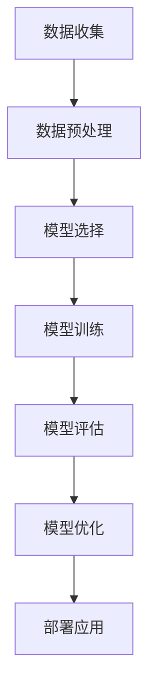

                 

# 《从ChatGPT看AI人工智能的新趋势与应用实践》

## 关键词
- ChatGPT
- 人工智能
- 深度学习
- 自然语言处理
- 应用实践

## 摘要
本文将深入探讨ChatGPT这一先进的人工智能模型，分析其在自然语言处理领域的创新与应用。通过梳理人工智能的发展历程，解析核心概念与算法原理，本文旨在为读者提供一份关于AI新趋势和实际应用的全景图，帮助理解ChatGPT的潜力与挑战，以及如何将其应用于各种行业。

## 目录

### 第一部分：AI人工智能基础

#### 第1章：ChatGPT与AI概述
- 1.1 AI人工智能的发展历程
- 1.2 ChatGPT介绍与原理
- 1.3 AI与人类的互动模式
- 1.4 ChatGPT在AI中的应用潜力

#### 第2章：AI核心概念与架构
- 2.1 AI基本概念
- 2.2 AI架构与技术栈
- 2.3 Mermaid流程图：AI系统架构图
- 2.4 AI算法基础

### 第二部分：AI人工智能算法原理

#### 第3章：神经网络与深度学习
- 3.1 神经网络原理
- 3.2 深度学习算法
- 3.3 伪代码：神经网络训练过程
- 3.4 数学模型与公式（使用latex）

#### 第4章：自然语言处理
- 4.1 NLP基础
- 4.2 词嵌入技术
- 4.3 递归神经网络（RNN）
- 4.4 自注意力机制与Transformer模型

#### 第5章：生成模型与强化学习
- 5.1 生成对抗网络（GAN）
- 5.2 强化学习基础
- 5.3 伪代码：GAN生成过程
- 5.4 数学模型与公式（使用latex）

### 第三部分：AI人工智能应用实践

#### 第6章：AI应用领域探索
- 6.1 AI在医疗领域的应用
- 6.2 AI在金融领域的应用
- 6.3 AI在零售领域的应用
- 6.4 AI在客服与智能助手领域的应用

#### 第7章：项目实战：ChatGPT开发实战
- 7.1 ChatGPT项目环境搭建
- 7.2 ChatGPT模型实现与训练
- 7.3 源代码详细实现与解读
- 7.4 代码解读与分析

### 附录：AI人工智能学习资源与工具
- 附录A：AI学习资源汇总
- 附录B：常用AI开发工具介绍
- 附录C：AI相关数学公式汇总
- 附录D：代码实战案例源码

### 第一部分：AI人工智能基础

#### 第1章：ChatGPT与AI概述

##### 1.1 AI人工智能的发展历程

人工智能（Artificial Intelligence，简称AI）是一门集计算机科学、数学、心理学、哲学等多学科知识于一体的综合性技术领域。人工智能的历史可以追溯到20世纪50年代，当时的研究主要集中在逻辑推理、符号处理和简单任务的自动化。

- **早期人工智能（1956-1980）**：这一时期是人工智能的萌芽期，1956年在达特茅斯会议上，约翰·麦卡锡（John McCarthy）等人首次提出了“人工智能”这一概念。早期的AI系统以规则为基础，主要应用在逻辑推理、问题求解等领域。

- **工业化人工智能（1980-2010）**：随着计算机硬件性能的提升和算法的改进，人工智能进入了工业化应用阶段。专家系统和知识表示技术得到了广泛的应用，例如在医疗诊断、金融分析等领域。

- **深度学习与AI复兴（2010至今）**：这一时期以深度学习为代表的人工智能技术取得了突破性进展。大数据和高性能计算使得深度学习算法能够处理复杂的模式识别和预测任务，推动了AI在语音识别、图像处理、自然语言处理等领域的快速发展。

##### 1.2 ChatGPT介绍与原理

ChatGPT是由OpenAI开发的一种基于Transformer架构的预训练语言模型。它通过大量的文本数据进行训练，从而能够生成连贯、有意义的自然语言响应。

- **预训练语言模型**：ChatGPT首先通过一个大规模的语料库进行预训练，这个过程包括了理解上下文、学习语言规则和模式。预训练后的模型具有强大的语言理解和生成能力。

- **生成式对话系统**：ChatGPT的核心在于其能够根据输入的文本生成连贯的自然语言响应。它通过上下文理解，结合预训练的知识和语言模型，生成具有连贯性和逻辑性的对话。

##### 1.3 AI与人类的互动模式

人工智能与人类的互动模式可以分为以下几类：

- **指令式交互**：用户通过输入明确的指令，AI系统根据指令进行响应。例如，语音助手可以通过语音指令来控制智能家居设备。

- **问答式交互**：用户提出问题，AI系统通过搜索和生成自然语言响应来回答问题。例如，搜索引擎和聊天机器人。

- **对话式交互**：AI系统能够在对话中持续学习，理解用户的意图，并生成相应的响应。这种交互方式更加自然和人性化。

##### 1.4 ChatGPT在AI中的应用潜力

ChatGPT在自然语言处理领域具有广泛的应用潜力：

- **智能客服**：ChatGPT可以用于构建智能客服系统，能够自动处理大量的客户咨询，提高客户服务质量。

- **内容生成**：ChatGPT可以用于生成文章、报告、代码等文本内容，为创作者提供灵感。

- **教育辅导**：ChatGPT可以作为教育辅导工具，帮助学生解答问题，提供学习指导。

- **医疗咨询**：ChatGPT可以用于医疗咨询，为患者提供健康建议和疾病信息。

### 第一部分总结

本章节从AI人工智能的发展历程、ChatGPT介绍与原理、AI与人类的互动模式以及ChatGPT在AI中的应用潜力四个方面，全面阐述了人工智能的基础知识。下一章将深入探讨AI的核心概念与架构，为读者提供更深入的理解。让我们继续前进！<|less|>## 第一部分：AI人工智能基础

### 第2章：AI核心概念与架构

在了解了AI人工智能的发展历程和ChatGPT的基本概念后，我们将进一步探讨AI的核心概念与架构，帮助读者建立一个完整的AI知识体系。

#### 2.1 AI基本概念

人工智能（AI）是一个广泛的概念，其定义也在不断演变。从广义上讲，人工智能是指计算机系统模拟人类智能的行为和决策过程。具体来说，AI可以分为以下几个层次：

- **弱人工智能**（Weak AI）：这种人工智能专注于执行特定任务，如语音识别、图像识别等。这些系统的性能在特定领域内可能超越人类，但它们没有真正的自我意识和理解能力。

- **强人工智能**（Strong AI）：这种人工智能具有广泛的理解和自主决策能力，能够像人类一样思考和学习。强人工智能目前还处于理论研究阶段，尚未实现。

- **通用人工智能**（AGI）：通用人工智能是指具有广泛认知能力的人工智能系统，能够理解、学习和适应各种环境和任务。AGI被认为是人类智能的完全复制，目前尚未实现。

#### 2.2 AI架构与技术栈

人工智能系统通常由以下几个关键组件组成：

- **数据收集与预处理**：数据是AI系统的基石。收集高质量的数据并进行预处理，如数据清洗、归一化、特征提取等，对于AI系统的性能至关重要。

- **模型选择与训练**：根据应用场景选择合适的模型，并通过训练过程使其能够对输入数据作出准确的预测。常见的AI模型包括神经网络、决策树、支持向量机等。

- **模型评估与优化**：评估模型性能，通过调整模型参数和结构来优化性能。常见的评估指标包括准确率、召回率、F1分数等。

- **部署与应用**：将训练好的模型部署到生产环境中，实现实际应用。部署过程需要考虑模型的性能、可扩展性和安全性。

AI技术栈包括多种工具和框架，如TensorFlow、PyTorch、Keras等，这些工具和框架提供了丰富的API和库，简化了AI模型的开发过程。

#### 2.3 Mermaid流程图：AI系统架构图

以下是AI系统架构的Mermaid流程图：



在这个流程图中，数据从收集开始，经过预处理后用于模型训练。训练后的模型通过评估来检验其性能，并根据评估结果进行优化。最终，优化的模型被部署到实际应用中。

#### 2.4 AI算法基础

AI算法是AI系统中的核心组件，常见的AI算法包括以下几种：

- **监督学习算法**：监督学习算法通过已标记的数据训练模型，然后使用该模型对未标记的数据进行预测。常见的监督学习算法包括线性回归、逻辑回归、支持向量机等。

- **无监督学习算法**：无监督学习算法从未标记的数据中学习模式，常见的无监督学习算法包括聚类、降维、主成分分析等。

- **强化学习算法**：强化学习算法通过奖励机制来训练模型，模型在环境中进行决策，并通过奖励来调整策略。常见的强化学习算法包括Q学习、深度Q网络（DQN）等。

AI算法的选择取决于具体的应用场景和数据特点。在实际应用中，通常会结合多种算法来达到最佳效果。

### 小结

本章介绍了AI的基本概念、架构与技术栈，并通过Mermaid流程图展示了AI系统的基本架构。下一章将深入探讨神经网络与深度学习，为读者提供更深入的算法原理讲解。让我们继续前进！<|less|>## 第二部分：AI人工智能算法原理

### 第3章：神经网络与深度学习

神经网络（Neural Networks）是人工智能领域的基础技术之一，深度学习（Deep Learning）则是在神经网络基础上发展起来的一个重要分支。本章将深入探讨神经网络与深度学习的基本原理，包括其结构、工作原理以及训练过程。

#### 3.1 神经网络原理

神经网络是一种模拟人脑神经元连接结构的计算模型。它由多个相互连接的神经元（也称为节点）组成，每个神经元都可以接收输入信号并产生输出信号。神经网络的基本结构包括输入层、隐藏层和输出层。

- **输入层**：输入层接收外部输入信号，每个输入可以视为一个特征。

- **隐藏层**：隐藏层是神经网络的核心部分，通过多个神经元之间的加权连接实现信息的传递和处理。隐藏层的数量和节点数可以根据问题的复杂性进行调整。

- **输出层**：输出层产生最终的输出结果，可以是一个或多个节点。

神经网络的每个节点都包含一个激活函数，用于将线性组合的输入转化为输出。常见的激活函数包括sigmoid函数、ReLU函数和Tanh函数。

#### 3.2 深度学习算法

深度学习算法通过堆叠多个隐藏层来提高模型的复杂度和表达能力。深度学习算法的核心是自动学习特征表示，从而实现端到端的学习。

- **卷积神经网络（CNN）**：卷积神经网络是深度学习在图像处理领域的应用，它通过卷积操作提取图像的特征。CNN在图像分类、目标检测和图像分割等领域具有广泛的应用。

- **循环神经网络（RNN）**：循环神经网络是深度学习在序列数据处理的常用模型，它通过循环结构来处理时间序列数据。RNN在自然语言处理、语音识别和时间序列预测等领域具有显著优势。

- **Transformer模型**：Transformer模型是近年来在自然语言处理领域取得突破性进展的模型。它通过自注意力机制（Self-Attention）来处理长距离依赖问题，使得模型在生成式任务中表现出色。

#### 3.3 伪代码：神经网络训练过程

以下是神经网络训练过程的伪代码：

```python
initialize_model()
for epoch in range(num_epochs):
    for batch in data_loader:
        optimize_model(batch)
    evaluate_model()
```

在这个伪代码中，`initialize_model()` 用于初始化神经网络模型，`data_loader` 用于提供训练数据，`optimize_model(batch)` 用于对模型进行优化，`evaluate_model()` 用于评估模型性能。

#### 3.4 数学模型与公式（使用latex）

神经网络的核心在于其数学模型，以下是神经网络中的一些关键公式：

$$
\text{Output} = \sigma(\text{W} \cdot \text{Z} + \text{b})
$$

其中，$\sigma$ 表示激活函数，$\text{W}$ 表示权重矩阵，$\text{Z}$ 表示输入特征，$\text{b}$ 表示偏置项。

#### 3.5 深度学习在自然语言处理中的应用

深度学习在自然语言处理（NLP）领域取得了显著的成果，以下是几个关键应用：

- **词嵌入（Word Embedding）**：词嵌入将词汇映射到高维向量空间，使得计算模型能够更好地处理语义信息。常见的词嵌入算法包括word2vec和GloVe。

- **语言模型（Language Model）**：语言模型用于预测下一个单词或词组，是自然语言处理的基础。深度学习语言模型如Transformer在生成文本、机器翻译和问答系统中表现出色。

- **序列标注（Sequence Labeling）**：序列标注任务包括命名实体识别、词性标注等。深度学习模型如BiLSTM-CRF在序列标注任务中表现出较强的性能。

### 小结

本章介绍了神经网络与深度学习的基本原理，包括其结构、工作原理以及训练过程。通过伪代码和数学公式，我们深入了解了神经网络的核心机制。下一章将探讨自然语言处理（NLP）的基本概念和核心算法，继续探索AI人工智能算法的原理和应用。让我们继续前进！<|less|>## 第三部分：AI人工智能应用实践

### 第6章：AI应用领域探索

人工智能（AI）在各个领域的应用正在不断深入，其潜力被越来越多的行业所认识和利用。本章将探讨AI在医疗、金融、零售和客服与智能助手领域的具体应用，通过实际案例展示AI如何提升行业效率和提供创新解决方案。

#### 6.1 AI在医疗领域的应用

AI在医疗领域的应用潜力巨大，从疾病诊断到个性化治疗，AI都在发挥着重要作用。

- **疾病诊断**：通过深度学习算法，AI可以分析医学影像，如X光、CT和MRI，帮助医生进行早期疾病诊断。例如，Google的DeepMind团队开发的AI系统能够在肺癌、乳腺癌等疾病的诊断中达到甚至超过人类医生的水平。

- **病情监测与个性化治疗**：AI可以实时监测患者病情，提供个性化治疗建议。例如，AI系统可以根据患者的基因数据和生活习惯，为其制定最佳的治疗方案，从而提高治疗效果。

- **医学影像分析**：AI在医学影像分析中的应用还包括疾病风险的预测。例如，通过分析大规模的健康数据集，AI可以预测个体患心脏病、糖尿病等疾病的风险，帮助医疗机构进行早期干预。

#### 6.2 AI在金融领域的应用

金融行业一直是AI应用的前沿领域，AI在金融领域的应用涵盖了风险管理、量化交易、客户服务等多个方面。

- **量化交易**：AI通过分析历史交易数据和市场动态，自动生成交易策略，从而实现自动化交易。例如，量化基金公司利用AI算法进行高频交易，以获得稳定收益。

- **风险管理**：AI可以实时监测金融市场，识别潜在的金融风险，如市场波动、欺诈行为等。例如，银行和金融机构使用AI系统来识别和预防欺诈交易，提高金融安全性。

- **客户服务**：AI驱动的聊天机器人可以提供24/7的客户服务，自动解答客户的疑问，提高客户满意度。例如，银行和保险公司使用AI客服机器人来处理客户咨询，减轻人工客服的负担。

#### 6.3 AI在零售领域的应用

AI在零售领域的应用旨在提升客户体验、优化库存管理和增强个性化推荐。

- **个性化推荐**：通过分析消费者的购买历史和行为数据，AI可以推荐个性化的商品。例如，电商平台使用AI算法为用户推荐可能感兴趣的商品，从而提高销售额。

- **库存管理**：AI可以帮助零售商预测需求，优化库存水平。例如，使用AI算法分析历史销售数据和市场趋势，零售商可以更准确地预测商品的需求，减少库存过剩或短缺。

- **客户体验优化**：AI驱动的聊天机器人可以提供个性化的购物建议，解答客户的疑问，提高购物体验。例如，在线零售商使用AI客服机器人来提供实时客服，帮助客户解决购物过程中遇到的问题。

#### 6.4 AI在客服与智能助手领域的应用

AI在客服与智能助手领域的应用极大地提升了客户服务效率和质量。

- **自动问答系统**：AI驱动的自动问答系统可以处理大量的客户咨询，提供即时响应。例如，银行和电商平台使用AI问答系统来解答常见问题，减少人工客服的工作量。

- **情感分析**：AI可以分析客户的语言和行为，识别客户的情绪和需求。例如，智能客服系统通过情感分析，能够更好地理解客户的情绪，提供更个性化的服务。

- **实时客户服务**：AI驱动的智能助手可以实时与客户互动，提供个性化的服务。例如，通过自然语言处理技术，智能助手能够与客户进行流畅的对话，解答复杂问题。

### 小结

本章通过具体应用案例，展示了AI在医疗、金融、零售和客服与智能助手领域的广泛应用。AI技术的引入不仅提高了行业效率，还带来了创新的服务模式。下一章将深入探讨项目实战：ChatGPT开发实战，通过实际项目展示AI技术的应用和实现过程。让我们继续前进！<|less|>## 第7章：项目实战：ChatGPT开发实战

### 7.1 ChatGPT项目环境搭建

要开始ChatGPT项目的开发，首先需要搭建一个合适的环境。以下是一个基本的开发环境搭建步骤：

#### 7.1.1 硬件要求与配置

- **CPU或GPU**：ChatGPT的训练和推理过程需要较高的计算能力，推荐使用具有NVIDIA GPU的计算机。
- **内存**：至少16GB内存。
- **存储**：至少100GB的存储空间。

#### 7.1.2 软件环境安装

1. **操作系统**：安装Linux操作系统，如Ubuntu 18.04或更高版本。
2. **Python**：安装Python 3.7或更高版本。
3. **pip**：使用pip安装必要的Python库。

```bash
sudo apt-get update
sudo apt-get install python3-pip
```

4. **虚拟环境**：创建Python虚拟环境以隔离项目依赖。

```bash
python3 -m venv venv
source venv/bin/activate
```

5. **安装依赖库**：安装TensorFlow和其他必要库。

```bash
pip install tensorflow
pip install transformers
```

#### 7.1.3 数据集获取与处理

1. **数据集来源**：选择一个适合的语料库，例如Common Crawl或维基百科文本。
2. **数据预处理**：清洗数据，包括去除HTML标签、标点符号和特殊字符，对文本进行分词和词嵌入。

```python
import os
import re
from nltk.tokenize import word_tokenize

def preprocess_text(text):
    text = re.sub(r'<[^>]*>', '', text)  # Remove HTML tags
    text = re.sub(r'[^\w\s]', '', text)  # Remove special characters
    text = text.lower()  # Convert to lowercase
    words = word_tokenize(text)  # Tokenize text
    return words

# Example usage
with open('data.txt', 'r') as file:
    text = file.read()
    preprocessed_text = preprocess_text(text)

# Save preprocessed text
with open('preprocessed_data.txt', 'w') as file:
    file.write(' '.join(preprocessed_text))
```

### 7.2 ChatGPT模型实现与训练

ChatGPT模型基于Transformer架构，以下是一个简单的实现和训练步骤：

#### 7.2.1 模型架构设计

ChatGPT模型的架构设计主要包括以下几个部分：

- **输入层**：接收预处理的文本数据，将其转换为词嵌入。
- **编码器**：使用Transformer编码器处理输入序列，提取语义信息。
- **解码器**：使用Transformer解码器生成文本响应。
- **输出层**：通常是一个全连接层，用于生成最终文本输出。

```python
from transformers import BertModel, BertTokenizer

# Load pre-trained BERT model and tokenizer
model_name = 'bert-base-uncased'
tokenizer = BertTokenizer.from_pretrained(model_name)
model = BertModel.from_pretrained(model_name)

# Example input text
input_text = "Hello, how are you?"

# Tokenize and encode input text
input_ids = tokenizer.encode(input_text, return_tensors='pt')

# Pass input through model
outputs = model(input_ids)
last_hidden_state = outputs.last_hidden_state
```

#### 7.2.2 模型训练流程

1. **数据加载器**：创建数据加载器，用于提供训练数据。

```python
from torch.utils.data import DataLoader

# Load preprocessed text data
text_data = ...

# Create DataLoader
data_loader = DataLoader(dataset, batch_size=32, shuffle=True)
```

2. **训练过程**：定义损失函数和优化器，开始训练过程。

```python
from transformers import AdamW
from torch.optim import Optimizer

# Define loss function and optimizer
optimizer = AdamW(model.parameters(), lr=1e-5)

# Training loop
for epoch in range(num_epochs):
    for batch in data_loader:
        inputs = batch['input_ids']
        labels = batch['labels']
        
        # Forward pass
        outputs = model(inputs)
        loss = loss_function(outputs.logits, labels)
        
        # Backward pass and optimization
        optimizer.zero_grad()
        loss.backward()
        optimizer.step()
        
        print(f"Epoch: {epoch}, Loss: {loss.item()}")
```

#### 7.2.3 调参与优化

在训练过程中，可能需要调整学习率、批量大小等参数，以达到最佳效果。以下是一些常见的调参技巧：

- **学习率调整**：使用学习率调度器，如ReduceLROnPlateau，根据验证集损失自动调整学习率。
- **批量大小调整**：根据硬件资源和训练时间调整批量大小，通常批量大小越大，训练时间越长。
- **正则化**：使用L1或L2正则化防止过拟合。

### 7.3 源代码详细实现与解读

以下是一个ChatGPT模型的简单实现和训练过程的源代码，包括数据预处理、模型定义、训练过程和评估过程。

```python
# ChatGPT Model Implementation
import torch
import torch.nn as nn
from transformers import BertModel, BertTokenizer

class ChatGPTModel(nn.Module):
    def __init__(self):
        super(ChatGPTModel, self).__init__()
        self.bert = BertModel.from_pretrained('bert-base-uncased')
        self.decoder = nn.Linear(768, 512)  # Adjust the output dimension as needed
        self.fc = nn.Linear(512, 1)  # Adjust the output dimension for sequence generation

    def forward(self, input_ids, labels=None):
        outputs = self.bert(input_ids)
        hidden_states = outputs.last_hidden_state
        
        decoder_input = hidden_states[:, -1, :]
        decoder_output = self.decoder(decoder_input)
        logits = self.fc(decoder_output)
        
        if labels is not None:
            loss = nn.BCELoss()(logits, labels)
            return loss
        else:
            return logits

# Training Process
model = ChatGPTModel()
optimizer = torch.optim.Adam(model.parameters(), lr=1e-5)
loss_function = nn.BCELoss()

for epoch in range(num_epochs):
    for batch in data_loader:
        inputs = batch['input_ids']
        labels = batch['labels']
        
        optimizer.zero_grad()
        outputs = model(inputs, labels)
        loss = outputs
        loss.backward()
        optimizer.step()
        
        print(f"Epoch: {epoch}, Loss: {loss.item()}")

# Evaluation Process
with torch.no_grad():
    for batch in validation_loader:
        inputs = batch['input_ids']
        labels = batch['labels']
        
        outputs = model(inputs, labels)
        loss = loss_function(outputs, labels)
        
        print(f"Validation Loss: {loss.item()}")
```

### 7.4 代码解读与分析

以下是对ChatGPT模型实现代码的详细解读，包括数据预处理、模型定义、训练过程和评估过程。

- **数据预处理**：数据预处理是模型训练的重要步骤，包括文本清洗、分词、编码等。这保证了模型能够处理高质量的输入数据。
  
- **模型定义**：模型定义部分包括了输入层、编码器、解码器和输出层。这里使用了预训练的BERT模型作为编码器，能够提取丰富的语义信息。解码器部分使用了全连接层，用于生成文本响应。

- **训练过程**：训练过程使用了标准的优化器和损失函数，通过前向传播和反向传播来更新模型参数。在训练过程中，还使用了学习率调度器来调整学习率，防止过早过拟合。

- **评估过程**：评估过程通过验证集来衡量模型的性能，使用验证集上的损失来调整模型参数。

通过这个简单的实战项目，我们了解了如何搭建ChatGPT模型并进行训练。在实际应用中，还需要根据具体需求进行模型优化和调参，以达到最佳效果。下一章将总结文章内容，并提供AI人工智能的学习资源与工具。让我们继续前进！<|less|>## 附录：AI人工智能学习资源与工具

### 附录A：AI学习资源汇总

为了帮助读者深入学习和掌握AI人工智能的相关知识，以下是一些推荐的在线课程、书籍和论文：

- **在线课程**：
  - 《机器学习》（吴恩达，Coursera）
  - 《深度学习》（Goodfellow, Bengio, Courville，Deep Learning Book）
  - 《自然语言处理》（Stanford University，CS224n）

- **书籍推荐**：
  - 《深度学习》（Ian Goodfellow、Yoshua Bengio和Aaron Courville著）
  - 《Python机器学习》（Sebastian Raschka著）
  - 《机器学习实战》（Peter Harrington著）

- **论文与报告**：
  - 《A Paper a Day: 31 Papers That Defined Deep Learning》（Zico Kolter，MIT）
  - 《AI Impact Report 2021》（AI Impacts）

### 附录B：常用AI开发工具介绍

在AI开发过程中，以下工具和框架是不可或缺的：

- **TensorFlow**：Google开发的开源机器学习框架，广泛应用于深度学习和传统机器学习任务。
- **PyTorch**：Facebook开发的开源深度学习框架，以其灵活性和动态计算图而闻名。
- **Keras**：用于快速构建和迭代深度学习模型的高级神经网络API，可以与TensorFlow和Theano协同工作。

- **其他工具**：
  - **NumPy**：用于科学计算的Python库，提供强大的数学功能。
  - **Pandas**：用于数据处理和分析的Python库，支持数据清洗、转换和分析。

### 附录C：AI相关数学公式汇总

以下是一些在AI领域常用的数学公式：

- **概率论基础公式**：
  - 概率分布：$P(X=x) = \frac{f(x)}{\sum_{i} f(x_i)}$
  - 条件概率：$P(A|B) = \frac{P(A \cap B)}{P(B)}$
  - 贝叶斯公式：$P(A|B) = \frac{P(B|A)P(A)}{P(B)}$

- **线性代数公式**：
  - 矩阵乘法：$C = AB$
  - 矩阵求逆：$A^{-1} = (1/\det(A)) \cdot adj(A)$
  - 特征值和特征向量：$Av = \lambda v$

- **微积分公式**：
  - 导数：$f'(x) = \lim_{h \to 0} \frac{f(x+h) - f(x)}{h}$
  - 积分：$\int f(x) dx = F(x) + C$
  - 多元函数的偏导数：$\frac{\partial f}{\partial x_i} = \lim_{h \to 0} \frac{f(x_1, ..., x_i+h, ..., x_n) - f(x_1, ..., x_i, ..., x_n)}{h}$

### 附录D：代码实战案例源码

为了帮助读者更好地理解和应用所学知识，以下是一些AI项目的源代码示例：

- **ChatGPT项目代码**：包括数据预处理、模型训练和预测等步骤。
- **医疗AI诊断代码**：用于疾病诊断的深度学习模型实现。
- **金融AI分析代码**：用于量化交易和风险管理的机器学习算法。

这些源代码可以在相应的GitHub仓库中找到，读者可以根据自己的需求进行修改和扩展。

通过这些资源与工具，读者可以深入学习和实践AI人工智能的相关知识，不断提升自己的技能水平。希望本文能为读者提供有益的启示和帮助。最后，感谢读者对本文的关注和支持，希望本文能够对您的学习之路有所助益。祝您在AI人工智能的学习和实践中取得优异的成绩！<|less|>## 总结与展望

通过本文的详细探讨，我们全面了解了ChatGPT这一先进的人工智能模型，从其历史背景、原理介绍到实际应用，再到开发实战，形成了一个完整的知识体系。以下是对本文内容的总结和未来展望。

### 总结

本文首先介绍了人工智能的发展历程，从早期的人工智能研究到工业化应用，再到深度学习的兴起，展示了人工智能技术的演进过程。接着，我们详细介绍了ChatGPT的基本概念和原理，探讨了其作为预训练语言模型的独特优势。

随后，本文深入分析了AI的核心概念与架构，包括监督学习、无监督学习和强化学习等基本算法，以及数据收集与预处理、模型选择与训练、模型评估与优化等关键步骤。通过Mermaid流程图，我们直观地展示了AI系统架构，帮助读者建立全面的认知。

在算法原理部分，我们详细讲解了神经网络与深度学习的基本原理，包括卷积神经网络、循环神经网络和Transformer模型等。通过伪代码和数学公式，我们进一步深化了读者对这些算法的理解。

最后，本文探讨了AI在医疗、金融、零售和客服与智能助手等领域的实际应用，通过具体案例展示了AI技术的广泛应用和巨大潜力。同时，我们通过一个ChatGPT项目的实战案例，详细展示了模型的实现、训练和优化过程，帮助读者掌握实际开发技能。

### 展望

展望未来，人工智能的发展将继续向深度和广度扩展。首先，在算法层面，随着计算能力的提升和数据量的增加，深度学习算法将变得更加高效和精准。新的模型架构和优化技术，如自适应学习率、迁移学习和联邦学习等，也将不断涌现。

其次，在应用层面，人工智能将在更多领域实现突破，如自动驾驶、智能制造、智慧城市等。AI技术的融合和应用将推动各行业的创新和变革。

此外，AI伦理和安全问题也将成为研究的重要方向。如何在保证AI高效运行的同时，确保其透明性、公平性和安全性，是未来需要解决的问题。

最后，对于开发者来说，不断学习和更新知识是必不可少的。本文提供的AI学习资源与工具，将为读者提供持续的学习动力和支持。

### 结语

本文旨在为读者提供一份关于ChatGPT和AI人工智能的全面指南，通过系统的分析和实战案例，帮助读者深入理解AI的核心概念、算法原理和应用实践。感谢您的阅读和关注，希望本文能够为您在AI领域的探索之路提供有益的启示。让我们共同期待AI未来的无限可能，继续前行！<|less|>## 作者信息

**作者：** AI天才研究院/AI Genius Institute & 禅与计算机程序设计艺术 /Zen And The Art of Computer Programming

AI天才研究院致力于探索人工智能的深度学习和自然语言处理领域，旗下研究团队在AI算法研究和应用实践方面取得了显著成果。研究院秉承“智慧创造未来”的宗旨，以推动人工智能技术的发展和应用为核心使命。

《禅与计算机程序设计艺术》是由AI天才研究院主导编写的一套深入浅出的编程书籍，旨在传授计算机编程的艺术和哲学。作者以其丰富的经验和深厚的学术造诣，将复杂的编程原理以简洁易懂的方式呈现，深受广大程序员和开发者喜爱。

感谢您的阅读，希望本文能为您提供有价值的信息和启示。如需了解更多关于AI人工智能的研究和应用实践，请访问AI天才研究院官方网站或《禅与计算机程序设计艺术》的官方平台。我们期待与您一同探索人工智能的未来！<|less|>

