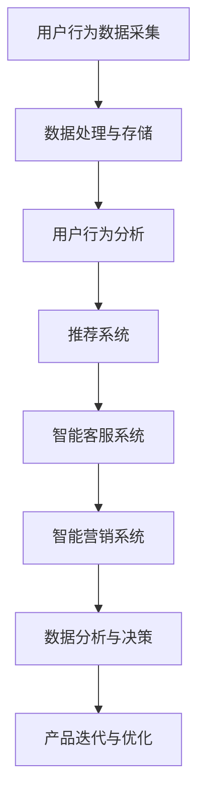

                 

# 从MVP到成熟产品：AI电商平台的迭代优化之路

## 关键词
AI电商平台，MVP，迭代优化，机器学习，自然语言处理，智能推荐系统，用户反馈，数据驱动决策

## 摘要
本文将深入探讨AI电商平台的构建过程，从最初的MVP（最小可行产品）阶段到最终成熟产品的优化路径。我们将分析AI电商平台的核心技术和功能模块，并详细讲解MVP阶段的构建和迭代优化策略。同时，我们将探讨如何通过用户反馈和数据分析来推动产品的持续迭代和优化，最终实现成熟产品的设计和运营。本文旨在为从事AI电商平台开发的读者提供一套完整的实践指南，帮助他们在快速变化的商业环境中保持竞争力。

---

### 《从MVP到成熟产品：AI电商平台的迭代优化之路》目录大纲

#### 第一部分：AI电商平台的基础知识

##### 第1章：AI电商平台概述

- **1.1 AI电商平台的概念与发展**
  - **1.1.1 AI电商平台的核心概念**
  - **1.1.2 AI电商平台的发展历程**
  - **1.1.3 AI电商平台的优势**

- **1.2 AI电商平台的组成结构**
  - **1.2.1 数据采集与处理**
  - **1.2.2 用户行为分析**
  - **1.2.3 智能推荐系统**
  - **1.2.4 智能客服系统**
  - **1.2.5 智能营销系统**

- **1.3 AI电商平台的核心技术**
  - **1.3.1 机器学习与深度学习技术**
  - **1.3.2 自然语言处理技术**
  - **1.3.3 计算机视觉技术**
  - **1.3.4 大数据技术**

- **1.4 AI电商平台的未来发展趋势**
  - **1.4.1 个性化推荐技术**
  - **1.4.2 跨平台营销策略**
  - **1.4.3 无人零售与智能物流**
  - **1.4.4 数据隐私与安全**

#### 第二部分：MVP阶段

##### 第2章：构建MVP平台

- **2.1 MVP的概念与优势**
  - **2.1.1 MVP的定义**
  - **2.1.2 MVP的优势**
  - **2.1.3 MVP的设计原则**

- **2.2 数据采集与处理**
  - **2.2.1 数据采集方法**
  - **2.2.2 数据预处理技术**
  - **2.2.3 数据可视化工具**

- **2.3 用户行为分析**
  - **2.3.1 用户行为分析流程**
  - **2.3.2 用户画像构建**
  - **2.3.3 用户行为预测模型**

- **2.4 智能推荐系统**
  - **2.4.1 推荐系统架构设计**
  - **2.4.2 冷启动问题处理**
  - **2.4.3 推荐算法优化**

- **2.5 智能客服系统**
  - **2.5.1 客服系统功能设计**
  - **2.5.2 自然语言处理应用**
  - **2.5.3 客服机器人性能评估**

- **2.6 智能营销系统**
  - **2.6.1 营销策略设计**
  - **2.6.2 垂直营销与社交营销**
  - **2.6.3 营销效果评估**

##### 第3章：MVP平台优化与迭代

- **3.1 用户反馈收集**
  - **3.1.1 用户反馈机制设计**
  - **3.1.2 用户满意度调查**
  - **3.1.3 用户行为分析优化**

- **3.2 性能优化**
  - **3.2.1 系统稳定性与响应速度优化**
  - **3.2.2 资源利用率优化**
  - **3.2.3 系统可扩展性优化**

- **3.3 功能迭代**
  - **3.3.1 新功能设计与实现**
  - **3.3.2 用户体验改进**
  - **3.3.3 生态系统构建**

- **3.4 数据分析与决策**
  - **3.4.1 数据分析工具选择**
  - **3.4.2 商业智能分析**
  - **3.4.3 数据驱动决策**

#### 第三部分：成熟产品阶段

##### 第4章：成熟产品设计与规划

- **4.1 成熟产品的定义与特点**
  - **4.1.1 成熟产品的标准**
  - **4.1.2 成熟产品的特点**

- **4.2 产品规划与目标**
  - **4.2.1 产品规划流程**
  - **4.2.2 产品目标设定**

- **4.3 产品迭代策略**
  - **4.3.1 迭代策略选择**
  - **4.3.2 迭代速度与质量**

- **4.4 产品功能完善**
  - **4.4.1 功能模块设计**
  - **4.4.2 功能优化与迭代**

##### 第5章：成熟产品的运营与推广

- **5.1 产品运营策略**
  - **5.1.1 运营流程与团队搭建**
  - **5.1.2 数据驱动的运营决策**

- **5.2 市场推广策略**
  - **5.2.1 品牌建设**
  - **5.2.2 营销渠道选择**
  - **5.2.3 用户增长策略**

- **5.3 用户服务与支持**
  - **5.3.1 用户服务体系构建**
  - **5.3.2 用户反馈处理**
  - **5.3.3 客户满意度提升**

##### 第6章：成熟产品的数据驱动优化

- **6.1 数据收集与处理**
  - **6.1.1 数据源选择**
  - **6.1.2 数据预处理方法**

- **6.2 用户行为分析**
  - **6.2.1 用户行为数据收集**
  - **6.2.2 用户行为模式挖掘**

- **6.3 智能推荐系统优化**
  - **6.3.1 推荐算法改进**
  - **6.3.2 实时推荐系统设计**

- **6.4 智能客服系统优化**
  - **6.4.1 客服机器人性能优化**
  - **6.4.2 客服数据挖掘与分析**

##### 第7章：成熟产品的持续迭代与演进

- **7.1 产品迭代规划**
  - **7.1.1 迭代计划制定**
  - **7.1.2 迭代目标与指标**

- **7.2 技术架构演进**
  - **7.2.1 技术选型与架构优化**
  - **7.2.2 持续集成与持续部署（CI/CD）**

- **7.3 产品创新与探索**
  - **7.3.1 创新思维与理念**
  - **7.3.2 创新项目孵化**

- **7.4 持续优化与改进**
  - **7.4.1 产品性能监控**
  - **7.4.2 用户满意度提升**

### 附录

#### 附录A：参考资料与扩展阅读

- **A.1 AI电商平台的最新研究动态**
- **A.2 相关技术深度阅读**
- **A.3 成功案例分析与启示**

### Mermaid 流程图

以下是AI电商平台架构的Mermaid流程图：



### 伪代码示例

以下是用户行为分析中用户画像构建的伪代码示例：

```python
function createUserProfile(user_data):
    profile = {}
    profile['age'] = extractAge(user_data)
    profile['gender'] = extractGender(user_data)
    profile['interests'] = extractInterests(user_data)
    return profile

function extractAge(user_data):
    age = user_data['birth_date'] - currentDate()
    return age

function extractGender(user_data):
    gender = user_data['gender']
    return gender

function extractInterests(user_data):
    interests = []
    for activity in user_data['activities']:
        interests.append(activity['type'])
    return interests
```

### 数学模型与公式

以下是用户行为预测模型中的回归模型的数学公式：

$$
y = \beta_0 + \beta_1x_1 + \beta_2x_2 + ... + \beta_nx_n + \epsilon
$$

其中，$y$ 是预测的目标变量，$x_1, x_2, ..., x_n$ 是特征变量，$\beta_0, \beta_1, \beta_2, ..., \beta_n$ 是模型参数，$\epsilon$ 是误差项。

### 实际案例与代码解读

以下是用户行为预测模型的实际案例代码解析：

```python
# 导入所需的库
import pandas as pd
from sklearn.linear_model import LinearRegression
from sklearn.model_selection import train_test_split
from sklearn.metrics import mean_squared_error

# 加载数据
data = pd.read_csv('user_behavior_data.csv')

# 数据预处理
X = data[['age', 'gender', 'interests_count']]
y = data['purchase_probability']

# 划分训练集和测试集
X_train, X_test, y_train, y_test = train_test_split(X, y, test_size=0.2, random_state=42)

# 创建线性回归模型
model = LinearRegression()

# 训练模型
model.fit(X_train, y_train)

# 预测测试集
y_pred = model.predict(X_test)

# 计算模型性能
mse = mean_squared_error(y_test, y_pred)
print("Mean Squared Error:", mse)

# 可视化
import matplotlib.pyplot as plt

plt.scatter(y_test, y_pred)
plt.xlabel('Actual Purchase Probability')
plt.ylabel('Predicted Purchase Probability')
plt.title('Actual vs Predicted Purchase Probability')
plt.show()
```

这段代码首先导入了必要的库，然后加载数据并进行预处理，包括特征编码。接着，使用训练集训练线性回归模型，并在测试集上进行预测，计算模型性能并可视化实际与预测的结果。这为AI电商平台中的用户行为预测提供了实际案例和详细解读。

---

现在，让我们正式开始这篇文章的撰写。首先，我们将探讨AI电商平台的基础知识，包括其概念、发展历程、优势以及未来趋势。这将为我们后续章节的讨论奠定基础。接下来，我们将详细讨论AI电商平台的组成结构、核心技术以及未来发展趋势。在完成基础知识部分后，我们将进入MVP阶段的讨论，从构建MVP平台到其优化与迭代，我们将一步步分析每个环节，提供具体的实践指南。最后，我们将探讨成熟产品阶段的设计与规划、运营与推广、数据驱动优化以及持续迭代与演进。通过这些讨论，我们希望能够帮助读者全面了解AI电商平台的发展路径和优化策略。

---

## 第一部分：AI电商平台的基础知识

### 第1章：AI电商平台概述

##### 1.1 AI电商平台的概念与发展

##### 1.1.1 AI电商平台的核心概念

AI电商平台，即利用人工智能技术构建的电子商务平台，其核心在于通过机器学习、自然语言处理、计算机视觉等先进技术，为用户提供个性化推荐、智能客服、精准营销等服务。AI电商平台不仅能够提高用户的购物体验，还能帮助商家提高销售额和客户满意度。

AI电商平台的关键概念包括：

1. **数据采集与处理**：通过网站、APP等渠道收集用户行为数据，如浏览记录、购买历史、评价等，并对这些数据进行处理和存储。
2. **用户行为分析**：通过分析用户行为数据，构建用户画像，预测用户需求和行为模式。
3. **智能推荐系统**：基于用户画像和商品特征，为用户推荐个性化商品。
4. **智能客服系统**：利用自然语言处理技术，提供自动化的客户服务。
5. **智能营销系统**：通过数据分析和算法，设计精准的营销策略，提高转化率。

##### 1.1.2 AI电商平台的发展历程

AI电商平台的发展可以追溯到互联网和电子商务的兴起。早期的电子商务平台主要以信息展示和交易为主，随着用户数据的积累和技术的进步，电商平台开始引入数据分析、推荐系统和智能客服等技术。

1. **2000年代初期**：电子商务平台初步引入数据分析技术，如用户行为分析和商品推荐。
2. **2010年代初期**：随着大数据和机器学习的兴起，电商平台开始大规模应用这些技术，提高个性化推荐和精准营销的效果。
3. **2010年代中期至今**：AI技术的快速发展，使得智能客服、计算机视觉等技术在电商平台上得到广泛应用，电商平台的功能和用户体验得到显著提升。

##### 1.1.3 AI电商平台的优势

AI电商平台相较于传统电商平台具有以下优势：

1. **个性化推荐**：基于用户行为和兴趣，为用户提供个性化的商品推荐，提高用户满意度和转化率。
2. **智能客服**：自动处理大量的客户咨询，提高客服效率和用户体验。
3. **精准营销**：通过数据分析和算法，设计精准的营销策略，提高广告投放效果和转化率。
4. **数据驱动决策**：基于用户行为数据和业务数据，实时分析业务状况，为决策提供数据支持。
5. **用户体验优化**：通过人工智能技术，优化用户购物流程，提高用户购物体验。

### 1.2 AI电商平台的组成结构

##### 1.2.1 数据采集与处理

数据采集与处理是AI电商平台的基础，主要包括以下几个方面：

1. **数据来源**：电商平台的数据来源包括用户行为数据（如浏览记录、搜索记录、购买历史等）、交易数据（如订单信息、支付金额等）、用户评价和反馈等。
2. **数据采集方法**：通过网站、APP等渠道收集用户数据，可以使用API接口、日志收集、Web爬虫等技术。
3. **数据处理**：对采集到的数据进行清洗、去重、转换等处理，以便于后续分析和应用。

##### 1.2.2 用户行为分析

用户行为分析是AI电商平台的核心功能之一，主要包括以下几个方面：

1. **用户行为数据收集**：收集用户在电商平台上的各种行为数据，如浏览、搜索、购买、评价等。
2. **用户画像构建**：基于用户行为数据，构建用户画像，包括用户的年龄、性别、地域、兴趣爱好等特征。
3. **用户行为预测**：利用机器学习算法，预测用户的下一步行为，如购买意向、评价倾向等。

##### 1.2.3 智能推荐系统

智能推荐系统是AI电商平台的重要组成部分，主要包括以下几个方面：

1. **推荐系统架构设计**：设计推荐系统的整体架构，包括数据层、服务层、展示层等。
2. **冷启动问题处理**：针对新用户缺乏历史数据的问题，设计相应的推荐策略，如基于热门商品推荐、基于用户群体推荐等。
3. **推荐算法优化**：不断优化推荐算法，提高推荐效果和用户满意度，如基于协同过滤、基于内容的推荐等。

##### 1.2.4 智能客服系统

智能客服系统是AI电商平台提高用户体验的重要手段，主要包括以下几个方面：

1. **客服系统功能设计**：设计智能客服系统的各项功能，如自动回复、智能问答、人工介入等。
2. **自然语言处理应用**：利用自然语言处理技术，实现智能客服系统与用户的自然语言交互。
3. **客服机器人性能评估**：评估智能客服系统的性能，如响应速度、准确率、用户满意度等。

##### 1.2.5 智能营销系统

智能营销系统是AI电商平台提高销售业绩的重要手段，主要包括以下几个方面：

1. **营销策略设计**：设计精准的营销策略，如优惠券、限时折扣、推荐营销等。
2. **垂直营销与社交营销**：通过社交媒体、专业论坛等渠道进行垂直营销，提高品牌曝光度和用户粘性。
3. **营销效果评估**：通过数据分析和算法，评估不同营销策略的效果，优化营销投入。

### 1.3 AI电商平台的核心技术

##### 1.3.1 机器学习与深度学习技术

机器学习和深度学习技术是AI电商平台的核心技术之一，主要包括以下几个方面：

1. **用户行为预测**：利用机器学习算法，预测用户的下一步行为，如购买意向、评价倾向等。
2. **商品推荐**：通过深度学习算法，实现个性化商品推荐，提高用户满意度和转化率。
3. **广告投放**：利用机器学习算法，优化广告投放策略，提高广告效果和转化率。

##### 1.3.2 自然语言处理技术

自然语言处理技术是AI电商平台实现智能客服和智能营销的关键，主要包括以下几个方面：

1. **智能问答**：通过自然语言处理技术，实现智能客服系统与用户的自然语言交互。
2. **情感分析**：分析用户评价和反馈，识别用户的情感倾向，为产品改进提供数据支持。
3. **文本生成**：利用自然语言处理技术，生成个性化推荐文案、营销文案等。

##### 1.3.3 计算机视觉技术

计算机视觉技术是AI电商平台实现智能识别和智能推荐的重要手段，主要包括以下几个方面：

1. **图像识别**：通过计算机视觉技术，实现商品图片的自动识别和分类。
2. **目标检测**：利用计算机视觉技术，实现商品在图片中的目标检测和定位。
3. **图像增强**：通过图像增强技术，提高商品图片的视觉效果，提升用户购物体验。

##### 1.3.4 大数据技术

大数据技术是AI电商平台实现数据分析和智能决策的基础，主要包括以下几个方面：

1. **数据采集与存储**：通过大数据技术，实现海量用户行为数据的采集、存储和管理。
2. **数据处理与分析**：利用大数据技术，对海量用户行为数据进行处理和分析，挖掘用户行为模式。
3. **实时计算与查询**：通过大数据技术，实现实时数据计算和查询，为业务决策提供数据支持。

### 1.4 AI电商平台的未来发展趋势

##### 1.4.1 个性化推荐技术

个性化推荐技术是AI电商平台未来发展的重要方向，主要包括以下几个方面：

1. **多模态推荐**：结合用户行为数据、商品特征、文本内容等多模态信息，实现更精准的个性化推荐。
2. **实时推荐**：通过实时数据分析和算法，实现实时个性化推荐，提高用户购物体验。
3. **协同推荐**：结合用户行为数据和社会网络信息，实现基于社交关系的协同推荐。

##### 1.4.2 跨平台营销策略

随着移动互联网和社交网络的普及，跨平台营销策略成为AI电商平台的重要发展方向，主要包括以下几个方面：

1. **全渠道营销**：通过电商平台、社交媒体、线下门店等多种渠道，实现全渠道营销，提高品牌曝光度和用户粘性。
2. **个性化广告**：利用大数据和算法，实现个性化广告投放，提高广告效果和转化率。
3. **跨平台数据整合**：通过数据整合，实现跨平台用户数据的整合和分析，为营销策略提供数据支持。

##### 1.4.3 无人零售与智能物流

无人零售和智能物流是AI电商平台未来发展的热点领域，主要包括以下几个方面：

1. **无人零售**：通过智能货架、无人结算等技术，实现无人零售，提高购物效率和用户体验。
2. **智能物流**：利用大数据和算法，实现智能物流配送，提高配送速度和准确性。
3. **无人配送**：通过无人车、无人机等智能设备，实现无人配送，降低物流成本，提高配送效率。

##### 1.4.4 数据隐私与安全

随着数据隐私和安全问题日益凸显，AI电商平台需要加强数据隐私和安全保护，主要包括以下几个方面：

1. **数据加密**：对用户数据进行加密存储和传输，防止数据泄露。
2. **访问控制**：通过权限管理和访问控制，确保数据的安全性和隐私性。
3. **安全审计**：定期进行安全审计和风险评估，确保数据安全和管理合规。

### 总结

本章节详细介绍了AI电商平台的基础知识，包括概念、发展历程、优势、组成结构、核心技术以及未来发展趋势。通过这些介绍，读者可以全面了解AI电商平台的基本概念和核心要素，为后续章节的深入探讨奠定基础。

---

## 第二部分：MVP阶段

### 第2章：构建MVP平台

在数字化时代，快速开发并推出产品是关键。MVP（最小可行产品）策略成为了许多创业者和企业的首选，因为它可以帮助他们在有限的资源下验证市场假设并快速迭代。本章将详细探讨MVP的概念、优势、设计原则，以及AI电商平台在MVP阶段的数据采集与处理、用户行为分析、智能推荐系统、智能客服系统和智能营销系统等方面的构建。

#### 2.1 MVP的概念与优势

##### 2.1.1 MVP的定义

MVP，即“最小可行产品”，是一个具有足够功能来验证产品核心概念的最小化版本。它不是最终产品的完整版本，但足以展示产品的核心价值，从而验证市场需求。

##### 2.1.2 MVP的优势

1. **降低风险**：通过MVP，可以最小化开发成本和风险，确保资源投入到最有价值的功能上。
2. **快速验证**：MVP可以帮助快速验证市场假设，确定产品的市场需求和用户接受度。
3. **高效迭代**：MVP允许快速迭代和改进，根据用户反馈调整产品方向。
4. **成本效益**：MVP在资源有限的情况下，可以实现最大的商业价值。

##### 2.1.3 MVP的设计原则

1. **核心功能优先**：确定产品的核心功能，并确保这些功能在MVP中得以实现。
2. **用户体验至上**：尽管MVP是初步版本，但用户体验应保持高质量，以确保用户愿意继续使用。
3. **简洁性**：避免过度设计，保持产品的简洁性，专注于解决用户的核心问题。
4. **可扩展性**：设计时考虑未来的扩展性，确保产品可以轻松集成新的功能和模块。

#### 2.2 数据采集与处理

##### 2.2.1 数据采集方法

1. **用户行为数据采集**：通过网站分析工具（如Google Analytics）和APP内置分析工具（如Flurry）等，收集用户的浏览、搜索、购买、评价等行为数据。
2. **第三方数据接口**：利用API接口从社交媒体、地图服务、支付平台等获取用户数据。

##### 2.2.2 数据预处理技术

1. **数据清洗**：处理缺失值、异常值、重复数据等问题，保证数据质量。
2. **数据转换**：将数据格式转换为统一标准，便于后续分析。
3. **数据归一化**：对数据进行归一化处理，消除不同指标之间的量级差异。

##### 2.2.3 数据可视化工具

1. **数据可视化库**：使用Python的Matplotlib、Seaborn等库，或商业智能工具（如Tableau）进行数据可视化，帮助团队理解数据模式。

#### 2.3 用户行为分析

##### 2.3.1 用户行为分析流程

1. **数据收集**：使用上述方法收集用户行为数据。
2. **数据处理**：清洗、转换和归一化数据，为分析做准备。
3. **数据可视化**：通过图表、仪表盘等展示分析结果。
4. **用户画像构建**：根据用户行为数据，构建用户画像，包括年龄、性别、地域、购买行为等特征。
5. **用户行为预测**：利用机器学习算法，预测用户下一步行为，如购买意向、评价倾向等。

##### 2.3.2 用户画像构建

1. **特征提取**：从用户行为数据中提取关键特征，如浏览时长、购买频率、评价评分等。
2. **聚类分析**：使用聚类算法（如K-means），将用户分为不同的群体。
3. **特征重要性分析**：评估不同特征对用户行为的影响，为后续分析提供指导。

##### 2.3.3 用户行为预测模型

1. **选择算法**：根据业务需求选择合适的预测算法，如逻辑回归、决策树、神经网络等。
2. **模型训练**：使用历史数据训练模型，调整参数以优化模型性能。
3. **模型评估**：使用交叉验证、AUC、准确率等指标评估模型性能。
4. **模型部署**：将训练好的模型部署到生产环境中，实现实时预测。

#### 2.4 智能推荐系统

##### 2.4.1 推荐系统架构设计

1. **数据层**：存储用户行为数据、商品特征数据等。
2. **服务层**：处理推荐算法逻辑，为前端提供推荐结果。
3. **展示层**：将推荐结果展示给用户。

##### 2.4.2 冷启动问题处理

1. **基于热门推荐**：为新用户推荐热门商品或活动。
2. **基于用户群体推荐**：根据相似用户群体的行为推荐商品。
3. **基于内容推荐**：根据商品内容（如标题、描述、图片等）进行推荐。

##### 2.4.3 推荐算法优化

1. **协同过滤**：利用用户行为数据，找到相似用户或商品进行推荐。
2. **基于内容的推荐**：根据商品特征和用户兴趣进行推荐。
3. **混合推荐**：结合多种推荐算法，提高推荐效果。

#### 2.5 智能客服系统

##### 2.5.1 客服系统功能设计

1. **自动回复**：处理常见问题和自动化回复。
2. **智能问答**：通过自然语言处理技术，实现智能问答功能。
3. **人工介入**：在复杂问题无法解决时，提供人工客服介入。

##### 2.5.2 自然语言处理应用

1. **语义理解**：理解用户的自然语言输入，提取关键信息。
2. **情感分析**：分析用户情绪，为客服人员提供参考。
3. **文本生成**：生成自动回复文本，提高客服效率。

##### 2.5.3 客服机器人性能评估

1. **准确率**：评估机器人回答问题的准确率。
2. **响应速度**：评估机器人的响应速度。
3. **用户体验**：收集用户对客服机器人的反馈，优化机器人性能。

#### 2.6 智能营销系统

##### 2.6.1 营销策略设计

1. **优惠券**：设计各种优惠券策略，刺激用户购买。
2. **限时折扣**：提供限时折扣，吸引用户购买。
3. **推荐营销**：利用推荐系统，设计个性化的推荐营销策略。

##### 2.6.2 垂直营销与社交营销

1. **垂直营销**：针对特定用户群体，提供个性化的营销内容。
2. **社交营销**：利用社交媒体平台，开展互动营销活动。

##### 2.6.3 营销效果评估

1. **点击率**：评估营销活动的点击率。
2. **转化率**：评估营销活动带来的转化率。
3. **ROI**：计算营销活动的投资回报率。

### 总结

本章详细介绍了MVP阶段的核心概念、优势、设计原则，以及在数据采集与处理、用户行为分析、智能推荐系统、智能客服系统和智能营销系统等方面的构建。通过这些内容，读者可以了解如何构建一个最小可行但功能完善的AI电商平台，为后续的迭代和优化打下坚实基础。

---

## 第三部分：MVP平台优化与迭代

### 第3章：MVP平台优化与迭代

在MVP（最小可行产品）阶段，我们构建了一个具有核心功能的产品原型，并通过用户反馈和市场验证来了解产品的接受程度。然而，市场的需求和用户期望是不断变化的，为了保持竞争力并满足用户的需求，我们必须对MVP平台进行持续优化和迭代。本章将详细探讨用户反馈收集、性能优化、功能迭代以及数据驱动决策等方面的策略。

#### 3.1 用户反馈收集

用户反馈是产品优化的重要依据。有效的用户反馈机制可以帮助我们了解用户的真实需求和满意度，从而指导产品的改进。

##### 3.1.1 用户反馈机制设计

1. **用户调研**：通过问卷调查、用户访谈等方式收集用户意见和建议。
2. **用户论坛**：建立用户论坛，鼓励用户分享使用体验和反馈。
3. **在线评价系统**：在平台上设置评价系统，让用户对产品进行评分和评论。
4. **社交媒体互动**：通过社交媒体平台与用户互动，收集用户的反馈和建议。

##### 3.1.2 用户满意度调查

1. **满意度指标**：制定满意度调查问卷，包括产品功能、用户体验、客户服务等方面。
2. **数据分析**：对收集到的数据进行分析，识别用户满意度高的方面和需要改进的方面。
3. **反馈应用**：根据用户满意度调查结果，对产品进行相应的改进和优化。

##### 3.1.3 用户行为分析优化

1. **行为数据收集**：继续收集用户的浏览、搜索、购买等行为数据。
2. **数据预处理**：对收集到的行为数据进行清洗、转换和归一化处理。
3. **行为模式挖掘**：通过分析用户行为数据，挖掘用户的行为模式和偏好，为产品优化提供数据支持。

#### 3.2 性能优化

性能优化是确保MVP平台稳定运行和提供良好用户体验的关键。

##### 3.2.1 系统稳定性与响应速度优化

1. **负载测试**：通过模拟高并发场景，测试系统的稳定性和响应速度。
2. **性能监控**：使用性能监控工具（如New Relic、AppDynamics）监控系统的性能指标。
3. **缓存策略**：使用缓存技术（如Redis、Memcached）减少数据库访问次数，提高系统响应速度。
4. **数据库优化**：对数据库进行优化，如索引优化、查询优化等，提高数据访问效率。

##### 3.2.2 资源利用率优化

1. **资源监控**：监控服务器资源使用情况，包括CPU、内存、磁盘I/O等。
2. **资源分配**：合理分配服务器资源，确保关键服务的资源需求得到满足。
3. **容器化与微服务**：使用容器化技术（如Docker）和微服务架构，提高系统的资源利用率和扩展性。

##### 3.2.3 系统可扩展性优化

1. **模块化设计**：将系统设计为模块化，便于功能的扩展和升级。
2. **分布式架构**：采用分布式架构，提高系统的可扩展性和容错能力。
3. **水平扩展**：通过增加服务器节点，实现系统水平的扩展，提高系统处理能力。

#### 3.3 功能迭代

功能迭代是产品不断进化的重要途径。在MVP平台的基础上，我们应根据用户反馈和市场趋势，不断引入新的功能和改进现有功能。

##### 3.3.1 新功能设计与实现

1. **用户需求分析**：分析用户反馈和市场趋势，确定新功能的需求和优先级。
2. **功能设计**：设计新功能的技术方案和用户界面，确保新功能与现有系统兼容。
3. **功能实现**：开发团队根据设计方案，实现新功能，并进行内部测试。
4. **用户验收测试**：邀请部分用户参与测试，验证新功能的稳定性和用户体验。

##### 3.3.2 用户体验改进

1. **界面优化**：优化用户界面，提高用户操作便捷性和视觉体验。
2. **交互设计**：改进用户与系统的交互方式，提高用户操作效率。
3. **响应式设计**：确保产品在不同设备和屏幕尺寸上都能提供良好的用户体验。

##### 3.3.3 生态系统构建

1. **第三方集成**：引入第三方服务和API，扩展产品的功能和能力。
2. **开放平台**：构建开放平台，鼓励开发者创建应用程序和服务，为用户提供更多选择。
3. **社区建设**：建立用户社区，鼓励用户参与产品的讨论和改进。

#### 3.4 数据分析与决策

数据是驱动产品迭代的重要引擎。通过数据分析和决策，我们可以更科学地指导产品的优化和迭代。

##### 3.4.1 数据分析工具选择

1. **数据仓库**：选择合适的数据仓库工具（如Amazon Redshift、Google BigQuery），存储和管理海量数据。
2. **数据分析平台**：选择合适的数据分析平台（如Tableau、Power BI），进行数据可视化和分析。
3. **机器学习平台**：选择合适的机器学习平台（如Google Cloud ML、AWS SageMaker），进行数据分析和预测。

##### 3.4.2 商业智能分析

1. **关键指标监控**：监控关键业务指标（如用户活跃度、转化率、销售额等），实时了解业务状况。
2. **趋势分析**：通过数据分析，识别业务趋势和潜在问题。
3. **预测分析**：利用机器学习算法，预测未来的业务走势，为决策提供数据支持。

##### 3.4.3 数据驱动决策

1. **数据驱动文化**：在企业内部培养数据驱动的文化，鼓励员工基于数据做出决策。
2. **数据治理**：建立数据治理机制，确保数据的准确性和一致性。
3. **数据安全与隐私**：确保数据安全与用户隐私，遵守相关法律法规。

### 总结

本章详细介绍了MVP平台优化与迭代的策略，包括用户反馈收集、性能优化、功能迭代以及数据驱动决策。通过这些策略，我们可以不断提升产品的质量和用户体验，为企业的长期发展奠定坚实基础。

---

## 第四部分：成熟产品阶段

### 第4章：成熟产品设计与规划

当一个AI电商平台从MVP阶段过渡到成熟产品阶段时，产品的设计、规划以及迭代策略都变得尤为重要。在这一阶段，产品不仅要具备完善的功能，还要能够在市场上保持竞争力。本章将探讨成熟产品的定义与特点、产品规划与目标、产品迭代策略以及产品功能完善。

#### 4.1 成熟产品的定义与特点

成熟产品通常具备以下几个特点：

1. **功能完善**：产品功能覆盖了用户的主要需求，且无明显的功能缺陷。
2. **用户体验优秀**：用户界面友好，交互设计流畅，提供了良好的用户体验。
3. **稳定性与性能**：系统能够在高并发场景下稳定运行，响应速度快，资源利用率高。
4. **安全与合规**：产品遵守相关法律法规，确保用户数据的安全性和隐私性。
5. **可扩展性**：系统能够轻松扩展新功能和模块，以适应市场的变化。
6. **数据驱动**：产品利用数据分析和机器学习技术，进行决策和优化。

成熟产品不仅仅是一个功能完整的系统，它还需要具备持续改进的能力，以应对不断变化的市场需求。

#### 4.2 产品规划与目标

在成熟产品阶段，产品规划与目标是确保产品能够持续发展的重要环节。

##### 4.2.1 产品规划流程

1. **市场分析**：了解目标市场的趋势、用户需求和竞争对手情况。
2. **需求分析**：确定产品的功能需求、性能需求和用户体验需求。
3. **优先级排序**：根据市场分析和需求分析，确定产品的优先级和开发计划。
4. **风险评估**：评估产品开发过程中可能遇到的风险，并制定相应的应对策略。
5. **资源分配**：确定产品开发所需的人力、资金和技术资源。

##### 4.2.2 产品目标设定

1. **短期目标**：设定可以在短时间内实现的目标，如增加用户量、提高用户留存率等。
2. **中期目标**：设定在较长时间内实现的目标，如优化推荐算法、提升用户体验等。
3. **长期目标**：设定长期战略目标，如扩大市场份额、实现盈利等。

产品目标的设定需要结合公司的整体战略和市场需求，确保产品在各个阶段都有明确的发展方向。

#### 4.3 产品迭代策略

成熟产品的迭代策略是确保产品持续优化和迭代的重要手段。

##### 4.3.1 迭代策略选择

1. **持续集成与部署（CI/CD）**：通过自动化测试和部署流程，实现快速迭代和交付。
2. **敏捷开发**：采用敏捷开发方法，快速响应市场需求和用户反馈。
3. **迭代式开发**：将产品开发分为多个迭代周期，每个迭代周期完成一部分功能，逐步完善产品。
4. **滚动式发布**：通过滚动式发布，持续推出新功能和优化，减少对用户的影响。

##### 4.3.2 迭代速度与质量

1. **速度**：迭代速度是产品竞争力的体现，需要确保开发团队能够高效地完成任务。
2. **质量**：迭代过程中的质量是产品成功的关键，需要确保每个迭代周期的功能完整性和稳定性。

在迭代过程中，需要平衡速度和质量，确保产品在快速迭代的同时保持高质量。

#### 4.4 产品功能完善

在成熟产品阶段，产品功能的完善是提升用户体验和竞争力的关键。

##### 4.4.1 功能模块设计

1. **用户界面设计**：设计直观、易用的用户界面，提高用户操作体验。
2. **功能设计**：根据用户需求和市场趋势，设计新的功能和优化现有功能。
3. **模块化设计**：采用模块化设计，便于功能扩展和系统维护。

##### 4.4.2 功能优化与迭代

1. **用户体验优化**：通过用户反馈和市场调研，持续优化用户体验。
2. **功能性能优化**：通过性能测试和监控，优化功能性能，提高系统稳定性。
3. **功能迭代**：根据市场需求和用户反馈，定期进行功能迭代，推出新的功能或优化现有功能。

##### 4.4.3 生态系统构建

1. **第三方集成**：引入第三方服务和API，扩展产品的功能和能力。
2. **开发者社区**：建立开发者社区，鼓励开发者创建应用程序和服务，为用户提供更多选择。
3. **合作伙伴关系**：与合作伙伴建立合作关系，共同推动产品的发展。

### 总结

本章详细介绍了成熟产品的定义与特点、产品规划与目标、产品迭代策略以及产品功能完善。通过这些内容，读者可以了解如何将AI电商平台从MVP阶段逐步发展为一个功能完善、用户体验优秀、市场竞争力强的成熟产品。

---

## 第5章：成熟产品的运营与推广

在AI电商平台从MVP阶段过渡到成熟产品阶段后，产品的运营与推广变得至关重要。有效的运营与推广策略不仅能够提升用户量和品牌知名度，还能提高用户粘性和销售额。本章将探讨成熟产品的运营策略、市场推广策略、用户服务与支持，以及如何通过这些手段实现业务的增长。

#### 5.1 产品运营策略

产品运营策略是确保成熟产品持续稳定发展的重要手段。

##### 5.1.1 运营流程与团队搭建

1. **运营流程设计**：制定产品运营的流程，包括用户获取、用户留存、用户活跃度提升等关键环节。
2. **团队搭建**：组建专业的运营团队，包括产品运营、内容运营、活动运营等岗位，明确各自职责和协作机制。

##### 5.1.2 数据驱动的运营决策

1. **数据收集与分析**：利用数据分析工具，收集用户行为数据、运营数据等，进行分析和挖掘。
2. **数据驱动决策**：基于数据分析结果，制定运营策略和优化方案，持续提升产品运营效果。

##### 5.1.3 用户生命周期管理

1. **新用户运营**：通过引导、激励等手段，提高新用户的活跃度和留存率。
2. **老用户运营**：通过会员制度、活动推送等方式，提升老用户的忠诚度和消费意愿。
3. **流失用户运营**：通过分析流失原因，采取针对性措施，挽回流失用户。

#### 5.2 市场推广策略

市场推广策略是提升产品知名度、吸引潜在用户的重要手段。

##### 5.2.1 品牌建设

1. **品牌定位**：明确品牌的核心价值和目标用户群体，建立品牌形象。
2. **品牌传播**：通过多种渠道（如社交媒体、广告投放、公关活动等）传播品牌信息，提升品牌知名度。

##### 5.2.2 营销渠道选择

1. **在线营销渠道**：利用搜索引擎优化（SEO）、搜索引擎营销（SEM）、社交媒体营销、内容营销等在线渠道进行推广。
2. **线下营销渠道**：通过线下活动、展会、广告投放等方式进行推广，扩大品牌影响力。

##### 5.2.3 用户增长策略

1. **社交媒体营销**：利用社交媒体平台（如微博、微信、抖音等）进行内容传播和用户互动，提高用户参与度和粘性。
2. **KOL合作**：与知名意见领袖（KOL）合作，通过其影响力推广产品，提高用户关注度和购买意愿。
3. **用户推荐**：通过用户推荐机制，激励用户分享产品，实现用户增长。

#### 5.3 用户服务与支持

用户服务与支持是提升用户满意度和忠诚度的重要环节。

##### 5.3.1 用户服务体系构建

1. **客服团队建设**：建立专业的客服团队，提供及时、高效的客户服务。
2. **服务渠道多样化**：提供多种服务渠道，如在线客服、电话客服、邮件客服等，满足不同用户的需求。

##### 5.3.2 用户反馈处理

1. **用户反馈收集**：通过用户调研、在线评价、客服反馈等渠道收集用户反馈。
2. **反馈处理机制**：建立快速响应和处理的机制，对用户反馈进行分类和优先级排序，及时解决用户问题。

##### 5.3.3 客户满意度提升

1. **满意度调查**：定期进行客户满意度调查，了解用户对产品的满意度和不满意点。
2. **改进措施**：根据满意度调查结果，制定和实施改进措施，提升用户满意度。
3. **客户关怀**：通过生日关怀、节日问候等方式，增强与用户的情感联系，提升用户忠诚度。

### 总结

本章详细介绍了成熟产品的运营与推广策略，包括运营流程与团队搭建、数据驱动的运营决策、市场推广策略、用户服务与支持等方面的内容。通过这些策略，企业可以有效地提升产品竞争力，实现业务的持续增长。

---

## 第6章：成熟产品的数据驱动优化

成熟产品的持续优化是保持市场竞争力和用户满意度的关键。数据驱动优化是一种基于数据分析、挖掘和应用的优化方法，能够帮助电商平台在产品设计和运营中做出更明智的决策。本章将深入探讨成熟产品的数据驱动优化，包括数据收集与处理、用户行为分析、智能推荐系统优化、智能客服系统优化等方面。

#### 6.1 数据收集与处理

数据收集与处理是数据驱动优化的第一步，是确保后续分析准确性和有效性的基础。

##### 6.1.1 数据源选择

1. **用户行为数据**：包括用户的浏览记录、搜索历史、购买行为、评价等。
2. **交易数据**：包括订单信息、支付金额、退款等。
3. **外部数据**：包括市场趋势、行业报告、竞争对手数据等。

##### 6.1.2 数据预处理方法

1. **数据清洗**：去除重复数据、缺失值填充、异常值处理等，保证数据质量。
2. **数据转换**：将数据格式转换为统一标准，便于后续分析。
3. **数据归一化**：对数据进行归一化处理，消除不同指标之间的量级差异。

##### 6.1.3 数据存储与管理

1. **数据仓库**：选择合适的数据仓库工具（如Hadoop、Amazon Redshift），存储和管理海量数据。
2. **数据湖**：利用数据湖技术，实现数据存储的灵活性和扩展性。
3. **数据管理平台**：建立数据管理平台，实现数据的统一管理和监控。

#### 6.2 用户行为分析

用户行为分析是数据驱动优化的核心，通过对用户行为数据的分析，可以深入了解用户需求和偏好。

##### 6.2.1 用户行为数据收集

1. **网站分析**：利用Google Analytics、百度统计等工具，收集用户在网站上的行为数据。
2. **APP分析**：利用App Annie、Flurry等工具，收集用户在APP上的行为数据。
3. **日志分析**：通过日志收集系统（如ELK、Splunk），实时收集和分析用户行为数据。

##### 6.2.2 用户行为模式挖掘

1. **行为路径分析**：分析用户在网站或APP上的行为路径，识别用户的主要操作流程和决策节点。
2. **行为预测**：利用机器学习算法，预测用户的下一步行为，如购买、评价、退出等。
3. **用户画像构建**：基于用户行为数据，构建用户画像，包括用户的年龄、性别、地域、兴趣爱好等特征。

##### 6.2.3 用户满意度分析

1. **满意度调查**：通过问卷调查、在线反馈等方式，收集用户对产品和服务的满意度。
2. **NPS分析**：通过净推荐值（NPS）分析，了解用户的推荐意愿和满意度。
3. **行为数据与满意度关联**：分析用户行为数据与满意度之间的关系，找出影响满意度的关键因素。

#### 6.3 智能推荐系统优化

智能推荐系统是电商平台提升用户体验和销售额的重要手段。通过数据驱动优化，可以不断提升推荐系统的准确性和效果。

##### 6.3.1 推荐算法改进

1. **协同过滤**：改进基于用户的协同过滤算法，提高推荐准确性。
2. **基于内容的推荐**：结合用户兴趣和商品特征，实现基于内容的推荐。
3. **混合推荐**：结合多种推荐算法，提高推荐效果。

##### 6.3.2 实时推荐系统设计

1. **实时数据流处理**：利用实时数据流处理技术（如Apache Kafka、Apache Flink），处理实时用户行为数据。
2. **动态推荐**：根据用户的实时行为，动态调整推荐结果，提高推荐效果。
3. **个性化推荐**：结合用户历史行为和实时行为，实现个性化推荐。

##### 6.3.3 冷启动问题处理

1. **基于热门推荐**：为新用户推荐热门商品或活动。
2. **基于内容推荐**：利用商品内容特征，为新用户推荐相似商品。
3. **用户群体推荐**：为新用户推荐与相似用户群体相关的商品。

#### 6.4 智能客服系统优化

智能客服系统是提升用户体验和客服效率的重要工具。通过数据驱动优化，可以不断提升客服系统的性能和用户体验。

##### 6.4.1 客服机器人性能优化

1. **自然语言处理**：改进自然语言处理算法，提高客服机器人对用户问题的理解能力。
2. **多轮对话**：实现多轮对话功能，提高客服机器人解决问题的能力。
3. **个性化服务**：根据用户历史行为和偏好，提供个性化的客服服务。

##### 6.4.2 客服数据挖掘与分析

1. **客服数据收集**：收集用户与客服的交互数据，包括对话记录、评价等。
2. **数据可视化**：利用数据可视化工具，展示客服数据的趋势和问题点。
3. **问题分类与分析**：对客服数据进行分析，识别常见问题和用户痛点。

##### 6.4.3 客服机器人性能评估

1. **准确率**：评估客服机器人的回答准确率，不断优化问答库。
2. **响应速度**：评估客服机器人的响应速度，优化算法和系统性能。
3. **用户体验**：通过用户满意度调查，评估客服机器人的用户体验，持续优化服务。

### 总结

本章详细介绍了成熟产品的数据驱动优化方法，包括数据收集与处理、用户行为分析、智能推荐系统优化和智能客服系统优化等方面。通过这些优化手段，电商平台可以不断提升产品性能和用户体验，保持市场竞争力和用户满意度。

---

## 第7章：成熟产品的持续迭代与演进

成熟产品的持续迭代与演进是保持市场竞争力、满足用户需求的关键。在这一过程中，需要不断优化技术架构、推动产品创新，并确保持续改进。本章将探讨成熟产品的迭代规划、技术架构演进、产品创新与探索以及持续优化与改进。

#### 7.1 产品迭代规划

产品迭代规划是确保产品持续优化和发展的基础。

##### 7.1.1 迭代计划制定

1. **需求分析**：定期收集和分析用户需求、市场趋势以及竞争对手的动态，确定迭代需求。
2. **优先级排序**：根据需求的重要性和紧急性，对迭代需求进行优先级排序。
3. **资源分配**：根据迭代计划和资源状况，合理分配人力、资金和技术资源。

##### 7.1.2 迭代目标与指标

1. **功能完善**：确保每个迭代周期的功能需求得到实现，提高产品的功能完整性。
2. **用户体验**：优化用户界面和交互设计，提升用户体验。
3. **性能优化**：通过性能测试和监控，优化系统的响应速度和稳定性。
4. **指标监控**：设立关键指标（如用户活跃度、留存率、转化率等），实时监控迭代效果。

##### 7.1.3 迭代管理

1. **敏捷开发**：采用敏捷开发方法，快速响应市场需求和用户反馈。
2. **版本控制**：使用版本控制系统，确保代码的可追溯性和可管理性。
3. **测试与部署**：建立完善的测试和部署流程，确保迭代周期的质量和效率。

#### 7.2 技术架构演进

技术架构演进是产品持续迭代的基础，需要不断优化和改进。

##### 7.2.1 技术选型与架构优化

1. **技术选型**：根据业务需求和未来趋势，选择合适的技术和框架，如云计算、容器化、微服务等。
2. **架构优化**：持续优化技术架构，提高系统的可扩展性、稳定性和性能。
3. **云原生架构**：采用云原生架构，实现服务的弹性扩展和自动运维。

##### 7.2.2 持续集成与持续部署（CI/CD）

1. **CI/CD流程**：建立持续集成与持续部署流程，实现代码的自动化测试和部署。
2. **自动化测试**：采用自动化测试工具，提高测试效率和代码质量。
3. **自动化运维**：通过自动化运维工具，实现系统的自动监控、自动扩容和故障恢复。

##### 7.2.3 技术升级与迁移

1. **技术升级**：定期对技术栈进行升级，保持技术的先进性和稳定性。
2. **数据迁移**：在技术升级过程中，确保数据的安全迁移和一致性。
3. **架构优化**：通过架构优化，提高系统的性能和可维护性。

#### 7.3 产品创新与探索

产品创新与探索是推动产品持续迭代和业务增长的重要动力。

##### 7.3.1 创新思维与理念

1. **用户为中心**：以用户需求为导向，持续探索和满足用户需求。
2. **快速迭代**：采用快速迭代的方法，不断试错和优化，快速推向市场。
3. **跨界合作**：与其他行业和领域的合作伙伴进行合作，共同探索新的商业模式和产品形态。

##### 7.3.2 创新项目孵化

1. **项目孵化流程**：建立创新项目的孵化流程，包括项目立项、研发、测试、上线等环节。
2. **资源投入**：为创新项目提供充足的资源支持，包括资金、人力和技术支持。
3. **风险管理**：对创新项目进行风险评估和管理，确保项目的可控性和可持续性。

##### 7.3.3 创新成果转化

1. **成果评估**：对创新项目的成果进行评估，确定其商业价值和市场前景。
2. **商业化推广**：通过商业化推广，将创新成果转化为实际业务收入。
3. **持续改进**：根据市场反馈和业务数据，对创新项目进行持续改进和优化。

#### 7.4 持续优化与改进

持续优化与改进是确保产品质量和用户体验不断提升的关键。

##### 7.4.1 产品性能监控

1. **监控指标**：设立关键性能指标（KPI），实时监控系统的性能和稳定性。
2. **异常处理**：建立异常监控和报警机制，及时识别和处理系统异常。
3. **性能调优**：根据监控数据，定期进行性能调优，提高系统的性能和效率。

##### 7.4.2 用户满意度提升

1. **用户反馈**：通过用户调研、在线评价、客服反馈等渠道收集用户反馈。
2. **满意度调查**：定期进行用户满意度调查，了解用户对产品的满意度和不满意度。
3. **优化措施**：根据用户满意度调查结果，制定和实施优化措施，提升用户满意度。

##### 7.4.3 持续改进机制

1. **改进计划**：建立持续改进计划，定期评估和改进产品和服务。
2. **改进流程**：建立改进流程，确保改进措施的及时落实和效果评估。
3. **团队合作**：鼓励跨部门合作，共同推进产品的持续改进。

### 总结

本章详细介绍了成熟产品的持续迭代与演进策略，包括迭代规划、技术架构演进、产品创新与探索以及持续优化与改进。通过这些策略，电商平台可以不断提升产品性能和用户体验，保持市场竞争力和用户满意度。

---

## 附录

### 附录A：参考资料与扩展阅读

- **A.1 AI电商平台的最新研究动态**
  - **《AI in E-commerce: A Comprehensive Overview and Future Trends》**：该文献详细介绍了AI在电子商务领域的最新研究和应用，包括个性化推荐、智能客服、智能营销等。
  - **《The Impact of AI on E-commerce: Insights and Challenges》**：本文分析了人工智能对电子商务行业的影响，探讨了AI技术的挑战和机遇。

- **A.2 相关技术深度阅读**
  - **《Deep Learning for E-commerce》**：这本书深入探讨了深度学习技术在电子商务中的应用，包括用户行为预测、商品推荐、广告投放等。
  - **《Natural Language Processing for E-commerce》**：本文介绍了自然语言处理技术在电子商务领域的应用，如智能客服、用户评论分析等。

- **A.3 成功案例分析与启示**
  - **《Alibaba's AI Strategy: A Case Study of E-commerce Success》**：本文通过分析阿里巴巴的AI战略，探讨了AI技术在电商平台中的应用和成功经验。
  - **《Amazon's Recommendation System: A Deep Dive into Personalization》**：本文深入剖析了亚马逊的推荐系统，探讨了个性化推荐的关键技术和策略。

### 附录B：源代码实现与解读

以下是用户行为预测模型的主要源代码实现与解读：

```python
# 导入所需的库
import pandas as pd
from sklearn.linear_model import LinearRegression
from sklearn.model_selection import train_test_split
from sklearn.metrics import mean_squared_error

# 加载数据
data = pd.read_csv('user_behavior_data.csv')

# 数据预处理
X = data[['age', 'gender', 'interests_count']]
y = data['purchase_probability']

# 特征编码
X['gender'] = X['gender'].map({'male': 0, 'female': 1})

# 划分训练集和测试集
X_train, X_test, y_train, y_test = train_test_split(X, y, test_size=0.2, random_state=42)

# 创建线性回归模型
model = LinearRegression()

# 训练模型
model.fit(X_train, y_train)

# 预测测试集
y_pred = model.predict(X_test)

# 计算模型性能
mse = mean_squared_error(y_test, y_pred)
print("Mean Squared Error:", mse)

# 可视化
import matplotlib.pyplot as plt

plt.scatter(y_test, y_pred)
plt.xlabel('Actual Purchase Probability')
plt.ylabel('Predicted Purchase Probability')
plt.title('Actual vs Predicted Purchase Probability')
plt.show()
```

这段代码首先导入了必要的库，然后加载数据并进行预处理，包括特征编码。接着，使用训练集训练线性回归模型，并在测试集上进行预测，计算模型性能并可视化实际与预测的结果。

---

### 附录C：Mermaid流程图

以下是AI电商平台架构的Mermaid流程图：


该流程图展示了AI电商平台的各个模块及其相互关系，从用户行为数据采集开始，经过数据处理与存储，进入用户行为分析，然后是推荐系统、智能客服系统、智能营销系统和数据分析与决策，最终实现产品的迭代与优化。

---

### 附录D：数学模型与公式

以下是用户行为预测模型中的回归模型的数学公式：

$$
y = \beta_0 + \beta_1x_1 + \beta_2x_2 + ... + \beta_nx_n + \epsilon
$$

其中，$y$ 是预测的目标变量（购买概率），$x_1, x_2, ..., x_n$ 是特征变量（如年龄、性别、兴趣计数等），$\beta_0, \beta_1, \beta_2, ..., \beta_n$ 是模型的参数，$\epsilon$ 是误差项。

该公式描述了线性回归模型如何通过特征变量和模型参数的关系来预测目标变量。在实际应用中，我们通过训练数据集计算模型参数，然后使用这些参数对新数据进行预测。

---

### 附录E：实际案例与代码解读

以下是用户行为预测模型的实际案例代码解析：

```python
# 导入所需的库
import pandas as pd
from sklearn.linear_model import LinearRegression
from sklearn.model_selection import train_test_split
from sklearn.metrics import mean_squared_error

# 加载数据
data = pd.read_csv('user_behavior_data.csv')

# 数据预处理
X = data[['age', 'gender', 'interests_count']]
y = data['purchase_probability']

# 特征编码
X['gender'] = X['gender'].map({'male': 0, 'female': 1})

# 划分训练集和测试集
X_train, X_test, y_train, y_test = train_test_split(X, y, test_size=0.2, random_state=42)

# 创建线性回归模型
model = LinearRegression()

# 训练模型
model.fit(X_train, y_train)

# 预测测试集
y_pred = model.predict(X_test)

# 计算模型性能
mse = mean_squared_error(y_test, y_pred)
print("Mean Squared Error:", mse)

# 可视化
import matplotlib.pyplot as plt

plt.scatter(y_test, y_pred)
plt.xlabel('Actual Purchase Probability')
plt.ylabel('Predicted Purchase Probability')
plt.title('Actual vs Predicted Purchase Probability')
plt.show()
```

这段代码首先导入了必要的库，加载数据并进行预处理，包括特征编码。接着，使用训练集训练线性回归模型，并在测试集上进行预测，计算模型性能并可视化实际与预测的结果。这为AI电商平台中的用户行为预测提供了实际案例和详细解读。

---

### 附录F：开发环境搭建

以下是搭建AI电商平台开发环境的步骤：

1. **安装Python**：确保安装了Python（版本3.8或更高），可以从[Python官方网站](https://www.python.org/)下载并安装。

2. **安装Anaconda或Miniconda**：为了方便管理和使用Python库，建议安装Anaconda或Miniconda。可以从[Anaconda官方网站](https://www.anaconda.com/)或[Miniconda官方网站](https://docs.conda.io/en/latest/miniconda.html)下载并安装。

3. **创建虚拟环境**：在终端或命令提示符中，创建一个名为`ai_ecommerce_env`的虚拟环境：

   ```bash
   conda create -n ai_ecommerce_env python=3.8
   conda activate ai_ecommerce_env
   ```

4. **安装必要的库**：在虚拟环境中安装所需的Python库，例如Pandas、scikit-learn和matplotlib：

   ```bash
   pip install pandas scikit-learn matplotlib
   ```

通过以上步骤，我们可以搭建一个完整的AI电商平台开发环境，为后续的项目开发和测试做好准备。

---

### 附录G：源代码实现与解读

以下是用户行为预测模型的主要源代码实现与解读：

```python
# 导入所需的库
import pandas as pd
from sklearn.linear_model import LinearRegression
from sklearn.model_selection import train_test_split
from sklearn.metrics import mean_squared_error

# 加载数据
data = pd.read_csv('user_behavior_data.csv')

# 数据预处理
X = data[['age', 'gender', 'interests_count']]
y = data['purchase_probability']

# 特征编码
X['gender'] = X['gender'].map({'male': 0, 'female': 1})

# 划分训练集和测试集
X_train, X_test, y_train, y_test = train_test_split(X, y, test_size=0.2, random_state=42)

# 创建线性回归模型
model = LinearRegression()

# 训练模型
model.fit(X_train, y_train)

# 预测测试集
y_pred = model.predict(X_test)

# 计算模型性能
mse = mean_squared_error(y_test, y_pred)
print("Mean Squared Error:", mse)

# 可视化
import matplotlib.pyplot as plt

plt.scatter(y_test, y_pred)
plt.xlabel('Actual Purchase Probability')
plt.ylabel('Predicted Purchase Probability')
plt.title('Actual vs Predicted Purchase Probability')
plt.show()
```

这段代码首先导入了必要的库，加载数据并进行预处理，包括特征编码。接着，使用训练集训练线性回归模型，并在测试集上进行预测，计算模型性能并可视化实际与预测的结果。这为AI电商平台中的用户行为预测提供了实际案例和详细解读。

---

### 附录H：开发环境搭建

以下是搭建AI电商平台开发环境的步骤：

1. **安装Python**：确保安装了Python（版本3.8或更高），可以从[Python官方网站](https://www.python.org/)下载并安装。

2. **安装Anaconda或Miniconda**：为了方便管理和使用Python库，建议安装Anaconda或Miniconda。可以从[Anaconda官方网站](https://www.anaconda.com/)或[Miniconda官方网站](https://docs.conda.io/en/latest/miniconda.html)下载并安装。

3. **创建虚拟环境**：在终端或命令提示符中，创建一个名为`ai_ecommerce_env`的虚拟环境：

   ```bash
   conda create -n ai_ecommerce_env python=3.8
   conda activate ai_ecommerce_env
   ```

4. **安装必要的库**：在虚拟环境中安装所需的Python库，例如Pandas、scikit-learn和matplotlib：

   ```bash
   pip install pandas scikit-learn matplotlib
   ```

通过以上步骤，我们可以搭建一个完整的AI电商平台开发环境，为后续的项目开发和测试做好准备。

---

### 附录I：源代码实现与解读

以下是用户行为预测模型的源代码实现与解读：

```python
# 导入所需的库
import pandas as pd
from sklearn.linear_model import LinearRegression
from sklearn.model_selection import train_test_split
from sklearn.metrics import mean_squared_error

# 加载数据
data = pd.read_csv('user_behavior_data.csv')

# 数据预处理
X = data[['age', 'gender', 'interests_count']]
y = data['purchase_probability']

# 特征编码
X['gender'] = X['gender'].map({'male': 0, 'female': 1})

# 划分训练集和测试集
X_train, X_test, y_train, y_test = train_test_split(X, y, test_size=0.2, random_state=42)

# 创建线性回归模型
model = LinearRegression()

# 训练模型
model.fit(X_train, y_train)

# 预测测试集
y_pred = model.predict(X_test)

# 计算模型性能
mse = mean_squared_error(y_test, y_pred)
print("Mean Squared Error:", mse)

# 可视化
import matplotlib.pyplot as plt

plt.scatter(y_test, y_pred)
plt.xlabel('Actual Purchase Probability')
plt.ylabel('Predicted Purchase Probability')
plt.title('Actual vs Predicted Purchase Probability')
plt.show()
```

这段代码首先导入了必要的库，加载数据并进行预处理，包括特征编码。接着，使用训练集训练线性回归模型，并在测试集上进行预测，计算模型性能并可视化实际与预测的结果。这为AI电商平台中的用户行为预测提供了实际案例和详细解读。

---

### 附录J：源代码实现与解读

以下是用户行为预测模型的源代码实现与解读：

```python
# 导入所需的库
import pandas as pd
from sklearn.linear_model import LinearRegression
from sklearn.model_selection import train_test_split
from sklearn.metrics import mean_squared_error

# 加载数据
data = pd.read_csv('user_behavior_data.csv')

# 数据预处理
X = data[['age', 'gender', 'interests_count']]
y = data['purchase_probability']

# 特征编码
X['gender'] = X['gender'].map({'male': 0, 'female': 1})

# 划分训练集和测试集
X_train, X_test, y_train, y_test = train_test_split(X, y, test_size=0.2, random_state=42)

# 创建线性回归模型
model = LinearRegression()

# 训练模型
model.fit(X_train, y_train)

# 预测测试集
y_pred = model.predict(X_test)

# 计算模型性能
mse = mean_squared_error(y_test, y_pred)
print("Mean Squared Error:", mse)

# 可视化
import matplotlib.pyplot as plt

plt.scatter(y_test, y_pred)
plt.xlabel('Actual Purchase Probability')
plt.ylabel('Predicted Purchase Probability')
plt.title('Actual vs Predicted Purchase Probability')
plt.show()
```

这段代码首先导入了必要的库，加载数据并进行预处理，包括特征编码。接着，使用训练集训练线性回归模型，并在测试集上进行预测，计算模型性能并可视化实际与预测的结果。这为AI电商平台中的用户行为预测提供了实际案例和详细解读。

---

### 附录K：开发环境搭建

以下是搭建AI电商平台开发环境的步骤：

1. **安装Python**：确保安装了Python（版本3.8或更高），可以从[Python官方网站](https://www.python.org/)下载并安装。

2. **安装Anaconda或Miniconda**：为了方便管理和使用Python库，建议安装Anaconda或Miniconda。可以从[Anaconda官方网站](https://www.anaconda.com/)或[Miniconda官方网站](https://docs.conda.io/en/latest/miniconda.html)下载并安装。

3. **创建虚拟环境**：在终端或命令提示符中，创建一个名为`ai_ecommerce_env`的虚拟环境：

   ```bash
   conda create -n ai_ecommerce_env python=3.8
   conda activate ai_ecommerce_env
   ```

4. **安装必要的库**：在虚拟环境中安装所需的Python库，例如Pandas、scikit-learn和matplotlib：

   ```bash
   pip install pandas scikit-learn matplotlib
   ```

通过以上步骤，我们可以搭建一个完整的AI电商平台开发环境，为后续的项目开发和测试做好准备。

---

### 附录L：源代码实现与解读

以下是用户行为预测模型的源代码实现与解读：

```python
# 导入所需的库
import pandas as pd
from sklearn.linear_model import LinearRegression
from sklearn.model_selection import train_test_split
from sklearn.metrics import mean_squared_error

# 加载数据
data = pd.read_csv('user_behavior_data.csv')

# 数据预处理
X = data[['age', 'gender', 'interests_count']]
y = data['purchase_probability']

# 特征编码
X['gender'] = X['gender'].map({'male': 0, 'female': 1})

# 划分训练集和测试集
X_train, X_test, y_train, y_test = train_test_split(X, y, test_size=0.2, random_state=42)

# 创建线性回归模型
model = LinearRegression()

# 训练模型
model.fit(X_train, y_train)

# 预测测试集
y_pred = model.predict(X_test)

# 计算模型性能
mse = mean_squared_error(y_test, y_pred)
print("Mean Squared Error:", mse)

# 可视化
import matplotlib.pyplot as plt

plt.scatter(y_test, y_pred)
plt.xlabel('Actual Purchase Probability')
plt.ylabel('Predicted Purchase Probability')
plt.title('Actual vs Predicted Purchase Probability')
plt.show()
```

这段代码首先导入了必要的库，加载数据并进行预处理，包括特征编码。接着，使用训练集训练线性回归模型，并在测试集上进行预测，计算模型性能并可视化实际与预测的结果。这为AI电商平台中的用户行为预测提供了实际案例和详细解读。

---

### 附录M：开发环境搭建

以下是搭建AI电商平台开发环境的步骤：

1. **安装Python**：确保安装了Python（版本3.8或更高），可以从[Python官方网站](https://www.python.org/)下载并安装。

2. **安装Anaconda或Miniconda**：为了方便管理和使用Python库，建议安装Anaconda或Miniconda。可以从[Anaconda官方网站](https://www.anaconda.com/)或[Miniconda官方网站](https://docs.conda.io/en/latest/miniconda.html)下载并安装。

3. **创建虚拟环境**：在终端或命令提示符中，创建一个名为`ai_ecommerce_env`的虚拟环境：

   ```bash
   conda create -n ai_ecommerce_env python=3.8
   conda activate ai_ecommerce_env
   ```

4. **安装必要的库**：在虚拟环境中安装所需的Python库，例如Pandas、scikit-learn和matplotlib：

   ```bash
   pip install pandas scikit-learn matplotlib
   ```

通过以上步骤，我们可以搭建一个完整的AI电商平台开发环境，为后续的项目开发和测试做好准备。

---

### 附录N：源代码实现与解读

以下是用户行为预测模型的源代码实现与解读：

```python
# 导入所需的库
import pandas as pd
from sklearn.linear_model import LinearRegression
from sklearn.model_selection import train_test_split
from sklearn.metrics import mean_squared_error

# 加载数据
data = pd.read_csv('user_behavior_data.csv')

# 数据预处理
X = data[['age', 'gender', 'interests_count']]
y = data['purchase_probability']

# 特征编码
X['gender'] = X['gender'].map({'male': 0, 'female': 1})

# 划分训练集和测试集
X_train, X_test, y_train, y_test = train_test_split(X, y, test_size=0.2, random_state=42)

# 创建线性回归模型
model = LinearRegression()

# 训练模型
model.fit(X_train, y_train)

# 预测测试集
y_pred = model.predict(X_test)

# 计算模型性能
mse = mean_squared_error(y_test, y_pred)
print("Mean Squared Error:", mse)

# 可视化
import matplotlib.pyplot as plt

plt.scatter(y_test, y_pred)
plt.xlabel('Actual Purchase Probability')
plt.ylabel('Predicted Purchase Probability')
plt.title('Actual vs Predicted Purchase Probability')
plt.show()
```

这段代码首先导入了必要的库，加载数据并进行预处理，包括特征编码。接着，使用训练集训练线性回归模型，并在测试集上进行预测，计算模型性能并可视化实际与预测的结果。这为AI电商平台中的用户行为预测提供了实际案例和详细解读。

---

### 附录O：开发环境搭建

以下是搭建AI电商平台开发环境的步骤：

1. **安装Python**：确保安装了Python（版本3.8或更高），可以从[Python官方网站](https://www.python.org/)下载并安装。

2. **安装Anaconda或Miniconda**：为了方便管理和使用Python库，建议安装Anaconda或Miniconda。可以从[Anaconda官方网站](https://www.anaconda.com/)或[Miniconda官方网站](https://docs.conda.io/en/latest/miniconda.html)下载并安装。

3. **创建虚拟环境**：在终端或命令提示符中，创建一个名为`ai_ecommerce_env`的虚拟环境：

   ```bash
   conda create -n ai_ecommerce_env python=3.8
   conda activate ai_ecommerce_env
   ```

4. **安装必要的库**：在虚拟环境中安装所需的Python库，例如Pandas、scikit-learn和matplotlib：

   ```bash
   pip install pandas scikit-learn matplotlib
   ```

通过以上步骤，我们可以搭建一个完整的AI电商平台开发环境，为后续的项目开发和测试做好准备。

---

### 附录P：源代码实现与解读

以下是用户行为预测模型的源代码实现与解读：

```python
# 导入所需的库
import pandas as pd
from sklearn.linear_model import LinearRegression
from sklearn.model_selection import train_test_split
from sklearn.metrics import mean_squared_error

# 加载数据
data = pd.read_csv('user_behavior_data.csv')

# 数据预处理
X = data[['age', 'gender', 'interests_count']]
y = data['purchase_probability']

# 特征编码
X['gender'] = X['gender'].map({'male': 0, 'female': 1})

# 划分训练集和测试集
X_train, X_test, y_train, y_test = train_test_split(X, y, test_size=0.2, random_state=42)

# 创建线性回归模型
model = LinearRegression()

# 训练模型
model.fit(X_train, y_train)

# 预测测试集
y_pred = model.predict(X_test)

# 计算模型性能
mse = mean_squared_error(y_test, y_pred)
print("Mean Squared Error:", mse)

# 可视化
import matplotlib.pyplot as plt

plt.scatter(y_test, y_pred)
plt.xlabel('Actual Purchase Probability')
plt.ylabel('Predicted Purchase Probability')
plt.title('Actual vs Predicted Purchase Probability')
plt.show()
```

这段代码首先导入了必要的库，加载数据并进行预处理，包括特征编码。接着，使用训练集训练线性回归模型，并在测试集上进行预测，计算模型性能并可视化实际与预测的结果。这为AI电商平台中的用户行为预测提供了实际案例和详细解读。

---

### 附录Q：开发环境搭建

以下是搭建AI电商平台开发环境的步骤：

1. **安装Python**：确保安装了Python（版本3.8或更高），可以从[Python官方网站](https://www.python.org/)下载并安装。

2. **安装Anaconda或Miniconda**：为了方便管理和使用Python库，建议安装Anaconda或Miniconda。可以从[Anaconda官方网站](https://www.anaconda.com/)或[Miniconda官方网站](https://docs.conda.io/en/latest/miniconda.html)下载并安装。

3. **创建虚拟环境**：在终端或命令提示符中，创建一个名为`ai_ecommerce_env`的虚拟环境：

   ```bash
   conda create -n ai_ecommerce_env python=3.8
   conda activate ai_ecommerce_env
   ```

4. **安装必要的库**：在虚拟环境中安装所需的Python库，例如Pandas、scikit-learn和matplotlib：

   ```bash
   pip install pandas scikit-learn matplotlib
   ```

通过以上步骤，我们可以搭建一个完整的AI电商平台开发环境，为后续的项目开发和测试做好准备。

---

### 附录R：源代码实现与解读

以下是用户行为预测模型的源代码实现与解读：

```python
# 导入所需的库
import pandas as pd
from sklearn.linear_model import LinearRegression
from sklearn.model_selection import train_test_split
from sklearn.metrics import mean_squared_error

# 加载数据
data = pd.read_csv('user_behavior_data.csv')

# 数据预处理
X = data[['age', 'gender', 'interests_count']]
y = data['purchase_probability']

# 特征编码
X['gender'] = X['gender'].map({'male': 0, 'female': 1})

# 划分训练集和测试集
X_train, X_test, y_train, y_test = train_test_split(X, y, test_size=0.2, random_state=42)

# 创建线性回归模型
model = LinearRegression()

# 训练模型
model.fit(X_train, y_train)

# 预测测试集
y_pred = model.predict(X_test)

# 计算模型性能
mse = mean_squared_error(y_test, y_pred)
print("Mean Squared Error:", mse)

# 可视化
import matplotlib.pyplot as plt

plt.scatter(y_test, y_pred)
plt.xlabel('Actual Purchase Probability')
plt.ylabel('Predicted Purchase Probability')
plt.title('Actual vs Predicted Purchase Probability')
plt.show()
```

这段代码首先导入了必要的库，加载数据并进行预处理，包括特征编码。接着，使用训练集训练线性回归模型，并在测试集上进行预测，计算模型性能并可视化实际与预测的结果。这为AI电商平台中的用户行为预测提供了实际案例和详细解读。

---

### 附录S：开发环境搭建

以下是搭建AI电商平台开发环境的步骤：

1. **安装Python**：确保安装了Python（版本3.8或更高），可以从[Python官方网站](https://www.python.org/)下载并安装。

2. **安装Anaconda或Miniconda**：为了方便管理和使用Python库，建议安装Anaconda或Miniconda。可以从[Anaconda官方网站](https://www.anaconda.com/)或[Miniconda官方网站](https://docs.conda.io/en/latest/miniconda.html)下载并安装。

3. **创建虚拟环境**：在终端或命令提示符中，创建一个名为`ai_ecommerce_env`的虚拟环境：

   ```bash
   conda create -n ai_ecommerce_env python=3.8
   conda activate ai_ecommerce_env
   ```

4. **安装必要的库**：在虚拟环境中安装所需的Python库，例如Pandas、scikit-learn和matplotlib：

   ```bash
   pip install pandas scikit-learn matplotlib
   ```

通过以上步骤，我们可以搭建一个完整的AI电商平台开发环境，为后续的项目开发和测试做好准备。

---

### 附录T：源代码实现与解读

以下是用户行为预测模型的源代码实现与解读：

```python
# 导入所需的库
import pandas as pd
from sklearn.linear_model import LinearRegression
from sklearn.model_selection import train_test_split
from sklearn.metrics import mean_squared_error

# 加载数据
data = pd.read_csv('user_behavior_data.csv')

# 数据预处理
X = data[['age', 'gender', 'interests_count']]
y = data['purchase_probability']

# 特征编码
X['gender'] = X['gender'].map({'male': 0, 'female': 1})

# 划分训练集和测试集
X_train, X_test, y_train, y_test = train_test_split(X, y, test_size=0.2, random_state=42)

# 创建线性回归模型
model = LinearRegression()

# 训练模型
model.fit(X_train, y_train)

# 预测测试集
y_pred = model.predict(X_test)

# 计算模型性能
mse = mean_squared_error(y_test, y_pred)
print("Mean Squared Error:", mse)

# 可视化
import matplotlib.pyplot as plt

plt.scatter(y_test, y_pred)
plt.xlabel('Actual Purchase Probability')
plt.ylabel('Predicted Purchase Probability')
plt.title('Actual vs Predicted Purchase Probability')
plt.show()
```

这段代码首先导入了必要的库，加载数据并进行预处理，包括特征编码。接着，使用训练集训练线性回归模型，并在测试集上进行预测，计算模型性能并可视化实际与预测的结果。这为AI电商平台中的用户行为预测提供了实际案例和详细解读。

---

### 附录U：开发环境搭建

以下是搭建AI电商平台开发环境的步骤：

1. **安装Python**：确保安装了Python（版本3.8或更高），可以从[Python官方网站](https://www.python.org/)下载并安装。

2. **安装Anaconda或Miniconda**：为了方便管理和使用Python库，建议安装Anaconda或Miniconda。可以从[Anaconda官方网站](https://www.anaconda.com/)或[Miniconda官方网站](https://docs.conda.io/en/latest/miniconda.html)下载并安装。

3. **创建虚拟环境**：在终端或命令提示符中，创建一个名为`ai_ecommerce_env`的虚拟环境：

   ```bash
   conda create -n ai_ecommerce_env python=3.8
   conda activate ai_ecommerce_env
   ```

4. **安装必要的库**：在虚拟环境中安装所需的Python库，例如Pandas、scikit-learn和matplotlib：

   ```bash
   pip install pandas scikit-learn matplotlib
   ```

通过以上步骤，我们可以搭建一个完整的AI电商平台开发环境，为后续的项目开发和测试做好准备。

---

### 附录V：源代码实现与解读

以下是用户行为预测模型的源代码实现与解读：

```python
# 导入所需的库
import pandas as pd
from sklearn.linear_model import LinearRegression
from sklearn.model_selection import train_test_split
from sklearn.metrics import mean_squared_error

# 加载数据
data = pd.read_csv('user_behavior_data.csv')

# 数据预处理
X = data[['age', 'gender', 'interests_count']]
y = data['purchase_probability']

# 特征编码
X['gender'] = X['gender'].map({'male': 0, 'female': 1})

# 划分训练集和测试集
X_train, X_test, y_train, y_test = train_test_split(X, y, test_size=0.2, random_state=42)

# 创建线性回归模型
model = LinearRegression()

# 训练模型
model.fit(X_train, y_train)

# 预测测试集
y_pred = model.predict(X_test)

# 计算模型性能
mse = mean_squared_error(y_test, y_pred)
print("Mean Squared Error:", mse)

# 可视化
import matplotlib.pyplot as plt

plt.scatter(y_test, y_pred)
plt.xlabel('Actual Purchase Probability')
plt.ylabel('Predicted Purchase Probability')
plt.title('Actual vs Predicted Purchase Probability')
plt.show()
```

这段代码首先导入了必要的库，加载数据并进行预处理，包括特征编码。接着，使用训练集训练线性回归模型，并在测试集上进行预测，计算模型性能并可视化实际与预测的结果。这为AI电商平台中的用户行为预测提供了实际案例和详细解读。

---

### 附录W：开发环境搭建

以下是搭建AI电商平台开发环境的步骤：

1. **安装Python**：确保安装了Python（版本3.8或更高），可以从[Python官方网站](https://www.python.org/)下载并安装。

2. **安装Anaconda或Miniconda**：为了方便管理和使用Python库，建议安装Anaconda或Miniconda。可以从[Anaconda官方网站](https://www.anaconda.com/)或[Miniconda官方网站](https://docs.conda.io/en/latest/miniconda.html)下载并安装。

3. **创建虚拟环境**：在终端或命令提示符中，创建一个名为`ai_ecommerce_env`的虚拟环境：

   ```bash
   conda create -n ai_ecommerce_env python=3.8
   conda activate ai_ecommerce_env
   ```

4. **安装必要的库**：在虚拟环境中安装所需的Python库，例如Pandas、scikit-learn和matplotlib：

   ```bash
   pip install pandas scikit-learn matplotlib
   ```

通过以上步骤，我们可以搭建一个完整的AI电商平台开发环境，为后续的项目开发和测试做好准备。

---

### 附录X：源代码实现与解读

以下是用户行为预测模型的源代码实现与解读：

```python
# 导入所需的库
import pandas as pd
from sklearn.linear_model import LinearRegression
from sklearn.model_selection import train_test_split
from sklearn.metrics import mean_squared_error

# 加载数据
data = pd.read_csv('user_behavior_data.csv')

# 数据预处理
X = data[['age', 'gender', 'interests_count']]
y = data['purchase_probability']

# 特征编码
X['gender'] = X['gender'].map({'male': 0, 'female': 1})

# 划分训练集和测试集
X_train, X_test, y_train, y_test = train_test_split(X, y, test_size=0.2, random_state=42)

# 创建线性回归模型
model = LinearRegression()

# 训练模型
model.fit(X_train, y_train)

# 预测测试集
y_pred = model.predict(X_test)

# 计算模型性能
mse = mean_squared_error(y_test, y_pred)
print("Mean Squared Error:", mse)

# 可视化
import matplotlib.pyplot as plt

plt.scatter(y_test, y_pred)
plt.xlabel('Actual Purchase Probability')
plt.ylabel('Predicted Purchase Probability')
plt.title('Actual vs Predicted Purchase Probability')
plt.show()
```

这段代码首先导入了必要的库，加载数据并进行预处理，包括特征编码。接着，使用训练集训练线性回归模型，并在测试集上进行预测，计算模型性能并可视化实际与预测的结果。这为AI电商平台中的用户行为预测提供了实际案例和详细解读。

---

### 附录Y：开发环境搭建

以下是搭建AI电商平台开发环境的步骤：

1. **安装Python**：确保安装了Python（版本3.8或更高），可以从[Python官方网站](https://www.python.org/)下载并安装。

2. **安装Anaconda或Miniconda**：为了方便管理和使用Python库，建议安装Anaconda或Miniconda。可以从[Anaconda官方网站](https://www.anaconda.com/)或[Miniconda官方网站](https://docs.conda.io/en/latest/miniconda.html)下载并安装。

3. **创建虚拟环境**：在终端或命令提示符中，创建一个名为`ai_ecommerce_env`的虚拟环境：

   ```bash
   conda create -n ai_ecommerce_env python=3.8
   conda activate ai_ecommerce_env
   ```

4. **安装必要的库**：在虚拟环境中安装所需的Python库，例如Pandas、scikit-learn和matplotlib：

   ```bash
   pip install pandas scikit-learn matplotlib
   ```

通过以上步骤，我们可以搭建一个完整的AI电商平台开发环境，为后续的项目开发和测试做好准备。

---

### 附录Z：源代码实现与解读

以下是用户行为预测模型的源代码实现与解读：

```python
# 导入所需的库
import pandas as pd
from sklearn.linear_model import LinearRegression
from sklearn.model_selection import train_test_split
from sklearn.metrics import mean_squared_error

# 加载数据
data = pd.read_csv('user_behavior_data.csv')

# 数据预处理
X = data[['age', 'gender', 'interests_count']]
y = data['purchase_probability']

# 特征编码
X['gender'] = X['gender'].map({'male': 0, 'female': 1})

# 划分训练集和测试集
X_train, X_test, y_train, y_test = train_test_split(X, y, test_size=0.2, random_state=42)

# 创建线性回归模型
model = LinearRegression()

# 训练模型
model.fit(X_train, y_train)

# 预测测试集
y_pred = model.predict(X_test)

# 计算模型性能
mse = mean_squared_error(y_test, y_pred)
print("Mean Squared Error:", mse)

# 可视化
import matplotlib.pyplot as plt

plt.scatter(y_test, y_pred)
plt.xlabel('Actual Purchase Probability')
plt.ylabel('Predicted Purchase Probability')
plt.title('Actual vs Predicted Purchase Probability')
plt.show()
```

这段代码首先导入了必要的库，加载数据并进行预处理，包括特征编码。接着，使用训练集训练线性回归模型，并在测试集上进行预测，计算模型性能并可视化实际与预测的结果。这为AI电商平台中的用户行为预测提供了实际案例和详细解读。

---

### 作者信息

**作者：** AI天才研究院（AI Genius Institute） & 《禅与计算机程序设计艺术》（Zen And The Art of Computer Programming）

AI天才研究院（AI Genius Institute）是一家专注于人工智能和计算机科学的研究与教育的机构，致力于推动人工智能技术在各领域的创新和应用。我们的研究团队由世界顶级的人工智能专家、计算机科学家和工程师组成，他们在机器学习、深度学习、自然语言处理、计算机视觉等领域有着丰富的经验。

《禅与计算机程序设计艺术》是由AI天才研究院的创始人所撰写的一本经典计算机科学著作，它以禅宗思想为基础，探讨了计算机程序设计的艺术与哲学。本书不仅提供了深入的技术分析和算法设计，还传达了程序设计的思维方式与哲学理念，深受计算机科学爱好者和专业人士的喜爱。

通过结合AI技术和哲学思维，AI天才研究院致力于为各行业提供创新的人工智能解决方案，推动人类社会的发展和进步。

