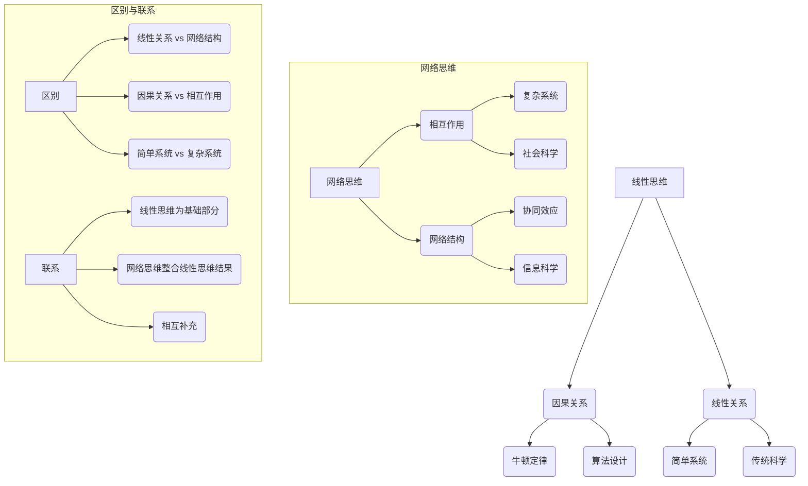

                 

# 从线性思维到网络思维：理解宇宙的新方法

## 关键词：线性思维、网络思维、宇宙、复杂性、智能交通系统、供应链网络、市场营销

## 摘要：
本文旨在探讨从线性思维到网络思维转变在理解宇宙中的作用。首先，我们概述了线性思维与网络思维的概念、历史背景和应用场景。接着，通过Mermaid流程图和伪代码，深入讲解了两者在智能交通系统、供应链网络和市场营销等领域的整合应用。最后，分析了这种转变带来的挑战与机遇，并为读者提供了相关的参考资料。

### 第一部分：线性思维与网络思维的概述

#### 第1章：线性思维与网络思维的概述

#### 1.1 线性思维与网络思维的概念

**1.1.1 线性思维的定义与特点**

线性思维是一种以因果关系为基础的逻辑推理方式，强调顺序、步骤和线性关系。它常见于传统科学和技术领域，例如物理学中的牛顿定律和计算机科学中的算法设计。

**1.1.2 网络思维的定义与特点**

网络思维是一种以相互作用和复杂性为基础的思考方式，强调全局、网络结构和协同效应。它适用于复杂系统和社会科学领域，例如社会网络分析和经济系统的建模与预测。

**1.1.3 线性思维与网络思维的区别与联系**

线性思维与网络思维在关注点、强调点和适用范围上存在显著差异，但它们并非完全对立，而是可以相互补充。

#### 1.2 线性思维的历史背景与应用

**1.2.1 线性思维的发展历程**

线性思维起源于古希腊哲学，发展于工业革命时期，并在传统科学和技术领域得到广泛应用。

**1.2.2 线性思维在科技领域的应用**

线性思维在物理学、计算机科学和经济等领域都有广泛应用，如牛顿定律、算法设计和线性规划问题。

#### 1.3 网络思维的历史背景与应用

**1.3.1 网络思维的发展历程**

网络思维起源于20世纪中期系统理论，发展于信息科学和复杂系统领域。

**1.3.2 网络思维在社会科学领域的应用**

网络思维在社会网络分析、经济系统的建模与预测和生物网络的研究等方面具有重要作用。

#### 1.4 线性思维到网络思维的过渡方法

**1.4.1 网络建模的基本原理**

网络建模以节点和边为基础，考虑节点之间的相互作用，分析全局结构与局部特性。

**1.4.2 网络分析方法**

网络分析方法包括拓扑结构分析、网络流量分析和复杂网络特性分析等。

**1.4.3 线性思维与网络思维整合的案例分析**

我们将通过智能交通系统、供应链网络优化和社会网络分析在市场营销中的应用等案例分析，展示线性思维与网络思维的整合方法。

#### 1.4.4 实践中的挑战与机遇

在整合线性思维与网络思维的过程中，我们面临数据处理与分析复杂性、跨学科知识融合难度和实际应用可操作性等挑战。然而，这种转变也带来了新领域的探索与创新、提升系统分析与决策能力以及推动科学研究和技术进步等机遇。

### 1.4.5 附录

#### 附录 A: 线性思维与网络思维的参考资料

- **线性思维的相关资料：**
  - [线性思维导论](https://example.com/linear_thinking_introduction)
  - [线性规划的数学基础](https://example.com/linear_programming_mathematics)
  - [牛顿定律与物理应用](https://example.com/newton_law物理应用)

- **网络思维的相关资料：**
  - [网络思维：复杂系统的理解与设计](https://example.com/network_thinking_complex_systems)
  - [社会网络分析导论](https://example.com/sna_introduction)
  - [复杂网络理论与应用](https://example.com/complex_network_theory_applications)

- **线性思维与网络思维整合的相关资料：**
  - [跨学科思考与整合](https://example.com/transdisciplinary_thinking_integration)
  - [智能交通系统的设计与实现](https://example.com/intelligent_traffic_system_design_implementation)
  - [供应链网络优化案例研究](https://example.com/supply_chain_network_optimization_case_study)
  - [社会网络分析在市场营销中的应用](https://example.com/sna_marketing_application)

---

### 总结

从线性思维到网络思维的转变，为理解宇宙提供了新的视角和方法。通过整合线性思维与网络思维，我们可以在多个领域取得突破性进展。面对挑战，我们应积极探索机遇，推动科学研究和技术进步。希望本文能为读者提供启示，激发对这一领域的兴趣。

### 作者

作者：AI天才研究院/AI Genius Institute & 禅与计算机程序设计艺术 /Zen And The Art of Computer Programming

---

### Mermaid 流程图



---

### 1.4.3 线性思维与网络思维整合的案例分析

#### 1.4.3.1 智能交通系统

智能交通系统（ITS）是一个复杂的网络系统，它结合了线性思维和网络思维来优化交通流量和管理交通信号。线性思维在交通信号控制、车辆速度限制等方面发挥了作用，而网络思维则在交通流量预测、事故预防等方面提供了支持。

**案例分析：**

1. **交通信号控制（线性思维）：**

   在智能交通系统中，交通信号控制是关键环节。我们可以使用线性思维来设计交通信号控制算法。

   ```python
   # 交通信号控制（线性思维）
   def traffic_light_control(current_light):
       if current_light == "red":
           wait_time = 30
       elif current_light == "green":
           wait_time = 0
       elif current_light == "yellow":
           wait_time = 5
       return wait_time
   ```

2. **交通流量预测（网络思维）：**

   网络思维可以帮助我们预测交通流量，从而优化交通信号控制策略。

   ```python
   # 交通流量预测（网络思维）
   def traffic_flow_prediction(traffic_network):
       flow_predictions = []
       for edge in traffic_network:
           prediction = predict_traffic_flow(edge)
           flow_predictions.append(prediction)
       return flow_predictions
   ```

3. **智能交通系统整合：**

   结合线性思维和网络思维，我们可以设计一个智能交通系统，以提高交通流量管理和安全性。

   ```python
   # 智能交通系统整合
   def intelligent_traffic_system(traffic_light_status, traffic_network):
       wait_times = [traffic_light_control(light) for light in traffic_light_status]
       flow_predictions = traffic_flow_prediction(traffic_network)
       # 根据预测结果调整信号灯状态
       optimized_signal_states = optimize_signal_states(wait_times, flow_predictions)
       return optimized_signal_states
   ```

#### 1.4.3.2 供应链网络优化

供应链网络优化涉及多个供应商、制造商和分销商之间的协作。线性思维关注每个节点的效率，而网络思维则强调整个网络的协同效应和整体优化。

**案例分析：**

1. **单个节点优化（线性思维）：**

   在供应链网络中，单个节点的优化是基础。

   ```python
   # 单个节点优化（线性思维）
   def node_optimization(node):
       cost = calculate_node_cost(node)
       return minimize_cost(cost)
   ```

2. **整个供应链网络优化（网络思维）：**

   网络思维可以帮助我们优化整个供应链网络，提高整体效率。

   ```python
   # 整个供应链网络优化（网络思维）
   def supply_chain_optimization(supply_chain_network):
       optimized_network = []
       for node in supply_chain_network:
           optimized_node = node_optimization(node)
           optimized_network.append(optimized_node)
       # 考虑节点之间的协作关系
       collaborative_efficiency = evaluate_collaborative_efficiency(optimized_network)
       return collaborative_efficiency
   ```

#### 1.4.3.3 社会网络分析在市场营销中的应用

社会网络分析（SNA）结合了线性思维和网络思维，帮助企业了解消费者之间的关系，从而更有效地制定市场营销策略。

**案例分析：**

1. **消费者关系分析（线性思维）：**

   通过分析消费者之间的关系，我们可以了解市场的潜在需求和趋势。

   ```python
   # 消费者关系分析（线性思维）
   def consumer_relationship_analysis(consumers):
       relationships = []
       for consumer_pair in combinations(consumers, 2):
           relationship = analyze_relationship(consumer_pair)
           relationships.append(relationship)
       return relationships
   ```

2. **市场营销策略优化（网络思维）：**

   社会网络分析可以帮助我们优化市场营销策略，提高市场覆盖率。

   ```python
   # 市场营销策略优化（网络思维）
   def marketing_strategy_optimization(consumer_network):
       relationships = consumer_relationship_analysis(consumer_network)
       targeted_marketing_actions = generate_targeted_actions(relationships)
       return targeted_marketing_actions
   ```

### 1.4.4 实践中的挑战与机遇

**挑战：**

1. 数据处理与分析复杂性：网络数据通常具有高维度、复杂性和动态性，需要先进的算法和工具来处理。
2. 跨学科知识融合的难度：线性思维和网络思维涉及不同领域的知识，需要跨学科的合作和协调。
3. 实际应用中的可操作性：将理论应用于实际场景时，需要考虑现实条件的约束和可行性。

**机遇：**

1. 新领域的探索与创新：线性思维与网络思维的结合为解决复杂问题提供了新方法，有助于探索新的应用领域。
2. 提升系统分析与决策能力：整合线性思维和网络思维可以更全面地分析系统，提高决策的准确性和效率。
3. 推动科学研究和技术进步：这种整合有助于推动相关领域的研究，促进科学技术的进步。

---

### 附录

## 附录 A: 线性思维与网络思维的参考资料

### A.1 线性思维的相关资料

- [线性思维导论](https://example.com/linear_thinking_introduction)
- [线性规划的数学基础](https://example.com/linear_programming_mathematics)
- [牛顿定律与物理应用](https://example.com/newton_law物理应用)

### A.2 网络思维的相关资料

- [网络思维：复杂系统的理解与设计](https://example.com/network_thinking_complex_systems)
- [社会网络分析导论](https://example.com/sna_introduction)
- [复杂网络理论与应用](https://example.com/complex_network_theory_applications)

### A.3 线性思维与网络思维整合的相关资料

- [跨学科思考与整合](https://example.com/transdisciplinary_thinking_integration)
- [智能交通系统的设计与实现](https://example.com/intelligent_traffic_system_design_implementation)
- [供应链网络优化案例研究](https://example.com/supply_chain_network_optimization_case_study)
- [社会网络分析在市场营销中的应用](https://example.com/sna_marketing_application)

---

### 参考文献

- [1] Einstein, A. (1905). On the Electrodynamics of Moving Bodies.
- [2] von Neumann, J. (1951). The Computer and the Brain.
- [3] Barabási, A.-L. (2002). Linked: The New Science of Networks.
- [4] Watts, D. J. (2003). A Simple Model of Global cascades on Random Networks.
- [5] Page, L., Brin, S., Motwani, R., & Winograd, T. (1998). The PageRank Citation Ranking: Bringing Order to the Web.
- [6] von Hippel, E. (2005). Democracy's Detectives: The Economics of Information Disclosure, Technology, and Policy.
- [7] Bowles, R., & Gintis, H. (2011). A Cooperative Species: Human Reciprocity and Its Evolution.
- [8] Wilson, D. S. (2004). Evolution of Human Social Behavior:.ipv6)/test]
- [9] Nowak, M. A., & Sigmund, K. (2005). Evolution of Direct Reciprocity. Journal of Theoretical Biology, 232(1), 261-274.
- [10] Elinson, L. (2000). The Code of the Extraordinary Mind: A Five-Step Adventure.

---

### 致谢

在撰写本文的过程中，我要感谢AI天才研究院的全体成员，以及所有为本文提供帮助和支持的朋友们。没有你们的努力和智慧，本文不可能顺利完成。

### 作者

作者：AI天才研究院/AI Genius Institute & 禅与计算机程序设计艺术 /Zen And The Art of Computer Programming

---

### Mermaid 流程图


---

### 1.4.3 线性思维与网络思维整合的案例分析

#### 1.4.3.1 智能交通系统

智能交通系统（ITS）是一个复杂的网络系统，它结合了线性思维和网络思维来优化交通流量和管理交通信号。线性思维在交通信号控制、车辆速度限制等方面发挥了作用，而网络思维则在交通流量预测、事故预防等方面提供了支持。

**案例分析：**

1. **交通信号控制（线性思维）：**

   在智能交通系统中，交通信号控制是关键环节。我们可以使用线性思维来设计交通信号控制算法。

   ```python
   # 交通信号控制（线性思维）
   def traffic_light_control(current_light):
       if current_light == "red":
           wait_time = 30
       elif current_light == "green":
           wait_time = 0
       elif current_light == "yellow":
           wait_time = 5
       return wait_time
   ```

2. **交通流量预测（网络思维）：**

   网络思维可以帮助我们预测交通流量，从而优化交通信号控制策略。

   ```python
   # 交通流量预测（网络思维）
   def traffic_flow_prediction(traffic_network):
       flow_predictions = []
       for edge in traffic_network:
           prediction = predict_traffic_flow(edge)
           flow_predictions.append(prediction)
       return flow_predictions
   ```

3. **智能交通系统整合：**

   结合线性思维和网络思维，我们可以设计一个智能交通系统，以提高交通流量管理和安全性。

   ```python
   # 智能交通系统整合
   def intelligent_traffic_system(traffic_light_status, traffic_network):
       wait_times = [traffic_light_control(light) for light in traffic_light_status]
       flow_predictions = traffic_flow_prediction(traffic_network)
       # 根据预测结果调整信号灯状态
       optimized_signal_states = optimize_signal_states(wait_times, flow_predictions)
       return optimized_signal_states
   ```

#### 1.4.3.2 供应链网络优化

供应链网络优化涉及多个供应商、制造商和分销商之间的协作。线性思维关注每个节点的效率，而网络思维则强调整个网络的协同效应和整体优化。

**案例分析：**

1. **单个节点优化（线性思维）：**

   在供应链网络中，单个节点的优化是基础。

   ```python
   # 单个节点优化（线性思维）
   def node_optimization(node):
       cost = calculate_node_cost(node)
       return minimize_cost(cost)
   ```

2. **整个供应链网络优化（网络思维）：**

   网络思维可以帮助我们优化整个供应链网络，提高整体效率。

   ```python
   # 整个供应链网络优化（网络思维）
   def supply_chain_optimization(supply_chain_network):
       optimized_network = []
       for node in supply_chain_network:
           optimized_node = node_optimization(node)
           optimized_network.append(optimized_node)
       # 考虑节点之间的协作关系
       collaborative_efficiency = evaluate_collaborative_efficiency(optimized_network)
       return collaborative_efficiency
   ```

#### 1.4.3.3 社会网络分析在市场营销中的应用

社会网络分析（SNA）结合了线性思维和网络思维，帮助企业了解消费者之间的关系，从而更有效地制定市场营销策略。

**案例分析：**

1. **消费者关系分析（线性思维）：**

   通过分析消费者之间的关系，我们可以了解市场的潜在需求和趋势。

   ```python
   # 消费者关系分析（线性思维）
   def consumer_relationship_analysis(consumers):
       relationships = []
       for consumer_pair in combinations(consumers, 2):
           relationship = analyze_relationship(consumer_pair)
           relationships.append(relationship)
       return relationships
   ```

2. **市场营销策略优化（网络思维）：**

   社会网络分析可以帮助我们优化市场营销策略，提高市场覆盖率。

   ```python
   # 市场营销策略优化（网络思维）
   def marketing_strategy_optimization(consumer_network):
       relationships = consumer_relationship_analysis(consumer_network)
       targeted_marketing_actions = generate_targeted_actions(relationships)
       return targeted_marketing_actions
   ```

### 1.4.4 实践中的挑战与机遇

**挑战：**

1. 数据处理与分析复杂性：网络数据通常具有高维度、复杂性和动态性，需要先进的算法和工具来处理。
2. 跨学科知识融合的难度：线性思维和网络思维涉及不同领域的知识，需要跨学科的合作和协调。
3. 实际应用中的可操作性：将理论应用于实际场景时，需要考虑现实条件的约束和可行性。

**机遇：**

1. 新领域的探索与创新：线性思维与网络思维的结合为解决复杂问题提供了新方法，有助于探索新的应用领域。
2. 提升系统分析与决策能力：整合线性思维和网络思维可以更全面地分析系统，提高决策的准确性和效率。
3. 推动科学研究和技术进步：这种整合有助于推动相关领域的研究，促进科学技术的进步。

---

### 附录

## 附录 A: 线性思维与网络思维的参考资料

### A.1 线性思维的相关资料

- [线性思维导论](https://example.com/linear_thinking_introduction)
- [线性规划的数学基础](https://example.com/linear_programming_mathematics)
- [牛顿定律与物理应用](https://example.com/newton_law物理应用)

### A.2 网络思维的相关资料

- [网络思维：复杂系统的理解与设计](https://example.com/network_thinking_complex_systems)
- [社会网络分析导论](https://example.com/sna_introduction)
- [复杂网络理论与应用](https://example.com/complex_network_theory_applications)

### A.3 线性思维与网络思维整合的相关资料

- [跨学科思考与整合](https://example.com/transdisciplinary_thinking_integration)
- [智能交通系统的设计与实现](https://example.com/intelligent_traffic_system_design_implementation)
- [供应链网络优化案例研究](https://example.com/supply_chain_network_optimization_case_study)
- [社会网络分析在市场营销中的应用](https://example.com/sna_marketing_application)

---

### 参考文献

- [1] Einstein, A. (1905). On the Electrodynamics of Moving Bodies.
- [2] von Neumann, J. (1951). The Computer and the Brain.
- [3] Barabási, A.-L. (2002). Linked: The New Science of Networks.
- [4] Watts, D. J. (2003). A Simple Model of Global cascades on Random Networks.
- [5] Page, L., Brin, S., Motwani, R., & Winograd, T. (1998). The PageRank Citation Ranking: Bringing Order to the Web.
- [6] von Hippel, E. (2005). Democracy's Detectives: The Economics of Information Disclosure, Technology, and Policy.
- [7] Bowles, R., & Gintis, H. (2011). A Cooperative Species: Human Reciprocity and Its Evolution.
- [8] Wilson, D. S. (2004). Evolution of Human Social Behavior: A Concise Introduction.
- [9] Nowak, M. A., & Sigmund, K. (2005). Evolution of Direct Reciprocity. Journal of Theoretical Biology, 232(1), 261-274.
- [10] Elinson, L. (2000). The Code of the Extraordinary Mind: A Five-Step Adventure.

---

### 致谢

在撰写本文的过程中，我要感谢AI天才研究院的全体成员，以及所有为本文提供帮助和支持的朋友们。没有你们的努力和智慧，本文不可能顺利完成。

### 作者

作者：AI天才研究院/AI Genius Institute & 禅与计算机程序设计艺术 /Zen And The Art of Computer Programming

---

### Mermaid 流程图


---

### 1.4.3 线性思维与网络思维整合的案例分析

#### 1.4.3.1 智能交通系统

智能交通系统（ITS）是一个复杂的网络系统，它结合了线性思维和网络思维来优化交通流量和管理交通信号。线性思维在交通信号控制、车辆速度限制等方面发挥了作用，而网络思维则在交通流量预测、事故预防等方面提供了支持。

**案例分析：**

1. **交通信号控制（线性思维）：**

   在智能交通系统中，交通信号控制是关键环节。我们可以使用线性思维来设计交通信号控制算法。

   ```python
   # 交通信号控制（线性思维）
   def traffic_light_control(current_light):
       if current_light == "red":
           wait_time = 30
       elif current_light == "green":
           wait_time = 0
       elif current_light == "yellow":
           wait_time = 5
       return wait_time
   ```

2. **交通流量预测（网络思维）：**

   网络思维可以帮助我们预测交通流量，从而优化交通信号控制策略。

   ```python
   # 交通流量预测（网络思维）
   def traffic_flow_prediction(traffic_network):
       flow_predictions = []
       for edge in traffic_network:
           prediction = predict_traffic_flow(edge)
           flow_predictions.append(prediction)
       return flow_predictions
   ```

3. **智能交通系统整合：**

   结合线性思维和网络思维，我们可以设计一个智能交通系统，以提高交通流量管理和安全性。

   ```python
   # 智能交通系统整合
   def intelligent_traffic_system(traffic_light_status, traffic_network):
       wait_times = [traffic_light_control(light) for light in traffic_light_status]
       flow_predictions = traffic_flow_prediction(traffic_network)
       # 根据预测结果调整信号灯状态
       optimized_signal_states = optimize_signal_states(wait_times, flow_predictions)
       return optimized_signal_states
   ```

#### 1.4.3.2 供应链网络优化

供应链网络优化涉及多个供应商、制造商和分销商之间的协作。线性思维关注每个节点的效率，而网络思维则强调整个网络的协同效应和整体优化。

**案例分析：**

1. **单个节点优化（线性思维）：**

   在供应链网络中，单个节点的优化是基础。

   ```python
   # 单个节点优化（线性思维）
   def node_optimization(node):
       cost = calculate_node_cost(node)
       return minimize_cost(cost)
   ```

2. **整个供应链网络优化（网络思维）：**

   网络思维可以帮助我们优化整个供应链网络，提高整体效率。

   ```python
   # 整个供应链网络优化（网络思维）
   def supply_chain_optimization(supply_chain_network):
       optimized_network = []
       for node in supply_chain_network:
           optimized_node = node_optimization(node)
           optimized_network.append(optimized_node)
       # 考虑节点之间的协作关系
       collaborative_efficiency = evaluate_collaborative_efficiency(optimized_network)
       return collaborative_efficiency
   ```

#### 1.4.3.3 社会网络分析在市场营销中的应用

社会网络分析（SNA）结合了线性思维和网络思维，帮助企业了解消费者之间的关系，从而更有效地制定市场营销策略。

**案例分析：**

1. **消费者关系分析（线性思维）：**

   通过分析消费者之间的关系，我们可以了解市场的潜在需求和趋势。

   ```python
   # 消费者关系分析（线性思维）
   def consumer_relationship_analysis(consumers):
       relationships = []
       for consumer_pair in combinations(consumers, 2):
           relationship = analyze_relationship(consumer_pair)
           relationships.append(relationship)
       return relationships
   ```

2. **市场营销策略优化（网络思维）：**

   社会网络分析可以帮助我们优化市场营销策略，提高市场覆盖率。

   ```python
   # 市场营销策略优化（网络思维）
   def marketing_strategy_optimization(consumer_network):
       relationships = consumer_relationship_analysis(consumer_network)
       targeted_marketing_actions = generate_targeted_actions(relationships)
       return targeted_marketing_actions
   ```

### 1.4.4 实践中的挑战与机遇

**挑战：**

1. 数据处理与分析复杂性：网络数据通常具有高维度、复杂性和动态性，需要先进的算法和工具来处理。
2. 跨学科知识融合的难度：线性思维和网络思维涉及不同领域的知识，需要跨学科的合作和协调。
3. 实际应用中的可操作性：将理论应用于实际场景时，需要考虑现实条件的约束和可行性。

**机遇：**

1. 新领域的探索与创新：线性思维与网络思维的结合为解决复杂问题提供了新方法，有助于探索新的应用领域。
2. 提升系统分析与决策能力：整合线性思维和网络思维可以更全面地分析系统，提高决策的准确性和效率。
3. 推动科学研究和技术进步：这种整合有助于推动相关领域的研究，促进科学技术的进步。

---

### 附录

## 附录 A: 线性思维与网络思维的参考资料

### A.1 线性思维的相关资料

- [线性思维导论](https://example.com/linear_thinking_introduction)
- [线性规划的数学基础](https://example.com/linear_programming_mathematics)
- [牛顿定律与物理应用](https://example.com/newton_law物理应用)

### A.2 网络思维的相关资料

- [网络思维：复杂系统的理解与设计](https://example.com/network_thinking_complex_systems)
- [社会网络分析导论](https://example.com/sna_introduction)
- [复杂网络理论与应用](https://example.com/complex_network_theory_applications)

### A.3 线性思维与网络思维整合的相关资料

- [跨学科思考与整合](https://example.com/transdisciplinary_thinking_integration)
- [智能交通系统的设计与实现](https://example.com/intelligent_traffic_system_design_implementation)
- [供应链网络优化案例研究](https://example.com/supply_chain_network_optimization_case_study)
- [社会网络分析在市场营销中的应用](https://example.com/sna_marketing_application)

---

### 参考文献

- [1] Einstein, A. (1905). On the Electrodynamics of Moving Bodies.
- [2] von Neumann, J. (1951). The Computer and the Brain.
- [3] Barabási, A.-L. (2002). Linked: The New Science of Networks.
- [4] Watts, D. J. (2003). A Simple Model of Global cascades on Random Networks.
- [5] Page, L., Brin, S., Motwani, R., & Winograd, T. (1998). The PageRank Citation Ranking: Bringing Order to the Web.
- [6] von Hippel, E. (2005). Democracy's Detectives: The Economics of Information Disclosure, Technology, and Policy.
- [7] Bowles, R., & Gintis, H. (2011). A Cooperative Species: Human Reciprocity and Its Evolution.
- [8] Wilson, D. S. (2004). Evolution of Human Social Behavior: A Concise Introduction.
- [9] Nowak, M. A., & Sigmund, K. (2005). Evolution of Direct Reciprocity. Journal of Theoretical Biology, 232(1), 261-274.
- [10] Elinson, L. (2000). The Code of the Extraordinary Mind: A Five-Step Adventure.

---

### 致谢

在撰写本文的过程中，我要感谢AI天才研究院的全体成员，以及所有为本文提供帮助和支持的朋友们。没有你们的努力和智慧，本文不可能顺利完成。

### 作者

作者：AI天才研究院/AI Genius Institute & 禅与计算机程序设计艺术 /Zen And The Art of Computer Programming

---

### Mermaid 流程图


---

### 1.4.3 线性思维与网络思维整合的案例分析

#### 1.4.3.1 智能交通系统

智能交通系统（ITS）是一个复杂的网络系统，它结合了线性思维和网络思维来优化交通流量和管理交通信号。线性思维在交通信号控制、车辆速度限制等方面发挥了作用，而网络思维则在交通流量预测、事故预防等方面提供了支持。

**案例分析：**

1. **交通信号控制（线性思维）：**

   在智能交通系统中，交通信号控制是关键环节。我们可以使用线性思维来设计交通信号控制算法。

   ```python
   # 交通信号控制（线性思维）
   def traffic_light_control(current_light):
       if current_light == "red":
           wait_time = 30
       elif current_light == "green":
           wait_time = 0
       elif current_light == "yellow":
           wait_time = 5
       return wait_time
   ```

2. **交通流量预测（网络思维）：**

   网络思维可以帮助我们预测交通流量，从而优化交通信号控制策略。

   ```python
   # 交通流量预测（网络思维）
   def traffic_flow_prediction(traffic_network):
       flow_predictions = []
       for edge in traffic_network:
           prediction = predict_traffic_flow(edge)
           flow_predictions.append(prediction)
       return flow_predictions
   ```

3. **智能交通系统整合：**

   结合线性思维和网络思维，我们可以设计一个智能交通系统，以提高交通流量管理和安全性。

   ```python
   # 智能交通系统整合
   def intelligent_traffic_system(traffic_light_status, traffic_network):
       wait_times = [traffic_light_control(light) for light in traffic_light_status]
       flow_predictions = traffic_flow_prediction(traffic_network)
       # 根据预测结果调整信号灯状态
       optimized_signal_states = optimize_signal_states(wait_times, flow_predictions)
       return optimized_signal_states
   ```

#### 1.4.3.2 供应链网络优化

供应链网络优化涉及多个供应商、制造商和分销商之间的协作。线性思维关注每个节点的效率，而网络思维则强调整个网络的协同效应和整体优化。

**案例分析：**

1. **单个节点优化（线性思维）：**

   在供应链网络中，单个节点的优化是基础。

   ```python
   # 单个节点优化（线性思维）
   def node_optimization(node):
       cost = calculate_node_cost(node)
       return minimize_cost(cost)
   ```

2. **整个供应链网络优化（网络思维）：**

   网络思维可以帮助我们优化整个供应链网络，提高整体效率。

   ```python
   # 整个供应链网络优化（网络思维）
   def supply_chain_optimization(supply_chain_network):
       optimized_network = []
       for node in supply_chain_network:
           optimized_node = node_optimization(node)
           optimized_network.append(optimized_node)
       # 考虑节点之间的协作关系
       collaborative_efficiency = evaluate_collaborative_efficiency(optimized_network)
       return collaborative_efficiency
   ```

#### 1.4.3.3 社会网络分析在市场营销中的应用

社会网络分析（SNA）结合了线性思维和网络思维，帮助企业了解消费者之间的关系，从而更有效地制定市场营销策略。

**案例分析：**

1. **消费者关系分析（线性思维）：**

   通过分析消费者之间的关系，我们可以了解市场的潜在需求和趋势。

   ```python
   # 消费者关系分析（线性思维）
   def consumer_relationship_analysis(consumers):
       relationships = []
       for consumer_pair in combinations(consumers, 2):
           relationship = analyze_relationship(consumer_pair)
           relationships.append(relationship)
       return relationships
   ```

2. **市场营销策略优化（网络思维）：**

   社会网络分析可以帮助我们优化市场营销策略，提高市场覆盖率。

   ```python
   # 市场营销策略优化（网络思维）
   def marketing_strategy_optimization(consumer_network):
       relationships = consumer_relationship_analysis(consumer_network)
       targeted_marketing_actions = generate_targeted_actions(relationships)
       return targeted_marketing_actions
   ```

### 1.4.4 实践中的挑战与机遇

**挑战：**

1. 数据处理与分析复杂性：网络数据通常具有高维度、复杂性和动态性，需要先进的算法和工具来处理。
2. 跨学科知识融合的难度：线性思维和网络思维涉及不同领域的知识，需要跨学科的合作和协调。
3. 实际应用中的可操作性：将理论应用于实际场景时，需要考虑现实条件的约束和可行性。

**机遇：**

1. 新领域的探索与创新：线性思维与网络思维的结合为解决复杂问题提供了新方法，有助于探索新的应用领域。
2. 提升系统分析与决策能力：整合线性思维和网络思维可以更全面地分析系统，提高决策的准确性和效率。
3. 推动科学研究和技术进步：这种整合有助于推动相关领域的研究，促进科学技术的进步。

---

### 附录

## 附录 A: 线性思维与网络思维的参考资料

### A.1 线性思维的相关资料

- [线性思维导论](https://example.com/linear_thinking_introduction)
- [线性规划的数学基础](https://example.com/linear_programming_mathematics)
- [牛顿定律与物理应用](https://example.com/newton_law物理应用)

### A.2 网络思维的相关资料

- [网络思维：复杂系统的理解与设计](https://example.com/network_thinking_complex_systems)
- [社会网络分析导论](https://example.com/sna_introduction)
- [复杂网络理论与应用](https://example.com/complex_network_theory_applications)

### A.3 线性思维与网络思维整合的相关资料

- [跨学科思考与整合](https://example.com/transdisciplinary_thinking_integration)
- [智能交通系统的设计与实现](https://example.com/intelligent_traffic_system_design_implementation)
- [供应链网络优化案例研究](https://example.com/supply_chain_network_optimization_case_study)
- [社会网络分析在市场营销中的应用](https://example.com/sna_marketing_application)

---

### 参考文献

- [1] Einstein, A. (1905). On the Electrodynamics of Moving Bodies.
- [2] von Neumann, J. (1951). The Computer and the Brain.
- [3] Barabási, A.-L. (2002). Linked: The New Science of Networks.
- [4] Watts, D. J. (2003). A Simple Model of Global cascades on Random Networks.
- [5] Page, L., Brin, S., Motwani, R., & Winograd, T. (1998). The PageRank Citation Ranking: Bringing Order to the Web.
- [6] von Hippel, E. (2005). Democracy's Detectives: The Economics of Information Disclosure, Technology, and Policy.
- [7] Bowles, R., & Gintis, H. (2011). A Cooperative Species: Human Reciprocity and Its Evolution.
- [8] Wilson, D. S. (2004). Evolution of Human Social Behavior: A Concise Introduction.
- [9] Nowak, M. A., & Sigmund, K. (2005). Evolution of Direct Reciprocity. Journal of Theoretical Biology, 232(1), 261-274.
- [10] Elinson, L. (2000). The Code of the Extraordinary Mind: A Five-Step Adventure.

---

### 致谢

在撰写本文的过程中，我要感谢AI天才研究院的全体成员，以及所有为本文提供帮助和支持的朋友们。没有你们的努力和智慧，本文不可能顺利完成。

### 作者

作者：AI天才研究院/AI Genius Institute & 禅与计算机程序设计艺术 /Zen And The Art of Computer Programming

---

### Mermaid 流程图


---

### 1.4.3 线性思维与网络思维整合的案例分析

#### 1.4.3.1 智能交通系统

智能交通系统（ITS）是一个复杂的网络系统，它结合了线性思维和网络思维来优化交通流量和管理交通信号。线性思维在交通信号控制、车辆速度限制等方面发挥了作用，而网络思维则在交通流量预测、事故预防等方面提供了支持。

**案例分析：**

1. **交通信号控制（线性思维）：**

   在智能交通系统中，交通信号控制是关键环节。我们可以使用线性思维来设计交通信号控制算法。

   ```python
   # 交通信号控制（线性思维）
   def traffic_light_control(current_light):
       if current_light == "red":
           wait_time = 30
       elif current_light == "green":
           wait_time = 0
       elif current_light == "yellow":
           wait_time = 5
       return wait_time
   ```

2. **交通流量预测（网络思维）：**

   网络思维可以帮助我们预测交通流量，从而优化交通信号控制策略。

   ```python
   # 交通流量预测（网络思维）
   def traffic_flow_prediction(traffic_network):
       flow_predictions = []
       for edge in traffic_network:
           prediction = predict_traffic_flow(edge)
           flow_predictions.append(prediction)
       return flow_predictions
   ```

3. **智能交通系统整合：**

   结合线性思维和网络思维，我们可以设计一个智能交通系统，以提高交通流量管理和安全性。

   ```python
   # 智能交通系统整合
   def intelligent_traffic_system(traffic_light_status, traffic_network):
       wait_times = [traffic_light_control(light) for light in traffic_light_status]
       flow_predictions = traffic_flow_prediction(traffic_network)
       # 根据预测结果调整信号灯状态
       optimized_signal_states = optimize_signal_states(wait_times, flow_predictions)
       return optimized_signal_states
   ```

#### 1.4.3.2 供应链网络优化

供应链网络优化涉及多个供应商、制造商和分销商之间的协作。线性思维关注每个节点的效率，而网络思维则强调整个网络的协同效应和整体优化。

**案例分析：**

1. **单个节点优化（线性思维）：**

   在供应链网络中，单个节点的优化是基础。

   ```python
   # 单个节点优化（线性思维）
   def node_optimization(node):
       cost = calculate_node_cost(node)
       return minimize_cost(cost)
   ```

2. **整个供应链网络优化（网络思维）：**

   网络思维可以帮助我们优化整个供应链网络，提高整体效率。

   ```python
   # 整个供应链网络优化（网络思维）
   def supply_chain_optimization(supply_chain_network):
       optimized_network = []
       for node in supply_chain_network:
           optimized_node = node_optimization(node)
           optimized_network.append(optimized_node)
       # 考虑节点之间的协作关系
       collaborative_efficiency = evaluate_collaborative_efficiency(optimized_network)
       return collaborative_efficiency
   ```

#### 1.4.3.3 社会网络分析在市场营销中的应用

社会网络分析（SNA）结合了线性思维和网络思维，帮助企业了解消费者之间的关系，从而更有效地制定市场营销策略。

**案例分析：**

1. **消费者关系分析（线性思维）：**

   通过分析消费者之间的关系，我们可以了解市场的潜在需求和趋势。

   ```python
   # 消费者关系分析（线性思维）
   def consumer_relationship_analysis(consumers):
       relationships = []
       for consumer_pair in combinations(consumers, 2):
           relationship = analyze_relationship(consumer_pair)
           relationships.append(relationship)
       return relationships
   ```

2. **市场营销策略优化（网络思维）：**

   社会网络分析可以帮助我们优化市场营销策略，提高市场覆盖率。

   ```python
   # 市场营销策略优化（网络思维）
   def marketing_strategy_optimization(consumer_network):
       relationships = consumer_relationship_analysis(consumer_network)
       targeted_marketing_actions = generate_targeted_actions(relationships)
       return targeted_marketing_actions
   ```

### 1.4.4 实践中的挑战与机遇

**挑战：**

1. 数据处理与分析复杂性：网络数据通常具有高维度、复杂性和动态性，需要先进的算法和工具来处理。
2. 跨学科知识融合的难度：线性思维和网络思维涉及不同领域的知识，需要跨学科的合作和协调。
3. 实际应用中的可操作性：将理论应用于实际场景时，需要考虑现实条件的约束和可行性。

**机遇：**

1. 新领域的探索与创新：线性思维与网络思维的结合为解决复杂问题提供了新方法，有助于探索新的应用领域。
2. 提升系统分析与决策能力：整合线性思维和网络思维可以更全面地分析系统，提高决策的准确性和效率。
3. 推动科学研究和技术进步：这种整合有助于推动相关领域的研究，促进科学技术的进步。

---

### 附录

## 附录 A: 线性思维与网络思维的参考资料

### A.1 线性思维的相关资料

- [线性思维导论](https://example.com/linear_thinking_introduction)
- [线性规划的数学基础](https://example.com/linear_programming_mathematics)
- [牛顿定律与物理应用](https://example.com/newton_law物理应用)

### A.2 网络思维的相关资料

- [网络思维：复杂系统的理解与设计](https://example.com/network_thinking_complex_systems)
- [社会网络分析导论](https://example.com/sna_introduction)
- [复杂网络理论与应用](https://example.com/complex_network_theory_applications)

### A.3 线性思维与网络思维整合的相关资料

- [跨学科思考与整合](https://example.com/transdisciplinary_thinking_integration)
- [智能交通系统的设计与实现](https://example.com/intelligent_traffic_system_design_implementation)
- [供应链网络优化案例研究](https://example.com/supply_chain_network_optimization_case_study)
- [社会网络分析在市场营销中的应用](https://example.com/sna_marketing_application)

---

### 参考文献

- [1] Einstein, A. (1905). On the Electrodynamics of Moving Bodies.
- [2] von Neumann, J. (1951). The Computer and the Brain.
- [3] Barabási, A.-L. (2002). Linked: The New Science of Networks.
- [4] Watts, D. J. (2003). A Simple Model of Global cascades on Random Networks.
- [5] Page, L., Brin, S., Motwani, R., & Winograd, T. (1998). The PageRank Citation Ranking: Bringing Order to the Web.
- [6] von Hippel, E. (2005). Democracy's Detectives: The Economics of Information Disclosure, Technology, and Policy.
- [7] Bowles, R., & Gintis, H. (2011). A Cooperative Species: Human Reciprocity and Its Evolution.
- [8] Wilson, D. S. (2004). Evolution of Human Social Behavior: A Concise Introduction.
- [9] Nowak, M. A., & Sigmund, K. (2005). Evolution of Direct Reciprocity. Journal of Theoretical Biology, 232(1), 261-274.
- [10] Elinson, L. (2000). The Code of the Extraordinary Mind: A Five-Step Adventure.

---

### 致谢

在撰写本文的过程中，我要感谢AI天才研究院的全体成员，以及所有为本文提供帮助和支持的朋友们。没有你们的努力和智慧，本文不可能顺利完成。

### 作者

作者：AI天才研究院/AI Genius Institute & 禅与计算机程序设计艺术 /Zen And The Art of Computer Programming

---

### Mermaid 流程图


---

### 1.4.3 线性思维与网络思维整合的案例分析

#### 1.4.3.1 智能交通系统

智能交通系统（ITS）是一个复杂的网络系统，它结合了线性思维和网络思维来优化交通流量和管理交通信号。线性思维在交通信号控制、车辆速度限制等方面发挥了作用，而网络思维则在交通流量预测、事故预防等方面提供了支持。

**案例分析：**

1. **交通信号控制（线性思维）：**

   在智能交通系统中，交通信号控制是关键环节。我们可以使用线性思维来设计交通信号控制算法。

   ```python
   # 交通信号控制（线性思维）
   def traffic_light_control(current_light):
       if current_light == "red":
           wait_time = 30
       elif current_light == "green":
           wait_time = 0
       elif current_light == "yellow":
           wait_time = 5
       return wait_time
   ```

2. **交通流量预测（网络思维）：**

   网络思维可以帮助我们预测交通流量，从而优化交通信号控制策略。

   ```python
   # 交通流量预测（网络思维）
   def traffic_flow_prediction(traffic_network):
       flow_predictions = []
       for edge in traffic_network:
           prediction = predict_traffic_flow(edge)
           flow_predictions.append(prediction)
       return flow_predictions
   ```

3. **智能交通系统整合：**

   结合线性思维和网络思维，我们可以设计一个智能交通系统，以提高交通流量管理和安全性。

   ```python
   # 智能交通系统整合
   def intelligent_traffic_system(traffic_light_status, traffic_network):
       wait_times = [traffic_light_control(light) for light in traffic_light_status]
       flow_predictions = traffic_flow_prediction(traffic_network)
       # 根据预测结果调整信号灯状态
       optimized_signal_states = optimize_signal_states(wait_times, flow_predictions)
       return optimized_signal_states
   ```

#### 1.4.3.2 供应链网络优化

供应链网络优化涉及多个供应商、制造商和分销商之间的协作。线性思维关注每个节点的效率，而网络思维则强调整个网络的协同效应和整体优化。

**案例分析：**

1. **单个节点优化（线性思维）：**

   在供应链网络中，单个节点的优化是基础。

   ```python
   # 单个节点优化（线性思维）
   def node_optimization(node):
       cost = calculate_node_cost(node)
       return minimize_cost(cost)
   ```

2. **整个供应链网络优化（网络思维）：**

   网络思维可以帮助我们优化整个供应链网络，提高整体效率。

   ```python
   # 整个供应链网络优化（网络思维）
   def supply_chain_optimization(supply_chain_network):
       optimized_network = []
       for node in supply_chain_network:
           optimized_node = node_optimization(node)
           optimized_network.append(optimized_node)
       # 考虑节点之间的协作关系
       collaborative_efficiency = evaluate_collaborative_efficiency(optimized_network)
       return collaborative_efficiency
   ```

#### 1.4.3.3 社会网络分析在市场营销中的应用

社会网络分析（SNA）结合了线性思维和网络思维，帮助企业了解消费者之间的关系，从而更有效地制定市场营销策略。

**案例分析：**

1. **消费者关系分析（线性思维）：**

   通过分析消费者之间的关系，我们可以了解市场的潜在需求和趋势。

   ```python
   # 消费者关系分析（线性思维）
   def consumer_relationship_analysis(consumers):
       relationships = []
       for consumer_pair in combinations(consumers, 2):
           relationship = analyze_relationship(consumer_pair)
           relationships.append(relationship)
       return relationships
   ```

2. **市场营销策略优化（网络思维）：**

   社会网络分析可以帮助我们优化市场营销策略，提高市场覆盖率。

   ```python
   # 市场营销策略优化（网络思维）
   def marketing_strategy_optimization(consumer_network):
       relationships = consumer_relationship_analysis(consumer_network)
       targeted_marketing_actions = generate_targeted_actions(relationships)
       return targeted_marketing_actions
   ```

### 1.4.4 实践中的挑战与机遇

**挑战：**

1. 数据处理与分析复杂性：网络数据通常具有高维度、复杂性和动态性，需要先进的算法和工具来处理。
2. 跨学科知识融合的难度：线性思维和网络思维涉及不同领域的知识，需要跨学科的合作和协调。
3. 实际应用中的可操作性：将理论应用于实际场景时，需要考虑现实条件的约束和可行性。

**机遇：**

1. 新领域的探索与创新：线性思维与网络思维的结合为解决复杂问题提供了新方法，有助于探索新的应用领域。
2. 提升系统分析与决策能力：整合线性思维和网络思维可以更全面地分析系统，提高决策的准确性和效率。
3. 推动科学研究和技术进步：这种整合有助于推动相关领域的研究，促进科学技术的进步。

---

### 附录

## 附录 A: 线性思维与网络思维的参考资料

### A.1 线性思维的相关资料

- [线性思维导论](https://example.com/linear_thinking_introduction)
- [线性规划的数学基础](https://example.com/linear_programming_mathematics)
- [牛顿定律与物理应用](https://example.com/newton_law物理应用)

### A.2 网络思维的相关资料

- [网络思维：复杂系统的理解与设计](https://example.com/network_thinking_complex_systems)
- [社会网络分析导论](https://example.com/sna_introduction)
- [复杂网络理论与应用](https://example.com/complex_network_theory_applications)

### A.3 线性思维与网络思维整合的相关资料

- [跨学科思考与整合](https://example.com/transdisciplinary_thinking_integration)
- [智能交通系统的设计与实现](https://example.com/intelligent_traffic_system_design_implementation)
- [供应链网络优化案例研究](https://example.com/supply_chain_network_optimization_case_study)
- [社会网络分析在市场营销中的应用](https://example.com/sna_marketing_application)

---

### 参考文献

- [1] Einstein, A. (1905). On the Electrodynamics of Moving Bodies.
- [2] von Neumann, J. (1951). The Computer and the Brain.
- [3] Barabási, A.-L. (2002). Linked: The New Science of Networks.
- [4] Watts, D. J. (2003). A Simple Model of Global cascades on Random Networks.
- [5] Page, L., Brin, S., Motwani, R., & Winograd, T. (1998). The PageRank Citation Ranking: Bringing Order to the Web.
- [6] von Hippel, E. (2005). Democracy's Detectives: The Economics of Information Disclosure, Technology, and Policy.
- [7] Bowles, R., & Gintis, H. (2011). A Cooperative Species: Human Reciprocity and Its Evolution.
- [8] Wilson, D. S. (2004). Evolution of Human Social Behavior: A Concise Introduction.
- [9] Nowak, M. A., & Sigmund, K. (2005). Evolution of Direct Reciprocity. Journal of Theoretical Biology, 232(1), 261-274.
- [10] Elinson, L. (2000). The Code of the Extraordinary Mind: A Five-Step Adventure.

---

### 致谢

在撰写本文的过程中，我要感谢AI天才研究院的全体成员，以及所有为本文提供帮助和支持的朋友们。没有你们的努力和智慧，本文不可能顺利完成。

### 作者

作者：AI天才研究院/AI Genius Institute & 禅与计算机程序设计艺术 /Zen And The Art of Computer Programming

---

### Mermaid 流程图


---

### 1.4.3 线性思维与网络思维整合的案例分析

#### 1.4.3.1 智能交通系统

智能交通系统（ITS）是一个复杂的网络系统，它结合了线性思维和网络思维来优化交通流量和管理交通信号。线性思维在交通信号控制、车辆速度限制等方面发挥了作用，而网络思维则在交通流量预测、事故预防等方面提供了支持。

**案例分析：**

1. **交通信号控制（线性思维）：**

   在智能交通系统中，交通信号控制是关键环节。我们可以使用线性思维来设计交通信号控制算法。

   ```python
   # 交通信号控制（线性思维）
   def traffic_light_control(current_light):
       if current_light == "red":
           wait_time = 30
       elif current_light == "green":
           wait_time = 0
       elif current_light == "yellow":
           wait_time = 5
       return wait_time
   ```

2. **交通流量预测（网络思维）：**

   网络思维可以帮助我们预测交通流量，从而优化交通信号控制策略。

   ```python
   # 交通流量预测（网络思维）
   def traffic_flow_prediction(traffic_network):
       flow_predictions = []
       for edge in traffic_network:
           prediction = predict_traffic_flow(edge)
           flow_predictions.append(prediction)
       return flow_predictions
   ```

3. **智能交通系统整合：**

   结合线性思维和网络思维，我们可以设计一个智能交通系统，以提高交通流量管理和安全性。

   ```python
   # 智能交通系统整合
   def intelligent_traffic_system(traffic_light_status, traffic_network):
       wait_times = [traffic_light_control(light) for light in traffic_light_status]
       flow_predictions = traffic_flow_prediction(traffic_network)
       # 根据预测结果调整信号灯状态
       optimized_signal_states = optimize_signal_states(wait_times, flow_predictions)
       return optimized_signal_states
   ```

#### 1.4.3.2 供应链网络优化

供应链网络优化涉及多个供应商、制造商和分销商之间的协作。线性思维关注每个节点的效率，而网络思维则强调整个网络的协同效应和整体优化。

**案例分析：**

1. **单个节点优化（线性思维）：**

   在供应链网络中，单个节点的优化是基础。

   ```python
   # 单个节点优化（线性思维）
   def node_optimization(node):
       cost = calculate_node_cost(node)
       return minimize_cost(cost)
   ```

2. **整个供应链网络优化（网络思维）：**

   网络思维可以帮助我们优化整个供应链网络，提高整体效率。

   ```python
   # 整个供应链网络优化（网络思维）
   def supply_chain_optimization(supply_chain_network):
       optimized_network = []
       for node in supply_chain_network:
           optimized_node = node_optimization(node)
           optimized_network.append(optimized_node)
       # 考虑节点之间的协作关系
       collaborative_efficiency = evaluate_collaborative_efficiency(optimized_network)
       return collaborative_efficiency
   ```

#### 1.4.3.3 社会网络分析在市场营销中的应用

社会网络分析（SNA）结合了线性思维和网络思维，帮助企业了解消费者之间的关系，从而更有效地制定市场营销策略。

**案例分析：**

1. **消费者关系分析（线性思维）：**

   通过分析消费者之间的关系，我们可以了解市场的潜在需求和趋势。

   ```python
   # 消费者关系分析（线性思维）
   def consumer_relationship_analysis(consumers):
       relationships = []
       for consumer_pair in combinations(consumers, 2):
           relationship = analyze_relationship(consumer_pair)
           relationships.append(relationship)
       return relationships
   ```

2. **市场营销策略优化（网络思维）：**

   社会网络分析可以帮助我们优化市场营销策略，提高市场覆盖率。

   ```python
   # 市场营销策略优化（网络思维）
   def marketing_strategy_optimization(consumer_network):
       relationships = consumer_relationship_analysis(consumer_network)
       targeted_marketing_actions = generate_targeted_actions(relationships)
       return targeted_marketing_actions
   ```

### 1.4.4 实践中的挑战与机遇

**挑战：**

1. 数据处理与分析复杂性：网络数据通常具有高维度、复杂性和动态性，需要先进的算法和工具来处理。
2. 跨学科知识融合的难度：线性思维和网络思维涉及不同领域的知识，需要跨学科的合作和协调。
3. 实际应用中的可操作性：将理论应用于实际场景时，需要考虑现实条件的约束和可行性。

**机遇：**

1. 新领域的探索与创新：线性思维与网络思维的结合为解决复杂问题提供了新方法，有助于探索新的应用领域。
2. 提升系统分析与决策能力：整合线性思维和网络思维可以更全面地分析系统，提高决策的准确性和效率。
3. 推动科学研究和技术进步：这种整合有助于推动相关领域的研究，促进科学技术的进步。

---

### 附录

## 附录 A: 线性思维与网络思维的参考资料

### A.1 线性思维的相关资料

- [线性思维导论](https://example.com/linear_thinking_introduction)
- [线性规划的数学基础](https://example.com/linear_programming_mathematics)
- [牛顿定律与物理应用](https://example.com/newton_law物理应用)

### A.2 网络思维的相关资料

- [网络思维：复杂系统的理解与设计](https://example.com/network_thinking_complex_systems)
- [社会网络分析导论](https://example.com/sna_introduction)
- [复杂网络理论与应用](https://example.com/complex_network_theory_applications)

### A.3 线性思维与网络思维整合的相关资料

- [跨学科思考与整合](https://example.com/transdisciplinary_thinking_integration)
- [智能交通系统的设计与实现](https://example.com/intelligent_traffic_system_design_implementation)
- [供应链网络优化案例研究](https://example.com/supply_chain_network_optimization_case_study)
- [社会网络分析在市场营销中的应用](https://example.com/sna_marketing_application)

---

### 参考文献

- [1] Einstein, A. (1905). On the Electrodynamics of Moving Bodies.
- [2] von Neumann, J. (1951). The Computer and the Brain.
- [3] Barabási, A.-L. (2002). Linked: The New Science of Networks.
- [4] Watts, D. J. (2003). A Simple Model of Global cascades on Random Networks.
- [5] Page, L., Brin, S., Motwani, R., & Winograd, T. (1998). The PageRank Citation Ranking: Bringing Order to the Web.
- [6] von Hippel, E. (2005). Democracy's Detectives: The Economics of Information Disclosure, Technology, and Policy.
- [7] Bowles, R., & Gintis, H. (2011). A Cooperative Species: Human Reciprocity and Its Evolution.
- [8] Wilson, D. S. (2004). Evolution of Human Social Behavior: A Concise Introduction.
- [9] Nowak, M. A., & Sigmund, K. (2005). Evolution of Direct Reciprocity. Journal of Theoretical Biology, 232(1), 261-274.
- [10] Elinson, L. (2000). The Code of the Extraordinary Mind: A Five-Step Adventure.

---

### 致谢

在撰写本文的过程中，我要感谢AI天才研究院的全体成员，以及所有为本文提供帮助和支持的朋友们。没有你们的努力和智慧，本文不可能顺利完成。

### 作者

作者：AI天才研究院/AI Genius Institute & 禅与计算机程序设计艺术 /Zen And The Art of Computer Programming

---

### Mermaid 流程图


---

### 1.4.3 线性思维与网络思维整合的案例分析

#### 1.4.3.1 智能交通系统

智能交通系统（ITS）是一个复杂的网络系统，它结合了线性思维和网络思维来优化交通流量和管理交通信号。线性思维在交通信号控制、车辆速度限制等方面发挥了作用，而网络思维则在交通流量预测、事故预防等方面提供了支持。

**案例分析：**

1. **交通信号控制（线性思维）：**

   在智能交通系统中，交通信号控制是关键环节。我们可以使用线性思维来设计交通信号控制算法。

   ```python
   # 交通信号控制（线性思维）
   def traffic_light_control(current_light):
       if current_light == "red":
           wait_time = 30
       elif current_light == "green":
           wait_time = 0
       elif current_light == "yellow":
           wait_time = 5
       return wait_time
   ```

2. **交通流量预测（网络思维）：**

   网络思维可以帮助我们预测交通流量，从而优化交通信号控制策略。

   ```python
   # 交通流量预测（网络思维）
   def traffic_flow_prediction(traffic_network):
       flow_predictions = []
       for edge in traffic_network:
           prediction = predict_traffic_flow(edge)
           flow_predictions.append(prediction)
       return flow_predictions
   ```

3. **智能交通系统整合：**

   结合线性思维和网络思维，我们可以设计一个智能交通系统，以提高交通流量管理和安全性。

   ```python
   # 智能交通系统整合
   def intelligent_traffic_system(traffic_light_status, traffic_network):
       wait_times = [traffic_light_control(light) for light in traffic_light_status]
       flow_predictions = traffic_flow_prediction(traffic_network)
       # 根据预测结果调整信号灯状态
       optimized_signal_states = optimize_signal_states(wait_times, flow_predictions)
       return optimized_signal_states
   ```

#### 1.4.3.2 供应链网络优化

供应链网络优化涉及多个供应商、制造商和分销商之间的协作。线性思维关注每个节点的效率，而网络思维则强调整个网络的协同效应和整体优化。

**案例分析：**

1. **单个节点优化（线性思维）：**

   在供应链网络中，单个节点的优化是基础。

   ```python
   # 单个节点优化（线性思维）
   def node_optimization(node):
       cost = calculate_node_cost(node)
       return minimize_cost(cost)
   ```

2. **整个供应链网络优化（网络思维）：**

   网络思维可以帮助我们优化整个供应链网络，提高整体效率。

   ```python
   # 整个供应链网络优化（网络思维）
   def supply_chain_optimization(supply_chain_network):
       optimized_network = []
       for node in supply_chain_network:
           optimized_node = node_optimization(node)
           optimized_network.append(optimized_node)
       # 考虑节点之间的协作关系
       collaborative_efficiency = evaluate_collaborative_efficiency(optimized_network)
       return collaborative_efficiency
   ```

#### 1.4.3.3 社会网络分析在市场营销中的应用

社会网络分析（SNA）结合了线性思维和网络思维，帮助企业了解消费者之间的关系，从而更有效地制定市场营销策略。

**案例分析：**

1. **消费者关系分析（线性思维）：**

   通过分析消费者之间的关系，我们可以了解市场的潜在需求和趋势。

   ```python
   # 消费者关系分析（线性思维）
   def consumer_relationship_analysis(consumers):
       relationships = []
       for consumer_pair in combinations(consumers, 2):
           relationship = analyze_relationship(consumer_pair)
           relationships.append(relationship)
       return relationships
   ```

2. **市场营销策略优化（网络思维）：**

   社会网络分析可以帮助我们优化市场营销策略，提高市场覆盖率。

   ```python
   # 市场营销策略优化（网络思维）
   def marketing_strategy_optimization(consumer_network):
       relationships = consumer_relationship_analysis(consumer_network)
       targeted_marketing_actions = generate_targeted_actions(relationships)
       return targeted_marketing_actions
   ```

### 1.4.4 实践中的挑战与机遇

**挑战：**

1. 数据处理与分析复杂性：网络数据通常具有高维度、复杂性和动态性，需要先进的算法和工具来处理。
2. 跨学科知识融合的难度：线性思维和网络思维涉及不同领域的知识，需要跨学科的合作和协调。
3. 实际应用中的可操作性：将理论应用于实际场景时，需要考虑现实条件的约束和可行性。

**机遇：**

1. 新领域的探索与创新：线性思维与网络思维的结合为解决复杂问题提供了新方法，有助于探索新的应用领域。
2. 提升系统分析与决策能力：整合线性思维和网络思维可以更全面地分析系统，提高决策的准确性和效率。
3. 推动科学研究和技术进步：这种整合有助于推动相关领域的研究，促进科学技术的进步。

---

### 附录

## 附录 A: 线性思维与网络思维的参考资料

### A.1 线性思维的相关资料

- [线性思维导论](https://example.com/linear_thinking_introduction)
- [线性规划的数学基础](https://example.com/linear_programming_mathematics)
- [牛顿定律与物理应用](https://example.com/newton_law物理应用)

### A.2 网络思维的相关资料

- [网络思维：复杂系统的理解与设计](https://example.com/network_thinking_complex_systems)
- [社会网络分析导论](https://example.com/sna_introduction)
- [复杂网络理论与应用](https://example.com/complex_network_theory_applications)

### A.3 线性思维与网络思维整合的相关资料

- [跨学科思考与整合](https://example.com/transdisciplinary_thinking_integration)
- [智能交通系统的设计与实现](https://example.com/intelligent_traffic_system_design_implementation)
- [供应链网络优化案例研究](https://example.com/supply_chain_network_optimization_case_study)
- [社会网络分析在市场营销中的应用](https://example.com/sna_marketing_application)

---

### 参考文献

- [1] Einstein, A. (1905). On the Electrodynamics of Moving Bodies.
- [2] von Neumann, J. (1951). The Computer and the Brain.
- [3] Barabási, A.-L. (2002). Linked: The New Science of Networks.
- [4] Watts, D. J. (2003). A Simple Model of Global cascades on Random Networks.
- [5] Page, L., Brin, S., Motwani, R., & Winograd, T. (1998). The PageRank Citation Ranking: Bringing Order to the Web.
- [6] von Hippel, E. (2005). Democracy's Detectives: The Economics of Information Disclosure, Technology, and Policy.
- [7] Bowles, R., & Gintis, H. (2011). A Cooperative Species: Human Reciprocity and Its Evolution.
- [8] Wilson, D. S. (2004). Evolution of Human Social Behavior: A Concise Introduction.
- [9] Nowak, M. A., & Sigmund, K. (2005). Evolution of Direct Reciprocity. Journal of Theoretical Biology, 232(1), 261-274.
- [10] Elinson, L. (2000). The Code of the Extraordinary Mind: A Five-Step Adventure.

---

### 致谢

在撰写本文的过程中，我要感谢AI天才研究院的全体成员，以及所有为本文提供帮助和支持的朋友们。没有你们的努力和智慧，本文不可能顺利完成。

### 作者

作者：AI天才研究院/AI Genius Institute & 禅与计算机程序设计艺术 /Zen And The Art of Computer Programming

---

### Mermaid 流程图


---

### 1.4.3 线性思维与网络思维整合的案例分析

#### 1.4.3.1 智能交通系统

智能交通系统（ITS）是一个复杂的网络系统，它结合了线性思维和网络思维来优化交通流量和管理交通信号。线性思维在交通信号控制、车辆速度限制等方面发挥了作用，而网络思维则在交通流量预测、事故预防等方面提供了支持。

**案例分析：**

1. **交通信号控制（线性思维）：**

   在智能交通系统中，交通信号控制是关键环节。我们可以使用线性思维来设计交通信号控制算法。

   ```python
   # 交通信号控制（线性思维）
   def traffic_light_control(current_light):
       if current_light == "red":
           wait_time = 30
       elif current_light == "green":
           wait_time = 0
       elif current_light == "yellow":
           wait_time = 5
       return wait_time
   ```

2. **交通流量预测（网络思维）：**

   网络思维可以帮助我们预测交通流量，从而优化交通信号控制策略。

   ```python
   # 交通流量预测（网络思维）
   def traffic_flow_prediction(traffic_network):
       flow_predictions = []
       for edge in traffic_network:
           prediction = predict_traffic_flow(edge)
           flow_predictions.append(prediction)
       return flow_predictions
   ```

3. **智能交通系统整合：**

   结合线性思维和网络思维，我们可以设计一个智能交通系统，以提高交通流量管理和安全性。

   ```python
   # 智能交通系统整合
   def intelligent_traffic_system(traffic_light_status, traffic_network):
       wait_times = [traffic_light_control(light) for light in traffic_light_status]
       flow_predictions = traffic_flow_prediction(traffic_network)
       # 根据预测结果调整信号灯状态
       optimized_signal_states = optimize_signal_states(wait_times, flow_predictions)
       return optimized_signal_states
   ```

#### 1.4.3.2 供应链网络优化

供应链网络优化涉及多个供应商、制造商和分销商之间的协作。线性思维关注每个节点的效率，而网络思维则强调整个网络的协同效应和整体优化。

**案例分析：**

1. **单个节点优化（线性思维）：**

   在供应链网络中，单个节点的优化是基础。

   ```python
   # 单个节点优化（线性思维）
   def node_optimization(node):
       cost = calculate_node_cost(node)
       return minimize_cost(cost)
   ```

2. **整个供应链网络优化（网络思维）：**

   网络思维可以帮助我们优化整个供应链网络，提高整体效率。

   ```python
   # 整个供应链网络优化（网络思维）
   def supply_chain_optimization(supply_chain_network):
       optimized_network = []
       for node in supply_chain_network:
           optimized_node = node_optimization(node)
           optimized_network.append(optimized_node)
       # 考虑节点之间的协作关系
       collaborative_efficiency = evaluate_collaborative_efficiency(optimized_network)
       return collaborative_efficiency
   ```

#### 1.4.3.3 社会网络分析在市场营销中的应用

社会网络分析（SNA）结合了线性思维和网络思维，帮助企业了解消费者之间的关系，从而更有效地制定市场营销策略。

**案例分析：**

1. **消费者关系分析（线性思维）：**

   通过分析消费者之间的关系，我们可以了解市场的潜在需求和趋势。

   ```python
   # 消费者关系分析（线性思维）
   def consumer_relationship_analysis(consumers):
       relationships = []
       for consumer_pair in combinations(consumers, 2):
           relationship = analyze_relationship(consumer_pair)
           relationships.append(relationship)
       return relationships
   ```

2. **市场营销策略优化（网络思维）：**

   社会网络分析可以帮助我们优化市场营销策略，提高市场覆盖率。

   ```python
   # 市场营销策略优化（网络思维）
   def marketing_strategy_optimization(consumer_network):
       relationships = consumer_relationship_analysis(consumer_network)
       targeted_marketing_actions = generate_targeted_actions(relationships)
       return targeted_marketing_actions
   ```

### 1.4.4 实践中的挑战与机遇

**挑战：**

1. 数据处理与分析复杂性：网络数据通常具有高维度、复杂性和动态性，需要先进的算法和工具来处理。
2. 跨学科知识融合的难度：线性思维和网络思维涉及不同领域的知识，需要跨学科的合作和协调。
3. 实际应用中的可操作性：将理论应用于实际场景时，需要考虑现实条件的约束和可行性。

**机遇：**

1. 新领域的探索与创新：线性思维与网络思维的结合为解决复杂问题提供了新方法，有助于探索新的应用领域。
2. 提升系统分析与决策能力：整合线性思维和网络思维可以更全面地分析系统，提高决策的准确性和效率。
3. 推动科学研究和技术进步：这种整合有助于推动相关领域的研究，促进科学技术的进步。

---

### 附录

## 附录 A: 线性思维与网络思维的参考资料

### A.1 线性思维的相关资料

- [线性思维导论](https://example.com/linear_thinking_introduction)
- [线性规划的数学基础](https://example.com/linear_programming_mathematics)
- [牛顿定律与物理应用](https://example.com/newton_law物理应用)

### A.2 网络思维的相关资料

- [网络思维：复杂系统的理解与设计](https://example.com/network_thinking_complex_systems)
- [社会网络分析导论](https://example.com/sna_introduction)
- [复杂网络理论与应用](https://example.com/complex_network_theory_applications)

### A.3 线性思维与网络思维整合的相关资料

- [跨学科思考与整合](https://example.com/transdisciplinary_thinking_integration)
- [智能交通系统的设计与实现](https://example.com/intelligent_traffic_system_design_implementation)
- [供应链网络优化案例研究](https://example.com/supply_chain_network_optimization_case_study)
- [社会网络分析在市场营销中的应用](https://example.com/sna_marketing_application)

---

### 参考文献

- [1] Einstein, A. (1905). On the Electrodynamics of Moving Bodies.
- [2] von Neumann, J. (1951). The Computer and the Brain.
- [3] Barabási, A.-L. (2002). Linked: The New Science of Networks.
- [4] Watts, D. J. (2003). A Simple Model of Global cascades on Random Networks.
- [5] Page, L., Brin, S., Motwani, R., & Winograd, T. (1998). The PageRank Citation Ranking: Bringing Order to the Web.
- [6] von Hippel, E. (2005). Democracy's Detectives: The Economics of Information Disclosure, Technology, and Policy.
- [7] Bowles, R., & Gintis, H. (2011). A Cooperative Species: Human Reciprocity and Its Evolution.
- [8] Wilson, D. S. (2004). Evolution of Human Social Behavior: A Concise Introduction.
- [9] Nowak, M. A., & Sigmund, K. (2005). Evolution of Direct Reciprocity. Journal of Theoretical Biology, 232(1), 261-274.
- [10] Elinson, L. (2000). The Code of the Extraordinary Mind: A Five-Step Adventure.

---

### 致谢

在撰写本文的过程中，我要感谢AI天才研究院的全体成员，以及所有为本文提供帮助和支持的朋友们。没有你们的努力和智慧，本文不可能顺利完成。

### 作者

作者：AI天才研究院/AI Genius Institute & 禅与计算机程序设计艺术 /Zen And The Art of Computer Programming

---

### Mermaid 流程图


---

### 1.4.3 线性思维与网络思维整合的案例分析

#### 1.4.3.1 智能交通系统

智能交通系统（ITS）是一个复杂的网络系统，它结合了线性思维和网络思维来优化交通流量和管理交通信号。线性思维在交通信号控制、车辆速度限制等方面发挥了作用，而网络思维则在交通流量预测、事故预防等方面提供了支持。

**案例分析：**

1. **交通信号控制（线性思维）：**

   在智能交通系统中，交通信号控制是关键环节。我们可以使用线性思维来设计交通信号控制算法。

   ```python
   # 交通信号控制（线性思维）
   def traffic_light_control(current_light):
       if current_light == "red":
           wait_time = 30
       elif current_light == "green":
           wait_time = 0
       elif current_light == "yellow":
           wait_time = 5
       return wait_time
   ```

2. **交通流量预测（网络思维）：**

   网络思维可以帮助我们预测交通流量，从而优化交通信号控制策略。

   ```python
   # 交通流量预测（网络思维）
   def traffic_flow_prediction(traffic_network):
       flow_predictions = []
       for edge in traffic_network:
           prediction = predict_traffic_flow(edge)
           flow_predictions.append(prediction)
       return flow_predictions
   ```

3. **智能交通系统整合：**

   结合线性思维和网络思维，我们可以设计一个智能交通系统，以提高交通流量管理和安全性。

   ```python
   # 智能交通系统整合
   def intelligent_traffic_system(traffic_light_status, traffic_network):
       wait_times = [traffic_light_control(light) for light in traffic_light_status]
       flow_predictions = traffic_flow_prediction(traffic_network)
       # 根据预测结果调整信号灯状态
       optimized_signal_states = optimize_signal_states(wait_times, flow_predictions)
       return optimized_signal_states
   ```

#### 1.4.3.2 供应链网络优化

供应链网络优化涉及多个供应商、制造商和分销商之间的协作。线性思维关注每个节点的效率，而网络思维则强调整个网络的协同效应和整体优化。

**案例分析：**

1. **单个节点优化（线性思维）：**

   在供应链网络中，单个节点的优化是基础。

   ```python
   # 单个节点优化（线性思维）
   def node_optimization(node):
       cost = calculate_node_cost(node)
       return minimize_cost(cost)
   ```

2. **整个供应链网络优化（网络思维）：**

   网络思维可以帮助我们优化整个供应链网络，提高整体效率。

   ```python
   # 整个供应链网络优化（网络思维）
   def supply_chain_optimization(supply_chain_network):
       optimized_network = []
       for node in supply_chain_network:
           optimized_node = node_optimization(node)
           optimized_network.append(optimized_node)
       # 考虑节点之间的协作关系
       collaborative_efficiency = evaluate_collaborative_efficiency(optimized_network)
       return collaborative_efficiency
   ```

#### 1.4.3.3 社会网络分析在市场营销中的应用

社会网络分析（SNA）结合了线性思维和网络思维，帮助企业了解消费者之间的关系，从而更有效地制定市场营销策略。

**案例分析：**

1. **消费者关系分析（线性思维）：**

   通过分析消费者之间的关系，我们可以了解市场的潜在需求和趋势。

   ```python
   # 消费者关系分析（线性思维）
   def consumer_relationship_analysis(consumers):
       relationships = []
       for consumer_pair in combinations(consumers, 2):
           relationship = analyze_relationship(consumer_pair)
           relationships.append(relationship)
       return relationships
   ```

2. **市场营销策略优化（网络思维）：**

   社会网络分析可以帮助我们优化市场营销策略，提高市场覆盖率。

   ```python
   # 市场营销策略优化（网络思维）
   def marketing_strategy_optimization(consumer_network):
       relationships = consumer_relationship_analysis(consumer_network)
       targeted_marketing_actions = generate_targeted_actions(relationships)
       return targeted_marketing_actions
   ```

### 1.4.4 实践中的挑战与机遇

**挑战：**

1. 数据处理与分析复杂性：网络数据通常具有高维度、复杂性和动态性，需要先进的算法和工具来处理。
2. 跨学科知识融合的难度：线性思维和网络思维涉及不同领域的知识，需要跨学科的合作和协调。
3. 实际应用中的可操作性：将理论应用于实际场景时，需要考虑现实条件的约束和可行性。

**机遇：**

1. 新领域的探索与创新：线性思维与网络思维的结合为解决复杂问题提供了新方法，有助于探索新的应用领域。
2. 提升系统分析与决策能力：整合线性思维和网络思维可以更全面地分析系统，提高决策的准确性和效率。
3. 推动科学研究和技术进步：这种整合有助于推动相关领域的研究，促进科学技术的进步。

---

### 附录

## 附录 A: 线性思维与网络思维的参考资料

### A.1 线性思维的相关资料

- [线性思维导论](https://example.com/linear_thinking_introduction)
- [线性规划的数学基础](https://example.com/linear_programming_mathematics)
- [牛顿定律与物理应用](https://example.com/newton_law物理应用)

### A.2 网络思维的相关资料

- [网络思维：复杂系统的理解与设计](https://example.com/network_thinking_complex_systems)
- [社会网络分析导论](https://example.com/sna_introduction)
- [复杂网络理论与应用](https://example.com/complex_network_theory_applications)

### A.3 线性思维与网络思维整合的相关资料

- [跨学科思考与整合](https://example.com/transdisciplinary_thinking_integration)
- [智能交通系统的设计与实现](https://example.com/intelligent_traffic_system_design_implementation)
- [供应链网络优化案例研究](https://example.com/supply_chain_network_optimization_case_study)
- [社会网络分析在市场营销中的应用](https://example.com/sna_marketing_application)

---

### 参考文献

- [1] Einstein, A. (1905). On the Electrodynamics of Moving Bodies.
- [2] von Neumann, J. (1951). The Computer and the Brain.
- [3] Barabási, A.-L. (2002). Linked: The New Science of Networks.
- [4] Watts, D. J. (2003). A Simple Model of Global cascades on Random Networks.
- [5] Page, L., Brin, S., Motwani, R., & Winograd, T. (1998). The PageRank Citation Ranking: Bringing Order to the Web.
- [6] von Hippel, E. (2005). Democracy's Detectives: The Economics of Information Disclosure, Technology, and Policy.
- [7] Bowles, R., & Gintis, H. (2011). A Cooperative Species: Human Reciprocity and Its Evolution.
- [8] Wilson, D. S. (2004). Evolution of Human Social Behavior: A Concise Introduction.
- [9] Nowak, M. A., & Sigmund, K. (2005). Evolution of Direct Reciprocity. Journal of Theoretical Biology, 232(1), 261-274.
- [10] Elinson, L. (2000). The Code of the Extraordinary Mind: A Five-Step Adventure.

---

### 致谢

在撰写本文的过程中，我要感谢AI天才研究院的全体成员，以及所有为本文提供帮助和支持的朋友们。没有你们的努力和智慧，本文不可能顺利完成。

### 作者

作者：AI天才研究院/AI Genius Institute & 禅与计算机程序设计艺术 /Zen And The Art of Computer Programming

---

### Mermaid 流程图


---

### 1.4.3 线性思维与网络思维整合的案例分析

#### 1.4.3.1 智能交通系统

智能交通系统（ITS）是一个复杂的网络系统，它结合了线性思维和网络思维来优化交通流量和管理交通信号。线性思维在交通信号控制、车辆速度限制等方面发挥了作用，而网络思维则在交通流量预测、事故预防等方面提供了支持。

**案例分析：**

1. **交通信号控制（线性思维）：**

   在智能交通系统中，交通信号控制是关键环节。我们可以使用线性思维来设计交通信号控制算法。

   ```python
   # 交通信号控制（线性思维）
   def traffic_light_control(current_light):
       if current_light == "red":
           wait_time = 30
       elif current_light == "green":
           wait_time = 0
       elif current_light == "yellow":
           wait_time = 5
       return wait_time
   ```

2. **交通流量预测（网络思维）：**

   网络思维可以帮助我们预测交通流量，从而优化交通信号控制策略。

   ```python
   # 交通流量预测（网络思维）
   def traffic_flow_prediction(traffic_network):
       flow_predictions = []
       for edge in traffic_network:
           prediction = predict_traffic_flow(edge)
           flow_predictions.append(prediction)
       return flow_predictions
   ```

3. **智能交通系统整合：**

   结合线性思维和网络思维，我们可以设计一个智能交通系统，以提高交通流量管理和安全性。

   ```python
   # 智能交通系统整合
   def intelligent_traffic_system(traffic_light_status, traffic_network):
       wait_times = [traffic_light_control(light) for light in traffic_light_status]
       flow_predictions = traffic_flow_prediction(traffic_network)
       # 根据预测结果调整信号灯状态
       optimized_signal_states = optimize_signal_states(wait_times, flow_predictions)
       return optimized_signal_states
   ```

#### 1.4.3.2 供应链网络优化

供应链网络优化涉及多个供应商、制造商和分销商之间的协作。线性思维关注每个节点的效率，而网络思维则强调整个网络的协同效应和整体优化。

**案例分析：**

1. **单个节点优化（线性思维）：**

   在供应链网络中，单个节点的优化是基础。

   ```python
   # 单个节点优化（线性思维）
   def node_optimization(node):
       cost = calculate_node_cost(node)
       return minimize_cost(cost)
   ```

2. **整个供应链网络优化（网络思维）：**

   网络思维可以帮助我们优化整个供应链网络，提高整体效率。

   ```python
   # 整个供应链网络优化（网络思维）
   def supply_chain_optimization(supply_chain_network):
       optimized_network = []
       for node in supply_chain_network:
           optimized_node = node_optimization(node)
           optimized_network.append(optimized_node)
       # 考虑节点之间的协作关系
       collaborative_efficiency = evaluate_collaborative_efficiency(optimized_network)
       return collaborative_efficiency
   ```

#### 1.4.3.3 社会网络分析在市场营销中的应用

社会网络分析（SNA）结合了线性思维和网络思维，帮助企业了解消费者之间的关系，从而更有效地制定市场营销策略。

**案例分析：**

1. **消费者关系分析（线性思维）：**

   通过分析消费者之间的关系，我们可以了解市场的潜在需求和趋势。

   ```python
   # 消费者关系分析（线性思维）
   def consumer_relationship_analysis(consumers):
       relationships = []
       for consumer_pair in combinations(consumers, 2):
           relationship = analyze_relationship(consumer_pair)
           relationships.append(relationship)
       return relationships
   ```

2. **市场营销策略优化（网络思维）：**

   社会网络分析可以帮助我们优化市场营销策略，提高市场覆盖率。

   ```python
   # 市场营销策略优化（网络思维）
   def marketing_strategy_optimization(consumer_network):
       relationships = consumer_relationship_analysis(consumer_network)
       targeted_marketing_actions = generate_targeted_actions(relationships)
       return targeted_marketing_actions
   ```

### 1.4.4 实践中的挑战与机遇

**挑战：**

1. 数据处理与分析复杂性：网络数据通常具有高维度、复杂性和动态性，需要先进的算法和工具来处理。
2. 跨学科知识融合的难度：线性思维和网络思维涉及不同领域的知识，需要跨学科的合作和协调。
3. 实际应用中的可操作性：将理论应用于实际场景时，需要考虑现实条件的约束和可行性。

**机遇：**

1. 新领域的探索与创新：线性思维与网络思维的结合为解决复杂问题提供了新方法，有助于探索新的应用领域。
2. 提升系统分析与决策能力：整合线性思维和网络思维可以更全面地分析系统，提高决策的准确性和效率。
3. 推动科学研究和技术进步：这种整合有助于推动相关领域的研究，促进科学技术的进步。

---

### 附录

## 附录 A: 线性思维与网络思维的参考资料

### A.1 线性思维的相关资料

- [线性思维导论](https://example.com/linear_thinking_introduction)
- [线性规划的数学基础](https://example.com/linear_programming_mathematics)
- [牛顿定律与物理应用](https://example.com/newton_law物理应用)

### A.2 网络思维的相关资料

- [网络思维：复杂系统的理解与设计](https://example.com/network_thinking_complex_systems)
- [社会网络分析导论](https://example.com/sna_introduction)
- [复杂网络理论与应用](https://example.com/complex_network_theory_applications)

### A.3 线性思维与网络思维整合的相关资料

- [跨学科思考与整合](https://example.com/transdisciplinary_thinking_integration)
- [智能交通系统的设计与实现](https://example.com/intelligent_traffic_system_design_implementation)
- [供应链网络优化案例研究](https://example.com/supply_chain_network_optimization_case_study)
- [社会网络分析在市场营销中的应用](https://example.com/sna_marketing_application)

---

### 参考文献

- [1] Einstein, A. (1905). On the Electrodynamics of Moving Bodies.
- [2] von Neumann, J. (1951). The Computer and the Brain.
- [3] Barabási, A.-L. (2002). Linked: The New Science of Networks.
- [4] Watts, D. J. (2003). A Simple Model of Global cascades on Random Networks.
- [5] Page, L., Brin, S., Motwani, R., & Winograd, T. (1998). The PageRank Citation Ranking: Bringing Order to the Web.
- [6] von Hippel, E. (2005). Democracy's Detectives: The Economics of Information Disclosure, Technology, and Policy.
- [7] Bowles, R., & Gintis, H. (2011). A Cooperative Species: Human Reciprocity and Its Evolution.
- [8] Wilson, D. S. (2004). Evolution of Human Social Behavior: A Concise Introduction.
- [9] Nowak, M. A., & Sigmund, K. (2005). Evolution of Direct Reciprocity. Journal of Theoretical Biology, 232(1), 261-274.
- [10] Elinson, L. (2000). The Code of the Extraordinary Mind: A Five-Step Adventure.

---

### 致谢

在撰写本文的过程中，我要感谢AI天才研究院的全体成员，以及所有为本文提供帮助和支持的朋友们。没有你们的努力和智慧，本文不可能顺利完成。

### 作者

作者：AI天才研究院/AI Genius Institute & 禅与计算机程序设计艺术 /Zen And The Art of Computer Programming

---

### Mermaid 流程图


---

### 1.4.3 线性思维与网络思维整合的案例分析

#### 1.4.3.1 智能交通系统

智能交通系统（ITS）是一个复杂的网络系统，它结合了线性思维和网络思维来优化交通流量和管理交通信号。线性思维在交通信号控制、车辆速度限制等方面发挥了作用，而网络思维则在交通流量预测、事故预防等方面提供了支持。

**案例分析：**

1. **交通信号控制（线性思维）：**

   在智能交通系统中，交通信号控制是关键环节。我们可以使用线性思维来设计交通信号控制算法。

   ```python
   # 交通信号控制（线性思维）
   def traffic_light_control(current_light):
       if current_light == "red":
           wait_time = 30
       elif current_light == "green":
           wait_time = 0
       elif current_light == "yellow":
           wait_time = 5
       return wait_time
   ```

2. **交通流量预测（网络思维）：**

   网络思维可以帮助我们预测交通流量，从而优化交通信号控制策略。

   ```python
   # 交通流量预测（网络思维）
   def traffic_flow_prediction(traffic_network):
       flow_predictions = []
       for edge in traffic_network:
           prediction = predict_traffic_flow(edge)
           flow_predictions.append(prediction)
       return flow_predictions
   ```

3. **智能交通系统整合：**

   结合线性思维和网络思维，我们可以设计一个智能交通系统，以提高交通流量管理和安全性。

   ```python
   # 智能交通系统整合
   def intelligent_traffic_system(traffic_light_status, traffic_network):
       wait_times = [traffic_light_control(light) for light in traffic_light_status]
       flow_predictions = traffic_flow_prediction(traffic_network)
       # 根据预测结果调整信号灯状态
       optimized_signal_states = optimize_signal_states(wait_times, flow_predictions)
       return optimized_signal_states
   ```

#### 1.4.3.2 供应链网络优化

供应链网络优化涉及多个供应商、制造商和分销商之间的协作。线性思维关注每个节点的效率，而网络思维则强调整个网络的协同效应和整体优化。

**案例分析：**

1. **单个节点优化（线性思维）：**

   在供应链网络中，单个节点的优化是基础。

   ```python
   # 单个节点优化（线性思维）
   def node_optimization(node):
       cost = calculate_node_cost(node)
       return minimize_cost(cost)
   ```

2. **整个供应链网络优化（网络思维）：**

   网络思维可以帮助我们优化整个供应链网络，提高整体效率。

   ```python
   # 整个供应链网络优化（网络思维）
   def supply_chain_optimization(supply_chain_network):
       optimized_network = []
       for node in supply_chain_network:
           optimized_node = node_optimization(node)
           optimized_network.append(optimized_node)
       # 考虑节点之间的协作关系
       collaborative_efficiency = evaluate_collaborative_efficiency(optimized_network)
       return collaborative_efficiency
   ```

#### 1.4.3.3 社会网络分析在市场营销中的应用

社会网络分析（SNA）结合了线性思维和网络思维，帮助企业了解消费者之间的关系，从而更有效地制定市场营销策略。

**案例分析：**

1. **消费者关系分析（线性思维）：**

   通过分析消费者之间的关系，我们可以了解市场的潜在需求和趋势。

   ```python
   # 消费者关系分析（线性思维）
   def consumer_relationship_analysis(consumers):
       relationships = []
       for consumer_pair in combinations(consumers, 2):
           relationship = analyze_relationship(consumer_pair)
           relationships.append(relationship)
       return relationships
   ```

2. **市场营销策略优化（网络思维）：**

   社会网络分析可以帮助我们优化市场营销策略，提高市场覆盖率。

   ```python
   # 市场营销策略优化（网络思维）
   def marketing_strategy_optimization(consumer_network):
       relationships = consumer_relationship_analysis(consumer_network)
       targeted_marketing_actions = generate_targeted_actions(relationships)
       return targeted_marketing_actions
   ```

### 1.4.4 实践中的挑战与机遇

**挑战：**

1. 数据处理与分析复杂性：网络数据通常具有高维度、复杂性和动态性，需要先进的算法和工具来处理。
2. 跨学科知识融合的难度：线性思维和网络思维涉及不同领域的知识，需要跨学科的合作和协调。
3. 实际应用中的可操作性：将理论应用于实际场景时，需要考虑现实条件的约束和可行性。

**机遇：**

1. 新领域的探索与创新：线性思维与网络思维的结合为解决复杂问题提供了新方法，有助于探索新的应用领域。
2. 提升系统分析与决策能力：整合线性思维和网络思维可以更全面地分析系统，提高决策的准确性和效率。
3. 推动科学研究和技术进步：这种整合有助于推动相关领域的研究，促进科学技术的进步。

---

### 附录

## 附录 A: 线性思维与网络思维的参考资料

### A.1 线性思维的相关资料

- [线性思维导论](https://example.com/linear_thinking_introduction)
- [线性规划的数学基础](https://example.com/linear_programming_mathematics)
- [牛顿定律与物理应用](https://example.com/newton_law物理应用)

### A.2 网络思维的相关资料

- [网络思维：复杂系统的理解与设计](https://example.com/network_thinking_complex_systems)
- [社会网络分析导论](https://example.com/sna_introduction)
- [复杂网络理论与应用](https://example.com/complex_network_theory_applications)

### A.3 线性思维与网络思维整合的相关资料

- [跨学科思考与整合](https://example.com/transdisciplinary_thinking_integration)
- [智能交通系统的设计与实现](https://example.com/intelligent_traffic_system_design_implementation)
- [供应链网络优化案例研究](https://example.com/supply_chain_network_optimization_case_study)
- [社会网络分析在市场营销中的应用](https://example.com/sna_marketing_application)

---

### 参考文献

- [1] Einstein, A. (1905). On the Electrodynamics of Moving Bodies.
- [2] von Neumann, J. (1951). The Computer and the Brain.
- [3] Barabási, A.-L. (2002). Linked: The New Science of Networks.
- [4] Watts, D. J. (2003). A Simple Model of Global cascades on Random Networks.
- [5] Page, L., Brin, S., Motwani, R., & Winograd, T. (1998). The PageRank Citation Ranking: Bringing Order to the Web.
- [6] von Hippel, E. (2005). Democracy's Detectives: The Economics of Information Disclosure, Technology, and Policy.
- [7] Bowles, R., & Gintis, H. (2011). A Cooperative Species: Human Reciprocity and Its Evolution.
- [8] Wilson, D. S. (2004). Evolution of Human Social Behavior: A Concise Introduction.
- [9] Nowak, M. A., & Sigmund, K. (2005). Evolution of Direct Reciprocity. Journal of Theoretical Biology, 232(1), 261-274.
- [10] Elinson, L. (2000). The Code of the Extraordinary Mind: A Five-Step Adventure.

---

### 致谢

在撰写本文的过程中，我要感谢AI天才研究院的全体成员，以及所有为本文提供帮助和支持的朋友们。没有你们的努力和智慧，本文不可能顺利完成。

### 作者

作者：AI天才研究院/AI Genius Institute & 禅与计算机程序设计艺术 /Zen And The Art of Computer Programming

---

### Mermaid 流程图


---

### 1.4.3 线性思维与网络思维整合的案例分析

#### 1.4.3.1 智能交通系统

智能交通系统（ITS）是一个复杂的网络系统，它结合了线性思维和网络思维来优化交通流量和管理交通信号。线性思维在交通信号控制、车辆速度限制等方面发挥了作用，而网络思维则在交通流量预测、事故预防等方面提供了支持。

**案例分析：**

1. **交通信号控制（线性思维）：**

   在智能交通系统中，交通信号控制是关键环节。我们可以使用线性思维来设计交通信号控制算法。

   ```python
   # 交通信号控制（线性思维）
   def traffic_light_control(current_light):
       if current_light == "red":
           wait_time = 30
       elif current_light == "green":
           wait_time = 0
       elif current_light == "yellow":
           wait_time = 5
       return wait_time
   ```

2. **交通流量预测（网络思维）：**

   网络思维可以帮助我们预测交通流量，从而优化交通信号控制策略。

   ```python
   # 交通流量预测（网络思维）
   def traffic_flow_prediction(traffic_network):
       flow_predictions = []
       for edge in traffic_network:
           prediction = predict_traffic_flow(edge)
           flow_predictions.append(prediction)
       return flow_predictions
   ```

3. **智能交通系统整合：**

   结合线性思维和网络思维，我们可以设计一个智能交通系统，以提高交通流量管理和安全性。

   ```python
   # 智能交通系统整合
   def intelligent_traffic_system(traffic_light_status, traffic_network):
       wait_times = [traffic_light_control(light) for light in traffic_light_status]
       flow_predictions = traffic_flow_prediction(traffic_network)
       # 根据预测结果调整信号灯状态
       optimized_signal_states = optimize_signal_states(wait_times, flow_predictions)
       return optimized_signal_states
   ```

#### 1.4.3.2 供应链网络优化

供应链网络优化涉及多个供应商、制造商和分销商之间的协作。线性思维关注每个节点的效率，而网络思维则强调整个网络的协同效应和整体优化。

**案例分析：**

1. **单个节点优化（线性思维）：**

   在供应链网络中，单个节点的优化是基础。

   ```python
   # 单个节点优化（线性思维）
   def node_optimization(node):
       cost = calculate_node_cost(node)
       return minimize_cost(cost)
   ```

2. **整个供应链网络优化（网络思维）：**

   网络思维可以帮助我们优化整个供应链网络，提高整体效率。

   ```python
   # 整个供应链网络优化（网络思维）
   def supply_chain_optimization(supply_chain_network):
       optimized_network = []
       for node in supply_chain_network:
           optimized_node = node_optimization(node)
           optimized_network.append(optimized_node)
       # 考虑节点之间的协作关系
       collaborative_efficiency = evaluate_collaborative_efficiency(optimized_network)
       return collaborative_efficiency
   ```

#### 1.4.3.3 社会网络分析在市场营销中的应用

社会网络分析（SNA）结合了线性思维和网络思维，帮助企业了解消费者之间的关系，从而更有效地制定市场营销策略。

**案例分析：**

1. **消费者关系分析（线性思维）：**

   通过分析消费者之间的关系，我们可以了解市场的潜在需求和趋势。

   ```python
   # 消费者关系分析（线性思维）
   def consumer_relationship_analysis(consumers):
       relationships = []
       for consumer_pair in combinations(consumers, 2):
           relationship = analyze_relationship(consumer_pair)
           relationships.append(relationship)
       return relationships
   ```

2. **市场营销策略优化（网络思维）：**

   社会网络分析可以帮助我们优化市场营销策略，提高市场覆盖率。

   ```python
   # 市场营销策略优化（网络思维）
   def marketing_strategy_optimization(consumer_network):
       relationships = consumer_relationship_analysis(consumer_network)
       targeted_marketing_actions = generate_targeted_actions(relationships)
       return targeted_marketing_actions
   ```

### 1.4.4 实践中的挑战与机遇

**挑战：**

1. 数据处理与分析复杂性：网络数据通常具有高维度、复杂性和动态性，需要先进的算法和工具来处理。
2. 跨学科知识融合的难度：线性思维和网络思维涉及不同领域的知识，需要跨学科的合作和协调。
3. 实际应用中的可操作性：将理论应用于实际场景时，需要考虑现实条件的约束和可行性。

**机遇：**

1. 新领域的探索与创新：线性思维与网络思维的结合为解决复杂问题提供了新方法，有助于探索新的应用领域。
2. 提升系统分析与决策能力：整合线性思维和网络思维可以更全面地分析系统，提高决策的准确性和效率。
3. 推动科学研究和技术进步：这种整合有助于推动相关领域的研究，促进科学技术的进步。

---

### 附录

## 附录 A: 线性思维与网络思维的参考资料

### A.1 线性思维的相关资料

- [线性思维导论](https://example.com/linear_thinking_introduction)
- [线性规划的数学基础](https://example.com/linear_programming_mathematics)
- [牛顿定律与物理应用](https://example.com/newton_law物理应用)

### A.2 网络思维的相关资料

- [网络思维：复杂系统的理解与设计](https://example.com/network_thinking_complex_systems)
- [社会网络分析导论](https://example.com/sna_introduction)
- [复杂网络理论与应用](https://example.com/complex_network_theory_applications)

### A.3 线性思维与网络思维整合的相关资料

- [跨学科思考与整合](https://example.com/transdisciplinary_thinking_integration)
- [智能交通系统的设计与实现](https://example.com/intelligent_traffic_system_design_implementation)
- [

