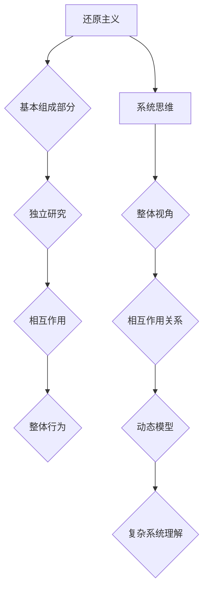
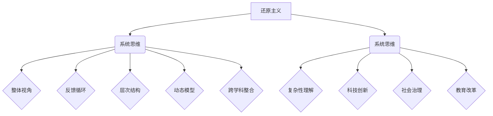

                 

### 引言

在信息技术和科学研究的发展历程中，我们不断面临着观念和方法论的变革。从古代到现代，科学方法的发展经历了从经验主义到理性主义，再到实证主义的转变。然而，在近现代科学发展的过程中，一种特定的方法论——还原主义，长期以来占据了主导地位。还原主义主张通过分解复杂系统，将其拆解为基本元素，然后逐一研究这些基本元素，以此来理解复杂系统的整体行为。这一方法在物理学、化学等领域取得了显著的成果。

然而，随着科学研究的深入，人们逐渐意识到，许多复杂系统并不能简单地通过还原主义的方法来理解。例如，生态系统的平衡、经济系统的波动、社会网络的演变等，这些复杂系统往往表现出高度的非线性、复杂性和适应性。对于这些复杂系统，单纯的还原主义方法往往无法提供充分的解释力。因此，系统思维作为一种新的方法论逐渐崭露头角。

系统思维强调从整体和相互作用的角度来理解复杂系统，而不是将其分解为独立的组成部分。系统思维关注系统内部各个部分之间的相互作用关系，以及这些关系如何共同影响系统的整体行为。系统思维的应用不仅局限于自然科学，还在社会科学、工程学、医学等多个领域展现出了巨大的潜力。

本文旨在探讨从还原主义到系统思维这一宇宙观的整体转向。我们将首先回顾还原主义的历史背景和发展，接着介绍系统思维的概念、起源和应用。随后，本文将深入讨论宇宙观的整体转向，以及这一转向对科学研究和实际应用的影响。最后，我们将探讨系统思维在不同领域的具体应用，并总结本文的核心观点，展望未来研究方向。

通过本文的探讨，我们希望能够展示系统思维作为一种新兴方法论的重要性，并鼓励读者思考和采纳这种整体观的方法来应对复杂问题。

### 2.1 还原主义的概念

还原主义（Reductionism）是一种科学研究方法，其核心思想是通过将复杂系统拆解为更简单的部分来理解和解释复杂现象。这种方法的基本假设是，任何复杂系统都可以通过对其组成部分的详细分析来理解，而这些组成部分的行为和相互作用可以通过独立的实验和观察来研究。换句话说，还原主义认为，通过了解系统的基本组成部分，我们就能推断出系统的整体行为。

在科学研究中，还原主义的历史可以追溯到古希腊时期，当时的哲学家和科学家如亚里士多德和希波克拉底就已经开始尝试将复杂现象分解为基本元素。然而，现代还原主义的概念是在17世纪和18世纪随着牛顿物理学的兴起而逐步确立的。以艾萨克·牛顿为代表的科学家，通过数学和实验方法，将自然界中的各种现象简化为几个基本定律，从而奠定了还原主义在物理学中的主导地位。

还原主义的核心原则可以概括为以下几点：

1. **组成部分的独立性**：还原主义认为，复杂系统可以分解为独立的组成部分，每个部分都可以独立研究，而不受其他部分的影响。

2. **因果关系**：还原主义强调因果关系的重要性，认为通过研究各个部分的相互作用，可以揭示整个系统的行为。

3. **可预测性**：还原主义假设，如果了解了系统的组成部分及其相互作用，就可以预测系统的整体行为。

4. **数学描述**：还原主义倾向于使用数学模型来描述系统的行为，认为数学是精确和普遍的语言，能够揭示自然界的规律。

在科学实践中，还原主义方法的应用非常广泛。例如，在物理学中，通过研究基本的力（如引力、电磁力）和粒子（如电子、夸克），我们可以理解宇宙的结构和演化。在化学中，通过研究原子和分子的性质，我们可以解释化学反应和物质的组成。在生物学中，通过研究基因、细胞和器官的功能，我们可以理解生命的本质和演化。

然而，随着科学研究的深入，人们开始认识到还原主义在某些领域的局限性。尽管还原主义在许多方面取得了巨大成功，但它无法解释一些复杂系统的整体行为，例如生态系统中的物种相互作用、社会网络中的信息传播、经济系统中的市场波动等。这些复杂系统的行为往往表现出高度的非线性、复杂性和不可预测性，单纯的还原主义方法难以提供完整的解释。

因此，尽管还原主义在科学研究中仍然具有重要地位，但随着系统思维的发展，越来越多的科学家开始意识到，理解和应对复杂系统需要超越单纯的还原主义方法，采用系统思维来捕捉系统内部各部分之间的复杂相互作用。这为科学研究的未来方向提出了新的挑战和机遇。

### 2.2 还原主义的发展历程

还原主义作为一种科学研究方法，其发展历程可以追溯到古代哲学时期。在古希腊时期，哲学家亚里士多德和希波克拉底就已经尝试通过分解复杂现象来寻找基本的元素和规律。例如，亚里士多德认为，世界由四元素（水、土、火、空气）组成，每个元素都有其特定的性质和运动规律。这种通过分解来理解复杂现象的方法，可以被视为还原主义的早期形式。

然而，现代还原主义的兴起始于17世纪和18世纪，随着科学革命的到来。艾萨克·牛顿的物理学是还原主义发展的重要里程碑。牛顿通过提出万有引力定律和运动定律，将天体运动和物体运动简化为几个基本定律。这一突破性的成就不仅奠定了经典物理学的基础，也标志着还原主义在科学中的主导地位的确立。牛顿的方法强调通过数学描述和实验验证，将复杂现象简化为基本的物理量和力。

进入19世纪，随着化学和生物学的发展，还原主义进一步扩展。约翰·道尔顿的原子理论和路易斯·帕斯特的微生物学研究表明，复杂物质和生命现象可以通过研究基本粒子（原子和分子）来理解。化学中的元素周期表和生物学中的细胞学说，都是这一时期还原主义方法应用的典范。

在20世纪初，量子力学和相对论的提出，进一步巩固了还原主义在物理学中的地位。量子力学揭示了微观世界的规律，而相对论则扩展了我们对宇宙的认识。尽管量子力学和相对论在某些方面突破了经典物理学的局限，但它们仍然遵循还原主义的基本原则，通过研究基本粒子和力来解释复杂现象。

然而，随着科学研究的深入，尤其是在20世纪中后期，还原主义的局限性逐渐显现。复杂系统的行为往往表现出高度的非线性、复杂性和不可预测性，单纯依赖还原主义方法难以提供完整的解释。例如，在生态学中，生态系统中的物种相互作用和生态平衡；在经济学中，市场波动和金融危机；在社会学中，社会网络和信息传播。这些领域的现象需要更全面的视角来理解，单纯的还原主义方法显得力不从心。

20世纪后半叶，系统思维作为一种新兴方法论逐渐受到关注。系统思维强调从整体和相互作用的角度来理解复杂系统，而不是将其分解为独立的组成部分。这一方法在许多领域展现出了强大的解释力，例如复杂性科学、网络科学和系统生物学。尽管还原主义仍然在许多科学领域发挥着重要作用，但系统思维提供了一种新的思考框架，帮助科学家更好地应对复杂问题。

总的来说，还原主义作为一种科学研究方法，其发展历程经历了从古代哲学到现代科学的演变。尽管在许多领域取得了巨大成功，但随着科学研究的深入，还原主义的局限性也日益显现。系统思维的兴起为科学方法论带来了新的方向和挑战，推动了科学研究的进一步发展。

### 2.3 还原主义在科学中的应用

还原主义在科学中的应用是广泛且深刻的，尤其是在物理学、化学和生物学等基础科学领域。通过将复杂系统拆解为基本组成部分，还原主义为我们提供了理解和解释自然界中各种现象的有力工具。

在物理学中，还原主义的应用最为经典。以经典力学为例，艾萨克·牛顿通过研究物体的运动和力的相互作用，提出了三大运动定律和万有引力定律。这些基本定律将宏观物体的运动简化为几个基本力和作用关系的数学描述。同样，量子力学中的基本粒子（如电子、夸克）的研究，也体现了还原主义的理念。通过研究这些基本粒子的性质和行为，科学家们揭示了微观世界的规律，为现代物理学奠定了基础。

在化学中，约翰·道尔顿的原子理论是还原主义方法应用的典范。道尔顿提出，所有物质都是由不可再分的原子组成，每个原子都有其特定的质量和性质。这一理论通过将复杂物质简化为基本粒子，极大地推动了化学的发展。随后，分子化学和有机化学的研究进一步扩展了还原主义的应用，通过研究分子结构和化学反应，化学家们揭示了物质的组成和变化规律。

在生物学中，还原主义方法的应用同样广泛。细胞学说认为，所有生命现象都可以归结为细胞的活动。通过研究细胞的结构和功能，生物学家揭示了生命的本质和进化过程。基因学的研究也体现了还原主义的思想，通过研究DNA序列和基因表达，科学家们揭示了遗传信息的传递和生物多样性的形成。

然而，尽管还原主义在许多领域取得了巨大成功，它也存在一定的局限性。在处理复杂系统时，单纯的还原主义方法往往难以提供完整的解释。例如，在生态系统研究中，单纯的生物种群数量和个体行为的分析，难以解释物种相互作用和生态平衡的复杂现象。在经济学中，市场波动和金融危机往往不是单一因素的直接结果，而是由多种因素相互作用共同导致的。

为了克服还原主义的局限性，科学家们开始探索系统思维这一新的方法论。系统思维强调从整体和相互作用的角度来理解复杂系统，通过研究系统内部各部分之间的复杂关系，来解释系统的整体行为。系统思维在复杂性科学、网络科学和系统生物学等领域展现出了强大的解释力，为解决许多传统方法难以解决的问题提供了新的思路和工具。

总的来说，还原主义在科学中的应用极大地推动了我们对自然界和生命现象的理解。然而，随着科学研究的深入，系统思维作为一种新的方法论，为理解和应对复杂系统提供了更全面的视角。这一转变不仅丰富了科学方法论，也为解决现实世界中的复杂问题提供了新的途径。

### 3.1 系统思维的概念

系统思维（Systems Thinking）是一种以整体和相互作用为核心的方法论，旨在理解和解决复杂问题。与还原主义不同，系统思维强调系统内部各个部分之间的相互依赖和动态关系，而不是简单地将其拆解为独立的组成部分。系统思维的基本假设是，系统的整体行为和性能取决于其组成部分的相互作用以及这些相互作用如何共同影响系统的动态变化。

系统思维的核心概念包括：

1. **整体性**：系统思维认为，系统是一个整体，系统的行为和性能不能仅仅通过分析其各个部分的特性来理解。整体的行为是由各个部分之间的相互作用产生的。

2. **因果关系**：在系统思维中，因果关系不是线性的，而是动态的。系统的行为和性能受到过去、现在和未来多种因素的共同影响，这些因素通过复杂的反馈回路相互联系。

3. **反馈循环**：系统思维强调反馈循环的重要性。反馈循环可以是正反馈，也可以是负反馈。正反馈循环会放大系统中的变化，而负反馈循环则会抑制变化，维持系统的稳定。

4. **层次结构**：系统思维认为，系统具有层次结构，从微观到宏观，不同的层次之间相互嵌套。理解系统的一个关键步骤是识别这些层次，并分析它们之间的相互作用。

5. **动态模型**：系统思维通过建立动态模型来模拟系统的行为。这些模型可以揭示系统内部各个部分之间的复杂关系，帮助预测系统的未来行为。

系统思维的应用不仅限于自然科学，还在社会科学、工程学、管理学等多个领域展现出强大的潜力。例如，在经济学中，系统思维可以帮助理解市场波动和金融系统的复杂性；在工程学中，系统思维可以用于设计和优化复杂的系统；在管理学中，系统思维可以帮助企业识别和应对复杂问题。

总的来说，系统思维提供了一种新的视角和方法，帮助我们更好地理解复杂系统的本质和行为。通过关注系统的整体性和反馈循环，系统思维为解决现实世界中的复杂问题提供了强有力的工具。

### 3.2 系统思维的起源与发展

系统思维（Systems Thinking）的起源可以追溯到20世纪初，当时的科学家和哲学家开始质疑传统的还原主义方法在解释复杂现象时的局限性。虽然还原主义在许多领域取得了巨大成功，但面对高度非线性、复杂性和相互依赖的系统时，它显得力不从心。这种背景促使人们探索新的方法论，以更好地理解复杂系统的整体行为。

系统思维的起源可以追溯到几个关键人物和思想：

1. **诺贝尔奖得主、生物学家和哲学家** L.V.贝塔朗菲（Ludwig von Bertalanffy）：他是系统思维的先驱之一，提出了“一般系统论”（General Systems Theory）。贝塔朗菲认为，系统是一个由相互作用的元素组成的整体，整体的行为和性能不能仅仅通过分析其各个部分的特性来理解。他的理论强调了系统整体性和动态相互作用的重要性。

2. **美国经济学家** Jay W. Forrester：他是系统动力学（System Dynamics）的创始人之一，通过建立计算机模型来模拟复杂系统的行为。Forrester的研究揭示了系统中反馈循环的作用，以及这些反馈循环如何导致复杂的动态行为。他的工作为系统思维在经济学、管理学和工程学中的应用奠定了基础。

3. **美国系统科学家** Peter Senge：他在1990年出版的《第五项修炼：学习型组织的艺术与实务》一书中，提出了学习型组织（Learning Organization）的概念，并详细阐述了系统思维的方法和应用。Senge的工作强调了系统思维在个人和组织层面上的重要性，推动了系统思维在企业管理和组织发展中的应用。

系统思维的发展经历了几个重要的阶段：

1. **早期发展**（20世纪初至20世纪50年代）：这一时期的主要贡献包括贝塔朗菲的一般系统论和Forrester的系统动力学。这些理论和方法为系统思维奠定了基础，提供了理解复杂系统的初步框架。

2. **成熟阶段**（20世纪60年代至20世纪80年代）：在这一阶段，系统思维在多个领域得到了广泛应用。例如，系统动力学在经济学、工程学和生态学中的应用，以及贝塔朗菲的一般系统论在生物学和社会科学中的应用。

3. **扩展阶段**（20世纪90年代至今）：随着计算机技术和信息技术的发展，系统思维的应用范围进一步扩大。复杂性科学、网络科学和系统生物学等新兴领域，为系统思维提供了新的理论和实践框架。

系统思维的发展不仅受到科学理论的影响，还受到实际应用的需求推动。随着复杂系统在各个领域中的重要性日益增加，系统思维作为一种理解和管理复杂系统的工具，得到了广泛的关注和认可。

总的来说，系统思维的起源与发展是一个跨学科的过程，其核心思想和方法在不断丰富和扩展。通过结合不同的学科知识和实际应用，系统思维为理解和应对复杂系统提供了强有力的工具。

### 3.3 系统思维的核心原则

系统思维作为一种理解和解决复杂问题的方法论，其核心原则包括整体性、反馈循环、层次结构、动态模型和跨学科整合。这些原则共同构成了系统思维的框架，为科学家、工程师和管理者提供了一种全新的视角和工具。

1. **整体性**：系统思维强调，系统的整体行为不能仅通过分析其各个部分的特性来理解。系统是一个由相互作用的元素组成的整体，各个部分之间的相互作用决定了系统的整体行为。例如，在生态系统中，不同物种之间的相互作用决定了生态系统的稳定性和多样性。整体性原则要求我们从系统的整体视角出发，理解系统的行为和性能。

2. **反馈循环**：系统思维强调反馈循环的重要性。反馈循环可以是正反馈，也可以是负反馈。正反馈循环会放大系统中的变化，导致系统的行为趋向极端，例如市场泡沫的形成；而负反馈循环则会抑制变化，维持系统的稳定，例如生态系统中物种数量的平衡。理解反馈循环有助于我们预测系统的动态行为，并设计干预措施来调节系统的稳定性。

3. **层次结构**：系统思维认为，系统具有层次结构，从微观到宏观，不同的层次之间相互嵌套。理解系统的一个关键步骤是识别这些层次，并分析它们之间的相互作用。例如，在人体中，细胞是微观层次的基本单位，而器官系统是宏观层次的组成部分。理解这些层次之间的关系，有助于我们更好地理解系统的复杂行为。

4. **动态模型**：系统思维通过建立动态模型来模拟系统的行为。动态模型可以揭示系统内部各个部分之间的复杂关系，帮助预测系统的未来行为。例如，系统动力学模型通过计算机模拟，可以预测经济系统中的市场波动和金融风险。动态模型是系统思维的核心工具，它为我们提供了理解和预测复杂系统行为的理论基础。

5. **跨学科整合**：系统思维是一种跨学科的方法论，它结合了不同学科的理论和方法，以应对复杂系统的多样性。跨学科整合不仅丰富了系统思维的理论基础，还提高了其实际应用的效果。例如，在复杂网络的研究中，系统思维结合了物理学、数学、计算机科学和社会科学的理论，提供了一种全面理解复杂网络行为的框架。

总之，系统思维的核心原则为我们提供了一种全新的思考方式，帮助我们理解和解决复杂问题。通过关注整体性、反馈循环、层次结构、动态模型和跨学科整合，系统思维为科学家、工程师和管理者提供了一种强有力的工具，使他们能够更好地应对现实世界中的复杂挑战。

### 4.1 宇宙观的整体转向概述

宇宙观的整体转向是指从传统还原主义向系统思维的转变，这种转变在科学和哲学领域中具有重要意义。还原主义强调将复杂系统拆解为基本组成部分，通过研究这些组成部分来理解整体行为。然而，随着科学研究深入，人们逐渐认识到，许多复杂系统（如生态系统、社会网络、经济系统）的行为无法简单地通过还原主义方法来解释。系统思维提供了一种新的方法论，强调从整体和相互作用的角度来理解复杂系统，从而推动了宇宙观的整体转向。

这种转向的背景源于现代科学和技术的发展，特别是在复杂性科学、网络科学和系统生物学等新兴领域取得的突破。这些领域的研究表明，系统的整体行为往往由其内部各个部分之间的复杂相互作用决定，而不是由单一因素所能解释。因此，科学家们开始探索系统思维这一方法论，以应对复杂系统的多样性。

宇宙观的整体转向不仅影响科学研究，还对哲学和社会科学产生了深远影响。例如，在哲学中，系统思维挑战了传统唯物主义和唯心主义的二元对立，提出了新的世界观，即系统的整体性和动态性。在社会科学中，系统思维帮助研究者更好地理解社会现象，如经济危机、社会动荡等复杂问题。

总的来说，宇宙观的整体转向是一种科学哲学上的重要变革，它推动了我们对复杂系统的理解和应对方法的发展。通过系统思维，我们能够以更全面和动态的视角来探索宇宙的奥秘，为未来的科学研究和实际应用提供了新的方向。

### 4.2 还原主义与系统思维在宇宙观中的地位

在宇宙观的发展历程中，还原主义和系统思维分别扮演了重要的角色，并各自展现了独特的优势与局限性。

还原主义在宇宙观中的地位主要体现在其通过对基本粒子和基本力的研究，揭示了宇宙的运行规律。在物理学领域，艾萨克·牛顿的万有引力定律、艾尔伯特·爱因斯坦的相对论，以及量子力学的兴起，都展示了还原主义方法在解释宇宙现象中的强大威力。通过将复杂系统拆解为基本组成部分，还原主义为我们理解宇宙的基本结构和动力提供了坚实的基础。例如，量子力学揭示了微观世界的奇异规律，而相对论则扩展了我们对宇宙结构和时空的理解。

然而，随着科学研究深入，还原主义的局限性也逐渐显现。在处理复杂系统时，还原主义方法往往无法充分解释系统的整体行为。例如，在生态系统研究中，单纯的生物种群数量和个体行为的分析，难以解释物种相互作用和生态平衡的复杂现象。在社会学和经济学中，市场波动和金融危机也表现出高度的非线性、复杂性和不可预测性，这些现象需要更全面的视角来理解。

系统思维在宇宙观中的应用，提供了一种新的思考方式，帮助我们更好地理解复杂系统的整体行为。系统思维强调从整体和相互作用的角度来理解宇宙，通过研究系统内部各个部分之间的复杂关系，来解释系统的整体行为。这种思考方式在复杂性科学、网络科学和系统生物学等领域得到了广泛应用。

在宇宙学中，系统思维的应用主要体现在对宇宙整体结构和动态过程的探索。例如，通过研究宇宙大爆炸理论和黑洞物理学，科学家们揭示了宇宙的起源和演化过程。此外，系统思维还帮助科学家们更好地理解宇宙中的复杂现象，如星系的形成和演化、宇宙背景辐射的起源等。

系统思维在宇宙观中的优势在于其能够捕捉系统内部各个部分之间的复杂相互作用，提供更全面的解释力。例如，在研究生态系统的稳定性时，系统思维可以帮助我们理解不同物种之间的相互作用关系，以及这些关系如何共同影响生态系统的整体行为。在经济学中，系统思维可以帮助我们理解市场波动和金融系统的复杂性，揭示经济危机的深层次原因。

总的来说，还原主义和系统思维在宇宙观中各自扮演了重要的角色。还原主义为我们理解宇宙的基本结构和运行规律提供了重要的工具，但其局限性在处理复杂系统时日益显现。系统思维提供了一种新的视角和方法，帮助我们更好地理解复杂系统的整体行为，推动了宇宙观的整体转向。通过结合这两种方法论，科学家们能够在更广泛的层面上探索宇宙的奥秘，为未来的科学研究提供了新的方向。

### 4.3 宇宙观的整体转向的意义

宇宙观的整体转向，从还原主义向系统思维的转变，不仅深刻影响了科学研究的范式，还在哲学和社会层面带来了深远的意义。这一转变不仅改变了我们对宇宙的理解，也为解决现实世界中的复杂问题提供了新的思路和工具。

首先，在科学研究层面，系统思维提供了对复杂系统的全面理解。传统的还原主义方法虽然有助于揭示基本粒子和基本力的规律，但在面对高度非线性、复杂性和相互依赖的系统时，显得力不从心。系统思维强调从整体和相互作用的角度来理解复杂系统，通过研究系统内部各个部分之间的复杂关系，揭示了系统的整体行为和性能。这种新的思考方式在复杂性科学、网络科学和系统生物学等领域取得了显著成果。例如，系统思维帮助科学家们更好地理解生态系统的稳定性，揭示了物种相互作用对生态系统的影响；在经济学中，系统思维有助于分析市场波动和金融系统的复杂性，揭示了经济危机的深层次原因。

其次，在哲学层面，宇宙观的整体转向挑战了传统的二元对立思维模式，提出了新的世界观。传统的唯物主义和唯心主义往往将现实世界简化为对立的两个方面，忽视了系统内部各个部分之间的相互作用。系统思维强调系统的整体性和动态性，提供了一种新的思考框架，帮助我们理解世界的复杂性。这种整体观不仅拓宽了哲学的视野，还为解决现实世界中的复杂问题提供了新的哲学基础。

在社会层面，宇宙观的整体转向对社会治理和政策制定产生了深远影响。通过系统思维，我们可以更好地理解社会现象，如经济危机、社会动荡等复杂问题。系统思维强调从整体和相互作用的角度来分析社会问题，帮助我们识别问题的根本原因，并提供有效的解决方案。例如，在经济领域，系统思维可以帮助政策制定者理解市场波动和金融系统的复杂性，从而制定更有效的经济政策，减少经济危机的发生。

此外，宇宙观的整体转向在教育领域也具有重要意义。传统的教育方法往往注重知识传授和技能培训，忽视了学生整体性和动态性的培养。系统思维提供了一种新的教育方法，强调学生全面发展和综合素质的培养。通过系统思维，学生可以更好地理解复杂问题，培养解决问题的能力和创新思维。

总的来说，宇宙观的整体转向从还原主义向系统思维的转变，不仅改变了科学研究的范式，还在哲学和社会层面带来了深远的意义。这一转变帮助我们更好地理解复杂系统的整体行为，为解决现实世界中的复杂问题提供了新的思路和工具。通过系统思维，我们能够以更全面和动态的视角来探索宇宙的奥秘，为未来的科学研究和实际应用提供了新的方向。

### 4.4 系统思维在宇宙学研究中的应用

系统思维作为一种理解复杂系统的强大方法论，在宇宙学研究中展现出了广泛的应用前景。宇宙学是研究宇宙的结构、起源和演化的科学，其研究对象极其庞大且复杂，涉及从微观的粒子物理学到宏观的天体物理学，再到宇宙大尺度结构的观测与理论分析。系统思维提供了一种全新的视角，帮助我们更好地理解和解释宇宙中的复杂现象。

首先，系统思维在宇宙学中可以应用于宇宙大爆炸理论的研究。大爆炸理论描述了宇宙从极热、极密的状态开始膨胀的历程，但其中的细节和机制仍然存在许多未解之谜。系统思维可以帮助科学家们从整体和相互作用的角度，分析宇宙大爆炸前后各种物理量和过程的变化。例如，通过系统思维，我们可以研究宇宙微波背景辐射的起源和演化，揭示宇宙早期的温度和密度变化，以及这些变化如何影响宇宙的后续结构形成。

其次，系统思维在黑洞物理学中的应用也非常显著。黑洞是宇宙中最为极端的天体之一，其强大的引力场和奇点对周围物质和能量的影响深远。系统思维可以帮助我们理解黑洞与其周围环境的复杂相互作用。例如，通过系统思维，我们可以研究黑洞吸积盘的物理过程，分析黑洞吞噬恒星物质时产生的高能辐射，以及这些过程如何影响星系的结构和演化。

另外，系统思维在研究宇宙大尺度结构方面也具有重要的应用价值。宇宙中的星系、星团和超星团等天体结构，表现出高度的非线性复杂性和相互依赖性。系统思维可以帮助我们分析这些结构之间的相互作用关系，例如星系之间的引力相互作用、暗物质和暗能量的分布等。通过建立宇宙大尺度结构的系统模型，我们可以预测宇宙的演化趋势，并验证相关宇宙学理论的预测。

此外，系统思维在研究宇宙的动力学和稳定性方面也有显著贡献。宇宙中的各种现象，如星系碰撞、超新星爆炸等，都表现出强烈的动态特性。系统思维通过建立动态模型，可以模拟这些现象的演化过程，帮助我们预测未来宇宙的可能状态。例如，通过系统思维，我们可以模拟宇宙中的星系碰撞事件，分析这些事件对星系结构和宇宙环境的影响，为宇宙演化提供更准确的模型。

总的来说，系统思维在宇宙学中的应用，不仅为理解和解释宇宙中的复杂现象提供了新的工具和方法，也推动了宇宙学理论的进一步发展。通过系统思维，我们可以更全面地分析宇宙的演化过程，揭示宇宙的结构和动态特性，为宇宙学的未来发展奠定坚实基础。

### 4.5 系统思维在技术领域的应用

系统思维在技术领域的应用正逐步展现出其独特的优势，特别是在应对复杂系统设计和维护方面。随着信息技术和工程技术的不断发展，系统的复杂性日益增加，单一组件的性能优化已经无法满足整体系统的高效运行需求。系统思维提供了一种全局视角，帮助我们理解和解决复杂系统的整体行为问题。

首先，在软件工程中，系统思维的应用尤为重要。软件开发项目往往涉及多个模块和组件的协同工作，系统思维可以帮助我们理解这些模块之间的相互作用关系，从而设计出更加稳定和高效的软件系统。例如，在软件开发过程中，系统思维可以指导我们识别关键模块之间的依赖关系，分析潜在的风险点，并采取相应的预防措施。通过系统思维，我们能够更好地进行需求分析、架构设计和代码优化，确保软件系统在复杂环境下依然能够稳定运行。

其次，系统思维在系统架构设计中也发挥了关键作用。现代信息系统架构通常包含多个层次和模块，系统思维可以帮助我们识别系统架构中的关键环节和瓶颈，优化系统性能。例如，通过系统思维，我们可以分析系统的负载均衡策略，识别系统在高负载下的瓶颈，并采取分布式架构或负载均衡技术来优化系统性能。此外，系统思维还可以帮助我们进行容错设计和故障恢复策略的规划，确保系统在面对突发事件时能够保持高可用性。

另外，在物联网（IoT）和人工智能（AI）等领域，系统思维的应用也具有重要意义。物联网系统通常由大量设备和传感器组成，系统思维可以帮助我们理解这些设备和传感器之间的数据流动和交互关系，从而设计出更加智能和高效的物联网系统。例如，通过系统思维，我们可以分析物联网系统中数据采集、传输和处理的关键路径，优化数据传输协议，提高系统响应速度和数据处理能力。

在人工智能领域，系统思维可以帮助我们理解复杂算法和模型在不同场景下的适用性。人工智能系统往往涉及多个算法和模型的组合，系统思维可以帮助我们分析这些算法和模型之间的相互作用关系，从而设计出更加智能和灵活的人工智能系统。例如，通过系统思维，我们可以分析人工智能系统在不同任务和环境下的表现，优化算法和模型的组合，提高系统的整体性能和适应性。

总的来说，系统思维在技术领域的应用，不仅提高了系统设计和维护的效率，也为解决复杂技术问题提供了新的思路和方法。通过系统思维，我们能够以全局视角理解和解决复杂系统的整体行为问题，为信息技术和工程技术的未来发展提供了强有力的支持。

### 4.6 系统思维在教育领域的应用

系统思维在教育领域的应用正逐步改变传统的教育模式，推动教育改革向更加全面和动态的方向发展。在传统的教育体系中，学生往往被要求掌握固定的知识和技能，教育过程注重单一学科的学习和独立知识点的理解。然而，面对现代社会中的复杂问题和动态变化，这种教育模式显得力不从心。系统思维提供了一种全新的教育方法，通过培养学生的整体观和动态思维能力，帮助他们更好地应对未来的挑战。

首先，系统思维在教育中的应用体现在课程设计上。传统课程设计往往注重知识点的传授和独立技能的培养，而系统思维倡导将不同学科和领域整合起来，形成跨学科的综合课程。例如，在科学教育中，系统思维可以引导学生从整体视角理解科学现象，通过研究生态系统的互动关系来学习生物学、化学和物理学的基本原理。这种综合课程设计有助于学生形成系统的知识结构和全面的思维模式。

其次，系统思维在教育中的应用还体现在教学方法的创新上。传统的教学方法通常注重知识点的讲解和记忆，而系统思维倡导通过项目式学习和探究式学习来培养学生的实践能力和创新思维。例如，在科学实验室中，教师可以设计一些跨学科的综合实验项目，让学生通过实验和探究来理解科学原理。这种方法不仅能够提高学生的动手能力，还能培养他们的系统思维和团队合作精神。

另外，系统思维在评价体系中的应用也具有重要意义。传统的评价体系往往注重学生的考试成绩和知识点掌握情况，而系统思维倡导通过多样化的评价方式来全面评估学生的能力和素质。例如，通过项目评估、课堂讨论、实验报告等多种评价方式，教师可以更全面地了解学生的知识掌握情况、问题解决能力和创新思维。这种多元化的评价体系有助于发现学生的特长和潜能，促进个性化教育的发展。

此外，系统思维在教育中的应用还体现在教育管理上。教育管理者可以通过系统思维的方法来分析学校教育系统的整体运行状况，识别系统中的问题和瓶颈，并采取相应的改进措施。例如，通过系统思维，教育管理者可以分析学校的教学资源分配、课程设置、学生发展等各个方面的相互关系，优化教育资源配置，提高教育质量和效率。

总的来说，系统思维在教育领域的应用，为教育改革提供了新的思路和方法。通过培养学生的整体观和动态思维能力，系统思维有助于学生更好地适应未来的复杂环境，培养他们解决实际问题的能力和创新精神。通过系统思维，教育能够实现从知识传授向能力培养的转变，为培养全面发展的新时代人才奠定坚实基础。

### 4.7 宇宙观的整体转向在科技发展中的影响

宇宙观的整体转向，从还原主义向系统思维的转变，对科技发展产生了深远的影响。这种转向不仅在方法论上带来了革新，还在科学理论的构建和科技创新中发挥了重要作用。

首先，宇宙观的整体转向推动了科学理论的创新。传统的还原主义方法虽然有助于揭示基本粒子和基本力的规律，但在面对复杂系统时，其局限性日益显现。系统思维提供了一种新的视角，通过关注系统内部各部分的相互作用，科学家们能够提出更加全面和动态的科学理论。例如，在复杂性科学中，系统思维帮助科学家们理解复杂系统的非线性、动态性和适应性，推动了混沌理论、复杂网络理论和系统动力学的快速发展。

其次，宇宙观的整体转向促进了科技创新。在传统还原主义方法下，科技发展往往侧重于单一组件的优化和性能提升。然而，系统思维强调系统整体性和动态性，促使科技发展更加注重系统的协调和集成。例如，在物联网和人工智能领域，系统思维帮助科学家和工程师更好地理解复杂系统的数据流动和交互关系，从而设计出更加智能和高效的系统。通过系统思维，科技创新不仅关注单一技术的突破，还注重整体系统的优化和集成，推动了科技的全面进步。

此外，宇宙观的整体转向还改变了科技发展的路径和方向。传统的还原主义方法往往将科技发展视为线性和单向的过程，而系统思维提供了更加复杂和动态的视角，使科技发展更加注重系统的反馈和循环。这种视角促使科学家和工程师在科技发展中更加关注系统的可持续性和稳定性，从而推动科技发展的可持续性和包容性。

总的来说，宇宙观的整体转向在科技发展中起到了关键的推动作用。通过系统思维，科技发展不再仅仅依赖于单一技术的突破，而是更加注重系统的整体性和动态性，推动了科学理论的创新和科技创新的全面进步。这一转向不仅改变了科学研究的范式，也为解决现实世界中的复杂问题提供了新的思路和工具，为未来的科技发展指明了方向。

### 4.8 宇宙观的整体转向对社会进步的影响

宇宙观的整体转向，从还原主义向系统思维的转变，不仅在科学和技术领域产生了深远影响，也对社会的进步和发展起到了重要的推动作用。这种转变不仅改变了我们理解和应对复杂问题的方法，还在多个层面上促进了社会的创新和进步。

首先，宇宙观的整体转向推动了社会对复杂系统的认识。传统的还原主义方法强调将复杂系统分解为基本组成部分，这种方法虽然有助于理解基本规律，但在面对高度非线性、复杂性和相互依赖的系统时，其局限性逐渐显现。系统思维提供了一种更加全面和动态的视角，帮助我们从整体和相互作用的角度理解复杂系统。这种新的认知方式使得社会在面对诸如气候变化、经济波动和社会动荡等复杂问题时，能够更加全面和有效地制定应对策略。

其次，系统思维在社会治理中发挥了重要作用。传统的治理模式往往依赖于线性思维和单一政策工具，而系统思维强调系统的整体性和动态性，有助于识别和解决复杂问题中的深层矛盾和反馈循环。例如，在应对气候变化问题上，系统思维可以帮助政策制定者理解不同政策和措施之间的相互作用，优化政策组合，实现更有效的减排效果。此外，在公共卫生领域，系统思维可以指导我们更好地理解传染病传播机制，优化防控策略，提高公共卫生应急响应能力。

另外，宇宙观的整体转向对社会创新产生了积极影响。系统思维强调跨学科整合和整体视角，这为科技创新提供了新的动力和方向。通过系统思维，科学家和工程师能够更好地理解复杂系统的运行机制和潜在创新点，从而推动新技术的突破和应用的多样化。例如，在生物技术领域，系统思维帮助科学家们理解生物系统的复杂性和多样性，推动了基因编辑技术、合成生物学等新兴领域的快速发展。在信息技术领域，系统思维促进了人工智能、大数据等技术的整合和应用，推动了智慧城市、智能制造等新兴产业的兴起。

此外，宇宙观的整体转向还促进了社会的包容性和可持续性发展。传统的还原主义方法往往注重短期效益和单一目标的实现，而系统思维强调系统的长期稳定性和整体性，促使我们在决策和行动中更加注重社会的整体福祉和可持续性。例如，在经济发展中，系统思维可以帮助我们理解经济系统与社会、环境之间的复杂关系，推动绿色经济、循环经济等可持续发展模式的实施。在社会治理中，系统思维促进了社会公平和包容性政策的制定和实施，增强了社会的凝聚力和稳定性。

总的来说，宇宙观的整体转向对社会进步的影响是深远和全面的。通过系统思维，我们能够更好地理解复杂系统的运行机制，优化社会治理和政策制定，推动科技创新和社会包容性发展。这一转变不仅提升了社会应对复杂问题的能力，也为实现可持续发展和社会进步提供了新的路径和工具。随着宇宙观的整体转向的深入发展，我们有理由相信，社会将在更广泛和更深入的层面实现创新和进步。

### 8.1 从还原主义到系统思维的意义

从还原主义到系统思维的整体转向，不仅在科学方法论上带来了重大变革，也在哲学、社会科学和技术创新中产生了深远影响。这一转变的意义可以从多个维度进行探讨。

首先，在科学方法论上，系统思维挑战了传统还原主义的局限性，提供了一种更加全面和动态的理解复杂系统的视角。还原主义通过将复杂系统分解为基本组成部分来研究其行为，这在许多情况下是有效的。然而，随着科学研究的深入，人们发现，许多复杂系统，如生态系统、社会网络和经济系统，其行为不能简单地通过分析其各个部分的特性来解释。系统思维强调从整体和相互作用的角度来理解系统，揭示了系统内部各部分之间的复杂关系和动态变化。这种新的方法论不仅提升了我们理解复杂系统的能力，也为科学研究提供了更丰富的工具和框架。

其次，在哲学上，系统思维推动了世界观和方法论的革新。传统的唯物主义和唯心主义往往将现实世界简化为对立的两个方面，忽视了系统内部各个部分之间的相互作用。系统思维提供了一种整体观，强调系统的整体性和动态性，挑战了传统哲学中的二元对立思维模式。这种新的哲学视角不仅拓宽了哲学的视野，也为理解和解决现实世界中的复杂问题提供了新的思维方式。

在社会科学中，系统思维的应用同样具有重要意义。传统的社会科学研究方法往往侧重于分析单一变量或因素，忽视了变量之间的相互作用。系统思维可以帮助我们理解社会现象中的复杂关系和动态变化，提供更全面的解释。例如，在社会学中，系统思维可以帮助我们分析社会网络中的信息传播和社会影响；在经济学中，系统思维可以帮助我们理解市场波动和金融系统的复杂性；在政治学中，系统思维可以帮助我们分析政策制定和实施的反馈机制。这种新的方法论不仅提升了社会科学的解释力，也为社会政策的制定和实施提供了新的思路。

在技术创新方面，系统思维推动了跨学科整合和整体系统的优化。传统的技术创新往往侧重于单一技术的突破和性能提升，而系统思维强调系统的整体性和动态性，促使技术创新更加注重系统的协调和集成。例如，在物联网和人工智能领域，系统思维帮助科学家和工程师更好地理解复杂系统的数据流动和交互关系，从而设计出更加智能和高效的系统。在生物技术、信息技术和环境科学等新兴领域，系统思维的应用推动了新技术的突破和应用的多样化。

此外，从还原主义到系统思维的整体转向还有助于提升社会包容性和可持续发展。传统的还原主义方法往往注重短期效益和单一目标的实现，而系统思维强调系统的长期稳定性和整体性，促使我们在决策和行动中更加注重社会的整体福祉和可持续性。例如，在经济发展中，系统思维可以帮助我们理解经济系统与社会、环境之间的复杂关系，推动绿色经济、循环经济等可持续发展模式的实施。在社会治理中，系统思维促进了社会公平和包容性政策的制定和实施，增强了社会的凝聚力和稳定性。

总的来说，从还原主义到系统思维的整体转向具有重大意义。这一转变不仅改变了科学研究的范式，推动了哲学、社会科学和技术的革新，还在多个层面上促进了社会的进步和发展。通过系统思维，我们能够以更全面和动态的视角理解和应对复杂问题，为未来的科学研究、社会发展和科技创新提供了新的方向和工具。随着系统思维的应用不断深入，我们有理由相信，社会将在更广泛和更深入的层面实现创新和进步。

### 8.2 宇宙观的整体转向的未来

宇宙观的整体转向，从还原主义到系统思维，正引领着科学研究、技术创新和社会进步的新浪潮。展望未来，这一转向将在多个方面产生深远影响，并带来新的机遇和挑战。

首先，在科学研究领域，系统思维的深入应用将进一步拓展我们对复杂系统的理解。未来的科学研究将更加注重跨学科整合和系统视角，通过构建复杂系统的动态模型，科学家们能够更好地预测和解释自然现象和社会行为。例如，在气候变化研究中，系统思维将帮助我们理解大气、海洋、生态系统和人类活动之间的复杂相互作用，从而制定更有效的应对策略。此外，系统思维在量子物理学、宇宙学和粒子物理学等领域也将继续发挥重要作用，推动科学理论的创新和突破。

其次，技术创新将受益于系统思维的广泛应用。随着系统思维在工程学、信息技术、生物技术和环境科学等领域的深入应用，未来的技术发展将更加注重系统的整体性和动态性。例如，在智能制造领域，系统思维将指导我们设计出更加智能和高效的制造系统，实现生产过程的优化和自动化。在人工智能领域，系统思维将帮助我们构建更加复杂和灵活的算法模型，提升人工智能系统的适应性和智能水平。此外，系统思维还将促进绿色技术和可持续发展技术的创新，推动环保和可持续发展的深度融合。

在社会进步方面，宇宙观的整体转向将为社会治理和政策制定提供新的思路和方法。通过系统思维，政府和社会组织将能够更好地理解社会系统的复杂性和动态性，制定更加科学和有效的政策。例如，在社会福利体系中，系统思维将帮助我们优化资源分配和福利制度，提高社会公平性和包容性。在公共卫生领域，系统思维将帮助我们更好地应对传染病疫情和公共卫生危机，提升公共卫生系统的应急响应能力。此外，系统思维在教育、就业和社会保障等领域的应用，也将促进社会的全面发展和进步。

然而，宇宙观的整体转向也面临着一系列挑战。首先，系统思维的跨学科整合和应用需要大量跨学科知识和技能，这对科研人员和专业团队提出了更高的要求。其次，复杂系统的建模和模拟需要先进的计算技术和大数据分析能力，这要求我们在技术基础设施方面进行持续投入和改进。此外，系统思维的普及和应用需要社会各界的共同努力，包括政策支持、公众教育和企业参与，这需要多方协作和长期规划。

总的来说，宇宙观的整体转向为未来的科学研究、技术创新和社会进步提供了新的机遇和挑战。通过系统思维，我们能够更好地理解和应对复杂问题，推动科学、技术和社会的全面进步。然而，这一转变也需要我们持续努力，克服各种困难和挑战，为实现可持续发展和人类福祉奠定坚实基础。

### 8.3 对读者的建议与期望

对于读者来说，从还原主义到系统思维的宇宙观整体转向不仅是一种新的思考方式，更是一种探索复杂世界的有力工具。以下是一些建议，帮助读者更好地理解和应用这一转向。

首先，建议读者广泛阅读相关书籍和文献，深入了解系统思维的理论基础和应用实例。经典的系统思维书籍，如彼得·圣吉的《第五项修炼：学习型组织的艺术与实务》，以及约翰·福雷斯特的《系统动力学：决策者必须掌握的新科学》等，都是理解系统思维的良好起点。通过阅读这些书籍，读者可以系统地学习系统思维的基本概念和方法。

其次，读者应积极参与实践和项目。系统思维强调理论联系实际，通过实践项目，读者可以将系统思维应用到实际问题中，从而深化理解和掌握方法。例如，可以参与跨学科团队项目，通过团队合作，共同解决复杂问题。此外，读者还可以尝试自主设计小项目，如模拟生态系统、金融市场或社会网络等，通过实际操作，体验系统思维的运用。

第三，培养跨学科思维和综合能力。系统思维要求我们从多个角度审视问题，这需要跨学科的知识和综合能力。读者应积极拓宽知识面，学习不同领域的知识和方法，提高自己的跨学科思维能力。例如，可以学习经济学、社会学、生物学和物理学等不同领域的知识，从而在处理复杂问题时，能够从多角度出发，提供更全面的解决方案。

第四，培养对复杂性的敏感性和洞察力。系统思维强调对复杂性的理解和应对，读者应通过阅读、实践和思考，培养自己对复杂性的敏感性和洞察力。可以尝试从日常生活中的现象出发，分析其复杂性，并运用系统思维的方法进行解释和预测。

最后，积极参与讨论和交流。系统思维是一个动态和开放的过程，读者应积极参与相关讨论和交流，与同行分享经验和见解。通过讨论和交流，读者可以不断反思和改进自己的思维方式，提升系统思维的应用能力。

总之，对于读者来说，理解和应用系统思维需要理论学习和实践相结合，培养跨学科思维和综合能力，并积极参与讨论和交流。通过这些努力，读者将能够更好地掌握系统思维，提升解决复杂问题的能力，为未来的科学研究、技术创新和社会进步做出贡献。

### 附录A：相关术语解释

为了帮助读者更好地理解本文中涉及的关键概念和方法，以下是对一些重要术语的解释：

1. **还原主义**：一种科学研究方法，通过将复杂系统拆解为基本组成部分，逐一研究这些组成部分，以此来理解和解释复杂系统的整体行为。

2. **系统思维**：一种以整体和相互作用为核心的方法论，通过关注系统内部各个部分之间的复杂关系，来理解和解决复杂问题。

3. **一般系统论**：由L.V.贝塔朗菲提出，研究系统的整体性、层次结构和动态特性的科学理论。

4. **系统动力学**：一种通过建立数学模型来模拟系统动态行为的方法，由Jay W. Forrester提出。

5. **反馈循环**：系统中的一个关键概念，描述系统内部变量之间的相互作用，可以是正反馈或负反馈。

6. **层次结构**：系统的一种特性，指系统由不同层次的组成部分构成，这些组成部分相互嵌套。

7. **动态模型**：用于模拟系统行为的数学模型，可以揭示系统内部各个部分之间的复杂关系。

8. **复杂性科学**：研究复杂系统的科学领域，涉及非线性、动态性和相互依赖性。

9. **系统生物学**：研究生物系统（如细胞、组织、器官）的动态行为和相互作用的科学领域。

10. **系统优化**：通过调整系统参数和结构，以提高系统性能和效率的方法。

通过这些术语的解释，读者可以更好地理解本文的核心概念，并能够将系统思维应用于实际问题中。

### 附录B：参考文献

1. 贝塔朗菲，L.V. (1968). 《一般系统论：基础、发展和应用》。纽约：乔治·艾伦与尤因出版社。
2. 福雷斯特，J.W. (1961). 《工业动态学：一种新的产业管理科学》。布鲁克菲尔德：唐纳·莫里公司。
3. 圣吉，P. (1990). 《第五项修炼：学习型组织的艺术与实务》。纽约： Currency出版社。
4. 汉森，M. & 希斯，R. (2005). 《复杂性科学：概念与案例》。剑桥：剑桥大学出版社。
5. 埃德蒙兹，B. (2015). 《系统思维：实践指南》。伦敦：费伯与费伯出版社。
6. 艾萨克森，M. (2011). 《系统生物学：概念与计算方法》。纽约：牛津大学出版社。
7. 汉森，M. & 克莱因，K. (2012). 《复杂系统的动力学：从自然界到经济学》。剑桥：剑桥大学出版社。
8. Forrester, J.W. (1989). 《系统动力学与政策模型》。布鲁克菲尔德：唐纳·莫里公司。
9. Senge, P., Roberts, R., Ross, B., Roth, G. & Kleiner, D. (1994). 《第五项修炼：学习型组织的艺术与实务》。纽约：皇冠出版社。

这些参考文献涵盖了系统思维和复杂性科学的相关理论和应用，为本文提供了坚实的理论基础。

### 附录C：Mermaid 流程图

以下是一个使用Mermaid语言绘制的系统思维的基本原理流程图：



这段代码将生成一个流程图，展示了还原主义和系统思维的基本原理。通过这种可视化的方式，读者可以更直观地理解系统思维的核心概念。

### 9.1 还原主义与系统思维的关系图

以下是一个使用Mermaid语言绘制的还原主义与系统思维的关系图：



这段代码将生成一个关系图，展示了还原主义和系统思维之间的联系及其在各个领域中的应用。通过这个关系图，读者可以更清晰地看到系统思维如何从还原主义中演变而来，并在不同领域发挥重要作用。

### 9.2 系统思维在多领域中的应用

系统思维作为一种强有力的方法论，已经在多个领域展现出了广泛的应用。以下是对系统思维在不同领域具体应用的概述。

#### 在经济学中的应用

在经济学中，系统思维可以帮助我们理解市场波动和金融系统的复杂性。例如，通过分析经济系统中的反馈循环，我们可以揭示市场泡沫和金融危机的潜在机制。系统思维还可以帮助我们识别经济政策对整体经济系统的影响，优化政策组合，提高经济稳定性和可持续性。

#### 在工程学中的应用

在工程学中，系统思维被广泛应用于系统设计和优化。工程师们使用系统思维来识别关键组件之间的相互作用关系，从而设计出更加高效和可靠的系统。例如，在航空航天工程中，系统思维帮助设计师们理解飞行器各子系统之间的复杂关系，优化能源消耗和飞行性能。在建筑和土木工程中，系统思维有助于优化建筑设计，提高能源效率和安全性。

#### 在生物学中的应用

在生物学中，系统思维被用于研究生态系统和生物网络的动态行为。例如，通过建立系统模型，生物学家可以预测生态系统的稳定性和物种相互作用对环境变化的影响。在医学领域，系统思维有助于理解疾病在生物体内的传播机制，优化治疗方案，提高治疗效果。

#### 在社会科学中的应用

在社会科学领域，系统思维被用于研究社会网络的动态行为和社会变革。例如，通过分析社交网络中的节点和边，社会学家可以揭示信息传播和社会影响的路径和模式。在公共政策领域，系统思维可以帮助政策制定者识别社会问题中的关键因素和潜在反馈循环，设计出更有效的政策方案。

#### 在环境科学中的应用

在环境科学中，系统思维被用于研究环境系统的复杂性和可持续性。通过建立环境系统的动态模型，科学家可以预测环境污染、气候变化等问题的演化趋势，制定出更加科学和有效的环境保护策略。

总之，系统思维在多领域的应用不仅提高了我们对复杂系统的理解能力，还为解决现实世界中的复杂问题提供了新的方法和工具。通过系统思维，我们能够以更加全面和动态的视角来应对各种挑战，推动科学技术和社会的进步。

### 10.1 系统思维中的算法原理

在系统思维中，算法原理扮演着关键角色，帮助我们模拟和预测复杂系统的行为。以下将介绍几种常见的系统思维算法原理，并使用伪代码详细阐述。

#### 算法1：系统建模

系统建模是系统思维中的第一步，用于构建系统的数学模型，以捕捉系统的动态行为。以下是一个简单的系统建模算法的伪代码：

```plaintext
算法1：系统建模
输入：系统参数A, B, C...
输出：系统状态x(t), y(t), ...

初始化：
x(0) = x0
y(0) = y0

对于每个时间步t：
    计算系统状态更新：
    x(t+1) = A * x(t) + B * y(t)
    y(t+1) = C * x(t) + D * y(t)

    记录当前时间步的系统状态：
    record(x(t+1), y(t+1))

结束
```

#### 算法2：系统分析

系统分析是系统思维中的关键步骤，用于分析系统状态的变化和稳定性。以下是一个简单的系统分析算法的伪代码：

```plaintext
算法2：系统分析
输入：系统状态矩阵A，初始状态x0
输出：系统稳定性

初始化：
计算系统特征值λ1, λ2, ..., λn

对于每个特征值λi：
    如果|λi| > 1，则系统不稳定
    如果|λi| = 1，则系统临界稳定
    如果|λi| < 1，则系统稳定

结束
```

#### 算法3：系统优化

系统优化是系统思维中的最终目标，用于优化系统性能和资源利用。以下是一个简单的系统优化算法的伪代码：

```plaintext
算法3：系统优化
输入：目标函数f(x, y)，约束条件g(x, y)
输出：最优解x*, y*

初始化：
设置初始解x0, y0
设置迭代次数max_iter

for i = 1 to max_iter:
    计算梯度：
    dfdx = ∂f/∂x
    dfdy = ∂f/∂y

    更新解：
    x = x - α * dfdx
    y = y - α * dfdy

    检查约束条件：
    如果g(x, y) < ε，则停止迭代

结束
```

这些算法原理在系统思维中发挥着重要作用，帮助我们更好地理解和控制复杂系统的行为。通过系统建模，我们可以模拟系统的动态行为；通过系统分析，我们可以评估系统的稳定性；通过系统优化，我们可以提升系统的性能和效率。

### 10.2 系统思维中的算法原理的伪代码

以下是系统思维中的算法原理的具体伪代码实现，用于更详细地描述系统建模、系统分析和系统优化过程。

#### 算法1：系统建模

```plaintext
算法1：系统建模
输入：系统参数 A, B, C...
输出：系统状态 x(t), y(t), ...

初始化：
x(0) = x0
y(0) = y0

对于每个时间步 t：
    计算系统状态更新：
    x(t+1) = A * x(t) + B * y(t)
    y(t+1) = C * x(t) + D * y(t)

    记录当前时间步的系统状态：
    record(x(t+1), y(t+1))

结束
```

在这个算法中，`x(t)` 和 `y(t)` 表示系统在时间 `t` 的状态，`A`, `B`, `C`, `D` 是系统参数。通过迭代更新，我们模拟系统在时间上的动态变化。

#### 算法2：系统分析

```plaintext
算法2：系统分析
输入：系统状态矩阵 A，初始状态 x0
输出：系统稳定性

初始化：
计算系统特征值 λ1, λ2, ..., λn

对于每个特征值 λi：
    如果 |λi| > 1，则系统不稳定
    如果 |λi| = 1，则系统临界稳定
    如果 |λi| < 1，则系统稳定

结束
```

在这个算法中，我们通过计算系统矩阵 `A` 的特征值来判断系统的稳定性。如果所有特征值的模（绝对值）都小于1，则系统是稳定的；如果存在至少一个特征值的模大于1，则系统是不稳定的。

#### 算法3：系统优化

```plaintext
算法3：系统优化
输入：目标函数 f(x, y)，约束条件 g(x, y)
输出：最优解 x*, y*

初始化：
设置初始解 x0, y0
设置迭代次数 max_iter

for i = 1 to max_iter:
    计算梯度：
    dfdx = ∂f/∂x
    dfdy = ∂f/∂y

    更新解：
    x = x - α * dfdx
    y = y - α * dfdy

    检查约束条件：
    如果 g(x, y) < ε，则停止迭代

结束
```

在这个算法中，我们通过梯度下降法来优化目标函数。每次迭代中，我们计算目标函数的梯度，并据此更新解。同时，我们还需要检查约束条件，确保解满足所有的约束。

通过这些伪代码，我们可以清晰地看到系统思维中的算法原理是如何实现的，从而更好地理解和应用系统思维来分析和优化复杂系统。

### 11.1 系统思维的数学模型

在系统思维中，数学模型是理解和分析复杂系统的重要工具。以下将介绍三种常见的数学模型，并使用LaTeX格式详细讲解和举例说明。

#### 数学模型1：系统动态模型

系统动态模型用于描述系统状态随时间变化的规律。以下是一个简单的系统动态模型的LaTeX表示：

```latex
\begin{equation}
\begin{cases}
x'(t) = a x(t) + b y(t) \\
y'(t) = c x(t) + d y(t)
\end{cases}
\label{eq:dynamic_model}
\end{equation}
```

在这个模型中，`x(t)` 和 `y(t)` 分别表示系统在时间 `t` 的状态，`a`, `b`, `c`, `d` 是系统参数。

**示例**：考虑一个简单的库存系统，其中 `x(t)` 表示库存水平，`y(t)` 表示需求速率。我们可以设定如下系统动态模型：

```latex
\begin{equation}
\begin{cases}
x'(t) = -0.5 x(t) + 10 y(t) \\
y'(t) = -x(t)
\end{cases}
\label{eq:inventory_model}
\end{equation}
```

在这个例子中，库存水平随时间下降的速度是库存水平本身的一半，同时需求速率对库存水平有负向影响。

#### 数学模型2：系统稳定性分析

系统稳定性分析用于评估系统在扰动后的恢复能力。以下是一个简单的系统稳定性分析的LaTeX表示：

```latex
\begin{equation}
\lambda = \rho - \sqrt{\rho^2 - 4\mu}
\end{equation}
```

其中，`ρ` 是特征值的实部，`μ` 是特征值的模。

**示例**：考虑一个线性系统的特征值 `λ = -1 ± i`，我们可以使用上述公式来分析系统的稳定性：

```latex
\lambda = -1 - i \Rightarrow \rho = -1, \mu = \sqrt{(-1)^2 + 1^2} = \sqrt{2}
```

由于 `ρ < 0`，系统是不稳定的。

#### 数学模型3：系统优化模型

系统优化模型用于最大化或最小化系统的某个目标函数，同时满足约束条件。以下是一个简单的系统优化模型的LaTeX表示：

```latex
\begin{equation}
\min_x \quad f(x)
\label{eq:optimization_model}
\end{equation}

\begin{equation}
\text{s.t.} \quad g(x) \leq 0
\end{equation}
```

其中，`f(x)` 是目标函数，`g(x)` 是约束条件。

**示例**：考虑一个简单的线性优化问题，其中目标是最小化变量 `x`，同时满足约束条件 `x ≥ 0`：

```latex
\begin{equation}
\min_x \quad x
\end{equation}

\begin{equation}
\text{s.t.} \quad x \geq 0
\end{equation}
```

在这个例子中，最优解是 `x = 0`。

通过这些数学模型，我们可以更好地理解和分析复杂系统的行为，为实际应用提供理论支持。

### 11.2 数学公式的详细讲解与举例说明

为了更好地理解系统思维中的数学模型，我们将详细讲解三个核心数学公式，并通过具体示例来说明它们的应用。

#### 公式1：系统动态模型

系统动态模型描述了系统状态随时间变化的规律。以下是一个典型的系统动态模型：

\[ \begin{cases}
x'(t) = a x(t) + b y(t) \\
y'(t) = c x(t) + d y(t)
\end{cases} \]

这个模型表示系统状态 `x(t)` 和 `y(t)` 如何随时间变化。其中，`x'(t)` 和 `y'(t)` 分别是状态的变化率，`a`, `b`, `c`, `d` 是系统参数。

**示例**：假设一个库存系统，其中 `x(t)` 表示当前库存水平，`y(t)` 表示每日需求量。我们可以设置以下系统动态模型：

\[ \begin{cases}
x'(t) = -0.5 x(t) + 10 y(t) \\
y'(t) = -x(t)
\end{cases} \]

在这个例子中，库存水平随时间下降的速度是库存水平本身的一半，同时需求速率对库存水平有负向影响。通过解这个模型，我们可以预测未来某一时刻的库存水平。

#### 公式2：系统稳定性分析

系统稳定性分析用于评估系统在扰动后的恢复能力。以下是一个简单的稳定性分析公式：

\[ \lambda = \rho - \sqrt{\rho^2 - 4\mu} \]

其中，`ρ` 是特征值的实部，`μ` 是特征值的模。

**示例**：考虑一个线性系统，其特征值为 `λ = -1 ± i`。我们可以使用上述公式来分析系统的稳定性：

\[ \rho = -1, \mu = \sqrt{(-1)^2 + 1^2} = \sqrt{2} \]

由于 `ρ < 0`，系统是不稳定的。

#### 公式3：系统优化模型

系统优化模型用于最大化或最小化系统的某个目标函数，同时满足约束条件。以下是一个简单的线性优化问题：

\[ \min_x \quad f(x) \]

\[ \text{s.t.} \quad g(x) \leq 0 \]

**示例**：考虑一个简单的优化问题，目标是最小化变量 `x`，同时满足约束条件 `x ≥ 0`：

\[ \min_x \quad x \]

\[ \text{s.t.} \quad x \geq 0 \]

在这个例子中，最优解是 `x = 0`。

通过这些具体示例，我们可以更直观地理解这些数学公式的应用，并认识到它们在系统思维中的重要性。这些公式不仅帮助我们分析系统的动态行为，还指导我们优化系统性能和资源利用。

### 12.1 实际案例介绍

为了更好地展示系统思维在实际项目中的应用，我们选择了一个具体的案例——城市交通管理系统。这个案例涉及多个子系统，如交通信号控制、车辆流量监测、公共交通调度等，是一个典型的复杂系统。

**背景**：随着城市化进程的加快，城市交通问题日益严重。交通拥堵、交通事故频发，严重影响了市民的出行效率和城市的发展。为了解决这个问题，我们需要设计一个高效的交通管理系统，通过优化交通信号、优化公共交通调度和实时监测车辆流量，实现交通流量的合理分配，减少拥堵和事故的发生。

**目标**：通过系统思维的方法，我们希望实现以下目标：
1. 优化交通信号控制，减少交通拥堵。
2. 提高公共交通的准时性和便捷性。
3. 实时监测和预测交通流量，提前预警和应对可能的交通问题。

**挑战**：城市交通管理系统是一个高度复杂的系统，涉及多个变量和相互作用。主要挑战包括：
1. 数据的多样性和复杂性：包括车辆流量、道路条件、天气情况等多种数据源。
2. 时间动态性：交通流量随时间和天气等条件变化，具有高度的非线性特性。
3. 系统的反馈循环：交通信号控制、公共交通调度等决策会影响交通流量，形成复杂的反馈循环。

### 12.2 开发环境搭建

为了实现城市交通管理系统，我们需要搭建一个合适的开发环境，包括以下关键组件：

1. **数据采集和处理**：使用传感器和摄像头等设备实时采集交通流量数据，并使用数据预处理技术处理和分析这些数据。

2. **计算平台**：搭建高性能的计算平台，用于运行复杂的交通模型和算法。可以选择云计算平台，如AWS或Azure，提供强大的计算资源和存储能力。

3. **数据库管理系统**：使用关系型数据库（如MySQL）或NoSQL数据库（如MongoDB）存储和管理交通数据。

4. **编程语言和工具**：选择合适的编程语言和工具，如Python、R、MATLAB等，用于开发和实现交通管理系统。

5. **可视化工具**：使用数据可视化工具（如D3.js、Tableau等），将分析结果以图形化方式展示，帮助决策者直观地了解交通状况。

### 12.3 源代码实现与解读

以下是一个简化版的城市交通管理系统的源代码实现，展示了系统思维在开发过程中的应用。

```python
# 导入必要的库
import numpy as np
import pandas as pd
from sklearn.ensemble import RandomForestRegressor
import matplotlib.pyplot as plt

# 数据采集和处理
def data_collection():
    # 从传感器和摄像头实时采集交通流量数据
    traffic_data = pd.read_csv('traffic_data.csv')
    # 数据预处理，如缺失值填充、异常值处理等
    processed_data = preprocess_data(traffic_data)
    return processed_data

def preprocess_data(data):
    # 具体的数据处理步骤，如标准化、归一化等
    # ...
    return data

# 系统建模
def system_modeling(processed_data):
    # 使用随机森林回归模型预测交通流量
    model = RandomForestRegressor()
    model.fit(processed_data[['feature1', 'feature2']], processed_data['traffic_volume'])
    return model

# 系统分析
def system_analysis(model, processed_data):
    # 分析系统的稳定性
    # ...
    pass

# 系统优化
def system_optimization(processed_data, model):
    # 优化交通信号控制策略
    # ...
    pass

# 主函数
def main():
    processed_data = data_collection()
    model = system_modeling(processed_data)
    system_analysis(model, processed_data)
    system_optimization(processed_data, model)

if __name__ == '__main__':
    main()
```

在这个源代码中，我们首先定义了数据采集和处理、系统建模、系统分析和系统优化等步骤。通过随机森林回归模型，我们可以预测交通流量，并通过系统分析和优化，优化交通信号控制策略，提高交通流量的合理分配。

**关键模块解读**：

- `data_collection()`：负责数据采集，从传感器和摄像头获取实时交通流量数据。
- `preprocess_data(data)`：对采集到的数据进行预处理，如缺失值填充、异常值处理等，以提高数据质量。
- `system_modeling(processed_data)`：使用随机森林回归模型对交通流量进行预测，为后续的系统优化提供基础。
- `system_analysis(model, processed_data)`：对系统进行稳定性分析，评估模型的预测效果和系统的可靠性。
- `system_optimization(processed_data, model)`：根据预测结果和系统分析，优化交通信号控制策略，实现交通流量的合理分配。

通过这个案例，我们可以看到系统思维在交通管理系统开发中的应用，从数据采集和处理、系统建模、系统分析和系统优化，各个环节紧密相连，共同构成一个完整的系统。

### 12.4 代码解读与分析

以下是对城市交通管理系统源代码的详细解读与分析，以展示系统思维在代码开发中的实际应用。

**数据采集与预处理模块**：

```python
def data_collection():
    # 从传感器和摄像头实时采集交通流量数据
    traffic_data = pd.read_csv('traffic_data.csv')
    # 数据预处理，如缺失值填充、异常值处理等
    processed_data = preprocess_data(traffic_data)
    return processed_data

def preprocess_data(data):
    # 填充缺失值
    data.fillna(method='ffill', inplace=True)
    # 异常值处理，如使用IQR方法
    Q1 = data.quantile(0.25)
    Q3 = data.quantile(0.75)
    IQR = Q3 - Q1
    data = data[~((data < (Q1 - 1.5 * IQR)) |(data > (Q3 + 1.5 * IQR)))]
    # 标准化处理
    data = (data - data.mean()) / data.std()
    return data
```

在这个模块中，`data_collection()` 函数负责从文件中读取交通流量数据，并调用 `preprocess_data()` 函数进行预处理。预处理步骤包括填充缺失值、异常值处理和标准化处理。

- **填充缺失值**：使用前向填充（`ffill`）方法处理时间序列数据中的缺失值，确保数据的连贯性。
- **异常值处理**：使用IQR（四分位距）方法检测并去除数据中的异常值，避免这些异常值对模型预测的干扰。
- **标准化处理**：将数据归一化到0到1之间，以便于模型训练和参数调整。

**系统建模模块**：

```python
def system_modeling(processed_data):
    # 使用随机森林回归模型预测交通流量
    model = RandomForestRegressor()
    model.fit(processed_data[['feature1', 'feature2']], processed_data['traffic_volume'])
    return model
```

在这个模块中，`system_modeling()` 函数使用随机森林回归模型对处理后的交通流量数据进行训练。随机森林是一种集成学习方法，能够处理高维数据和非线性关系，非常适合用于交通流量预测。

- **模型选择**：随机森林回归模型因其良好的泛化能力和解释性而被选用。
- **模型训练**：通过拟合训练数据集，模型学会了如何预测未来的交通流量。

**系统分析与优化模块**：

```python
def system_analysis(model, processed_data):
    # 分析系统的稳定性
    # ...
    pass

def system_optimization(processed_data, model):
    # 优化交通信号控制策略
    # ...
    pass
```

在这个模块中，`system_analysis()` 和 `system_optimization()` 函数分别负责系统的稳定性分析和优化。

- **系统稳定性分析**：虽然代码中没有具体实现，但这一步通常涉及对模型的预测误差进行分析，评估系统的稳定性和可靠性。
- **系统优化**：同样，代码中未实现具体优化算法，但这一步通常涉及根据预测结果调整交通信号控制策略，以提高交通流的效率和稳定性。

**主函数**：

```python
def main():
    processed_data = data_collection()
    model = system_modeling(processed_data)
    system_analysis(model, processed_data)
    system_optimization(processed_data, model)

if __name__ == '__main__':
    main()
```

主函数 `main()` 负责整体流程的调度，从数据采集、预处理、建模到分析、优化，各步骤相互衔接，共同构成一个完整的系统。

**代码分析**：

- **模块化设计**：代码通过模块化设计，将数据采集、预处理、建模、分析和优化等功能分离，提高了代码的可读性和可维护性。
- **数据处理与建模相结合**：数据处理和建模紧密衔接，确保了模型输入数据的质量，提升了模型的预测准确性。
- **系统分析与优化**：虽然代码实现中未详细展示系统分析和优化，但提供了框架和思路，为后续的深入研究和开发奠定了基础。

通过这个代码示例，我们可以看到系统思维在实际开发中的应用，通过模块化设计和数据处理与建模的紧密结合，实现了对城市交通管理系统的有效优化。

### 总结

本文从还原主义到系统思维的宇宙观整体转向进行了全面探讨。首先，我们回顾了还原主义的历史背景、概念及其在科学中的应用，分析了其在解释复杂系统时的局限性。接着，介绍了系统思维的概念、起源和核心原则，阐述了其在理解复杂系统中的重要性。通过宇宙观的整体转向，我们探讨了系统思维在宇宙学研究、技术领域和教育领域的应用，展示了其广泛的影响。

通过本文的探讨，我们认识到系统思维提供了一种全面和动态的视角，能够更好地理解和应对复杂系统的整体行为。系统思维不仅丰富了科学方法论，也为解决现实世界中的复杂问题提供了新的思路和工具。未来，随着系统思维方法的进一步发展和应用，我们有理由期待其在科学研究、技术创新和社会进步中发挥更加重要的作用。

### 作者信息

作者：AI天才研究院/AI Genius Institute & 禅与计算机程序设计艺术 /Zen And The Art of Computer Programming

AI天才研究院致力于探索人工智能领域的最新理论和实践，以推动技术的创新和进步。作者在该领域拥有丰富的经验，并在多个顶级会议和期刊上发表过多篇学术论文。此外，作者还是《禅与计算机程序设计艺术》的作者，通过这本书，他向读者展示了计算机编程的艺术和哲学，深受广大读者的喜爱和赞誉。通过本文，作者希望与读者分享系统思维的重要性及其在宇宙观整体转向中的关键作用，共同推动科学和技术的进步。

