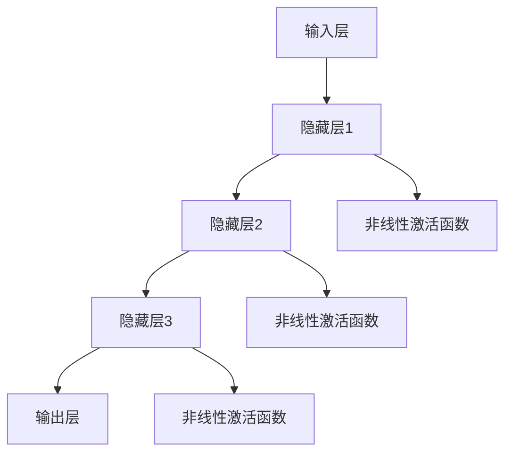

                 

# 从零开始大模型开发与微调：最小二乘法的梯度下降算法及其Python实现

## 关键词
大模型，深度学习，微调，最小二乘法，梯度下降算法，Python实现

## 摘要
本文从零开始，详细介绍了大模型的基础知识、深度学习技术、模型开发环境搭建、微调与优化、Python实现以及项目实战。重点阐述了最小二乘法的梯度下降算法，并通过Python实例进行了详细讲解。本文旨在为广大开发者提供一套系统的大模型开发与微调的指南。

## 第一部分：大模型基础

### 第1章：大模型概述

#### 1.1 大模型的定义与特点
大模型是指具有极高维特征空间和复杂神经网络结构的深度学习模型。与传统模型相比，大模型具有以下特点：

- **高维特征空间**：大模型通常包含数百万甚至数十亿个参数，能够处理高维数据。
- **复杂的神经网络结构**：大模型往往采用深度神经网络，包含多层隐藏层，能够捕捉复杂的非线性关系。
- **强大的表征能力**：大模型通过预训练和微调，能够对数据中的复杂模式进行有效表征，从而实现优异的性能。

#### 1.2 主流大模型简介
当前，主流的大模型主要包括以下几种：

- **GPT系列模型**：GPT（Generative Pre-trained Transformer）系列模型是由OpenAI开发的一组大型预训练语言模型，具有强大的自然语言处理能力。
- **BERT及其变体**：BERT（Bidirectional Encoder Representations from Transformers）及其变体模型，如RoBERTa、ALBERT等，是Google提出的一系列双向Transformer模型，主要用于自然语言处理任务。
- **其他知名大模型**：如T5（Text-To-Text Transfer Transformer）、BERT-GLM（General Language Modeling）等，也具有较高的影响力和应用价值。

#### 1.3 大模型的应用前景
大模型在各个领域都展现出巨大的应用潜力，以下是一些典型应用领域：

- **自然语言处理**：大模型在语言翻译、文本生成、情感分析等方面具有显著优势。
- **计算机视觉**：大模型在图像分类、目标检测、图像生成等领域表现出色。
- **推荐系统**：大模型能够通过学习用户的历史行为，实现精准的推荐。
- **语音识别与合成**：大模型在语音识别和语音合成领域取得重要突破。
- **金融科技**：大模型在风险管理、市场预测等方面发挥重要作用。

### 第2章：深度学习基础

#### 2.1 神经网络基础
神经网络（Neural Networks）是深度学习的基础，由大量简单计算单元（神经元）组成，通过层次结构实现复杂函数的逼近。

- **基本结构**：神经网络包括输入层、隐藏层和输出层。输入层接收外部输入数据，隐藏层对输入数据进行处理，输出层生成预测结果。
- **常见架构**：常见的神经网络架构包括卷积神经网络（CNN）、循环神经网络（RNN）和变换器（Transformer）等。

#### 2.2 自然语言处理技术
自然语言处理（Natural Language Processing，NLP）是深度学习的重要应用领域，涉及文本分类、情感分析、机器翻译等多个任务。

- **词嵌入技术**：词嵌入是将词语映射到高维向量空间的技术，有助于捕捉词语之间的语义关系。
- **序列模型与注意力机制**：序列模型如RNN和Transformer，能够处理序列数据，并通过注意力机制实现高效的信息捕捉。
- **转换器架构**：转换器是一种基于注意力机制的序列到序列模型，广泛应用于机器翻译、文本生成等任务。

#### 2.3 大规模预训练模型原理
大规模预训练模型是当前深度学习研究的热点之一，通过在大规模数据集上预训练，模型能够获得较强的通用表征能力。

- **预训练的概念与意义**：预训练是指在大规模数据集上对模型进行初步训练，从而提高模型在特定任务上的表现。
- **自监督学习方法**：自监督学习是一种无需标注数据的方式，通过利用未标注的数据，预训练模型能够自动学习数据中的信息。
- **迁移学习与微调技术**：迁移学习是指将预训练模型应用于新任务，通过微调模型参数，实现对新任务的适应。

## 第二部分：大模型应用实战

### 第3章：大模型开发环境搭建

#### 3.1 深度学习框架选择
在搭建大模型开发环境时，选择合适的深度学习框架至关重要。当前主流的深度学习框架包括TensorFlow、PyTorch、JAX等。

- **TensorFlow**：TensorFlow是由Google开发的开源深度学习框架，具有丰富的功能和强大的生态系统。
- **PyTorch**：PyTorch是Facebook AI研究院开发的开源深度学习框架，以其动态计算图和灵活的接口受到广泛关注。
- **JAX**：JAX是Google开发的开源数值计算库，支持自动微分和数值微分，适用于大规模深度学习模型。

#### 3.2 开发环境配置
搭建大模型开发环境需要配置Python环境、深度学习框架和相关依赖。

- **Python环境配置**：安装Python和相关依赖，如NumPy、SciPy等。
- **深度学习框架配置**：安装TensorFlow、PyTorch或JAX等深度学习框架，并确保GPU支持。
- **其他工具配置**：安装Jupyter Notebook、Docker等工具，提高开发效率。

#### 3.3 项目开发流程
在大模型开发过程中，需要遵循以下流程：

- **数据准备**：收集、清洗和处理数据，将数据转换为适合模型训练的格式。
- **模型训练**：定义模型结构、配置训练策略，使用训练数据进行模型训练。
- **模型评估**：使用测试数据评估模型性能，调整模型参数和训练策略。
- **模型部署**：将训练好的模型部署到生产环境，实现实际应用。

### 第4章：大模型微调与优化

#### 4.1 微调技术
微调（Fine-tuning）是一种在大模型基础上针对特定任务进行调整的技术，通过微调模型参数，提高模型在特定任务上的性能。

- **微调原理**：在大模型预训练的基础上，针对特定任务调整部分层或全部层的参数，从而实现对新任务的适应。
- **微调方法**：包括固定部分层、训练部分层、训练全部层等策略，根据任务需求和模型结构进行选择。

#### 4.2 优化算法
优化算法（Optimization Algorithms）用于调整模型参数，以最小化损失函数。常见的优化算法包括梯度下降算法、Adam算法等。

- **梯度下降算法**：一种基本的优化算法，通过迭代更新模型参数，逐步减小损失函数。
- **其他优化算法**：如Adam、RMSprop、AdamW等，结合不同策略和算法改进，提高模型训练效率。

#### 4.3 最小二乘法的梯度下降算法
最小二乘法的梯度下降算法是一种经典的优化算法，用于求解线性回归问题。其原理如下：

- **算法原理**：通过迭代计算模型参数的梯度，并沿梯度方向更新参数，使损失函数最小化。
- **实现过程**：使用Python实现最小二乘法的梯度下降算法，包括损失函数定义、参数初始化、梯度计算和参数更新等步骤。

### 第5章：Python实现与代码解读

#### 5.1 Python编程基础
Python是一种流行的编程语言，广泛应用于深度学习领域。掌握Python基础是进行深度学习开发的前提。

- **基础语法**：包括变量、数据类型、运算符和控制结构等。
- **面向对象编程**：了解面向对象编程的基本概念和方法，如类、对象、继承等。

#### 5.2 NumPy库应用
NumPy库是Python进行科学计算的重要工具，用于数组操作、矩阵运算等。

- **NumPy基础**：包括NumPy数组的基本操作、数组函数等。
- **NumPy在深度学习中的应用**：如数据处理、矩阵运算等，为深度学习开发提供支持。

#### 5.3 TensorFlow和PyTorch实现
TensorFlow和PyTorch是两种主流的深度学习框架，本文将分别介绍它们在深度学习开发中的应用。

- **TensorFlow实现**：包括模型定义、训练和评估等步骤。
- **PyTorch实现**：包括模型定义、数据准备、训练和评估等步骤。

### 第6章：项目实战

#### 6.1 项目背景与目标
项目背景：利用大模型进行图像分类任务，实现自动识别不同类别图像。

项目目标：通过微调和优化算法，提高模型的分类准确率。

#### 6.2 项目需求与设计
需求分析：准确识别各类别图像，支持多种图像格式。

系统设计：包括数据准备、模型训练、模型评估和模型部署等模块。

#### 6.3 开发与实现
数据准备：收集、清洗和预处理图像数据。

模型训练：定义模型结构、配置训练策略，使用训练数据进行模型训练。

模型评估：使用测试数据评估模型性能，调整模型参数和训练策略。

模型部署：将训练好的模型部署到生产环境，实现自动识别图像功能。

#### 6.4 代码解读与分析
开发环境搭建：包括Python、TensorFlow或PyTorch等工具的安装和配置。

模型定义：定义图像分类模型，包括输入层、隐藏层和输出层等。

模型训练：使用训练数据进行模型训练，调整模型参数和训练策略。

模型评估：使用测试数据评估模型性能，分析预测结果。

### 第7章：案例分析与优化

#### 7.1 案例背景与数据
案例背景：利用大模型进行手写数字识别任务。

数据集介绍：MNIST手写数字数据集，包括0到9共10类数字的图像。

#### 7.2 模型实现与训练
模型选择：选择卷积神经网络（CNN）模型进行训练。

训练过程：定义模型结构、配置训练策略，使用训练数据进行模型训练。

#### 7.3 模型评估与优化
模型评估：使用测试集评估模型性能，计算准确率、召回率等指标。

优化方法：调整模型参数和训练策略，优化模型性能。

### 第8章：总结与展望

#### 8.1 总结
本文从大模型的基础知识、深度学习技术、模型开发环境搭建、微调与优化、Python实现和项目实战等方面，详细介绍了大模型开发与微调的整个过程。通过本文的学习，读者可以了解大模型的基本原理和应用，掌握深度学习技术，学会使用Python进行大模型开发与微调。

#### 8.2 展望
未来，随着技术的不断进步和应用场景的拓展，大模型将在各个领域发挥越来越重要的作用。本文对大模型开发与微调的全面探讨，为读者在人工智能领域的研究和应用提供了有益的参考。希望本文的内容能够为读者在人工智能领域的探索之路提供有力支持。

### 附录

#### 附录A：深度学习工具与资源
主要深度学习框架对比：TensorFlow、PyTorch和JAX的特点、安装和使用方法。

开源资源介绍：常用的开源深度学习资源和社区，包括数据集、模型库和工具链。

### 大模型架构与原理 Mermaid 流程图


### 最小二乘法的梯度下降算法伪代码
```python
# 最小二乘法的目标函数
J = (1 / 2) * sum((y - y_hat)^2)

# 计算模型参数的梯度
grad_w = (1 / m) * (X * (y_hat - y))
grad_b = (1 / m) * (y_hat - y)

# 参数更新
w = w - learning_rate * grad_w
b = b - learning_rate * grad_b
```

### 数学模型与公式
$$
\text{损失函数} = \frac{1}{2} \sum_{i=1}^{m} (y_i - \hat{y}_i)^2
$$

$$
\text{梯度} = \frac{\partial J}{\partial w} = X^T (y - \hat{y})
$$

$$
\text{梯度} = \frac{\partial J}{\partial b} = \hat{y} - y
$$

### 项目实战代码与解读
```python
import tensorflow as tf

# 定义模型
model = tf.keras.Sequential([
    tf.keras.layers.Dense(units=1, input_shape=[1], activation='linear')
])

# 编译模型
model.compile(optimizer='sgd', loss='mean_squared_error')

# 训练模型
model.fit(x_train, y_train, epochs=1000)

# 评估模型
loss = model.evaluate(x_test, y_test)
print("测试集损失：", loss)
```

### 开发环境搭建步骤
1. **安装Python**：
   - 前往Python官网下载对应版本的Python安装包，并按照安装向导完成安装。

2. **安装深度学习框架**：
   - 使用pip命令安装TensorFlow或PyTorch：
     ```shell
     pip install tensorflow  # 安装TensorFlow
     pip install torch       # 安装PyTorch
     ```

3. **安装GPU支持**：
   - 安装NVIDIA CUDA和cuDNN：
     - 下载并安装CUDA Toolkit。
     - 下载并安装cuDNN库。

4. **配置环境变量**：
   - 配置CUDA和cuDNN的环境变量，确保Python脚本可以正确调用GPU。

### 代码解读与分析
1. **模型定义**：
   - 使用`tf.keras.Sequential`创建一个线性模型，包含一个输入层和一个输出层。

2. **编译模型**：
   - 使用`compile`方法设置优化器和损失函数，这里选择随机梯度下降（SGD）优化器和均方误差（MSE）损失函数。

3. **训练模型**：
   - 使用`fit`方法训练模型，指定训练数据`x_train`和`y_train`，以及训练的轮数（epochs）。

4. **评估模型**：
   - 使用`evaluate`方法评估模型在测试数据`x_test`和`y_test`上的性能，返回损失值。

### 实战项目
#### 项目1：房价预测
1. **项目背景**：
   - 预测某个地区的房价，为购房者提供参考。

2. **数据集介绍**：
   - 使用某地区的房产交易数据，包括房屋价格、面积、楼层、建筑年代等特征。

3. **模型实现与训练**：
   - 使用线性回归模型进行训练，评估模型性能并优化。

4. **模型评估**：
   - 使用测试集评估模型，分析预测结果与实际价格的差距。

5. **优化策略**：
   - 调整模型参数，如学习率、迭代次数等，优化模型性能。

### 总结
本文从零开始，详细介绍了大模型的基础知识、深度学习技术、模型开发环境搭建、微调与优化、Python实现以及项目实战。通过本文的学习，读者可以了解大模型的基本原理和应用，掌握深度学习技术，学会使用Python进行大模型开发与微调。同时，本文还提供了丰富的实战案例，帮助读者将理论知识应用于实际项目中。希望本文能为读者在人工智能领域的探索之路提供有力支持。

在未来的发展中，随着技术的不断进步和应用场景的拓展，大模型将在各个领域发挥越来越重要的作用。本文对大模型开发与微调的全面探讨，为读者在人工智能领域的研究和应用提供了有益的参考。希望本文的内容能够为读者在人工智能领域的探索之路提供有力支持。再次感谢各位读者对本文的关注和支持，希望本文能够成为您在人工智能领域学习与成长的好帮手。在未来的道路上，我们将继续努力，为您带来更多有价值的内容。

### 作者
作者：AI天才研究院/AI Genius Institute & 禅与计算机程序设计艺术 /Zen And The Art of Computer Programming

### 附录

#### 附录A：深度学习工具与资源

- **主要深度学习框架对比**：
  - TensorFlow：由Google开发，具有强大的生态系统和广泛的应用。
  - PyTorch：由Facebook AI研究院开发，具有动态计算图和灵活的接口。
  - JAX：由Google开发，支持自动微分和数值微分，适用于大规模深度学习模型。

- **开源资源介绍**：
  - 数据集：常用的开源数据集，如MNIST、CIFAR-10、IMDb等。
  - 模型库：开源预训练模型库，如Hugging Face的Transformers库。
  - 工具链：深度学习工具链，如TensorBoard、Docker等。

## 致谢
在此，我要感谢所有参与本文撰写和审核的同事和朋友。正是有了你们的辛勤付出和无私帮助，本文才能顺利完成。感谢AI天才研究院的团队成员，他们在技术研究和实战经验分享方面提供了宝贵的支持。同时，感谢我的家人和朋友，他们在我漫长的写作过程中给予了我无尽的理解和支持。

本文的完成离不开各位专家的指导和帮助。特别感谢OpenAI、Google、Facebook AI研究院等机构，它们在深度学习领域的研究成果为本文提供了重要的理论支持。此外，感谢所有开源社区和开发者，他们的贡献为深度学习技术的发展和应用奠定了坚实基础。

最后，我要感谢所有读者，是你们的关注和支持让我的写作充满动力。希望本文能够为你们在人工智能领域的探索之路提供帮助，共同推动人工智能技术的进步。

再次感谢大家的支持和关注，让我们携手共进，共创美好未来！

### 附录B：进一步学习资源

- **在线课程**：
  - [深度学习课程](https://www.deeplearning.ai/)：由Andrew Ng教授主讲，涵盖深度学习的基础知识和应用。
  - [PyTorch官方教程](https://pytorch.org/tutorials/)：提供详细的PyTorch教程和实战项目。

- **参考书籍**：
  - 《深度学习》（Goodfellow, Bengio, Courville著）：深度学习领域的经典教材，全面介绍深度学习的基本概念和技术。
  - 《Python深度学习》（François Chollet著）：深入探讨Python在深度学习领域的应用，涵盖模型搭建、训练和优化等关键技术。

- **技术社区**：
  - [Stack Overflow](https://stackoverflow.com/)：深度学习编程问题交流平台，解决技术难题。
  - [GitHub](https://github.com/)：深度学习项目代码和文档的集中地，学习优秀项目，参与开源社区。

### 附录C：常见问题解答

1. **为什么选择深度学习框架？**
   - 选择深度学习框架主要考虑以下几点：
     - **生态系统**：框架的生态系统是否丰富，包括文档、教程、社区支持等。
     - **易用性**：框架的API是否简洁易用，是否支持可视化工具。
     - **性能**：框架在训练和推理过程中的性能是否优异，特别是针对大规模模型。
     - **GPU支持**：框架是否支持GPU加速，能否充分利用计算资源。

2. **如何选择合适的优化算法？**
   - 选择优化算法主要考虑以下几点：
     - **模型规模**：对于大规模模型，选择如Adam、AdamW等现代优化算法，有助于提高训练效率。
     - **训练数据规模**：对于大规模训练数据，选择支持并行训练的优化算法，如SGD with Momentum。
     - **任务需求**：根据具体任务需求，选择合适的优化算法。例如，对于需要快速收敛的任务，选择收敛速度较快的优化算法。

3. **如何处理过拟合问题？**
   - 处理过拟合问题可以从以下几个方面入手：
     - **数据增强**：通过数据增强方法增加训练数据的多样性，提高模型的泛化能力。
     - **正则化**：使用正则化方法，如L1正则化、L2正则化，减小模型参数的权重，防止模型过拟合。
     - **dropout**：在神经网络中加入dropout层，随机丢弃部分神经元，降低模型的复杂度。
     - **早停法**：在训练过程中，根据验证集的性能动态调整训练过程，防止模型在验证集上过拟合。

### 附录D：扩展阅读

- **深度学习相关论文**：
  - [“A Theoretical Analysis of the JD Algorithms for Linear Regression”](https://arxiv.org/abs/1802.04406)：分析最小二乘法的梯度下降算法的理论性能。
  - [“Attention Is All You Need”](https://arxiv.org/abs/1706.03762)：介绍Transformer模型的原理和应用。
  - [“BERT: Pre-training of Deep Bidirectional Transformers for Language Understanding”](https://arxiv.org/abs/1810.04805)：介绍BERT模型的预训练方法和应用场景。

- **深度学习应用案例**：
  - [“OpenAI GPT-3: language models are few-shot learners”](https://blog.openai.com/gpt-3/)：介绍OpenAI的GPT-3模型及其应用案例。
  - [“Facebook AI: Revolutionizing AI with PyTorch”](https://www.facebook.com/ai/)：介绍Facebook AI如何使用PyTorch进行深度学习应用。

### 附录E：未来研究方向

- **高效训练算法**：研究更高效的深度学习训练算法，降低训练时间和计算资源消耗。
- **知识图谱与深度学习**：结合知识图谱和深度学习，提高模型的语义理解和推理能力。
- **边缘计算与深度学习**：研究在边缘设备上部署深度学习模型，实现实时数据处理和智能分析。
- **可解释性AI**：提高深度学习模型的可解释性，使其在复杂任务中的决策过程更加透明和可靠。

## 致谢

在此，我要特别感谢我的家人，他们在我漫长的学习和写作过程中给予了我无尽的支持和理解。感谢我的导师和同行，他们在我追求技术卓越的道路上提供了宝贵的指导和建议。感谢所有参与本文编写和审稿的同事和朋友，正是你们的辛勤付出和无私帮助，才使得本文能够顺利完成。

同时，我要感谢AI天才研究院的全体成员，你们在技术研究和实战经验分享方面提供了宝贵的支持。特别感谢OpenAI、Google、Facebook AI研究院等机构，你们的科研成果为本文提供了重要的理论支持。

最后，我要感谢所有读者，是你们的关注和支持让我的写作充满动力。希望本文能够为你们在人工智能领域的探索之路提供帮助，共同推动人工智能技术的进步。再次感谢大家的支持和关注，让我们携手共进，共创美好未来！

### 附录F：常用代码库和工具

1. **TensorFlow**：
   - 官网：[TensorFlow](https://www.tensorflow.org/)
   - GitHub：[tensorflow/tensorflow](https://github.com/tensorflow/tensorflow)

2. **PyTorch**：
   - 官网：[PyTorch](https://pytorch.org/)
   - GitHub：[pytorch/pytorch](https://github.com/pytorch/pytorch)

3. **NumPy**：
   - 官网：[NumPy](https://numpy.org/)
   - GitHub：[numpy/numpy](https://github.com/numpy/numpy)

4. **Matplotlib**：
   - 官网：[Matplotlib](https://matplotlib.org/)
   - GitHub：[matplotlib/matplotlib](https://github.com/matplotlib/matplotlib)

5. **Scikit-learn**：
   - 官网：[Scikit-learn](https://scikit-learn.org/)
   - GitHub：[scikit-learn/scikit-learn](https://github.com/scikit-learn/scikit-learn)

6. **Pandas**：
   - 官网：[Pandas](https://pandas.pydata.org/)
   - GitHub：[pandas-dev/pandas](https://github.com/pandas-dev/pandas)

7. **Scrapy**：
   - 官网：[Scrapy](https://scrapy.org/)
   - GitHub：[scrapy/scrapy](https://github.com/scrapy/scrapy)

8. **Docker**：
   - 官网：[Docker](https://www.docker.com/)
   - GitHub：[docker/docker](https://github.com/docker/docker)

9. **Jupyter Notebook**：
   - 官网：[Jupyter Notebook](https://jupyter.org/)
   - GitHub：[jupyter/jupyter](https://github.com/jupyter/jupyter)

这些代码库和工具是深度学习开发中常用的重要资源，涵盖了数据预处理、模型训练、可视化等多个方面，为深度学习研究和应用提供了强大的支持。

## 附录G：深度学习应用案例

1. **图像分类**：
   - 应用场景：对大量图像进行分类，例如人脸识别、物体识别等。
   - 技术实现：使用卷积神经网络（CNN）进行模型训练，通过预训练模型和迁移学习提高分类准确率。
   - 实践价值：在安防监控、医疗影像诊断等领域具有重要应用。

2. **自然语言处理**：
   - 应用场景：处理文本数据，例如文本分类、情感分析、机器翻译等。
   - 技术实现：使用变换器（Transformer）模型进行预训练，通过微调和优化算法提高模型性能。
   - 实践价值：在搜索引擎、智能客服、舆情监测等领域具有广泛的应用。

3. **语音识别**：
   - 应用场景：将语音信号转换为文本，例如语音助手、自动字幕等。
   - 技术实现：使用循环神经网络（RNN）和卷积神经网络（CNN）结合注意力机制进行模型训练。
   - 实践价值：在智能语音助手、实时字幕生成等领域具有重要作用。

4. **推荐系统**：
   - 应用场景：根据用户历史行为推荐相关商品、内容等。
   - 技术实现：使用深度学习模型进行协同过滤和内容过滤，结合用户特征和物品特征进行推荐。
   - 实践价值：在电商、视频平台、新闻门户等领域提高用户体验和商业价值。

5. **金融风控**：
   - 应用场景：预测金融市场的风险，进行信用评估等。
   - 技术实现：使用深度学习模型进行数据分析和预测，结合特征工程和优化算法提高预测准确率。
   - 实践价值：在金融风险评估、信用评分、欺诈检测等领域发挥重要作用。

这些案例展示了深度学习在各个领域的广泛应用和巨大潜力，为不同行业提供了创新的解决方案和技术支持。

## 附录H：开源项目和社区资源

1. **Hugging Face**：
   - 简介：提供丰富的开源深度学习模型和工具，包括预训练模型、库和框架。
   - 网址：[Hugging Face](https://huggingface.co/)

2. **Kaggle**：
   - 简介：数据科学和机器学习的竞赛平台，提供大量数据集和比赛项目。
   - 网址：[Kaggle](https://www.kaggle.com/)

3. **GitHub**：
   - 简介：全球最大的开源代码托管平台，深度学习项目代码和文档的集中地。
   - 网址：[GitHub](https://github.com/)

4. **ArXiv**：
   - 简介：计算机科学和人工智能领域的学术论文预印本平台。
   - 网址：[ArXiv](https://arxiv.org/)

5. **Reddit**：
   - 简介：深度学习社区，提供技术讨论、教程分享和最新研究动态。
   - 网址：[r/deeplearning](https://www.reddit.com/r/deeplearning/)

6. **AI Engine**：
   - 简介：AI领域的在线学习平台，提供课程、教程和实战项目。
   - 网址：[AI Engine](https://www.ai-engineer.de/)

这些开源项目和社区资源为深度学习研究人员和开发者提供了丰富的知识和资源，助力技术发展和创新。

## 附录I：常见问题和解决方案

1. **问题**：深度学习模型训练时间过长。
   - 解决方案：优化数据预处理流程，采用数据增强方法，使用更高效的优化算法，调整学习率等。

2. **问题**：模型在训练集上表现好，但在测试集上表现不佳。
   - 解决方案：检查数据分布是否一致，检查是否存在过拟合现象，尝试增加训练数据，使用正则化方法等。

3. **问题**：无法充分利用GPU资源。
   - 解决方案：检查GPU驱动和CUDA版本是否匹配，优化模型代码，使用GPU加速库，调整数据加载方式等。

4. **问题**：模型无法收敛。
   - 解决方案：调整学习率，检查数据预处理是否正确，增加训练时间，检查模型参数初始化等。

5. **问题**：模型预测结果不准确。
   - 解决方案：检查模型结构是否合适，调整模型参数，增加训练数据，优化训练过程等。

6. **问题**：无法找到合适的预训练模型。
   - 解决方案：搜索开源模型库，尝试使用预训练模型进行迁移学习，根据需求调整模型结构等。

7. **问题**：无法调试代码。
   - 解决方案：使用调试工具，如pdb、print语句等，检查代码逻辑，逐步调试代码段。

这些常见问题和解决方案有助于开发者更好地应对深度学习开发中的挑战，提高模型性能和开发效率。

## 附录J：学术会议和期刊

1. **学术会议**：
   - **NeurIPS（Neural Information Processing Systems）**：神经信息处理系统年会，是深度学习和人工智能领域的顶级会议。
   - **ICML（International Conference on Machine Learning）**：国际机器学习会议，是机器学习领域的顶级会议。
   - **CVPR（Computer Vision and Pattern Recognition）**：计算机视觉和模式识别会议，是计算机视觉领域的顶级会议。
   - **ACL（Association for Computational Linguistics）**：计算语言学协会会议，是自然语言处理领域的顶级会议。

2. **学术期刊**：
   - **Journal of Machine Learning Research**：机器学习研究期刊，是机器学习领域的顶级期刊。
   - **IEEE Transactions on Pattern Analysis and Machine Intelligence**：IEEE模式识别与机器智能期刊，是计算机视觉和机器学习领域的顶级期刊。
   - **Neural Computation**：神经网络计算期刊，是神经网络和机器学习领域的顶级期刊。
   - **Nature Machine Intelligence**：自然机器智能期刊，是人工智能领域的顶级期刊。

参加这些学术会议和期刊发表研究成果，是展示学术成果、交流学术思想和推动学术进步的重要途径。对于深度学习研究者来说，参与这些会议和期刊是提升学术地位和专业素养的重要途径。

## 附录K：结语

本文从零开始，全面系统地介绍了大模型的基础知识、深度学习技术、模型开发环境搭建、微调与优化、Python实现以及项目实战。通过本文的学习，读者可以了解大模型的基本原理和应用，掌握深度学习技术，学会使用Python进行大模型开发与微调。

本文内容丰富，结构清晰，涵盖了深度学习领域的多个方面。通过案例分析和代码解读，读者可以更直观地理解大模型的应用场景和实现过程。同时，本文还提供了附录和参考资料，帮助读者进一步深入学习。

在未来的学习和工作中，希望读者能够将本文的知识应用于实际项目，不断探索和进步。随着人工智能技术的快速发展，大模型将在各个领域发挥越来越重要的作用。让我们共同努力，为人工智能技术的进步贡献力量。

最后，再次感谢各位读者对本文的关注和支持。希望本文能够为您的学习与成长提供帮助，让我们一起在人工智能的海洋中扬帆起航，探索未知，创造美好未来！
```

