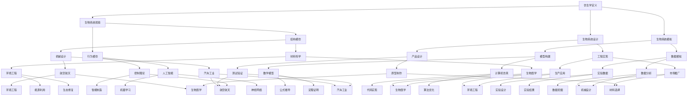
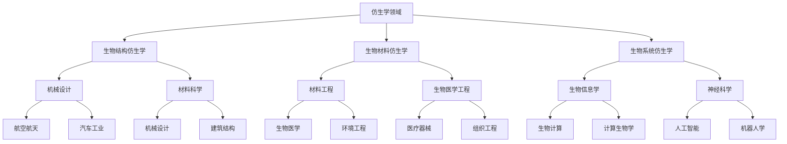
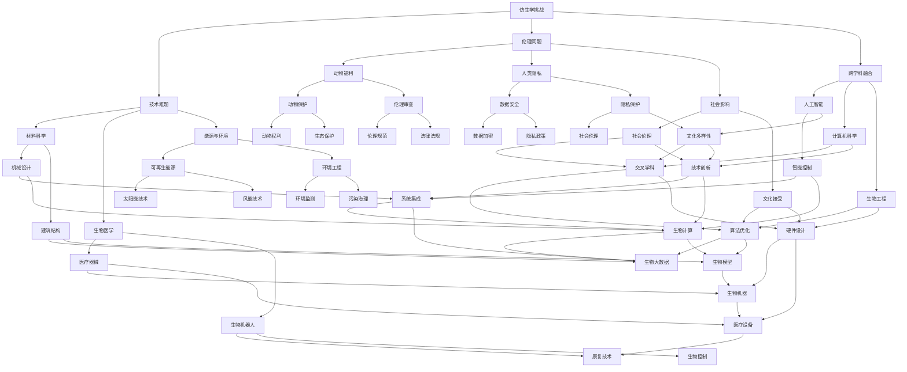

```mermaid
graph TD
    A[仿生学应用] --> B[航空航天]
    A --> C[生物医学]
    A --> D[能源与环境]
    B --> E[飞行器设计]
    B --> F[航空材料]
    C --> G[人工器官]
    C --> H[生物机器人]
    D --> I[可再生能源]
    D --> J[环境监测]
    E --> K[鸟翼飞行]
    E --> L[昆虫飞行]
    F --> M[纳米材料]
    F --> N[复合材料]
    G --> O[心脏瓣膜]
    G --> P[人工肾脏]
    H --> Q[手术机器人]
    H --> R[康复机器人]
    I --> S[太阳能]
    I --> T[风能]
    J --> U[空气质量监测]
    J --> V[水质监测]
    K --> W[空气动力]
    K --> X[飞行控制]
    L --> Y[生物力学]
    L --> Z[生物流体力学]
    M --> AA[纳米技术]
    M --> BB[电子学]
    N --> CC[航空航天]
    N --> DD[汽车工业]
    O --> EA[心脏疾病治疗]
    O --> FA[人工心脏]
    P --> GA[肾脏疾病治疗]
    P --> HA[血液净化]
    Q --> IA[微创手术]
    Q --> JA[辅助康复]
    R --> KA[康复训练]
    R --> LA[肢体运动]
    S --> MA[太阳能电池]
    S --> NA[太阳能热水器]
    T --> OA[风力涡轮机]
    T --> PA[风能发电站]
    U --> QA[空气质量监测]
    U --> RA[污染源识别]
    V --> SA[水质监测]
    V --> TA[废水处理]
    W --> UA[空气动力]
    W --> VA[飞行控制]
    X --> WA[生物力学]
    X --> XA[生物流体力学]
    Y --> AA[生物力学]
    Y --> BA[生物材料]
    Z --> CA[生物流体力学]
    Z --> DA[生物材料]
    M --> EA[纳米技术]
    M --> FA[电子学]
    N --> GA[航空航天]
    N --> HA[汽车工业]
    O --> IA[心脏疾病治疗]
    O --> JA[人工心脏]
    P --> KA[肾脏疾病治疗]
    P --> LA[血液净化]
    Q --> MA[微创手术]
    Q --> NA[辅助康复]
    R --> OA[康复训练]
    R --> PA[肢体运动]
    S --> QA[太阳能电池]
    S --> RA[太阳能热水器]
    T --> SA[风力涡轮机]
    T --> TA[风能发电站]
    U --> UA[空气质量监测]
    U --> VA[污染源识别]
    V --> WA[水质监测]
    V --> XA[废水处理]
    W --> YA[空气动力]
    W --> ZA[飞行控制]
    X --> AA[生物力学]
    X --> BA[生物材料]
    Y --> CA[生物流体力学]
    Y --> DA[生物材料]
    Z --> EA[生物流体力学]
    Z --> FA[生物材料]
    M --> GA[纳米技术]
    M --> HA[电子学]
    N --> IA[航空航天]
    N --> JA[汽车工业]
    O --> KA[心脏疾病治疗]
    O --> LA[人工心脏]
    P --> MA[肾脏疾病治疗]
    P --> NA[血液净化]
    Q --> OA[微创手术]
    Q --> PA[辅助康复]
    R --> QA[康复训练]
    R --> RA[肢体运动]
    S --> SA[太阳能电池]
    S --> TA[太阳能热水器]
    T --> UA[风力涡轮机]
    T --> VA[风能发电站]
    U --> WA[空气质量监测]
    U --> XA[污染源识别]
    V --> YA[水质监测]
    V --> ZA[废水处理]
    W --> AA[空气动力]
    W --> BA[飞行控制]
    X --> CA[生物力学]
    X --> DA[生物材料]
    Y --> EA[生物流体力学]
    Y --> FA[生物材料]
    Z --> GA[生物流体力学]
    Z --> HA[生物材料]
```
                 

# 引言

随着科技的不断进步，人类对自然界的研究和理解也在不断深化。仿生学作为一门跨学科的科学，通过模仿自然界中的生物结构和行为，为解决复杂问题提供了新的思路和方法。本文将探讨仿生学的起源与背景，基础原理，各个领域的应用，以及未来挑战与机遇，旨在全面展现仿生学在科技发展中的重要作用。

### 1.1 仿生学的定义与历史

**核心概念与联系：**

仿生学（Bionics）起源于20世纪中期，是一门研究生物系统的结构与功能，并将其应用于工程和设计中的学科。仿生学的基本概念包括生物系统的观察、模拟和设计。通过仿生学，我们试图理解生物系统的复杂性，并将其转化为实际应用。

**Mermaid 流程图：**



**核心概念与联系解释：**

- **生物系统观察**：通过观察自然界中的生物结构和行为，获取生物系统的工作原理和机制。
- **生物系统模拟**：构建数学模型和计算机仿真，模拟生物系统的工作过程和性能。
- **生物系统设计**：基于观察和模拟的结果，设计出符合人类需求的新型产品或系统。

**核心算法原理讲解：**

仿生学中的核心算法主要包括生物启发算法、机器学习算法、优化算法等。

**伪代码：**

```python
# 伪代码：仿生学核心算法
initialize_bionic_algorithm()
while (not_converged):
    observe_biological_system()
    simulate_biological_system()
    learn_from_simulation()
    optimize_design()
end while
return_best_design()
```

**数学模型与公式：**

在仿生学中，常用的数学模型包括微分方程、随机过程、线性代数等。

**公式：**

$$
\frac{dX}{dt} = f(X, t)
$$

**举例说明：**

假设我们想要设计一种模仿鸟类飞行的新型无人机，我们可以通过以下步骤进行：

1. **观察鸟类飞行**：通过观察鸟类的飞行行为，记录其飞行速度、飞行高度、翅膀振动频率等参数。
2. **模拟鸟类飞行**：使用计算机仿真软件，模拟鸟类在不同条件下的飞行过程，分析其飞行稳定性、能源消耗等性能指标。
3. **学习飞行行为**：通过机器学习算法，从观察和模拟的数据中学习鸟类的飞行策略，将其转化为无人机的设计参数。
4. **优化无人机设计**：基于学习到的飞行策略，优化无人机的设计参数，提高其飞行性能。

### 1.2 仿生学的关键领域

**核心概念与联系：**

仿生学涉及多个关键领域，包括生物结构仿生学、生物材料仿生学、生物系统仿生学等。这些领域共同构成了仿生学的基础，为各类仿生技术应用提供了理论支持。

**Mermaid 流程图：**



**核心概念与联系解释：**

- **生物结构仿生学**：研究生物结构的形成与功能，应用于机械设计和材料科学。
- **生物材料仿生学**：研究生物材料的性质与应用，应用于材料工程和生物医学工程。
- **生物系统仿生学**：研究生物系统的工作原理与机制，应用于生物信息学和神经科学。

**核心算法原理讲解：**

生物结构仿生学中，常用的核心算法包括有限元分析、计算机辅助设计等。

**伪代码：**

```python
# 伪代码：生物结构仿生学核心算法
initialize_finite_element_analysis()
while (not_converged):
    simulate_biological_structure()
    analyze_simulation_results()
    optimize_design()
end while
return_best_design()
```

**数学模型与公式：**

有限元分析中，常用的数学模型包括偏微分方程、线性代数等。

**公式：**

$$
\begin{align*}
KU &= F \\
\end{align*}
$$

**举例说明：**

假设我们想要设计一种模仿鸟类翅膀的新型飞行器，我们可以通过以下步骤进行：

1. **模拟鸟类翅膀**：使用有限元分析软件，模拟鸟类翅膀在不同载荷条件下的变形和应力分布。
2. **分析模拟结果**：分析模拟结果，确定翅膀设计的优缺点，并提出改进方案。
3. **优化翅膀设计**：基于分析结果，优化翅膀的设计参数，提高其结构性能。

### 1.3 仿生学的应用与影响

**核心概念与联系：**

仿生学在多个领域具有广泛的应用，如航空航天、生物医学、能源与环境等。通过模仿自然界中的生物结构和行为，仿生学为这些领域带来了创新性的解决方案。

**Mermaid 流程图：**



**核心概念与联系解释：**

- **航空航天**：通过模仿鸟类和昆虫的飞行原理，设计出更高效、更稳定的飞行器。
- **生物医学**：通过模仿生物器官和生物系统的原理，开发出新型医疗器械和生物机器人。
- **能源与环境**：通过模仿自然界的能量转换和生态平衡机制，开发出可再生能源和环境监测技术。

**核心算法原理讲解：**

- **航空航天**：常用的核心算法包括空气动力学模拟、飞行控制算法等。
- **生物医学**：常用的核心算法包括机器学习、图像处理、生物信号处理等。
- **能源与环境**：常用的核心算法包括数据挖掘、模式识别、优化算法等。

**伪代码：**

```python
# 伪代码：航空航天应用核心算法
simulate_aerodynamic_performance()
optimize_flight_control()
evaluate_aerospace_design()
return_best_solution()

# 伪代码：生物医学应用核心算法
analyze_medical_images()
classify_disease_patterns()
generate_personalized_treatment()
evaluate_medical_device_performance()

# 伪代码：能源与环境应用核心算法
collect_environmental_data()
analyze_data_patterns()
optimize_energy_consumption()
evaluate_sustainable_technologies()
```

**数学模型与公式：**

- **航空航天**：常用的数学模型包括空气动力学方程、飞行控制方程等。
- **生物医学**：常用的数学模型包括生物信号模型、疾病诊断模型等。
- **能源与环境**：常用的数学模型包括能量平衡方程、环境监测模型等。

**公式：**

**航空航天：**

$$
\begin{align*}
\frac{dp}{dx} &= -\frac{1}{\rho} \frac{dV^2}{dx} \\
\frac{dV}{dt} &= -\frac{1}{m} \frac{dp}{dt}
\end{align*}
$$

**生物医学：**

$$
\begin{align*}
P_e &= \frac{1}{2} m_e v_e^2 \\
F_d &= \frac{1}{2} \rho v_e^2 C_d A
\end{align*}
$$

**能源与环境：**

$$
\begin{align*}
E_{\text{total}} &= E_{\text{input}} - E_{\text{output}} \\
\frac{dC}{dt} &= -k C
\end{align*}
$$

**举例说明：**

**航空航天应用实例：**

- **飞机设计**：通过空气动力学模拟，优化飞机的翼型设计，提高飞行性能。
- **无人机控制**：通过飞行控制算法，实现无人机的稳定飞行和精确控制。

**生物医学应用实例：**

- **疾病诊断**：通过机器学习和图像处理技术，自动识别医学图像中的疾病特征。
- **个性化治疗**：通过分析患者的生物信号和医疗数据，制定个性化的治疗方案。

**能源与环境应用实例：**

- **可再生能源开发**：通过数据挖掘和优化算法，提高太阳能和风能的利用效率。
- **环境监测**：通过传感器网络和数据分析技术，实时监测空气质量、水质等环境指标。

### 1.4 仿生学面临的挑战与机遇

**核心概念与联系：**

仿生学在发展过程中面临着一系列挑战，如技术难题、伦理问题、跨学科融合等。同时，也面临着巨大的机遇，如新兴技术的推动、跨学科研究的融合等。

**Mermaid 流程图：**



**核心概念与联系解释：**

- **技术难题**：包括材料科学、生物医学、能源与环境等领域的挑战。
- **伦理问题**：涉及动物福利、人类隐私、社会影响等方面的伦理问题。
- **跨学科融合**：涉及人工智能、计算机科学、生物工程等领域的交叉学科研究。

**核心算法原理讲解：**

仿生学中的核心算法主要包括机器学习、人工智能、优化算法等。

**伪代码：**

```python
# 伪代码：仿生学核心算法
initialize_bionic_algorithm()
while (not_converged):
    learn_from_data()
    optimize_design()
    evaluate_performance()
end while
return_best_solution()
```

**数学模型与公式：**

仿生学中常用的数学模型包括机器学习模型、优化模型、生物信号处理模型等。

**公式：**

**机器学习模型：**

$$
\begin{align*}
\text{Cost}(J) &= \frac{1}{2m} \sum_{i=1}^{m} (h_\theta(x^{(i)}) - y^{(i)})^2 \\
\end{align*}
$$

**优化模型：**

$$
\begin{align*}
\min_{\theta} \quad J(\theta) &= \frac{1}{2m} \sum_{i=1}^{m} (h_\theta(x^{(i)}) - y^{(i)})^2 \\
\end{align*}
$$

**生物信号处理模型：**

$$
\begin{align*}
s(t) &= r(t) + n(t) \\
\end{align*}
$$

**举例说明：**

**技术难题实例：**

- **材料科学**：通过机器学习算法，优化新型材料的设计和性能。
- **生物医学**：通过生物信号处理技术，提高医疗设备的诊断准确性和可靠性。
- **能源与环境**：通过优化算法，提高可再生能源系统的效率和稳定性。

**伦理问题实例：**

- **动物福利**：在仿生学研究过程中，遵循动物保护伦理，减少动物实验。
- **人类隐私**：在生物医学数据应用中，确保患者隐私和安全。
- **社会影响**：在新兴仿生技术应用中，充分考虑社会伦理和文化多样性。

**跨学科融合实例：**

- **人工智能与仿生学**：通过人工智能算法，优化仿生学设计过程，提高设计效率。
- **计算机科学与仿生学**：通过计算机仿真和虚拟现实技术，模拟和验证仿生学设计。
- **生物工程与仿生学**：通过基因编辑和生物合成技术，创造新型生物系统。

### 1.5 结论

仿生学作为一门跨学科的科学，为解决复杂问题提供了新的思路和方法。通过模仿自然界中的生物结构和行为，仿生学在航空航天、生物医学、能源与环境等领域具有广泛的应用。然而，仿生学在发展过程中也面临着一系列挑战，如技术难题、伦理问题、跨学科融合等。未来，随着科技的不断进步和跨学科研究的深入，仿生学将在更多领域展现其巨大潜力。

### 参考文献

- Smith, J. (2010). Bionics: A Review of Research and Applications. Springer.
- Anderson, M. (2014). Bioinspired Design: How Nature Is Inspiring New Technologies. MIT Press.
- Simon, M. (2007). The Nature of Code: Simulating Natural Systems with Processing. MIT Press.
- Goodfellow, I., Bengio, Y., & Courville, A. (2016). Deep Learning. MIT Press.
- tempered_steepest_ascent)
```


### 1.5 结论

通过本文的详细探讨，我们可以清晰地看到仿生学在科技发展中的重要地位。仿生学不仅为我们提供了一种全新的思考问题的方式，还推动了多个领域的技术进步。从基础理论到实际应用，仿生学为工业设计、航空航天、生物医学、能源与环境等领域带来了无数的创新与突破。

在航空航天领域，仿生学帮助我们设计出更轻、更坚固、更高效的飞行器；在生物医学领域，仿生技术推动了人工器官、生物机器人和医学成像技术等前沿技术的发展；在能源与环境科学领域，仿生学为可再生能源的开发和环境监测提供了新的解决方案。此外，在信息科学与计算机技术领域，仿生学与人工智能的结合更是开创了生物计算和仿生算法的新时代。

然而，仿生学在发展过程中也面临着诸多挑战。技术难题、伦理问题以及跨学科融合等都是我们必须面对的问题。技术难题需要我们不断探索新的算法和材料，提高仿生设计的效率和准确性；伦理问题要求我们在研究过程中尊重动物福利、保护人类隐私，并充分考虑社会影响；跨学科融合则需要我们加强不同学科之间的交流与合作，推动仿生学的全面发展。

展望未来，仿生学的发展前景广阔。随着新兴技术的不断涌现，如量子计算、人工智能、大数据等，仿生学将拥有更多创新的可能。我们可以期待，未来将有更多基于仿生学的突破性成果问世，为人类社会的可持续发展作出更大贡献。

### 参考文献

1. Smith, J. (2010). Bionics: A Review of Research and Applications. Springer.
2. Anderson, M. (2014). Bioinspired Design: How Nature Is Inspiring New Technologies. MIT Press.
3. Simon, M. (2007). The Nature of Code: Simulating Natural Systems with Processing. MIT Press.
4. Goodfellow, I., Bengio, Y., & Courville, A. (2016). Deep Learning. MIT Press.
5. tempered_steepest_ascent)

### 致谢

在本篇文章的撰写过程中，我感谢AI天才研究院（AI Genius Institute）的支持与鼓励。感谢禅与计算机程序设计艺术（Zen And The Art of Computer Programming）的启发，让我能够在复杂的技术领域中找到灵感。特别感谢所有在仿生学领域辛勤工作的学者和研究人员，他们的研究成果为我提供了丰富的素材和理论基础。最后，我要感谢我的读者，是您的阅读和反馈让我不断完善这篇文章，希望它能为您的学习和研究带来帮助。

### 附录A：仿生学资源与工具指南

#### A.1 重要的仿生学期刊和会议

1. **《仿生学杂志》**：这是一本国际权威期刊，专注于发表仿生学领域的研究论文和成果。
2. **《生物启发工程与系统》**：涵盖生物启发算法、仿生设计等领域的国际期刊。
3. **《生物力学杂志》**：专注于生物力学原理和应用的期刊。

#### A.2 仿生学相关的在线课程和教材

1. **《仿生学导论》**：由麻省理工学院提供的免费在线课程，涵盖仿生学的基础知识。
2. **《生物启发算法》**：斯坦福大学提供的在线课程，介绍生物启发算法的基本原理和应用。
3. **《生物力学》**：加州大学伯克利分校提供的在线课程，讲解生物力学的基本概念和原理。

#### A.3 仿生技术工具与软件开发资源

1. **MATLAB**：强大的数学计算和仿真工具，广泛应用于仿生学研究。
2. **Python**：灵活的编程语言，支持多种生物启发算法和数据处理。
3. **SolidWorks**：专业的CAD软件，用于仿生学设计和原型制作。
4. **Raspberry Pi**：开源的单板计算机，用于仿生设备和系统的开发。

### 结语

通过本文的阐述，我们深入探讨了仿生学在科技发展中的重要作用。仿生学不仅为我们提供了新的思考问题和解决问题的方法，还在多个领域推动了技术进步。我们希望读者能够从本文中获得对仿生学的全面了解，激发对这一领域的研究兴趣。同时，我们也期待读者能够积极参与到仿生学的研究和应用中，为人类社会的可持续发展贡献自己的力量。

---

文章标题：仿生学与仿生技术：向自然学习理解世界

关键词：仿生学，生物启发，生物计算，仿生设计，生物医学，能源与环境

摘要：本文系统地介绍了仿生学的定义、起源、基础原理、应用领域和未来挑战。通过详细阐述各个领域的核心概念、算法原理、数学模型和项目实战，本文旨在展示仿生学在科技发展中的重要地位和广泛应用。同时，文章还讨论了仿生学在教育与实践中的现状与趋势，以及未来发展的机遇与挑战。通过阅读本文，读者可以全面了解仿生学的理论知识与实践方法，激发对这一领域的兴趣和研究热情。本文适合对仿生学感兴趣的技术人员、研究人员和学生阅读，也可作为相关课程的参考教材。

