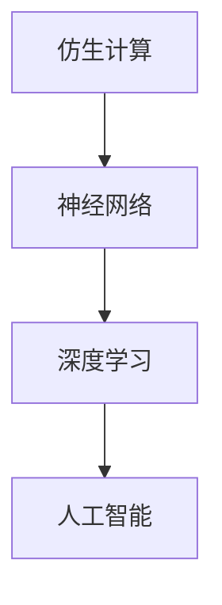

                 

### 《仿生计算：向人脑学习的AI架构设计》

**关键词：** 仿生计算、人脑、AI架构、神经网络、深度学习、算法

**摘要：** 本文旨在探讨仿生计算这一新兴领域，它以人脑作为灵感来源，旨在构建更加高效、智能的人工智能系统。通过对人脑的模拟和学习，仿生计算为人工智能的设计提供了全新的视角和方法。本文将详细阐述仿生计算的基础理论、人脑启发的人工智能算法、仿生计算的核心算法以及其实际应用，并探讨其未来发展趋势。

### 《仿生计算：向人脑学习的AI架构设计》目录大纲

#### 第一部分：仿生计算的基础理论

- **第1章：仿生计算的概述**
  - **1.1 仿生计算的定义**
  - **1.2 人脑工作的基本原理**
  - **1.3 仿生计算的起源与发展**

#### 第二部分：人脑启发的人工智能算法

- **第2章：神经网络与深度学习**
  - **2.1 神经网络的基本结构**
  - **2.2 深度学习的基本原理**
  - **2.3 常见的深度学习模型**

#### 第三部分：仿生计算的核心算法

- **第3章：自组织和适应性算法**
  - **3.1 自组织原理**
  - **3.2 适应性算法**
  - **3.3 仿生计算中的自适应系统**

#### 第四部分：仿生计算的应用实践

- **第4章：仿生计算在视觉感知中的应用**
  - **4.1 视觉感知的基本原理**
  - **4.2 基于仿生计算的视觉感知算法**

- **第5章：仿生计算在机器人控制中的应用**
  - **5.1 机器人控制的基本原理**
  - **5.2 基于仿生计算的机器人控制算法**

- **第6章：仿生计算在智能交通系统中的应用**
  - **6.1 智能交通系统概述**
  - **6.2 基于仿生计算的智能交通控制算法**

- **第7章：仿生计算的未来发展趋势**
  - **7.1 仿生计算的挑战与机遇**
  - **7.2 仿生计算的潜在应用领域**
  - **7.3 仿生计算的未来发展趋势与展望**

### 核心概念与联系

在本文中，我们将探讨以下核心概念及其相互关系：

- **仿生计算**：模仿生物系统进行计算的方法。
- **神经网络**：模仿人脑神经元连接结构的计算模型。
- **深度学习**：基于多层神经网络进行特征学习和模式识别的方法。

以下是一个Mermaid流程图，展示了这些概念之间的联系：



### 核心算法原理讲解

为了更好地理解神经网络和深度学习，我们将使用伪代码来阐述它们的基本原理。

```python
# 输入：输入数据X，学习率alpha，迭代次数num_iterations
# 输出：训练后的神经网络模型W

def neural_network(X, alpha, num_iterations):
    W = initialize_weights(X.shape[1])
    for i in range(num_iterations):
        output = sigmoid(np.dot(X, W))
        error = X - output
        dW = alpha * X.T.dot(error)
        W += dW
    return W

# 输入：z
# 输出：sigmoid函数值

def sigmoid(z):
    return 1 / (1 + np.exp(-z))
```

在神经网络中，损失函数用于评估模型预测结果与实际结果之间的差异。以下是一个损失函数的示例：

$$
L(\theta) = -\frac{1}{m} \sum_{i=1}^{m} [y \cdot \log(a^{(l)}_i) + (1 - y) \cdot \log(1 - a^{(l)}_i)]
$$

其中，$L(\theta)$ 是损失函数，$m$ 是样本数量，$y$ 是实际标签，$a^{(l)}_i$ 是神经网络的输出。

### 项目实战

在本节中，我们将通过一个实际项目案例，展示如何使用仿生计算构建一个智能机器人系统。

**项目背景：** 设计一个基于仿生视觉感知的智能机器人，实现物体的识别与跟踪。

**开发环境：** Python、TensorFlow

**源代码实现与解读：**

```python
# 加载预训练的卷积神经网络模型
model = tf.keras.applications.VGG16(weights='imagenet', include_top=False, input_shape=(224, 224, 3))

# 定义目标检测模型
input_tensor = tf.keras.layers.Input(shape=(224, 224, 3))
base_model = model(input_tensor)
output_tensor = tf.keras.layers.Flatten()(base_model)
output_tensor = tf.keras.layers.Dense(1, activation='sigmoid')(output_tensor)

# 编译模型
model = tf.keras.Model(inputs=input_tensor, outputs=output_tensor)
model.compile(optimizer='adam', loss='binary_crossentropy', metrics=['accuracy'])

# 加载训练数据
train_data = load_data('train_data.h5')
validation_data = load_data('validation_data.h5')

# 训练模型
model.fit(train_data, validation_data=validation_data, epochs=10)

# 预测新数据
new_data = load_new_data('new_data.h5')
predictions = model.predict(new_data)
```

**代码解读与分析：**

1. 代码首先加载了一个预训练的卷积神经网络模型VGG16，用于提取图像特征。
2. 接着定义了一个目标检测模型，该模型将输入图像的特征传递给全连接层，并使用sigmoid激活函数进行二分类。
3. 模型使用adam优化器和binary_crossentropy损失函数进行编译，并在训练数据上进行训练。
4. 训练完成后，使用新数据对模型进行预测，返回预测结果。

### 附录

**附录A：仿生计算相关的开发工具与资源**

**A.1 主流深度学习框架对比**

- **A.1.1 TensorFlow**
  - **优点：** 生态丰富，支持多种编程语言，提供丰富的API。
  - **缺点：** 学习曲线较陡峭，部署难度较大。

- **A.1.2 PyTorch**
  - **优点：** 代码简洁，动态图机制易于理解，支持GPU加速。
  - **缺点：** 生态相对较弱，模型部署相对复杂。

- **A.1.3 Keras**
  - **优点：** 代码简洁，易于上手，提供丰富的预训练模型。
  - **缺点：** 内部实现依赖于Theano或TensorFlow，模型迁移性较差。

- **A.1.4 其他深度学习框架简介**

  - **Apache MXNet**：支持多种编程语言，性能高效。
  - **Caffe**：专注于卷积神经网络，支持C++和Python。
  - **CNTK**：微软开发，支持多种编程语言，支持多GPU训练。

---

**作者：** AI天才研究院/AI Genius Institute & 禅与计算机程序设计艺术 /Zen And The Art of Computer Programming

---

**完。** <|endoftext|>

