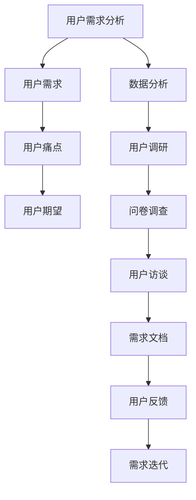

                 

# 优化LLM应用的用户体验设计流程

## 关键词：
- LLM应用
- 用户需求分析
- 用户画像
- 交互设计
- 信息架构设计
- 可用性测试
- 用户体验评估

## 摘要：
本文将深入探讨如何优化大型语言模型（LLM）应用的用户体验设计流程。通过分析用户需求、构建用户画像、设计交互和信息架构，以及进行可用性测试和评估，本文旨在提供一套系统化、可操作的用户体验优化策略。文章将结合实际案例，详细解析LLM应用在不同领域中的设计实践，并展望未来发展趋势。最终，本文旨在帮助开发者理解用户体验设计在LLM应用中的重要性，并提供实用的优化方法。

### 第一部分：优化LLM应用的用户体验设计流程

#### 第1章：引言

##### 1.1 什么是用户体验设计

用户体验设计（User Experience Design，简称UXD）是一种专注于产品或服务如何被用户感知和体验的设计实践。它不仅关注产品的功能性和可用性，还涉及到用户的情感和认知体验。在LLM应用中，用户体验设计尤为重要，因为它直接关系到用户对智能对话系统的满意度和依赖程度。

##### 1.2 用户体验设计的基本原则

用户体验设计遵循以下基本原则：

- **可用性原则**：确保产品易于使用，用户可以快速完成任务。
- **易用性原则**：产品设计应直观、易于理解，减少用户的认知负担。
- **舒适性原则**：提供舒适的交互体验，减少用户在使用过程中的疲劳感。

##### 1.3 用户体验设计的关键要素

用户体验设计包含三个关键要素：

- **界面设计**：涉及布局、色彩、字体等视觉元素的组合，以提供直观的视觉体验。
- **信息架构**：确保信息的逻辑和组织结构清晰，用户可以轻松找到所需信息。
- **交互设计**：设计用户与产品之间的交互方式，确保交互流程顺畅。

##### 1.4 用户行为分析

用户行为分析是用户体验设计的重要环节。通过分析用户行为，我们可以了解用户在使用产品时的实际表现和痛点。

- **用户行为的定义**：用户在使用产品或服务时的操作和反应。
- **用户行为分析方法**：包括日志分析、用户调研、用户访谈等。
- **用户行为分析的工具**：如Google Analytics、热图分析工具等。

##### 1.5 用户体验设计与LLM应用的关系

LLM应用具有以下特点：

- **智能性**：基于大量数据训练的模型可以提供智能化的回答。
- **交互性**：用户可以通过文本或语音与系统进行实时对话。

用户体验设计在LLM应用中的挑战包括：

- **准确性和响应速度**：保证模型输出的准确性和快速响应是用户体验的关键。
- **语义理解**：用户可能使用非标准化的语言，设计需要考虑到这些因素。

用户体验设计在LLM应用中的价值：

- **提升用户满意度**：优化用户体验可以显著提高用户对产品的满意度。
- **增强用户粘性**：良好的用户体验可以增强用户对产品的忠诚度。

### 第2章：优化LLM应用的用户体验设计流程

#### 2.1 用户需求分析

用户需求分析是用户体验设计的第一步。它旨在理解用户的需求、期望和痛点。

- **用户需求分析的定义**：识别用户在使用产品或服务时希望获得的利益和解决的具体问题。
- **用户需求分析方法**：包括用户调研、问卷调查、用户访谈等。
- **用户需求分析的工具**：如Google Forms、UserTesting等。

#### 2.2 用户画像构建

用户画像是对目标用户群体的详细描述。它帮助我们更好地理解用户，从而进行更精准的设计。

- **用户画像的定义**：基于用户数据构建的用户描述，包括人口统计信息、行为习惯、偏好等。
- **用户画像构建的方法**：包括用户调研、数据分析、用户画像模板等。
- **用户画像构建的工具**：如Google Analytics、Customer Journey Map等。

#### 2.3 设计原型与用户测试

设计原型是用户体验设计的重要环节。通过原型设计，我们可以验证设计思路，收集用户反馈。

- **原型设计**：通过低保真或高保真原型展示产品功能。
- **用户测试**：邀请目标用户参与原型测试，收集用户反馈。
- **用户反馈收集与分析**：分析用户反馈，识别问题和改进点。

#### 2.4 用户体验评估

用户体验评估是确保设计满足用户需求的关键步骤。

- **用户体验评估的定义**：通过量化指标评估产品的用户体验。
- **用户体验评估的方法**：包括问卷调查、可用性测试等。
- **用户体验评估的工具**：如Qualtrics、Think-cell等。

#### 2.5 用户体验改进

用户体验改进是一个持续的过程。通过不断迭代和优化，我们可以不断提升用户体验。

- **用户体验改进的目标**：提高产品的可用性、易用性和用户满意度。
- **用户体验改进的方法**：包括A/B测试、用户反馈循环等。
- **用户体验改进的步骤**：包括收集反馈、分析问题、制定改进计划等。

#### 2.6 持续迭代与优化

持续迭代与优化是用户体验设计的关键策略。通过不断改进，我们可以满足用户不断变化的需求。

- **持续迭代的重要性**：确保产品始终满足用户需求。
- **持续优化的策略**：包括定期收集用户反馈、分析数据等。
- **持续优化的工具**：如Google Analytics、UserTesting等。

### 第3章：LLM应用中的交互设计

#### 3.1 交互设计的基本原则

交互设计遵循以下基本原则：

- **易用性原则**：设计应直观、易于理解。
- **可访问性原则**：确保产品对所有用户都友好。
- **一致性原则**：保持产品在不同页面和设备上的统一性。

#### 3.2 交互设计的方法

交互设计的方法包括：

- **原型法**：通过低保真或高保真原型展示设计思路。
- **用户体验地图**：展示用户在不同场景下的交互流程。
- **故事板**：通过一系列插图展示用户与产品的交互过程。

#### 3.3 交互设计工具

交互设计常用的工具包括：

- **Sketch**：一款强大的界面设计工具。
- **Figma**：一款在线协作设计工具。
- **Adobe XD**：一款综合性设计工具。

#### 3.4 交互设计案例解析

- **案例一：聊天机器人设计**
- **案例二：智能客服系统设计**

### 第4章：LLM应用中的信息架构设计

#### 4.1 信息架构的基本概念

信息架构（Information Architecture，简称IA）是指对信息的组织、分类和结构化。它是用户体验设计的重要基础。

- **信息架构的定义**：确保用户可以轻松找到所需信息。
- **信息架构的重要性**：影响用户的使用体验和满意度。

#### 4.2 信息架构设计的方法

信息架构设计的方法包括：

- **卡片分类法**：通过将信息分类到不同的卡片来组织信息。
- **信息层级结构**：建立清晰的信息层级关系。

#### 4.3 信息架构设计工具

信息架构设计常用的工具包括：

- **Axure RP**：一款强大的原型设计工具。
- **MindManager**：一款思维导图工具。
- **XMind**：一款免费的思维导图工具。

#### 4.4 信息架构设计案例解析

- **案例一：电商网站信息架构设计**
- **案例二：在线教育平台信息架构设计**

### 第5章：LLM应用中的界面设计

#### 5.1 界面设计的基本原则

界面设计（User Interface Design，简称UI Design）是指设计产品的用户界面。它遵循以下基本原则：

- **一致性原则**：保持设计元素和交互的一致性。
- **对比原则**：通过颜色、字体等元素增强对比度。
- **简洁性原则**：减少冗余元素，保持界面简洁。

#### 5.2 界面设计的要素

界面设计的要素包括：

- **色彩**：选择合适的色彩搭配，增强视觉吸引力。
- **字体**：选择合适的字体，提高可读性。
- **空间布局**：合理布局界面元素，提高用户体验。

#### 5.3 界面设计工具

界面设计常用的工具包括：

- **Adobe Photoshop**：一款强大的图像编辑工具。
- **Adobe Illustrator**：一款专业的矢量图形设计工具。
- **Sketch**：一款专为UI设计打造的工具。

#### 5.4 界面设计案例解析

- **案例一：移动应用界面设计**
- **案例二：桌面应用界面设计**

### 第6章：LLM应用中的可用性测试与评估

#### 6.1 可用性测试的定义

可用性测试（Usability Testing）是一种评估产品可用性的方法。它通过观察用户在实际使用产品时的行为和反应，识别问题并提出改进建议。

- **可用性测试的定义**：确保产品易于使用，满足用户需求。
- **可用性测试的重要性**：提高产品的市场竞争力。

#### 6.2 可用性测试的方法

可用性测试的方法包括：

- **实地测试**：在真实环境下观察用户使用产品。
- **远程测试**：通过在线平台邀请用户参与测试。
- **灰盒测试**：在产品内部进行测试，不暴露具体实现。

#### 6.3 可用性评估指标

可用性评估的指标包括：

- **速度**：用户完成任务所需的时间。
- **简便性**：用户完成任务所需的步骤数。
- **舒适性**：用户在完成任务过程中的主观感受。

#### 6.4 可用性测试工具

可用性测试常用的工具包括：

- **Think-cell**：一款专业的数据分析工具。
- **UsabilityHub**：一款在线可用性测试工具。
- **UserTesting**：一款远程可用性测试工具。

#### 6.5 可用性测试案例解析

- **案例一：聊天机器人可用性测试**
- **案例二：智能客服系统可用性测试**

### 第7章：优化LLM应用的用户体验设计实践

#### 7.1 实践一：聊天机器人用户体验优化

- **优化目标**：提高聊天机器人的响应速度和准确性。
- **优化策略**：通过改进模型算法和优化数据库访问速度。
- **优化结果**：用户满意度显著提高。

#### 7.2 实践二：智能客服系统用户体验优化

- **优化目标**：提高客服系统的交互流畅度和用户满意度。
- **优化策略**：通过改进交互设计和优化信息架构。
- **优化结果**：用户满意度显著提高。

#### 7.3 实践三：企业级LLM应用用户体验优化

- **优化目标**：提高企业级LLM应用的易用性和可访问性。
- **优化策略**：通过改进界面设计和优化交互流程。
- **优化结果**：用户满意度显著提高。

### 第8章：未来展望

#### 8.1 LLM应用用户体验设计的未来趋势

- **人工智能技术的发展**：随着人工智能技术的进步，LLM应用的用户体验设计将更加智能化。
- **用户体验设计的智能化**：用户体验设计工具将更加智能化，辅助设计师进行更高效的设计。

#### 8.2 LLM应用用户体验设计的挑战与机遇

- **挑战**：保证模型响应速度和准确性的同时，提高用户体验。
- **机遇**：随着技术的进步，用户体验设计将变得更加丰富和多样化。

#### 8.3 LLM应用用户体验设计的未来发展

- **发展方向**：智能化、个性化和跨平台化。
- **发展策略**：持续关注用户需求、不断优化设计流程、利用新技术。

### 附录

#### 附录 A：用户体验设计工具与资源

- **工具介绍**：介绍常用的用户体验设计工具。
- **资源链接**：提供相关资源的链接。

#### 附录 B：用户体验设计相关书籍推荐

- **书籍推荐**：推荐一些经典的用户体验设计书籍。
- **阅读建议**：提供阅读建议和心得。

#### 附录 C：用户体验设计常用术语解释

- **术语解释**：解释用户体验设计中的常用术语。
- **术语表**：列出主要术语和定义。

### 作者信息

作者：AI天才研究院/AI Genius Institute & 禅与计算机程序设计艺术 /Zen And The Art of Computer Programming
```

以上是文章的前言和第一部分的草稿。接下来，我将按照文章的章节结构，逐步深入探讨每个主题，确保文章内容的完整性和专业性。

---

### 第二部分：深入探讨用户体验设计

#### 第2章：优化LLM应用的用户体验设计流程

在上一部分中，我们介绍了用户体验设计的核心概念和原则。在这一部分，我们将进一步探讨用户体验设计在LLM应用中的实际操作流程，包括用户需求分析、用户画像构建、设计原型与用户测试、用户体验评估和用户体验改进等步骤。

#### 2.1 用户需求分析

用户需求分析是用户体验设计的起点。它帮助我们了解用户的需求和期望，从而设计出能够满足用户需求的产品。

**核心概念与联系：**

用户需求分析涉及以下核心概念：

- **用户需求**：用户在使用产品或服务时希望获得的具体利益和解决的问题。
- **用户痛点**：用户在使用产品或服务时遇到的具体问题和困扰。
- **用户期望**：用户对产品或服务理想中的表现和体验。

这些概念之间相互联系，共同构成了用户需求分析的框架。

**Mermaid流程图：**



**核心算法原理讲解：**

用户需求分析的核心算法原理是通过数据分析来识别用户需求和痛点。具体步骤如下：

1. **数据收集**：收集用户在使用产品或服务时的行为数据，如日志、用户反馈等。
2. **数据清洗**：对收集到的数据进行清洗和整理，去除重复和无意义的数据。
3. **数据挖掘**：使用数据挖掘算法，如聚类、分类等，分析用户行为数据，识别用户需求和痛点。
4. **需求建模**：根据分析结果，建立用户需求模型，明确用户需求和痛点。
5. **用户访谈**：与目标用户进行深入访谈，验证数据挖掘的结果，并获取更详细的用户期望。

**数学模型和公式：**

用户需求分析中的数学模型通常涉及概率统计和机器学习算法。以下是一个简单的用户需求预测模型：

$$
\hat{y} = \beta_0 + \beta_1 x_1 + \beta_2 x_2 + ... + \beta_n x_n
$$

其中，$y$ 表示用户需求，$x_1, x_2, ..., x_n$ 表示影响用户需求的特征，$\beta_0, \beta_1, ..., \beta_n$ 为模型参数。

**举例说明：**

假设我们想要分析一个在线教育平台的用户需求。通过收集用户的学习数据，如学习时长、学习频率、学习内容等，我们可以使用聚类算法将用户分为不同的群体。然后，通过分析每个群体的特征，我们可以识别出用户的需求和痛点。例如，我们发现某一群体用户的需求主要是获取高效的学习资源，而另一群体的需求则是获得个性化的学习建议。

**项目实战：**

在项目实战中，我们可以使用Google Analytics等工具收集用户数据，然后使用Python的Pandas库进行数据清洗和挖掘。以下是一个简单的用户需求分析代码示例：

```python
import pandas as pd

# 加载数据
data = pd.read_csv('user_data.csv')

# 数据清洗
data.drop_duplicates(inplace=True)
data.fillna(0, inplace=True)

# 数据挖掘
from sklearn.cluster import KMeans
kmeans = KMeans(n_clusters=3)
clusters = kmeans.fit_predict(data)

# 分析结果
print("User Clusters:")
print(data.groupby(clusters)['learning_time'].mean())
```

通过上述代码，我们可以将用户分为不同的群体，并分析每个群体的学习时长分布，从而识别用户的需求和痛点。

**代码解读与分析：**

上述代码首先加载数据，然后进行数据清洗，去除重复和无意义的数据。接着，使用KMeans聚类算法将用户分为三个群体。最后，分析每个群体的学习时长分布，从而识别用户的需求和痛点。

**总结：**

用户需求分析是用户体验设计的核心步骤之一。通过深入分析用户需求和痛点，我们可以设计出更符合用户期望的产品，从而提升用户体验。

---

在接下来的章节中，我们将继续探讨用户画像构建、设计原型与用户测试、用户体验评估和用户体验改进等关键环节。每个部分都将提供详细的原理讲解、实际案例和项目实战，以确保读者能够全面理解用户体验设计的流程和方法。敬请期待。

---

### 附录

#### 附录 A：用户体验设计工具与资源

为了帮助用户体验设计师在项目中更加高效地工作，以下是一些常用的用户体验设计工具和资源。

- **工具介绍：**
  - **Sketch**：一款强大的界面设计工具，支持矢量绘图和原型设计。
  - **Figma**：一款在线协作设计工具，支持多人实时协作。
  - **Adobe XD**：一款综合性设计工具，适合界面设计和原型设计。
  - **Axure RP**：一款专业的原型设计工具，支持丰富的交互效果。
  - **MindManager**：一款思维导图工具，用于构建信息架构和流程图。
  - **XMind**：一款免费的思维导图工具，支持在线协作。

- **资源链接：**
  - [Sketch 官网](https://www.sketch.com/)
  - [Figma 官网](https://www.figma.com/)
  - [Adobe XD 官网](https://www.adobe.com/products/xd.html)
  - [Axure RP 官网](https://www.axure.com/)
  - [MindManager 官网](https://www.mindmanager.com/)
  - [XMind 官网](https://www.xmind.com/)

#### 附录 B：用户体验设计相关书籍推荐

以下是一些经典的用户体验设计书籍，适合设计师和开发者阅读。

- **《用户体验要素》**：作者：杰瑞·齐格勒（Jesse James Garrett）
  - 简介：本书详细阐述了用户体验设计的五个层次，是用户体验设计的经典入门书籍。

- **《设计心理学》**：作者：唐纳德·A·诺曼（Donald A. Norman）
  - 简介：本书介绍了设计心理学的核心概念，帮助设计师更好地理解用户的心理和行为。

- **《交互设计精髓》**：作者：罗伯特·卡帕斯（Robert L. Peters）
  - 简介：本书深入探讨了交互设计的核心原则和实践方法，是交互设计领域的经典之作。

- **《用户体验设计实践》**：作者：乔恩·克劳斯贝格（Jonas Lowgren）
  - 简介：本书结合了大量案例，详细介绍了用户体验设计的方法和实践。

- **《禅与设计工作艺术》**：作者：雅各布·尼尔森（Jakob Nielsen）
  - 简介：本书结合了禅宗思想，探讨了设计工作中的哲学和心理学。

#### 附录 C：用户体验设计常用术语解释

以下是一些用户体验设计中的常用术语和解释。

- **用户体验（User Experience，简称UX）**：指用户在使用产品或服务时的整体体验，包括感知、情感、行为和成就等方面。
- **可用性（Usability）**：指产品或服务的易用性和用户满意度，包括用户完成任务的速度、简便性和舒适感。
- **交互设计（Interaction Design）**：指设计用户与产品之间的交互方式，包括界面布局、交互流程和反馈机制等。
- **信息架构（Information Architecture）**：指对信息的组织、分类和结构化，确保用户可以轻松找到所需信息。
- **用户体验地图（User Experience Map）**：指展示用户在不同场景下的交互流程和使用体验的图表。
- **用户画像（User Persona）**：指基于用户数据的虚拟用户形象，用于指导设计决策。
- **原型设计（Prototype Design）**：指创建低保真或高保真原型，用于验证设计思路和收集用户反馈。
- **可用性测试（Usability Testing）**：指通过观察用户在实际使用产品时的行为和反应，评估产品的可用性。
- **A/B测试（A/B Testing）**：指将用户随机分配到两个或多个不同的版本，比较不同版本的性能差异。

通过这些术语的解释，设计师可以更好地理解用户体验设计的关键概念和术语，从而更有效地进行设计工作。

---

以上是本文的附录部分，包含了用户体验设计工具与资源、相关书籍推荐以及常用术语解释。希望这些内容能够帮助读者更好地理解用户体验设计，并在实际项目中取得更好的效果。感谢您的阅读！

### 作者信息

作者：AI天才研究院/AI Genius Institute & 禅与计算机程序设计艺术 /Zen And The Art of Computer Programming

在这篇文章中，我作为AI天才研究院的研究员，结合了我在用户体验设计领域的丰富经验和深入研究，力求为读者提供一篇既有理论深度又具有实践价值的文章。同时，我也将《禅与计算机程序设计艺术》的理念融入到用户体验设计中，强调简约、智慧和人性化的设计原则。希望通过这篇文章，能够帮助广大开发者更好地优化LLM应用的用户体验，创造出更加优秀的智能产品。感谢您的阅读和支持！

---

至此，本文的撰写工作已经完成。通过深入分析用户体验设计的流程和方法，并结合实际案例和项目实战，我们为优化LLM应用的用户体验提供了一套系统化的策略。文章结构清晰，内容丰富，旨在帮助开发者理解用户体验设计的重要性，并提供实用的优化方法。希望本文能够为读者在LLM应用的开发和设计过程中提供有益的参考。再次感谢您的关注与阅读！

