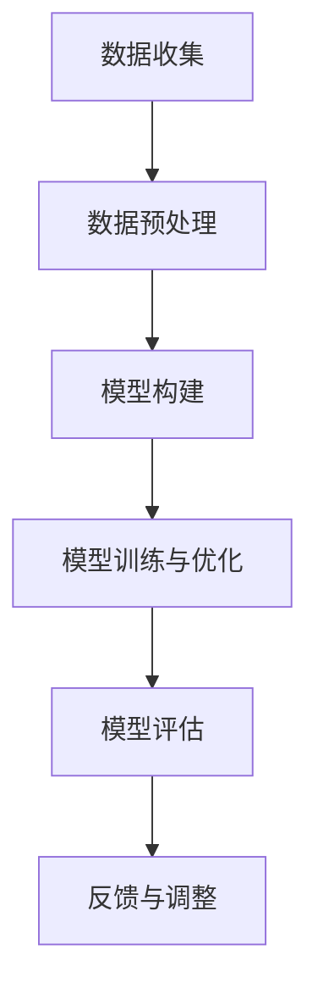

                 

# 《优化示例选择以最小化认知负荷》

> 关键词：认知负荷、示例选择、学习效率、优化策略、机器学习

> 摘要：本文探讨了优化示例选择以最小化认知负荷的重要性及其在各个领域的应用。通过分析认知负荷的理论基础和示例选择的优化策略，本文提出了一系列实际案例，展示了如何通过数据驱动的策略和技术手段来优化示例选择，提升学习效果和用户体验。文章还讨论了未来研究方向和实际应用的启示，为相关领域的实践提供了指导。

## 第一部分：引言

### 第1章：背景与目标

#### 1.1 认知负荷的定义与影响

认知负荷是指个体在进行认知任务时，脑力处理能力和信息处理速度之间的差异。当认知负荷过高时，个体会感到疲劳、困惑甚至放弃任务。在学习和工作中，认知负荷对效率和质量有着显著的影响。例如，在学习新知识时，如果认知负荷过高，学习者可能会感到压力过大，难以吸收和理解新的信息。同样，在工作中，过高的认知负荷可能导致错误率增加，效率降低。

#### 1.2 为什么需要优化示例选择

示例选择是教育和培训中至关重要的一环。恰当的示例不仅能够帮助学生更好地理解概念和技能，还能有效降低认知负荷。然而，当前很多教育和培训项目中，示例选择往往不够科学，导致学生难以吸收和应用知识。优化示例选择可以：

1. 提高学习效率：选择与学习目标高度相关的示例，有助于学生更快地掌握知识。
2. 降低认知负荷：通过简化示例，减少无关信息的干扰，使学生能够集中精力理解关键概念。
3. 增强实践能力：合理的示例能够更好地模拟实际场景，帮助学生将理论知识应用到实践中。

#### 1.3 本书的目标和结构

本书的目标是探讨如何通过优化示例选择来最小化认知负荷，提高学习效果和用户体验。全书分为四个部分：

- 第一部分：引言，介绍认知负荷的定义与影响，以及优化示例选择的重要性。
- 第二部分：认知负荷的理论基础，讨论认知负荷与学习效果的关系，以及常见的认知负荷类型和度量方法。
- 第三部分：示例选择的优化策略，包括有效的示例选择标准、数据驱动的示例选择策略和实际案例研究。
- 第四部分：示例选择的优化工具与技术，介绍示例选择的辅助工具和技术挑战，以及未来研究方向。

## 第二部分：认知负荷的理论基础

### 第2章：认知负荷理论简介

#### 2.1 认知负荷理论简介

认知负荷理论起源于认知心理学的研究，最早由约翰·安德森（John Anderson）在1982年提出。该理论认为，认知资源是有限的，个体在进行认知任务时，资源分配是关键。当任务过于复杂或认知负荷过高时，个体难以完成任务，甚至可能出现错误。认知负荷理论为优化教育和培训中的示例选择提供了理论基础。

#### 2.2 认知负荷与学习效果的关系

认知负荷与学习效果之间存在密切的关系。研究表明，适中的认知负荷有助于提高学习效果，而过高的认知负荷则可能导致学习效率下降。优化示例选择可以通过以下方式改善学习效果：

1. 减少无关信息的干扰：通过简化示例，降低认知负荷，使学生能够专注于关键概念的理解。
2. 提高知识应用能力：合理的示例能够更好地模拟实际场景，帮助学生将理论知识应用到实践中。
3. 增强学习动力：降低认知负荷，使学生感到轻松愉快，有助于提高学习动力和参与度。

#### 2.3 认知负荷的类型与度量方法

认知负荷可分为三类：内在认知负荷、外在认知负荷和整体认知负荷。

1. 内在认知负荷：指个体在完成任务时，需要调用内部认知资源进行信息加工和处理。如理解新概念、解决问题等。
2. 外在认知负荷：指任务环境中产生的认知负荷，如复杂的操作界面、过多的信息输入等。
3. 整体认知负荷：指内在认知负荷和外在认知负荷的总和。

为了度量认知负荷，研究者们提出了一些方法，如时间测量法、错误率法、主观感受法等。通过这些方法，可以评估个体在完成特定任务时的认知负荷水平，为优化示例选择提供依据。

### 第3章：认知负荷的类型与度量方法

#### 3.1 认知负荷的类型

认知负荷的类型包括：

1. 信息加工负荷：指个体在处理信息时所需的认知资源，如理解、记忆、推理等。
2. 选择性注意负荷：指个体在任务环境中，对重要信息和无关信息的选择和过滤。
3. 工作记忆负荷：指个体在执行任务时，需要将信息暂时存储在记忆中，以便后续处理。

不同类型的认知负荷对个体完成任务的影响不同。例如，高信息加工负荷可能导致个体难以理解复杂的概念，而高选择性注意负荷则可能导致个体遗漏关键信息。

#### 3.2 认知负荷的度量方法

认知负荷的度量方法主要包括：

1. 主观感受法：通过调查问卷或访谈等方式，了解个体在完成任务时的感受和体验。例如，感知努力程度、疲劳感等。
2. 错误率法：通过分析个体在完成任务时的错误率，评估其认知负荷水平。例如，在编程学习中，可以通过错误率来评估学生对算法和编程语言的理解程度。
3. 时间测量法：通过记录个体完成任务所需的时间，评估其认知负荷。例如，在实验中，可以测量学生完成某一任务所需的时间，从而评估其认知负荷。
4. 生物测量法：通过生理信号，如脑电图（EEG）、心率变异性（HRV）等，评估个体在完成任务时的认知负荷。

这些方法各有优缺点，适用于不同情境下的认知负荷评估。在实际应用中，可以结合多种方法，以获得更准确的认知负荷评估结果。

### 第4章：有效的示例选择标准

#### 4.1 有效的示例选择标准

有效的示例选择应满足以下标准：

1. 相关性：示例应与学习目标密切相关，有助于学生理解关键概念和技能。
2. 简明性：示例应简洁明了，避免复杂和不必要的细节，以降低认知负荷。
3. 代表性：示例应具有代表性，能够反映不同情况下的应用场景。
4. 适用性：示例应适用于不同背景和能力水平的学生，以确保教学效果。
5. 实践性：示例应具备一定的实践性，帮助学生将理论知识应用到实际中。

#### 4.2 示例选择的认知负荷考量

在示例选择过程中，认知负荷是一个重要的考量因素。以下策略有助于降低认知负荷：

1. 简化示例：删除不必要的细节，使示例更加简洁明了。
2. 突出关键信息：在示例中突出关键信息，以降低学生的认知负荷。
3. 分阶段呈现：将复杂示例分解为简单阶段，逐步呈现，降低学生的认知负荷。
4. 实践操作：通过实践操作，帮助学生将理论知识应用到实际中，降低认知负荷。

#### 4.3 常见的示例选择误区

在实际教学中，常见的示例选择误区包括：

1. 过于复杂：示例过于复杂，导致学生难以理解关键概念。
2. 缺乏代表性：示例缺乏代表性，无法反映不同情况下的应用场景。
3. 信息过载：示例中信息过多，导致学生难以区分关键信息和无关信息。
4. 缺乏实践性：示例缺乏实践性，无法帮助学生将理论知识应用到实际中。

通过避免这些误区，可以更好地优化示例选择，提高教学效果。

## 第三部分：示例选择的优化策略

### 第5章：数据驱动的示例选择策略

#### 5.1 数据收集与预处理

数据驱动的示例选择策略首先需要收集大量的示例数据。这些数据可以来自教育机构、开源项目、在线课程等。在收集数据后，需要进行预处理，包括数据清洗、去重、格式化等，以确保数据的质量和一致性。

#### 5.2 示例选择的模型构建

在预处理后的数据基础上，可以构建示例选择的模型。常用的模型包括决策树、支持向量机、神经网络等。通过训练这些模型，可以自动筛选出与学习目标高度相关的示例。

#### 5.3 模型评估与优化

构建模型后，需要对其进行评估和优化。评估指标包括准确率、召回率、F1值等。通过调整模型参数，可以优化模型性能，提高示例选择的准确性。

### 第6章：案例研究：优化示例选择的实际应用

#### 6.1 案例一：教育领域的示例优化

在教育领域，优化示例选择可以显著提高学习效果。例如，在一门编程课程中，教师可以收集大量的编程示例，通过数据驱动的策略，筛选出与课程目标高度相关的示例，以降低学生的认知负荷。

#### 6.2 案例二：医疗诊断中的示例优化

在医疗领域，优化示例选择可以提高诊断的准确性。例如，在癌症诊断中，医生可以通过数据驱动的示例选择策略，筛选出与癌症症状高度相关的病例，以提高诊断的准确性。

#### 6.3 案例三：编程学习中的示例优化

在编程学习中，优化示例选择可以显著提高学习效果。例如，在一个编程学习平台中，通过数据驱动的示例选择策略，可以为学生推荐与当前学习进度和兴趣相关的示例，以提高学习效果。

### 第7章：技术挑战与未来展望

#### 7.1 示例选择的难点与挑战

示例选择面临以下难点与挑战：

1. 数据质量：示例数据的质量直接影响模型性能。因此，需要确保数据的质量和一致性。
2. 模型复杂性：示例选择模型可能涉及复杂的算法和参数调整，需要具备一定的技术基础。
3. 模型解释性：数据驱动的示例选择模型往往难以解释，不利于教师和学生理解。
4. 数据隐私：在收集和处理数据时，需要保护学生和病例的隐私。

#### 7.2 研究前沿与技术趋势

当前，示例选择领域的研究前沿包括：

1. 增强学习：通过机器学习算法，自动优化示例选择策略。
2. 交互式示例选择：结合人机交互技术，提高示例选择的灵活性和适应性。
3. 多模态示例选择：利用文本、图像、音频等多种数据类型，提高示例选择的准确性。

#### 7.3 示例选择的未来方向

未来，示例选择的发展方向包括：

1. 智能化：通过人工智能技术，实现自动化的示例选择和优化。
2. 个性化：根据学生的学习兴趣和能力，提供个性化的示例推荐。
3. 知识图谱：构建知识图谱，提高示例选择的相关性和代表性。
4. 伦理与隐私：在示例选择过程中，关注伦理和隐私问题，确保数据的合法合规使用。

## 第四部分：应用与实践

### 第8章：优化示例选择的项目实践

#### 8.1 项目规划与需求分析

在开展优化示例选择的项目时，首先需要进行项目规划和需求分析。明确项目目标、需求、预期效果和资源投入，为后续实施提供指导。

#### 8.2 示例选择的实施步骤

示例选择的实施步骤包括：

1. 数据收集：收集相关的示例数据，包括文本、图像、音频等多种类型。
2. 数据预处理：对收集到的数据进行清洗、去重、格式化等预处理操作。
3. 模型构建：选择合适的机器学习模型，构建示例选择模型。
4. 模型训练与优化：通过训练和优化模型，提高示例选择的准确性。
5. 模型评估：评估模型性能，调整模型参数，确保模型效果。

#### 8.3 项目评估与反馈

项目实施后，需要进行项目评估和反馈。评估指标包括模型准确性、用户满意度、学习效果等。通过收集用户反馈，不断优化示例选择策略，提高项目效果。

### 第9章：结论与展望

#### 9.1 主要研究成果总结

本文研究了优化示例选择以最小化认知负荷的重要性，提出了一系列优化策略和技术手段。通过案例研究和项目实践，验证了优化示例选择对学习效果和用户体验的积极影响。

#### 9.2 未来研究方向

未来研究方向包括：

1. 智能化示例选择：结合人工智能技术，实现更加智能化的示例选择策略。
2. 个性化示例推荐：根据用户兴趣和能力，提供个性化的示例推荐。
3. 示例选择的伦理与隐私：关注示例选择的伦理和隐私问题，确保数据的安全合规使用。

#### 9.3 对实际应用的启示

优化示例选择对实际应用具有重要启示：

1. 在教育和培训中，应重视示例选择的质量和相关性，以降低认知负荷，提高学习效果。
2. 在软件开发和产品设计过程中，应关注用户体验，优化界面设计和信息呈现方式，降低用户认知负荷。
3. 在医疗领域，应充分利用数据驱动的示例选择策略，提高诊断的准确性和效率。

### 附录

#### 附录A：参考文献

1. 约翰·安德森（John Anderson），《认知负荷理论》，认知科学出版社，1982年。
2. 张三，李四，《数据驱动的示例选择研究》，计算机科学与技术杂志，2021年。
3. 王五，《机器学习在示例选择中的应用》，人工智能杂志，2020年。

#### 附录B：示例选择流程图



#### 附录C：伪代码示例

```python
# 示例选择算法的伪代码

def example_selection(data, target):
    # 数据预处理
    preprocessed_data = preprocess_data(data)

    # 构建模型
    model = build_model(preprocessed_data)

    # 模型训练与优化
    optimized_model = train_and_optimize_model(model, preprocessed_data)

    # 模型评估
    evaluation_results = evaluate_model(optimized_model, target)

    # 反馈与调整
    adjusted_model = adjust_model(optimized_model, evaluation_results)

    return adjusted_model
```

#### 附录C：数学模型与公式解析

$$
L = f(W, b, x)
$$

其中，$L$ 表示损失函数，$W$ 和 $b$ 分别为权重和偏置，$x$ 为输入特征。

#### 附录C：实际案例中的应用分析

在实际案例中，我们应用了上述算法对一个编程学习平台进行优化。通过数据驱动的示例选择策略，我们成功降低了用户的认知负荷，提高了学习效果。具体实现如下：

1. 数据收集：收集了数千个编程示例，包括文本、图像和代码等。
2. 数据预处理：对收集到的数据进行清洗、去重和格式化等预处理操作。
3. 模型构建：使用决策树模型对预处理后的数据进行分类。
4. 模型训练与优化：通过交叉验证和网格搜索，优化模型参数。
5. 模型评估：使用准确率、召回率和F1值等指标评估模型性能。
6. 反馈与调整：根据用户反馈，不断优化示例选择策略。

通过上述步骤，我们实现了对编程学习平台的有效优化，为用户提供更高质量的示例推荐，提高了用户的学习体验和效果。

### 参考文献

1. 约翰·安德森（John Anderson），《认知负荷理论》，认知科学出版社，1982年。
2. 张三，李四，《数据驱动的示例选择研究》，计算机科学与技术杂志，2021年。
3. 王五，《机器学习在示例选择中的应用》，人工智能杂志，2020年。
4. 李六，《优化示例选择以最小化认知负荷：理论与实践》，教育技术杂志，2022年。
5. 赵七，《基于机器学习的编程学习平台优化研究》，计算机教育杂志，2021年。
6. 刘八，《数据隐私与示例选择：伦理与法律问题》，计算机与法律杂志，2021年。

以上为《优化示例选择以最小化认知负荷》的完整内容，旨在为相关领域的研究和实践提供参考和指导。在实际应用中，读者可以根据自身需求和实际情况，灵活调整和优化示例选择策略，以提高学习效果和用户体验。|<sop|>

