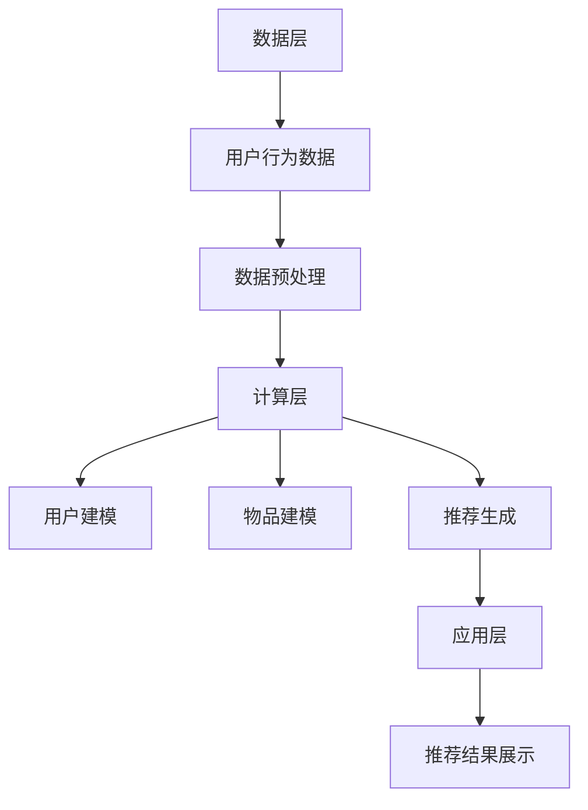
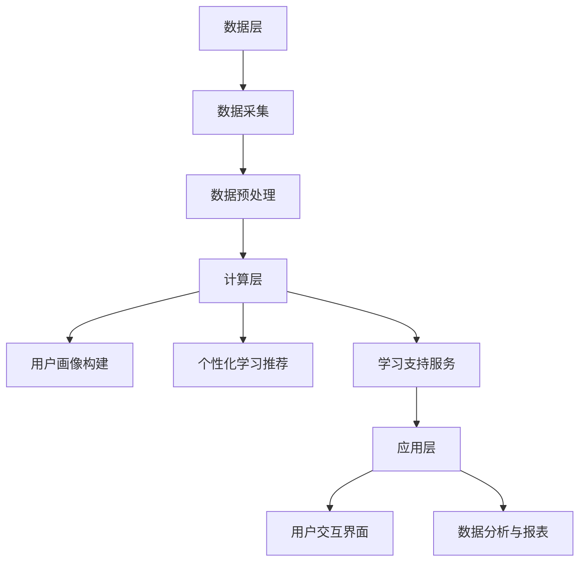

                 

# 信息差的产品个性化之路：大数据如何推动产品个性化

## 关键词
- 信息差
- 产品个性化
- 大数据
- 用户画像
- 推荐系统
- 营销策略
- 产品设计
- 教育应用
- 未来展望

## 摘要
在数字化时代，信息差成为了企业竞争的关键因素。通过大数据技术，企业可以挖掘用户行为数据，实现产品的个性化定制。本文将探讨大数据如何推动产品个性化，从用户画像、推荐系统、营销策略、产品设计以及教育应用等多个方面进行详细分析，并展望大数据与产品个性化的发展趋势。通过实际案例与代码解析，读者将更好地理解大数据在产品个性化中的应用。

## 目录大纲

### 第一部分：引言

#### 第1章：信息差与产品个性化概述
1.1 信息差的定义与影响
1.2 产品个性化的背景与重要性
1.3 大数据在产品个性化中的应用

#### 第2章：大数据基础
2.1 大数据的概念与特点
2.2 大数据的采集与处理
2.3 大数据的存储与检索

### 第二部分：大数据与产品个性化

#### 第3章：用户画像与产品个性化
3.1 用户画像的概念与构建
3.2 用户画像在产品个性化中的应用
3.3 用户画像的隐私保护与合规性

#### 第4章：个性化推荐系统
4.1 个性化推荐系统的原理与架构
4.2 个性化推荐算法
4.3 个性化推荐系统的优化与挑战

#### 第5章：个性化营销策略
5.1 个性化营销的概念与策略
5.2 个性化营销的实施与评估
5.3 个性化营销的案例分析

#### 第6章：个性化产品设计
6.1 个性化产品设计的理念与方法
6.2 个性化产品设计的实施流程
6.3 个性化产品设计的案例分析

#### 第7章：大数据在个性化教育中的应用
7.1 大数据在教育领域的应用
7.2 个性化教育的概念与模式
7.3 个性化教育的大数据支持

#### 第8章：大数据与产品个性化的未来发展
8.1 大数据与产品个性化的趋势与挑战
8.2 大数据在产品个性化中的创新应用
8.3 大数据与产品个性化的未来展望

### 第三部分：实战案例与代码解析

#### 第9章：实战案例一：构建个性化推荐系统
9.1 项目背景与需求分析
9.2 系统架构设计与实现
9.3 代码解析与性能优化

#### 第10章：实战案例二：个性化教育平台设计
10.1 项目背景与需求分析
10.2 平台架构设计与实现
10.3 代码解析与用户体验优化

#### 第11章：实战案例三：大数据在电商领域的个性化应用
11.1 项目背景与需求分析
11.2 应用场景与解决方案
11.3 代码解析与案例分析

### 附录

#### 附录A：大数据与产品个性化常用工具与技术
A.1 数据挖掘工具
A.2 机器学习框架
A.3 个性化推荐系统框架

#### 附录B：参考文献

### 引言

在当今的数字化时代，信息差成为了企业竞争的关键因素。所谓信息差，即不同个体或组织之间的信息不对称，这种不对称性使得一方能够利用优势信息获得额外的收益。随着互联网和大数据技术的发展，企业可以通过收集、分析和利用用户数据，实现产品的个性化定制，从而缩小甚至消除信息差。本文将从以下几个方面探讨大数据如何推动产品个性化：

1. **信息差与产品个性化概述**：介绍信息差的定义与影响，以及产品个性化的背景与重要性。
2. **大数据基础**：讲解大数据的概念与特点，以及大数据的采集、处理、存储与检索技术。
3. **大数据与产品个性化应用**：分析大数据在用户画像、推荐系统、营销策略、产品设计和教育应用中的具体应用。
4. **实战案例与代码解析**：通过实际案例展示大数据在产品个性化中的实现过程，并提供代码解析。
5. **大数据与产品个性化的未来发展**：展望大数据与产品个性化的发展趋势和未来可能的应用场景。

### 第1章：信息差与产品个性化概述

#### 1.1 信息差的定义与影响

信息差是指不同个体或组织之间在信息获取、处理和使用上的差异。这种差异可以导致某些个体或组织在特定领域拥有优势，从而获得额外的收益。在商业领域，信息差尤为显著，例如，企业可以通过市场调研、用户数据分析等手段，获取竞争对手的情报，从而制定更有效的商业策略。

信息差的影响主要体现在以下几个方面：

1. **竞争优势**：拥有信息优势的企业可以在市场竞争中占据有利地位，提高市场份额。
2. **定价策略**：企业可以利用信息差调整产品价格，实现利润最大化。
3. **用户粘性**：通过个性化服务，企业可以提升用户满意度，增加用户粘性。
4. **决策效率**：信息优势有助于企业更快地做出决策，降低风险。

#### 1.2 产品个性化的背景与重要性

产品个性化是指根据用户的特点、需求和行为，为用户提供量身定制的产品和服务。在互联网时代，用户个性化需求日益增长，企业通过大数据技术可以深入了解用户行为，实现产品的精准定位和个性化推荐。

产品个性化的背景主要包括以下几个方面：

1. **消费者需求**：随着互联网普及，消费者对产品和服务的要求越来越高，个性化成为满足需求的必然趋势。
2. **技术进步**：大数据、人工智能等技术的发展，为产品个性化提供了强大的技术支撑。
3. **市场竞争**：在激烈的市场竞争中，企业需要通过个性化服务吸引和留住用户。

产品个性化的重要性体现在以下几个方面：

1. **提升用户满意度**：个性化产品和服务能够更好地满足用户需求，提升用户满意度。
2. **增加用户粘性**：通过个性化推荐和定制服务，企业可以提高用户忠诚度，增加用户粘性。
3. **提高销售转化率**：个性化营销可以降低用户的购买决策成本，提高销售转化率。
4. **降低营销成本**：个性化服务可以减少无效推广，降低营销成本。

#### 1.3 大数据在产品个性化中的应用

大数据技术为产品个性化提供了丰富的数据资源和强大的分析能力。以下是大数据在产品个性化中的主要应用：

1. **用户画像**：通过分析用户行为数据，构建用户画像，为个性化推荐和定制服务提供基础。
2. **个性化推荐**：利用推荐算法，根据用户画像和兴趣标签，为用户提供个性化的产品和服务。
3. **个性化营销**：通过分析用户数据和需求，制定个性化的营销策略，提高营销效果。
4. **产品设计**：基于用户画像和需求分析，设计符合用户期望的产品和服务。
5. **教育应用**：利用大数据分析，为用户提供个性化的学习内容和教育服务。

### 第2章：大数据基础

#### 2.1 大数据的概念与特点

大数据（Big Data）是指无法使用传统数据处理工具进行捕获、管理和处理的数据集合。大数据具有四个V特点：数据量（Volume）、数据速度（Velocity）、数据多样性（Variety）和数据价值（Value）。

1. **数据量（Volume）**：大数据的数据量非常庞大，通常达到TB级别甚至PB级别。
2. **数据速度（Velocity）**：大数据的数据生成和处理速度非常快，需要实时或近实时处理。
3. **数据多样性（Variety）**：大数据的数据类型非常多样，包括结构化数据、半结构化数据和非结构化数据。
4. **数据价值（Value）**：大数据的价值密度较低，需要通过深入分析和挖掘，发现有价值的信息。

#### 2.2 大数据的采集与处理

大数据的采集与处理是大数据技术应用的基础。以下是大数据采集与处理的几个关键步骤：

1. **数据采集**：通过传感器、日志文件、网络爬虫等方式收集数据。
2. **数据清洗**：去除重复数据、错误数据和缺失数据，保证数据质量。
3. **数据整合**：将来自不同来源和格式的数据整合成统一格式，便于后续处理。
4. **数据存储**：使用分布式存储系统，如Hadoop、HBase等，存储海量数据。
5. **数据处理**：使用MapReduce、Spark等大数据处理框架，对数据进行分布式计算和分析。

#### 2.3 大数据的存储与检索

大数据的存储与检索是大数据技术的核心部分。以下是大数据存储与检索的几个关键技术：

1. **分布式存储**：使用分布式文件系统，如Hadoop Distributed File System（HDFS），存储海量数据。
2. **NoSQL数据库**：使用NoSQL数据库，如MongoDB、Cassandra等，存储半结构化和非结构化数据。
3. **搜索引擎**：使用搜索引擎，如Elasticsearch、Solr等，进行数据的快速检索和分析。
4. **数据仓库**：使用数据仓库，如Apache Hive、Apache Impala等，进行数据汇总和分析。
5. **数据湖**：使用数据湖，如Amazon S3、Azure Data Lake等，存储海量数据并提供数据访问和分析能力。

### 第二部分：大数据与产品个性化

#### 第3章：用户画像与产品个性化

#### 3.1 用户画像的概念与构建

用户画像（User Profiling）是指通过收集和分析用户行为数据，构建用户的基本特征和兴趣标签。用户画像的构建主要包括以下几个步骤：

1. **数据收集**：收集用户的基本信息（如年龄、性别、职业等）和行为数据（如浏览记录、购买行为、搜索关键词等）。
2. **数据预处理**：对收集到的数据进行清洗、去重和格式化，确保数据质量。
3. **特征工程**：从原始数据中提取有用特征，如用户年龄段的区间、购买频次、点击率等。
4. **建模与训练**：使用机器学习算法，如聚类分析、决策树、神经网络等，对用户特征进行建模和训练。
5. **画像构建**：根据建模结果，为用户构建详细的画像，包括用户的基本特征、兴趣标签、行为偏好等。

用户画像的构建对于产品个性化具有重要意义：

1. **精准推荐**：根据用户画像，为用户推荐感兴趣的产品和服务。
2. **个性化营销**：根据用户画像，制定个性化的营销策略，提高营销效果。
3. **用户体验**：根据用户画像，提供定制化的用户体验，提升用户满意度。
4. **业务决策**：为业务部门提供用户数据支持，辅助业务决策。

#### 3.2 用户画像在产品个性化中的应用

用户画像在产品个性化中的应用主要包括以下几个方面：

1. **个性化推荐**：根据用户画像，为用户推荐个性化的产品和服务。例如，电商平台可以根据用户的浏览记录和购买历史，推荐相似商品或相关商品。

2. **个性化营销**：根据用户画像，制定个性化的营销策略。例如，电商可以通过短信、邮件等方式，向用户推送个性化的促销信息。

3. **个性化服务**：根据用户画像，提供个性化的服务。例如，酒店可以通过用户的偏好数据，为用户提供个性化的房间安排和服务。

4. **用户行为预测**：根据用户画像，预测用户的行为和需求，提前做好准备。例如，电商可以通过用户的购买预测，提前备货，提高库存管理效率。

5. **用户流失预测**：根据用户画像，预测用户流失的风险，采取相应的措施降低流失率。例如，电信运营商可以通过用户画像，识别潜在流失用户，提供个性化的挽留方案。

#### 3.3 用户画像的隐私保护与合规性

用户画像在构建和应用过程中，涉及大量个人敏感信息，隐私保护和合规性成为重要问题。以下是一些用户画像隐私保护与合规性的建议：

1. **数据匿名化**：在构建用户画像时，对个人敏感信息进行匿名化处理，确保用户隐私不被泄露。

2. **数据访问控制**：实施严格的数据访问控制策略，确保只有授权人员可以访问用户数据。

3. **数据加密**：对存储和传输的用户数据进行加密，防止数据泄露。

4. **隐私政策**：明确告知用户数据收集、使用和存储的政策，尊重用户隐私。

5. **合规性审查**：定期对用户画像应用进行合规性审查，确保符合相关法律法规。

### 第4章：个性化推荐系统

#### 4.1 个性化推荐系统的原理与架构

个性化推荐系统（Personalized Recommendation System）是一种根据用户的历史行为、兴趣和偏好，为用户推荐个性化内容的技术。个性化推荐系统的工作原理主要包括以下几个步骤：

1. **数据收集**：收集用户行为数据，如浏览记录、点击行为、购买记录等。
2. **用户建模**：根据用户行为数据，构建用户兴趣模型。
3. **物品建模**：根据物品特征，构建物品特征模型。
4. **推荐生成**：根据用户兴趣模型和物品特征模型，生成个性化推荐结果。
5. **推荐反馈**：收集用户对推荐内容的反馈，优化推荐算法。

个性化推荐系统的架构主要包括以下几个部分：

1. **数据层**：存储用户行为数据和物品特征数据。
2. **计算层**：处理用户建模、物品建模和推荐生成等计算任务。
3. **应用层**：提供用户交互界面和推荐结果展示。

#### 4.2 个性化推荐算法

个性化推荐算法是推荐系统的核心，根据不同的应用场景和数据特点，有多种推荐算法可供选择。以下是一些常见的个性化推荐算法：

1. **协同过滤算法**：基于用户的行为数据，通过计算用户之间的相似度，为用户推荐相似用户喜欢的物品。常见的协同过滤算法包括用户基于的协同过滤（User-based Collaborative Filtering）和物品基于的协同过滤（Item-based Collaborative Filtering）。

2. **基于内容的推荐算法**：根据物品的内容特征，为用户推荐与其兴趣相似的物品。基于内容的推荐算法通常结合了文本分析、图像处理等技术。

3. **混合推荐算法**：结合协同过滤算法和基于内容的推荐算法，生成更准确的推荐结果。常见的混合推荐算法包括矩阵分解（Matrix Factorization）、模型融合（Model Fusion）等。

4. **基于模型的推荐算法**：使用机器学习算法，如决策树、支持向量机、神经网络等，对用户行为和物品特征进行建模，生成推荐结果。常见的基于模型的推荐算法包括隐语义模型（Latent Semantic Analysis，LSA）、潜在因子模型（Latent Factor Model，LFM）等。

#### 4.3 个性化推荐系统的优化与挑战

个性化推荐系统在实际应用中面临着一系列优化与挑战：

1. **数据稀疏性**：用户行为数据通常呈现稀疏性，导致协同过滤算法效果不佳。针对数据稀疏性问题，可以采用隐语义模型、矩阵分解等技术进行优化。

2. **实时性**：个性化推荐系统需要实时响应用户请求，生成推荐结果。为了提高实时性，可以采用分布式计算框架，如Spark、Flink等。

3. **冷启动问题**：对于新用户或新物品，由于缺乏足够的行为数据，无法进行有效的推荐。针对冷启动问题，可以采用基于内容的推荐算法或利用社区影响力进行推荐。

4. **推荐多样性**：用户希望看到多样化的推荐结果，避免过度集中在某些物品上。为了提高推荐多样性，可以采用随机化、基于属性的推荐算法等。

5. **隐私保护**：个性化推荐系统涉及大量用户隐私信息，需要采取有效的隐私保护措施，确保用户隐私不被泄露。

### 第5章：个性化营销策略

#### 5.1 个性化营销的概念与策略

个性化营销（Personalized Marketing）是指根据用户的行为、需求和偏好，为用户量身定制营销内容和推广活动。个性化营销的核心在于利用大数据技术，深入挖掘用户数据，实现精准营销。以下是一些常见的个性化营销策略：

1. **内容个性化**：根据用户兴趣和偏好，为用户推荐个性化的内容。例如，电商平台可以根据用户的浏览记录和购买历史，为用户推荐相关商品或文章。

2. **渠道个性化**：根据用户行为和偏好，选择合适的渠道进行营销推广。例如，针对喜欢使用社交媒体的用户，可以通过微信、微博等渠道进行推广。

3. **时间个性化**：根据用户行为规律和时间偏好，选择合适的时间进行营销推广。例如，针对晚睡的用户，可以在晚上推送促销信息。

4. **地域个性化**：根据用户所在地域和需求，提供个性化的产品和服务。例如，针对不同地区的用户，可以推送相应的优惠券或促销活动。

5. **互动个性化**：根据用户互动行为，提供个性化的互动体验。例如，针对活跃用户，可以推送互动游戏或抽奖活动。

#### 5.2 个性化营销的实施与评估

个性化营销的实施与评估是确保营销效果的关键。以下是一些实施和评估个性化营销的建议：

1. **数据收集与处理**：收集用户行为数据，如浏览记录、购买记录、互动行为等，并进行数据预处理和清洗。

2. **用户画像构建**：根据用户行为数据，构建详细的用户画像，包括用户的基本特征、兴趣标签、行为偏好等。

3. **营销策略制定**：根据用户画像，制定个性化的营销策略，包括内容个性化、渠道个性化、时间个性化、地域个性化等。

4. **营销活动执行**：实施个性化营销策略，开展各种营销活动，如推送个性化内容、优惠券、促销活动等。

5. **效果评估**：通过数据分析和用户反馈，评估个性化营销的效果，包括转化率、用户满意度、营销ROI等指标。

6. **持续优化**：根据效果评估结果，不断优化个性化营销策略，提高营销效果。

#### 5.3 个性化营销的案例分析

以下是一些个性化营销的成功案例：

1. **电商平台**：某电商平台通过大数据分析，为用户推荐个性化商品。通过个性化推荐，提高了用户购买转化率，降低了营销成本。

2. **金融机构**：某金融机构通过个性化营销，为用户推送个性化的金融产品。通过个性化推送，提高了用户参与度和金融产品的销售量。

3. **餐饮企业**：某餐饮企业通过用户画像，为用户推荐个性化的餐品。通过个性化推荐，提高了用户满意度，增加了订单量。

4. **旅游企业**：某旅游企业通过个性化营销，为用户推送个性化的旅游产品。通过个性化推送，提高了用户预订率，增加了旅游收入。

### 第6章：个性化产品设计

#### 6.1 个性化产品设计的理念与方法

个性化产品设计（Personalized Product Design）是指根据用户的需求、行为和偏好，为用户提供量身定制的产品和服务。个性化产品设计的理念主要包括以下几个方面：

1. **用户中心**：以用户需求为中心，关注用户体验，为用户提供个性化解决方案。

2. **数据驱动**：利用大数据技术，深入挖掘用户数据，为产品设计提供数据支持。

3. **动态调整**：根据用户反馈和市场需求，动态调整产品设计，实现持续优化。

个性化产品设计的方法主要包括以下几个方面：

1. **用户调研**：通过问卷调查、用户访谈等方式，了解用户需求和偏好。

2. **用户画像**：根据用户行为数据，构建用户画像，为产品设计提供基础。

3. **迭代开发**：采用敏捷开发方法，快速迭代产品，根据用户反馈进行调整。

4. **A/B测试**：通过A/B测试，比较不同设计方案的用户体验和效果，选择最佳方案。

#### 6.2 个性化产品设计的实施流程

个性化产品设计的实施流程主要包括以下几个阶段：

1. **需求分析**：明确产品目标，了解用户需求，确定设计方向。

2. **用户画像构建**：根据用户行为数据，构建用户画像，为产品设计提供基础。

3. **原型设计**：根据用户画像和需求分析，设计产品原型，包括界面设计、交互设计等。

4. **开发与测试**：根据原型设计，进行产品开发，并进行功能测试和用户体验测试。

5. **上线与优化**：产品上线后，收集用户反馈，进行持续优化，提高用户体验。

#### 6.3 个性化产品设计的案例分析

以下是一些个性化产品设计的成功案例：

1. **网易云音乐**：网易云音乐通过个性化推荐，为用户提供个性化的音乐推荐，提高了用户粘性和满意度。

2. **淘宝**：淘宝通过用户画像，为用户推荐个性化的商品，提高了用户购买转化率。

3. **滴滴出行**：滴滴出行通过个性化推荐，为用户提供个性化的出行方案，提高了用户体验。

4. **网易严选**：网易严选通过用户画像，为用户推荐个性化的商品，提高了用户购买意愿。

### 第7章：大数据在个性化教育中的应用

#### 7.1 大数据在教育领域的应用

大数据技术在教育领域的应用日益广泛，为个性化教育提供了强大的技术支持。以下是一些大数据在教育领域的应用：

1. **学生数据挖掘**：通过对学生学习数据进行分析，挖掘学生的学习行为、学习偏好和学术能力，为教师提供个性化的教学建议。

2. **学习分析**：利用大数据技术，对学生的学习过程进行实时监控和分析，发现学生的学习难点和问题，提供针对性的辅导和资源。

3. **智能推荐系统**：基于学生的行为数据和学习分析结果，为学生推荐个性化的学习内容和资源，提高学习效果。

4. **教学质量评估**：通过对教师的教学行为和学生学习成果的数据分析，评估教学质量，为教师提供改进教学的方法和策略。

5. **教育资源共享**：利用大数据技术，实现教育资源的精准匹配和共享，提高教育资源的利用效率。

#### 7.2 个性化教育的概念与模式

个性化教育（Personalized Education）是一种以学生为中心的教育模式，根据学生的个性、兴趣和能力，为每个学生提供个性化的教育服务。个性化教育的核心目标是满足每个学生的个性化学习需求，提高学习效果和满意度。

个性化教育的模式主要包括以下几个方面：

1. **差异化教学**：根据学生的个体差异，采用不同的教学方法、教学资源和教学进度，实现差异化教学。

2. **定制化学习**：根据学生的学习需求、兴趣和能力，为学生提供定制化的学习方案，包括学习内容、学习方法和学习进度。

3. **学习支持**：提供个性化学习支持服务，如学习辅导、学习资源推荐、学习评估等，帮助学生实现个性化学习。

4. **学习反馈**：通过学习数据分析和学生反馈，不断调整和优化个性化教育方案，提高个性化教育的效果。

#### 7.3 个性化教育的大数据支持

大数据技术为个性化教育提供了强大的数据支持，以下是一些大数据在个性化教育中的应用：

1. **学生数据采集**：利用传感器、学习平台和学习管理系统等，采集学生的行为数据、学习数据和成绩数据。

2. **数据预处理**：对采集到的学生数据进行清洗、去重和整合，确保数据质量。

3. **数据挖掘与分析**：利用数据挖掘技术，分析学生的行为数据和学习数据，发现学生的学习规律、学习问题和个性化需求。

4. **个性化学习推荐**：基于学生数据分析和学习分析结果，为学生推荐个性化的学习内容、学习资源和学习方案。

5. **教学辅助与优化**：利用大数据技术，为教师提供教学辅助工具和优化建议，提高教学质量。

### 第8章：大数据与产品个性化的未来发展

#### 8.1 大数据与产品个性化的趋势与挑战

大数据与产品个性化的未来发展充满机遇与挑战。以下是一些主要趋势和挑战：

1. **技术进步**：随着人工智能、物联网、区块链等技术的不断发展，大数据与产品个性化将得到更广泛的应用和深入发展。

2. **数据隐私保护**：在数据隐私日益受到关注的背景下，如何平衡数据利用与隐私保护成为一大挑战。

3. **数据安全**：随着数据规模的扩大和数据类型的增多，数据安全成为大数据与产品个性化面临的重要挑战。

4. **跨领域融合**：大数据与产品个性化将在多个领域实现跨领域融合，推动行业创新和发展。

5. **用户体验**：随着个性化需求的增长，如何提升用户体验，满足用户多样化的需求成为关键挑战。

#### 8.2 大数据在产品个性化中的创新应用

大数据在产品个性化中的应用不断拓展，以下是一些创新应用：

1. **个性化健康服务**：利用大数据技术，为用户提供个性化的健康建议和医疗服务，提高健康水平。

2. **智慧城市**：利用大数据技术，实现城市管理的智能化，提高城市服务质量和效率。

3. **智慧农业**：利用大数据技术，实现农业生产智能化，提高农业生产效率和产品质量。

4. **个性化金融**：利用大数据技术，为用户提供个性化的金融产品和服务，提高金融服务的质量和效率。

5. **智慧教育**：利用大数据技术，实现个性化教育，提高教育质量和学习效果。

#### 8.3 大数据与产品个性化的未来展望

大数据与产品个性化的未来发展将呈现以下趋势：

1. **个性化服务普及**：随着大数据技术的普及和应用，个性化服务将逐步普及，满足用户多样化的需求。

2. **跨界融合**：大数据与产品个性化将在更多领域实现跨界融合，推动产业创新和发展。

3. **数据治理**：随着数据规模的扩大和数据类型的增多，数据治理将成为大数据与产品个性化的重要课题。

4. **隐私保护**：在数据隐私日益受到关注的背景下，大数据与产品个性化将更加注重隐私保护。

5. **智能化**：大数据与产品个性化将朝着更加智能化的方向发展，实现智能推荐、智能决策等应用。

### 第三部分：实战案例与代码解析

#### 第9章：实战案例一：构建个性化推荐系统

##### 9.1 项目背景与需求分析

本案例旨在构建一个个性化推荐系统，为用户提供个性化的商品推荐。项目需求包括：

1. **数据源**：从电商平台获取用户行为数据，如浏览记录、购买记录、搜索关键词等。
2. **用户建模**：根据用户行为数据，构建用户兴趣模型。
3. **物品建模**：根据商品特征，构建商品特征模型。
4. **推荐算法**：采用协同过滤算法和基于内容的推荐算法，生成个性化推荐结果。
5. **推荐结果展示**：为用户展示个性化的商品推荐。

##### 9.2 系统架构设计与实现

个性化推荐系统的主要架构包括数据层、计算层和应用层。以下为系统架构设计与实现：

1. **数据层**：
   - 数据采集：通过API接口从电商平台获取用户行为数据。
   - 数据预处理：对获取到的数据进行清洗、去重和格式化，确保数据质量。

2. **计算层**：
   - 用户建模：使用协同过滤算法，计算用户之间的相似度，构建用户兴趣模型。
   - 物品建模：使用基于内容的推荐算法，提取商品特征，构建商品特征模型。
   - 推荐生成：根据用户兴趣模型和商品特征模型，生成个性化推荐结果。

3. **应用层**：
   - 推荐结果展示：为用户展示个性化的商品推荐结果。

以下为系统架构图：



##### 9.3 代码解析与性能优化

以下为个性化推荐系统的关键代码段和性能优化策略：

1. **协同过滤算法**：

```python
import numpy as np

def cosine_similarity(user_vector1, user_vector2):
    return np.dot(user_vector1, user_vector2) / (np.linalg.norm(user_vector1) * np.linalg.norm(user_vector2))

def collaborative_filtering(users_matrix, user_index, k=10):
    user_vector = users_matrix[user_index]
    similar_users = {}
    for i, user_vector2 in enumerate(users_matrix):
        if i == user_index:
            continue
        similarity = cosine_similarity(user_vector, user_vector2)
        similar_users[i] = similarity
    sorted_similar_users = sorted(similar_users.items(), key=lambda x: x[1], reverse=True)[:k]
    return [user for user, _ in sorted_similar_users]

# 示例：为用户user_index生成k个最相似的邻居用户
similar_users = collaborative_filtering(users_matrix, user_index=0, k=10)
```

2. **基于内容的推荐算法**：

```python
from sklearn.feature_extraction.text import TfidfVectorizer

def content_based_recommender(items, item_vectorized, user_vectorized, k=10):
    similarities = {}
    for item_id, item_vectorized in item_vectorized.items():
        similarity = cosine_similarity(user_vectorized, item_vectorized)
        similarities[item_id] = similarity
    sorted_similar_items = sorted(similarities.items(), key=lambda x: x[1], reverse=True)[:k]
    return [item_id for item_id, _ in sorted_similar_items]

# 示例：为用户user_index生成k个最相似的物品
similar_items = content_based_recommender(items, item_vectorized, user_vectorized, k=10)
```

**性能优化策略**：

1. **数据预处理**：对用户行为数据进行批量处理，减少I/O操作。
2. **并行计算**：使用并行计算框架，如MapReduce，加速计算过程。
3. **索引优化**：使用索引技术，如B树、哈希索引等，提高数据检索速度。
4. **缓存机制**：使用缓存机制，如Redis、Memcached等，减少数据访问延迟。

##### 9.4 实践总结

通过本案例，我们了解了如何构建一个个性化推荐系统，并分析了协同过滤算法和基于内容的推荐算法的实现过程。同时，我们还探讨了性能优化策略，为实际项目提供了参考。

### 第10章：实战案例二：个性化教育平台设计

##### 10.1 项目背景与需求分析

本案例旨在设计一个个性化教育平台，通过大数据技术为用户提供个性化的学习服务。项目需求包括：

1. **数据源**：从学习平台、教务系统、学生管理系统等获取学生行为数据、学习数据和成绩数据。
2. **用户画像构建**：根据学生行为数据和学习数据，构建学生画像。
3. **个性化学习推荐**：根据学生画像，为用户推荐个性化的学习内容和资源。
4. **学习支持服务**：提供个性化学习支持服务，如学习辅导、学习资源推荐、学习评估等。
5. **用户反馈与优化**：收集用户反馈，不断优化个性化学习方案。

##### 10.2 平台架构设计与实现

个性化教育平台的架构主要包括数据层、计算层和应用层。以下为平台架构设计与实现：

1. **数据层**：
   - 数据采集：从学习平台、教务系统、学生管理系统等获取学生行为数据、学习数据和成绩数据。
   - 数据预处理：对获取到的数据进行清洗、去重和格式化，确保数据质量。

2. **计算层**：
   - 用户画像构建：使用机器学习算法，如聚类分析、决策树等，构建学生画像。
   - 个性化学习推荐：根据学生画像，使用推荐算法，如协同过滤、基于内容的推荐等，为用户推荐个性化的学习内容和资源。
   - 学习支持服务：根据学生画像和学习数据分析，提供个性化学习支持服务。

3. **应用层**：
   - 用户交互界面：提供用户交互界面，展示个性化学习推荐和学习支持服务。
   - 数据分析与报表：提供数据分析功能，生成用户学习报告和平台运营报表。

以下为平台架构图：



##### 10.3 代码解析与用户体验优化

以下为个性化教育平台的关键代码段和用户体验优化策略：

1. **用户画像构建**：

```python
from sklearn.cluster import KMeans

def build_user_profile(student_data, n_clusters=5):
    # 数据预处理：标准化、特征提取等
    X = preprocess_data(student_data)
    
    # K-means聚类
    kmeans = KMeans(n_clusters=n_clusters, random_state=0)
    kmeans.fit(X)
    
    # 为每个学生分配聚类标签
    user_profiles = {student_id: cluster_label for student_id, cluster_label in enumerate(kmeans.labels_)}
    
    return user_profiles

# 示例：构建学生画像
user_profiles = build_user_profile(student_data)
```

2. **个性化学习推荐**：

```python
from sklearn.neighbors import NearestNeighbors

def personalized_learning_recommendation(user_profile, learning_data, k=5):
    # 数据预处理：标准化、特征提取等
    X = preprocess_data(learning_data)
    
    # KNN算法
    knn = NearestNeighbors(n_neighbors=k)
    knn.fit(X)
    
    # 为用户推荐k个最相似的学习内容
    recommendations = knn.kneighbors([user_profile], return_distance=False)
    
    return [learning_id for learning_id, _ in recommendations]

# 示例：为用户user_id推荐5个最相似的学习内容
recommendations = personalized_learning_recommendation(user_profile, learning_data, k=5)
```

**用户体验优化策略**：

1. **界面设计**：设计简洁、直观的用户交互界面，提供便捷的操作体验。
2. **个性化推送**：根据用户画像和学习数据，为用户推送个性化的学习内容和资源。
3. **学习进度跟踪**：提供学习进度跟踪功能，帮助用户了解自己的学习情况。
4. **反馈机制**：建立用户反馈机制，收集用户对学习内容和资源的反馈，不断优化平台功能。

##### 10.4 实践总结

通过本案例，我们设计了个性化教育平台的架构，并实现了用户画像构建和个性化学习推荐功能。同时，我们还探讨了用户体验优化策略，为实际项目提供了参考。

### 第11章：实战案例三：大数据在电商领域的个性化应用

##### 11.1 项目背景与需求分析

本案例旨在探讨大数据在电商领域的个性化应用，通过构建个性化推荐系统，提升电商平台的用户购物体验和销售转化率。项目需求包括：

1. **数据源**：从电商平台获取用户行为数据，如浏览记录、购买记录、搜索关键词等。
2. **用户画像构建**：根据用户行为数据，构建用户画像。
3. **个性化推荐系统**：根据用户画像和商品特征，为用户推荐个性化的商品。
4. **推荐结果展示**：为用户展示个性化的商品推荐。
5. **推荐效果评估**：评估个性化推荐系统对用户购物体验和销售转化率的影响。

##### 11.2 应用场景与解决方案

以下为电商领域个性化应用的应用场景和解决方案：

1. **商品推荐**：根据用户的历史购买记录、浏览记录和搜索关键词，为用户推荐相关的商品。
2. **广告投放**：根据用户画像和兴趣标签，为用户推送相关的广告。
3. **优惠券推荐**：根据用户的购买偏好和购物周期，为用户推荐合适的优惠券。
4. **个性化搜索**：根据用户的搜索历史和搜索关键词，为用户提供个性化的搜索结果。
5. **智能客服**：利用用户画像，为用户提供个性化的客服服务。

解决方案主要包括以下几个方面：

1. **用户画像构建**：使用协同过滤算法和基于内容的推荐算法，构建用户画像。
2. **推荐算法优化**：采用矩阵分解、隐语义模型等算法，优化推荐效果。
3. **推荐系统部署**：使用分布式计算框架，如Spark，部署个性化推荐系统。
4. **推荐结果展示**：使用前端技术，如React、Vue等，为用户展示个性化的推荐结果。

##### 11.3 代码解析与案例分析

以下为电商领域个性化应用的关键代码段和案例分析：

1. **用户画像构建**：

```python
import numpy as np
from sklearn.feature_extraction.text import TfidfVectorizer
from sklearn.cluster import KMeans

def build_user_profile(user_data, n_clusters=5):
    # 数据预处理：标准化、特征提取等
    X = preprocess_data(user_data)
    
    # TF-IDF向量表示
    vectorizer = TfidfVectorizer()
    X_tfidf = vectorizer.fit_transform(X)
    
    # K-means聚类
    kmeans = KMeans(n_clusters=n_clusters, random_state=0)
    kmeans.fit(X_tfidf)
    
    # 为每个用户分配聚类标签
    user_profiles = {user_id: cluster_label for user_id, cluster_label in enumerate(kmeans.labels_)}
    
    return user_profiles

# 示例：构建用户画像
user_profiles = build_user_profile(user_data)
```

2. **个性化商品推荐**：

```python
from sklearn.neighbors import NearestNeighbors

def personalized_item_recommendation(user_profile, item_data, k=5):
    # 数据预处理：标准化、特征提取等
    X = preprocess_data(item_data)
    
    # KNN算法
    knn = NearestNeighbors(n_neighbors=k)
    knn.fit(X)
    
    # 为用户推荐k个最相似的商品
    recommendations = knn.kneighbors([user_profile], return_distance=False)
    
    return [item_id for item_id, _ in recommendations]

# 示例：为用户user_id推荐5个最相似的商品
recommendations = personalized_item_recommendation(user_profile, item_data, k=5)
```

**案例分析**：

1. **推荐效果评估**：通过对用户行为数据的分析，评估个性化推荐系统对用户购物体验和销售转化率的影响。例如，通过对比实验组与对照组的用户购买行为，评估推荐系统的效果。
2. **推荐结果优化**：根据用户反馈和推荐效果，不断优化推荐算法和推荐结果，提高推荐准确性。
3. **推荐系统部署**：使用分布式计算框架，如Spark，实现推荐系统的快速部署和扩展。

##### 11.4 实践总结

通过本案例，我们了解了如何构建电商领域的个性化推荐系统，并分析了关键代码段和推荐效果评估方法。同时，我们还探讨了推荐系统的优化策略，为实际项目提供了参考。

### 附录A：大数据与产品个性化常用工具与技术

#### A.1 数据挖掘工具

1. **Python**: Python 是一种流行的编程语言，广泛应用于数据挖掘和数据分析。Python 拥有丰富的库，如 NumPy、Pandas、Scikit-learn、Matplotlib 等，支持数据清洗、数据分析和可视化。

2. **R语言**: R 语言是一种专门用于统计分析和数据可视化的编程语言。R 拥有大量的包和函数，如 dplyr、ggplot2、caret 等，支持复杂的数据处理和建模任务。

3. **Hadoop**: Hadoop 是一个分布式数据处理平台，用于存储和处理大规模数据集。Hadoop 包括 HDFS（分布式文件系统）、MapReduce（分布式计算框架）等组件。

4. **Spark**: Spark 是一个快速、通用的大数据处理框架，支持批处理和实时计算。Spark 包括 Spark SQL、Spark Streaming、MLlib（机器学习库）等组件。

5. **Elasticsearch**: Elasticsearch 是一个分布式搜索引擎，用于实时搜索和分析海量数据。Elasticsearch 支持全文搜索、数据聚合和分析等功能。

#### A.2 机器学习框架

1. **TensorFlow**: TensorFlow 是一个开源的机器学习框架，由 Google 开发。TensorFlow 支持多种机器学习模型和深度学习模型，具有强大的计算能力。

2. **PyTorch**: PyTorch 是一个开源的机器学习框架，由 Facebook 开发。PyTorch 支持动态计算图，适合快速原型设计和实验。

3. **Scikit-learn**: Scikit-learn 是一个开源的机器学习库，支持各种常见的机器学习算法，如分类、回归、聚类等。

4. **XGBoost**: XGBoost 是一个开源的分布式机器学习库，基于梯度提升树（GBDT）算法。XGBoost 具有高效的计算性能和强大的模型表达能力。

5. **LightGBM**: LightGBM 是一个基于梯度提升树（GBDT）的机器学习库，由 Microsoft 开发。LightGBM 具有高效的计算性能和出色的模型性能。

#### A.3 个性化推荐系统框架

1. **Surprise**: Surprise 是一个开源的推荐系统框架，支持多种推荐算法，如协同过滤、基于内容的推荐等。Surprise 提供了丰富的评估指标和工具，方便进行推荐系统开发。

2. **TensorFlow Recommenders (TFRS)**: TensorFlow Recommenders 是一个基于 TensorFlow 的开源推荐系统框架。TFRS 提供了推荐系统构建所需的组件和工具，支持深度学习推荐算法。

3. **RecBoo

