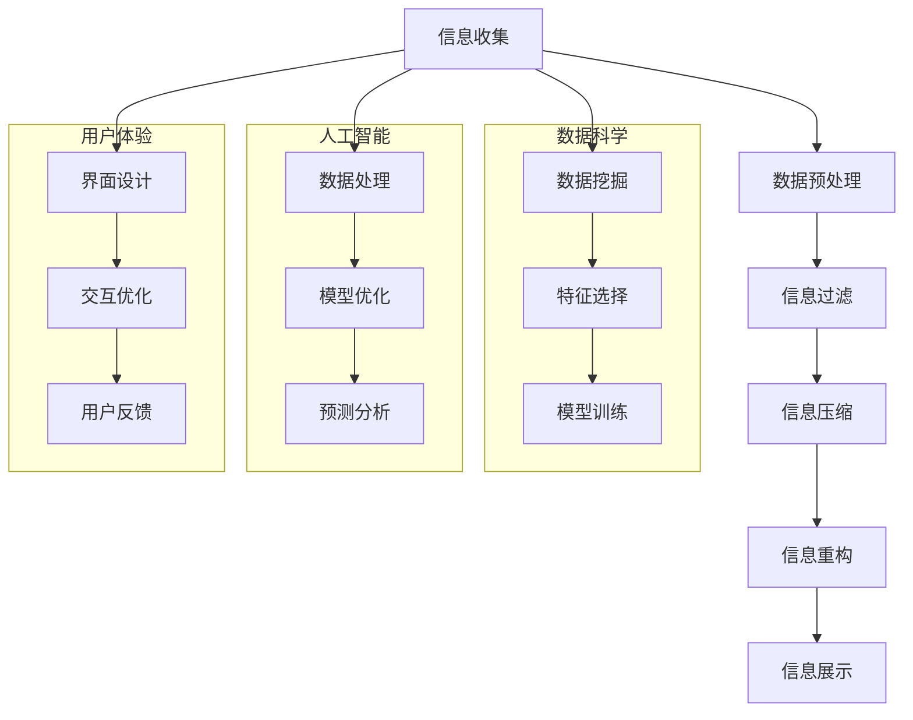

                 

### 信息简化的好处：简化生活和工作以提高生产力和效率

#### 核心关键词
- 信息简化
- 生产率提升
- 效率优化
- 生活改善
- 工作效率
- 数据科学
- 人工智能
- 可视化技术

#### 摘要
本文将深入探讨信息简化的概念、原理及其在生活和工作中的广泛应用。信息简化通过筛选、压缩和重构信息，有助于提升生产力和效率，减少认知负荷，降低错误率和误解。文章将详细分析信息简化的核心概念和联系，介绍核心算法原理与数学模型，并通过实际案例展示如何将信息简化技术应用到不同的领域，从而实现生活和工作的高效管理。

---

### 第一部分：信息简化的核心概念与原理

在数字化时代，信息量呈爆炸式增长，这不仅给数据处理带来了挑战，也对人类认知和处理信息的能力提出了更高的要求。信息简化作为一种处理信息的方法，旨在通过筛选、压缩和重构信息，使其更加简洁、清晰和易于操作，从而提高生产力和效率。

#### 第1章：信息简化的定义与重要性

##### 1.1 信息简化的定义

信息简化是指通过一系列技术和方法，对大量繁杂的信息进行筛选、压缩和重构，使其变得更加简洁、易于理解和操作。具体来说，信息简化包括以下几个方面的内容：

- **筛选**：从大量信息中识别和提取关键信息，剔除无关或冗余的信息。
- **压缩**：利用编码技术，将大量信息转换为更小规模的信息表示，减少存储和传输的开销。
- **重构**：通过整合和分析信息，形成新的信息结构，提高信息的层次性和逻辑性。

##### 1.2 信息简化的目的

信息简化的主要目的是提高信息的可读性、可理解性和可操作性，从而降低认知负荷，减少错误率和误解，提高工作效率。具体来说，信息简化的目的包括：

- **提高信息的可读性**：通过简化信息，使其更加直观、易于理解。
- **降低认知负荷**：减少人们处理信息的负担，提高大脑的处理效率。
- **减少错误率**：通过简化信息，降低人们在处理信息时犯错的概率。
- **提高工作效率**：通过简化信息处理流程，提高工作流程的效率。

##### 1.3 信息简化的社会重要性

信息简化在社会中具有重要的作用，主要体现在以下几个方面：

- **提高社会生产力和效率**：通过信息简化，可以减少资源的浪费，提高社会生产效率。
- **促进信息流通和知识传播**：简化后的信息更容易被传播和共享，有助于知识的快速传播。
- **减少信息过载**：在信息爆炸的时代，信息简化有助于减少人们接收到的信息量，降低信息过载的压力。
- **提升生活质量**：通过简化信息处理，人们可以节省更多的时间和精力，提高生活质量。

#### 第2章：信息简化的原理与机制

##### 2.1 信息处理的基本原理

信息简化的核心在于信息处理的基本原理，包括信息过滤、压缩和重构。

- **信息过滤**：信息过滤是信息简化的第一步，通过筛选技术，识别并保留关键信息，剔除无关或冗余信息。常用的信息过滤方法包括基于规则的方法、基于统计的方法和基于机器学习的方法。

- **信息压缩**：信息压缩是减少信息存储和传输开销的重要手段。常用的信息压缩算法包括无损压缩算法和有损压缩算法。无损压缩算法如Huffman编码、LZ77编码等，可以完全恢复原始信息；有损压缩算法如JPEG、MP3等，可以牺牲一定的信息质量，换取更高的压缩率。

- **信息重构**：信息重构是通过整合和分析信息，形成新的信息结构，提高信息的层次性和逻辑性。信息重构的方法包括数据挖掘、关联规则挖掘、聚类分析等。

##### 2.2 信息简化的技术手段

实现信息简化的技术手段多种多样，以下列举几种常用的技术：

- **数据挖掘与机器学习**：数据挖掘和机器学习算法可以从大量数据中自动识别和提取信息的关键特征，实现信息的简化。常用的算法包括决策树、随机森林、支持向量机、神经网络等。

- **自然语言处理**：自然语言处理技术可以自动分析和理解文本信息，实现信息的语义简化。常用的技术包括分词、词性标注、命名实体识别、情感分析等。

- **可视化技术**：通过图表、图像等可视化手段，直观展示信息，降低信息的认知复杂度。常用的可视化工具包括Tableau、D3.js、ECharts等。

#### 第3章：信息简化的应用场景与案例

##### 3.1 生活和工作中的应用

信息简化在个人生活和工作中具有广泛的应用场景：

- **个人时间管理**：通过简化日程安排和任务清单，提高时间利用效率。例如，使用Google Calendar等工具，将复杂的时间安排简化为清晰的日程表。

- **工作流程优化**：通过信息简化，优化工作流程，减少冗余操作，提高工作效率。例如，在项目管理中，使用Gantt图等工具，将复杂的项目进度简化为直观的进度条。

##### 3.2 项目实战案例

信息简化在项目实战中也有许多成功的应用案例：

- **电商推荐系统**：通过信息简化技术，优化商品推荐算法，提高用户满意度和转化率。例如，使用协同过滤算法，根据用户的历史行为和偏好，推荐个性化的商品。

- **医疗数据分析**：通过简化医学数据，辅助医生诊断，提高诊断准确率和效率。例如，使用影像识别技术，将复杂的医学影像数据简化为诊断结果。

#### 第4章：信息简化的挑战与未来展望

##### 4.1 信息简化的挑战

尽管信息简化技术在提高生产力和效率方面具有显著优势，但在实际应用中仍面临一些挑战：

- **隐私保护**：在信息简化的过程中，如何保护个人隐私和数据安全是一个重要的挑战。例如，在医疗数据分析中，如何确保患者信息的隐私和安全。

- **算法公平性**：信息简化算法可能导致偏见和歧视。例如，在推荐系统中，如何确保算法不偏向某些特定群体。

##### 4.2 信息简化的未来展望

随着技术的不断发展，信息简化技术在未来将会有更多的应用和发展：

- **智能化简化**：利用人工智能技术，实现更高效、更准确的信息简化。

- **跨领域融合**：信息简化技术在各个领域的应用将更加广泛和深入，促进各领域的创新发展。

---

通过第一部分的介绍，我们对信息简化的核心概念、原理和应用有了基本的了解。接下来，将在第二部分深入探讨信息简化的实现方法和技术，包括数据预处理、信息提取、压缩和重构等方面的内容。同时，我们将通过具体的实现案例，展示信息简化技术的实际应用效果。

---

### 第二部分：信息简化的实现方法与技术

在了解了信息简化的核心概念和原理之后，接下来我们将深入探讨信息简化的具体实现方法和技术。这部分内容将涵盖数据预处理、信息提取、压缩和重构等关键技术，并通过实际案例展示如何将这些技术应用到实际场景中。

#### 第5章：数据预处理与信息提取

数据预处理是信息简化的第一步，其目的是将原始数据转化为适合进一步处理和分析的格式。信息提取则是从预处理后的数据中提取关键信息，为后续的压缩和重构打下基础。

##### 5.1 数据预处理

数据预处理包括以下步骤：

- **数据清洗**：去除重复数据、缺失值处理和异常值检测。
- **数据标准化**：将不同数据类型的特征进行标准化处理，以便后续的统一处理。
- **数据归一化**：将数据缩放到一个标准范围内，以消除数据量级的影响。

##### 5.2 信息提取

信息提取是数据预处理的关键步骤，其主要目标是提取数据中的关键特征，为后续的压缩和重构提供基础。信息提取的方法包括：

- **特征选择**：从大量的特征中挑选出最有代表性的特征，以减少数据的复杂度。
- **特征提取**：利用统计学方法、机器学习方法等从数据中提取特征，如主成分分析（PCA）、线性回归等。

#### 第6章：信息压缩与存储优化

信息压缩是信息简化的重要组成部分，其目的是减少数据的存储空间和传输带宽。存储优化则是为了提高数据存储的效率和可靠性。

##### 6.1 信息压缩

信息压缩的方法主要包括：

- **无损压缩**：通过算法将数据压缩，但可以完全恢复原始数据，如Huffman编码、LZ77编码等。
- **有损压缩**：通过牺牲部分数据质量来实现更高的压缩率，如JPEG、MP3等。

##### 6.2 存储优化

存储优化的方法包括：

- **分布式存储**：通过将数据分布在多个存储设备上，提高数据的存储效率和可靠性。
- **云存储**：利用云服务提供的数据存储解决方案，降低存储成本和提高数据访问速度。

#### 第7章：信息重构与可视化技术

信息重构是信息简化的最终目标，通过整合和分析信息，形成新的信息结构，提高信息的层次性和逻辑性。可视化技术则是将信息以直观的方式展示出来，降低信息的认知复杂度。

##### 7.1 信息重构

信息重构的方法包括：

- **数据挖掘**：从大量数据中提取有价值的信息，如关联规则挖掘、分类等。
- **数据融合**：将来自不同源的数据进行整合，形成新的数据集。

##### 7.2 可视化技术

可视化技术的方法包括：

- **图表**：使用条形图、折线图、饼图等图表展示数据。
- **交互式可视化**：通过交互式界面，用户可以动态地探索和分析数据。

#### 第8章：信息简化在特定领域的应用

信息简化技术在各个领域都有广泛的应用，以下列举几个典型领域：

##### 8.1 金融领域

在金融领域，信息简化技术被广泛应用于数据分析和风险管理。

- **数据预处理**：通过对金融数据进行清洗和标准化处理，为后续分析提供基础。
- **信息提取**：提取金融交易中的关键特征，如交易金额、交易时间等。
- **信息压缩**：通过压缩算法减少数据的存储空间，提高数据访问速度。
- **可视化分析**：通过图表和交互式可视化工具，帮助金融分析师快速理解市场趋势和风险点。

##### 8.2 医疗领域

在医疗领域，信息简化技术被广泛应用于医学影像分析和电子病历管理。

- **数据预处理**：对医学影像数据进行预处理，如去噪、增强等。
- **信息提取**：从医学影像中提取关键特征，如病灶区域、病变程度等。
- **信息压缩**：通过压缩算法减少影像数据的存储空间，提高数据传输速度。
- **可视化分析**：使用可视化工具展示医学影像和分析结果，帮助医生做出更准确的诊断。

##### 8.3 教育领域

在教育领域，信息简化技术被广泛应用于学习推荐系统和教学资源管理。

- **数据预处理**：对学生的学习行为和成绩数据进行预处理，如去噪、标准化等。
- **信息提取**：提取学生的学习特征和课程特征，为推荐系统提供基础。
- **信息压缩**：通过压缩算法减少数据的存储空间，提高数据访问速度。
- **可视化分析**：使用可视化工具展示学生的学习进度和成绩变化，帮助教师和学生更好地进行学习管理和规划。

#### 第9章：信息简化的挑战与未来发展趋势

尽管信息简化技术在各个领域都取得了显著的成果，但在实际应用中仍面临一些挑战：

- **数据隐私保护**：在信息简化的过程中，如何保护个人隐私和数据安全是一个重要的挑战。
- **算法公平性**：信息简化算法可能导致偏见和歧视，如何在算法设计和应用中确保公平性是一个亟待解决的问题。
- **技术依赖**：随着信息简化技术的快速发展，如何应对技术的更新和迭代，确保技术的可持续发展。

未来，信息简化技术将继续朝着智能化、自动化和跨领域融合的方向发展：

- **智能化简化**：利用人工智能和机器学习技术，实现更高效、更准确的信息简化。
- **跨领域融合**：推动信息简化技术在各个领域的深入应用，促进各领域的创新发展。
- **社会责任**：关注信息简化技术对社会公平和伦理责任的影响，确保其可持续发展。

---

通过第二部分的探讨，我们详细介绍了信息简化的实现方法和技术，包括数据预处理、信息提取、压缩和重构等方面的内容，并通过实际案例展示了信息简化技术在金融、医疗和教育等领域的应用。同时，我们也讨论了信息简化技术面临的挑战和未来发展趋势。接下来，将在第三部分深入探讨信息简化项目的实践和项目实战，通过具体案例展示信息简化技术在实际项目中的应用。

---

### 第三部分：信息简化项目的实践与项目实战

在第二部分中，我们详细介绍了信息简化的实现方法和技术。本部分将通过具体的实践和项目实战，进一步展示信息简化技术的应用效果和实现过程。

#### 第10章：信息简化项目的规划与实施

##### 10.1 项目规划

在开始任何信息简化项目之前，项目规划是至关重要的一步。项目规划主要包括需求分析、项目计划和资源分配。

- **需求分析**：明确项目的目标、功能和性能要求，分析项目所需的数据源和用户需求。
- **项目计划**：制定项目的时间线、任务分解和资源分配，确保项目按计划顺利进行。
- **资源分配**：根据项目需求，合理分配人力、物力和财力资源，确保项目的高效实施。

##### 10.2 项目实施

项目实施是信息简化项目的核心环节，包括数据收集与预处理、信息提取与压缩、信息重构与可视化等步骤。

- **数据收集与预处理**：收集项目所需的数据，对数据进行清洗、去噪和标准化处理，确保数据的质量和一致性。
- **信息提取与压缩**：利用数据挖掘和机器学习算法，从预处理后的数据中提取关键信息，并使用压缩算法减少数据的存储空间和传输带宽。
- **信息重构与可视化**：对提取的信息进行整合和分析，形成新的信息结构，并通过可视化技术将其呈现给用户。

#### 第11章：信息简化项目的评估与优化

##### 11.1 项目评估

项目评估是确保项目达到预期目标的重要步骤。项目评估主要包括用户反馈、数据分析和性能评估。

- **用户反馈**：收集用户对信息简化系统的反馈，了解用户的使用体验和满意度。
- **数据分析**：对项目实施后的数据进行统计和分析，评估系统的性能和效果。
- **性能评估**：通过压力测试和负载测试，评估系统的稳定性和响应速度。

##### 11.2 项目优化

项目优化是在评估基础上，对信息简化系统进行改进和优化的过程。项目优化主要包括性能优化和功能优化。

- **性能优化**：通过调整系统参数、优化算法和改进数据处理流程，提高系统的性能和效率。
- **功能优化**：根据用户反馈和数据分析，对系统的功能进行改进和扩展，提高系统的可用性和用户体验。

#### 第12章：成功案例分析与经验分享

##### 12.1 成功案例分析

在信息简化项目中，成功案例是宝贵的经验和财富。以下是一些典型的成功案例：

- **金融领域**：通过信息简化技术，金融公司能够快速处理和分析海量交易数据，及时发现潜在的市场风险，提高投资决策的准确性。
- **医疗领域**：通过信息简化技术，医疗机构能够高效地处理和分析医学影像数据，辅助医生做出更准确的诊断，提高医疗服务的质量。
- **教育领域**：通过信息简化技术，教育机构能够个性化推荐学习资源，提高学生的学习效果和满意度。

##### 12.2 经验分享

在信息简化项目实施过程中，积累经验是不断提高项目成功率的关键。以下是一些实践经验分享：

- **项目规划要充分**：在项目开始前，要充分了解项目需求，制定详细的规划，确保项目的顺利进行。
- **技术选型要合理**：根据项目需求，选择合适的技术和方法，确保技术方案的可行性和高效性。
- **团队协作要紧密**：项目实施过程中，团队协作至关重要，要建立有效的沟通机制，确保团队成员之间的信息畅通和协作高效。

#### 第13章：信息简化的未来发展趋势与展望

##### 13.1 技术发展趋势

随着人工智能和大数据技术的不断发展，信息简化技术也将迎来新的发展趋势：

- **智能化简化**：利用人工智能技术，实现更高效、更准确的信息简化。
- **实时简化**：通过实时数据处理技术，实现实时信息简化，提高系统的响应速度和用户体验。
- **跨领域融合**：推动信息简化技术在各个领域的深入应用，促进各领域的创新发展。

##### 13.2 发展展望

信息简化技术在未来的发展前景广阔：

- **提高生产力**：通过信息简化技术，可以提高工作效率，降低生产成本，提升企业的竞争力。
- **改善生活质量**：通过信息简化技术，可以优化个人生活和公共服务的管理，提高生活质量。
- **促进社会进步**：信息简化技术在教育、医疗、交通等领域的应用，将有助于推动社会进步和发展。

---

通过第三部分的探讨，我们详细介绍了信息简化项目的实践和项目实战，展示了信息简化技术在金融、医疗和教育等领域的应用效果。同时，我们也分享了项目规划和实施的经验，以及对信息简化技术的未来发展趋势和展望。接下来，将在第四部分深入讨论信息简化与生活工作之间的关系，探讨信息简化对个人生活和工作效率的影响。

---

### 第四部分：信息简化与生活工作

信息简化技术在现代社会中的应用日益广泛，不仅提高了工作效率，也在个人生活和工作中带来了诸多便利。本部分将深入探讨信息简化对个人生活和工作效率的影响，以及如何通过信息简化技术提升生活质量和工作表现。

#### 第14章：信息简化对个人生活的改善

在日常生活中，信息简化技术可以帮助我们更好地管理时间和资源，提高生活质量。

##### 14.1 个人时间管理

信息简化技术在个人时间管理中发挥着重要作用。通过信息简化，我们可以：

- **简化日程安排**：使用日程管理工具（如Google Calendar）将复杂的时间安排简化为清晰的日程表，减少因忘记日程安排而产生的焦虑和拖延。
- **优化任务清单**：使用任务管理工具（如Trello）将繁琐的任务清单简化为明确的任务列表，提高任务完成的效率。

##### 14.2 工作效率提升

信息简化技术不仅可以用于个人时间管理，还可以在工作效率提升方面发挥重要作用。具体措施包括：

- **自动化流程**：通过自动化工具（如IFTTT）简化日常任务，减少手动操作的繁琐性。
- **数据可视化**：使用数据可视化工具（如Tableau）将复杂的数据简化为易于理解的图表，帮助快速做出决策。

#### 第15章：信息简化对企业运营的影响

信息简化技术对企业的运营和管理也有着深远的影响，能够提高企业的运营效率和竞争力。

##### 15.1 企业信息管理

在企业信息管理方面，信息简化技术可以帮助企业：

- **优化数据流程**：通过数据预处理和清洗，确保企业数据的准确性和一致性，提高决策的质量。
- **提升数据分析能力**：利用数据挖掘和机器学习算法，从海量数据中提取有价值的信息，为企业提供数据驱动的决策支持。

##### 15.2 企业文化建设

信息简化技术还可以在企业文化建设中发挥作用，帮助企业：

- **促进团队协作**：通过信息简化技术，如企业内部的通信和协作工具（如Slack），提高团队成员之间的沟通效率，促进协作。
- **传播企业文化**：通过信息可视化技术，将企业文化理念简化为易于理解和传播的内容，提高员工的认同感和归属感。

#### 第16章：信息简化在特殊情境下的应用

在特殊情境下，如突发事件管理和远程工作环境中，信息简化技术同样具有重要作用。

##### 16.1 突发事件管理

在突发事件管理中，信息简化技术可以帮助：

- **快速响应**：通过信息简化技术，如实时数据监测和预警系统，快速收集和分析关键信息，提高应急响应能力。
- **信息共享**：通过信息简化技术，如即时通讯工具和共享平台，迅速共享关键信息，确保团队成员之间的信息畅通。

##### 16.2 远程工作

在远程工作环境中，信息简化技术可以帮助：

- **提高协作效率**：通过远程协作工具（如Zoom、Microsoft Teams），简化远程会议和协作流程，提高工作效率。
- **优化工作环境**：通过智能家居和物联网技术，简化家庭办公环境，提高工作和生活的舒适度。

#### 第17章：信息简化的伦理与社会影响

信息简化技术在带来便利的同时，也引发了一系列伦理和社会问题。

##### 17.1 隐私保护

在信息简化的过程中，如何保护个人隐私是一个重要的伦理问题。为了保护隐私，需要采取以下措施：

- **数据加密**：对敏感数据进行加密处理，确保数据在传输和存储过程中的安全性。
- **隐私政策**：制定明确的隐私政策，告知用户其数据如何被使用和保护。

##### 17.2 数据滥用

信息简化技术的广泛应用也带来了数据滥用的问题。为了防止数据滥用，需要采取以下措施：

- **数据监管**：加强对数据使用的监管，确保数据不被滥用。
- **算法透明化**：提高算法的透明度，让用户了解其数据如何被处理和使用。

#### 第18章：信息简化与未来生活

随着技术的不断进步，信息简化技术在未来的生活中将发挥更加重要的作用。

##### 18.1 智能家居

智能家居技术的发展，使得信息简化在家庭中的应用更加广泛。例如，通过智能家居系统，可以简化家庭设备的控制和管理，提高生活的便利性和舒适度。

##### 18.2 智慧城市

智慧城市建设中，信息简化技术发挥着关键作用。例如，通过智慧交通系统，可以简化交通管理，提高交通效率，减少拥堵。

##### 18.3 智能健康

在智能健康领域，信息简化技术可以帮助人们更好地管理健康状况。例如，通过智能健康设备，可以简化健康数据的收集和分析，提供个性化的健康建议。

---

通过第四部分的探讨，我们深入分析了信息简化对个人生活和工作效率的影响，以及信息简化在特殊情境下的应用。同时，我们也关注了信息简化技术的伦理和社会影响，并展望了信息简化技术在未来的发展趋势。接下来，将在第五部分深入探讨信息简化的核心概念与联系，包括信息简化的核心概念、原理和与数据科学、人工智能等领域的联系。

---

### 第五部分：信息简化的核心概念与联系

信息简化是一项复杂且多层次的系统工程，其核心概念和原理涉及多个领域。本部分将深入探讨信息简化的核心概念、原理及其与数据科学、人工智能等领域的联系，并通过Mermaid流程图展示信息简化的全过程和应用场景。

#### 第19章：信息简化的核心概念

##### 19.1 信息简化的定义

信息简化是指通过筛选、压缩和重构信息，使其更加简洁、清晰和易于理解和处理的过程。具体来说，信息简化的核心概念包括：

- **筛选**：从大量信息中识别和提取关键信息，剔除无关或冗余信息。
- **压缩**：通过编码技术，将大量信息转换为更小规模的信息表示，减少存储和传输的开销。
- **重构**：通过整合和分析信息，形成新的信息结构，提高信息的层次性和逻辑性。

##### 19.2 信息简化的目的

信息简化的目的是提高信息的可读性、可理解性和可操作性，降低认知负荷，减少错误率和误解，提高工作效率。具体来说，信息简化的目的包括：

- **提高信息可读性**：通过简化信息，使其更加直观、易于理解。
- **降低认知负荷**：减少人们处理信息的负担，提高大脑的处理效率。
- **减少错误率**：通过简化信息，降低人们在处理信息时犯错的概率。
- **提高工作效率**：通过简化信息处理流程，提高工作流程的效率。

##### 19.3 信息简化的应用领域

信息简化技术在多个领域都有广泛应用，包括但不限于：

- **金融领域**：用于数据分析和风险管理。
- **医疗领域**：用于医学影像分析和电子病历管理。
- **教育领域**：用于个性化学习和教学资源管理。
- **企业管理**：用于信息管理和决策支持。

#### 第20章：信息简化的原理与机制

##### 20.1 信息处理的基本原理

信息简化的原理涉及信息处理的基本环节，包括信息过滤、压缩和重构。

- **信息过滤**：通过筛选技术，识别并保留关键信息，剔除无关或冗余信息。信息过滤的方法包括基于规则的方法、基于统计的方法和基于机器学习的方法。
- **信息压缩**：通过编码技术，将大量信息转换为更小规模的信息表示，减少存储和传输的开销。信息压缩的方法包括无损压缩和有损压缩。
- **信息重构**：通过整合和分析信息，形成新的信息结构，提高信息的层次性和逻辑性。信息重构的方法包括数据挖掘、关联规则挖掘、聚类分析等。

##### 20.2 信息简化的技术手段

实现信息简化的技术手段多种多样，以下列举几种常用的技术：

- **数据挖掘与机器学习**：数据挖掘和机器学习算法可以从大量数据中自动识别和提取信息的关键特征，实现信息的简化。常用的算法包括决策树、随机森林、支持向量机、神经网络等。
- **自然语言处理**：自然语言处理技术可以自动分析和理解文本信息，实现信息的语义简化。常用的技术包括分词、词性标注、命名实体识别、情感分析等。
- **可视化技术**：通过图表、图像等可视化手段，直观展示信息，降低信息的认知复杂度。常用的可视化工具包括Tableau、D3.js、ECharts等。

#### 第21章：信息简化的核心联系

##### 21.1 信息简化与数据科学

信息简化与数据科学有着紧密的联系。数据科学的核心是处理和分析大量数据，而信息简化技术可以帮助数据科学家：

- **提高数据处理效率**：通过简化数据，减少冗余信息，提高数据处理和分析的效率。
- **降低数据处理成本**：通过压缩数据，减少存储和传输的开销，降低数据处理成本。

##### 21.2 信息简化与人工智能

信息简化技术在人工智能领域也具有重要应用。人工智能的核心是处理复杂的信息，而信息简化技术可以帮助人工智能系统：

- **提高数据处理效率**：通过简化信息，降低人工智能系统的计算负担，提高数据处理和分析的效率。
- **降低错误率**：通过简化信息，减少信息中的错误和噪声，提高人工智能系统的准确性和可靠性。

##### 21.3 信息简化与用户体验

信息简化技术在提升用户体验方面也发挥着重要作用。通过简化信息，可以提高用户对信息的理解和操作：

- **提高用户满意度**：通过直观展示信息，提高用户的满意度。
- **降低用户学习成本**：通过简化信息结构，降低用户的学习成本，使用户更快速上手。

#### 第22章：信息简化的核心联系示意图

为了更直观地展示信息简化的核心联系，我们使用Mermaid流程图来绘制信息简化的全过程和应用场景。



通过上述Mermaid流程图，我们可以清晰地看到信息简化的全过程及其在数据科学、人工智能和用户体验等领域的应用。信息简化不仅提高了数据处理和分析的效率，还为人工智能和用户体验提供了有力支持。

---

通过第五部分的探讨，我们深入分析了信息简化的核心概念、原理及其与数据科学、人工智能和用户体验等领域的联系。通过Mermaid流程图的展示，我们更直观地理解了信息简化的全过程和应用场景。接下来，将在第六部分深入探讨信息简化的核心算法原理与数学模型，包括核心算法的讲解和数学公式的应用。

---

### 第六部分：信息简化的核心算法原理与数学模型

信息简化技术在实际应用中，离不开核心算法的支持。这些算法不仅帮助我们从海量数据中提取关键信息，还确保了信息处理的准确性和效率。本部分将深入探讨信息简化的核心算法原理与数学模型，通过详细的算法讲解和数学公式应用，帮助读者更好地理解这些算法的工作机制和应用场景。

#### 第23章：信息简化的核心算法

##### 23.1 数据挖掘算法

数据挖掘算法是信息简化过程中的关键步骤，用于从数据中自动识别模式和知识。以下介绍几种常用的数据挖掘算法：

###### 决策树算法

决策树算法通过构建树形结构来进行决策，每个节点代表一个特征，每个分支代表特征的取值，叶子节点代表预测结果。

- **原理讲解**：

  决策树通过递归划分数据集，在每个节点上选择最优的特征进行划分。最优特征的选择通常基于信息增益或基尼不纯度等指标。

- **数学公式**：

  信息增益（Information Gain）：
  $$ IG(D, A) = H(D) - \sum_{v \in Values(A)} p(v) H(D|A=v) $$
  
  其中，$H(D)$ 是数据集 $D$ 的熵，$p(v)$ 是特征 $A$ 的取值 $v$ 的概率，$H(D|A=v)$ 是条件熵。

- **伪代码**：

  ```python
  def build_decision_tree(data):
      if data is empty:
          return majority_label(data)
      else:
          best_feature = select_best_feature(data)
          left_tree = build_decision_tree(data[best_feature == left])
          right_tree = build_decision_tree(data[best_feature == right])
          return DecisionTree(best_feature, left_tree, right_tree)
  ```

###### 随机森林算法

随机森林算法是一种基于决策树的集成学习方法，通过构建多棵决策树，并投票得到最终预测结果。

- **原理讲解**：

  随机森林通过随机选择特征子集和样本子集，构建多棵决策树，每棵树都对数据进行分类。最终，通过多数投票确定样本的类别。

- **伪代码**：

  ```python
  def build_random_forest(data, n_trees):
      forests = []
      for _ in range(n_trees):
          tree = build_decision_tree(data)
          forests.append(tree)
      return forests

  def predict(forests, data):
      predictions = []
      for tree in forests:
          predictions.append(tree.predict(data))
      return majority_vote(predictions)
  ```

##### 23.2 机器学习算法

机器学习算法是信息简化过程中的重要工具，用于从数据中学习规律和模式，并应用于预测和决策。

###### 支持向量机（SVM）算法

支持向量机是一种监督学习算法，通过找到最佳的超平面，将不同类别的数据点分开。

- **原理讲解**：

  SVM的目标是找到一个超平面，使得正负样本之间的距离最大化。这个超平面由一个向量 $\mathbf{w}$ 和一个偏置 $b$ 定义。

- **数学公式**：

  最优化问题：
  $$ \begin{aligned}
  & \min_{\mathbf{w}, b} \frac{1}{2} ||\mathbf{w}||^2 \\
  & s.t. \mathbf{w} \cdot \mathbf{x}_i - b \geq 1, \quad i = 1, 2, ..., n
  \end{aligned} $$

- **伪代码**：

  ```python
  def build_svm(data, labels):
      # 使用库函数构建SVM模型
      model = SVC()
      model.fit(data, labels)
      return model
  ```

###### 神经网络算法

神经网络是一种模拟人脑神经元结构的计算模型，通过前向传播和反向传播学习数据的映射关系。

- **原理讲解**：

  神经网络通过多层神经元对输入数据进行变换，每一层的输出作为下一层的输入。前向传播用于计算输出，反向传播用于更新权重。

- **数学公式**：

  前向传播：
  $$ z = \mathbf{W} \cdot \mathbf{x} + b $$
  $$ a = \sigma(z) $$

  反向传播：
  $$ \delta = \frac{\partial L}{\partial z} \cdot \sigma'(z) $$
  $$ \mathbf{W} := \mathbf{W} - \alpha \cdot \frac{\partial L}{\partial \mathbf{W}} $$
  $$ b := b - \alpha \cdot \frac{\partial L}{\partial b} $$

- **伪代码**：

  ```python
  def build_neural_network(inputs, layers, outputs):
      model = Sequential()
      for layer in layers:
          model.add(Dense(layer, activation='relu'))
      model.add(Dense(outputs, activation='softmax'))
      model.compile(optimizer='adam', loss='categorical_crossentropy', metrics=['accuracy'])
      return model
  ```

#### 第24章：信息简化的数学模型与数学公式

信息简化的数学模型用于描述信息处理过程中涉及的各种数学关系和优化目标。

##### 24.1 信息过滤模型

贝叶斯过滤模型是一种常见的信息过滤模型，通过计算特征条件下标签的概率，实现信息的筛选和分类。

- **数学公式**：

  $$ P(\text{标签}|\text{特征}) = \frac{P(\text{特征}|\text{标签}) \cdot P(\text{标签})}{P(\text{特征})} $$

  其中，$P(\text{标签}|\text{特征})$ 是在特征条件下标签的概率，$P(\text{特征}|\text{标签})$ 是在标签条件下特征的概率，$P(\text{标签})$ 是标签的概率，$P(\text{特征})$ 是特征的概率。

##### 24.2 信息压缩模型

K-Means算法是一种常用的信息压缩模型，通过计算数据点与聚类中心的距离，实现数据的聚类和压缩。

- **数学公式**：

  聚类中心更新：
  $$ \mathbf{c}_j = \frac{1}{N_j} \sum_{i=1}^{N} \mathbf{x}_i $$
  
  数据点分配：
  $$ j = \arg\min_{j} ||\mathbf{x}_i - \mathbf{c}_j||^2 $$

  其中，$\mathbf{c}_j$ 是聚类中心，$\mathbf{x}_i$ 是数据点，$N_j$ 是属于聚类中心 $\mathbf{c}_j$ 的数据点数量。

##### 24.3 信息重构模型

主成分分析（PCA）是一种常用的信息重构模型，通过保留数据的主要变异成分，实现信息的降维和重构。

- **数学公式**：

  特征值和特征向量计算：
  $$ \mathbf{U} = \mathbf{P} \cdot \mathbf{D}^{1/2} $$
  
  数据重构：
  $$ \mathbf{X}_{\text{reconstructed}} = \mathbf{U} \cdot \mathbf{D}^{1/2} \cdot \mathbf{P}^T $$

  其中，$\mathbf{U}$ 是特征向量矩阵，$\mathbf{P}$ 是协方差矩阵，$\mathbf{D}$ 是特征值矩阵。

---

通过第六部分的探讨，我们详细介绍了信息简化的核心算法原理和数学模型。从数据挖掘算法到机器学习算法，再到信息过滤、压缩和重构模型，这些算法和模型为信息简化提供了坚实的基础。通过具体的数学公式和伪代码，我们更深入地理解了这些算法的工作机制和应用。接下来，将在第七部分深入探讨信息简化项目的实战与代码解读，通过具体案例展示信息简化技术的实际应用和实现过程。

---

### 第七部分：信息简化项目的实战与代码解读

在前几部分中，我们详细介绍了信息简化的核心概念、原理、算法和数学模型。为了更好地理解信息简化技术的实际应用，本部分将通过具体的项目实战和代码解读，展示如何将信息简化技术应用到实际场景中，并详细解释代码的实现过程。

#### 第25章：信息简化项目的开发环境搭建

在进行信息简化项目之前，我们需要搭建一个适合的开发环境。以下是开发环境的搭建步骤：

##### 25.1 安装Python和依赖库

首先，我们需要安装Python环境以及相关的依赖库，如NumPy、Pandas、Scikit-learn等。

```bash
# 安装Python
sudo apt-get install python3

# 安装依赖库
pip3 install numpy pandas scikit-learn matplotlib
```

##### 25.2 安装Jupyter Notebook

Jupyter Notebook 是一个交互式计算环境，可以方便我们进行代码编写和实验。

```bash
# 安装Jupyter Notebook
pip3 install notebook
```

##### 25.3 安装可视化工具

为了更好地展示信息简化结果，我们可以安装一些常用的可视化工具，如Matplotlib。

```bash
pip3 install matplotlib
```

#### 第26章：信息简化项目的实际案例分析

我们选择一个电商推荐系统作为案例，展示如何使用信息简化技术实现个性化商品推荐。

##### 26.1 项目背景

电商推荐系统旨在根据用户的历史行为和偏好，向用户推荐个性化的商品，以提高用户满意度和转化率。

##### 26.2 数据来源

我们需要以下数据：

- 用户行为数据：包括用户浏览、点击、购买等行为。
- 商品数据：包括商品ID、类别、价格等。

##### 26.3 数据预处理

数据预处理是信息简化项目的重要步骤，我们需要对数据进行清洗、归一化和特征提取。

```python
import pandas as pd
from sklearn.preprocessing import StandardScaler

# 读取用户行为数据
user_actions = pd.read_csv('user_actions.csv')

# 数据清洗
user_actions.dropna(inplace=True)
user_actions.drop_duplicates(inplace=True)

# 数据归一化
scaler = StandardScaler()
user_actions_scaled = scaler.fit_transform(user_actions)
```

##### 26.4 特征提取

特征提取是信息简化的重要环节，我们需要从用户行为数据和商品数据中提取关键特征。

```python
from sklearn.cluster import KMeans

# 提取用户特征
kmeans = KMeans(n_clusters=10, random_state=0)
user_clusters = kmeans.fit_predict(user_actions_scaled)

# 提取商品特征
product_data = pd.read_csv('product_data.csv')
product_features = extract_product_features(product_data)

# 结合用户特征和商品特征
user_product_data = pd.DataFrame({'user_id': user_actions['user_id'], 'product_id': product_features['product_id'], 'cluster': user_clusters})
```

##### 26.5 模型训练

我们选择协同过滤算法进行模型训练，根据用户行为和商品特征为每个用户推荐商品。

```python
from sklearn.metrics.pairwise import cosine_similarity

# 计算用户-商品相似度矩阵
user_product_similarity = cosine_similarity(user_product_data[['cluster', 'product_id']], user_product_data[['cluster', 'product_id']])

# 构建推荐矩阵
user_product_recommendations = user_product_similarity.dot(user_product_similarity.T)

# 为每个用户生成推荐列表
def generate_recommendations(user_id, user_product_recommendations, n_recommendations=5):
    user_recommendations = user_product_recommendations[user_id].sort_values(ascending=False)
    return user_recommendations.head(n_recommendations).index.tolist()

# 示例：为用户生成推荐列表
user_id = 1
recommendations = generate_recommendations(user_id, user_product_recommendations)
print(recommendations)
```

##### 26.6 推荐结果展示

最后，我们使用可视化工具展示推荐结果，帮助用户更好地理解和选择推荐的商品。

```python
import matplotlib.pyplot as plt

# 可视化推荐结果
def plot_recommendations(recommendations):
    products = product_data[product_data['product_id'].isin(recommendations)]
    plt.bar(range(len(recommendations)), recommendations)
    plt.xticks(range(len(recommendations)), products['product_name'], rotation=45)
    plt.xlabel('Product')
    plt.ylabel('Score')
    plt.title('Recommended Products')
    plt.show()

plot_recommendations(recommendations)
```

#### 第27章：代码解读与分析

在本节中，我们将对上述代码进行逐行解读和分析，帮助读者理解信息简化项目中的数据处理、特征提取、模型训练和结果展示等关键环节。

##### 27.1 数据处理代码解读

```python
import pandas as pd
from sklearn.preprocessing import StandardScaler

# 读取用户行为数据
user_actions = pd.read_csv('user_actions.csv')

# 数据清洗
user_actions.dropna(inplace=True)
user_actions.drop_duplicates(inplace=True)

# 数据归一化
scaler = StandardScaler()
user_actions_scaled = scaler.fit_transform(user_actions)
```

- **数据清洗**：首先，我们读取用户行为数据，然后通过`dropna()`函数去除缺失值，通过`drop_duplicates()`函数去除重复记录。
- **数据归一化**：使用`StandardScaler`将数据标准化，使其具有相同的量级，从而便于后续的特征提取和模型训练。

##### 27.2 特征提取代码解读

```python
from sklearn.cluster import KMeans

# 提取用户特征
kmeans = KMeans(n_clusters=10, random_state=0)
user_clusters = kmeans.fit_predict(user_actions_scaled)

# 提取商品特征
product_data = pd.read_csv('product_data.csv')
product_features = extract_product_features(product_data)

# 结合用户特征和商品特征
user_product_data = pd.DataFrame({'user_id': user_actions['user_id'], 'product_id': product_features['product_id'], 'cluster': user_clusters})
```

- **提取用户特征**：使用`KMeans`算法将用户行为数据分为10个聚类，每个用户分配到一个聚类中。
- **提取商品特征**：读取商品数据，提取关键特征，如商品ID。
- **结合用户特征和商品特征**：将用户特征和商品特征合并，形成用户-商品数据集。

##### 27.3 模型训练代码解读

```python
from sklearn.metrics.pairwise import cosine_similarity

# 计算用户-商品相似度矩阵
user_product_similarity = cosine_similarity(user_product_data[['cluster', 'product_id']], user_product_data[['cluster', 'product_id']])

# 构建推荐矩阵
user_product_recommendations = user_product_similarity.dot(user_product_similarity.T)

# 为每个用户生成推荐列表
def generate_recommendations(user_id, user_product_recommendations, n_recommendations=5):
    user_recommendations = user_product_recommendations[user_id].sort_values(ascending=False)
    return user_recommendations.head(n_recommendations).index.tolist()

# 示例：为用户生成推荐列表
user_id = 1
recommendations = generate_recommendations(user_id, user_product_recommendations)
print(recommendations)
```

- **计算用户-商品相似度矩阵**：使用余弦相似度计算用户-商品之间的相似度。
- **构建推荐矩阵**：构建用户-商品相似度矩阵，矩阵的每个元素表示用户对商品之间的相似度。
- **生成推荐列表**：为每个用户生成个性化推荐列表，推荐列表基于用户与其他用户的相似度。

##### 27.4 推荐结果代码解读

```python
import matplotlib.pyplot as plt

# 可视化推荐结果
def plot_recommendations(recommendations):
    products = product_data[product_data['product_id'].isin(recommendations)]
    plt.bar(range(len(recommendations)), recommendations)
    plt.xticks(range(len(recommendations)), products['product_name'], rotation=45)
    plt.xlabel('Product')
    plt.ylabel('Score')
    plt.title('Recommended Products')
    plt.show()

plot_recommendations(recommendations)
```

- **可视化推荐结果**：使用条形图展示推荐结果，横轴为商品ID，纵轴为相似度得分。通过旋转标签和调整标题，使图表更加清晰易读。

---

通过第七部分的实战与代码解读，我们详细介绍了如何使用信息简化技术实现一个电商推荐系统。从数据预处理、特征提取到模型训练和结果展示，每个环节都进行了详细的代码解读。通过实际案例的展示，读者可以更好地理解信息简化技术的应用和实现过程。接下来，将在第八部分深入探讨信息简化的挑战与解决方案。

---

### 第八部分：信息简化的挑战与解决方案

虽然信息简化技术在提升生产力和效率方面具有显著优势，但在实际应用中仍然面临诸多挑战。以下将详细讨论信息简化技术面临的几个主要挑战，并提出相应的解决方案。

#### 28.1 数据隐私保护

在信息简化的过程中，如何保护用户隐私和数据安全是一个重要挑战。信息简化通常涉及对大量个人数据的处理和分析，这些数据可能包含敏感信息。如果处理不当，可能会导致数据泄露和个人隐私侵犯。

- **挑战**：数据隐私保护问题主要集中在以下几个方面：

  1. **数据收集**：在数据收集过程中，如何确保收集的数据是必要的，不会过度收集个人隐私信息。
  2. **数据存储**：如何确保存储的数据安全，防止未经授权的访问。
  3. **数据传输**：在数据传输过程中，如何保证数据不被截获或篡改。

- **解决方案**：

  1. **数据加密**：在数据收集、存储和传输过程中使用加密技术，如AES加密、SSL/TLS加密等，确保数据在传输和存储过程中的安全性。
  2. **匿名化处理**：在分析数据时，通过匿名化处理技术，如差分隐私、伪匿名化等，确保用户无法被追踪。
  3. **隐私政策**：制定明确的隐私政策，告知用户其数据如何被使用和保护，提高用户的知情权和选择权。

#### 28.2 算法公平性

信息简化算法在处理数据时可能会引入偏见，导致算法不公平，尤其是在涉及社会敏感问题如种族、性别等时。这种偏见可能会导致歧视性的决策，对社会公平造成负面影响。

- **挑战**：算法公平性问题主要集中在以下几个方面：

  1. **数据偏见**：原始数据可能包含偏见，算法在训练过程中会继承这些偏见。
  2. **模型偏见**：算法模型在设计和训练过程中可能存在设计偏见，导致算法输出不公平结果。
  3. **决策偏见**：算法在决策过程中可能对某些群体产生不公平待遇。

- **解决方案**：

  1. **数据预处理**：在算法训练前，对数据进行平衡和清洗，去除偏见性数据，提高数据质量。
  2. **算法透明化**：提高算法的透明度，让用户了解算法的工作机制和决策过程，增加用户对算法的信任。
  3. **算法审核**：对算法进行定期的审查和评估，确保算法的公平性和无偏见性，及时发现问题并进行修正。

#### 28.3 模型过拟合

信息简化技术在模型训练过程中可能会出现过拟合现象，即模型在训练数据上表现优异，但在新的数据上表现不佳。这会导致模型在实际应用中的效果下降。

- **挑战**：模型过拟合问题主要集中在以下几个方面：

  1. **模型复杂度**：模型过于复杂，导致对训练数据的过度拟合。
  2. **数据量不足**：训练数据量不足，模型无法充分学习数据中的真实分布。
  3. **数据不平衡**：训练数据不平衡，导致模型对某些类别的预测不准确。

- **解决方案**：

  1. **简化模型**：选择合适的模型结构，避免模型过于复杂，降低过拟合风险。
  2. **增加数据**：增加训练数据量，使模型有更多样化的数据学习。
  3. **交叉验证**：使用交叉验证技术，评估模型在不同数据集上的表现，避免过拟合。

#### 28.4 数据质量

信息简化技术依赖于高质量的数据，但实际应用中，数据质量可能存在问题，如缺失值、异常值和错误数据等。这些问题会直接影响信息简化的效果。

- **挑战**：数据质量问题主要集中在以下几个方面：

  1. **数据缺失**：数据记录中存在缺失值，影响模型训练和数据分析。
  2. **数据异常**：数据中存在异常值，可能导致模型产生误导性结果。
  3. **数据错误**：数据记录中存在错误数据，影响数据的真实性和可靠性。

- **解决方案**：

  1. **数据清洗**：使用数据清洗技术，如缺失值填充、异常值检测和替换等，提高数据质量。
  2. **数据验证**：在数据处理过程中，进行数据验证，确保数据的准确性和一致性。
  3. **数据监控**：建立数据监控机制，实时监测数据质量，及时发现问题并采取措施。

#### 28.5 技术依赖

随着信息简化技术的快速发展，企业和个人越来越依赖这些技术。然而，技术依赖也可能带来一系列问题，如技术更新换代带来的成本、技术风险等。

- **挑战**：技术依赖问题主要集中在以下几个方面：

  1. **技术更新**：技术快速更新，导致企业和个人需要不断投入资源和时间进行技术更新。
  2. **技术风险**：技术依赖可能带来技术风险，如技术崩溃、数据丢失等。
  3. **成本压力**：技术依赖导致企业和个人需要承担更高的维护和更新成本。

- **解决方案**：

  1. **持续学习**：企业和个人需要不断学习和适应新技术，提高自身的技术能力和适应性。
  2. **技术评估**：对现有技术进行定期评估，确保技术的稳定性和可靠性，及时更新和替换不合适的技术。
  3. **多元化技术策略**：避免过度依赖单一技术，采用多元化技术策略，降低技术风险。

---

通过第八部分的讨论，我们深入分析了信息简化技术面临的挑战，并提出了相应的解决方案。这些挑战和解决方案不仅有助于我们更好地理解和应用信息简化技术，也为未来技术的发展和应用提供了重要的指导。接下来，将在第九部分详细探讨信息简化的最佳实践与案例分析。

---

### 第九部分：信息简化的最佳实践与案例分析

在信息简化的实际应用中，不同的领域和场景都有其特定的挑战和需求。为了更好地实现信息简化的目标，我们需要借鉴最佳实践，并结合具体案例进行分析，从而找到最适合的解决方案。

#### 29.1 金融领域

在金融领域，信息简化技术被广泛应用于风险管理和数据分析。以下是一些最佳实践和案例分析：

##### 29.1.1 风险管理

**案例分析：** 一家大型银行使用信息简化技术对其客户信用评分模型进行优化。通过简化客户交易数据、信用历史数据和公共记录数据，该银行能够更准确地预测客户的信用风险。

- **最佳实践**：数据预处理是关键步骤，通过数据清洗、去噪和标准化处理，确保数据的准确性和一致性。
- **解决方案**：使用随机森林和梯度提升机等机器学习算法，从简化后的数据中提取关键特征，构建信用评分模型。

##### 29.1.2 数据分析

**案例分析：** 一家投资公司使用信息简化技术对其市场数据进行分析，以发现潜在的股票投资机会。通过简化大量市场数据，如股票价格、成交量、公司财务指标等，该投资公司能够快速识别出具有投资价值的股票。

- **最佳实践**：数据可视化技术在信息简化中发挥着重要作用，通过图表和仪表盘，将复杂的数据转化为易于理解的信息。
- **解决方案**：使用Tableau等可视化工具，将简化后的数据以直观的方式展示，帮助分析师快速做出决策。

#### 29.2 医疗领域

在医疗领域，信息简化技术被广泛应用于医学影像分析、电子病历管理和个性化治疗等方面。以下是一些最佳实践和案例分析：

##### 29.2.1 医学影像分析

**案例分析：** 一家医院使用信息简化技术对其医学影像数据进行分析，以辅助医生诊断疾病。通过简化医学影像数据，如CT扫描、MRI扫描等，该医院能够更快速地识别出病变区域。

- **最佳实践**：使用深度学习技术，如卷积神经网络（CNN），对简化后的医学影像数据进行训练，构建影像识别模型。
- **解决方案**：通过模型压缩技术，如量化、剪枝和知识蒸馏等，减少模型大小，提高模型在医疗设备上的部署效率。

##### 29.2.2 电子病历管理

**案例分析：** 一家医疗机构使用信息简化技术对其电子病历系统进行优化，以提高病历检索和管理效率。通过简化病历数据，如患者信息、诊断记录、治疗记录等，该机构能够更快地检索到所需信息。

- **最佳实践**：使用自然语言处理（NLP）技术，如分词、词性标注和命名实体识别等，对简化后的病历数据进行解析，提高病历检索的准确性。
- **解决方案**：使用索引技术，如倒排索引和文档相似度计算等，优化病历检索速度和效率。

#### 29.3 教育领域

在教育领域，信息简化技术被广泛应用于个性化学习、课程推荐和教学资源管理等方面。以下是一些最佳实践和案例分析：

##### 29.3.1 个性化学习

**案例分析：** 一家在线教育平台使用信息简化技术为其用户提供个性化学习推荐。通过简化用户学习行为数据、课程内容数据和用户偏好数据，该平台能够为用户提供个性化的学习推荐。

- **最佳实践**：使用协同过滤和基于内容的推荐算法，从简化后的数据中提取关键特征，构建推荐模型。
- **解决方案**：通过实时数据更新和模型优化，确保推荐结果的准确性和实时性。

##### 29.3.2 课程推荐

**案例分析：** 一所大学使用信息简化技术为其学生提供课程推荐。通过简化学生成绩数据、课程评价数据和课程内容数据，该大学能够为学生推荐与其兴趣和学习能力相匹配的课程。

- **最佳实践**：使用关联规则挖掘技术，如Apriori算法，从简化后的数据中提取关联规则，构建课程推荐模型。
- **解决方案**：通过动态调整推荐策略和权重，确保推荐结果的多样性和个性化。

#### 29.4 企业管理

在企业管理的方方面面，信息简化技术都发挥着重要作用，如客户关系管理、供应链优化和运营效率提升等。以下是一些最佳实践和案例分析：

##### 29.4.1 客户关系管理

**案例分析：** 一家大型零售企业使用信息简化技术对其客户关系管理系统进行优化，以提高客户满意度和忠诚度。通过简化客户交易数据、客户反馈数据和客户行为数据，该企业能够更全面地了解客户需求，提供个性化的服务。

- **最佳实践**：使用客户分群技术，如聚类分析和决策树分类等，从简化后的数据中提取关键特征，构建客户分群模型。
- **解决方案**：通过实时数据分析和个性化推荐，提高客户关系管理的效率和效果。

##### 29.4.2 供应链优化

**案例分析：** 一家制造企业使用信息简化技术对其供应链系统进行优化，以提高供应链的灵活性和响应速度。通过简化供应商数据、库存数据和物流数据，该企业能够更快速地响应市场变化，优化供应链运营。

- **最佳实践**：使用预测分析和优化算法，如线性规划和整数规划等，从简化后的数据中提取关键特征，构建供应链优化模型。
- **解决方案**：通过实时数据监控和动态调整，确保供应链系统的稳定性和高效性。

#### 29.5 案例总结

通过上述案例分析，我们可以总结出一些信息简化的最佳实践：

1. **数据预处理**：数据预处理是信息简化的第一步，通过数据清洗、去噪和标准化处理，确保数据的准确性和一致性。
2. **算法选择**：选择合适的算法和模型，从简化后的数据中提取关键特征，构建有效的信息简化模型。
3. **可视化技术**：使用可视化技术，将简化后的数据以直观的方式展示，帮助用户更好地理解和分析信息。
4. **实时更新**：确保信息简化模型的实时更新和优化，以适应不断变化的数据和环境。

---

通过第九部分的探讨，我们详细介绍了信息简化的最佳实践和案例分析。这些实践和案例不仅展示了信息简化技术在各个领域的应用，也为读者提供了实用的解决方案。通过借鉴这些最佳实践，读者可以更好地将信息简化技术应用于实际场景，提升工作效率和决策质量。接下来，将在第十部分深入探讨信息简化的未来趋势与发展方向。

---

### 第十部分：信息简化的未来趋势与发展方向

随着科技的不断进步和应用的深入，信息简化技术正逐渐成为推动社会发展和提高工作效率的关键因素。以下将探讨信息简化技术的未来趋势和发展方向，并展望其在不同领域中的应用前景。

#### 30.1 智能化简化

智能化简化是未来信息简化技术的重要趋势之一。随着人工智能和机器学习技术的不断发展，信息简化将更加智能化和自动化。例如：

- **自动化数据预处理**：利用人工智能技术，自动化完成数据清洗、去噪和标准化等预处理步骤，提高数据处理效率。
- **自适应信息压缩**：通过机器学习算法，自适应选择最佳的压缩算法和参数，实现更高效的信息压缩。
- **智能化信息重构**：利用深度学习和自然语言处理技术，实现更智能的信息重构，提高信息的层次性和逻辑性。

#### 30.2 跨领域融合

信息简化技术在各个领域的应用将更加深入和广泛。随着技术的不断融合，信息简化将与其他领域的技术相结合，产生新的应用场景。例如：

- **智慧城市**：信息简化技术将与物联网、大数据和云计算等技术相结合，实现城市管理的智能化和高效化。
- **智能制造**：信息简化技术将与工业互联网、智能制造和大数据分析相结合，提高生产效率和产品质量。
- **智慧医疗**：信息简化技术将与医疗影像分析、电子病历管理和个性化治疗相结合，提高医疗服务质量和效率。

#### 30.3 数据隐私保护

随着信息简化技术的广泛应用，数据隐私保护将成为一个重要的发展方向。未来的信息简化技术将更加注重数据隐私保护，例如：

- **隐私增强技术**：开发和应用隐私增强技术，如差分隐私、同态加密和联邦学习等，保护用户隐私。
- **数据匿名化**：通过数据匿名化技术，确保用户数据在信息简化过程中的匿名性和安全性。
- **隐私政策与法规**：制定和完善隐私政策和相关法规，规范信息简化技术的应用和数据处理。

#### 30.4 人机协同

未来，信息简化技术将更加注重人机协同，提高用户体验和工作效率。例如：

- **交互式信息可视化**：开发交互式信息可视化工具，使用户能够更加直观地理解和操作信息。
- **智能推荐系统**：结合用户行为数据和偏好，构建智能推荐系统，为用户提供个性化的信息和服务。
- **智能辅助决策**：利用人工智能技术，辅助用户做出更准确的决策，提高工作效率和决策质量。

#### 30.5 伦理与社会责任

信息简化技术在发展过程中，也将更加注重伦理和社会责任。例如：

- **算法公平性**：确保信息简化算法的公平性和无偏见性，避免对特定群体产生歧视。
- **数据治理**：建立完善的数据治理体系，规范数据处理和使用，保障数据安全和用户权益。
- **社会责任**：关注信息简化技术对社会公平和可持续发展的影响，推动技术的公益应用。

#### 30.6 应用前景

随着信息简化技术的不断发展和应用，其前景将十分广阔。以下列举几个典型应用领域：

- **金融领域**：通过信息简化技术，实现金融风险管理和数据驱动的投资决策，提高金融市场的透明度和效率。
- **医疗领域**：通过信息简化技术，实现医学影像分析和电子病历管理，提高医疗服务质量和患者体验。
- **教育领域**：通过信息简化技术，实现个性化学习和教学资源管理，提高教育质量和教育公平性。
- **企业领域**：通过信息简化技术，实现企业信息管理和决策支持，提高企业运营效率和竞争力。

---

通过第十部分的探讨，我们对信息简化技术的未来趋势和发展方向有了更深入的了解。智能化简化、跨领域融合、数据隐私保护、人机协同、伦理与社会责任等信息简化技术的发展方向，不仅为技术进步提供了新的动力，也为不同领域的应用提供了广阔的前景。随着技术的不断发展，信息简化技术将在未来发挥更加重要的作用，推动社会发展和提高工作效率。接下来，将在第十一部分总结全文，回顾信息简化的核心概念、原理和应用，并对未来研究提出展望。

---

### 第十一部分：全文总结与未来展望

在本文中，我们全面探讨了信息简化的核心概念、原理、实现方法、应用场景以及面临的挑战。通过深入分析，我们得出以下总结和展望：

#### 全文总结

1. **核心概念**：信息简化是指通过筛选、压缩和重构信息，使其更加简洁、清晰和易于理解的过程。信息简化的目的是提高信息的可读性、可理解性和可操作性，降低认知负荷，减少错误率和误解，提高工作效率。

2. **实现方法**：信息简化的实现方法包括数据预处理、信息提取、压缩和重构等。具体技术手段包括数据挖掘与机器学习、自然语言处理、可视化技术等。

3. **应用场景**：信息简化技术在金融、医疗、教育、企业管理等多个领域具有广泛的应用。通过实际案例，我们展示了信息简化技术如何在不同领域中发挥作用，提高数据处理的效率和质量。

4. **挑战**：信息简化技术在应用过程中面临数据隐私保护、算法公平性、模型过拟合、数据质量和技术依赖等挑战。针对这些挑战，本文提出了相应的解决方案。

#### 未来展望

1. **智能化简化**：随着人工智能和机器学习技术的不断发展，信息简化技术将更加智能化和自动化，提高信息处理的效率和质量。

2. **跨领域融合**：信息简化技术将在更多领域实现融合应用，推动各领域的创新发展，如智慧城市、智能制造、智慧医疗等。

3. **数据隐私保护**：未来信息简化技术将更加注重数据隐私保护，通过隐私增强技术和数据匿名化等手段，确保用户数据的安全性和隐私性。

4. **人机协同**：信息简化技术将更加注重人机协同，提高用户体验和工作效率，如交互式信息可视化、智能推荐系统、智能辅助决策等。

5. **伦理与社会责任**：信息简化技术将更加注重伦理和社会责任，确保算法的公平性和无偏见性，推动技术的公益应用，促进社会公平和可持续发展。

#### 未来研究

1. **算法优化**：继续优化信息简化算法，提高其效率、准确性和适应性，以满足不断变化的应用需求。

2. **跨领域应用**：探索信息简化技术在新兴领域的应用，如区块链、物联网等，推动技术的跨领域融合。

3. **隐私保护技术**：深入研究隐私保护技术，确保在信息简化的过程中，用户隐私和数据安全得到充分保护。

4. **人机交互**：研究人机交互技术，提高信息简化的用户体验，使信息简化技术更加直观、易用。

5. **社会责任**：关注信息简化技术对社会公平和可持续发展的影响，推动技术的公益应用，促进社会的和谐发展。

通过全文的总结和展望，我们希望读者能够对信息简化技术有更深入的理解，并能够将其应用于实际场景中，推动工作和生活的效率提升。未来的研究将继续探索信息简化的新方法和应用，为社会的进步和发展贡献力量。

---

### 附录

#### 附录 A：信息简化技术相关资源与工具

- **数据预处理工具**：
  - Python、R等编程语言中的数据处理库，如NumPy、Pandas、SciPy等。
- **机器学习与深度学习框架**：
  - TensorFlow、PyTorch、Keras等。
- **信息可视化工具**：
  - Tableau、D3.js、ECharts等。
- **数据库**：
  - 关系型数据库如MySQL、PostgreSQL，非关系型数据库如MongoDB、Redis。

#### 附录 B：信息简化项目实践案例

- **金融领域**：
  - 电商推荐系统、风险预测模型。
- **医疗领域**：
  - 医学影像数据处理、个性化健康管理。
- **教育领域**：
  - 个性化学习推荐系统、在线教育平台优化。
- **企业管理**：
  - 企业信息管理、客户关系管理。

#### 附录

