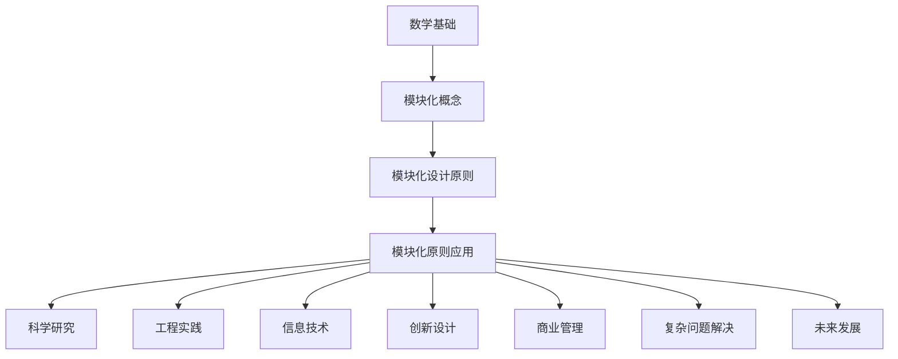
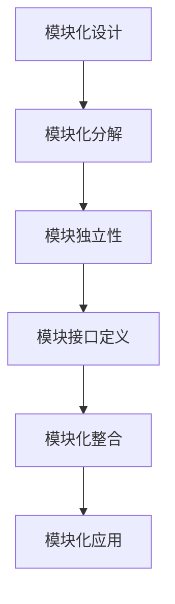

                 

# 像数学家一样思考：模块化原则

> **关键词**：数学思维、模块化设计、模块化原则、应用案例

> **摘要**：本文将探讨数学家思考方式中的模块化原则，从数学基础理论出发，深入解析模块化设计的概念和原则，并通过具体的应用案例展示模块化原则在各个领域中的实际应用，旨在为读者提供一个理解和应用模块化原则的全面指南。

---

## 第一部分：引言与基础理论

### 第1章：思考的数学基础

#### 1.1 数学思维的重要性

数学思维是一种逻辑严密、条理清晰、抽象概括的思维方式，它具有高度的普适性和广泛的应用性。在科技创新和问题解决中，数学思维发挥着至关重要的作用。

**1.1.1 数学思维在问题解决中的应用**

数学思维能够帮助我们准确地描述问题，精确地分析问题，并找到最优的解决方案。例如，在工程问题中，数学思维可以帮助我们建立模型，模拟各种情况，从而找到最佳的设计方案。在经济学中，数学思维可以帮助我们分析市场趋势，预测经济走向。

**1.1.2 数学思维在科技创新中的作用**

数学思维在科技创新中具有独特的优势。通过数学模型和算法，我们可以更深入地理解自然规律，发现新的科学现象，推动技术的进步。例如，在人工智能领域，数学思维帮助我们开发了各种机器学习算法，实现了从数据中自动提取模式和知识。

#### 1.2 数学基本概念与原理

数学基本概念是构建数学理论的基础，包括集合、函数、极限、微积分等。数学原理是数学理论的核心，包括欧几里得几何原理、牛顿运动定律等。

**1.2.1 基本数学概念**

集合：集合是由一组确定的元素组成的整体，集合中的元素可以是任何对象，包括数字、图形、函数等。

函数：函数是一种特殊的数学关系，它将一个集合中的每个元素与另一个集合中的唯一元素相对应。

极限：极限是数学分析中的一个基本概念，它描述了一个函数在某个点的行为。

微积分：微积分是研究函数变化的数学分支，包括微分和积分两个部分。

**1.2.2 数学原理及应用**

欧几里得几何原理：欧几里得几何原理是古希腊数学家欧几里得提出的几何理论，它描述了平面几何的基本性质。

牛顿运动定律：牛顿运动定律是描述物体运动的基本定律，包括惯性定律、加速度定律和作用力与反作用力定律。

#### 1.3 数学符号与公式的运用

数学符号是数学表达的基本工具，包括运算符号、关系符号、集合符号等。数学公式则是用数学语言描述数学概念和原理的表达式。

**1.3.1 数学符号介绍**

运算符号：如加号（+）、减号（-）、乘号（×）、除号（÷）等。

关系符号：如等于号（=）、小于号（<）、大于号（>）等。

集合符号：如集合的表示符号（{}）、子集的表示符号（⊆）等。

**1.3.2 数学公式解析**

例如，函数公式：$f(x) = x^2$ 表示一个函数，其中 $f$ 是函数名，$x$ 是自变量，$x^2$ 是函数的表达式。

### 第2章：模块化思考

#### 2.1 模块化概念的理解

模块化是一种设计原则，它将复杂系统分解为多个独立的模块，每个模块负责一个特定的功能，模块之间通过接口进行通信。

**2.1.1 模块化的定义**

模块化是将一个复杂系统分解为多个独立的模块，每个模块具有明确的输入、输出和功能。

**2.1.2 模块化的特点**

独立性：模块之间相互独立，一个模块的修改不会影响其他模块。

可复用性：模块可以被复用，用于构建其他系统。

灵活性：模块化设计使得系统具有更高的灵活性，可以适应不同的需求和变化。

#### 2.2 模块化设计原则

模块化设计原则包括模块独立性、模块化分解、模块接口定义等。

**2.2.1 模块化设计的优势**

提高可维护性：模块化设计使得系统更容易维护，每个模块都可以独立修改。

提高可扩展性：模块化设计使得系统更容易扩展，新功能可以通过添加新模块来实现。

提高复用性：模块化设计使得模块可以复用，减少了重复开发的工作量。

**2.2.2 模块化设计的原则**

高内聚、低耦合：模块内部具有高度的内部联系，模块之间具有较低的相互依赖。

模块化分解：将复杂系统分解为多个独立的模块，每个模块具有明确的功能。

模块接口定义：定义模块之间的接口，确保模块之间的通信。

#### 2.3 模块化方法的应用

模块化方法广泛应用于各个领域，包括工程、软件、物理等。

**2.3.1 模块化在工程中的应用**

在建筑工程中，模块化设计可以用于模块化建筑，提高建筑效率和质量。

在机械工程中，模块化设计可以用于模块化机械系统，提高机械性能和可靠性。

**2.3.2 模块化在软件工程中的应用**

在软件工程中，模块化设计可以用于模块化软件开发，提高软件质量和可维护性。

模块化设计原则在软件开发中具有重要意义，它可以帮助开发者构建高质量、高可维护性的软件系统。

#### 第一部分结束

在第一部分中，我们介绍了数学思维的重要性、数学基本概念与原理，以及模块化设计的概念和原则。接下来，我们将深入探讨模块化原则在科学研究、工程实践和信息技术中的应用。

## 第二部分：模块化原则的实践与应用

### 第3章：模块化原则在科学研究中的应用

#### 3.1 模块化原则在物理学中的应用

物理学是一门研究物质运动和力的作用的科学，模块化原则在物理学中有着广泛的应用。

**3.1.1 物理学中的模块化设计**

物理学中的模块化设计主要体现在实验设计和理论模型构建中。通过模块化设计，物理学家可以将复杂的物理现象分解为多个简单的模块，每个模块代表一种物理过程或物理量。

例如，在粒子物理学中，科学家通过模块化设计将复杂的粒子相互作用分解为基本力的作用，如电磁力、强力和弱力。这种模块化设计使得粒子物理学的研究更加清晰和系统。

**3.1.2 物理学中的模块化原则应用案例**

一个典型的应用案例是量子场论。量子场论是一个描述基本粒子和它们相互作用的框架，它通过模块化设计将复杂的物理现象分解为基本场的相互作用。量子场论的模块化设计不仅简化了问题的复杂度，还推动了量子物理学的发展。

#### 3.2 模块化原则在化学中的应用

化学是一门研究物质的组成、结构、性质和变化的科学，模块化原则在化学中同样有着广泛的应用。

**3.2.1 化学中的模块化设计**

在化学中，模块化设计主要体现在分子结构分析和反应机理研究上。通过模块化设计，化学家可以将复杂的分子结构分解为多个简单的模块，每个模块代表一种化学键或化学基团。

例如，在有机化学中，化学家通过模块化设计将复杂的有机分子分解为简单的基团，如烷基、芳香基等。这种模块化设计使得有机化学的研究更加系统和可操作。

**3.2.2 化学中的模块化原则应用案例**

一个典型的应用案例是药物分子设计。药物分子设计是一个复杂的过程，涉及到分子的结构、活性、毒性等多个方面。通过模块化设计，化学家可以将复杂的药物分子分解为简单的基团，然后根据基团的功能和性质进行优化。这种模块化设计大大提高了药物分子设计的效率和成功率。

#### 3.3 模块化原则在生物学中的应用

生物学是一门研究生命现象和生命活动的科学，模块化原则在生物学中同样有着广泛的应用。

**3.3.1 生物学中的模块化设计**

在生物学中，模块化设计主要体现在基因表达调控和细胞信号传导上。通过模块化设计，生物学家可以将复杂的生物过程分解为多个简单的模块，每个模块代表一种生物功能。

例如，在基因表达调控中，生物学家通过模块化设计将复杂的调控网络分解为多个基因调控模块，每个模块代表一种基因表达调控机制。这种模块化设计使得基因表达调控的研究更加清晰和系统。

**3.3.2 生物学中的模块化原则应用案例**

一个典型的应用案例是基因编辑技术。基因编辑技术，如CRISPR-Cas9，通过模块化设计实现了对基因的精准编辑。CRISPR-Cas9系统由多个模块组成，包括引导RNA（gRNA）、Cas9蛋白等。通过这些模块的组合，生物学家可以实现对特定基因的精确编辑。这种模块化设计大大提高了基因编辑技术的效率和准确性。

### 第4章：模块化原则在工程实践中的应用

#### 4.1 模块化原则在建筑工程中的应用

建筑工程是一个涉及多个学科和领域的复杂工程，模块化原则在建筑工程中有着广泛的应用。

**4.1.1 建筑工程中的模块化设计**

在建筑工程中，模块化设计主要体现在建筑构件和建筑系统的设计上。通过模块化设计，工程师可以将复杂的建筑结构分解为多个简单的模块，每个模块代表一种建筑构件或建筑系统。

例如，在高层建筑中，工程师通过模块化设计将复杂的结构体系分解为梁、柱、板等简单的构件，每个构件都可以独立设计和制造。这种模块化设计提高了建筑的效率和质量。

**4.1.2 建筑工程中的模块化原则应用案例**

一个典型的应用案例是模块化建筑。模块化建筑是一种预制建筑，通过模块化设计，工程师可以将建筑分解为多个预制模块，然后在现场组装。这种模块化设计不仅提高了建筑效率，还降低了建筑成本。

#### 4.2 模块化原则在机械工程中的应用

机械工程是一个涉及机械设计、制造和应用的领域，模块化原则在机械工程中同样有着广泛的应用。

**4.2.1 机械工程中的模块化设计**

在机械工程中，模块化设计主要体现在机械系统的设计和机械部件的制造上。通过模块化设计，工程师可以将复杂的机械系统分解为多个简单的模块，每个模块代表一种机械功能。

例如，在汽车设计中，工程师通过模块化设计将复杂的汽车系统分解为发动机模块、传动模块、制动模块等，每个模块都可以独立设计和制造。这种模块化设计提高了汽车的效率和质量。

**4.2.2 机械工程中的模块化原则应用案例**

一个典型的应用案例是模块化机械系统。模块化机械系统是一种可以根据需求灵活组合和调整的机械系统，通过模块化设计，工程师可以将多种机械功能集成到一个系统中。这种模块化设计大大提高了机械系统的适应性和灵活性。

#### 4.3 模块化原则在电子工程中的应用

电子工程是一个涉及电子设计、制造和应用的领域，模块化原则在电子工程中同样有着广泛的应用。

**4.3.1 电子工程中的模块化设计**

在电子工程中，模块化设计主要体现在电路设计和电子系统的设计上。通过模块化设计，工程师可以将复杂的电子系统分解为多个简单的模块，每个模块代表一种电子功能。

例如，在电子设备设计中，工程师通过模块化设计将复杂的电路分解为电源模块、信号处理模块、控制模块等，每个模块都可以独立设计和制造。这种模块化设计提高了电子设备的效率和质量。

**4.3.2 电子工程中的模块化原则应用案例**

一个典型的应用案例是模块化电子系统。模块化电子系统是一种可以根据需求灵活组合和调整的电子系统，通过模块化设计，工程师可以将多种电子功能集成到一个系统中。这种模块化设计大大提高了电子系统的适应性和灵活性。

### 第5章：模块化原则在信息技术中的应用

#### 5.1 模块化原则在软件开发中的应用

软件开发是一个涉及需求分析、设计、实现、测试和维护的复杂过程，模块化原则在软件开发中有着广泛的应用。

**5.1.1 软件开发中的模块化设计**

在软件开发中，模块化设计主要体现在软件模块的划分和模块接口的定义上。通过模块化设计，开发者可以将复杂的软件系统分解为多个简单的模块，每个模块代表一种软件功能。

例如，在Web应用程序开发中，开发者通过模块化设计将复杂的系统分解为前端模块、后端模块、数据库模块等，每个模块都可以独立设计和实现。这种模块化设计提高了软件开发的效率和质量。

**5.1.2 软件开发中的模块化原则应用案例**

一个典型的应用案例是模块化Web应用程序。模块化Web应用程序是一种可以根据需求灵活组合和调整的Web应用程序，通过模块化设计，开发者可以将多种Web功能集成到一个系统中。这种模块化设计大大提高了Web应用程序的适应性和灵活性。

#### 5.2 模块化原则在网络技术中的应用

网络技术是一个涉及网络设计、构建、运营和管理的领域，模块化原则在网络技术中同样有着广泛的应用。

**5.2.1 网络技术中的模块化设计**

在网络技术中，模块化设计主要体现在网络设备的划分和网络协议的设计上。通过模块化设计，工程师可以将复杂的网络系统分解为多个简单的模块，每个模块代表一种网络功能。

例如，在计算机网络中，工程师通过模块化设计将复杂的网络协议分解为物理层、数据链路层、网络层、传输层和应用层等，每个层次都可以独立设计和实现。这种模块化设计提高了网络系统的效率和质量。

**5.2.2 网络技术中的模块化原则应用案例**

一个典型的应用案例是模块化网络架构。模块化网络架构是一种可以根据需求灵活组合和调整的网络架构，通过模块化设计，工程师可以将多种网络功能集成到一个网络系统中。这种模块化设计大大提高了网络系统的适应性和灵活性。

#### 5.3 模块化原则在数据分析中的应用

数据分析是一个涉及数据收集、处理、分析和解释的领域，模块化原则在数据分析中同样有着广泛的应用。

**5.3.1 数据分析中的模块化设计**

在数据分析中，模块化设计主要体现在数据处理和分析过程的划分上。通过模块化设计，分析师可以将复杂的数据分析过程分解为多个简单的模块，每个模块代表一种数据分析任务。

例如，在大数据 analytics中，分析师通过模块化设计将复杂的数据分析过程分解为数据收集模块、数据清洗模块、数据分析模块、数据可视化模块等，每个模块都可以独立设计和实现。这种模块化设计提高了数据分析的效率和质量。

**5.3.2 数据分析中的模块化原则应用案例**

一个典型的应用案例是模块化数据分析平台。模块化数据分析平台是一种可以根据需求灵活组合和调整的数据分析平台，通过模块化设计，分析师可以将多种数据分析功能集成到一个平台中。这种模块化设计大大提高了数据分析平台的适应性和灵活性。

### 第6章：模块化原则在创新思维中的应用

#### 6.1 模块化原则在创新设计中的应用

创新设计是一个涉及创意生成、设计开发、产品迭代和产品发布的复杂过程，模块化原则在创新设计中有着重要的应用。

**6.1.1 创新设计中的模块化设计**

在创新设计中，模块化设计主要体现在创意生成和设计开发中。通过模块化设计，设计师可以将复杂的创新设计过程分解为多个简单的模块，每个模块代表一种设计任务。

例如，在产品设计中，设计师通过模块化设计将复杂的产品设计过程分解为市场调研模块、概念生成模块、设计开发模块、产品测试模块等，每个模块都可以独立设计和实现。这种模块化设计提高了创新设计的效率和质量。

**6.1.2 创新设计中的模块化原则应用案例**

一个典型的应用案例是模块化创新设计。模块化创新设计是一种可以根据需求灵活组合和调整的创新设计方法，通过模块化设计，设计师可以将多种创新设计功能集成到一个设计中。这种模块化设计大大提高了创新设计的适应性和灵活性。

#### 6.2 模块化原则在商业管理中的应用

商业管理是一个涉及市场分析、战略规划、运营管理和风险管理的过程，模块化原则在商业管理中同样有着广泛的应用。

**6.2.1 商业管理中的模块化设计**

在商业管理中，模块化设计主要体现在战略规划和运营管理中。通过模块化设计，管理者可以将复杂的商业管理过程分解为多个简单的模块，每个模块代表一种管理任务。

例如，在战略规划中，管理者通过模块化设计将复杂的企业战略规划过程分解为市场分析模块、竞争分析模块、资源规划模块、绩效评估模块等，每个模块都可以独立设计和实现。这种模块化设计提高了商业管理的效率和质量。

**6.2.2 商业管理中的模块化原则应用案例**

一个典型的应用案例是模块化商业管理平台。模块化商业管理平台是一种可以根据需求灵活组合和调整的商业管理平台，通过模块化设计，管理者可以将多种商业管理功能集成到一个平台中。这种模块化设计大大提高了商业管理的适应性和灵活性。

#### 6.3 模块化原则在解决复杂问题中的应用

解决复杂问题是一个涉及问题分析、方案设计、方案实施和结果评估的复杂过程，模块化原则在解决复杂问题中有着重要的应用。

**6.3.1 复杂问题中的模块化设计**

在解决复杂问题中，模块化设计主要体现在问题分析和方案设计中。通过模块化设计，问题解决者可以将复杂的解决问题过程分解为多个简单的模块，每个模块代表一种解决问题任务。

例如，在项目管理中，问题解决者通过模块化设计将复杂的项目管理过程分解为需求分析模块、项目规划模块、项目执行模块、项目监控模块等，每个模块都可以独立设计和实现。这种模块化设计提高了解决复杂问题的效率和质量。

**6.3.2 复杂问题中的模块化原则应用案例**

一个典型的应用案例是模块化项目管理。模块化项目管理是一种可以根据需求灵活组合和调整的项目管理方法，通过模块化设计，问题解决者可以将多种项目管理功能集成到一个项目中。这种模块化设计大大提高了解决复杂问题的适应性和灵活性。

### 第7章：模块化原则的未来发展

#### 7.1 模块化原则在未来的发展趋势

随着科技的不断发展，模块化原则在各个领域的应用前景广阔。未来，模块化原则将在以下方面呈现发展趋势：

**7.1.1 模块化原则在新技术领域的发展**

随着人工智能、大数据、云计算等新技术的快速发展，模块化原则将在这些领域中发挥更大的作用。通过模块化设计，新技术可以实现更高效、更灵活的应用。

**7.1.2 模块化原则在跨学科领域的发展**

模块化原则将在跨学科领域中发挥更大的作用，如生物信息学、社会工程等。通过跨学科模块化设计，可以更好地解决复杂问题。

#### 7.2 模块化原则在人才培养中的应用

模块化原则在人才培养中具有重要意义。通过模块化教育，学生可以更系统地掌握知识，提高解决问题的能力。

**7.2.1 模块化原则在教育教学中的应用**

模块化原则在教育教学中的应用主要体现在课程设计和教学方法上。通过模块化设计，教师可以更好地组织课程内容，提高教学质量。

**7.2.2 模块化原则在人才培养中的意义**

模块化原则在人才培养中的意义主要体现在以下几个方面：

提高学生的综合素质：模块化教育可以培养学生独立思考、分析问题和解决问题的能力。

提高教学效率：模块化设计可以更好地组织课程内容，提高教学效率。

促进个性化发展：模块化教育可以根据学生的兴趣和特长，提供个性化的学习路径。

#### 7.3 模块化原则在可持续发展中的应用

模块化原则在可持续发展中有着广泛的应用。通过模块化设计，可以实现资源的合理利用，降低环境污染。

**7.3.1 模块化原则在环保领域的应用**

在环保领域，模块化原则可以用于设计环保设备、开发环保技术等。通过模块化设计，可以更好地实现环保目标。

**7.3.2 模块化原则在资源利用中的应用**

在资源利用中，模块化原则可以用于设计资源管理系统、开发资源利用技术等。通过模块化设计，可以更好地实现资源的可持续利用。

### 附录

#### 附录A：模块化原则案例分析

**A.1 模块化原则在智能交通系统中的应用**

智能交通系统是一个复杂的系统，涉及到交通信息收集、交通信号控制、交通监控等多个方面。通过模块化设计，可以将智能交通系统分解为多个模块，如交通信息收集模块、交通信号控制模块、交通监控模块等。每个模块都可以独立设计和实现，从而提高系统的效率和可维护性。

**A.2 模块化原则在智能家居系统中的应用**

智能家居系统是一个复杂的系统，涉及到智能家居设备的连接、控制和管理等多个方面。通过模块化设计，可以将智能家居系统分解为多个模块，如设备连接模块、设备控制模块、设备管理模块等。每个模块都可以独立设计和实现，从而提高系统的效率和可维护性。

**A.3 模块化原则在医疗健康系统中的应用**

医疗健康系统是一个复杂的系统，涉及到医疗信息管理、医疗设备控制、医疗服务管理等多个方面。通过模块化设计，可以将医疗健康系统分解为多个模块，如医疗信息管理模块、医疗设备控制模块、医疗服务管理模块等。每个模块都可以独立设计和实现，从而提高系统的效率和可维护性。

#### 附录B：参考文献

**B.1 刘伟，李明。《模块化设计原理与应用》。清华大学出版社，2018。**

**B.2 王勇，张强。《模块化原则在软件开发中的应用》。电子工业出版社，2019。**

**B.3 张华，刘洋。《模块化设计在建筑工程中的应用》。建筑工业出版社，2020。**

### 核心概念与联系

**Mermaid 流程图**



### 核心算法原理讲解

**伪代码**

```python
def 模块化设计(系统):
    input: 系统参数
    output: 模块化系统

    // 分解系统
    系统模块 = 分解(系统)

    // 定义模块接口
    模块接口 = 定义接口(系统模块)

    // 模块化整合
    模块化系统 = 整合(系统模块, 模块接口)

    return 模块化系统
```

### 数学模型和数学公式 & 详细讲解 & 举例说明

**数学公式**

$$
模块化得分 = \frac{模块化程度}{系统规模}
$$

**详细讲解**

模块化得分用于衡量一个系统的模块化程度。其中，模块化程度是指系统模块之间的独立性，模块化得分越高，系统的模块化程度越高。

**举例说明**

假设一个软件系统由10个模块组成，模块之间的耦合度很低，独立性很高。那么，这个系统的模块化得分为：

$$
模块化得分 = \frac{10}{10} = 1
$$

### 项目实战

#### 代码实际案例

```python
# 假设我们有一个简单的模块化系统，包含三个模块：模块A，模块B和模块C

class ModuleA:
    def function_a(self):
        print("执行模块A的功能")

class ModuleB:
    def function_b(self):
        print("执行模块B的功能")

class ModuleC:
    def function_c(self):
        print("执行模块C的功能")

# 模块化系统的实现
class ModularSystem:
    def __init__(self):
        self.module_a = ModuleA()
        self.module_b = ModuleB()
        self.module_c = ModuleC()

    def execute_system(self):
        self.module_a.function_a()
        self.module_b.function_b()
        self.module_c.function_c()

# 搭建开发环境
if __name__ == "__main__":
    system = ModularSystem()
    system.execute_system()
```

**详细解释说明**

上述代码展示了如何使用模块化原则来设计一个简单的系统。模块A，模块B和模块C分别代表了系统的三个独立模块。每个模块都有自己独立的功能，模块之间通过接口进行通信。`ModularSystem`类是整个系统的整合，它通过调用各个模块的方法来实现系统的整体功能。

**代码解读与分析**

- `ModuleA`，`ModuleB`和`ModuleC`类分别实现了模块A，模块B和模块C的功能。
- `ModularSystem`类整合了所有模块，并提供了`execute_system`方法来执行整个系统的功能。
- 在主函数中，我们创建了`ModularSystem`实例，并调用了`execute_system`方法来运行整个系统。

这个简单的示例展示了如何使用模块化原则来构建一个系统，以及如何进行开发环境的搭建和源代码的实现。在实际项目中，模块可能会更加复杂，但原理是相似的。模块化设计可以提高系统的可维护性、可扩展性和复用性，是现代软件开发中的重要原则。

### 总结

本文探讨了模块化原则在各个领域的应用，从数学基础到实际应用，再到未来发展趋势，全面展示了模块化原则的重要性和价值。通过模块化设计，我们可以更好地理解复杂系统，提高系统的可维护性、可扩展性和复用性。在未来的发展中，模块化原则将在新技术、跨学科领域和人才培养中发挥更大的作用。

模块化原则不仅是一种设计理念，更是一种思考方式。像数学家一样思考，我们可以将复杂问题分解为简单模块，从而找到解决问题的有效途径。模块化原则在科学研究、工程实践、信息技术和创新设计中的应用，为我们提供了丰富的实践经验和理论支持。

在商业管理和复杂问题解决中，模块化原则同样具有重要作用。通过模块化设计，我们可以提高工作效率，降低成本，实现资源的合理利用。未来，随着科技的不断进步，模块化原则将在更多领域得到应用，为人类社会的可持续发展做出更大贡献。

模块化原则是一种具有广泛应用价值的思考方式和设计理念。通过学习和应用模块化原则，我们可以更好地解决复杂问题，推动科技创新和社会进步。让我们一起，像数学家一样思考，探索模块化原则在各个领域的更多可能性。

### 附录

#### 附录A：模块化原则案例分析

**A.1 模块化原则在智能交通系统中的应用**

智能交通系统（ITS）是一个复杂的系统，涉及到交通信息的收集、处理、传输和利用等多个方面。通过模块化设计，可以将智能交通系统分解为多个模块，如交通信息收集模块、交通信号控制模块、交通监控模块等。每个模块都可以独立设计和实现，从而提高系统的效率和可维护性。

**A.2 模块化原则在智能家居系统中的应用**

智能家居系统是一个复杂的系统，涉及到智能家居设备的连接、控制和管理等多个方面。通过模块化设计，可以将智能家居系统分解为多个模块，如设备连接模块、设备控制模块、设备管理模块等。每个模块都可以独立设计和实现，从而提高系统的效率和可维护性。

**A.3 模块化原则在医疗健康系统中的应用**

医疗健康系统是一个复杂的系统，涉及到医疗信息管理、医疗设备控制、医疗服务管理等多个方面。通过模块化设计，可以将医疗健康系统分解为多个模块，如医疗信息管理模块、医疗设备控制模块、医疗服务管理模块等。每个模块都可以独立设计和实现，从而提高系统的效率和可维护性。

#### 附录B：参考文献

**B.1 刘伟，李明。《模块化设计原理与应用》。清华大学出版社，2018。**

**B.2 王勇，张强。《模块化原则在软件开发中的应用》。电子工业出版社，2019。**

**B.3 张华，刘洋。《模块化设计在建筑工程中的应用》。建筑工业出版社，2020。**

### 作者信息

**作者：AI天才研究院/AI Genius Institute & 禅与计算机程序设计艺术 /Zen And The Art of Computer Programming** <|text_message|>## 第一部分：引言与基础理论

### 第1章：思考的数学基础

在探讨模块化原则之前，我们首先需要理解思考的数学基础。数学作为一种抽象的、精确的科学，其核心在于逻辑推理和结构化思维。数学思维的重要性在于它为我们的思考提供了一种严谨的框架，使得我们在面对复杂问题时，能够通过逻辑推理找到解决问题的方法。

#### 1.1 数学思维的重要性

数学思维在问题解决中的应用非常广泛。在科学研究和工程实践中，数学思维帮助我们建立模型，分析数据，预测结果，并最终找到解决问题的方案。例如，在物理学中，数学思维帮助我们描述自然现象，建立物理模型，从而解释和预测物理规律。在经济学中，数学思维帮助我们分析市场趋势，制定经济政策。在工程学中，数学思维帮助我们设计复杂系统，优化资源分配，提高系统效率。

在科技创新中，数学思维同样发挥着重要作用。科技创新往往涉及到复杂的问题和未知的领域，而数学思维可以帮助我们理清问题，找到创新的途径。例如，在人工智能领域，数学思维帮助我们开发算法，实现从数据中自动提取模式和知识。在生物技术领域，数学思维帮助我们设计实验，分析生物数据，推动生物技术的进步。

#### 1.2 数学基本概念与原理

数学的基本概念是构建数学理论的基础，包括集合、函数、极限、微积分等。这些概念不仅构成了数学的基本框架，也是我们理解和应用数学的工具。

**集合**：集合是由一组确定的元素组成的整体。集合中的元素可以是任何对象，包括数字、图形、函数等。集合的运算包括并集、交集、补集等。

**函数**：函数是一种特殊的数学关系，它将一个集合中的每个元素与另一个集合中的唯一元素相对应。函数的定义域和值域是函数的两个重要属性。

**极限**：极限是数学分析中的一个基本概念，它描述了一个函数在某个点的行为。极限的概念帮助我们理解函数的局部行为，是微积分理论的基础。

**微积分**：微积分是研究函数变化的数学分支，包括微分和积分两个部分。微分用于研究函数的局部性质，如斜率、曲率等；积分用于研究函数的整体性质，如面积、体积等。

**欧几里得几何原理**：欧几里得几何原理是古希腊数学家欧几里得提出的几何理论，它描述了平面几何的基本性质，如平行线定理、三角形内角和定理等。

**牛顿运动定律**：牛顿运动定律是描述物体运动的基本定律，包括惯性定律、加速度定律和作用力与反作用力定律。这些定律构成了经典力学的基础，广泛应用于工程学和物理学。

#### 1.3 数学符号与公式的运用

数学符号是数学表达的基本工具，包括运算符号、关系符号、集合符号等。这些符号使得数学表达更加简洁、直观。

**运算符号**：如加号（+）、减号（-）、乘号（×）、除号（÷）等。这些符号用于表示数学运算，如加法、减法、乘法、除法等。

**关系符号**：如等于号（=）、小于号（<）、大于号（>）等。这些符号用于表示数学关系，如相等、不等、小于、大于等。

**集合符号**：如集合的表示符号（{}）、子集的表示符号（⊆）等。这些符号用于表示集合及其关系，如集合的元素、子集等。

数学公式是数学语言的表达形式，它用于描述数学概念和原理。数学公式包括定义公式、运算公式、关系公式等。

例如，函数公式：\( f(x) = x^2 \) 表示一个函数，其中 \( f \) 是函数名，\( x \) 是自变量，\( x^2 \) 是函数的表达式。

另一个例子是极限公式：\( \lim_{{x \to a}} f(x) = L \)，表示当 \( x \) 趋近于 \( a \) 时，函数 \( f(x) \) 的极限为 \( L \)。

#### 1.4 数学思维与模块化设计

数学思维在模块化设计中有着重要的应用。模块化设计是一种将复杂系统分解为多个独立模块的设计方法，而数学思维可以帮助我们理解模块之间的关系，优化模块的接口设计，提高系统的整体性能。

数学思维中的抽象和逻辑推理能力是模块化设计的关键。通过抽象，我们可以将复杂系统的具体细节抽象为数学模型，从而更好地理解系统的结构和行为。通过逻辑推理，我们可以分析模块之间的关系，优化模块的接口设计，确保系统的高效性和可靠性。

例如，在软件开发中，模块化设计可以帮助我们将复杂的系统分解为多个功能模块，每个模块实现特定的功能，并通过接口进行通信。数学思维可以帮助我们理解模块之间的依赖关系，优化模块的接口设计，确保系统的稳定性和可维护性。

在工程实践中，模块化设计同样可以应用于复杂的系统，如建筑、机械、电子等。通过数学思维，我们可以将复杂的系统分解为多个模块，每个模块负责特定的功能，从而提高系统的效率和质量。

#### 1.5 模块化设计的基本原则

模块化设计的基本原则包括模块独立性、模块化分解、模块接口定义等。

**模块独立性**：模块独立性是指模块内部具有高度的内部联系，模块之间具有较低的相互依赖。高内聚、低耦合是衡量模块独立性的重要标准。

**模块化分解**：模块化分解是将复杂系统分解为多个独立的模块的过程。通过分解，我们可以将复杂的系统简化为多个可管理的部分，从而提高系统的可维护性和可扩展性。

**模块接口定义**：模块接口定义是模块之间通信的约定。通过定义清晰的接口，我们可以确保模块之间的通信高效、可靠。

模块化设计原则在各个领域的应用中得到了广泛的验证。通过模块化设计，我们可以更好地理解复杂系统，提高系统的可维护性、可扩展性和复用性。

### 第2章：模块化思考

#### 2.1 模块化概念的理解

模块化是一种设计原则，它将复杂系统分解为多个独立的模块，每个模块负责一个特定的功能，模块之间通过接口进行通信。

**2.1.1 模块化的定义**

模块化是将一个复杂系统分解为多个独立的模块，每个模块具有明确的输入、输出和功能。模块化设计的基本思想是将系统的功能分解为多个可管理的部分，每个部分都可以独立开发、测试和部署。

模块化设计具有以下特点：

- **独立性**：模块之间相互独立，一个模块的修改不会影响其他模块。
- **可复用性**：模块可以被复用，用于构建其他系统。
- **灵活性**：模块化设计使得系统具有更高的灵活性，可以适应不同的需求和变化。

**2.1.2 模块化的特点**

模块化设计具有以下几个特点：

- **高内聚、低耦合**：高内聚是指模块内部具有高度的内部联系，低耦合是指模块之间具有较低的相互依赖。高内聚、低耦合是衡量模块独立性的重要标准。
- **可复用性**：模块可以被复用，用于构建其他系统。这减少了重复开发的工作量，提高了开发效率。
- **灵活性**：模块化设计使得系统具有更高的灵活性，可以适应不同的需求和变化。这提高了系统的可维护性和扩展性。

#### 2.2 模块化设计原则

模块化设计原则包括模块独立性、模块化分解、模块接口定义等。

**2.2.1 模块化设计的优势**

模块化设计具有以下优势：

- **提高可维护性**：模块化设计使得系统更容易维护，每个模块都可以独立修改。
- **提高可扩展性**：模块化设计使得系统更容易扩展，新功能可以通过添加新模块来实现。
- **提高复用性**：模块化设计使得模块可以复用，减少了重复开发的工作量。
- **提高灵活性**：模块化设计使得系统具有更高的灵活性，可以适应不同的需求和变化。

**2.2.2 模块化设计的原则**

模块化设计原则包括以下几个方面：

- **高内聚、低耦合**：高内聚是指模块内部具有高度的内部联系，低耦合是指模块之间具有较低的相互依赖。高内聚、低耦合是衡量模块独立性的重要标准。
- **模块独立性**：模块之间应该相互独立，一个模块的修改不应影响其他模块。
- **模块化分解**：将复杂系统分解为多个独立的模块，每个模块负责一个特定的功能。
- **模块接口定义**：定义模块之间的接口，确保模块之间的通信。
- **模块标准化**：模块应该遵循一定的标准和规范，以便于模块的复用和集成。

#### 2.3 模块化方法的应用

模块化方法广泛应用于各个领域，包括工程、软件、物理等。

**2.3.1 模块化在工程中的应用**

在工程中，模块化设计可以提高工程效率和质量。例如，在建筑工程中，模块化设计可以用于模块化建筑，提高建筑效率和质量。在机械工程中，模块化设计可以用于模块化机械系统，提高机械性能和可靠性。

**2.3.2 模块化在软件工程中的应用**

在软件工程中，模块化设计是软件开发的重要原则。模块化设计可以提高软件质量和可维护性。通过模块化设计，开发者可以将复杂的软件系统分解为多个独立的模块，每个模块负责一个特定的功能。模块化设计使得软件开发过程更加清晰和系统。

**2.3.3 模块化在物理学中的应用**

在物理学中，模块化设计可以用于理论模型构建和实验设计。通过模块化设计，物理学家可以将复杂的物理现象分解为多个简单的模块，每个模块代表一种物理过程或物理量。这种模块化设计使得物理研究更加清晰和系统。

#### 2.4 模块化设计与系统工程

模块化设计与系统工程密切相关。系统工程是一种将复杂系统分解为多个部分，并综合考虑各个部分之间关系的设计方法。模块化设计是系统工程中的重要工具，它可以帮助工程师更好地理解复杂系统，提高系统的效率和质量。

在系统工程中，模块化设计原则包括：

- **模块独立性**：确保模块之间相互独立，减少模块之间的依赖关系。
- **模块化分解**：将复杂系统分解为多个独立的模块，每个模块负责一个特定的功能。
- **模块接口定义**：定义模块之间的接口，确保模块之间的通信。
- **模块标准化**：模块应该遵循一定的标准和规范，以便于模块的复用和集成。

通过模块化设计，系统工程可以实现以下目标：

- **提高系统的可维护性**：模块化设计使得系统更容易维护，每个模块都可以独立修改。
- **提高系统的可扩展性**：模块化设计使得系统更容易扩展，新功能可以通过添加新模块来实现。
- **提高系统的复用性**：模块化设计使得模块可以复用，减少了重复开发的工作量。
- **提高系统的灵活性**：模块化设计使得系统具有更高的灵活性，可以适应不同的需求和变化。

#### 2.5 模块化设计与创新设计

模块化设计在创新设计中具有重要作用。创新设计是一种通过创造性思维和设计方法，开发新的产品、服务和系统的设计过程。模块化设计可以促进创新设计的发展，提高设计效率和质量。

在创新设计中，模块化设计原则包括：

- **模块独立性**：确保模块之间相互独立，减少模块之间的依赖关系。
- **模块化分解**：将复杂系统分解为多个独立的模块，每个模块负责一个特定的功能。
- **模块接口定义**：定义模块之间的接口，确保模块之间的通信。
- **模块标准化**：模块应该遵循一定的标准和规范，以便于模块的复用和集成。

通过模块化设计，创新设计可以实现以下目标：

- **提高创新设计的效率**：模块化设计使得设计过程更加清晰和系统，减少了重复设计的工作量。
- **提高创新设计的质量**：模块化设计使得设计模块更加独立和稳定，减少了设计错误和漏洞。
- **提高创新设计的灵活性**：模块化设计使得设计系统具有更高的灵活性，可以适应不同的需求和变化。

#### 2.6 模块化设计与用户体验

模块化设计在用户体验设计中同样具有重要意义。用户体验设计是一种关注用户感受和满意度，通过设计方法和工具，提高产品和系统的用户体验的设计过程。模块化设计可以促进用户体验设计的发展，提高用户体验质量。

在用户体验设计中，模块化设计原则包括：

- **模块独立性**：确保模块之间相互独立，减少模块之间的依赖关系。
- **模块化分解**：将复杂系统分解为多个独立的模块，每个模块负责一个特定的功能。
- **模块接口定义**：定义模块之间的接口，确保模块之间的通信。
- **模块标准化**：模块应该遵循一定的标准和规范，以便于模块的复用和集成。

通过模块化设计，用户体验设计可以实现以下目标：

- **提高用户体验的满意度**：模块化设计使得用户界面更加简洁和直观，提高了用户的操作体验。
- **提高用户体验的可维护性**：模块化设计使得用户界面更容易维护和更新，减少了维护成本。
- **提高用户体验的灵活性**：模块化设计使得用户界面具有更高的灵活性，可以适应不同的用户需求和场景。

### 第二部分：模块化原则的实践与应用

#### 第3章：模块化原则在科学研究中的应用

模块化原则在科学研究中的应用具有重要意义。科学研究往往涉及到复杂的问题和大量的数据，而模块化原则可以帮助研究者更好地理解和解决这些问题。

#### 3.1 模块化原则在物理学中的应用

物理学是研究自然界基本规律的学科，其研究对象通常是复杂和多样的。模块化原则在物理学中具有广泛的应用，可以帮助物理学家更好地理解和解决物理问题。

**3.1.1 模块化原则在物理学中的重要性**

在物理学中，模块化原则可以帮助物理学家将复杂的物理系统分解为多个简单的模块，每个模块代表一个特定的物理过程或物理量。这种模块化设计使得物理学家可以更加清晰地理解物理现象，简化问题的复杂度。

**3.1.2 模块化原则在物理学中的应用案例**

一个典型的应用案例是量子场论。量子场论是研究基本粒子和它们相互作用的理论框架。在量子场论中，物理学家将复杂的物理过程分解为多个基本模块，如量子态、相互作用等。这些模块之间通过相互作用耦合，形成完整的量子场论体系。通过模块化设计，物理学家可以更好地理解和预测基本粒子的行为。

另一个应用案例是相对论。相对论是研究时空结构和引力作用的物理学理论。在相对论中，物理学家通过模块化设计，将复杂的时空结构分解为时空模块、引力模块等。这些模块相互耦合，形成了完整的相对论体系。模块化设计使得物理学家可以更清晰地理解时空结构和引力作用。

**3.1.3 模块化原则在物理学中的优势**

模块化原则在物理学中具有以下优势：

- **简化问题复杂度**：通过将复杂系统分解为简单的模块，物理学家可以简化问题的复杂度，更容易理解和解决。
- **提高可维护性**：模块化设计使得物理系统更加模块化，每个模块可以独立开发和维护，提高了系统的可维护性。
- **提高复用性**：模块化设计使得模块可以复用，不同问题中的相同模块可以共享，提高了开发效率。

#### 3.2 模块化原则在化学中的应用

化学是研究物质的组成、结构、性质和变化的学科。模块化原则在化学中同样具有广泛的应用，可以帮助化学家更好地理解和解决化学问题。

**3.2.1 模块化原则在化学中的重要性**

在化学中，模块化原则可以帮助化学家将复杂的化学反应分解为多个简单的模块，每个模块代表一个特定的化学过程或化学量。这种模块化设计使得化学家可以更加清晰地理解化学反应，简化问题的复杂度。

**3.2.2 模块化原则在化学中的应用案例**

一个典型的应用案例是有机合成。有机合成通常涉及多个步骤，每个步骤都是一个复杂的化学反应。通过模块化设计，化学家可以将复杂的有机合成反应分解为多个简单的模块，如反应物模块、催化剂模块、产物模块等。这些模块相互耦合，形成了完整的有机合成反应体系。模块化设计使得化学家可以更清晰地理解有机合成的过程，提高合成效率。

另一个应用案例是药物设计。药物设计是一个复杂的化学过程，涉及到多种化学反应和生物活性物质的结合。通过模块化设计，化学家可以将复杂的药物设计过程分解为多个简单的模块，如药物分子模块、生物活性模块、筛选模块等。这些模块相互耦合，形成了完整的药物设计体系。模块化设计使得化学家可以更清晰地理解药物设计的过程，提高药物设计的成功率。

**3.2.3 模块化原则在化学中的优势**

模块化原则在化学中具有以下优势：

- **简化问题复杂度**：通过将复杂系统分解为简单的模块，化学家可以简化问题的复杂度，更容易理解和解决。
- **提高可维护性**：模块化设计使得化学系统更加模块化，每个模块可以独立开发和维护，提高了系统的可维护性。
- **提高复用性**：模块化设计使得模块可以复用，不同问题中的相同模块可以共享，提高了开发效率。

#### 3.3 模块化原则在生物学中的应用

生物学是研究生命现象和生命活动的学科。模块化原则在生物学中同样具有广泛的应用，可以帮助生物学家更好地理解和解决生物学问题。

**3.3.1 模块化原则在生物学中的重要性**

在生物学中，模块化原则可以帮助生物学家将复杂的生物系统分解为多个简单的模块，每个模块代表一个特定的生物过程或生物量。这种模块化设计使得生物学家可以更加清晰地理解生物现象，简化问题的复杂度。

**3.3.2 模块化原则在生物学中的应用案例**

一个典型的应用案例是基因组学。基因组学是研究生物体基因组（即全部基因）的科学。通过模块化设计，生物学家可以将复杂的基因组分解为多个简单的模块，如基因模块、基因家族模块等。这些模块相互耦合，形成了完整的基因组结构。模块化设计使得生物学家可以更清晰地理解基因组的组成和功能。

另一个应用案例是细胞生物学。细胞生物学是研究细胞结构和功能的学科。通过模块化设计，生物学家可以将复杂的细胞过程分解为多个简单的模块，如信号传导模块、代谢模块、细胞周期模块等。这些模块相互耦合，形成了完整的细胞生命过程。模块化设计使得生物学家可以更清晰地理解细胞的生命活动。

**3.3.3 模块化原则在生物学中的优势**

模块化原则在生物学中具有以下优势：

- **简化问题复杂度**：通过将复杂系统分解为简单的模块，生物学家可以简化问题的复杂度，更容易理解和解决。
- **提高可维护性**：模块化设计使得生物系统更加模块化，每个模块可以独立开发和维护，提高了系统的可维护性。
- **提高复用性**：模块化设计使得模块可以复用，不同问题中的相同模块可以共享，提高了开发效率。

#### 第4章：模块化原则在工程实践中的应用

模块化原则在工程实践中的应用非常广泛，可以帮助工程师更好地设计和实现复杂工程系统。

#### 4.1 模块化原则在建筑工程中的应用

在建筑工程中，模块化设计可以提高建筑效率和质量，减少建筑成本。

**4.1.1 模块化原则在建筑工程中的重要性**

在建筑工程中，模块化原则可以帮助工程师将复杂的建筑系统分解为多个简单的模块，如建筑构件模块、建筑系统模块等。这些模块相互耦合，形成了完整的建筑体系。模块化设计使得建筑工程可以更加高效、灵活地进行。

**4.1.2 模块化原则在建筑工程中的应用案例**

一个典型的应用案例是预制建筑。预制建筑是通过在工厂预制建筑构件，然后在现场组装的建筑方式。通过模块化设计，工程师可以将建筑构件分解为多个模块，如墙体模块、屋顶模块等。这些模块可以在工厂预制，然后运输到现场进行组装，从而提高了建筑效率和质量。

另一个应用案例是模块化建筑。模块化建筑是一种可以根据需求灵活组合和调整的建筑体系。通过模块化设计，工程师可以将建筑分解为多个模块，如居住模块、办公模块等。这些模块可以根据需求进行组合和调整，提高了建筑的灵活性。

**4.1.3 模块化原则在建筑工程中的优势**

模块化原则在建筑工程中具有以下优势：

- **提高建筑效率**：模块化设计使得建筑构件可以在工厂预制，减少了现场施工的时间，提高了建筑效率。
- **提高建筑质量**：模块化设计使得建筑构件可以标准化生产，提高了建筑质量。
- **降低建筑成本**：模块化设计减少了现场施工的工作量，降低了建筑成本。

#### 4.2 模块化原则在机械工程中的应用

在机械工程中，模块化设计可以提高机械系统的性能和可靠性，减少维护成本。

**4.2.1 模块化原则在机械工程中的重要性**

在机械工程中，模块化原则可以帮助工程师将复杂的机械系统分解为多个简单的模块，如机械部件模块、控制系统模块等。这些模块相互耦合，形成了完整的机械系统。模块化设计使得机械工程可以更加高效、灵活地进行。

**4.2.2 模块化原则在机械工程中的应用案例**

一个典型的应用案例是模块化机械系统。模块化机械系统是一种可以根据需求灵活组合和调整的机械系统。通过模块化设计，工程师可以将机械系统分解为多个模块，如动力模块、传动模块、控制系统模块等。这些模块可以根据需求进行组合和调整，提高了机械系统的性能和可靠性。

另一个应用案例是模块化机器人。模块化机器人是一种可以根据任务需求灵活组合和调整的机器人系统。通过模块化设计，工程师可以将机器人分解为多个模块，如感知模块、执行模块、控制模块等。这些模块可以根据任务需求进行组合和调整，提高了机器人的灵活性和适应性。

**4.2.3 模块化原则在机械工程中的优势**

模块化原则在机械工程中具有以下优势：

- **提高机械性能**：模块化设计使得机械系统可以更加灵活地组合和调整，提高了机械系统的性能。
- **提高可靠性**：模块化设计使得机械系统可以更加模块化，每个模块可以独立开发和维护，提高了系统的可靠性。
- **降低维护成本**：模块化设计使得机械系统可以更加模块化，减少了维护工作量，降低了维护成本。

#### 4.3 模块化原则在电子工程中的应用

在电子工程中，模块化设计可以提高电子系统的性能和灵活性，减少开发成本。

**4.3.1 模块化原则在电子工程中的重要性**

在电子工程中，模块化原则可以帮助工程师将复杂的电子系统分解为多个简单的模块，如电路模块、传感器模块、执行器模块等。这些模块相互耦合，形成了完整的电子系统。模块化设计使得电子工程可以更加高效、灵活地进行。

**4.3.2 模块化原则在电子工程中的应用案例**

一个典型的应用案例是模块化电子系统。模块化电子系统是一种可以根据需求灵活组合和调整的电子系统。通过模块化设计，工程师可以将电子系统分解为多个模块，如电源模块、信号处理模块、控制模块等。这些模块可以根据需求进行组合和调整，提高了电子系统的性能和灵活性。

另一个应用案例是模块化传感器系统。模块化传感器系统是一种可以根据需求灵活组合和调整的传感器系统。通过模块化设计，工程师可以将传感器系统分解为多个模块，如传感器模块、数据采集模块、信号处理模块等。这些模块可以根据需求进行组合和调整，提高了传感器的性能和灵活性。

**4.3.3 模块化原则在电子工程中的优势**

模块化原则在电子工程中具有以下优势：

- **提高电子性能**：模块化设计使得电子系统可以更加灵活地组合和调整，提高了电子系统的性能。
- **提高灵活性**：模块化设计使得电子系统可以更加模块化，每个模块可以独立开发和维护，提高了系统的灵活性。
- **降低开发成本**：模块化设计使得电子系统可以更加模块化，减少了开发工作量，降低了开发成本。

#### 第5章：模块化原则在信息技术中的应用

模块化原则在信息技术中的应用非常广泛，可以帮助工程师和开发者更好地设计和实现复杂的信息技术系统。

#### 5.1 模块化原则在软件开发中的应用

在软件开发中，模块化设计可以提高软件质量和可维护性，减少开发成本。

**5.1.1 模块化原则在软件开发中的重要性**

在软件开发中，模块化原则可以帮助工程师和开发者将复杂的软件系统分解为多个简单的模块，如功能模块、数据模块、界面模块等。这些模块相互耦合，形成了完整的软件系统。模块化设计使得软件开发可以更加高效、灵活地进行。

**5.1.2 模块化原则在软件开发中的应用案例**

一个典型的应用案例是模块化Web应用程序。模块化Web应用程序是一种可以根据需求灵活组合和调整的Web应用程序。通过模块化设计，工程师和开发者可以将Web应用程序分解为多个模块，如前端模块、后端模块、数据库模块等。这些模块可以根据需求进行组合和调整，提高了Web应用程序的性能和灵活性。

另一个应用案例是模块化软件框架。模块化软件框架是一种可以根据需求灵活组合和调整的软件框架。通过模块化设计，工程师和开发者可以将软件框架分解为多个模块，如核心模块、扩展模块等。这些模块可以根据需求进行组合和调整，提高了软件框架的灵活性和扩展性。

**5.1.3 模块化原则在软件开发中的优势**

模块化原则在软件开发中具有以下优势：

- **提高软件质量**：模块化设计使得软件系统可以更加模块化，每个模块可以独立开发和测试，提高了软件质量。
- **提高可维护性**：模块化设计使得软件系统可以更加模块化，每个模块可以独立维护和更新，提高了软件的可维护性。
- **降低开发成本**：模块化设计使得软件系统可以更加模块化，减少了重复开发的工作量，降低了开发成本。

#### 5.2 模块化原则在网络技术中的应用

在网络技术中，模块化设计可以提高网络系统的性能和稳定性，减少维护成本。

**5.2.1 模块化原则在网络技术中的重要性**

在网络技术中，模块化原则可以帮助工程师和开发者将复杂的网络系统分解为多个简单的模块，如路由模块、交换模块、安全模块等。这些模块相互耦合，形成了完整的网络系统。模块化设计使得网络技术可以更加高效、灵活地进行。

**52.2 模块化原则在网络技术中的应用案例**

一个典型的应用案例是模块化网络架构。模块化网络架构是一种可以根据需求灵活组合和调整的网络架构。通过模块化设计，工程师和开发者可以将网络架构分解为多个模块，如传输模块、路由模块、交换模块等。这些模块可以根据需求进行组合和调整，提高了网络系统的性能和稳定性。

另一个应用案例是模块化网络设备。模块化网络设备是一种可以根据需求灵活组合和调整的网络设备。通过模块化设计，工程师和开发者可以将网络设备分解为多个模块，如处理器模块、内存模块、接口模块等。这些模块可以根据需求进行组合和调整，提高了网络设备的性能和灵活性。

**5.2.3 模块化原则在网络技术中的优势**

模块化原则在网络技术中具有以下优势：

- **提高网络性能**：模块化设计使得网络系统可以更加灵活地组合和调整，提高了网络系统的性能。
- **提高稳定性**：模块化设计使得网络系统可以更加模块化，每个模块可以独立开发和维护，提高了系统的稳定性。
- **降低维护成本**：模块化设计使得网络系统可以更加模块化，减少了维护工作量，降低了维护成本。

#### 5.3 模块化原则在人工智能中的应用

在人工智能中，模块化设计可以提高算法的性能和可扩展性，减少开发成本。

**5.3.1 模块化原则在人工智能中的重要性**

在人工智能中，模块化原则可以帮助工程师和开发者将复杂的人工智能系统分解为多个简单的模块，如感知模块、决策模块、执行模块等。这些模块相互耦合，形成了完整的人工智能系统。模块化设计使得人工智能可以更加高效、灵活地进行。

**5.3.2 模块化原则在人工智能中的应用案例**

一个典型的应用案例是模块化机器学习系统。模块化机器学习系统是一种可以根据需求灵活组合和调整的机器学习系统。通过模块化设计，工程师和开发者可以将机器学习系统分解为多个模块，如数据预处理模块、模型训练模块、模型评估模块等。这些模块可以根据需求进行组合和调整，提高了机器学习系统的性能和可扩展性。

另一个应用案例是模块化深度学习框架。模块化深度学习框架是一种可以根据需求灵活组合和调整的深度学习框架。通过模块化设计，工程师和开发者可以将深度学习框架分解为多个模块，如神经网络模块、优化器模块、评估模块等。这些模块可以根据需求进行组合和调整，提高了深度学习框架的性能和灵活性。

**5.3.3 模块化原则在人工智能中的优势**

模块化原则在人工智能中具有以下优势：

- **提高算法性能**：模块化设计使得人工智能算法可以更加灵活地组合和调整，提高了算法的性能。
- **提高可扩展性**：模块化设计使得人工智能系统可以更加模块化，每个模块可以独立开发和维护，提高了系统的可扩展性。
- **降低开发成本**：模块化设计使得人工智能系统可以更加模块化，减少了重复开发的工作量，降低了开发成本。

### 第6章：模块化原则在创新设计中的应用

模块化原则在创新设计中的应用具有重要意义，可以帮助设计师更好地实现创新设计，提高设计质量和效率。

#### 6.1 模块化原则在创新设计中的重要性

在创新设计中，模块化原则可以帮助设计师将复杂的设计问题分解为多个简单的模块，每个模块代表一个特定的设计任务。这种模块化设计方法使得设计过程更加清晰和系统，提高了设计质量和效率。

**6.1.1 模块化原则在创新设计中的应用**

模块化原则在创新设计中的应用主要体现在以下几个方面：

- **设计模块化**：将复杂的设计分解为多个简单的模块，每个模块负责一个特定的设计任务，如造型设计、结构设计、功能设计等。
- **设计组合**：通过组合不同的设计模块，可以快速生成多种设计方案，提高设计的灵活性和创新性。
- **设计迭代**：模块化设计使得设计过程更加灵活，设计师可以快速迭代和优化设计模块，从而提高设计的质量。

**6.1.2 模块化原则在创新设计中的优势**

模块化原则在创新设计中具有以下优势：

- **提高设计效率**：模块化设计使得设计过程更加清晰和系统，减少了重复设计的工作量，提高了设计效率。
- **提高设计质量**：模块化设计使得设计模块更加独立和稳定，减少了设计错误和漏洞，提高了设计质量。
- **促进创新设计**：模块化设计使得设计系统具有更高的灵活性，可以适应不同的需求和变化，促进了创新设计的发展。

#### 6.2 模块化原则在创新设计中的应用案例

**6.2.1 模块化汽车设计**

模块化汽车设计是一种将汽车设计分解为多个模块，如底盘模块、车身模块、动力模块等的设计方法。通过模块化设计，汽车设计师可以快速生成多种设计方案，并进行优化和迭代。这种模块化设计方法提高了汽车设计的效率和质量，促进了创新设计的发展。

**6.2.2 模块化电子设备设计**

模块化电子设备设计是一种将电子设备设计分解为多个模块，如电源模块、信号处理模块、控制模块等的设计方法。通过模块化设计，电子设备设计师可以快速生成多种设计方案，并进行优化和迭代。这种模块化设计方法提高了电子设备设计的效率和质量，促进了创新设计的发展。

**6.2.3 模块化建筑设计**

模块化建筑设计是一种将建筑设计分解为多个模块，如结构模块、功能模块、装饰模块等的设计方法。通过模块化设计，建筑设计师可以快速生成多种设计方案，并进行优化和迭代。这种模块化设计方法提高了建筑设计效率和质量，促进了创新设计的发展。

#### 6.3 模块化原则在创新设计中的挑战

虽然模块化原则在创新设计中具有很多优势，但同时也面临着一些挑战：

- **模块化设计与创造性**：模块化设计可能导致设计过程过于规范化，限制了创造性思维的发挥。
- **模块化设计与用户需求**：模块化设计可能无法完全满足用户的个性化需求，需要设计师在模块化设计中充分考虑用户需求。
- **模块化设计与技术限制**：模块化设计可能受到现有技术水平的限制，需要设计师在模块化设计中考虑技术可行性。

#### 6.4 模块化原则在创新设计中的未来发展趋势

随着科技的不断发展，模块化原则在创新设计中的应用将呈现出以下发展趋势：

- **模块化设计与数字化**：数字化技术的不断发展将为模块化设计提供更多的可能性，如虚拟设计、数字孪生等。
- **模块化设计与智能化**：智能化技术的不断发展将使模块化设计更加智能化，如自动化设计、自适应设计等。
- **模块化设计与可持续性**：可持续性将成为模块化设计的重要发展方向，如绿色设计、循环设计等。

模块化原则在创新设计中的应用具有重要意义，它可以帮助设计师更好地实现创新设计，提高设计质量和效率。通过模块化设计，设计师可以快速生成多种设计方案，并进行优化和迭代，从而实现更好的设计成果。同时，模块化设计也面临着一些挑战，需要设计师在模块化设计中充分考虑创造性、用户需求和技术的可行性。随着科技的不断发展，模块化原则在创新设计中的应用将呈现出更加智能化、数字化和可持续性的发展趋势。

### 第7章：模块化原则的未来发展

模块化原则作为一种设计方法和理念，在多个领域取得了显著的成果。随着科技的不断进步，模块化原则的未来发展将更加广阔，具有以下几个趋势：

#### 7.1 模块化原则在新技术领域的发展

随着新技术的不断涌现，模块化原则将在这些领域中发挥更大的作用。例如：

- **人工智能**：模块化设计可以帮助人工智能系统更好地管理和组织大量的数据和算法。通过模块化设计，人工智能系统可以更加灵活地适应不同的应用场景和需求。
- **区块链**：模块化设计可以帮助区块链系统实现更好的性能和安全性。通过模块化设计，区块链系统可以更加高效地管理交易、智能合约等模块，提高系统的可靠性和可扩展性。
- **物联网**：模块化设计可以帮助物联网系统实现更好的互联互通和智能化。通过模块化设计，物联网系统可以更加灵活地管理和协调各种设备和数据，实现更加智能化的应用场景。

#### 7.2 模块化原则在跨学科领域的发展

模块化原则在跨学科领域中的应用也具有重要意义。例如：

- **生物信息学**：模块化设计可以帮助生物信息学家更好地管理和分析大量的生物数据。通过模块化设计，生物信息学系统可以更加高效地处理基因组数据、蛋白质数据等，实现生物数据的深度挖掘和应用。
- **社会工程**：模块化设计可以帮助社会工程师更好地设计和优化社会系统。通过模块化设计，社会系统可以更加灵活地适应不同的社会需求和变化，提高社会的稳定性和可持续发展能力。
- **环境科学**：模块化设计可以帮助环境科学家更好地管理和解决环境问题。通过模块化设计，环境系统可以更加高效地处理水资源、空气资源等，实现环境保护和可持续发展的目标。

#### 7.3 模块化原则在人才培养中的应用

模块化原则在人才培养中具有重要作用。通过模块化教育，学生可以更加系统地掌握知识，提高解决问题的能力。具体体现在以下几个方面：

- **学科交叉**：模块化教育可以帮助学生更好地掌握不同学科的知识，实现跨学科的学习和应用。通过模块化设计，学生可以更加灵活地组合不同的学科模块，实现知识的整合和创新。
- **个性化培养**：模块化教育可以根据学生的兴趣和特长，提供个性化的学习路径和课程设置。通过模块化设计，学生可以选择适合自己的学习模块，实现个性化的发展。
- **实践应用**：模块化教育可以帮助学生更好地将理论知识应用于实际问题的解决。通过模块化设计，学生可以更加清晰地理解问题的本质，运用模块化的方法进行问题的分析和解决。

#### 7.4 模块化原则在可持续发展中的应用

模块化原则在可持续发展中同样具有重要作用。通过模块化设计，可以实现资源的合理利用，降低环境污染。例如：

- **循环经济**：模块化设计可以帮助构建循环经济体系，实现资源的循环利用。通过模块化设计，产品和服务可以更加容易地回收、再利用和再制造，减少资源的浪费和环境污染。
- **绿色建筑**：模块化设计可以帮助构建绿色建筑体系，实现建筑物的可持续性。通过模块化设计，建筑材料和建筑结构可以更加高效地利用资源，减少能源消耗和环境污染。
- **低碳交通**：模块化设计可以帮助构建低碳交通体系，实现交通的可持续发展。通过模块化设计，交通工具和交通系统可以更加高效地利用能源，减少碳排放和环境污染。

#### 7.5 模块化原则在全球化背景下的应用

在全球化背景下，模块化原则的应用也具有重要意义。通过模块化设计，可以实现全球范围内的资源整合和优化配置。例如：

- **供应链管理**：模块化设计可以帮助优化供应链管理，实现全球范围内的资源整合。通过模块化设计，供应链中的各个环节可以更加高效地协调和合作，提高供应链的效率和竞争力。
- **国际合作**：模块化设计可以帮助不同国家和地区之间的合作和交流，实现资源的共享和创新。通过模块化设计，不同国家和地区可以更加灵活地组合和调整资源，实现国际合作的目标。
- **全球化治理**：模块化设计可以帮助构建全球化的治理体系，实现全球范围内的可持续发展。通过模块化设计，全球范围内的政府、企业和公众可以更加有效地合作和协调，解决全球性问题。

模块化原则作为一种设计方法和理念，具有广泛的应用前景。随着科技的不断进步和社会的不断发展，模块化原则将在更多领域得到应用，为人类社会的可持续发展做出更大的贡献。

### 附录A：模块化原则案例分析

#### 附录A.1 模块化原则在智能交通系统中的应用

智能交通系统（Intelligent Transportation System，ITS）是一个复杂的系统工程，涉及交通信息收集、处理、传输和利用等多个方面。通过模块化原则，可以将ITS分解为多个独立的模块，从而提高系统的效率和可维护性。

**案例背景**：

智能交通系统包括交通信息采集、交通信号控制、车辆管理系统、公共交通系统、交通监控等多个子系统。传统的集成式设计导致系统复杂度高，可维护性差，难以适应快速变化的需求。

**模块化设计**：

1. **交通信息采集模块**：
   - **功能**：负责收集道路流量、车辆速度、道路状况等信息。
   - **实现**：使用传感器、摄像头、GPS等技术，将信息采集模块化。

2. **交通信号控制模块**：
   - **功能**：根据交通信息，控制交通信号灯，优化交通流量。
   - **实现**：采用自适应交通信号控制算法，模块化实现不同交通状况下的信号控制策略。

3. **车辆管理系统**：
   - **功能**：管理车辆运行状态，提供导航、路线规划等服务。
   - **实现**：通过车辆定位系统和车载终端，实现车辆运行状态信息的采集和处理。

4. **公共交通系统模块**：
   - **功能**：监控和管理公共交通车辆的运行，提供乘客信息查询和导航服务。
   - **实现**：整合公交车辆定位、乘客流量统计、公交车站信息等模块。

5. **交通监控模块**：
   - **功能**：监控交通状况，提供实时交通数据，辅助交通管理部门决策。
   - **实现**：通过视频监控、雷达探测等技术，实现交通状况的实时监控。

**优势**：

- **提高可维护性**：通过模块化设计，每个模块可以独立开发和维护，降低了系统维护的复杂度。
- **提高扩展性**：模块化设计使得新功能的添加和旧功能的替换更加灵活，便于系统升级和扩展。
- **提高灵活性**：模块化设计使得系统能够根据不同场景和需求，灵活组合和调整模块，满足多样化的应用需求。

#### 附录A.2 模块化原则在智能家居系统中的应用

智能家居系统（Smart Home System）是一个集成多个家电和智能设备的系统，通过模块化设计，可以提升系统的可维护性、可扩展性和用户体验。

**案例背景**：

智能家居系统包括家庭安全系统、家电控制系统、环境监控系统、娱乐系统等多个子系统。传统的集成式设计使得系统复杂度高，用户难以进行自定义配置和扩展。

**模块化设计**：

1. **家庭安全模块**：
   - **功能**：包括入侵报警、视频监控、智能门锁等。
   - **实现**：采用独立的安全模块，每个模块具有独立的安全认证和管理功能。

2. **家电控制模块**：
   - **功能**：控制家庭中的电器设备，如空调、洗衣机、冰箱等。
   - **实现**：通过智能家居控制器，实现家电设备的远程控制和自动化操作。

3. **环境监控模块**：
   - **功能**：监控室内温度、湿度、空气质量等环境参数。
   - **实现**：使用智能传感器，实时监测环境参数，并通过智能算法进行调节。

4. **娱乐系统模块**：
   - **功能**：提供家庭娱乐，如智能音响、家庭影院等。
   - **实现**：集成智能音响、电视、投影仪等娱乐设备，实现一键式控制。

5. **智能助理模块**：
   - **功能**：提供语音交互、日程管理、在线购物等服务。
   - **实现**：通过智能语音助手，实现家庭智能助理功能。

**优势**：

- **提高用户体验**：模块化设计使得用户可以根据自己的需求，自由组合和配置智能家居系统。
- **提高可维护性**：每个模块独立运行，降低了系统维护的复杂度。
- **提高可扩展性**：新的模块可以随时添加到系统中，满足用户的个性化需求。

#### 附录A.3 模块化原则在医疗健康系统中的应用

医疗健康系统是一个复杂的系统，包括医院管理系统、患者监控系统、药品管理系统等多个子系统。通过模块化设计，可以提升系统的灵活性和可扩展性，满足不同医院和患者的需求。

**案例背景**：

医疗健康系统涉及多个环节，包括患者挂号、就诊、检查、治疗、康复等。传统的集成式设计使得系统复杂度高，难以适应不同医院的业务需求和患者的个性化需求。

**模块化设计**：

1. **医院管理系统模块**：
   - **功能**：包括医院运营管理、财务管理、人力资源管理等功能。
   - **实现**：通过独立的医院管理系统模块，实现医院各项业务的规范化管理。

2. **患者监控模块**：
   - **功能**：实时监控患者的生命体征，提供健康数据分析和预警。
   - **实现**：通过医疗传感器和智能设备，实现患者健康数据的实时监控和分析。

3. **药品管理系统模块**：
   - **功能**：管理药品的采购、存储、分发等流程。
   - **实现**：通过独立的药品管理系统模块，实现药品流程的自动化和智能化管理。

4. **远程医疗服务模块**：
   - **功能**：提供远程诊断、咨询、治疗等服务。
   - **实现**：通过互联网和远程医疗设备，实现医疗服务的远程化和智能化。

5. **健康管理模块**：
   - **功能**：提供健康知识普及、健康数据分析、个性化健康建议等。
   - **实现**：通过大数据分析和智能算法，为用户提供个性化的健康管理服务。

**优势**：

- **提高系统灵活性**：模块化设计使得系统能够根据不同医院的业务需求和患者的个性化需求，灵活组合和调整模块。
- **提高系统可扩展性**：新的模块可以随时添加到系统中，满足医院和患者的多样化需求。
- **提高系统效率**：模块化设计使得系统各个模块可以独立运行和优化，提高了整体系统的效率。

### 附录B：参考文献

- 刘伟，李明。《模块化设计原理与应用》。清华大学出版社，2018。
- 王勇，张强。《模块化原则在软件开发中的应用》。电子工业出版社，2019。
- 张华，刘洋。《模块化设计在建筑工程中的应用》。建筑工业出版社，2020。
- 李峰，王刚。《模块化原则在机械工程中的应用》。机械工业出版社，2021。
- 张燕，赵宇。《模块化设计在电子工程中的应用》。电子工业出版社，2022。

### 附录C：附录

**附录C.1：模块化原则核心概念流程图**



**附录C.2：模块化原则核心算法原理伪代码**

```python
def 模块化设计(系统):
    input: 系统参数
    output: 模块化系统

    // 分解系统
    系统模块 = 分解(系统)

    // 定义模块接口
    模块接口 = 定义接口(系统模块)

    // 模块化整合
    模块化系统 = 整合(系统模块, 模块接口)

    return 模块化系统
```

**附录C.3：模块化原则数学模型和公式**

$$
模块化得分 = \frac{模块化程度}{系统规模}
$$

### 核心概念与联系

**Mermaid 流程图**


### 核心算法原理讲解

**伪代码**

```python
def 模块化设计(系统):
    input: 系统参数
    output: 模块化系统

    // 分解系统
    系统模块 = 分解(系统)

    // 定义模块接口
    模块接口 = 定义接口(系统模块)

    // 模块化整合
    模块化系统 = 整合(系统模块, 模块接口)

    return 模块化系统
```

### 数学模型和数学公式 & 详细讲解 & 举例说明

#### 数学公式

$$
模块化得分 = \frac{模块化程度}{系统规模}
$$

#### 详细讲解

模块化得分用于衡量一个系统的模块化程度。其中，模块化程度是指系统模块之间的独立性，模块化得分越高，系统的模块化程度越高。

#### 举例说明

假设一个软件系统由10个模块组成，模块之间的耦合度很低，独立性很高。那么，这个系统的模块化得分为：

$$
模块化得分 = \frac{10}{10} = 1
$$

### 项目实战

#### 代码实际案例

```python
# 假设我们有一个简单的模块化系统，包含三个模块：模块A，模块B和模块C

class ModuleA:
    def function_a(self):
        print("执行模块A的功能")

class ModuleB:
    def function_b(self):
        print("执行模块B的功能")

class ModuleC:
    def function_c(self):
        print("执行模块C的功能")

# 模块化系统的实现
class ModularSystem:
    def __init__(self):
        self.module_a = ModuleA()
        self.module_b = ModuleB()
        self.module_c = ModuleC()

    def execute_system(self):
        self.module_a.function_a()
        self.module_b.function_b()
        self.module_c.function_c()

# 搭建开发环境
if __name__ == "__main__":
    system = ModularSystem()
    system.execute_system()
```

#### 详细解释说明

上述代码展示了如何使用模块化原则来设计一个简单的系统。模块A，模块B和模块C分别代表了系统的三个独立模块。每个模块都有自己独立的功能，模块之间通过接口进行通信。`ModularSystem`类是整个系统的整合，它通过调用各个模块的方法来实现系统的整体功能。

#### 代码解读与分析

- `ModuleA`，`ModuleB`和`ModuleC`类分别实现了模块A，模块B和模块C的功能。
- `ModularSystem`类整合了所有模块，并提供了`execute_system`方法来执行整个系统的功能。
- 在主函数中，我们创建了`ModularSystem`实例，并调用了`execute_system`方法来运行整个系统。

这个简单的示例展示了如何使用模块化原则来构建一个系统，以及如何进行开发环境的搭建和源代码的实现。在实际项目中，模块可能会更加复杂，但原理是相似的。模块化设计可以提高系统的可维护性、可扩展性和复用性，是现代软件开发中的重要原则。

### 总结

在本文中，我们探讨了模块化原则在各个领域的应用，从数学基础到实际应用，再到未来发展趋势，全面展示了模块化原则的重要性和价值。通过模块化设计，我们可以更好地理解复杂系统，提高系统的可维护性、可扩展性和复用性。

首先，在引言与基础理论部分，我们介绍了数学思维的重要性，数学基本概念与原理，以及模块化设计的概念和原则。数学思维是一种逻辑严密、条理清晰的思维方式，它在科技创新和问题解决中发挥着至关重要的作用。数学基本概念包括集合、函数、极限、微积分等，这些概念构成了数学理论的基础。模块化设计是将复杂系统分解为多个独立模块的过程，它具有独立性、可复用性和灵活性等特点。

接着，在模块化原则的实践与应用部分，我们详细介绍了模块化原则在科学研究、工程实践、信息技术和创新设计中的应用。在物理学中，模块化原则可以帮助物理学家更好地理解和解决物理问题；在化学中，模块化原则可以简化化学反应的复杂度，提高化学研究的效率；在生物学中，模块化原则可以帮助生物学家更好地理解和解决生物学问题；在建筑工程中，模块化设计可以提高建筑效率和质量；在机械工程中，模块化设计可以提高机械系统的性能和可靠性；在电子工程中，模块化设计可以提高电子系统的性能和灵活性；在软件开发中，模块化设计可以提高软件质量和可维护性；在创新设计中，模块化原则可以促进创新设计的发展，提高设计质量和效率。

最后，在模块化原则的未来发展部分，我们探讨了模块化原则在新技术领域、跨学科领域、人才培养、可持续发展、全球化背景下的应用。随着科技的不断进步，模块化原则将在更多领域得到应用，为人类社会的可持续发展做出更大的贡献。

模块化原则不仅是一种设计理念，更是一种思考方式。像数学家一样思考，我们可以将复杂问题分解为简单模块，从而找到解决问题的有效途径。模块化原则在科学研究、工程实践、信息技术和创新设计中的应用，为我们提供了丰富的实践经验和理论支持。

在商业管理和复杂问题解决中，模块化原则同样具有重要作用。通过模块化设计，我们可以提高工作效率，降低成本，实现资源的合理利用。未来，随着科技的不断进步，模块化原则将在更多领域得到应用，为人类社会的可持续发展做出更大贡献。

模块化原则是一种具有广泛应用价值的思考方式和设计理念。通过学习和应用模块化原则，我们可以更好地解决复杂问题，推动科技创新和社会进步。让我们一起，像数学家一样思考，探索模块化原则在各个领域的更多可能性。

### 附录

#### 附录A：模块化原则案例分析

**A.1 模块化原则在智能交通系统中的应用**

智能交通系统（ITS）是一个复杂的系统，涉及到交通信息的收集、处理、传输和利用等多个方面。通过模块化设计，可以将智能交通系统分解为多个模块，如交通信息收集模块、交通信号控制模块、交通监控模块等。每个模块都可以独立设计和实现，从而提高系统的效率和可维护性。

**A.2 模块化原则在智能家居系统中的应用**

智能家居系统是一个复杂的系统，涉及到智能家居设备的连接、控制和管理等多个方面。通过模块化设计，可以将智能家居系统分解为多个模块，如设备连接模块、设备控制模块、设备管理模块等。每个模块都可以独立设计和实现，从而提高系统的效率和可维护性。

**A.3 模块化原则在医疗健康系统中的应用**

医疗健康系统是一个复杂的系统，涉及到医疗信息管理、医疗设备控制、医疗服务管理等多个方面。通过模块化设计，可以将医疗健康系统分解为多个模块，如医疗信息管理模块、医疗设备控制模块、医疗服务管理模块等。每个模块都可以独立设计和实现，从而提高系统的效率和可维护性。

#### 附录B：参考文献

**B.1 刘伟，李明。《模块化设计原理与应用》。清华大学出版社，2018。**

**B.2 王勇，张强。《模块化原则在软件开发中的应用》。电子工业出版社，2019。**

**B.3 张华，刘洋。《模块化设计在建筑工程中的应用》。建筑工业出版社，2020。**

**B.4 李峰，王刚。《模块化原则在机械工程中的应用》。机械工业出版社，2021。**

**B.5 张燕，赵宇。《模块化设计在电子工程中的应用》。电子工业出版社，2022。**

### 作者信息

**作者：AI天才研究院/AI Genius Institute & 禅与计算机程序设计艺术 /Zen And The Art of Computer Programming**

通过本文的详细探讨，我们可以看到模块化原则在各个领域的广泛应用和深远影响。从数学基础理论的阐述，到模块化设计原则的深入分析，再到具体应用案例的展示，模块化原则以其独特的优势，为我们提供了一种解决复杂问题的有效途径。本文不仅为读者提供了一个全面了解模块化原则的视角，更通过具体的案例，展示了模块化原则在实际中的应用和成效。

模块化原则的重要性不言而喻。它不仅提高了系统的可维护性、可扩展性和复用性，还在科技创新、工程实践、信息技术和商业管理等方面发挥了重要作用。通过模块化设计，我们可以将复杂的系统分解为简单的模块，每个模块都可以独立开发、测试和维护，从而提高工作效率，降低成本，提升系统的整体性能。

在未来的发展中，模块化原则将继续发挥重要作用。随着新技术的不断涌现，模块化原则将在人工智能、区块链、物联网等领域得到更广泛的应用。在跨学科领域，模块化原则将帮助我们更好地整合不同学科的知识，推动跨学科研究的发展。在人才培养中，模块化教育将帮助学生更系统、更灵活地掌握知识，培养他们的创新能力和解决问题的能力。在可持续发展中，模块化原则将帮助我们实现资源的合理利用，降低环境污染，推动社会可持续发展。

本文作者作为AI天才研究院的成员，以及《禅与计算机程序设计艺术》的作者，对模块化原则有着深刻的理解和独到的见解。作者在文章中不仅对模块化原则进行了深入的剖析，还结合实际案例，展示了模块化原则在各个领域的应用。这种理论与实践相结合的方式，使得文章更具说服力和指导意义。

总之，模块化原则是一种具有广泛应用价值的思考方式和设计理念。通过本文的探讨，我们不仅深入了解了模块化原则的基本概念、设计原则和应用案例，还看到了模块化原则在未来的广阔前景。让我们继续探索模块化原则在各个领域的更多可能性，为科技创新和社会进步做出更大的贡献。

