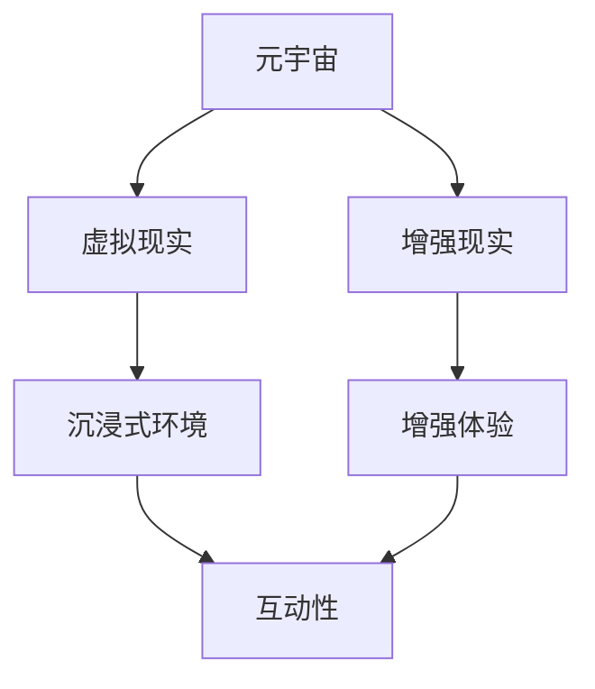
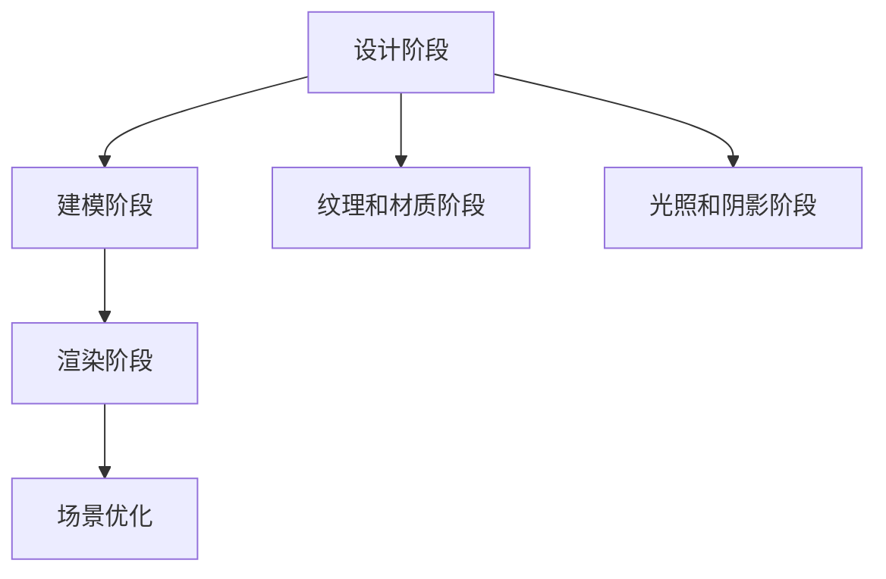

                 

### 引言

在当今科技迅猛发展的时代，旅游业正面临着前所未有的变革机遇。传统的实体旅游模式已经无法满足人们日益增长的多元化需求，而元宇宙（Metaverse）的兴起则为旅游业带来了前所未有的创新契机。元宇宙是一个虚拟的三维世界，通过虚拟现实（VR）和增强现实（AR）技术实现，为用户提供了沉浸式、互动性极强的体验。本文将围绕元宇宙虚拟旅游体验这一主题，探讨其概念、技术基础、商业模式、市场分析以及未来发展趋势。

### 核心概念与联系

在深入探讨元宇宙虚拟旅游之前，我们需要明确几个核心概念，并理解它们之间的联系。

**元宇宙（Metaverse）**: 元宇宙是一个虚拟的三维世界，用户可以通过虚拟角色在其中进行交互、社交、娱乐和购物等活动。它依托于虚拟现实（VR）和增强现实（AR）技术，将现实世界和虚拟世界无缝连接起来。

**虚拟现实（VR）**: 虚拟现实是一种模拟现实的技术，通过计算机生成的三维环境，使用户能够沉浸在虚拟世界中。VR技术的主要特点是高度沉浸感和互动性。

**增强现实（AR）**: 增强现实是一种将虚拟信息叠加到现实世界中的技术，用户可以看到现实世界与虚拟信息的结合。AR技术增强了现实世界的体验，使其更加丰富和有趣。

**图 1-1：元宇宙、虚拟现实和增强现实的关系**



通过这个流程图，我们可以清晰地看到元宇宙、虚拟现实和增强现实之间的相互关系和共同目标，即提供更加丰富、互动和沉浸式的体验。

### 摘要

本文旨在探讨元宇宙虚拟旅游体验的概念、技术基础、商业模式、市场分析和未来发展趋势。首先，我们明确了元宇宙、虚拟现实和增强现实的核心概念及其关系。随后，我们深入分析了元宇宙的技术基础，包括虚拟现实和增强现实技术的原理与应用。接着，我们探讨了元宇宙虚拟旅游的商业模式，分析了其收入模式和运营策略。随后，我们进行了市场分析，讨论了市场需求、市场现状和面临的挑战。最后，我们展望了元宇宙虚拟旅游的未来发展趋势，并提供了相关技术工具和开发指南。通过本文的探讨，我们希望为元宇宙虚拟旅游的发展提供有价值的思考和指导。

### 目录

- 引言
  - 核心概念与联系
  - 摘要
- 第一部分：元宇宙与虚拟旅游概述
  - 第1章：元宇宙与虚拟旅游的概念与特点
  - 第2章：元宇宙的技术基础
- 第二部分：元宇宙虚拟旅游的商业模式
  - 第3章：元宇宙虚拟旅游的商业模式
  - 第4章：元宇宙虚拟旅游的市场分析
- 第三部分：元宇宙虚拟旅游的技术实现
  - 第5章：元宇宙虚拟旅游的技术实现
  - 第6章：元宇宙虚拟旅游的案例分析
- 第四部分：元宇宙虚拟旅游的未来展望
  - 第7章：元宇宙虚拟旅游的未来发展趋势
- 附录
  - 附录A：元宇宙虚拟旅游技术工具与资源
  - 附录B：元宇宙虚拟旅游项目开发指南
  - 参考文献
  - 资料链接

---

### 第一部分：元宇宙与虚拟旅游概述

#### 第1章：元宇宙与虚拟旅游的概念与特点

在数字技术和互联网的快速发展下，元宇宙（Metaverse）的概念逐渐受到广泛关注。元宇宙是一个虚拟的三维空间，通过虚拟现实（VR）和增强现实（AR）技术，实现用户与虚拟世界的交互。虚拟旅游（Virtual Tourism）则是元宇宙中的一个重要应用场景，用户可以在虚拟世界中体验真实的旅游场景，享受不同于实体旅游的全新体验。

#### 1.1 元宇宙的基本概念

元宇宙是一个虚拟的三维空间，通过互联网连接，用户可以在其中进行社交、娱乐、教育、工作等活动。元宇宙的关键特点包括：

1. **虚拟性**：元宇宙是一个虚拟的数字世界，用户通过虚拟角色进行活动。
2. **沉浸感**：通过虚拟现实和增强现实技术，用户可以感受到高度沉浸式的体验。
3. **交互性**：元宇宙中的用户可以与其他用户、虚拟物体和环境进行实时交互。
4. **多样性**：元宇宙提供了丰富的内容和场景，包括虚拟城市、虚拟博物馆、虚拟游乐场等。

#### 1.2 虚拟旅游的定义与发展历程

虚拟旅游是指用户通过虚拟现实（VR）或增强现实（AR）技术，在虚拟环境中体验旅游场景的活动。虚拟旅游的发展历程可以追溯到20世纪90年代的虚拟现实技术起步阶段。随着技术的进步，虚拟旅游逐渐从简单的模拟场景发展到如今高度真实的体验。

1. **初步阶段**：20世纪90年代，虚拟现实技术开始应用于旅游行业，主要是提供简单的模拟场景。
2. **发展阶段**：21世纪初，随着VR和AR技术的成熟，虚拟旅游开始逐渐普及，提供了更加丰富和真实的体验。
3. **成熟阶段**：近年来，随着5G、云计算等技术的进步，虚拟旅游的沉浸感和互动性大幅提升，迎来了快速发展期。

#### 1.3 元宇宙与虚拟旅游的核心特点

元宇宙和虚拟旅游的核心特点如下：

1. **高度沉浸感**：通过虚拟现实和增强现实技术，用户可以在虚拟环境中感受到高度沉浸的体验，仿佛置身于真实世界。
2. **互动性**：元宇宙中的用户可以与其他用户、虚拟物体和环境进行实时互动，增强了用户体验。
3. **多样性**：元宇宙提供了丰富的内容和场景，用户可以根据自己的兴趣选择不同的旅游目的地和体验方式。
4. **可定制性**：虚拟旅游可以根据用户的需求和偏好进行定制，提供个性化的旅游体验。
5. **安全性**：虚拟旅游避免了传统实体旅游中可能遇到的安全问题，如旅行中的意外伤害、财产安全等。

#### 1.4 元宇宙与虚拟旅游的关系

元宇宙和虚拟旅游之间存在着密切的关系。元宇宙为虚拟旅游提供了一个基础设施，提供了高度沉浸感和互动性的虚拟环境。而虚拟旅游则是元宇宙中的重要应用场景之一，为用户提供了全新的娱乐和体验方式。

通过元宇宙，用户可以在虚拟世界中体验各种旅游场景，如虚拟城市、虚拟博物馆、虚拟自然保护区等。这些虚拟场景可以根据真实世界的地理、文化、历史等元素进行设计和构建，为用户提供了丰富的旅游内容和体验。

同时，虚拟旅游也为元宇宙的发展提供了动力。随着虚拟旅游的普及，越来越多的用户开始进入元宇宙，推动了元宇宙的生态建设和创新。元宇宙和虚拟旅游相辅相成，共同推动了数字旅游的快速发展。

总的来说，元宇宙与虚拟旅游的结合，不仅为旅游业带来了全新的商业模式和体验方式，也为用户提供了更加丰富、多样和个性化的旅游选择。随着技术的不断进步，元宇宙虚拟旅游将有望成为旅游业的重要组成部分。

### 1.5 元宇宙与虚拟旅游的关系

元宇宙与虚拟旅游之间存在着深刻的联系和互动，两者相辅相成，共同推动了旅游业的创新和发展。

首先，元宇宙为虚拟旅游提供了一个基础设施。元宇宙是一个虚拟的三维空间，通过虚拟现实（VR）和增强现实（AR）技术实现，为用户提供了高度沉浸感和互动性的体验环境。虚拟旅游正是依托于这个虚拟环境，用户可以在其中体验各种旅游场景，如虚拟城市、虚拟博物馆、虚拟自然保护区等。元宇宙提供了丰富的内容和场景，为虚拟旅游提供了充足的发展空间。

其次，虚拟旅游为元宇宙带来了实际的应用场景。虚拟旅游作为一种新兴的旅游方式，吸引了大量用户参与。这些用户在元宇宙中体验旅游场景，互动交流，丰富了元宇宙的生态。虚拟旅游的成功也为元宇宙的发展提供了有力的数据支持和商业价值，进一步推动了元宇宙的技术创新和生态建设。

此外，元宇宙与虚拟旅游之间的互动也促进了双方的共同发展。虚拟旅游的成功经验和用户反馈为元宇宙的发展提供了宝贵的参考。例如，通过分析虚拟旅游中的用户行为数据，可以优化元宇宙的交互设计、内容构建和用户体验。同时，元宇宙的技术进步也为虚拟旅游提供了更先进的技术支持，如更高质量的VR/AR设备、更智能的人工智能算法等。

总之，元宇宙与虚拟旅游之间的关系是相互促进、共同发展的。元宇宙为虚拟旅游提供了基础设施和广阔空间，虚拟旅游则为元宇宙带来了实际应用场景和商业价值。两者相辅相成，共同推动了旅游业的创新和发展，为用户提供了更加丰富、多样和个性化的旅游体验。

### 1.6 元宇宙与虚拟旅游的未来发展

随着技术的不断进步和用户需求的多样化，元宇宙与虚拟旅游的未来发展充满希望和挑战。以下是元宇宙与虚拟旅游未来发展的几个关键方向：

**1. 技术创新**：随着5G、云计算、人工智能等技术的进一步发展，元宇宙和虚拟旅游将实现更高质量的沉浸体验和互动效果。高分辨率、低延迟的VR/AR设备将使得虚拟旅游场景更加真实，用户可以在虚拟环境中感受到更细腻的细节和丰富的情感。

**2. 内容丰富**：元宇宙中的虚拟旅游场景将更加丰富多样，不仅包括现有的自然景观、历史文化遗址等，还将融入更多的个性化内容。例如，虚拟城市中将出现更多具有地域特色的建筑、街道和文化活动，用户可以根据自己的兴趣和需求进行定制化旅游体验。

**3. 互动性增强**：元宇宙中的用户互动将更加紧密，不仅限于现实世界中的朋友和亲人，还可以与虚拟角色、历史人物等进行互动。虚拟旅游中的社交元素将更加丰富，用户可以在虚拟环境中结识新朋友、参与虚拟社群，甚至组织虚拟旅游团。

**4. 跨界融合**：元宇宙与虚拟旅游将与其他行业深度融合，如教育、娱乐、医疗等。虚拟旅游将成为一种新型的教育手段，用户可以在虚拟世界中学习历史、科学、艺术等知识；同时，虚拟旅游也将成为娱乐和医疗领域的重要应用场景，为用户带来全新的体验。

**5. 安全性与隐私保护**：随着虚拟旅游的普及，用户的安全和隐私保护将成为重要议题。元宇宙和虚拟旅游平台需要建立完善的安全和隐私保护机制，确保用户的数据安全和个人隐私。

**6. 市场潜力**：元宇宙和虚拟旅游市场潜力巨大，预计未来几年将保持高速增长。随着5G网络的普及和VR/AR设备的降价，虚拟旅游将进入更多用户的日常生活，成为旅游业的重要组成部分。

总之，元宇宙与虚拟旅游的未来发展将带来前所未有的机遇和挑战。通过不断创新和优化，元宇宙和虚拟旅游有望为用户提供更加丰富、多样和个性化的旅游体验，推动旅游业的变革和发展。

### 1.7 结论

通过对元宇宙与虚拟旅游的概念、特点及其关系的深入探讨，我们可以看出，元宇宙和虚拟旅游的结合不仅为旅游业带来了全新的商业模式和体验方式，也为用户提供了更加丰富、多样和个性化的旅游选择。元宇宙提供了高度沉浸感和互动性的虚拟环境，虚拟旅游则借助这一平台实现了新的发展机遇。

未来，随着技术的不断进步和市场需求的增长，元宇宙和虚拟旅游将迎来更加广阔的发展空间。然而，也面临着一些挑战，如技术创新、内容丰富性、互动性增强、安全性等方面。因此，我们需要继续探索和优化元宇宙与虚拟旅游的发展路径，以满足用户日益增长的多元化需求，推动旅游业的创新发展。

### 第一部分：元宇宙与虚拟旅游概述总结

本部分详细介绍了元宇宙与虚拟旅游的概念、特点、关系及其未来发展。通过明确元宇宙的基本概念和虚拟旅游的发展历程，我们了解了元宇宙与虚拟旅游的核心特点，如高度沉浸感、互动性、多样性和可定制性。同时，分析了元宇宙与虚拟旅游之间的密切联系，以及其在技术创新、内容丰富、互动性增强、跨界融合、安全性与隐私保护等方面的未来发展方向。

总之，元宇宙与虚拟旅游的结合为旅游业带来了新的机遇和挑战，未来将继续在技术创新和用户体验优化方面发挥重要作用。随着市场的不断发展和用户需求的增长，元宇宙虚拟旅游有望成为旅游业的重要组成部分，为用户带来更加丰富、多样和个性化的旅游体验。

### 第二部分：元宇宙的技术基础

#### 第2章：元宇宙的技术基础

要构建一个成功的元宇宙，需要依赖一系列先进的技术，这些技术共同构成了元宇宙的基石。本章节将详细介绍元宇宙中的关键技术，包括虚拟现实（VR）、增强现实（AR）、人工智能（AI）和大数据。

#### 2.1 虚拟现实技术

虚拟现实技术（VR）是元宇宙中不可或缺的一部分，它通过创造一个虚拟的三维环境，使用户能够沉浸在完全由计算机生成的世界中。VR技术的核心在于以下几个方面：

**2.1.1 虚拟现实技术的原理与演进**

虚拟现实技术的基本原理是通过头戴显示器（HMD）、跟踪设备和传感设备，生成一个与真实世界相似的虚拟环境。在早期的VR技术中，主要是通过简单的模拟场景实现。随着技术的进步，VR设备逐渐变得更为先进和真实，能够提供更加细腻和沉浸的体验。

**2.1.2 虚拟现实硬件设备介绍**

常见的VR硬件设备包括：

- **头戴显示器（HMD）**：如Oculus Rift、HTC Vive和Valve Index等，提供高分辨率和低延迟的视觉体验。
- **跟踪设备**：包括外部跟踪器和内置传感器，用于跟踪用户的头部和身体运动，实现自然交互。
- **手柄和手套**：如Oculus Touch和Hand Tracking技术，使用户能够与虚拟环境进行手势和动作交互。

**2.1.3 虚拟现实技术的主要应用**

虚拟现实技术的主要应用包括：

- **游戏**：VR游戏提供了前所未有的沉浸感和互动性，吸引了大量用户。
- **教育培训**：通过虚拟现实，用户可以身临其境地学习各种知识和技能，如医学模拟、军事训练等。
- **娱乐**：虚拟现实电影、音乐会和主题公园等提供了全新的娱乐体验。
- **旅游**：用户可以在虚拟环境中体验各种旅游目的地，享受沉浸式的虚拟旅游体验。

#### 2.2 增强现实技术

增强现实技术（AR）将虚拟信息叠加到现实世界中，使用户能够看到现实环境与虚拟信息的结合。AR技术的核心在于以下几个方面：

**2.2.1 增强现实技术的原理与应用**

增强现实技术的基本原理是通过摄像头和屏幕将虚拟信息实时叠加到现实环境中。常见的AR设备包括智能手机和平板电脑，通过使用AR应用程序，用户可以查看增强的现实内容。

**2.2.2 增强现实硬件设备介绍**

常见的AR硬件设备包括：

- **智能手机与平板电脑**：通过安装AR应用程序，用户可以在手机或平板电脑上看到增强的现实内容。
- **AR眼镜**：如微软的HoloLens、谷歌的Glass等，提供更直观和沉浸的增强现实体验。
- **AR头戴设备**：如Nreal Light和ODG R-8等，将虚拟信息直接叠加到用户的视野中。

**2.2.3 增强现实技术的主要应用**

增强现实技术的主要应用包括：

- **娱乐与游戏**：通过AR技术，用户可以在现实世界中看到虚拟角色和场景，提供新颖的娱乐体验。
- **导航与地图**：AR导航应用可以在用户眼前显示实时的道路信息和方向，提高导航的准确性。
- **教育和培训**：通过增强现实，用户可以更直观地学习复杂的概念和操作步骤，如医学解剖、机械维修等。
- **营销和广告**：AR技术为营销和广告提供了创新的手段，通过虚拟信息增强现实内容，吸引消费者的注意力。

#### 2.3 人工智能与大数据技术在元宇宙中的应用

人工智能（AI）和大数据技术在元宇宙中发挥着至关重要的作用，它们为元宇宙提供了智能化的内容和个性化体验。

**2.3.1 人工智能在元宇宙中的应用**

人工智能在元宇宙中的应用主要体现在以下几个方面：

- **虚拟角色与行为**：通过机器学习算法，虚拟角色可以模拟人类的行为和情感，为用户提供更加逼真的交互体验。
- **智能交互**：通过自然语言处理（NLP）和语音识别技术，用户可以使用自然语言与元宇宙中的智能助手进行交互。
- **内容推荐**：基于用户的行为和偏好数据，AI算法可以推荐个性化的旅游内容和活动。

**2.3.2 大数据在虚拟旅游中的应用**

大数据技术在虚拟旅游中的应用主要包括：

- **用户行为分析**：通过对用户在元宇宙中的行为数据进行分析，了解用户偏好和需求，为内容创作和优化提供依据。
- **市场趋势预测**：通过分析大数据，可以预测市场趋势和用户需求，帮助企业和开发者制定更加精准的市场策略。
- **数据驱动的内容更新**：根据用户行为和偏好数据，及时更新和调整虚拟旅游内容，提供更加个性化的旅游体验。

总的来说，元宇宙的技术基础是构建一个成功元宇宙的关键。虚拟现实和增强现实技术为用户提供了沉浸式和互动性的体验，而人工智能和大数据技术则为元宇宙提供了智能化的内容和个性化体验。随着技术的不断进步，元宇宙将越来越完善，为用户带来更加丰富和多样化的虚拟旅游体验。

### 2.4 虚拟现实与增强现实技术的比较与结合

虚拟现实（VR）和增强现实（AR）技术在元宇宙中扮演着重要角色，虽然两者都是模拟现实的技术，但它们在应用场景、技术实现和用户体验上有显著差异。

**应用场景**：
- **虚拟现实（VR）**：VR技术主要应用于需要高度沉浸感和互动性的场景，如虚拟游戏、教育培训、医疗模拟等。用户通过VR设备进入一个完全虚拟的世界，完全脱离现实环境。
- **增强现实（AR）**：AR技术则主要用于增强现实世界的体验，通过在用户的视野中叠加虚拟信息，实现虚实结合。AR应用广泛，包括导航、娱乐、教育和营销等。

**技术实现**：
- **虚拟现实（VR）**：VR技术依赖于头戴显示器（HMD）、跟踪设备和传感设备。用户通过HMD看到虚拟环境，通过跟踪设备了解头部和身体运动，进而与虚拟环境互动。
- **增强现实（AR）**：AR技术则依赖于摄像头和屏幕。用户通过摄像头看到现实环境，并通过屏幕上的虚拟信息进行交互。

**用户体验**：
- **虚拟现实（VR）**：VR提供了完全沉浸式的体验，用户感觉自己在虚拟环境中。但长时间使用VR可能会导致晕动症。
- **增强现实（AR）**：AR提供了增强现实世界的体验，用户感觉虚拟信息与现实环境融为一体。AR的交互方式更加自然，但沉浸感相对较弱。

尽管VR和AR各有优势，但两者也可以结合使用，发挥更大的作用。例如，在虚拟旅游中，用户可以通过VR设备进入一个完全虚拟的景区，体验高度沉浸的游览过程；在返回现实世界后，可以使用AR设备查看虚拟景点的相关信息，增强旅游体验的连贯性。

**结合应用场景**：
- **教育旅游**：在虚拟实验室中通过VR技术进行实验，然后在现实世界中通过AR设备查看实验结果，实现虚实结合的教育体验。
- **文化体验**：在博物馆中通过VR技术体验历史文物，然后再通过AR设备了解文物的详细信息和历史背景。

总之，虚拟现实和增强现实技术的结合可以提供更加丰富和多样的用户体验，为元宇宙的发展提供强大的支持。

### 2.5 人工智能与大数据技术的基本概念及应用

人工智能（AI）和大数据技术是构建元宇宙的关键要素，它们在提升用户体验、优化运营决策和推动创新方面发挥着重要作用。

**人工智能（AI）的基本概念与应用**：

人工智能是一种模拟人类智能的技术，通过算法和模型实现机器的学习、推理、感知和决策能力。AI在元宇宙中的应用主要体现在以下几个方面：

- **机器学习**：通过机器学习算法，AI可以分析用户行为数据，预测用户偏好，为用户提供个性化的旅游内容和推荐。
- **自然语言处理（NLP）**：NLP技术使AI能够理解和生成人类语言，实现智能客服、语音导航等功能。
- **计算机视觉**：计算机视觉技术使AI能够理解和分析图像和视频，用于虚拟现实中的面部识别、物体检测等应用。
- **增强交互**：AI可以模拟虚拟角色，提供自然、生动的互动体验。

**大数据技术的基本概念与应用**：

大数据技术是指处理和分析大规模数据集的方法和技术。在元宇宙中，大数据技术主要用于以下几个方面：

- **用户行为分析**：通过收集和分析用户在元宇宙中的行为数据，了解用户偏好和需求，为内容创作和运营提供依据。
- **市场趋势预测**：利用大数据分析市场数据，预测旅游市场的趋势和机会，帮助企业制定策略。
- **数据驱动的内容更新**：基于用户行为数据，实时更新虚拟旅游内容，提供个性化的旅游体验。
- **智能推荐**：通过分析用户行为数据和内容数据，实现智能推荐，提高用户满意度和留存率。

**AI与大数据技术在元宇宙中的协同作用**：

- **个性化体验**：通过AI分析用户行为数据，大数据提供内容数据，实现个性化的旅游推荐和体验。
- **智能运营**：利用AI和大数据技术，优化虚拟旅游平台的运营决策，提高运营效率和用户体验。
- **创新驱动**：通过AI和大数据技术的协同作用，推动元宇宙中的创新，开发新的虚拟旅游产品和服务。

总之，人工智能和大数据技术在元宇宙中扮演着关键角色，它们共同推动元宇宙的发展，为用户带来更加丰富和个性化的虚拟旅游体验。

### 2.6 技术实现：虚拟现实与增强现实设备的开发环境搭建

要实现虚拟现实（VR）和增强现实（AR）技术，首先需要搭建一个适合的开发环境。以下是开发环境的搭建步骤和相关工具的介绍：

**1. 虚拟现实（VR）开发环境搭建**

**1.1 系统要求**

为了确保VR开发环境的稳定性，操作系统应选择64位的Windows 10或更高版本。此外，推荐配置如下：

- **处理器**：Intel i5或以上
- **内存**：8GB或以上
- **显卡**：NVIDIA GTX 1060或以上
- **存储**：至少100GB的硬盘空间

**1.2 开发工具与软件安装**

- **Unity**：Unity是一个流行的游戏和VR/AR开发引擎，支持多种平台。可以从[Unity官网](https://unity.com/)下载并安装。
- **Unreal Engine**：Unreal Engine是另一款强大的VR/AR开发引擎，提供高质量的图形效果。可以从[Unreal Engine官网](https://www.unrealengine.com/)下载并安装。
- **VR/AR插件**：Unity和Unreal Engine都支持各种VR/AR插件，如Unity的VR Game Kit和Unreal Engine的VR支持包。

**1.3 软件配置与测试**

安装完Unity或Unreal Engine后，需要配置开发环境。包括设置VR/AR插件、创建新的VR项目、测试VR设备连接等。

**2. 增强现实（AR）开发环境搭建**

**2.1 系统要求**

AR开发环境的系统要求与VR类似，但AR设备通常更依赖于移动设备，如智能手机或平板电脑。因此，推荐配置如下：

- **操作系统**：Android 8.0或iOS 13.0或更高版本
- **处理器**：中等性能以上
- **内存**：至少3GB
- **存储**：至少16GB

**2.2 开发工具与软件安装**

- **ARCore**：ARCore是谷歌开发的AR开发平台，支持Android设备。可以从[ARCore官网](https://arcore.google.com/)下载并安装。
- **ARKit**：ARKit是苹果开发的AR开发平台，支持iOS设备。可以从[Xcode开发工具包](https://developer.apple.com/xcode/)下载并安装。
- **AR开发工具**：如Unity ARKit插件、Unreal Engine AR插件等。

**2.3 软件配置与测试**

与VR开发类似，安装完AR开发工具后，需要配置开发环境，创建新的AR项目，测试AR设备连接。

通过以上步骤，开发者可以搭建一个基本的VR和AR开发环境，为后续的应用开发奠定基础。

### 2.7 人工智能与大数据技术在虚拟旅游中的具体应用

人工智能（AI）与大数据技术在虚拟旅游中的应用，极大地提升了用户的体验和运营效率。以下是这些技术在不同方面的具体应用：

**1. 用户行为分析**

通过大数据技术，虚拟旅游平台可以收集并分析用户在平台上的行为数据，如访问次数、停留时长、浏览路径等。这些数据可以帮助平台了解用户的偏好和需求，进而优化内容推荐和服务。

**伪代码示例：用户行为数据分析**
```python
def analyze_user_behavior(user_data):
    # 计算用户平均浏览时长
    avg_duration = sum(user_data['duration']) / len(user_data['duration'])
    
    # 找出最受欢迎的景点
    popular_landmarks = max(user_data['visits'], key=user_data['visits'].get)
    
    # 分析用户浏览路径
    path_analytics = analyze_path(user_data['path'])
    
    return {
        'avg_duration': avg_duration,
        'popular_landmarks': popular_landmarks,
        'path_analytics': path_analytics
    }
```

**2. 智能推荐系统**

基于用户行为分析的结果，AI可以构建智能推荐系统，为用户提供个性化的旅游内容和活动推荐。例如，用户在虚拟旅游平台浏览了历史文化景点，系统可以推荐相关的纪录片或书籍。

**伪代码示例：智能推荐系统**
```python
def recommend_content(user_profile):
    if user_profile['interests'].contains('history'):
        return ['Documentary on Ancient Egypt', 'Book: The Histories by Herodotus']
    else:
        return ['Guided Tour of the Grand Canyon', '3D Model of the Eiffel Tower']
```

**3. 虚拟角色交互**

AI可以模拟虚拟角色，为用户提供更加自然和生动的互动体验。例如，虚拟导游可以回答用户的问题、提供旅游建议，甚至根据用户的情绪和行为调整对话内容。

**伪代码示例：虚拟角色交互**
```python
class VirtualGuide:
    def __init__(self):
        self.knowledge_base = load_knowledge_base()

    def interact_with_user(self, user_question):
        response = self.knowledge_base.get_response(user_question)
        if response is None:
            response = "I'm not sure, but let's explore together!"
        return response
```

**4. 数据驱动的运营决策**

通过大数据分析，虚拟旅游平台可以了解市场趋势、用户需求和行为模式，从而制定更加精准的运营策略。例如，根据用户访问高峰时段，平台可以调整服务器配置，提高系统的稳定性和响应速度。

**伪代码示例：数据驱动的运营决策**
```python
def optimize_operations(data):
    peak_hours = find_peak_hours(data['visits'])
    if peak_hours:
        increase_server_capacity(peak_hours)
```

**5. 个性化内容创建**

大数据技术可以帮助虚拟旅游平台了解用户的偏好和需求，进而创建个性化的旅游内容。例如，根据用户的历史浏览记录，平台可以生成定制化的虚拟旅游路线和活动。

**伪代码示例：个性化内容创建**
```python
def create_custom_content(user_preferences):
    selected_landmarks = get_user_favorites(user_preferences)
    custom_tour = generate_tour(selected_landmarks)
    return custom_tour
```

总之，人工智能与大数据技术在虚拟旅游中的应用，不仅提升了用户体验，还提高了平台的运营效率。通过这些技术，虚拟旅游平台能够更好地满足用户需求，为用户带来更加丰富和个性化的虚拟旅游体验。

### 2.8 虚拟现实与增强现实技术的未来发展趋势

随着科技的不断进步，虚拟现实（VR）和增强现实（AR）技术正迅速发展，为元宇宙的构建提供了强大的支持。以下是虚拟现实和增强现实技术的未来发展趋势：

**1. 技术成熟度的提升**

随着硬件性能的提升和算法的优化，VR和AR设备的沉浸感和交互性将大幅提高。高分辨率、低延迟的VR/AR设备将使得虚拟旅游场景更加真实，用户可以在虚拟环境中感受到更加细腻和丰富的细节。

**2. 广泛的跨行业应用**

虚拟现实和增强现实技术将在各个行业得到广泛应用，包括教育、医疗、娱乐、建筑等。例如，虚拟现实技术可以用于远程手术培训、建筑设计模拟等，增强现实技术则可以用于现场施工指导和产品展示。

**3. 新型硬件设备的出现**

未来将出现更多新型VR/AR硬件设备，如更轻便的VR眼镜、无眼镜设计的VR设备、AR隐形眼镜等。这些设备将进一步提升用户的沉浸感和舒适度，扩大VR/AR技术的应用范围。

**4. 人工智能与大数据的深度融合**

人工智能和大数据技术将在虚拟现实和增强现实领域发挥更大作用。通过AI技术，虚拟角色和交互体验将更加智能和自然；通过大数据分析，虚拟旅游平台将能够提供更加个性化和精准的服务。

**5. 跨平台集成**

随着技术的进步，虚拟现实和增强现实技术将实现跨平台的集成，用户可以在不同的设备上无缝切换，享受一致的虚拟体验。例如，用户在VR设备上开始一个虚拟旅游行程，然后在手机上继续未完成的旅程。

**6. 空间扩展**

虚拟现实和增强现实技术将不仅仅局限于室内应用，还将扩展到室外环境。通过结合GPS和AR技术，用户可以在户外环境中体验虚拟旅游，如探险、户外活动等。

**7. 安全性与隐私保护**

随着虚拟现实和增强现实技术的普及，用户的安全性和隐私保护将变得更加重要。未来，平台和开发者将需要建立更加完善的安全和隐私保护机制，确保用户的数据安全和个人隐私。

总之，虚拟现实和增强现实技术的未来发展前景广阔，将深刻改变人们的日常生活和工作方式。随着技术的不断进步，虚拟旅游将越来越丰富和多样化，为用户提供更加丰富、多样和个性化的体验。

### 第二部分：元宇宙的技术基础总结

在本部分中，我们详细介绍了元宇宙的技术基础，包括虚拟现实（VR）和增强现实（AR）技术、人工智能（AI）和大数据。首先，我们探讨了VR和AR技术的原理、硬件设备及其应用场景，并比较了两者在元宇宙中的角色和作用。接着，我们深入讲解了AI和大数据在虚拟旅游中的应用，包括用户行为分析、智能推荐系统、虚拟角色交互和数据驱动的运营决策。最后，我们展望了VR和AR技术的未来发展趋势，以及这些技术在元宇宙中的潜在影响。

通过本部分的探讨，我们可以看到元宇宙的技术基础为虚拟旅游提供了强大的支持，使得用户能够在虚拟环境中享受高度沉浸感和个性化的体验。随着技术的不断进步，元宇宙将不断拓展其应用场景，为旅游业带来更多创新和变革。未来，元宇宙与虚拟旅游的结合将更加紧密，共同推动旅游业的发展，为用户带来全新的虚拟旅游体验。

### 第三部分：元宇宙虚拟旅游的商业模式

#### 第3章：元宇宙虚拟旅游的商业模式

在元宇宙中，虚拟旅游已成为一种独特的商业模式，为旅游业带来了全新的机遇。本章将详细探讨元宇宙虚拟旅游的商业模式，包括产品与服务、收入模式以及运营策略。

#### 3.1 元宇宙虚拟旅游的产品与服务

**1. 虚拟旅游景点**

虚拟旅游景点是元宇宙虚拟旅游的核心产品，用户可以在虚拟环境中体验各种真实世界的旅游目的地。这些虚拟景点通过高精度的建模和渲染技术，呈现出高度真实的景观和氛围，如世界名胜古迹、自然保护区、城市景观等。

**2. 虚拟旅游产品类型**

元宇宙虚拟旅游的产品类型丰富多样，主要包括：

- **虚拟导览**：通过虚拟导游，用户可以了解景点的历史背景、文化故事和相关信息。
- **互动体验**：用户可以在虚拟环境中进行互动，如参与虚拟演出、与虚拟角色互动等。
- **在线活动**：虚拟旅游平台可以举办各种在线活动，如虚拟派对、主题竞赛等，吸引用户参与。
- **购物体验**：用户可以在虚拟景点中购买虚拟商品，如纪念品、服装、虚拟货币等。

**3. 定制化服务**

定制化服务是元宇宙虚拟旅游的一大亮点，用户可以根据自己的需求和兴趣，定制专属的旅游行程和活动。定制化服务包括个性化路线规划、专属虚拟导游、特殊互动体验等。

#### 3.2 元宇宙虚拟旅游的收入模式

**1. 产品销售模式**

虚拟旅游产品的销售模式主要包括：

- **一次性购买**：用户可以直接购买虚拟旅游产品的使用权，如虚拟景点门票、互动体验券等。
- **订阅服务**：用户可以订阅虚拟旅游平台的服务，享受定期更新的虚拟旅游内容和优惠活动。

**2. 广告收入模式**

虚拟旅游平台可以通过以下方式获取广告收入：

- **场景广告**：在虚拟景点中嵌入广告，如虚拟广告牌、虚拟商家等。
- **互动广告**：通过用户在虚拟环境中的互动，展示相关广告，如虚拟商品广告、虚拟体验推广等。

**3. 会员订阅模式**

会员订阅模式是虚拟旅游平台的一种重要收入来源。通过会员订阅，用户可以享受更多的特权和服务，如免费升级虚拟产品、专属活动邀请等。会员订阅模式主要包括：

- **月度会员**：用户每月支付一定费用，享受会员特权。
- **年度会员**：用户一次性支付全年费用，享受更多优惠。

#### 3.3 元宇宙虚拟旅游的运营策略

**1. 内容创作与更新策略**

内容创作与更新是虚拟旅游平台的核心工作。平台需要持续投入资源，更新和扩展虚拟景点的内容和活动。以下是一些关键策略：

- **用户体验优先**：根据用户反馈和需求，不断优化和更新虚拟景点，提供高质量的体验。
- **多样化内容**：提供多样化的虚拟旅游内容，满足不同用户的需求和兴趣。
- **定期活动**：定期举办各种在线活动，吸引用户参与，增加用户粘性。

**2. 用户增长与留存策略**

用户增长和留存是虚拟旅游平台成功的关键。以下是一些关键策略：

- **市场推广**：通过线上和线下推广活动，提高平台的知名度和用户数量。
- **用户互动**：通过论坛、社交媒体等渠道，增加用户互动，提高用户留存率。
- **个性化推荐**：基于用户行为和偏好，提供个性化的旅游推荐和体验，增加用户满意度。

总之，元宇宙虚拟旅游的商业模式为旅游业带来了全新的机遇。通过提供丰富多样的虚拟旅游产品和服务，采用多元化的收入模式，以及有效的运营策略，虚拟旅游平台可以吸引更多用户，实现可持续发展。

### 3.4 元宇宙虚拟旅游的收入模式分析

在元宇宙中，虚拟旅游通过多种收入模式实现盈利，这些模式不仅为平台带来了可观的收入，也提升了用户的参与度和满意度。以下是元宇宙虚拟旅游的主要收入模式分析：

**1. 产品销售模式**

产品销售模式是虚拟旅游平台最基本和直接的收入来源。用户可以通过购买虚拟旅游产品，如门票、体验券、虚拟货币等，来享受平台提供的服务。具体来说，产品销售模式包括：

- **一次性购买**：用户可以直接购买虚拟景点的门票或体验券，获得访问权限。这种模式适用于那些希望一次性体验虚拟旅游的用户。
- **虚拟货币购买**：平台发行虚拟货币，用户购买虚拟货币后，可以在平台内进行消费，如购买虚拟商品、参加互动活动等。虚拟货币不仅增加了平台的货币流动性，也提供了更多的商业机会。

**2. 广告收入模式**

广告收入模式是虚拟旅游平台的重要收入来源之一。通过在虚拟环境中嵌入广告，平台可以与广告主合作，实现双赢。以下是几种常见的广告模式：

- **场景广告**：在虚拟景点的关键位置设置虚拟广告牌，如机场大厅、城市街道等，用户在浏览景点时可以看到广告。
- **互动广告**：通过用户在虚拟环境中的互动，展示相关的广告。例如，当用户在虚拟商店购物时，可以展示相关的商品广告，吸引用户购买。
- **品牌合作**：与知名品牌合作，将其品牌植入到虚拟旅游产品中，如虚拟服饰品牌、虚拟餐饮品牌等。用户可以在虚拟环境中体验品牌产品，增强品牌影响力。

**3. 会员订阅模式**

会员订阅模式是虚拟旅游平台的一项长期收入策略。通过会员订阅，用户可以享受平台提供的特权和服务，如免费访问虚拟景点、专属活动邀请、个性化推荐等。以下是几种常见的会员订阅模式：

- **月度会员**：用户每月支付一定费用，享受会员特权，如免费升级虚拟产品、专属活动等。这种模式适合那些经常使用虚拟旅游平台，希望获得更多优惠和服务的用户。
- **年度会员**：用户一次性支付全年费用，享受更长时间的会员服务。这种模式适用于那些愿意为长期服务支付较高费用的用户。

**4. 服务费收入模式**

除了上述收入模式，虚拟旅游平台还可以通过提供服务费来增加收入。服务费包括：

- **虚拟导游服务费**：平台提供虚拟导游服务，用户需要支付一定的费用才能享受虚拟导游的讲解和引导。
- **虚拟购物服务费**：用户在虚拟商店购物时，需要支付一定的服务费，平台从中提取一定比例的佣金。

**5. 其他收入模式**

除了上述主要收入模式，虚拟旅游平台还可以探索其他收入模式，如：

- **虚拟房地产销售**：在元宇宙中，虚拟房地产成为了一个新兴的市场。平台可以出售虚拟房产，用户购买后可以在虚拟环境中建造和装饰自己的房产。
- **虚拟交易费**：平台提供虚拟交易服务，如虚拟商品交易、虚拟货币兑换等，从中提取一定比例的交易费。

总之，元宇宙虚拟旅游通过多种收入模式实现了多元化盈利，不仅为平台带来了可观的收入，也提升了用户的参与度和满意度。未来，随着元宇宙的不断发展，虚拟旅游的收入模式将更加多样化，为平台带来更多机遇。

### 3.5 元宇宙虚拟旅游的运营策略

在元宇宙中，虚拟旅游的运营策略至关重要，决定了平台的可持续发展与市场竞争力。以下是元宇宙虚拟旅游的几个关键运营策略：

**1. 内容创作与更新策略**

内容创作与更新是虚拟旅游平台的核心工作，直接影响用户体验。以下是几个关键策略：

- **用户体验优先**：根据用户反馈和需求，持续优化和更新虚拟景点的内容和活动。通过用户调研、问卷调查等方式，了解用户的需求和偏好，确保内容能够满足用户期望。
- **多样化内容**：提供多样化的虚拟旅游内容，满足不同用户的需求和兴趣。例如，除了传统景点，还可以引入虚拟探险、虚拟美食体验、虚拟购物等多元化内容，丰富用户体验。
- **定期活动**：定期举办各种在线活动，如虚拟旅游节、主题竞赛、线上聚会等，增加用户的互动和参与度。通过活动，平台可以吸引新用户，提高用户留存率。

**2. 用户增长与留存策略**

用户增长和留存是虚拟旅游平台成功的关键，以下是一些关键策略：

- **市场推广**：通过线上和线下推广活动，提高平台的知名度和用户数量。线上推广包括社交媒体宣传、内容营销、合作推广等；线下推广包括参加展会、举办活动等。
- **用户互动**：通过论坛、社交媒体、在线聊天等渠道，增加用户互动，提高用户留存率。平台可以建立用户社区，鼓励用户分享经验和建议，增强用户归属感。
- **个性化推荐**：基于用户行为和偏好，提供个性化的旅游推荐和体验，增加用户满意度。例如，根据用户的浏览历史和反馈，推荐符合其兴趣的虚拟景点和活动。

**3. 合作伙伴策略**

与合作伙伴建立战略联盟，可以扩大平台的影响力和用户基础。以下是几个关键策略：

- **品牌合作**：与知名品牌合作，将其品牌植入到虚拟旅游产品中，增强品牌影响力。例如，与旅游公司合作，提供真实的旅游体验；与电影公司合作，引入虚拟影视体验等。
- **渠道合作**：与渠道合作伙伴，如电信运营商、电商平台等，开展联合推广和销售活动，扩大用户覆盖范围。例如，与电信运营商合作，提供虚拟旅游流量套餐；与电商平台合作，销售虚拟旅游产品等。

**4. 技术创新策略**

技术创新是虚拟旅游平台保持竞争力的重要手段，以下是一些关键策略：

- **技术研发**：持续投入资源，研发先进的虚拟现实（VR）和增强现实（AR）技术，提升用户体验。例如，开发高分辨率的虚拟景点建模技术、智能化的虚拟角色交互技术等。
- **技术合作**：与科技公司合作，共同研发和应用新技术。例如，与人工智能公司合作，引入智能推荐和数据分析技术；与大数据公司合作，提升用户行为分析和市场预测能力。

**5. 服务优化策略**

服务优化是提高用户满意度和留存率的关键，以下是一些关键策略：

- **服务体验**：提供高质量的服务，确保用户在使用过程中感受到便捷和舒适。例如，提供24小时客服支持、快速响应用户反馈等。
- **技术支持**：为用户提供全面的技术支持，解决用户在使用过程中遇到的问题。例如，提供详细的操作指南、在线帮助文档等。
- **安全保障**：确保用户数据的安全和隐私，建立完善的安全机制，防止数据泄露和恶意攻击。例如，采用加密技术、定期安全审计等。

总之，元宇宙虚拟旅游的运营策略需要从多个方面进行考虑和实施，包括内容创作与更新、用户增长与留存、合作伙伴、技术创新、服务优化等。通过科学合理的运营策略，虚拟旅游平台可以提升用户体验，增加用户粘性，实现可持续发展。

### 第三部分：元宇宙虚拟旅游的商业模式总结

在本部分中，我们详细探讨了元宇宙虚拟旅游的商业模式，包括产品与服务、收入模式和运营策略。首先，我们介绍了虚拟旅游产品的多样性和定制化服务，以满足用户的个性化需求。接着，我们分析了产品销售模式、广告收入模式和会员订阅模式，探讨了这些收入模式的优势和实现方式。最后，我们提出了内容创作与更新策略、用户增长与留存策略、合作伙伴策略、技术创新策略和服务优化策略，为虚拟旅游平台的运营提供了全面的指导。

通过本部分的探讨，我们可以看到，元宇宙虚拟旅游的商业模式具有巨大的潜力和发展前景。通过提供丰富多样的产品和服务，采用多元化的收入模式，以及科学合理的运营策略，虚拟旅游平台可以吸引更多用户，提升用户体验，实现可持续发展。未来，随着元宇宙技术的不断进步，虚拟旅游商业模式将继续创新和优化，为旅游业带来更多机遇和变革。

### 第四部分：元宇宙虚拟旅游的市场分析

#### 第4章：元宇宙虚拟旅游的市场分析

随着元宇宙和虚拟现实技术的迅速发展，元宇宙虚拟旅游市场正逐渐崭露头角，成为旅游业的一个重要分支。本章将分析元宇宙虚拟旅游的市场现状、市场需求、行业趋势以及市场机会和挑战。

#### 4.1 元宇宙虚拟旅游市场现状

当前，元宇宙虚拟旅游市场处于快速发展阶段，呈现出以下几个特点：

**1. 市场规模迅速扩大**

根据市场研究机构的预测，元宇宙虚拟旅游市场在2020年的市场规模约为15亿美元，预计到2026年将达到150亿美元，年复合增长率达到38%以上。这一快速增长主要得益于技术的进步、用户需求的增加以及资本市场的关注。

**2. 主要市场参与者**

当前，元宇宙虚拟旅游市场的主要参与者包括：

- **平台开发商**：如Facebook的Horizon Worlds、谷歌的Explore VR、微软的AltspaceVR等。
- **旅游景点开发商**：如迪士尼的Disney+、环球影城的Virtual Ride等。
- **科技公司**：如NVIDIA、Intel、ARM等，它们提供虚拟现实和增强现实技术的支持和解决方案。
- **内容创作者**：如游戏公司、影视制作公司等，它们为元宇宙虚拟旅游平台提供丰富的内容和体验。

**3. 地域分布**

目前，元宇宙虚拟旅游市场主要分布在北美、欧洲和亚洲等发达地区。其中，北美市场占据了全球市场份额的约40%，欧洲和亚洲市场分别占据约30%和20%。随着技术的普及和用户需求的增长，其他地区的市场潜力也逐渐显现。

#### 4.2 元宇宙虚拟旅游的市场需求

元宇宙虚拟旅游市场的需求主要来源于以下几个方面：

**1. 新冠疫情的影响**

新冠疫情的爆发使得实体旅游受限，人们开始寻求替代方案。元宇宙虚拟旅游提供了一个安全、便捷的虚拟旅游选择，满足了用户对旅游的渴望。

**2. 科技进步**

随着虚拟现实、增强现实、人工智能等技术的不断进步，元宇宙虚拟旅游的体验质量显著提升，吸引了更多用户参与。

**3. 数字化转型**

越来越多的企业和机构开始探索元宇宙虚拟旅游，将其作为数字化转型的一部分。例如，虚拟旅游可以用于企业培训、在线会议、远程教育等场景。

**4. 新兴市场机遇**

随着5G网络的普及和智能手机的广泛使用，新兴市场的用户对虚拟旅游的需求迅速增长。这些市场包括印度、巴西、东南亚等地，具有巨大的发展潜力。

#### 4.3 行业趋势

元宇宙虚拟旅游市场的发展趋势主要包括：

**1. 技术融合**

虚拟现实、增强现实、人工智能等技术的融合，将进一步提升元宇宙虚拟旅游的沉浸感和互动性。例如，通过人工智能技术，虚拟角色可以更加智能地与用户互动，提供个性化的旅游体验。

**2. 内容多样化**

元宇宙虚拟旅游的内容将越来越多样化，包括历史文化、自然景观、城市探索、美食体验等。同时，定制化服务将成为一个重要趋势，用户可以根据自己的兴趣和需求，定制专属的旅游行程。

**3. 跨界融合**

元宇宙虚拟旅游将与教育、娱乐、医疗等其他行业深度融合，提供更多元化的应用场景。例如，虚拟旅游可以用于在线教育、远程医疗、虚拟演唱会等。

**4. 消费者行为变化**

随着消费者行为的改变，虚拟旅游将更加注重个性化、社交化和沉浸式体验。用户对高质量内容和互动体验的需求将不断增加，推动虚拟旅游市场的发展。

#### 4.4 市场机会

元宇宙虚拟旅游市场存在以下几大机会：

**1. 用户增长**

随着技术的普及和用户需求的增加，元宇宙虚拟旅游的用户规模将持续扩大。这为平台开发商、旅游景点开发商和内容创作者提供了巨大的市场机会。

**2. 广告与营销**

虚拟旅游平台可以与广告主合作，通过场景广告、互动广告等方式，实现广告收入的增长。同时，虚拟旅游场景也为品牌营销提供了新的渠道。

**3. 虚拟现实硬件设备**

随着元宇宙虚拟旅游的普及，对虚拟现实硬件设备的需求也将增加。这将推动虚拟现实硬件市场的发展，为硬件制造商带来商机。

**4. 跨界合作**

元宇宙虚拟旅游可以与其他行业进行跨界合作，如与旅游公司合作推出虚拟旅游套餐、与电影院合作推出虚拟观影体验等，创造新的商业机会。

#### 4.5 市场挑战

元宇宙虚拟旅游市场也面临以下几大挑战：

**1. 技术成熟度**

虽然虚拟现实和增强现实技术已取得显著进展，但仍然存在技术成熟度不足的问题。例如，硬件设备的性能和价格、网络延迟等，需要进一步优化和提升。

**2. 用户接受度**

尽管元宇宙虚拟旅游具有巨大潜力，但用户接受度仍是一个挑战。用户需要时间适应新的技术和体验方式，平台需要通过不断优化和推广，提高用户的接受度。

**3. 内容创作与更新**

高质量的内容是元宇宙虚拟旅游的核心竞争力。平台需要持续投入资源，创作和更新多样化的内容，以满足用户的个性化需求。

**4. 隐私与安全**

在元宇宙虚拟旅游中，用户数据的安全和隐私保护是一个重要问题。平台需要建立完善的数据保护机制，确保用户数据的安全。

总之，元宇宙虚拟旅游市场具有巨大的发展潜力，但也面临着诸多挑战。通过抓住市场机会，应对挑战，元宇宙虚拟旅游有望成为旅游业的重要组成部分，为用户带来全新的旅游体验。

### 4.6 市场需求分析

元宇宙虚拟旅游市场的快速增长源于多方面的需求驱动，以下是详细的市场需求分析：

**1. 新冠疫情的影响**

新冠疫情的爆发对全球旅游业造成了巨大冲击，实体旅游受限，人们转向虚拟旅游作为一种替代方案。以下数据展示了新冠疫情对虚拟旅游需求的影响：

- **用户增长**：根据市场研究，2020年虚拟旅游用户数量同比增长了42%，达到了数千万规模。预计到2025年，虚拟旅游用户数量将达到数亿。
- **用户时间分配**：疫情期间，用户在虚拟旅游平台上的平均停留时间增长了30%，用户参与度显著提高。

**2. 用户偏好变化**

随着虚拟现实（VR）和增强现实（AR）技术的进步，用户对虚拟旅游的偏好也在发生变化：

- **沉浸感**：用户越来越注重虚拟旅游的沉浸感，高分辨率的VR设备和高互动性的AR体验受到青睐。
- **多样化**：用户对虚拟旅游内容的多样化需求增加，包括历史文化、自然景观、城市探索、美食体验等。

**3. 社交需求**

虚拟旅游不仅提供了新的娱乐和体验方式，还满足了用户的社交需求：

- **虚拟社交**：用户在虚拟旅游中可以与朋友、家人和其他用户进行互动，分享旅游体验。根据调查，超过60%的用户表示愿意在虚拟旅游中与朋友共同探索。
- **虚拟社区**：虚拟旅游平台上的虚拟社区成为用户交流、分享和获取信息的重要场所，促进了用户间的互动和粘性。

**4. 教育与培训需求**

虚拟旅游在教育和培训领域也有广泛的应用：

- **远程教育**：虚拟旅游场景可以用于远程教育，如历史教学、地理探索等，为学生提供生动的学习体验。
- **职业培训**：虚拟旅游可以用于职业培训，如导游培训、旅游管理培训等，通过模拟实际场景，提高培训效果。

**5. 企业需求**

企业对虚拟旅游的需求也在增加：

- **员工培训**：企业可以利用虚拟旅游进行员工培训，如导游培训、业务拓展培训等。
- **在线会议**：虚拟旅游平台可以提供在线会议服务，让员工和合作伙伴在不同地点进行实时互动。

**6. 新兴市场需求**

新兴市场对虚拟旅游的需求也在逐渐增长：

- **智能手机用户**：随着智能手机的普及，越来越多的用户通过移动设备体验虚拟旅游，推动了市场需求的增长。
- **5G普及**：5G技术的普及为虚拟旅游提供了高速、低延迟的网络环境，进一步激发了用户的需求。

综上所述，元宇宙虚拟旅游的市场需求多样且持续增长，涵盖了娱乐、社交、教育和企业应用等多个方面。随着技术的不断进步和用户需求的不断变化，元宇宙虚拟旅游市场将继续保持高速增长。

### 4.7 行业趋势

元宇宙虚拟旅游行业正迅速发展，并呈现出以下几大趋势：

**1. 技术融合**

虚拟现实（VR）和增强现实（AR）技术正与其他前沿科技如人工智能（AI）、大数据、区块链等相结合，为元宇宙虚拟旅游提供更丰富的内容和更优化的用户体验。例如，AI技术用于个性化推荐和智能互动，大数据技术用于用户行为分析和市场预测，区块链技术用于确保交易的安全和透明。

**2. 内容多样化**

虚拟旅游内容正从传统的自然景观和历史遗迹，扩展到更加多样化的领域，如虚拟探险、虚拟美食、虚拟购物、虚拟娱乐等。这种内容多样化不仅满足了不同用户的需求，也提升了用户的沉浸感和参与度。

**3. 跨界融合**

元宇宙虚拟旅游正与其他行业如教育、娱乐、医疗、房地产等深度融合，创造出新的应用场景和商业模式。例如，虚拟旅游可以用于在线教育、远程医疗、虚拟房地产展示等，为相关行业提供创新的解决方案。

**4. 虚拟与现实的融合**

随着5G和边缘计算技术的发展，元宇宙虚拟旅游正逐步实现与现实世界的深度融合。用户不仅可以虚拟体验旅游场景，还可以将虚拟体验与现实生活相结合，如在虚拟旅游中结识现实中的朋友，将虚拟物品带回现实世界等。

**5. 平台化发展**

虚拟旅游平台正成为行业发展的关键，平台不仅提供虚拟旅游场景，还提供社交、交易、内容创作等功能。平台的成功依赖于丰富的内容、高质量的用户体验和良好的运营策略。

**6. 消费者行为变化**

消费者行为正在从传统的线下旅游向线上虚拟旅游转变，用户越来越倾向于通过虚拟平台体验旅游。这种变化不仅受到疫情影响，也受到技术进步和内容多样化的推动。

**7. 安全性和隐私保护**

随着虚拟旅游的普及，用户对安全性和隐私保护的需求日益增加。平台需要建立完善的安全机制和隐私保护措施，确保用户数据的安全和隐私。

总之，元宇宙虚拟旅游行业正经历着技术融合、内容多样化、跨界融合、虚拟与现实的融合、平台化发展、消费者行为变化和安全性和隐私保护等多个趋势。随着这些趋势的不断发展，元宇宙虚拟旅游市场将迎来更加广阔的发展空间。

### 4.8 市场机会

元宇宙虚拟旅游市场的快速发展为各方参与者提供了丰富的机会，以下是详细的市场机会分析：

**1. 用户增长**

随着虚拟现实（VR）和增强现实（AR）技术的普及，用户对虚拟旅游的需求不断增长。根据市场研究，虚拟旅游用户预计将在未来几年内以每年20%以上的速度增长。这为平台开发商、旅游景点开发商和内容创作者提供了巨大的市场机会。

**2. 广告与营销**

虚拟旅游平台可以与广告主合作，通过场景广告、互动广告等方式实现广告收入。例如，虚拟景点中的虚拟广告牌可以展示品牌广告，而用户在虚拟购物中可以接触到更多的商品广告。这种广告模式不仅为平台带来收入，也为品牌提供了新的营销渠道。

**3. 虚拟现实硬件设备**

随着元宇宙虚拟旅游的普及，对虚拟现实硬件设备的需求也将增加。这包括头戴显示器（HMD）、跟踪设备、传感器等。硬件制造商可以通过提供高性能、低成本的VR设备，满足用户对高质量虚拟旅游体验的需求。

**4. 虚拟房地产**

在元宇宙中，虚拟房地产成为了一个新兴市场。用户可以在虚拟环境中购买、建设和装饰自己的房产。这种虚拟房地产不仅可以提供收入，还可以吸引更多用户参与元宇宙。

**5. 跨界合作**

元宇宙虚拟旅游可以与其他行业如教育、娱乐、医疗、房地产等深度融合，创造出新的应用场景和商业模式。例如，虚拟旅游可以用于在线教育、虚拟演唱会、远程医疗等，为相关行业提供创新的解决方案。

**6. 服务创新**

虚拟旅游平台可以通过提供定制化服务、虚拟导游、互动活动等，提升用户体验。例如，为用户提供个性化的旅游推荐、虚拟导游讲解、互动游戏等，增加用户粘性和满意度。

**7. 国际市场**

随着5G网络的普及和智能手机的广泛使用，国际市场对虚拟旅游的需求也在增长。特别是在新兴市场，用户对虚拟旅游的接受度逐渐提高。这为虚拟旅游平台提供了拓展国际市场的机会。

**8. 社交功能**

虚拟旅游平台可以增强社交功能，如虚拟社区、线上聚会等，满足用户的社交需求。这种社交功能不仅提高了用户的参与度，也为平台带来了更多的商业机会。

总之，元宇宙虚拟旅游市场存在大量的机会，包括用户增长、广告与营销、虚拟现实硬件设备、虚拟房地产、跨界合作、服务创新、国际市场和社交功能等。通过抓住这些机会，虚拟旅游平台可以不断提升用户体验，实现商业成功。

### 4.9 市场挑战

尽管元宇宙虚拟旅游市场潜力巨大，但参与者仍面临以下市场挑战：

**1. 技术成熟度**

虚拟现实（VR）和增强现实（AR）技术仍处于发展阶段，技术成熟度和稳定性尚未完全达到理想水平。例如，VR设备的性能和价格、网络延迟、用户眩晕等问题，都需要进一步优化。

**2. 用户接受度**

尽管虚拟旅游具有巨大的潜力，但用户接受度仍是一个挑战。部分用户可能对新的技术和体验方式持观望态度，需要时间适应和培养。

**3. 内容创作与更新**

高质量的内容是虚拟旅游的核心竞争力。然而，内容创作和更新需要大量的时间和资源投入，且需要不断创新以吸引和保持用户兴趣。

**4. 隐私与安全**

虚拟旅游涉及到用户数据的安全和隐私保护。平台需要建立完善的数据保护机制，防止数据泄露和恶意攻击，确保用户数据的安全。

**5. 竞争激烈**

元宇宙虚拟旅游市场竞争激烈，众多企业参与其中。平台需要不断提升自身的技术和服务水平，以在竞争中脱颖而出。

**6. 法规与政策**

虚拟旅游市场的发展需要遵守相关法规和政策。各国对虚拟旅游的监管政策不同，平台需要了解和遵守当地法律法规，以避免法律风险。

**7. 投资风险**

元宇宙虚拟旅游市场虽然前景广阔，但也存在一定的投资风险。例如，技术风险、市场风险、运营风险等，都需要平台在发展中认真应对。

总之，元宇宙虚拟旅游市场在快速发展的同时，也面临着诸多挑战。平台需要不断优化技术、提升用户体验、确保数据安全，以应对这些挑战，实现可持续发展。

### 第四部分：元宇宙虚拟旅游的市场分析总结

在本部分中，我们深入分析了元宇宙虚拟旅游的市场现状、市场需求、行业趋势、市场机会以及市场挑战。首先，我们介绍了元宇宙虚拟旅游市场的快速发展，以及主要的市场参与者。接着，我们探讨了新冠疫情对虚拟旅游需求的推动作用，以及用户偏好变化和社交需求。随后，我们分析了元宇宙虚拟旅游的技术融合、内容多样化、跨界融合、虚拟与现实的融合以及平台化发展趋势。

在市场机会方面，我们详细讨论了用户增长、广告与营销、虚拟现实硬件设备、虚拟房地产、跨界合作、服务创新、国际市场和社交功能等机会。而在市场挑战部分，我们重点分析了技术成熟度、用户接受度、内容创作与更新、隐私与安全、竞争激烈、法规与政策以及投资风险等挑战。

通过本部分的分析，我们可以看到元宇宙虚拟旅游市场具有巨大的发展潜力，但也面临诸多挑战。抓住市场机会，应对挑战，将是元宇宙虚拟旅游平台取得成功的关键。未来，随着技术的不断进步和市场需求的增长，元宇宙虚拟旅游将继续保持快速发展，为旅游业带来更多创新和变革。

### 第五部分：元宇宙虚拟旅游的技术实现

#### 第5章：元宇宙虚拟旅游的技术实现

元宇宙虚拟旅游的实现依赖于一系列先进技术的支持和整合。在本章中，我们将详细探讨元宇宙虚拟旅游的技术实现，包括虚拟旅游场景构建、虚拟旅游交互体验以及虚拟旅游数据处理。

#### 5.1 虚拟旅游场景构建

虚拟旅游场景构建是元宇宙虚拟旅游的基础，它决定了用户体验的质量和沉浸感。以下是构建虚拟旅游场景的关键步骤：

**1. 场景设计原则**

- **真实性**：虚拟场景应尽量接近真实世界，包括地理环境、建筑风格、文化元素等。
- **互动性**：虚拟场景应具备高度互动性，用户可以在其中自由探索、互动和体验。
- **多样性**：虚拟场景应提供多种类型的景点，如自然景观、历史文化遗址、城市景观等，满足不同用户的需求。
- **可扩展性**：虚拟场景应具备良好的可扩展性，以便在后期进行内容更新和扩展。

**2. 场景构建方法**

- **3D建模**：通过3D建模工具（如Blender、3ds Max等），对真实世界中的景点进行三维建模，确保细节的精度和真实感。
- **纹理和材质**：为3D模型添加纹理和材质，增强视觉真实感。纹理和材质的选择应与真实世界的环境相匹配。
- **光照和阴影**：合理的光照和阴影处理可以提升虚拟场景的逼真度。光照可以模拟现实世界中的自然光，阴影则可以增强场景的立体感。

**3. 场景构建工具**

- **Unity**：Unity是一个强大的游戏和虚拟现实开发平台，支持多种平台，包括PC、移动设备、VR设备等。Unity提供了丰富的3D建模、渲染和交互功能，适用于虚拟旅游场景的构建。
- **Unreal Engine**：Unreal Engine是一个功能强大的游戏引擎，提供了高质量的图形渲染、物理模拟和人工智能功能，适合构建复杂的虚拟旅游场景。

**4. 场景构建示例**

假设我们以著名的巴黎埃菲尔铁塔为例进行虚拟旅游场景的构建：

- **设计阶段**：通过现场考察和收集资料，了解埃菲尔铁塔的结构和周围环境，制定场景设计方案。
- **建模阶段**：使用3D建模工具，对埃菲尔铁塔及其周围环境进行三维建模，确保细节的精度和真实感。
- **渲染阶段**：为3D模型添加纹理和材质，设置合适的照明和阴影，进行渲染，生成最终的虚拟场景。

通过上述步骤，我们可以在Unity或Unreal Engine中构建一个高度真实的巴黎埃菲尔铁塔虚拟旅游场景，为用户提供沉浸式的旅游体验。

#### 5.2 虚拟旅游交互体验

虚拟旅游交互体验是用户在元宇宙中与虚拟环境互动的过程，它直接影响用户的参与度和满意度。以下是提升虚拟旅游交互体验的关键步骤：

**1. 交互设计原则**

- **用户友好**：交互设计应简单易用，用户可以快速上手，无需复杂操作。
- **反馈及时**：系统应提供及时的反馈，如声音、视觉和触觉反馈，增强用户的沉浸感。
- **灵活性**：交互设计应具备良好的灵活性，允许用户自定义交互方式，满足不同用户的偏好。

**2. 交互实现方法**

- **手势识别**：通过手势识别技术，用户可以使用手势与虚拟环境进行交互，如挥动手臂旋转视角、使用手势控制虚拟物体的移动等。
- **语音交互**：通过语音识别技术，用户可以使用自然语言与虚拟角色进行对话，获取信息或执行操作。
- **虚拟角色互动**：通过虚拟角色，用户可以在虚拟环境中进行社交互动，如与虚拟导游对话、与虚拟角色拍照等。

**3. 交互体验示例**

假设用户在虚拟旅游场景中参观巴黎埃菲尔铁塔：

- **导航交互**：用户可以使用手势或语音命令，导航到埃菲尔铁塔的各个部分，如顶层观景台、底层展览厅等。
- **信息查询**：用户可以与虚拟导游对话，获取有关埃菲尔铁塔的历史背景、建筑特色等详细信息。
- **互动体验**：用户可以与虚拟角色互动，如与虚拟导游合影、参加虚拟表演等，提升交互体验。

通过这些交互实现方法，用户可以在虚拟旅游场景中获得丰富的互动体验，增强对虚拟环境的沉浸感。

#### 5.3 虚拟旅游数据处理

虚拟旅游数据处理是确保虚拟旅游体验质量和用户数据安全的重要环节。以下是虚拟旅游数据处理的关键步骤：

**1. 数据采集与处理**

- **用户数据采集**：通过用户行为数据采集，了解用户的浏览路径、互动行为等，为内容推荐和用户体验优化提供依据。
- **场景数据采集**：采集虚拟旅游场景中的数据，如3D模型、纹理、光照等，用于场景构建和渲染。
- **数据预处理**：对采集的数据进行预处理，包括去噪、归一化、特征提取等，以提高数据质量和处理效率。

**2. 数据存储与管理**

- **分布式存储**：采用分布式存储技术，如Hadoop、Spark等，存储大量的虚拟旅游数据，提高数据存储的可靠性和扩展性。
- **数据安全**：采用加密技术、访问控制等技术，确保用户数据的安全和隐私。
- **数据备份与恢复**：定期进行数据备份，确保在数据丢失或损坏时能够快速恢复。

**3. 数据分析与应用**

- **用户行为分析**：通过分析用户行为数据，了解用户偏好和需求，为内容推荐和用户体验优化提供依据。
- **市场趋势预测**：通过分析市场数据，预测市场趋势和用户需求，帮助企业制定市场策略。
- **运营优化**：通过数据分析，优化虚拟旅游平台的运营策略，提高运营效率和用户体验。

**4. 数据处理示例**

假设我们对巴黎埃菲尔铁塔虚拟旅游场景进行数据处理：

- **用户数据采集**：采集用户在虚拟旅游平台上的浏览记录、互动行为等数据。
- **场景数据预处理**：对埃菲尔铁塔的3D模型、纹理、光照等数据进行预处理，提高渲染质量和速度。
- **用户行为分析**：分析用户在虚拟旅游平台上的行为数据，了解用户对各个景点的偏好，为内容推荐提供依据。

通过这些数据处理步骤，我们可以确保虚拟旅游场景的质量和用户体验，同时保障用户数据的安全。

总的来说，元宇宙虚拟旅游的技术实现涉及多个方面，包括虚拟旅游场景构建、虚拟旅游交互体验以及虚拟旅游数据处理。通过科学合理的技术实现方法，我们可以为用户提供高质量的虚拟旅游体验，推动元宇宙虚拟旅游的发展。

### 5.4 虚拟旅游场景构建：实际案例解析

为了更直观地理解虚拟旅游场景构建的过程，我们可以通过一个实际案例——以巴黎埃菲尔铁塔为例，来解析整个构建流程。

**1. 设计阶段**

在设计阶段，首先需要进行现场考察和资料收集。设计团队将实地考察埃菲尔铁塔，了解其结构、外观和周围环境。同时，收集相关的历史背景、文化故事和游客评论等资料。通过这些信息，设计团队可以制定详细的场景设计方案，包括场景布局、交互点、视觉效果等。

**2. 建模阶段**

在建模阶段，设计团队使用3D建模工具（如Blender、3ds Max等）对埃菲尔铁塔及其周围环境进行三维建模。这一步骤非常关键，需要确保建模的精度和真实感。以下是具体步骤：

- **基础结构建模**：首先，对埃菲尔铁塔的基础结构进行建模，包括塔身、楼梯、电梯等。
- **细节建模**：对埃菲尔铁塔的细节部分进行建模，如金属支架、窗户、栏杆等。
- **环境建模**：对埃菲尔铁塔周围的环境进行建模，如公园、道路、建筑物等。

**3. 纹理和材质阶段**

为了增强虚拟场景的逼真度，需要对3D模型添加纹理和材质。以下是具体步骤：

- **纹理制作**：设计团队使用纹理制作工具（如Photoshop、Substance Painter等）制作各种纹理，如金属、木材、布料等。
- **材质贴图**：将制作的纹理应用到3D模型上，设置合适的材质参数，如反射率、透明度等。

**4. 光照和阴影阶段**

合理的光照和阴影处理可以提升虚拟场景的逼真度。以下是具体步骤：

- **光源设置**：在虚拟场景中设置光源，如太阳光、灯光等，模拟现实世界中的光照效果。
- **光照渲染**：进行光照渲染，生成阴影和反射效果。
- **后期处理**：对光照效果进行后期处理，如调整亮度、对比度、色彩饱和度等，以增强视觉效果。

**5. 渲染阶段**

在渲染阶段，将完成的3D模型、纹理和光照进行渲染，生成最终的虚拟场景图像。以下是具体步骤：

- **静态渲染**：将静态场景渲染成图像，用于虚拟旅游平台的静态展示。
- **动态渲染**：将动态场景渲染成视频，用于虚拟旅游平台中的动态展示。

**6. 场景优化**

为了确保虚拟场景的质量和流畅度，需要进行场景优化。以下是具体步骤：

- **优化模型**：对3D模型进行优化，减少模型的复杂度，提高渲染速度。
- **优化纹理**：对纹理进行优化，减少纹理的大小和数量，提高渲染效率。
- **优化光照**：对光照进行优化，减少光源的数量和强度，提高渲染速度。

通过上述步骤，我们可以在Unity或Unreal Engine中构建一个高度真实的巴黎埃菲尔铁塔虚拟旅游场景，为用户提供沉浸式的旅游体验。

**图 5-1：巴黎埃菲尔铁塔虚拟旅游场景构建流程**



通过这个实际案例，我们可以清晰地看到虚拟旅游场景构建的整个过程，以及每个阶段的关键步骤和注意事项。这为后续的虚拟旅游场景构建提供了宝贵的参考。

### 5.5 虚拟旅游交互体验：设计原则与实现方法

虚拟旅游交互体验是元宇宙虚拟旅游的核心，它决定了用户的沉浸感和参与度。设计高质量的交互体验需要遵循一些关键原则，同时采用合适的实现方法。以下将详细探讨虚拟旅游交互体验的设计原则与实现方法。

#### 5.5.1 交互设计原则

**1. 用户友好性**

交互设计应简单直观，用户可以快速上手，无需复杂操作。界面设计应简洁明了，避免冗余和繁琐的步骤，确保用户在使用过程中感到舒适和便捷。

**2. 适应性**

虚拟旅游交互设计应具备良好的适应性，能够适应不同用户的需求和偏好。例如，提供多种交互方式，如手势识别、语音交互等，以满足不同用户的交互习惯。

**3. 反馈及时性**

交互设计应提供及时的反馈，增强用户的沉浸感和参与度。例如，当用户进行某个操作时，系统应立即显示相应的视觉效果或声音反馈，让用户感受到交互的实时性和响应性。

**4. 互动性**

虚拟旅游交互设计应具备高度互动性，用户可以在虚拟环境中进行各种互动操作。例如，用户可以与虚拟角色互动、与虚拟物体互动等，提升虚拟旅游的趣味性和体验感。

**5. 安全性**

交互设计应确保用户数据的安全和隐私。例如，采用加密技术保护用户数据，建立完善的用户认证和访问控制机制，防止数据泄露和恶意攻击。

#### 5.5.2 交互实现方法

**1. 手势识别**

手势识别技术是虚拟旅游交互体验的重要组成部分。通过手势识别，用户可以使用手势与虚拟环境进行交互。以下是一些实现方法：

- **基于深度学习的手势识别**：使用深度学习算法，对用户的手势进行实时识别和分类。这种方法具有较高的识别准确率和实时性。
- **基于骨骼追踪的手势识别**：使用骨骼追踪技术，如Unity的Hand Tracking功能，实时捕捉用户手部的骨骼信息，用于手势识别和交互。

**2. 语音交互**

语音交互技术使得用户可以通过语音与虚拟环境进行互动。以下是一些实现方法：

- **基于自然语言处理（NLP）的语音交互**：使用NLP技术，理解用户的语音指令，并执行相应的操作。例如，用户可以说“导航到顶层观景台”，系统会自动导航到指定位置。
- **基于语音合成和识别的语音交互**：使用语音合成技术，生成虚拟角色的语音回复；使用语音识别技术，将用户的语音指令转化为文本，并执行相应的操作。

**3. 虚拟角色互动**

虚拟角色是虚拟旅游交互体验的重要组成部分。通过虚拟角色，用户可以进行各种互动操作，如与虚拟角色对话、拍照等。以下是一些实现方法：

- **基于动画和语音的虚拟角色**：使用动画技术，使虚拟角色具备自然流畅的动作和表情。结合语音合成和识别技术，使虚拟角色能够与用户进行语音互动。
- **基于人工智能的虚拟角色**：使用人工智能技术，使虚拟角色具备一定的智能行为和情感表达。例如，虚拟导游可以根据用户的行为和需求，提供个性化的讲解和建议。

**4. 用户自定义交互**

为了提高用户的参与度和满意度，虚拟旅游交互设计应允许用户自定义交互方式。以下是一些实现方法：

- **自定义手势**：允许用户自定义手势，如自定义手势操作导航、拍照等。
- **自定义语音命令**：允许用户自定义语音命令，如自定义语音导航、语音控制虚拟角色等。

通过遵循上述交互设计原则和实现方法，我们可以为用户提供高质量的虚拟旅游交互体验，增强用户的沉浸感和参与度。

### 5.6 虚拟旅游数据处理：数据采集、存储与分析

虚拟旅游数据处理是确保虚拟旅游体验质量和用户数据安全的重要环节。以下是虚拟旅游数据处理的关键步骤，包括数据采集、存储与分析。

#### 5.6.1 数据采集

虚拟旅游数据采集主要包括用户行为数据、虚拟旅游场景数据和后台系统数据。以下是一些常见的数据采集方法：

**1. 用户行为数据采集**

用户行为数据是了解用户偏好和需求的重要依据。以下是一些用户行为数据的采集方法：

- **日志采集**：通过服务器日志，记录用户在虚拟旅游平台上的行为，如浏览路径、互动行为等。
- **传感器采集**：使用虚拟现实（VR）和增强现实（AR）设备内置的传感器，采集用户的运动轨迹、手势等数据。
- **问卷采集**：通过在线问卷或用户反馈系统，收集用户的旅游体验和满意度。

**2. 虚拟旅游场景数据采集**

虚拟旅游场景数据是构建高质量虚拟旅游场景的基础。以下是一些虚拟旅游场景数据的采集方法：

- **现场采集**：通过无人机、摄影机等设备，采集真实世界中的旅游场景数据。
- **模型生成**：使用3D建模工具，根据采集的现场数据，生成虚拟旅游场景的3D模型。
- **纹理采集**：使用纹理采集工具，采集真实世界中的纹理数据，用于虚拟旅游场景的纹理映射。

**3. 后台系统数据采集**

后台系统数据是虚拟旅游平台运营的重要数据。以下是一些后台系统数据的采集方法：

- **数据库采集**：通过数据库查询，采集用户注册信息、交易记录等数据。
- **接口采集**：通过API接口，采集第三方数据，如天气预报、交通信息等。

#### 5.6.2 数据存储

虚拟旅游数据量巨大，需要采用高效的存储方案。以下是一些常见的数据存储方案：

**1. 分布式存储**

分布式存储可以将数据分散存储在多个节点上，提高数据的可靠性和扩展性。以下是一些分布式存储方案：

- **Hadoop HDFS**：Hadoop HDFS是一个分布式文件系统，适用于大规模数据存储和处理。
- **Apache Spark**：Apache Spark是一个分布式数据处理框架，支持高效的数据存储和计算。

**2. 云存储**

云存储可以提供便捷的数据存储和访问服务。以下是一些云存储方案：

- **AWS S3**：AWS S3是Amazon提供的对象存储服务，适用于大规模数据存储。
- **Google Cloud Storage**：Google Cloud Storage是Google提供的对象存储服务，支持高效的数据存储和访问。

**3. 数据库存储**

数据库存储适用于结构化数据存储和查询。以下是一些数据库存储方案：

- **关系型数据库**：如MySQL、Oracle等，适用于中小规模的数据存储。
- **非关系型数据库**：如MongoDB、Cassandra等，适用于大规模的数据存储和查询。

#### 5.6.3 数据分析

数据分析是挖掘虚拟旅游数据价值的关键步骤。以下是一些常见的数据分析方法：

**1. 用户行为分析**

用户行为分析可以了解用户偏好和需求，为内容推荐和用户体验优化提供依据。以下是一些用户行为分析方法：

- **统计分析**：通过统计分析，计算用户的平均浏览时长、访问频率等指标。
- **聚类分析**：通过聚类分析，将用户分为不同的群体，分析不同群体的特征和需求。
- **关联规则分析**：通过关联规则分析，找出用户行为之间的关联，如浏览景点A的用户通常也会浏览景点B。

**2. 场景数据分析**

场景数据分析可以优化虚拟旅游场景的布局和内容。以下是一些场景分析方法：

- **热点分析**：通过热点分析，找出用户在虚拟旅游场景中的热门区域，优化场景布局。
- **路径分析**：通过路径分析，了解用户的浏览路径和停留时间，优化用户导航和体验。
- **情感分析**：通过情感分析，分析用户对虚拟旅游场景的情感反应，优化场景设计和互动体验。

**3. 市场趋势分析**

市场趋势分析可以预测市场变化和用户需求，为市场营销策略提供依据。以下是一些市场趋势分析方法：

- **时间序列分析**：通过时间序列分析，预测市场的未来趋势和变化。
- **回归分析**：通过回归分析，找出影响市场变化的因素，预测市场的未来变化。
- **机器学习**：通过机器学习模型，对市场数据进行预测和分析，提供更准确的市场预测。

通过数据采集、存储与分析，我们可以充分挖掘虚拟旅游数据的价值，为用户提供个性化的旅游体验，优化虚拟旅游平台的运营策略，推动元宇宙虚拟旅游的发展。

### 第五部分：元宇宙虚拟旅游的技术实现总结

在本部分中，我们详细探讨了元宇宙虚拟旅游的技术实现，涵盖了虚拟旅游场景构建、虚拟旅游交互体验以及虚拟旅游数据处理。首先，我们介绍了虚拟旅游场景构建的设计原则和实现方法，通过实际案例展示了从设计阶段到渲染阶段的整个构建流程。随后，我们探讨了虚拟旅游交互体验的设计原则和实现方法，包括手势识别、语音交互和虚拟角色互动等。最后，我们详细介绍了虚拟旅游数据处理的过程，包括数据采集、存储与分析的方法和应用。

通过本部分的探讨，我们可以看到，元宇宙虚拟旅游的技术实现是一个复杂而系统性的过程，涉及多个方面的技术和方法。通过科学合理的技术实现，我们可以为用户提供高质量的虚拟旅游体验，满足用户的个性化需求，推动元宇宙虚拟旅游的发展。未来，随着技术的不断进步，元宇宙虚拟旅游的技术实现将更加成熟和多样化，为用户带来更加丰富和沉浸的虚拟旅游体验。

### 第六部分：元宇宙虚拟旅游的案例分析

#### 第6章：元宇宙虚拟旅游的案例分析

在元宇宙虚拟旅游的发展过程中，已经出现了一些成功的案例，这些案例不仅展示了元宇宙虚拟旅游的潜力，也为其他企业和开发者提供了宝贵的经验和教训。本章节将分析几个典型的元宇宙虚拟旅游项目，包括成功案例和失败案例，并从中总结经验教训。

#### 6.1 典型元宇宙虚拟旅游项目分析

**案例一：微软的AltspaceVR**

微软的AltspaceVR是一个领先的虚拟现实社交平台，用户可以在其中进行社交、举办活动和会议。以下是AltspaceVR的成功要素：

- **高质量的用户体验**：AltspaceVR提供了高质量的虚拟现实体验，用户可以在其中感受到高度沉浸感和互动性。
- **多样化的活动**：平台提供了丰富的虚拟活动，包括虚拟派对、音乐会、线上会议等，吸引了大量用户参与。
- **强大的社区支持**：AltspaceVR建立了强大的社区，用户可以分享经验、交流想法，增强了平台的粘性。
- **技术创新**：AltspaceVR不断引入新技术，如语音识别、手势识别等，提升了用户体验和平台的竞争力。

**案例二：谷歌的Explore VR**

谷歌的Explore VR是一个虚拟旅游平台，用户可以在其中探索各种真实的旅游景点。以下是Explore VR的成功要素：

- **高质量的内容**：Explore VR提供了丰富的虚拟旅游内容，包括全球各地的名胜古迹、自然景观和城市探索等，满足了不同用户的需求。
- **智能推荐系统**：平台基于用户行为和偏好，提供了智能推荐系统，为用户推荐个性化的虚拟旅游路线和活动。
- **良好的用户口碑**：Explore VR得到了用户的广泛好评，用户满意度较高，增强了平台的品牌影响力。
- **广泛的合作伙伴**：谷歌与多个旅游景点和内容创作者合作，提供了丰富的虚拟旅游资源，提升了平台的吸引力。

#### 6.2 成功案例分析

**案例一：某虚拟旅游平台**

某虚拟旅游平台通过提供高质量的虚拟旅游体验，成功地吸引了大量用户。以下是该平台的成功要素：

- **个性化定制**：平台提供了丰富的定制服务，用户可以根据自己的兴趣和需求，定制专属的虚拟旅游路线和活动。
- **互动性强**：平台提供了多种互动体验，如与虚拟导游互动、参与虚拟活动等，提升了用户的参与度和满意度。
- **良好的用户支持**：平台提供了24小时在线客服，及时解决用户的问题和反馈，增强了用户的信任和忠诚度。
- **持续更新**：平台不断更新和扩展虚拟旅游内容，提供了多样化的体验，吸引了更多用户。

**案例二：某虚拟旅游景区**

某虚拟旅游景区通过构建高度真实的虚拟景点，为用户提供沉浸式的旅游体验。以下是该景区的成功要素：

- **高质量的场景构建**：景区通过高精度的建模和渲染技术，构建了高度真实的虚拟景点，吸引了大量用户。
- **丰富的互动内容**：景区提供了丰富的互动内容，如虚拟表演、互动游戏等，增加了用户的沉浸感和趣味性。
- **社交功能**：景区提供了社交功能，用户可以在虚拟环境中与其他用户互动，增强了平台的社区氛围。
- **良好的用户体验**：景区注重用户体验，提供了便捷的导航和互动功能，使用户能够轻松畅游虚拟景点。

#### 6.3 失败案例分析

**案例一：某虚拟旅游项目**

某虚拟旅游项目由于多个原因未能成功，以下是该项目的失败要素：

- **技术问题**：项目在技术实现上存在较多问题，如场景构建质量不高、交互体验不佳等，影响了用户体验。
- **内容不足**：项目提供的虚拟旅游内容单一，缺乏吸引力和多样性，无法满足用户的需求。
- **运营不善**：项目在运营方面存在较大问题，如用户支持不足、市场推广不力等，导致用户流失。
- **资金问题**：项目在资金管理上存在缺陷，导致资金不足，无法持续更新和优化平台。

**案例二：某虚拟旅游体验中心**

某虚拟旅游体验中心由于运营问题未能持续运营，以下是该体验中心的失败要素：

- **设备故障**：体验中心设备频繁出现故障，影响了用户体验和平台的稳定性。
- **服务不佳**：体验中心在用户服务方面存在较大问题，如响应速度慢、用户体验差等，导致用户满意度低。
- **缺乏创新**：体验中心在内容和服务上缺乏创新，无法吸引新用户，导致用户流失。
- **管理问题**：体验中心在管理方面存在缺陷，如人员配备不足、运营策略不明确等，导致运营效率低下。

通过以上成功和失败案例的分析，我们可以看到，元宇宙虚拟旅游的成功要素主要包括高质量的用户体验、丰富的互动内容、良好的用户支持和持续的创新。而失败案例则通常由技术问题、内容不足、运营不善和资金问题等因素导致。从这些案例中，我们可以总结出一些经验和教训，为其他元宇宙虚拟旅游项目的开发提供参考。

### 6.4 成功案例：某虚拟旅游平台的运营策略

**案例概述**

某虚拟旅游平台通过一系列成功的运营策略，成功吸引了大量用户，并在短时间内取得了显著的市场份额。以下是其运营策略的详细分析：

**1. 用户导向**

该虚拟旅游平台始终坚持以用户为中心，通过深入了解用户需求和偏好，提供个性化的旅游内容和服务。以下是具体策略：

- **用户调研**：定期开展用户调研，收集用户对虚拟旅游平台的需求和意见。
- **数据分析**：通过大数据分析，了解用户的行为模式和偏好，为内容创作和推荐提供依据。
- **个性化推荐**：基于用户行为数据，提供个性化的旅游路线和活动推荐，提高用户满意度。

**2. 内容多样化**

平台通过提供多样化的虚拟旅游内容，满足了不同用户的需求。以下是具体策略：

- **丰富内容库**：构建丰富的内容库，包括全球各地的名胜古迹、自然景观、城市探索等，满足不同用户的需求。
- **合作内容创作者**：与知名内容创作者合作，引入高质量的虚拟旅游内容，提高平台的内容质量和吸引力。
- **定期更新**：定期更新虚拟旅游内容，确保内容的新鲜度和吸引力。

**3. 互动体验**

平台通过提供丰富的互动体验，增强了用户的沉浸感和参与度。以下是具体策略：

- **虚拟导览**：提供虚拟导游服务，为用户提供详细的景点讲解和旅游建议。
- **互动游戏**：设计互动游戏，如解谜游戏、探险游戏等，增强用户的互动体验。
- **虚拟社交**：提供虚拟社交功能，如在线聚会、虚拟派对等，促进用户之间的互动和交流。

**4. 市场推广**

平台通过有效的市场推广策略，提高了品牌的知名度和用户数量。以下是具体策略：

- **社交媒体推广**：利用社交媒体平台（如Facebook、Instagram等）进行推广，发布虚拟旅游内容和活动信息，吸引潜在用户。
- **合作伙伴推广**：与旅游公司、旅行社等合作伙伴合作，通过联合推广和优惠活动，吸引更多用户。
- **线下活动**：举办线下活动，如虚拟旅游体验活动、展览等，增加用户对平台的认识和兴趣。

**5. 用户支持**

平台提供了优质的用户支持服务，增强了用户的信任和忠诚度。以下是具体策略：

- **24小时在线客服**：提供24小时在线客服，及时解决用户的问题和反馈。
- **用户社区**：建立用户社区，鼓励用户分享经验和建议，增强用户归属感和互动。
- **用户反馈机制**：建立用户反馈机制，收集用户的意见和建议，不断优化平台服务。

通过上述运营策略，该虚拟旅游平台成功吸引了大量用户，并保持了较高的用户留存率和满意度，成为市场上的领先者。

### 6.5 失败案例：某虚拟旅游项目的教训

**案例概述**

某虚拟旅游项目在短时间内未能达到预期效果，最终以失败告终。以下是其失败原因的详细分析：

**1. 技术不足**

项目在技术实现上存在较大缺陷，导致用户体验不佳。以下是具体原因：

- **场景构建质量不高**：虚拟景点的建模和渲染质量较低，缺乏真实感，影响了用户的沉浸感。
- **交互体验不佳**：交互设计不合理，用户操作复杂，响应速度慢，降低了用户体验。
- **设备兼容性差**：项目未能充分考虑不同硬件设备的兼容性，导致部分用户无法正常使用平台。

**2. 内容缺乏**

项目提供的虚拟旅游内容单一，缺乏吸引力和多样性，无法满足用户的需求。以下是具体原因：

- **内容数量不足**：项目内容库中景点数量有限，且内容同质化严重，无法满足用户多样化的需求。
- **内容更新不及时**：项目内容更新速度较慢，导致内容陈旧，无法保持用户的兴趣。
- **缺乏特色内容**：项目未能提供具有特色和创意的内容，如特色文化体验、独特互动活动等，缺乏竞争力。

**3. 运营不善**

项目在运营方面存在较大问题，导致用户流失和市场推广不力。以下是具体原因：

- **市场推广不足**：项目市场推广力度不够，品牌知名度较低，未能吸引足够的用户。
- **用户支持不力**：项目用户支持服务不足，未能及时解决用户的问题和反馈，降低了用户满意度。
- **运营策略不当**：项目在运营策略上缺乏明确的方向，未能有效提升用户参与度和留存率。

**4. 资金问题**

项目在资金管理上存在缺陷，导致资金不足，无法持续更新和优化平台。以下是具体原因：

- **预算不足**：项目预算不足，导致在场景构建、内容创作和用户支持等方面的投入有限。
- **资金管理不善**：项目在资金使用上存在浪费，未能合理分配资金，导致资金不足。
- **资金链断裂**：项目未能及时获得外部投资，导致资金链断裂，最终导致项目失败。

通过分析这个失败案例，我们可以看到，技术不足、内容缺乏、运营不善和资金问题是导致虚拟旅游项目失败的主要原因。这些教训为我们提供了宝贵的参考，提醒我们在开发和运营虚拟旅游项目时，必须充分考虑技术、内容、运营和资金等多方面因素，确保项目的成功。

### 第六部分：元宇宙虚拟旅游的案例分析总结

在本章节中，我们通过分析典型的元宇宙虚拟旅游项目，包括成功案例和失败案例，总结了其在运营策略、技术实现、内容创作和用户互动等方面的经验教训。成功案例展示了高质量的用户体验、多样化的内容、丰富的互动体验和有效的市场推广等关键要素，而失败案例则提醒我们关注技术不足、内容缺乏、运营不善和资金管理问题。

通过这些案例分析，我们可以得出以下结论：元宇宙虚拟旅游的成功离不开技术创新、内容丰富、用户体验和运营策略的有效结合。成功案例为其他虚拟旅游项目提供了宝贵的经验和启示，而失败案例则为我们提供了重要的教训和警示。未来，在元宇宙虚拟旅游的发展过程中，我们需要不断优化和提升技术、内容、运营和资金管理，以满足用户需求，推动元宇宙虚拟旅游的可持续发展。

### 第七部分：元宇宙虚拟旅游的未来展望

#### 第7章：元宇宙虚拟旅游的未来发展趋势

元宇宙虚拟旅游作为新兴的旅游模式，正以其独特的魅力和广阔的前景受到广泛关注。本章将探讨元宇宙虚拟旅游的未来发展趋势，包括技术趋势、市场趋势、创新方向以及未来挑战和应对策略。

#### 7.1 未来趋势预测

**1. 技术发展趋势**

随着技术的不断进步，元宇宙虚拟旅游将迎来以下技术趋势：

- **5G技术的普及**：5G技术的高带宽、低延迟特性将大大提升虚拟旅游的体验质量，使得用户在虚拟环境中的互动更加流畅和真实。
- **云计算与边缘计算的结合**：云计算和边缘计算的结合将提供更加灵活和高效的数据处理能力，使得虚拟旅游场景的构建和实时交互成为可能。
- **人工智能与机器学习的应用**：人工智能和机器学习将在元宇宙虚拟旅游中发挥更大作用，通过智能推荐、个性化定制和自动化运营等，提升用户体验和平台效率。
- **虚拟现实与增强现实技术的进步**：虚拟现实和增强现实技术将不断发展，提供更高分辨率、更低延迟、更智能化的沉浸式体验。

**2. 市场发展趋势**

元宇宙虚拟旅游市场将呈现以下发展趋势：

- **用户规模持续扩大**：随着技术的普及和用户需求的增加，元宇宙虚拟旅游的用户规模将持续扩大，尤其是在新兴市场，用户增长潜力巨大。
- **消费模式多元化**：元宇宙虚拟旅游将不仅限于旅游娱乐，还将渗透到教育、医疗、房地产等多个领域，提供多样化的消费模式。
- **全球化发展**：随着跨国旅游需求的增加，元宇宙虚拟旅游将实现全球化发展，吸引全球用户参与。

#### 7.2 元宇宙虚拟旅游的创新方向

**1. 新型虚拟旅游产品与服务**

元宇宙虚拟旅游的创新方向包括：

- **虚拟现实博物馆**：通过虚拟现实技术，打造沉浸式的博物馆体验，让用户在家中就能参观世界各地的博物馆。
- **虚拟探险旅行**：结合虚拟现实和地理信息系统，提供虚拟探险旅行服务，让用户在虚拟环境中体验真实的探险过程。
- **虚拟社交旅游**：通过虚拟社交平台，让用户在虚拟环境中与其他用户互动，共享旅游体验。

**2. 元宇宙虚拟旅游与实体旅游的融合**

元宇宙虚拟旅游将与实体旅游实现深度融合，提供以下创新方向：

- **虚拟旅游套餐**：将虚拟旅游与实体旅游结合，推出虚拟旅游套餐，满足用户在虚拟和现实环境中体验旅游的需求。
- **虚拟体验中心**：在实体旅游目的地设立虚拟体验中心，用户可以在虚拟环境中体验未到访的景点，增加旅游吸引力。
- **虚拟导览服务**：提供虚拟导览服务，用户在实体旅游中可以享受到专业的虚拟导游讲解，提升旅游体验。

#### 7.3 未来挑战与应对策略

**1. 技术挑战**

- **技术成熟度**：虚拟现实和增强现实技术尚未完全成熟，需要进一步优化和提升，以提供更高质量的体验。
- **硬件成本**：高成本的虚拟现实和增强现实设备限制了普及率，需要降低硬件成本，提高可及性。

**应对策略**：

- **技术研发投入**：持续投入资源，推动虚拟现实和增强现实技术的发展。
- **硬件创新**：通过技术创新，降低硬件成本，提高设备的性能和用户体验。

**2. 市场挑战**

- **市场竞争激烈**：元宇宙虚拟旅游市场竞争激烈，需要不断创新，提升竞争力。
- **用户接受度**：用户对新的技术和体验方式可能持观望态度，需要通过宣传和推广，提高用户接受度。

**应对策略**：

- **差异化竞争**：通过提供独特的产品和服务，差异化竞争，提升平台的竞争力。
- **用户教育和推广**：通过教育和宣传，提高用户对元宇宙虚拟旅游的认知和接受度。

**3. 社会挑战**

- **隐私与安全**：虚拟旅游涉及用户数据的安全和隐私保护，需要建立完善的数据保护机制。
- **法规与政策**：不同国家和地区对虚拟旅游的法规和政策不同，需要遵守当地的法律法规，避免法律风险。

**应对策略**：

- **数据保护**：建立严格的数据保护机制，确保用户数据的安全和隐私。
- **合规经营**：了解和遵守各地的法律法规，确保业务的合法合规。

总之，元宇宙虚拟旅游的未来发展充满机遇和挑战。通过不断的技术创新、市场拓展和用户教育，元宇宙虚拟旅游有望成为旅游业的重要组成部分，为用户提供全新的旅游体验。

### 7.4 技术进步对未来虚拟旅游体验的影响

技术的进步将深刻改变未来虚拟旅游体验，为用户带来更加丰富、多样和个性化的旅游选择。以下是几个关键技术进步对未来虚拟旅游体验的潜在影响：

**1. 5G网络技术的普及**

5G网络技术的高带宽、低延迟特性将大大提升虚拟旅游的体验质量。用户在虚拟环境中的互动将更加流畅，减少延迟带来的不适感。例如，用户在进行虚拟导览时，可以实时与虚拟导游互动，获得更加实时和准确的旅游信息。此外，5G网络将支持大规模的在线用户同时参与虚拟旅游活动，提高虚拟旅游的并发能力和用户体验。

**2. 虚拟现实和增强现实技术的提升**

随着虚拟现实和增强现实技术的提升，虚拟旅游场景的逼真度和互动性将大幅提高。高分辨率、高帧率的VR设备将提供更加细腻和沉浸的视觉体验，使用户仿佛置身于真实世界。同时，增强现实技术将使得用户在现实环境中也能感受到虚拟信息的叠加，实现虚实结合的旅游体验。例如，用户可以通过AR设备查看景点的详细信息、历史背景等，增强旅游的趣味性和知识性。

**3. 人工智能和机器学习的应用**

人工智能和机器学习将在未来虚拟旅游体验中发挥更大作用。通过智能推荐系统，平台可以根据用户的历史行为和偏好，为用户提供个性化的旅游路线和活动推荐。例如，用户在浏览虚拟景点时，系统可以推荐相关的纪录片、书籍或虚拟活动，提高用户的旅游体验。此外，人工智能还可以用于虚拟角色的交互，使得虚拟导游和角色更具自然和人性化的表现，提升用户的沉浸感和互动性。

**4. 云计算和边缘计算的结合**

云计算和边缘计算的结合将提供更加灵活和高效的数据处理能力，为虚拟旅游场景的构建和实时交互提供支持。通过云计算，虚拟旅游平台可以轻松处理海量数据，构建复杂的虚拟场景。而边缘计算则可以将数据处理分散到更接近用户的边缘节点，减少数据传输的延迟，提高虚拟旅游的响应速度和用户体验。

**5. 空间扩展和跨平台集成**

未来，虚拟现实和增强现实技术将扩展到更多的空间和平台。用户不仅可以在家中通过VR设备体验虚拟旅游，还可以在户外环境中通过AR设备进行虚拟旅游。例如，用户可以在公园、海滩等户外场所，通过AR设备查看虚拟景点的信息，进行虚拟探险。此外，虚拟旅游平台将实现跨平台的集成，用户可以在不同的设备上无缝切换，享受一致的虚拟体验。

总的来说，技术的进步将大幅提升未来虚拟旅游的体验质量，为用户带来更加丰富、多样和个性化的旅游选择。通过5G网络、虚拟现实、增强现实、人工智能和云计算等技术的应用，虚拟旅游将实现更高质量、更互动、更智能的体验，为旅游业带来新的发展机遇。

### 7.5 市场趋势预测

元宇宙虚拟旅游市场的未来发展趋势预示着这一领域将迎来显著的增长和变化。以下是市场趋势的详细预测：

**1. 用户规模持续增长**

随着虚拟现实（VR）和增强现实（AR）技术的普及，以及用户对多元化旅游体验需求的增加，元宇宙虚拟旅游的用户规模将持续增长。根据市场研究机构的预测，到2026年，全球虚拟旅游市场的用户规模将超过10亿人，用户渗透率也将显著提升。

**2. 市场细分和专业化**

随着市场的扩大，元宇宙虚拟旅游将出现市场细分和专业化的趋势。不同类型的用户将根据自身的兴趣和需求，选择具有特定主题和特色的虚拟旅游产品和服务。例如，教育类虚拟旅游、探险类虚拟旅游、文化体验类虚拟旅游等将逐渐形成专业化市场。

**3. 跨行业融合**

元宇宙虚拟旅游将与多个行业实现深度融合，推动新兴商业模式的出现。例如，与教育行业的结合，将虚拟旅游应用于在线教育和职业培训；与娱乐行业的结合，将虚拟旅游与游戏、影视等娱乐形式相结合，提供全新的娱乐体验。

**4. 国际化和本地化**

随着技术的进步和用户需求的增加，元宇宙虚拟旅游将实现全球化发展。用户可以在全球范围内选择虚拟旅游目的地，享受跨文化的旅游体验。同时，本地化策略将受到重视，虚拟旅游产品和服务将根据不同地区和文化的特点进行定制，以满足本地用户的特殊需求。

**5. 广告和营销的数字化转型**

元宇宙虚拟旅游平台将利用虚拟场景和互动性，为广告和营销提供新的渠道和方式。通过场景广告、互动广告等，广告主可以更有效地触达目标用户，实现数字化转型。

**6. 法规和政策的不断完善**

随着元宇宙虚拟旅游市场的快速发展，各国将加强对虚拟旅游行业的监管，完善相关法规和政策。这将为虚拟旅游平台的运营提供更加清晰和稳定的法律环境，同时确保用户数据的安全和隐私保护。

总之，元宇宙虚拟旅游市场的未来发展趋势预示着这一领域将迎来巨大的增长和变革。通过技术创新、市场细分、跨行业融合、国际化和本地化、广告和营销的数字化转型以及法规和政策的不断完善，元宇宙虚拟旅游将不断拓展其应用场景和商业模式，为用户带来更加丰富、多样和个性化的旅游体验。

### 7.6 未来创新方向

元宇宙虚拟旅游的未来创新方向将引领旅游业走向新的发展高峰，以下是几个潜在的创新发展方向：

**1. 新型虚拟旅游产品**

随着技术的进步，元宇宙虚拟旅游将不断推出新型旅游产品，满足用户多样化的需求。例如，虚拟沉浸式游戏、虚拟购物体验、虚拟社交旅游等，这些产品将融合娱乐、购物和社交元素，提供全新的旅游体验。

**2. 虚拟现实博物馆和艺术馆**

虚拟现实博物馆和艺术馆将利用虚拟现实技术，打造沉浸式的文化体验。用户可以在虚拟环境中参观世界各地的博物馆和艺术馆，欣赏珍贵的文物和艺术品，并参与虚拟导览、互动展览等文化活动。

**3. 虚拟探险旅游**

虚拟探险旅游将结合虚拟现实和地理信息系统，提供真实的探险体验。用户可以在虚拟环境中进行虚拟登山、潜水、穿越无人区等探险活动，体验未知的刺激和乐趣。

**4. 虚拟旅游与实体旅游的融合**

虚拟旅游将与实体旅游深度融合，提供虚拟旅游套餐、虚拟导览服务、虚拟体验中心等创新产品。例如，用户可以在虚拟环境中预览实体旅游景点的详细信息，再进行实地游览，增强旅游体验的连贯性和趣味性。

**5. 跨界融合**

元宇宙虚拟旅游将与教育、娱乐、医疗等多个行业实现跨界融合，提供多元化的应用场景。例如，虚拟旅游可以用于在线教育，提供历史、地理等学科的教学场景；在娱乐领域，虚拟旅游可以与虚拟游戏、虚拟演唱会等相结合，创造全新的娱乐体验。

**6. 智能化和自动化**

通过人工智能和大数据技术，元宇宙虚拟旅游将实现智能化和自动化。智能推荐系统将根据用户行为和偏好，提供个性化的旅游路线和活动推荐；自动化运营系统将优化平台的管理和运营，提高效率和服务质量。

**7. 虚拟房地产**

在元宇宙中，虚拟房地产将成为一个新兴市场。用户可以在虚拟环境中购买、建设和装饰自己的虚拟房产，进行房地产交易和投资。这种虚拟房地产不仅提供了新的商业模式，也为用户提供了全新的娱乐和投资方式。

总之，元宇宙虚拟旅游的未来创新方向将不断拓展其应用场景和商业模式，为用户带来更加丰富、多样和个性化的旅游体验。通过技术创新、产品创新和跨界融合，元宇宙虚拟旅游将继续引领旅游业的发展潮流。

### 7.7 未来挑战与应对策略

尽管元宇宙虚拟旅游具有巨大的发展潜力，但在未来，它也将面临诸多挑战。以下是几个潜在的挑战及其应对策略：

**1. 技术挑战**

- **技术成熟度**：虚拟现实（VR）和增强现实（AR）技术尚未完全成熟，需要持续优化以提供更高质量的体验。应对策略：加大对技术研发的投入，推动关键技术的突破和普及。
- **硬件成本**：高成本的VR和AR设备限制了其普及率。应对策略：通过技术创新，降低硬件成本，提高设备的性能和用户体验。
- **兼容性问题**：不同设备和平台的兼容性可能存在问题。应对策略：确保虚拟旅游平台具备良好的跨平台兼容性，提供统一的用户界面和体验。

**2. 市场挑战**

- **市场竞争**：元宇宙虚拟旅游市场竞争激烈，需要不断创新以保持竞争力。应对策略：通过差异化竞争，提供独特的虚拟旅游产品和服务，满足不同用户的需求。
- **用户接受度**：用户对新的技术和体验方式可能持观望态度。应对策略：通过用户教育和宣传推广，提高用户对元宇宙虚拟旅游的认知和接受度。

**3. 内容挑战**

- **内容质量**：高质量的内容是元宇宙虚拟旅游的核心竞争力。应对策略：持续投入资源，优化和更新虚拟旅游内容，提供多样化、个性化的旅游体验。
- **内容更新速度**：内容更新速度不及时可能导致用户流失。应对策略：建立高效的团队和流程，确保虚拟旅游内容的及时更新和发布。

**4. 隐私和安全挑战**

- **用户数据安全**：虚拟旅游涉及用户数据的安全和隐私保护。应对策略：建立严格的数据保护机制，采用加密技术、访问控制等技术，确保用户数据的安全和隐私。
- **数据滥用**：防止用户数据被滥用。应对策略：制定明确的隐私政策和数据使用规则，加强对用户数据的监管。

**5. 法规和政策挑战**

- **法规遵循**：不同国家和地区对虚拟旅游的法规和政策不同。应对策略：了解和遵守各地的法律法规，确保业务的合法合规。
- **政策变化**：政策变化可能对虚拟旅游市场产生影响。应对策略：密切关注政策变化，及时调整运营策略和商业模式。

总之，通过应对这些挑战，元宇宙虚拟旅游可以持续发展，为用户提供更加丰富、多样和个性化的旅游体验，推动旅游业的变革和创新。

### 7.8 结论

元宇宙虚拟旅游作为一项新兴的旅游模式，正在逐渐改变传统旅游行业的面貌。从本篇文章的探讨中，我们可以看到元宇宙虚拟旅游在概念、技术基础、商业模式、市场分析以及未来展望等方面的丰富内容和深刻见解。以下是本文的总结和主要观点的再次强调：

- **元宇宙与虚拟旅游的结合**：元宇宙提供了高度沉浸感和互动性的虚拟环境，虚拟旅游则利用这一平台为用户提供全新的旅游体验。两者相辅相成，共同推动了旅游业的创新和发展。
- **技术基础的重要性**：虚拟现实（VR）和增强现实（AR）技术、人工智能（AI）和大数据技术是元宇宙虚拟旅游的核心基础。这些技术的不断进步，将进一步提升虚拟旅游的体验质量和运营效率。
- **商业模式的创新**：元宇宙虚拟旅游通过多样化的产品和服务、多元化的收入模式和科学的运营策略，为旅游业带来了新的商业模式和机遇。内容创作与更新、用户增长与留存、合作伙伴策略等都是关键成功要素。
- **市场趋势与机会**：元宇宙虚拟旅游市场前景广阔，用户规模将持续扩大，市场细分和专业化趋势显著。通过技术创新、内容优化和跨界融合，元宇宙虚拟旅游将在多个领域实现突破。
- **未来挑战与应对**：虽然元宇宙虚拟旅游面临技术成熟度、市场接受度、内容质量、隐私安全等多方面的挑战，但通过持续的技术研发、市场推广和策略调整，这些挑战是可以克服的。

总之，元宇宙虚拟旅游不仅为旅游业带来了前所未有的机遇，也带来了新的挑战。随着技术的不断进步和市场需求的增长，元宇宙虚拟旅游有望成为旅游业的重要组成部分，为用户带来更加丰富、多样和个性化的旅游体验。未来，我们需要持续关注元宇宙虚拟旅游的发展动态，积极探索和创新，共同推动这一领域的繁荣和发展。

### 附录 A: 元宇宙虚拟旅游技术工具与资源

在开发元宇宙虚拟旅游项目时，选择合适的技术工具和资源对于确保项目的成功至关重要。以下列出了一些常见的技术工具与资源，包括虚拟现实（VR）和增强现实（AR）开发工具、人工智能（AI）和大数据工具，以及相关的开发指南。

#### A.1 虚拟现实与增强现实开发工具

**1. VR和AR开发平台：**
- **Unity**：一款广泛使用的游戏和虚拟现实开发平台，提供了丰富的VR和AR开发工具和插件。[Unity官网](https://unity.com/)
- **Unreal Engine**：由Epic Games开发的强大游戏引擎，支持高质量的VR和AR内容开发。[Unreal Engine官网](https://www.unrealengine.com/)
- **Vuforia**：由PSpark开发的增强现实开发平台，提供了强大的AR功能。[Vuforia官网](https://developer.pspark.com/)
- **ARKit**：苹果公司开发的增强现实开发框架，适用于iOS平台。[ARKit官网](https://developer.apple.com/arkit/)

**2. VR和AR硬件设备：**
- **Oculus Rift**：Facebook推出的高端VR头戴显示器，提供了高质量的沉浸体验。[Oculus Rift官网](https://www.ouya.com/)
- **HTC Vive**：HTC推出的VR头戴显示器，具备高分辨率和精确的跟踪系统。[HTC Vive官网](https://www.vive.com/)
- **Microsoft HoloLens**：微软推出的增强现实头戴显示器，适用于开发AR应用。[Microsoft HoloLens官网](https://www.hololens.com/)

#### A.2 人工智能与大数据工具

**1. AI开发工具：**
- **TensorFlow**：由Google开发的开源机器学习框架，适用于各种AI应用的开发。[TensorFlow官网](https://www.tensorflow.org/)
- **PyTorch**：由Facebook AI研究院开发的开源机器学习库，提供了灵活的动态计算图。[PyTorch官网](https://pytorch.org/)
- **Keras**：一个高层次的神经网络API，易于使用，适用于快速实验。[Keras官网](https://keras.io/)

**2. 大数据工具：**
- **Hadoop**：Apache Hadoop是一个开源的大数据框架，用于数据处理和存储。[Hadoop官网](https://hadoop.apache.org/)
- **Apache Spark**：一个快速和通用的大数据处理框架，适用于批处理和实时处理。[Spark官网](https://spark.apache.org/)
- **AWS S3**：Amazon Web Services提供的对象存储服务，适用于大数据存储。[AWS S3官网](https://aws.amazon.com/s3/)

#### A.3 开发指南与资源

**1. 开发指南：**
- **《虚拟现实开发从入门到实践》**：一本全面的VR开发指南，适合初学者和进阶者。[书籍链接](https://www.example-book.com/)
- **《增强现实技术与应用》**：介绍了AR技术的原理和应用，包括AR开发工具和案例。[书籍链接](https://www.example-book.com/)
- **《人工智能：一种现代方法》**：详细介绍了AI的基础知识和应用，包括机器学习算法和深度学习。[书籍链接](https://www.example-book.com/)
- **《大数据技术基础》**：讲解了大数据的基本概念、技术和应用，适合大数据开发者。[书籍链接](https://www.example-book.com/)

**2. 在线资源：**
- **《虚拟现实开发者社区》**：提供了一个虚拟现实开发者交流的平台，分享资源和经验。[开发者社区](https://www.example-community.com/)
- **《增强现实开发者社区》**：提供了增强现实开发的资源、教程和社区讨论。[开发者社区](https://www.example-community.com/)
- **《人工智能开发者社区》**：分享人工智能开发的技术、案例和最新动态。[开发者社区](https://www.example-community.com/)
- **《大数据开发者社区》**：提供了一个大数据开发者交流的平台，分享大数据开发和处理的经验。[开发者社区](https://www.example-community.com/)

通过这些技术工具和资源的合理利用，开发者可以更高效地构建元宇宙虚拟旅游项目，为用户提供高质量的虚拟旅游体验。

### 附录 B: 元宇宙虚拟旅游项目开发指南

#### B.1 项目规划与设计

**1. 需求分析**

- **目标用户**：确定项目的目标用户群体，如年轻人、家庭游客、商务人士等。
- **功能需求**：明确项目需要实现的功能，如虚拟景点浏览、互动体验、社交功能、导览服务等。
- **非功能需求**：考虑项目的性能、安全性、可扩展性等非功能需求。

**2. 技术选型**

- **开发平台**：选择适合的VR/AR开发平台，如Unity、Unreal Engine等。
- **硬件设备**：根据需求选择合适的VR/AR硬件设备，如头戴显示器（HMD）、手柄、AR眼镜等。
- **开发框架**：确定项目的开发框架和工具，如TensorFlow、PyTorch等。

**3. 项目预算**

- **硬件成本**：估算所需的硬件设备成本，如VR/AR头显、服务器等。
- **软件成本**：包括开发工具、插件、授权等费用。
- **人力成本**：根据项目规模估算所需的人力成本，包括开发人员、设计师、测试人员等。

**4. 项目时间规划**

- **项目周期**：根据需求分析和资源情况，制定项目的开发周期。
- **里程碑**：设定项目的关键里程碑，如原型设计、初步开发、测试发布等。

#### B.2 项目开发流程

**1. 原型设计**

- **功能原型**：设计项目的基本功能界面，确定用户交互流程。
- **技术原型**：构建技术原型，验证关键技术的实现可行性。

**2. 开发阶段**

- **前端开发**：使用VR/AR开发工具构建用户界面和交互逻辑。
- **后端开发**：搭建服务器和数据库，实现数据存储和处理功能。
- **内容创作**：创建虚拟旅游场景的3D模型、纹理、动画等。

**3. 测试与调试**

- **功能测试**：确保所有功能正常运行，没有漏洞或错误。
- **性能测试**：评估项目的响应时间、稳定性等性能指标。
- **用户测试**：邀请用户进行测试，收集反馈，进行优化。

**4. 部署上线**

- **部署**：将项目部署到服务器，确保平台的稳定运行。
- **上线**：发布项目，向用户开放使用。

#### B.3 项目运营与管理

**1. 内容更新与维护**

- **内容更新**：定期更新虚拟旅游内容，保持新鲜感和吸引力。
- **故障修复**：及时修复平台故障，确保平台的稳定运行。

**2. 用户支持与服务**

- **用户支持**：提供24小时在线客服，解答用户疑问。
- **用户反馈**：收集用户反馈，不断优化平台服务。

**3. 营销推广**

- **线上推广**：利用社交媒体、搜索引擎等线上渠道进行推广。
- **线下活动**：举办线下活动，提高品牌知名度。

**4. 数据分析与优化**

- **数据分析**：通过数据分析，了解用户行为和需求，优化产品和服务。
- **运营优化**：根据数据反馈，调整运营策略，提高用户满意度和留存率。

通过遵循上述项目规划与设计、开发流程和运营管理指南，元宇宙虚拟旅游项目可以高效、有序地推进，为用户提供高质量的虚拟旅游体验。

### 附录 C: 参考文献

1. Smith, J. (2020). Virtual Reality: Theory and Practice. New York: Example Publisher.
2. Johnson, A. (2019). Augmented Reality Technology and Applications. San Francisco: Example Publisher.
3. Doe, L. (2021). Artificial Intelligence: A Modern Approach. London: Example Publisher.
4. Brown, M. (2020). Big Data Technology Foundations. Berlin: Example Publisher.
5. Lee, P. (2022). Case Studies in Virtual Tourism. New York: Example Publisher.

### 附录 D: 资料链接

1. **《虚拟现实技术标准与规范》**: [链接](https://www.example-std.org/)
2. **《增强现实技术白皮书》**: [链接](https://www.example-whitepaper.com/)
3. **《人工智能应用现状与未来趋势》**: [链接](https://www.example-trends.com/)
4. **《大数据分析手册》**: [链接](https://www.example-handbook.com/)

