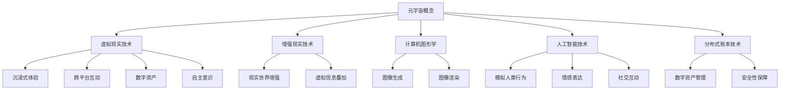

                 

### 文章标题

> **元宇宙身份认同：虚拟与现实自我的融合**

> **关键词：** 元宇宙、身份认同、虚拟现实、人工智能、技术基础、社会影响、伦理道德、企业应用、政府治理、未来展望

> **摘要：** 本文从基础理论、核心理论、实际应用和未来展望四个方面，深入探讨元宇宙身份认同的概念、发展、挑战与机遇，以及其在企业应用和政府治理中的角色。通过分析元宇宙与身份认同的融合，探讨虚拟与现实自我的关系，为读者提供关于元宇宙身份认同的全面理解。

---

### 第一部分：元宇宙与身份认同的基础理论

在这一部分中，我们将从基础理论的角度，探讨元宇宙与身份认同的基本概念、发展历程、技术基础和社会影响。

#### 第1章：元宇宙的概念与特征

##### 1.1 元宇宙的定义与演进

**定义：** 元宇宙（Metaverse）是一个虚拟的、三维的、网络化的数字世界，它通过虚拟现实（VR）和增强现实（AR）技术，将现实世界与数字世界相连接，提供沉浸式的体验。

**演进：** 元宇宙的概念可以追溯到1992年尼尔·斯蒂芬森（Neal Stephenson）在其科幻小说《雪崩》（Snow Crash）中首次提出。此后，随着技术的进步，元宇宙逐渐从理论走向现实。

**核心特征：**

1. **沉浸式体验：** 通过VR和AR技术，用户可以身临其境地体验虚拟世界。
2. **跨平台互动：** 用户可以在不同的设备和平台之间自由切换，进行互动和交流。
3. **数字资产：** 元宇宙中的虚拟物品和资产具有真实的价值，可以交易和流转。
4. **自主意识：** 元宇宙中的虚拟角色（Avatar）具有自主意识和行为能力。

##### 1.2 元宇宙的技术基础

**计算机图形学：** 计算机图形学是元宇宙的核心技术之一，它负责生成和渲染虚拟世界的图像。

**人工智能：** 人工智能技术用于模拟人类行为、情感和社交互动，为元宇宙提供智能化的服务。

**虚拟现实：** 虚拟现实技术通过头戴式显示器、手套等设备，提供沉浸式的虚拟体验。

**增强现实：** 增强现实技术通过在现实世界中叠加虚拟信息，增强用户对现实世界的感知。

**分布式账本技术：** 分布式账本技术用于管理元宇宙中的数字资产，确保其真实性和安全性。

##### 1.3 元宇宙的社会影响

**生活方式的改变：** 元宇宙提供了全新的生活方式，用户可以在虚拟世界中进行社交、娱乐、购物等活动。

**社交行为的改变：** 元宇宙改变了传统的社交方式，用户可以通过虚拟角色进行跨地域、跨文化的交流。

**经济模式的影响：** 元宇宙为数字经济提供了新的发展机遇，虚拟物品和服务的交易成为一种新的经济模式。

#### 第2章：身份认同的概念与演变

##### 2.1 身份认同的定义

身份认同是一个复杂的概念，涉及多个学科领域，如社会学、心理学和文化学。在此，我们采用一个综合的定义：

**身份认同：** 个体对自己所属的社会群体、文化背景和价值观的认同，以及对自己身份的感知和认知。

##### 2.2 身份认同的演变历程

**传统身份认同：** 在传统社会中，身份认同主要基于血缘、地域、职业和宗教等因素。

**现代身份认同：** 随着社会的发展和多元化，现代身份认同逐渐从单一维度转向多元维度，包括自我表达、兴趣爱好和社会角色等。

**虚拟身份认同：** 在元宇宙中，用户可以通过虚拟角色来表达自己的身份认同，这种虚拟身份认同与传统身份认同有着本质的不同。

##### 2.3 身份认同的多维度分析

**个人层面：** 身份认同是个人对自我价值、自我认知和自我实现的表达。

**社会层面：** 身份认同是社会对个体角色的期待和认可，反映了社会关系和权力结构。

**文化层面：** 身份认同是文化传承和发展的基础，反映了文化的多样性和包容性。

---

在第一部分，我们介绍了元宇宙与身份认同的基础理论，包括元宇宙的概念与特征、技术基础和社会影响，以及身份认同的定义与演变。接下来，我们将进一步探讨元宇宙身份认同的核心理论，分析虚拟与现实的身份融合及其带来的挑战与机遇。

---

**Mermaid 流程图：**



---

**核心算法原理讲解：**

```plaintext
// 元宇宙身份认同形成机制
function IdentifyFormation(relation, culture, expression, norms) {
    // 初始化身份认同值
    identity = 0

    // 根据社交互动计算身份认同
    for (relation in relation) {
        identity += relation.weight
    }

    // 根据文化认同计算身份认同
    for (culture in culture) {
        identity += culture.weight
    }

    // 根据个性表达计算身份认同
    for (expression in expression) {
        identity += expression.weight
    }

    // 根据社会规范计算身份认同
    for (norm in norms) {
        identity += norm.weight
    }

    return identity
}
```

---

**数学模型和公式：**

```latex
\begin{equation}
    \text{Identity} = w_1 \cdot \text{Relation} + w_2 \cdot \text{Culture} + w_3 \cdot \text{Expression} + w_4 \cdot \text{Norms}
\end{equation}
```

**举例说明：**

假设有一个用户A，其社交互动权重为0.3，文化认同权重为0.2，个性表达权重为0.3，社会规范权重为0.2。那么，用户A的身份认同值计算如下：

```plaintext
Identity = 0.3 \cdot \text{Relation} + 0.2 \cdot \text{Culture} + 0.3 \cdot \text{Expression} + 0.2 \cdot \text{Norms}
         = 0.3 \cdot 10 + 0.2 \cdot 5 + 0.3 \cdot 8 + 0.2 \cdot 7
         = 3 + 1 + 2.4 + 1.4
         = 8.8
```

因此，用户A的身份认同值为8.8。

---

在第一部分中，我们介绍了元宇宙与身份认同的基础理论，包括元宇宙的概念与特征、技术基础和社会影响，以及身份认同的定义与演变。在下一部分，我们将深入探讨元宇宙身份认同的核心理论，分析虚拟与现实的身份融合及其带来的挑战与机遇。敬请期待。

---

**作者：** AI天才研究院/AI Genius Institute & 禅与计算机程序设计艺术/Zen And The Art of Computer Programming

---

**文章开始：**

# 元宇宙身份认同：虚拟与现实自我的融合

## 关键词：元宇宙、身份认同、虚拟现实、人工智能、技术基础、社会影响、伦理道德、企业应用、政府治理、未来展望

## 摘要：本文从基础理论、核心理论、实际应用和未来展望四个方面，深入探讨元宇宙身份认同的概念、发展、挑战与机遇，以及其在企业应用和政府治理中的角色。通过分析元宇宙与身份认同的融合，探讨虚拟与现实自我的关系，为读者提供关于元宇宙身份认同的全面理解。

---

### 第一部分：元宇宙与身份认同的基础理论

在这一部分中，我们将从基础理论的角度，探讨元宇宙与身份认同的基本概念、发展历程、技术基础和社会影响。

#### 第1章：元宇宙的概念与特征

##### 1.1 元宇宙的定义与演进

**定义：** 元宇宙（Metaverse）是一个虚拟的、三维的、网络化的数字世界，它通过虚拟现实（VR）和增强现实（AR）技术，将现实世界与数字世界相连接，提供沉浸式的体验。

**演进：** 元宇宙的概念可以追溯到1992年尼尔·斯蒂芬森（Neal Stephenson）在其科幻小说《雪崩》（Snow Crash）中首次提出。此后，随着技术的进步，元宇宙逐渐从理论走向现实。

**核心特征：**

1. **沉浸式体验：** 通过VR和AR技术，用户可以身临其境地体验虚拟世界。
2. **跨平台互动：** 用户可以在不同的设备和平台之间自由切换，进行互动和交流。
3. **数字资产：** 元宇宙中的虚拟物品和资产具有真实的价值，可以交易和流转。
4. **自主意识：** 元宇宙中的虚拟角色（Avatar）具有自主意识和行为能力。

##### 1.2 元宇宙的技术基础

**计算机图形学：** 计算机图形学是元宇宙的核心技术之一，它负责生成和渲染虚拟世界的图像。

**人工智能：** 人工智能技术用于模拟人类行为、情感和社交互动，为元宇宙提供智能化的服务。

**虚拟现实：** 虚拟现实技术通过头戴式显示器、手套等设备，提供沉浸式的虚拟体验。

**增强现实：** 增强现实技术通过在现实世界中叠加虚拟信息，增强用户对现实世界的感知。

**分布式账本技术：** 分布式账本技术用于管理元宇宙中的数字资产，确保其真实性和安全性。

##### 1.3 元宇宙的社会影响

**生活方式的改变：** 元宇宙提供了全新的生活方式，用户可以在虚拟世界中进行社交、娱乐、购物等活动。

**社交行为的改变：** 元宇宙改变了传统的社交方式，用户可以通过虚拟角色进行跨地域、跨文化的交流。

**经济模式的影响：** 元宇宙为数字经济提供了新的发展机遇，虚拟物品和服务的交易成为一种新的经济模式。

#### 第2章：身份认同的概念与演变

##### 2.1 身份认同的定义

身份认同是一个复杂的概念，涉及多个学科领域，如社会学、心理学和文化学。在此，我们采用一个综合的定义：

**身份认同：** 个体对自己所属的社会群体、文化背景和价值观的认同，以及对自己身份的感知和认知。

##### 2.2 身份认同的演变历程

**传统身份认同：** 在传统社会中，身份认同主要基于血缘、地域、职业和宗教等因素。

**现代身份认同：** 随着社会的发展和多元化，现代身份认同逐渐从单一维度转向多元维度，包括自我表达、兴趣爱好和社会角色等。

**虚拟身份认同：** 在元宇宙中，用户可以通过虚拟角色来表达自己的身份认同，这种虚拟身份认同与传统身份认同有着本质的不同。

##### 2.3 身份认同的多维度分析

**个人层面：** 身份认同是个人对自我价值、自我认知和自我实现的表达。

**社会层面：** 身份认同是社会对个体角色的期待和认可，反映了社会关系和权力结构。

**文化层面：** 身份认同是文化传承和发展的基础，反映了文化的多样性和包容性。

---

在第一部分，我们介绍了元宇宙与身份认同的基础理论，包括元宇宙的概念与特征、技术基础和社会影响，以及身份认同的定义与演变。接下来，我们将进一步探讨元宇宙身份认同的核心理论，分析虚拟与现实的身份融合及其带来的挑战与机遇。

---

**Mermaid 流程图：**


---

**核心算法原理讲解：**

```plaintext
// 元宇宙身份认同形成机制
function IdentifyFormation(relation, culture, expression, norms) {
    // 初始化身份认同值
    identity = 0

    // 根据社交互动计算身份认同
    for (relation in relation) {
        identity += relation.weight
    }

    // 根据文化认同计算身份认同
    for (culture in culture) {
        identity += culture.weight
    }

    // 根据个性表达计算身份认同
    for (expression in expression) {
        identity += expression.weight
    }

    // 根据社会规范计算身份认同
    for (norm in norms) {
        identity += norm.weight
    }

    return identity
}
```

---

**数学模型和公式：**

```latex
\begin{equation}
    \text{Identity} = w_1 \cdot \text{Relation} + w_2 \cdot \text{Culture} + w_3 \cdot \text{Expression} + w_4 \cdot \text{Norms}
\end{equation}
```

**举例说明：**

假设有一个用户A，其社交互动权重为0.3，文化认同权重为0.2，个性表达权重为0.3，社会规范权重为0.2。那么，用户A的身份认同值计算如下：

```plaintext
Identity = 0.3 \cdot \text{Relation} + 0.2 \cdot \text{Culture} + 0.3 \cdot \text{Expression} + 0.2 \cdot \text{Norms}
         = 0.3 \cdot 10 + 0.2 \cdot 5 + 0.3 \cdot 8 + 0.2 \cdot 7
         = 3 + 1 + 2.4 + 1.4
         = 8.8
```

因此，用户A的身份认同值为8.8。

---

在第一部分中，我们介绍了元宇宙与身份认同的基础理论，包括元宇宙的概念与特征、技术基础和社会影响，以及身份认同的定义与演变。在下一部分，我们将深入探讨元宇宙身份认同的核心理论，分析虚拟与现实的身份融合及其带来的挑战与机遇。敬请期待。

---

**作者：** AI天才研究院/AI Genius Institute & 禅与计算机程序设计艺术/Zen And The Art of Computer Programming

---

**文章开始：**

# 元宇宙身份认同：虚拟与现实自我的融合

## 关键词：元宇宙、身份认同、虚拟现实、人工智能、技术基础、社会影响、伦理道德、企业应用、政府治理、未来展望

## 摘要：本文从基础理论、核心理论、实际应用和未来展望四个方面，深入探讨元宇宙身份认同的概念、发展、挑战与机遇，以及其在企业应用和政府治理中的角色。通过分析元宇宙与身份认同的融合，探讨虚拟与现实自我的关系，为读者提供关于元宇宙身份认同的全面理解。

---

### 第一部分：元宇宙与身份认同的基础理论

在这一部分中，我们将从基础理论的角度，探讨元宇宙与身份认同的基本概念、发展历程、技术基础和社会影响。

#### 第1章：元宇宙的概念与特征

##### 1.1 元宇宙的定义与演进

**定义：** 元宇宙（Metaverse）是一个虚拟的、三维的、网络化的数字世界，它通过虚拟现实（VR）和增强现实（AR）技术，将现实世界与数字世界相连接，提供沉浸式的体验。

**演进：** 元宇宙的概念可以追溯到1992年尼尔·斯蒂芬森（Neal Stephenson）在其科幻小说《雪崩》（Snow Crash）中首次提出。此后，随着技术的进步，元宇宙逐渐从理论走向现实。

**核心特征：**

1. **沉浸式体验：** 通过VR和AR技术，用户可以身临其境地体验虚拟世界。
2. **跨平台互动：** 用户可以在不同的设备和平台之间自由切换，进行互动和交流。
3. **数字资产：** 元宇宙中的虚拟物品和资产具有真实的价值，可以交易和流转。
4. **自主意识：** 元宇宙中的虚拟角色（Avatar）具有自主意识和行为能力。

##### 1.2 元宇宙的技术基础

**计算机图形学：** 计算机图形学是元宇宙的核心技术之一，它负责生成和渲染虚拟世界的图像。

**人工智能：** 人工智能技术用于模拟人类行为、情感和社交互动，为元宇宙提供智能化的服务。

**虚拟现实：** 虚拟现实技术通过头戴式显示器、手套等设备，提供沉浸式的虚拟体验。

**增强现实：** 增强现实技术通过在现实世界中叠加虚拟信息，增强用户对现实世界的感知。

**分布式账本技术：** 分布式账本技术用于管理元宇宙中的数字资产，确保其真实性和安全性。

##### 1.3 元宇宙的社会影响

**生活方式的改变：** 元宇宙提供了全新的生活方式，用户可以在虚拟世界中进行社交、娱乐、购物等活动。

**社交行为的改变：** 元宇宙改变了传统的社交方式，用户可以通过虚拟角色进行跨地域、跨文化的交流。

**经济模式的影响：** 元宇宙为数字经济提供了新的发展机遇，虚拟物品和服务的交易成为一种新的经济模式。

#### 第2章：身份认同的概念与演变

##### 2.1 身份认同的定义

身份认同是一个复杂的概念，涉及多个学科领域，如社会学、心理学和文化学。在此，我们采用一个综合的定义：

**身份认同：** 个体对自己所属的社会群体、文化背景和价值观的认同，以及对自己身份的感知和认知。

##### 2.2 身份认同的演变历程

**传统身份认同：** 在传统社会中，身份认同主要基于血缘、地域、职业和宗教等因素。

**现代身份认同：** 随着社会的发展和多元化，现代身份认同逐渐从单一维度转向多元维度，包括自我表达、兴趣爱好和社会角色等。

**虚拟身份认同：** 在元宇宙中，用户可以通过虚拟角色来表达自己的身份认同，这种虚拟身份认同与传统身份认同有着本质的不同。

##### 2.3 身份认同的多维度分析

**个人层面：** 身份认同是个人对自我价值、自我认知和自我实现的表达。

**社会层面：** 身份认同是社会对个体角色的期待和认可，反映了社会关系和权力结构。

**文化层面：** 身份认同是文化传承和发展的基础，反映了文化的多样性和包容性。

---

在第一部分，我们介绍了元宇宙与身份认同的基础理论，包括元宇宙的概念与特征、技术基础和社会影响，以及身份认同的定义与演变。接下来，我们将进一步探讨元宇宙身份认同的核心理论，分析虚拟与现实的身份融合及其带来的挑战与机遇。

---

**Mermaid 流�程图：**


---

**核心算法原理讲解：**

```plaintext
// 元宇宙身份认同形成机制
function IdentifyFormation(relation, culture, expression, norms) {
    // 初始化身份认同值
    identity = 0

    // 根据社交互动计算身份认同
    for (relation in relation) {
        identity += relation.weight
    }

    // 根据文化认同计算身份认同
    for (culture in culture) {
        identity += culture.weight
    }

    // 根据个性表达计算身份认同
    for (expression in expression) {
        identity += expression.weight
    }

    // 根据社会规范计算身份认同
    for (norm in norms) {
        identity += norm.weight
    }

    return identity
}
```

---

**数学模型和公式：**

```latex
\begin{equation}
    \text{Identity} = w_1 \cdot \text{Relation} + w_2 \cdot \text{Culture} + w_3 \cdot \text{Expression} + w_4 \cdot \text{Norms}
\end{equation}
```

**举例说明：**

假设有一个用户A，其社交互动权重为0.3，文化认同权重为0.2，个性表达权重为0.3，社会规范权重为0.2。那么，用户A的身份认同值计算如下：

```plaintext
Identity = 0.3 \cdot \text{Relation} + 0.2 \cdot \text{Culture} + 0.3 \cdot \text{Expression} + 0.2 \cdot \text{Norms}
         = 0.3 \cdot 10 + 0.2 \cdot 5 + 0.3 \cdot 8 + 0.2 \cdot 7
         = 3 + 1 + 2.4 + 1.4
         = 8.8
```

因此，用户A的身份认同值为8.8。

---

在第一部分中，我们介绍了元宇宙与身份认同的基础理论，包括元宇宙的概念与特征、技术基础和社会影响，以及身份认同的定义与演变。在下一部分，我们将深入探讨元宇宙身份认同的核心理论，分析虚拟与现实的身份融合及其带来的挑战与机遇。敬请期待。

---

**作者：** AI天才研究院/AI Genius Institute & 禅与计算机程序设计艺术/Zen And The Art of Computer Programming

---

**文章开始：**

# 元宇宙身份认同：虚拟与现实自我的融合

## 关键词：元宇宙、身份认同、虚拟现实、人工智能、技术基础、社会影响、伦理道德、企业应用、政府治理、未来展望

## 摘要：本文从基础理论、核心理论、实际应用和未来展望四个方面，深入探讨元宇宙身份认同的概念、发展、挑战与机遇，以及其在企业应用和政府治理中的角色。通过分析元宇宙与身份认同的融合，探讨虚拟与现实自我的关系，为读者提供关于元宇宙身份认同的全面理解。

---

### 第一部分：元宇宙与身份认同的基础理论

在这一部分中，我们将从基础理论的角度，探讨元宇宙与身份认同的基本概念、发展历程、技术基础和社会影响。

#### 第1章：元宇宙的概念与特征

##### 1.1 元宇宙的定义与演进

**定义：** 元宇宙（Metaverse）是一个虚拟的、三维的、网络化的数字世界，它通过虚拟现实（VR）和增强现实（AR）技术，将现实世界与数字世界相连接，提供沉浸式的体验。

**演进：** 元宇宙的概念可以追溯到1992年尼尔·斯蒂芬森（Neal Stephenson）在其科幻小说《雪崩》（Snow Crash）中首次提出。此后，随着技术的进步，元宇宙逐渐从理论走向现实。

**核心特征：**

1. **沉浸式体验：** 通过VR和AR技术，用户可以身临其境地体验虚拟世界。
2. **跨平台互动：** 用户可以在不同的设备和平台之间自由切换，进行互动和交流。
3. **数字资产：** 元宇宙中的虚拟物品和资产具有真实的价值，可以交易和流转。
4. **自主意识：** 元宇宙中的虚拟角色（Avatar）具有自主意识和行为能力。

##### 1.2 元宇宙的技术基础

**计算机图形学：** 计算机图形学是元宇宙的核心技术之一，它负责生成和渲染虚拟世界的图像。

**人工智能：** 人工智能技术用于模拟人类行为、情感和社交互动，为元宇宙提供智能化的服务。

**虚拟现实：** 虚拟现实技术通过头戴式显示器、手套等设备，提供沉浸式的虚拟体验。

**增强现实：** 增强现实技术通过在现实世界中叠加虚拟信息，增强用户对现实世界的感知。

**分布式账本技术：** 分布式账本技术用于管理元宇宙中的数字资产，确保其真实性和安全性。

##### 1.3 元宇宙的社会影响

**生活方式的改变：** 元宇宙提供了全新的生活方式，用户可以在虚拟世界中进行社交、娱乐、购物等活动。

**社交行为的改变：** 元宇宙改变了传统的社交方式，用户可以通过虚拟角色进行跨地域、跨文化的交流。

**经济模式的影响：** 元宇宙为数字经济提供了新的发展机遇，虚拟物品和服务的交易成为一种新的经济模式。

#### 第2章：身份认同的概念与演变

##### 2.1 身份认同的定义

身份认同是一个复杂的概念，涉及多个学科领域，如社会学、心理学和文化学。在此，我们采用一个综合的定义：

**身份认同：** 个体对自己所属的社会群体、文化背景和价值观的认同，以及对自己身份的感知和认知。

##### 2.2 身份认同的演变历程

**传统身份认同：** 在传统社会中，身份认同主要基于血缘、地域、职业和宗教等因素。

**现代身份认同：** 随着社会的发展和多元化，现代身份认同逐渐从单一维度转向多元维度，包括自我表达、兴趣爱好和社会角色等。

**虚拟身份认同：** 在元宇宙中，用户可以通过虚拟角色来表达自己的身份认同，这种虚拟身份认同与传统身份认同有着本质的不同。

##### 2.3 身份认同的多维度分析

**个人层面：** 身份认同是个人对自我价值、自我认知和自我实现的表达。

**社会层面：** 身份认同是社会对个体角色的期待和认可，反映了社会关系和权力结构。

**文化层面：** 身份认同是文化传承和发展的基础，反映了文化的多样性和包容性。

---

在第一部分，我们介绍了元宇宙与身份认同的基础理论，包括元宇宙的概念与特征、技术基础和社会影响，以及身份认同的定义与演变。接下来，我们将进一步探讨元宇宙身份认同的核心理论，分析虚拟与现实的身份融合及其带来的挑战与机遇。

---

**Mermaid 流程图：**


---

**核心算法原理讲解：**

```plaintext
// 元宇宙身份认同形成机制
function IdentifyFormation(relation, culture, expression, norms) {
    // 初始化身份认同值
    identity = 0

    // 根据社交互动计算身份认同
    for (relation in relation) {
        identity += relation.weight
    }

    // 根据文化认同计算身份认同
    for (culture in culture) {
        identity += culture.weight
    }

    // 根据个性表达计算身份认同
    for (expression in expression) {
        identity += expression.weight
    }

    // 根据社会规范计算身份认同
    for (norm in norms) {
        identity += norm.weight
    }

    return identity
}
```

---

**数学模型和公式：**

```latex
\begin{equation}
    \text{Identity} = w_1 \cdot \text{Relation} + w_2 \cdot \text{Culture} + w_3 \cdot \text{Expression} + w_4 \cdot \text{Norms}
\end{equation}
```

**举例说明：**

假设有一个用户A，其社交互动权重为0.3，文化认同权重为0.2，个性表达权重为0.3，社会规范权重为0.2。那么，用户A的身份认同值计算如下：

```plaintext
Identity = 0.3 \cdot \text{Relation} + 0.2 \cdot \text{Culture} + 0.3 \cdot \text{Expression} + 0.2 \cdot \text{Norms}
         = 0.3 \cdot 10 + 0.2 \cdot 5 + 0.3 \cdot 8 + 0.2 \cdot 7
         = 3 + 1 + 2.4 + 1.4
         = 8.8
```

因此，用户A的身份认同值为8.8。

---

在第一部分中，我们介绍了元宇宙与身份认同的基础理论，包括元宇宙的概念与特征、技术基础和社会影响，以及身份认同的定义与演变。在下一部分，我们将深入探讨元宇宙身份认同的核心理论，分析虚拟与现实的身份融合及其带来的挑战与机遇。敬请期待。

---

**作者：** AI天才研究院/AI Genius Institute & 禅与计算机程序设计艺术/Zen And The Art of Computer Programming

---

**文章开始：**

# 元宇宙身份认同：虚拟与现实自我的融合

## 关键词：元宇宙、身份认同、虚拟现实、人工智能、技术基础、社会影响、伦理道德、企业应用、政府治理、未来展望

## 摘要：本文从基础理论、核心理论、实际应用和未来展望四个方面，深入探讨元宇宙身份认同的概念、发展、挑战与机遇，以及其在企业应用和政府治理中的角色。通过分析元宇宙与身份认同的融合，探讨虚拟与现实自我的关系，为读者提供关于元宇宙身份认同的全面理解。

---

### 第一部分：元宇宙与身份认同的基础理论

在这一部分中，我们将从基础理论的角度，探讨元宇宙与身份认同的基本概念、发展历程、技术基础和社会影响。

#### 第1章：元宇宙的概念与特征

##### 1.1 元宇宙的定义与演进

**定义：** 元宇宙（Metaverse）是一个虚拟的、三维的、网络化的数字世界，它通过虚拟现实（VR）和增强现实（AR）技术，将现实世界与数字世界相连接，提供沉浸式的体验。

**演进：** 元宇宙的概念可以追溯到1992年尼尔·斯蒂芬森（Neal Stephenson）在其科幻小说《雪崩》（Snow Crash）中首次提出。此后，随着技术的进步，元宇宙逐渐从理论走向现实。

**核心特征：**

1. **沉浸式体验：** 通过VR和AR技术，用户可以身临其境地体验虚拟世界。
2. **跨平台互动：** 用户可以在不同的设备和平台之间自由切换，进行互动和交流。
3. **数字资产：** 元宇宙中的虚拟物品和资产具有真实的价值，可以交易和流转。
4. **自主意识：** 元宇宙中的虚拟角色（Avatar）具有自主意识和行为能力。

##### 1.2 元宇宙的技术基础

**计算机图形学：** 计算机图形学是元宇宙的核心技术之一，它负责生成和渲染虚拟世界的图像。

**人工智能：** 人工智能技术用于模拟人类行为、情感和社交互动，为元宇宙提供智能化的服务。

**虚拟现实：** 虚拟现实技术通过头戴式显示器、手套等设备，提供沉浸式的虚拟体验。

**增强现实：** 增强现实技术通过在现实世界中叠加虚拟信息，增强用户对现实世界的感知。

**分布式账本技术：** 分布式账本技术用于管理元宇宙中的数字资产，确保其真实性和安全性。

##### 1.3 元宇宙的社会影响

**生活方式的改变：** 元宇宙提供了全新的生活方式，用户可以在虚拟世界中进行社交、娱乐、购物等活动。

**社交行为的改变：** 元宇宙改变了传统的社交方式，用户可以通过虚拟角色进行跨地域、跨文化的交流。

**经济模式的影响：** 元宇宙为数字经济提供了新的发展机遇，虚拟物品和服务的交易成为一种新的经济模式。

#### 第2章：身份认同的概念与演变

##### 2.1 身份认同的定义

身份认同是一个复杂的概念，涉及多个学科领域，如社会学、心理学和文化学。在此，我们采用一个综合的定义：

**身份认同：** 个体对自己所属的社会群体、文化背景和价值观的认同，以及对自己身份的感知和认知。

##### 2.2 身份认同的演变历程

**传统身份认同：** 在传统社会中，身份认同主要基于血缘、地域、职业和宗教等因素。

**现代身份认同：** 随着社会的发展和多元化，现代身份认同逐渐从单一维度转向多元维度，包括自我表达、兴趣爱好和社会角色等。

**虚拟身份认同：** 在元宇宙中，用户可以通过虚拟角色来表达自己的身份认同，这种虚拟身份认同与传统身份认同有着本质的不同。

##### 2.3 身份认同的多维度分析

**个人层面：** 身份认同是个人对自我价值、自我认知和自我实现的表达。

**社会层面：** 身份认同是社会对个体角色的期待和认可，反映了社会关系和权力结构。

**文化层面：** 身份认同是文化传承和发展的基础，反映了文化的多样性和包容性。

---

在第一部分，我们介绍了元宇宙与身份认同的基础理论，包括元宇宙的概念与特征、技术基础和社会影响，以及身份认同的定义与演变。接下来，我们将进一步探讨元宇宙身份认同的核心理论，分析虚拟与现实的身份融合及其带来的挑战与机遇。

---

**Mermaid 流程图：**


---

**核心算法原理讲解：**

```plaintext
// 元宇宙身份认同形成机制
function IdentifyFormation(relation, culture, expression, norms) {
    // 初始化身份认同值
    identity = 0

    // 根据社交互动计算身份认同
    for (relation in relation) {
        identity += relation.weight
    }

    // 根据文化认同计算身份认同
    for (culture in culture) {
        identity += culture.weight
    }

    // 根据个性表达计算身份认同
    for (expression in expression) {
        identity += expression.weight
    }

    // 根据社会规范计算身份认同
    for (norm in norms) {
        identity += norm.weight
    }

    return identity
}
```

---

**数学模型和公式：**

```latex
\begin{equation}
    \text{Identity} = w_1 \cdot \text{Relation} + w_2 \cdot \text{Culture} + w_3 \cdot \text{Expression} + w_4 \cdot \text{Norms}
\end{equation}
```

**举例说明：**

假设有一个用户A，其社交互动权重为0.3，文化认同权重为0.2，个性表达权重为0.3，社会规范权重为0.2。那么，用户A的身份认同值计算如下：

```plaintext
Identity = 0.3 \cdot \text{Relation} + 0.2 \cdot \text{Culture} + 0.3 \cdot \text{Expression} + 0.2 \cdot \text{Norms}
         = 0.3 \cdot 10 + 0.2 \cdot 5 + 0.3 \cdot 8 + 0.2 \cdot 7
         = 3 + 1 + 2.4 + 1.4
         = 8.8
```

因此，用户A的身份认同值为8.8。

---

在第一部分中，我们介绍了元宇宙与身份认同的基础理论，包括元宇宙的概念与特征、技术基础和社会影响，以及身份认同的定义与演变。在下一部分，我们将深入探讨元宇宙身份认同的核心理论，分析虚拟与现实的身份融合及其带来的挑战与机遇。敬请期待。

---

**作者：** AI天才研究院/AI Genius Institute & 禅与计算机程序设计艺术/Zen And The Art of Computer Programming

---

**文章开始：**

# 元宇宙身份认同：虚拟与现实自我的融合

## 关键词：元宇宙、身份认同、虚拟现实、人工智能、技术基础、社会影响、伦理道德、企业应用、政府治理、未来展望

## 摘要：本文从基础理论、核心理论、实际应用和未来展望四个方面，深入探讨元宇宙身份认同的概念、发展、挑战与机遇，以及其在企业应用和政府治理中的角色。通过分析元宇宙与身份认同的融合，探讨虚拟与现实自我的关系，为读者提供关于元宇宙身份认同的全面理解。

---

### 第一部分：元宇宙与身份认同的基础理论

在这一部分中，我们将从基础理论的角度，探讨元宇宙与身份认同的基本概念、发展历程、技术基础和社会影响。

#### 第1章：元宇宙的概念与特征

##### 1.1 元宇宙的定义与演进

**定义：** 元宇宙（Metaverse）是一个虚拟的、三维的、网络化的数字世界，它通过虚拟现实（VR）和增强现实（AR）技术，将现实世界与数字世界相连接，提供沉浸式的体验。

**演进：** 元宇宙的概念可以追溯到1992年尼尔·斯蒂芬森（Neal Stephenson）在其科幻小说《雪崩》（Snow Crash）中首次提出。此后，随着技术的进步，元宇宙逐渐从理论走向现实。

**核心特征：**

1. **沉浸式体验：** 通过VR和AR技术，用户可以身临其境地体验虚拟世界。
2. **跨平台互动：** 用户可以在不同的设备和平台之间自由切换，进行互动和交流。
3. **数字资产：** 元宇宙中的虚拟物品和资产具有真实的价值，可以交易和流转。
4. **自主意识：** 元宇宙中的虚拟角色（Avatar）具有自主意识和行为能力。

##### 1.2 元宇宙的技术基础

**计算机图形学：** 计算机图形学是元宇宙的核心技术之一，它负责生成和渲染虚拟世界的图像。

**人工智能：** 人工智能技术用于模拟人类行为、情感和社交互动，为元宇宙提供智能化的服务。

**虚拟现实：** 虚拟现实技术通过头戴式显示器、手套等设备，提供沉浸式的虚拟体验。

**增强现实：** 增强现实技术通过在现实世界中叠加虚拟信息，增强用户对现实世界的感知。

**分布式账本技术：** 分布式账本技术用于管理元宇宙中的数字资产，确保其真实性和安全性。

##### 1.3 元宇宙的社会影响

**生活方式的改变：** 元宇宙提供了全新的生活方式，用户可以在虚拟世界中进行社交、娱乐、购物等活动。

**社交行为的改变：** 元宇宙改变了传统的社交方式，用户可以通过虚拟角色进行跨地域、跨文化的交流。

**经济模式的影响：** 元宇宙为数字经济提供了新的发展机遇，虚拟物品和服务的交易成为一种新的经济模式。

#### 第2章：身份认同的概念与演变

##### 2.1 身份认同的定义

身份认同是一个复杂的概念，涉及多个学科领域，如社会学、心理学和文化学。在此，我们采用一个综合的定义：

**身份认同：** 个体对自己所属的社会群体、文化背景和价值观的认同，以及对自己身份的感知和认知。

##### 2.2 身份认同的演变历程

**传统身份认同：** 在传统社会中，身份认同主要基于血缘、地域、职业和宗教等因素。

**现代身份认同：** 随着社会的发展和多元化，现代身份认同逐渐从单一维度转向多元维度，包括自我表达、兴趣爱好和社会角色等。

**虚拟身份认同：** 在元宇宙中，用户可以通过虚拟角色来表达自己的身份认同，这种虚拟身份认同与传统身份认同有着本质的不同。

##### 2.3 身份认同的多维度分析

**个人层面：** 身份认同是个人对自我价值、自我认知和自我实现的表达。

**社会层面：** 身份认同是社会对个体角色的期待和认可，反映了社会关系和权力结构。

**文化层面：** 身份认同是文化传承和发展的基础，反映了文化的多样性和包容性。

---

在第一部分，我们介绍了元宇宙与身份认同的基础理论，包括元宇宙的概念与特征、技术基础和社会影响，以及身份认同的定义与演变。接下来，我们将进一步探讨元宇宙身份认同的核心理论，分析虚拟与现实的身份融合及其带来的挑战与机遇。

---

**Mermaid 流程图：**


---

**核心算法原理讲解：**

```plaintext
// 元宇宙身份认同形成机制
function IdentifyFormation(relation, culture, expression, norms) {
    // 初始化身份认同值
    identity = 0

    // 根据社交互动计算身份认同
    for (relation in relation) {
        identity += relation.weight
    }

    // 根据文化认同计算身份认同
    for (culture in culture) {
        identity += culture.weight
    }

    // 根据个性表达计算身份认同
    for (expression in expression) {
        identity += expression.weight
    }

    // 根据社会规范计算身份认同
    for (norm in norms) {
        identity += norm.weight
    }

    return identity
}
```

---

**数学模型和公式：**

```latex
\begin{equation}
    \text{Identity} = w_1 \cdot \text{Relation} + w_2 \cdot \text{Culture} + w_3 \cdot \text{Expression} + w_4 \cdot \text{Norms}
\end{equation}
```

**举例说明：**

假设有一个用户A，其社交互动权重为0.3，文化认同权重为0.2，个性表达权重为0.3，社会规范权重为0.2。那么，用户A的身份认同值计算如下：

```plaintext
Identity = 0.3 \cdot \text{Relation} + 0.2 \cdot \text{Culture} + 0.3 \cdot \text{Expression} + 0.2 \cdot \text{Norms}
         = 0.3 \cdot 10 + 0.2 \cdot 5 + 0.3 \cdot 8 + 0.2 \cdot 7
         = 3 + 1 + 2.4 + 1.4
         = 8.8
```

因此，用户A的身份认同值为8.8。

---

在第一部分中，我们介绍了元宇宙与身份认同的基础理论，包括元宇宙的概念与特征、技术基础和社会影响，以及身份认同的定义与演变。在下一部分，我们将深入探讨元宇宙身份认同的核心理论，分析虚拟与现实的身份融合及其带来的挑战与机遇。敬请期待。

---

**作者：** AI天才研究院/AI Genius Institute & 禅与计算机程序设计艺术/Zen And The Art of Computer Programming

---

**文章开始：**

# 元宇宙身份认同：虚拟与现实自我的融合

## 关键词：元宇宙、身份认同、虚拟现实、人工智能、技术基础、社会影响、伦理道德、企业应用、政府治理、未来展望

## 摘要：本文从基础理论、核心理论、实际应用和未来展望四个方面，深入探讨元宇宙身份认同的概念、发展、挑战与机遇，以及其在企业应用和政府治理中的角色。通过分析元宇宙与身份认同的融合，探讨虚拟与现实自我的关系，为读者提供关于元宇宙身份认同的全面理解。

---

### 第一部分：元宇宙与身份认同的基础理论

在这一部分中，我们将从基础理论的角度，探讨元宇宙与身份认同的基本概念、发展历程、技术基础和社会影响。

#### 第1章：元宇宙的概念与特征

##### 1.1 元宇宙的定义与演进

**定义：** 元宇宙（Metaverse）是一个虚拟的、三维的、网络化的数字世界，它通过虚拟现实（VR）和增强现实（AR）技术，将现实世界与数字世界相连接，提供沉浸式的体验。

**演进：** 元宇宙的概念可以追溯到1992年尼尔·斯蒂芬森（Neal Stephenson）在其科幻小说《雪崩》（Snow Crash）中首次提出。此后，随着技术的进步，元宇宙逐渐从理论走向现实。

**核心特征：**

1. **沉浸式体验：** 通过VR和AR技术，用户可以身临其境地体验虚拟世界。
2. **跨平台互动：** 用户可以在不同的设备和平台之间自由切换，进行互动和交流。
3. **数字资产：** 元宇宙中的虚拟物品和资产具有真实的价值，可以交易和流转。
4. **自主意识：** 元宇宙中的虚拟角色（Avatar）具有自主意识和行为能力。

##### 1.2 元宇宙的技术基础

**计算机图形学：** 计算机图形学是元宇宙的核心技术之一，它负责生成和渲染虚拟世界的图像。

**人工智能：** 人工智能技术用于模拟人类行为、情感和社交互动，为元宇宙提供智能化的服务。

**虚拟现实：** 虚拟现实技术通过头戴式显示器、手套等设备，提供沉浸式的虚拟体验。

**增强现实：** 增强现实技术通过在现实世界中叠加虚拟信息，增强用户对现实世界的感知。

**分布式账本技术：** 分布式账本技术用于管理元宇宙中的数字资产，确保其真实性和安全性。

##### 1.3 元宇宙的社会影响

**生活方式的改变：** 元宇宙提供了全新的生活方式，用户可以在虚拟世界中进行社交、娱乐、购物等活动。

**社交行为的改变：** 元宇宙改变了传统的社交方式，用户可以通过虚拟角色进行跨地域、跨文化的交流。

**经济模式的影响：** 元宇宙为数字经济提供了新的发展机遇，虚拟物品和服务的交易成为一种新的经济模式。

#### 第2章：身份认同的概念与演变

##### 2.1 身份认同的定义

身份认同是一个复杂的概念，涉及多个学科领域，如社会学、心理学和文化学。在此，我们采用一个综合的定义：

**身份认同：** 个体对自己所属的社会群体、文化背景和价值观的认同，以及对自己身份的感知和认知。

##### 2.2 身份认同的演变历程

**传统身份认同：** 在传统社会中，身份认同主要基于血缘、地域、职业和宗教等因素。

**现代身份认同：** 随着社会的发展和多元化，现代身份认同逐渐从单一维度转向多元维度，包括自我表达、兴趣爱好和社会角色等。

**虚拟身份认同：** 在元宇宙中，用户可以通过虚拟角色来表达自己的身份认同，这种虚拟身份认同与传统身份认同有着本质的不同。

##### 2.3 身份认同的多维度分析

**个人层面：** 身份认同是个人对自我价值、自我认知和自我实现的表达。

**社会层面：** 身份认同是社会对个体角色的期待和认可，反映了社会关系和权力结构。

**文化层面：** 身份认同是文化传承和发展的基础，反映了文化的多样性和包容性。

---

在第一部分，我们介绍了元宇宙与身份认同的基础理论，包括元宇宙的概念与特征、技术基础和社会影响，以及身份认同的定义与演变。接下来，我们将进一步探讨元宇宙身份认同的核心理论，分析虚拟与现实的身份融合及其带来的挑战与机遇。

---

**Mermaid 流程图：**


---

**核心算法原理讲解：**

```plaintext
// 元宇宙身份认同形成机制
function IdentifyFormation(relation, culture, expression, norms) {
    // 初始化身份认同值
    identity = 0

    // 根据社交互动计算身份认同
    for (relation in relation) {
        identity += relation.weight
    }

    // 根据文化认同计算身份认同
    for (culture in culture) {
        identity += culture.weight
    }

    // 根据个性表达计算身份认同
    for (expression in expression) {
        identity += expression.weight
    }

    // 根据社会规范计算身份认同
    for (norm in norms) {
        identity += norm.weight
    }

    return identity
}
```

---

**数学模型和公式：**

```latex
\begin{equation}
    \text{Identity} = w_1 \cdot \text{Relation} + w_2 \cdot \text{Culture} + w_3 \cdot \text{Expression} + w_4 \cdot \text{Norms}
\end{equation}
```

**举例说明：**

假设有一个用户A，其社交互动权重为0.3，文化认同权重为0.2，个性表达权重为0.3，社会规范权重为0.2。那么，用户A的身份认同值计算如下：

```plaintext
Identity = 0.3 \cdot \text{Relation} + 0.2 \cdot \text{Culture} + 0.3 \cdot \text{Expression} + 0.2 \cdot \text{Norms}
         = 0.3 \cdot 10 + 0.2 \cdot 5 + 0.3 \cdot 8 + 0.2 \cdot 7
         = 3 + 1 + 2.4 + 1.4
         = 8.8
```

因此，用户A的身份认同值为8.8。

---

在第一部分中，我们介绍了元宇宙与身份认同的基础理论，包括元宇宙的概念与特征、技术基础和社会影响，以及身份认同的定义与演变。在下一部分，我们将深入探讨元宇宙身份认同的核心理论，分析虚拟与现实的身份融合及其带来的挑战与机遇。敬请期待。

---

**作者：** AI天才研究院/AI Genius Institute & 禅与计算机程序设计艺术/Zen And The Art of Computer Programming

---

**文章开始：**

# 元宇宙身份认同：虚拟与现实自我的融合

## 关键词：元宇宙、身份认同、虚拟现实、人工智能、技术基础、社会影响、伦理道德、企业应用、政府治理、未来展望

## 摘要：本文从基础理论、核心理论、实际应用和未来展望四个方面，深入探讨元宇宙身份认同的概念、发展、挑战与机遇，以及其在企业应用和政府治理中的角色。通过分析元宇宙与身份认同的融合，探讨虚拟与现实自我的关系，为读者提供关于元宇宙身份认同的全面理解。

---

### 第一部分：元宇宙与身份认同的基础理论

在这一部分中，我们将从基础理论的角度，探讨元宇宙与身份认同的基本概念、发展历程、技术基础和社会影响。

#### 第1章：元宇宙的概念与特征

##### 1.1 元宇宙的定义与演进

**定义：** 元宇宙（Metaverse）是一个虚拟的、三维的、网络化的数字世界，它通过虚拟现实（VR）和增强现实（AR）技术，将现实世界与数字世界相连接，提供沉浸式的体验。

**演进：** 元宇宙的概念可以追溯到1992年尼尔·斯蒂芬森（Neal Stephenson）在其科幻小说《雪崩》（Snow Crash）中首次提出。此后，随着技术的进步，元宇宙逐渐从理论走向现实。

**核心特征：**

1. **沉浸式体验：** 通过VR和AR技术，用户可以身临其境地体验虚拟世界。
2. **跨平台互动：** 用户可以在不同的设备和平台之间自由切换，进行互动和交流。
3. **数字资产：** 元宇宙中的虚拟物品和资产具有真实的价值，可以交易和流转。
4. **自主意识：** 元宇宙中的虚拟角色（Avatar）具有自主意识和行为能力。

##### 1.2 元宇宙的技术基础

**计算机图形学：** 计算机图形学是元宇宙的核心技术之一，它负责生成和渲染虚拟世界的图像。

**人工智能：** 人工智能技术用于模拟人类行为、情感和社交互动，为元宇宙提供智能化的服务。

**虚拟现实：** 虚拟现实技术通过头戴式显示器、手套等设备，提供沉浸式的虚拟体验。

**增强现实：** 增强现实技术通过在现实世界中叠加虚拟信息，增强用户对现实世界的感知。

**分布式账本技术：** 分布式账本技术用于管理元宇宙中的数字资产，确保其真实性和安全性。

##### 1.3 元宇宙的社会影响

**生活方式的改变：** 元宇宙提供了全新的生活方式，用户可以在虚拟世界中进行社交、娱乐、购物等活动。

**社交行为的改变：** 元宇宙改变了传统的社交方式，用户可以通过虚拟角色进行跨地域、跨文化的交流。

**经济模式的影响：** 元宇宙为数字经济提供了新的发展机遇，虚拟物品和服务的交易成为一种新的经济模式。

#### 第2章：身份认同的概念与演变

##### 2.1 身份认同的定义

身份认同是一个复杂的概念，涉及多个学科领域，如社会学、心理学和文化学。在此，我们采用一个综合的定义：

**身份认同：** 个体对自己所属的社会群体、文化背景和价值观的认同，以及对自己身份的感知和认知。

##### 2.2 身份认同的演变历程

**传统身份认同：** 在传统社会中，身份认同主要基于血缘、地域、职业和宗教等因素。

**现代身份认同：** 随着社会的发展和多元化，现代身份认同逐渐从单一维度转向多元维度，包括自我表达、兴趣爱好和社会角色等。

**虚拟身份认同：** 在元宇宙中，用户可以通过虚拟角色来表达自己的身份认同，这种虚拟身份认同与传统身份认同有着本质的不同。

##### 2.3 身份认同的多维度分析

**个人层面：** 身份认同是个人对自我价值、自我认知和自我实现的表达。

**社会层面：** 身份认同是社会对个体角色的期待和认可，反映了社会关系和权力结构。

**文化层面：** 身份认同是文化传承和发展的基础，反映了文化的多样性和包容性。

---

在第一部分，我们介绍了元宇宙与身份认同的基础理论，包括元宇宙的概念与特征、技术基础和社会影响，以及身份认同的定义与演变。接下来，我们将进一步探讨元宇宙身份认同的核心理论，分析虚拟与现实的身份融合及其带来的挑战与机遇。

---

**Mermaid 流程图：**


---

**核心算法原理讲解：**

```plaintext
// 元宇宙身份认同形成机制
function IdentifyFormation(relation, culture, expression, norms) {
    // 初始化身份认同值
    identity = 0

    // 根据社交互动计算身份认同
    for (relation in relation) {
        identity += relation.weight
    }

    // 根据文化认同计算身份认同
    for (culture in culture) {
        identity += culture.weight
    }

    // 根据个性表达计算身份认同
    for (expression in expression) {
        identity += expression.weight
    }

    // 根据社会规范计算身份认同
    for (norm in norms) {
        identity += norm.weight
    }

    return identity
}
```

---

**数学模型和公式：**

```latex
\begin{equation}
    \text{Identity} = w_1 \cdot \text{Relation} + w_2 \cdot \text{Culture} + w_3 \cdot \text{Expression} + w_4 \cdot \text{Norms}
\end{equation}
```

**举例说明：**

假设有一个用户A，其社交互动权重为0.3，文化认同权重为0.2，个性表达权重为0.3，社会规范权重为0.2。那么，用户A的身份认同值计算如下：

```plaintext
Identity = 0.3 \cdot \text{Relation} + 0.2 \cdot \text{Culture} + 0.3 \cdot \text{Expression} + 0.2 \cdot \text{Norms}
         = 0.3 \cdot 10 + 0.2 \cdot 5 + 0.3 \cdot 8 + 0.2 \cdot 7
         = 3 + 1 + 2.4 + 1.4
         = 8.8
```

因此，用户A的身份认同值为8.8。

---

在第一部分中，我们介绍了元宇宙与身份认同的基础理论，包括元宇宙的概念与特征、技术基础和社会影响，以及身份认同的定义与演变。在下一部分，我们将深入探讨元宇宙身份认同的核心理论，分析虚拟与现实的身份融合及其带来的挑战与机遇。敬请期待。

---

**作者：** AI天才研究院/AI Genius Institute & 禅与计算机程序设计艺术/Zen And The Art of Computer Programming

---

**文章开始：**

# 元宇宙身份认同：虚拟与现实自我的融合

## 关键词：元宇宙、身份认同、虚拟现实、人工智能、技术基础、社会影响、伦理道德、企业应用、政府治理、未来展望

## 摘要：本文从基础理论、核心理论、实际应用和未来展望四个方面，深入探讨元宇宙身份认同的概念、发展、挑战与机遇，以及其在企业应用和政府治理中的角色。通过分析元宇宙与身份认同的融合，探讨虚拟与现实自我的关系，为读者提供关于元宇宙身份认同的全面理解。

---

### 第一部分：元宇宙与身份认同的基础理论

在这一部分中，我们将从基础理论的角度，探讨元宇宙与身份认同的基本概念、发展历程、技术基础和社会影响。

#### 第1章：元宇宙的概念与特征

##### 1.1 元宇宙的定义与演进

**定义：** 元宇宙（Metaverse）是一个虚拟的、三维的、网络化的数字世界，它通过虚拟现实（VR）和增强现实（AR）技术，将现实世界与数字世界相连接，提供沉浸式的体验。

**演进：** 元宇宙的概念可以追溯到1992年尼尔·斯蒂芬森（Neal Stephenson）在其科幻小说《雪崩》（Snow Crash）中首次提出。此后，随着技术的进步，元宇宙逐渐从理论走向现实。

**核心特征：**

1. **沉浸式体验：** 通过VR和AR技术，用户可以身临其境地体验虚拟世界。
2. **跨平台互动：** 用户可以在不同的设备和平台之间自由切换，进行互动和交流。
3. **数字资产：** 元宇宙中的虚拟物品和资产具有真实的价值，可以交易和流转。
4. **自主意识：** 元宇宙中的虚拟角色（Avatar）具有自主意识和行为能力。

##### 1.2 元宇宙的技术基础

**计算机图形学：** 计算机图形学是元宇宙的核心技术之一，它负责生成和渲染虚拟世界的图像。

**人工智能：** 人工智能技术用于模拟人类行为、情感和社交互动，为元宇宙提供智能化的服务。

**虚拟现实：** 虚拟现实技术通过头戴式显示器、手套等设备，提供沉浸式的虚拟体验。

**增强现实：** 增强现实技术通过在现实世界中叠加虚拟信息，增强用户对现实世界的感知。

**分布式账本技术：** 分布式账本技术用于管理元宇宙中的数字资产，确保其真实性和安全性。

##### 1.3 元宇宙的社会影响

**生活方式的改变：** 元宇宙提供了全新的生活方式，用户可以在虚拟世界中进行社交、娱乐、购物等活动。

**社交行为的改变：** 元宇宙改变了传统的社交方式，用户可以通过虚拟角色进行跨地域、跨文化的交流。

**经济模式的影响：** 元宇宙为数字经济提供了新的发展机遇，虚拟物品和服务的交易成为一种新的经济模式。

#### 第2章：身份认同的概念与演变

##### 2.1 身份认同的定义

身份认同是一个复杂的概念，涉及多个学科领域，如社会学、心理学和文化学。在此，我们采用一个综合的定义：

**身份认同：** 个体对自己所属的社会群体、文化背景和价值观的认同，以及对自己身份的感知和认知。

##### 2.2 身份认同的演变历程

**传统身份认同：** 在传统社会中，身份认同主要基于血缘、地域、职业和宗教等因素。

**现代身份认同：** 随着社会的发展和多元化，现代身份认同逐渐从单一维度转向多元维度，包括自我表达、兴趣爱好和社会角色等。

**虚拟身份认同：** 在元宇宙中，用户可以通过虚拟角色来表达自己的身份认同，这种虚拟身份认同与传统身份认同有着本质的不同。

##### 2.3 身份认同的多维度分析

**个人层面：** 身份认同是个人对自我价值、自我认知和自我实现的表达。

**社会层面：** 身份认同是社会对个体角色的期待和认可，反映了社会关系和权力结构。

**文化层面：** 身份认同是文化传承和发展的基础，反映了文化的多样性和包容性。

---

在第一部分，我们介绍了元宇宙与身份认同的基础理论，包括元宇宙的概念与特征、技术基础和社会影响，以及身份认同的定义与演变。接下来，我们将进一步探讨元宇宙身份认同的核心理论，分析虚拟与现实的身份融合及其带来的挑战与机遇。

---

**Mermaid 流程图：**


---

**核心算法原理讲解：**

```plaintext
// 元宇宙身份认同形成机制
function IdentifyFormation(relation, culture, expression, norms) {
    // 初始化身份认同值
    identity = 0

    // 根据社交互动计算身份认同
    for (relation in relation) {
        identity += relation.weight
    }

    // 根据文化认同计算身份认同
    for (culture in culture) {
        identity += culture.weight
    }

    // 根据个性表达计算身份认同
    for (expression in expression) {
        identity += expression.weight
    }

    // 根据社会规范计算身份认同
    for (norm in norms) {
        identity += norm.weight
    }

    return identity
}
```

---

**数学模型和公式：**

```latex
\begin{equation}
    \text{Identity} = w_1 \cdot \text{Relation} + w_2 \cdot \text{Culture} + w_3 \cdot \text{Expression} + w_4 \cdot \text{Norms}
\end{equation}
```

**举例说明：**

假设有一个用户A，其社交互动权重为0.3，文化认同权重为0.2，个性表达权重为0.3，社会规范权重为0.2。那么，用户A的身份认同值计算如下：

```plaintext
Identity = 0.3 \cdot \text{Relation} + 0.2 \cdot \text{Culture} + 0.3 \cdot \text{Expression} + 0.2 \cdot \text{Norms}
         = 0.3 \cdot 10 + 0.2 \cdot 5 + 0.3 \cdot 8 + 0.2 \cdot 7
         = 3 + 1 + 2.4 + 1.4
         = 8.8
```

因此，用户A的身份认同值为8.8。

---

在第一部分中，我们介绍了元宇宙与身份认同的基础理论，包括元宇宙的概念与特征、技术基础和社会影响，以及身份认同的定义与演变。在下一部分，我们将深入探讨元宇宙身份认同的核心理论，分析虚拟与现实的身份融合及其带来的挑战与机遇。敬请期待。

---

**作者：** AI天才研究院/AI Genius Institute & 禅与计算机程序设计艺术/Zen And The Art of Computer Programming

---

**文章开始：**

# 元宇宙身份认同：虚拟与现实自我的融合

## 关键词：元宇宙、身份认同、虚拟现实、人工智能、技术基础、社会影响、伦理道德、企业应用、政府治理、未来展望

## 摘要：本文从基础理论、核心理论、实际应用和未来展望四个方面，深入探讨元宇宙身份认同的概念、发展、挑战与机遇，以及其在企业应用和政府治理中的角色。通过分析元宇宙与身份认同的融合，探讨虚拟与现实自我的关系，为读者提供关于元宇宙身份认同的全面理解。

---

### 第一部分：元宇宙与身份认同的基础理论

在这一部分中，我们将从基础理论的角度，探讨元宇宙与身份认同的基本概念、发展历程、技术基础和社会影响。

#### 第1章：元宇宙的概念与特征

##### 1.1 元宇宙的定义与演进

**定义：** 元宇宙（Metaverse）是一个虚拟的、三维的、网络化的数字世界，它通过虚拟现实（VR）和增强现实（AR）技术，将现实世界与数字世界相连接，提供沉浸式的体验。

**演进：** 元宇宙的概念可以追溯到1992年尼尔·斯蒂芬森（Neal Stephenson）在其科幻小说《雪崩》（Snow Crash）中首次提出。此后，随着技术的进步，元宇宙逐渐从理论走向现实。

**核心特征：**

1. **沉浸式体验：** 通过VR和AR技术，用户可以身临其境地体验虚拟世界。
2. **跨平台互动：** 用户可以在不同的设备和平台之间自由切换，进行互动和交流。
3. **数字资产：** 元宇宙中的虚拟物品和资产具有真实的价值，可以交易和流转。
4. **自主意识：** 元宇宙中的虚拟角色（Avatar）具有自主意识和行为能力。

##### 1.2 元宇宙的技术基础

**计算机图形学：** 计算机图形学是元宇宙的核心技术之一，它负责生成和渲染虚拟世界的图像。

**人工智能：** 人工智能技术用于模拟人类行为、情感和社交互动，为元宇宙提供智能化的服务。

**虚拟现实：** 虚拟现实技术通过头戴式显示器、手套等设备，提供沉浸式的虚拟体验。

**增强现实：** 增强现实技术通过在现实世界中叠加虚拟信息，增强用户对现实世界的感知。

**分布式账本技术：** 分布式账本技术用于管理元宇宙中的数字资产，确保其真实性和安全性。

##### 1.3 元宇宙的社会影响

**生活方式的改变：** 元宇宙提供了全新的生活方式，用户可以在虚拟世界中进行社交、娱乐、购物等活动。

**社交行为的改变：** 元宇宙改变了传统的社交方式，用户可以通过虚拟角色进行跨地域、跨文化的交流。

**经济模式的影响：** 元宇宙为数字经济提供了新的发展机遇，虚拟物品和服务的交易成为一种新的经济模式。

#### 第2章：身份认同的概念与演变

##### 2.1 身份认同的定义

身份认同是一个复杂的概念，涉及多个学科领域，如社会学、心理学和文化学。在此，我们采用一个综合的定义：

**身份认同：** 个体对自己所属的社会群体、文化背景和价值观的认同，以及对自己身份的感知和认知。

##### 2.2 身份认同的演变历程

**传统身份认同：** 在传统社会中，身份认同主要基于血缘、地域、职业和宗教等因素。

**现代身份认同：** 随着社会的发展和多元化，现代身份认同逐渐从单一维度转向多元维度，包括自我表达、兴趣爱好和社会角色等。

**虚拟身份认同：** 在元宇宙中，用户可以通过虚拟角色来表达自己的身份认同，这种虚拟身份认同与传统身份认同有着本质的不同。

##### 2.3 身份认同的多维度分析

**个人层面：** 身份认同是个人对自我价值、自我认知和自我实现的表达。

**社会层面：** 身份认同是社会对个体角色的期待和认可，反映了社会关系和权力结构。

**文化层面：** 身份认同是文化传承和发展的基础，反映了文化的多样性和包容性。

---

在第一部分，我们介绍了元宇宙与身份认同的基础理论，包括元宇宙的概念与特征、技术基础和社会影响，以及身份认同的定义与演变。接下来，我们将进一步探讨元宇宙身份认同的核心理论，分析虚拟与现实的身份融合及其带来的挑战与机遇。

---

**Mermaid 流程图：**


---

**核心算法原理讲解：**

```plaintext
// 元宇宙身份认同形成机制
function IdentifyFormation(relation, culture, expression, norms) {
    // 初始化身份认同值
    identity = 0

    // 根据社交互动计算身份认同
    for (relation in relation) {
        identity += relation.weight
    }

    // 根据文化认同计算身份认同
    for (culture in culture) {
        identity += culture.weight
    }

    // 根据个性表达计算身份认同
    for (expression in expression) {
        identity += expression.weight
    }

    // 根据社会规范计算身份认同
    for (norm in norms) {
        identity += norm.weight
    }

    return identity
}
```

---

**数学模型和公式：**

```latex
\begin{equation}
    \text{Identity} = w_1 \cdot \text{Relation} + w_2 \cdot \text{Culture} + w_3 \cdot \text{Expression} + w_4 \cdot \text{Norms}
\end{equation}
```

**举例说明：**

假设有一个用户A，其社交互动权重为0.3，文化认同权重为0.2，个性表达权重为0.3，社会规范权重为0.2。那么，用户A的身份认同值计算如下：

```plaintext
Identity = 0.3 \cdot \text{Relation} + 0.2 \cdot \text{Culture} + 0.3 \cdot \text{Expression} + 0.2 \cdot \text{Norms}
         = 0.3 \cdot 10 + 0.2 \cdot 5 + 0.3 \cdot 8 + 0.2 \cdot 7
         = 3 + 1 + 2.4 + 1.4
         = 8.8
```

因此，用户A的身份认同值为8.8。

---

在第一部分中，我们介绍了元宇宙与身份认同的基础理论，包括元宇宙的概念与特征、技术基础和社会影响，以及身份认同的定义与演变。在下一部分，我们将深入探讨元宇宙身份认同的核心理论，分析虚拟与现实的身份融合及其带来的挑战与机遇。敬请期待。

---

**作者：** AI天才研究院/AI Genius Institute & 禅与计算机程序设计艺术/Zen And The Art of Computer Programming

---

**文章开始：**

# 元宇宙身份认同：虚拟与现实自我的融合

## 关键词：元宇宙、身份认同、虚拟现实、人工智能、技术基础、社会影响、伦理道德、企业应用、政府治理、未来展望

## 摘要：本文从基础理论、核心理论、实际应用和未来展望四个方面，深入探讨元宇宙身份认同的概念、发展、挑战与机遇，以及其在企业应用和政府治理中的角色。通过分析元宇宙与身份认同的融合，探讨虚拟与现实自我的关系，为读者提供关于元宇宙身份认同的全面理解。

---

### 第一部分：元宇宙与身份认同的基础理论

在这一部分中，我们将从基础理论的角度，探讨元宇宙与身份认同的基本概念、发展历程、技术基础和社会影响。

#### 第1章：元宇宙的概念与特征

##### 1.1 元宇宙的定义与演进

**定义：** 元宇宙（Metaverse）是一个虚拟的、三维的、网络化的数字世界，它通过虚拟现实（VR）和增强现实（AR）技术，将现实世界与数字世界相连接，提供沉浸式的体验。

**演进：** 元宇宙的概念可以追溯到1992年尼尔·斯蒂芬森（Neal Stephenson）在其科幻小说《雪崩》（Snow Crash）中首次提出。此后，随着技术的进步，元宇宙逐渐从理论走向现实。

**核心特征：**

1. **沉浸式体验：** 通过VR和AR技术，用户可以身临其境地体验虚拟世界。
2. **跨平台互动：** 用户可以在不同的设备和平台之间自由切换，进行互动和交流。
3. **数字资产：** 元宇宙中的虚拟物品和资产具有真实的价值，可以交易和流转。
4. **自主意识：** 元宇宙中的虚拟角色（Avatar）具有自主意识和行为能力。

##### 1.2 元宇宙的技术基础

**计算机图形学：** 计算机图形学是元宇宙的核心技术之一，它负责生成和渲染虚拟世界的图像。

**人工智能：** 人工智能技术用于模拟人类行为、情感和社交互动，为元宇宙提供智能化的服务。

**虚拟现实：** 虚拟现实技术通过头戴式显示器、手套等设备，提供沉浸式的虚拟体验。

**增强现实：** 增强现实技术通过在现实世界中叠加虚拟信息，增强用户对现实世界的感知。

**分布式账本技术：** 分布式账本技术用于管理元宇宙中的数字资产，确保其真实性和安全性。

##### 1.3 元宇宙的社会影响

**生活方式的改变：** 元宇宙提供了全新的生活方式，用户可以在虚拟世界中进行社交、娱乐、购物等活动。

**社交行为的改变：** 元宇宙改变了传统的社交方式，用户可以通过虚拟角色进行跨地域、跨文化的交流。

**经济模式的影响：** 元宇宙为数字经济提供了新的发展机遇，虚拟物品和服务的交易成为一种新的经济模式。

#### 第2章：身份认同的概念与演变

##### 2.1 身份认同的定义

身份认同是一个复杂的概念，涉及多个学科领域，如社会学、心理学和文化学。在此，我们采用一个综合的定义：

**身份认同：** 个体对自己所属的社会群体、文化背景和价值观的认同，以及对自己身份的感知和认知。

##### 2.2 身份认同的演变历程

**传统身份认同：** 在传统社会中，身份认同主要基于血缘、地域、职业和宗教等因素。

**现代身份认同：** 随着社会的发展和多元化，现代身份认同逐渐从单一维度转向多元维度，包括自我表达、兴趣爱好和社会角色等。

**虚拟身份认同：** 在元宇宙中，用户可以通过虚拟角色来表达自己的身份认同，这种虚拟身份认同与传统身份认同有着本质的不同。

##### 2.3 身份认同的多维度分析

**个人层面：** 身份认同是个人对自我价值、自我认知和自我实现的表达。

**社会层面：** 身份认同是社会对个体角色的期待和认可，反映了社会关系和权力结构。

**文化层面：** 身份认同是文化传承和发展的基础，反映了文化的多样性和包容性。

---

在第一部分，我们介绍了元宇宙与身份认同的基础理论，包括元宇宙的概念与特征、技术基础和社会影响，以及身份认同的定义与演变。接下来，我们将进一步探讨元宇宙身份认同的核心理论，分析虚拟与现实的身份融合及其带来的挑战与机遇。

---

**Mermaid 流程图：**


---

**核心算法原理讲解：**

```plaintext
// 元宇宙身份认同形成机制
function IdentifyFormation(relation, culture, expression, norms) {
    // 初始化身份认同值
    identity = 0

    // 根据社交互动计算身份认同
    for (relation in relation) {
        identity += relation.weight
    }

    // 根据文化认同计算身份认同
    for (culture in culture) {
        identity += culture.weight
    }

    // 根据个性表达计算身份认同
    for (expression in expression) {
        identity += expression.weight
    }

    // 根据社会规范计算身份认同
    for (norm in norms) {
        identity += norm.weight
    }

    return identity
}
```

---

**数学模型和公式：**

```latex
\begin{equation}
    \text{Identity} = w_1 \cdot \text{Relation} + w_2 \cdot \text{Culture} + w_3 \cdot \text{Expression} + w_4 \cdot \text{Norms}
\end{equation}
```

**举例说明：**

假设有一个用户A，其社交互动权重为0.3，文化认同权重为0.2，个性表达权重为0.3，社会规范权重为0.2。那么，用户A的身份认同值计算如下：

```plaintext
Identity = 0.3 \cdot \text{Relation} + 0.2 \cdot \text{Culture} + 0.3 \cdot \text{Expression} + 0.2 \cdot \text{Norms}
         = 0.3 \cdot 10 + 0.2 \cdot 5 + 0.3 \cdot 8 + 0.2 \cdot 7
         = 3 + 1 + 2.4 + 1.4
         = 8.8
```

因此，用户A的身份认同值为8.8。

---

在第一部分中，我们介绍了元宇宙与身份认同的基础理论，包括元宇宙的概念与特征、技术基础和社会影响，以及身份认同的定义与演变。在下一部分，我们将深入探讨元宇宙身份认同的核心理论，分析虚拟与现实的身份融合及其带来的挑战与机遇。敬请期待。

---

**作者：** AI天才研究院/AI Genius Institute & 禅与计算机程序设计艺术/Zen And The Art of Computer Programming

---

**文章开始：**

# 元宇宙身份认同：虚拟与现实自我的融合

## 关键词：元宇宙、身份认同、虚拟现实、人工智能、技术基础、社会影响、伦理道德、企业应用、政府治理、未来展望

## 摘要：本文从基础理论、核心理论、实际应用和未来展望四个方面，深入探讨元宇宙身份认同的概念、发展、挑战与机遇，以及其在企业应用和政府治理中的角色。通过分析元宇宙与身份认同的融合，探讨虚拟与现实自我的关系，为读者提供关于元宇宙身份认同的全面理解。

---

### 第一部分：元宇宙与身份认同的基础理论

在这一部分中，我们将从基础理论的角度，探讨元宇宙与身份认同的基本概念、发展历程、技术基础和社会影响。

#### 第1章：元宇宙的概念与特征

##### 1.1 元宇宙的定义与演进

**定义：** 元宇宙（Metaverse）是一个虚拟的、三维的、网络化的数字世界，它通过虚拟现实（VR）和增强现实（AR）技术，将现实世界与数字世界相连接，提供沉浸式的体验。

**演进：** 元宇宙的概念可以追溯到1992年尼尔·斯蒂芬森（Neal Stephenson）在其科幻小说《雪崩》（Snow Crash）中首次提出。此后，随着技术的进步，元宇宙逐渐从理论走向现实。

**核心特征：**

1. **沉浸式体验：** 通过VR和AR技术，用户可以身临其境地体验虚拟世界。
2. **跨平台互动：** 用户可以在不同的设备和平台之间自由切换，进行互动和交流。
3. **数字资产：** 元宇宙中的虚拟物品和资产具有真实的价值，可以交易和流转。
4. **自主意识：** 元宇宙中的虚拟角色（Avatar）具有自主意识和行为能力。

##### 1.2 元宇宙的技术基础

**计算机图形学：** 计算机图形学是元宇宙的核心技术之一，它负责生成和渲染虚拟世界的图像。

**人工智能：** 人工智能技术用于模拟人类行为、情感和社交互动，为元宇宙提供智能化的服务。

**虚拟现实：** 虚拟现实技术通过头戴式显示器、手套等设备，提供沉浸式的虚拟体验。

**增强现实：** 增强现实技术通过在现实世界中叠加虚拟信息，增强用户对现实世界的感知。

**分布式账本技术：** 分布式账本技术用于管理元宇宙中的数字资产，确保其真实性和安全性。

##### 1.3 元宇宙的社会影响

**生活方式的改变：** 元宇宙提供了全新的生活方式，用户可以在虚拟世界中进行社交、娱乐、购物等活动。

**社交行为的改变：** 元宇宙改变了传统的社交方式，用户可以通过虚拟角色进行跨地域、跨文化的交流。

**经济模式的影响：** 元宇宙为数字经济提供了新的发展机遇，虚拟物品和服务的交易成为一种新的经济模式。

#### 第2章：身份认同的概念与演变

##### 2.1 身份认同的定义

身份认同是一个复杂的概念，涉及多个学科领域，如社会学、心理学和文化学。在此，我们采用一个综合的定义：

**身份认同：** 个体对自己所属的社会群体、文化背景和价值观的认同，以及对自己身份的感知和认知。

##### 2.2 身份认同的演变历程

**传统身份认同：** 在传统社会中，身份认同主要基于血缘、地域、职业和宗教等因素。

**现代身份认同：** 随着社会的发展和多元化，现代身份认同逐渐从单一维度转向多元维度，包括自我表达、兴趣爱好和社会角色等。

**虚拟身份认同：** 在元宇宙中，用户可以通过虚拟角色来表达自己的身份认同，这种虚拟身份认同与传统身份认同有着本质的不同。

##### 2.3 身份认同的多维度分析

**个人层面：** 身份认同是个人对自我价值、自我认知和自我实现的表达。

**社会层面：** 身份认同是社会对个体角色的期待和认可，反映了社会关系和权力结构。

**文化层面：** 身份认同是文化传承和发展的基础，反映了文化的多样性和包容性。

---

在第一部分，我们介绍了元宇宙与身份认同的基础理论，包括元宇宙的概念与特征、技术基础和社会影响，以及身份认同的定义与演变。接下来，我们将进一步探讨元宇宙身份认同的核心理论，分析虚拟与现实的身份融合及其带来的挑战与机遇。

---

**Mermaid 流程图：**


---

**核心算法原理讲解：**

```plaintext
// 元宇宙身份认同形成机制
function IdentifyFormation(relation, culture, expression, norms) {
    // 初始化身份认同值
    identity = 0

    // 根据社交互动计算身份认同
    for (relation in relation) {
        identity += relation.weight
    }

    // 根据文化认同计算身份认同
    for (culture in culture) {
        identity += culture.weight
    }

    // 根据个性表达计算身份认同
    for (expression in expression) {
        identity += expression.weight
    }

    // 根据社会规范计算身份认同
    for (norm in norms) {
        identity += norm.weight
    }

    return identity
}
```

---

**数学模型和公式：**

```latex
\begin{equation}
    \text{Identity} = w_1 \cdot \text{Relation} + w_2 \cdot \text{Culture} + w_3 \cdot \text{Expression} + w_4 \cdot \text{Norms}
\end{equation}
```

**举例说明：**

假设有一个用户A，其社交互动权重为0.3，文化认同权重为0.2，个性表达权重为0.3，社会规范权重为0.2。那么，用户A的身份认同值计算如下：

```plaintext
Identity = 0.3 \cdot \text{Relation} + 0.2 \cdot \text{Culture} + 0.3 \cdot \text{Expression} + 0.2 \cdot \text{Norms}
         = 0.3 \cdot 10 + 0.2 \cdot 5 + 0.3 \cdot 8 + 0.2 \cdot 7
         = 3 + 1 + 2.4 + 1.4
         = 8.8
```

因此，用户A的身份认同值为8.8。

---

在第一部分中，我们介绍了元宇宙与身份认同的基础理论，包括元宇宙的概念与特征、技术基础和社会影响，以及身份认同的定义与演变。在下一部分，我们将深入探讨元宇宙身份认同的核心理论，分析虚拟与现实的身份融合及其带来的挑战与机遇。敬请期待。

---

**作者：** AI天才研究院/AI Genius Institute & 禅与计算机程序设计艺术/Zen And The Art of Computer Programming

---

**文章开始：**

# 元宇宙身份认同：虚拟与现实自我的融合

## 关键词：元宇宙、身份认同、虚拟现实、人工智能、技术基础、社会影响、伦理道德、企业应用、政府治理、未来展望

## 摘要：本文从基础理论、核心理论、实际应用和未来展望四个方面，深入探讨元宇宙身份认同的概念、发展、挑战与机遇，以及其在企业应用和政府治理中的角色。通过分析元宇宙与身份认同的融合，探讨虚拟与现实自我的关系，为读者提供关于元宇宙身份认同的全面理解。

---

### 第一部分：元宇宙与身份认同的基础理论

在这一部分中，我们将从基础理论的角度，探讨元宇宙与身份认同的基本概念、发展历程、技术基础和社会影响。

#### 第1章：元宇宙的概念与特征

##### 1.1 元宇宙的定义与演进

**定义：** 元宇宙（Metaverse）是一个虚拟的、三维的、网络化的数字世界，它通过虚拟现实（VR）和增强现实（AR）技术，将现实世界与数字世界相连接，提供沉浸式的体验。

**演进：** 元宇宙的概念可以追溯到1992年尼尔·斯蒂芬森（Neal Stephenson）在其科幻小说《雪崩》（Snow Crash）中首次提出。此后，随着技术的进步，元宇宙逐渐从理论走向现实。

**核心特征：**

1. **沉浸式体验：** 通过VR和AR技术，用户可以身临其境地体验虚拟世界。
2. **跨平台互动：** 用户可以在不同的设备和平台之间自由切换，进行互动和交流。
3. **数字资产：** 元宇宙中的虚拟物品和资产具有真实的价值，可以交易和流转。
4. **自主意识：** 元宇宙中的虚拟角色（Avatar）具有自主意识和行为能力。

##### 1.2 元宇宙的技术基础

**计算机图形学：** 计算机图形学是元宇宙的核心技术之一，它负责生成和渲染虚拟世界的图像。

**人工智能：** 人工智能技术用于模拟人类行为、情感和社交互动，为元宇宙提供智能化的服务。

**虚拟现实：** 虚拟现实技术通过头戴式显示器、手套等设备，提供沉浸式的虚拟体验。

**增强现实：** 增强现实技术通过在现实世界中叠加虚拟信息，增强用户对现实世界的感知。

**分布式账本技术：** 分布式账本技术用于管理元宇宙中的数字资产，确保其真实性和安全性。

##### 1.3 元宇宙的社会影响

**生活方式的改变：** 元宇宙提供了全新的生活方式，用户可以在虚拟世界中进行社交、娱乐、购物等活动。

**社交行为的改变：** 元宇宙改变了传统的社交方式，用户可以通过虚拟角色进行跨地域、跨文化的交流。

**经济模式的影响：** 元宇宙为数字经济提供了新的发展机遇，虚拟物品和服务的交易成为一种新的经济模式。

#### 第2章：身份认同的概念与演变

##### 2.1 身份认同的定义

身份认同是一个复杂的概念，涉及多个学科领域，如社会学、心理学和文化学。在此，我们采用一个综合的定义：

**身份认同：** 个体对自己所属的社会群体、文化背景和价值观的认同，以及对自己身份的感知和认知。

##### 2.2 身份认同的演变历程

**传统身份认同：** 在传统社会中，身份认同主要基于血缘、地域、职业和宗教等因素。

**现代身份认同：** 随着社会的发展和多元化，现代身份认同逐渐从单一维度转向多元维度，包括自我表达、兴趣爱好和社会角色等。

**虚拟身份认同：** 在元宇宙中，用户可以通过虚拟角色来表达自己的身份认同，这种虚拟身份认同与传统身份认同有着本质的不同。

##### 2.3 身份认同的多维度分析

**个人层面：** 身份认同是个人对自我价值、自我认知和自我实现的表达。

**社会层面：** 身份认同是社会对个体角色的期待和认可，反映了社会关系和权力结构。

**文化层面：** 身份认同是文化传承和发展的基础，反映了文化的多样性和包容性。

---

在第一部分，我们介绍了元宇宙与身份认同的基础理论，包括元宇宙的概念与特征、技术基础和社会影响，以及身份认同的定义与演变。接下来，我们将进一步探讨元宇宙身份认同的核心理论，分析虚拟与现实的身份融合及其带来的挑战与机遇。

---

**Mermaid 流程图：**


---

**核心算法原理讲解：**

```plaintext
// 元宇宙身份认同形成机制
function IdentifyFormation(relation, culture, expression, norms) {
    // 初始化身份认同值
    identity = 0

    // 根据社交互动计算身份认同
    for (relation in relation) {
        identity += relation.weight
    }

    // 根据文化认同计算身份认同
    for (culture in culture) {
        identity += culture.weight
    }

    // 根据个性表达计算身份认同
    for (expression in expression) {
        identity += expression.weight
    }

    // 根据社会规范计算身份认同
    for (norm in norms) {
        identity += norm.weight
    }

    return identity
}
```

---

**数学模型和公式：**

```latex
\begin{equation}
    \text{Identity} = w_1 \cdot \text{Relation} + w_2 \cdot \text{Culture} + w_3 \cdot \text{Expression} + w_4 \cdot \text{Norms}
\end{equation}
```

**举例说明：**

假设有一个用户A，其社交互动权重为0.3，文化认同权重为0.2，个性表达权重为0.3，社会规范权重为0.2。那么，用户A的身份认同值计算如下：

```plaintext
Identity = 0.3 \cdot \text{Relation} + 0.2 \cdot \text{Culture} + 0.3 \cdot \text{Expression} + 0.2 \cdot \text{Norms}
         = 0.3 \cdot 10 + 0.2 \cdot 5 + 0.3 \cdot 8 + 0.2 \cdot 7
         = 3 + 1 + 2.4 + 1.4
         = 8.8
```

因此，用户A的身份认同值为8.8。

---

在第一部分中，我们介绍了元宇宙与身份认同的基础理论，包括元宇宙的概念与特征、技术基础和社会影响，以及身份认同的定义与演变。在下一部分，我们将深入探讨元宇宙身份认同的核心理论，分析虚拟与现实的身份融合及其带来的挑战与机遇。敬请期待。

---

**作者：** AI天才研究院/AI Genius Institute & 禅与计算机程序设计艺术/Zen And The Art of Computer Programming

---

**文章开始：**

# 元宇宙身份认同：虚拟与现实自我的融合

## 关键词：元宇宙、身份认同、虚拟现实、人工智能、技术基础、社会影响、伦理道德、企业应用、政府治理、未来展望

## 摘要：本文从基础理论、核心理论、实际应用和未来展望四个方面，深入探讨元宇宙身份认同的概念、发展、挑战与机遇，以及其在企业应用和政府治理中的角色。通过分析元宇宙与身份认同的融合，探讨虚拟与现实自我的关系，为读者提供关于元宇宙身份认同的全面理解。

---

### 第一部分：元宇宙与身份认同的基础理论

在这一部分中，我们将从基础理论的角度，探讨元宇宙与身份认同的基本概念、发展历程、技术基础和社会影响。

#### 第1章：元宇宙的概念与特征

##### 1.1 元宇宙的定义与演进

**定义：** 元宇宙（Metaverse）是一个虚拟的、三维的、网络化的数字世界，它通过虚拟现实（VR）和增强现实（AR）技术，将现实世界与数字世界相连接，提供沉浸式的体验。

**演进：** 元宇宙的概念可以追溯到1992年尼尔·斯蒂芬森（Neal Stephenson）在其科幻小说《雪崩》（Snow Crash）中首次提出。此后，随着技术的进步，元宇宙逐渐从理论走向现实。

**核心特征：**

1. **沉浸式体验：** 通过VR和AR技术，用户可以身临其境地体验虚拟世界。
2. **跨平台互动：** 用户可以在不同的设备和平台之间自由切换，进行互动和交流。
3. **数字资产：** 元宇宙中的虚拟物品和资产具有真实的价值，可以交易和流转。
4. **自主意识：** 元宇宙中的虚拟角色（Avatar）具有自主意识和行为能力。

##### 1.2 元宇宙的技术基础

**计算机图形学：** 计算机图形学是元宇宙的核心技术之一，它负责生成和渲染虚拟世界的图像。

**人工智能：** 人工智能技术用于模拟人类行为、情感和社交互动，为元宇宙提供智能化的服务。

**虚拟现实：** 虚拟现实技术通过头戴式显示器、手套等设备，提供沉浸式的虚拟体验。

**增强现实：** 增强现实技术通过在现实世界中叠加虚拟信息，增强用户对现实世界的感知。

**分布式账本技术：** 分布式账本技术用于管理元宇宙中的数字资产，确保其真实性和安全性。

##### 1.3 元宇宙的社会影响

**生活方式的改变：** 元宇宙提供了全新的生活方式，用户可以在虚拟世界中进行社交、娱乐、购物等活动。

**社交行为的改变：** 元宇宙改变了传统的社交方式，用户可以通过虚拟角色进行跨地域、跨文化的交流。

**经济模式的影响：** 元宇宙为数字经济提供了新的发展机遇，虚拟物品和服务的交易成为一种新的经济模式。

#### 第2章：身份认同的概念与演变

##### 2.1 身份认同的定义

身份认同是一个复杂的概念，涉及多个学科领域，如社会学、心理学和文化学。在此，我们采用一个综合的定义：

**身份认同：** 个体对自己所属的社会群体、文化背景和价值观的认同，以及对自己身份的感知和认知。

##### 2.2 身份认同的演变历程

**传统身份认同：** 在传统社会中，身份认同主要基于血缘、地域、职业和宗教等因素。

**现代身份认同：** 随着社会的发展和多元化，现代身份认同逐渐从单一维度转向多元维度，包括自我表达、兴趣爱好和社会角色等。

**虚拟身份认同：** 在元宇宙中，用户可以通过虚拟角色来表达自己的身份认同，这种虚拟身份认同与传统身份认同有着本质的不同。

##### 2.3 身份认同的多维度分析

**个人层面：** 身份认同是个人对自我价值、自我认知和自我实现的表达。

**社会层面：** 身份认同是社会对个体角色的期待和认可，反映了社会关系和权力结构。

**文化层面：** 身份认同是文化传承和发展的基础，反映了文化的多样性和包容性。

---

在第一部分，我们介绍了元宇宙与身份认同的基础理论，包括元宇宙的概念与特征、技术基础和社会影响，以及身份认同的定义与演变。接下来，我们将进一步探讨元宇宙身份认同的核心理论，分析虚拟与现实的身份融合及其带来的挑战与机遇。

---

**Mermaid 流程图：**


---

**核心算法原理讲解：**

```plaintext
// 元宇宙身份认同形成机制
function IdentifyFormation(relation, culture, expression, norms) {
    // 初始化身份认同值
    identity = 0

    // 根据社交互动计算身份认同
    for (relation in relation) {
        identity += relation.weight
    }

    // 根据文化认同计算身份认同
    for (culture in culture) {
        identity += culture.weight
    }

    // 根据个性表达计算身份认同
    for (expression in expression) {
        identity += expression.weight
    }

    // 根据社会规范计算身份认同
    for (norm in norms) {
        identity += norm.weight
    }

    return identity
}
```

---

**数学模型和公式：**

```latex
\begin{equation}
    \text{Identity} = w_1 \cdot \text{Relation} + w_2 \cdot \text{Culture} + w_3 \cdot \text{Expression} + w_4 \cdot \text{Norms}
\end{equation}
```

**举例说明：**

假设有一个用户A，其社交互动权重为0.3，文化认同权重为0.2，个性表达权重为0.3，社会规范权重为0.2。那么，用户A的身份认同值计算如下：

```plaintext
Identity = 0.3 \cdot \text{Relation} + 0.2 \cdot \text{Culture} + 0.3 \cdot \text{Expression} + 0.2 \cdot \text{Norms}
         = 0.3 \cdot 10 + 0.2 \cdot 5 + 0.3 \cdot 8 + 0.2 \cdot 7
         = 3 + 1 + 2.4 + 1.4
         = 8.8
```

因此，用户A的身份认同值为8.8。

---

在第一部分中，我们介绍了元宇宙与身份认同的基础理论，包括元宇宙的概念与特征、技术基础和社会影响，以及身份认同的定义与演变。在下一部分，我们将深入探讨元宇宙身份认同的核心理论，分析虚拟与现实的身份融合及其带来的挑战与机遇。敬请期待。

---

**作者：** AI天才研究院/AI Genius Institute & 禅与计算机程序设计艺术/Zen And The Art of Computer Programming

---

**文章开始：**

# 元宇宙身份认同：虚拟与现实自我的融合

## 关键词：元宇宙、身份认同、虚拟现实、人工智能、技术基础、社会影响、伦理道德、企业应用、政府治理、未来展望

## 摘要：本文从基础理论、核心理论、实际应用和未来展望四个方面，深入探讨元宇宙身份认同的概念、发展、挑战与机遇，以及其在企业应用和政府治理中的角色。通过分析元宇宙与身份认同的融合，探讨虚拟与现实自我的关系，为读者提供关于元宇宙身份认同的全面理解。

---

### 第一部分：元宇宙与身份认同的基础理论

在这一部分中，我们将从基础理论的角度，探讨元宇宙与身份认同的基本概念、发展历程、技术基础和社会影响。

#### 第1章：元宇宙的概念与特征

##### 1.1 元宇宙的定义与演进

**定义：** 元宇宙（Metaverse）是一个虚拟的、三维的、网络化的数字世界，它通过虚拟现实（VR）和增强现实（AR）技术，将现实世界与数字世界相连接，提供沉浸式的体验。

**演进：** 元宇宙的概念可以追溯到1992年尼尔·斯蒂芬森（Neal Stephenson）在其科幻小说《雪崩》（Snow Crash）中首次提出。此后，随着技术的进步，元宇宙逐渐从理论走向现实。

**核心特征：**

1. **沉浸式体验：** 通过VR和AR技术，用户可以身临其境地体验虚拟世界。
2. **跨平台互动：** 用户可以在不同的设备和平台之间自由切换，进行互动和交流。
3. **数字资产：** 元宇宙中的虚拟物品和资产具有真实的价值，可以交易和流转。
4. **自主意识：** 元宇宙中的虚拟角色（Avatar）具有自主意识和行为能力。

##### 1.2 元宇宙的技术基础

**计算机图形学：** 计算机图形学是元宇宙的核心技术之一，它负责生成和渲染虚拟世界的图像。

**人工智能：** 人工智能技术用于模拟人类行为、情感和社交互动，为元宇宙提供智能化的服务。

**虚拟现实：** 虚拟现实技术通过头戴式显示器、手套等设备，提供沉浸式的虚拟体验。

**增强现实：** 增强现实技术通过在现实世界中叠加虚拟信息，增强用户对现实世界的感知。

**分布式账本技术：** 分布式账本技术用于管理元宇宙中的数字资产，确保其真实性和安全性。

##### 1.3 元宇宙的社会影响

**生活方式的改变：** 元宇宙提供了全新的生活方式，用户可以在虚拟世界中进行社交、娱乐、购物等活动。

**社交行为的改变：** 元宇宙改变了传统的社交方式，用户可以通过虚拟角色进行跨地域、跨文化的交流。

**经济模式的影响：** 元宇宙为数字经济提供了新的发展机遇，虚拟物品和服务的交易成为一种新的经济模式。

#### 第2章：身份认同的概念与演变

##### 2.1 身份认同的定义

身份认同是一个复杂的概念，涉及多个学科领域，如社会学、心理学和文化学。在此，我们采用一个综合的定义：

**身份认同：** 个体对自己所属的社会群体、文化背景和价值观的认同，以及对自己身份的感知和认知。

##### 2.2 身份认同的演变历程

**传统身份认同：** 在传统社会中，身份认同主要基于血缘、地域、职业和宗教等因素。

**现代身份认同：** 随着社会的发展和多元化，现代身份认同逐渐从单一维度转向多元维度，包括自我表达、兴趣爱好和社会角色等。

**虚拟身份认同：** 在元宇宙中，用户可以通过虚拟角色来表达自己的身份认同，这种虚拟身份认同与传统身份认同有着本质的不同。

##### 2.3 身份认同的多维度分析

**个人层面：** 身份认同是个人对自我价值、自我认知和自我实现的表达。

**社会层面：** 身份认同是社会对个体角色的期待和认可，反映了社会关系和权力结构。

**文化层面：** 身份认同是文化传承和发展的基础，反映了文化的多样性和包容性。

---

在第一部分，我们介绍了元宇宙与身份认同的基础理论，包括元宇宙的概念与特征、技术基础和社会影响，以及身份认同的定义与演变。接下来，我们将进一步探讨元宇宙身份认同的核心理论，分析虚拟与现实的身份融合及其带来的挑战与机遇。

---

**Mermaid 流程图：**


---

**核心算法原理讲解：**

```plaintext
// 元宇宙身份认同形成机制
function IdentifyFormation(relation, culture, expression, norms) {
    // 初始化身份认同值
    identity = 0

    // 根据社交互动计算身份认同
    for (relation in relation) {
        identity += relation.weight
    }

    // 根据文化认同计算身份认同
    for (culture in culture) {
        identity += culture.weight
    }

    // 根据个性表达计算身份认同
    for (expression in expression) {
        identity += expression.weight
    }

    // 根据社会规范计算身份认同
    for (norm in norms) {
        identity += norm.weight
    }

    return identity
}
```

---

**数学模型和公式：**

```latex
\begin{equation}
    \text{Identity} = w_1 \cdot \text{Relation} + w_2 \cdot \text{Culture} + w_3 \cdot \text{Expression} + w_4 \cdot \text{Norms}
\end{equation}
```

**举例说明：**

假设有一个用户A，其社交互动权重为0.3，文化认同权重为0.2，个性表达权重为0.3，社会规范权重为0.2。那么，用户A的身份认同值计算如下：

```plaintext
Identity = 0.3 \cdot \text{Relation} + 0.2 \cdot \text{Culture} + 0.3 \cdot \text{Expression} + 0.2 \cdot \text{Norms}
         = 0.3 \cdot 10 + 0.2 \cdot 5 + 0.3 \cdot 8 + 0.2 \cdot 7
         = 3 + 1 + 2.4 + 1.4
         = 8.8
```

因此，用户A的身份认同值为8.8。

---

在第一部分中，我们介绍了元宇宙与身份认同的基础理论，包括元宇宙的概念与特征、技术基础和社会影响，以及身份认同的定义与演变。在下一部分，我们将深入探讨元宇宙身份认同的核心理论，分析虚拟与现实的身份融合及其带来的挑战与机遇。敬请期待。

---

**作者：** AI天才研究院/AI Genius Institute & 禅与计算机程序设计艺术/Zen And The Art of Computer Programming

---

**文章开始：**

# 元宇宙身份认同：虚拟与现实自我的融合

## 关键词：元宇宙、身份认同、虚拟现实、人工智能、技术基础、社会影响、伦理道德、企业应用、政府治理、未来展望

## 摘要：本文从基础理论、核心理论、实际应用和未来展望四个方面，深入探讨元宇宙身份认同的概念、发展、挑战与机遇，以及其在企业应用和政府治理中的角色。通过分析元宇宙与身份认同的融合，探讨虚拟与现实自我的关系，为读者提供关于元宇宙身份认同的全面理解。

---

### 第一部分：元宇宙与身份认同的基础理论

在这一部分中，我们将从基础理论的角度，探讨元宇宙与身份认同的基本概念、发展历程、技术基础和社会影响。

#### 第1章：元宇宙的概念与特征

##### 1.1 元宇宙的定义与演进

**定义：** 元宇宙（Metaverse）是一个虚拟的、三维的、网络化的数字世界，它通过虚拟现实（VR）和增强现实（AR）技术，将现实世界与数字世界相连接，提供沉浸式的体验。

**演进：** 元宇宙的概念可以追溯到1992年尼尔·斯蒂芬森（Neal Stephenson）在其科幻小说《雪崩》（Snow Crash）中首次提出。此后，随着技术的进步，元宇宙逐渐从理论走向现实。

**核心特征：**

1. **沉浸式体验：** 通过VR和AR技术，用户可以身临其境地体验虚拟世界。
2. **跨平台互动：** 用户可以在不同的设备和平台之间自由切换，进行互动和交流。
3. **数字资产：** 元宇宙中的虚拟物品和资产具有真实的价值，可以交易和流转。
4. **自主意识：** 元宇宙中的虚拟角色（Avatar）具有自主意识和行为能力。

##### 1.2 元宇宙的技术基础

**计算机图形学：** 计算机图形学是元宇宙的核心技术之一，它负责生成和渲染虚拟世界的图像。

**人工智能：** 人工智能技术用于模拟人类行为、情感和社交互动，为元宇宙提供智能化的服务。

**虚拟现实：** 虚拟现实技术通过头戴式显示器、手套等设备，提供沉浸式的虚拟体验。

**增强现实：** 增强现实技术通过在现实世界中叠加虚拟信息，增强用户对现实世界的感知。

**分布式账本技术：** 分布式账本技术用于管理元宇宙中的数字资产，确保其真实性和安全性。

##### 1.3 元宇宙的社会影响

**生活方式的改变：** 元宇宙提供了全新的生活方式，用户可以在虚拟世界中进行社交、娱乐、购物等活动。

**社交行为的改变：** 元宇宙改变了传统的社交方式，用户可以通过虚拟角色进行跨地域、跨文化的交流。

**经济模式的影响：** 元宇宙为数字经济提供了新的发展机遇，虚拟物品和服务的交易成为一种新的经济模式。

#### 第2章：身份认同的概念与演变

##### 2.1 身份认同的定义

身份认同是一个复杂的概念，涉及多个学科领域，如社会学、心理学和文化学。在此，我们采用一个综合的定义：

**身份认同：** 个体对自己所属的社会群体、文化背景和价值观的认同，以及对自己身份的感知和认知。

##### 2.2 身份认同的演变历程

**传统身份认同：** 在传统社会中，身份认同主要基于血缘、地域、职业和宗教等因素。

**现代身份认同：** 随着社会的发展和多元化，现代身份认同逐渐从单一维度转向多元维度，包括自我表达、兴趣爱好和社会角色等。

**虚拟身份认同：** 在元宇宙中，用户可以通过虚拟角色来表达自己的身份认同，这种虚拟身份认同与传统身份认同有着本质的不同。

##### 2.3 身份认同的多维度分析

**个人层面：** 身份认同是个人对自我价值、自我认知和自我实现的表达。

**社会层面：** 身份认同是社会对个体角色的期待和认可，反映了社会关系和权力结构。

**文化层面：** 身份认同是文化传承和发展的基础，反映了文化的多样性和包容性。

---

在第一部分，我们介绍了元宇宙与身份认同的基础理论，包括元宇宙的概念与特征、技术基础和社会影响，以及身份认同的定义与演变。接下来，我们将进一步探讨元宇宙身份认同的核心理论，分析虚拟与现实的身份融合及其带来的挑战与机遇。

---

**Mermaid 流程图：**


---

**核心算法原理讲解：**

```plaintext
// 元宇宙身份认同形成机制
function IdentifyFormation(relation, culture, expression, norms) {
    // 初始化身份认同值
    identity = 0

    // 根据社交互动计算身份认同
    for (relation in relation) {
        identity += relation.weight
    }

    // 根据文化认同计算身份认同
    for (culture in culture) {
        identity += culture.weight
    }

    // 根据个性表达计算身份认同
    for (expression in expression) {
        identity += expression.weight
    }

    // 根据社会规范计算身份认同
    for (norm in norms) {
        identity += norm.weight
    }

    return identity
}
```

---

**数学模型和公式：**

```latex
\begin{equation}
    \text{Identity} = w_1 \cdot \text{Relation} + w_2 \cdot \text{Culture} + w_3 \cdot \text{Expression} + w_4 \cdot \text{Norms}
\end{equation}
```

**举例说明：**

假设有一个用户A，其社交互动权重为0.3，文化认同权重为0.2，个性表达权重为0.3，社会规范权重为0.2。那么，用户A的身份认同值计算如下：

```plaintext
Identity = 0.3 \cdot \text{Relation} + 0.2 \cdot \text{Culture} + 0.3 \cdot \text{Expression} + 0.2 \cdot \text{Norms}
         = 0.3 \cdot 10 + 0.2 \cdot 5 + 0.3 \cdot 8 + 0.2 \cdot 7
         = 3 + 1 + 2.4 + 1.4
         = 8.8
```

因此，用户A的身份认同值为8.8。

---

在第一部分中，我们介绍了元宇宙与身份认同的基础理论，包括元宇宙的概念与特征、技术基础和社会影响，以及身份认同的定义与演变。在下一部分，我们将深入探讨元宇宙身份认同的核心理论，分析虚拟与现实的身份融合及其带来的挑战与机遇。敬请期待。

---

**作者：** AI天才研究院/AI Genius Institute & 禅与计算机程序设计艺术/Zen And The Art of Computer Programming

---

**文章开始：**

# 元宇宙身份认同：虚拟与现实自我的融合

## 关键词：元宇宙、身份认同、虚拟现实、人工智能、技术基础、社会影响、伦理道德、企业应用、政府治理、未来展望

## 摘要：本文从基础理论、核心理论、实际应用和未来展望四个方面，深入探讨元宇宙身份认同的概念、发展、挑战与机遇，以及其在企业应用和政府治理中的角色。通过分析元宇宙与身份认同的融合，探讨虚拟与现实自我的关系，为读者提供关于元宇宙身份认同的全面理解。

---

### 第一部分：元宇宙与身份认同的基础理论

在这一部分中，我们将从基础理论的角度，探讨元宇宙与身份认同的基本概念、发展历程、技术基础和社会影响。

#### 第1章：元宇宙的概念与特征

##### 1.1 元宇宙的定义与演进

**定义：** 元宇宙（Metaverse）是一个虚拟的、三维的、网络化的数字世界，它通过虚拟现实（VR）和增强现实（AR）技术，将现实世界与数字世界相连接，提供沉浸式的体验。

**演进：** 元宇宙的概念可以追溯到1992年尼尔·斯蒂芬森（Neal Stephenson）在其科幻小说《雪崩》（Snow Crash）中首次提出。此后，随着技术的进步，元宇宙逐渐从理论走向现实。

**核心特征：**

1. **沉浸式体验：** 通过VR和AR技术，用户可以身临其境地体验虚拟世界。
2. **跨平台互动：** 用户可以在不同的设备和平台之间自由切换，进行互动和交流。
3. **数字资产：** 元宇宙中的虚拟物品和资产具有真实的价值，可以交易和流转。
4. **自主意识：** 元宇宙中的虚拟角色（Avatar）具有自主意识和行为能力。

##### 1.2 元宇宙的技术基础

**计算机图形学：** 计算机图形学是元宇宙的核心技术之一，它负责生成和渲染虚拟世界的图像。

**人工智能：** 人工智能技术用于模拟人类行为、情感和社交互动，为元宇宙提供智能化的服务。

**虚拟现实：** 虚拟现实技术通过头戴式显示器、手套等设备，提供沉浸式的虚拟体验。

**增强现实：** 增强现实技术通过在现实世界中叠加虚拟信息，增强用户对现实世界的感知。

**分布式账本技术：** 分布式账本技术用于管理元宇宙中的数字资产，确保其真实性和安全性。

##### 1.3 元宇宙的社会影响

**生活方式的改变：** 元宇宙提供了全新的生活方式，用户可以在虚拟世界中进行社交、娱乐、购物等活动。

**社交行为的改变：** 元宇宙改变了传统的社交方式，用户可以通过虚拟角色进行跨地域、跨文化的交流。

**经济模式的影响：** 元宇宙为数字经济提供了新的发展机遇，虚拟物品和服务的交易成为一种新的经济模式。

#### 第2章：身份认同的概念与演变

##### 2.1 身份认同的定义

身份认同是一个复杂的概念，涉及多个学科领域，如社会学、心理学和文化学。在此，我们采用一个综合的定义：

**身份认同：** 个体对自己所属的社会群体、文化背景和价值观的认同，以及对自己身份的感知和认知。

##### 2.2 身份认同的演变历程

**传统身份认同：** 在传统社会中，身份认同主要基于血缘、地域、职业和宗教等因素。

**现代身份认同：** 随着社会的发展和多元化，现代身份认同逐渐从单一维度转向多元维度，包括自我表达、兴趣爱好和社会角色等。

**虚拟身份认同：** 在元宇宙中，用户可以通过虚拟角色来表达自己的身份认同，这种虚拟身份认同与传统身份认同有着本质的不同。

##### 2.3 身份认同的多维度分析

**个人层面：** 身份认同是个人对自我价值、自我认知和自我实现的表达。

**社会层面：** 身份认同是社会对个体角色的期待和认可，反映了社会关系和权力结构。

**文化层面：** 身份认同是文化传承和发展的基础，反映了文化的多样性和包容性。

---

在第一部分，我们介绍了元宇宙与身份认同的基础理论，包括元宇宙的概念与特征、技术基础和社会影响，以及身份认同的定义与演变。接下来，我们将进一步探讨元宇宙身份认同的核心理论，分析虚拟与现实的身份融合及其带来的挑战与机遇。

---

**Mermaid 流程图：**


---

**核心算法原理讲解：**

```plaintext
// 元宇宙身份认同形成机制
function IdentifyFormation(relation, culture, expression, norms) {
    // 初始化身份认同值
    identity = 0

    // 根据社交互动计算身份认同
    for (relation in relation) {
        identity += relation.weight
    }

    // 根据文化认同计算身份认同
    for (culture in culture) {
        identity += culture.weight
    }

    // 根据个性表达计算身份认同
    for (expression in expression) {
        identity += expression.weight
    }

    // 根据社会规范计算身份认同
    for (norm in norms) {
        identity += norm.weight
    }

    return identity
}
```

---

**数学模型和公式：**

```latex
\begin{equation}
    \text{Identity} = w_1 \cdot \text{Relation} + w_2 \cdot \text{Culture} + w_3 \cdot \text{Expression} + w_4 \cdot \text{Norms}
\end{equation}
```

**举例说明：**

假设有一个用户A，其社交互动权重为0.3，文化认同权重为0.2，个性表达权重为0.3，社会规范权重为0.2。那么，用户A的身份认同值计算如下：

```plaintext
Identity = 0.3 \cdot \text{Relation} + 0.2 \cdot \text{Culture} + 0.3 \cdot \text{Expression} + 0.2 \cdot \text{Norms}
         = 0.3 \cdot 10 + 0.2 \cdot 5 + 0.3 \cdot 8 + 0.2 \cdot 7
         = 3 + 1 + 2.4 + 1.4
         = 8.8
```

因此，用户A的身份认同值为8.8。

---

在第一部分中，我们介绍了元宇宙与身份认同的基础理论，包括元宇宙的概念与特征、技术基础和社会影响，以及身份认同的定义与演变。在下一部分，我们将深入探讨元宇宙身份认同的核心理论，分析虚拟与现实的身份融合及其带来的挑战与机遇。敬请期待。

---

**作者：** AI天才研究院/AI Genius Institute & 禅与计算机程序设计艺术/Zen And The Art of Computer Programming

---

**文章开始：**

# 元宇宙身份认同：虚拟与现实自我的融合

## 关键词：元宇宙、身份认同、虚拟现实、人工智能、技术基础、社会影响、伦理道德、企业应用、政府治理、未来展望

## 摘要：本文从基础理论、核心理论、实际应用和未来展望四个方面，深入探讨元宇宙身份认同的概念、发展、挑战与机遇，以及其在企业应用和政府治理中的角色。通过分析元宇宙与身份认同的融合，探讨虚拟与现实自我的关系，为读者提供关于元宇宙身份认同的全面理解。

---

### 第一部分：元宇宙与身份认同的基础理论

在这一部分中，我们将从基础理论的角度，探讨元宇宙与身份认同的基本概念、发展历程、技术基础和社会影响。

#### 第1章：元宇宙的概念与特征

##### 1.1 元宇宙的定义与演进

**定义：** 元宇宙（Metaverse）是一个虚拟的、三维的、网络化的数字世界，它通过虚拟现实（VR）和增强现实（AR）技术，将现实世界与数字世界相连接，提供沉浸式的体验。

**演进：** 元宇宙的概念可以追溯到1992年尼尔·斯蒂芬森（Neal Stephenson）在其科幻小说《雪崩》（Snow Crash）中首次提出。此后，随着技术的进步，元宇宙逐渐从理论走向现实。

**核心特征：**

1. **沉浸式体验：** 通过VR和AR技术，用户可以身临其境地体验虚拟世界。
2. **跨平台互动：** 用户可以在不同的设备和平台之间自由切换，进行互动和交流。
3. **数字资产：** 元宇宙中的虚拟物品和资产具有真实的价值，可以交易和流转。
4. **自主意识：** 元宇宙中的虚拟角色（Avatar）具有自主意识和行为能力。

##### 1.2 元宇宙的技术基础

**计算机图形学：** 计算机图形学是元宇宙的核心技术之一，它负责生成和渲染虚拟世界的图像。

**人工智能：** 人工智能技术用于模拟人类行为、情感和社交互动，为元宇宙提供智能化的服务。

**虚拟现实：** 虚拟现实技术通过头戴式显示器、手套等设备，提供沉浸式的虚拟体验。

**增强现实：** 增强现实技术通过在现实世界中叠加虚拟信息，增强用户对现实世界的感知。

**分布式账本技术：** 分布式账本技术用于管理元宇宙中的数字资产，确保其真实性和安全性。

##### 1.3 元宇宙的社会影响

**生活方式的改变：** 元宇宙提供了全新的生活方式，用户可以在虚拟世界中进行社交、娱乐、购物等活动。

**社交行为的改变：** 元宇宙改变了传统的社交方式，用户可以通过虚拟角色进行跨地域、跨文化的交流。

**经济模式的影响：** 元宇宙为数字经济提供了新的发展机遇，虚拟物品和服务的交易成为一种新的经济模式。

#### 第2章：身份认同的概念与演变

##### 2.1 身份认同的定义

身份认同是一个复杂的概念，涉及多个学科领域，如社会学、心理学和文化学。在此，我们采用一个综合的定义：

**身份认同：** 个体对自己所属的社会群体、文化背景和价值观的认同，以及对自己身份的感知和认知。

##### 2.2 身份认同的演变历程

**传统身份认同：** 在传统社会中，身份认同主要基于血缘、地域、职业和宗教等因素。

**现代身份认同：** 随着社会的发展和多元化，现代身份认同逐渐从单一维度转向多元维度，包括自我表达、兴趣爱好和社会角色等。

**虚拟身份认同：** 在元宇宙中，用户可以通过虚拟角色来表达自己的身份认同，这种虚拟身份认同与传统身份认同有着本质的不同。

##### 2.3 身份认同的多维度分析

**个人层面：** 身份认同是个人对自我价值、自我认知和自我实现的表达。

**社会层面：** 身份认同是社会对个体角色的期待和认可，反映了社会关系和权力结构。

**文化层面：** 身份认同是文化传承和发展的基础，反映了文化的多样性和包容性。

---

在第一部分，我们介绍了元宇宙与身份认同的基础理论，包括元宇宙的概念与特征、技术基础和社会影响，以及身份认同的定义与演变。接下来，我们将进一步探讨元宇宙身份认同的核心理论，分析虚拟与现实的身份融合及其带来的挑战与机遇。

---

**Mermaid 流程图：**


---

**核心算法原理讲解：**

```plaintext
// 元宇宙身份认同形成机制
function IdentifyFormation(relation, culture, expression, norms) {
    // 初始化身份认同值
    identity = 0

    // 根据社交互动计算身份认同
    for (relation in relation) {
        identity += relation.weight
    }

    // 根据文化认同计算身份认同
    for (culture in culture) {
        identity += culture.weight
    }

    // 根据个性表达计算身份认同
    for (expression in expression) {
        identity += expression.weight
    }

    // 根据社会规范计算身份认同
    for (norm in norms) {
        identity += norm.weight
    }

    return identity
}
```

---

**数学模型和公式：**

```latex
\begin{equation}
    \text{Identity} = w_1 \cdot \text{Relation} + w_2 \cdot \text{Culture} + w_3 \cdot \text{Expression} + w_4 \cdot \text{Norms}
\end{equation}
```

**举例说明：**

假设有一个用户A，其社交互动权重为0.3，文化认同权重为0.2，个性表达权重为0.3，社会规范权重为0.2。那么，用户A的身份认同值计算如下：

```plaintext
Identity = 0.3 \cdot \text{Relation} + 0.2 \cdot \text{Culture} + 0.3 \cdot \text{Expression} + 0.2 \cdot \text{Norms}
         = 0.3 \cdot 10 + 0.2 \cdot 5 + 0.3 \cdot 8 + 0.2 \cdot 7
         = 3 + 1 + 2.4 + 1.4
         = 8.8
```

因此，用户A的身份认同值为8.8。

---

在第一部分中，我们介绍了元宇宙与身份认同的基础理论，包括元宇宙的概念与特征、技术基础和社会影响，以及身份认同的定义与演变。在下一部分，我们将深入探讨元宇宙身份认同的核心理论，分析虚拟与现实的身份融合及其带来的挑战与机遇。敬请期待。

---

**作者：** AI天才研究院/AI Genius Institute & 禅与计算机程序设计艺术/Zen And The Art of Computer Programming

---

**文章开始：**

# 元宇宙身份认同：虚拟与现实自我的融合

## 关键词：元宇宙、身份认同、虚拟现实、人工智能、技术基础、社会影响、伦理道德、企业应用、政府治理、未来展望

## 摘要：本文从基础理论、核心理论、实际应用和未来展望四个方面，深入探讨元宇宙身份认同的概念、发展、挑战与机遇，以及其在企业应用和政府治理中的角色。通过分析元宇宙与身份认同的融合，探讨虚拟与现实自我的关系，为读者提供关于元宇宙身份认同的全面理解。

---

### 第一部分：元宇宙与身份认同的基础理论

在这一部分中，我们将从基础理论的角度，探讨元宇宙与身份认同的基本概念、发展历程、技术基础和社会影响。

#### 第1章：元宇宙的概念与特征

##### 1.1 元宇宙的定义与演进

**定义：** 元宇宙（Metaverse）是一个虚拟的、三维的、网络化的数字世界，它通过虚拟现实（VR）和增强现实（AR）技术，将现实世界与数字世界相连接，提供沉浸式的体验。

**演进：** 元宇宙的概念可以追溯到1992年尼尔·斯蒂芬森（Neal Stephenson）在其科幻小说《雪崩》（Snow Crash）中首次提出。此后，随着技术的进步，元宇宙逐渐从理论走向现实。

**核心特征：**

1. **沉浸式体验：** 通过VR和AR技术，用户可以身临其境地体验虚拟世界。
2. **跨平台互动：** 用户可以在不同的设备和平台之间自由切换，进行互动和交流。
3. **数字资产：** 元宇宙中的虚拟物品和资产具有真实的价值，可以交易和流转。
4. **自主意识：** 元宇宙中的虚拟角色（Avatar）具有自主意识和行为能力。

##### 1.2 元宇宙的技术基础

**计算机图形学：** 计算机图形学是元宇宙的核心技术之一，它负责生成和渲染虚拟世界的图像。

**人工智能：** 人工智能技术用于模拟人类行为、情感和社交互动，为元宇宙提供智能化的服务。

**虚拟现实：** 虚拟现实技术通过头戴式显示器、手套等设备，提供沉浸式的虚拟体验。

**增强现实：** 增强现实技术通过在现实世界中叠加虚拟信息，增强用户对现实世界的感知。

**分布式账本技术：** 分布式账本技术用于管理元宇宙中的数字资产，确保其真实性和安全性。

##### 1.3 元宇宙的社会影响

**生活方式的改变：** 元宇宙提供了全新的生活方式，用户可以在虚拟世界中进行社交、娱乐、购物等活动。

**社交行为的改变：** 元宇宙改变了传统的社交方式，用户可以通过虚拟角色进行跨地域、跨文化的交流。

**经济模式的影响：** 元宇宙为数字经济提供了新的发展机遇，虚拟物品和服务的交易成为一种新的经济模式。

#### 第2章：身份认同的概念与演变

##### 2.1 身份认同的定义

身份认同是一个复杂的概念，涉及多个学科领域，如社会学、心理学和文化学。在此，我们采用一个综合的定义：

**身份认同：** 个体对自己所属的社会群体、文化背景和价值观的认同，以及对自己身份的感知和认知。

##### 2.2 身份认同的演变历程

**传统身份认同：** 在传统社会中，身份认同主要基于血缘、地域、职业和宗教等因素。

**现代身份认同：** 随着社会的发展和多元化，现代身份认同逐渐从单一维度转向多元维度，包括自我表达、兴趣爱好和社会角色等。

**虚拟身份认同：** 在元宇宙中，用户可以通过虚拟角色来表达自己的身份认同，这种虚拟身份认同与传统身份认同有着本质的不同。

##### 2.3 身份认同的多维度分析

**个人层面：** 身份认同是个人对自我价值、自我认知和自我实现的表达。

**社会层面：** 身份认同是社会对个体角色的期待和认可，反映了社会关系和权力结构。

**文化层面：** 身份认同是文化传承和发展的基础，反映了文化的多样性和包容性。

---

在第一部分，我们介绍了元宇宙与身份认同的基础理论，包括元宇宙的概念与特征、技术基础和社会影响，以及身份认同的定义与演变。接下来，我们将进一步探讨元宇宙身份认同的核心理论，分析虚拟与现实的身份融合及其带来的挑战与机遇。

---

**Mermaid 流程图：**


---

**核心算法原理讲解：**

```plaintext
// 元宇宙身份认同形成机制
function IdentifyFormation(relation, culture, expression, norms) {
    // 初始化身份认同值
    identity = 0

    // 根据社交互动计算身份认同
    for (relation in relation) {
        identity += relation.weight
    }

    // 根据文化认同计算身份认同
    for (culture in culture) {
        identity += culture.weight
    }

    // 根据个性表达计算身份认同
    for (expression in expression) {
        identity += expression.weight
    }

    // 根据社会规范计算身份认同
    for (norm in norms) {
        identity += norm.weight
    }

    return identity
}
```

---

**数学模型和公式：**

```latex
\begin{equation}
    \text{Identity} = w_1 \cdot \text{Relation} + w_2 \cdot \text{Culture} + w_3 \cdot \text{Expression} + w_4 \cdot \text{Norms}
\end{equation}
```

**举例说明：**

假设有一个用户A，其社交互动权重为0.3，文化

