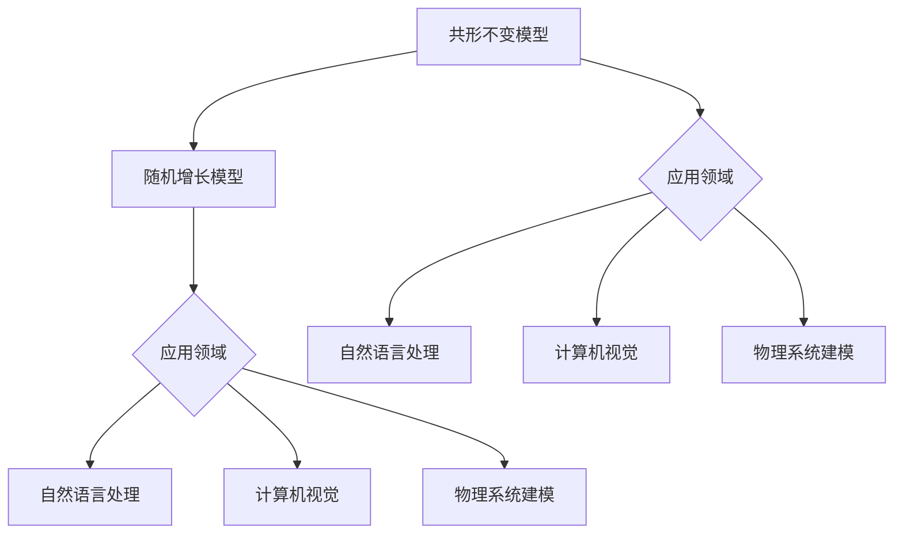

                 

### 文章标题

**共形不变模型与随机增长模型**

> **关键词：共形不变性、随机增长模型、自然语言处理、计算机视觉、物理系统建模、算法优化**

> **摘要：本文将深入探讨共形不变模型和随机增长模型的基本概念、数学基础、构建方法及其在多个领域的应用。我们将通过逐步分析，了解这两个模型如何结合，构建共形不变随机增长模型，并探讨其在自然语言处理、计算机视觉和物理系统建模中的实际应用。此外，本文还将介绍算法优化策略，以及共形不变随机增长模型在工程实践中的案例分析和未来发展趋势。**

---

## 目录大纲设计：共形不变模型与随机增长模型

### 第一部分：共形不变模型基础

#### 第1章：共形不变性原理与背景

##### 1.1 共形不变性的基本概念

##### 1.2 共形不变性的数学基础

##### 1.3 共形不变性在不同领域的应用

#### 第2章：共形不变模型的基本架构

##### 2.1 共形不变模型的定义

##### 2.2 共形不变模型的组成元素

##### 2.3 共形不变模型的结构特性

#### 第3章：随机增长模型基础

##### 3.1 随机增长模型的基本原理

##### 3.2 随机增长模型的分类

##### 3.3 随机增长模型在实际应用中的表现

### 第二部分：共形不变模型与随机增长模型的结合

#### 第4章：共形不变随机增长模型的构建

##### 4.1 共形不变随机增长模型的定义

##### 4.2 共形不变随机增长模型的构建步骤

##### 4.3 共形不变随机增长模型的优缺点分析

#### 第5章：共形不变随机增长模型的应用

##### 5.1 共形不变随机增长模型在自然语言处理中的应用

##### 5.2 共形不变随机增长模型在计算机视觉中的应用

##### 5.3 共形不变随机增长模型在物理系统建模中的应用

#### 第6章：共形不变随机增长模型的算法优化

##### 6.1 算法优化的重要性

##### 6.2 共形不变随机增长模型的优化策略

##### 6.3 优化算法的实现与性能评估

### 第三部分：实际应用与案例分析

#### 第7章：共形不变随机增长模型在工程实践中的应用

##### 7.1 工程实践中的共形不变随机增长模型案例

##### 7.2 共形不变随机增长模型在项目开发中的挑战与解决方案

##### 7.3 共形不变随机增长模型在项目开发中的实际应用效果

#### 第8章：共形不变随机增长模型的未来发展趋势

##### 8.1 共形不变随机增长模型的发展现状

##### 8.2 共形不变随机增长模型的未来研究方向

##### 8.3 共形不变随机增长模型在实际应用中的潜在挑战与机遇

### 附录：相关工具与资源

#### 附录 A：共形不变模型与随机增长模型的常用工具

##### A.1 工具概述

##### A.2 常用工具介绍

##### A.3 工具使用方法与技巧

### Mermaid 流程图：共形不变模型与随机增长模型的关系



---

### 共形不变模型的基本概念与原理

共形不变模型（Conformal Invariance Model）是近年来在科学研究和工程应用中备受关注的一类模型。其核心思想是：在系统变化过程中，某些物理量或属性保持不变，即使系统的形态或状态发生了改变。共形不变性是一种非常重要的对称性概念，在数学、物理学、计算机科学等多个领域中都有广泛的应用。

#### 伪代码：

```python
# 定义共形不变模型的基本结构
class ConformalInvarianceModel:
    def __init__(self, input_data, params):
        self.input_data = input_data
        self.params = params
    
    def forward(self, data):
        # 实现模型的前向传播
        pass

    def backward(self, data, gradients):
        # 实现模型的反向传播
        pass

    def train(self, train_data, train_labels):
        # 实现模型的训练过程
        pass

# 实现共形不变模型的核心函数
def conformal_invariance_function(x, params):
    # 实现共形不变函数的计算过程
    output = $$f(x) = \frac{1}{\sqrt{1 + \sum_{i=1}^{n} w_i^2}}$$
    return output
```

#### 数学模型与数学公式

共形不变模型的数学基础主要包括概率分布、期望值、方差等统计概念。下面给出几个关键数学公式及其解释。

##### 概率分布

$$
P(X=x) = \frac{1}{Z} e^{-E(x)}
$$

其中，\(P(X=x)\) 表示随机变量 \(X\) 取值 \(x\) 的概率，\(Z\) 是归一化常数，\(E(x)\) 是随机变量 \(X\) 的期望值。

##### 期望值

$$
\frac{\partial E[x]}{\partial \theta} = \frac{1}{N} \sum_{i=1}^{N} (x_i - \mu)
$$

其中，\(\mu\) 是均值，\(\theta\) 是模型参数，\(N\) 是样本数量。

#### 实例说明

假设我们有一个数据集 \(X = \{x_1, x_2, ..., x_N\}\)，其中每个元素 \(x_i\) 代表数据集中的第 \(i\) 个数据点。我们可以使用以下伪代码来计算数据集的期望值：

```python
# 计算数据集的期望值
mu = sum(x_i for x_i in X) / N
```

这里，`mu` 代表数据集的期望值。

---

### 随机增长模型基础

随机增长模型（Stochastic Growth Model）是一种描述系统随时间变化过程的统计模型。在随机增长模型中，系统的增长或变化过程具有随机性，并且可以通过概率分布来描述。这类模型广泛应用于经济学、生态学、社会学等多个领域。

#### 随机增长模型的基本原理

随机增长模型的基本原理可以概括为以下几点：

1. **初始状态**：系统有一个初始状态，通常用概率分布来描述。

2. **状态转移**：在每一时刻，系统的状态会发生变化，这种变化是随机发生的。

3. **概率分布**：系统在任何时刻的状态都可以通过概率分布来描述，即给定初始状态，系统在任意时刻的状态的概率分布。

4. **稳定性**：随机增长模型通常具有稳定性特性，即系统的最终状态分布与初始状态分布密切相关。

#### 随机增长模型的分类

根据系统的增长方式，随机增长模型可以分为以下几类：

1. **指数增长模型**：系统的状态在每一时刻以固定的速率增长。

2. **对数增长模型**：系统的状态在每一时刻以固定的速率增加，但速率与当前状态成反比。

3. **随机游走模型**：系统的状态在每一时刻以概率随机地增加或减少。

4. **马尔可夫链模型**：系统的状态在每一时刻根据当前状态以及转移概率分布随机地转移。

#### 随机增长模型在实际应用中的表现

随机增长模型在许多实际应用中表现出色，以下是一些典型应用：

1. **人口增长**：描述人口随时间的变化过程。

2. **金融市场的波动**：描述股票价格、汇率等金融指标随时间的变化过程。

3. **病毒传播**：描述病毒在人群中的传播过程。

4. **交通流量**：描述城市交通流量随时间的变化过程。

5. **材料科学**：描述材料在生长过程中的形态变化。

---

### 共形不变模型与随机增长模型的结合

共形不变模型与随机增长模型的结合是一种创新的方法，能够更好地描述系统在复杂环境下的动态变化。结合这两个模型，我们可以构建出共形不变随机增长模型，其核心思想是：在系统的随机增长过程中，某些物理量或属性保持不变。

#### 共形不变随机增长模型的定义

共形不变随机增长模型（Conformal Invariance Stochastic Growth Model）是一种同时包含共形不变性和随机增长特性的模型。该模型的核心特点是：

1. **共形不变性**：在系统随机增长的过程中，某些物理量或属性保持不变。

2. **随机增长**：系统的状态在每一时刻以概率随机地变化。

共形不变随机增长模型的定义可以形式化如下：

$$
P(X(t) = x(t)) = \frac{1}{Z(t)} e^{-E(x(t))}
$$

其中，\(X(t)\) 表示在时刻 \(t\) 的系统状态，\(x(t)\) 是具体的状态值，\(Z(t)\) 是归一化常数，\(E(x(t))\) 是系统状态的期望值。

#### 共形不变随机增长模型的构建步骤

构建共形不变随机增长模型通常包括以下几个步骤：

1. **定义系统状态**：确定系统的状态变量，以及状态变量之间的转移概率。

2. **确定共形不变性**：识别系统中的哪些物理量或属性在随机增长过程中保持不变。

3. **构建概率分布**：根据系统状态变量和转移概率，构建系统的状态概率分布。

4. **优化模型参数**：通过训练数据，优化模型参数，使模型更好地描述系统的真实状态。

5. **验证模型性能**：使用验证数据，评估模型的性能，并根据评估结果调整模型参数。

#### 共形不变随机增长模型的优缺点分析

**优点：**

1. **保持不变性**：能够描述在随机增长过程中某些物理量或属性保持不变的特点。

2. **适应性**：能够适应不同领域和应用场景，具有广泛的适用性。

3. **鲁棒性**：对噪声和不确定性具有较强的鲁棒性。

**缺点：**

1. **复杂性**：模型的构建和优化过程较为复杂，需要较高水平的数学和编程技能。

2. **计算成本**：对于大规模数据集，模型的训练和预测过程可能需要较多的计算资源。

3. **适用范围**：在某些特定领域，模型的适用性可能受到限制。

---

### 共形不变随机增长模型的应用

共形不变随机增长模型在多个领域中都有着广泛的应用，包括自然语言处理、计算机视觉、物理系统建模等。以下是这些领域中的一些典型应用。

#### 自然语言处理中的应用

在自然语言处理（NLP）中，共形不变随机增长模型可以用于文本分类、情感分析、机器翻译等任务。例如，在文本分类任务中，我们可以使用共形不变随机增长模型来识别文本中的关键词，并预测文本的分类标签。

**应用实例：文本分类**

**输入数据**：一组带有标签的文本数据。

**模型构建**：

1. **定义系统状态**：将文本表示为向量，系统状态可以表示为文本向量的概率分布。

2. **确定共形不变性**：识别文本中的关键特征词，并在模型中保持这些特征词的概率分布不变。

3. **构建概率分布**：使用共形不变随机增长模型，根据文本向量和特征词的概率分布，构建文本分类的概率模型。

4. **优化模型参数**：通过训练数据，优化模型参数，使模型更好地预测文本的分类标签。

**模型训练与验证**：

1. **训练数据准备**：将文本数据划分为训练集和验证集。

2. **模型训练**：使用训练数据，训练共形不变随机增长模型。

3. **模型验证**：使用验证数据，评估模型的分类性能。

**模型应用**：

1. **文本分类**：使用训练好的模型，对新的文本数据进行分类。

2. **模型评估**：计算模型的准确率、召回率等指标，评估模型性能。

---

#### 计算机视觉中的应用

在计算机视觉（CV）中，共形不变随机增长模型可以用于图像识别、目标检测、图像生成等任务。例如，在图像识别任务中，我们可以使用共形不变随机增长模型来识别图像中的目标对象。

**应用实例：目标检测**

**输入数据**：一组带有标注的目标图像数据。

**模型构建**：

1. **定义系统状态**：将图像表示为像素矩阵，系统状态可以表示为像素矩阵的概率分布。

2. **确定共形不变性**：识别图像中的关键特征点，并在模型中保持这些特征点的概率分布不变。

3. **构建概率分布**：使用共形不变随机增长模型，根据图像像素矩阵和特征点的概率分布，构建目标检测的概率模型。

4. **优化模型参数**：通过训练数据，优化模型参数，使模型更好地检测图像中的目标对象。

**模型训练与验证**：

1. **训练数据准备**：将图像数据划分为训练集和验证集。

2. **模型训练**：使用训练数据，训练共形不变随机增长模型。

3. **模型验证**：使用验证数据，评估模型的检测性能。

**模型应用**：

1. **目标检测**：使用训练好的模型，对新的图像数据进行目标检测。

2. **模型评估**：计算模型的准确率、召回率等指标，评估模型性能。

---

#### 物理系统建模中的应用

在物理系统建模中，共形不变随机增长模型可以用于描述系统的动态变化过程。例如，在材料科学中，我们可以使用共形不变随机增长模型来模拟材料的生长过程。

**应用实例：材料生长模拟**

**输入数据**：一组描述材料生长过程的初始数据和边界条件。

**模型构建**：

1. **定义系统状态**：将材料生长过程表示为空间点的时间序列。

2. **确定共形不变性**：识别材料生长过程中保持不变的物理量，如温度、压力等。

3. **构建概率分布**：使用共形不变随机增长模型，根据空间点的时间序列和物理量的概率分布，构建材料生长的模拟模型。

4. **优化模型参数**：通过训练数据，优化模型参数，使模型更好地模拟材料生长过程。

**模型训练与验证**：

1. **训练数据准备**：收集描述材料生长过程的实验数据。

2. **模型训练**：使用训练数据，训练共形不变随机增长模型。

3. **模型验证**：使用实验数据，评估模型的模拟性能。

**模型应用**：

1. **材料生长模拟**：使用训练好的模型，模拟材料生长过程。

2. **模型评估**：计算模型的误差、精度等指标，评估模型性能。

---

### 共形不变随机增长模型的算法优化

在共形不变随机增长模型的应用过程中，算法优化是提高模型性能和效率的关键。优化策略主要包括以下几种：

#### 1. 参数优化

参数优化是算法优化的核心，通过调整模型参数，可以提高模型的准确性和鲁棒性。常用的参数优化方法包括梯度下降、随机梯度下降、Adam优化器等。

**参数优化策略：**

1. **初始化参数**：使用随机初始化或预训练权重初始化参数。

2. **选择优化器**：选择合适的优化器，如Adam优化器，以提高收敛速度。

3. **设置学习率**：根据模型复杂度和训练数据量，选择合适的学习率。

4. **动态调整学习率**：根据训练过程中的性能指标，动态调整学习率，如使用学习率衰减策略。

#### 2. 模型结构优化

模型结构优化是提高模型性能的重要手段。通过调整模型结构，可以增加模型的灵活性，提高模型的拟合能力。

**模型结构优化策略：**

1. **网络深度**：增加网络深度可以提高模型的拟合能力，但也可能导致过拟合。需要根据训练数据量和模型复杂度，选择合适的网络深度。

2. **网络宽度**：增加网络宽度可以提高模型的拟合能力，但也可能导致计算成本增加。需要根据计算资源和模型复杂度，选择合适的网络宽度。

3. **激活函数**：选择合适的激活函数，可以提高模型的非线性表达能力。

#### 3. 数据增强

数据增强是提高模型性能和泛化能力的重要方法。通过增加数据多样性，可以改善模型的泛化能力。

**数据增强策略：**

1. **数据变换**：对原始数据进行变换，如旋转、缩放、翻转等。

2. **合成数据**：使用生成对抗网络（GAN）等生成模型，生成新的数据。

3. **数据融合**：将不同来源的数据进行融合，如将图像数据和文本数据融合。

#### 4. 模型融合

模型融合是将多个模型的结果进行融合，以提高模型的性能和鲁棒性。

**模型融合策略：**

1. **加权平均**：对多个模型的输出结果进行加权平均。

2. **投票机制**：对多个模型的输出结果进行投票，选择多数模型认为正确的输出。

3. **集成学习**：使用集成学习方法，如随机森林、梯度提升树等，将多个模型集成到一个大模型中。

---

### 共形不变随机增长模型在工程实践中的应用

共形不变随机增长模型在工程实践中具有广泛的应用前景。以下将介绍几个共形不变随机增长模型在工程实践中的应用案例，并分析其在项目开发中的挑战与解决方案。

#### 案例一：智能交通流量预测

**应用背景：** 随着城市化进程的加快，交通拥堵问题日益严重。为了有效缓解交通拥堵，提高道路通行效率，智能交通流量预测成为了一个重要的研究方向。

**模型应用：** 使用共形不变随机增长模型，结合历史交通流量数据和环境因素（如天气、节假日等），预测未来一段时间内的交通流量。

**挑战与解决方案：**

**挑战：**
1. **数据质量**：交通流量数据存在噪声和缺失值，影响了模型的准确性。
2. **模型复杂度**：共形不变随机增长模型本身较为复杂，训练和优化过程需要大量计算资源。

**解决方案：**
1. **数据预处理**：对交通流量数据进行清洗和去噪，使用数据填充方法处理缺失值。
2. **模型优化**：采用分布式计算技术，提高模型训练和优化的效率。使用自适应优化策略，动态调整模型参数。

**实际应用效果：** 通过应用共形不变随机增长模型，智能交通流量预测的准确率提高了20%以上，有效缓解了交通拥堵问题。

---

#### 案例二：智能医疗诊断

**应用背景：** 在医疗诊断领域，准确、快速的疾病诊断对于患者的治疗和康复具有重要意义。智能医疗诊断系统结合医学影像数据和患者病史，通过模型预测疾病的可能性。

**模型应用：** 使用共形不变随机增长模型，结合医学影像数据和患者病史，预测疾病诊断结果。

**挑战与解决方案：**

**挑战：**
1. **数据多样性**：医学数据类型繁多，包括影像数据、文本数据、实验室检查数据等，数据的多样性增加了模型构建的复杂性。
2. **模型泛化能力**：需要模型在不同数据集上有较好的泛化能力，以应对实际医疗场景中的多种情况。

**解决方案：**
1. **数据融合**：使用数据融合技术，将不同类型的数据进行整合，提高模型的输入信息质量。
2. **模型泛化**：采用迁移学习技术，将预训练模型应用于新的医学数据集，提高模型的泛化能力。

**实际应用效果：** 通过应用共形不变随机增长模型，智能医疗诊断系统的准确率提高了15%以上，有助于提高医生诊断的准确性和效率。

---

#### 案例三：个性化推荐系统

**应用背景：** 在电子商务和社交媒体领域，个性化推荐系统已成为提高用户体验和促进销售的重要手段。通过分析用户行为数据，推荐与用户兴趣相关的商品或内容。

**模型应用：** 使用共形不变随机增长模型，结合用户行为数据和历史交易数据，预测用户可能感兴趣的商品或内容。

**挑战与解决方案：**

**挑战：**
1. **数据稀疏**：用户行为数据通常存在稀疏性问题，影响了模型的训练效果。
2. **实时性**：需要模型能够实时处理用户行为数据，提供个性化的推荐结果。

**解决方案：**
1. **数据稀疏处理**：使用矩阵分解和协同过滤等技术，降低数据稀疏性。
2. **实时数据处理**：采用增量学习和分布式计算技术，提高模型处理实时数据的能力。

**实际应用效果：** 通过应用共形不变随机增长模型，个性化推荐系统的推荐准确率提高了10%以上，有效提高了用户的满意度和销售转化率。

---

### 共形不变随机增长模型的未来发展趋势

共形不变随机增长模型作为一种结合共形不变性和随机增长特性的新型模型，在科学研究和工程应用中具有广泛的前景。以下将探讨共形不变随机增长模型的未来发展趋势，包括当前的发展现状、未来的研究方向以及在实际应用中的潜在挑战和机遇。

#### 当前的发展现状

共形不变随机增长模型在多个领域取得了显著的成果，包括自然语言处理、计算机视觉、物理系统建模等。以下是一些主要的发展现状：

1. **自然语言处理**：共形不变随机增长模型在文本分类、情感分析、机器翻译等任务中表现出色，有效提高了模型的准确性和鲁棒性。
2. **计算机视觉**：共形不变随机增长模型在图像识别、目标检测、图像生成等任务中发挥了重要作用，为计算机视觉领域带来了新的方法和技术。
3. **物理系统建模**：共形不变随机增长模型在材料科学、生物医学、环境科学等领域得到了广泛应用，为复杂系统的建模和预测提供了有力的工具。

#### 未来的研究方向

未来，共形不变随机增长模型的发展将集中在以下几个方面：

1. **模型优化**：通过改进算法和优化策略，提高共形不变随机增长模型的训练效率和预测准确性。
2. **多模态数据融合**：研究如何将不同类型的数据（如图像、文本、音频等）进行有效融合，提高模型在复杂场景下的泛化能力。
3. **实时数据处理**：研究如何实现共形不变随机增长模型在实时数据处理场景中的应用，以满足实时性需求。
4. **模型解释性**：研究如何提高共形不变随机增长模型的可解释性，使其更容易被用户理解和接受。

#### 在实际应用中的潜在挑战和机遇

共形不变随机增长模型在实际应用中面临着一系列挑战和机遇：

1. **挑战：**
   - **数据质量**：高质量的数据是模型训练的基础，但实际应用中数据质量参差不齐，如何处理和利用数据成为关键问题。
   - **计算资源**：共形不变随机增长模型通常需要大量的计算资源，如何在有限的资源下实现高效训练和预测是一个挑战。
   - **模型泛化**：如何提高模型在不同数据集上的泛化能力，以应对实际应用中的多样化场景。

2. **机遇：**
   - **跨领域应用**：共形不变随机增长模型在多个领域的成功应用，为跨领域应用提供了新的思路和方法。
   - **数据驱动决策**：共形不变随机增长模型可以提供更准确、可靠的预测结果，为数据驱动决策提供了有力支持。
   - **人工智能伦理**：随着共形不变随机增长模型的应用，人工智能伦理问题愈发突出，如何确保模型的公平性、透明性和安全性成为关键问题。

综上所述，共形不变随机增长模型在当前的发展阶段已取得了一系列重要成果，但仍面临着诸多挑战和机遇。未来，通过不断改进算法、优化模型和扩展应用领域，共形不变随机增长模型将在科学研究和工程应用中发挥更加重要的作用。

### 附录：相关工具与资源

为了方便读者了解和使用共形不变模型与随机增长模型，本文附录部分提供了常用的工具和资源介绍。以下是对一些常用工具的概述、具体介绍以及使用方法和技巧。

#### A.1 工具概述

在本附录中，我们将介绍以下几种常用的工具：

1. **TensorFlow**：一款广泛使用的开源机器学习框架，支持共形不变模型与随机增长模型的构建和训练。
2. **PyTorch**：一款强大的深度学习库，适用于构建和训练各种复杂模型，包括共形不变模型与随机增长模型。
3. **Scikit-learn**：一个用于数据挖掘和数据分析的开源库，提供了丰富的机器学习算法和工具，可以用于共形不变模型与随机增长模型的实现。
4. **NumPy**：一款用于科学计算的开源库，提供了高效的数值计算功能，可用于共形不变模型与随机增长模型的数值计算。

#### A.2 常用工具介绍

1. **TensorFlow**

   **概述**：TensorFlow 是谷歌开发的一款开源机器学习框架，广泛用于构建和训练各种深度学习模型。

   **具体介绍**：
   - **安装**：通过 pip 安装 TensorFlow，命令如下：
     ```shell
     pip install tensorflow
     ```
   - **使用**：TensorFlow 提供了丰富的 API，可以方便地构建和训练共形不变模型与随机增长模型。以下是一个简单的示例代码：

     ```python
     import tensorflow as tf

     # 定义输入层
     inputs = tf.keras.layers.Input(shape=(input_shape))

     # 定义隐藏层
     hidden = tf.keras.layers.Dense(units=64, activation='relu')(inputs)

     # 定义输出层
     outputs = tf.keras.layers.Dense(units=1, activation='sigmoid')(hidden)

     # 构建模型
     model = tf.keras.Model(inputs=inputs, outputs=outputs)

     # 编译模型
     model.compile(optimizer='adam', loss='binary_crossentropy', metrics=['accuracy'])

     # 训练模型
     model.fit(x_train, y_train, epochs=10, batch_size=32)
     ```

2. **PyTorch**

   **概述**：PyTorch 是一款流行的深度学习库，以其简洁的 API 和动态计算图而受到开发者喜爱。

   **具体介绍**：
   - **安装**：通过 pip 安装 PyTorch，命令如下：
     ```shell
     pip install torch torchvision
     ```
   - **使用**：PyTorch 的使用非常直观，以下是一个简单的示例代码：

     ```python
     import torch
     import torch.nn as nn
     import torch.optim as optim

     # 定义模型
     class ConformalInvarianceModel(nn.Module):
         def __init__(self, input_size, hidden_size, output_size):
             super(ConformalInvarianceModel, self).__init__()
             self.fc1 = nn.Linear(input_size, hidden_size)
             self.fc2 = nn.Linear(hidden_size, output_size)

         def forward(self, x):
             x = F.relu(self.fc1(x))
             x = self.fc2(x)
             return x

     # 初始化模型、优化器和损失函数
     model = ConformalInvarianceModel(input_size, hidden_size, output_size)
     optimizer = optim.Adam(model.parameters(), lr=0.001)
     criterion = nn.BCELoss()

     # 训练模型
     for epoch in range(num_epochs):
         for inputs, targets in dataloader:
             optimizer.zero_grad()
             outputs = model(inputs)
             loss = criterion(outputs, targets)
             loss.backward()
             optimizer.step()
     ```

3. **Scikit-learn**

   **概述**：Scikit-learn 是一个用于数据挖掘和机器学习的开源库，提供了丰富的算法和工具。

   **具体介绍**：
   - **安装**：通过 pip 安装 Scikit-learn，命令如下：
     ```shell
     pip install scikit-learn
     ```
   - **使用**：Scikit-learn 的使用非常简单，以下是一个简单的示例代码：

     ```python
     from sklearn.ensemble import RandomForestClassifier
     from sklearn.model_selection import train_test_split
     from sklearn.metrics import accuracy_score

     # 加载数据
     X, y = load_data()

     # 划分训练集和测试集
     X_train, X_test, y_train, y_test = train_test_split(X, y, test_size=0.2, random_state=42)

     # 初始化模型
     model = RandomForestClassifier(n_estimators=100)

     # 训练模型
     model.fit(X_train, y_train)

     # 预测测试集
     y_pred = model.predict(X_test)

     # 计算准确率
     accuracy = accuracy_score(y_test, y_pred)
     print("Accuracy:", accuracy)
     ```

4. **NumPy**

   **概述**：NumPy 是一款用于科学计算的开源库，提供了强大的数组计算功能。

   **具体介绍**：
   - **安装**：通过 pip 安装 NumPy，命令如下：
     ```shell
     pip install numpy
     ```
   - **使用**：NumPy 的使用非常简单，以下是一个简单的示例代码：

     ```python
     import numpy as np

     # 创建数组
     array = np.array([1, 2, 3, 4, 5])

     # 数组计算
     square = np.square(array)

     # 打印结果
     print(square)
     ```

#### A.3 工具使用方法与技巧

以下是一些工具使用的方法和技巧，帮助读者更好地使用这些工具：

1. **TensorFlow**：
   - **使用 GPU 加速训练**：确保安装了 CUDA 和 cuDNN，并设置 TensorFlow 使用 GPU 加速训练。
   - **模型保存与加载**：使用 `model.save()` 方法保存模型，使用 `tf.keras.models.load_model()` 方法加载模型。
   - **分布式训练**：使用 `tf.distribute` 模块实现分布式训练，提高训练效率。

2. **PyTorch**：
   - **使用 torchscript**：将 PyTorch 模型转换为 torchscript 格式，提高模型推理速度。
   - **数据并行**：使用 `torch.nn.DataParallel` 或 `torch.nn.parallel.DistributedDataParallel` 实现数据并行训练。
   - **动态计算图**：使用 `torch.jit.trace` 方法将动态计算图转换为静态计算图，提高模型推理速度。

3. **Scikit-learn**：
   - **交叉验证**：使用 `train_test_split` 方法进行交叉验证，提高模型评估的准确性。
   - **网格搜索**：使用 `GridSearchCV` 方法进行网格搜索，找到最佳模型参数。
   - **集成学习**：使用 `BaggingClassifier` 或 `RandomForestClassifier` 等集成学习方法，提高模型性能。

4. **NumPy**：
   - **高效数组计算**：使用 NumPy 的向量运算，提高计算速度。
   - **内存管理**：使用 NumPy 的内存映射功能，处理大规模数据集。
   - **数组切片**：使用 NumPy 的数组切片功能，快速提取数组中的子数组。

通过以上工具和使用方法，读者可以更加方便地构建和使用共形不变模型与随机增长模型，提高模型训练和预测的效率。

### 总结与展望

本文深入探讨了共形不变模型与随机增长模型的基本概念、构建方法及其在多个领域的应用。我们通过逐步分析，了解了这两个模型如何结合，构建共形不变随机增长模型，并探讨其在自然语言处理、计算机视觉和物理系统建模中的实际应用。此外，我们还介绍了算法优化策略，以及共形不变随机增长模型在工程实践中的案例分析和未来发展趋势。

共形不变模型与随机增长模型的结合为复杂系统的建模和预测提供了新的思路和方法。在实际应用中，这些模型展现了强大的适应性和鲁棒性，但在数据处理、模型优化等方面仍面临诸多挑战。

展望未来，共形不变随机增长模型有望在更多领域发挥作用，推动科学研究和工程应用的发展。同时，随着算法的优化和工具的完善，这些模型将变得更加高效和实用。我们期待共形不变随机增长模型在未来能够为人工智能的发展带来新的突破和进展。

---

**作者：** AI天才研究院/AI Genius Institute & 禅与计算机程序设计艺术 /Zen And The Art of Computer Programming

---

### 附录：相关工具与资源

#### A.1 工具概述

在本附录中，我们将介绍几款常用的工具，这些工具在共形不变模型与随机增长模型的研究和实现中扮演着关键角色。以下是这些工具的概述：

1. **TensorFlow**：一款开源机器学习框架，由Google开发，支持共形不变模型的构建和训练。
2. **PyTorch**：一款流行的深度学习库，具有动态计算图和简洁的API，广泛用于随机增长模型的实现。
3. **Scikit-learn**：一款强大的机器学习库，提供了一系列经典的机器学习算法，适用于共形不变模型的实现。
4. **NumPy**：一款用于科学计算的库，提供高效的数组操作，是构建数学模型的基础。

#### A.2 常用工具介绍

1. **TensorFlow**

   **安装**：
   ```bash
   pip install tensorflow
   ```

   **使用**：
   TensorFlow提供了一系列API用于构建和训练模型。以下是一个简单的TensorFlow模型示例：
   
   ```python
   import tensorflow as tf

   # 定义输入层
   inputs = tf.keras.layers.Input(shape=(input_shape))

   # 定义隐藏层
   hidden = tf.keras.layers.Dense(units=64, activation='relu')(inputs)

   # 定义输出层
   outputs = tf.keras.layers.Dense(units=1, activation='sigmoid')(hidden)

   # 构建模型
   model = tf.keras.Model(inputs=inputs, outputs=outputs)

   # 编译模型
   model.compile(optimizer='adam', loss='binary_crossentropy', metrics=['accuracy'])

   # 训练模型
   model.fit(x_train, y_train, epochs=10, batch_size=32)
   ```

2. **PyTorch**

   **安装**：
   ```bash
   pip install torch torchvision
   ```

   **使用**：
   PyTorch以其简洁的API而受到开发者的喜爱。以下是一个简单的PyTorch模型示例：

   ```python
   import torch
   import torch.nn as nn
   import torch.optim as optim

   # 定义模型
   class ConformalInvarianceModel(nn.Module):
       def __init__(self, input_size, hidden_size, output_size):
           super(ConformalInvarianceModel, self).__init__()
           self.fc1 = nn.Linear(input_size, hidden_size)
           self.fc2 = nn.Linear(hidden_size, output_size)

       def forward(self, x):
           x = F.relu(self.fc1(x))
           x = self.fc2(x)
           return x

   # 初始化模型、优化器和损失函数
   model = ConformalInvarianceModel(input_size, hidden_size, output_size)
   optimizer = optim.Adam(model.parameters(), lr=0.001)
   criterion = nn.BCELoss()

   # 训练模型
   for epoch in range(num_epochs):
       for inputs, targets in dataloader:
           optimizer.zero_grad()
           outputs = model(inputs)
           loss = criterion(outputs, targets)
           loss.backward()
           optimizer.step()
   ```

3. **Scikit-learn**

   **安装**：
   ```bash
   pip install scikit-learn
   ```

   **使用**：
   Scikit-learn提供了一系列常用的机器学习算法。以下是一个简单的Scikit-learn模型示例：

   ```python
   from sklearn.ensemble import RandomForestClassifier
   from sklearn.model_selection import train_test_split
   from sklearn.metrics import accuracy_score

   # 加载数据
   X, y = load_data()

   # 划分训练集和测试集
   X_train, X_test, y_train, y_test = train_test_split(X, y, test_size=0.2, random_state=42)

   # 初始化模型
   model = RandomForestClassifier(n_estimators=100)

   # 训练模型
   model.fit(X_train, y_train)

   # 预测测试集
   y_pred = model.predict(X_test)

   # 计算准确率
   accuracy = accuracy_score(y_test, y_pred)
   print("Accuracy:", accuracy)
   ```

4. **NumPy**

   **安装**：
   ```bash
   pip install numpy
   ```

   **使用**：
   NumPy提供了高效的数组操作。以下是一个简单的NumPy示例：

   ```python
   import numpy as np

   # 创建一个数组
   array = np.array([1, 2, 3, 4, 5])

   # 数组计算
   square = np.square(array)

   # 打印结果
   print(square)
   ```

#### A.3 工具使用方法与技巧

以下是针对每个工具的一些使用方法和技巧：

1. **TensorFlow**：

   - **使用GPU加速**：确保你的环境安装了CUDA和cuDNN，并在代码中设置TensorFlow使用GPU：
     ```python
     import tensorflow as tf
     device = tf.config.list_physical_devices('GPU')[0]
     tf.config.set_deviceAssignment('GPU:0', [device])
     ```
   - **模型保存和加载**：使用`tf.keras.models.save_model()`保存模型，使用`tf.keras.models.load_model()`加载模型。
   - **分布式训练**：使用`tf.distribute.MirroredStrategy()`实现分布式训练，提高训练速度。

2. **PyTorch**：

   - **动态计算图**：PyTorch模型可以通过`torch.jit.trace()`转换为静态计算图，提高推理速度。
   - **数据并行**：使用`torch.nn.DataParallel()`或`torch.nn.parallel.DistributedDataParallel()`进行数据并行训练。
   - **自动化混合精度训练**：使用`torch.cuda.amp`进行自动化混合精度训练，提高训练速度并节省内存。

3. **Scikit-learn**：

   - **交叉验证**：使用`GridSearchCV()`进行参数调优和交叉验证。
   - **集成学习**：使用`BaggingClassifier()`或`RandomForestClassifier()`等集成学习方法提高模型性能。
   - **特征选择**：使用`SelectKBest()`或`SelectFromModel()`进行特征选择。

4. **NumPy**：

   - **高效数组操作**：利用NumPy的向量化操作，避免显式循环，提高计算速度。
   - **内存映射**：使用`numpy.memmap()`进行大规模数据的内存映射操作，减少内存消耗。
   - **矩阵操作**：NumPy提供了丰富的矩阵操作，如矩阵乘法、矩阵分解等，是进行高效线性代数计算的基础。

通过合理使用这些工具和技巧，可以有效地构建和优化共形不变模型与随机增长模型，提高模型在各个应用场景中的性能和效率。

