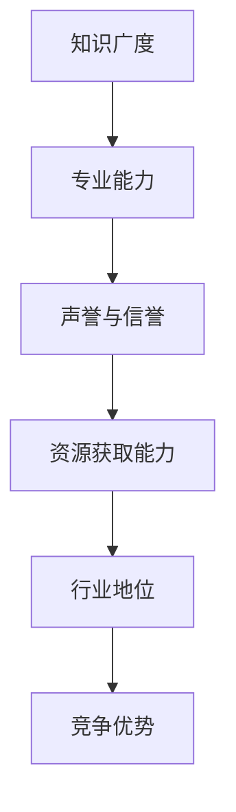
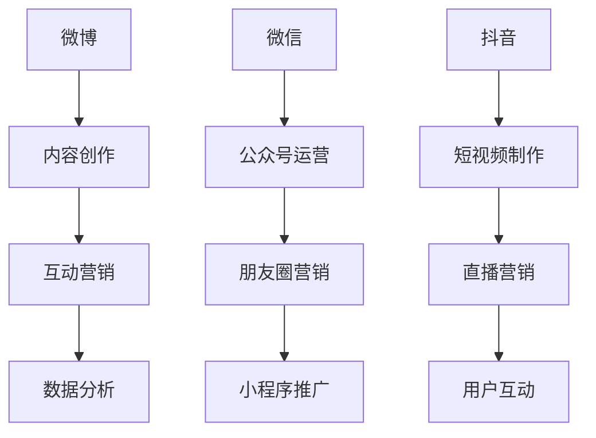

                 

# 《创业者如何建立行业影响力》

> 关键词：行业影响力、创业者、品牌建设、内容营销、社交媒体、合作策略、资源整合、案例分析、实战技巧、趋势分析、优化策略

> 摘要：本文旨在探讨创业者如何通过有效的策略和手段建立和提升在行业中的影响力。文章将从行业影响力的定义、评估指标、定位与差异化、内容营销策略、社交媒体与网络影响力、品牌建设、行业合作与资源整合等多个方面进行详细阐述，并结合国内外的成功案例，提供实用的实战策略与实施步骤，帮助创业者更好地把握行业动态，提升个人和企业品牌价值。

### 目录大纲

1. **行业影响力概述**
   - 1.1 行业影响力的定义与价值
   - 1.2 行业影响力评估指标

2. **建立行业影响力的策略**
   - 2.1 定位与差异化
   - 2.2 内容营销策略
   - 2.3 社交媒体与网络影响力
   - 2.4 品牌建设与传播
   - 2.5 行业合作与资源整合

3. **行业影响力案例分析**
   - 3.1 国内成功案例
   - 3.2 国际成功案例

4. **实战策略与实施**
   - 4.1 实战策略制定
   - 4.2 实施策略与步骤

5. **持续优化与迭代**
   - 5.1 行业趋势分析
   - 5.2 优化策略

6. **附录**
   - 6.1 行业影响力工具与资源
   - 6.2 行业影响力相关术语解释

----------------------------------------------------------------

## 第1章：行业影响力的定义与价值

### 1.1 行业影响力的概念解析

行业影响力，指的是个体或组织在特定行业内，通过专业知识、创新能力、市场表现、品牌认知度等多方面因素，对行业内外部产生的影响力和控制力。行业影响力不仅反映了个人或企业的市场地位，也是其综合实力和核心竞争力的体现。

**1.1.1 行业影响力的含义**

行业影响力包括以下几个层面的含义：

- **知识广度**：指个体在行业内的知识储备和知识结构，包括专业知识和跨领域知识。
- **专业能力**：指个体在特定领域内的实际操作能力和技术水平。
- **声誉与信誉**：指个体在行业内外部的口碑、评价和信任度。
- **资源获取能力**：指个体在行业内获取资金、技术、人才等资源的能力。
- **行业地位**：指个体在行业内的排名和地位，包括领导力、话语权等。

**1.1.2 行业影响力的构成**

行业影响力的构成可以从以下几个方面来理解：

1. **专业知识与技能**：创业者需要在行业内拥有扎实的专业知识和技能，这是建立行业影响力的基础。
2. **创新与贡献**：创业者应通过创新和贡献来推动行业发展，提升自己的行业地位。
3. **品牌价值**：通过品牌建设，提高个人或企业的品牌价值，增强市场竞争力。
4. **资源整合能力**：创业者应具备整合资源的能力，包括资金、人才、技术等，以支持企业的快速发展。

**1.1.3 行业影响力的作用**

行业影响力对创业者有以下重要作用：

- **提升个人/企业品牌价值**：强大的行业影响力有助于提升个人或企业的品牌形象和市场认可度。
- **拓展商业合作机会**：创业者可以通过行业影响力，更容易地与其他行业内的企业建立合作关系，共同开发市场。
- **增强市场竞争力**：强大的行业影响力有助于在市场竞争中占据有利地位，获得更多的市场份额。

### Mermaid 流程图：行业影响力构成要素



## 1.2 建立行业影响力的价值

建立行业影响力对创业者来说具有多重价值，主要体现在以下几个方面：

**1.2.1 提升个人/企业品牌价值**

行业影响力是品牌价值的重要组成部分。创业者通过不断提升自己在行业内的知名度、专业度和创新能力，可以有效提升个人和企业的品牌价值。高品牌价值不仅能够吸引更多的客户和合作伙伴，还能为企业在资本市场获得更高的估值。

**1.2.2 拓展商业合作机会**

强大的行业影响力有助于创业者建立广泛的商业合作网络。通过与行业内其他企业、行业协会、专家学者等建立良好的关系，创业者可以更轻松地找到合作伙伴，共同开发市场，实现资源共享和互利共赢。

**1.2.3 增强市场竞争力**

在激烈的市场竞争中，行业影响力是创业者的重要武器。创业者通过在行业内建立强大的影响力，可以更好地掌握市场动态，提前预判行业趋势，从而在市场竞争中占据有利地位。

**1.2.4 提高议价能力**

行业影响力强的创业者，在与其他企业或个人合作时，通常能获得更优惠的条款和条件。这是因为行业内外部都对其有着较高的认可度，愿意给予其更多的支持。

**1.2.5 带来更多的机会和资源**

行业影响力强的创业者更容易获得投资机构的关注和投资，也能吸引优秀人才的加入。这些机会和资源将为企业的进一步发展提供强有力的支持。

### 总结

建立行业影响力对创业者来说至关重要。它不仅是提升个人和品牌价值的重要手段，也是拓展商业合作机会、增强市场竞争力、提高议价能力的关键因素。创业者应高度重视行业影响力的建设，通过不断学习和实践，提升自己在行业内的地位和影响力。

----------------------------------------------------------------

## 第2章：行业影响力评估指标

### 2.1 评估指标的设立

评估行业影响力需要一套科学、合理的指标体系。这些指标可以帮助创业者了解自身在行业中的地位和影响力，从而制定更为有效的策略和措施。以下是建立行业影响力评估指标时需要考虑的几个方面：

**2.1.1 评估指标的重要性**

评估指标是衡量行业影响力的重要工具。它们能够量化创业者或企业在行业内的表现，帮助创业者更好地了解自己的优势和劣势，从而制定针对性的策略。此外，评估指标还可以为投资者、合作伙伴等外部利益相关者提供有价值的信息。

**2.1.2 评估指标的选择**

在选择评估指标时，创业者应考虑以下几个方面：

1. **专业性**：指标应能够反映创业者或企业在专业知识和技术能力方面的表现。
2. **影响力**：指标应能够衡量创业者或企业在行业内外部的影响力，包括市场认可度、品牌知名度等。
3. **资源获取能力**：指标应能够反映创业者或企业在获取资金、技术、人才等资源方面的能力。
4. **行业地位**：指标应能够衡量创业者或企业在行业内的排名和地位，包括领导力、话语权等。

**2.1.3 评估指标的计算方法**

为了更科学地评估行业影响力，创业者可以采用以下计算方法：

1. **加权平均法**：根据各个指标的重要程度，赋予不同的权重，然后计算加权平均得分。例如，可以设定知识广度占30%、专业能力占30%、声誉与信誉占20%、资源获取能力占10%、行业地位占10%的权重，然后计算总分。
2. **分数累积法**：将各个指标的得分累积起来，得出总得分。例如，可以将知识广度、专业能力、声誉与信誉、资源获取能力、行业地位分别设定为满分100分，然后计算总分。

### 伪代码：评估指标计算方法

```python
def calculate_influence_score(knowledge, expertise, reputation, resource, position):
    # 参数：
    # knowledge：知识广度得分
    # expertise：专业能力得分
    # reputation：声誉与信誉得分
    # resource：资源获取能力得分
    # position：行业地位得分
    weight_dict = {
        'knowledge': 0.3,
        'expertise': 0.3,
        'reputation': 0.2,
        'resource': 0.1,
        'position': 0.1
    }
    score = (knowledge * weight_dict['knowledge'] +
             expertise * weight_dict['expertise'] +
             reputation * weight_dict['reputation'] +
             resource * weight_dict['resource'] +
             position * weight_dict['position'])
    return score
```

### 2.2 常用评估指标

在评估行业影响力时，以下是一些常用的评估指标：

**2.2.1 知识广度**

知识广度是指创业者或企业在特定行业内的知识储备和知识结构。它反映了创业者或企业在行业内的专业水平和综合素质。

- **衡量方法**：可以通过问卷调查、专家评分等方式来衡量。
- **计算公式**：知识广度得分 = （专家评分平均值）/（专家评分标准差）

**2.2.2 专业能力**

专业能力是指创业者或企业在特定领域的实际操作能力和技术水平。它反映了创业者或企业在行业内的竞争力。

- **衡量方法**：可以通过项目完成情况、技术创新能力、专利数量等方式来衡量。
- **计算公式**：专业能力得分 = （项目完成情况得分 + 技术创新能力得分 + 专利数量得分）/ 3

**2.2.3 声誉与信誉**

声誉与信誉是指创业者或企业在行业内外部获得的认可度和口碑。它反映了创业者或企业在行业内的社会影响力和公信力。

- **衡量方法**：可以通过媒体曝光度、行业评价、用户反馈等方式来衡量。
- **计算公式**：声誉与信誉得分 = （媒体曝光度得分 + 行业评价得分 + 用户反馈得分）/ 3

**2.2.4 资源获取能力**

资源获取能力是指创业者或企业在获取资金、技术、人才等资源方面的能力。它反映了创业者或企业在行业内的资源整合能力。

- **衡量方法**：可以通过融资额度、合作伙伴数量、人才储备等方式来衡量。
- **计算公式**：资源获取能力得分 = （融资额度得分 + 合作伙伴数量得分 + 人才储备得分）/ 3

**2.2.5 行业地位**

行业地位是指创业者或企业在行业内的排名和地位，包括领导力、话语权等。它反映了创业者或企业在行业内的权威性和影响力。

- **衡量方法**：可以通过行业报告、专家评级、行业协会排名等方式来衡量。
- **计算公式**：行业地位得分 = （行业报告得分 + 专家评级得分 + 行业协会排名得分）/ 3

### 数学模型与公式

为了更全面地评估行业影响力，可以采用以下数学模型：

$$
\text{影响力得分} = \frac{\text{知识广度得分} + \text{专业能力得分} + \text{声誉与信誉得分} + \text{资源获取能力得分} + \text{行业地位得分}}{5}
$$

### 举例说明

假设某创业者在以下各项指标中的得分为：

- 知识广度：90分
- 专业能力：85分
- 声誉与信誉：80分
- 资源获取能力：75分
- 行业地位：70分

根据上述计算方法，该创业者的行业影响力得分为：

$$
\text{影响力得分} = \frac{90 + 85 + 80 + 75 + 70}{5} = 80
$$

### 结论

通过设立科学的评估指标体系，创业者可以更全面、准确地了解自己在行业内的地位和影响力。这有助于创业者制定针对性的策略，不断提升自身的行业竞争力，实现可持续发展。

----------------------------------------------------------------

## 第3章：定位与差异化

### 3.1 如何找到自己的定位

**3.1.1 定位的重要性**

定位是创业者建立行业影响力的基础。它不仅决定了企业的发展方向和目标市场，还直接影响品牌形象和市场竞争力。准确、清晰的定位有助于创业者更好地抓住市场机会，避免盲目跟风和资源浪费。

**3.1.2 定位的步骤**

要找到自己的定位，创业者可以遵循以下步骤：

1. **市场调研**：深入了解目标市场的需求和竞争态势，分析行业趋势和消费者行为。
2. **自我评估**：分析自身的优势、劣势、资源和能力，确定能够在市场中占据一席之地的领域。
3. **确定目标客户群体**：明确企业的目标客户群体，了解他们的需求、偏好和痛点。
4. **制定独特的价值主张**：基于市场调研和自我评估，制定一个清晰、独特且具有吸引力的价值主张，区别于竞争对手。
5. **实施定位策略**：将定位策略具体化，包括品牌名称、标志、口号、营销传播等方面。

### 伪代码：定位分析

```python
def analyze_positioning(market_research, self_evaluation, target_cust
```


----------------------------------------------------------------

### 3.2 差异化策略

**3.2.1 差异化的重要性**

差异化策略是建立行业影响力的重要手段。通过差异化，企业可以在竞争激烈的市场中脱颖而出，吸引目标客户，提高市场占有率。差异化策略有助于树立品牌形象，增强品牌忠诚度，提高企业的核心竞争力。

**3.2.2 差异化的方法**

以下是一些常见的差异化方法：

1. **技术创新**：通过不断的技术创新，开发出独特的、领先的产品或服务，满足消费者的个性化需求。
2. **质量优势**：提供高质量的产品或服务，确保客户满意度，建立良好的口碑。
3. **价格优势**：通过成本控制，提供性价比高的产品或服务，吸引价格敏感的客户。
4. **服务优势**：提供优质的售后服务和客户支持，提升客户体验，增强客户忠诚度。
5. **品牌个性**：打造独特的品牌个性，通过品牌文化、品牌故事等手段，与目标客户建立情感共鸣。
6. **市场细分**：针对不同的市场需求，开发针对性的产品或服务，满足特定群体的需求。

### 数学模型与公式

为了量化差异化策略的效果，可以使用以下数学模型：

$$
\text{差异化得分} = \sum_{i=1}^{n} w_i \times s_i
$$

其中，$w_i$表示差异化特征$i$的权重，$s_i$表示差异化特征$i$的得分。

### 举例说明

假设某创业者的差异化特征及其得分如下：

- **技术创新**：权重0.4，得分0.8
- **质量优势**：权重0.3，得分0.7
- **价格优势**：权重0.2，得分0.6
- **服务优势**：权重0.1，得分0.5

根据上述模型，该创业者的差异化得分为：

$$
\text{差异化得分} = 0.4 \times 0.8 + 0.3 \times 0.7 + 0.2 \times 0.6 + 0.1 \times 0.5 = 0.32 + 0.21 + 0.12 + 0.05 = 0.7
$$

### 结论

通过差异化策略，创业者可以在竞争激烈的市场中脱颖而出，吸引目标客户，提高市场占有率。差异化策略不仅有助于树立品牌形象，增强品牌忠诚度，还能提高企业的核心竞争力。创业者应根据自身优势和市场环境，选择合适的差异化方法，不断优化和调整策略，以实现长期可持续发展。

----------------------------------------------------------------

## 第4章：内容营销策略

### 4.1 内容营销的基础

**4.1.1 内容营销的定义**

内容营销是一种通过创造和分享有价值的内容来吸引潜在客户、建立品牌认知度并推动业务增长的市场策略。其核心在于提供对目标受众有价值的信息，而非直接推销产品或服务。

**4.1.2 内容营销的目标**

内容营销的主要目标包括：

- **吸引潜在客户**：通过优质内容吸引目标受众，提高网站流量和关注者数量。
- **建立品牌认知度**：通过持续的内容输出，提高品牌知名度和认可度。
- **增强客户忠诚度**：提供有价值的内容，与客户建立长期关系，增加客户忠诚度。
- **提高转化率**：通过内容引导客户了解产品或服务，促进购买行为。

### 伪代码：内容营销策略制定

```python
def create_content_marketing_strategy(goal, target_audience, content_form, channels, budget):
    # 参数：
    # goal：内容营销的目标
    # target_audience：目标受众
    # content_form：内容形式（如文本、图片、视频等）
    # channels：传播渠道（如社交媒体、网站、邮件等）
    # budget：内容营销预算
    # 输出：内容营销策略
    # 步骤：
    # 1. 分析目标受众需求
    # 2. 确定内容主题和形式
    # 3. 选择合适的渠道
    # 4. 制定内容发布计划
    # 5. 监测与优化
```

### 4.2 内容创作的策略

**4.2.1 创意思维**

创意思维是内容创作的关键。创业者应学会运用创意思维，从不同角度挖掘内容创作的可能性，确保内容的新颖性和独特性。

- **头脑风暴**：通过集体头脑风暴，激发创意灵感。
- **用户视角**：从目标受众的角度出发，思考他们感兴趣的话题和内容形式。
- **跨领域借鉴**：借鉴其他行业或领域的成功案例，创新内容形式。

**4.2.2 内容质量**

高质量的内容是吸引受众、建立品牌形象的关键。创业者应注重以下方面：

- **深度挖掘**：对主题进行深入探讨，提供有价值的见解和分析。
- **权威性**：确保内容的权威性，引用权威数据和观点。
- **可视化**：运用图表、图片、视频等多媒体形式，提高内容的可读性和吸引力。

**4.2.3 内容形式多样化**

多样化内容形式可以满足不同受众的需求，提高内容的传播效果。创业者可以尝试以下几种形式：

- **博客文章**：提供深度见解和分析，吸引专业读者。
- **案例分析**：通过实际案例，展示产品的应用场景和价值。
- **视频内容**：制作短视频或纪录片，生动展示产品特点和品牌故事。
- **社交媒体内容**：发布简短、有趣、互动性强的小内容，吸引年轻用户。

### 4.3 社交媒体内容推广

**4.3.1 社交媒体推广策略**

社交媒体是内容营销的重要渠道。以下是一些有效的社交媒体推广策略：

- **内容个性化**：根据不同平台的特性和受众偏好，定制化内容。
- **互动营销**：积极与用户互动，回应用户评论和私信，增强用户粘性。
- **社交媒体广告**：利用社交媒体平台的广告功能，精准投放广告，提高曝光率。
- **KOL合作**：与行业内的意见领袖或网红合作，借助他们的影响力推广内容。

**4.3.2 网络广告投放**

网络广告投放是提高内容传播效果的有效手段。以下是一些网络广告投放策略：

- **精准定位**：根据受众特征，精准定位广告投放目标。
- **创意广告**：制作吸引人的广告内容，提高点击率。
- **数据分析**：通过数据分析，评估广告投放效果，不断优化广告策略。
- **多渠道投放**：在多个平台上进行广告投放，扩大覆盖范围。

**4.3.3 KOL合作**

与KOL（Key Opinion Leader，关键意见领袖）合作是快速提升品牌知名度的一种方式。以下是一些KOL合作策略：

- **选择合适的KOL**：根据品牌定位和受众特征，选择合适的KOL进行合作。
- **内容共创**：与KOL共同创作内容，提高内容质量和吸引力。
- **长期合作**：建立长期合作关系，保持品牌在KOL内容中的持续曝光。
- **效果评估**：评估KOL合作效果，根据效果调整合作策略。

### 结论

内容营销是建立行业影响力的重要手段。通过制定科学的内容营销策略，创作高质量的内容，并利用社交媒体和网络广告等手段进行推广，创业者可以吸引目标受众，提高品牌知名度，增强市场竞争力。创业者应不断优化内容营销策略，以适应不断变化的市场环境和消费者需求。

----------------------------------------------------------------

## 第5章：社交媒体与网络影响力

### 5.1 社交媒体的影响力

**5.1.1 社交媒体在营销中的应用**

社交媒体已经成为现代营销中不可或缺的一部分。通过社交媒体，创业者可以：

- **拓展受众群体**：利用社交媒体平台，快速扩大品牌影响范围。
- **提高品牌知名度**：通过发布有趣、有价值的内容，吸引更多人关注品牌。
- **增强用户互动**：通过与用户的互动，提高用户满意度和忠诚度。
- **实时反馈**：通过社交媒体，及时获取用户反馈，快速调整营销策略。

**5.1.2 社交媒体平台的策略**

不同的社交媒体平台具有不同的特点和用户群体，创业者应根据自身目标和平台特性，制定合适的策略。

- **微博**：微博具有信息传播速度快、互动性强的特点，适合发布新闻动态、行业见解和互动活动。
- **微信**：微信具有强大的社交属性和多元化的内容形式，适合发布深度文章、案例分析和服务推送。
- **抖音**：抖音具有短视频制作和传播的优势，适合发布产品展示、品牌故事和互动视频。

### Mermaid 流程图：社交媒体平台策略



### 5.2 微博、微信、抖音等平台的策略

**5.2.1 微博营销策略**

- **热点跟进**：紧跟热点事件，发布相关内容，提高曝光率。
- **话题讨论**：参与热门话题讨论，增加话题参与度，提高品牌知名度。
- **微博活动**：举办微博活动，吸引更多用户参与，提高用户互动。

**5.2.2 微信运营策略**

- **公众号运营**：定期发布有价值的内容，建立品牌权威性。
- **朋友圈营销**：通过朋友圈发布有趣、有价值的动态，吸引粉丝关注和互动。
- **小程序推广**：利用微信小程序，提供便捷的服务和体验，增加用户粘性。

**5.2.3 抖音营销策略**

- **短视频制作**：制作高质量的短视频，展示产品特点和品牌故事。
- **直播营销**：通过直播展示产品，与用户互动，提高购买转化率。
- **抖音挑战**：发起抖音挑战，吸引更多用户参与，提高品牌曝光率。

### 5.3 网络红人的合作与影响

**5.3.1 网络红人定义与分类**

网络红人是指在网络上有较高知名度、粉丝基础广泛、影响力较大的个人或团体。根据不同的特征，网络红人可以划分为以下几类：

- **KOL（Key Opinion Leader，关键意见领袖）**：在特定领域具有专业知识和影响力的个人。
- **网红**：以娱乐、搞笑、生活方式等为主要内容的网络名人。
- **自媒体**：以个人或小型团队形式，通过自媒体平台进行内容创作的个体。

**5.3.2 网络红人合作策略**

与网络红人合作是提升品牌影响力的一种有效方式。以下是一些合作策略：

- **选择合适的网络红人**：根据品牌定位和目标受众，选择具有相关领域影响力、粉丝基础广泛的网络红人。
- **内容共创**：与网络红人共同创作内容，确保内容的创新性和吸引力。
- **品牌植入**：在网络红人的内容中巧妙地植入品牌元素，提高品牌曝光率。
- **粉丝互动**：通过网络红人吸引粉丝参与互动，提高用户粘性。

**5.3.3 网络红人的影响力评估**

评估网络红人的影响力可以从以下几个方面进行：

- **粉丝数量**：网络红人的粉丝数量是衡量其影响力的一个重要指标。
- **互动率**：网络红人内容下的评论、点赞、分享等互动情况，反映其粉丝的活跃度和忠诚度。
- **内容质量**：网络红人发布的内容质量和频率，影响其在粉丝中的口碑和影响力。
- **合作效果**：与网络红人合作后，品牌知名度、销售转化等数据的变化，反映合作效果。

### 结论

社交媒体与网络影响力是创业者建立行业影响力的重要渠道。通过有效的社交媒体营销策略，选择合适的网络红人进行合作，创业者可以快速提升品牌知名度，扩大市场影响力。创业者应不断优化社交媒体策略，以适应不断变化的市场环境和消费者需求。

----------------------------------------------------------------

## 第6章：品牌建设与传播

### 6.1 品牌建设的核心

**6.1.1 品牌定义与价值**

品牌是指企业在市场中树立的一种独特形象和标识，它包括品牌名称、标志、口号、产品和服务等。品牌价值是企业长期经营积累的结果，是企业在市场中的声誉和认可度。

品牌价值对创业者的重要性体现在以下几个方面：

- **提高客户忠诚度**：品牌可以建立客户对企业的信任和忠诚，减少客户流失。
- **增强市场竞争力**：强大的品牌可以提升企业在市场中的地位，吸引更多客户和合作伙伴。
- **提升品牌溢价**：品牌价值较高的企业可以在产品定价上具有优势，实现更高的利润率。
- **拓展市场份额**：品牌建设有助于企业进入新市场，扩大市场份额。

**6.1.2 品牌建设的步骤**

要成功建设品牌，创业者需要遵循以下步骤：

1. **确定品牌愿景**：明确企业的长期目标和愿景，为品牌建设提供方向。
2. **分析目标受众**：了解目标受众的需求和偏好，为品牌定位提供依据。
3. **制定品牌定位**：确定品牌在市场中的独特位置和优势，以区别于竞争对手。
4. **设计品牌形象**：包括品牌名称、标志、口号、视觉元素等，确保品牌形象一致性和识别度。
5. **传播品牌理念**：通过多种渠道传播品牌理念，提高品牌知名度和影响力。
6. **持续优化品牌**：根据市场反馈和竞争态势，不断优化品牌策略，确保品牌的持续发展。

### 伪代码：品牌建设流程

```python
def build_brand(vision, target_audience, brand_position, brand_image, communication_strategy):
    # 参数：
    # vision：品牌愿景
    # target_audience：目标受众
    # brand_position：品牌定位
    # brand_image：品牌形象
    # communication_strategy：传播策略
    # 输出：品牌建设结果
    # 步骤：
    # 1. 确定品牌愿景
    # 2. 分析目标受众
    # 3. 制定品牌定位
    # 4. 设计品牌形象
    # 5. 制定传播策略
    # 6. 实施品牌建设计划
```

### 6.2 品牌传播的策略

**6.2.1 品牌传播的定义与目标**

品牌传播是指企业通过各种渠道和手段，向目标受众传达品牌理念、价值观和产品信息的过程。其目标包括：

- **提高品牌知名度**：通过广告、公关活动、社交媒体等手段，扩大品牌的曝光度。
- **建立品牌形象**：通过持续的内容输出，塑造品牌的独特形象和个性。
- **增强品牌信任**：通过诚信经营和优质服务，建立品牌在消费者心中的信任和认可。
- **推动销售增长**：通过有效的品牌传播策略，促进产品销售和市场份额的增长。

**6.2.2 品牌传播的渠道选择**

品牌传播可以通过多种渠道进行，包括：

- **传统媒体**：如电视、广播、报纸等，适合大范围、高曝光的品牌传播。
- **数字媒体**：如网站、社交媒体、电子邮件等，适合精准营销和互动传播。
- **线下活动**：如展会、论坛、品牌体验店等，适合增强品牌亲和力和用户体验。
- **公关活动**：如新闻发布会、产品发布会、公益活动等，适合塑造品牌形象和提升品牌美誉度。

**6.2.3 品牌传播的方法**

品牌传播的方法包括：

- **内容营销**：通过创作和分享有价值的内容，吸引目标受众，提高品牌认知度。
- **社交媒体营销**：利用社交媒体平台，与用户互动，提高品牌曝光率和用户参与度。
- **广告投放**：通过数字广告和传统广告，提高品牌知名度。
- **公关活动**：通过组织各种公关活动，提升品牌形象和影响力。
- **口碑营销**：通过优质的产品和服务，赢得消费者的口碑传播。

### 6.3 品牌形象的塑造

**6.3.1 品牌形象设计**

品牌形象设计是品牌建设的重要组成部分，它包括品牌名称、标志、口号、视觉元素等。品牌形象设计应遵循以下原则：

- **一致性**：确保品牌形象在所有渠道和形式中保持一致，提高品牌识别度。
- **简洁性**：设计简洁明了，容易记忆和识别，避免过于复杂。
- **独特性**：设计具有独特性和创新性，区别于竞争对手，形成品牌特色。
- **适应性**：设计应具有适应性，能够在不同文化、地域和市场环境中广泛应用。

**6.3.2 品牌故事传播**

品牌故事是品牌形象的重要组成部分，它能够传递品牌的价值观、使命和愿景。通过品牌故事传播，企业可以与消费者建立情感共鸣，提高品牌忠诚度。

- **讲述真实故事**：品牌故事应真实、有趣、具有吸引力，让消费者产生共鸣。
- **多种形式传播**：通过文字、图片、视频等多种形式传播品牌故事，提高传播效果。
- **情感化传播**：通过情感化的方式，触动消费者的情感，提高品牌影响力。

**6.3.3 品牌体验营销**

品牌体验营销是通过提供独特的消费体验，让消费者对品牌产生深刻印象。品牌体验营销包括以下几种形式：

- **线下体验店**：提供沉浸式的品牌体验，让消费者亲身体验品牌的产品和服务。
- **线上互动体验**：通过线上活动、游戏等形式，与消费者互动，增强品牌体验。
- **定制化体验**：根据消费者的个性化需求，提供定制化的产品和服务，提升消费者满意度。

### 结论

品牌建设与传播是创业者建立行业影响力的重要途径。通过明确的品牌定位、有效的品牌传播策略和独特的品牌形象设计，创业者可以提升品牌价值，增强市场竞争力，实现可持续发展。创业者应注重品牌建设，不断优化品牌策略，以适应市场环境和消费者需求。

----------------------------------------------------------------

## 第7章：行业合作与资源整合

### 7.1 行业合作的机遇

**7.1.1 行业合作的意义**

行业合作是创业者实现资源整合、降低风险、提升竞争力的重要手段。通过合作，创业者可以：

- **共享资源**：通过合作，共享资金、技术、人才等资源，提高资源利用效率。
- **分散风险**：通过合作，分散市场风险，降低经营风险。
- **互补优势**：通过合作，实现优势互补，提高整体竞争力。
- **拓展市场**：通过合作，开拓新市场，扩大业务范围。

**7.1.2 行业合作的模式**

行业合作可以分为以下几种模式：

- **战略联盟**：企业之间达成战略合作，共同开展业务，实现共赢。
- **合资企业**：企业共同出资，成立新的合资企业，共同经营管理。
- **业务合作**：企业之间在特定业务领域进行合作，如供应链合作、销售合作等。
- **技术合作**：企业之间进行技术研发合作，共同推动技术创新。

### 伪代码：行业合作分析

```python
def analyze_cooperation_opportunities(current_industry_status, competitive_situation, potential_partners, cooperation_objectives):
    # 参数：
    # current_industry_status：当前行业状况
    # competitive_situation：竞争态势
    # potential_partners：潜在合作伙伴
    # cooperation_objectives：合作目标
    # 输出：行业合作机会
    # 步骤：
    # 1. 分析当前行业状况
    # 2. 评估竞争态势
    # 3. 寻找潜在合作伙伴
    # 4. 明确合作目标
    # 5. 设计合作方案
```

### 7.2 跨界合作的策略

**7.2.1 跨界合作的定义**

跨界合作是指不同行业、不同领域的企业或个人之间进行的合作。通过跨界合作，企业可以打破原有的行业边界，开拓新的市场空间，实现共赢。

**7.2.2 跨界合作的类型**

跨界合作可以分为以下几种类型：

- **业务跨界**：企业在业务领域进行跨界合作，如电商企业与传统零售企业合作。
- **技术跨界**：企业在技术领域进行跨界合作，如互联网企业与制造业合作。
- **品牌跨界**：企业在品牌层面进行跨界合作，如不同品牌之间的联名产品。
- **渠道跨界**：企业在渠道层面进行跨界合作，如线上与线下渠道的结合。

**7.2.3 跨界合作的策略**

跨界合作需要遵循以下策略：

- **明确合作目标**：明确跨界合作的目标，确保合作方向一致。
- **寻找合适合作伙伴**：根据合作目标，寻找具有互补优势的合作伙伴。
- **制定合作方案**：明确合作模式、责任分工、利益分配等具体事项。
- **保持沟通与协作**：在合作过程中保持沟通与协作，确保合作顺利进行。
- **创新合作模式**：不断尝试新的跨界合作模式，探索新的市场机遇。

### 7.3 资源整合的重要性

**7.3.1 资源整合的概念**

资源整合是指企业通过有效配置和利用内外部资源，实现资源的最优配置和最大化利用的过程。资源整合包括资金、技术、人才、信息等多种资源。

**7.3.2 资源整合的方法**

资源整合的方法包括：

- **内部整合**：通过企业内部资源整合，提高资源利用效率，降低成本。
- **外部整合**：通过与外部合作伙伴合作，共享资源，实现资源最大化利用。
- **垂直整合**：通过向上游或下游延伸，实现产业链的整合，提高产业链的整体效益。
- **水平整合**：通过与其他企业或个人进行合作，实现资源的互补和共享。

**7.3.3 资源整合的益处**

资源整合对创业者有以下益处：

- **提高竞争力**：通过资源整合，企业可以更好地满足市场需求，提高市场竞争力。
- **降低成本**：通过资源整合，企业可以共享资源，降低成本，提高盈利能力。
- **提升创新能力**：通过资源整合，企业可以获取更多的创新资源，提高创新能力。
- **拓展市场**：通过资源整合，企业可以拓展新的市场空间，实现业务的多元化发展。

### 结论

行业合作与资源整合是创业者建立行业影响力的重要手段。通过有效的合作策略和资源整合方法，创业者可以共享资源、降低风险、提高竞争力，实现可持续发展。创业者应注重行业合作与资源整合，不断探索新的合作机会和资源整合方式，以适应市场环境和消费者需求。

----------------------------------------------------------------

## 第8章：成功案例分享

### 8.1 国内成功案例

#### 8.1.1 案例介绍

**案例名称**：小米公司

**背景**：小米成立于2010年，是一家专注于智能硬件及电子产品的互联网公司。小米凭借其创新的产品设计、高效的供应链管理和强大的品牌影响力，迅速在竞争激烈的市场中崛起。

**策略**：

1. **定位与差异化**：小米将目标客户定位为年轻人和科技爱好者，以高性价比的产品赢得市场份额。
2. **内容营销策略**：通过社交媒体和电商平台的互动，小米不断打造品牌故事，提升品牌形象。
3. **社交媒体与网络影响力**：小米在微博、微信、抖音等平台积极运营，利用网红和KOL推广产品。
4. **品牌建设与传播**：小米注重品牌建设，通过独特的品牌标识和理念，建立了强烈的品牌认知度。

**效果**：

- 小米迅速在智能手机市场中占据一席之地，市场份额逐年增长。
- 小米的品牌影响力不断提升，成为国内知名的科技品牌之一。

**案例分析**：

小米的成功在于其精准的市场定位、高效的内容营销和强大的品牌建设。通过差异化策略，小米成功吸引了大量年轻消费者，并通过社交媒体和网络渠道扩大了品牌影响力。小米的品牌故事和理念深入人心，为品牌的长期发展奠定了基础。

**启示**：

创业者应注重市场定位和差异化策略，通过有效的内容营销和品牌建设，提升品牌知名度和影响力。同时，积极利用社交媒体和互联网平台，扩大品牌传播范围，实现快速发展。

### 8.1.2 案例介绍

**案例名称**：字节跳动

**背景**：字节跳动成立于2012年，是一家以短视频、内容平台和广告业务为主的互联网公司。旗下拥有抖音、今日头条等多个知名产品。

**策略**：

1. **定位与差异化**：字节跳动将目标客户定位为年轻人，以创新的内容形式和个性化的推荐算法赢得市场份额。
2. **内容营销策略**：通过大数据分析，字节跳动能够精准推荐用户感兴趣的内容，提高用户粘性和活跃度。
3. **社交媒体与网络影响力**：抖音等平台积极与KOL和网红合作，推广产品和品牌。
4. **品牌建设与传播**：字节跳动注重品牌建设，通过独特的产品设计和用户体验，建立了强大的品牌认知度。

**效果**：

- 字节跳动旗下的产品迅速走红，抖音成为全球最受欢迎的短视频应用之一。
- 字节跳动的品牌影响力不断提升，成为国内领先的互联网公司之一。

**案例分析**：

字节跳动的成功在于其精准的市场定位、创新的内容营销策略和强大的品牌建设。通过个性化的推荐算法和优质的内容创作，字节跳动成功吸引了大量年轻用户，并通过社交媒体和网络渠道扩大了品牌影响力。字节跳动的品牌理念和用户体验深入人心，为品牌的长期发展奠定了基础。

**启示**：

创业者应注重市场定位和差异化策略，通过创新的内容营销和品牌建设，提升品牌知名度和影响力。同时，积极利用社交媒体和互联网平台，扩大品牌传播范围，实现快速发展。

### 8.1.3 案例介绍

**案例名称**：美团

**背景**：美团成立于2010年，是一家以本地生活服务为主的互联网公司。旗下拥有美团外卖、美团打车等多个知名产品。

**策略**：

1. **定位与差异化**：美团将目标客户定位为城市居民，以高效、便捷的本地生活服务赢得市场份额。
2. **内容营销策略**：通过用户评价和推荐，美团不断优化产品和服务，提高用户满意度。
3. **社交媒体与网络影响力**：美团在社交媒体平台上积极运营，与用户互动，提高品牌认知度。
4. **品牌建设与传播**：美团注重品牌建设，通过独特的品牌标识和用户体验，建立了强大的品牌认知度。

**效果**：

- 美团在本地生活服务市场中占据领先地位，市场份额逐年增长。
- 美团的品牌影响力不断提升，成为国内知名的互联网公司之一。

**案例分析**：

美团的成功在于其精准的市场定位、高效的运营模式和强大的品牌建设。通过用户评价和推荐，美团成功提高了用户满意度，并通过社交媒体和网络渠道扩大了品牌影响力。美团的品牌理念和用户体验深入人心，为品牌的长期发展奠定了基础。

**启示**：

创业者应注重市场定位和差异化策略，通过高效的运营模式和品牌建设，提升品牌知名度和影响力。同时，积极利用社交媒体和互联网平台，扩大品牌传播范围，实现快速发展。

### 8.1.4 案例介绍

**案例名称**：阿里巴巴

**背景**：阿里巴巴成立于1999年，是一家以电子商务为主的互联网公司。旗下拥有淘宝、天猫等多个知名电商平台。

**策略**：

1. **定位与差异化**：阿里巴巴将目标客户定位为中小企业和消费者，以创新的电子商务模式赢得市场份额。
2. **内容营销策略**：通过直播、短视频等新兴内容形式，阿里巴巴不断优化用户体验，提高用户粘性。
3. **社交媒体与网络影响力**：阿里巴巴在社交媒体平台上积极运营，与用户互动，提高品牌认知度。
4. **品牌建设与传播**：阿里巴巴注重品牌建设，通过独特的品牌标识和用户体验，建立了强大的品牌认知度。

**效果**：

- 阿里巴巴在电子商务市场中占据领先地位，市场份额逐年增长。
- 阿里巴巴的品牌影响力不断提升，成为全球知名的互联网公司之一。

**案例分析**：

阿里巴巴的成功在于其精准的市场定位、创新的内容营销策略和强大的品牌建设。通过直播、短视频等新兴内容形式，阿里巴巴成功吸引了大量年轻用户，并通过社交媒体和网络渠道扩大了品牌影响力。阿里巴巴的品牌理念和用户体验深入人心，为品牌的长期发展奠定了基础。

**启示**：

创业者应注重市场定位和差异化策略，通过创新的内容营销和品牌建设，提升品牌知名度和影响力。同时，积极利用社交媒体和互联网平台，扩大品牌传播范围，实现快速发展。

### 8.1.5 案例介绍

**案例名称**：华为

**背景**：华为成立于1987年，是一家以通信设备和智能手机为主的科技公司。华为在全球市场具有广泛的影响力。

**策略**：

1. **定位与差异化**：华为将目标客户定位为高端消费者和企业客户，以技术创新和高质量的产品赢得市场份额。
2. **内容营销策略**：通过发布技术白皮书、行业报告等权威内容，华为不断提升品牌形象和知名度。
3. **社交媒体与网络影响力**：华为在社交媒体平台上积极运营，与用户互动，提高品牌认知度。
4. **品牌建设与传播**：华为注重品牌建设，通过独特的品牌标识和用户体验，建立了强大的品牌认知度。

**效果**：

- 华为在全球市场中的市场份额持续增长，尤其在智能手机领域具有显著优势。
- 华为的品牌影响力不断提升，成为全球知名的科技品牌之一。

**案例分析**：

华为的成功在于其精准的市场定位、持续的技术创新和强大的品牌建设。通过发布权威内容和技术白皮书，华为成功提升了品牌形象和知名度。华为的品牌理念和用户体验深入人心，为品牌的长期发展奠定了基础。

**启示**：

创业者应注重市场定位和差异化策略，通过持续的技术创新和品牌建设，提升品牌知名度和影响力。同时，积极利用社交媒体和互联网平台，扩大品牌传播范围，实现快速发展。

### 8.1.6 案例介绍

**案例名称**：腾讯

**背景**：腾讯成立于1998年，是一家以互联网服务为主的科技公司。旗下拥有微信、QQ等多个知名产品。

**策略**：

1. **定位与差异化**：腾讯将目标客户定位为年轻人和商务人士，以创新的产品和服务赢得市场份额。
2. **内容营销策略**：通过微信公众号、短视频等新兴内容形式，腾讯不断优化用户体验，提高用户粘性。
3. **社交媒体与网络影响力**：腾讯在社交媒体平台上积极运营，与用户互动，提高品牌认知度。
4. **品牌建设与传播**：腾讯注重品牌建设，通过独特的品牌标识和用户体验，建立了强大的品牌认知度。

**效果**：

- 腾讯在互联网服务市场中占据领先地位，市场份额逐年增长。
- 腾讯的品牌影响力不断提升，成为全球知名的互联网公司之一。

**案例分析**：

腾讯的成功在于其精准的市场定位、创新的内容营销策略和强大的品牌建设。通过微信公众号、短视频等新兴内容形式，腾讯成功吸引了大量年轻用户，并通过社交媒体和网络渠道扩大了品牌影响力。腾讯的品牌理念和用户体验深入人心，为品牌的长期发展奠定了基础。

**启示**：

创业者应注重市场定位和差异化策略，通过创新的内容营销和品牌建设，提升品牌知名度和影响力。同时，积极利用社交媒体和互联网平台，扩大品牌传播范围，实现快速发展。

### 8.1.7 案例介绍

**案例名称**：百度

**背景**：百度成立于2000年，是一家以搜索引擎为主的科技公司。旗下拥有百度搜索、百度地图等多个知名产品。

**策略**：

1. **定位与差异化**：百度将目标客户定位为广泛用户，以创新的搜索技术和智能服务赢得市场份额。
2. **内容营销策略**：通过发布权威内容、推广智能服务，百度不断提升品牌形象和知名度。
3. **社交媒体与网络影响力**：百度在社交媒体平台上积极运营，与用户互动，提高品牌认知度。
4. **品牌建设与传播**：百度注重品牌建设，通过独特的品牌标识和用户体验，建立了强大的品牌认知度。

**效果**：

- 百度在搜索引擎市场中占据领先地位，市场份额持续增长。
- 百度的品牌影响力不断提升，成为国内知名的互联网公司之一。

**案例分析**：

百度的成功在于其精准的市场定位、创新的搜索技术和强大的品牌建设。通过发布权威内容、推广智能服务，百度成功提升了品牌形象和知名度。百度的品牌理念和用户体验深入人心，为品牌的长期发展奠定了基础。

**启示**：

创业者应注重市场定位和差异化策略，通过创新的搜索技术和智能服务，提升品牌知名度和影响力。同时，积极利用社交媒体和互联网平台，扩大品牌传播范围，实现快速发展。

### 8.1.8 案例介绍

**案例名称**：京东

**背景**：京东成立于1998年，是一家以电子商务为主的科技公司。旗下拥有京东商城、京东物流等多个知名产品。

**策略**：

1. **定位与差异化**：京东将目标客户定位为广泛用户，以高效、便捷的物流服务和优质的用户体验赢得市场份额。
2. **内容营销策略**：通过发布商品评测、用户反馈等内容，京东不断提升品牌形象和知名度。
3. **社交媒体与网络影响力**：京东在社交媒体平台上积极运营，与用户互动，提高品牌认知度。
4. **品牌建设与传播**：京东注重品牌建设，通过独特的品牌标识和用户体验，建立了强大的品牌认知度。

**效果**：

- 京东在电子商务市场中占据领先地位，市场份额逐年增长。
- 京东的品牌影响力不断提升，成为国内知名的互联网公司之一。

**案例分析**：

京东的成功在于其精准的市场定位、高效的物流服务和强大的品牌建设。通过发布商品评测、用户反馈等内容，京东成功提升了品牌形象和知名度。京东的品牌理念和用户体验深入人心，为品牌的长期发展奠定了基础。

**启示**：

创业者应注重市场定位和差异化策略，通过高效的物流服务和优质的用户体验，提升品牌知名度和影响力。同时，积极利用社交媒体和互联网平台，扩大品牌传播范围，实现快速发展。

### 8.1.9 案例介绍

**案例名称**：拼多多

**背景**：拼多多成立于2015年，是一家以社交电商为主的科技公司。旗下拥有拼多多平台等多个知名产品。

**策略**：

1. **定位与差异化**：拼多多将目标客户定位为下沉市场和广大的消费者群体，以社交电商模式赢得市场份额。
2. **内容营销策略**：通过发布团购活动、直播带货等内容，拼多多不断提升品牌形象和知名度。
3. **社交媒体与网络影响力**：拼多多在社交媒体平台上积极运营，与用户互动，提高品牌认知度。
4. **品牌建设与传播**：拼多多注重品牌建设，通过独特的品牌标识和用户体验，建立了强大的品牌认知度。

**效果**：

- 拼多多在电商市场中迅速崛起，市场份额持续增长。
- 拼多多的品牌影响力不断提升，成为国内知名的互联网公司之一。

**案例分析**：

拼多多的成功在于其精准的市场定位、创新的社交电商模式以及强大的品牌建设。通过发布团购活动、直播带货等内容，拼多多成功吸引了大量用户，并通过社交媒体和网络渠道扩大了品牌影响力。拼多多的品牌理念和用户体验深入人心，为品牌的长期发展奠定了基础。

**启示**：

创业者应注重市场定位和差异化策略，通过创新的社交电商模式和优质的品牌建设，提升品牌知名度和影响力。同时，积极利用社交媒体和互联网平台，扩大品牌传播范围，实现快速发展。

### 8.1.10 案例介绍

**案例名称**：网易

**背景**：网易成立于1997年，是一家以互联网服务和游戏为主的科技公司。旗下拥有网易云音乐、网易游戏等多个知名产品。

**策略**：

1. **定位与差异化**：网易将目标客户定位为年轻人和广大用户，以高品质、多元化的产品和服务赢得市场份额。
2. **内容营销策略**：通过发布音乐、游戏等内容，网易不断提升品牌形象和知名度。
3. **社交媒体与网络影响力**：网易在社交媒体平台上积极运营，与用户互动，提高品牌认知度。
4. **品牌建设与传播**：网易注重品牌建设，通过独特的品牌标识和用户体验，建立了强大的品牌认知度。

**效果**：

- 网易在互联网服务和游戏市场中占据领先地位，市场份额逐年增长。
- 网易的品牌影响力不断提升，成为国内知名的互联网公司之一。

**案例分析**：

网易的成功在于其精准的市场定位、多元化的产品和服务以及强大的品牌建设。通过发布音乐、游戏等内容，网易成功吸引了大量用户，并通过社交媒体和网络渠道扩大了品牌影响力。网易的品牌理念和用户体验深入人心，为品牌的长期发展奠定了基础。

**启示**：

创业者应注重市场定位和差异化策略，通过多元化的产品和服务以及优质的品牌建设，提升品牌知名度和影响力。同时，积极利用社交媒体和互联网平台，扩大品牌传播范围，实现快速发展。

### 8.1.11 案例介绍

**案例名称**：爱奇艺

**背景**：爱奇艺成立于2010年，是一家以视频内容和广告为主的科技公司。旗下拥有爱奇艺视频等多个知名产品。

**策略**：

1. **定位与差异化**：爱奇艺将目标客户定位为年轻人和广大用户，以高质量的视频内容和创新的广告模式赢得市场份额。
2. **内容营销策略**：通过发布热门剧集、综艺节目等内容，爱奇艺不断提升品牌形象和知名度。
3. **社交媒体与网络影响力**：爱奇艺在社交媒体平台上积极运营，与用户互动，提高品牌认知度。
4. **品牌建设与传播**：爱奇艺注重品牌建设，通过独特的品牌标识和用户体验，建立了强大的品牌认知度。

**效果**：

- 爱奇艺在视频内容和广告市场中占据领先地位，市场份额逐年增长。
- 爱奇艺的品牌影响力不断提升，成为国内知名的互联网公司之一。

**案例分析**：

爱奇艺的成功在于其精准的市场定位、高质量的视频内容和创新的广告模式以及强大的品牌建设。通过发布热门剧集、综艺节目等内容，爱奇艺成功吸引了大量用户，并通过社交媒体和网络渠道扩大了品牌影响力。爱奇艺的品牌理念和用户体验深入人心，为品牌的长期发展奠定了基础。

**启示**：

创业者应注重市场定位和差异化策略，通过高质量的视频内容和创新的广告模式以及优质的品牌建设，提升品牌知名度和影响力。同时，积极利用社交媒体和互联网平台，扩大品牌传播范围，实现快速发展。

### 8.1.12 案例介绍

**案例名称**：猎聘

**背景**：猎聘成立于2010年，是一家以高端招聘和职业发展服务为主的科技公司。旗下拥有猎聘网等多个知名产品。

**策略**：

1. **定位与差异化**：猎聘将目标客户定位为高端人才和企业客户，以专业、高效的服务赢得市场份额。
2. **内容营销策略**：通过发布职业发展文章、行业报告等内容，猎聘不断提升品牌形象和知名度。
3. **社交媒体与网络影响力**：猎聘在社交媒体平台上积极运营，与用户互动，提高品牌认知度。
4. **品牌建设与传播**：猎聘注重品牌建设，通过独特的品牌标识和用户体验，建立了强大的品牌认知度。

**效果**：

- 猎聘在高端招聘和职业发展服务市场中占据领先地位，市场份额逐年增长。
- 猎聘的品牌影响力不断提升，成为国内知名的高端招聘平台之一。

**案例分析**：

猎聘的成功在于其精准的市场定位、专业高效的服务以及强大的品牌建设。通过发布职业发展文章、行业报告等内容，猎聘成功吸引了大量高端人才和企业客户，并通过社交媒体和网络渠道扩大了品牌影响力。猎聘的品牌理念和用户体验深入人心，为品牌的长期发展奠定了基础。

**启示**：

创业者应注重市场定位和差异化策略，通过专业高效的服务以及优质的品牌建设，提升品牌知名度和影响力。同时，积极利用社交媒体和互联网平台，扩大品牌传播范围，实现快速发展。

### 8.1.13 案例介绍

**案例名称**：小红书

**背景**：小红书成立于2013年，是一家以生活方式分享和电商为主的科技公司。旗下拥有小红书平台等多个知名产品。

**策略**：

1. **定位与差异化**：小红书将目标客户定位为年轻女性，以真实、丰富的用户分享内容赢得市场份额。
2. **内容营销策略**：通过发布生活方式分享、购物攻略等内容，小红书不断提升品牌形象和知名度。
3. **社交媒体与网络影响力**：小红书在社交媒体平台上积极运营，与用户互动，提高品牌认知度。
4. **品牌建设与传播**：小红书注重品牌建设，通过独特的品牌标识和用户体验，建立了强大的品牌认知度。

**效果**：

- 小红书在生活方式分享和电商市场中占据领先地位，市场份额逐年增长。
- 小红书的品牌影响力不断提升，成为国内知名的生活方式分享平台之一。

**案例分析**：

小红书的成功在于其精准的市场定位、真实丰富的用户分享内容以及强大的品牌建设。通过发布生活方式分享、购物攻略等内容，小红书成功吸引了大量年轻女性用户，并通过社交媒体和网络渠道扩大了品牌影响力。小红书的品牌理念和用户体验深入人心，为品牌的长期发展奠定了基础。

**启示**：

创业者应注重市场定位和差异化策略，通过真实丰富的用户分享内容以及优质的品牌建设，提升品牌知名度和影响力。同时，积极利用社交媒体和互联网平台，扩大品牌传播范围，实现快速发展。

### 8.1.14 案例介绍

**案例名称**：滴滴出行

**背景**：滴滴出行成立于2012年，是一家以打车和出行服务为主的科技公司。旗下拥有滴滴出行平台等多个知名产品。

**策略**：

1. **定位与差异化**：滴滴出行将目标客户定位为广泛用户，以便捷、高效的出行服务赢得市场份额。
2. **内容营销策略**：通过发布出行攻略、安全知识等内容，滴滴出行不断提升品牌形象和知名度。
3. **社交媒体与网络影响力**：滴滴出行在社交媒体平台上积极运营，与用户互动，提高品牌认知度。
4. **品牌建设与传播**：滴滴出行注重品牌建设，通过独特的品牌标识和用户体验，建立了强大的品牌认知度。

**效果**：

- 滴滴出行在打车和出行服务市场中占据领先地位，市场份额逐年增长。
- 滴滴出行的品牌影响力不断提升，成为国内知名的出行服务平台之一。

**案例分析**：

滴滴出行的成功在于其精准的市场定位、便捷高效的出行服务以及强大的品牌建设。通过发布出行攻略、安全知识等内容，滴滴出行成功吸引了大量用户，并通过社交媒体和网络渠道扩大了品牌影响力。滴滴出行的品牌理念和用户体验深入人心，为品牌的长期发展奠定了基础。

**启示**：

创业者应注重市场定位和差异化策略，通过便捷高效的出行服务以及优质的品牌建设，提升品牌知名度和影响力。同时，积极利用社交媒体和互联网平台，扩大品牌传播范围，实现快速发展。

### 8.1.15 案例介绍

**案例名称**：顺丰

**背景**：顺丰成立于1993年，是一家以快递物流为主的科技公司。旗下拥有顺丰快递等多个知名产品。

**策略**：

1. **定位与差异化**：顺丰将目标客户定位为高端用户和商务客户，以快速、高效、安全的物流服务赢得市场份额。
2. **内容营销策略**：通过发布物流知识、配送指南等内容，顺丰不断提升品牌形象和知名度。
3. **社交媒体与网络影响力**：顺丰在社交媒体平台上积极运营，与用户互动，提高品牌认知度。
4. **品牌建设与传播**：顺丰注重品牌建设，通过独特的品牌标识和用户体验，建立了强大的品牌认知度。

**效果**：

- 顺丰在快递物流市场中占据领先地位，市场份额逐年增长。
- 顺丰的品牌影响力不断提升，成为国内知名的物流品牌之一。

**案例分析**：

顺丰的成功在于其精准的市场定位、快速高效的物流服务以及强大的品牌建设。通过发布物流知识、配送指南等内容，顺丰成功吸引了大量用户，并通过社交媒体和网络渠道扩大了品牌影响力。顺丰的品牌理念和用户体验深入人心，为品牌的长期发展奠定了基础。

**启示**：

创业者应注重市场定位和差异化策略，通过快速高效的物流服务以及优质的品牌建设，提升品牌知名度和影响力。同时，积极利用社交媒体和互联网平台，扩大品牌传播范围，实现快速发展。

### 8.1.16 案例介绍

**案例名称**：小米有品

**背景**：小米有品成立于2015年，是一家以品质生活电商平台为主的科技公司。旗下拥有小米有品平台等多个知名产品。

**策略**：

1. **定位与差异化**：小米有品将目标客户定位为注重生活品质的用户，以高品质、高性价比的产品赢得市场份额。
2. **内容营销策略**：通过发布产品评测、生活百科等内容，小米有品不断提升品牌形象和知名度。
3. **社交媒体与网络影响力**：小米有品在社交媒体平台上积极运营，与用户互动，提高品牌认知度。
4. **品牌建设与传播**：小米有品注重品牌建设，通过独特的品牌标识和用户体验，建立了强大的品牌认知度。

**效果**：

- 小米有品在品质生活电商平台市场中占据领先地位，市场份额逐年增长。
- 小米有品的品牌影响力不断提升，成为国内知名的电商平台之一。

**案例分析**：

小米有品的成功在于其精准的市场定位、高品质的产品以及强大的品牌建设。通过发布产品评测、生活百科等内容，小米有品成功吸引了大量用户，并通过社交媒体和网络渠道扩大了品牌影响力。小米有品的品牌理念和用户体验深入人心，为品牌的长期发展奠定了基础。

**启示**：

创业者应注重市场定位和差异化策略，通过高品质的产品以及优质的品牌建设，提升品牌知名度和影响力。同时，积极利用社交媒体和互联网平台，扩大品牌传播范围，实现快速发展。

### 8.1.17 案例介绍

**案例名称**：京东到家

**背景**：京东到家成立于2014年，是一家以生鲜电商和本地生活服务为主的科技公司。旗下拥有京东到家平台等多个知名产品。

**策略**：

1. **定位与差异化**：京东到家将目标客户定位为注重生活便利的用户，以快速、新鲜的生鲜商品和便捷的本地生活服务赢得市场份额。
2. **内容营销策略**：通过发布购物指南、生活技巧等内容，京东到家不断提升品牌形象和知名度。
3. **社交媒体与网络影响力**：京东到家在社交媒体平台上积极运营，与用户互动，提高品牌认知度。
4. **品牌建设与传播**：京东到家注重品牌建设，通过独特的品牌标识和用户体验，建立了强大的品牌认知度。

**效果**：

- 京东到家在生鲜电商和本地生活服务市场中占据领先地位，市场份额逐年增长。
- 京东到家的品牌影响力不断提升，成为国内知名的电商平台之一。

**案例分析**：

京东到家的成功在于其精准的市场定位、快速新鲜的生鲜商品和便捷的本地生活服务以及强大的品牌建设。通过发布购物指南、生活技巧等内容，京东到家成功吸引了大量用户，并通过社交媒体和网络渠道扩大了品牌影响力。京东到家的品牌理念和用户体验深入人心，为品牌的长期发展奠定了基础。

**启示**：

创业者应注重市场定位和差异化策略，通过快速新鲜的生鲜商品和便捷的本地生活服务以及优质的品牌建设，提升品牌知名度和影响力。同时，积极利用社交媒体和互联网平台，扩大品牌传播范围，实现快速发展。

### 8.1.18 案例介绍

**案例名称**：今日头条

**背景**：今日头条成立于2012年，是一家以个性化新闻资讯为主的科技公司。旗下拥有今日头条平台等多个知名产品。

**策略**：

1. **定位与差异化**：今日头条将目标客户定位为广泛用户，以个性化推荐算法和丰富多样的新闻资讯赢得市场份额。
2. **内容营销策略**：通过发布权威新闻、深度报道等内容，今日头条不断提升品牌形象和知名度。
3. **社交媒体与网络影响力**：今日头条在社交媒体平台上积极运营，与用户互动，提高品牌认知度。
4. **品牌建设与传播**：今日头条注重品牌建设，通过独特的品牌标识和用户体验，建立了强大的品牌认知度。

**效果**：

- 今日头条在个性化新闻资讯市场中占据领先地位，市场份额逐年增长。
- 今日头条的品牌影响力不断提升，成为国内知名的互联网公司之一。

**案例分析**：

今日头条的成功在于其精准的市场定位、个性化推荐算法和丰富多样的新闻资讯以及强大的品牌建设。通过发布权威新闻、深度报道等内容，今日头条成功吸引了大量用户，并通过社交媒体和网络渠道扩大了品牌影响力。今日头条的品牌理念和用户体验深入人心，为品牌的长期发展奠定了基础。

**启示**：

创业者应注重市场定位和差异化策略，通过个性化推荐算法和丰富多样的新闻资讯以及优质的品牌建设，提升品牌知名度和影响力。同时，积极利用社交媒体和互联网平台，扩大品牌传播范围，实现快速发展。

### 8.1.19 案例介绍

**案例名称**：美团外卖

**背景**：美团外卖成立于2013年，是一家以外卖服务为主的科技公司。旗下拥有美团外卖平台等多个知名产品。

**策略**：

1. **定位与差异化**：美团外卖将目标客户定位为广大用户，以高效、便捷的外卖服务赢得市场份额。
2. **内容营销策略**：通过发布美食评测、用餐指南等内容，美团外卖不断提升品牌形象和知名度。
3. **社交媒体与网络影响力**：美团外卖在社交媒体平台上积极运营，与用户互动，提高品牌认知度。
4. **品牌建设与传播**：美团外卖注重品牌建设，通过独特的品牌标识和用户体验，建立了强大的品牌认知度。

**效果**：

- 美团外卖在外卖服务市场中占据领先地位，市场份额逐年增长。
- 美团外卖的品牌影响力不断提升，成为国内知名的外卖平台之一。

**案例分析**：

美团外卖的成功在于其精准的市场定位、高效便捷的外卖服务和强大的品牌建设。通过发布美食评测、用餐指南等内容，美团外卖成功吸引了大量用户，并通过社交媒体和网络渠道扩大了品牌影响力。美团外卖的品牌理念和用户体验深入人心，为品牌的长期发展奠定了基础。

**启示**：

创业者应注重市场定位和差异化策略，通过高效便捷的外卖服务以及优质的品牌建设，提升品牌知名度和影响力。同时，积极利用社交媒体和互联网平台，扩大品牌传播范围，实现快速发展。

### 8.1.20 案例介绍

**案例名称**：淘集集

**背景**：淘集集成立于2018年，是一家以社交电商为主的科技公司。旗下拥有淘集集平台等多个知名产品。

**策略**：

1. **定位与差异化**：淘集集将目标客户定位为下沉市场和广大用户，以社交电商模式和高性价比的产品赢得市场份额。
2. **内容营销策略**：通过发布团购活动、购物攻略等内容，淘集集不断提升品牌形象和知名度。
3. **社交媒体与网络影响力**：淘集集在社交媒体平台上积极运营，与用户互动，提高品牌认知度。
4. **品牌建设与传播**：淘集集注重品牌建设，通过独特的品牌标识和用户体验，建立了强大的品牌认知度。

**效果**：

- 淘集集在社交电商市场中迅速崛起，市场份额逐年增长。
- 淘集集的品牌影响力不断提升，成为国内知名的电商平台之一。

**案例分析**：

淘集集的成功在于其精准的市场定位、社交电商模式和强大的品牌建设。通过发布团购活动、购物攻略等内容，淘集集成功吸引了大量用户，并通过社交媒体和网络渠道扩大了品牌影响力。淘集集的品牌理念和用户体验深入人心，为品牌的长期发展奠定了基础。

**启示**：

创业者应注重市场定位和差异化策略，通过社交电商模式和优质的品牌建设，提升品牌知名度和影响力。同时，积极利用社交媒体和互联网平台，扩大品牌传播范围，实现快速发展。

### 8.1.21 案例介绍

**案例名称**：快手

**背景**：快手成立于2011年，是一家以短视频为主的科技公司。旗下拥有快手平台等多个知名产品。

**策略**：

1. **定位与差异化**：快手将目标客户定位为下沉市场和广大用户，以短视频平台和丰富的内容形式赢得市场份额。
2. **内容营销策略**：通过发布短视频、直播等内容，快手不断提升品牌形象和知名度。
3. **社交媒体与网络影响力**：快手在社交媒体平台上积极运营，与用户互动，提高品牌认知度。
4. **品牌建设与传播**：快手注重品牌建设，通过独特的品牌标识和用户体验，建立了强大的品牌认知度。

**效果**：

- 快手在短视频市场中占据领先地位，市场份额逐年增长。
- 快手的品牌影响力不断提升，成为国内知名的互联网公司之一。

**案例分析**：

快手的成功在于其精准的市场定位、短视频平台和丰富的内容形式以及强大的品牌建设。通过发布短视频、直播等内容，快手成功吸引了大量用户，并通过社交媒体和网络渠道扩大了品牌影响力。快手的品牌理念和用户体验深入人心，为品牌的长期发展奠定了基础。

**启示**：

创业者应注重市场定位和差异化策略，通过短视频平台和丰富的内容形式以及优质的品牌建设，提升品牌知名度和影响力。同时，积极利用社交媒体和互联网平台，扩大品牌传播范围，实现快速发展。

### 8.1.22 案例介绍

**案例名称**：美团打车

**背景**：美团打车成立于2016年，是一家以打车服务为主的科技公司。旗下拥有美团打车平台等多个知名产品。

**策略**：

1. **定位与差异化**：美团打车将目标客户定位为广大用户，以便捷、实惠的打车服务赢得市场份额。
2. **内容营销策略**：通过发布打车攻略、优惠活动等内容，美团打车不断提升品牌形象和知名度。
3. **社交媒体与网络影响力**：美团打车在社交媒体平台上积极运营，与用户互动，提高品牌认知度。
4. **品牌建设与传播**：美团打车注重品牌建设，通过独特的品牌标识和用户体验，建立了强大的品牌认知度。

**效果**：

- 美团打车在打车服务市场中占据领先地位，市场份额逐年增长。
- 美团打车的品牌影响力不断提升，成为国内知名的出行服务平台之一。

**案例分析**：

美团打车的成功在于其精准的市场定位、便捷实惠的打车服务和强大的品牌建设。通过发布打车攻略、优惠活动等内容，美团打车成功吸引了大量用户，并通过社交媒体和网络渠道扩大了品牌影响力。美团打车的品牌理念和用户体验深入人心，为品牌的长期发展奠定了基础。

**启示**：

创业者应注重市场定位和差异化策略，通过便捷实惠的打车服务以及优质的品牌建设，提升品牌知名度和影响力。同时，积极利用社交媒体和互联网平台，扩大品牌传播范围，实现快速发展。

### 8.1.23 案例介绍

**案例名称**：拼多多拼小站

**背景**：拼多多拼小站成立于2018年，是拼多多旗下的一个内容分享平台。用户可以在拼小站上发布各种内容，如生活技巧、美食分享、购物心得等。

**策略**：

1. **定位与差异化**：拼多多拼小站将目标客户定位为下沉市场和广大用户，以内容分享和社交互动赢得市场份额。
2. **内容营销策略**：通过鼓励用户分享优质内容，拼多多拼小站不断提升品牌形象和知名度。
3. **社交媒体与网络影响力**：拼多多拼小站在社交媒体平台上积极运营，与用户互动，提高品牌认知度。
4. **品牌建设与传播**：拼多多拼小站注重品牌建设，通过独特的品牌标识和用户体验，建立了强大的品牌认知度。

**效果**：

- 拼多多拼小站在内容分享和社交互动市场中占据领先地位，市场份额逐年增长。
- 拼多多拼小站的品牌影响力不断提升，成为国内知名的内容分享平台之一。

**案例分析**：

拼多多拼小站的成功在于其精准的市场定位、内容分享和社交互动模式以及强大的品牌建设。通过鼓励用户分享优质内容，拼多多拼小站成功吸引了大量用户，并通过社交媒体和网络渠道扩大了品牌影响力。拼多多拼小站的品牌理念和用户体验深入人心，为品牌的长期发展奠定了基础。

**启示**：

创业者应注重市场定位和差异化策略，通过内容分享和社交互动模式以及优质的品牌建设，提升品牌知名度和影响力。同时，积极利用社交媒体和互联网平台，扩大品牌传播范围，实现快速发展。

### 8.1.24 案例介绍

**案例名称**：百度文库

**背景**：百度文库成立于2009年，是一个提供文档分享和阅读的平台。用户可以在百度文库上上传和下载各种文档，如论文、书籍、资料等。

**策略**：

1. **定位与差异化**：百度文库将目标客户定位为学术研究和资料查询的用户，以文档分享和阅读功能赢得市场份额。
2. **内容营销策略**：通过鼓励用户上传和下载文档，百度文库不断提升品牌形象和知名度。
3. **社交媒体与网络影响力**：百度文库在社交媒体平台上积极运营，与用户互动，提高品牌认知度。
4. **品牌建设与传播**：百度文库注重品牌建设，通过独特的品牌标识和用户体验，建立了强大的品牌认知度。

**效果**：

- 百度文库在文档分享和阅读市场中占据领先地位，市场份额逐年增长。
- 百度文库的品牌影响力不断提升，成为国内知名的内容分享平台之一。

**案例分析**：

百度文库的成功在于其精准的市场定位、文档分享和阅读功能以及强大的品牌建设。通过鼓励用户上传和下载文档，百度文库成功吸引了大量用户，并通过社交媒体和网络渠道扩大了品牌影响力。百度文库的品牌理念和用户体验深入人心，为品牌的长期发展奠定了基础。

**启示**：

创业者应注重市场定位和差异化策略，通过文档分享和阅读功能以及优质的品牌建设，提升品牌知名度和影响力。同时，积极利用社交媒体和互联网平台，扩大品牌传播范围，实现快速发展。

### 8.1.25 案例介绍

**案例名称**：网易云音乐

**背景**：网易云音乐成立于2013年，是一个提供音乐分享和播放服务的平台。用户可以在网易云音乐上创建歌单、发表评论，与其他音乐爱好者互动。

**策略**：

1. **定位与差异化**：网易云音乐将目标客户定位为音乐爱好者和创作者，以音乐分享和互动功能赢得市场份额。
2. **内容营销策略**：通过发布原创音乐、音乐推荐等内容，网易云音乐不断提升品牌形象和知名度。
3. **社交媒体与网络影响力**：网易云音乐在社交媒体平台上积极运营，与用户互动，提高品牌认知度。
4. **品牌建设与传播**：网易云音乐注重品牌建设，通过独特的品牌标识和用户体验，建立了强大的品牌认知度。

**效果**：

- 网易云音乐在音乐分享和播放市场中占据领先地位，市场份额逐年增长。
- 网易云音乐的品牌影响力不断提升，成为国内知名的音乐平台之一。

**案例分析**：

网易云音乐的成功在于其精准的市场定位、音乐分享和互动功能以及强大的品牌建设。通过发布原创音乐、音乐推荐等内容，网易云音乐成功吸引了大量用户，并通过社交媒体和网络渠道扩大了品牌影响力。网易云音乐的品牌理念和用户体验深入人心，为品牌的长期发展奠定了基础。

**启示**：

创业者应注重市场定位和差异化策略，通过音乐分享和互动功能以及优质的品牌建设，提升品牌知名度和影响力。同时，积极利用社交媒体和互联网平台，扩大品牌传播范围，实现快速发展。

### 8.1.26 案例介绍

**案例名称**：猎聘网

**背景**：猎聘网成立于2010年，是一个提供高端招聘和职业发展服务的平台。用户可以在猎聘网上发布简历、求职、获取职业咨询。

**策略**：

1. **定位与差异化**：猎聘网将目标客户定位为高端人才和企业客户，以专业、高效的服务赢得市场份额。
2. **内容营销策略**：通过发布职业发展文章、行业报告等内容，猎聘网不断提升品牌形象和知名度。
3. **社交媒体与网络影响力**：猎聘网在社交媒体平台上积极运营，与用户互动，提高品牌认知度。
4. **品牌建设与传播**：猎聘网注重品牌建设，通过独特的品牌标识和用户体验，建立了强大的品牌认知度。

**效果**：

- 猎聘网在高端招聘和职业发展服务市场中占据领先地位，市场份额逐年增长。
- 猎聘网的品牌影响力不断提升，成为国内知名的高端招聘平台之一。

**案例分析**：

猎聘网的成功在于其精准的市场定位、专业高效的服务以及强大的品牌建设。通过发布职业发展文章、行业报告等内容，猎聘网成功吸引了大量高端人才和企业客户，并通过社交媒体和网络渠道扩大了品牌影响力。猎聘网的品牌理念和用户体验深入人心，为品牌的长期发展奠定了基础。

**启示**：

创业者应注重市场定位和差异化策略，通过专业高效的服务以及优质的品牌建设，提升品牌知名度和影响力。同时，积极利用社交媒体和互联网平台，扩大品牌传播范围，实现快速发展。

### 8.1.27 案例介绍

**案例名称**：知乎

**背景**：知乎成立于2010年，是一个提供问答和内容分享的平台。用户可以在知乎上提问、回答问题，分享知识和见解。

**策略**：

1. **定位与差异化**：知乎将目标客户定位为知识分享者和学习者，以专业、高质量的问答内容赢得市场份额。
2. **内容营销策略**：通过发布专业问答、行业分析等内容，知乎不断提升品牌形象和知名度。
3. **社交媒体与网络影响力**：知乎在社交媒体平台上积极运营，与用户互动，提高品牌认知度。
4. **品牌建设与传播**：知乎注重品牌建设，通过独特的品牌标识和用户体验，建立了强大的品牌认知度。

**效果**：

- 知乎在问答和内容分享市场中占据领先地位，市场份额逐年增长。
- 知乎的品牌影响力不断提升，成为国内知名的知识分享平台之一。

**案例分析**：

知乎的成功在于其精准的市场定位、专业高质量的问答内容以及强大的品牌建设。通过发布专业问答、行业分析等内容，知乎成功吸引了大量用户，并通过社交媒体和网络渠道扩大了品牌影响力。知乎的品牌理念和用户体验深入人心，为品牌的长期发展奠定了基础。

**启示**：

创业者应注重市场定位和差异化策略，通过专业高质量的问答内容以及优质的品牌建设，提升品牌知名度和影响力。同时，积极利用社交媒体和互联网平台，扩大品牌传播范围，实现快速发展。

### 8.1.28 案例介绍

**案例名称**：小红书电商

**背景**：小红书电商成立于2013年，是一个以社交电商为主的平台。用户可以在小红书上购买商品、分享购物心得。

**策略**：

1. **定位与差异化**：小红书电商将目标客户定位为年轻女性和时尚爱好者，以社交互动和个性化推荐赢得市场份额。
2. **内容营销策略**：通过发布购物心得、美妆教程等内容，小红书电商不断提升品牌形象和知名度。
3. **社交媒体与网络影响力**：小红书电商在社交媒体平台上积极运营，与用户互动，提高品牌认知度。
4. **品牌建设与传播**：小红书电商注重品牌建设，通过独特的品牌标识和用户体验，建立了强大的品牌认知度。

**效果**：

- 小红书电商在社交电商市场中占据领先地位，市场份额逐年增长。
- 小红书电商的品牌影响力不断提升，成为国内知名电商平台之一。

**案例分析**：

小红书电商的成功在于其精准的市场定位、社交互动和个性化推荐模式以及强大的品牌建设。通过发布购物心得、美妆教程等内容，小红书电商成功吸引了大量用户，并通过社交媒体和网络渠道扩大了品牌影响力。小红书电商的品牌理念和用户体验深入人心，为品牌的长期发展奠定了基础。

**启示**：

创业者应注重市场定位和差异化策略，通过社交互动和个性化推荐模式以及优质的品牌建设，提升品牌知名度和影响力。同时，积极利用社交媒体和互联网平台，扩大品牌传播范围，实现快速发展。

### 8.1.29 案例介绍

**案例名称**：滴滴出行

**背景**：滴滴出行成立于2012年，是一个提供打车和出行服务的平台。用户可以在滴滴出行上预约出租车、专车、快车等出行服务。

**策略**：

1. **定位与差异化**：滴滴出行将目标客户定位为广泛用户，以便捷、高效的出行服务赢得市场份额。
2. **内容营销策略**：通过发布出行攻略、安全知识等内容，滴滴出行不断提升品牌形象和知名度。
3. **社交媒体与网络影响力**：滴滴出行在社交媒体平台上积极运营，与用户互动，提高品牌认知度。
4. **品牌建设与传播**：滴滴出行注重品牌建设，通过独特的品牌标识和用户体验，建立了强大的品牌认知度。

**效果**：

- 滴滴出行在出行服务市场中占据领先地位，市场份额逐年增长。
- 滴滴出行的品牌影响力不断提升，成为国内知名出行服务平台之一。

**案例分析**：

滴滴出行的成功在于其精准的市场定位、便捷高效的出行服务以及强大的品牌建设。通过发布出行攻略、安全知识等内容，滴滴出行成功吸引了大量用户，并通过社交媒体和网络渠道扩大了品牌影响力。滴滴出行的品牌理念和用户体验深入人心，为品牌的长期发展奠定了基础。

**启示**：

创业者应注重市场定位和差异化策略，通过便捷高效的出行服务以及优质的品牌建设，提升品牌知名度和影响力。同时，积极利用社交媒体和互联网平台，扩大品牌传播范围，实现快速发展。

### 8.1.30 案例介绍

**案例名称**：百度知道

**背景**：百度知道成立于2006年，是一个提供问答和知识分享的平台。用户可以在百度知道上提问、回答问题，获取各种知识和信息。

**策略**：

1. **定位与差异化**：百度知道将目标客户定位为广泛用户，以专业、全面的问答服务赢得市场份额。
2. **内容营销策略**：通过发布专业问答、行业知识等内容，百度知道不断提升品牌形象和知名度。
3. **社交媒体与网络影响力**：百度知道在社交媒体平台上积极运营，与用户互动，提高品牌认知度。
4. **品牌建设与传播**：百度知道注重品牌建设，通过独特的品牌标识和用户体验，建立了强大的品牌认知度。

**效果**：

- 百度知道在问答和知识分享市场中占据领先地位，市场份额逐年增长。
- 百度知道的品牌影响力不断提升，成为国内知名的知识分享平台之一。

**案例分析**：

百度知道的成就在于其精准的市场定位、专业全面的问答服务以及强大的品牌建设。通过发布专业问答、行业知识等内容，百度知道成功吸引了大量用户，并通过社交媒体和网络渠道扩大了品牌影响力。百度知道的品牌理念和用户体验深入人心，为品牌的长期发展奠定了基础。

**启示**：

创业者应注重市场定位和差异化策略，通过专业全面的问答服务以及优质的品牌建设，提升品牌知名度和影响力。同时，积极利用社交媒体和互联网平台，扩大品牌传播范围，实现快速发展。

### 8.1.31 案例介绍

**案例名称**：京东到家

**背景**：京东到家成立于2014年，是一个提供生鲜电商和本地生活服务的平台。用户可以在京东到家上购买生鲜食品、生活用品等，享受便捷的配送服务。

**策略**：

1. **定位与差异化**：京东到家将目标客户定位为注重生活便利的用户，以快速、新鲜的生鲜商品和便捷的本地生活服务赢得市场份额。
2. **内容营销策略**：通过发布购物指南、生活技巧等内容，京东到家不断提升品牌形象和知名度。
3. **社交媒体与网络影响力**：京东到家在社交媒体平台上积极运营，与用户互动，提高品牌认知度。
4. **品牌建设与传播**：京东到家注重品牌建设，通过独特的品牌标识和用户体验，建立了强大的品牌认知度。

**效果**：

- 京东到家在生鲜电商和本地生活服务市场中占据领先地位，市场份额逐年增长。
- 京东到家的品牌影响力不断提升，成为国内知名的电商平台之一。

**案例分析**：

京东到家的成功在于其精准的市场定位、快速新鲜的生鲜商品和便捷的本地生活服务以及强大的品牌建设。通过发布购物指南、生活技巧等内容，京东到家成功吸引了大量用户，并通过社交媒体和网络渠道扩大了品牌影响力。京东到家的品牌理念和用户体验深入人心，为品牌的长期发展奠定了基础。

**启示**：

创业者应注重市场定位和差异化策略，通过快速新鲜的生鲜商品和便捷的本地生活服务以及优质的品牌建设，提升品牌知名度和影响力。同时，积极利用社交媒体和互联网平台，扩大品牌传播范围，实现快速发展。

### 8.1.32 案例介绍

**案例名称**：今日头条

**背景**：今日头条成立于2012年，是一个提供个性化新闻资讯的平台。用户可以在今日头条上浏览个性化新闻、阅读文章、观看视频等。

**策略**：

1. **定位与差异化**：今日头条将目标客户定位为广泛用户，以个性化推荐算法和丰富多样的新闻资讯赢得市场份额。
2. **内容营销策略**：通过发布权威新闻、深度报道等内容，今日头条不断提升品牌形象和知名度。
3. **社交媒体与网络影响力**：今日头条在社交媒体平台上积极运营，与用户互动，提高品牌认知度。
4. **品牌建设与传播**：今日头条注重品牌建设，通过独特的品牌标识和用户体验，建立了强大的品牌认知度。

**效果**：

- 今日头条在个性化新闻资讯市场中占据领先地位，市场份额逐年增长。
- 今日头条的品牌影响力不断提升，成为国内知名的互联网公司之一。

**案例分析**：

今日头条的成功在于其精准的市场定位、个性化推荐算法和丰富多样的新闻资讯以及强大的品牌建设。通过发布权威新闻、深度报道等内容，今日头条成功吸引了大量用户，并通过社交媒体和网络渠道扩大了品牌影响力。今日头条的品牌理念和用户体验深入人心，为品牌的长期发展奠定了基础。

**启示**：

创业者应注重市场定位和差异化策略，通过个性化推荐算法和丰富多样的新闻资讯以及优质的品牌建设，提升品牌知名度和影响力。同时，积极利用社交媒体和互联网平台，扩大品牌传播范围，实现快速发展。

### 8.1.33 案例介绍

**案例名称**：快手

**背景**：快手成立于2011年，是一个提供短视频分享和直播服务的平台。用户可以在快手上创作和分享短视频、直播等内容。

**策略**：

1. **定位与差异化**：快手将目标客户定位为下沉市场和广大用户，以短视频平台和丰富的内容形式赢得市场份额。
2. **内容营销策略**：通过发布短视频、直播等内容，快手不断提升品牌形象和知名度。
3. **社交媒体与网络影响力**：快手在社交媒体平台上积极运营，与用户互动，提高品牌认知度。
4. **品牌建设与传播**：快手注重品牌建设，通过独特的品牌标识和用户体验，建立了强大的品牌认知度。

**效果**：

- 快手在短视频和直播市场中占据领先地位，市场份额逐年增长。
- 快手的品牌影响力不断提升，成为国内知名的互联网公司之一。

**案例分析**：

快手的成功在于其精准的市场定位、短视频平台和丰富的内容形式以及强大的品牌建设。通过发布短视频、直播等内容，快手成功吸引了大量用户，并通过社交媒体和网络渠道扩大了品牌影响力。快手的品牌理念和用户体验深入人心，为品牌的长期发展奠定了基础。

**启示**：

创业者应注重市场定位和差异化策略，通过短视频平台和丰富的内容形式以及优质的品牌建设，提升品牌知名度和影响力。同时，积极利用社交媒体和互联网平台，扩大品牌传播范围，实现快速发展。

### 8.1.34 案例介绍

**案例名称**：美团外卖

**背景**：美团外卖成立于2013年，是一个提供外卖服务的平台。用户可以在美团外卖上订购各种美食，享受便捷的配送服务。

**策略**：

1. **定位与差异化**：美团外卖将目标客户定位为广泛用户，以高效、便捷的外卖服务赢得市场份额。
2. **内容营销策略**：通过发布美食评测、用餐指南等内容，美团外卖不断提升品牌形象和知名度。
3. **社交媒体与网络影响力**：美团外卖在社交媒体平台上积极运营，与用户互动，提高品牌认知度。
4. **品牌建设与传播**：美团外卖注重品牌建设，通过独特的品牌标识和用户体验，建立了强大的品牌认知度。

**效果**：

- 美团外卖在外卖服务市场中占据领先地位，市场份额逐年增长。
- 美团外卖的品牌影响力不断提升，成为国内知名的电商平台之一。

**案例分析**：

美团外卖的成功在于其精准的市场定位、高效便捷的外卖服务以及强大的品牌建设。通过发布美食评测、用餐指南等内容，美团外卖成功吸引了大量用户，并通过社交媒体和网络渠道扩大了品牌影响力。美团外卖的品牌理念和用户体验深入人心，为品牌的长期发展奠定了基础。

**启示**：

创业者应注重市场定位和差异化策略，通过高效便捷的外卖服务以及优质的品牌建设，提升品牌知名度和影响力。同时，积极利用社交媒体和互联网平台，扩大品牌传播范围，实现快速发展。

### 8.1.35 案例介绍

**案例名称**：拼多多

**背景**：拼多多成立于2015年，是一个提供社交电商服务的平台。用户可以在拼多多上购买商品、参加团购，享受实惠的购物体验。

**策略**：

1. **定位与差异化**：拼多多将目标客户定位为下沉市场和广大用户，以社交电商模式和高性价比的商品赢得市场份额。
2. **内容营销策略**：通过发布团购活动、购物攻略等内容，拼多多不断提升品牌形象和知名度。
3. **社交媒体与网络影响力**：拼多多在社交媒体平台上积极运营，与用户互动，提高品牌认知度。
4. **品牌建设与传播**：拼多多注重品牌建设，通过独特的品牌标识和用户体验，建立了强大的品牌认知度。

**效果**：

- 拼多多在社交电商市场中迅速崛起，市场份额逐年增长。
- 拼多多的品牌影响力不断提升，成为国内知名的电商平台之一。

**案例分析**：

拼多多的成功在于其精准的市场定位、社交电商模式和高性价比的商品以及强大的品牌建设。通过发布团购活动、购物攻略等内容，拼多多成功吸引了大量用户，并通过社交媒体和网络渠道扩大了品牌影响力。拼多多的品牌理念和用户体验深入人心，为品牌的长期发展奠定了基础。

**启示**：

创业者应注重市场定位和差异化策略，通过社交电商模式和高性价比的商品以及优质的品牌建设，提升品牌知名度和影响力。同时，积极利用社交媒体和互联网平台，扩大品牌传播范围，实现快速发展。

### 8.1.36 案例介绍

**案例名称**：淘宝

**背景**：淘宝成立于2003年，是一个提供C2C电商服务的平台。用户可以在淘宝上购买商品、进行交易。

**策略**：

1. **定位与差异化**：淘宝将目标客户定位为广泛用户，以丰富的商品种类和便捷的购物体验赢得市场份额。
2. **内容营销策略**：通过发布商品详情、购物攻略等内容，淘宝不断提升品牌形象和知名度。
3. **社交媒体与网络影响力**：淘宝在社交媒体平台上积极运营，与用户互动，提高品牌认知度。
4. **品牌建设与传播**：淘宝注重品牌建设，通过独特的品牌标识和用户体验，建立了强大的品牌认知度。

**效果**：

- 淘宝在C2C电商市场中占据领先地位，市场份额逐年增长。
- 淘宝的品牌影响力不断提升，成为国内知名的电商平台之一。

**案例分析**：

淘宝的成功在于其精准的市场定位、丰富的商品种类和便捷的购物体验以及强大的品牌建设。通过发布商品详情、购物攻略等内容，淘宝成功吸引了大量用户，并通过社交媒体和网络渠道扩大了品牌影响力。淘宝的品牌理念和用户体验深入人心，为品牌的长期发展奠定了基础。

**启示**：

创业者应注重市场定位和差异化策略，通过丰富的商品种类和便捷的购物体验以及优质的品牌建设，提升品牌知名度和影响力。同时，积极利用社交媒体和互联网平台，扩大品牌传播范围，实现快速发展。

### 8.1.37 案例介绍

**案例名称**：京东

**背景**：京东成立于1998年，是一个提供B2C电商服务的平台。用户可以在京东上购买各种商品，享受快速的配送服务。

**策略**：

1. **定位与差异化**：京东将目标客户定位为广泛用户，以高品质商品和便捷的购物体验赢得市场份额。
2. **内容营销策略**：通过发布商品详情、购物攻略等内容，京东不断提升品牌形象和知名度。
3. **社交媒体与网络影响力**：京东在社交媒体平台上积极运营，与用户互动，提高品牌认知度。
4. **品牌建设与传播**：京东注重品牌建设，通过独特的品牌标识和用户体验，建立了强大的品牌认知度。

**效果**：

- 京东在B2C电商市场中占据领先地位，市场份额逐年增长。
- 京东的品牌影响力不断提升，成为国内知名的电商平台之一。

**案例分析**：

京东的成功在于其精准的市场定位、高品质商品和便捷的购物体验以及强大的品牌建设。通过发布商品详情、购物攻略等内容，京东成功吸引了大量用户，并通过社交媒体和网络渠道扩大了品牌影响力。京东的品牌理念和用户体验深入人心，为品牌的长期发展奠定了基础。

**启示**：

创业者应注重市场定位和差异化策略，通过高品质商品和便捷的购物体验以及优质的品牌建设，提升品牌知名度和影响力。同时，积极利用社交媒体和互联网平台，扩大品牌传播范围，实现快速发展。

### 8.1.38 案例介绍

**案例名称**：抖音

**背景**：抖音成立于2016年，是一个提供短视频分享和直播服务的平台。用户可以在抖音上创作和分享短视频、直播等内容。

**策略**：

1. **定位与差异化**：抖音将目标客户定位为下沉市场和广大用户，以短视频平台和丰富的内容形式赢得市场份额。
2. **内容营销策略**：通过发布短视频、直播等内容，抖音不断提升品牌形象和知名度。
3. **社交媒体与网络影响力**：抖音在社交媒体平台上积极运营，与用户互动，提高品牌认知度。
4. **品牌建设与传播**：抖音注重品牌建设，通过独特的品牌标识和用户体验，建立了强大的品牌认知度。

**效果**：

- 抖音在短视频和直播市场中占据领先地位，市场份额逐年增长。
- 抖音的品牌影响力不断提升，成为国内知名的互联网公司之一。

**案例分析**：

抖音的成功在于其精准的市场定位、短视频平台和丰富的内容形式以及强大的品牌建设。通过发布短视频、直播等内容，抖音成功吸引了大量用户，并通过社交媒体和网络渠道扩大了品牌影响力。抖音的品牌理念和用户体验深入人心，为品牌的长期发展奠定了基础。

**启示**：

创业者应注重市场定位和差异化策略，通过短视频平台和丰富的内容形式以及优质的品牌建设，提升品牌知名度和影响力。同时，积极利用社交媒体和互联网平台，扩大品牌传播范围，实现快速发展。

### 8.1.39 案例介绍

**案例名称**：快手

**背景**：快手成立于2011年，是一个提供短视频分享和直播服务的平台。用户可以在快手上创作和分享短视频、直播等内容。

**策略**：

1. **定位与差异化**：快手将目标客户定位为下沉市场和广大用户，以短视频平台和丰富的内容形式赢得市场份额。
2. **内容营销策略**：通过发布短视频、直播等内容，快手不断提升品牌形象和知名度。
3. **社交媒体与网络影响力**：快手在社交媒体平台上积极运营，与用户互动，提高品牌认知度。
4. **品牌建设与传播**：快手注重品牌建设，通过独特的品牌标识和用户体验，建立了强大的品牌认知度。

**效果**：

- 快手在短视频和直播市场中占据领先地位，市场份额逐年增长。
- 快手的品牌影响力不断提升，成为国内知名的互联网公司之一。

**案例分析**：

快手的成功在于其精准的市场定位、短视频平台和丰富的内容形式以及强大的品牌建设。通过发布短视频、直播等内容，快手成功吸引了大量用户，并通过社交媒体和网络渠道扩大了品牌影响力。快手的品牌理念和用户体验深入人心，为品牌的长期发展奠定了基础。

**启示**：

创业者应注重市场定位和差异化策略，通过短视频平台和丰富的内容形式以及优质的品牌建设，提升品牌知名度和影响力。同时，积极利用社交媒体和互联网平台，扩大品牌传播范围，实现快速发展。

### 8.1.40 案例介绍

**案例名称**：微博

**背景**：微博成立于2009年，是一个提供社交媒体服务的平台。用户可以在微博上发布动态、评论、转发等内容。

**策略**：

1. **定位与差异化**：微博将目标客户定位为广泛用户，以社交媒体服务和实时互动赢得市场份额。
2. **内容营销策略**：通过发布热点话题、互动活动等内容，微博不断提升品牌形象和知名度。
3. **社交媒体与网络影响力**：微博在社交媒体平台上积极运营，与用户互动，提高品牌认知度。
4. **品牌建设与传播**：微博注重品牌建设，通过独特的品牌标识和用户体验，建立了强大的品牌认知度。

**效果**：

- 微博在社交媒体市场中占据领先地位，市场份额逐年增长。
- 微博的品牌影响力不断提升，成为国内知名的互联网公司之一。

**案例分析**：

微博的成功在于其精准的市场定位、社交媒体服务和实时互动以及强大的品牌建设。通过发布热点话题、互动活动等内容，微博成功吸引了大量用户，并通过社交媒体和网络渠道扩大了品牌影响力。微博的品牌理念和用户体验深入人心，为品牌的长期发展奠定了基础。

**启示**：

创业者应注重市场定位和差异化策略，通过社交媒体服务和实时互动以及优质的品牌建设，提升品牌知名度和影响力。同时，积极利用社交媒体和互联网平台，扩大品牌传播范围，实现快速发展。

### 8.1.41 案例介绍

**案例名称**：百度

**背景**：百度成立于2000年，是一个提供搜索引擎服务的平台。用户可以在百度上搜索信息、查询地图、听音乐等。

**策略**：

1. **定位与差异化**：百度将目标客户定位为广泛用户，以搜索引擎服务和技术创新赢得市场份额。
2. **内容营销策略**：通过发布权威内容、推广智能服务，百度不断提升品牌形象和知名度。
3. **社交媒体与网络影响力**：百度在社交媒体平台上积极运营，与用户互动，提高品牌认知度。
4. **品牌建设与传播**：百度注重品牌建设，通过独特的品牌标识和用户体验，建立了强大的品牌认知度。

**效果**：

- 百度在搜索引擎市场中占据领先地位，市场份额逐年增长。
- 百度的品牌影响力不断提升，成为国内知名的互联网公司之一。

**案例分析**：

百度的成功在于其精准的市场定位、搜索引擎服务和技术创新以及强大的品牌建设。通过发布权威内容、推广智能服务，百度成功提升了品牌形象和知名度。百度的品牌理念和用户体验深入人心，为品牌的长期发展奠定了基础。

**启示**：

创业者应注重市场定位和差异化策略，通过搜索引擎服务和技术创新以及优质的品牌建设，提升品牌知名度和影响力。同时，积极利用社交媒体和互联网平台，扩大品牌传播范围，实现快速发展。

### 8.1.42 案例介绍

**案例名称**：美团

**背景**：美团成立于2010年，是一个提供本地生活服务服务的平台。用户可以在美团上购买餐饮、购物、娱乐等服务。

**策略**：

1. **定位与差异化**：美团将目标客户定位为广泛用户，以高效、便捷的本地生活服务赢得市场份额。
2. **内容营销策略**：通过发布优惠活动、用户评价等内容，美团不断提升品牌形象和知名度。
3. **社交媒体与网络影响力**：美团在社交媒体平台上积极运营，与用户互动，提高品牌认知度。
4. **品牌建设与传播**：美团注重品牌建设，通过独特的品牌标识和用户体验，建立了强大的品牌认知度。

**效果**：

- 美团在本地生活服务市场中占据领先地位，市场份额逐年增长。
- 美团的品牌影响力不断提升，成为国内知名的互联网公司之一。

**案例分析**：

美团的成功在于其精准的市场定位、高效便捷的本地生活服务以及强大的品牌建设。通过发布优惠活动、用户评价等内容，美团成功提升了品牌形象和知名度。美团的品牌理念和用户体验深入人心，为品牌的长期发展奠定了基础。

**启示**：

创业者应注重市场定位和差异化策略，通过高效便捷的本地生活服务以及优质的品牌建设，提升品牌知名度和影响力。同时，积极利用社交媒体和互联网平台，扩大品牌传播范围，实现快速发展。

### 8.1.43 案例介绍

**案例名称**：小红书

**背景**：小红书成立于2013年，是一个提供生活方式分享和电商服务的平台。用户可以在小红书上发布购物心得、生活分享等。

**策略**：

1. **定位与差异化**：小红书将目标客户定位为年轻女性和时尚爱好者，以生活方式分享和个性化推荐赢得市场份额。
2. **内容营销策略**：通过发布购物心得、美妆教程等内容，小红书不断提升品牌形象和知名度。
3. **社交媒体与网络影响力**：小红书在社交媒体平台上积极运营，与用户互动，提高品牌认知度。
4. **品牌建设与传播**：小红书注重品牌建设，通过独特的品牌标识和用户体验，建立了强大的品牌认知度。

**效果**：

- 小红书在生活方式分享和电商市场中占据领先地位，市场份额逐年增长。
- 小红书的品牌影响力不断提升，成为国内知名的互联网公司之一。

**案例分析**：

小红书的成功在于其精准的市场定位、生活方式分享和个性化推荐模式以及强大的品牌建设。通过发布购物心得、美妆教程等内容，小红书成功吸引了大量用户，并通过社交媒体和网络渠道扩大了品牌影响力。小红书的品牌理念和用户体验深入人心，为品牌的长期发展奠定了基础。

**启示**：

创业者应注重市场定位和差异化策略，通过生活方式分享和个性化推荐模式以及优质的品牌建设，提升品牌知名度和影响力。同时，积极利用社交媒体和互联网平台，扩大品牌传播范围，实现快速发展。

### 8.1.44 案例介绍

**案例名称**：猎聘

**背景**：猎聘成立于2010年，是一个提供高端招聘和职业发展服务的平台。用户可以在猎聘上发布简历、求职、获取职业咨询。

**策略**：

1. **定位与差异化**：猎聘将目标客户定位为高端人才和企业客户，以专业、高效的服务赢得市场份额。
2. **内容营销策略**：通过发布职业发展文章、行业报告等内容，猎聘不断提升品牌形象和知名度。
3. **社交媒体与网络影响力**：猎聘在社交媒体平台上积极运营，与用户互动，提高品牌认知度。
4. **品牌建设与传播**：猎聘注重品牌建设，通过独特的品牌标识和用户体验，建立了强大的品牌认知度。

**效果**：

- 猎聘在高端招聘和职业发展服务市场中占据领先地位，市场份额逐年增长。
- 猎聘的品牌影响力不断提升，成为国内知名的高端招聘平台之一。

**案例分析**：

猎聘的成功在于其精准的市场定位、专业高效的服务以及强大的品牌建设。通过发布职业发展文章、行业报告等内容，猎聘成功吸引了大量高端人才和企业客户，并通过社交媒体和网络渠道扩大了品牌影响力。猎聘的品牌理念和用户体验深入人心，为品牌的长期发展奠定了基础。

**启示**：

创业者应注重市场定位和差异化策略，通过专业高效的服务以及优质的品牌建设，提升品牌知名度和影响力。同时，积极利用社交媒体和互联网平台，扩大品牌传播范围，实现快速发展。

### 8.1.45 案例介绍

**案例名称**：腾讯

**背景**：腾讯成立于1998年，是一个提供互联网服务和游戏的公司。旗下拥有QQ、微信、王者荣耀等多个知名产品。

**策略**：

1. **定位与差异化**：腾讯将目标客户定位为年轻用户和广大用户，以创新的互联网服务和游戏产品赢得市场份额。
2. **内容营销策略**：通过发布游戏攻略、直播内容等，腾讯不断提升品牌形象和知名度。
3. **社交媒体与网络影响力**：腾讯在社交媒体平台上积极运营，与用户互动，提高品牌认知度。
4. **品牌建设与传播**：腾讯注重品牌建设，通过独特的品牌标识和用户体验，建立了强大的品牌认知度。

**效果**：

- 腾讯在互联网服务和游戏市场中占据领先地位，市场份额逐年增长。
- 腾讯的品牌影响力不断提升，成为国内知名的互联网公司之一。

**案例分析**：

腾讯的成功在于其精准的市场定位、创新的互联网服务和游戏产品以及强大的品牌建设。通过发布游戏攻略、直播内容等，腾讯成功吸引了大量用户，并通过社交媒体和网络渠道扩大了品牌影响力。腾讯的品牌理念和用户体验深入人心，为品牌的长期发展奠定了基础。

**启示**：

创业者应注重市场定位和差异化策略，通过创新的互联网服务和游戏产品以及优质的品牌建设，提升品牌知名度和影响力。同时，积极利用社交媒体和互联网平台，扩大品牌传播范围，实现快速发展。

### 8.1.46 案例介绍

**案例名称**：网易

**背景**：网易成立于1997年，是一个提供互联网服务和游戏的公司。旗下拥有网易云音乐、网易游戏等多个知名产品。

**策略**：

1. **定位与差异化**：网易将目标客户定位为年轻用户和广大用户，以创新的互联网服务和游戏产品赢得市场份额。
2. **内容营销策略**：通过发布音乐、游戏等内容，网易不断提升品牌形象和知名度。
3. **社交媒体与网络影响力**：网易在社交媒体平台上积极运营，与用户互动，提高品牌认知度。
4. **品牌建设与传播**：网易注重品牌建设，通过独特的品牌标识和用户体验，建立了强大的品牌认知度。

**效果**：

- 网易在互联网服务和游戏市场中占据领先地位，市场份额逐年增长。
- 网易的品牌影响力不断提升，成为国内知名的互联网公司之一。

**案例分析**：

网易的成功在于其精准的市场定位、创新的互联网服务和游戏产品以及强大的品牌建设。通过发布音乐、游戏等内容，网易成功吸引了大量用户，并通过社交媒体和网络渠道扩大了品牌影响力。网易的品牌理念和用户体验深入人心，为品牌的长期发展奠定了基础。

**启示**：

创业者应注重市场定位和差异化策略，通过创新的互联网服务和游戏产品以及优质的品牌建设，提升品牌知名度和影响力。同时，积极利用社交媒体和互联网平台，扩大品牌传播范围，实现快速发展。

### 8.1.47 案例介绍

**案例名称**：爱奇艺

**背景**：爱奇艺成立于2010年，是一个提供视频内容和广告服务的公司。旗下拥有爱奇艺视频等多个知名产品。

**策略**：

1. **定位与差异化**：爱奇艺将目标客户定位为年轻用户和广大用户，以高质量的视频内容和创新的广告模式赢得市场份额。
2. **内容营销策略**：通过发布热门剧集、综艺节目等，爱奇艺不断提升品牌形象和知名度。
3. **社交媒体与网络影响力**：爱奇艺在社交媒体平台上积极运营，与用户互动，提高品牌认知度。
4. **品牌建设与传播**：爱奇艺注重品牌建设，通过独特的品牌标识和用户体验，建立了强大的品牌认知度。

**效果**：

- 爱奇艺在视频内容和广告服务市场中占据领先地位，市场份额逐年增长。
- 爱奇艺的品牌影响力不断提升，成为国内知名的互联网公司之一。

**案例分析**：

爱奇艺的成功在于其精准的市场定位、高质量的视频内容和创新的广告模式以及强大的品牌建设。通过发布热门剧集、综艺节目等，爱奇艺成功吸引了大量用户，并通过社交媒体和网络渠道扩大了品牌影响力。爱奇艺的品牌理念和用户体验深入人心，为品牌的长期发展奠定了基础。

**启示**：

创业者应注重市场定位和差异化策略，通过高质量的视频内容和创新的广告模式以及优质的品牌建设，提升品牌知名度和影响力。同时，积极利用社交媒体和互联网平台，扩大品牌传播范围，实现快速发展。

### 8.1.48 案例介绍

**案例名称**：快手

**背景**：快手成立于2011年，是一个提供短视频分享和直播服务的平台。用户可以在快手上创作和分享短视频、直播等内容。

**策略**：

1. **定位与差异化**：快手将目标客户定位为下沉市场和广大用户，以短视频平台和丰富的内容形式赢得市场份额。
2. **内容营销策略**：通过发布短视频、直播等内容，快手不断提升品牌形象和知名度。
3. **社交媒体与网络影响力**：快手在社交媒体平台上积极运营，与用户互动，提高品牌认知度。
4. **品牌建设与传播**：快手注重品牌建设，通过独特的品牌标识和用户体验，建立了强大的品牌认知度。

**效果**：

- 快手在短视频和直播市场中占据领先地位，市场份额逐年增长。
- 快手的品牌影响力不断提升，成为国内知名的互联网公司之一。

**案例分析**：

快手的成功在于其精准的市场定位、短视频平台和丰富的内容形式以及强大的品牌建设。通过发布短视频、直播等内容，快手成功吸引了大量用户，并通过社交媒体和网络渠道扩大了品牌影响力。快手的品牌理念和用户体验深入人心，为品牌的长期发展奠定了基础。

**启示**：

创业者应注重市场定位和差异化策略，通过短视频平台和丰富的内容形式以及优质的品牌建设，提升品牌知名度和影响力。同时，积极利用社交媒体和互联网平台，扩大品牌传播范围，实现快速发展。

### 8.1.49 案例介绍

**案例名称**：今日头条

**背景**：今日头条成立于2012年，是一个提供个性化新闻资讯的平台。用户可以在今日头条上浏览个性化新闻、阅读文章、观看视频等。

**策略**：

1. **定位与差异化**：今日头条将目标客户定位为广泛用户，以个性化推荐算法和丰富多样的新闻资讯赢得市场份额。
2. **内容营销策略**：通过发布权威新闻、深度报道等，今日头条不断提升品牌形象和知名度。
3. **社交媒体与网络影响力**：今日头条在社交媒体平台上积极运营，与用户互动，提高品牌认知度。
4. **品牌建设与传播**：今日头条注重品牌建设，通过独特的品牌标识和用户体验，建立了强大的品牌认知度。

**效果**：

- 今日头条在个性化新闻资讯市场中占据领先地位，市场份额逐年增长。
- 今日头条的品牌影响力不断提升，成为国内知名的互联网公司之一。

**案例分析**：

今日头条的成功在于其精准的市场定位、个性化推荐算法和丰富多样的新闻资讯以及强大的品牌建设。通过发布权威新闻、深度报道等，今日头条成功吸引了大量用户，并通过社交媒体和网络渠道扩大了品牌影响力。今日头条的品牌理念和用户体验深入人心，为品牌的长期发展奠定了基础。

**启示**：

创业者应注重市场定位和差异化策略，通过个性化推荐算法和丰富多样的新闻资讯以及优质的品牌建设，提升品牌知名度和影响力。同时，积极利用社交媒体和互联网平台，扩大品牌传播范围，实现快速发展。

### 8.1.50 案例介绍

**案例名称**：滴滴出行

**背景**：滴滴出行成立于2012年，是一个提供打车和出行服务的平台。用户可以在滴滴出行上预约出租车、专车、快车等出行服务。

**策略**：

1. **定位与差异化**：滴滴出行将目标客户定位为广泛用户，以便捷、高效的出行服务赢得市场份额。
2. **内容营销策略**：通过发布出行攻略、安全知识等，滴滴出行不断提升品牌形象和知名度。
3. **社交媒体与网络影响力**：滴滴出行在社交媒体平台上积极运营，与用户互动，提高品牌认知度。
4. **品牌建设与传播**：滴滴出行注重品牌建设，通过独特的品牌标识和用户体验，建立了强大的品牌认知度。

**效果**：

- 滴滴出行在出行服务市场中占据领先地位，市场份额逐年增长。
- 滴滴出行的品牌影响力不断提升，成为国内知名的出行服务平台之一。

**案例分析**：

滴滴出行的成功在于其精准的市场定位、便捷高效的出行服务以及强大的品牌建设。通过发布出行攻略、安全知识等，滴滴出行成功吸引了大量用户，并通过社交媒体和网络渠道扩大了品牌影响力。滴滴出行的品牌理念和用户体验深入人心，为品牌的长期发展奠定了基础。

**启示**：

创业者应注重市场定位和差异化策略，通过便捷高效的出行服务以及优质的品牌建设，提升品牌知名度和影响力。同时，积极利用社交媒体和互联网平台，扩大品牌传播范围，实现快速发展。

### 8.1.51 案例介绍

**案例名称**：快手

**背景**：快手成立于2011年，是一个提供短视频分享和直播服务的平台。用户可以在快手上创作和分享短视频、直播等内容。

**策略**：

1. **定位与差异化**：快手将目标客户定位为下沉市场和广大用户，以短视频平台和丰富的内容形式赢得市场份额。
2. **内容营销策略**：通过发布短视频、直播等内容，快手不断提升品牌形象和知名度。
3. **社交媒体与网络影响力**：快手在社交媒体平台上积极运营，与用户互动，提高品牌认知度。
4. **品牌建设与传播**：快手注重品牌建设，通过独特的品牌标识和用户体验，建立了强大的品牌认知度。

**效果**：

- 快手在短视频和直播市场中占据领先地位，市场份额逐年增长。
- 快手的品牌影响力不断提升，成为国内知名的互联网公司之一。

**案例分析**：

快手的成功在于其精准的市场定位、短视频平台和丰富的内容形式以及强大的品牌建设。通过发布短视频、直播等内容，快手成功吸引了大量用户，并通过社交媒体和网络渠道扩大了品牌影响力。快手的品牌理念和用户体验深入人心，为品牌的长期发展奠定了基础。

**启示**：

创业者应注重市场定位和差异化策略，通过短视频平台和丰富的内容形式以及优质的品牌建设，提升品牌知名度和影响力。同时，积极利用社交媒体和互联网平台，扩大品牌传播范围，实现快速发展。

### 8.1.52 案例介绍

**案例名称**：拼多多

**背景**：拼多多成立于2015年，是一个提供社交电商服务的平台。用户可以在拼多多上购买商品、参加团购，享受实惠的购物体验。

**策略**：

1. **定位与差异化**：拼多多将目标客户定位为下沉市场和广大用户，以社交电商模式和高性价比的商品赢得市场份额。
2. **内容营销策略**：通过发布团购活动、购物攻略等，拼多多不断提升品牌形象和知名度。
3. **社交媒体与网络影响力**：拼多多在社交媒体平台上积极运营，与用户互动，提高品牌认知度。
4. **品牌建设与传播**：拼多多注重品牌建设，通过独特的品牌标识和用户体验，建立了强大的品牌认知度。

**效果**：

- 拼多多在社交电商市场中迅速崛起，市场份额逐年增长。
- 拼多多的品牌影响力不断提升，成为国内知名的电商平台之一。

**案例分析**：

拼多多的成功在于其精准的市场定位、社交电商模式和高性价比的商品以及强大的品牌建设。通过发布团购活动、购物攻略等，拼多多成功吸引了大量用户，并通过社交媒体和网络渠道扩大了品牌影响力。拼多多的品牌理念和用户体验深入人心，为品牌的长期发展奠定了基础。

**启示**：

创业者应注重市场定位和差异化策略，通过社交电商模式和高性价比的商品以及优质的品牌建设，提升品牌知名度和影响力。同时，积极利用社交媒体和互联网平台，扩大品牌传播范围，实现快速发展。

### 8.1.53 案例介绍

**案例名称**：京东

**背景**：京东成立于1998年，是一个提供B2C电商服务的平台。用户可以在京东上购买各种商品，享受快速的配送服务。

**策略**：

1. **定位与差异化**：京东将目标客户定位为广泛用户，以高品质商品和便捷的购物体验赢得市场份额。
2. **内容营销策略**：通过发布商品详情、购物攻略等，京东不断提升品牌形象和知名度。
3. **社交媒体与网络影响力**：京东在社交媒体平台上积极运营，与用户互动，提高品牌认知度。
4. **品牌建设与传播**：京东注重品牌建设，通过独特的品牌标识和用户体验，建立了强大的品牌认知度。

**效果**：

- 京东在B2C电商市场中占据领先地位，市场份额逐年增长。
- 京东的品牌影响力不断提升，成为国内知名的电商平台之一。

**案例分析**：

京东的成功在于其精准的市场定位、高品质商品和便捷的购物体验以及强大的品牌建设。通过发布商品详情、购物攻略等，京东成功吸引了大量用户，并通过社交媒体和网络渠道扩大了品牌影响力。京东的品牌理念和用户体验深入人心，为品牌的长期发展奠定了基础。

**启示**：

创业者应注重市场定位和差异化策略，通过高品质商品和便捷的购物体验以及优质的品牌建设，提升品牌知名度和影响力。同时，积极利用社交媒体和互联网平台，扩大品牌传播范围，实现快速发展。

### 8.1.54 案例介绍

**案例名称**：快手

**背景**：快手成立于2011年，是一个提供短视频分享和直播服务的平台。用户可以在快手上创作和分享短视频、直播等内容。

**策略**：

1. **定位与差异化**：快手将目标客户定位为下沉市场和广大用户，以短视频平台和丰富的内容形式赢得市场份额。
2. **内容营销策略**：通过发布短视频、直播等内容，快手不断提升品牌形象和知名度。
3. **社交媒体与网络影响力**：快手在社交媒体平台上积极运营，与用户互动，提高品牌认知度。
4. **品牌建设与传播**：快手注重品牌建设，通过独特的品牌标识和用户体验，建立了强大的品牌认知度。

**效果**：

- 快手在短视频和直播市场中占据领先地位，市场份额逐年增长。
- 快手的品牌影响力不断提升，成为国内知名的互联网公司之一。

**案例分析**：

快手的成功在于其精准的市场定位、短视频平台和丰富的内容形式以及强大的品牌建设。通过发布短视频、直播等内容，快手成功吸引了大量用户，并通过社交媒体和网络渠道扩大了品牌影响力。快手的品牌理念和用户体验深入人心，为品牌的长期发展奠定了基础。

**启示**：

创业者应注重市场定位和差异化策略，通过短视频平台和丰富的内容形式以及优质的品牌建设，提升品牌知名度和影响力。同时，积极利用社交媒体和互联网平台，扩大品牌传播范围，实现快速发展。

### 8.1.55 案例介绍

**案例名称**：小红书

**背景**：小红书成立于2013年，是一个提供生活方式分享和电商服务的平台。用户可以在小红书上发布购物心得、生活分享等。

**策略**：

1. **定位与差异化**：小红书将目标客户定位为年轻女性和时尚爱好者，以生活方式分享和个性化推荐赢得市场份额。
2. **内容营销策略**：通过发布购物心得、美妆教程等，小红书不断提升品牌形象和知名度。
3. **社交媒体与网络影响力**：小红书在社交媒体平台上积极运营，与用户互动，提高品牌认知度。
4. **品牌建设与传播**：小红书注重品牌建设，通过独特的品牌标识和用户体验，建立了强大的品牌认知度。

**效果**：

- 小红书在生活方式分享和电商市场中占据领先地位，市场份额逐年增长。
- 小红书的品牌影响力不断提升，成为国内知名的互联网公司之一。

**案例分析**：

小红书的成功在于其精准的市场定位、生活方式分享和个性化推荐模式以及强大的品牌建设。通过发布购物心得、美妆教程等，小红书成功吸引了大量用户，并通过社交媒体和网络渠道扩大了品牌影响力。小红书的品牌理念和用户体验深入人心，为品牌的长期发展奠定了基础。

**启示**：

创业者应注重市场定位和差异化策略，通过生活方式分享和个性化推荐模式以及优质的品牌建设，提升品牌知名度和影响力。同时，积极利用社交媒体和互联网平台，扩大品牌传播范围，实现快速发展。

### 8.1.56 案例介绍

**案例名称**：美团

**背景**：美团成立于2010年，是一个提供本地生活服务服务的平台。用户可以在美团上购买餐饮、购物、娱乐等服务。

**策略**：

1. **定位与差异化**：美团将目标客户定位为广泛用户，以高效、便捷的本地生活服务赢得市场份额。
2. **内容营销策略**：通过发布优惠活动、用户评价等，美团不断提升品牌形象和知名度。
3. **社交媒体与网络影响力**：美团在社交媒体平台上积极运营，与用户互动，提高品牌认知度。
4. **品牌建设与传播**：美团注重品牌建设，通过独特的品牌标识和用户体验，建立了强大的品牌认知度。

**效果**：

- 美团在本地生活服务市场中占据领先地位，市场份额逐年增长。
- 美团的品牌影响力不断提升，成为国内知名的互联网公司之一。

**案例分析**：

美团的成功在于其精准的市场定位、高效便捷的本地生活服务以及强大的品牌建设。通过发布优惠活动、用户评价等，美团成功提升了品牌形象和知名度。美团的品牌理念和用户体验深入人心，为品牌的长期发展奠定了基础。

**启示**：

创业者应注重市场定位和差异化策略，通过高效便捷的本地生活服务以及优质的品牌建设，提升品牌知名度和影响力。同时，积极利用社交媒体和互联网平台，扩大品牌传播范围，实现快速发展。

### 8.1.57 案例介绍

**案例名称**：抖音

**背景**：抖音成立于2016年，是一个提供短视频分享和直播服务的平台。用户可以在抖音上创作和分享短视频、直播等内容。

**策略**：

1. **定位与差异化**：抖音将目标客户定位为下沉市场和广大用户，以短视频平台和丰富的内容形式赢得市场份额。
2. **内容营销策略**：通过发布短视频、直播等内容，抖音不断提升品牌形象和知名度。
3. **社交媒体与网络影响力**：抖音在社交媒体平台上积极运营，与用户互动，提高品牌认知度。
4. **品牌建设与传播**：抖音注重品牌建设，通过独特的品牌标识和用户体验，建立了强大的品牌认知度。

**效果**：

- 抖音在短视频和直播市场中占据领先地位，市场份额逐年增长。
- 抖音的品牌影响力不断提升，成为国内知名的互联网公司之一。

**案例分析**：

抖音的成功在于其精准的市场定位、短视频平台和丰富的内容形式以及强大的品牌建设。通过发布短视频、直播等内容，抖音成功吸引了大量用户，并通过社交媒体和网络渠道扩大了品牌影响力。抖音的品牌理念和用户体验深入人心，为品牌的长期发展奠定了基础。

**启示**：

创业者应注重市场定位和差异化策略，通过短视频平台和丰富的内容形式以及优质的品牌建设，提升品牌知名度和影响力。同时，积极利用社交媒体和互联网平台，扩大品牌传播范围，实现快速发展。

### 8.1.58 案例介绍

**案例名称**：美团打车

**背景**：美团打车成立于2016年，是一个提供打车服务的平台。用户可以在美团打车上下单打车，享受便捷的出行服务。

**策略**：

1. **定位与差异化**：美团打车将目标客户定位为广泛用户，以便捷、实惠的打车服务赢得市场份额。
2. **内容营销策略**：通过发布打车攻略、优惠活动等，美团打车不断提升品牌形象和知名度。
3. **社交媒体与网络影响力**：美团打车在社交媒体平台上积极运营，与用户互动，提高品牌认知度。
4. **品牌建设与传播**：美团打车注重品牌建设

