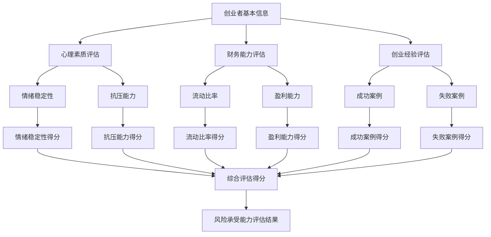
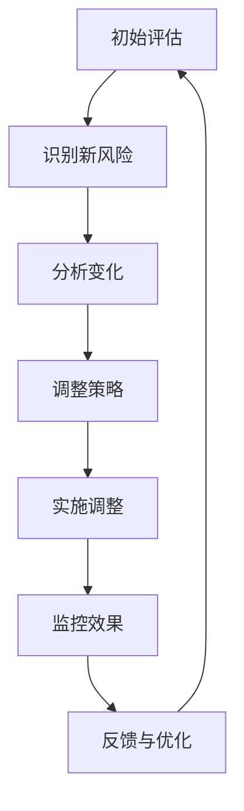
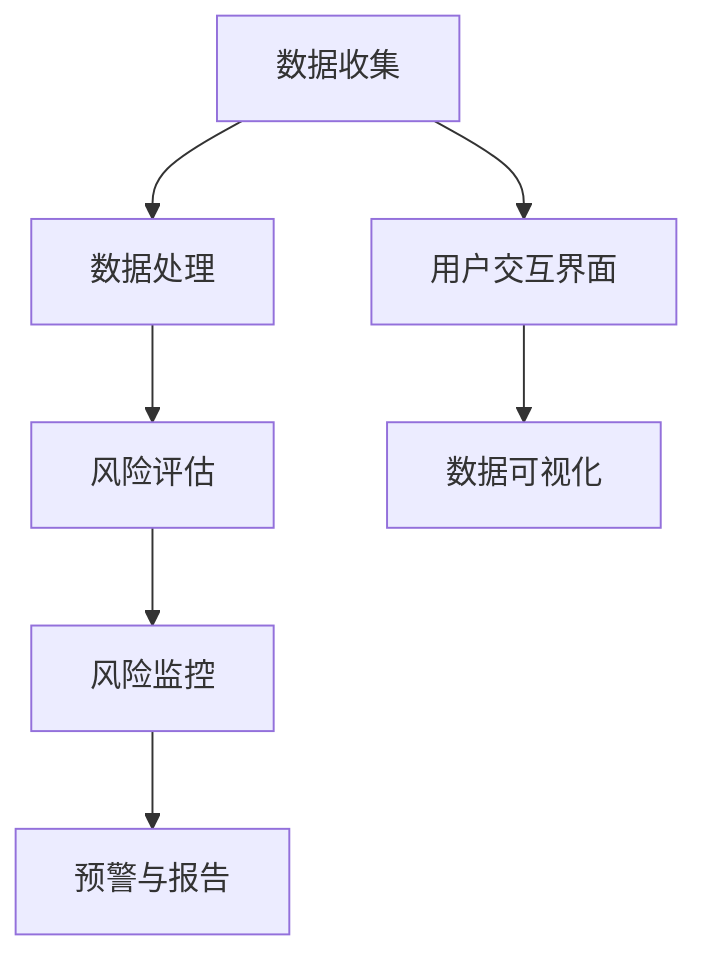

                 

### 《创业者的风险承受能力：评估和管理风险》

> **关键词：** 风险承受能力、风险评估、风险管理、创业、财务规划

> **摘要：** 本文深入探讨了创业者的风险承受能力及其评估和管理。文章首先介绍了风险的基本概念和分类，接着详细阐述了如何评估创业者的风险承受能力，并介绍了多种风险管理策略和工具。通过实际案例，本文提供了实用的风险管理实践和策略调整建议，旨在帮助创业者更好地应对风险，实现创业目标。

### 《创业者的风险承受能力：评估和管理风险》目录大纲

#### 第一部分：理解风险与风险承受能力

##### 第1章：风险的基本概念与分类  
- 1.1 风险的定义与特征  
- 1.2 风险的分类  
- 1.3 风险管理与创业成功

##### 第2章：风险承受能力的评估  
- 2.1 创业者心理素质评估  
- 2.2 财务能力评估  
- 2.3 创业经验评估  
- 2.4 风险承受能力评估方法

##### 第3章：风险承受能力评估的 Mermaid 流程图  
- 3.1 创业者风险特征分析  
- 3.2 风险承受能力评估模型

#### 第二部分：风险管理的策略与工具

##### 第4章：风险管理的基本策略  
- 4.1 风险规避  
- 4.2 风险转移  
- 4.3 风险减轻  
- 4.4 风险接受

##### 第5章：风险管理工具与技术  
- 5.1 风险评估模型  
- 5.2 风险矩阵  
- 5.3 情景分析  
- 5.4 蒙特卡罗模拟

##### 第6章：风险管理案例分析  
- 6.1 某创业公司风险管理的成功案例  
- 6.2 某创业公司风险管理失败案例

#### 第三部分：实践与策略调整

##### 第7章：构建个人风险承受能力  
- 7.1 提升创业心态  
- 7.2 财务规划与风险管理  
- 7.3 学习与经验积累

##### 第8章：动态调整风险策略  
- 8.1 风险管理策略调整的重要性  
- 8.2 如何进行策略调整  
- 8.3 实时监控与反馈机制

##### 第9章：风险管理工具应用案例  
- 9.1 量化模型在风险管理中的应用  
- 9.2 大数据技术在风险管理中的应用  
- 9.3 智能化风险管理平台案例解析

#### 附录：风险管理资源与工具推荐

- 附录 A：常用风险管理工具介绍  
- 附录 B：风险管理相关书籍与文献推荐  
- 附录 C：风险管理在线课程与培训资源推荐

---

本文将带领您深入了解创业者的风险承受能力，如何评估和管理风险，以及在实践中如何调整和优化风险策略。通过详细的案例分析、数学模型讲解、算法原理阐述，以及实际应用案例展示，本文旨在为创业者提供一套全面、实用的风险管理指南。

### 第一部分：理解风险与风险承受能力

在创业的道路上，风险无处不在。创业者需要具备一定的风险承受能力，才能在竞争激烈的市场环境中生存和发展。那么，什么是风险？创业者应该如何评估自己的风险承受能力？本章将详细探讨这些问题。

#### 第1章：风险的基本概念与分类

##### 1.1 风险的定义与特征

风险，是指在一定条件下和一定时期内，由于各种结果发生的不确定性，而导致行为主体遭受损失或损害的可能性。风险的三个基本特征是：

1. **不确定性**：风险的结果不是确定的，创业者无法预测每一次决策的后果。
2. **损失的可能性**：风险可能带来损失，这些损失可以是财务上的，也可以是声誉上的。
3. **影响面**：风险的影响范围可能很大，不仅影响创业者本人，还可能波及到团队、投资者和客户。

我们可以用以下公式来表示风险：

\[ 风险 = 可能性 \times 损失程度 \]

这意味着，风险的大小取决于风险发生的可能性以及一旦发生所带来的损失程度。

##### 1.2 风险的分类

风险可以从不同的角度进行分类。以下是几种常见的分类方法：

1. **按照风险的来源分类**：
    - **财务风险**：涉及资金的流动性、盈利能力等。
    - **市场风险**：与市场波动、竞争环境有关。
    - **运营风险**：涉及生产流程、供应链管理等。
    - **法律风险**：与法律法规合规性有关。
    - **战略风险**：与企业的长期发展方向和决策有关。

2. **按照风险的影响分类**：
    - **可控风险**：创业者可以采取措施进行管理和控制的风险。
    - **不可控风险**：创业者无法控制和预测的风险。

3. **按照风险的性质分类**：
    - **系统性风险**：由外部环境变化引起，对所有创业者都有影响。
    - **非系统性风险**：由企业内部因素引起，只对特定创业者有影响。

##### 1.3 风险管理与创业成功

风险管理是创业过程中不可或缺的一部分。有效的风险管理可以帮助创业者：

- **减少损失**：通过提前识别和评估风险，创业者可以采取相应的措施来降低风险带来的损失。
- **提高决策质量**：了解风险后，创业者可以更理性地做出决策，减少盲目行动。
- **增加信心**：面对风险时，创业者具备更强的应对能力，从而提高自信心。

总之，风险管理是创业成功的关键。只有深入了解风险，并具备良好的风险承受能力，创业者才能在激烈的市场竞争中立于不败之地。

### 第二部分：风险承受能力的评估

#### 第2章：风险承受能力的评估

评估创业者的风险承受能力是进行有效风险管理的前提。只有了解自己的风险承受能力，创业者才能制定出合理的风险管理策略。本章将介绍如何评估创业者的风险承受能力。

##### 2.1 创业者心理素质评估

心理素质是创业者风险承受能力的重要组成部分。以下是一些评估创业者心理素质的方法：

1. **情绪稳定性评估**：创业者需要具备良好的情绪稳定性，能够应对各种压力和挑战。可以通过问卷调查或心理测试来评估情绪稳定性。
    - **方法**：使用心理测评工具，如SPM（State-Trait Anxiety Inventory）来评估情绪稳定性。

    ```python
    def assess_anxiety_level(score):
        if score < 30:
            return "情绪稳定"
        elif score < 50:
            return "轻度焦虑"
        else:
            return "焦虑倾向"
    ```

2. **抗压能力评估**：创业者需要具备较强的抗压能力，能够在压力下保持冷静和理性。可以通过压力测试或情景模拟来评估抗压能力。
    - **方法**：使用压力测试工具，如压力测试表（Pressure Test Scale）来评估抗压能力。

    ```python
    def assess_pressure_tolerance(score):
        if score < 20:
            return "抗压能力强"
        elif score < 40:
            return "抗压能力一般"
        else:
            return "抗压能力弱"
    ```

##### 2.2 财务能力评估

财务能力是评估创业者风险承受能力的重要指标。以下是一些评估财务能力的方法：

1. **流动比率评估**：流动比率是衡量企业短期偿债能力的重要指标。流动比率越高，企业的短期偿债能力越强。
    - **公式**：流动比率 = 流动资产 / 流动负债

    ```python
    def assess_current_ratio(current_assets, current_liabilities):
        ratio = current_assets / current_liabilities
        if ratio > 2:
            return "流动比率高，短期偿债能力强"
        elif ratio > 1:
            return "流动比率一般，短期偿债能力尚可"
        else:
            return "流动比率低，短期偿债能力较弱"
    ```

2. **盈利能力评估**：盈利能力是评估企业长期发展能力的重要指标。可以通过利润率、增长率等指标来评估企业的盈利能力。
    - **公式**：净利润率 = 净利润 / 营业收入

    ```python
    def assess_profit_margin(net_profit, revenue):
        margin = net_profit / revenue
        if margin > 10:
            return "盈利能力强"
        elif margin > 5:
            return "盈利能力一般"
        else:
            return "盈利能力弱"
    ```

##### 2.3 创业经验评估

创业经验是评估创业者风险承受能力的重要因素。以下是一些评估创业经验的方法：

1. **成功案例评估**：创业者可以评估自己过去的成功案例，包括创业项目、市场拓展、团队建设等方面。
    - **方法**：使用成功案例评估表来评估创业经验。

    ```python
    def assess_success_cases(score):
        if score > 80:
            return "创业经验丰富"
        elif score > 60:
            return "有一定创业经验"
        else:
            return "创业经验较少"
    ```

2. **失败案例评估**：创业者可以评估自己过去的失败案例，从失败中吸取教训，提升风险承受能力。
    - **方法**：使用失败案例评估表来评估创业经验。

    ```python
    def assess_failure_cases(score):
        if score < 20:
            return "能够从失败中吸取教训，风险承受能力强"
        elif score < 40:
            return "从失败中吸取教训的能力一般"
        else:
            return "难以从失败中吸取教训"
    ```

##### 2.4 风险承受能力评估方法

综合以上评估方法，创业者可以通过以下步骤进行风险承受能力评估：

1. **收集信息**：收集与创业者心理素质、财务能力、创业经验相关的信息。
2. **评估指标计算**：根据评估方法，计算每个评估指标的具体得分。
3. **综合评估**：将各个评估指标的得分进行综合分析，得出风险承受能力的整体评估结果。

以下是一个简单的风险承受能力评估模型：



通过以上步骤，创业者可以全面了解自己的风险承受能力，并根据评估结果调整风险管理策略。

### 第三部分：风险管理的策略与工具

#### 第4章：风险管理的基本策略

在创业过程中，面对各种风险，创业者需要采取有效的风险管理策略来降低风险。本章将介绍风险管理的基本策略，包括风险规避、风险转移、风险减轻和风险接受。

##### 4.1 风险规避

风险规避是指创业者通过避免风险发生来减少损失。以下是一些风险规避的策略：

1. **避免投资高风险行业**：创业者可以选择投资那些风险较低、稳定性较强的行业。
2. **拒绝高风险项目**：如果某个项目的风险过高，创业者应该考虑放弃。
3. **调整商业模式**：通过改变商业模式来减少风险，例如，从单一市场转向多元化市场，降低市场风险。

以下是一个风险规避策略的伪代码：

```python
def risk_avoidance(project_risk):
    if project_risk > 50:
        return "规避"
    else:
        return "接受"
```

##### 4.2 风险转移

风险转移是指创业者通过将风险转嫁给其他主体来减少损失。以下是一些风险转移的策略：

1. **购买保险**：创业者可以通过购买保险来转移财务风险、运营风险等。
2. **外包**：将部分业务外包给其他公司，从而将相关风险转嫁给外包公司。
3. **签订合同**：在签订合同时，明确各方的责任和义务，以减少法律风险。

以下是一个风险转移策略的伪代码：

```python
def risk_transfer(risk_type, insurance):
    if insurance:
        return "转移"
    else:
        return "未转移"
```

##### 4.3 风险减轻

风险减轻是指创业者通过采取措施来降低风险发生的可能性或损失程度。以下是一些风险减轻的策略：

1. **风险预防**：在项目启动前，对潜在风险进行识别和评估，并采取预防措施。
2. **风险控制**：在项目运行过程中，对风险进行实时监控和控制，降低风险的发生概率。
3. **风险缓解**：在风险发生后，采取措施减轻损失。

以下是一个风险减轻策略的伪代码：

```python
def risk_reduction(risk_level, mitigation Measures):
    if risk_level > 30:
        return "采取缓解措施"
    else:
        return "风险可控"
```

##### 4.4 风险接受

风险接受是指创业者选择承担风险，并准备应对可能发生的损失。以下是一些风险接受策略：

1. **接受小风险**：对于一些小风险，创业者可以选择接受，以避免过度保守。
2. **建立应急资金**：创业者可以建立应急资金，以应对可能发生的风险。
3. **制定应急预案**：制定详细的应急预案，以便在风险发生时能够迅速采取行动。

以下是一个风险接受策略的伪代码：

```python
def risk_acceptance(risk_amount, emergency_fund):
    if risk_amount < emergency_fund:
        return "接受"
    else:
        return "规避"
```

通过以上风险管理策略，创业者可以有效地降低风险，保障创业项目的顺利进行。

### 第四部分：风险管理工具与技术

#### 第5章：风险管理工具与技术

在创业过程中，使用适当的风险管理工具和技术可以帮助创业者更好地识别、评估和应对风险。本章将介绍几种常用的风险管理工具和技术。

##### 5.1 风险评估模型

风险评估模型是识别和评估风险的重要工具。以下是一些常见的风险评估模型：

1. **风险矩阵**：风险矩阵是一种将风险的概率和影响进行量化的工具。通过风险矩阵，创业者可以直观地了解风险的优先级。
    - **示例**：使用Mermaid图形表示风险矩阵

    ```mermaid
    table
        |   | 低 | 中 | 高 |
        |---|---|---|---|
        | 低 | A  | B  | C  |
        | 中 | D  | E  | F  |
        | 高 | G  | H  | I  |
    ```

2. **蒙特卡罗模拟**：蒙特卡罗模拟是一种基于概率统计的风险评估方法。通过模拟大量随机样本，创业者可以预测风险的可能结果。
    - **示例**：使用Python代码进行蒙特卡罗模拟

    ```python
    import random

    def monte_carlo_simulation(number_of_samples):
        results = []
        for _ in range(number_of_samples):
            result = random.uniform(0, 100)
            results.append(result)
        return results
    ```

3. **决策树**：决策树是一种基于逻辑推理的风险评估工具。通过决策树，创业者可以分析不同决策路径的风险和收益。
    - **示例**：使用Mermaid图形表示决策树

    ```mermaid
    graph TD
        A[初始状态] --> B[方案1]
        A --> C[方案2]
        B --> D[结果1]
        C --> E[结果2]
        D --> F[收益1]
        E --> G[收益2]
    ```

##### 5.2 风险矩阵

风险矩阵是一种常用的风险评估工具，它通过将风险的概率和影响进行量化，帮助创业者确定风险的重要性和优先级。以下是一个简单的风险矩阵示例：

| 概率 | 低 | 中 | 高 |
|---|---|---|---|
| 影响程度 | 低 | 中 | 高 |
| 风险等级 | A | B | C |

在这个示例中，每个单元格表示一个风险等级。创业者可以根据风险的概率和影响程度，选择相应的风险等级。

##### 5.3 情景分析

情景分析是一种通过模拟可能发生的情景来识别和评估风险的方法。以下是一个简单的情景分析示例：

1. **情景设定**：假设创业公司正在开发一款新产品。
2. **情景模拟**：模拟产品开发过程中可能遇到的问题，如技术难题、市场变化等。
3. **风险识别**：通过情景模拟，识别出潜在的风险。
4. **风险评估**：评估每个情景的风险等级和影响程度。

以下是一个简单的情景分析伪代码：

```python
def scenario_analysis(scenarios):
    for scenario in scenarios:
        print("情景：", scenario['name'])
        print("风险：", scenario['risks'])
        print("影响程度：", scenario['impact'])
        print("风险等级：", scenario['risk_level'])
        print("--------------")
```

##### 5.4 蒙特卡罗模拟

蒙特卡罗模拟是一种通过模拟大量随机样本来预测风险的方法。以下是一个简单的蒙特卡罗模拟示例：

1. **模拟参数**：设定模拟的参数，如模拟次数、随机数生成器等。
2. **模拟过程**：生成随机样本，并计算每个样本的结果。
3. **结果分析**：分析模拟结果，确定风险的概率和影响程度。

以下是一个简单的蒙特卡罗模拟伪代码：

```python
import random

def monte_carlo_simulation(number_of_samples, mean, std_dev):
    results = []
    for _ in range(number_of_samples):
        result = random.gauss(mean, std_dev)
        results.append(result)
    return results
```

通过以上风险管理工具和技术，创业者可以更全面、更准确地识别和评估风险，从而制定出更加有效的风险管理策略。

### 第五部分：风险管理案例分析

#### 第6章：风险管理案例分析

在创业过程中，成功的风险管理案例可以提供宝贵的经验和启示，而失败的风险管理案例则可以提供重要的教训。本章将通过两个案例，分别分析一个成功和失败的风险管理案例，以便创业者能够从中吸取教训，优化自身的风险管理策略。

##### 6.1 某创业公司风险管理的成功案例

某创业公司A是一家专注于智能家居设备研发的公司。在公司成立之初，创始人就意识到风险管理的重要性，并采取了一系列有效的风险管理措施，使得公司在激烈的市场竞争中稳步发展。

**1. 风险识别**：
- **技术风险**：智能家居设备的技术创新和更新速度较快，技术风险较高。
- **市场风险**：市场竞争激烈，消费者需求变化快，市场风险较高。
- **运营风险**：生产流程和供应链管理复杂，运营风险较高。

**2. 风险评估**：
公司采用风险矩阵对各项风险进行评估，确定风险的优先级。以下是一个简化的风险矩阵：

| 风险类型 | 概率 | 影响程度 | 风险等级 |
|---|---|---|---|
| 技术风险 | 高 | 高 | A |
| 市场风险 | 中 | 中 | B |
| 运营风险 | 低 | 高 | C |

**3. 风险应对措施**：
- **技术风险**：加大研发投入，保持技术领先；与高校和科研机构合作，引进高级技术人才。
- **市场风险**：通过市场调研，了解消费者需求；制定灵活的市场策略，快速响应市场变化。
- **运营风险**：优化生产流程，提高供应链管理效率；建立应急响应机制，应对突发事件。

**4. 结果**：
通过有效的风险管理，公司成功推出了多款智能家居设备，市场份额逐年增长，盈利能力显著提升。

**案例分析**：该案例表明，成功的风险管理需要全面的风险识别、科学的风险评估和有效的风险应对措施。创业者应重视风险管理，结合自身实际情况，采取有针对性的措施，从而降低风险，实现创业目标。

##### 6.2 某创业公司风险管理失败案例

某创业公司B是一家从事电商平台的初创公司。在公司成立初期，创始人忽视了风险管理的重要性，导致公司在发展过程中遭遇了一系列风险，最终导致失败。

**1. 风险识别**：
- **市场风险**：市场竞争激烈，消费者需求变化快。
- **财务风险**：资金不足，财务状况不稳定。
- **运营风险**：物流配送不及时，服务质量差。

**2. 风险评估**：
公司未对风险进行系统评估，导致对风险的严重性认识不足。以下是一个简化的风险矩阵：

| 风险类型 | 概率 | 影响程度 | 风险等级 |
|---|---|---|---|
| 市场风险 | 中 | 中 | B |
| 财务风险 | 中 | 高 | A |
| 运营风险 | 低 | 中 | C |

**3. 风险应对措施**：
- **市场风险**：未采取有效措施，仅依赖广告推广。
- **财务风险**：未制定详细的财务规划，导致资金链紧张。
- **运营风险**：缺乏有效的物流管理，服务质量差。

**4. 结果**：
由于风险管理失败，公司在竞争激烈的市场中逐渐失去优势，资金链断裂，最终宣布破产。

**案例分析**：该案例警示创业者，风险管理是创业成功的关键。忽视风险管理可能导致严重的后果。创业者应重视风险评估，制定切实可行的风险应对措施，确保公司稳健发展。

### 第六部分：实践与策略调整

#### 第7章：构建个人风险承受能力

创业过程中，个人的风险承受能力是成功的关键因素之一。本章将讨论如何提升创业者的风险承受能力，包括提升创业心态、财务规划与风险管理、以及学习和经验积累。

##### 7.1 提升创业心态

1. **积极心态**：创业者应保持积极的心态，面对困难和挑战时，要有乐观的心态和解决问题的信心。
2. **心理调适**：通过心理培训、冥想等方法，提高情绪稳定性和抗压能力。
3. **心态建设**：建立长期目标，明确自己的价值观，避免因短期波动而影响决策。

以下是一个简单的心理调适伪代码：

```python
def mental_adjustment(confidence_level):
    if confidence_level > 70:
        return "心态稳定，信心十足"
    elif confidence_level > 30:
        return "心态一般，需要加强信心"
    else:
        return "心态较差，建议进行心理调适"
```

##### 7.2 财务规划与风险管理

1. **预算规划**：制定详细的财务预算，合理分配资金，确保财务状况稳定。
2. **应急资金**：建立应急资金，以应对突发事件，降低财务风险。
3. **风险管理**：识别潜在的财务风险，并采取相应的措施进行风险规避、转移和减轻。

以下是一个简单的财务规划伪代码：

```python
def financial_planning(budget, emergency_fund):
    if budget >= emergency_fund:
        return "财务规划合理，风险可控"
    else:
        return "财务规划不合理，需要优化"
```

##### 7.3 学习与经验积累

1. **市场调研**：通过市场调研，了解消费者需求和市场竞争状况。
2. **行业研究**：深入研究行业动态，掌握最新的技术趋势和市场变化。
3. **实战经验**：通过实际操作，积累创业经验，不断提升自身的风险承受能力。

以下是一个简单的学习与经验积累伪代码：

```python
def learning_experience(knowledge_level, experience_years):
    if knowledge_level > 80 and experience_years > 5:
        return "具备丰富的知识储备和实战经验"
    elif knowledge_level > 50 and experience_years > 3:
        return "具有一定的知识储备和实战经验"
    else:
        return "知识储备和实战经验不足"
```

通过以上方法，创业者可以不断提升个人的风险承受能力，为创业成功奠定坚实的基础。

### 第8章：动态调整风险策略

#### 8.1 风险管理策略调整的重要性

在创业过程中，风险管理是一个持续性的过程，而非一次性任务。随着市场环境、公司状况和外部条件的变化，风险管理策略也需要进行动态调整。以下是几个原因，解释了为什么动态调整风险策略至关重要：

1. **市场变化**：市场需求、竞争状况和技术发展等因素都在不断变化，这些变化可能带来新的风险。
2. **公司成长**：随着公司规模的扩大和业务范围的扩展，原有的风险管理策略可能不再适用。
3. **外部条件**：政策法规、经济环境和自然灾害等外部因素可能对公司的运营产生影响，需要调整风险管理策略。

#### 8.2 如何进行策略调整

1. **定期评估**：定期对公司的风险状况进行评估，识别新的风险和变化。
2. **调整策略**：根据评估结果，对现有的风险管理策略进行调整，以应对新的风险。
3. **灵活应对**：在面临突发事件时，能够快速响应，调整策略，降低风险影响。

以下是一个简单的风险管理策略调整流程：



#### 8.3 实时监控与反馈机制

1. **实时监控**：建立实时监控系统，对风险因素进行持续监控。
2. **反馈机制**：建立有效的反馈机制，及时收集和分析风险信息，为策略调整提供依据。
3. **持续优化**：根据监控和反馈的结果，不断优化风险管理策略，提高风险管理效果。

以下是一个简单的实时监控与反馈机制伪代码：

```python
def risk_monitoring_system(risk_data, feedback_channel):
    for data in risk_data:
        analyze_risk(data)
        send_feedback(feedback_channel)
        adjust_strategy_based_on_feedback()

def analyze_risk(data):
    # 对风险数据进行分析
    pass

def send_feedback(channel):
    # 发送风险反馈
    pass

def adjust_strategy_based_on_feedback():
    # 根据反馈调整风险管理策略
    pass
```

通过动态调整风险策略和建立实时监控与反馈机制，创业者可以更好地应对不断变化的市场环境，确保公司稳健发展。

### 第9章：风险管理工具应用案例

在风险管理过程中，合理应用各类工具和技术能够显著提高风险管理的效率和效果。本章将通过几个实际应用案例，展示如何将量化模型、大数据技术和智能化风险管理平台应用于创业实践。

#### 9.1 量化模型在风险管理中的应用

某创业公司C是一家新兴的生物科技公司，专注于新药研发。为了提高新药研发的成功率和降低风险，公司决定采用量化模型进行风险管理。

**1. 量化模型选择**：公司选择了基于机器学习的预测模型，用于预测新药研发过程中可能遇到的技术风险。

**2. 数据收集与处理**：公司收集了过去多年内新药研发的相关数据，包括成功案例和失败案例，并对数据进行清洗和处理。

**3. 模型训练与测试**：使用收集到的数据对机器学习模型进行训练和测试，确保模型的预测准确性。

**4. 应用效果**：通过量化模型，公司能够提前识别技术风险，并采取相应的措施进行风险规避或减轻。

以下是一个简单的量化模型应用伪代码：

```python
import pandas as pd
from sklearn.model_selection import train_test_split
from sklearn.ensemble import RandomForestClassifier

# 数据收集与处理
data = pd.read_csv("drug_research_data.csv")
X = data.drop("success", axis=1)
y = data["success"]

# 模型训练与测试
X_train, X_test, y_train, y_test = train_test_split(X, y, test_size=0.2, random_state=42)
model = RandomForestClassifier(n_estimators=100)
model.fit(X_train, y_train)

# 预测与评估
predictions = model.predict(X_test)
accuracy = (predictions == y_test).mean()
print("模型准确率：", accuracy)
```

#### 9.2 大数据技术在风险管理中的应用

某电商创业公司D面临着大量的订单数据和市场变化，为了更好地进行风险管理，公司决定采用大数据技术。

**1. 数据收集**：公司通过电商平台和第三方数据源收集订单数据、市场数据等。

**2. 数据处理**：使用大数据处理平台（如Hadoop或Spark）对收集到的数据进行分析和处理。

**3. 风险识别**：通过数据分析，识别出订单量波动、市场变化等潜在风险。

**4. 风险预测**：使用大数据分析结果，预测未来的订单量变化和市场趋势。

**5. 应用效果**：通过大数据技术，公司能够实时监控订单量和市场变化，及时调整营销策略和库存管理，降低风险。

以下是一个简单的大数据应用伪代码：

```python
from pyspark.sql import SparkSession

# 数据收集与处理
spark = SparkSession.builder.appName("risk_management").getOrCreate()
orders = spark.read.csv("orders.csv", header=True)
market_data = spark.read.csv("market_data.csv", header=True)

# 风险识别
orders_summary = orders.groupBy("product_id").sum("quantity")
market_summary = market_data.groupBy("region").mean("sales")

# 风险预测
predictions = orders_summary.join(market_summary, "product_id")
predictions.show()
```

#### 9.3 智能化风险管理平台案例解析

某金融科技创业公司E开发了智能化风险管理平台，为其他企业提供风险管理服务。

**1. 平台架构**：平台采用云计算和大数据技术，实现风险数据的实时收集、处理和分析。

**2. 风险评估**：平台集成了多种风险评估模型，能够根据不同企业的需求进行定制化风险评估。

**3. 风险监控**：平台提供了实时监控功能，能够对企业运营过程中的风险进行实时监控和预警。

**4. 应用效果**：通过智能化风险管理平台，公司能够为客户提供高效、精准的风险管理服务，帮助客户降低风险，提高运营效率。

以下是一个简单的智能化风险管理平台架构伪代码：



通过以上应用案例，可以看出，量化模型、大数据技术和智能化风险管理平台在创业过程中发挥了重要作用，为创业者提供了强大的风险管理工具，帮助他们更好地应对风险，实现创业目标。

### 附录：风险管理资源与工具推荐

#### 附录 A：常用风险管理工具介绍

1. **风控雷达**：一款集成了多种风险分析工具的平台，包括财务风险、市场风险和运营风险等。
2. **风险矩阵**：一种用于评估和优先级排序风险的工具，帮助创业者确定风险的严重性和优先级。
3. **定性分析工具**：如SWOT分析、PEST分析等，用于分析创业项目的优势、劣势、机会和威胁。

#### 附录 B：风险管理相关书籍与文献推荐

1. **《风险管理：原理与实践》**：详细介绍了风险管理的理论和实践方法，适合创业者阅读。
2. **《风险管理手册》**：涵盖了风险管理的各个方面，包括风险评估、风险应对策略等。
3. **《创业风险与创业成功》**：讨论了创业过程中可能遇到的风险，以及如何应对这些风险，提高创业成功率。

#### 附录 C：风险管理在线课程与培训资源推荐

1. **Coursera**：提供了一系列关于风险管理和创业的课程，包括《风险与不确定性的管理》、《创业融资与风险管理》等。
2. **edX**：提供了由世界顶尖大学开设的风险管理课程，如麻省理工学院的《风险管理》。
3. **Udemy**：提供了大量的风险管理相关课程，包括《企业风险管理》、《金融风险管理》等。

通过以上资源与工具的推荐，创业者可以更好地了解风险管理的重要性和方法，提高自身的风险管理能力，为创业成功打下坚实基础。

