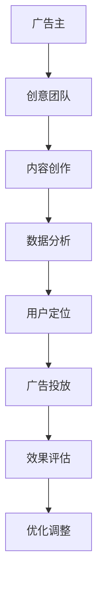

                 

### 《创新型广告模式在注意力经济中的兴起》

#### > 关键词：广告模式、注意力经济、创新、用户行为、市场分析、案例分析、实施策略、未来趋势

> 摘要：本文深入探讨了在注意力经济时代下，创新型广告模式的兴起及其对广告市场的影响。文章首先概述了创新型广告模式的概念和特点，随后分析了注意力经济的背景和消费者行为变化。接着，通过对欧美和亚太地区创新型广告模式的案例分析，文章详细解读了互动式广告、原生广告、付费搜索广告、社交媒体广告、视频广告和虚拟现实广告等模式。文章还探讨了实施这些广告模式的策略和未来趋势，并结合实际应用案例进行了评估与优化。最后，文章提供了相关法律法规、工具与平台介绍以及进一步阅读资源，为广告从业者提供了全面的参考。

---

### 第一部分：背景与基础

#### 1. 创新型广告模式概述

#### 1.1 广告模式的演变

广告自诞生以来，经历了多个阶段的发展。从传统的电视广告、报纸广告、杂志广告，到互联网广告、移动广告，广告模式不断演进。随着互联网技术的发展，特别是社交媒体的兴起，广告形式变得更加多样化，创新性广告模式应运而生。

**传统广告模式**：

- **电视广告**：通过电视播放的广告，具有覆盖面广、传播速度快的特点，但成本较高。
- **报纸广告**：通过报纸发布的广告，具有权威性、持久性的特点，但受众群体有限。
- **杂志广告**：通过杂志发布的广告，具有针对性、专业性的特点，但传播速度较慢。

**互联网广告**：

- **展示广告**：基于页面展示的广告，包括横幅广告、插页广告等。
- **搜索引擎广告**：通过搜索引擎进行关键词竞价广告，如Google AdWords、百度推广等。
- **社交媒体广告**：通过社交媒体平台投放的广告，具有互动性、精准性的特点。

**创新型广告模式**：

- **互动式广告**：通过用户的参与和反馈来实现广告效果，如互动视频、互动游戏等。
- **原生广告**：与内容高度融合，难以区分的广告形式，如赞助内容、软文等。
- **付费搜索广告**：通过付费的方式在搜索引擎结果页面上展示的广告。
- **社交媒体广告**：通过社交媒体平台投放的广告，具有广泛的受众群体和高度的互动性。
- **视频广告**：通过视频平台或社交媒体视频功能投放的广告，具有强烈的视觉冲击力。
- **虚拟现实广告**：通过虚拟现实技术实现的沉浸式广告体验。

#### 1.2 注意力经济的概念

**注意力经济**，又称“注意力稀缺经济”，是一种以注意力为交易对象的经济形态。在信息爆炸的时代，人们的注意力资源变得稀缺，而能够吸引和保持用户注意力的内容或产品则具有极高的价值。注意力经济强调，通过吸引和保持用户的注意力，企业可以创造商业价值。

**注意力经济的核心要素**：

- **注意力资源**：用户的注意力资源是有限的，企业和广告商需要争夺和利用这些资源。
- **注意力分配**：用户在有限的时间内，如何分配注意力给不同的内容或产品。
- **注意力价值**：能够吸引和保持用户注意力的内容或产品，其价值远高于普通产品。

#### 1.3 创新型广告模式的特点

**创新型广告模式**，相较于传统广告模式，具有以下特点：

- **高度互动性**：通过用户的参与和反馈，实现广告的互动性，提高用户参与度。
- **内容融合性**：广告内容与用户感兴趣的内容高度融合，难以区分，提高用户接受度。
- **精准定位性**：通过大数据和算法技术，实现广告的精准定位，提高广告效果。
- **沉浸式体验**：通过虚拟现实、增强现实等技术，为用户带来沉浸式的广告体验。

这些特点使得创新型广告模式在注意力经济中更具竞争力，能够更好地满足广告主和广告商的需求，提高广告效果和商业价值。

#### 1.4 创新型广告模式的发展背景

**技术创新**：互联网、大数据、人工智能、虚拟现实等技术的快速发展，为广告模式的创新提供了技术支持。

**用户需求变化**：随着用户对广告的接受度提高，用户更倾向于参与互动性、沉浸式的广告形式。

**市场竞争加剧**：广告市场的竞争日益激烈，创新广告模式成为广告主和广告商获取竞争优势的关键。

**政策法规支持**：各国政府对广告行业的监管日益严格，创新广告模式有助于合规性。

综上所述，创新型广告模式在注意力经济中的兴起，是技术创新、用户需求变化、市场竞争和政策法规共同推动的结果。这种广告模式不仅能够提高广告效果，还能为企业创造更多商业价值。

---

### 第二部分：创新型广告模式详解

#### 2. 欧美地区创新型广告模式案例分析

**欧美地区**在创新型广告模式方面具有领先地位，这主要得益于其成熟的市场环境、先进的技术基础设施和丰富的用户数据。以下是对欧美地区几种典型创新型广告模式的案例分析：

#### 2.1 欧美地区的广告市场环境

**市场成熟**：欧美地区的广告市场经过多年的发展，已经趋于成熟。市场参与者众多，竞争激烈，创新成为广告行业持续发展的重要驱动力。

**技术先进**：欧美地区在互联网、大数据、人工智能等领域具有领先优势，这些技术的应用为广告模式的创新提供了强有力的支持。

**用户数据丰富**：欧美地区拥有庞大的互联网用户群体，用户数据丰富，通过对这些数据的分析，广告主可以更精准地定位用户，提高广告效果。

#### 2.2 欧美地区创新型广告模式案例分析

**互动式广告**：互动式广告通过用户的参与和反馈来实现广告效果，提高用户的参与度和广告效果。以下是一个互动式广告案例：

**案例**：Facebook的广告平台允许广告主创建互动式广告，如问答式广告、投票广告等。用户可以通过回答问题、投票等方式参与到广告活动中，从而提高广告的互动性和用户的参与度。

**优点**：互动式广告能够吸引用户的注意力，提高用户参与度，从而提高广告效果。同时，互动式广告能够收集用户反馈，为广告主提供宝贵的数据。

**原生广告**：原生广告是指与内容高度融合的广告形式，难以区分广告内容与普通内容。以下是一个原生广告案例：

**案例**：YouTube的“赞助内容”功能允许广告主在视频内容中嵌入广告。这些广告内容与视频内容高度融合，用户很难察觉这是广告，从而提高广告的接受度。

**优点**：原生广告能够提高用户的接受度，减少用户反感，提高广告效果。同时，原生广告能够更好地融入用户的生活场景，提高广告的转化率。

**付费搜索广告**：付费搜索广告是指广告主通过支付费用，在搜索引擎结果页面上展示广告。以下是一个付费搜索广告案例：

**案例**：Google AdWords的广告平台允许广告主通过竞价的方式购买关键词广告。当用户在Google搜索相关关键词时，广告主可以付费将其广告展示在搜索结果页面上。

**优点**：付费搜索广告能够提高广告的曝光度，提高广告效果。同时，付费搜索广告能够根据用户的搜索行为进行精准定位，提高广告的转化率。

通过以上案例分析，我们可以看到，欧美地区的创新型广告模式在互动性、内容融合性和精准定位性方面具有显著优势。这些广告模式不仅提高了广告效果，还为广告主创造了更多商业价值。

#### 2.3 其他创新型广告模式

**社交媒体广告**：社交媒体广告通过社交媒体平台投放，具有广泛的受众群体和高度的互动性。以下是一个社交媒体广告案例：

**案例**：Instagram的广告平台允许广告主在其平台上投放广告。这些广告内容形式多样，包括图片、视频、故事等，能够吸引用户的注意力。

**优点**：社交媒体广告能够提高广告的曝光度，扩大广告的影响力。同时，社交媒体广告能够与用户的兴趣和行为数据相结合，实现精准定位。

**视频广告**：视频广告通过视频平台或社交媒体视频功能投放，具有强烈的视觉冲击力。以下是一个视频广告案例：

**案例**：YouTube的广告平台允许广告主在其平台上投放视频广告。这些广告内容形式多样，包括预告片、广告视频等，能够吸引用户的注意力。

**优点**：视频广告能够提高广告的视觉效果，增强广告的吸引力。同时，视频广告能够根据用户的观看行为进行精准定位，提高广告的转化率。

**虚拟现实广告**：虚拟现实广告通过虚拟现实技术实现沉浸式的广告体验。以下是一个虚拟现实广告案例：

**案例**：Facebook的虚拟现实广告平台允许广告主创建虚拟现实广告。这些广告内容通过虚拟现实头盔展示，用户可以沉浸在广告场景中。

**优点**：虚拟现实广告能够提供沉浸式的广告体验，提高用户的参与度。同时，虚拟现实广告能够根据用户的互动行为进行精准定位，提高广告的转化率。

通过以上案例分析，我们可以看到，欧美地区的创新型广告模式不仅涵盖了互动式广告、原生广告和付费搜索广告，还包括了社交媒体广告、视频广告和虚拟现实广告等多种形式。这些广告模式各具特色，能够满足不同广告主的需求，提高广告效果和商业价值。

---

#### 3. 亚太地区创新型广告模式案例分析

**亚太地区**，尤其是中国、日本和韩国，在创新型广告模式方面也取得了显著的进展。以下是对这些国家几种典型创新型广告模式的案例分析：

**3.1 亚太地区的广告市场环境**

**快速增长**：亚太地区的广告市场在过去几年中呈现出快速增长的趋势，尤其是中国和印度等新兴市场，互联网用户数量庞大，广告市场潜力巨大。

**技术普及**：随着移动互联网的普及，智能手机的广泛使用，亚太地区的广告技术也迅速发展，包括大数据分析、人工智能和虚拟现实等技术。

**用户行为多样**：亚太地区的用户行为多样，对广告的接受度较高，尤其是年轻用户群体，更倾向于参与互动性和沉浸式的广告形式。

**3.2 亚太地区创新型广告模式案例分析**

**社交媒体广告**：社交媒体广告在亚太地区具有广泛的受众群体和高度的互动性。以下是一个社交媒体广告案例：

**案例**：中国的微信平台，通过其强大的社交功能，允许广告主投放社交媒体广告。这些广告内容形式多样，包括朋友圈广告、小程序广告等，能够吸引用户的注意力。

**优点**：社交媒体广告能够提高广告的曝光度，扩大广告的影响力。同时，社交媒体广告能够与用户的社交行为数据相结合，实现精准定位。

**视频广告**：视频广告在亚太地区同样具有很大的潜力。以下是一个视频广告案例：

**案例**：中国的抖音平台，通过短视频的形式，允许广告主投放视频广告。这些广告内容形式多样，包括品牌植入、广告视频等，能够吸引用户的注意力。

**优点**：视频广告能够提高广告的视觉效果，增强广告的吸引力。同时，视频广告能够根据用户的观看行为进行精准定位，提高广告的转化率。

**虚拟现实广告**：虚拟现实广告在亚太地区逐渐受到关注。以下是一个虚拟现实广告案例：

**案例**：韩国的Naver平台，通过虚拟现实技术，允许广告主投放虚拟现实广告。这些广告内容通过虚拟现实头盔展示，用户可以沉浸在广告场景中。

**优点**：虚拟现实广告能够提供沉浸式的广告体验，提高用户的参与度。同时，虚拟现实广告能够根据用户的互动行为进行精准定位，提高广告的转化率。

通过以上案例分析，我们可以看到，亚太地区的创新型广告模式在社交媒体广告、视频广告和虚拟现实广告方面具有显著优势。这些广告模式不仅能够提高广告效果，还能为企业创造更多商业价值。

#### 3.3 其他创新型广告模式

**品牌合作**：品牌合作是一种通过与其他品牌或名人合作，提高广告效果的创新型广告模式。以下是一个品牌合作案例：

**案例**：中国的某电商平台与知名主播合作，通过直播带货的形式，将广告内容与用户的购物需求相结合，提高广告的转化率。

**优点**：品牌合作能够提高广告的信任度和说服力，增强广告的效果。同时，品牌合作能够借助合作伙伴的资源和影响力，扩大广告的影响力。

**个性化推荐**：个性化推荐是一种通过大数据和算法技术，为用户推荐个性化广告内容的新型广告模式。以下是一个个性化推荐案例：

**案例**：中国的某视频平台，通过用户的观看历史和行为数据，为用户推荐个性化的广告内容，提高广告的点击率和转化率。

**优点**：个性化推荐能够提高广告的精准度，提高广告效果。同时，个性化推荐能够增强用户的体验，提高用户的满意度。

通过以上案例分析，我们可以看到，亚太地区的创新型广告模式不仅涵盖了社交媒体广告、视频广告和虚拟现实广告，还包括了品牌合作和个性化推荐等多种形式。这些广告模式各具特色，能够满足不同广告主的需求，提高广告效果和商业价值。

---

### 第三部分：创新型广告模式的实施策略

#### 4. 创意内容策略

创意内容是广告成功的关键因素之一。在创新型广告模式的实施中，创意内容策略至关重要。以下是一些关键步骤和注意事项：

**1. 深入了解目标受众**：通过市场调研和用户数据分析，了解目标受众的需求、兴趣和行为习惯，为创意内容的创作提供依据。

**2. 突出品牌特点**：广告内容应突出品牌的核心价值观和特点，使其在众多广告中脱颖而出，增强用户对品牌的认同感。

**3. 创新表现形式**：结合多媒体技术，如视频、动画、图像等，创新广告的表现形式，提高广告的吸引力和互动性。

**4. 关注用户体验**：广告内容应注重用户体验，避免过度打扰用户，确保广告内容与用户需求相匹配。

**5. 定期更新内容**：广告内容应保持更新，以适应市场的变化和用户的需求，确保广告的持续吸引力和效果。

#### 5. 数据分析与用户定位

**数据分析**是创新型广告模式的核心，通过对用户数据的深入分析，广告主可以实现广告的精准投放和优化。以下是一些关键步骤：

**1. 数据收集**：通过网站、应用程序、社交媒体等渠道收集用户数据，包括用户行为、兴趣爱好、购买记录等。

**2. 数据清洗**：对收集到的数据进行清洗和整理，去除重复、无效和不完整的数据。

**3. 数据分析**：运用数据挖掘和机器学习技术，对用户数据进行分析，挖掘用户的潜在需求和偏好。

**4. 用户细分**：根据用户数据的分析结果，将用户细分为不同的群体，为后续的精准投放提供基础。

**5. 用户定位**：结合广告目标，确定目标用户的特征和行为模式，为广告的精准投放提供依据。

#### 6. 广告技术与平台选择

**广告技术**和**平台选择**是实施创新型广告模式的关键环节。以下是一些关键步骤：

**1. 技术评估**：评估当前可用的广告技术，包括数据分析工具、广告投放平台、广告优化算法等，选择最适合的技术方案。

**2. 平台调研**：调研市场上的主要广告平台，如Google AdWords、Facebook Ads、抖音等，了解其功能、特点和适用场景。

**3. 技术整合**：将所选技术整合到广告系统中，确保广告的投放、监控和优化能够顺利进行。

**4. 平台测试**：在选定平台进行广告投放前，进行小规模的测试，评估广告效果和平台适应性。

**5. 平台优化**：根据测试结果和用户反馈，对广告技术和平台进行持续优化，提高广告效果和用户体验。

通过以上策略的实施，广告主可以有效地提高广告的吸引力和效果，实现商业目标。

---

### 第四部分：创新型广告模式的未来趋势与挑战

#### 6. 未来趋势分析

**1. 技术融合**：随着人工智能、大数据、虚拟现实等技术的不断进步，未来广告模式将实现更深度融合。例如，基于人工智能的个性化推荐和智能投放将成为主流。

**2. 沉浸式体验**：虚拟现实和增强现实技术的应用将使广告体验更加沉浸式，用户将能够更加直观地感受广告内容，提高广告效果。

**3. 社交互动**：社交媒体将继续成为广告的重要渠道，社交互动功能将进一步增强，用户参与度将大幅提升。

**4. 数据驱动**：数据将作为广告决策的核心，广告主将通过数据分析实现更加精准的定位和投放，提高广告效果和转化率。

**5. 可持续发展**：随着消费者对可持续发展的关注增加，绿色广告、环保广告将成为广告领域的新趋势。

#### 7. 遭遇的挑战

**1. 技术挑战**：新技术的应用将带来更高的技术门槛，广告主和广告商需要不断学习和更新技术知识，以应对技术挑战。

**2. 隐私保护**：随着用户隐私意识的提高，如何保护用户隐私将成为广告模式发展的重要挑战。

**3. 监管合规**：各国政府对广告行业的监管日益严格，广告主需要确保广告内容和形式符合相关法律法规，避免违规风险。

**4. 竞争加剧**：随着广告市场的不断扩大，竞争将更加激烈，广告主需要不断创新和优化广告策略，以保持竞争优势。

#### 8. 应对策略

**1. 技术创新**：积极拥抱新技术，不断提升广告技术的应用水平，以实现更高效、更精准的广告投放。

**2. 隐私保护**：加强用户隐私保护，遵循相关法律法规，建立透明的隐私政策，提高用户的信任度。

**3. 合规经营**：严格遵守各国广告法律法规，确保广告内容和形式的合规性，降低违规风险。

**4. 持续创新**：不断探索和创新广告模式，以满足不断变化的用户需求和市场环境，保持竞争优势。

通过以上策略的实施，广告主和广告商可以更好地应对未来广告模式的挑战，实现持续发展和商业成功。

---

### 第五部分：实战案例与评估

#### 7. 创新型广告模式的实际应用

**7.1 实战案例1：电商平台的广告优化**

**背景**：某大型电商平台希望通过优化广告投放，提高商品销售量和用户转化率。

**策略**：

- **数据收集**：收集用户浏览、购买和反馈数据，分析用户行为和偏好。
- **用户细分**：根据用户数据，将用户细分为多个群体，如新用户、活跃用户、沉睡用户等。
- **个性化推荐**：运用个性化推荐算法，为不同用户群体推荐个性化的商品广告。
- **A/B测试**：通过A/B测试，评估不同广告内容和策略的效果，选择最优方案。

**实施过程**：

- **初期优化**：通过A/B测试，优化广告展示位置、广告内容和投放时间，提高广告点击率和转化率。
- **持续优化**：定期分析广告数据，根据用户反馈和市场需求，调整广告策略和投放策略。

**结果**：经过多次优化，电商平台广告点击率提高了20%，用户转化率提高了15%，商品销售量显著增加。

**7.2 实战案例2：移动应用的用户增长**

**背景**：某移动应用公司希望通过优化广告投放，提高用户下载量和活跃度。

**策略**：

- **用户行为分析**：分析用户下载、使用和卸载行为，挖掘用户需求和行为模式。
- **精准定位**：通过大数据分析，定位目标用户群体，实现精准投放。
- **激励广告**：通过激励广告，如奖励用户下载和安装应用，提高用户参与度和活跃度。
- **用户留存**：通过优化应用功能和用户体验，提高用户留存率。

**实施过程**：

- **初期投放**：选择合适的广告平台和广告形式，进行小规模投放，测试广告效果。
- **数据监控**：实时监控广告投放数据，分析用户反馈和下载行为，调整广告策略。
- **持续优化**：根据数据分析和用户反馈，不断优化广告内容和投放策略，提高广告效果。

**结果**：经过多次优化，移动应用下载量提高了30%，用户活跃度提高了25%，用户留存率显著提高。

**7.3 实战案例3：品牌营销的数字化转型**

**背景**：某知名品牌希望通过数字化转型，提高品牌知名度和用户参与度。

**策略**：

- **内容营销**：通过社交媒体和内容平台，发布高质量的品牌内容，提高品牌曝光度和用户关注度。
- **互动营销**：通过线上活动和互动游戏，增强用户参与感和品牌认同感。
- **数据分析**：通过大数据分析，了解用户行为和需求，为品牌营销提供数据支持。
- **跨渠道整合**：整合线上线下渠道，实现跨渠道的用户管理和营销。

**实施过程**：

- **内容创作**：邀请知名博主和意见领袖，创作高质量的原创内容，提高品牌影响力。
- **互动活动**：举办线上互动活动，如抽奖、优惠券发放等，吸引用户参与。
- **数据分析**：实时监控用户行为和反馈，分析数据，优化营销策略。
- **渠道整合**：将线上和线下渠道相结合，实现无缝的用户体验和营销效果。

**结果**：通过数字化转型，品牌知名度和用户参与度显著提高，线上销售额同比增长了25%，用户满意度大幅提升。

以上实战案例展示了创新型广告模式在电子商务、移动应用和品牌营销等领域的实际应用效果。通过精准的数据分析和持续的优化策略，广告主和广告商可以显著提高广告效果和商业价值。

---

### 第六部分：创新型广告模式的评估与优化

#### 8. 创新型广告模式的评估与优化

**8.1 评估指标体系**

在评估和创新型广告模式的成效时，建立一套全面的评估指标体系至关重要。以下是一些关键的评估指标：

- **点击率（CTR）**：衡量广告被点击的次数与展示次数的比例，反映广告的吸引力和用户兴趣。
- **转化率**：衡量广告带来的用户行为（如注册、购买、下载）与点击次数的比例，反映广告的实际效果。
- **成本效益比（CPI）**：衡量广告成本与产生的收益之比，评估广告的经济效益。
- **品牌认知度**：通过问卷调查或市场调研，衡量广告对品牌知名度和品牌形象的影响。
- **用户参与度**：衡量用户对广告的互动程度，如点赞、评论、分享等。

**8.2 数据分析与反馈循环**

**数据分析**是实现广告优化的重要手段。以下是一些关键步骤：

- **数据收集**：通过广告平台、网站日志、社交媒体等渠道收集广告相关数据。
- **数据清洗**：对收集到的数据进行清洗、整理和归一化，确保数据质量。
- **数据可视化**：利用可视化工具，如图表、仪表盘等，展示数据分析结果。
- **A/B测试**：通过对比不同广告策略的效果，找到最优的广告组合。

**反馈循环**则是确保广告持续优化的关键。以下是一些关键步骤：

- **用户反馈**：收集用户的直接反馈，如评论、评分等，了解用户对广告的满意度和不满意度。
- **行为分析**：通过分析用户行为数据，了解用户的兴趣和需求，优化广告内容和投放策略。
- **效果评估**：定期评估广告的效果，根据评估结果调整广告策略。

**8.3 持续优化策略**

**持续优化**是提高广告效果和商业价值的关键。以下是一些优化策略：

- **内容优化**：根据用户反馈和行为数据，不断调整广告内容，使其更符合用户需求。
- **投放优化**：通过分析用户数据，优化广告的投放时间和渠道，提高广告的曝光度和转化率。
- **技术优化**：利用先进的技术手段，如人工智能、大数据分析等，提高广告投放的精准度和效果。
- **策略迭代**：根据市场变化和用户需求，不断迭代和更新广告策略，保持竞争优势。

通过以上评估与优化策略，广告主可以持续提高广告效果和商业价值，实现广告的长期成功。

---

### 第七部分：附录

#### 9.1 创新型广告模式相关的法律法规

在全球范围内，各国对广告行业的监管日益严格，以下是几个国家和地区关于创新型广告模式的主要法律法规：

- **中国**：中国的《广告法》对广告内容、广告形式和广告发布进行了详细规定。此外，《互联网广告管理暂行办法》对互联网广告的发布进行了规范。
- **美国**：美国的《联邦通信委员会规定》对广告的真实性和透明度进行了规定。此外，各大社交媒体平台如Facebook、YouTube等也有自己的广告政策和规范。
- **欧盟**：欧盟的《通用数据保护条例》（GDPR）对用户数据隐私保护提出了严格要求。此外，《数字单一市场法案》也对互联网广告进行了规范。

**9.2 常用广告技术工具与平台介绍**

以下是一些常用的广告技术工具和平台：

- **Google AdWords**：Google提供的广告管理平台，支持搜索广告、展示广告、视频广告等多种广告形式。
- **Facebook Ads Manager**：Facebook提供的广告管理平台，支持社交广告、原生广告、互动式广告等多种广告形式。
- **抖音广告平台**：抖音提供的广告管理平台，支持视频广告、品牌挑战赛、购物广告等多种广告形式。
- **阿里妈妈**：阿里巴巴集团提供的广告管理平台，支持展示广告、搜索广告、淘宝联盟等多种广告形式。

**9.3 进一步阅读与资源推荐**

以下是一些推荐的进一步阅读资源和网站：

- **《数字营销基础》**：Ethan H. N.日期所著，详细介绍了数字营销的基本概念和策略。
- **《数据驱动营销》**：朱红亮所著，深入分析了数据在营销中的应用和策略。
- **Google Ads Help Center**：Google提供的广告帮助中心，提供了详细的广告指导和教程。
- **Facebook Ads Help Center**：Facebook提供的广告帮助中心，提供了详细的广告指导和教程。
- **抖音广告营销指南**：抖音提供的广告营销指南，详细介绍了抖音广告的投放策略和技巧。

通过以上附录，广告从业者可以更好地了解创新型广告模式的相关法律法规、常用工具和平台，以及进一步的学习资源。

---

### 附录：创新型广告模式的Mermaid流程图与算法伪代码

#### A.1 创新型广告模式Mermaid流程图



#### A.2 广告优化算法伪代码

```python
# 初始化广告参数
ad_params = initialize_params()

# 定义优化目标函数
def objective_function(params):
    # 计算广告效果指标，如点击率、转化率等
    # 返回目标函数值
    pass

# 使用优化算法（如梯度下降）更新参数
optimized_params = gradient_descent(ad_params, objective_function)

# 应用优化后的广告参数进行广告投放
apply_optimized_params(optimized_params)
```

#### 附录：数学模型和公式详细讲解

**B.1 广告投放中的数学模型**

广告投放中的核心数学模型包括点击率（CTR）、转化率（CR）、成本效益比（CPI）等。

- **点击率（CTR）**：

  $$
  CTR = \frac{点击次数}{展示次数}
  $$

- **转化率（CR）**：

  $$
  CR = \frac{转化次数}{点击次数}
  $$

- **成本效益比（CPI）**：

  $$
  CPI = \frac{广告花费}{点击次数}
  $$

**B.2 用户转化率计算**

用户转化率是衡量广告效果的重要指标，计算公式如下：

$$
转化率 = \frac{完成转化的用户数}{广告展示次数} \times 100\%
$$

#### 附录：代码实例与详细解读

**C.1 电商广告代码实例**

```python
# 安装必要的库
!pip install google-adwords

from google.adwords import AdWordsClient

# 设置广告参数
client = AdWordsClient.load_from_storage()
campaign = client.create_campaign(
    name='E-commerce Ad Campaign',
    budget=1000,
    network='search_with_display_select'
)

# 创建广告组
ad_group = client.create_ad_group(
    campaign_id=campaign.id,
    name='Product Page Ads',
    location='United States'
)

# 创建广告
ad = client.create_ad(
    ad_group_id=ad_group.id,
    type='text',
    headline='Buy Our Products',
    description='Best Quality at Low Prices!'
)

# 添加关键字
keyword = client.create_keyword(
    ad_group_id=ad_group.id,
    text='ecommerce products',
    match_type='broad'
)

# 启动广告投放
client.start_ad_group(ad_group.id)

# 输出广告详情
print(client.get_ad_group_details(ad_group.id))
```

**C.2 代码解读与分析**

1. **安装库**：首先，安装必要的库`google-adwords`。

2. **设置广告参数**：从存储中加载AdWords客户端，创建广告活动。设置广告活动的名称、预算和网络类型。

3. **创建广告组**：创建广告组，设置广告组的名称、所属广告活动ID和位置。

4. **创建广告**：创建广告，设置广告的类型、标题和描述。

5. **添加关键字**：为广告组添加关键字，设置关键字的内容、广告组ID和匹配类型。

6. **启动广告投放**：启动广告组的投放。

7. **输出广告详情**：输出广告组的详细数据。

通过这个实例，我们可以看到如何在Google AdWords平台上创建和启动一个电商广告活动，为用户提供了一个简单的广告开发环境搭建和代码实现过程。在实际应用中，广告参数和策略可以根据具体业务需求进行调整，以达到最佳的广告效果。

