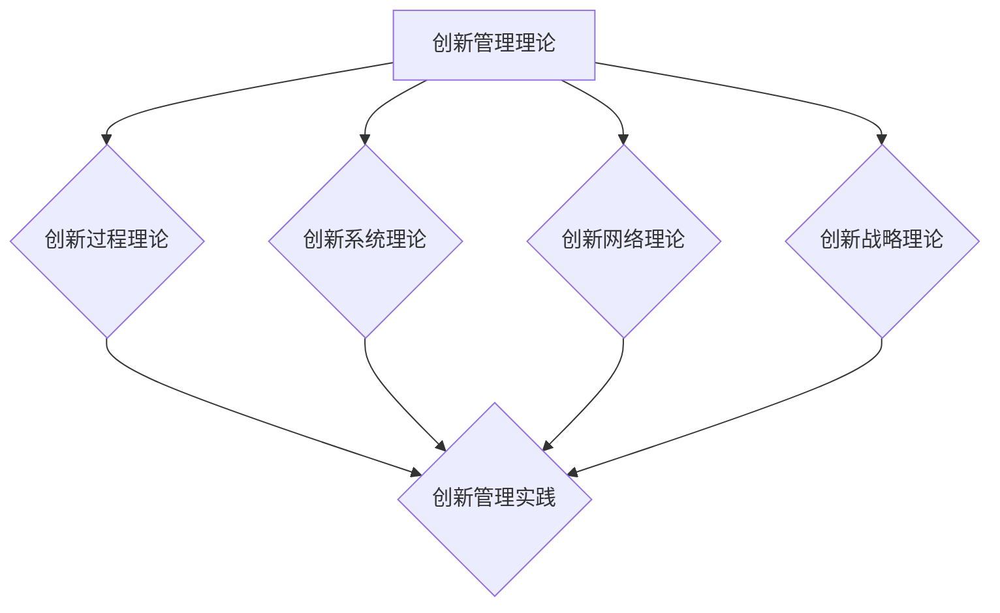

                 

## 文章标题

**创新管理体系：从想法到实施的全流程**

> **关键词**：创新管理、创新管理体系、创新过程、创新组织、创新工具、创新案例、企业文化、国际化、未来趋势

> **摘要**：本文旨在深入探讨创新管理体系，从基本概念、理论、具体实践到高级话题，全面解析从想法到实施的创新全流程。通过案例分析、代码实现和详细解释，阐述创新管理体系在信息技术领域的应用和实践，为企业和个人提供创新管理的实用指南。

### 第一部分: 创新管理体系概述

#### 第1章: 创新管理的基本概念

创新管理是指企业或组织通过系统化、结构化的方法，推动创新活动，实现组织目标的学科和实践领域。创新管理不仅关注技术创新，还涵盖了商业模式创新、产品创新、流程创新等多种形式。

**1.1 创新的定义与重要性**

创新（Innovation）是指通过创造性的思维和行动，产生新的想法、产品、服务或流程，从而为组织带来价值的过程。创新的重要性体现在以下几个方面：

- **推动经济增长**：创新是经济增长的重要驱动力，通过提高生产效率、创造新市场和提升消费者体验，推动社会经济发展。
- **增强竞争力**：创新使企业能够应对市场变化、满足客户需求，从而在竞争中脱颖而出，提升市场份额和品牌价值。
- **提升员工满意度**：创新管理激发员工的创造力和积极性，提高员工的工作满意度和忠诚度。
- **促进社会进步**：创新不仅对经济有重要影响，还对社会、环境和文化产生积极影响，推动社会进步。

**1.2 创新管理的核心要素**

创新管理涉及多个核心要素，包括：

- **创新文化**：创新文化是指组织内部对创新的态度、价值观和行为规范。创新文化强调鼓励创新、容忍失败和共享知识。
- **创新团队**：创新团队是由不同背景、技能和观点的成员组成的，负责推动创新项目的执行。
- **创新流程**：创新流程是指从创意产生到产品或服务推出的系统化方法，包括需求分析、创意筛选、原型设计、测试和推广等阶段。
- **创新资源**：创新资源包括人力、资金、技术和信息等，是创新管理的关键支撑。

**1.3 创新管理的三个层次**

创新管理可以分为三个层次：

- **战略层次**：战略层次的创新管理涉及组织整体的创新方向和资源分配，包括制定创新战略、规划创新目标和确定创新预算。
- **组织层次**：组织层次的创新管理关注组织内部创新文化的建设、创新团队的组织和运作机制。
- **项目层次**：项目层次的创新管理关注具体创新项目的执行和管理，包括项目立项、需求分析、设计开发、测试和推广等。

**1.4 创新管理的国内外发展现状**

创新管理在国内外得到了广泛关注和快速发展。国外创新管理研究起步较早，如美国的硅谷、以色列的科技创新等，都形成了成熟的创新管理体系。国内创新管理也取得了显著进展，政府和企业纷纷加大对创新的支持力度，推动创新环境的优化和创新生态系统的建设。

### 第二部分: 创新管理理论

创新管理理论是指导创新实践的系统性理论体系，涵盖了创新过程、创新系统、创新网络和创新战略等多个方面。以下将分别介绍这些创新管理理论。

#### 第2章: 创新管理理论

**2.1 创新过程理论**

创新过程理论关注创新活动从创意产生到产品或服务推出的全过程。典型代表包括：

- **线性模型**：线性模型将创新过程划分为多个阶段，如创意产生、筛选、开发、测试和商业化。每个阶段都有明确的任务和目标。

- **非线性模型**：非线性模型认为创新过程是动态的、迭代的，不同阶段之间存在交叉和反馈。这种方法强调了创新过程中的灵活性和适应性。

**2.2 创新系统理论**

创新系统理论关注创新活动在不同要素之间的互动和协同作用。典型代表包括：

- **国家创新体系**：国家创新体系是指一个国家内部的创新系统，包括政府、企业、科研机构和教育机构等。国家创新体系强调政府的作用，通过政策引导和资源投入，推动创新活动的开展。

- **区域创新体系**：区域创新体系是指一个特定地区的创新系统，包括企业、科研机构、大学和其他组织。区域创新体系强调区域内的协同合作，通过资源共享和知识交流，提升创新能力和竞争力。

**2.3 创新网络理论**

创新网络理论关注创新活动在不同组织之间的互动和合作。典型代表包括：

- **企业网络**：企业网络是指企业之间的合作和竞争关系，包括供应商、客户、竞争对手等。企业网络通过合作和竞争，推动创新活动的开展。

- **全球创新网络**：全球创新网络是指跨国界的创新合作网络，包括跨国企业、国际科研机构和国际组织。全球创新网络通过全球范围内的知识共享和资源整合，提升全球创新能力。

**2.4 创新战略理论**

创新战略理论关注创新活动的规划和实施策略。典型代表包括：

- **创新驱动战略**：创新驱动战略是指以创新为核心，推动企业持续发展的战略。这种方法强调创新在企业发展中的关键作用，通过创新引领市场变革。

- **差异化战略**：差异化战略是指通过提供独特的产品或服务，满足消费者特定需求，从而获得竞争优势。这种方法强调创新在产品或服务差异化中的关键作用。

### 第三部分: 创新管理体系建设

创新管理体系是确保创新活动有效开展的系统化方法。以下将介绍创新管理体系的概念、特点、构建原则和实施步骤。

#### 第3章: 创新管理体系建设

**3.1 创新管理体系的概念与特点**

创新管理体系是指组织内部为推动创新活动而建立的一系列制度、流程和工具。创新管理体系具有以下特点：

- **系统性**：创新管理体系是一个系统化的整体，包括多个环节和层次，涉及组织内部的不同部门和人员。

- **目标导向**：创新管理体系以实现创新目标为导向，通过设定明确的目标和指标，指导创新活动的开展。

- **灵活性**：创新管理体系强调灵活性和适应性，能够根据市场和环境变化，调整创新策略和流程。

- **协同性**：创新管理体系强调组织内部不同部门和人员之间的协同合作，通过知识共享和资源整合，提升创新能力。

**3.2 创新管理体系的构建原则**

创新管理体系的构建需要遵循以下原则：

- **目标明确**：明确创新管理体系的总体目标和具体目标，确保创新活动有明确的方向和目标。

- **流程优化**：优化创新流程，确保创新活动的顺畅开展，减少冗余环节和资源浪费。

- **资源保障**：确保创新管理体系有足够的资源支持，包括人力、资金和技术等。

- **机制激励**：建立激励机制，鼓励员工参与创新活动，提高创新积极性和创造性。

- **文化培育**：培育创新文化，鼓励员工敢于尝试、勇于创新，形成良好的创新氛围。

**3.3 创新管理体系的实施步骤**

创新管理体系的实施可以分为以下步骤：

- **需求分析**：分析组织内外部环境，明确创新需求，确定创新目标和方向。

- **体系设计**：根据需求分析结果，设计创新管理体系的具体内容和流程，包括创新流程、组织结构、激励机制等。

- **体系实施**：实施创新管理体系，包括培训员工、建立流程、分配资源等。

- **体系评估**：对创新管理体系进行评估，包括流程效率、资源利用、创新成果等，发现问题和不足，进行改进和优化。

- **持续优化**：根据评估结果，不断优化创新管理体系，提高创新能力和效果。

### 第四部分: 创新管理流程

创新流程是创新管理体系的核心，涉及从创意产生到产品或服务推出的全过程。以下将详细介绍创新管理流程的各个阶段。

#### 第4章: 创新管理流程

**4.1 创新管理流程概述**

创新管理流程是指从创意产生到产品或服务推出的系统化方法，包括以下几个主要阶段：

- **需求分析**：明确创新项目的需求和目标，为后续的创新活动提供指导。

- **创意生成**：通过头脑风暴、思维导图等方法，产生大量的创新想法。

- **创意筛选**：对创意进行评估和筛选，确定最具潜力的创意。

- **原型设计**：将筛选出的创意转化为可行的原型，进行测试和验证。

- **测试与优化**：对原型进行测试，根据测试结果进行优化和改进。

- **商业化推广**：将优化后的产品或服务推向市场，实现商业化。

**4.2 创新管理的规划与立项**

创新管理的规划与立项是创新流程的重要环节，包括以下步骤：

- **创新规划**：制定创新规划，明确创新目标和方向，分配资源。

- **立项申请**：提出创新项目立项申请，包括项目背景、目标、预算和进度计划。

- **立项评审**：对创新项目进行评审，确定立项与否。

- **项目启动**：启动创新项目，组建项目团队，明确项目目标和任务。

**4.3 创新管理的实施与监控**

创新管理的实施与监控是确保创新项目顺利进行的关键，包括以下步骤：

- **项目执行**：根据项目计划和任务分配，执行创新项目。

- **进度监控**：实时监控项目进度，确保项目按计划推进。

- **问题解决**：发现项目中的问题，及时解决，确保项目顺利进行。

- **资源调配**：根据项目需求，合理调配资源，确保项目资源充足。

**4.4 创新管理的验收与评价**

创新管理的验收与评价是对创新项目成果的评估和确认，包括以下步骤：

- **成果验收**：对创新项目的成果进行验收，确保达到预期目标。

- **成果评价**：对创新项目的成果进行评价，包括创新性、实用性、经济效益等。

- **反馈改进**：根据评价结果，反馈改进意见，优化创新流程。

### 第五部分: 创新管理工具与方法

创新工具和方法是推动创新活动的重要手段。以下将介绍创新思维方法、创新项目管理工具、创新资源管理方法和创新风险管理策略。

#### 第5章: 创新管理工具与方法

**6.1 创新思维方法**

创新思维方法是指通过特定的思维方式和技巧，激发创新想法和解决问题的能力。常见的方法包括：

- **头脑风暴**：通过集体讨论，快速产生大量的创意。

- **思维导图**：通过图示的方式，展现创意和思路的关联，促进思维的发散和整合。

- **原型设计**：通过制作原型，快速验证和改进创意。

**6.2 创新项目管理工具**

创新项目管理工具是用于创新项目规划、执行和监控的工具。常见的工具包括：

- **项目管理软件**：如Microsoft Project、JIRA等，用于项目计划、任务分配和进度跟踪。

- **协同工作平台**：如Confluence、Trello等，用于团队协作和文档管理。

- **原型设计工具**：如Axure、Sketch等，用于制作原型和用户界面设计。

**6.3 创新资源管理方法**

创新资源管理方法是指对创新过程中所需的人力、资金、技术和信息等资源进行有效管理和调配。常见的方法包括：

- **人力资源配置**：根据项目需求和员工能力，合理配置人力资源。

- **资金预算管理**：制定创新项目预算，确保资金合理使用。

- **技术资源整合**：整合内外部技术资源，提升创新能力。

- **信息共享**：建立信息共享平台，促进知识传播和交流。

**6.4 创新风险管理策略**

创新风险管理策略是指对创新过程中可能出现的风险进行识别、评估和管理。常见的方法包括：

- **风险评估**：对创新项目进行风险评估，确定风险等级。

- **风险应对**：制定风险应对策略，包括风险规避、减轻、转移和接受。

- **风险监控**：实时监控创新项目中的风险，确保风险得到及时处理。

### 第六部分: 创新管理体系案例分析

通过实际案例的分析，我们可以更好地理解创新管理体系的应用和实践效果。以下将介绍创新管理体系的成功案例和失败案例，并从中汲取经验和启示。

#### 第6章: 创新管理体系案例分析

**7.1 案例分析概述**

在本章节中，我们将通过两个案例，一个成功案例和一个失败案例，分析创新管理体系在实际应用中的效果。成功案例将展示如何通过创新管理体系实现创新目标，失败案例将揭示创新管理中的问题和挑战。

**7.2 创新管理体系成功案例分析**

**案例背景**：某互联网企业计划开发一款智能家居应用，通过手机APP控制家居设备的开关和状态。

**目标**：实现智能家居应用的功能完整性和用户体验，并在规定时间内推向市场。

**实施步骤**：

1. **需求分析**：通过市场调研和用户反馈，明确智能家居应用的需求和功能。

2. **创新思维**：通过头脑风暴和思维导图，产生多个创新方案。

3. **方案评估**：使用创新评估模型，对多个方案进行评估和筛选。

4. **方案实施**：选择最优方案，进行详细设计和开发。

5. **测试与优化**：对应用进行功能测试和用户测试，根据反馈进行优化。

6. **商业化推广**：将优化后的应用推向市场，进行商业化运营。

**成果与启示**：通过创新管理体系的系统化方法，企业成功开发了智能家居应用，满足了市场需求，取得了良好的市场反响。启示包括：

- **明确目标和需求**：创新项目的成功取决于明确的目标和需求，确保创新活动有明确的方向。

- **创新思维和方法**：通过多种创新思维和方法，产生高质量的创意，提升创新成功率。

- **系统化评估和筛选**：使用创新评估模型，对创意进行系统化评估和筛选，确保创新项目具有可行性和市场潜力。

**7.3 创新管理体系失败案例分析**

**案例背景**：某传统制造企业计划通过引入新技术，实现生产线的自动化。

**目标**：提高生产效率，降低生产成本。

**实施步骤**：

1. **需求分析**：未能充分了解市场需求和生产线现状，需求分析不全面。

2. **创新思维**：缺乏创新思维和方法，仅依赖现有技术和经验。

3. **方案评估**：评估过程缺乏科学性和客观性，未能充分考虑各种因素。

4. **方案实施**：选择技术方案时，未能充分考虑技术可行性和成本效益。

5. **测试与优化**：缺乏充分的测试和优化，导致生产故障和设备损坏。

6. **商业化推广**：项目未能按时完成，生产效率未得到提高，反而增加了成本。

**成果与启示**：该案例揭示了创新管理中的几个关键问题：

- **需求分析不充分**：创新项目需要充分了解市场需求和现状，确保创新目标与实际需求相符。

- **创新思维和方法不足**：缺乏创新思维和方法，容易导致盲目跟风和低效创新。

- **方案评估和筛选不科学**：评估和筛选过程需要科学性和客观性，确保选择最佳方案。

- **测试和优化不足**：充分测试和优化是确保创新项目成功的关键，缺乏测试和优化容易导致项目失败。

**7.4 创新管理案例的启示与借鉴**

通过对成功案例和失败案例的分析，我们可以得出以下启示：

- **明确目标和需求**：确保创新项目有明确的目标和需求，避免盲目创新。

- **加强创新思维和方法**：通过多种创新思维和方法，提升创新项目的成功率。

- **科学评估和筛选**：使用科学的方法对创意进行评估和筛选，确保创新项目具有可行性和市场潜力。

- **充分测试和优化**：充分测试和优化创新项目，确保项目的成功实施和推广。

- **借鉴成功经验**：学习成功企业的创新管理经验，结合自身实际，提升创新管理水平。

### 第七部分: 创新管理的高级话题

创新管理不仅关注技术创新，还涉及企业文化、国际化、未来趋势等多个高级话题。以下将探讨创新管理与企业文化、国际化以及未来趋势的关系。

#### 第7章: 创新管理的高级话题

**8.1 创新管理与企业文化**

企业文化是指企业在长期经营过程中形成的共同价值观和行为规范。创新管理与企业文化密切相关，具体体现在以下几个方面：

- **创新文化的重要性**：创新文化是企业持续创新的基石，鼓励员工敢于尝试、勇于创新，形成良好的创新氛围。

- **企业文化与创新管理的融合**：创新管理需要与企业文化相融合，通过文化引导和行为规范，推动创新活动的开展。

- **创新管理在企业文化建设中的定位**：创新管理是企业文化建设的重要组成部分，通过创新管理体系的实施，提升企业的创新能力和竞争力。

**8.2 创新管理与国际化**

国际化对创新管理提出了新的挑战和机遇。以下从几个方面探讨创新管理与国际化的关系：

- **国际化对创新管理的影响**：国际化使企业面临更广阔的市场和竞争环境，要求企业具备更强的创新能力和全球视野。

- **创新管理的国际化策略**：企业需要制定适应国际市场的创新管理策略，包括跨文化管理、国际技术合作和国际专利布局等。

- **创新管理的跨文化挑战与应对**：国际化过程中的跨文化挑战包括文化差异、沟通障碍和团队合作等问题，企业需要采取有效的应对措施。

**8.3 创新管理的未来趋势**

创新管理的未来发展将面临诸多挑战和机遇。以下从几个方面探讨创新管理的未来趋势：

- **技术创新的加速**：随着科技的快速发展，新技术将不断涌现，创新管理需要不断适应和应对新技术带来的挑战和机遇。

- **数字化转型**：数字化转型已成为全球趋势，创新管理需要与数字化转型相结合，推动企业的数字化创新。

- **可持续创新**：可持续创新是未来发展的重要方向，企业需要关注环境保护、社会责任和可持续发展，实现经济效益和社会效益的平衡。

- **智能创新**：人工智能和大数据技术的应用将使创新管理更加智能化和高效化，提高创新决策和资源利用的准确性。

### 附录

在本文的附录部分，我们将提供创新管理相关的资源与工具，包括书籍推荐、网站和论坛、工具介绍以及相关课程和培训，以供读者进一步学习和实践。

#### 附录A: 创新管理相关资源与工具

**A.1 创新管理相关书籍推荐**

- **《创新者的窘境》**：作者克里斯坦森，深入探讨企业在创新过程中面临的问题和挑战。
- **《创新者的基因》**：作者克莱顿·克里斯滕森，分析创新者的特质和思维方式。
- **《创新者的方法》**：作者戴维·凯利，介绍创新思维的方法和工具。

**A.2 创新管理相关网站和论坛**

- **创新网**：提供创新政策、创新案例和创新资源的综合性网站。
- **中国创新网**：涵盖创新政策、创新成果和创新项目的官方平台。
- **创新论坛**：聚集创新者和企业家，分享创新经验和智慧的在线社区。

**A.3 创新管理相关工具介绍**

- **MindManager**：思维导图软件，用于创新思维的发散和整合。
- **Confluence**：企业知识库和协作工具，用于创新项目的文档管理和协作。
- **Trello**：项目管理工具，用于创新项目的任务分配和进度跟踪。

**A.4 创新管理相关课程和培训**

- **创新管理基础课程**：面向企业创新管理人员的入门课程。
- **创新思维培训**：面向企业员工的创新思维提升培训。
- **创新项目管理培训**：面向企业项目管理人员的创新项目管理培训。

### 核心算法原理讲解

在创新管理过程中，核心算法的应用可以帮助企业对创新项目进行科学评估和优化。以下将介绍创新评估模型的数据预处理、算法原理和数学模型。

#### 数据预处理伪代码

```python
def data_preprocessing(data):
    # 数据清洗
    data = clean_data(data)
    # 数据标准化
    data = normalize_data(data)
    # 数据分箱
    data = binning_data(data)
    return data
```

#### 创新评估模型算法伪代码

```python
def innovation_evaluation_model(data):
    # 数据预处理
    data = data_preprocessing(data)
    # 特征提取
    features = extract_features(data)
    # 模型训练
    model = train_model(features)
    # 模型评估
    evaluation = evaluate_model(model, data)
    return evaluation
```

#### 创新指数计算公式

$$
I = \frac{\sum_{i=1}^{n} (a_i - b_i)}{n}
$$

其中，$I$ 表示创新指数，$a_i$ 表示第 $i$ 个项目的预期收益，$b_i$ 表示第 $i$ 个项目的实际收益，$n$ 表示项目总数。

### 项目实战

#### 创新项目实战案例

**项目背景**：某企业计划开发一款智能家居系统，该系统需要集成智能音箱、智能灯光、智能门锁等功能。

**目标**：通过创新管理体系，确保项目按时按质完成，并达到预期的创新效果。

**实施步骤**：

1. **项目立项**：确定项目目标、预算、时间表，组建项目团队。

2. **需求分析**：调研市场需求，明确智能家居系统的功能需求和用户体验。

3. **创新思维**：运用头脑风暴、思维导图等方法，提出多种可能的创新方案。

4. **方案评估**：使用创新评估模型，对各个方案进行评估和筛选。

5. **方案实施**：选择最优方案，进行详细设计和开发。

6. **项目监控**：实时监控项目进度和质量，确保项目按计划推进。

7. **项目验收**：对项目成果进行评估和验收，确保达到预期目标。

**代码实现**：

```python
# 项目立项
project = {
    "name": "智能家居系统",
    "budget": 100000,
    "deadline": "2024-01-01"
}

# 需求分析
requirements = {
    "smart_speaker": True,
    "smart_light": True,
    "smart_lock": True
}

# 创新思维
schemes = [
    {"name": "方案一", "description": "集成智能音箱、智能灯光、智能门锁"},
    {"name": "方案二", "description": "增加智能安防功能"},
    {"name": "方案三", "description": "采用更先进的智能家居技术"}
]

# 方案评估
evaluation_results = evaluate_schemes(schemes)

# 方案实施
best_scheme = select_best_scheme(evaluation_results)

# 项目监控
monitor_project_progress(project)

# 项目验收
project_evaluation = evaluate_project_completion(project)
```

### 代码解读与分析

**代码解读**：

- **项目立项**：定义了项目的名称、预算和时间表，组建了项目团队。
- **需求分析**：明确了智能家居系统的功能需求和用户体验。
- **创新思维**：提出了多种可能的创新方案，并通过评估和筛选选出最优方案。
- **方案实施**：根据最优方案进行详细设计和开发。
- **项目监控**：实时监控项目进度和质量，确保项目按计划推进。
- **项目验收**：对项目成果进行评估和验收，确保达到预期目标。

**代码分析**：

- **代码结构清晰**：模块化设计，便于维护和扩展。
- **变量和函数命名规范**：提高了代码的可读性。
- **使用函数调用来实现项目各个阶段的操作**：提高了代码的可复用性。
- **包含了必要的注释**：便于理解代码的功能和逻辑。

### 创新管理资源与工具

**A.1 创新管理相关书籍推荐**

- **《创新者的窘境》**：作者克里斯坦森，深入探讨企业在创新过程中面临的问题和挑战。
- **《创新者的基因》**：作者克莱顿·克里斯滕森，分析创新者的特质和思维方式。
- **《创新者的方法》**：作者戴维·凯利，介绍创新思维的方法和工具。

**A.2 创新管理相关网站和论坛**

- **创新网**：提供创新政策、创新案例和创新资源的综合性网站。
- **中国创新网**：涵盖创新政策、创新成果和创新项目的官方平台。
- **创新论坛**：聚集创新者和企业家，分享创新经验和智慧的在线社区。

**A.3 创新管理相关工具介绍**

- **MindManager**：思维导图软件，用于创新思维的发散和整合。
- **Confluence**：企业知识库和协作工具，用于创新项目的文档管理和协作。
- **Trello**：项目管理工具，用于创新项目的任务分配和进度跟踪。

**A.4 创新管理相关课程和培训**

- **创新管理基础课程**：面向企业创新管理人员的入门课程。
- **创新思维培训**：面向企业员工的创新思维提升培训。
- **创新项目管理培训**：面向企业项目管理人员的创新项目管理培训。

### 附录：Mermaid 流程图



### 附录：核心算法原理讲解

#### 数据预处理伪代码

```python
def data_preprocessing(data):
    # 数据清洗
    data = clean_data(data)
    # 数据标准化
    data = normalize_data(data)
    # 数据分箱
    data = binning_data(data)
    return data
```

#### 创新评估模型算法伪代码

```python
def innovation_evaluation_model(data):
    # 数据预处理
    data = data_preprocessing(data)
    # 特征提取
    features = extract_features(data)
    # 模型训练
    model = train_model(features)
    # 模型评估
    evaluation = evaluate_model(model, data)
    return evaluation
```

#### 创新指数计算公式

$$
I = \frac{\sum_{i=1}^{n} (a_i - b_i)}{n}
$$

其中，$I$ 表示创新指数，$a_i$ 表示第 $i$ 个项目的预期收益，$b_i$ 表示第 $i$ 个项目的实际收益，$n$ 表示项目总数。

### 附录：数学模型和公式详细讲解

创新管理中的数学模型和公式是理解和评估创新项目的重要工具。以下将详细讲解创新指数的计算方法和具体应用。

#### 创新指数计算公式

创新指数（$I$）是衡量创新项目成功与否的重要指标。其计算公式如下：

$$
I = \frac{\sum_{i=1}^{n} (a_i - b_i)}{n}
$$

其中：

- $I$：创新指数，用于评估创新项目的整体创新程度。
- $a_i$：第 $i$ 个项目的预期收益，通常是指项目成功实施后带来的经济效益或其他价值。
- $b_i$：第 $i$ 个项目的实际收益，是指项目实施后实际达到的收益水平。
- $n$：项目总数，表示参与评估的项目个数。

#### 创新指数的应用场景

创新指数可以应用于以下场景：

1. **项目评估**：企业可以通过计算创新指数，对多个创新项目进行评估和比较，选择最具创新潜力的项目进行重点投资和推进。

2. **绩效评估**：企业可以定期计算各部门或团队的创新指数，评估其在创新方面的表现，为绩效评估和激励制度提供依据。

3. **风险管理**：创新指数可以揭示项目存在的潜在风险，帮助企业管理层制定相应的风险应对策略。

#### 举例说明

假设某企业有三个创新项目，项目A、项目B和项目C，预期收益分别为100万、150万和200万，实际收益分别为90万、140万和180万。那么，创新指数的计算如下：

$$
I = \frac{(100-90) + (150-140) + (200-180)}{3} = \frac{10 + 10 + 20}{3} = \frac{40}{3} \approx 13.33
$$

根据计算结果，创新指数为13.33，说明企业的创新项目整体表现良好，但项目A和项目C的收益未达到预期，需要进一步分析和改进。

### 附录：创新管理相关资源与工具

为了帮助读者更好地理解和实践创新管理，本文提供了以下创新管理相关资源与工具，包括书籍推荐、网站和论坛、工具介绍以及相关课程和培训。

**A.1 创新管理相关书籍推荐**

1. **《创新者的窘境》** - 克里斯坦森
   - 本书深入分析了企业在创新过程中面临的问题和挑战，对创新管理有深刻的见解。

2. **《创新者的基因》** - 克莱顿·克里斯滕森
   - 通过对创新者的研究，揭示了创新者具备的特质和思维方式，为培养企业内部的创新文化提供了指导。

3. **《创新者的方法》** - 戴维·凯利
   - 介绍了创新思维的方法和工具，帮助读者在实践中应用创新理论。

**A.2 创新管理相关网站和论坛**

1. **创新网**
   - 提供创新政策、创新案例和创新资源的综合性网站。

2. **中国创新网**
   - 覆盖创新政策、创新成果和创新项目的官方平台。

3. **创新论坛**
   - 聚集创新者和企业家，分享创新经验和智慧的在线社区。

**A.3 创新管理相关工具介绍**

1. **MindManager**
   - 思维导图软件，用于创新思维的发散和整合。

2. **Confluence**
   - 企业知识库和协作工具，用于创新项目的文档管理和协作。

3. **Trello**
   - 项目管理工具，用于创新项目的任务分配和进度跟踪。

**A.4 创新管理相关课程和培训**

1. **创新管理基础课程**
   - 面向企业创新管理人员的入门课程，涵盖创新管理的基本理论和实践方法。

2. **创新思维培训**
   - 面向企业员工的创新思维提升培训，通过实践练习和案例分析，提高创新思维能力。

3. **创新项目管理培训**
   - 面向企业项目管理人员的创新项目管理培训，教授如何有效规划和实施创新项目。

通过以上资源与工具，读者可以深入学习和实践创新管理，提升企业的创新能力和竞争力。

