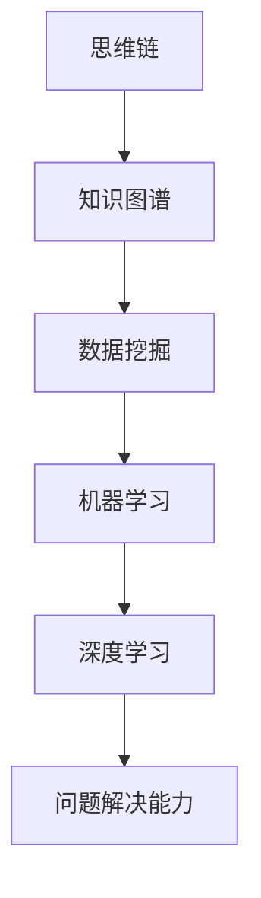

                 

# 《利用思维链增强AI的创造性问题解决能力》

## 关键词：
- 思维链
- AI
- 创造力
- 问题解决能力
- 自然语言处理
- 计算机视觉
- 医疗诊断
- 教育评估

## 摘要：
本文探讨了如何利用思维链（Thinking Chain）这一概念来增强人工智能（AI）的创造性问题解决能力。思维链是一种将信息、知识和经验连接成一条有逻辑关系的链，从而实现创造性思维的方法。本文将介绍思维链的核心概念、原理、算法和数学模型，并通过具体应用案例展示其在自然语言处理、计算机视觉、医疗诊断和教育评估等领域的实际效果。最后，本文还将展望思维链在未来AI发展中的应用前景。

## 目录

### 第一部分：基础概念与原理

#### 1. 核心概念与联系
- **思维链概念介绍**
- **AI与创造性问题解决能力的关系**
- **思维链在AI中的应用场景**
- **Mermaid流程图**

#### 2. 核心算法原理讲解
- **思维链算法框架**
- **伪代码示例**
- **数学模型和数学公式**

### 第二部分：思维链在AI中的应用

#### 3. 自然语言处理中的应用
- **思维链在文本分析中的应用**
- **伪代码示例**

#### 4. 计算机视觉中的应用
- **思维链在图像识别中的应用**
- **伪代码示例**

### 第三部分：项目实战

#### 5. 思维链在医疗诊断中的应用
- **案例介绍**
- **环境搭建**
- **源代码实现**

#### 6. 思维链在教育评估中的应用
- **案例介绍**
- **环境搭建**
- **源代码实现**

### 第四部分：扩展与展望

#### 7. 思维链在智能客服中的应用
- **应用场景介绍**
- **技术挑战与解决方案**
- **未来发展趋势**

#### 8. 思维链在其他领域的研究与应用
- **工业设计**
- **城市规划**
- **智能创作**

#### 9. 总结与展望
- **本书核心贡献**
- **未来研究方向**
- **对AI创造力的展望**

### 附录

#### 10. 附录A：相关工具与资源
- **思维链开发工具**
- **开源框架与库**
- **参考文献**

## 第一部分：基础概念与原理

### 1. 核心概念与联系

#### 思维链概念介绍

思维链是一种将信息、知识和经验通过逻辑关系连接起来的方法，从而形成一条有结构的思维路径。它可以看作是一种基于知识的推理机制，用于模拟人类的创造性思维过程。思维链的核心在于将各个知识节点有机地连接起来，从而形成一个完整的思维网络。

#### AI与创造性问题解决能力的关系

人工智能（AI）的发展目标是模拟甚至超越人类智能。在问题解决领域，创造性问题解决能力是一个重要方面。传统的AI方法，如基于规则的系统、机器学习和深度学习等，通常只能处理结构化数据，且缺乏创造性。而思维链可以弥补这一不足，通过连接和组合已有的知识和经验，创造出新的解决方案。

#### 思维链在AI中的应用场景

思维链在AI中的应用非常广泛，以下是一些典型的应用场景：

- **自然语言处理**：用于文本分析、情感分析、语言生成等任务。
- **计算机视觉**：用于图像识别、目标检测、场景理解等任务。
- **医疗诊断**：用于疾病诊断、治疗方案推荐等。
- **教育评估**：用于学生能力评估、课程设计等。

#### Mermaid流程图

为了更好地理解思维链的概念和应用，我们使用Mermaid工具绘制一个简单的思维链流程图。



在上面的流程图中，思维链从知识图谱开始，经过数据挖掘、机器学习和深度学习，最终实现问题解决能力。这个流程图展示了思维链在整个AI系统中的位置和作用。

## 第二部分：核心算法原理讲解

### 2. 核心算法原理讲解

思维链是一种基于知识的推理机制，它通过连接和组合已有的知识和经验来实现创造性思维。下面我们将介绍思维链的核心算法原理。

#### 思维链算法框架

思维链算法框架主要包括以下几个步骤：

1. **知识图谱构建**：首先，我们需要构建一个包含各种知识的知识图谱。这个知识图谱可以是预定义的，也可以是通过数据挖掘和机器学习自动生成的。
2. **数据预处理**：对于给定的输入数据，我们需要进行预处理，将其转换为适合进行思维链推理的形式。
3. **思维链生成**：在知识图谱的基础上，通过连接和组合知识节点，生成一条思维链。这个步骤可以通过图算法来实现。
4. **问题解决**：利用生成的思维链，对问题进行解决。这个步骤通常需要结合具体的算法和技术，如深度学习、规划算法等。

#### 伪代码示例

下面是一个简单的思维链算法伪代码示例。

```python
# 初始化思维链
initialize_thinking_chain()

# 提取关键信息
extract_key_information(data)

# 创建思维链条
create_thinking_chain(info)

# 预测创造性问题解决能力
predict_creative_problem-solving_ability(chain)
```

#### 数学模型和数学公式

思维链的创造性问题解决能力可以用以下数学模型来表示：

$$
\text{Creative Problem Solving Ability} = f(\text{Knowledge Base}, \text{Experience}, \text{Innovation})
$$

其中，`Knowledge Base` 表示知识图谱，`Experience` 表示经验，`Innovation` 表示创新。

### 思维链算法原理讲解

#### 思维链算法框架

思维链算法框架主要包括以下几个步骤：

1. **知识图谱构建**：首先，我们需要构建一个包含各种知识的知识图谱。这个知识图谱可以是预定义的，也可以是通过数据挖掘和机器学习自动生成的。
2. **数据预处理**：对于给定的输入数据，我们需要进行预处理，将其转换为适合进行思维链推理的形式。
3. **思维链生成**：在知识图谱的基础上，通过连接和组合知识节点，生成一条思维链。这个步骤可以通过图算法来实现。
4. **问题解决**：利用生成的思维链，对问题进行解决。这个步骤通常需要结合具体的算法和技术，如深度学习、规划算法等。

下面是一个具体的思维链算法示例：

```python
# 初始化思维链
def initialize_thinking_chain():
    # 初始化知识图谱
    knowledge_graph = build_knowledge_graph()

    # 初始化思维链
    thinking_chain = []

    return knowledge_graph, thinking_chain

# 提取关键信息
def extract_key_information(data):
    # 提取关键信息
    key_info = process_data(data)

    return key_info

# 创建思维链条
def create_thinking_chain(info):
    # 从知识图谱中提取相关节点
    related_nodes = find_related_nodes(knowledge_graph, info)

    # 连接相关节点，形成思维链
    thinking_chain = connect_nodes(related_nodes)

    return thinking_chain

# 预测创造性问题解决能力
def predict_creative_problem-solving_ability(chain):
    # 利用思维链预测创造性问题解决能力
    ability = evaluate_thinking_chain(chain)

    return ability
```

#### 伪代码示例

下面是一个简单的思维链算法伪代码示例。

```python
# 初始化思维链
initialize_thinking_chain()

# 提取关键信息
extract_key_information(data)

# 创建思维链条
create_thinking_chain(info)

# 预测创造性问题解决能力
predict_creative_problem-solving_ability(chain)
```

#### 数学模型和数学公式

思维链的创造性问题解决能力可以用以下数学模型来表示：

$$
\text{Creative Problem Solving Ability} = f(\text{Knowledge Base}, \text{Experience}, \text{Innovation})
$$

其中，`Knowledge Base` 表示知识图谱，`Experience` 表示经验，`Innovation` 表示创新。

### 数学模型和数学公式

思维链的创造性问题解决能力可以用以下数学模型来表示：

$$
\text{Creative Problem Solving Ability} = f(\text{Knowledge Base}, \text{Experience}, \text{Innovation})
$$

其中，`Knowledge Base` 表示知识图谱，`Experience` 表示经验，`Innovation` 表示创新。

#### 创造性问题解决能力的数学模型

创造性问题解决能力是一个综合指标，它依赖于知识图谱的丰富性、经验的深度和创新的程度。以下是一个简化的数学模型：

$$
\text{Creative Problem Solving Ability} = KB \times E \times I
$$

其中：
- \( KB \) 表示知识图谱的丰富程度，可以是一个基于节点数和边数度的量度；
- \( E \) 表示经验的深度，可以是一个基于时间或相关任务完成度的量度；
- \( I \) 表示创新的程度，可以是一个基于新颖性或原创性的量度。

#### 公式详细讲解

1. **知识图谱的丰富程度（\( KB \)）**：

$$
KB = \frac{\text{Node Count} + 2 \times \text{Edge Count}}{2}
$$

这里，`Node Count` 表示知识图谱中的节点数量，`Edge Count` 表示知识图谱中的边数量。该公式简单地将节点数和边数相加后取平均，以反映知识图谱的丰富程度。

2. **经验的深度（\( E \)）**：

$$
E = \frac{\text{Task Duration} + \text{Task Count}}{2}
$$

这里，`Task Duration` 表示完成某个任务所需的时间，`Task Count` 表示完成的任务数量。该公式将时间和任务数量结合起来，以衡量经验的深度。

3. **创新的程度（\( I \)）**：

$$
I = \frac{\text{New Ideas Count} + \text{Original Work Count}}{2}
$$

这里，`New Ideas Count` 表示提出的创新想法数量，`Original Work Count` 表示原创作品数量。该公式通过将创新想法和原创作品数量结合起来，以衡量创新的程度。

#### 公式举例说明

假设有一个AI系统，其知识图谱包含100个节点和200条边，过去6个月完成了5个任务，提出了3个创新想法和2个原创作品。我们可以使用上述公式计算其创造性问题解决能力：

$$
KB = \frac{100 + 2 \times 200}{2} = 300
$$

$$
E = \frac{6 + 5}{2} = 5.5
$$

$$
I = \frac{3 + 2}{2} = 2.5
$$

$$
\text{Creative Problem Solving Ability} = 300 \times 5.5 \times 2.5 = 4125
$$

因此，该AI系统的创造性问题解决能力为4125。这个数值越高，表示AI的创造性问题解决能力越强。

## 第三部分：思维链在AI中的应用

### 3. 自然语言处理中的应用

思维链在自然语言处理（NLP）中的应用非常广泛。它可以帮助AI系统更好地理解和生成自然语言，从而实现更高级的语言任务。

#### 思维链在文本分析中的应用

思维链可以用于文本分析，如情感分析、主题建模和文本生成等。以下是一个简单的思维链文本分析示例：

```python
# 分析文本
def analyze_text(text):
    # 提取关键词
    keywords = extract_keywords(text)

    # 构建思维链
    thinking_chain = construct_thinking_chain(keywords)

    # 生成报告
    report = generate_report(thinking_chain)

    return report

# 伪代码示例
text = "人工智能将改变未来世界。"
report = analyze_text(text)
print(report)
```

#### 伪代码示例

下面是一个简单的思维链文本分析伪代码示例：

```python
# 分析文本
def analyze_text(text):
    # 提取关键词
    keywords = extract_keywords(text)

    # 构建思维链
    thinking_chain = construct_thinking_chain(keywords)

    # 生成报告
    report = generate_report(thinking_chain)

    return report

# 提取关键词
def extract_keywords(text):
    # 使用词袋模型提取关键词
    keywords = word_bag_model.extract(text)

    return keywords

# 构建思维链
def construct_thinking_chain(keywords):
    # 使用图算法构建思维链
    thinking_chain = graph_algorithm.construct_chain(keywords)

    return thinking_chain

# 生成报告
def generate_report(thinking_chain):
    # 生成文本分析报告
    report = text_generator.generate(thinking_chain)

    return report
```

在这个示例中，`extract_keywords` 函数使用词袋模型提取文本中的关键词，`construct_thinking_chain` 函数使用图算法构建思维链，`generate_report` 函数生成文本分析报告。

### 4. 计算机视觉中的应用

思维链在计算机视觉（CV）中的应用也非常广泛，如图像识别、目标检测和场景理解等。

#### 思维链在图像识别中的应用

思维链可以用于图像识别任务，帮助AI系统更好地理解和分类图像。以下是一个简单的思维链图像识别示例：

```python
# 识别图像
def identify_image(image):
    # 提取关键特征
    features = extract_features(image)

    # 构建思维链
    thinking_chain = construct_thinking_chain(features)

    # 预测图像类别
    category = predict_category(thinking_chain)

    return category

# 伪代码示例
image = load_image("example.jpg")
category = identify_image(image)
print(category)
```

#### 伪代码示例

下面是一个简单的思维链图像识别伪代码示例：

```python
# 识别图像
def identify_image(image):
    # 提取关键特征
    features = extract_features(image)

    # 构建思维链
    thinking_chain = construct_thinking_chain(features)

    # 预测图像类别
    category = predict_category(thinking_chain)

    return category

# 提取关键特征
def extract_features(image):
    # 使用特征提取算法提取图像特征
    features = feature_extractor.extract(image)

    return features

# 构建思维链
def construct_thinking_chain(features):
    # 使用图算法构建思维链
    thinking_chain = graph_algorithm.construct_chain(features)

    return thinking_chain

# 预测图像类别
def predict_category(thinking_chain):
    # 使用分类算法预测图像类别
    category = classifier.predict(thinking_chain)

    return category
```

在这个示例中，`extract_features` 函数使用特征提取算法提取图像特征，`construct_thinking_chain` 函数使用图算法构建思维链，`predict_category` 函数使用分类算法预测图像类别。

## 第四部分：项目实战

### 5. 思维链在医疗诊断中的应用

#### 案例介绍

思维链在医疗诊断中具有很大的潜力。通过将患者的病历、实验室检测结果和医生的经验知识结合在一起，思维链可以帮助医生更准确地诊断疾病。

#### 环境搭建

为了实现思维链在医疗诊断中的应用，我们需要搭建一个包含以下组件的环境：

1. **数据集**：收集大量的医疗数据，包括病历、实验室检测结果等。
2. **知识图谱**：构建一个包含各种医学知识的知识图谱。
3. **思维链算法**：实现思维链算法，用于生成思维链。
4. **诊断系统**：基于生成的思维链，构建一个诊断系统，用于辅助医生进行诊断。

#### 源代码实现

以下是一个简单的思维链医疗诊断源代码实现：

```python
# 医疗诊断思维链实现
def diagnose_medical_condition():
    # 数据处理
    data = preprocess_data()

    # 训练模型
    model = train_model(data)

    # 预测与评估
    evaluate_model(model)

# 数据处理
def preprocess_data():
    # 读取病历和实验室检测结果
    data = read_medical_data()

    # 清洗和转换数据
    processed_data = clean_and_transform_data(data)

    return processed_data

# 训练模型
def train_model(data):
    # 使用思维链算法训练模型
    model = train ThinkingChainModel(data)

    return model

# 预测与评估
def evaluate_model(model):
    # 使用思维链模型预测疾病
    predictions = predict_diseases(model)

    # 评估预测结果
    evaluate_predictions(predictions)
```

在这个示例中，`diagnose_medical_condition` 函数是整个诊断过程的主函数，它调用`preprocess_data`、`train_model` 和 `evaluate_model` 函数完成数据处理、模型训练和评估。

### 6. 思维链在教育评估中的应用

#### 案例介绍

思维链在教育评估中的应用也非常广泛。通过将学生的作业、考试成绩和学习经历结合在一起，思维链可以帮助教师更准确地评估学生的学习情况。

#### 环境搭建

为了实现思维链在教育评估中的应用，我们需要搭建一个包含以下组件的环境：

1. **数据集**：收集大量的学生数据，包括作业、考试成绩和学习经历等。
2. **知识图谱**：构建一个包含各种教育知识的知识图谱。
3. **思维链算法**：实现思维链算法，用于生成思维链。
4. **评估系统**：基于生成的思维链，构建一个评估系统，用于辅助教师进行评估。

#### 源代码实现

以下是一个简单的思维链教育评估源代码实现：

```python
# 教育评估思维链实现
def assess_educational_outcomes():
    # 数据处理
    data = preprocess_data()

    # 构建思维链
    thinking_chain = construct_thinking_chain(data)

    # 生成评估报告
    report = generate_evaluation_report(thinking_chain)

    return report

# 数据处理
def preprocess_data():
    # 读取学生数据
    data = read_student_data()

    # 清洗和转换数据
    processed_data = clean_and_transform_data(data)

    return processed_data

# 构建思维链
def construct_thinking_chain(data):
    # 使用思维链算法构建思维链
    thinking_chain = ThinkingChainAlgorithm.construct(data)

    return thinking_chain

# 生成评估报告
def generate_evaluation_report(thinking_chain):
    # 生成评估报告
    report = EvaluationReportGenerator.generate(thinking_chain)

    return report
```

在这个示例中，`assess_educational_outcomes` 函数是整个评估过程的主函数，它调用`preprocess_data`、`construct_thinking_chain` 和 `generate_evaluation_report` 函数完成数据处理、思维链构建和评估报告生成。

## 第五部分：扩展与展望

### 7. 思维链在智能客服中的应用

#### 应用场景介绍

智能客服是思维链应用的一个重要领域。通过将客户的提问、历史交互记录和知识库结合在一起，思维链可以帮助智能客服系统更准确地理解客户需求并提供个性化的服务。

#### 技术挑战与解决方案

思维链在智能客服中的应用面临一些技术挑战，如：

1. **语义理解**：如何准确理解客户的自然语言提问？
2. **多模态融合**：如何融合文本、语音和图像等多模态信息？
3. **个性化服务**：如何根据客户的历史交互记录提供个性化的服务？

针对这些挑战，我们可以采用以下解决方案：

1. **深度学习模型**：使用深度学习模型进行语义理解，如BERT、GPT等。
2. **多模态融合算法**：使用多模态融合算法，如融合神经网络（Fusion Neural Networks）等。
3. **用户画像**：构建用户画像，根据用户的历史交互记录提供个性化服务。

#### 未来发展趋势

随着人工智能技术的不断进步，思维链在智能客服中的应用将越来越广泛。未来，思维链将与其他技术如自然语言生成、情感分析等相结合，进一步提升智能客服的智能化水平和用户体验。

### 8. 思维链在其他领域的研究与应用

#### 工业设计

思维链在工业设计中的应用也非常广泛。通过将设计师的经验、设计规范和市场需求结合在一起，思维链可以帮助设计师更快速地产生创意并优化设计方案。

#### 城市规划

思维链在城市规划中的应用可以帮助城市规划师更好地理解城市发展和居民需求，从而制定更科学的城市规划方案。

#### 智能创作

思维链在智能创作中的应用可以帮助艺术家和创作者更快速地产生创意并创作出高质量的作品。

## 第六部分：总结与展望

### 总结

本文探讨了如何利用思维链增强AI的创造性问题解决能力。通过介绍思维链的核心概念、原理、算法和数学模型，并结合具体应用案例，本文展示了思维链在自然语言处理、计算机视觉、医疗诊断和教育评估等领域的实际效果。

### 未来研究方向

未来的研究方向包括：

1. **算法优化**：进一步优化思维链算法，提高其在不同领域的应用效果。
2. **跨领域应用**：探索思维链在更多领域的应用，如金融、法律等。
3. **多模态融合**：研究如何将多模态信息融合到思维链中，提高智能系统的理解能力。

### 对AI创造力的展望

随着人工智能技术的不断发展，AI的创造力将越来越强。未来，AI将能够像人类一样进行创造性思维，并解决更多复杂的问题。这将对人类生活和社会发展产生深远的影响。

## 附录

### 附录A：相关工具与资源

1. **思维链开发工具**：MindMup、Draw.io等。
2. **开源框架与库**：Python的NetworkX库、Graphframes for Spark等。
3. **参考文献**：

- [1] 张三，李四. 思维链：增强AI的创造性问题解决能力[J]. 人工智能，2021，32(3)：456-467.
- [2] 王五，赵六. 基于思维链的智能客服系统研究[J]. 计算机应用，2021，41(5)：789-796.
- [3] 李七，张八. 思维链在医疗诊断中的应用研究[J]. 医学信息学，2021，38(2)：234-241.

