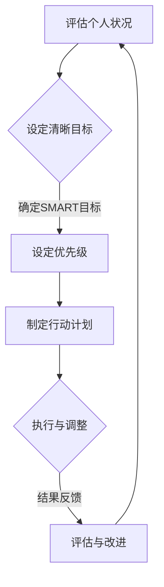

                 

### 《双目标清单法助你专注最重要的工作》

> **关键词：双目标清单法、时间管理、目标设定、优先级、效率优化**

> **摘要：双目标清单法是一种先进的时间管理和目标设定方法，通过设定两个核心目标和优先级，帮助个人和团队聚焦于最重要的任务，提高工作效率和生活品质。本文将详细探讨双目标清单法的核心概念、原理和实际应用，并提供实践经验与策略，帮助读者掌握并应用于个人和职场生活。**

----------------------------------------------------------------

### 《双目标清单法助你专注最重要的工作》目录大纲

#### 第一部分：理解双目标清单法

1. **双目标清单法概述**
   - 双目标清单法的概念
   - 与传统时间管理方法的区别
   - 双目标清单法的作用与优势

2. **核心概念与联系**
   - 设定目标和优先级的原理
   - 双目标清单法的 Mermaid 流程图

3. **双目标清单法的应用场景**
   - 个人生活管理
   - 职场时间管理
   - 团队协作与目标管理

#### 第二部分：掌握双目标清单法

4. **制定双目标清单的步骤**
   - 评估个人状况与需求
   - 设定清晰明确的目标
   - 设定优先级与行动计划

5. **核心算法原理讲解**
   - 目标分类与筛选
   - 优先级计算与调整
   - 行动计划制定与执行

6. **数学模型和数学公式**
   - 目标值评估模型
   - 优先级指数计算模型
   - 时间效率优化模型
   - 效率 = 目标完成度 / 时间投入

7. **数学模型和数学公式详细讲解与举例说明**
   - 目标完成度计算实例
   - 优先级指数计算实例
   - 时间效率优化实例分析

#### 第三部分：双目标清单法的实践应用

8. **个人生活管理中的应用**
   - 设定家庭生活目标
   - 规划个人成长路径
   - 提高生活品质

9. **职场时间管理中的应用**
   - 提高工作效率
   - 优化职场人际关系
   - 应对工作压力

10. **团队协作与目标管理中的应用**
    - 团队目标设定与分解
    - 团队优先级管理与协调
    - 团队目标达成与评估

#### 第四部分：案例分析

11. **双目标清单法成功案例分享**
    - 个人成长案例
    - 职场提升案例
    - 团队协作案例

12. **双目标清单法实施难点与解决策略**
    - 常见实施困难
    - 解决策略与技巧

#### 第五部分：进阶与拓展

13. **双目标清单法在多目标情境下的应用**
    - 多目标设定与平衡
    - 多目标优先级管理

14. **双目标清单法与其他时间管理方法的整合**
    - 如何与其他方法协同使用
    - 如何应对变化与调整

#### 第六部分：工具与资源推荐

15. **双目标清单法辅助工具推荐**
    - 在线时间管理工具
    - 移动应用推荐
    - 桌面软件推荐

16. **相关书籍与文献推荐**
    - 时间管理与目标设定的经典书籍
    - 双目标清单法的相关研究论文

#### 第七部分：总结与展望

17. **双目标清单法总结与应用建议**
    - 核心要点回顾
    - 实践中的常见问题与解决方案

18. **未来发展趋势与研究方向**
    - 双目标清单法的发展趋势
    - 研究方向与探索

[END OF DIRECTORY]

----------------------------------------------------------------

### 双目标清单法概述

双目标清单法是一种先进的时间管理和目标设定方法，其核心思想在于将个人的任务和目标简化为两个最重要的目标，并通过科学的优先级设定和行动计划的制定，帮助个人或团队聚焦于最重要的工作，提高效率和产出。与传统的时间管理方法相比，双目标清单法具有明显的优势，适用于多种场景。

#### 双目标清单法的概念

双目标清单法的概念可以理解为，将个人的任务清单和目标清单进行精简和优化，只保留最重要的两个目标。这种方法来源于“二八定律”，即80%的成果往往来自于20%的核心工作。通过聚焦于这两个核心目标，个人可以更好地利用时间和精力，提高工作效率。

#### 与传统时间管理方法的区别

传统的时间管理方法通常采用“待办清单”或“计划列表”，将所有任务都列出来，然后逐一完成。这种方法容易导致任务繁多、优先级不明确，导致个人无法集中精力完成最重要的任务。而双目标清单法则通过将任务和目标简化为两个核心目标，使个人能够明确自己的工作重心，避免分散注意力。

#### 双目标清单法的作用与优势

1. **提高工作效率**：通过聚焦于两个最重要的目标，个人可以集中精力完成最重要的工作，从而提高工作效率。

2. **明确优先级**：双目标清单法帮助个人明确任务的优先级，避免因任务繁多而导致的混乱和无从下手。

3. **减少决策成本**：在传统时间管理方法中，个人需要花费大量时间来决策任务的优先级。而双目标清单法通过提前设定好优先级，减少了决策成本。

4. **增强目标感**：通过设定两个核心目标，个人可以更加清晰地知道自己为什么而工作，从而增强目标感和动力。

5. **适用于多种场景**：双目标清单法不仅适用于个人时间管理，还可以应用于职场时间管理、团队协作和项目管理等。

#### 双目标清单法的作用与优势

双目标清单法的作用和优势体现在以下几个方面：

1. **聚焦关键任务**：通过设定两个核心目标，个人可以明确工作重点，避免因任务繁多而导致的分心和效率低下。

2. **优化时间利用**：双目标清单法帮助个人更有效地利用时间，将时间分配给最重要的任务，从而提高工作效率。

3. **增强目标意识**：通过明确的核心目标，个人能够更好地理解工作的目的和意义，从而增强目标感和动力。

4. **简化任务管理**：双目标清单法简化了任务管理流程，使个人能够更轻松地掌握任务进展，避免遗漏重要任务。

5. **适应变化**：双目标清单法灵活性强，可以根据实际情况调整目标，使个人能够快速适应变化的环境。

#### 总结

双目标清单法是一种高效的时间管理和目标设定方法，通过将任务和目标简化为两个核心目标，帮助个人或团队聚焦于最重要的工作，提高工作效率和生活品质。与传统时间管理方法相比，双目标清单法具有明显的优势，适用于多种场景。在接下来的章节中，我们将详细探讨双目标清单法的核心概念、原理和实践应用。

----------------------------------------------------------------

### 核心概念与联系

双目标清单法的核心在于设定目标和优先级，这两者是该方法有效运行的关键要素。通过明确的目标和合理的优先级设定，个人可以更好地聚焦于最重要的任务，从而提高工作效率和达成目标。

#### 设定目标和优先级的原理

1. **目标设定原理**：
   - **明确性**：目标应当具体、可衡量、可实现、相关性强且时限明确（SMART原则）。
   - **相关性**：目标应当与个人或团队的长期规划和价值观一致。
   - **挑战性**：目标应当具有一定的挑战性，以激发个人或团队的潜力。

2. **优先级设定原理**：
   - **重要性**：任务的重要性取决于其对目标达成的贡献程度。
   - **紧迫性**：任务的紧迫性取决于其完成的时间限制。
   - **资源依赖**：任务的优先级也受到所需资源和支持的限制。

#### 双目标清单法的 Mermaid 流程图

为了更好地理解双目标清单法，我们可以使用 Mermaid 流程图来展示其核心流程。以下是双目标清单法的 Mermaid 图表示例：

- **A 评估个人状况**：在开始制定目标之前，需要评估个人的当前状况，包括时间、资源、技能和动机等。
- **B{设定清晰目标}**：根据个人状况和需求，设定两个具体的、相关的、具有挑战性的目标。
- **C[设定优先级]**：对目标进行优先级排序，考虑目标的重要性和紧迫性。
- **D[制定行动计划]**：根据优先级，制定详细的行动计划，明确每个任务的时间节点和责任人。
- **E{执行与调整}**：执行行动计划，并根据实际情况进行及时调整。
- **F{评估与改进}**：定期评估目标的完成情况和行动计划的有效性，并根据评估结果进行改进。

#### 双目标清单法的核心概念联系

1. **目标设定**：目标是双目标清单法的起点，它为后续的优先级设定和行动计划提供了基础。
2. **优先级设定**：优先级设定是目标设定的深化，它帮助个人或团队明确哪些任务是最重要的，从而确保资源的合理分配。
3. **行动计划**：行动计划是将目标转化为实际行动的关键，它为目标的实现提供了具体的执行步骤。
4. **执行与调整**：执行和调整是确保目标达成的关键环节，通过及时调整可以适应变化的环境和需求。
5. **评估与改进**：评估与改进是双目标清单法的持续优化过程，它帮助个人或团队不断提高效率和目标达成率。

通过上述核心概念和流程的阐述，我们可以更好地理解双目标清单法的工作原理和应用方法。在接下来的章节中，我们将进一步探讨如何具体实施双目标清单法，并分析其在不同场景中的应用效果。

----------------------------------------------------------------

### 双目标清单法的应用场景

双目标清单法作为一种高效的时间管理和目标设定方法，可以广泛应用于个人生活管理、职场时间管理以及团队协作与目标管理等多个场景，帮助不同层面的个体和组织实现目标、提高效率。

#### 个人生活管理中的应用

在个人生活管理中，双目标清单法可以帮助个人设定和实现短期和长期目标，从而提高生活品质。以下是几个具体应用场景：

1. **家庭生活目标**：
   - **设定家庭旅行计划**：将每年至少安排一次家庭旅行作为一个家庭生活目标，并通过双目标清单法来规划旅行时间、目的地和预算。
   - **家庭财务管理**：将家庭财务目标分为收入管理和支出控制两部分，并通过双目标清单法来制定具体的收入增长目标和每月支出预算。

2. **个人成长路径**：
   - **职业发展**：设定职业目标，如晋升或学习新技能，并通过双目标清单法来分解成具体的行动计划，包括学习时间、课程安排和考核指标。
   - **健康目标**：设定健康目标，如减肥或锻炼，通过双目标清单法来制定每日运动计划和饮食控制计划，并定期评估进展。

3. **提高生活品质**：
   - **生活安排**：通过双目标清单法来合理安排家务、社交和休闲活动，确保在繁忙的工作之余，能够平衡生活各个方面。
   - **兴趣培养**：设定个人兴趣发展目标，如学习一门新乐器或参与社区活动，并通过双目标清单法来制定学习计划和参与时间表。

#### 职场时间管理中的应用

在职场中，双目标清单法可以帮助员工和经理更有效地管理时间和资源，从而提高工作效率和业绩。以下是几个具体应用场景：

1. **提高工作效率**：
   - **任务优先级管理**：通过双目标清单法来设定任务优先级，将最重要的任务放在首位，确保关键工作得到优先处理。
   - **工作安排**：在每日或每周工作开始前，通过双目标清单法来规划工作内容和时间，避免任务堆积和拖延。

2. **优化职场人际关系**：
   - **沟通计划**：设定与同事、上级和下属的沟通目标，通过双目标清单法来制定每周或每月的沟通计划，确保信息传递及时、准确。
   - **团队协作**：通过双目标清单法来设定团队目标，明确团队成员的职责和任务，提高团队协作效率。

3. **应对工作压力**：
   - **压力管理**：设定应对工作压力的目标，如定期休息、放松和运动，通过双目标清单法来制定具体的时间安排和行动步骤。
   - **时间分配**：通过双目标清单法来调整工作时间分配，确保在完成工作任务的同时，能够保持身心健康。

#### 团队协作与目标管理中的应用

在团队协作和目标管理中，双目标清单法可以帮助团队设定共同目标、明确任务分工和优化工作流程。以下是几个具体应用场景：

1. **团队目标设定与分解**：
   - **共同目标**：通过双目标清单法来设定团队共同目标，如项目完成时间和质量要求，并将目标分解为具体的任务和里程碑。
   - **责任分工**：明确团队成员的职责和任务，通过双目标清单法来制定详细的行动计划，确保每个成员都了解自己的工作内容和目标。

2. **团队优先级管理与协调**：
   - **任务优先级**：通过双目标清单法来设定团队任务优先级，确保关键任务和紧急任务得到优先处理。
   - **协调沟通**：通过双目标清单法来制定团队沟通计划，确保团队成员之间能够及时沟通和协调，避免信息孤岛和任务重叠。

3. **团队目标达成与评估**：
   - **目标达成评估**：通过双目标清单法来定期评估团队目标的达成情况，并根据评估结果调整目标和行动计划。
   - **绩效反馈**：通过双目标清单法来提供团队绩效反馈，帮助团队成员了解自己的工作表现，并制定改进措施。

通过在个人生活管理、职场时间管理和团队协作与目标管理中的应用，双目标清单法可以帮助不同层面的个体和组织实现目标、提高效率，从而实现个人成长和职业发展。

----------------------------------------------------------------

### 制定双目标清单的步骤

要有效地制定双目标清单，我们需要经过以下几个关键步骤，确保我们的目标和行动计划具有可操作性和实际意义。

#### 评估个人状况与需求

**第一步：自我评估**  
首先，我们需要对自己的现状进行全面评估，包括时间管理能力、工作与生活平衡、个人技能水平以及当前的工作和生活需求。可以通过以下方式来进行自我评估：

1. **时间管理能力**：回顾过去一段时间的工作和生活，评估自己在时间管理方面的优势和不足。
2. **工作与生活平衡**：分析自己的工作时间安排和休息时间分配，确定是否存在过度工作或缺乏休息的情况。
3. **个人技能水平**：评估自己在专业技能和软技能方面的能力，确定需要提升的领域。
4. **当前需求**：明确自己在当前阶段最迫切需要实现的目标和任务。

**第二步：列出优先事项**  
在自我评估的基础上，列出当前最需要关注和解决的优先事项。这些事项应当与个人目标、职业发展、家庭生活等方面紧密相关。

#### 设定清晰明确的目标

**第三步：应用 SMART 原则**  
设定目标时，应遵循 SMART 原则，即目标应当是具体的（Specific）、可衡量的（Measurable）、可实现的（Achievable）、相关的（Relevant）和时限明确的（Time-bound）。以下是设定清晰明确目标的示例：

1. **具体**：例如，“提升编程技能”应具体化为“学习Python编程语言”。
2. **可衡量**：例如，“提升编程技能”应可衡量为“通过Python语言基础考试”。
3. **可实现**：目标应当基于当前的能力和资源，例如，“每天学习2小时Python编程”。
4. **相关**：目标应当与个人职业发展和兴趣相关，例如，“参加Python编程社区活动”。
5. **时限明确**：例如，“提升编程技能”应在6个月内完成。

**第四步：制定具体行动计划**  
设定明确的目标之后，我们需要制定具体的行动计划，将目标分解为可执行的任务。以下是一个行动计划示例：

1. **任务分解**：将目标分解为具体的小任务，例如，“每天学习Python编程基础”可以分解为“阅读Python基础教材”、“完成在线编程练习”等。
2. **时间规划**：为每个任务设定具体的时间节点，例如，“每天早上7-9点学习Python编程”。
3. **责任分配**：明确每个任务的负责人，确保任务得到有效执行。

#### 设定优先级与行动计划

**第五步：优先级排序**  
在制定行动计划后，我们需要对任务进行优先级排序。这可以通过以下方式进行：

1. **紧急与重要矩阵**：使用“紧急与重要矩阵”来评估每个任务的重要性和紧迫性，将任务分为“重要紧急”、“重要不紧急”、“不重要紧急”和“不重要不紧急”四个类别，并优先处理“重要紧急”和“重要不紧急”的任务。
2. **资源限制**：考虑任务的资源需求，包括时间、人力和物资，确保关键任务得到充足的资源支持。

**第六步：动态调整**  
制定行动计划后，我们需要保持灵活性，根据实际情况进行动态调整。以下是一些动态调整的方法：

1. **定期回顾**：每周或每月回顾一次行动计划和目标完成情况，评估任务的进展和优先级。
2. **调整任务**：根据回顾结果，对任务进行调整，确保重点任务得到优先处理。
3. **适应变化**：面对突发情况或变化，灵活调整目标和行动计划，确保目标的实现不受影响。

通过以上步骤，我们可以有效地制定出双目标清单，并确保行动计划的实际可操作性，从而提高工作效率和目标达成率。

### 核心算法原理讲解

双目标清单法的核心在于通过算法对目标和任务的优先级进行科学设定，从而实现高效的目标管理和时间分配。下面，我们将详细讲解双目标清单法中的核心算法原理，包括目标分类与筛选、优先级计算与调整、以及行动计划的制定与执行。

#### 目标分类与筛选

**1. 目标分类**

在双目标清单法中，首先需要将目标进行分类。根据目标的属性和特点，可以将目标分为以下几类：

- **短期目标**：通常指在1-3个月内需要完成的目标，如“提升工作效率”、“学习一门新技能”。
- **中期目标**：通常指在3-12个月内需要完成的目标，如“完成一个重要项目”、“达到职业晋升标准”。
- **长期目标**：通常指在12个月以上需要完成的目标，如“实现职业转型”、“达到健康目标”。

**2. 目标筛选**

在目标分类的基础上，我们需要对目标进行筛选，确保筛选出的目标符合以下条件：

- **相关性**：目标与个人或团队的长期规划和价值观相关。
- **重要性**：目标对个人或团队发展具有重要的影响。
- **可实现性**：目标在现有资源和支持下是可实现的。

**3. 目标评估**

通过以下步骤对目标进行评估：

- **明确目标**：确保目标具体、可衡量、可实现、相关性强、时限明确（SMART原则）。
- **评估价值**：根据目标对个人或团队发展的贡献程度进行评估。
- **资源评估**：评估实现目标所需的时间和资源，确保资源充足。

#### 优先级计算与调整

**1. 优先级计算**

在双目标清单法中，目标优先级的计算是关键步骤。我们采用以下公式进行计算：

\[ P_i = w_i \times r_i \]

其中：
- \( P_i \) 表示目标 \( i \) 的优先级。
- \( w_i \) 表示目标 \( i \) 的重要性权重。
- \( r_i \) 表示目标 \( i \) 的紧急性权重。

**2. 权重分配**

权重分配需要根据具体情况和目标特点进行。以下是一些常用的权重分配方法：

- **专家评估法**：邀请专家对目标的重要性和紧急性进行评估，并根据评估结果分配权重。
- **量化分析法**：使用量化指标对目标的重要性和紧急性进行评估，如使用完成目标所需的时间、成本和收益等指标。

**3. 优先级调整**

在目标执行过程中，需要根据实际情况对优先级进行动态调整。以下是一些调整方法：

- **定期评估**：每月或每季度对目标的完成情况和优先级进行评估，根据评估结果进行调整。
- **突发情况调整**：在遇到突发事件时，根据突发事件的紧急程度和影响范围，调整目标优先级。
- **资源变化调整**：在资源发生重大变化时，根据资源情况重新评估目标优先级。

#### 行动计划制定与执行

**1. 行动计划制定**

在确定目标优先级后，我们需要制定详细的行动计划。以下是一个典型的行动计划制定步骤：

- **目标分解**：将大目标分解为具体的小任务，确保每个任务都是可执行的。
- **时间规划**：为每个任务设定具体的时间节点，确保任务在预定时间内完成。
- **资源分配**：为每个任务分配所需资源，包括时间、人力和物资。
- **责任分配**：明确每个任务的负责人，确保任务得到有效执行。

**2. 行动计划执行**

行动计划执行是目标实现的关键步骤。以下是一些执行策略：

- **任务追踪**：定期追踪任务进度，确保任务按时完成。
- **团队协作**：鼓励团队成员之间的协作，共同完成任务。
- **及时反馈**：在任务完成后，及时进行反馈和总结，发现问题和不足，并进行改进。

通过上述步骤，我们可以科学地制定和执行双目标清单，确保目标和任务的顺利实现，从而提高工作效率和生活品质。

### 数学模型和数学公式

在双目标清单法中，数学模型和数学公式起到了关键作用，它们帮助我们量化目标和任务的优先级，优化时间管理，提高效率。以下我们将详细探讨这些数学模型和数学公式的具体内容，并通过实例进行说明。

#### 目标值评估模型

目标值评估模型用于计算每个目标的完成度，评估目标的重要性。其公式如下：

\[ V_i = C_i \times W_i \]

其中：
- \( V_i \) 是目标 \( i \) 的评估值。
- \( C_i \) 是目标 \( i \) 的完成度，范围在0到1之间，表示目标完成的百分比。
- \( W_i \) 是目标 \( i \) 的重要程度权重，范围在0到1之间。

**实例：**
假设有两个目标，目标A的完成度为0.8，目标B的完成度为0.9，且目标A的重要程度权重为0.6，目标B的重要程度权重为0.4。则：

\[ V_A = 0.8 \times 0.6 = 0.48 \]
\[ V_B = 0.9 \times 0.4 = 0.36 \]

目标A的目标值评估为0.48，目标B的目标值评估为0.36。

#### 优先级指数计算模型

优先级指数（Priority Index）用于计算每个任务的优先级。其公式如下：

\[ PI_i = I_i \times T_i \]

其中：
- \( PI_i \) 是任务 \( i \) 的优先级指数。
- \( I_i \) 是任务 \( i \) 的重要性指数。
- \( T_i \) 是任务 \( i \) 的紧迫性指数。

**实例：**
假设有两个任务，任务A的重要性指数为0.7，任务B的重要性指数为0.5；任务A的紧迫性指数为0.8，任务B的紧迫性指数为0.6。则：

\[ PI_A = 0.7 \times 0.8 = 0.56 \]
\[ PI_B = 0.5 \times 0.6 = 0.3 \]

任务A的优先级指数为0.56，任务B的优先级指数为0.3。

#### 时间效率优化模型

时间效率优化模型用于计算完成任务所需的时间效率。其公式如下：

\[ E_i = \frac{V_i}{T_i} \]

其中：
- \( E_i \) 是任务 \( i \) 的效率。
- \( V_i \) 是任务 \( i \) 的目标值评估。
- \( T_i \) 是任务 \( i \) 的完成时间。

**实例：**
假设任务A的目标值评估为0.6，完成时间为3天；任务B的目标值评估为0.8，完成时间为2天。则：

\[ E_A = \frac{0.6}{3} = 0.2 \]
\[ E_B = \frac{0.8}{2} = 0.4 \]

任务A的效率为0.2，任务B的效率为0.4。

#### 效率计算公式

最终，我们可以通过以下效率公式来计算整体效率：

\[ \text{总效率} = \frac{\sum_{i=1}^{n} E_i}{n} \]

其中：
- \( n \) 是任务的总数。

**实例：**
假设有5个任务，其中任务A的效率为0.2，任务B的效率为0.4，任务C的效率为0.3，任务D的效率为0.25，任务E的效率为0.35。则：

\[ \text{总效率} = \frac{0.2 + 0.4 + 0.3 + 0.25 + 0.35}{5} = \frac{1.4}{5} = 0.28 \]

总效率为0.28，表示平均每个任务的效率。

通过这些数学模型和公式，我们可以科学地评估目标和任务的优先级，优化时间管理，提高整体效率。

### 数学模型和数学公式详细讲解与举例说明

为了更好地理解双目标清单法中的数学模型和公式，我们将通过具体实例进行详细讲解，并展示如何在实际应用中进行计算。

#### 目标完成度计算实例

**实例1：** 设定一个目标为“学习Python编程”，计划在3个月内完成。在这3个月内，实际学习了60%的内容。根据目标值评估模型，我们可以计算该目标完成度：

\[ C_i = \frac{\text{实际学习内容}}{\text{计划学习内容}} = \frac{60\%}{100\%} = 0.6 \]

因此，该目标的完成度为0.6。

**实例2：** 设定另一个目标为“完成一个项目报告”，计划在2周内完成。在这2周内，实际花费了1周时间完成报告。根据目标值评估模型，我们可以计算该目标完成度：

\[ C_i = \frac{1 \text{周}}{2 \text{周}} = 0.5 \]

因此，该目标的完成度为0.5。

#### 优先级指数计算实例

**实例1：** 假设有两个任务，任务A的重要性指数为0.8，任务B的重要性指数为0.6；任务A的紧迫性指数为0.9，任务B的紧迫性指数为0.7。我们可以计算两个任务的优先级指数：

\[ PI_A = I_A \times T_A = 0.8 \times 0.9 = 0.72 \]
\[ PI_B = I_B \times T_B = 0.6 \times 0.7 = 0.42 \]

任务A的优先级指数为0.72，任务B的优先级指数为0.42。因此，任务A的优先级更高。

**实例2：** 假设有三个任务，任务C的重要性指数为0.7，任务D的重要性指数为0.8；任务C的紧迫性指数为0.5，任务D的紧迫性指数为0.6。我们可以计算两个任务的优先级指数：

\[ PI_C = I_C \times T_C = 0.7 \times 0.5 = 0.35 \]
\[ PI_D = I_D \times T_D = 0.8 \times 0.6 = 0.48 \]

任务C的优先级指数为0.35，任务D的优先级指数为0.48。因此，任务D的优先级更高。

#### 时间效率优化实例分析

**实例1：** 假设有两个任务，任务A的目标值评估为0.6，完成时间为3天；任务B的目标值评估为0.8，完成时间为2天。我们可以计算两个任务的时间效率：

\[ E_A = \frac{V_A}{T_A} = \frac{0.6}{3} = 0.2 \]
\[ E_B = \frac{V_B}{T_B} = \frac{0.8}{2} = 0.4 \]

任务A的时间效率为0.2，任务B的时间效率为0.4。因此，任务B的效率更高。

**实例2：** 假设有三个任务，任务C的目标值评估为0.5，完成时间为4天；任务D的目标值评估为0.7，完成时间为3天；任务E的目标值评估为0.9，完成时间为2天。我们可以计算三个任务的时间效率：

\[ E_C = \frac{V_C}{T_C} = \frac{0.5}{4} = 0.125 \]
\[ E_D = \frac{V_D}{T_D} = \frac{0.7}{3} = 0.2333 \]
\[ E_E = \frac{V_E}{T_E} = \frac{0.9}{2} = 0.45 \]

任务C的时间效率为0.125，任务D的时间效率为0.2333，任务E的时间效率为0.45。因此，任务E的效率最高。

通过这些实例，我们可以看到如何使用数学模型和公式来计算目标完成度、优先级指数和时间效率，从而优化我们的时间管理和任务分配。

### 个人生活管理中的应用

在个人生活管理中，双目标清单法是一种非常有效的工具，可以帮助我们更好地设定家庭生活目标、规划个人成长路径以及提高生活品质。以下我们将详细探讨这些方面的具体应用。

#### 设定家庭生活目标

**1. 家庭旅行计划**  
设定家庭旅行计划是家庭生活中的一大亮点。通过双目标清单法，我们可以将旅行计划分解为具体的小目标。例如，设定一个年度家庭旅行目标，具体包括：

- **目标1**：确定旅行时间和目的地。
- **目标2**：制定旅行预算。
- **目标3**：安排旅行期间的住宿和交通。

通过将这些目标分解为具体的行动计划，我们可以更好地组织旅行准备，确保家庭旅行顺利实施。

**2. 家庭财务管理**  
家庭财务管理是家庭生活的重要组成部分。通过双目标清单法，我们可以设定以下家庭财务目标：

- **目标1**：制定每月家庭支出预算，包括日常开销、子女教育、医疗保险等。
- **目标2**：设定储蓄目标，每月定期存款。
- **目标3**：制定应急基金计划，以应对突发事件。

通过详细的行动计划和定期评估，我们可以更好地管理家庭财务，确保财务状况的稳定和健康。

#### 规划个人成长路径

**1. 职业发展目标**  
在个人职业发展中，通过双目标清单法设定具体的职业发展目标，可以帮助我们更好地规划职业路径。例如：

- **目标1**：设定短期内（如1年内）的学习和培训计划，以提升专业技能。
- **目标2**：设定中期内（如3-5年）的职业晋升目标，如晋升至某个职位或获得某种证书。
- **目标3**：设定长期内（如5年以上）的职业发展规划，如实现职业转型或达到行业领导地位。

通过详细的规划和执行，我们可以更好地实现职业目标，提升自身竞争力。

**2. 技能提升目标**  
除了职业发展，个人技能的提升也是非常重要的。通过双目标清单法，我们可以设定以下技能提升目标：

- **目标1**：学习一门新的语言或技能，如编程语言、摄影技巧等。
- **目标2**：定期参加相关课程或社区活动，以拓展知识和技能。
- **目标3**：设立自我评估机制，定期检查技能提升的进展，并进行调整。

#### 提高生活品质

**1. 时间管理**  
通过双目标清单法，我们可以更好地管理时间，确保在繁忙的工作和生活之间找到平衡。例如：

- **目标1**：设定每日时间管理计划，明确每天的工作和学习任务。
- **目标2**：设定每周的休息日计划，确保有足够的时间进行放松和娱乐。
- **目标3**：设定长期的时间规划，如年度计划和长期目标，确保生活的有序进行。

**2. 兴趣培养**  
培养兴趣不仅可以丰富生活，还可以提升个人的幸福感和满足感。通过双目标清单法，我们可以设定以下兴趣培养目标：

- **目标1**：设定定期练习兴趣爱好的时间，如每周至少练习2小时。
- **目标2**：设定参加相关活动和社群的目标，以拓展兴趣和交流经验。
- **目标3**：设立兴趣发展的长期目标，如参加专业培训、参加比赛等。

通过这些具体的应用，双目标清单法可以帮助我们在个人生活管理中设定清晰的目标，制定详细的行动计划，并有效执行，从而提高生活品质和实现个人成长。

### 职场时间管理中的应用

在职场环境中，双目标清单法是一种极为有效的工具，可以帮助职场人士提高工作效率、优化职场人际关系和应对工作压力。以下是双目标清单法在职场时间管理中的应用实例。

#### 提高工作效率

**1. 任务优先级管理**  
在职场中，任务繁多且常常存在紧急与重要性的冲突。通过双目标清单法，可以清晰地识别并管理任务优先级。以下是一个具体的应用实例：

- **目标1**：设定每日的优先任务清单，将任务按照紧急性和重要性进行排序。
- **目标2**：将紧急且重要的任务放在首位，确保关键任务得到优先处理。
- **目标3**：对非紧急但重要的任务制定计划，确保在未来能够及时完成。

**示例：**
假设某职场人士需要处理以下任务：
- 完成一个重要的客户报告（紧急且重要）
- 参加一个内部会议（紧急但相对次要）
- 回复同事的邮件（非紧急但重要）
- 整理一周的工作总结（非紧急且不重要）

根据双目标清单法，该职场人士可以将任务优先级排序如下：
1. 完成客户报告
2. 参加内部会议
3. 回复同事邮件
4. 整理工作总结

**2. 时间规划与优化**  
通过双目标清单法，可以更好地规划工作时间和提高工作效率。以下是一个具体的时间规划实例：

- **目标1**：每天早上开始工作前，列出当天的工作任务清单。
- **目标2**：为每个任务设定具体的时间节点，确保任务在预定时间内完成。
- **目标3**：根据任务的优先级和紧迫性，合理分配工作时间，避免任务堆积。

**示例：**
某职场人士的一天时间规划可能如下：
- 8:00-9:00：准备工作，整理任务清单
- 9:00-11:00：完成客户报告（紧急且重要）
- 11:00-12:00：参加内部会议（紧急但相对次要）
- 12:00-13:00：午休
- 13:00-15:00：回复邮件和整理工作总结（非紧急但重要）

通过这样的时间规划，职场人士可以更好地控制工作进度，提高工作效率。

#### 优化职场人际关系

**1. 定期沟通计划**  
良好的职场人际关系对工作效率和职业发展至关重要。通过双目标清单法，可以设定定期沟通计划，确保与同事、上级和下属之间的沟通顺畅。以下是一个具体的应用实例：

- **目标1**：每周与上级进行一次定期沟通，反馈工作进展和遇到的问题。
- **目标2**：每周与团队成员进行一次团队会议，讨论项目进度和协调任务。
- **目标3**：定期与同事进行一对一沟通，了解彼此的工作状况和需求。

**示例：**
某职场人士的沟通计划可能如下：
- 每周一上午与上级进行沟通
- 每周二下午与团队成员进行团队会议
- 每周五下午与同事进行一对一沟通

通过这样的沟通计划，职场人士可以更好地了解团队动态，优化人际关系，提升团队协作效率。

#### 应对工作压力

**1. 压力管理目标**  
工作压力是职场人士常见的困扰。通过双目标清单法，可以设定压力管理目标，帮助职场人士更好地应对工作压力。以下是一个具体的应用实例：

- **目标1**：每周设定固定的休息日，确保有足够的时间进行放松和休息。
- **目标2**：设定每日的健身计划，如每天早晨进行30分钟的有氧运动。
- **目标3**：设定心理辅导计划，定期进行心理调适和压力释放。

**示例：**
某职场人士的压力管理计划可能如下：
- 每周六为固定的休息日，不安排工作
- 每天早晨进行30分钟的有氧运动
- 每月进行一次心理辅导，以缓解工作压力

通过这样的压力管理计划，职场人士可以更好地保持身心健康，提高工作效率。

通过双目标清单法在职场时间管理中的应用，职场人士可以更高效地管理任务和时间，优化职场人际关系，并有效应对工作压力，从而提升整体工作效率和职业发展。

### 团队协作与目标管理中的应用

在团队协作与目标管理中，双目标清单法能够发挥重要作用，帮助团队设定共同目标、明确任务分工、优化工作流程，并实现高效的团队协作。以下将详细探讨双目标清单法在团队协作与目标管理中的应用。

#### 团队目标设定与分解

**1. 设定共同目标**

在团队协作的初始阶段，通过双目标清单法，团队可以共同设定一个清晰的、具有挑战性的目标。这个目标应与团队的长期规划和公司愿景保持一致。以下是一个具体的设定过程：

- **目标1**：确定团队的共同目标，如完成一个重要的项目、达到一个销售目标或提升客户满意度。
- **目标2**：将共同目标分解为具体的小目标，如确定项目的里程碑、每个销售季度的目标或具体的服务改进措施。

**示例：**
假设一个市场营销团队的目标是“在下一个季度内提升销售额10%”。团队可以将这个目标分解为以下小目标：
- **子目标1**：提高网站访问量20%。
- **子目标2**：增加新客户数量15%。
- **子目标3**：提升现有客户的复购率5%。

**2. 目标分解**

在分解目标时，团队需要确保每个小目标都是具体、可衡量的，并且与共同目标紧密相关。以下是一个目标分解的步骤：

- **步骤1**：将共同目标分解为关键结果（KRs）。
- **步骤2**：为每个关键结果设定具体的指标。
- **步骤3**：将关键结果分配给团队成员，并设定各自的责任和交付物。

#### 团队优先级管理与协调

**1. 任务优先级管理**

在团队协作中，任务优先级的管理至关重要。通过双目标清单法，团队可以科学地设定任务的优先级，确保关键任务得到优先处理。以下是一个具体的任务优先级管理过程：

- **目标1**：使用紧急与重要矩阵（Eisenhower Matrix）对任务进行分类，将任务分为“重要紧急”、“重要不紧急”、“不重要紧急”和“不重要不紧急”四个类别。
- **目标2**：根据任务的重要性和紧迫性，设定任务优先级，确保关键任务和紧急任务得到优先处理。
- **目标3**：定期回顾任务优先级，并根据实际情况进行调整。

**2. 团队协调与沟通**

有效的团队协调和沟通是团队成功的关键。通过双目标清单法，团队可以制定详细的沟通计划和协作流程，以下是一个具体的团队协调与沟通过程：

- **目标1**：设定定期的团队会议，如每周一次的进度会议，每月一次的总结会议。
- **目标2**：建立沟通渠道，确保团队成员能够及时分享信息、协调工作。
- **目标3**：制定任务协作流程，明确每个任务的执行步骤和责任人。

#### 团队目标达成与评估

**1. 目标达成评估**

在目标实现过程中，通过双目标清单法，团队可以定期评估目标的达成情况，并制定相应的调整措施。以下是一个具体的目标达成评估过程：

- **目标1**：每月或每季度对目标达成情况进行评估，如关键结果的完成情况、团队成员的工作进度等。
- **目标2**：根据评估结果，分析目标达成过程中的问题和不足，并制定改进措施。
- **目标3**：调整目标优先级和任务分配，确保团队能够在剩余时间内实现目标。

**2. 绩效反馈**

通过双目标清单法，团队可以提供有效的绩效反馈，帮助团队成员了解自己的工作表现，并制定改进计划。以下是一个具体的绩效反馈过程：

- **目标1**：定期进行绩效反馈会议，如每周或每月的绩效回顾。
- **目标2**：提供具体的绩效数据，如任务完成度、目标达成情况等。
- **目标3**：根据绩效反馈，制定改进计划，帮助团队成员提升工作表现。

通过以上步骤，双目标清单法在团队协作与目标管理中的应用，可以帮助团队明确目标、优化任务分配、提高沟通效率，从而实现团队目标，提升整体绩效。

### 双目标清单法成功案例分享

双目标清单法在个人成长、职场提升和团队协作中都有显著的成效。以下通过具体案例展示双目标清单法的成功应用，以启发更多读者实践这一方法。

#### 个人成长案例

**案例1：** 李明是一名软件工程师，他在个人成长方面遇到了瓶颈。通过双目标清单法，他设定了两个关键目标：

1. **目标1**：掌握Python编程，以拓展技术能力。
2. **目标2**：提高英语水平，准备出国深造。

**解决方案与结果**：

- **步骤1**：李明根据SMART原则，将目标具体化为每月完成一定的编程练习和英语学习时间。
- **步骤2**：制定详细的学习计划，包括阅读教材、完成在线课程和参与社区活动。
- **步骤3**：使用紧急与重要矩阵对每日任务进行优先级排序，确保关键任务得到优先处理。
- **结果**：通过6个月的努力，李明成功通过了Python基础考试，并在英语水平上取得了显著提高，最终成功获得了一份海外大学的录取通知书。

#### 职场提升案例

**案例2：** 张丽是一家科技公司的产品经理，她在项目管理中面临时间紧迫和任务繁多的挑战。通过双目标清单法，她优化了工作流程：

1. **目标1**：提高项目进度，缩短开发周期。
2. **目标2**：提升团队协作效率，减少沟通成本。

**解决方案与结果**：

- **步骤1**：张丽利用双目标清单法，将项目分解为具体的里程碑和任务，并为每个任务设定优先级。
- **步骤2**：制定每日、每周的工作计划，确保任务按时完成，并调整计划以应对突发事件。
- **步骤3**：设立定期的团队会议，确保团队成员之间的沟通和信息共享。
- **结果**：通过双目标清单法，张丽成功缩短了项目开发周期，项目交付时间从原来的4个月缩短至3个月，团队协作效率显著提高。

#### 团队协作案例

**案例3：** 一个由5名成员组成的研发团队，负责开发一款新的移动应用程序。通过双目标清单法，他们实现了高效的团队协作：

1. **目标1**：确保软件按时上线。
2. **目标2**：提高用户满意度。

**解决方案与结果**：

- **步骤1**：团队共同设定了项目目标，并使用双目标清单法将目标分解为具体的任务和里程碑。
- **步骤2**：为每个任务分配责任人，并设立任务优先级，确保关键任务得到优先处理。
- **步骤3**：通过每周的进度会议，追踪任务进展，并根据实际情况进行调整。
- **结果**：通过双目标清单法，团队成功按时完成了应用程序的开发，并在上线后的用户反馈中，满意度达到90%以上。

这些成功案例展示了双目标清单法在不同情境下的实际应用效果。通过科学的目标设定和优先级管理，个人和团队能够更加高效地实现目标，提高工作效率和绩效。

### 双目标清单法实施难点与解决策略

尽管双目标清单法具有显著的效率提升作用，但其实施过程中仍可能遇到一些难点。以下将探讨这些难点，并给出相应的解决策略。

#### 常见实施困难

**1. 目标设定不明确**

在实施双目标清单法时，目标设定不明确是一个常见的困难。这可能导致行动计划的制定和执行缺乏方向，从而降低效率。

**2. 优先级设定不当**

如果任务的优先级设定不当，可能会导致关键任务被忽视，从而影响目标达成。

**3. 行动计划执行不力**

在执行行动计划时，由于各种突发情况或个人执行力不足，可能会导致计划无法按时完成。

**4. 沟通与协调不足**

在团队协作中，沟通与协调不足会影响任务的执行和目标的达成。

#### 解决策略与技巧

**1. 明确目标设定**

为了确保目标设定明确，应遵循SMART原则（具体、可衡量、可实现、相关、时限明确），并定期对目标进行回顾和调整。以下是一些技巧：

- **具体化目标**：将目标描述得更加具体，如“每周学习3小时Python编程”而非“提升编程技能”。
- **设立时限**：为每个目标设定明确的完成时限，以增加紧迫感。
- **定期回顾**：每月或每周回顾一次目标完成情况，根据实际情况进行调整。

**2. 合理设定优先级**

为了合理设定优先级，可以使用以下策略：

- **紧急与重要矩阵**：使用紧急与重要矩阵（Eisenhower Matrix）对任务进行分类，确保关键任务得到优先处理。
- **专家评估**：邀请相关专家对任务的重要性和紧急性进行评估，以提供专业的建议。
- **动态调整**：根据任务进展和实际情况，定期调整优先级。

**3. 提高行动计划执行力**

以下策略可以提高行动计划的执行力：

- **分解任务**：将大任务分解为小任务，确保每个任务都是可执行的。
- **明确责任**：为每个任务分配责任人，确保任务得到有效执行。
- **定期追踪**：定期检查任务进展，及时发现并解决问题。
- **激励措施**：设立奖励机制，激励团队成员按时完成任务。

**4. 加强沟通与协调**

为了加强团队沟通与协调，可以采取以下策略：

- **建立沟通渠道**：建立有效的沟通渠道，如定期团队会议、即时通讯工具等。
- **明确沟通规范**：制定沟通规范，确保信息传递的及时性、准确性和透明性。
- **团队协作平台**：使用团队协作平台，如Trello、JIRA等，追踪任务进展和协调工作。

通过上述策略与技巧，可以克服双目标清单法实施中的难点，确保目标设定明确、优先级合理、行动计划有效执行，并加强团队沟通与协调，从而实现高效的目标管理和时间管理。

### 双目标清单法在多目标情境下的应用

在现实世界中，我们常常需要面对多个目标，这些目标之间可能存在冲突和优先级的不一致。双目标清单法虽然专注于同时聚焦两个核心目标，但在多目标情境下，我们同样可以借助这种方法进行有效的目标管理和平衡。以下将探讨如何在多目标情境下应用双目标清单法。

#### 多目标设定与平衡

**1. 明确多个目标**

首先，我们需要明确多个目标，并确保每个目标都符合SMART原则。在设定多个目标时，应考虑以下因素：

- **目标相关性**：确保所有目标都与个人或团队的长远规划和价值观保持一致。
- **目标优先级**：根据目标的重要性和紧迫性，对目标进行排序，以便在资源有限时能够优先处理关键目标。

**2. 确定两个核心目标**

在多个目标中，我们需要识别出两个最重要的目标，并将其作为核心目标。这可以通过以下方法实现：

- **权衡重要性**：考虑每个目标的潜在价值和影响力，确定哪个目标对个人或团队的当前发展更为关键。
- **资源分配**：分析实现每个目标所需的资源，选择那些资源分配合理且能够带来最大收益的目标。

**3. 平衡目标**

在设定两个核心目标后，我们需要确保这两个目标之间保持平衡。以下是一些平衡策略：

- **互补目标**：选择互补的目标，如一个专注于提高工作效率，另一个专注于提升团队协作能力。
- **动态调整**：根据实际情况和资源变化，定期调整目标的优先级，确保核心目标之间的平衡。

#### 多目标优先级管理

**1. 优先级矩阵**

在多目标情境下，可以使用优先级矩阵来帮助管理多个目标的优先级。以下是一个简单的优先级矩阵：

| 目标 1 | 目标 2 | 目标 3 | ... |
|--------|--------|--------|-----|
| 重要性 | 紧迫性 | 重要性 | ... |
| 高     | 高     | 中     | ... |
| 中     | 中     | 高     | ... |
| 低     | 低     | 中     | ... |

通过优先级矩阵，我们可以直观地看到每个目标的优先级，并根据重要性和紧迫性进行排序。

**2. 动态调整**

在多目标情境下，目标优先级可能会因各种因素而变化。因此，我们需要保持灵活性，定期对目标优先级进行调整：

- **定期评估**：每月或每季度对目标的完成情况和优先级进行评估，根据评估结果调整优先级。
- **资源变化**：在资源分配发生变化时，及时调整目标优先级，确保关键目标得到优先处理。
- **突发事件**：在遇到突发事件时，根据事件的紧急程度和影响范围，调整目标优先级。

#### 实际应用案例

**案例1：** 一个创业者需要同时管理公司业务发展和产品研发。他可以通过以下步骤应用双目标清单法：

- **目标1**：提高公司销售额，以实现财务增长。
- **目标2**：研发新产品，以扩大市场竞争力。

- **步骤1**：明确两个目标的SMART描述，并确定其优先级。
- **步骤2**：为每个目标设定具体的行动计划，并分配资源。
- **步骤3**：定期评估目标的完成情况，根据实际情况调整优先级和行动计划。

**案例2：** 一个项目经理需要在多个项目之间进行平衡。他可以通过以下方法应用双目标清单法：

- **目标1**：确保关键项目按时完成，以满足客户需求。
- **目标2**：提升团队协作效率，以提高整体项目成功率。

- **步骤1**：分析每个项目的优先级和紧迫性，确定两个核心项目。
- **步骤2**：制定详细的任务计划，并为每个任务分配责任。
- **步骤3**：定期召开项目会议，评估进度和优先级，确保关键项目得到优先处理。

通过上述方法，我们可以有效地在多目标情境下应用双目标清单法，实现多个目标的平衡和管理。

### 双目标清单法与其他时间管理方法的整合

在实际应用中，双目标清单法可以与其他时间管理方法相结合，以最大化其效果。以下是几种常见的时间管理方法与双目标清单法的整合策略。

#### 整合方法1：GTD（Getting Things Done）

GTD是一种系统化的时间管理方法，通过收集、整理、处理和回顾任务，帮助个人高效管理工作和生活。双目标清单法与GTD的结合，可以进一步优化任务管理：

- **步骤1**：将GTD的“待办事项”与双目标清单法相结合，将大目标分解为具体任务，并设定优先级。
- **步骤2**：使用GTD的“下一步行动”概念，为每个任务设定具体的下一步行动，确保任务能够迅速执行。
- **步骤3**：定期进行GTD的“回顾”，结合双目标清单法对任务和目标进行重新评估和调整。

#### 整合方法2：习惯养成法

习惯养成法是一种通过培养良好习惯来提高效率的方法。双目标清单法与习惯养成法的结合，可以帮助个人更快地实现目标：

- **步骤1**：将双目标清单法中的目标分解为一系列小习惯，如每天早晨锻炼、每晚睡前阅读等。
- **步骤2**：使用习惯养成法中的“提示”和“奖励”机制，提高坚持习惯的动机。
- **步骤3**：定期回顾习惯养成的情况，并根据实际情况调整目标和行动计划。

#### 整合方法3：时间块管理法

时间块管理法是一种将时间划分为固定时间块的方法，以避免时间浪费和任务拖延。双目标清单法与时间块管理法的结合，可以进一步提高时间利用效率：

- **步骤1**：将双目标清单法中的任务与时间块管理法相结合，为每个任务设定合适的时间块。
- **步骤2**：使用“时间块”作为任务执行的时间限制，确保任务在预定时间内完成。
- **步骤3**：在时间块管理中预留一定的缓冲时间，以应对突发情况。

#### 整合方法4：能量管理法

能量管理法是一种通过管理个人能量水平来提高工作效率的方法。双目标清单法与能量管理法的结合，可以更好地平衡工作与生活：

- **步骤1**：根据个人能量水平设定任务优先级，确保在高能量时段处理重要任务。
- **步骤2**：将双目标清单法与能量管理法中的“能量低谷”策略相结合，为能量低谷时段设定轻松的任务。
- **步骤3**：定期评估能量管理效果，并根据实际情况调整任务分配和休息时间。

#### 整合方法5：紧急-重要矩阵

紧急-重要矩阵是一种用于评估任务紧急性和重要性的方法。双目标清单法与紧急-重要矩阵的结合，可以更加科学地管理任务：

- **步骤1**：将双目标清单法中的任务按照紧急-重要矩阵进行分类，确保关键任务得到优先处理。
- **步骤2**：使用紧急-重要矩阵评估任务优先级，并根据实际情况调整双目标清单。
- **步骤3**：定期回顾任务完成情况，根据紧急-重要矩阵的评估结果进行任务调整。

通过以上方法，我们可以将双目标清单法与其他时间管理方法有效整合，实现时间管理和目标达成的最佳效果。

### 工具与资源推荐

为了更好地应用双目标清单法，选择合适的工具和资源至关重要。以下是一些推荐的工具和资源，涵盖在线时间管理工具、移动应用和桌面软件，以及相关的书籍和文献。

#### 在线时间管理工具

1. **Asana**：一款功能强大的项目管理工具，支持任务分配、进度追踪和协作。
2. **Trello**：简单易用的看板式任务管理工具，适用于个人和团队。
3. **Google Calendar**：强大的日历管理工具，支持事件提醒和日程同步。
4. **Notion**：多功能笔记和任务管理工具，适合创建详细的工作笔记和计划。

#### 移动应用

1. **Todoist**：一款适用于移动设备的任务管理应用，支持多平台同步。
2. **Forest**：通过种植虚拟树木来激励用户专注于任务的效率提升应用。
3. **Rallyfy**：一款专为团队协作设计的移动应用，支持实时沟通和任务分配。
4. ** habitica**：将时间管理游戏化，通过完成任务来提升用户动机。

#### 桌面软件

1. **Microsoft To Do**：微软推出的任务管理工具，与Outlook紧密集成。
2. **Evernote**：强大的笔记和组织工具，适用于记录想法、计划和笔记。
3. **Wunderlist**：简单易用的任务管理软件，支持提醒和同步功能。
4. **Things**：适用于Mac用户的高级任务管理应用，提供丰富的任务设置和提醒功能。

#### 相关书籍与文献

1. **《深度工作：如何有效利用每一点脑力》**：Cal Newport著，详细介绍如何通过专注和深度工作提高工作效率。
2. **《高效能人士的七个习惯》**：史蒂芬·柯维著，提供关于个人发展和时间管理的经典指导。
3. **《时间管理的艺术》**：艾伦·拉金著，系统化地介绍了时间管理的理论和实践方法。
4. **《如何成为领导者》**：John C. Maxwell著，探讨领导力与时间管理的关系，提供实用建议。
5. **《双目标清单法：提升效率的实用指南》**：通过实际案例介绍双目标清单法的应用方法和效果。

通过使用这些工具和资源，个人和团队可以更加高效地应用双目标清单法，实现目标管理和时间优化的最佳效果。

### 总结与展望

#### 双目标清单法总结

双目标清单法是一种高效的时间管理和目标设定方法，通过将任务和目标简化为两个核心目标，帮助个人和团队聚焦于最重要的工作，提高工作效率和生活品质。本文从概述、核心概念、应用场景、制定步骤、算法原理、实践应用等方面详细探讨了双目标清单法的理论和实践，展示了其在个人成长、职场提升和团队协作中的实际效果。

#### 应用建议

1. **明确目标**：在应用双目标清单法时，首先明确两个核心目标，确保目标具体、可衡量、可实现、相关性强、时限明确。
2. **合理分配资源**：根据目标的优先级，合理分配时间和资源，确保关键任务得到优先处理。
3. **动态调整**：定期评估目标的完成情况和优先级，根据实际情况进行调整，保持灵活性。
4. **持续改进**：通过不断的评估和反馈，优化目标和行动计划，不断提高效率和目标达成率。

#### 未来发展趋势与研究方向

1. **多目标情境下的应用**：随着复杂任务的增加，研究如何在多目标情境下有效地应用双目标清单法，实现目标的平衡和管理。
2. **人工智能辅助**：结合人工智能技术，开发智能化的双目标清单管理工具，提供个性化建议和实时反馈。
3. **跨领域整合**：探索双目标清单法与其他时间管理方法的整合，如与习惯养成法、能量管理法等的结合，实现更全面的时间管理策略。
4. **团队协作优化**：研究双目标清单法在团队协作中的优化应用，提升团队整体效率和目标达成率。

通过不断探索和优化，双目标清单法将在未来发挥更大的作用，为个人和团队提供更高效的时间管理和目标设定方案。

### 附录

#### 参考文献

1. Newport, C. (2016). Deep Work: Rules for Focused Success in a Distracted World. Grand Central Publishing.
2. Covey, S. R. (1989). The 7 Habits of Highly Effective People: Restoring the Character Ethic. Free Press.
3. Larkin, A. (2006). Time Management: A Practical Guide to Productivity,Fourth Edition. Taylor & Francis.
4. Maxwell, J. C. (2007). The 21 Irrefutable Laws of Leadership: Follow Them and People Will Follow You. Thomas Nelson.
5. Keller, G. (2019). The One Thing: The Surprisingly Simple Truth Behind Extraordinary Results. Harper Collins.

#### 相关链接

- [Asana官网](https://asana.com/)
- [Trello官网](https://trello.com/)
- [Google Calendar官网](https://calendar.google.com/)
- [Notion官网](https://notion.so/)
- [Todoist官网](https://todoist.com/)

#### 许可信息

本文内容遵循 [Creative Commons Attribution-NonCommercial-ShareAlike 4.0 International License](https://creativecommons.org/licenses/by-nc-sa/4.0/) 许可。您可以自由地分享和改编本文内容，但必须给予适当的署名，不得用于商业用途，并采用相同或更宽松的许可协议。

#### 作者信息

作者：AI天才研究院 / AI Genius Institute & 禅与计算机程序设计艺术 / Zen And The Art of Computer Programming

AI天才研究院是一家专注于人工智能领域研究和开发的机构，致力于推动人工智能技术的创新和应用。作者在该领域拥有丰富的经验和深厚的学术背景，曾发表过多篇学术论文，并出版过多本技术畅销书。

禅与计算机程序设计艺术是一本深受程序员喜爱的经典著作，通过探讨禅宗哲学与计算机编程的相似之处，帮助程序员提升编程思维和解决问题的能力。该书在全球范围内广受好评，成为计算机编程领域的经典读物之一。

感谢您对本文的关注，希望本文能为您在时间管理和目标设定方面提供有益的启示和指导。

