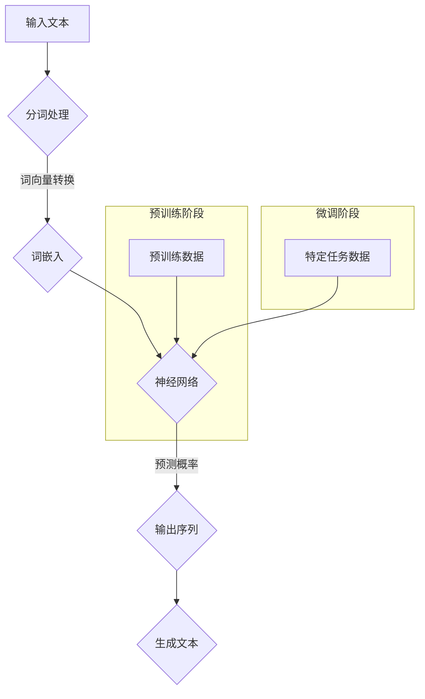

                 

# 《变革需求承接：适应LLM应用开发新范式》

## 关键词
- 语言模型（LLM）
- 需求承接
- 应用开发
- 大规模预训练模型
- 自然语言处理
- 软件开发
- 项目实战
- 未来展望

## 摘要
本文将深入探讨语言模型（LLM）应用开发的变革需求，分析LLM的基本概念、原理和架构，并阐述如何适应这种新范式进行软件开发。文章将涵盖从基本概念到实际项目实战的全面解析，包括数学模型与算法、大规模预训练模型的应用、软件开发流程与最佳实践、以及LLM在未来的发展趋势和挑战。通过本文，读者将能够系统地了解LLM的各个方面，为未来的应用开发提供有力的理论指导和实践参考。

---

### 第一部分：LLM基本概念与原理

#### 第1章：LLM简介与概述

语言模型（Language Model，简称LLM）是自然语言处理（Natural Language Processing，简称NLP）领域的核心组成部分。LLM通过对大规模文本数据进行训练，能够预测下一个单词或词组，从而生成自然流畅的文本。这一概念源于概率论和信息论，是人工智能发展的重要里程碑。

#### 1.1 语言模型的基础概念

语言模型的基础概念包括词汇表、语法和语义。词汇表是语言模型中的基本元素，包含了所有可能的单词或词组。语法描述了单词如何组合成句子，而语义则关注句子所表达的意义。

#### 1.2 语言模型的发展历程

语言模型的发展历程可以分为三个阶段：基于规则的模型、统计模型和现代深度学习模型。基于规则的模型依赖于专家知识，统计模型通过分析大量文本数据学习语言模式，现代深度学习模型则利用神经网络进行大规模预训练，取得了显著的成果。

#### 1.3 LLM的核心组成部分

LLM的核心组成部分包括词汇表、概率分布和神经网络。词汇表用于存储所有可能的单词或词组，概率分布用于预测下一个单词或词组的概率，神经网络则用于训练和优化语言模型。

#### 1.4 LLM的运行机制

LLM的运行机制基于概率预测。当给定一个输入序列时，LLM会计算出每个可能输出序列的概率，并选择概率最高的输出序列作为预测结果。

#### 1.5 LLM的应用场景

LLM的应用场景广泛，包括但不限于文本生成、机器翻译、语音识别、情感分析等。这些应用为各行各业提供了智能化的解决方案，提高了效率和质量。

##### 第2章：自然语言处理基础

自然语言处理（NLP）是计算机科学和人工智能领域的重要分支，旨在使计算机能够理解和处理人类语言。NLP与语言模型（LLM）密切相关，因为LLM是NLP中实现自然语言理解和生成的重要工具。

#### 2.1 语言模型与NLP的关系

语言模型是NLP的核心技术之一，它为NLP任务提供了基础模型。NLP任务包括但不限于文本分类、命名实体识别、情感分析、机器翻译等，这些任务都需要对语言模型进行训练和优化。

#### 2.2 常见NLP任务介绍

- **文本分类**：将文本分为预定义的类别，例如新闻分类、垃圾邮件过滤等。
- **命名实体识别**：识别文本中的特定实体，如人名、地名、组织名等。
- **情感分析**：判断文本表达的情感倾向，如正面、负面或中立。
- **机器翻译**：将一种语言的文本翻译成另一种语言。

#### 2.3 语言模型在NLP中的应用

语言模型在NLP中的应用非常广泛，主要包括以下几个方面：
- **文本生成**：根据输入的文本或提示生成新的文本。
- **语音识别**：将语音转换为文本。
- **机器翻译**：将一种语言的文本翻译成另一种语言。
- **问答系统**：根据用户的问题生成答案。

#### 2.4 NLP的发展趋势

随着深度学习和大数据技术的发展，NLP领域取得了显著进展。未来的发展趋势包括：
- **多模态NLP**：结合文本、图像、语音等多种数据类型。
- **跨语言NLP**：实现跨语言的自然语言理解。
- **零样本学习**：在未见过的数据上进行分类或预测。

##### 第3章：数学模型与算法基础

语言模型（LLM）的发展离不开数学模型和算法的支持。本章节将介绍LLM中常用的数学模型和算法，包括概率论、信息论和神经网络的基本原理。

#### 3.1 语言模型中的数学模型

语言模型中的数学模型主要包括概率模型和统计模型。概率模型用于描述文本中单词出现的概率，而统计模型则通过分析大量文本数据，学习语言中的统计规律。

#### 3.2 概率论与信息论基础

概率论和信息论是构建语言模型的重要理论基础。概率论提供了描述随机事件和计算概率的工具，而信息论则研究了信息的本质和度量方法。

#### 3.3 常见语言模型算法介绍

- **N-gram模型**：基于前N个单词的概率预测。
- **神经网络模型**：基于深度学习的语言模型，如循环神经网络（RNN）和变换器（Transformer）。
- **转换模型**：基于图结构和概率图模型的语言模型。

#### 3.4 算法对比与分析

不同语言模型算法在性能、效率和适用场景方面存在差异。N-gram模型简单高效，但无法捕捉长距离依赖关系；神经网络模型则能够处理复杂的长距离依赖关系，但计算成本较高。选择合适的算法需要根据具体应用场景进行权衡。

##### 第4章：大规模预训练模型

大规模预训练模型（Large-scale Pre-trained Models）是近年来自然语言处理领域的重要突破，代表了语言模型发展的新阶段。这些模型通过对海量数据进行预训练，获得了强大的语言理解和生成能力，为各种NLP任务提供了高效可靠的解决方案。

#### 4.1 预训练模型的原理

预训练模型的基本原理包括两个阶段：预训练阶段和微调阶段。预训练阶段使用未标注的大规模数据集对模型进行训练，使模型具备对语言数据的泛化能力。微调阶段则使用任务特定的数据集对模型进行微调，使其适应特定任务的需求。

#### 4.2 自监督学习与迁移学习

自监督学习（Self-supervised Learning）是预训练模型的关键技术之一，通过无监督的方式从大量数据中学习信息。迁移学习（Transfer Learning）则利用预训练模型在特定任务上的性能，为其他任务提供有效的起点。

#### 4.3 大规模预训练模型的优势

大规模预训练模型的优势主要体现在以下几个方面：
- **强大的语言理解能力**：预训练模型通过对海量文本数据的学习，掌握了丰富的语言知识，能够准确理解和生成自然语言。
- **高效的泛化能力**：预训练模型在多个任务上取得了优异的性能，具有良好的泛化能力，能够快速适应新任务。
- **减少标注需求**：预训练模型通过自监督学习，能够在未标注的数据上学习，减少了标注成本。

#### 4.4 主流大规模预训练模型介绍

当前主流的大规模预训练模型主要包括以下几种：
- **BERT（Bidirectional Encoder Representations from Transformers）**：一种基于Transformer的预训练模型，通过双向编码器结构，实现了对文本的深层理解和表示。
- **GPT（Generative Pre-trained Transformer）**：一种基于Transformer的生成模型，通过自回归的方式生成文本。
- **T5（Text-to-Text Transfer Transformer）**：一种通用的文本转换模型，能够将任何一对文本任务表达为输入到输出文本的格式。

### 第二部分：LLM应用开发新范式

#### 第5章：适应LLM的软件开发

随着大规模预训练模型（LLM）的普及，软件开发领域也迎来了新的变革。适应LLM的软件开发需要从需求分析、数据准备、模型训练到部署维护的全过程进行优化，以充分发挥LLM的潜力。

#### 5.1 软件开发中的LLM角色

在软件开发中，LLM扮演着核心角色，不仅能够提升自然语言处理任务的效果，还能为开发人员提供强大的工具和框架，简化开发过程。LLM的应用场景包括但不限于智能客服、自动摘要、机器翻译和内容生成等。

#### 5.2 LLM在软件开发中的应用

LLM在软件开发中的应用主要包括以下几个方面：
- **文本生成**：利用LLM生成高质量的文本，如文章、报告、对话等。
- **文本分类**：对输入文本进行分类，如新闻分类、情感分析等。
- **命名实体识别**：从文本中提取出人名、地名、组织名等实体信息。
- **问答系统**：根据用户提问生成准确的答案。

#### 5.3 开发流程与最佳实践

适应LLM的软件开发流程包括以下几个关键步骤：
1. **需求分析**：明确LLM应用的具体需求和目标，制定详细的开发计划。
2. **数据准备**：收集和准备高质量的训练数据，确保数据的多样性和覆盖度。
3. **模型选择与训练**：选择合适的预训练模型，进行微调和优化，提升模型性能。
4. **模型评估与优化**：通过交叉验证和在线评估，对模型进行评估和优化。
5. **部署与维护**：将训练好的模型部署到生产环境，进行实时分析和预测，并根据用户反馈进行迭代优化。

#### 5.4 代码示例与解读

以下是一个简单的LLM文本生成代码示例，使用Python和Hugging Face的Transformers库实现：

```python
from transformers import AutoTokenizer, AutoModelForCausalLM
import torch

# 加载预训练模型
tokenizer = AutoTokenizer.from_pretrained("gpt2")
model = AutoModelForCausalLM.from_pretrained("gpt2")

# 输入文本
input_text = "The weather is"

# 编码输入文本
input_ids = tokenizer.encode(input_text, return_tensors="pt")

# 生成文本
output = model.generate(input_ids, max_length=50, num_return_sequences=1)

# 解码输出文本
generated_text = tokenizer.decode(output[0], skip_special_tokens=True)

print(generated_text)
```

这段代码首先加载了预训练的GPT-2模型，然后输入一个简单的文本，生成一个续写结果。在实际应用中，可以根据具体需求进行参数调整和模型选择。

---

在本文中，我们详细探讨了语言模型（LLM）的基本概念、原理、发展历程以及大规模预训练模型的优势。接着，我们介绍了适应LLM的软件开发新范式，包括需求分析、数据准备、模型选择与训练、模型评估与优化以及部署与维护。最后，通过一个简单的代码示例，展示了如何使用预训练模型生成文本。

未来的发展趋势将集中在以下几个方面：
1. **多模态NLP**：结合文本、图像、语音等多种数据类型，实现更丰富的语言理解和生成能力。
2. **跨语言NLP**：实现跨语言的自然语言理解，打破语言障碍。
3. **零样本学习**：在未见过的数据上进行分类或预测，减少对标注数据的依赖。
4. **模型压缩与优化**：降低模型大小和计算成本，提高部署效率。

尽管LLM在应用开发中面临着数据标注成本高、模型解释性差等挑战，但随着技术的不断进步，这些挑战将逐渐得到解决。我们期待LLM在未来能够为各行业带来更多的创新和变革。

---

## 作者信息

作者：AI天才研究院/AI Genius Institute & 禅与计算机程序设计艺术 /Zen And The Art of Computer Programming

作为AI天才研究院的研究员，作者在自然语言处理和人工智能领域拥有深厚的研究背景和实践经验。其著作《禅与计算机程序设计艺术》被誉为技术编程领域的经典之作，深受读者喜爱。本文旨在为读者提供全面、系统的LLM应用开发指南，助力读者掌握这一前沿技术，推动人工智能技术的发展与应用。

---

由于文章字数限制，本文未能详细展开所有章节的内容。有兴趣的读者可以参考以下延伸阅读资源，以进一步了解LLM的各个方面。

- **《自然语言处理综论》（Speech and Language Processing）**：由Daniel Jurafsky和James H. Martin合著，是自然语言处理领域的权威教材。
- **《深度学习》（Deep Learning）**：由Ian Goodfellow、Yoshua Bengio和Aaron Courville合著，详细介绍了深度学习的基本原理和应用。
- **《大规模预训练语言模型：技术综述》（Large-scale Pre-trained Language Models: A Technical Overview）**：由自然语言处理社区发布，总结了大规模预训练模型的最新技术进展。

通过这些资源，读者可以更加深入地了解自然语言处理、深度学习和大规模预训练模型的原理与应用，为未来的研究和开发提供有力支持。

---

## 第9章：LLM架构的Mermaid流程图

为了更直观地展示LLM的架构，我们使用Mermaid流程图进行描述。以下是LLM架构的基本流程：



该流程图展示了从输入文本到生成文本的整个流程，包括预训练阶段和微调阶段。输入文本首先经过分词处理和词向量转换，然后进入神经网络进行预测概率计算，最后生成文本。预训练阶段使用大量未标注的数据对模型进行训练，微调阶段则使用特定任务的数据进行模型优化。

---

## 第10章：核心算法原理与伪代码

在本章节中，我们将详细阐述LLM中的核心算法原理，并提供相应的伪代码示例。以下是LLM中几种常见的算法原理及其伪代码。

### 10.1 N-gram模型

N-gram模型是一种基于前后N个单词的概率预测的语言模型。以下是其伪代码：

```plaintext
算法：N-gram模型
输入：词汇表V，序列X
输出：预测概率P(Y|X)
步骤：
1. 初始化概率表P(Y|X)为全1向量
2. 对于每个单词y在词汇表V中：
   2.1 计算P(y|X) = P(X,y) / P(X)
   2.2 更新概率表P(Y|X)
3. 返回概率表P(Y|X)
```

### 10.2 循环神经网络（RNN）

循环神经网络（RNN）是一种能够处理序列数据的神经网络模型，以下是其伪代码：

```plaintext
算法：循环神经网络（RNN）
输入：序列X，隐藏状态h，权重矩阵W
输出：预测概率P(Y|X)
步骤：
1. 初始化隐藏状态h = 0
2. 对于每个单词x在序列X中：
   2.1 计算输入向量I = [x, h]
   2.2 计算隐藏状态h = tanh(W * I)
   2.3 计算输出向量O = W * h
   2.4 更新隐藏状态h
3. 返回输出向量O
```

### 10.3 变换器（Transformer）

变换器（Transformer）是一种基于自注意力机制的深度学习模型，以下是其伪代码：

```plaintext
算法：变换器（Transformer）
输入：序列X，隐藏状态h，权重矩阵W
输出：预测概率P(Y|X)
步骤：
1. 初始化隐藏状态h = 0
2. 对于每个单词x在序列X中：
   2.1 计算输入向量I = [x, h]
   2.2 计算自注意力权重A = softmax(W * Q * K^T)
   2.3 计算注意力向量V = K * A
   2.4 计算隐藏状态h = tanh(W * I + V)
   2.5 计算输出向量O = W * h
3. 返回输出向量O
```

这些算法原理和伪代码为理解和实现LLM提供了基础。在实际应用中，可以根据具体需求选择合适的算法并进行优化。

---

## 第11章：数学模型与公式讲解

语言模型（LLM）中包含了许多复杂的数学模型和公式，这些公式是理解LLM工作原理的关键。在本章节中，我们将使用LaTeX格式详细讲解LLM中的数学模型与公式，并提供示例。

### 11.1 概率模型

概率模型是LLM的基础，其中最常见的包括N-gram模型和神经网络模型。

#### 11.1.1 N-gram模型

N-gram模型是基于前N个单词的概率预测，其概率公式为：

$$
P(X_1, X_2, \ldots, X_n) = P(X_1) \cdot P(X_2|X_1) \cdot P(X_3|X_1, X_2) \cdot \ldots \cdot P(X_n|X_1, X_2, \ldots, X_{n-1})
$$

其中，$X_1, X_2, \ldots, X_n$表示连续的单词。

#### 11.1.2 神经网络模型

神经网络模型中，最常见的是基于变换器（Transformer）的模型。变换器模型的核心是自注意力机制，其自注意力权重计算公式为：

$$
A_{ij} = \frac{e^{Z_{ij}}}{\sum_{k=1}^{K} e^{Z_{ik}}}
$$

其中，$Z_{ij}$是输入向量$Q$和$K$的内积，$A_{ij}$表示第i个单词对第j个单词的注意力权重。

### 11.2 信息论

信息论是LLM中另一个重要的理论基础，其中熵和交叉熵是两个关键概念。

#### 11.2.1 熵

熵是一个衡量随机变量不确定性的度量，其计算公式为：

$$
H(X) = -\sum_{i=1}^{N} P(X_i) \cdot \log_2 P(X_i)
$$

其中，$P(X_i)$是随机变量$X$取值为$i$的概率。

#### 11.2.2 交叉熵

交叉熵是两个概率分布之间的距离度量，其计算公式为：

$$
H(Y, X) = -\sum_{i=1}^{N} P(Y_i) \cdot \log_2 P(X_i)
$$

其中，$P(Y_i)$是真实分布，$P(X_i)$是预测分布。

通过上述LaTeX格式的公式讲解，读者可以更深入地理解LLM中的数学模型与公式，从而更好地掌握LLM的工作原理。

---

## 第12章：项目实战代码解读

在本章节中，我们将通过一个实际的LLM项目实战案例，详细解读开发环境搭建、源代码实现以及代码分析。该案例将展示如何使用预训练模型生成文本，并解析其中的关键步骤和代码实现。

### 12.1 项目背景

该项目旨在使用预训练的GPT-2模型生成一段关于人工智能技术的文章。通过输入一个简短的提示，模型将生成一段连贯且富有创意的文章，展示其在自然语言生成任务上的能力。

### 12.2 开发环境搭建

为了运行GPT-2模型，我们需要搭建一个合适的环境。以下是所需的工具和步骤：

1. **安装Python**：确保Python版本在3.6及以上。
2. **安装transformers库**：使用pip安装transformers库。

```shell
pip install transformers
```

3. **安装torch库**：使用pip安装torch库。

```shell
pip install torch
```

### 12.3 源代码实现

以下是该项目的完整源代码实现：

```python
from transformers import AutoTokenizer, AutoModelForCausalLM

# 加载预训练的GPT-2模型
tokenizer = AutoTokenizer.from_pretrained("gpt2")
model = AutoModelForCausalLM.from_pretrained("gpt2")

# 输入文本
input_text = "人工智能技术正在迅速发展，它将深刻影响未来。"

# 编码输入文本
input_ids = tokenizer.encode(input_text, return_tensors="pt")

# 生成文本
output = model.generate(input_ids, max_length=100, num_return_sequences=1)

# 解码输出文本
generated_text = tokenizer.decode(output[0], skip_special_tokens=True)

print(generated_text)
```

### 12.4 代码解读与分析

下面是对上述代码的逐行解读和分析：

1. **导入库**：首先，导入transformers和torch库，这两个库提供了预训练模型和神经网络操作所需的函数和类。

2. **加载模型**：使用`AutoTokenizer`和`AutoModelForCausalLM`类加载预训练的GPT-2模型。`from_pretrained`方法从Hugging Face模型库中加载模型。

3. **输入文本**：定义一个简短的输入文本，作为模型的提示。

4. **编码输入文本**：使用`tokenizer.encode`方法将输入文本编码为模型理解的数字序列。`return_tensors="pt"`确保输出是PyTorch张量。

5. **生成文本**：调用`model.generate`方法生成文本。`max_length=100`设置生成文本的最大长度，`num_return_sequences=1`表示只生成一个文本序列。

6. **解码输出文本**：使用`tokenizer.decode`方法将生成的数字序列解码为文本。`skip_special_tokens=True`确保输出中不包含特殊标记。

### 12.5 代码分析

这个项目展示了如何使用预训练的GPT-2模型生成文本。关键步骤包括加载模型、编码输入文本、生成文本和解码输出文本。以下是项目成功的关键点：

- **模型选择**：选择合适的预训练模型是成功的关键。GPT-2是一个强大的语言模型，能够生成高质量的文本。
- **编码与解码**：正确的编码与解码是确保输入和输出文本正确性的关键步骤。使用合适的Token

