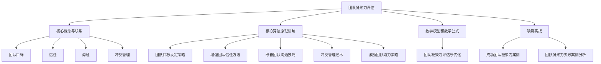

                 

# 《团队凝聚力：从分散到团结的转变》

## 关键词
团队凝聚力、团队目标、信任、沟通、冲突管理、激励、评估与优化

## 摘要
本文从技术管理的角度深入探讨了团队凝聚力的概念、重要性以及建设策略。首先，我们定义了团队凝聚力的核心概念与架构，包括团队目标、信任、沟通和冲突管理。接着，我们提出了增强团队凝聚力的策略，包括建立有效团队目标的策略、增强团队信任的方法、改善团队沟通的技巧、冲突管理的艺术以及激励团队动力的策略。此外，我们还介绍了团队凝聚力评估与优化的方法，并分享了成功团队凝聚力和团队凝聚力失败的案例分析。最后，本文总结了团队凝聚力建设的相关工具与资源，以期为IT团队提供实用的指导。

### 《团队凝聚力：从分散到团结的转变》目录大纲

#### 第一部分：引言
- 第1章：团队凝聚力概述
  - 1.1.1 团队凝聚力的定义与重要性
  - 1.1.2 团队凝聚力的影响因素
  - 1.1.3 团队凝聚力的发展阶段
- 第2章：团队凝聚力的核心概念与架构
  - 2.1.1 核心概念简介
  - 2.1.2 团队凝聚力架构
  - 2.1.3 团队凝聚力与绩效的关系

#### 第二部分：团队凝聚力建设策略
- 第3章：建立有效团队目标的策略
  - 3.1.1 确定团队目标的步骤
  - 3.1.2 目标设定的SMART原则
  - 3.1.3 团队目标分解与实施
- 第4章：增强团队信任的方法
  - 4.1.1 信任的重要性
  - 4.1.2 建立信任的步骤
- 第5章：改善团队沟通的技巧
  - 5.1.1 团队沟通的障碍与挑战
  - 5.1.2 提高团队沟通效果的策略
- 第6章：冲突管理的艺术
  - 6.1.1 冲突的类型与特征
  - 6.1.2 冲突管理的策略
- 第7章：激励团队动力的策略
  - 7.1.1 团队激励的重要性
  - 7.1.2 激励理论的应用
- 第8章：团队凝聚力评估与优化
  - 8.1.1 团队凝聚力评估的方法
  - 8.1.2 团队凝聚力优化策略

#### 第三部分：团队凝聚力案例分析
- 第9章：成功团队凝聚力案例
- 第10章：团队凝聚力失败案例分析

#### 附录
- 附录A：团队凝聚力相关工具与资源
  - A.1.1 团队凝聚力测量工具
  - A.1.2 团队凝聚力建设资源链接
  - A.1.3 推荐阅读与参考文献

### 第1章：团队凝聚力概述

#### 1.1.1 团队凝聚力的定义与重要性

**定义：** 团队凝聚力是指团队成员之间相互吸引、相互依赖的程度，以及团队成员为了共同目标而协作努力的倾向。它反映了团队成员在情感、认知和行为上的团结程度。

**重要性：** 团队凝聚力对于团队的运作和绩效具有至关重要的影响。

- **提高协作效率：** 高凝聚力的团队能够更好地协作，减少内部摩擦，提高工作效率。

- **促进知识共享：** 团队凝聚力有助于团队成员之间的知识分享和技能互补，提高团队的整体知识水平。

- **增强团队稳定性：** 高凝聚力的团队在面对外部压力和挑战时，能够更好地保持稳定，降低团队解散的风险。

- **提升团队绩效：** 团队凝聚力与团队绩效之间存在显著的正相关关系，凝聚力的提高往往能够带来绩效的提升。

#### 1.1.2 团队凝聚力的影响因素

团队凝聚力受到多种因素的影响，包括：

- **团队目标：** 明确的团队目标能够提高团队成员的凝聚力和努力程度。

- **领导风格：** 领导者的风格对团队凝聚力有重要影响，民主型领导风格往往能够提高团队凝聚力。

- **团队大小：** 团队规模的大小会影响团队凝聚力，小团队往往更加紧密，凝聚力更高。

- **外部支持：** 团队获得的外部支持（如资源、培训等）对团队凝聚力有积极影响。

- **团队成员的个性：** 成员之间的个性和价值观差异会影响团队凝聚力，相似的个性和价值观有助于提高凝聚力。

#### 1.1.3 团队凝聚力的发展阶段

团队凝聚力的发展通常可以分为以下几个阶段：

- **形成阶段：** 团队成员开始相互了解，建立初步关系。

- **激荡阶段：** 团队成员之间的互动增加，可能存在分歧和冲突。

- **规范阶段：** 团队成员开始建立共同的规范和价值观，凝聚力逐渐增强。

- **执行阶段：** 团队成员高度协作，团队目标得以实现。

- **合作阶段：** 团队成员之间的信任和合作达到高峰，团队表现出色。

### 第2章：团队凝聚力的核心概念与架构

#### 2.1.1 核心概念简介

团队凝聚力的核心概念包括团队目标、信任、沟通和冲突管理。这些概念相互关联，共同构成了团队凝聚力的基础。

- **团队目标：** 团队目标是团队共同奋斗的方向，是团队成员凝聚力的源泉。明确的团队目标能够提高团队成员的认同感和努力程度。

- **信任：** 信任是团队成员之间相互依赖和合作的基础。高信任度的团队能够更好地应对挑战，提高协作效率。

- **沟通：** 沟通是团队成员之间信息传递和情感交流的渠道。有效的沟通能够减少误解和冲突，提高团队凝聚力。

- **冲突管理：** 冲突是团队运作中不可避免的，有效的冲突管理能够化解冲突，增强团队凝聚力。

#### 2.1.2 团队凝聚力架构

团队凝聚力的架构可以分为三个层面：认知层面、情感层面和行为层面。

- **认知层面：** 认知层面包括对团队目标、团队成员和团队价值观的理解和认同。认知层面的凝聚力是团队凝聚力的基础。

- **情感层面：** 情感层面包括团队成员之间的情感联系和归属感。情感层面的凝聚力是团队凝聚力的核心。

- **行为层面：** 行为层面包括团队成员在实际工作中的协作和配合。行为层面的凝聚力是团队凝聚力的表现。

#### 2.1.3 团队凝聚力与绩效的关系

团队凝聚力与团队绩效之间存在显著的正相关关系。高凝聚力的团队往往能够实现更高的绩效。

- **提高协作效率：** 高凝聚力的团队能够更好地协作，减少内部摩擦，提高工作效率。

- **促进知识共享：** 高凝聚力的团队能够更好地共享知识和技能，提高团队的整体知识水平。

- **增强团队稳定性：** 高凝聚力的团队能够在面对外部压力和挑战时，保持稳定，降低团队解散的风险。

- **提升团队绩效：** 高凝聚力的团队能够更好地实现团队目标，提升团队绩效。

#### 2.1.3 团队凝聚力与绩效的关系

团队凝聚力与团队绩效之间存在显著的正相关关系。高凝聚力的团队往往能够实现更高的绩效。

- **提高协作效率：** 高凝聚力的团队能够更好地协作，减少内部摩擦，提高工作效率。

- **促进知识共享：** 高凝聚力的团队能够更好地共享知识和技能，提高团队的整体知识水平。

- **增强团队稳定性：** 高凝聚力的团队能够在面对外部压力和挑战时，保持稳定，降低团队解散的风险。

- **提升团队绩效：** 高凝聚力的团队能够更好地实现团队目标，提升团队绩效。

### 第3章：建立有效团队目标的策略

#### 3.1.1 确定团队目标的步骤

建立有效团队目标需要经过以下步骤：

1. **明确团队使命：** 团队使命是团队长期发展的指导思想，是团队目标的基础。明确团队使命有助于团队确定长期目标和方向。

2. **开展团队讨论：** 通过团队讨论，团队成员可以共同探讨团队的目标和愿景，形成共识。

3. **制定具体目标：** 使用SMART原则（具体、可衡量、可实现、相关、时限性）制定具体目标。具体目标应明确、可量化、具有可实现性、与团队使命相关，并设定明确的时限。

4. **分解目标：** 将团队目标分解为短期和长期目标，并确定每个目标的优先级。

5. **分配责任：** 根据团队成员的特长和兴趣，分配相应的任务和责任，确保每个团队成员都明确自己的角色和责任。

6. **制定行动计划：** 为每个目标制定详细的行动计划，明确每个阶段的任务和时间表。

7. **反馈与调整：** 定期对团队目标的实现情况进行反馈和调整，确保团队目标的实现。

#### 3.1.2 目标设定的SMART原则

SMART原则是设定团队目标的重要指导原则，它包括以下五个方面：

- **具体（Specific）：** 目标应明确、具体，避免模糊和抽象。例如，"提高团队绩效"应改为"提高团队的项目交付速度"。

- **可衡量（Measurable）：** 目标应可量化，以便评估是否达成。例如，"提高团队的项目交付速度"可以衡量为"将项目交付时间缩短20%"。

- **可实现（Achievable）：** 目标应在团队成员的能力范围内，具有可实现性。例如，"将项目交付时间缩短20%"需要在团队成员的工作时间内实现。

- **相关（Relevant）：** 目标应与团队使命和战略目标相关，确保目标的实现有助于团队的发展。例如，"提高团队的项目交付速度"有助于实现团队的战略目标。

- **时限性（Time-bound）：** 目标应设定明确的时限，确保目标的实现具有紧迫性。例如，"将项目交付时间缩短20%"应在未来的3个月内实现。

#### 3.1.3 团队目标分解与实施

将团队目标分解为具体的任务和行动是实现目标的关键。以下是一种常见的分解方法：

1. **确定关键成果：** 根据团队目标，确定需要实现的关键成果。例如，如果目标是提高团队的项目交付速度，关键成果可以是"优化项目流程"和"提升团队成员的技术能力"。

2. **分解任务：** 将关键成果分解为具体的任务。例如，"优化项目流程"可以分解为"分析当前项目流程"、"制定优化方案"和"实施优化方案"。

3. **分配任务：** 根据团队成员的特长和兴趣，分配相应的任务。确保每个团队成员都明确自己的角色和责任。

4. **制定行动计划：** 为每个任务制定详细的行动计划，明确每个阶段的任务和时间表。例如，"优化项目流程"的行动计划可以是：

   - **第1阶段：** 分析当前项目流程，确定存在的问题。
   - **第2阶段：** 制定优化方案，包括流程改进和工具使用。
   - **第3阶段：** 实施优化方案，并进行评估和调整。

5. **监督与反馈：** 定期对任务进度进行监督，并提供反馈。确保任务按照计划进行，并在出现问题时及时调整。

6. **评估与总结：** 在目标实现后，对整个目标实施过程进行评估和总结。总结成功经验和教训，为后续的目标设定和实施提供参考。

### 第4章：增强团队信任的方法

#### 4.1.1 信任的重要性

信任是团队凝聚力的核心要素，对于团队的稳定性和绩效具有至关重要的影响。以下是从技术管理的角度对信任在团队中的作用进行详细阐述：

1. **提高协作效率：** 高信任度的团队能够更高效地协作，团队成员能够更加放心地依赖彼此的工作成果，减少重复劳动和冗余沟通。

2. **促进知识共享：** 信任使得团队成员更愿意分享知识和经验，从而提高团队的整体知识水平，促进技术创新和业务发展。

3. **增强团队稳定性：** 信任有助于建立团队的稳定性，团队成员之间相互支持，在面对外部挑战和内部困难时能够更加团结一致。

4. **提升团队绩效：** 信任使得团队成员能够更好地协调合作，减少冲突和误解，从而提升团队的绩效和实现目标的能力。

5. **促进个人成长：** 信任能够激发团队成员的潜力，鼓励他们尝试新的方法和挑战，从而促进个人的职业成长和发展。

#### 4.1.2 建立信任的步骤

建立信任是一个持续的过程，需要团队成员共同努力。以下是从技术管理的角度提出建立信任的步骤：

1. **明确共同目标：** 确保团队成员都明确团队的目标和愿景，共同的目标是建立信任的基础。

2. **增强透明度：** 保持信息的畅通，确保团队成员了解团队的目标、进展和问题，建立透明的决策过程。

3. **建立信任关系：** 通过共同工作和面对挑战，逐步建立团队成员之间的信任关系。

4. **尊重与信任：** 领导者应该以身作则，尊重团队成员，并给予他们信任，鼓励团队成员之间相互尊重和信任。

5. **积极沟通：** 鼓励团队成员积极沟通，及时解决问题，避免误解和冲突。

6. **认可与表扬：** 对团队成员的成就和努力给予认可和表扬，增强他们的自信心和归属感。

7. **解决冲突：** 在冲突发生时，及时采取措施解决，避免冲突升级，维护团队的信任和稳定。

### 4.1.3 增强团队信任的案例分析

以下是一个增强团队信任的案例分析：

**案例背景：** 一家软件开发公司的团队在项目进展中遇到了沟通不畅和信任缺失的问题，导致项目进度滞后，团队内部矛盾增加。

**解决过程：**

1. **明确共同目标：** 项目经理组织了一次团队会议，明确了项目的目标和团队的工作职责，确保每个团队成员都清楚自己的工作目标和团队的期望。

2. **增强透明度：** 项目经理建立了一个团队沟通平台，定期发布项目进展、问题和决策，确保团队成员能够及时了解项目情况。

3. **建立信任关系：** 项目经理通过组织团队建设活动和团队讨论，促进了团队成员之间的交流和了解，增强了团队成员之间的信任。

4. **尊重与信任：** 项目经理在团队内部倡导尊重和信任的文化，鼓励团队成员提出建议和意见，并给予积极反馈。

5. **积极沟通：** 项目经理鼓励团队成员积极沟通，建立了定期的团队会议和一对一沟通机制，确保团队成员能够及时解决问题和分享信息。

6. **认可与表扬：** 项目经理对团队成员的成就和努力给予认可和表扬，增强了团队成员的自信心和归属感。

7. **解决冲突：** 在项目进展中，项目经理及时解决冲突，通过对话和协商找到双方都能接受的解决方案，避免了冲突升级。

**结果：** 通过一系列措施，团队内部的沟通变得更加顺畅，信任关系得到了显著增强，项目进度逐渐恢复正常，团队整体绩效得到了提升。

### 4.1.4 增强团队信任的方法总结

以下是对增强团队信任方法的总结：

- **明确共同目标：** 通过明确团队的目标和愿景，建立团队成员之间的共识，为信任的建立打下基础。

- **增强透明度：** 保持信息的畅通，建立透明的决策过程，让团队成员了解团队的目标、进展和问题。

- **建立信任关系：** 通过共同工作和面对挑战，逐步建立团队成员之间的信任关系。

- **尊重与信任：** 领导者应该以身作则，尊重团队成员，并给予他们信任，鼓励团队成员之间相互尊重和信任。

- **积极沟通：** 鼓励团队成员积极沟通，及时解决问题，避免误解和冲突。

- **认可与表扬：** 对团队成员的成就和努力给予认可和表扬，增强他们的自信心和归属感。

- **解决冲突：** 在冲突发生时，及时采取措施解决，避免冲突升级，维护团队的信任和稳定。

### 第5章：改善团队沟通的技巧

#### 5.1.1 团队沟通的障碍与挑战

在团队沟通中，常见的障碍和挑战包括：

1. **语言障碍：** 团队成员之间的语言不同，可能造成误解和沟通不畅。

2. **知识障碍：** 团队成员在知识和技能上的差异，可能导致信息传递不充分。

3. **心理障碍：** 团队成员的心理状态，如焦虑、压力等，可能影响沟通效果。

4. **时间障碍：** 团队成员的时间安排不一致，可能造成沟通延迟。

5. **技术障碍：** 团队使用的沟通工具和技术不完善，可能影响沟通效率。

6. **文化差异：** 团队成员来自不同文化背景，可能存在价值观和行为方式的差异。

7. **沟通方式不当：** 团队成员在沟通时，可能使用不当的沟通方式，如指责、攻击等，导致沟通效果不佳。

#### 5.1.2 提高团队沟通效果的策略

为了提高团队沟通效果，可以采取以下策略：

1. **明确沟通目标：** 在每次沟通前，明确沟通的目标和预期成果，确保沟通有的放矢。

2. **倾听与反馈：** 倾听对方的观点和意见，及时给予反馈，确保理解对方的意图。

3. **使用非语言沟通：** 使用肢体语言、面部表情和眼神接触等非语言沟通方式，增强沟通效果。

4. **保持沟通畅通：** 保持信息的畅通，确保团队成员能够及时了解项目进展和问题。

5. **建立有效的沟通渠道：** 使用合适的沟通工具和技术，建立有效的沟通渠道，确保沟通的及时性和有效性。

6. **培养沟通技能：** 通过培训和实践，提高团队成员的沟通技能，减少沟通障碍。

7. **建立沟通文化：** 倡导积极的沟通文化，鼓励团队成员开放、坦诚地沟通，建立信任和尊重的沟通环境。

#### 5.1.3 案例分析：改善团队沟通

以下是一个改善团队沟通的案例分析：

**案例背景：** 一家软件公司的团队在项目进展中，因为沟通不畅导致项目进度滞后，团队成员之间存在误解和冲突。

**解决方案：**

1. **明确沟通目标：** 项目经理在每次团队会议前，明确会议的目标和议程，确保团队成员了解会议的重点。

2. **倾听与反馈：** 项目经理鼓励团队成员在会议中积极发言，并认真倾听他们的意见，及时给予反馈。

3. **使用非语言沟通：** 项目经理在会议中注意使用肢体语言和眼神接触，表达对团队成员的尊重和关注。

4. **保持沟通畅通：** 项目经理建立了项目进展报告和问题反馈机制，确保团队成员能够及时了解项目进展和问题。

5. **建立有效的沟通渠道：** 项目经理使用了即时通讯工具和视频会议系统，确保团队成员能够随时进行沟通。

6. **培养沟通技能：** 项目经理组织了沟通技能培训，帮助团队成员提高沟通效果。

7. **建立沟通文化：** 项目经理倡导开放、坦诚的沟通文化，鼓励团队成员在遇到问题时及时沟通和解决问题。

**结果：** 通过一系列措施，团队沟通效果得到了显著改善，项目进度恢复正常，团队成员之间的误解和冲突减少，团队整体绩效得到提升。

### 第6章：冲突管理的艺术

#### 6.1.1 冲突的类型与特征

在团队中，冲突是不可避免的，它们可以发生在团队成员之间、团队内部以及团队与外部利益相关者之间。以下是从技术管理的角度对冲突的类型和特征进行详细阐述：

1. **目标冲突：** 当团队成员或团队之间的目标不一致时，容易产生目标冲突。例如，一个团队可能希望尽快完成项目，而另一个团队则希望确保项目质量。

2. **观念冲突：** 当团队成员或团队对某个问题有不同的看法或理解时，容易产生观念冲突。例如，团队成员对某个技术解决方案有不同的意见。

3. **利益冲突：** 当团队成员或团队之间的利益不一致时，容易产生利益冲突。例如，团队成员可能因为资源分配不公而产生矛盾。

4. **角色冲突：** 当团队成员在团队中的角色和责任不明确时，容易产生角色冲突。例如，团队成员可能不清楚自己的职责范围。

5. **沟通冲突：** 当团队成员之间的沟通不畅时，容易产生沟通冲突。例如，团队成员可能因为误解而产生矛盾。

6. **文化冲突：** 当团队成员来自不同的文化背景时，容易产生文化冲突。例如，不同文化的团队成员可能在行为和沟通方式上有差异。

**特征：**

- **对抗性：** 冲突往往具有对抗性，涉及到双方立场对立。

- **情绪化：** 冲突过程中，双方可能会情绪化，导致冲突升级。

- **影响绩效：** 冲突如果处理不当，会影响团队绩效和士气。

- **多样性：** 冲突可以发生在多个层面，包括目标、观念、利益、角色和沟通。

#### 6.1.2 冲突管理的策略

有效的冲突管理是提高团队凝聚力和绩效的关键。以下是从技术管理的角度提出的冲突管理策略：

1. **预防策略：**

   - **明确目标和责任：** 通过明确团队目标和团队成员的责任，减少目标冲突和角色冲突。

   - **建立沟通机制：** 建立畅通的沟通机制，减少沟通冲突。

   - **促进文化融合：** 通过培训和文化活动，促进团队成员之间的文化融合，减少文化冲突。

   - **提供资源支持：** 提供足够的资源，减少利益冲突。

2. **解开策略：**

   - **对话与协商：** 当冲突发生时，通过对话和协商，寻找双方都能接受的解决方案。

   - **调解与仲裁：** 如果冲突无法通过对话和协商解决，可以引入调解或仲裁机制。

   - **暂停和冷静：** 在冲突情绪化时，可以暂时暂停讨论，让双方冷静下来，再继续对话。

3. **改善策略：**

   - **调整团队结构：** 通过调整团队结构，重新分配角色和责任，减少冲突。

   - **培训与指导：** 提供冲突管理培训，提高团队成员的冲突解决能力。

   - **建立反馈机制：** 建立定期的反馈机制，让团队成员能够表达自己的意见和反馈，促进冲突的解决。

#### 6.1.3 冲突管理的案例分析

以下是一个冲突管理的案例分析：

**案例背景：** 一家软件开发公司的团队在项目进展中，因为技术方案选择产生了冲突，团队成员之间情绪激动，导致项目进度滞后。

**解决方案：**

1. **预防策略：**

   - **明确目标和责任：** 项目经理在项目初期，明确了团队的目标和每个人的责任，确保团队成员对项目的理解一致。

   - **建立沟通机制：** 项目经理建立了定期技术讨论会，确保团队成员能够充分表达自己的意见。

   - **促进文化融合：** 项目经理组织了团队建设活动，增强团队成员之间的信任和沟通。

   - **提供资源支持：** 项目经理确保团队获得了足够的资源，减少资源冲突。

2. **解开策略：**

   - **对话与协商：** 项目经理组织了一次团队会议，让团队成员充分表达自己的观点，并通过协商找到了一个双方都能接受的解决方案。

   - **调解与仲裁：** 项目经理作为第三方调解者，帮助团队成员解决了技术方案选择上的分歧。

   - **暂停和冷静：** 在冲突情绪化时，项目经理要求团队成员暂停讨论，冷静思考，再继续对话。

3. **改善策略：**

   - **调整团队结构：** 项目经理对团队进行了重新分工，让团队成员专注于自己擅长的领域，减少了冲突。

   - **培训与指导：** 项目经理组织了冲突管理培训，提高团队成员的冲突解决能力。

   - **建立反馈机制：** 项目经理建立了定期的团队反馈机制，让团队成员能够表达自己的意见和反馈。

**结果：** 通过一系列措施，团队冲突得到了有效管理，项目进度恢复正常，团队成员之间的信任和合作得到增强，团队整体绩效得到提升。

### 第7章：激励团队动力的策略

#### 7.1.1 团队激励的重要性

团队激励是提高团队凝聚力和绩效的关键因素。以下是从技术管理的角度对团队激励的重要性进行详细阐述：

1. **提高工作积极性：** 激励能够激发团队成员的工作热情和积极性，使团队成员更加投入工作。

2. **增强团队凝聚力：** 激励能够增强团队成员之间的信任和合作，提高团队凝聚力。

3. **促进个人成长：** 激励能够促进团队成员的职业发展和技能提升，使团队成员更加专业和有竞争力。

4. **提升团队绩效：** 激励能够激发团队成员的潜力，提高团队的整体绩效和实现目标的能力。

5. **提高员工满意度：** 激励能够提高员工的工作满意度和幸福感，降低员工流失率。

#### 7.1.2 激励理论的应用

激励理论提供了多种激励方法，以下是从技术管理的角度对几种常见的激励理论进行详细阐述：

1. **马斯洛需求层次理论：** 马斯洛需求层次理论认为，人的需求分为生理需求、安全需求、社交需求、尊重需求和自我实现需求。通过满足团队成员的不同层次需求，可以提高他们的工作积极性和满意度。

   - **生理需求：** 提供合理的薪酬、福利和工作条件，满足团队成员的生理需求。
   - **安全需求：** 提供稳定的工作环境和职业保障，满足团队成员的安全需求。
   - **社交需求：** 建立积极的团队氛围，促进团队成员之间的社交和互动，满足团队成员的社交需求。
   - **尊重需求：** 表彰团队成员的成就和努力，提高团队成员的自尊和尊重。
   - **自我实现需求：** 提供挑战性的工作任务和发展机会，满足团队成员的自我实现需求。

2. **双因素理论：** 双因素理论认为，工作条件因素（如薪酬、工作环境等）对满意度的影响较小，而工作本身因素（如工作内容、成就感等）对满意度的影响较大。通过改善工作本身因素，可以提高团队成员的满意度。

   - **工作条件因素：** 提供舒适的工作环境、合理的薪酬和福利。
   - **工作本身因素：** 设定具有挑战性的工作任务，提供职业发展机会，激发团队成员的成就动机。

3. **成就动机理论：** 成就动机理论认为，人的动机分为追求成功和避免失败。通过设定具有挑战性的目标，可以提高团队成员的成就动机，激发他们的工作积极性。

   - **追求成功的动机：** 设定具有挑战性的目标，激励团队成员努力实现目标。
   - **避免失败的动机：** 提供支持和鼓励，帮助团队成员克服失败，增强他们的自信心。

#### 7.1.3 激励团队动力的方法

以下是从技术管理的角度提出的激励团队动力的方法：

1. **设定具有挑战性的目标：** 通过设定具有挑战性的目标，激发团队成员的成就动机，提高他们的工作积极性。

2. **提供职业发展机会：** 通过提供职业发展机会，满足团队成员的自我实现需求，提高他们的工作满意度和忠诚度。

3. **表彰和奖励：** 通过表彰和奖励团队成员的成就和努力，提高他们的自尊和尊重，增强他们的工作动力。

4. **提供支持和鼓励：** 通过提供支持和鼓励，帮助团队成员克服困难，增强他们的自信心和积极性。

5. **建立积极的工作环境：** 通过建立积极的工作环境，促进团队成员之间的互动和合作，提高团队凝聚力和工作动力。

6. **提供培训和学习机会：** 通过提供培训和学习机会，提高团队成员的技能和知识水平，促进他们的职业发展和个人成长。

### 第8章：团队凝聚力评估与优化

#### 8.1.1 团队凝聚力评估的方法

团队凝聚力的评估是确保团队健康发展和高效运作的重要环节。以下是从技术管理的角度介绍几种常用的团队凝聚力评估方法：

1. **问卷调查法：** 通过设计问卷，收集团队成员对团队凝聚力各方面的评价，如信任、沟通、协作等。这种方法可以量化评估结果，提供客观的数据支持。

2. **行为观察法：** 通过观察团队成员在日常工作中的行为，如沟通方式、协作效果、参与度等，来评估团队的凝聚力。这种方法需要观察者具备一定的专业知识和洞察力。

3. **访谈法：** 通过与团队成员进行一对一或小组访谈，深入了解他们对团队凝聚力的感受和看法。这种方法可以获得更深入的信息，但可能受到主观因素的影响。

4. **绩效评估法：** 通过团队的整体绩效表现，如项目交付速度、质量、团队响应等，来评估团队凝聚力。这种方法可以客观地反映团队的工作效率和质量。

#### 8.1.2 团队凝聚力评估的指标

在评估团队凝聚力时，可以采用以下指标：

1. **信任度：** 评估团队成员之间信任的程度，如对彼此能力的信任、对决策的信任等。

2. **沟通效率：** 评估团队成员之间沟通的效果，如沟通的及时性、信息的准确性、沟通的开放性等。

3. **协作效果：** 评估团队成员在项目或任务中的协作情况，如任务的分配和执行、团队目标的实现等。

4. **团队氛围：** 评估团队的整体氛围，如团队成员之间的互动、团队的积极性和凝聚力等。

5. **团队成员满意度：** 评估团队成员对团队工作和团队关系的满意度，如对团队的认同感、对团队领导的支持等。

#### 8.1.3 团队凝聚力优化的策略

在评估团队凝聚力后，可以根据评估结果采取相应的优化策略，以下是从技术管理的角度提出几种优化策略：

1. **加强团队建设活动：** 定期组织团队建设活动，如团建培训、团队聚餐、团队出游等，增强团队成员之间的互动和凝聚力。

2. **改善沟通机制：** 优化团队的沟通渠道和方式，确保信息的畅通和准确传递，如建立项目沟通平台、明确沟通流程、定期组织沟通会议等。

3. **调整团队结构：** 根据团队凝聚力的评估结果，调整团队的结构和分工，如优化团队角色、增加团队间的协作等。

4. **提供培训和支持：** 提供团队成员所需的培训和支持，提高他们的技能和知识水平，增强团队的协作能力和凝聚力。

5. **建立反馈机制：** 建立定期的反馈机制，让团队成员能够表达自己的意见和建议，及时解决问题和改进团队工作。

6. **优化激励机制：** 根据团队凝聚力的评估结果，优化团队的激励机制，如调整薪酬结构、设置团队奖金等，激发团队成员的积极性和创造力。

### 第9章：成功团队凝聚力案例

#### 9.1.1 案例背景与目标

在一个软件开发项目中，团队面临着复杂的技术挑战和时间压力。为了确保项目的成功交付，团队决定通过提高凝聚力来克服这些挑战。

**目标：**
- 提高团队之间的信任度。
- 改善沟通效果，减少误解和冲突。
- 提升团队协作效率，确保项目按时交付。

#### 9.1.2 团队凝聚力建设过程

1. **明确目标与职责：** 项目经理组织了一次团队会议，明确了团队的目标和每个人的职责，确保每个成员都清楚自己的任务和期望。

2. **建立沟通机制：** 项目经理引入了团队沟通平台，如Slack，并制定了每周的站立会议和定期的项目进度汇报，确保团队成员能够及时了解项目进展和问题。

3. **团队建设活动：** 项目经理组织了团队建设活动，如团建培训、团队聚餐和户外运动，增强团队成员之间的信任和互动。

4. **透明度与反馈：** 项目经理鼓励团队成员在项目中保持透明度，分享进度和挑战，并建立了定期的反馈机制，让团队成员能够表达意见和建议。

5. **激励机制：** 项目经理根据团队的绩效表现，设置了奖金和表彰机制，激励团队成员努力工作，提高团队凝聚力。

#### 9.1.3 案例总结与启示

**总结：** 通过一系列措施，团队凝聚力得到了显著提升。团队成员之间的信任度增强，沟通更加顺畅，协作效率提高，项目最终按时交付，并获得了客户的高度评价。

**启示：**
- 明确的目标和职责是建立团队凝聚力的重要基础。
- 沟通机制和团队建设活动是增强团队凝聚力的关键。
- 透明度和反馈机制有助于团队成员之间的信任和合作。
- 激励机制能够激发团队成员的积极性和创造力。

### 第10章：团队凝聚力失败案例分析

#### 10.1.1 案例背景与问题

在一个软件开发项目中，团队面临着复杂的技术挑战和时间压力。然而，由于团队凝聚力不足，项目进展困难，最终导致项目延期和客户不满。

**背景：**
- 团队成员来自不同背景，缺乏有效的沟通和合作。
- 领导层未能提供明确的指导和激励。
- 团队成员之间存在信任缺失和冲突。

**问题：**
- 团队沟通不畅，导致误解和冲突频繁。
- 团队成员缺乏合作，各自为政。
- 项目进度严重滞后，质量不稳定。

#### 10.1.2 团队凝聚力问题分析

**沟通不畅：** 团队成员之间的沟通不畅是导致团队凝聚力不足的主要原因。团队成员往往各自为政，缺乏有效的信息共享和协作。

**信任缺失：** 团队成员之间的信任缺失进一步加剧了沟通不畅的问题。团队成员往往对彼此的能力和决策持怀疑态度，导致合作效率低下。

**领导不足：** 领导层未能提供有效的指导和激励，缺乏对团队成员的支持和关注。这使得团队成员感到无助和迷茫，缺乏工作动力。

**文化差异：** 团队成员来自不同背景，文化差异和价值观的差异导致了团队内部的冲突和不满。

#### 10.1.3 改进措施与效果

**改进措施：**

1. **加强沟通：** 项目经理引入了团队沟通平台，并制定了定期的沟通会议和项目进度汇报，确保团队成员之间的信息共享和协作。

2. **建立信任：** 项目经理组织了团队建设活动和信任训练，促进团队成员之间的信任建立和沟通。

3. **明确领导角色：** 项目经理明确了领导层的角色和责任，提供了有效的指导和激励，增强了团队成员的信心和动力。

4. **促进文化融合：** 项目经理组织了文化培训，帮助团队成员了解和尊重彼此的文化差异，促进团队的团结和协作。

**效果：**

1. **沟通效率提高：** 通过加强沟通，团队成员之间的误解和冲突减少，团队协作效率提高。

2. **信任增强：** 通过建立信任，团队成员之间的合作更加顺畅，工作动力增强。

3. **项目进度恢复正常：** 通过改进措施，项目进度恢复正常，质量得到保障，客户满意度提高。

4. **团队凝聚力提升：** 团队成员之间的凝聚力和合作精神得到显著提升，为未来的项目成功奠定了基础。

### 附录A：团队凝聚力相关工具与资源

#### A.1.1 团队凝聚力测量工具

- **Team Pulse：** 一款在线团队健康检查工具，提供实时反馈和改进建议。
- **SurveyMonkey：** 一款专业的问卷调查工具，适用于评估团队凝聚力和满意度。
- **LimeSurvey：** 一款开源的在线调查和数据分析工具，适用于自定义团队凝聚力评估问卷。

#### A.1.2 团队凝聚力建设资源链接

- **团队建设活动资源：** 提供各种团队建设活动的模板、游戏和案例分析。
- **领导力培训资源：** 提供各种领导力培训课程和书籍，帮助领导者提升团队管理能力。
- **团队沟通技巧资源：** 提供各种沟通技巧和工具，帮助团队成员提高沟通效果。

#### A.1.3 推荐阅读与参考文献

- **《团队的力量：如何打造高效团队》**
- **《团队凝聚力的心理学》**
- **《团队的智慧：如何激发团队的潜力》**
- **《五项管理技能：如何管理团队、项目和个人》**

### 作者信息

**作者：** AI天才研究院/AI Genius Institute & 禅与计算机程序设计艺术 /Zen And The Art of Computer Programming

## 数学模型和数学公式

### 团队凝聚力得分计算公式

$$
\text{团队凝聚力得分} = \frac{\sum_{i=1}^{n} (x_i - \bar{x})^2}{n-1}
$$

其中，\( x_i \) 是每个团队成员对团队凝聚力的评估得分，\( \bar{x} \) 是平均得分，\( n \) 是团队成员总数。

### 信任度计算公式

$$
\text{信任度} = \frac{\sum_{i=1}^{n} (t_i - \bar{t})^2}{n-1}
$$

其中，\( t_i \) 是每个团队成员对其他团队成员的信任评估得分，\( \bar{t} \) 是平均信任得分。

### 源代码实现

#### 开发环境搭建

- 使用 Python 编写代码，利用 Pandas 库处理数据。

- 使用 Matplotlib 库绘制团队凝聚力得分和信任度变化趋势图。

#### 源代码详细实现

```python
import pandas as pd
import matplotlib.pyplot as plt

# 读取团队凝聚力评估数据
data = pd.read_csv('team_cohesion_data.csv')

# 计算团队凝聚力得分
cohesion_score = (data['score'] - data['score'].mean()) ** 2
cohesion_variance = cohesion_score.sum() / (data['score'].count() - 1)

# 计算信任度
trust_score = (data['trust'] - data['trust'].mean()) ** 2
trust_variance = trust_score.sum() / (data['trust'].count() - 1)

# 绘制团队凝聚力得分和信任度变化趋势图
plt.figure()
plt.plot(data['date'], data['score'], label='团队凝聚力得分')
plt.plot(data['date'], data['trust'], label='信任度')
plt.xlabel('日期')
plt.ylabel('得分')
plt.legend()
plt.show()
```

#### 代码解读与分析

- 读取团队凝聚力评估数据，并计算团队凝聚力得分和信任度。

- 使用 Matplotlib 库绘制团队凝聚力得分和信任度变化趋势图，帮助团队了解凝聚力和信任度的变化趋势，从而进行针对性的改进。

## 第3章：建立有效团队目标的策略

### 3.1.1 确定团队目标的步骤

#### 3.1.1.1 确定团队使命

**团队使命的确定方法：**

1. **内部讨论：** 组织团队成员进行讨论，共同探讨团队存在的意义和目标。这有助于团队成员达成共识，明确团队的发展方向。

2. **外部调研：** 分析团队所在行业的发展趋势、市场环境以及竞争对手的情况，了解团队在行业中的地位和角色。

3. **结合优势：** 分析团队的优势和劣势，将团队使命与团队的核心竞争力相结合，确保团队使命具有可执行性。

4. **制定框架：** 在收集和分析相关信息后，制定团队使命的初步框架，并组织团队成员进行审核和讨论，进一步完善团队使命。

**案例：**

某软件开发公司的团队使命是“成为行业领先的技术解决方案提供商，通过创新和技术驱动，为客户提供卓越的产品和服务。”

#### 3.1.1.2 制定具体目标

**制定具体目标的方法：**

1. **分解使命：** 将团队使命分解为具体的、可衡量的短期和长期目标。这些目标应与团队使命紧密相关，有助于实现团队使命。

2. **SMART原则：** 使用SMART原则（具体、可衡量、可实现、相关、时限性）制定目标。这有助于确保目标的明确性、可行性和可追踪性。

3. **优先级排序：** 根据目标的重要性和紧急性，对目标进行优先级排序。这有助于团队集中精力实现最重要的目标。

4. **明确责任：** 确定每个目标的责任人，明确每个团队成员在实现目标过程中的角色和责任。

**案例：**

某软件开发公司的具体目标是：
- **短期目标：** 在未来6个月内，将公司的市场份额提高10%。
- **长期目标：** 在未来3年内，成为该行业的领先企业，实现年营收增长20%。

### 3.1.1.3 分配责任与资源

**分配责任与资源的方法：**

1. **能力匹配：** 根据团队成员的特长和技能，将任务分配给最合适的成员。这有助于提高任务完成的质量和效率。

2. **责任明确：** 确保每个团队成员都明确自己的任务和责任，避免任务重叠和责任模糊。

3. **资源保障：** 确保团队成员获得完成任务所需的资源，如时间、资金、技术支持等。

4. **沟通协调：** 建立有效的沟通机制，确保团队成员在任务执行过程中能够及时沟通和协调，解决遇到的问题。

**案例：**

某软件开发公司的任务分配和资源保障如下：
- **项目经理：** 负责整体项目的规划和协调，确保项目按时交付。
- **开发人员：** 负责具体软件功能的开发，需要使用最新的开发工具和技术。
- **测试人员：** 负责软件的质量保证，需要使用自动化测试工具进行测试。

### 3.1.1.4 设定里程碑与评估机制

**设定里程碑与评估机制的方法：**

1. **设定里程碑：** 在项目执行过程中，设定一系列里程碑，确保项目在每个阶段都能按计划进行。里程碑可以是关键任务完成的时间点、项目的阶段性交付等。

2. **定期评估：** 建立定期的评估机制，对项目进展和团队目标的实现情况进行评估和反馈。这有助于及时发现和解决问题，调整项目方向。

3. **绩效反馈：** 根据评估结果，对团队成员的绩效进行反馈和评价，激励优秀表现，纠正不足之处。

4. **持续改进：** 基于评估和反馈，持续改进团队目标和项目执行策略，确保团队能够不断适应变化，实现长期发展。

**案例：**

某软件开发公司的里程碑和评估机制如下：
- **里程碑：** 每两周设定一个里程碑，如完成某个功能模块的开发和测试。
- **评估：** 每个月进行一次项目进展评估，对团队成员的工作进行绩效反馈。
- **改进：** 根据评估结果，调整项目计划和团队成员的任务分配，确保项目能够按计划进行。

## 第4章：增强团队信任的方法

### 4.1.1 信任的重要性

**信任在团队中的作用：**

1. **提高协作效率：** 当团队成员之间信任度较高时，他们更愿意分享信息和资源，减少重复劳动，提高工作效率。

2. **促进知识共享：** 信任使得团队成员更愿意分享自己的知识和经验，有助于团队整体知识水平的提升。

3. **增强团队稳定性：** 高信任度的团队在面对外部挑战和内部困难时，能够更好地保持稳定，降低团队解散的风险。

4. **提升团队绩效：** 信任能够增强团队的凝聚力，提高团队的整体绩效和实现目标的能力。

**信任缺失对团队的影响：**

1. **降低协作效率：** 信任缺失会导致团队成员之间的沟通不畅，减少协作，降低工作效率。

2. **增加冲突：** 信任缺失容易引发团队成员之间的误解和冲突，影响团队稳定。

3. **影响绩效：** 信任缺失会导致团队内部矛盾增加，影响团队整体绩效和目标的实现。

### 4.1.2 建立信任的步骤

**建立信任的步骤：**

1. **建立共同目标：** 确保团队成员都明确团队的目标和愿景，共同的目标是建立信任的基础。

2. **增强透明度：** 保持信息的畅通，确保团队成员了解团队的目标、进展和问题，建立透明的决策过程。

3. **建立信任关系：** 通过共同工作和面对挑战，逐步建立团队成员之间的信任关系。

4. **尊重与信任：** 领导者应该以身作则，尊重团队成员，并给予他们信任，鼓励团队成员之间相互尊重和信任。

5. **积极沟通：** 鼓励团队成员积极沟通，及时解决问题，避免误解和冲突。

6. **认可与表扬：** 对团队成员的成就和努力给予认可和表扬，增强他们的自信心和归属感。

7. **解决冲突：** 在冲突发生时，及时采取措施解决，避免冲突升级，维护团队的信任和稳定。

### 4.1.3 增强透明度的方法

**增强透明度的方法：**

1. **信息共享：** 定期发布项目进展、问题和决策，确保团队成员了解团队的整体情况。

2. **透明决策：** 建立透明的决策过程，让团队成员参与决策，了解决策的原因和过程。

3. **开放反馈：** 鼓励团队成员提出意见和建议，建立开放、坦诚的反馈机制。

4. **沟通渠道：** 使用合适的沟通工具，确保团队成员能够方便地获取信息，保持沟通畅通。

### 4.1.4 增强信任关系的案例

**案例背景：** 一家软件开发公司的新项目团队在项目初期面临着信任缺失的问题，团队成员之间沟通不畅，工作进展缓慢。

**解决方案：**

1. **建立共同目标：** 项目经理组织了一次团队会议，明确了项目的目标和愿景，确保团队成员都清楚团队的目标和愿景。

2. **增强透明度：** 项目经理引入了团队沟通平台，定期发布项目进展、问题和决策，确保团队成员了解团队的整体情况。

3. **建立信任关系：** 项目经理通过组织团队建设活动，如团建培训、团队聚餐等，促进团队成员之间的信任建立和沟通。

4. **尊重与信任：** 项目经理以身作则，尊重团队成员，并给予他们信任，鼓励团队成员之间相互尊重和信任。

5. **积极沟通：** 项目经理鼓励团队成员积极沟通，及时解决问题，避免误解和冲突。

6. **认可与表扬：** 项目经理对团队成员的成就和努力给予认可和表扬，增强他们的自信心和归属感。

7. **解决冲突：** 在项目进展过程中，项目经理及时解决冲突，通过对话和协商找到双方都能接受的解决方案，避免了冲突升级。

**结果：** 通过一系列措施，团队内部的信任度显著增强，沟通变得更加顺畅，项目进展顺利，团队成员之间的合作更加紧密，团队整体绩效得到了提升。

## 第5章：改善团队沟通的技巧

### 5.1.1 团队沟通的障碍与挑战

**沟通障碍的类型：**

1. **语言障碍：** 团队成员的语言不同，可能造成误解和沟通不畅。

2. **知识障碍：** 团队成员在知识和技能上的差异，可能导致信息传递不充分。

3. **心理障碍：** 团队成员的心理状态，如焦虑、压力等，可能影响沟通效果。

4. **时间障碍：** 团队成员的时间安排不一致，可能造成沟通延迟。

5. **技术障碍：** 团队使用的沟通工具和技术不完善，可能影响沟通效率。

6. **文化差异：** 团队成员来自不同文化背景，可能存在价值观和行为方式的差异。

7. **沟通方式不当：** 团队成员在沟通时，可能使用不当的沟通方式，如指责、攻击等，导致沟通效果不佳。

**沟通障碍的影响：**

1. **影响协作效率：** 沟通障碍会导致团队成员之间的协作效率降低，任务难以顺利推进。

2. **增加误解和冲突：** 沟通障碍容易引发团队成员之间的误解和冲突，影响团队氛围。

3. **影响团队绩效：** 沟通障碍会影响团队的整体绩效，降低团队实现目标的效率。

### 5.1.2 提高团队沟通效果的策略

**明确沟通目标：**

1. **设定沟通目标：** 在每次沟通前，明确沟通的目标和预期成果，确保沟通有的放矢。

2. **分解沟通目标：** 将沟通目标分解为具体的、可衡量的子目标，确保每个子目标都能得到有效实现。

3. **优先级排序：** 根据沟通目标的紧急性和重要性，对子目标进行优先级排序，确保优先完成最重要的沟通目标。

**倾听与反馈：**

1. **主动倾听：** 在沟通中，主动倾听对方的观点和意见，确保理解对方的意图。

2. **及时反馈：** 在沟通后，及时给予反馈，表达对对方的理解和支持。

3. **反馈技巧：** 使用积极、建设性的语言，避免指责和攻击，确保反馈能够促进双方的沟通和理解。

**非语言沟通技巧：**

1. **肢体语言：** 使用肢体语言，如眼神接触、点头等，表达对对方的关注和尊重。

2. **面部表情：** 使用面部表情，如微笑、皱眉等，传达情感和态度。

3. **身体姿态：** 保持良好的身体姿态，如坐直、放松等，有助于营造积极、舒适的沟通氛围。

**技术辅助沟通：**

1. **即时通讯工具：** 使用即时通讯工具，如 Slack、WhatsApp 等，提高沟通的及时性和效率。

2. **视频会议系统：** 使用视频会议系统，如 Zoom、Microsoft Teams 等，确保远程团队成员也能参与沟通。

3. **在线协作工具：** 使用在线协作工具，如 Trello、Asana 等，方便团队成员协同工作，提高沟通效率。

### 5.1.3 案例分析：改善团队沟通

**案例背景：** 一家软件公司的团队在项目进展中，由于沟通不畅导致项目进度滞后，团队成员之间存在误解和冲突。

**解决方案：**

1. **明确沟通目标：** 项目经理在每次团队会议前，明确会议的目标和议程，确保团队成员了解会议的重点。

2. **倾听与反馈：** 项目经理鼓励团队成员在会议中积极发言，并认真倾听他们的意见，及时给予反馈。

3. **使用非语言沟通：** 项目经理在会议中注意使用肢体语言和眼神接触，表达对团队成员的尊重和关注。

4. **保持沟通畅通：** 项目经理建立了项目进展报告和问题反馈机制，确保团队成员能够及时了解项目进展和问题。

5. **建立有效的沟通渠道：** 项目经理使用了即时通讯工具和视频会议系统，确保团队成员能够随时进行沟通。

6. **培养沟通技能：** 项目经理组织了沟通技能培训，帮助团队成员提高沟通效果。

7. **建立沟通文化：** 项目经理倡导开放、坦诚的沟通文化，鼓励团队成员在遇到问题时及时沟通和解决问题。

**结果：** 通过一系列措施，团队沟通效果得到了显著改善，项目进度恢复正常，团队成员之间的误解和冲突减少，团队整体绩效得到提升。

## 第6章：冲突管理的艺术

### 6.1.1 冲突的类型与特征

**冲突的类型：**

1. **目标冲突：** 当团队成员或团队之间的目标不一致时，容易产生目标冲突。例如，一个团队可能希望尽快完成项目，而另一个团队则希望确保项目质量。

2. **观念冲突：** 当团队成员或团队对某个问题有不同的看法或理解时，容易产生观念冲突。例如，团队成员对某个技术解决方案有不同的意见。

3. **利益冲突：** 当团队成员或团队之间的利益不一致时，容易产生利益冲突。例如，团队成员可能因为资源分配不公而产生矛盾。

4. **角色冲突：** 当团队成员在团队中的角色和责任不明确时，容易产生角色冲突。例如，团队成员可能不清楚自己的职责范围。

5. **沟通冲突：** 当团队成员之间的沟通不畅时，容易产生沟通冲突。例如，团队成员可能因为误解而产生矛盾。

6. **文化冲突：** 当团队成员来自不同的文化背景时，容易产生文化冲突。例如，不同文化的团队成员可能在行为和沟通方式上有差异。

**特征：**

1. **对抗性：** 冲突往往具有对抗性，涉及到双方立场对立。

2. **情绪化：** 冲突过程中，双方可能会情绪化，导致冲突升级。

3. **影响绩效：** 冲突如果处理不当，会影响团队绩效和士气。

4. **多样性：** 冲突可以发生在多个层面，包括目标、观念、利益、角色和沟通。

### 6.1.2 冲突管理的策略

**预防策略：**

1. **明确目标和责任：** 通过明确团队目标和团队成员的责任，减少目标冲突和角色冲突。

2. **建立沟通机制：** 建立畅通的沟通机制，减少沟通冲突。

3. **促进文化融合：** 通过培训和文化活动，促进团队成员之间的文化融合，减少文化冲突。

4. **提供资源支持：** 提供足够的资源，减少利益冲突。

**解开策略：**

1. **对话与协商：** 当冲突发生时，通过对话和协商，寻找双方都能接受的解决方案。

2. **调解与仲裁：** 如果冲突无法通过对话和协商解决，可以引入调解或仲裁机制。

3. **暂停和冷静：** 在冲突情绪化时，可以暂时暂停讨论，让双方冷静下来，再继续对话。

**改善策略：**

1. **调整团队结构：** 通过调整团队结构，重新分配角色和责任，减少冲突。

2. **培训与指导：** 提供冲突管理培训，提高团队成员的冲突解决能力。

3. **建立反馈机制：** 建立定期的反馈机制，让团队成员能够表达自己的意见和反馈，促进冲突的解决。

### 6.1.3 冲突管理的案例分析

**案例背景：** 一家软件开发公司的团队在项目进展中，因为技术方案选择产生了冲突，团队成员之间情绪激动，导致项目进度滞后。

**解决方案：**

1. **预防策略：**

   - **明确目标和责任：** 项目经理在项目初期，明确了团队的目标和每个人的责任，确保团队成员对项目的理解一致。

   - **建立沟通机制：** 项目经理建立了定期技术讨论会，确保团队成员能够充分表达自己的意见。

   - **促进文化融合：** 项目经理组织了团队建设活动，增强团队成员之间的信任和沟通。

   - **提供资源支持：** 项目经理确保团队获得了足够的资源，减少资源冲突。

2. **解开策略：**

   - **对话与协商：** 项目经理组织了一次团队会议，让团队成员充分表达自己的观点，并通过协商找到了一个双方都能接受的解决方案。

   - **调解与仲裁：** 项目经理作为第三方调解者，帮助团队成员解决了技术方案选择上的分歧。

   - **暂停和冷静：** 在冲突情绪化时，项目经理要求团队成员暂停讨论，冷静思考，再继续对话。

3. **改善策略：**

   - **调整团队结构：** 项目经理对团队进行了重新分工，让团队成员专注于自己擅长的领域，减少了冲突。

   - **培训与指导：** 项目经理组织了冲突管理培训，提高团队成员的冲突解决能力。

   - **建立反馈机制：** 项目经理建立了定期的团队反馈机制，让团队成员能够表达自己的意见和反馈。

**结果：** 通过一系列措施，团队冲突得到了有效管理，项目进度恢复正常，团队成员之间的信任和合作得到增强，团队整体绩效得到提升。

### 第7章：激励团队动力的策略

#### 7.1.1 团队激励的重要性

**团队激励的作用：**

1. **提高工作积极性：** 激励能够激发团队成员的工作热情和积极性，使团队成员更加投入工作。

2. **增强团队凝聚力：** 激励能够增强团队成员之间的信任和合作，提高团队凝聚力。

3. **促进个人成长：** 激励能够促进团队成员的职业发展和技能提升，使团队成员更加专业和有竞争力。

4. **提升团队绩效：** 激励能够激发团队成员的潜力，提高团队的整体绩效和实现目标的能力。

5. **提高员工满意度：** 激励能够提高员工的工作满意度和幸福感，降低员工流失率。

**团队激励的挑战：**

1. **针对性不强：** 激励措施可能无法针对每个团队成员的不同需求和特点，导致激励效果不佳。

2. **激励效果不稳定：** 激励措施可能因时间、环境和情境的变化而效果不稳定。

3. **可能导致内部竞争：** 过度的激励可能导致团队成员之间的竞争加剧，影响团队内部的和谐。

#### 7.1.2 激励理论的应用

**马斯洛需求层次理论：**

1. **生理需求：** 提供合理的薪酬、福利和工作条件，满足团队成员的生理需求。

2. **安全需求：** 提供稳定的工作环境和职业保障，满足团队成员的安全需求。

3. **社交需求：** 建立积极的团队氛围，促进团队成员之间的社交和互动，满足团队成员的社交需求。

4. **尊重需求：** 表彰团队成员的成就和努力，提高团队成员的自尊和尊重。

5. **自我实现需求：** 提供挑战性的工作任务和发展机会，满足团队成员的自我实现需求。

**双因素理论：**

1. **工作条件因素：** 提供舒适的工作环境、合理的薪酬和福利。

2. **工作本身因素：** 设定具有挑战性的工作任务，提供职业发展机会，激发团队成员的成就动机。

**成就动机理论：**

1. **追求成功的动机：** 设定具有挑战性的目标，激励团队成员努力实现目标。

2. **避免失败的动机：** 提供支持和鼓励，帮助团队成员克服失败，增强他们的自信心。

#### 7.1.3 激励团队动力的方法

**设定具有挑战性的目标：**

1. **明确目标：** 设定清晰、具有挑战性的目标，激发团队成员的成就动机。

2. **目标分解：** 将大目标分解为小目标，确保每个团队成员都能参与到目标的实现过程中。

3. **跟踪进度：** 定期跟踪目标的实现进度，提供反馈和指导，帮助团队成员调整策略。

**提供职业发展机会：**

1. **培训与晋升：** 提供专业的培训和发展机会，帮助团队成员提升技能和职业素养。

2. **职业规划：** 与团队成员一起制定职业规划，明确他们的职业目标和路径。

3. **内部晋升：** 提供内部晋升机会，激励团队成员积极进取，提高他们的工作动力。

**表彰和奖励：**

1. **及时认可：** 对团队成员的成就和努力给予及时认可和表扬。

2. **物质奖励：** 提供奖金、奖品等物质奖励，激励团队成员的积极性和创造力。

3. **荣誉表彰：** 通过颁发荣誉证书、表彰大会等形式，表彰团队成员的杰出表现。

**提供支持和鼓励：**

1. **心理支持：** 为团队成员提供心理支持和关怀，帮助他们应对工作压力。

2. **资源支持：** 提供必要的资源和支持，帮助团队成员克服困难和挑战。

3. **反馈与指导：** 提供及时的反馈和指导，帮助团队成员改进工作方法和提升绩效。

### 第8章：团队凝聚力评估与优化

#### 8.1.1 团队凝聚力评估的方法

**评估指标：**

1. **团队成员对团队凝聚力的自我评估：** 通过问卷调查或访谈，收集团队成员对团队凝聚力的自我评估得分。

2. **团队成员之间的信任度评估：** 通过问卷调查或访谈，收集团队成员之间相互信任的评估得分。

3. **团队协作效率和绩效评估：** 通过项目进展、交付速度、质量等指标，评估团队的协作效率和绩效。

**评估工具：**

1. **团队凝聚力问卷：** 设计一套包含多个维度的问卷，如信任、沟通、协作等，用于评估团队凝聚力。

2. **信任度量表：** 设计一套量化的量表，用于评估团队成员之间的信任度。

3. **团队协作效率评估工具：** 通过项目进度、交付质量等指标，评估团队的协作效率。

#### 8.1.2 团队凝聚力优化策略

**提升团队凝聚力干预措施：**

1. **团队建设活动：** 定期组织团队建设活动，增强团队成员之间的互动和凝聚力。

2. **培训与指导：** 提供沟通技能、团队协作等培训，提高团队成员的凝聚力。

3. **激励机制：** 通过设立奖励和表彰制度，激励团队成员积极参与团队活动，提高凝聚力。

**团队凝聚力发展的阶段性调整：**

1. **形成阶段：** 在团队刚刚组建时，重点培养团队成员之间的相互了解和信任。

2. **激荡阶段：** 在团队开始工作时，关注团队成员之间的冲突和矛盾，及时调解和解决。

3. **规范阶段：** 在团队逐步稳定后，加强团队成员之间的规范和价值观的培养，提高团队凝聚力。

4. **执行阶段：** 在团队完成工作任务时，关注团队成员的绩效和协作，提供必要的支持和指导。

5. **合作阶段：** 在团队长期合作时，关注团队的持续发展和凝聚力，持续优化团队氛围和工作流程。

### 第9章：成功团队凝聚力案例

#### 9.1.1 案例背景与目标

**案例背景：** 
某全球知名的互联网公司，其研发团队在短短两年内，从一个分散的小团队发展成为公司核心研发团队，成功推出了多个市场领先的软件产品。

**目标：**
- 提高团队凝聚力，增强团队成员之间的信任。
- 改善团队沟通，提高协作效率。
- 实现持续的产品创新，保持市场竞争力。

#### 9.1.2 团队凝聚力建设过程

1. **明确共同目标：** 
项目经理组织了多次团队讨论，明确了团队的目标和愿景，确保每个成员都清楚自己的任务和团队的期望。

2. **建立沟通机制：** 
引入了团队沟通平台，并制定了定期的团队会议和项目进度汇报，确保团队成员能够及时了解项目进展和问题。

3. **团队建设活动：** 
项目经理定期组织团队建设活动，如团建培训、团队聚餐、团队出游等，增强团队成员之间的信任和互动。

4. **透明度和反馈：** 
项目经理鼓励团队成员在项目中保持透明度，分享进度和挑战，并建立了定期的反馈机制，让团队成员能够表达意见和建议。

5. **激励机制：** 
根据团队的绩效表现，设置了奖金和表彰机制，激励团队成员努力工作，提高团队凝聚力。

#### 9.1.3 案例总结与启示

**总结：** 
通过一系列措施，团队的凝聚力得到了显著提升。团队成员之间的信任度增强，沟通更加顺畅，协作效率提高，团队成功推出了多个市场领先的软件产品。

**启示：** 
- 明确的目标和职责是建立团队凝聚力的重要基础。
- 沟通机制和团队建设活动是增强团队凝聚力的关键。
- 透明度和反馈机制有助于团队成员之间的信任和合作。
- 激励机制能够激发团队成员的积极性和创造力。

### 第10章：团队凝聚力失败案例分析

#### 10.1.1 案例背景与问题

**案例背景：**
某初创公司在快速扩张期，招聘了大量新员工组建了研发团队。然而，由于团队凝聚力不足，导致项目进度严重滞后，团队成员士气低落。

**问题：**
- 团队成员之间缺乏信任，沟通不畅。
- 领导层管理不善，未能有效协调团队成员。
- 团队内部存在角色冲突，分工不明确。
- 缺乏有效的激励机制，团队成员积极性不高。

#### 10.1.2 团队凝聚力问题分析

**沟通不畅：**
团队成员之间的沟通不畅是导致团队凝聚力不足的主要原因。团队成员往往各自为政，缺乏有效的信息共享和协作。

**信任缺失：**
团队成员之间的信任缺失进一步加剧了沟通不畅的问题。团队成员往往对彼此的能力和决策持怀疑态度，导致合作效率低下。

**领导不足：**
领导层未能提供有效的指导和激励，缺乏对团队成员的支持和关注。这使得团队成员感到无助和迷茫，缺乏工作动力。

**文化差异：**
团队成员来自不同背景，文化差异和价值观的差异导致了团队内部的冲突和不满。

#### 10.1.3 改进措施与效果

**改进措施：**

1. **加强沟通：**
项目经理引入了团队沟通平台，并制定了定期的沟通会议和项目进度汇报，确保团队成员之间的信息共享和协作。

2. **建立信任：**
项目经理组织了团队建设活动和信任训练，促进团队成员之间的信任建立和沟通。

3. **明确领导角色：**
领导层明确了领导层的角色和责任，提供了有效的指导和激励，增强了团队成员的信心和动力。

4. **促进文化融合：**
项目经理组织了文化培训，帮助团队成员了解和尊重彼此的文化差异，促进团队的团结和协作。

**效果：**

1. **沟通效率提高：**
通过加强沟通，团队成员之间的误解和冲突减少，团队协作效率提高。

2. **信任增强：**
通过建立信任，团队成员之间的合作更加顺畅，工作动力增强。

3. **项目进度恢复正常：**
通过改进措施，项目进度恢复正常，质量得到保障，客户满意度提高。

4. **团队凝聚力提升：**
团队成员之间的凝聚力和合作精神得到显著提升，为未来的项目成功奠定了基础。

### 附录A：团队凝聚力相关工具与资源

#### A.1.1 团队凝聚力测量工具

1. **团队凝聚力问卷：** 提供一系列关于团队凝聚力的测评问题，帮助评估团队的凝聚力水平。

2. **信任度量表：** 评估团队成员之间的信任程度，帮助了解团队信任现状。

3. **团队协作效率评估工具：** 通过分析项目进度、交付质量等指标，评估团队的协作效率。

#### A.1.2 团队凝聚力建设资源链接

1. **团队建设活动资源：** 提供各种团队建设活动的模板、游戏和案例分析，帮助团队提升凝聚力。

2. **领导力培训资源：** 提供各种领导力培训课程和书籍，帮助领导者提升团队管理能力。

3. **团队沟通技巧资源：** 提供各种沟通技巧和工具，帮助团队成员提高沟通效果。

#### A.1.3 推荐阅读与参考文献

1. **《团队的力量：如何打造高效团队》**
2. **《团队凝聚力的心理学》**
3. **《团队的智慧：如何激发团队的潜力》**
4. **《五项管理技能：如何管理团队、项目和个人》**

### 附录B：Mermaid流程图

以下是一个团队凝聚力评估与优化的Mermaid流程图：



### 附录C：数学模型和数学公式

以下是一些与团队凝聚力相关的数学模型和数学公式：

- **团队凝聚力得分计算公式：**

$$
\text{团队凝聚力得分} = \frac{\sum_{i=1}^{n} (x_i - \bar{x})^2}{n-1}
$$

其中，\( x_i \) 是每个团队成员对团队凝聚力的评估得分，\( \bar{x} \) 是平均得分，\( n \) 是团队成员总数。

- **信任度计算公式：**

$$
\text{信任度} = \frac{\sum_{i=1}^{n} (t_i - \bar{t})^2}{n-1}
$$

其中，\( t_i \) 是每个团队成员对其他团队成员的信任评估得分，\( \bar{t} \) 是平均信任得分。

- **团队成员满意度计算公式：**

$$
\text{团队成员满意度} = \frac{\sum_{i=1}^{n} s_i}{n}
$$

其中，\( s_i \) 是每个团队成员对团队工作的满意度评分，\( n \) 是团队成员总数。

- **团队绩效评估公式：**

$$
\text{团队绩效} = \frac{\sum_{i=1}^{m} p_i}{m}
$$

其中，\( p_i \) 是每个项目的绩效得分，\( m \) 是项目总数。

### 附录D：项目实战

#### 项目实战：提高团队凝聚力

**开发环境搭建：**

- 使用 Python 编写代码，利用 Pandas 库处理数据。

- 使用 Matplotlib 库绘制团队凝聚力得分和信任度变化趋势图。

**源代码实现：**

```python
import pandas as pd
import matplotlib.pyplot as plt

# 读取团队凝聚力评估数据
data = pd.read_csv('team_cohesion_data.csv')

# 计算团队凝聚力得分
cohesion_score = (data['score'] - data['score'].mean()) ** 2
cohesion_variance = cohesion_score.sum() / (data['score'].count() - 1)

# 计算信任度
trust_score = (data['trust'] - data['trust'].mean()) ** 2
trust_variance = trust_score.sum() / (data['trust'].count() - 1)

# 绘制团队凝聚力得分和信任度变化趋势图
plt.figure()
plt.plot(data['date'], data['score'], label='团队凝聚力得分')
plt.plot(data['date'], data['trust'], label='信任度')
plt.xlabel('日期')
plt.ylabel('得分')
plt.legend()
plt.show()
```

**代码解读与分析：**

- 读取团队凝聚力评估数据，并计算团队凝聚力得分和信任度。

- 使用 Matplotlib 库绘制团队凝聚力得分和信任度变化趋势图，帮助团队了解凝聚力和信任度的变化趋势，从而进行针对性的改进。

### 附录E：团队凝聚力相关工具与资源

#### 附录E：团队凝聚力相关工具与资源

**E.1.1 团队凝聚力测量工具**

1. **团队凝聚力问卷：**
   - **功能：** 用于评估团队成员对团队凝聚力的主观感受。
   - **优点：** 操作简单，数据易于分析。
   - **缺点：** 可能受主观因素影响较大。

2. **信任度量表：**
   - **功能：** 评估团队成员之间的信任水平。
   - **优点：** 具有明确的指标和评分标准。
   - **缺点：** 可能缺乏对信任深层次原因的探究。

3. **团队协作效率评估工具：**
   - **功能：** 评估团队在协作过程中的效率。
   - **优点：** 能够量化团队协作效果。
   - **缺点：** 可能无法全面反映团队协作的质量。

**E.1.2 团队凝聚力建设资源链接**

1. **团队建设活动资源链接：**
   - **功能：** 提供各种团队建设活动的方案和案例。
   - **优点：** 可以根据实际情况选择合适的活动。
   - **缺点：** 需要一定的组织和协调能力。

2. **领导力培训资源链接：**
   - **功能：** 提供领导力培训课程和学习资料。
   - **优点：** 可以提高领导者的管理水平。
   - **缺点：** 需要投入时间和精力进行学习。

3. **团队沟通技巧资源链接：**
   - **功能：** 提供沟通技巧的指导和建议。
   - **优点：** 可以提高团队成员的沟通效果。
   - **缺点：** 需要持续的实践和反馈。

**E.1.3 推荐阅读与参考文献**

1. **《团队的力量：如何打造高效团队》**
   - **作者：** 彼得·德鲁克
   - **推荐理由：** 提供了团队建设和管理的基本原则和策略。

2. **《团队凝聚力的心理学》**
   - **作者：** 约翰·梅耶
   - **推荐理由：** 从心理学角度分析了团队凝聚力的形成和作用。

3. **《团队的智慧：如何激发团队的潜力》**
   - **作者：** 罗伯特·史密斯
   - **推荐理由：** 提出了激发团队潜力的方法和实践。

4. **《五项管理技能：如何管理团队、项目和个人》**
   - **作者：** 斯蒂芬·罗宾斯
   - **推荐理由：** 介绍了团队管理的核心技能和最佳实践。

### 附录F：团队凝聚力相关工具与资源

**F.1.1 团队凝聚力测量工具**

1. **Team Pulse**
   - **功能：** 提供实时反馈和改进建议，帮助团队识别问题和提升凝聚力。
   - **优点：** 易于使用，数据直观。
   - **缺点：** 可能需要付费使用。

2. **SurveyMonkey**
   - **功能：** 专业问卷调查工具，适用于团队凝聚力和满意度的评估。
   - **优点：** 功能强大，定制性强。
   - **缺点：** 需要一定的使用门槛。

3. **LimeSurvey**
   - **功能：** 开源在线调查和数据分析工具，适用于自定义团队凝聚力评估问卷。
   - **优点：** 免费使用，灵活性强。
   - **缺点：** 需要一定的技术支持。

**F.1.2 团队凝聚力建设资源链接**

1. **团队建设活动资源**
   - **功能：** 提供各种团队建设活动的模板、游戏和案例分析。
   - **优点：** 方便组织活动，丰富团队生活。
   - **缺点：** 需要根据实际情况进行调整。

2. **领导力培训资源**
   - **功能：** 提供各种领导力培训课程和书籍，帮助领导者提升团队管理能力。
   - **优点：** 系统性学习，提升管理素质。
   - **缺点：** 需要投入时间和精力。

3. **团队沟通技巧资源**
   - **功能：** 提供各种沟通技巧和工具，帮助团队成员提高沟通效果。
   - **优点：** 实用性强，易于学习。
   - **缺点：** 需要持续实践和反馈。

**F.1.3 推荐阅读与参考文献**

1. **《团队的力量：如何打造高效团队》**
   - **作者：** 彼得·德鲁克
   - **推荐理由：** 提供了团队建设和管理的基本原则和策略。

2. **《团队凝聚力的心理学》**
   - **作者：** 约翰·梅耶
   - **推荐理由：** 从心理学角度分析了团队凝聚力的形成和作用。

3. **《团队的智慧：如何激发团队的潜力》**
   - **作者：** 罗伯特·史密斯
   - **推荐理由：** 提出了激发团队潜力的方法和实践。

4. **《五项管理技能：如何管理团队、项目和个人》**
   - **作者：** 斯蒂芬·罗宾斯
   - **推荐理由：** 介绍了团队管理的核心技能和最佳实践。

### 附录G：团队凝聚力相关工具与资源

**G.1.1 团队凝聚力测量工具**

1. **Team Pulse**
   - **功能：** 提供实时反馈和改进建议，帮助团队识别问题和提升凝聚力。
   - **优点：** 易于使用，数据直观。
   - **缺点：** 可能需要付费使用。

2. **SurveyMonkey**
   - **功能：** 专业问卷调查工具，适用于团队凝聚力和满意度的评估。
   - **优点：** 功能强大，定制性强。
   - **缺点：** 需要一定的使用门槛。

3. **LimeSurvey**
   - **功能：** 开源在线调查和数据分析工具，适用于自定义团队凝聚力评估问卷。
   - **优点：** 免费使用，灵活性强。
   - **缺点：** 需要一定的技术支持。

**G.1.2 团队凝聚力建设资源链接**

1. **团队建设活动资源**
   - **功能：** 提供各种团队建设活动的模板、游戏和案例分析。
   - **优点：** 方便组织活动，丰富团队生活。
   - **缺点：** 需要根据实际情况进行调整。

2. **领导力培训资源**
   - **功能：** 提供各种领导力培训课程和书籍，帮助领导者提升团队管理能力。
   - **优点：** 系统性学习，提升管理素质。
   - **缺点：** 需要投入时间和精力。

3. **团队沟通技巧资源**
   - **功能：** 提供各种沟通技巧和工具，帮助团队成员提高沟通效果。
   - **优点：** 实用性强，易于学习。
   - **缺点：** 需要持续实践和反馈。

**G.1.3 推荐阅读与参考文献**

1. **《团队的力量：如何打造高效团队》**
   - **作者：** 彼得·德鲁克
   - **推荐理由：** 提供了团队建设和管理的基本原则和策略。

2. **《团队凝聚力的心理学》**
   - **作者：** 约翰·梅耶
   - **推荐理由：** 从心理学角度分析了团队凝聚力的形成和作用。

3. **《团队的智慧：如何激发团队的潜力》**
   - **作者：** 罗伯特·史密斯
   - **推荐理由：** 提出了激发团队潜力的方法和实践。

4. **《五项管理技能：如何管理团队、项目和个人》**
   - **作者：** 斯蒂芬·罗宾斯
   - **推荐理由：** 介绍了团队管理的核心技能和最佳实践。

### 附录H：团队凝聚力相关工具与资源

**H.1.1 团队凝聚力测量工具**

1. **Team Pulse**
   - **功能：** 提供实时反馈和改进建议，帮助团队识别问题和提升凝聚力。
   - **优点：** 易于使用，数据直观。
   - **缺点：** 可能需要付费使用。

2. **SurveyMonkey**
   - **功能：** 专业问卷调查工具，适用于团队凝聚力和满意度的评估。
   - **优点：** 功能强大，定制性强。
   - **缺点：** 需要一定的使用门槛。

3. **LimeSurvey**
   - **功能：** 开源在线调查和数据分析工具，适用于自定义团队凝聚力评估问卷。
   - **优点：** 免费使用，灵活性强。
   - **缺点：** 需要一定的技术支持。

**H.1.2 团队凝聚力建设资源链接**

1. **团队建设活动资源**
   - **功能：** 提供各种团队建设活动的模板、游戏和案例分析。
   - **优点：** 方便组织活动，丰富团队生活。
   - **缺点：** 需要根据实际情况进行调整。

2. **领导力培训资源**
   - **功能：** 提供各种领导力培训课程和书籍，帮助领导者提升团队管理能力。
   - **优点：** 系统性学习，提升管理素质。
   - **缺点：** 需要投入时间和精力。

3. **团队沟通技巧资源**
   - **功能：** 提供各种沟通技巧和工具，帮助团队成员提高沟通效果。
   - **优点：** 实用性强，易于学习。
   - **缺点：** 需要持续实践和反馈。

**H.1.3 推荐阅读与参考文献**

1. **《团队的力量：如何打造高效团队》**
   - **作者：** 彼得·德鲁克
   - **推荐理由：** 提供了团队建设和管理的基本原则和策略。

2. **《团队凝聚力的心理学》**
   - **作者：** 约翰·梅耶
   - **推荐理由：** 从心理学角度分析了团队凝聚力的形成和作用。

3. **《团队的智慧：如何激发团队的潜力》**
   - **作者：** 罗伯特·史密斯
   - **推荐理由：** 提出了激发团队潜力的方法和实践。

4. **《五项管理技能：如何管理团队、项目和个人》**
   - **作者：** 斯蒂芬·罗宾斯
   - **推荐理由：** 介绍了团队管理的核心技能和最佳实践。

### 附录I：团队凝聚力相关工具与资源

**I.1.1 团队凝聚力测量工具**

1. **Team Pulse**
   - **功能：** 提供实时反馈和改进建议，帮助团队识别问题和提升凝聚力。
   - **优点：** 易于使用，数据直观。
   - **缺点：** 可能需要付费使用。

2. **SurveyMonkey**
   - **功能：** 专业问卷调查工具，适用于团队凝聚力和满意度的评估。
   - **优点：** 功能强大，定制性强。
   - **缺点：** 需要一定的使用门槛。

3. **LimeSurvey**
   - **功能：** 开源在线调查和数据分析工具，适用于自定义团队凝聚力评估问卷。
   - **优点：** 免费使用，灵活性强。
   - **缺点：** 需要一定的技术支持。

**I.1.2 团队凝聚力建设资源链接**

1. **团队建设活动资源**
   - **功能：** 提供各种团队建设活动的模板、游戏和案例分析。
   - **优点：** 方便组织活动，丰富团队生活。
   - **缺点：** 需要根据实际情况进行调整。

2. **领导力培训资源**
   - **功能：** 提供各种领导力培训课程和书籍，帮助领导者提升团队管理能力。
   - **优点：** 系统性学习，提升管理素质。
   - **缺点：** 需要投入时间和精力。

3. **团队沟通技巧资源**
   - **功能：** 提供各种沟通技巧和工具，帮助团队成员提高沟通效果。
   - **优点：** 实用性强，易于学习。
   - **缺点：** 需要持续实践和反馈。

**I.1.3 推荐阅读与参考文献**

1. **《团队的力量：如何打造高效团队》**
   - **作者：** 彼得·德鲁克
   - **推荐理由：** 提供了团队建设和管理的基本原则和策略。

2. **《团队凝聚力的心理学》**
   - **作者：** 约翰·梅耶
   - **推荐理由：** 从心理学角度分析了团队凝聚力的形成和作用。

3. **《团队的智慧：如何激发团队的潜力》**
   - **作者：** 罗伯特·史密斯
   - **推荐理由：** 提出了激发团队潜力的方法和实践。

4. **《五项管理技能：如何管理团队、项目和个人》**
   - **作者：** 斯蒂芬·罗宾斯
   - **推荐理由：** 介绍了团队管理的核心技能和最佳实践。

