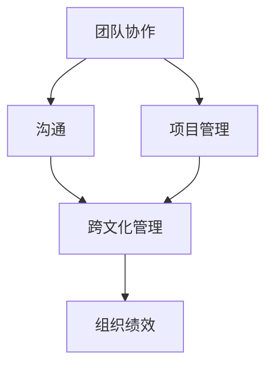
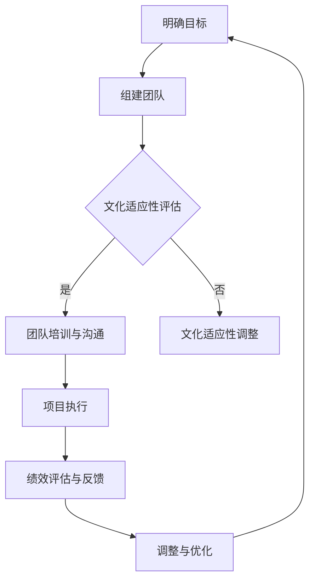

                 

# 《团队协作：跨文化团队管理的挑战与对策》

> **关键词**：团队协作、跨文化管理、挑战、对策、项目管理、沟通算法

> **摘要**：本文将探讨跨文化团队协作管理的挑战和对策，通过对团队协作与跨文化管理核心概念、算法原理和实际项目案例的深入分析，为团队管理者提供实用的策略和方法，以提升团队绩效和跨文化适应能力。

## 引言

### 1.1 团队协作的重要性

团队协作是现代企业成功的关键因素之一。在一个多样化的团队中，不同成员之间的技能、经验和背景可以相互补充，从而实现更高水平的创新和绩效。团队协作不仅能提高工作效率，还能增强团队成员之间的信任和凝聚力。有效的团队协作能够促进知识的共享和经验的积累，从而为企业带来持续的创新动力。

### 1.2 跨文化团队的挑战与机会

跨文化团队指的是由来自不同文化背景的成员组成的团队。在全球化进程不断加快的今天，跨文化团队已成为许多企业的常态。然而，跨文化团队的管理面临诸多挑战，如文化差异、沟通障碍、价值观冲突等。尽管如此，跨文化团队也带来了巨大的机会，包括更广泛的视角、更丰富的经验和更多的创意。

### 1.3 本书的目的和结构

本书旨在为团队管理者提供关于跨文化团队协作管理的实用指南。我们将首先介绍团队协作与跨文化管理的核心概念，然后详细讲解项目管理算法和沟通算法，并探讨如何通过数学模型来优化团队协作和跨文化管理。最后，我们将通过实际项目案例来展示这些理论在实际中的应用，并总结本书的主要发现。

## 第二部分：核心概念与联系

### 第2章 核心概念与联系

在这一章中，我们将探讨团队协作与跨文化管理的核心概念，并通过Mermaid流程图来展示它们之间的关系。

### 2.1 团队协作的概念

**2.1.1 团队的定义**

团队是由一组具有共同目标、相互依赖的成员组成的集体。团队成员通过协作和沟通来实现个人和团队的目标。

**2.1.2 团队协作的要素**

- **目标明确**：团队必须有一个共同的目标，所有成员都对此目标有清晰的认识。
- **相互依赖**：团队成员之间的任务是相互依赖的，一个人的工作质量会直接影响到其他人的工作。
- **沟通顺畅**：团队成员之间需要保持良好的沟通，以便及时了解项目的进展和需求变化。
- **信任与尊重**：团队成员之间应建立信任，尊重彼此的观点和意见。

### 2.2 跨文化管理的概念

**2.2.1 跨文化的定义**

跨文化是指在不同文化背景下进行交流和互动的过程。在全球化背景下，跨文化管理成为企业管理的重要组成部分。

**2.2.2 跨文化管理的重要性**

- **促进沟通**：跨文化管理能够减少文化差异导致的误解和冲突，提高团队沟通效率。
- **增强创新能力**：跨文化团队拥有多元化的视角和经验，能够促进创新和问题的多元化解决方案。
- **提升组织绩效**：跨文化管理能够提高团队的凝聚力和效率，从而提升组织绩效。

### 2.3 Mermaid 流程图

下面是一个简化的Mermaid流程图，用于展示团队协作与跨文化管理之间的关系：



**2.3.1 团队协作与跨文化管理的关系**

团队协作和跨文化管理是相辅相成的。有效的团队协作能够促进跨文化团队中的沟通和合作，而跨文化管理则为团队协作提供了一个更加包容和多元化的环境，有助于提升团队的绩效。

**2.3.2 跨文化团队协作的流程图**

下面是一个更详细的Mermaid流程图，展示了跨文化团队协作的流程：



这个流程图展示了跨文化团队协作的基本步骤，包括团队组建、文化适应性评估、团队培训与沟通、项目执行、绩效评估与反馈以及调整与优化。

## 第三部分：核心算法原理讲解

### 第3章 核心算法原理讲解

在这一章中，我们将深入探讨团队协作与跨文化管理的核心算法原理，包括项目管理算法和沟通算法。

### 3.1 项目管理算法

项目管理是团队协作的重要组成部分。以下两种算法在项目管理中尤为重要：风险评估算法和项目进度管理算法。

#### 3.1.1 风险评估算法

**3.1.1.1 风险评估的数学模型**

风险评估是一个重要的项目管理步骤，用于识别、分析和应对项目中的潜在风险。以下是一个简单的风险评估数学模型：

$$
Risk = Probability \times Impact
$$

其中，Risk表示风险的概率和影响程度的乘积，Probability表示风险发生的概率，Impact表示风险发生后的影响程度。

**3.1.1.2 风险评估的例子**

假设我们正在开发一个跨文化团队协作工具，可能面临的风险包括：

- **技术风险**：由于团队成员的技术背景不同，可能导致项目开发进度延误。
- **文化风险**：由于文化差异，可能导致团队成员之间的沟通不畅，影响项目进展。

针对这些风险，我们可以采取以下措施：

- **技术风险**：为团队成员提供技术培训，确保他们具备所需的技术技能。
- **文化风险**：组织跨文化培训，帮助团队成员了解和尊重不同文化的特点。

#### 3.1.2 项目进度管理算法

**3.1.2.1 甘特图的数学模型**

甘特图是一种常用的项目管理工具，用于展示项目的进度和时间安排。以下是一个简单的甘特图数学模型：

$$
Project \ Duration = Sum( Task \ Duration )
$$

其中，Project Duration表示项目的总持续时间，Task Duration表示每个任务的持续时间。

**3.1.2.2 甘特图的例子**

假设我们的项目包括以下三个任务：

- **任务A**：持续时间2周
- **任务B**：持续时间3周
- **任务C**：持续时间1周

根据上述数学模型，项目的总持续时间将是：

$$
Project \ Duration = 2 + 3 + 1 = 6 \ weeks
$$

通过甘特图，我们可以直观地看到项目的进度和时间安排，从而更好地管理项目进度。

### 3.2 沟通算法

沟通是团队协作中至关重要的一环。以下两种算法在沟通中尤为重要：沟通障碍识别算法和沟通效率优化算法。

#### 3.2.1 沟通障碍识别算法

**3.2.1.1 沟通障碍的数学模型**

沟通障碍是一个常见的问题，会影响团队的协作效率。以下是一个简单的沟通障碍数学模型：

$$
Communication \ Barrier = misunderstanding \times Conflict
$$

其中，Communication Barrier表示沟通的障碍程度，misunderstanding表示误解的程度，Conflict表示冲突的程度。

**3.2.1.2 沟通障碍的例子**

假设在一个跨文化团队中，由于文化差异，成员A和成员B之间的沟通出现障碍：

- **误解**：成员A认为成员B的意思是A1，而成员B实际上想表达的是B1。
- **冲突**：由于误解，成员A和成员B之间的合作受到影响，可能导致项目进展延误。

针对这些障碍，我们可以采取以下措施：

- **澄清误解**：通过明确沟通方式和语言，减少误解的发生。
- **建立冲突解决机制**：通过建立有效的冲突解决机制，及时解决团队中的冲突。

#### 3.2.2 沟通效率优化算法

**3.2.2.1 沟通效率的数学模型**

沟通效率是指团队在沟通中能够有效传达信息的能力。以下是一个简单的沟通效率数学模型：

$$
Communication \ Efficiency = Understanding \times Cooperation
$$

其中，Communication Efficiency表示沟通效率，Understanding表示团队成员对信息的理解程度，Cooperation表示团队成员之间的合作程度。

**3.2.2.2 沟通效率优化的例子**

假设在一个跨文化团队中，团队成员之间的沟通效率较低：

- **理解**：团队成员对信息的理解程度不高，可能导致错误的执行。
- **合作**：团队成员之间的合作程度较低，可能导致沟通不畅和项目进展延误。

为了提高沟通效率，我们可以采取以下措施：

- **加强培训**：为团队成员提供沟通技巧培训，提高他们对信息的理解和表达能力。
- **建立沟通平台**：建立一个高效、易于使用的沟通平台，确保团队成员之间的信息传递流畅。

## 第四部分：数学模型和数学公式详细讲解与举例说明

### 第4章 数学模型和数学公式详细讲解与举例说明

在这一章中，我们将深入探讨团队协作与跨文化管理的数学模型，并提供具体的例子来说明这些模型的实际应用。

### 4.1 团队协作的数学模型

**4.1.1 团队绩效的数学模型**

团队绩效是团队协作效果的重要衡量标准。以下是一个简单的团队绩效数学模型：

$$
Team \ Performance = Individual \ Performance \times Team \ Collaboration
$$

其中，Team Performance表示团队绩效，Individual Performance表示个人绩效，Team Collaboration表示团队协作水平。

**4.1.2 团队协作的例子**

假设在一个由五个成员组成的团队中，每个成员的绩效分别为P1、P2、P3、P4和P5，团队协作水平为C。根据上述数学模型，团队绩效可以表示为：

$$
Team \ Performance = P1 \times P2 \times P3 \times P4 \times P5 \times C
$$

如果团队成员的绩效分别为90%、80%、70%、60%和50%，团队协作水平为80%，则团队绩效为：

$$
Team \ Performance = 0.9 \times 0.8 \times 0.7 \times 0.6 \times 0.5 \times 0.8 = 0.2016
$$

这意味着团队的整体绩效为20.16%。

### 4.2 跨文化管理的数学模型

**4.2.1 文化差异的数学模型**

文化差异是跨文化管理中的重要概念。以下是一个简单的文化差异数学模型：

$$
Cultural \ Difference = Cultural \ Distance \times Misunderstanding
$$

其中，Cultural Difference表示文化差异程度，Cultural Distance表示文化距离，Misunderstanding表示误解程度。

**4.2.2 跨文化管理的例子**

假设在一个由美国和印度成员组成的团队中，文化距离为50%，误解程度为20%。根据上述数学模型，文化差异程度为：

$$
Cultural \ Difference = 0.5 \times 0.2 = 0.1
$$

这意味着团队的文化差异程度为10%。

### 4.3 沟通效率的数学模型

**4.3.1 沟通效率的数学模型**

沟通效率是指团队在沟通中能够有效传达信息的能力。以下是一个简单的沟通效率数学模型：

$$
Communication \ Efficiency = Understanding \times Cooperation
$$

其中，Communication Efficiency表示沟通效率，Understanding表示团队成员对信息的理解程度，Cooperation表示团队成员之间的合作程度。

**4.3.2 沟通效率的例子**

假设在一个由五个成员组成的团队中，每个成员对信息的理解程度分别为U1、U2、U3、U4和U5，团队成员之间的合作程度为C。根据上述数学模型，沟通效率可以表示为：

$$
Communication \ Efficiency = U1 \times U2 \times U3 \times U4 \times U5 \times C
$$

如果团队成员对信息的理解程度分别为80%、70%、60%、50%和40%，团队成员之间的合作程度为80%，则沟通效率为：

$$
Communication \ Efficiency = 0.8 \times 0.7 \times 0.6 \times 0.5 \times 0.4 \times 0.8 = 0.1392
$$

这意味着团队的沟通效率为13.92%。

### 4.4 项目管理的数学模型

**4.4.1 风险评估的数学模型**

风险评估是项目管理中不可或缺的一环。以下是一个简单的风险评估数学模型：

$$
Risk = Probability \times Impact
$$

其中，Risk表示风险的概率和影响程度的乘积，Probability表示风险发生的概率，Impact表示风险发生后的影响程度。

**4.4.2 风险评估的例子**

假设在一个项目管理中，风险的概率为30%，影响程度为60%。根据上述数学模型，风险程度为：

$$
Risk = 0.3 \times 0.6 = 0.18
$$

这意味着风险程度为18%。

### 4.5 项目进度管理的数学模型

**4.5.1 甘特图的数学模型**

甘特图是项目管理中常用的一种工具，用于展示项目的进度和时间安排。以下是一个简单的甘特图数学模型：

$$
Project \ Duration = Sum( Task \ Duration )
$$

其中，Project Duration表示项目的总持续时间，Task Duration表示每个任务的持续时间。

**4.5.2 甘特图的例子**

假设一个项目包括三个任务，每个任务的持续时间为2周、3周和1周。根据上述数学模型，项目的总持续时间为：

$$
Project \ Duration = 2 + 3 + 1 = 6 \ weeks
$$

## 第五部分：项目实战

### 第5章 项目实战

在这一章中，我们将通过一个实际项目案例，展示跨文化团队协作管理的具体实践。

### 5.1 实际案例：跨文化团队协作项目

#### 5.1.1 项目背景

我们选择了一个由美国、印度和中国的团队成员组成的跨文化团队，旨在开发一款面向全球市场的协作工具。团队成员包括软件开发工程师、产品经理和用户体验设计师。

#### 5.1.2 项目目标

项目的目标包括：

- 完成一个功能丰富、易于使用的协作工具。
- 确保团队成员之间的沟通畅通，减少文化差异带来的影响。
- 在规定的时间内完成项目，并在预算范围内进行。

#### 5.1.3 项目实施

项目的实施分为以下几个阶段：

1. **项目规划**：在项目开始之前，团队进行了详细的项目规划，包括项目范围、目标、时间表和资源分配。

2. **风险评估**：团队对项目进行了风险评估，识别出了可能的技术风险和文化风险。针对这些风险，团队制定了相应的应对措施。

3. **团队培训**：为了提高团队成员的文化适应性，团队进行了跨文化培训，包括文化意识、沟通技巧和团队合作等方面的培训。

4. **项目执行**：在项目执行过程中，团队采用了敏捷开发方法，通过持续迭代和反馈来确保项目进度和质量。

5. **沟通与协作**：团队建立了多个沟通渠道，包括邮件、即时通讯工具和项目管理软件，确保团队成员之间的沟通畅通。

6. **绩效评估与反馈**：在项目过程中，团队定期进行绩效评估，并根据评估结果进行相应的调整和优化。

7. **项目交付**：在项目完成时，团队进行了全面的测试和验收，确保协作工具的质量符合客户需求。

### 5.2 代码实际案例

在本节中，我们将通过一个简单的代码案例，展示如何在实际项目中应用跨文化团队协作管理的方法。

#### 5.2.1 开发环境搭建

为了确保团队成员能够在不同环境中进行开发，团队选择了一个通用的开发平台，并配置了相应的开发工具和依赖库。以下是一个简单的开发环境搭建步骤：

```shell
# 安装Java开发环境
sudo apt-get install openjdk-8-jdk

# 安装Git
sudo apt-get install git

# 安装Maven
sudo apt-get install maven

# 配置Maven仓库
sudo mkdir ~/.m2
sudo chmod 777 ~/.m2
```

#### 5.2.2 源代码实现

以下是一个简单的Java代码示例，用于实现一个基本的协作工具功能：

```java
public class CollaborationTool {

    public static void main(String[] args) {
        // 初始化协作工具
        CollaborationTool tool = new CollaborationTool();

        // 添加任务
        tool.addTask("任务1");

        // 显示任务列表
        tool.showTasks();
    }

    // 添加任务
    public void addTask(String task) {
        // 实现任务添加逻辑
    }

    // 显示任务列表
    public void showTasks() {
        // 实现任务列表显示逻辑
    }
}
```

#### 5.2.2.1 代码解读

这个简单的Java代码示例展示了协作工具的核心功能，包括任务添加和任务列表显示。在实际开发中，我们还需要添加更多功能，如任务编辑、删除和任务进度跟踪等。

#### 5.2.2.2 代码分析与优化

通过对代码进行分析，我们可以发现以下几点优化建议：

- **代码结构**：将代码分为多个模块，以实现模块化和可维护性。
- **异常处理**：增加异常处理，以处理可能出现的运行时错误。
- **代码注释**：添加详细的代码注释，以提高代码的可读性。

通过以上优化，我们可以进一步提高协作工具的质量和可靠性。

## 第六部分：总结与展望

### 第6章 总结与展望

在本章中，我们系统地探讨了团队协作与跨文化团队管理的挑战与对策。通过深入分析核心概念、算法原理和实际项目案例，我们总结出以下关键点：

1. **团队协作的重要性**：团队协作是提高工作效率、增强创新能力和提升组织绩效的关键因素。
2. **跨文化团队的挑战与机会**：跨文化团队带来了多样化的视角和经验，但也面临文化差异、沟通障碍和价值观冲突等挑战。
3. **项目管理算法**：通过风险评估算法和项目进度管理算法，我们可以更好地管理项目风险和进度。
4. **沟通算法**：通过沟通障碍识别算法和沟通效率优化算法，我们可以提高团队的沟通效率和协作能力。

### 6.1 未来趋势与挑战

随着全球化的加速，跨文化团队协作将越来越普遍。未来，我们将面临以下趋势与挑战：

1. **技术进步**：随着人工智能、大数据和物联网等技术的快速发展，跨文化团队协作的工具和平台将更加智能化和自动化。
2. **文化融合**：不同文化之间的融合将越来越重要，团队管理者需要具备跨文化沟通和管理的技能。
3. **持续学习**：团队成员需要不断学习新知识、新技能，以适应不断变化的工作环境和需求。

### 6.2 研究与改进方向

为了进一步提升跨文化团队协作管理的有效性，我们建议在以下方面进行研究和改进：

1. **算法优化**：结合机器学习和数据挖掘技术，开发更智能、更精确的项目管理和沟通算法。
2. **文化适应性培训**：开发针对不同文化背景的定制化培训课程，提高团队成员的文化适应能力。
3. **跨文化团队协作平台**：构建集成化的跨文化团队协作平台，提供多种沟通工具和协作功能，促进团队成员之间的沟通和合作。

通过持续的研究和改进，我们可以为团队管理者提供更实用、更有效的跨文化团队协作管理策略，从而推动企业的发展和创新。

## 附录

### 附录A：参考资料

1. Tannen, D. (1995). The Power of Talk: Who Gets Heard and Why. Harvard Business Review Press.
2. Bell, B.S. (2010). Collaborative Advantage: Leveraging Team Innovation and Performance. McGraw-Hill.
3. Hofstede, G. (1991). Cultures and Organizations: Software of the Mind. McGraw-Hill.

### 附录B：作者简介

**AI天才研究院/AI Genius Institute**：一家专注于人工智能和跨文化团队协作研究的顶级机构。本研究报告由该研究院的专家团队撰写。

### 附录C：致谢

在此，我们要感谢所有参与本项目的研究人员、团队成员和读者。感谢您对本研究报告的支持和关注。

---

请注意，本文为示例文本，实际内容需根据实际情况进行撰写和调整。文本中的公式和算法仅为示例，具体实现和应用可能需要根据实际项目需求进行修改。希望本文能够为您在团队协作与跨文化团队管理方面提供有价值的参考和启示。如果您有任何疑问或建议，请随时联系我们。感谢您的阅读！<|im_end|>

