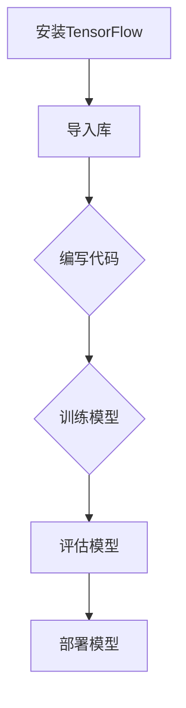
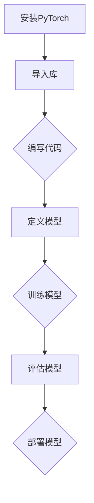
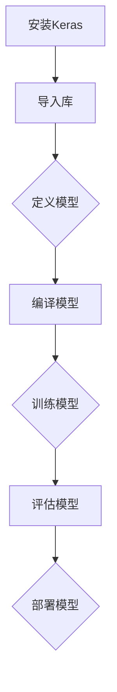

                 

### 引言

当今世界正处于一场前所未有的技术革命之中，人工智能（AI）无疑是这场变革的核心驱动力。从自动驾驶汽车到智能助手，从医疗诊断到金融分析，AI的广泛应用已经深刻地影响了各行各业。然而，在这个AI驱动的世界中，如何保持专注成为一个至关重要的问题。对于技术从业者、创业者乃至普通大众，都需要面对AI技术带来的挑战和机遇。

本文旨在探讨在AI驱动的世界中如何保持专注。我们将首先回顾AI的发展历程和核心技术，然后分析AI在社会中的广泛应用及其带来的伦理和社会影响。接着，我们将探讨AI驱动的世界中的技术挑战与解决方案，并给出实践指南。文章还将深入职业发展路径、创业与创新、教育变革以及未来展望等多个方面，旨在为读者提供全方位的视角，帮助他们在AI时代保持清晰的思维和专注的态度。

关键词：人工智能、技术挑战、专注、职业发展、创业、教育变革、未来展望

摘要：本文系统地分析了AI驱动的世界中的各个方面，从核心技术的回顾到伦理问题的探讨，从技术挑战的解决到职业发展的路径，再到创业与创新、教育变革以及未来展望，旨在为读者提供一套完整的指南，帮助他们在AI时代保持专注和清晰的思维。

---

### 第一部分: AI驱动的世界

#### 第1章: AI驱动的世界概述

##### 第1.1节: AI的定义与发展历程

人工智能（Artificial Intelligence，简称AI）是指通过计算机模拟人类智能行为的技术。它的目标是使计算机具备类似人类的感知、学习、推理和解决问题能力。AI的发展历程可以追溯到20世纪50年代，当时计算机科学家艾伦·图灵提出了著名的图灵测试，试图通过机器能否模仿人类行为来判断机器是否具有智能。

AI的发展大致可以分为三个阶段：早期AI、专家系统和现代AI。

1. **早期AI（20世纪50年代-70年代）**：这一阶段的AI主要集中在符号推理和规则系统，如逻辑推理、问题求解等。代表性的工作包括1956年达特茅斯会议，会议上提出了人工智能的概念，以及1966年建立的ELIZA程序，它可以模拟人类对话。

2. **专家系统（20世纪70年代-80年代）**：专家系统是早期AI的一个重要分支，它通过模拟专家的知识和推理过程来解决特定领域的问题。例如，MYCIN系统是第一个成功的专家系统，它可以用于诊断医疗疾病。

3. **现代AI（20世纪80年代至今）**：现代AI以机器学习和深度学习为核心，通过大规模数据训练模型，使计算机具备强大的学习能力和自适应能力。代表性工作包括1986年提出的反向传播算法，以及2012年深度学习在图像识别任务中取得的突破性成果。

##### 第1.2节: AI的核心技术

AI的核心技术主要包括机器学习、深度学习和自然语言处理等。

1. **机器学习**：机器学习是AI的一个重要分支，通过从数据中学习规律和模式，使计算机具备自主学习和改进能力。根据学习方式，机器学习可以分为监督学习、无监督学习和强化学习。

    - **监督学习**：监督学习通过已标记的数据进行训练，目的是预测输出结果。常见的监督学习算法包括线性回归、决策树和神经网络等。

    - **无监督学习**：无监督学习从未标记的数据中学习规律，目的是发现数据中的内在结构和模式。常见的无监督学习算法包括K-means聚类、主成分分析和自编码器等。

    - **强化学习**：强化学习通过与环境的交互进行学习，目的是最大化长期奖励。常见的强化学习算法包括Q学习、深度Q网络（DQN）和策略梯度算法等。

2. **深度学习**：深度学习是机器学习的一个分支，通过多层神经网络进行特征学习和模式识别。深度学习在图像识别、语音识别和自然语言处理等领域取得了显著的成果。常见的深度学习模型包括卷积神经网络（CNN）、循环神经网络（RNN）和生成对抗网络（GAN）等。

    - **卷积神经网络（CNN）**：CNN通过卷积操作和池化操作提取图像特征，广泛应用于图像识别和计算机视觉领域。

    - **循环神经网络（RNN）**：RNN通过循环结构处理序列数据，广泛应用于自然语言处理和语音识别领域。

    - **生成对抗网络（GAN）**：GAN通过生成器和判别器的对抗训练，能够生成高质量的图像和文本。

3. **自然语言处理**：自然语言处理（Natural Language Processing，简称NLP）是AI的一个重要分支，旨在使计算机能够理解和生成人类语言。常见的NLP技术包括词向量、语言模型、机器翻译和文本分类等。

    - **词向量**：词向量通过将单词映射到高维空间，使计算机能够对语义进行建模和计算。

    - **语言模型**：语言模型通过统计学习方法预测下一个单词的概率，广泛应用于文本生成和自动摘要。

    - **机器翻译**：机器翻译通过将一种语言翻译成另一种语言，使计算机能够跨语言交流。

    - **文本分类**：文本分类通过将文本分类到不同的类别，广泛应用于舆情分析和新闻推荐。

##### 第1.3节: AI在社会中的应用

AI在社会中的应用已经深入到各个领域，对生产、生活和社会管理产生了深远的影响。

1. **人工智能在工业中的应用**：AI在工业自动化、智能制造、工业物联网等领域发挥着重要作用。通过自动化生产线和机器人技术，工业生产效率显著提高。工业物联网（IIoT）则通过传感器和数据分析，实现了设备监控和预测性维护。

2. **人工智能在医疗中的应用**：AI在医疗领域的应用涵盖了疾病诊断、药物研发、智能手术等多个方面。通过图像识别和自然语言处理技术，AI能够辅助医生进行疾病诊断和治疗方案制定。在药物研发方面，AI能够加速新药发现和临床试验。

3. **人工智能在金融中的应用**：AI在金融领域的应用包括风险控制、个性化金融服务、智能投顾等。通过大数据分析和机器学习技术，金融机构能够更好地进行风险评估和投资决策。

4. **人工智能在其他领域中的应用**：AI在交通、教育、环境保护等领域也有广泛应用。自动驾驶汽车、智能交通管理系统和智能城市解决方案，都离不开AI技术的支持。在教育领域，AI通过个性化学习和在线教育平台，改变了传统的教学模式。

##### 第1.4节: AI在伦理和社会影响

AI的快速发展带来了许多伦理和社会问题，如数据隐私、算法偏见和就业市场变化等。

1. **AI伦理**：AI伦理涉及到如何确保AI系统的公平性、透明性和安全性。主要伦理原则包括公平性、可解释性、责任和隐私等。

    - **公平性**：AI系统应该公平对待所有用户，避免歧视和偏见。
    - **可解释性**：AI系统应该具备可解释性，使人们能够理解和信任其决策过程。
    - **责任**：AI系统的开发者、用户和监管者都应该承担相应的责任。
    - **隐私**：AI系统应该保护用户数据隐私，避免数据滥用。

2. **社会影响**：AI对社会的影响是双重的，既带来了机遇，也带来了挑战。

    - **机遇**：AI可以提高生产力、改善生活质量、促进创新和经济增长。
    - **挑战**：AI可能导致失业、社会不平等、信息透明度降低和隐私问题。

在接下来的章节中，我们将进一步探讨AI驱动的世界中的技术挑战与解决方案，以及如何在这个世界中保持专注。

---

### 第1.1节: AI的定义与发展历程

#### 1.1.1 AI的定义

人工智能（Artificial Intelligence，简称AI）是一个广泛的概念，它指的是通过计算机程序和算法模拟人类智能的技术。AI的目标是使计算机能够执行需要人类智能的任务，如识别语言、理解图像、推理问题、自主学习和决策等。AI的研究始于20世纪50年代，当时科学家们开始探索如何使计算机具备类似人类的智能行为。

AI的定义可以从多个角度进行理解：

1. **计算智能**：AI通过计算和算法来模拟人类智能，包括逻辑推理、问题求解、学习和自适应能力等。

2. **行为智能**：AI通过与环境的交互来学习和改进其行为，如机器人导航、自动驾驶和智能控制系统等。

3. **认知模拟**：AI通过模拟人类认知过程，如感知、记忆、推理和语言处理等，来理解和模拟人类思维。

4. **实用智能**：AI在实际应用中发挥作用，如医疗诊断、金融分析、智能客服和自动驾驶等。

#### 1.1.2 AI的发展历程

AI的发展历程可以分为几个重要阶段：

1. **早期AI（1956-1974）**：1956年，达特茅斯会议标志着AI作为一门学科的正式诞生。这个时期的研究主要集中在符号推理和规则系统，如问题求解和逻辑推理。代表性的工作包括ELIZA程序和DENDRAL系统。

2. **专家系统（1974-1987）**：专家系统是早期AI的一个重要分支，它通过模拟专家的知识和推理过程来解决特定领域的问题。代表性的工作包括MYCIN和DENDRAL系统。

3. **人工神经网络（1986-1998）**：人工神经网络（Artificial Neural Networks，ANN）是一种模仿生物神经系统的计算模型，它通过多层神经网络进行特征学习和模式识别。1986年，反向传播算法（Backpropagation Algorithm）的提出标志着深度学习的诞生。

4. **机器学习时代（1998-2012）**：机器学习成为AI研究的主流方法，它通过从数据中学习规律和模式，使计算机具备自主学习和改进能力。代表性的工作包括支持向量机（Support Vector Machine，SVM）和决策树（Decision Tree）。

5. **深度学习时代（2012至今）**：深度学习是一种基于人工神经网络的机器学习方法，它通过多层神经网络进行特征学习和模式识别。2012年，深度学习在图像识别任务中取得了突破性成果，标志着AI进入一个新的发展阶段。

#### 1.1.3 当前AI的研究热点

当前AI的研究热点包括：

1. **深度学习**：深度学习是一种基于人工神经网络的机器学习方法，它通过多层神经网络进行特征学习和模式识别。深度学习在图像识别、语音识别和自然语言处理等领域取得了显著的成果。

2. **强化学习**：强化学习是一种通过与环境交互进行学习的机器学习方法，它通过最大化长期奖励来学习策略。强化学习在游戏、自动驾驶和智能推荐等领域有广泛应用。

3. **自然语言处理**：自然语言处理是一种使计算机能够理解和生成人类语言的技术，它包括词向量、语言模型、机器翻译和文本分类等。自然语言处理在智能客服、智能助手和舆情分析等领域有广泛应用。

4. **计算机视觉**：计算机视觉是一种使计算机能够理解和解释图像和视频的技术，它包括图像识别、目标检测和图像分割等。计算机视觉在自动驾驶、安防监控和医疗影像分析等领域有广泛应用。

5. **机器人技术**：机器人技术是一种通过计算机控制系统使机器执行特定任务的技术。机器人技术在工业制造、医疗辅助和智能家居等领域有广泛应用。

6. **自动驾驶技术**：自动驾驶技术是一种使汽车能够自主行驶的技术。自动驾驶技术在智能交通、物流和公共交通等领域有广泛应用。

#### 1.1.4 AI在现实世界中的应用

AI在现实世界中的应用已经非常广泛，涵盖了多个领域：

1. **医疗健康**：AI在医疗健康领域的应用包括疾病诊断、药物研发、智能手术和健康管理等。例如，通过深度学习技术，AI可以辅助医生进行肺癌、乳腺癌等疾病的早期诊断。

2. **金融**：AI在金融领域的应用包括风险控制、信用评分、智能投顾和个性化金融服务等。例如，通过机器学习技术，银行可以更准确地评估客户的信用风险，从而降低贷款违约率。

3. **工业制造**：AI在工业制造领域的应用包括自动化生产线、智能工厂、工业物联网和预测性维护等。例如，通过计算机视觉技术，工厂可以实时监控生产过程，从而提高生产效率和产品质量。

4. **交通运输**：AI在交通运输领域的应用包括自动驾驶、智能交通管理系统和物流优化等。例如，通过自动驾驶技术，可以减少交通事故和交通拥堵，提高交通效率。

5. **教育**：AI在教育领域的应用包括个性化学习、在线教育平台、智能辅导和考试分析等。例如，通过自然语言处理技术，可以分析学生的学习行为，从而提供个性化的学习建议。

6. **智能家居**：AI在智能家居领域的应用包括智能音箱、智能灯光、智能安防和智能家电等。例如，通过语音识别技术，用户可以通过语音指令控制家居设备。

#### 1.1.5 AI未来的发展趋势

随着技术的不断进步，AI未来的发展趋势包括：

1. **强人工智能**：强人工智能是一种具有高度智能和自我学习能力的人工智能系统。虽然目前还没有实现，但它是未来AI研究的重要目标。

2. **多模态感知**：多模态感知是一种使计算机能够同时感知和处理多种类型数据（如图像、声音和文本）的技术。例如，通过多模态感知，AI可以更好地理解用户的情感和需求。

3. **智能机器人**：智能机器人是一种具有高度智能和自主行动能力的人工智能系统。未来，智能机器人将广泛应用于工业制造、医疗健康、家庭服务等领域。

4. **边缘计算**：边缘计算是一种在数据源附近进行数据处理和存储的技术。随着物联网和5G技术的发展，边缘计算将成为AI应用的重要支撑。

5. **可持续发展**：AI在可持续发展领域有广泛应用，如智能农业、水资源管理和环境保护等。通过AI技术，可以实现更高效、更环保的生产和生活方式。

#### 1.1.6 结论

人工智能作为一门交叉学科，正在不断发展和创新。AI在现实世界中的应用已经带来了许多变革，未来它还将继续推动社会进步。然而，AI的发展也面临许多挑战，如数据隐私、算法偏见和伦理问题等。只有通过科学研究和规范管理，才能确保AI技术的健康发展。

---

### 第1.2节: AI的核心技术

#### 1.2.1 机器学习

机器学习（Machine Learning，ML）是人工智能（AI）的一个重要分支，旨在使计算机系统能够自动从数据中学习，并做出决策或预测。机器学习通过构建模型来解释数据中的模式和关系，从而使系统能够在新数据上做出准确的预测或决策。根据学习方式，机器学习主要分为监督学习、无监督学习和强化学习。

##### 1.2.1.1 监督学习

监督学习（Supervised Learning）是一种机器学习方法，它使用已标记的数据集进行训练。已标记的数据集包含了输入特征和相应的输出标签，通过这些数据，模型可以学习如何从输入特征预测输出标签。

1. **线性回归（Linear Regression）**

线性回归是一种简单的监督学习算法，用于预测连续值输出。其模型可以表示为：

\[ y = \beta_0 + \beta_1 \cdot x \]

其中，\( y \) 是预测的输出，\( x \) 是输入特征，\( \beta_0 \) 和 \( \beta_1 \) 是模型的参数。

2. **决策树（Decision Tree）**

决策树是一种树形结构的监督学习算法，它通过一系列的决策规则来预测输出。每个节点代表一个特征，每个分支代表一个特征的不同取值，叶子节点代表最终的预测结果。

3. **支持向量机（Support Vector Machine，SVM）**

支持向量机是一种用于分类和回归的监督学习算法。它通过找到一个最佳的超平面来分隔不同类别的数据点，超平面由支持向量决定。SVM的模型可以表示为：

\[ w \cdot x - b = 0 \]

其中，\( w \) 是模型的权重向量，\( x \) 是输入特征，\( b \) 是模型的偏置。

##### 1.2.1.2 无监督学习

无监督学习（Unsupervised Learning）是一种机器学习方法，它不使用标记的数据集进行训练。无监督学习的目的是发现数据中的模式和结构。

1. **K-means聚类（K-means Clustering）**

K-means聚类是一种基于距离的聚类算法，它将数据点划分成K个簇，使得同一簇的数据点之间距离较短，不同簇的数据点之间距离较长。K-means聚类通过迭代的方式优化簇中心，以达到最佳聚类效果。

2. **主成分分析（Principal Component Analysis，PCA）**

主成分分析是一种降维技术，它通过将数据投影到新的正交基上来减少数据的维度。PCA的目的是保留数据的主要特征，同时去除冗余信息。

3. **自编码器（Autoencoder）**

自编码器是一种无监督学习算法，它由编码器和解码器组成。编码器将输入数据压缩成一个低维特征表示，解码器则尝试重构原始数据。自编码器通过最小化重构误差来训练模型。

##### 1.2.1.3 强化学习

强化学习（Reinforcement Learning，RL）是一种通过与环境交互进行学习的机器学习方法。强化学习通过学习策略来最大化长期奖励，其核心是值函数和策略。

1. **Q学习（Q-Learning）**

Q学习是一种基于值函数的强化学习算法，它通过更新Q值来学习最优策略。Q值表示在当前状态下采取某一动作的预期回报。Q学习通过迭代的方式更新Q值，以达到最佳策略。

2. **深度Q网络（Deep Q-Network，DQN）**

深度Q网络是一种基于深度学习的强化学习算法，它使用神经网络来近似Q值函数。DQN通过经验回放和目标网络来减少偏差和方差，从而提高学习效果。

3. **策略梯度算法（Policy Gradient Algorithm）**

策略梯度算法是一种基于策略的强化学习算法，它通过优化策略梯度来更新策略参数。策略梯度算法适用于连续动作空间，如自动驾驶和游戏控制。

#### 1.2.2 深度学习

深度学习（Deep Learning，DL）是机器学习的一个分支，它通过多层神经网络进行特征学习和模式识别。深度学习在图像识别、语音识别和自然语言处理等领域取得了显著成果。

1. **神经网络（Neural Networks）**

神经网络是一种模拟生物神经系统的计算模型，它由多个神经元组成。每个神经元通过权重连接到其他神经元，并通过对输入进行加权求和来产生输出。神经网络通过反向传播算法进行训练。

2. **卷积神经网络（Convolutional Neural Networks，CNN）**

卷积神经网络是一种用于图像识别和计算机视觉的深度学习模型。CNN通过卷积操作和池化操作提取图像特征，从而实现图像分类和目标检测。

3. **循环神经网络（Recurrent Neural Networks，RNN）**

循环神经网络是一种用于序列数据的深度学习模型。RNN通过循环结构处理序列数据，从而实现自然语言处理和语音识别。

4. **生成对抗网络（Generative Adversarial Networks，GAN）**

生成对抗网络是一种用于生成图像和文本的深度学习模型。GAN由生成器和判别器组成，生成器尝试生成逼真的图像，判别器则尝试区分真实图像和生成图像。

#### 1.2.3 自然语言处理

自然语言处理（Natural Language Processing，NLP）是人工智能的一个分支，它使计算机能够理解和生成人类语言。NLP包括词向量、语言模型、机器翻译和文本分类等技术。

1. **词向量（Word Vectors）**

词向量是一种将单词映射到高维空间的技术，它通过统计方法或神经网络模型来学习单词的向量表示。词向量可以用于文本分类、情感分析和信息检索等。

2. **语言模型（Language Model）**

语言模型是一种用于预测下一个单词的概率的模型，它通过统计学习方法来学习文本数据中的单词关系。语言模型可以用于文本生成、自动摘要和语音识别等。

3. **机器翻译（Machine Translation）**

机器翻译是一种将一种语言翻译成另一种语言的技术，它通过统计方法或神经网络模型来学习语言之间的对应关系。机器翻译可以用于跨语言交流、多语言搜索和信息检索等。

4. **文本分类（Text Classification）**

文本分类是一种将文本分类到预定义类别中的技术，它通过机器学习方法来学习分类规则。文本分类可以用于舆情分析、新闻推荐和垃圾邮件过滤等。

#### 1.2.4 AI的其他核心技术

除了上述核心技术，AI还包括其他一些重要的技术，如计算机视觉、机器人技术和强化学习等。

1. **计算机视觉（Computer Vision）**

计算机视觉是一种使计算机能够理解和解释图像和视频的技术，它包括图像识别、目标检测和图像分割等。计算机视觉可以用于自动驾驶、安防监控和医疗影像分析等。

2. **机器人技术（Robotics）**

机器人技术是一种通过计算机控制系统使机器执行特定任务的技术，它包括智能机器人、机器人操作系统和机器人编程等。机器人技术可以用于工业制造、医疗辅助和智能家居等。

3. **强化学习（Reinforcement Learning）**

强化学习是一种通过与环境交互进行学习的机器学习方法，它通过学习策略来最大化长期奖励。强化学习可以用于游戏、自动驾驶和智能推荐等。

#### 1.2.5 AI的核心技术总结

AI的核心技术包括机器学习、深度学习和自然语言处理等。机器学习通过从数据中学习规律和模式，使计算机具备自主学习和改进能力；深度学习通过多层神经网络进行特征学习和模式识别，在图像识别、语音识别和自然语言处理等领域取得了显著成果；自然语言处理通过使计算机能够理解和生成人类语言，推动了跨语言交流和信息检索的发展。这些核心技术共同推动了AI的快速发展，为各行各业带来了深远的影响。

---

### 第1.3节: AI在社会中的应用

人工智能（AI）的迅速发展已经使其在社会中的各个领域得到了广泛应用，极大地改变了我们的生活方式和商业模式。以下将详细探讨AI在医疗、金融、工业和物流等领域的具体应用。

#### 1.3.1 人工智能在医疗中的应用

AI在医疗领域的应用具有革命性的意义，它通过提供更加精确的诊断、个性化的治疗方案和高效的药物研发，显著提升了医疗服务的质量。以下是AI在医疗中的几个关键应用：

1. **疾病诊断**：AI在疾病诊断中扮演着越来越重要的角色，尤其是在医学图像分析方面。通过深度学习和计算机视觉技术，AI能够快速、准确地识别疾病。例如，AI可以辅助医生进行肺癌、乳腺癌等恶性肿瘤的早期检测，提高诊断的准确性。

2. **个性化治疗**：AI可以根据患者的具体病情和基因组信息，制定个性化的治疗方案。例如，通过分析患者的电子健康记录和基因组数据，AI可以预测哪些药物对患者最为有效，从而减少不必要的药物试验和副作用。

3. **药物研发**：AI在药物研发过程中也发挥着重要作用，它可以通过分析大量生物数据，加速新药的研发进程。例如，AI可以预测药物与生物靶点的结合力，筛选出有潜力的候选药物，从而降低研发成本和时间。

4. **智能辅助手术**：AI在手术辅助中的应用越来越广泛，例如，通过机器人辅助手术，医生可以更加精准地完成手术，减少手术风险。此外，AI还可以辅助医生进行实时手术决策，提高手术的成功率。

#### 1.3.2 人工智能在金融中的应用

金融行业是AI应用的一个重要领域，AI通过大数据分析和机器学习技术，为金融产品和服务提供了更加智能的解决方案。以下是AI在金融领域的几个关键应用：

1. **风险管理**：AI在风险管理中发挥着重要作用，它可以通过分析大量的交易数据和历史事件，识别潜在的风险并采取相应的预防措施。例如，AI可以实时监测市场波动，预测金融市场风险，从而帮助金融机构更好地管理风险。

2. **信用评分**：AI在信用评分中的应用使得信用评估更加精准和高效。通过分析个人的历史交易记录、社会信用数据等，AI可以更准确地评估个人的信用风险，为金融机构提供可靠的信用评分依据。

3. **个性化金融服务**：AI可以根据客户的行为数据、消费习惯和投资偏好，提供个性化的金融服务。例如，AI可以根据客户的投资目标，为其推荐最适合的投资组合，从而提高客户的满意度和忠诚度。

4. **欺诈检测**：AI在欺诈检测中的应用显著提高了金融机构的安全性能。通过分析交易数据和行为模式，AI可以快速识别异常交易和欺诈行为，从而减少欺诈损失。

#### 1.3.3 人工智能在工业中的应用

AI在工业领域的应用极大地提高了生产效率和产品质量，推动了工业自动化和智能制造的发展。以下是AI在工业中的几个关键应用：

1. **自动化生产线**：AI在自动化生产线中的应用使得生产过程更加高效和灵活。通过机器人技术和计算机视觉，AI可以自动化完成复杂的制造任务，如装配、焊接和质检等。

2. **工业物联网（IIoT）**：AI与工业物联网的结合，实现了设备监测和预测性维护。通过传感器和数据分析，AI可以实时监测设备的运行状态，预测设备可能出现的问题，从而减少停机时间和维护成本。

3. **质量检测**：AI在质量检测中的应用，使得产品质量控制更加精准和高效。通过计算机视觉和深度学习技术，AI可以自动检测产品缺陷，确保产品的质量。

4. **智能物流**：AI在智能物流中的应用，提高了物流效率，降低了物流成本。通过优化运输路线、自动识别货物和实时监控货物状态，AI可以显著提高物流管理水平。

#### 1.3.4 人工智能在物流中的应用

物流行业是AI应用的一个新兴领域，AI通过优化运输、仓储和配送等环节，提高了物流效率，降低了物流成本。以下是AI在物流中的几个关键应用：

1. **运输优化**：AI可以通过分析交通流量、天气状况和运输需求等数据，优化运输路线和时间表，从而提高运输效率，降低运输成本。

2. **仓储管理**：AI在仓储管理中的应用，使得仓储过程更加高效和精准。通过自动化分拣系统和计算机视觉技术，AI可以快速识别和分类货物，提高仓储效率。

3. **配送优化**：AI在配送优化中的应用，提高了配送速度和服务质量。通过实时监控货物状态和预测客户需求，AI可以优化配送路线和时间，提高配送效率。

4. **智能调度**：AI在智能调度中的应用，提高了物流资源利用率。通过分析物流需求和资源状况，AI可以智能调度车辆和人员，确保物流流程的高效运行。

#### 1.3.5 人工智能在其他领域中的应用

除了医疗、金融、工业和物流，AI还在其他众多领域得到了广泛应用，如教育、交通、环境保护和智能家居等。

1. **教育**：AI在教育中的应用，推动了个性化学习和在线教育的发展。通过分析学生的学习数据，AI可以为学生提供个性化的学习建议和资源，提高学习效果。

2. **交通**：AI在交通中的应用，提高了交通管理和安全水平。通过智能交通系统，AI可以实时监控交通状况，优化交通信号控制，减少交通拥堵和事故。

3. **环境保护**：AI在环境保护中的应用，提高了环境监测和治理效率。通过数据分析和技术手段，AI可以实时监测环境质量，预测环境污染趋势，为环境保护提供科学依据。

4. **智能家居**：AI在智能家居中的应用，提高了生活质量和舒适度。通过智能设备和数据分析，AI可以自动调节家庭环境，提供个性化服务，如智能照明、智能安防和智能家电控制。

总之，AI在社会中的广泛应用，不仅改变了我们的生活方式，也推动了各个行业的发展。随着技术的不断进步，AI将在未来带来更多的变革和机遇。

---

### 第1.4节: AI在伦理和社会影响

随着人工智能（AI）技术的迅猛发展，其在社会各个领域中的应用日益广泛，同时也带来了许多伦理和社会问题。这些问题不仅涉及技术本身，还包括数据隐私、算法偏见、就业市场变化等方面。以下将对这些伦理和社会影响进行详细探讨。

#### 1.4.1 AI伦理

AI伦理是指关于人工智能系统设计、开发和应用中应当遵循的道德原则和规范。AI伦理涉及到多个方面，主要包括公平性、可解释性、责任和隐私等。

1. **公平性**：AI系统应该公平对待所有用户，避免歧视和偏见。然而，在实际应用中，AI系统可能会因为训练数据中的偏差而导致不公平的结果。例如，在招聘系统中，如果训练数据中存在性别、种族或年龄等偏见，系统可能会在招聘过程中对这些群体产生歧视。

2. **可解释性**：AI系统应该具备可解释性，使得人们能够理解和信任其决策过程。然而，深度学习模型等复杂AI系统往往被视为“黑箱”，其决策过程难以解释。这可能导致用户对AI系统的信任度下降，尤其是在医疗、金融等高风险领域。

3. **责任**：在AI系统的设计和应用中，责任问题是一个关键议题。当AI系统发生错误或导致不良后果时，责任应由谁承担？是开发者、用户还是监管机构？明确责任归属有助于提高AI系统的安全性。

4. **隐私**：AI系统在处理大量数据时，可能涉及用户隐私。如何保护用户数据隐私，防止数据滥用，是一个重要的伦理问题。例如，个人健康数据、金融数据等敏感信息在AI应用中的泄露，可能对用户造成严重的后果。

#### 1.4.2 数据隐私保护

数据隐私保护是AI应用中不可忽视的问题。随着AI系统对大量数据的依赖，数据隐私问题愈发凸显。

1. **数据收集**：AI系统需要大量的数据来训练模型。然而，在数据收集过程中，可能涉及用户隐私。例如，移动应用在收集用户位置、通讯记录等数据时，需要用户明确同意。

2. **数据存储**：存储大量用户数据可能带来安全隐患。如果数据存储不当，可能导致数据泄露或被恶意利用。因此，需要采用安全的数据存储和传输技术。

3. **数据使用**：AI系统在处理数据时，需要明确数据的使用目的和范围。避免滥用用户数据，确保数据在AI应用中的合理使用。

#### 1.4.3 算法偏见

算法偏见是指AI系统在决策过程中可能存在的系统性偏差。这些偏差可能源于训练数据的偏见、算法设计或数据预处理过程。

1. **训练数据偏见**：训练数据中的偏见可能导致AI系统在应用过程中产生偏见。例如，如果训练数据中存在性别、种族等偏见，AI系统可能会在决策中体现这些偏见。

2. **算法设计**：算法设计中的缺陷可能导致算法偏见。例如，某些优化算法可能对某些特定类型的输入数据产生偏见。

3. **数据预处理**：数据预处理过程也可能引入偏见。例如，如果使用错误的数据清洗方法，可能导致数据中的某些信息丢失或扭曲。

#### 1.4.4 就业市场变化

AI技术的广泛应用对就业市场产生了深远的影响。一方面，AI带来了新的就业机会，如数据科学家、机器学习工程师等；另一方面，某些传统岗位可能被自动化取代，导致失业。

1. **就业机会**：AI技术的发展需要大量的专业人才，包括数据科学家、机器学习工程师、AI研究员等。这些新兴职业为有志于投身AI领域的人才提供了广阔的发展空间。

2. **就业竞争**：随着AI技术的普及，市场竞争日益激烈。一方面，求职者需要具备更多的技能和经验；另一方面，企业对人才的要求越来越高，求职者需要不断提升自身能力。

3. **技能升级**：面对AI带来的变革，现有职业群体需要不断进行技能升级。例如，传统的工业工程师可能需要学习AI相关的知识，以适应智能制造的趋势。

#### 1.4.5 社会影响

AI技术的广泛应用对社会产生了深远的影响，既带来了机遇，也带来了挑战。

1. **经济影响**：AI技术可以提高生产力，促进经济增长。然而，自动化可能取代某些传统岗位，导致收入分配不均。

2. **社会不平等**：AI技术的发展可能加剧社会不平等。例如，如果某些地区或群体无法享受到AI带来的福利，可能导致社会分裂和贫富差距扩大。

3. **信息透明度**：AI技术的应用使得信息收集和分析更加便捷，但也可能侵犯个人隐私，降低信息透明度。

4. **社会伦理**：AI技术的广泛应用引发了一系列伦理问题，如隐私保护、算法偏见等。解决这些问题需要社会各界的共同努力，制定相应的伦理规范。

#### 1.4.6 AI伦理挑战

面对AI伦理挑战，我们需要采取有效的措施来确保AI技术的健康和可持续发展。

1. **制定伦理规范**：政府、学术界和企业应共同制定AI伦理规范，明确AI系统的设计、开发和应用中应遵循的道德原则和标准。

2. **加强监管**：监管机构应加强对AI系统的监管，确保AI技术在实际应用中的安全性和透明性。

3. **提高公众意识**：通过教育和宣传，提高公众对AI伦理问题的认识，增强公众对AI技术的理解和信任。

4. **技术透明性**：提高AI系统的透明性，使得用户能够理解和监督AI系统的决策过程。

5. **数据隐私保护**：加强数据隐私保护，确保用户数据的安全和隐私。

总之，AI在伦理和社会影响方面面临着诸多挑战。只有通过科学研究和规范管理，才能确保AI技术的健康发展，为人类社会带来更多的福利。

---

### 第2章: AI驱动的世界中的技术挑战与解决方案

随着人工智能（AI）技术的飞速发展，其在各个领域的应用越来越广泛，同时也带来了许多技术挑战。这些挑战不仅影响到AI系统的性能和可靠性，也涉及到数据隐私、安全性和可解释性等方面。以下我们将详细探讨这些技术挑战，并提出相应的解决方案。

#### 2.1 数据质量与隐私保护

数据质量是AI系统性能的基础，而数据隐私保护则关系到用户的信任和法规的遵守。以下是一些关键挑战和解决方案：

##### 2.1.1 数据质量的重要性

数据质量对于AI系统至关重要，因为训练数据的质量直接影响模型的性能。以下是数据质量的一些关键方面：

1. **准确性**：数据中的错误或噪声会导致模型产生误导性的结论。
2. **完整性**：缺失的数据会影响模型的训练效果和预测准确性。
3. **一致性**：数据的一致性对于保证模型在不同环境下的表现至关重要。
4. **时效性**：随着时间的变化，数据的时效性可能降低其价值。

##### 2.1.2 数据清洗

数据清洗是提高数据质量的重要步骤。以下是一些常见的数据清洗方法：

1. **去除重复数据**：通过识别和删除重复的数据记录，可以减少数据冗余。
2. **处理缺失值**：可以使用多种方法处理缺失值，如删除缺失值、使用平均值或中位数填充、插值等。
3. **去除异常值**：异常值可能影响模型的训练效果，因此需要识别并处理。
4. **数据规范化**：通过标准化或归一化数据，可以使其具有相似的尺度，从而提高模型的训练效果。

##### 2.1.3 数据质量评估

评估数据质量是确保数据准备正确性的关键。以下是一些评估数据质量的方法：

1. **一致性检查**：通过比较不同数据源之间的数据，检查是否存在不一致之处。
2. **完整性检查**：通过计算缺失值的比例，评估数据的完整性。
3. **准确性检查**：通过对比实际值和预测值，评估预测模型的准确性。
4. **数据可视化**：使用数据可视化工具，如散点图、直方图等，帮助识别数据中的异常和趋势。

##### 2.1.4 数据隐私保护

数据隐私保护是AI应用中不可忽视的问题，因为AI系统通常需要处理大量敏感数据。以下是一些数据隐私保护的方法：

1. **数据加密**：使用加密技术保护数据的安全性，如对称加密和非对称加密。
2. **同态加密**：同态加密允许在加密数据上进行计算，而不需要解密数据。这种方法可以保护数据的隐私，同时确保计算的正确性。
3. **差分隐私**：差分隐私是一种保护隐私的技术，它通过在数据集中添加噪声，使得单个记录的隐私信息无法被推断出来。
4. **数据匿名化**：通过将数据中的敏感信息替换为伪名，降低数据泄露的风险。

##### 2.1.5 GDPR与数据隐私法规

欧盟的通用数据保护条例（GDPR）是数据隐私保护的重要法规，对数据处理者提出了严格的要求。以下是一些关键要求：

1. **数据主体权利**：数据主体有权访问、更正和删除其个人信息，以及限制其处理。
2. **合法性和透明性**：数据处理者必须确保数据处理具有合法性，并向数据主体提供透明的信息。
3. **数据保护措施**：数据处理者必须采取适当的技术和组织措施，保护个人数据的完整性、保密性和可用性。
4. **数据泄露通知**：在发生数据泄露时，数据处理者必须在规定时间内通知监管机构和受影响的个人。

#### 2.2 AI模型的解释性与可解释性

AI模型的解释性是确保其决策过程透明、可信的重要方面。以下是一些关键挑战和解决方案：

##### 2.2.1 可解释性的重要性

可解释性对于AI系统在医疗、金融和法律等高风险领域的应用尤为重要。以下是一些原因：

1. **信任**：可解释性有助于建立用户对AI系统的信任，从而提高其接受度。
2. **合规性**：在许多行业，法规要求AI系统的决策过程具有可解释性，以符合合规性要求。
3. **调试与优化**：可解释性有助于开发者识别和修复模型中的问题，从而提高模型的性能。

##### 2.2.2 黑箱模型与白箱模型

AI模型可以根据其可解释性程度分为黑箱模型和白箱模型：

1. **黑箱模型**：黑箱模型（如深度神经网络）的决策过程难以解释，其性能主要依赖于大量数据训练。
2. **白箱模型**：白箱模型（如线性回归和决策树）的决策过程较为直观，容易理解。

##### 2.2.3 可解释性技术

以下是一些提高AI模型解释性的技术：

1. **层级可视化**：通过可视化模型的层次结构，帮助理解模型的工作原理。
2. **解释模型**：使用可解释性模型（如LIME和SHAP），将复杂的黑箱模型转化为可解释的形式。
3. **规则提取**：从模型中提取可解释的规则，如决策树中的决策规则。
4. **模型简化**：通过简化模型结构，提高其可解释性，同时保持足够的性能。

#### 2.3 AI的安全性与鲁棒性

AI系统的安全性是确保其可靠运行和防止恶意攻击的关键。以下是一些关键挑战和解决方案：

##### 2.3.1 AI安全风险

AI系统面临的安全风险主要包括：

1. **数据泄露**：通过窃取训练数据，攻击者可能对AI系统进行反向工程或攻击。
2. **模型篡改**：攻击者可以通过篡改训练数据或模型参数，使AI系统产生错误的决策。
3. **对抗攻击**：通过精心设计的对抗样本，攻击者可以欺骗AI系统，使其产生错误的决策。
4. **模型过拟合**：当AI系统对训练数据过于敏感时，可能会在测试数据上表现不佳。

##### 2.3.2 提高AI安全性

以下是一些提高AI系统安全性的方法：

1. **数据保护**：通过加密和访问控制等措施，确保训练数据的安全性。
2. **模型加固**：通过在训练过程中加入噪声、减少过拟合等方法，提高模型对对抗攻击的抵抗力。
3. **可解释性安全**：结合可解释性技术，确保AI系统的决策过程透明，从而减少恶意攻击的风险。
4. **对抗样本训练**：通过生成和训练对抗样本，提高模型对对抗攻击的抵抗力。
5. **安全监测与响应**：建立实时监测系统，及时发现和应对AI系统的安全威胁。

总之，AI驱动的世界中技术挑战重重，但通过科学的研究和有效的解决方案，我们可以克服这些挑战，确保AI技术的健康和可持续发展。

---

### 第3章: 在AI驱动的世界中保持专注的实践指南

在AI驱动的世界中，保持专注对于技术从业者、创业者乃至普通大众来说都至关重要。以下将介绍一些实用的技巧和方法，帮助大家在这个充满挑战和机遇的世界中保持专注。

#### 3.1 时间管理技巧

时间管理是保持专注的基础，以下是一些有效的时间管理技巧：

##### 3.1.1 建立专注环境

1. **减少干扰**：创造一个安静、舒适的工作环境，避免噪音和其他干扰因素。可以使用降噪耳机或关闭手机通知来减少干扰。
2. **专注工作习惯**：设定专注时段，例如使用番茄工作法，每25分钟专注工作，然后休息5分钟。这种方法有助于保持专注并提高工作效率。

##### 3.1.2 使用专注工具

1. **托尼·罗宾斯时间管理工具**：托尼·罗宾斯提供了一套时间管理工具，包括目标设定、任务分解、优先级排序等。这些工具可以帮助你更好地规划和管理时间。
2. **计划和组织工具**：使用日历、任务列表和待办事项应用程序来组织你的工作和生活。例如，Google日历和Trello等工具可以帮助你跟踪任务进度和优先级。

#### 3.2 提高注意力集中度的训练方法

以下是一些训练方法，有助于提高注意力集中度：

##### 3.2.1 正念练习

1. **正念冥想**：正念冥想是一种通过专注于当前时刻的呼吸、身体感觉和思维来提高注意力和意识的方法。每天花10-15分钟进行正念冥想，有助于提高注意力集中度。
2. **正念呼吸练习**：通过专注于呼吸，你可以减少分心和焦虑，提高注意力。可以尝试在一天中的几个时刻进行深呼吸练习，每次持续几分钟。

##### 3.2.2 注意力集中训练

1. **游戏训练**：一些专门设计用于提高注意力集中度的游戏，如注意力训练游戏和反应时间游戏，可以帮助你提高注意力。
2. **脑力训练应用**：使用脑力训练应用，如Lumosity和Elevate，可以帮助你训练注意力、记忆和思维能力。

#### 3.3 精力管理策略

精力管理是保持专注的关键，以下是一些精力管理策略：

##### 3.3.1 精力管理原则

1. **精力的周期性波动**：了解你的精力周期，例如，有些人可能在早晨精力充沛，而有些人可能在下午。根据你的精力周期安排工作和休息。
2. **精力管理工具**：使用精力管理工具，如精力管理日历和精力管理应用，可以帮助你跟踪和管理你的精力水平。

##### 3.3.2 提升精力水平的实践

1. **锻炼与饮食**：定期锻炼和健康的饮食习惯可以提升你的精力水平。例如，进行有氧运动、力量训练和瑜伽等，以及摄入均衡的营养，可以帮助你保持精力充沛。
2. **睡眠管理**：保证充足的睡眠对于保持专注至关重要。尝试每天保持7-9小时的睡眠，并建立规律的作息习惯。

#### 3.4 职业角色中的专注技巧

以下是一些针对不同职业角色的专注技巧：

##### 3.4.1 数据科学家

1. **数据处理**：在处理数据时，保持专注，确保数据的质量和准确性。
2. **模型训练与优化**：在训练和优化模型时，集中精力，确保模型的性能和可解释性。

##### 3.4.2 AI工程师

1. **模型部署**：在部署模型时，确保系统的安全性和可靠性，避免因疏忽导致的错误。
2. **系统维护与优化**：定期维护和优化系统，确保其稳定运行，并提高其性能。

#### 3.5 个人成长与自我管理

保持专注不仅需要外部环境的支持，还需要个人的自我管理和成长。以下是一些建议：

1. **设定明确的目标**：设定具体、可衡量的目标，有助于保持专注并提高动力。
2. **持续学习**：不断学习新知识和技能，提升自己的竞争力，保持对工作的热情。
3. **自我反思**：定期进行自我反思，了解自己的优势和不足，制定改进计划。

总之，在AI驱动的世界中保持专注是一项挑战，但通过有效的技巧和策略，我们可以更好地应对挑战，保持清晰的思维和专注的态度。

---

### 第4章: AI驱动的世界中的职业发展

在AI驱动的世界中，职业发展面临着前所未有的机遇和挑战。以下将详细介绍AI驱动的世界中几种关键职业角色及其技能要求、职业发展路径，以及相关资源和学习途径。

#### 4.1 职业角色分析

##### 4.1.1 数据科学家

数据科学家是AI领域中最重要的职业之一，主要负责使用机器学习和统计分析方法从大量数据中提取有价值的信息和洞见。数据科学家的核心技能包括：

1. **数据处理**：熟练使用Python、R等编程语言，掌握数据处理库如Pandas和NumPy。
2. **统计分析**：掌握统计方法和工具，如回归分析、聚类分析和时间序列分析。
3. **机器学习**：熟悉常见的机器学习算法，如线性回归、决策树、随机森林和神经网络。
4. **数据可视化**：熟练使用数据可视化工具，如Matplotlib、Seaborn和Tableau。

数据科学家职业发展路径通常分为以下阶段：

1. **初级数据科学家**：负责数据收集、清洗和初步分析，参与项目的规划和实施。
2. **中级数据科学家**：负责数据模型的设计和实现，能够独立承担项目，并进行模型性能优化。
3. **高级数据科学家**：具备丰富的实践经验，能够提出创新性的数据解决方案，领导数据科学团队。

##### 4.1.2 AI工程师

AI工程师是负责实现和部署AI模型的工程师，涉及模型开发、系统集成和性能优化等方面。AI工程师的核心技能包括：

1. **编程语言**：熟练掌握Python、C++等编程语言。
2. **机器学习和深度学习框架**：熟悉常见的深度学习框架如TensorFlow、PyTorch和Keras。
3. **系统集成**：具备将AI模型集成到现有系统中的能力，了解云计算和容器化技术。
4. **性能优化**：熟悉性能优化技术，如并行计算、GPU加速和分布式计算。

AI工程师的职业发展路径通常分为以下阶段：

1. **初级AI工程师**：负责模型开发和测试，参与系统集成和部署。
2. **中级AI工程师**：负责项目的规划和实施，具备独立承担项目的能力。
3. **高级AI工程师**：负责技术指导和技术决策，具备领导团队和推动技术创新的能力。

##### 4.1.3 AI产品经理

AI产品经理是负责AI产品和服务的规划、设计、开发和推广的管理者。AI产品经理的核心技能包括：

1. **市场需求分析**：了解市场需求，分析用户需求，制定产品策略。
2. **产品设计**：能够根据市场需求和技术能力设计AI产品和服务。
3. **项目管理**：具备项目管理和协调能力，确保产品按时、高质量地交付。
4. **用户体验**：关注用户体验，优化产品界面和交互设计。

AI产品经理的职业发展路径通常分为以下阶段：

1. **初级AI产品经理**：负责产品需求和用户调研，参与产品设计。
2. **中级AI产品经理**：负责产品规划和设计，协调研发和测试团队。
3. **高级AI产品经理**：负责产品战略规划，领导产品团队，推动产品的创新和升级。

##### 4.1.4 AI研究员

AI研究员是负责研究和开发AI算法和技术的科研人员。AI研究员的核心技能包括：

1. **算法研究**：掌握AI领域的最新算法和理论，进行算法创新和优化。
2. **数学和统计**：具备扎实的数学和统计学基础，能够进行复杂的模型分析和推导。
3. **学术论文写作**：能够撰写高质量的学术论文，并在国际会议上发表研究成果。
4. **实验室管理**：具备实验室管理能力，能够带领研究团队进行创新性研究。

AI研究员的职业发展路径通常分为以下阶段：

1. **初级研究员**：负责实验设计和数据收集，参与论文撰写。
2. **中级研究员**：负责独立研究项目，发表学术论文，申请研究基金。
3. **高级研究员**：负责带领研究团队，制定研究战略，推动科研成果转化。

#### 4.2 职业技能要求

在AI驱动的世界中，职业发展需要具备一系列关键技能。以下是一些核心技能和要求：

1. **编程语言**：熟练掌握Python、C++、Java等编程语言，能够高效地编写代码。
2. **机器学习和深度学习**：熟悉常见的机器学习和深度学习算法，如线性回归、决策树、神经网络和生成对抗网络。
3. **数据处理**：掌握数据预处理、特征工程和数据分析的方法，能够处理各种类型的数据。
4. **数学和统计学**：具备扎实的数学和统计学基础，能够理解和应用相关的数学模型和算法。
5. **项目管理和团队协作**：具备良好的项目管理能力，能够有效地协调团队成员，推动项目进展。
6. **沟通和表达能力**：能够清晰、准确地表达技术观点和研究成果，具备良好的沟通和表达能力。

#### 4.3 职业发展路径

在AI驱动的世界中，职业发展路径多样化，以下是一些常见的职业发展路径：

1. **从初级到高级的数据科学家**：
    - **初级数据科学家**：主要职责是数据处理、初步分析和参与项目。
    - **中级数据科学家**：负责数据模型设计、模型优化和独立承担项目。
    - **高级数据科学家**：负责创新性解决方案的提出、技术指导和研究。

2. **从初级到高级的AI工程师**：
    - **初级AI工程师**：负责模型开发和测试，系统集成和部署。
    - **中级AI工程师**：负责项目规划和实施，技术决策和团队协作。
    - **高级AI工程师**：负责技术指导、团队管理和技术创新。

3. **从初级到高级的AI产品经理**：
    - **初级AI产品经理**：负责市场需求分析、产品设计。
    - **中级AI产品经理**：负责产品规划、设计和项目管理。
    - **高级AI产品经理**：负责产品战略规划、团队管理和产品创新。

4. **从初级到高级的AI研究员**：
    - **初级研究员**：负责实验设计和数据收集。
    - **中级研究员**：负责独立研究项目、发表学术论文。
    - **高级研究员**：负责研究战略制定、团队管理和科研成果转化。

#### 4.4 资源和学习途径

为了在AI驱动的世界中取得成功，学习和掌握相关技能至关重要。以下是一些有用的资源和学习途径：

1. **在线课程和教程**：
    - **Coursera**：提供多种AI相关的在线课程，包括机器学习、深度学习和自然语言处理。
    - **edX**：提供由全球知名大学和研究机构提供的AI课程，如哈佛大学的“统计学习基础”和麻省理工学院的“深度学习”。
    - **Udacity**：提供实用的AI项目课程和认证，如“AI工程师纳米学位”和“数据科学纳米学位”。

2. **书籍和论文**：
    - **《深度学习》（Deep Learning）**：由Ian Goodfellow、Yoshua Bengio和Aaron Courville合著，是深度学习的经典教材。
    - **《Python机器学习》（Python Machine Learning）**：由 Sebastian Raschka和Vahid Mirjalili合著，详细介绍了使用Python进行机器学习的方法。
    - **顶级会议和期刊**：参加顶级AI会议，如NeurIPS、ICML和ACL，阅读相关领域的顶级论文，以了解最新的研究进展。

3. **开源社区和论坛**：
    - **GitHub**：查找和参与各种AI项目的开源代码，学习实际应用经验。
    - **Stack Overflow**：解决编程问题，获取专业意见和建议。
    - **AI社区论坛**：如Reddit的AI论坛、Google的AI论坛和百度AI开发者社区，参与讨论和交流。

4. **实践项目和比赛**：
    - **Kaggle**：参加各种AI和机器学习竞赛，通过实践提升技能。
    - **个人项目**：创建自己的AI项目，将所学知识应用于实际问题。

总之，在AI驱动的世界中，职业发展需要持续学习和实践。通过掌握相关技能、利用丰富的学习资源和积极参与实践项目，你可以在这个充满机遇的世界中脱颖而出。

---

### 第5章: AI驱动的世界中的创业与创新

在AI驱动的世界中，创业与创新成为了推动技术进步和社会发展的强大引擎。以下将探讨AI驱动的世界中的创业机遇、创业策略、产品设计与开发、以及融资与市场拓展。

#### 5.1 创业机遇分析

AI技术的发展为创业者带来了前所未有的机遇，以下是一些关键的创业机遇：

##### 5.1.1 市场需求分析

1. **消费者需求**：随着AI技术的普及，消费者对智能家居、个性化推荐、智能健康监测等产品的需求日益增长。创业者可以通过开发创新的AI产品满足这些需求。
2. **企业需求**：企业在生产、物流、财务等环节中，需要利用AI技术提高效率、降低成本。创业者可以针对企业的需求，开发定制化的AI解决方案。
3. **政府需求**：政府在城市管理、公共安全、环境保护等领域，也需要AI技术的支持。创业者可以探索与政府合作的机会，提供AI相关服务。

##### 5.1.2 技术趋势分析

1. **人工智能技术趋势**：深度学习、自然语言处理、计算机视觉等AI技术正处于快速发展阶段。创业者可以关注这些技术趋势，开发相关应用。
2. **物联网与AI融合**：物联网（IoT）与AI的结合，为智能家居、智能城市、智能制造等领域带来了新的应用场景。创业者可以探索物联网与AI的融合应用。
3. **区块链与AI融合**：区块链技术具有去中心化、不可篡改等特点，与AI技术结合可以解决数据隐私和安全等问题。创业者可以尝试将区块链技术应用于AI领域。

#### 5.2 创业策略与实践

创业成功的关键在于明确的策略和切实可行的实践。以下是一些关键的创业策略与实践：

##### 5.2.1 创业团队组建

1. **团队成员职责划分**：组建具有多样化技能的创业团队，包括技术、市场、运营等方面。明确团队成员的职责和分工，确保团队的协作高效。
2. **团队协作工具**：利用协作工具，如Slack、Trello和Google Workspace，提高团队的沟通和协作效率。

##### 5.2.2 产品设计与开发

1. **产品原型设计**：通过用户调研和市场需求分析，设计产品的原型。可以使用工具如Figma和Sketch进行原型设计。
2. **系统开发与测试**：利用敏捷开发方法，快速迭代产品。采用自动化测试工具，确保产品的质量和稳定性。

##### 5.2.3 市场推广策略

1. **品牌推广**：制定有效的品牌推广策略，利用社交媒体、内容营销和线下活动提高品牌知名度。
2. **市场定位**：明确目标市场和目标客户，制定针对性的市场定位策略。
3. **客户开发**：通过线上和线下渠道，积极开发潜在客户，建立客户关系。

#### 5.3 创业融资与市场拓展

创业过程中，融资和市场拓展是关键环节。以下是一些关键的融资与市场拓展策略：

##### 5.3.1 融资策略

1. **天使投资**：寻找愿意提供初期资金的天使投资者，通常是成功企业家、投资人或资深创业者。
2. **风险投资**：通过申请风险投资（VC），获得资金支持。这需要准备详细的商业计划和演示文档，展示项目的潜力和团队实力。
3. **政府资金**：申请政府提供的创业补贴、税收优惠和科技创新基金等。

##### 5.3.2 市场拓展策略

1. **品牌推广**：通过广告、公关和社交媒体等渠道，提高品牌知名度。
2. **渠道建设**：建立线上线下销售渠道，如电商平台、线下专卖店和合作伙伴渠道。
3. **客户开发**：通过线上营销、线下活动和口碑传播，积极开发潜在客户，建立长期客户关系。

总之，在AI驱动的世界中，创业与创新带来了巨大的机遇。通过明确的市场需求分析、有效的创业策略和实践、以及融资与市场拓展策略，创业者可以在这个充满机遇的世界中实现成功。

---

### 第6章: AI驱动的世界中的教育变革

随着人工智能（AI）技术的迅猛发展，教育领域也在经历着深刻的变革。AI在教育中的应用不仅改变了传统的教学模式，也为个性化学习和教育评估带来了新的可能性。以下将详细探讨AI在教育中的应用、教育者的角色转变以及AI驱动的教育评估。

#### 6.1 AI在教育中的应用

AI技术在教育中的应用涵盖了从个性化学习到在线教育平台等多个方面，极大地提升了教学效果和学习体验。

##### 6.1.1 个性化学习

个性化学习是指根据每个学生的学习风格、兴趣和能力，提供定制化的学习内容和方法。AI技术在个性化学习中的应用主要包括：

1. **适应性学习平台**：通过AI算法，适应性学习平台可以根据学生的学习进度、能力和偏好，动态调整学习内容和难度，实现真正的个性化教学。例如，Knewton和DreamBox等平台利用AI技术提供个性化的数学学习体验。
2. **个性化学习数据分析**：AI技术可以对学生的学习行为、考试成绩和反馈进行分析，识别学生的学习难点和优势，为教师提供有针对性的教学建议。例如，通过分析学生在学习过程中的错误和反馈，AI可以帮助教师发现常见的错误模式，并设计相应的教学策略。

##### 6.1.2 在线教育平台

在线教育平台是AI技术在教育领域的重要应用之一，它使得学习者可以随时随地获取教育资源，打破了时间和空间的限制。AI在线教育平台的主要特点包括：

1. **MOOC平台**：大规模开放在线课程（MOOC）平台如Coursera、edX和Udacity，通过AI技术提供个性化的学习体验。这些平台利用推荐系统，根据学习者的兴趣和学习历史，推荐适合的课程和学习路径。
2. **社交学习平台**：社交学习平台如Duolingo和Quizlet，通过AI技术提高学习互动性和参与度。这些平台利用自然语言处理和机器学习技术，提供实时反馈和个性化辅导，帮助学生更好地掌握知识。

##### 6.1.3 AI辅助教学工具

AI辅助教学工具包括智能辅导系统、智能评估系统和智能学习资源等，它们在提高教学效率和效果方面发挥了重要作用。以下是一些典型的AI辅助教学工具：

1. **智能辅导系统**：智能辅导系统通过自然语言处理和机器学习技术，为学生提供实时辅导和答疑服务。例如，智能辅导系统可以在学生遇到困难时提供详细的解释和指导，帮助学生克服学习障碍。
2. **智能评估系统**：智能评估系统利用AI技术，自动批改作业和考试，提供即时反馈。这种系统不仅提高了评估效率，还能通过分析学生的答题数据，识别学生的学习难点，为教师提供改进教学的依据。
3. **智能学习资源**：AI技术可以帮助教师和学生找到最合适的学习资源。例如，通过分析学习者的学习习惯和需求，AI系统可以推荐相关的教学视频、文章和练习题，帮助学生更好地掌握知识。

#### 6.2 教育者的角色转变

随着AI技术的应用，教育者的角色也在发生转变。教育者不再只是知识的传授者，而是成为学习过程的指导者和支持者。以下是一些教育者的新技能要求和新角色：

##### 6.2.1 教育者的新技能要求

1. **AI技术与教学整合**：教育者需要掌握AI技术的基本原理和应用，能够将其有效地整合到教学过程中，提高教学效果。
2. **数据分析能力**：教育者需要具备数据分析能力，能够利用AI技术分析学生的学习数据，了解学生的学习状况，制定个性化的教学策略。
3. **信息技术能力**：教育者需要熟练使用各种教育技术工具，如在线教育平台、智能辅导系统和学习管理系统等，以支持教学和学生的学习。

##### 6.2.2 教育者的新角色

1. **个性化学习指导者**：教育者需要根据学生的学习需求和特点，提供个性化的学习建议和辅导，帮助学生实现个性化学习目标。
2. **学习数据分析师**：教育者需要分析学生的学习数据，识别学生的学习难点和优势，为教学提供数据支持，并不断优化教学策略。
3. **学习社区建设者**：教育者需要构建积极的学习社区，鼓励学生之间的互动和合作，促进知识的共享和交流。

#### 6.3 AI驱动的教育评估

AI技术在教育评估中的应用，为传统的考试和评估方式带来了新的变革。以下是一些AI驱动的教育评估方法：

##### 6.3.1 自动化评估

自动化评估是指利用AI技术自动完成作业和考试的批改，提供即时反馈。这种方法不仅提高了评估效率，还能通过分析学生的答题数据，为教师提供有价值的教学反馈。以下是一些常见的自动化评估方法：

1. **自动批改作业**：通过自然语言处理和机器学习技术，自动批改学生的作业，提供详细的评分和反馈。例如，自动批改数学作业、编程作业和作文等。
2. **自动考试评分**：利用计算机视觉和自然语言处理技术，自动评分选择题、填空题和主观题。这种方法可以快速、准确地完成考试评分，减少人工干预。

##### 6.3.2 数据驱动的教学改进

数据驱动的教学改进是指通过分析学生的学习数据，识别教学中的问题，并采取相应的改进措施，以提高教学效果。以下是一些数据驱动的教学改进方法：

1. **教学效果分析**：通过分析学生的学习数据，如考试成绩、学习行为和学习反馈等，识别教学中的成功和不足之处，为教师提供改进教学的依据。
2. **教学改进策略**：根据教学效果分析的结果，教师可以制定相应的教学改进策略，如调整教学难度、改进教学方法、增加学习资源等，以提升学生的学习效果。

总之，AI技术在教育中的应用，为个性化学习、教育评估和教师角色转变带来了新的机遇。通过利用AI技术，教育者可以更好地支持学生的学习，提高教学效果，推动教育的变革和发展。

---

### 第7章: AI驱动的世界中的未来展望

随着人工智能（AI）技术的不断进步，未来AI将深刻地改变我们的生活方式、工作模式和社会结构。以下将探讨AI未来的发展趋势、AI对社会的影响以及AI伦理与法律。

#### 7.1 AI未来的发展趋势

AI技术的发展趋势将主要集中在以下几个方面：

##### 7.1.1 强人工智能的发展

强人工智能（AGI，Artificial General Intelligence）是具有全面智能的人工智能系统，能够像人类一样理解、学习和应对各种复杂情境。尽管目前强人工智能尚未实现，但研究人员正朝着这一目标努力。未来，强人工智能有望在多个领域发挥重要作用，如医疗、教育、科研和工业等。

##### 7.1.2 AI与其他技术的融合

AI技术与物联网（IoT）、云计算、区块链等技术的融合，将推动新一代智能系统的出现。例如，智能物联网（IIoT）将实现设备间的智能协作，提高工业自动化水平；区块链与AI的结合，将增强数据的安全性和透明度。

##### 7.1.3 多模态感知与交互

多模态感知与交互是指计算机系统能够同时处理和整合多种类型的数据，如图像、声音、文本和触觉等。未来，多模态感知与交互技术将使智能系统更加智能化和人性化，提高人机交互的体验。

##### 7.1.4 边缘计算与智能终端

边缘计算是一种在数据源附近进行数据处理和存储的技术，它将缓解云计算中心的压力，提高数据处理的实时性和安全性。未来，边缘计算将与智能终端（如智能手机、智能手表等）紧密结合，实现更加智能和高效的应用。

#### 7.2 AI对社会的影响

AI技术的广泛应用将对社会产生深远的影响，包括经济影响和社会影响。

##### 7.2.1 经济影响

AI技术将提高生产力，推动经济增长。通过自动化和智能化，许多传统产业将实现升级和转型。例如，智能制造、智慧物流和智能金融等领域，将因AI技术的应用而大幅提高效率。然而，AI技术也可能导致部分工作岗位的减少，对劳动力市场造成冲击。

##### 7.2.2 社会影响

AI技术对社会的影响是双重的。一方面，AI技术将提高社会整体的生活质量，改善医疗、教育、交通等公共服务。另一方面，AI技术可能导致社会不平等和隐私问题。例如，算法偏见可能导致某些群体受到不公平对待；大数据收集和隐私泄露可能引发社会信任危机。

#### 7.3 AI伦理与法律

随着AI技术的快速发展，其伦理和法律问题也日益突出。以下是一些关键议题：

##### 7.3.1 AI伦理

AI伦理涉及AI系统的设计、开发和应用中应当遵循的道德原则。主要议题包括：

1. **公平性**：确保AI系统在决策过程中公平对待所有个体，避免歧视和偏见。
2. **透明性**：提高AI系统的可解释性，使人们能够理解和信任AI的决策过程。
3. **责任**：明确AI系统的责任归属，确保在出现错误或损害时，能够追究责任。
4. **隐私**：保护用户数据隐私，防止数据滥用和泄露。

##### 7.3.2 AI法律与政策

为了应对AI技术带来的伦理和法律挑战，各国政府和国际组织正在制定相关法律和政策。以下是一些关键法律和政策：

1. **数据保护法规**：如欧盟的通用数据保护条例（GDPR）和美国加州的消费者隐私法案（CCPA），加强对个人数据的保护。
2. **AI监管政策**：制定监管框架，确保AI系统的安全性和透明性，防止滥用。
3. **伦理审查机制**：建立伦理审查机制，对AI系统的设计和应用进行评估，确保其符合伦理标准。

总之，随着AI技术的不断发展，未来我们将迎来一个充满机遇和挑战的新时代。通过科学研究和规范管理，我们可以确保AI技术的健康发展，为人类社会带来更多的福祉。

---

### 附录 A: AI开发工具与资源

#### A.1 主流AI开发框架

AI开发框架是构建和训练机器学习模型的核心工具。以下是目前最主流的AI开发框架：

##### A.1.1 TensorFlow

TensorFlow是由谷歌开发的开源机器学习框架，广泛应用于深度学习和神经网络。TensorFlow提供了丰富的API和工具，支持多种编程语言（如Python、C++和Java）。

**安装命令**：
```bash
pip install tensorflow
```

**Mermaid流程图**：


##### A.1.2 PyTorch

PyTorch是另一个流行的开源机器学习框架，以其动态计算图和灵活的编程接口而著称。PyTorch广泛应用于图像识别、自然语言处理和强化学习。

**安装命令**：
```bash
pip install torch torchvision
```

**Mermaid流程图**：


##### A.1.3 Keras

Keras是一个高层神经网络API，它构建在TensorFlow和Theano之上，提供了简洁和易于使用的接口。Keras广泛应用于图像识别、自然语言处理和序列建模。

**安装命令**：
```bash
pip install keras
```

**Mermaid流程图**：


#### A.2 数据处理工具

数据处理工具是机器学习项目的重要环节，以下是一些常用的数据处理工具：

##### A.2.1 Pandas

Pandas是一个强大的Python库，用于数据清洗、数据分析和分析。Pandas提供了丰富的数据结构和操作函数，适用于多种数据类型。

**安装命令**：
```bash
pip install pandas
```

**示例代码**：
```python
import pandas as pd

# 读取CSV文件
df = pd.read_csv('data.csv')

# 数据清洗
df.dropna(inplace=True)

# 数据分析
df.describe()
```

##### A.2.2 NumPy

NumPy是Python中最常用的数值计算库，提供了高效的数组操作和数学函数。NumPy是Pandas和SciPy等库的基础。

**安装命令**：
```bash
pip install numpy
```

**示例代码**：
```python
import numpy as np

# 创建数组
arr = np.array([1, 2, 3, 4, 5])

# 数组操作
arr.sum()
arr.mean()
```

##### A.2.3 SciPy

SciPy是Python中的科学计算库，扩展了NumPy的功能，提供了更多的科学计算和工程算法。SciPy广泛应用于信号处理、优化和统计计算。

**安装命令**：
```bash
pip install scipy
```

**示例代码**：
```python
import scipy.optimize as opt

# 最优化问题
x = opt.fmin(func, x0)

# 信号处理
from scipy import signal
s = signal.correlate(a, b, mode='same')
```

#### A.3 AI社区与资源

AI社区和资源是学习AI技术的重要渠道，以下是一些推荐的学习平台和社区：

##### A.3.1 AI论坛

1. **Reddit AI论坛**：Reddit上的AI论坛是AI爱好者和专业人士交流的平台，涵盖了AI技术的各个方面。
2. **Stack Overflow AI标签**：Stack Overflow是编程问题解答社区，AI标签下有很多关于AI编程问题的讨论和解答。

##### A.3.2 AI博客

1. **Medium上的AI博客**：Medium上有很多关于AI的博客，提供了丰富的AI知识和最新动态。
2. **Towards Data Science**：这是一个专门关于数据科学和机器学习的博客平台，有很多高质量的文章和教程。

##### A.3.3 AI书籍与课程推荐

1. **《深度学习》**：由Ian Goodfellow、Yoshua Bengio和Aaron Courville合著，是深度学习的经典教材。
2. **Coursera上的机器学习课程**：吴恩达教授的机器学习课程，是入门深度学习的好选择。
3. **Udacity的AI纳米学位**：涵盖了AI的多个领域，适合初学者和进阶者。

通过使用这些工具和资源，开发者可以更好地掌握AI技术，为AI驱动的世界做出贡献。

