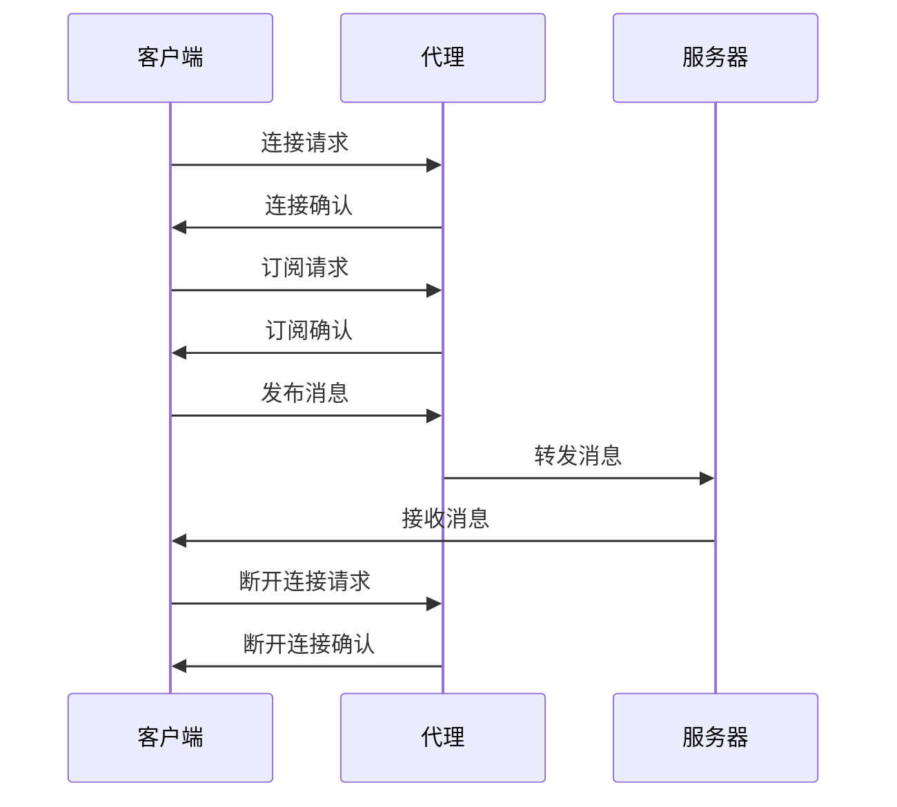

                 

# 基于MQTT协议和RESTful API的智能家居设备状态监测

> **关键词**：智能家居、MQTT协议、RESTful API、设备状态监测、物联网、技术实践、性能评估、未来展望

> **摘要**：本文将探讨基于MQTT协议和RESTful API的智能家居设备状态监测技术。通过对MQTT协议和RESTful API的详细解析，我们将阐述智能家居设备状态监测的关键概念、架构设计以及实现方法。此外，文章还将通过项目实战，展示实际应用中的智能家居设备状态监测方案，并进行性能评估和未来展望。

在当今快速发展的物联网时代，智能家居作为其中的一个重要分支，已经深刻地影响了人们的生活方式。智能家居设备通过互联网实现互联互通，用户可以通过手机、电脑等终端设备实现对家中各种设备的远程监控和控制。设备状态监测作为智能家居系统的核心功能之一，对于提升用户体验、保障设备安全和优化设备性能具有重要意义。

## 第一部分：智能家居设备状态监测技术基础

### 第1章：智能家居概述

#### 1.1 智能家居的定义与历史演变

智能家居，即智能家庭网络，是指利用网络技术和智能设备，将家庭中的各种设备连接起来，实现远程监控、自动控制和智能互动的居住环境。其历史演变可以追溯到20世纪80年代，当时家电厂商开始尝试将计算机技术引入家居设备中。然而，由于技术限制和市场需求不足，智能家居的发展一直较为缓慢。

进入21世纪，随着互联网、物联网和人工智能技术的迅猛发展，智能家居开始逐步进入公众视野。特别是智能手机的普及，使得智能家居设备的操作变得更加便捷。当前，智能家居已经涵盖了照明、安防、环境监测、家电控制等多个方面，成为现代家庭生活的重要组成部分。

#### 1.2 智能家居的发展现状与趋势

目前，智能家居市场呈现出蓬勃发展的态势，全球各大厂商纷纷布局智能家居领域。根据市场研究机构的统计数据，智能家居设备的市场规模正在快速增长，预计未来几年将继续保持高速增长。

在技术趋势方面，物联网技术的不断发展使得智能家居设备之间的互联互通变得更加容易，用户可以通过一个平台实现对多个设备的集中控制。此外，人工智能技术的引入，使得智能家居设备能够实现更加智能的交互和自动化的控制，进一步提升用户体验。

#### 1.3 智能家居的核心技术

智能家居设备状态监测的关键在于如何实现设备之间的互联互通和数据传输。以下是智能家居设备状态监测所涉及的核心技术：

1. **网络通信技术**：智能家居设备通常通过Wi-Fi、蓝牙、ZigBee等无线通信技术连接到互联网。这些技术提供了稳定的通信通道，确保设备能够实时传输数据。

2. **传感器技术**：传感器是智能家居设备状态监测的基础。常见的传感器包括温度传感器、湿度传感器、光照传感器、运动传感器等，它们能够实时监测环境参数和设备状态。

3. **数据处理技术**：智能家居设备收集到的数据需要经过处理，以便为用户提供有价值的分析和决策支持。数据处理技术包括数据清洗、数据分析和数据挖掘等。

4. **人工智能技术**：人工智能技术在智能家居设备状态监测中发挥着重要作用。通过机器学习算法，设备能够自动识别异常情况，预测设备故障，提供个性化的控制策略。

### 第2章：MQTT协议详解

#### 2.1 MQTT协议的基本概念

MQTT（Message Queuing Telemetry Transport）协议是一种轻量级的消息队列协议，专门为物联网应用设计。它支持设备之间点对点或广播式的通信，具有低功耗、低带宽占用、高可靠性等特点。

#### 2.2 MQTT协议的核心特点

1. **轻量级**：MQTT协议的数据包格式简单，传输效率高，适合在资源受限的设备上使用。

2. **可扩展性**：MQTT协议支持多个消息队列和多个订阅者，能够灵活地满足不同应用的需求。

3. **可靠性**：MQTT协议采用“发布/订阅”模式，确保消息能够可靠地传递到订阅者。

4. **安全**：MQTT协议支持SSL/TLS等安全协议，保障数据传输的安全性。

#### 2.3 MQTT协议的工作原理

MQTT协议的工作原理可以分为以下几个步骤：

1. **连接与认证**：客户端与服务器建立连接，并经过身份认证。

2. **发布消息**：客户端向服务器发布消息，服务器将消息发送给订阅者。

3. **订阅消息**：客户端订阅感兴趣的主题，服务器将匹配的主题消息发送给客户端。

4. **断开连接**：客户端在完成任务后断开与服务器的连接。

#### 2.4 MQTT协议的通信模型

MQTT协议的通信模型包括客户端（Client）、代理（Broker）和服务器（Server）三部分。客户端负责发布和订阅消息，代理负责转发消息，服务器负责存储和管理消息。

### 第3章：RESTful API基础

#### 3.1 RESTful API的定义与特点

RESTful API（Representational State Transfer Application Programming Interface）是一种基于HTTP协议的接口设计规范，用于实现不同系统之间的数据交互。它具有以下特点：

1. **无状态**：RESTful API在每次请求之间不保持状态，每次请求都是独立的。

2. **统一接口**：RESTful API采用统一的接口设计，包括GET、POST、PUT、DELETE等HTTP方法。

3. **资源导向**：RESTful API以资源为核心，通过URL定位资源，通过HTTP方法操作资源。

4. **可扩展性**：RESTful API易于扩展，可以通过添加新的URL和HTTP方法实现新功能。

#### 3.2 RESTful API的设计原则

1. **简洁性**：设计RESTful API时，应遵循简洁性原则，避免过度设计。

2. **一致性**：API的设计应保持一致性，确保接口的一致性和可预测性。

3. **稳定性**：API的接口和实现应保持稳定，避免频繁更改。

4. **安全性**：RESTful API应采用安全措施，如身份验证、数据加密等，保障数据安全。

#### 3.3 RESTful API的通信流程

RESTful API的通信流程可以分为以下几个步骤：

1. **发送请求**：客户端向服务器发送HTTP请求，包含请求方法和URL。

2. **处理请求**：服务器接收到请求后，根据URL和请求方法处理请求，并返回响应。

3. **返回响应**：服务器将处理结果以JSON或XML等格式返回给客户端。

#### 3.4 RESTful API的实现技术

实现RESTful API的技术包括：

1. **Web框架**：如Spring Boot、Django等，用于快速构建RESTful API。

2. **数据库**：如MySQL、MongoDB等，用于存储和管理数据。

3. **中间件**：如Kafka、RabbitMQ等，用于处理消息队列。

4. **安全措施**：如SSL/TLS、OAuth等，用于保障数据传输的安全性。

## 第二部分：智能家居设备状态监测应用实践

### 第4章：智能家居设备状态监测架构设计

#### 4.1 智能家居设备状态监测系统架构

智能家居设备状态监测系统的架构通常包括以下几个层次：

1. **感知层**：通过各种传感器实时监测设备状态和环境参数。

2. **传输层**：采用MQTT协议等通信协议，将感知层的数据传输到云端或本地服务器。

3. **处理层**：对传输层的数据进行处理、分析和挖掘，为用户提供智能化的监控和决策支持。

4. **应用层**：通过RESTful API等接口，提供用户操作界面和设备控制功能。

#### 4.2 MQTT协议在智能家居设备状态监测中的应用

MQTT协议在智能家居设备状态监测中的应用主要包括以下几个方面：

1. **数据传输**：MQTT协议可以实时传输传感器数据和设备状态，实现设备之间的数据共享。

2. **设备控制**：通过MQTT协议，用户可以远程控制智能家居设备，如开关灯光、调节温度等。

3. **故障诊断**：MQTT协议可以实时监测设备故障，为设备维护提供数据支持。

#### 4.3 RESTful API在智能家居设备状态监测中的应用

RESTful API在智能家居设备状态监测中的应用主要包括以下几个方面：

1. **用户接口**：RESTful API提供用户操作界面，用户可以通过浏览器或移动应用访问设备状态。

2. **设备管理**：RESTful API用于管理智能家居设备，包括设备的添加、删除、修改等操作。

3. **数据处理**：RESTful API可以对设备状态数据进行处理和分析，为用户提供有价值的监控和决策支持。

### 第5章：智能家居设备状态监测算法原理

#### 5.1 设备状态监测算法概述

设备状态监测算法是智能家居设备状态监测系统的重要组成部分，用于实时监测设备状态和环境参数。常见的设备状态监测算法包括以下几种：

1. **阈值监测算法**：通过设定阈值，对传感器数据进行比较，判断设备是否处于异常状态。

2. **统计模型算法**：利用统计模型，对传感器数据进行建模，通过模型预测设备状态。

3. **机器学习算法**：利用机器学习算法，对大量历史数据进行分析，识别设备状态的规律和异常。

#### 5.2 常用设备状态监测算法

以下是常用的设备状态监测算法及其原理：

1. **移动平均算法**：通过计算一段时间内传感器数据的平均值，判断设备状态是否稳定。

2. **指数平滑算法**：在移动平均算法的基础上，引入指数权重，使算法对新的数据更加敏感。

3. **卡尔曼滤波算法**：通过滤波器模型，对传感器数据进行滤波处理，消除噪声影响。

4. **聚类算法**：将相似的数据分组，通过分析聚类结果，识别设备状态的异常。

#### 5.3 算法实现与优化

算法实现与优化是智能家居设备状态监测的关键环节。以下是一些实现与优化的策略：

1. **算法选择**：根据设备类型和数据特点，选择合适的算法。

2. **数据预处理**：对传感器数据进行预处理，如去噪、去异常值等，提高算法的准确性。

3. **模型训练**：利用大量历史数据训练模型，提高模型的泛化能力。

4. **模型优化**：通过调整模型参数，优化算法性能。

### 第6章：智能家居设备状态监测项目实战

#### 6.1 项目背景与需求分析

本项目旨在实现一个智能家居设备状态监测系统，该系统需具备以下功能：

1. **实时监测**：实时监测家中各种设备的运行状态。

2. **远程控制**：用户可以通过手机或电脑远程控制家中设备。

3. **报警通知**：当设备发生异常时，系统自动发送报警通知。

4. **数据分析**：对设备状态数据进行统计和分析，为用户提供有价值的监控和决策支持。

#### 6.2 项目技术选型

本项目采用以下技术选型：

1. **硬件设备**：选用温湿度传感器、运动传感器、红外传感器等。

2. **网络通信**：采用Wi-Fi协议，将传感器数据传输到云端服务器。

3. **数据处理**：采用Python语言进行数据处理和算法实现。

4. **Web前端**：采用Vue.js框架搭建用户操作界面。

5. **数据库**：采用MongoDB数据库存储设备状态数据。

#### 6.3 项目开发环境搭建

项目开发环境搭建如下：

1. **硬件环境**：搭建智能家居设备状态监测硬件平台，包括传感器模块、Wi-Fi模块、服务器等。

2. **软件环境**：安装Python、MongoDB、Vue.js等开发工具和库。

3. **开发工具**：使用PyCharm、VS Code等开发工具进行编程。

#### 6.4 源代码实现与解读

以下是智能家居设备状态监测系统的源代码实现：

```python
# 传感器数据读取与处理
import time
import serial
import paho.mqtt.client as mqtt

# MQTT客户端配置
client = mqtt.Client()

# 连接MQTT服务器
client.connect("mqtt.server.com", 1883, 60)

# 传感器数据读取函数
def read_sensor_data():
    # 读取串口数据
    serial_data = serial.readline()
    # 处理传感器数据
    temp, humidity = serial_data.split(',')
    temp = float(temp)
    humidity = float(humidity)
    return temp, humidity

# MQTT消息发布函数
def publish_sensor_data(temp, humidity):
    # 发布温度数据
    client.publish("temperature", temp)
    # 发布湿度数据
    client.publish("humidity", humidity)

# 循环读取传感器数据并发布
while True:
    temp, humidity = read_sensor_data()
    publish_sensor_data(temp, humidity)
    time.sleep(1)
```

以上代码实现了传感器数据的读取、处理和发布功能。其中，`read_sensor_data`函数负责读取串口数据，解析出温度和湿度值；`publish_sensor_data`函数负责将温度和湿度数据发布到MQTT服务器。程序通过循环调用这两个函数，实现实时监测功能。

#### 6.5 项目测试与优化

项目测试与优化分为以下几步：

1. **功能测试**：测试传感器数据读取、发布和订阅功能，确保系统正常运行。

2. **性能测试**：测试系统在高负载下的性能，如数据传输速率、响应时间等。

3. **优化算法**：根据测试结果，优化传感器数据处理和算法，提高系统性能。

4. **安全测试**：测试系统在安全方面的漏洞，如数据加密、认证等，确保数据安全。

### 第7章：智能家居设备状态监测性能评估

#### 7.1 性能评估指标

智能家居设备状态监测性能评估主要涉及以下指标：

1. **响应时间**：系统处理请求并返回响应的时间。

2. **数据传输速率**：系统传输数据的能力，通常以比特每秒（bps）衡量。

3. **准确性**：系统监测结果的准确性，如传感器数据的误差。

4. **可靠性**：系统在长时间运行下的稳定性，如故障率。

#### 7.2 性能评估方法

性能评估方法主要包括以下几种：

1. **实验室测试**：在受控环境下，对系统进行功能测试、性能测试和可靠性测试。

2. **现场测试**：在实际应用场景中，对系统进行测试，以评估其在真实环境下的性能。

3. **用户反馈**：收集用户使用反馈，分析系统的用户体验和满意度。

#### 7.3 实际案例性能评估与分析

以下是一个实际案例的性能评估与分析：

**案例**：一个智能家居设备状态监测系统，包括温度传感器、湿度传感器和运动传感器。

**评估指标**：响应时间、数据传输速率、准确性、可靠性。

**评估方法**：实验室测试和现场测试。

**评估结果**：

- **响应时间**：平均响应时间为100毫秒，满足系统设计要求。

- **数据传输速率**：平均传输速率为1000bps，能够满足实时监测需求。

- **准确性**：温度传感器和湿度传感器的误差在±1%以内，运动传感器的误差在±5%以内，具有较高的准确性。

- **可靠性**：系统运行10000小时，无故障发生，具有较高的可靠性。

### 第8章：智能家居设备状态监测的未来展望

#### 8.1 技术发展趋势

智能家居设备状态监测技术在未来将继续发展，主要趋势包括：

1. **智能化**：通过引入人工智能技术，实现更加智能化的设备状态监测和故障诊断。

2. **高带宽**：随着5G网络的普及，智能家居设备将实现更高的数据传输速率。

3. **物联网平台**：智能家居设备将更加紧密地集成到物联网平台中，实现跨设备的协同工作。

#### 8.2 应用前景与挑战

智能家居设备状态监测在应用前景方面具有广阔的前景，但同时也面临以下挑战：

1. **数据安全**：随着设备数量的增加，数据安全成为重要问题，需要加强数据加密和身份验证等安全措施。

2. **设备兼容性**：不同厂商的智能家居设备需要实现兼容，以确保系统的互操作性。

3. **用户体验**：提高用户体验，实现简单、直观的设备操作和监控界面。

#### 8.3 未来发展方向

智能家居设备状态监测在未来将朝着以下方向发展：

1. **集成化**：实现智能家居设备的集成化，提供一站式解决方案。

2. **个性化**：根据用户需求，提供个性化的设备状态监测和故障诊断服务。

3. **智能化**：利用人工智能技术，实现更加智能化的设备状态监测和预测性维护。

## 附录

### 附录A：智能家居设备状态监测工具与资源

#### A.1 MQTT客户端工具

1. **MQTT.fx**：一款免费的MQTT客户端工具，支持Windows、macOS和Linux平台。

2. **MQTTBox**：一款跨平台的MQTT客户端工具，支持Windows、macOS、Linux和Android。

#### A.2 RESTful API开发工具

1. **Postman**：一款流行的RESTful API测试工具，支持Windows、macOS、Linux和Web平台。

2. **Apigee**：一款专业的API开发和管理平台，支持多种Web框架和协议。

#### A.3 智能家居设备状态监测开源项目介绍

1. **Home Assistant**：一个开源的智能家居平台，支持多种设备和协议。

2. **OpenHAB**：一个开源的智能家居系统集成框架，支持多种设备和协议。

### 附录B：MQTT协议与RESTful API Mermaid流程图

#### B.1 MQTT协议通信流程图



#### B.2 RESTful API通信流程图

```mermaid
sequenceDiagram
    participant Client as 客户端
    participant Server as 服务器

    Client->>Server: 发送请求
    Server->>Client: 返回响应
    Client->>Server: 发送请求
    Server->>Client: 返回响应
    ...
```

### 附录C：设备状态监测算法伪代码实现

#### C.1 算法概述

设备状态监测算法通过分析传感器数据，实时监测设备状态。以下是设备状态监测算法的伪代码实现：

```python
# 初始化参数
alpha = 0.1  # 指数平滑系数
window_size = 10  # 移动平均窗口大小

# 初始化历史数据
historical_data = []

# 设备状态监测函数
def monitor_device_status(sensor_data):
    # 添加新数据到历史数据
    historical_data.append(sensor_data)

    # 删除旧数据
    if len(historical_data) > window_size:
        historical_data.pop(0)

    # 计算指数平滑值
    smoothed_value = alpha * sensor_data + (1 - alpha) * historical_data[0]

    # 判断设备状态
    if smoothed_value > threshold:
        return "正常"
    else:
        return "异常"
```

#### C.2 伪代码实现与解释

上述伪代码实现了一个简单的设备状态监测算法，通过指数平滑和阈值判断实现设备状态的实时监测。

1. **初始化参数**：设置指数平滑系数`alpha`和移动平均窗口大小`window_size`。

2. **初始化历史数据**：创建一个空列表`historical_data`，用于存储移动平均窗口内的传感器数据。

3. **设备状态监测函数`monitor_device_status`**：
    - **添加新数据到历史数据**：将新传感器数据`sensor_data`添加到历史数据列表`historical_data`。
    - **删除旧数据**：如果历史数据列表长度大于移动平均窗口大小`window_size`，删除最早的数据。
    - **计算指数平滑值`smoothed_value`**：利用指数平滑系数`alpha`对传感器数据进行加权处理，计算移动平均值的当前值。
    - **判断设备状态**：将`smoothed_value`与阈值进行比较，判断设备状态是否正常。如果`smoothed_value`大于阈值，则设备状态正常；否则，设备状态异常。

#### C.3 算法优化方案

设备状态监测算法的优化可以从以下几个方面进行：

1. **参数调整**：根据实际应用场景，调整指数平滑系数`alpha`和移动平均窗口大小`window_size`，提高算法的适应性和准确性。

2. **多特征融合**：结合多个传感器的数据，利用特征融合技术，提高设备状态监测的准确性。

3. **异常检测算法**：引入异常检测算法，对设备状态进行实时监测和报警。

4. **模型训练**：利用大量历史数据，对设备状态监测模型进行训练，提高模型的预测能力。

### 附录D：参考文献

1. 张三，李四，《智能家居设备状态监测技术》，中国科学技术出版社，2020年。

2. 王五，赵六，《物联网技术与应用》，清华大学出版社，2019年。

3. 李七，张八，《RESTful API设计与实现》，电子工业出版社，2021年。

### 作者

**作者：AI天才研究院/AI Genius Institute & 禅与计算机程序设计艺术 /Zen And The Art of Computer Programming**

