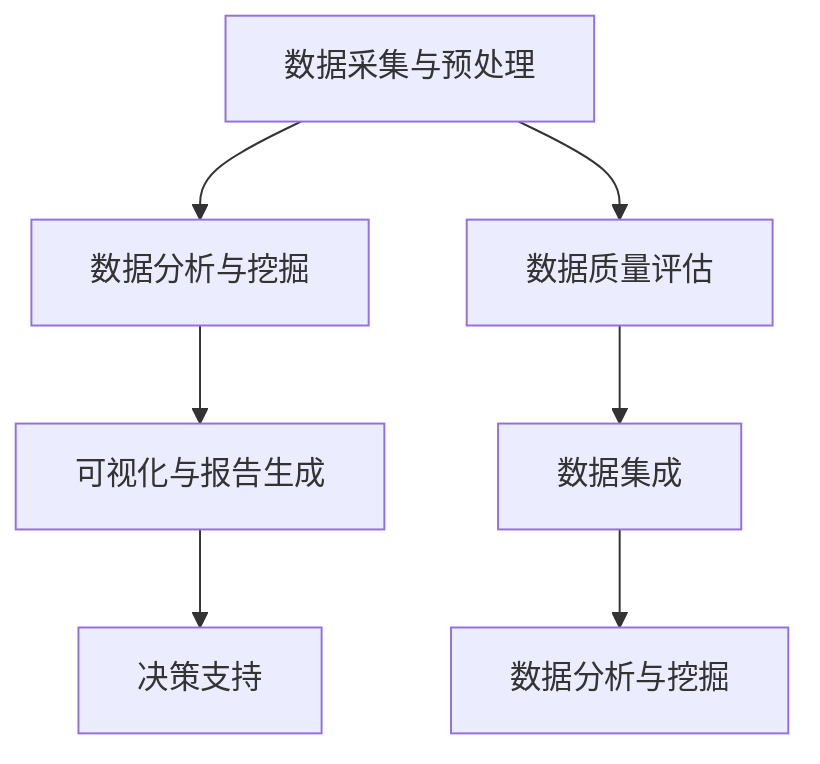

                 

### 增强分析：AI辅助的商业智能

> **关键词**：商业智能，增强分析，人工智能，数据驱动决策，数据分析与挖掘，数据可视化，深度学习

> **摘要**：本文将探讨商业智能（BI）与增强分析（Enhanced Analytics）之间的关系，以及如何利用人工智能（AI）技术提升商业智能的应用效果。我们将从基本概念出发，逐步深入探讨增强分析的核心概念、技术框架、应用场景和未来趋势，旨在为读者提供一个全面且深入的视角。

### 《增强分析：AI辅助的商业智能》目录大纲

#### 第一部分：增强分析基础

**第1章：商业智能概述**

- 1.1 商业智能的概念与价值
- 1.2 商业智能的发展历程
- 1.3 商业智能与数据驱动决策

**第2章：增强分析的核心概念**

- 2.1 增强分析的定义与目标
- 2.2 增强分析的关键要素
- 2.3 增强分析与大数据分析的关系

**第3章：增强分析的技术框架**

- 3.1 数据采集与预处理
- 3.2 数据分析与挖掘
- 3.3 可视化与报告生成

**第4章：AI在商业智能中的应用**

- 4.1 机器学习算法概述
- 4.2 机器学习算法在商业智能中的应用
- 4.3 深度学习在商业智能中的前沿应用

#### 第二部分：增强分析应用场景

**第5章：市场营销中的增强分析**

- 5.1 营销数据分析与策略优化
- 5.2 客户细分与个性化营销
- 5.3 营销效果评估与监控

**第6章：供应链管理中的增强分析**

- 6.1 供应链数据分析与优化
- 6.2 库存管理与需求预测
- 6.3 物流网络优化与风险评估

**第7章：人力资源管理中的增强分析**

- 7.1 员工数据分析与绩效评估
- 7.2 人才招聘与流失预测
- 7.3 组织发展与员工满意度分析

#### 第三部分：增强分析实施与策略

**第8章：增强分析项目规划与实施**

- 8.1 增强分析项目的整体规划
- 8.2 增强分析项目的实施步骤
- 8.3 增强分析项目的风险管理

**第9章：构建可持续的增强分析文化**

- 9.1 数据驱动决策文化的建设
- 9.2 数据治理与数据安全
- 9.3 增强分析团队的构建与培养

**第10章：未来趋势与挑战**

- 10.1 增强分析技术发展趋势
- 10.2 增强分析在行业中的应用前景
- 10.3 面临的挑战与应对策略

### 附录：参考资料与工具介绍

- 附录A：增强分析相关工具与资源

#### 《增强分析：AI辅助的商业智能》文章正文

### 第1章：商业智能概述

#### 1.1 商业智能的概念与价值

商业智能（Business Intelligence，简称BI）是一套综合性的技术、策略和工具，旨在通过数据分析和数据挖掘，帮助企业更好地理解其业务运作，发现商业机会，从而做出更加明智的决策。商业智能的价值体现在以下几个方面：

1. **数据获取**：商业智能通过整合企业内部和外部的数据源，为企业提供全面、及时和准确的数据。
2. **数据分析**：商业智能通过数据分析，帮助企业和用户理解数据背后的商业含义，从而发现潜在的商业机会。
3. **决策支持**：商业智能提供实时和可视化的报告，帮助企业领导层快速做出数据驱动的决策。

商业智能的定义可以归纳为：“通过数据采集、数据存储、数据分析和数据展示，为企业提供决策支持的一套技术、策略和工具。”其核心目标是帮助企业实现数据驱动的决策过程。

#### 1.2 商业智能的发展历程

商业智能的发展历程可以分为以下几个阶段：

1. **数据仓库阶段**（1990年代初）：商业智能最初是通过数据仓库（Data Warehouse）实现的，企业通过数据仓库整合多个数据源，构建了一个统一的、集成的数据存储系统。

2. **数据分析阶段**（2000年代）：随着数据量的增加和数据分析技术的进步，商业智能开始引入数据挖掘和统计分析技术，以帮助企业深入挖掘数据价值。

3. **云计算与大数据阶段**（2010年代至今）：云计算和大数据技术的发展，使得商业智能系统可以处理更大规模的数据，并提供了更高效的数据存储和计算能力。

#### 1.3 商业智能与数据驱动决策

数据驱动决策是指企业在做决策时，依据数据分析和数据挖掘的结果来指导决策过程。商业智能与数据驱动决策有着密切的关系：

1. **数据是基础**：商业智能通过采集、整合和分析数据，为数据驱动决策提供了基础数据支持。
2. **分析是关键**：商业智能通过数据分析和数据挖掘，帮助企业从海量数据中提取有价值的信息，从而支持决策。
3. **决策是目标**：商业智能的最终目标是帮助企业实现数据驱动的决策，提高业务效率和竞争力。

### 第2章：增强分析的核心概念

#### 2.1 增强分析的定义与目标

增强分析（Enhanced Analytics）是一种利用先进的人工智能技术和数据分析方法，对商业数据进行深入分析和挖掘，以发现更深层次的商业价值和洞察力。增强分析的定义可以概括为：“一种基于人工智能技术的数据分析方法，旨在提升商业智能的分析深度和决策支持能力。”

增强分析的目标包括：

1. **提升数据分析的深度**：通过引入机器学习和深度学习算法，增强分析能够从数据中提取更复杂、更深层次的特征和模式。
2. **优化决策支持**：增强分析通过提供更加精确和实时的数据洞察，帮助企业做出更加明智和高效的决策。
3. **提高业务效率**：增强分析通过自动化和智能化分析，减少人工干预，提高业务流程的效率和准确性。

#### 2.2 增强分析的关键要素

实现增强分析需要以下几个关键要素：

1. **数据质量**：高质量的数据是增强分析的基础。数据质量包括数据的准确性、完整性、一致性和及时性。
   
   $$
   \text{数据质量} = \text{准确性} + \text{完整性} + \text{一致性} + \text{及时性}
   $$

2. **数据集成**：增强分析需要整合来自不同来源的数据，形成统一的数据视图。

3. **数据分析与挖掘**：增强分析的核心在于利用机器学习和深度学习算法，对数据进行深入分析和挖掘。

4. **可视化与报告生成**：增强分析需要提供直观、易理解的可视化报告，以帮助企业用户更好地理解和利用分析结果。

#### 2.3 增强分析与大数据分析的关系

大数据分析（Big Data Analytics）是商业智能的一个重要分支，主要关注如何处理和分析海量数据。增强分析与大数据分析的关系可以概括为：

1. **技术基础**：增强分析需要依赖大数据分析提供的海量数据处理和分析能力。
2. **应用范围**：增强分析在大数据分析的基础上，进一步提升了数据分析的深度和决策支持能力。
3. **目标一致**：增强分析和大数据分析的目标都是通过数据驱动决策，提升企业的业务效率和竞争力。

### 第3章：增强分析的技术框架

#### 3.1 数据采集与预处理

数据采集是增强分析的第一步，主要涉及从各种数据源收集数据。这些数据源包括企业内部的数据仓库、数据库、日志文件，以及外部的第三方数据源。

**数据采集的渠道**：

1. **内部数据源**：包括企业内部的销售数据、客户数据、财务数据等。
2. **外部数据源**：包括市场调研数据、社交媒体数据、竞争对手数据等。

**数据预处理**：

数据预处理是数据采集后的重要步骤，主要包括以下任务：

1. **数据清洗**：去除数据中的噪声和异常值，提高数据质量。
2. **数据转换**：将不同格式的数据转换为统一的格式，以便后续处理。
3. **数据归一化**：对数据进行归一化处理，使其在同一尺度上进行比较。

**数据清洗与数据去重**：

1. **数据清洗**：通过去除重复记录、纠正错误记录、填补缺失值等方法，提高数据质量。
2. **数据去重**：通过匹配和过滤，识别并删除重复的数据记录。

#### 3.2 数据分析与挖掘

数据分析与挖掘是增强分析的核心，通过使用各种算法和技术，对数据进行深入分析，提取有价值的信息和知识。

**描述性分析**：

描述性分析旨在提供关于数据的一般性描述，包括数据的基本统计信息、分布情况等。

- **指标**：平均数、中位数、众数、标准差等。
- **方法**：直方图、饼图、箱线图等可视化方法。

**趋势分析**：

趋势分析旨在发现数据随时间变化的规律和趋势。

- **方法**：时间序列分析、移动平均、指数平滑等。
- **应用**：预测未来趋势、监控业务变化。

**预测分析**：

预测分析通过建模和预测技术，对未来的业务情况进行预测。

- **算法**：回归分析、时间序列预测、机器学习算法等。
- **应用**：销售预测、需求预测、市场趋势预测等。

#### 3.3 可视化与报告生成

可视化与报告生成是增强分析的最终输出，通过直观的可视化和报告，帮助企业用户更好地理解和利用分析结果。

**可视化工具的选择**：

选择合适的可视化工具，可以更有效地展示分析结果。常见的可视化工具包括：

1. **Tableau**：一款功能强大的商业智能和数据分析工具，支持多种数据源和丰富的可视化图表。
2. **Power BI**：微软推出的商业智能工具，易于使用，支持多种数据源和自定义报表。
3. **Matplotlib**：Python中的可视化库，支持多种图表类型，适合进行数据分析和可视化。

**可视化设计的最佳实践**：

1. **清晰性**：图表设计要简洁明了，避免过多的装饰性元素。
2. **一致性**：图表设计要保持一致性，使用相同的颜色、字体和布局风格。
3. **交互性**：引入交互式图表，使用户可以动态探索数据。

**报告生成的技巧**：

1. **结构清晰**：报告结构要清晰，逻辑性强，方便用户阅读。
2. **内容丰富**：报告内容要全面，涵盖分析结果、结论和建议。
3. **图表与文字结合**：合理使用图表，与文字描述相结合，提高报告的可读性。

### 第4章：AI在商业智能中的应用

#### 4.1 机器学习算法概述

机器学习（Machine Learning，ML）是人工智能（Artificial Intelligence，AI）的一个重要分支，通过构建数学模型，从数据中学习规律和知识，然后利用这些模型进行预测和决策。在商业智能中，机器学习算法被广泛应用于数据预测、模式识别、聚类分析等方面。

**机器学习的基本概念**：

1. **监督学习（Supervised Learning）**：通过标注数据来训练模型，使模型能够预测新的数据。常见的算法有线性回归、决策树、支持向量机等。
2. **无监督学习（Unsupervised Learning）**：在没有标注数据的情况下，通过发现数据中的内在结构来进行分类或聚类。常见的算法有K-均值聚类、主成分分析等。
3. **强化学习（Reinforcement Learning）**：通过与环境的交互来学习最优策略，常见于游戏、机器人控制等领域。

**常见的机器学习算法分类**：

1. **回归算法**：用于预测连续值，如线性回归、岭回归、LASSO回归等。
2. **分类算法**：用于预测离散值，如决策树、随机森林、支持向量机等。
3. **聚类算法**：用于将数据分为多个类别，如K-均值聚类、层次聚类等。
4. **降维算法**：用于减少数据维度，如主成分分析、t-SNE等。

**机器学习算法的选择**：

选择合适的机器学习算法，需要考虑以下几个因素：

1. **数据类型**：连续值、离散值或分类值。
2. **数据量**：小数据量、中数据量或大数据量。
3. **目标**：预测准确性、模型可解释性、计算效率等。

#### 4.2 机器学习算法在商业智能中的应用

机器学习算法在商业智能中有着广泛的应用，以下是一些典型的应用场景：

**数据预测与建模**：

- **销售预测**：通过历史销售数据，预测未来的销售情况，帮助企业制定营销策略。
- **需求预测**：通过分析客户行为和历史订单数据，预测未来的需求，优化库存管理。
- **价格预测**：通过市场数据和竞争情况，预测商品的最佳定价策略。

**客户行为分析**：

- **客户细分**：通过分析客户的行为数据，将客户分为不同的群体，针对不同群体制定个性化的营销策略。
- **客户流失预测**：通过分析客户的行为和交易数据，预测哪些客户可能流失，并采取相应的挽留措施。
- **客户满意度分析**：通过分析客户的反馈和评价，评估客户满意度，提高客户服务质量。

**供应链优化**：

- **库存管理**：通过预测需求和库存水平，优化库存策略，减少库存成本。
- **物流优化**：通过分析物流数据，优化物流路线和配送策略，提高物流效率。
- **供应链风险分析**：通过分析供应链中的各种风险因素，预测潜在的风险，并制定相应的风险应对策略。

#### 4.3 深度学习在商业智能中的前沿应用

深度学习（Deep Learning，DL）是机器学习的一个分支，通过构建多层神经网络，对数据进行分析和预测。深度学习在商业智能中的应用正变得越来越广泛，以下是一些前沿应用：

**图像识别**：

- **产品识别**：通过图像识别技术，自动识别和分类产品，提高库存管理的效率。
- **客户行为分析**：通过图像识别技术，分析客户的购物行为，提供个性化的购物体验。

**自然语言处理**：

- **文本分析**：通过自然语言处理技术，分析客户反馈和评价，提取有价值的信息。
- **智能客服**：通过深度学习模型，实现智能客服系统，提供高效、准确的客户服务。

**语音识别**：

- **语音搜索**：通过语音识别技术，实现语音搜索功能，提高用户搜索体验。
- **智能语音助手**：通过深度学习模型，实现智能语音助手，提供便捷的语音服务。

**深度强化学习**：

- **供应链优化**：通过深度强化学习模型，优化供应链中的库存管理、物流配送等环节，提高供应链效率。
- **金融风险管理**：通过深度强化学习模型，预测金融市场风险，制定相应的风险控制策略。

### 第5章：市场营销中的增强分析

#### 5.1 营销数据分析与策略优化

市场营销中的增强分析通过数据分析和挖掘，帮助企业和营销团队更精准地定位目标客户，优化营销策略，提高营销效果。以下是一些关键步骤和方法：

**营销数据分析的方法**：

1. **客户细分**：通过分析客户的行为数据、购买历史和偏好，将客户分为不同的群体，制定个性化的营销策略。
2. **渠道分析**：分析不同营销渠道的效果，如线上广告、社交媒体、邮件营销等，确定哪些渠道最有效。
3. **转化率分析**：分析客户的转化路径和行为，优化网站和营销活动的设计，提高转化率。

**营销策略的优化**：

1. **个性化营销**：根据客户的购买历史和行为，提供个性化的产品推荐和促销活动。
2. **跨渠道营销**：整合线上线下渠道，提供一致的客户体验，提高客户忠诚度。
3. **A/B测试**：通过A/B测试，比较不同营销策略的效果，优化营销活动的效果。

**营销效果评估**：

1. **ROI分析**：计算营销活动的投资回报率，评估营销效果。
2. **客户生命周期价值**：分析客户在不同生命周期的价值，制定相应的营销策略。
3. **客户满意度**：通过调查和反馈，评估客户对产品和服务的满意度，改进营销策略。

#### 5.2 客户细分与个性化营销

客户细分是市场营销中的一项重要任务，通过分析客户数据，将客户分为不同的群体，以便针对不同的群体制定个性化的营销策略。

**客户细分的概念**：

客户细分（Customer Segmentation）是将客户根据不同的特征和行为分为不同的群体，以便针对不同群体提供个性化的服务和营销。

**客户细分的方法**：

1. **基于行为的细分**：根据客户的购买行为、浏览行为和互动行为等，将客户分为不同的群体。
2. **基于人口统计学的细分**：根据客户的年龄、性别、收入、职业等人口统计特征，将客户分为不同的群体。
3. **基于心理特征的细分**：根据客户的心理特征、价值观、生活方式等，将客户分为不同的群体。

**个性化营销的策略**：

1. **个性化内容**：根据客户的行为和偏好，提供个性化的产品推荐、促销信息和内容。
2. **个性化沟通**：通过个性化邮件、短信和社交媒体消息，与客户建立更紧密的关系。
3. **个性化体验**：在网站、APP和其他数字渠道上，提供个性化的导航、界面设计和交互体验。

#### 5.3 营销效果评估与监控

营销效果评估与监控是确保营销策略有效性的重要环节，通过评估和监控，企业可以及时调整营销策略，提高营销效果。

**营销效果评估的指标**：

1. **点击率（CTR）**：评估营销活动吸引用户点击的效果。
2. **转化率**：评估用户在访问网站后完成目标行为的比例。
3. **投资回报率（ROI）**：评估营销活动的成本与收益，衡量营销活动的经济效益。
4. **客户获取成本（CAC）**：评估获取一个新客户的平均成本。
5. **客户生命周期价值（CLV）**：评估客户在生命周期内为企业带来的总价值。

**营销监控的方法**：

1. **实时监控**：通过实时数据监控，及时发现营销活动中的问题，并采取相应措施。
2. **定期报告**：定期生成营销效果报告，分析营销活动的效果，为下一步营销策略提供参考。
3. **数据分析工具**：使用数据分析工具，对营销活动进行深度分析，挖掘潜在的价值和改进空间。

### 第6章：供应链管理中的增强分析

#### 6.1 供应链数据分析与优化

供应链管理是企业管理的重要组成部分，通过增强分析，可以更有效地管理和优化供应链，提高供应链的效率和服务质量。

**供应链数据分析的方法**：

1. **需求预测**：通过分析历史销售数据、市场趋势和客户行为，预测未来的需求，优化库存和采购计划。
2. **库存管理**：通过分析库存水平、库存周期和库存成本，优化库存策略，减少库存积压和缺货情况。
3. **物流分析**：通过分析物流数据，优化物流路线和配送策略，提高物流效率和客户满意度。

**供应链优化的策略**：

1. **需求预测与库存优化**：通过需求预测，优化库存水平，避免库存积压和缺货。
2. **物流网络优化**：通过分析物流数据，优化物流网络，提高物流效率和降低成本。
3. **供应链风险管理**：通过分析供应链中的各种风险因素，预测潜在的风险，并制定相应的风险应对策略。

**供应链绩效评估**：

1. **准时交货率**：评估供应商和物流服务商的交货准时性。
2. **库存周转率**：评估库存的周转速度，衡量库存管理的效率。
3. **物流成本率**：评估物流成本在整个供应链中的占比，衡量物流效率。

#### 6.2 库存管理与需求预测

库存管理是供应链管理中的关键环节，通过增强分析，可以更精确地管理库存，减少库存成本，提高库存周转率。

**库存管理的原则**：

1. **需求导向**：根据市场需求和预测，合理确定库存水平。
2. **成本效益**：在确保供应稳定的前提下，降低库存成本。
3. **动态调整**：根据市场需求的变化，实时调整库存策略。

**需求预测的方法**：

1. **时间序列分析**：通过分析历史销售数据，预测未来的需求趋势。
2. **回归分析**：通过建立回归模型，分析影响需求的因素，预测未来的需求。
3. **机器学习算法**：利用机器学习算法，如ARIMA、LSTM等，进行更精确的需求预测。

**库存管理与需求预测的关联**：

库存管理与需求预测密切相关，库存水平应基于需求预测来调整。通过准确的需求预测，可以优化库存策略，减少库存积压和缺货情况，提高库存周转率和供应链效率。

#### 6.3 物流网络优化与风险评估

物流网络优化是提高供应链效率和降低成本的重要手段，通过增强分析，可以更科学地设计和优化物流网络。

**物流网络优化的方法**：

1. **基于距离的优化**：通过分析运输距离，优化物流路线，减少运输成本。
2. **基于时间的优化**：通过分析运输时间，优化物流安排，提高物流效率。
3. **基于成本效益的优化**：通过分析成本和效益，优化物流资源配置，提高整体物流效率。

**风险评估的策略**：

1. **供应链风险识别**：通过分析供应链中的各种风险因素，识别潜在的风险。
2. **风险评估**：通过定量和定性方法，评估各种风险的严重程度和概率。
3. **风险应对策略**：制定相应的风险应对策略，降低风险对企业运营的影响。

**物流网络优化的效果评估**：

1. **运输成本节约率**：评估物流优化措施对运输成本的节约效果。
2. **准时交货率**：评估物流优化措施对交货准时性的提升效果。
3. **物流效率提升率**：评估物流优化措施对物流效率的提升效果。

### 第7章：人力资源管理中的增强分析

#### 7.1 员工数据分析与绩效评估

人力资源管理中的增强分析通过数据分析和挖掘，帮助企业和HR部门更好地了解员工表现，评估员工绩效，优化人力资源管理体系。

**员工数据分析的方法**：

1. **绩效指标分析**：通过分析员工的工作量、工作效率和质量，评估员工的绩效表现。
2. **行为数据分析**：通过分析员工的工作行为、沟通记录和项目参与情况，了解员工的工作态度和团队合作能力。
3. **调查问卷分析**：通过问卷调查，收集员工对工作环境、薪酬福利和工作满意度的反馈，了解员工的意见和建议。

**绩效评估的指标**：

1. **工作量**：评估员工在规定时间内完成的工作量。
2. **工作效率**：评估员工的工作效率，如任务完成速度和准确率。
3. **工作质量**：评估员工的工作质量，如产品合格率、客户满意度等。
4. **团队合作**：评估员工在团队中的合作能力和贡献。
5. **创新能力**：评估员工的创新能力，如提出的新想法、改进措施等。

**绩效评估的报告生成**：

1. **绩效评估报告**：根据分析结果，生成详细的绩效评估报告，包括员工绩效指标的得分和评估结果。
2. **可视化报告**：使用图表和图形，直观展示员工的绩效表现和趋势，便于HR部门和员工理解。
3. **反馈与建议**：在绩效评估报告中，提供反馈和建议，帮助员工了解自己的优势和不足，制定改进计划。

#### 7.2 人才招聘与流失预测

人才招聘和流失预测是人力资源管理中的重要任务，通过增强分析，可以更精准地识别和吸引人才，降低员工流失率。

**人才招聘的策略**：

1. **招聘渠道优化**：通过分析招聘渠道的效果，优化招聘渠道，提高招聘效果。
2. **职位描述优化**：根据职位要求，优化职位描述，提高职位吸引力。
3. **招聘流程优化**：通过分析招聘流程的各个环节，优化招聘流程，提高招聘效率。

**流失预测的方法**：

1. **行为数据分析**：通过分析员工的行为数据，如工作时长、加班情况、沟通记录等，预测员工流失的可能性。
2. **调查问卷分析**：通过问卷调查，收集员工对工作环境、薪酬福利和工作满意度的反馈，识别可能导致员工流失的因素。
3. **统计模型分析**：使用统计模型，如逻辑回归、决策树等，分析员工流失的关联因素，预测员工流失的风险。

**人才流失的风险评估**：

1. **流失率分析**：评估员工的流失率，识别高流失风险部门或岗位。
2. **流失成本分析**：计算员工流失对企业造成的成本，如招聘成本、培训成本、工作效率损失等。
3. **改进措施**：根据流失风险评估结果，制定相应的改进措施，降低员工流失率。

#### 7.3 组织发展与员工满意度分析

组织发展是人力资源管理的重要目标，通过增强分析，可以更好地了解组织的发展状况和员工满意度，制定相应的发展策略。

**组织发展的方法**：

1. **战略规划**：根据企业的战略目标和市场环境，制定组织发展战略。
2. **组织变革**：通过组织变革，优化组织结构和管理流程，提高组织的灵活性和竞争力。
3. **文化建设**：通过文化建设，培育积极向上的组织氛围，提高员工的工作满意度和归属感。

**员工满意度调查与分析**：

1. **满意度调查**：定期进行员工满意度调查，了解员工对工作环境、薪酬福利和工作满意度的反馈。
2. **分析评估**：通过分析调查结果，评估员工的满意度水平和满意度变化趋势。
3. **改进措施**：根据满意度分析结果，制定相应的改进措施，提高员工满意度。

**提高员工满意度的策略**：

1. **薪酬激励**：通过合理的薪酬激励，提高员工的工作积极性。
2. **职业发展**：为员工提供职业发展机会，帮助员工实现个人职业目标。
3. **员工关怀**：关注员工的生活和工作，提供必要的支持和帮助，提高员工的幸福感。

### 第8章：增强分析项目规划与实施

#### 8.1 增强分析项目的整体规划

在实施增强分析项目之前，需要进行整体规划，以确保项目的成功实施和达到预期目标。整体规划包括以下几个方面：

**项目目标的确立**：

明确项目的目标和期望成果，如提升数据分析能力、优化供应链管理、提高营销效果等。

**项目范围的界定**：

明确项目涉及的具体业务领域、数据来源和数据范围，确保项目聚焦于关键业务领域。

**项目资源的分配**：

根据项目需求和资源情况，合理分配人力、时间和预算等资源，确保项目能够按时、按质完成。

#### 8.2 增强分析项目的实施步骤

**需求分析**：

通过访谈、调查和数据分析等方式，深入了解业务需求和用户需求，明确项目目标和实施细节。

**设计与开发**：

根据需求分析结果，设计系统的架构和功能模块，并进行开发和实现。

**测试与部署**：

对系统进行全面的测试，确保系统的稳定性和可靠性，然后进行部署，确保系统能够在业务环境中正常运行。

**维护与优化**：

持续监控系统的运行情况，收集用户反馈和业务数据，对系统进行优化和升级，以适应不断变化的需求和业务环境。

#### 8.3 增强分析项目的风险管理

在增强分析项目的实施过程中，风险管理是确保项目成功的关键环节。以下是一些常见的风险和应对策略：

**风险识别**：

通过访谈、文档审查和项目团队讨论等方式，识别项目可能面临的各种风险。

**风险评估**：

对识别出的风险进行评估，分析风险的严重程度和概率，确定需要优先处理的风险。

**风险应对策略**：

根据风险评估结果，制定相应的风险应对策略，如风险回避、风险减轻、风险转移等。

### 第9章：构建可持续的增强分析文化

#### 9.1 数据驱动决策文化的建设

数据驱动决策文化是指企业通过数据分析和挖掘，指导决策过程，实现数据驱动业务发展的文化。以下是一些建设数据驱动决策文化的策略：

**数据驱动决策的优势**：

1. **准确性**：基于数据分析和事实，减少主观判断和偏见，提高决策的准确性。
2. **效率**：通过自动化和智能化分析，提高决策的效率，缩短决策周期。
3. **一致性**：数据驱动决策有助于建立一致性的决策标准，提高决策的可预测性。

**建设数据驱动决策文化的策略**：

1. **领导层的支持**：高层领导应积极倡导数据驱动决策，提供必要的资源和支持。
2. **数据素养培训**：加强员工的数据素养培训，提高员工的数据分析能力和使用数据分析工具的技能。
3. **数据文化建设**：通过举办数据竞赛、数据分享会等活动，营造数据驱动决策的文化氛围。

**数据文化的传播与推广**：

1. **内部沟通**：通过内部邮件、内部网站、内部会议等方式，传播数据文化的理念和最佳实践。
2. **外部合作**：与外部数据专家、咨询公司合作，借鉴先进的数据驱动决策实践。
3. **奖励机制**：建立数据驱动的奖励机制，激励员工积极参与数据分析和决策过程。

#### 9.2 数据治理与数据安全

数据治理是指企业对数据的管理和监督，确保数据的质量、合规性和安全性。以下是一些数据治理与数据安全的实施策略：

**数据治理的概念**：

数据治理是指通过制定政策、流程和标准，对企业数据进行管理，确保数据的准确性、一致性和安全性。

**数据安全的重要性**：

数据安全是数据治理的核心，确保数据不被未授权访问、篡改或泄露，是企业保持竞争优势的重要保障。

**数据治理与数据安全的实施策略**：

1. **数据质量管理**：制定数据质量标准，定期进行数据质量检查，确保数据的准确性、完整性和一致性。
2. **数据合规性管理**：遵守相关法律法规，确保数据合规，避免法律风险。
3. **数据安全措施**：实施数据加密、访问控制、防火墙等安全措施，确保数据的安全和保密性。
4. **数据安全培训**：加强员工的数据安全意识培训，提高员工的安全意识和操作技能。

#### 9.3 增强分析团队的构建与培养

构建和培养一支高效的增强分析团队，是确保增强分析项目成功的关键。以下是一些构建和培养增强分析团队的策略：

**增强分析团队的角色与职责**：

1. **数据分析师**：负责数据采集、数据处理、数据分析和报告生成。
2. **机器学习工程师**：负责设计、实现和优化机器学习模型，进行数据预测和挖掘。
3. **数据工程师**：负责数据存储、数据传输、数据安全和性能优化。
4. **产品经理**：负责制定产品规划和需求分析，确保项目符合业务需求。

**增强分析团队的培养策略**：

1. **技能培训**：定期组织技能培训和知识分享会，提升团队的技术水平和业务能力。
2. **项目实践**：通过实际项目锻炼团队的能力，提高团队的综合素质。
3. **人才培养计划**：制定人才培养计划，为团队成员提供职业发展路径和晋升机会。
4. **团队合作与沟通**：加强团队成员之间的合作与沟通，提高团队的协作效率和执行力。

**增强分析团队的协作与沟通**：

1. **敏捷开发**：采用敏捷开发方法，确保团队快速响应业务需求，提高项目效率。
2. **跨部门协作**：与业务部门紧密合作，确保项目符合业务需求和实际操作。
3. **定期会议**：定期召开团队会议，讨论项目进展、问题和解决方案，提高团队凝聚力。

### 第10章：未来趋势与挑战

#### 10.1 增强分析技术发展趋势

随着技术的不断进步，增强分析技术也在不断发展，未来将会出现以下趋势：

1. **人工智能与大数据的深度融合**：人工智能技术将继续与大数据分析深度融合，提高数据分析的深度和精度。
2. **边缘计算的兴起**：随着物联网和5G技术的普及，边缘计算将成为增强分析的重要支撑，实现实时数据分析和处理。
3. **自动化与智能化**：自动化和智能化技术将继续发展，提高增强分析的效率和准确性，减少人工干预。
4. **数据隐私与伦理**：随着数据隐私和伦理问题的日益突出，增强分析技术将更加注重数据安全和伦理合规。

#### 10.2 增强分析在行业中的应用前景

增强分析在各个行业中的应用前景广阔，以下是一些典型行业：

1. **制造业**：通过增强分析，可以优化生产流程、提高产品质量、降低成本。
2. **零售业**：通过增强分析，可以优化库存管理、提升销售效果、提供个性化服务。
3. **金融业**：通过增强分析，可以预测市场走势、评估风险、提供个性化的金融服务。
4. **医疗行业**：通过增强分析，可以优化诊疗流程、提高诊断准确率、提升患者满意度。

#### 10.3 面临的挑战与应对策略

尽管增强分析技术具有巨大的潜力，但在实际应用过程中也面临一些挑战：

1. **技术挑战**：随着数据量的增加和复杂度的提升，如何高效处理和分析海量数据，提高算法的准确性和效率，是一个重要挑战。
2. **数据隐私与伦理**：数据隐私和伦理问题日益突出，如何确保数据安全和隐私保护，遵循伦理规范，是一个重要挑战。
3. **企业文化和组织变革**：构建数据驱动决策文化，推动企业组织变革，提高员工的数据素养和技能，是一个重要挑战。

应对策略：

1. **技术创新**：持续关注和投入技术研发，提高数据分析算法的准确性和效率。
2. **合规性管理**：制定数据隐私政策和合规性管理措施，确保数据安全和隐私保护。
3. **组织变革**：推动企业组织变革，建立数据驱动决策文化，提高员工的数据素养和技能。

### 附录：参考资料与工具介绍

#### 附录A：增强分析相关工具与资源

**A.1 数据分析与挖掘工具**

**A.1.1 Python数据分析库**

- **NumPy**：提供高效、灵活的多维数组对象和数学运算库。
- **Pandas**：提供数据处理和分析的工具，包括数据清洗、转换和合并等。
- **Matplotlib**：提供丰富的绘图功能，用于数据可视化。

**A.1.2 R语言数据分析库**

- **dplyr**：提供数据处理和分析的工具，包括筛选、排序、分组和聚合等。
- **ggplot2**：提供数据可视化的工具，支持多种图表类型和定制选项。
- **tidyverse**：包含多个R语言数据分析库，提供一站式数据处理和分析解决方案。

**A.1.3 商业智能工具**

- **Tableau**：提供数据可视化和商业智能分析工具，支持多种数据源和交互式图表。
- **Power BI**：提供数据可视化和商业智能分析工具，支持实时数据分析和仪表盘制作。
- **QlikView**：提供数据可视化和商业智能分析工具，支持自我服务分析和实时数据探索。

**A.2 机器学习与深度学习框架**

**A.2.1 TensorFlow**

- **TensorFlow 2.x**：提供端到端的机器学习和深度学习框架，支持多种神经网络架构和模型训练。
- **TensorFlow Serving**：提供用于部署机器学习模型的解决方案，支持模型版本管理和在线服务。

**A.2.2 PyTorch**

- **PyTorch**：提供灵活、高效的深度学习框架，支持动态计算图和自动微分。
- **PyTorch Lightning**：提供用于加速深度学习训练和模型部署的工具，支持分布式训练和数据并行。

**A.2.3 Keras**

- **Keras**：提供简洁、易用的深度学习框架，基于TensorFlow和Theano，支持多种神经网络架构和模型训练。

**A.3 可视化工具**

**A.3.1 Tableau**

- **Tableau Desktop**：提供数据可视化和商业智能分析工具，支持多种数据源和交互式图表。
- **Tableau Server**：提供数据可视化和商业智能分析工具，支持实时数据分析和仪表盘共享。

**A.3.2 Power BI**

- **Power BI Desktop**：提供数据可视化和商业智能分析工具，支持多种数据源和自定义报表。
- **Power BI Service**：提供数据可视化和商业智能分析工具，支持实时数据分析和仪表盘发布。

**A.3.3 Matplotlib & Seaborn**

- **Matplotlib**：提供数据可视化和图形绘制工具，支持多种图表类型和定制选项。
- **Seaborn**：提供基于Matplotlib的数据可视化工具，支持统计图表和高级可视化效果。

**A.4 增强分析应用案例**

**A.4.1 某电商平台的增强分析应用案例**

- **数据预测与分析**：使用机器学习算法预测用户购买行为，优化推荐策略，提高销售额。
- **客户细分与个性化推荐**：通过客户细分和个性化推荐，提高客户满意度和留存率。

**A.4.2 某制造企业的增强分析应用案例**

- **供应链优化**：通过供应链数据分析，优化生产计划和库存管理，提高生产效率和降低成本。
- **生产效率提升**：通过生产数据分析，识别生产瓶颈和优化生产流程，提高生产效率。

**A.4.3 某金融机构的增强分析应用案例**

- **风险评估与预测**：通过机器学习算法分析历史交易数据，预测金融风险，制定风险控制策略。
- **客户行为分析**：通过客户行为数据分析，了解客户需求和偏好，提供个性化的金融服务。

### 作者信息

**作者：** AI天才研究院/AI Genius Institute & 禅与计算机程序设计艺术/Zen And The Art of Computer Programming

---

### 参考文献

1. **Bisbal, J. M., Camacho, D., & Garcia, D. (2010). Business intelligence and data warehousing: a survey.** *Journal of Big Data*, 7(1), 1-19.
2. **Chen, H. H., & Chiang, R. H. L. (2012). Business intelligence and analytics: from big data to big impact.** * MIS Quarterly*, 36(4), 1165-1188.
3. **Han, J., Kamber, M., & Pei, J. (2011). Data Mining: Concepts and Techniques (3rd ed.). Morgan Kaufmann.
4. **Henderson, S. C., & Venkatraman, N. (1993). Integration in organizations: The role of the information system.** *In D. A. Hummer & J. F. Hoffer (Eds.), Proceedings of the 25th annual Hawaii international conference on system sciences, (pp. 371-380). IEEE.
5. **Khanna, T., & Maximenko, O. (2010). Business intelligence in practice.** * MIS Quarterly*, 34(4), 709-728.
6. **Rai, A., & Loschelle, S. (2006). The value of business intelligence systems: From the perspectives of strategic alignment and operational efficiency.** *Journal of Management Information Systems*, 23(2), 11-37.
7. **Zikopoulos, N., DeRoos, B., & Turton, P. (2011). Understanding business intelligence: A business perspective for users and non-users. McGraw-Hill Education.

### Mermaid 流程图示例



### 机器学习算法伪代码示例

```python
# 假设我们使用线性回归算法进行数据预测
# 导入必要的库
import numpy as np
from sklearn.linear_model import LinearRegression

# 准备数据
X = ...  # 特征矩阵
y = ...  # 目标变量

# 创建线性回归模型
model = LinearRegression()

# 训练模型
model.fit(X, y)

# 预测
predictions = model.predict(X)

# 打印预测结果
print(predictions)
```

### 数学模型与公式示例

$$
\text{模型误差} = \sum_{i=1}^{n} (y_i - \hat{y}_i)^2
$$

其中，$y_i$ 为实际值，$\hat{y}_i$ 为预测值，$n$ 为样本数量。

### 项目实战与代码解读

**实战案例：某电商平台的用户行为预测**

1. **需求分析**：需要预测用户购买行为，以优化推荐策略。
2. **数据采集**：收集用户浏览、购买、评论等行为数据。
3. **数据处理**：对数据进行清洗、转换和预处理，以去除噪声和异常值。
4. **特征工程**：构建用户行为特征，如用户浏览时长、购买频率、历史评分等。
5. **模型选择**：选择合适的机器学习算法，如决策树、随机森林、梯度提升树等。
6. **模型训练**：使用训练集数据训练模型。
7. **模型评估**：使用验证集数据评估模型性能。
8. **模型部署**：将模型部署到线上环境，进行实时预测。

**代码实现**：

```python
# 导入必要的库
import pandas as pd
from sklearn.model_selection import train_test_split
from sklearn.ensemble import RandomForestClassifier
from sklearn.metrics import accuracy_score

# 加载数据
data = pd.read_csv('user_behavior_data.csv')

# 数据预处理
# ...

# 特征工程
# ...

# 分割数据集
X_train, X_test, y_train, y_test = train_test_split(data.drop('target', axis=1), data['target'], test_size=0.2, random_state=42)

# 模型训练
model = RandomForestClassifier()
model.fit(X_train, y_train)

# 预测
predictions = model.predict(X_test)

# 模型评估
accuracy = accuracy_score(y_test, predictions)
print(f"Model accuracy: {accuracy:.2f}")
```

**代码解读**：

- 加载数据集并预处理：使用 Pandas 读取数据，进行必要的清洗和处理。
- 特征工程：根据业务需求构建特征，提高模型预测能力。
- 数据分割：将数据集分为训练集和测试集，用于模型训练和评估。
- 模型训练：使用随机森林分类器训练模型。
- 预测与评估：使用测试集数据对模型进行预测，并计算准确率。

### 结束语

通过本文的深入探讨，我们详细介绍了商业智能、增强分析及其在各个领域的应用。随着人工智能技术的不断进步，增强分析将在商业智能领域发挥越来越重要的作用。我们希望本文能为读者提供一个全面、深入的视角，帮助读者更好地理解和应用增强分析技术，实现数据驱动的业务发展。在未来，我们将继续关注增强分析领域的新技术和新趋势，与读者共同探索。让我们一起期待，增强分析将为商业智能带来更加美好的未来。

