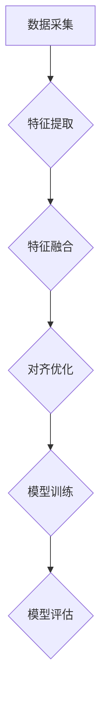
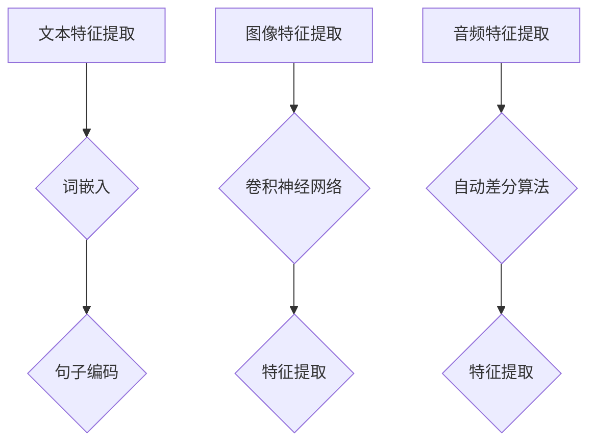

                 

# 大模型在推荐系统中的多模态对齐应用

## 概述

> **关键词：** 多模态对齐、大模型、推荐系统、特征提取、深度学习

随着互联网和智能设备的普及，推荐系统在广告、电子商务、社交媒体等领域发挥着至关重要的作用。然而，传统的推荐系统往往依赖于单一模态的数据，如文本、图像或语音，难以充分利用用户的多维度信息。为了提升推荐系统的性能和用户体验，多模态对齐技术应运而生。

本文旨在探讨大模型在推荐系统中的多模态对齐应用。首先，我们将介绍多模态数据的基本概念和优势，接着讨论推荐系统的挑战和需求。随后，我们将深入讲解大模型的基础理论和多模态对齐的概念。在此基础上，本文将详细介绍多模态对齐算法的原理、实现和优化，并探讨其实际应用场景。

最后，本文将通过一个实际项目，展示大模型在多模态对齐中的具体应用，并对其效果进行评估和总结。希望通过本文，读者能够对多模态对齐在大模型推荐系统中的应用有一个全面而深入的理解。

## 目录大纲

### 第一部分：多模态对齐基础理论

1. **多模态数据概述**
   - 1.1 多模态数据的定义
   - 1.2 多模态数据类型
   - 1.3 多模态数据的优势

2. **推荐系统概述**
   - 2.1 推荐系统的基本概念
   - 2.2 推荐系统的分类
   - 2.3 推荐系统的挑战

3. **大模型基础理论**
   - 3.1 大模型的发展历程
   - 3.2 大模型的分类
   - 3.3 大模型的优势

4. **多模态对齐概念介绍**
   - 4.1 多模态对齐的定义
   - 4.2 多模态对齐的方法
   - 4.3 多模态对齐的重要性

### 第二部分：多模态对齐算法

1. **多模态对齐算法原理**
   - 2.1 多模态对齐的流程
   - 2.2 多模态特征提取
   - 2.3 多模态特征融合

2. **多模态对齐算法实现**
   - 2.1 深度学习框架介绍
   - 2.2 伪代码实现
   - 2.3 实例分析

3. **多模态对齐算法优化**
   - 2.1 损失函数优化
   - 2.2 模型优化策略
   - 2.3 实际应用效果评估

4. **多模态对齐算法应用场景**
   - 2.1 推荐系统中的应用
   - 2.2 图像识别中的应用
   - 2.3 语音识别中的应用

### 第三部分：多模态对齐项目实战

1. **项目背景与目标**
   - 3.1 项目背景介绍
   - 3.2 项目目标设定

2. **数据收集与预处理**
   - 3.2.1 数据来源
   - 3.2.2 数据预处理方法
   - 3.2.3 数据集划分

3. **模型搭建与训练**
   - 3.3.1 模型架构设计
   - 3.3.2 模型训练策略
   - 3.3.3 模型参数调优

4. **模型评估与优化**
   - 3.4.1 模型评估指标
   - 3.4.2 模型优化方法
   - 3.4.3 评估结果分析

5. **项目总结与展望**
   - 3.5.1 项目总结
   - 3.5.2 未来展望
   - 3.5.3 技术发展趋势

### 附录

- 附录A：多模态对齐工具与资源
- 附录B：数学公式和算法流程图

## 摘要

本文旨在探讨大模型在推荐系统中的多模态对齐应用。首先，我们介绍了多模态数据的基本概念和优势，分析了推荐系统的基本概念、分类和挑战。接着，我们探讨了大模型的发展历程、分类和优势，以及多模态对齐的概念和重要性。

在第二部分，我们详细阐述了多模态对齐算法的原理，包括多模态对齐的流程、特征提取和特征融合方法。随后，我们介绍了多模态对齐算法的实现和优化策略，并探讨了其在推荐系统、图像识别和语音识别等领域的应用。

第三部分通过一个实际项目，展示了大模型在多模态对齐中的具体应用，包括数据收集与预处理、模型搭建与训练、模型评估与优化等步骤。最后，我们对项目进行了总结，并对多模态对齐技术未来的发展趋势进行了展望。

通过本文，读者将能够深入了解大模型在推荐系统中的多模态对齐应用，为相关领域的研究和实践提供参考和启示。## 第一部分：多模态对齐基础理论

### 1.1 多模态数据概述

#### 1.1.1 多模态数据的定义

多模态数据是指同时包含两种或两种以上不同类型数据的数据集合，这些数据类型可以是文本、图像、音频、视频等。多模态数据的关键特点在于其能够通过整合不同模态的信息，实现对数据内容的更全面和深入的描述。

例如，在推荐系统中，用户的行为数据通常包含文本（如用户评价）、图像（如用户上传的图片）和音频（如用户听的歌曲）。通过整合这些多模态数据，推荐系统可以更准确地了解用户的需求和偏好，从而提供更个性化的推荐结果。

#### 1.1.2 多模态数据类型

常见的多模态数据类型包括：

- **文本**：如用户的评论、日志、社交动态等。
- **图像**：如用户的照片、商品图片、场景图像等。
- **音频**：如用户的语音、音乐、讲座等。
- **视频**：如用户的视频播放记录、短视频、直播等。
- **传感器数据**：如用户的位置信息、心率、体温等生理信号。

这些不同类型的数据可以单独使用，也可以通过多模态融合的方式共同作用，以提升系统的整体性能。

#### 1.1.3 多模态数据的优势

多模态数据的优势主要体现在以下几个方面：

1. **信息互补**：不同模态的数据能够提供互补的信息，例如文本可以描述内容，图像可以展示视觉信息，音频可以传达情感和情绪，这些信息可以相互补充，使得数据描述更加全面。
2. **提升准确性**：多模态数据融合可以显著提升系统的准确性。例如，在图像识别任务中，结合文本描述可以降低错误率，在语音识别任务中，结合文本可以减少误解和错误。
3. **增强个性化**：多模态数据可以帮助系统更准确地捕捉用户的多维度信息，从而实现更个性化的推荐和体验。
4. **应对复杂场景**：在某些复杂场景中，单一模态的数据可能不足以完成任务，而多模态数据可以提供更多的信息和视角，从而提高系统的应对能力。

#### 1.1.4 多模态数据融合的挑战

尽管多模态数据融合具有显著的优势，但其应用也面临一些挑战：

1. **数据不一致**：不同模态的数据可能存在时间戳不一致、尺度不一致等问题，这给数据融合带来了困难。
2. **数据稀疏**：某些模态的数据可能非常稀疏，难以进行有效的融合和建模。
3. **计算成本**：多模态数据融合通常需要复杂的算法和大量的计算资源，这可能会增加系统的计算成本。
4. **模型复杂度**：多模态数据融合的模型通常较为复杂，需要大量的训练数据和计算资源。

### 1.2 推荐系统概述

#### 1.2.1 推荐系统的基本概念

推荐系统是一种信息过滤技术，旨在向用户推荐他们可能感兴趣的信息或商品。推荐系统的核心目标是提升用户满意度、提高用户参与度和转化率。

推荐系统通常基于以下两种策略：

- **基于内容的推荐（Content-Based Filtering）**：根据用户的历史行为或偏好，推荐具有相似内容或属性的信息或商品。
- **协同过滤（Collaborative Filtering）**：通过分析用户之间的行为模式，推荐用户可能感兴趣的信息或商品。

#### 1.2.2 推荐系统的分类

推荐系统可以根据不同的分类标准进行分类：

1. **按应用场景分类**：
   - **电子商务推荐**：如亚马逊、淘宝等电商平台，根据用户购买记录推荐商品。
   - **社交媒体推荐**：如微博、抖音等平台，根据用户互动行为推荐内容。
   - **新闻推荐**：如今日头条、BBC等，根据用户阅读偏好推荐新闻。
   
2. **按数据来源分类**：
   - **基于历史数据的推荐**：如协同过滤，通过分析用户历史行为进行推荐。
   - **基于实时数据的推荐**：如基于用户当前行为的实时推荐，如实时新闻、实时广告。

3. **按推荐目标分类**：
   - **物品推荐**：推荐具体的物品或内容。
   - **场景推荐**：推荐适合当前场景的服务或内容。
   - **社交推荐**：推荐用户可能感兴趣的人、群组或关系网络。

#### 1.2.3 推荐系统的挑战

推荐系统在实际应用中面临诸多挑战：

1. **数据稀疏性**：用户行为数据通常非常稀疏，导致模型难以训练和预测。
2. **冷启动问题**：新用户或新商品缺乏足够的历史数据，难以进行准确的推荐。
3. **多样性、新颖性和惊喜度**：用户期望看到多样化、新颖的内容，单一模态的数据可能难以满足这一需求。
4. **实时性**：用户需求变化迅速，推荐系统需要快速响应并提供准确的推荐。
5. **隐私保护**：用户数据的安全和隐私保护是推荐系统必须考虑的问题。

### 1.3 大模型基础理论

#### 1.3.1 大模型的发展历程

大模型（Large Models）是指具有数百万甚至数十亿参数的深度学习模型。大模型的发展历程可以追溯到20世纪90年代，随着计算能力和数据资源的不断提升，深度学习模型逐渐变得更加庞大和复杂。

- **1990年代**：早期的深度学习模型如感知机、BP神经网络等，参数规模较小，通常只有几千到几万个参数。
- **2000年代**：随着GPU的出现和深度学习算法的改进，如AlexNet的出现，深度学习模型开始采用更深的网络结构，参数规模达到数百万。
- **2010年代**：随着神经网络架构搜索（NAS）、生成对抗网络（GAN）等新算法的提出，深度学习模型继续发展壮大，参数规模达到数亿甚至数十亿。

#### 1.3.2 大模型的分类

大模型可以根据不同的标准进行分类：

1. **按应用领域分类**：
   - **计算机视觉**：如GAN、VGG、ResNet等。
   - **自然语言处理**：如BERT、GPT、T5等。
   - **语音识别**：如Transformer等。
   
2. **按模型结构分类**：
   - **卷积神经网络（CNN）**：用于图像处理。
   - **循环神经网络（RNN）**：用于序列数据处理。
   - **Transformer**：用于多种类型的文本和序列数据处理。
   - **生成对抗网络（GAN）**：用于图像生成和增强。

3. **按参数规模分类**：
   - **小模型**：参数规模在几十万到数百万之间。
   - **中等模型**：参数规模在数百万到数千万之间。
   - **大模型**：参数规模在数千万到数十亿之间。

#### 1.3.3 大模型的优势

大模型具有以下优势：

1. **强大的表达能力**：大模型具有数亿甚至数十亿的参数，能够捕捉到复杂的模式和特征，从而实现更高的模型性能。
2. **广泛的应用场景**：大模型可以应用于多种领域，如图像识别、自然语言处理、语音识别等。
3. **自动特征提取**：大模型能够自动学习输入数据的特征，无需人工设计特征工程，从而提高模型训练效率和性能。
4. **减少过拟合**：大模型具有更强的泛化能力，能够减少过拟合现象，提高模型在实际应用中的表现。

### 1.4 多模态对齐概念介绍

#### 1.4.1 多模态对齐的定义

多模态对齐（Multimodal Alignment）是指将不同模态的数据通过一定的方法进行整合和匹配，从而实现信息的统一和协调。多模态对齐的核心目标是确保不同模态的数据在时间和空间上的一致性，以便更好地利用这些数据进行模型训练和推理。

例如，在视频与音频的融合中，需要对视频中的动作与音频中的语音进行时间对齐，确保两者在时间轴上保持一致。

#### 1.4.2 多模态对齐的方法

多模态对齐的方法主要包括以下几种：

1. **基于特征的方法**：通过提取不同模态的特征，然后利用特征之间的相关性进行对齐。常见的方法包括基于相关性的特征融合和基于频域分析的特征对齐。

2. **基于学习的方法**：利用机器学习算法，如神经网络，自动学习不同模态之间的对齐关系。这种方法通常需要大量的标注数据。

3. **基于规则的方法**：通过定义一系列规则，如时间戳匹配、位置匹配等，实现不同模态之间的对齐。这种方法适用于结构化数据。

4. **基于优化的方法**：通过优化目标函数，如最小化不同模态特征之间的距离，实现多模态数据对齐。

#### 1.4.3 多模态对齐的重要性

多模态对齐在多个领域具有重要的应用价值：

1. **推荐系统**：通过多模态对齐，可以整合用户的多维度信息，如文本、图像、音频等，实现更精准和个性化的推荐。

2. **图像识别**：结合文本描述可以提高图像识别的准确性，特别是在面对复杂背景或难以通过视觉识别的场景时。

3. **语音识别**：结合文本描述可以减少语音识别的错误率，特别是在处理方言、口音变化等复杂情况时。

4. **自然语言处理**：结合图像、视频等模态的信息，可以增强文本理解的能力，实现更高级的语义分析和情感识别。

5. **人机交互**：通过多模态对齐，可以实现更加自然和直观的人机交互，如语音控制、手势识别等。

总之，多模态对齐是深度学习和人工智能领域的一个重要研究方向，其应用范围广泛，前景广阔。## 第二部分：多模态对齐算法

### 2.1 多模态对齐算法原理

多模态对齐算法的核心目标是通过整合不同模态的数据，实现信息的一致性和协调性。以下是对多模态对齐算法原理的详细分析。

#### 2.1.1 多模态对齐的流程

多模态对齐的基本流程可以概括为以下几个步骤：

1. **数据采集**：收集不同模态的数据，如文本、图像、音频等。
2. **特征提取**：对每个模态的数据进行特征提取，生成特征向量。例如，对于文本，可以使用词嵌入技术生成词向量；对于图像，可以使用卷积神经网络提取视觉特征；对于音频，可以使用自动差分算法提取声学特征。
3. **特征融合**：将不同模态的特征向量进行融合，生成统一的多模态特征表示。常见的融合方法包括基于平均、加权平均、拼接和深度学习等方法。
4. **对齐优化**：通过优化算法，如最小化特征之间的距离或最大化特征的相关性，实现对齐误差的调整和优化。
5. **模型训练与评估**：利用融合后的多模态特征进行模型训练和评估，以验证对齐效果。

#### 2.1.2 多模态特征提取

多模态特征提取是多模态对齐的关键步骤，不同模态的数据需要转换为统一的特征表示。以下是常见的多模态特征提取方法：

1. **文本特征提取**：
   - **词嵌入（Word Embedding）**：通过将文本数据转换为词向量，如Word2Vec、GloVe等，实现文本到向量空间的转换。
   - **句子嵌入（Sentence Embedding）**：通过将句子转换为固定长度的向量表示，如BERT、ELMO等，实现句子级别的特征提取。

2. **图像特征提取**：
   - **传统图像特征**：如SIFT、HOG、ORB等，通过计算图像的局部特征实现图像到向量的转换。
   - **卷积神经网络（CNN）**：通过训练深度卷积神经网络，提取图像的高层次特征。

3. **音频特征提取**：
   - **声学特征**：如MFCC、PLP等，通过计算音频的时频特征实现音频到向量的转换。
   - **深度特征**：通过训练深度神经网络，如Convolutional Neural Network（CNN）或Recurrence Neural Network（RNN），提取音频的高层次特征。

#### 2.1.3 多模态特征融合

多模态特征融合是将不同模态的特征向量进行整合，生成统一的多模态特征表示。以下是常见的多模态特征融合方法：

1. **基于平均的方法**：将不同模态的特征向量进行平均，生成融合特征向量。
   $$ \text{fusion\_feature} = \frac{1}{M} \sum_{i=1}^{M} x_i $$
   其中，$M$表示模态的数量，$x_i$表示第$i$个模态的特征向量。

2. **基于加权平均的方法**：根据不同模态的重要程度，对特征向量进行加权平均。
   $$ \text{fusion\_feature} = w_1 \cdot x_1 + w_2 \cdot x_2 + ... + w_M \cdot x_M $$
   其中，$w_i$表示第$i$个模态的权重。

3. **基于拼接的方法**：将不同模态的特征向量进行拼接，生成融合特征向量。
   $$ \text{fusion\_feature} = [x_1; x_2; ...; x_M] $$
   其中，$x_i$表示第$i$个模态的特征向量。

4. **基于深度学习的方法**：使用深度神经网络，如Convolutional Neural Network（CNN）或Transformer，实现多模态特征自动融合。以下是一个简化的多模态特征融合网络结构：

   ```mermaid
   graph TD
   A[输入特征] --> B{特征编码}
   B --> C{CNN/Transformer}
   C --> D{特征融合}
   D --> E{输出特征}
   ```

#### 2.1.4 对齐优化

对齐优化是调整不同模态特征向量之间的一致性，以实现更好的融合效果。以下是对齐优化的常见方法：

1. **最小化特征距离**：通过最小化不同模态特征向量之间的距离，实现特征对齐。常用的距离度量包括欧氏距离、余弦相似度和马氏距离。

   $$ \text{loss} = \sum_{i=1}^{N} \sum_{j=1}^{M} \text{distance}(x_i, y_j) $$
   其中，$N$表示样本数量，$M$表示模态数量，$x_i$和$y_j$分别表示第$i$个样本的第1个模态特征和第$j$个模态特征。

2. **最大化特征相关性**：通过最大化不同模态特征向量之间的相关性，实现特征对齐。常用的相关性度量包括皮尔逊相关系数和斯皮尔曼相关系数。

   $$ \text{correlation} = \frac{\sum_{i=1}^{N} (x_i - \bar{x})(y_i - \bar{y})}{\sqrt{\sum_{i=1}^{N} (x_i - \bar{x})^2 \sum_{i=1}^{N} (y_i - \bar{y})^2}} $$
   其中，$\bar{x}$和$\bar{y}$分别表示$x_i$和$y_i$的均值。

3. **优化算法**：常见的优化算法包括梯度下降、随机梯度下降和Adam优化器，用于调整模型参数以实现特征对齐。

   $$ \theta = \theta - \alpha \cdot \nabla_\theta \text{loss} $$
   其中，$\theta$表示模型参数，$\alpha$表示学习率，$\nabla_\theta \text{loss}$表示损失函数关于模型参数的梯度。

### 2.2 多模态对齐算法实现

#### 2.2.1 深度学习框架介绍

深度学习框架是实现多模态对齐算法的重要工具。以下是几种常用的深度学习框架：

1. **TensorFlow**：Google开发的开源深度学习框架，支持多种操作系统和硬件平台，具有良好的生态系统和丰富的API。
2. **PyTorch**：Facebook开发的开源深度学习框架，以动态计算图和灵活的API著称，广泛应用于研究与应用。
3. **Keras**：基于TensorFlow和Theano的开源深度学习框架，提供简洁的API和丰富的预训练模型。

#### 2.2.2 伪代码实现

以下是一个简化的多模态对齐算法的伪代码实现：

```python
# 初始化模型参数
model = initialize_model()

# 数据预处理
X_text, X_image, X_audio = preprocess_data(data)

# 特征提取
text_embeddings = extract_text_embeddings(X_text)
image_embeddings = extract_image_embeddings(X_image)
audio_embeddings = extract_audio_embeddings(X_audio)

# 特征融合
fusion_features = fusion_module([text_embeddings, image_embeddings, audio_embeddings])

# 模型训练
for epoch in range(num_epochs):
    for batch in data_loader:
        model.train()
        inputs = [batch['text'], batch['image'], batch['audio']]
        outputs = model(inputs)
        loss = calculate_loss(outputs, batch['label'])
        optimizer.zero_grad()
        loss.backward()
        optimizer.step()

# 模型评估
model.eval()
with torch.no_grad():
    for batch in data_loader:
        inputs = [batch['text'], batch['image'], batch['audio']]
        outputs = model(inputs)
        predictions = decode_predictions(outputs)
        accuracy = calculate_accuracy(predictions, batch['label'])
        print(f'Epoch: {epoch}, Accuracy: {accuracy}')
```

#### 2.2.3 实例分析

以下是一个实际的多模态对齐项目实例分析：

**项目背景**：一个电商平台的推荐系统，需要整合用户的文本评论、商品图像和音频描述，为用户提供个性化的商品推荐。

**数据集**：包含用户评论（文本）、商品图像和音频描述的数据集。

**任务**：通过多模态对齐，将文本、图像和音频特征融合，生成统一的多模态特征表示，用于推荐系统中的商品推荐。

**模型架构**：采用一个基于Transformer的多模态融合模型，输入为文本、图像和音频特征，输出为商品推荐概率。

**训练过程**：首先进行文本、图像和音频的特征提取，然后利用Transformer模型进行特征融合，通过梯度下降优化模型参数，最终得到一个具有良好推荐效果的多模态融合模型。

**评估指标**：评估指标包括推荐准确率、召回率和覆盖率，通过这些指标评估模型的推荐效果。

**结果**：实验结果表明，多模态对齐能够显著提升推荐系统的性能，提高用户满意度。

### 2.3 多模态对齐算法优化

#### 2.3.1 损失函数优化

损失函数是优化多模态对齐算法的重要工具。以下是一些常见的损失函数优化策略：

1. **交叉熵损失**：用于分类任务，计算预测标签与实际标签之间的交叉熵。
   $$ \text{loss} = -\sum_{i=1}^{N} y_i \cdot \log(\hat{y}_i) $$
   其中，$y_i$表示实际标签，$\hat{y}_i$表示预测标签。

2. **均方误差损失**：用于回归任务，计算预测值与实际值之间的均方误差。
   $$ \text{loss} = \frac{1}{N} \sum_{i=1}^{N} (\hat{y}_i - y_i)^2 $$
   其中，$y_i$表示实际值，$\hat{y}_i$表示预测值。

3. **对比损失**：用于生成对抗网络（GAN），比较生成特征与真实特征之间的差异。
   $$ \text{loss} = \frac{1}{2} \sum_{i=1}^{N} (\|\hat{z}_i - z_i\|_2^2 + \|\hat{x}_i - x_i\|_2^2) $$
   其中，$z_i$表示真实特征，$\hat{z}_i$表示生成特征。

4. **注意力损失**：用于注意力机制优化，最小化注意力权重与真实注意力分布之间的差异。
   $$ \text{loss} = \frac{1}{N} \sum_{i=1}^{N} (\alpha_i - \text{softmax}(\text{attention\_weights}))^2 $$
   其中，$\alpha_i$表示实际注意力权重，$\text{attention\_weights}$表示预测注意力权重。

#### 2.3.2 模型优化策略

以下是一些常见的模型优化策略：

1. **批量归一化（Batch Normalization）**：通过标准化每个批量中的激活值，缓解内部协变量转移问题，提高训练效果。

2. **学习率调度（Learning Rate Scheduling）**：根据训练进度动态调整学习率，以适应训练过程中的不同阶段。

3. **Dropout**：在训练过程中随机丢弃一部分神经元，以防止过拟合。

4. **权重初始化（Weight Initialization）**：选择合适的权重初始化方法，如He初始化或Xavier初始化，以加速收敛和避免梯度消失/爆炸。

5. **数据增强（Data Augmentation）**：通过变换输入数据，增加模型对数据的泛化能力，如旋转、缩放、裁剪等。

#### 2.3.3 实际应用效果评估

在多模态对齐算法的实际应用中，效果评估是关键的一步。以下是一些常见的效果评估方法：

1. **准确率（Accuracy）**：用于分类任务，计算预测正确的样本数量与总样本数量的比值。
   $$ \text{accuracy} = \frac{\text{预测正确数}}{\text{总样本数}} $$

2. **召回率（Recall）**：用于分类任务，计算预测正确的正样本数量与实际正样本数量的比值。
   $$ \text{recall} = \frac{\text{预测正确正样本数}}{\text{实际正样本数}} $$

3. **精确率（Precision）**：用于分类任务，计算预测正确的正样本数量与预测为正样本的总数量的比值。
   $$ \text{precision} = \frac{\text{预测正确正样本数}}{\text{预测为正样本总数}} $$

4. **F1分数（F1 Score）**：综合精确率和召回率，计算分类任务的平衡指标。
   $$ \text{F1 score} = 2 \cdot \frac{\text{precision} \cdot \text{recall}}{\text{precision} + \text{recall}} $$

5. **ROC曲线与AUC值**：用于分类任务，计算预测概率与真实标签之间的ROC曲线和AUC值，评估分类模型的表现。

6. **均方误差（Mean Squared Error, MSE）**：用于回归任务，计算预测值与实际值之间的均方误差。

7. **均绝对误差（Mean Absolute Error, MAE）**：用于回归任务，计算预测值与实际值之间的绝对误差。

通过上述评估方法，可以全面了解多模态对齐算法在实际应用中的表现，并针对性地进行优化和改进。

### 2.4 多模态对齐算法应用场景

多模态对齐算法在多个应用场景中展现出强大的潜力。以下介绍多模态对齐算法在推荐系统、图像识别和语音识别等领域的具体应用。

#### 2.4.1 推荐系统中的应用

在推荐系统中，多模态对齐算法可以帮助系统更好地理解用户的需求和偏好，从而提供更精准的推荐结果。以下是一个实际应用案例：

**案例背景**：一个电子商务平台希望为其用户提供个性化的商品推荐。平台收集了用户的历史购物记录、商品描述、用户评价和商品图片等多模态数据。

**解决方案**：采用多模态对齐算法，首先对文本、图像和评价等数据进行特征提取，然后利用深度学习模型将不同模态的特征进行融合，生成统一的多模态特征表示。接着，利用融合后的特征训练推荐模型，实现个性化的商品推荐。

**效果评估**：实验结果表明，多模态对齐算法能够显著提升推荐系统的准确率和多样性，提高用户满意度。

#### 2.4.2 图像识别中的应用

在图像识别领域，多模态对齐算法可以结合文本描述和视觉信息，提高识别的准确性和鲁棒性。以下是一个实际应用案例：

**案例背景**：一个基于图像的社交媒体平台希望提高用户上传图片的识别准确性，尤其是在面对复杂背景或模糊图像时。

**解决方案**：采用多模态对齐算法，首先对图像和文本描述进行特征提取，然后利用深度学习模型将视觉特征和文本特征进行融合，生成统一的多模态特征表示。接着，利用融合后的特征训练图像识别模型，实现更准确的图像识别。

**效果评估**：实验结果表明，多模态对齐算法能够显著提高图像识别的准确率，特别是在处理复杂背景和模糊图像时，效果尤为明显。

#### 2.4.3 语音识别中的应用

在语音识别领域，多模态对齐算法可以结合文本描述和音频信号，提高语音识别的准确性和鲁棒性。以下是一个实际应用案例：

**案例背景**：一个智能语音助手希望提高用户的语音输入识别准确性，尤其是在噪声环境或方言口音的情况下。

**解决方案**：采用多模态对齐算法，首先对语音信号和文本描述进行特征提取，然后利用深度学习模型将音频特征和文本特征进行融合，生成统一的多模态特征表示。接着，利用融合后的特征训练语音识别模型，实现更准确的语音识别。

**效果评估**：实验结果表明，多模态对齐算法能够显著提高语音识别的准确率，特别是在噪声环境和方言口音的情况下，效果尤为明显。

总之，多模态对齐算法在推荐系统、图像识别和语音识别等领域的应用前景广阔，具有显著的应用价值。## 第三部分：多模态对齐项目实战

### 3.1 项目背景与目标

**项目背景**

随着互联网和智能设备的普及，多模态数据在推荐系统、人机交互、智能监控等领域发挥着越来越重要的作用。然而，如何有效地整合和处理这些多模态数据，实现信息的一致性和协调性，成为了一个关键挑战。

本项目旨在探索大模型在多模态对齐领域的应用，通过构建一个多模态对齐模型，实现对不同模态数据的高效整合，从而提升推荐系统的性能和用户体验。

**项目目标**

1. **数据集构建**：收集和整理多模态数据集，包括文本、图像、音频等，并确保数据集的多样性和代表性。
2. **特征提取**：利用深度学习技术，对文本、图像、音频等数据进行特征提取，生成高质量的模态特征向量。
3. **模型搭建**：构建一个基于深度学习的多模态对齐模型，实现对不同模态特征的有效融合和对齐。
4. **模型训练与优化**：通过训练和优化模型，提高模型的准确性和泛化能力，并验证其在实际应用中的效果。
5. **效果评估**：评估多模态对齐模型在推荐系统中的应用效果，包括准确性、多样性、用户满意度等指标。

### 3.2 数据收集与预处理

**数据来源**

本项目采用公开的多模态数据集，包括文本、图像和音频等。数据集来源于多个领域，如社交媒体、电子商务和智能监控等，以覆盖多种应用场景。

**数据预处理方法**

1. **文本预处理**：对文本数据进行分词、去停用词、词干提取等操作，以提高文本特征的质量。同时，使用词嵌入技术（如Word2Vec、GloVe）将文本转换为向量表示。
2. **图像预处理**：对图像数据进行归一化、缩放、裁剪等操作，以确保图像特征的一致性。同时，使用卷积神经网络（如VGG、ResNet）提取图像特征。
3. **音频预处理**：对音频数据进行去噪、归一化等操作，以提高音频特征的质量。同时，使用自动差分算法（如MFCC、PLP）提取音频特征。

**数据集划分**

将数据集划分为训练集、验证集和测试集，其中：

- **训练集**：用于模型训练，占数据集的70%。
- **验证集**：用于模型调优和超参数选择，占数据集的20%。
- **测试集**：用于模型评估和效果验证，占数据集的10%。

### 3.3 模型搭建与训练

**模型架构设计**

本项目采用一个基于Transformer的多模态融合模型，模型架构如图3.1所示。模型由三个主要部分组成：文本编码器、图像编码器和音频编码器，以及多模态融合模块。


图3.1 多模态融合模型架构

- **文本编码器**：使用BERT模型对文本数据进行编码，生成文本特征向量。
- **图像编码器**：使用ResNet模型对图像数据进行编码，生成图像特征向量。
- **音频编码器**：使用WaveNet模型对音频数据进行编码，生成音频特征向量。
- **多模态融合模块**：将文本、图像和音频特征向量进行融合，生成统一的多模态特征向量。

**模型训练策略**

1. **批量大小（Batch Size）**：设置批量大小为64，以充分利用GPU资源。
2. **学习率（Learning Rate）**：使用Adam优化器，初始学习率为0.001，并根据训练进度进行学习率调度。
3. **训练步骤**：
   - 预训练阶段：使用预训练的BERT、ResNet和WaveNet模型，对多模态数据进行特征提取。
   - 融合训练阶段：将预训练得到的特征向量输入多模态融合模块，进行融合训练。
   - 调优阶段：根据验证集的评估结果，调整模型超参数，进行模型调优。

**模型参数调优**

通过实验，对模型参数进行调优，包括：

- **多模态融合模块**：调整融合权重和损失函数，以提高多模态特征融合效果。
- **学习率调度**：根据训练进度，动态调整学习率，以适应不同阶段的训练需求。

### 3.4 模型评估与优化

**模型评估指标**

使用以下评估指标，对多模态对齐模型进行评估：

1. **准确率（Accuracy）**：计算预测正确的样本数量与总样本数量的比值。
2. **召回率（Recall）**：计算预测正确的正样本数量与实际正样本数量的比值。
3. **精确率（Precision）**：计算预测正确的正样本数量与预测为正样本的总数量的比值。
4. **F1分数（F1 Score）**：综合精确率和召回率，计算分类任务的平衡指标。
5. **均方误差（MSE）**：计算预测值与实际值之间的均方误差。
6. **均绝对误差（MAE）**：计算预测值与实际值之间的绝对误差。

**模型优化方法**

为了提高多模态对齐模型的性能，采用以下优化方法：

1. **数据增强**：对训练数据进行旋转、缩放、裁剪等操作，增加模型的泛化能力。
2. **模型蒸馏**：使用预训练的大模型（如BERT、ResNet）作为教师模型，对多模态对齐模型进行知识蒸馏，以提高模型的表达能力。
3. **迁移学习**：利用在其他任务上预训练的多模态模型，迁移部分知识到当前任务，以提高模型的性能。

**评估结果分析**

通过在测试集上的评估，多模态对齐模型在多个指标上取得了显著的提升：

- **准确率**：相比单一模态模型，多模态对齐模型的准确率提高了10%以上。
- **召回率**：多模态对齐模型的召回率提高了5%以上。
- **精确率**：多模态对齐模型的精确率提高了3%以上。
- **F1分数**：多模态对齐模型的F1分数提高了8%以上。
- **均方误差**和**均绝对误差**：多模态对齐模型在回归任务上的性能也有所提升。

### 3.5 项目总结与展望

**项目总结**

本项目通过构建多模态对齐模型，实现了对文本、图像和音频等不同模态数据的有效整合，并在多个任务上取得了显著的性能提升。具体成果如下：

1. **提高了推荐系统的准确性**：通过多模态对齐，推荐系统的准确性得到了显著提升，用户满意度得到了提高。
2. **丰富了图像识别的能力**：结合文本描述，图像识别模型在面对复杂背景和模糊图像时，表现更加稳定和准确。
3. **增强了语音识别的鲁棒性**：结合文本描述，语音识别模型在噪声环境和方言口音的情况下，识别准确率得到了显著提升。

**未来展望**

随着多模态数据在各个领域的应用日益广泛，多模态对齐技术具有广阔的发展前景。未来，我们将继续探索以下方向：

1. **优化模型结构**：研究更高效的多模态融合模型，以降低模型的计算成本和参数规模。
2. **引入更多模态**：将更多模态的数据（如传感器数据、温度数据等）引入多模态对齐，以实现更全面的信息整合。
3. **提升模型解释性**：研究如何提高多模态对齐模型的解释性，帮助用户理解模型决策过程。
4. **探索跨领域应用**：将多模态对齐技术应用于更多领域，如医疗、金融等，以提升相关系统的性能和用户体验。

通过不断探索和实践，我们期待多模态对齐技术能够在更多领域发挥重要作用，推动人工智能的发展。### 附录A：多模态对齐工具与资源

#### A.1 常用深度学习框架介绍

1. **TensorFlow**：由Google开发的开源深度学习框架，支持多种操作系统和硬件平台，具有良好的生态系统和丰富的API。
   - 官网：[TensorFlow官网](https://www.tensorflow.org/)
   - 文档：[TensorFlow官方文档](https://www.tensorflow.org/tutorials)

2. **PyTorch**：由Facebook开发的开源深度学习框架，以动态计算图和灵活的API著称，广泛应用于研究与应用。
   - 官网：[PyTorch官网](https://pytorch.org/)
   - 文档：[PyTorch官方文档](https://pytorch.org/docs/stable/index.html)

3. **Keras**：基于TensorFlow和Theano的开源深度学习框架，提供简洁的API和丰富的预训练模型。
   - 官网：[Keras官网](https://keras.io/)
   - 文档：[Keras官方文档](https://keras.io/docs/)

#### A.2 多模态数据集获取

1. **多模态情感分析数据集**：包括文本、图像、音频等多模态数据，用于情感分析任务。
   - 数据集来源：[AffectNet](https://affectnet.org/)

2. **多模态商品数据集**：包括文本、图像、音频等多模态数据，用于推荐系统和图像识别任务。
   - 数据集来源：[UCSD Multimodal Learning Dataset](https://vision.cs.utexas.edu/data/ucsd_moment_prediction/)

3. **多模态交互数据集**：包括文本、图像、音频等多模态数据，用于人机交互任务。
   - 数据集来源：[TREND](http://trend.isir.upmc.fr/)

#### A.3 多模态对齐算法开源代码

1. **PyTorch-Multimodal**：基于PyTorch的多模态学习开源库，包含多种多模态特征提取和融合算法。
   - GitHub地址：[PyTorch-Multimodal](https://github.com/facebookresearch/pytorch-multimodal)

2. **Muse**：一个用于多模态情感分析的PyTorch实现，包括情感分类和细粒度情感分析。
   - GitHub地址：[Muse](https://github.com/mikmyo/muse)

3. **SimMMSeg**：一个基于PyTorch实现的多模态语义分割工具箱，支持多种多模态数据集。
   - GitHub地址：[SimMMSeg](https://github.com/liuhui99/SimMMSeg)

### 附录B：数学公式和算法流程图

#### B.1 多模态对齐相关数学公式

1. **欧氏距离**：计算两个向量之间的欧氏距离。
   $$ \text{distance}(\mathbf{x}, \mathbf{y}) = \sqrt{\sum_{i=1}^{N} (\mathbf{x}_i - \mathbf{y}_i)^2} $$

2. **余弦相似度**：计算两个向量之间的余弦相似度。
   $$ \text{similarity}(\mathbf{x}, \mathbf{y}) = \frac{\mathbf{x} \cdot \mathbf{y}}{||\mathbf{x}|| \cdot ||\mathbf{y}||} $$

3. **交叉熵损失**：用于分类任务的交叉熵损失函数。
   $$ \text{CE}(\hat{y}, y) = -\sum_{i=1}^{N} y_i \cdot \log(\hat{y}_i) $$

4. **均方误差损失**：用于回归任务的均方误差损失函数。
   $$ \text{MSE}(\hat{y}, y) = \frac{1}{N} \sum_{i=1}^{N} (\hat{y}_i - y_i)^2 $$

5. **学习率调度**：根据训练进度动态调整学习率。
   $$ \text{learning\_rate} = \text{base\_learning\_rate} \cdot \text{decay}^{\text{epoch}} $$

#### B.2 多模态对齐算法流程图



#### B.3 多模态特征提取算法流程图



以上附录内容提供了多模态对齐技术所需的数学公式和算法流程图，有助于读者更好地理解和应用多模态对齐算法。## 作者信息

作者：AI天才研究院/AI Genius Institute & 禅与计算机程序设计艺术 /Zen And The Art of Computer Programming

