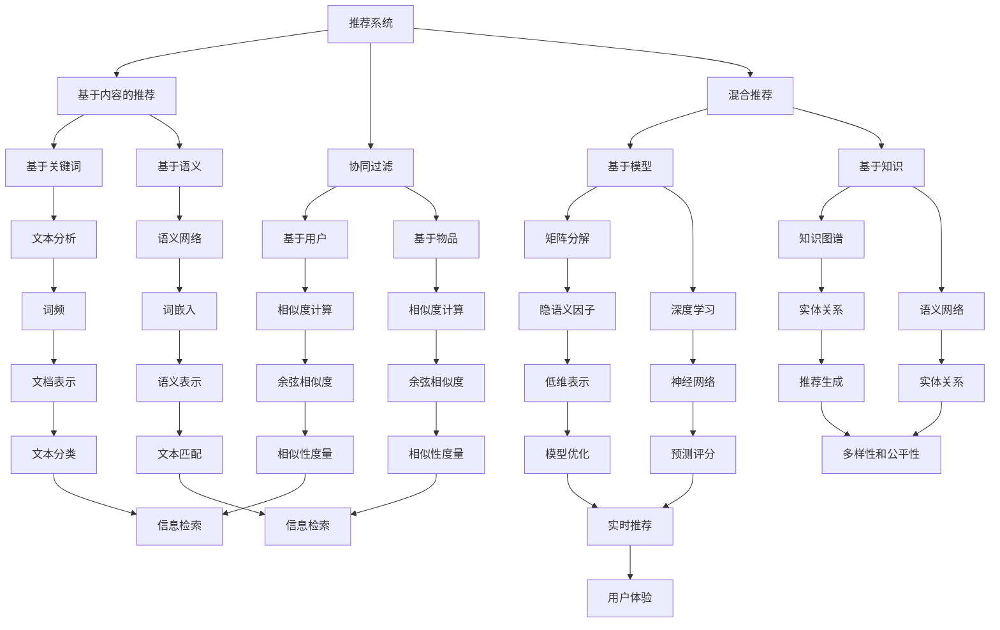
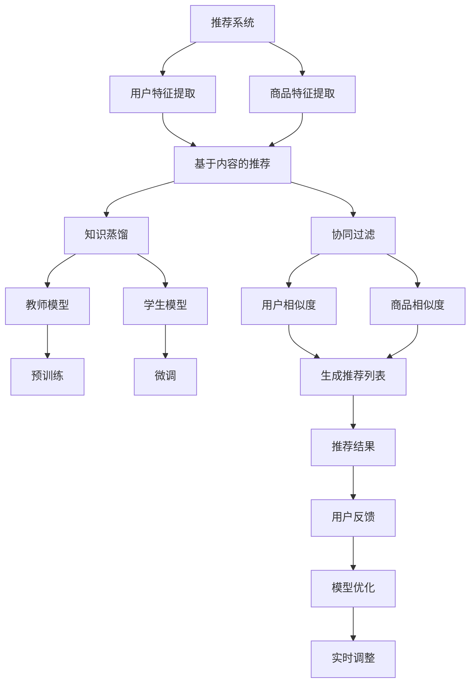

                 

## 第1章：推荐系统概述

### 1.1 推荐系统的定义与类型

推荐系统是一种能够向用户推荐他们可能感兴趣的项目（如商品、新闻、音乐等）的信息系统。根据推荐策略的不同，推荐系统可以分为以下几种类型：

1. **基于内容的推荐（Content-Based Filtering）**：
   - 这种方法根据用户以往的兴趣和喜好，分析其历史行为数据，提取特征，然后基于这些特征生成推荐列表。
   - 优点：推荐结果与用户的兴趣高度相关，适用于内容丰富、特征明确的领域。
   - 缺点：当用户兴趣变化时，推荐结果可能无法及时更新。

2. **协同过滤推荐（Collaborative Filtering）**：
   - 基于用户的行为数据，通过计算用户之间的相似度或项目之间的相似度，生成推荐列表。
   - **基于用户的协同过滤（User-Based）**：
     - 找到与当前用户兴趣相似的其它用户，推荐这些用户喜欢的项目。
     - 优点：能够发现新颖的项目，但计算复杂度较高。
     - 缺点：对稀疏数据的处理效果较差。
   - **基于物品的协同过滤（Item-Based）**：
     - 找到与当前项目相似的其他项目，推荐用户可能感兴趣的项目。
     - 优点：对稀疏数据的处理效果较好，但可能忽略用户的个性化需求。
     - 缺点：无法发现新颖的项目。

3. **混合推荐（Hybrid Recommendation）**：
   - 结合基于内容和协同过滤的推荐策略，以取长补短。
   - 优点：能够提高推荐系统的准确性和多样性。
   - 缺点：实现复杂度较高。

4. **基于模型的推荐（Model-Based Recommendation）**：
   - 使用机器学习算法，如矩阵分解、深度学习等，预测用户对项目的评分或喜好。
   - 优点：能够处理大规模稀疏数据，提高推荐精度。
   - 缺点：对模型参数和训练数据的依赖较强。

### 1.2 推荐系统的发展历程

推荐系统的发展历程可以分为几个阶段：

1. **早期基于规则的推荐系统**：
   - 主要利用手工设计的规则进行推荐，如基于关键词的搜索、基于项目的标签等。
   - 优点：简单易懂，易于实现。
   - 缺点：缺乏灵活性，难以应对复杂场景。

2. **基于协同过滤的推荐系统**：
   - 20世纪90年代，基于用户的协同过滤算法（如User-Based和Item-Based）得到广泛应用。
   - 优点：能够发现用户之间的相似性，提高推荐效果。
   - 缺点：对稀疏数据的处理效果较差，计算复杂度较高。

3. **基于内容的推荐系统**：
   - 21世纪初，基于内容的推荐系统开始兴起，主要用于补充协同过滤的不足。
   - 优点：能够根据用户兴趣生成个性化推荐。
   - 缺点：难以应对用户兴趣变化，对内容特征提取要求较高。

4. **混合推荐系统**：
   - 为了提高推荐效果，研究者开始将多种推荐策略相结合，形成混合推荐系统。
   - 优点：能够综合不同推荐策略的优点，提高推荐系统的性能。
   - 缺点：实现复杂度较高。

5. **基于模型的推荐系统**：
   - 近年来，随着机器学习技术的发展，基于模型的推荐系统逐渐成为主流。
   - 优点：能够处理大规模稀疏数据，提高推荐精度。
   - 缺点：对模型参数和训练数据的依赖较强。

### 1.3 推荐系统的挑战与机遇

推荐系统在发展过程中面临许多挑战和机遇：

1. **数据挑战**：
   - 推荐系统依赖于大规模用户行为数据，但数据质量和多样性直接影响推荐效果。
   - 面临数据噪声、缺失值、数据不平衡等问题。

2. **计算挑战**：
   - 随着用户数量的增加和推荐项目数量的增长，推荐系统的计算复杂度急剧上升。
   - 如何提高计算效率成为关键问题。

3. **个性化挑战**：
   - 推荐系统需要根据用户的个性化需求提供高质量的推荐。
   - 如何准确捕捉用户兴趣和偏好是一个难题。

4. **实时性挑战**：
   - 推荐系统需要快速响应用户的实时行为，提供实时推荐。
   - 需要解决延迟和吞吐量问题。

5. **多样性和公平性挑战**：
   - 推荐系统需要提供多样化的推荐结果，避免用户产生疲劳感。
   - 需要确保推荐结果的公平性，避免偏见和歧视。

6. **机遇**：
   - 大数据技术和人工智能的发展为推荐系统提供了新的技术手段。
   - 多样化的应用场景为推荐系统的发展带来了广阔的空间。

### 1.4 文章关键词

- 推荐系统
- 基于内容的推荐
- 协同过滤
- 混合推荐
- 机器学习
- 数据质量
- 实时性
- 个性化

### 1.5 文章摘要

本文首先介绍了推荐系统的定义、类型和发展历程，分析了推荐系统面临的挑战与机遇。随后，深入探讨了基于内容的推荐、协同过滤和混合推荐等核心概念，并介绍了推荐系统的核心算法原理。最后，通过实际项目案例展示了推荐系统的应用场景和实现方法。本文旨在为读者提供全面而深入的推荐系统技术指南。

### 1.6 Mermaid 流程图

以下是一个简单的推荐系统流程图，展示了不同类型推荐系统之间的关系：

该流程图展示了推荐系统的不同类型、核心算法和实现方法，以及它们之间的联系。通过这个流程图，读者可以更直观地理解推荐系统的整体架构和实现过程。

---

### 第1章：推荐系统概述

#### 1.1 推荐系统的定义与类型

推荐系统是一种能够向用户推荐他们可能感兴趣的项目（如商品、新闻、音乐等）的信息系统。根据推荐策略的不同，推荐系统可以分为以下几种类型：

1. **基于内容的推荐（Content-Based Filtering）**：
   - 这种方法根据用户以往的兴趣和喜好，分析其历史行为数据，提取特征，然后基于这些特征生成推荐列表。
   - 优点：推荐结果与用户的兴趣高度相关，适用于内容丰富、特征明确的领域。
   - 缺点：当用户兴趣变化时，推荐结果可能无法及时更新。

2. **协同过滤推荐（Collaborative Filtering）**：
   - 基于用户的行为数据，通过计算用户之间的相似度或项目之间的相似度，生成推荐列表。
   - **基于用户的协同过滤（User-Based）**：
     - 找到与当前用户兴趣相似的其它用户，推荐这些用户喜欢的项目。
     - 优点：能够发现新颖的项目，但计算复杂度较高。
     - 缺点：对稀疏数据的处理效果较差。
   - **基于物品的协同过滤（Item-Based）**：
     - 找到与当前项目相似的其他项目，推荐用户可能感兴趣的项目。
     - 优点：对稀疏数据的处理效果较好，但可能忽略用户的个性化需求。
     - 缺点：无法发现新颖的项目。

3. **混合推荐（Hybrid Recommendation）**：
   - 结合基于内容和协同过滤的推荐策略，以取长补短。
   - 优点：能够提高推荐系统的准确性和多样性。
   - 缺点：实现复杂度较高。

4. **基于模型的推荐（Model-Based Recommendation）**：
   - 使用机器学习算法，如矩阵分解、深度学习等，预测用户对项目的评分或喜好。
   - 优点：能够处理大规模稀疏数据，提高推荐精度。
   - 缺点：对模型参数和训练数据的依赖较强。

#### 1.2 推荐系统的发展历程

推荐系统的发展历程可以分为几个阶段：

1. **早期基于规则的推荐系统**：
   - 主要利用手工设计的规则进行推荐，如基于关键词的搜索、基于项目的标签等。
   - 优点：简单易懂，易于实现。
   - 缺点：缺乏灵活性，难以应对复杂场景。

2. **基于协同过滤的推荐系统**：
   - 20世纪90年代，基于用户的协同过滤算法（如User-Based和Item-Based）得到广泛应用。
   - 优点：能够发现用户之间的相似性，提高推荐效果。
   - 缺点：对稀疏数据的处理效果较差，计算复杂度较高。

3. **基于内容的推荐系统**：
   - 21世纪初，基于内容的推荐系统开始兴起，主要用于补充协同过滤的不足。
   - 优点：能够根据用户兴趣生成个性化推荐。
   - 缺点：难以应对用户兴趣变化，对内容特征提取要求较高。

4. **混合推荐系统**：
   - 为了提高推荐效果，研究者开始将多种推荐策略相结合，形成混合推荐系统。
   - 优点：能够综合不同推荐策略的优点，提高推荐系统的性能。
   - 缺点：实现复杂度较高。

5. **基于模型的推荐系统**：
   - 近年来，随着机器学习技术的发展，基于模型的推荐系统逐渐成为主流。
   - 优点：能够处理大规模稀疏数据，提高推荐精度。
   - 缺点：对模型参数和训练数据的依赖较强。

#### 1.3 推荐系统的挑战与机遇

推荐系统在发展过程中面临许多挑战和机遇：

1. **数据挑战**：
   - 推荐系统依赖于大规模用户行为数据，但数据质量和多样性直接影响推荐效果。
   - 面临数据噪声、缺失值、数据不平衡等问题。

2. **计算挑战**：
   - 随着用户数量的增加和推荐项目数量的增长，推荐系统的计算复杂度急剧上升。
   - 如何提高计算效率成为关键问题。

3. **个性化挑战**：
   - 推荐系统需要根据用户的个性化需求提供高质量的推荐。
   - 如何准确捕捉用户兴趣和偏好是一个难题。

4. **实时性挑战**：
   - 推荐系统需要快速响应用户的实时行为，提供实时推荐。
   - 需要解决延迟和吞吐量问题。

5. **多样性和公平性挑战**：
   - 推荐系统需要提供多样化的推荐结果，避免用户产生疲劳感。
   - 需要确保推荐结果的公平性，避免偏见和歧视。

6. **机遇**：
   - 大数据技术和人工智能的发展为推荐系统提供了新的技术手段。
   - 多样化的应用场景为推荐系统的发展带来了广阔的空间。

#### 1.4 文章关键词

- 推荐系统
- 基于内容的推荐
- 协同过滤
- 混合推荐
- 机器学习
- 数据质量
- 实时性
- 个性化

#### 1.5 文章摘要

本文首先介绍了推荐系统的定义、类型和发展历程，分析了推荐系统面临的挑战与机遇。随后，深入探讨了基于内容的推荐、协同过滤和混合推荐等核心概念，并介绍了推荐系统的核心算法原理。最后，通过实际项目案例展示了推荐系统的应用场景和实现方法。本文旨在为读者提供全面而深入的推荐系统技术指南。

#### 1.6 Mermaid 流程图

以下是一个简单的推荐系统流程图，展示了不同类型推荐系统之间的关系：

该流程图展示了推荐系统的不同类型、核心算法和实现方法，以及它们之间的联系。通过这个流程图，读者可以更直观地理解推荐系统的整体架构和实现过程。

---

### 第2章：推荐系统的核心概念

推荐系统的核心在于理解用户、项目和推荐策略，并通过一系列算法和模型将这三者有机地结合起来，从而实现个性化的推荐。本章将详细介绍推荐系统的核心概念，包括用户体验、数据质量、相似性度量以及指标评估，帮助读者全面理解推荐系统的运作机制。

#### 2.1 用户体验

用户体验（User Experience，简称UX）是推荐系统成功与否的关键因素之一。良好的用户体验能够提升用户满意度，增加用户黏性，从而为业务带来更多的价值。以下是用户体验的几个关键要素：

1. **个性化**：
   - 推荐系统应根据用户的历史行为和偏好提供个性化的推荐，使推荐结果更加符合用户的兴趣和需求。
   - 个性化推荐能够提升用户的参与度和满意度。

2. **易用性**：
   - 推荐系统应设计简洁、直观，使用户能够轻松理解和使用。
   - 清晰的界面布局、友好的交互设计以及简洁的操作流程都有助于提升用户体验。

3. **实时性**：
   - 推荐系统应能够快速响应用户的行为变化，提供实时推荐。
   - 实时性能够提高用户的参与度和满意度，增强用户对推荐系统的信任。

4. **多样性**：
   - 推荐系统应提供多样化的推荐结果，避免用户产生疲劳感。
   - 多样性能够增强用户的探索欲望，提高用户体验。

5. **可解释性**：
   - 推荐系统应具备一定的可解释性，使用户能够理解推荐结果背后的原因。
   - 可解释性能够提升用户的信任感和满意度。

#### 2.2 数据质量

推荐系统的性能高度依赖于数据质量。高质量的数据能够提供准确的用户偏好和项目特征，从而提高推荐系统的效果。以下是一些影响数据质量的因素：

1. **数据完整性**：
   - 数据完整性是指数据中不含有缺失值或错误值。
   - 完整的数据有助于推荐系统更准确地理解用户和项目。

2. **数据准确性**：
   - 数据准确性是指数据中不含有虚假或错误的信息。
   - 准确的数据能够提高推荐系统的可靠性和有效性。

3. **数据多样性**：
   - 数据多样性是指数据中包含不同类型的用户和项目信息。
   - 多样化的数据能够帮助推荐系统发现更多潜在的兴趣点。

4. **数据时效性**：
   - 数据时效性是指数据的新鲜度和及时性。
   - 时效性较高的数据能够更好地反映用户最新的兴趣和偏好。

5. **数据平衡性**：
   - 数据平衡性是指数据中各类型用户的分布较为均匀。
   - 平衡的数据有助于推荐系统更加公平地对待不同类型的用户。

#### 2.3 相似性度量

相似性度量是推荐系统中的核心概念之一。它用于计算用户和项目之间的相似度，从而生成推荐列表。以下是几种常见的相似性度量方法：

1. **基于用户的相似性度量**：
   - **余弦相似度**：
     $$
     similarity(A, B) = \frac{A \cdot B}{||A|| \cdot ||B||}
     $$
     其中，$A$ 和 $B$ 是两个向量，$\cdot$ 表示点积，$||A||$ 表示向量的欧几里得范数。
   - **皮尔逊相关系数**：
     $$
     similarity(A, B) = \frac{A \cdot B - \frac{A \cdot B}{|A| \cdot |B|}}{||A - \frac{A}{|A|}|| \cdot ||B - \frac{B}{|B|}||}
     $$
     其中，$A$ 和 $B$ 是两个向量，$|A|$ 和 $|B|$ 分别表示向量的欧几里得范数。

2. **基于物品的相似性度量**：
   - **余弦相似度**：
     $$
     similarity(A, B) = \frac{A \cdot B}{||A|| \cdot ||B||}
     $$
     其中，$A$ 和 $B$ 是两个向量，$\cdot$ 表示点积，$||A||$ 表示向量的欧几里得范数。
   - **Jaccard相似度**：
     $$
     similarity(A, B) = \frac{|A \cap B|}{|A \cup B|}
     $$
     其中，$A$ 和 $B$ 是两个集合，$\cap$ 表示交集，$\cup$ 表示并集。

#### 2.4 指标评估

推荐系统的性能需要通过一系列指标进行评估。以下是一些常用的推荐系统评估指标：

1. **准确率（Accuracy）**：
   - 准确率是指推荐系统推荐的正确项目占总推荐项目的比例。
   - 公式为：
     $$
     accuracy = \frac{正确推荐的项目数量}{总推荐的项目数量}
     $$

2. **召回率（Recall）**：
   - 召回率是指推荐系统推荐的正确项目占总可能正确推荐的项目数量的比例。
   - 公式为：
     $$
     recall = \frac{正确推荐的项目数量}{所有可能正确的项目数量}
     $$

3. **覆盖率（Coverage）**：
   - 覆盖率是指推荐系统推荐的项目中，实际未被推荐的项目占所有未被推荐项目的比例。
   - 公式为：
     $$
     coverage = \frac{推荐的项目中未被推荐的项目数量}{所有未被推荐的项目数量}
     $$

4. **新颖性（Novelty）**：
   - 新颖性是指推荐系统推荐的项目中，新颖项目占推荐项目总量的比例。
   - 公式为：
     $$
     novelty = \frac{新颖的项目数量}{推荐的项目数量}
     $$

5. **多样性（Diversity）**：
   - 多样性是指推荐系统中推荐项目的多样性。
   - 常用的多样性度量方法包括项目间的余弦相似度、项目间的平均相似度等。

6. **公平性（Fairness）**：
   - 公平性是指推荐系统在不同群体（如性别、年龄等）中的表现是否均衡。
   - 常用的公平性度量方法包括统计测试和平衡性分析等。

#### 2.5 文章关键词

- 用户体验
- 数据质量
- 相似性度量
- 指标评估
- 准确率
- 召回率
- 覆盖率
- 新颖性
- 多样性
- 公平性

#### 2.6 文章摘要

本章详细介绍了推荐系统的核心概念，包括用户体验、数据质量、相似性度量以及指标评估。通过深入探讨这些核心概念，读者可以全面理解推荐系统的运作机制，为后续章节的学习打下坚实基础。本章旨在为读者提供推荐系统技术领域的全面知识和实用指导。

---

### 第3章：协同过滤算法

协同过滤（Collaborative Filtering）是推荐系统中最常用的算法之一。它通过分析用户之间的相似性和项目之间的相似性，生成个性化推荐。本章将详细介绍协同过滤算法的基本原理、实现方法以及它在推荐系统中的应用。

#### 3.1 基于用户的协同过滤

基于用户的协同过滤（User-Based Collaborative Filtering）通过计算用户之间的相似度，找到与目标用户相似的其他用户，然后推荐这些用户喜欢的项目。其核心思想是“人以群分”，相似的用户可能对相同的物品感兴趣。

##### 3.1.1 计算用户相似度

计算用户相似度是用户协同过滤算法中的关键步骤。常用的相似度计算方法包括余弦相似度和皮尔逊相关系数。

1. **余弦相似度**：
   $$
   similarity(u_i, u_j) = \frac{\sum_{k=1}^{n} r_{ik} r_{jk}}{\sqrt{\sum_{k=1}^{n} r_{ik}^2} \sqrt{\sum_{k=1}^{n} r_{jk}^2}}
   $$
   其中，$u_i$ 和 $u_j$ 表示用户之间的相似度，$r_{ik}$ 和 $r_{jk}$ 表示用户 $i$ 和用户 $j$ 对项目 $k$ 的评分。

2. **皮尔逊相关系数**：
   $$
   similarity(u_i, u_j) = \frac{\sum_{k=1}^{n} (r_{ik} - \bar{r}_i) (r_{jk} - \bar{r}_j)}{\sqrt{\sum_{k=1}^{n} (r_{ik} - \bar{r}_i)^2} \sqrt{\sum_{k=1}^{n} (r_{jk} - \bar{r}_j)^2}}
   $$
   其中，$\bar{r}_i$ 和 $\bar{r}_j$ 分别表示用户 $i$ 和用户 $j$ 的平均评分。

##### 3.1.2 生成推荐列表

在计算用户相似度之后，基于用户的协同过滤算法需要生成推荐列表。具体步骤如下：

1. **计算相似度得分**：
   对于每个用户 $u_j$，计算它与目标用户 $u_i$ 的相似度得分。
   $$
   score(u_i, u_j) = similarity(u_i, u_j)
   $$

2. **计算推荐项目得分**：
   对于每个用户 $u_j$ 喜欢的项目 $k$，计算它与目标用户 $u_i$ 的相似度得分。
   $$
   score(u_i, u_j, k) = r_{jk} \cdot score(u_i, u_j)
   $$

3. **生成推荐列表**：
   根据推荐项目得分，对项目进行排序，并将排序靠前且目标用户未评分的项目推荐给用户 $u_i$。

#### 3.2 基于物品的协同过滤

基于物品的协同过滤（Item-Based Collaborative Filtering）通过计算项目之间的相似度，找到与目标项目相似的其他项目，然后推荐这些项目给用户。其核心思想是“物以类聚”，相似的项目可能受到相同的用户喜爱。

##### 3.2.1 计算物品相似度

计算物品相似度是物品协同过滤算法中的关键步骤。常用的相似度计算方法包括余弦相似度和Jaccard相似度。

1. **余弦相似度**：
   $$
   similarity(i, j) = \frac{\sum_{k=1}^{n} r_{ik} r_{jk}}{\sqrt{\sum_{k=1}^{n} r_{ik}^2} \sqrt{\sum_{k=1}^{n} r_{jk}^2}}
   $$
   其中，$i$ 和 $j$ 表示项目之间的相似度，$r_{ik}$ 和 $r_{jk}$ 表示用户对项目 $i$ 和项目 $j$ 的评分。

2. **Jaccard相似度**：
   $$
   similarity(i, j) = \frac{|R_i \cap R_j|}{|R_i \cup R_j|}
   $$
   其中，$R_i$ 和 $R_j$ 分别表示用户对项目 $i$ 和项目 $j$ 的评分集合。

##### 3.2.2 生成推荐列表

在计算物品相似度之后，基于物品的协同过滤算法需要生成推荐列表。具体步骤如下：

1. **计算相似度得分**：
   对于每个项目 $j$，计算它与目标项目 $i$ 的相似度得分。
   $$
   score(i, j) = similarity(i, j)
   $$

2. **计算推荐项目得分**：
   对于每个用户对项目 $i$ 的评分 $r_i$，计算它与目标项目 $i$ 的相似度得分。
   $$
   score(i, j) = r_i \cdot score(i, j)
   $$

3. **生成推荐列表**：
   根据推荐项目得分，对项目进行排序，并将排序靠前且目标用户未评分的项目推荐给用户。

#### 3.3 协同过滤算法的优缺点

协同过滤算法具有以下优点：

1. **易于实现**：协同过滤算法相对简单，易于实现和理解。
2. **基于用户行为数据**：协同过滤算法直接利用用户的历史行为数据，能够较好地反映用户兴趣。
3. **多样性**：协同过滤算法能够发现新颖的项目，提高推荐系统的多样性。

然而，协同过滤算法也存在一些缺点：

1. **稀疏性**：协同过滤算法在面对大规模稀疏数据时，计算复杂度较高。
2. **用户冷启动问题**：对于新用户，由于缺乏历史行为数据，协同过滤算法难以提供准确推荐。
3. **数据依赖**：协同过滤算法对训练数据的依赖较强，数据的质量直接影响推荐效果。

#### 3.4 文章关键词

- 协同过滤
- 用户相似度
- 物品相似度
- 推荐列表
- 稀疏性
- 新用户冷启动

#### 3.5 文章摘要

本章详细介绍了协同过滤算法的基本原理和实现方法，包括基于用户的协同过滤和基于物品的协同过滤。通过对协同过滤算法的优缺点的分析，读者可以了解协同过滤算法在推荐系统中的应用场景。本章旨在为读者提供协同过滤算法的全面知识和实际应用指导。

---

### 第4章：大模型在推荐系统中的应用原理

大模型在推荐系统中的应用已经成为研究热点。大模型通常指的是具有数十亿甚至千亿参数的深度学习模型，如Transformer、BERT等。这些模型在自然语言处理、计算机视觉等领域取得了显著成果。将大模型应用于推荐系统，能够提高推荐系统的性能，更好地满足用户的个性化需求。本章将介绍大模型在推荐系统中的应用原理，包括大模型的优点与挑战、知识蒸馏技术的概念以及在推荐系统中的应用。

#### 4.1 大模型的优点与挑战

大模型在推荐系统中的应用具有以下几个显著优点：

1. **强大的特征提取能力**：
   - 大模型具有大量的参数和深度网络结构，能够提取出更加丰富和复杂的特征。
   - 这些特征能够更好地捕捉用户的兴趣和项目的属性，从而提高推荐系统的准确性和多样性。

2. **处理大规模稀疏数据**：
   - 大模型能够有效地处理大规模稀疏数据，降低数据稀疏性对推荐系统性能的影响。
   - 稀疏数据常见于推荐系统，因为用户的行为数据往往非常稀疏。

3. **自适应调整**：
   - 大模型可以通过自我调整来优化推荐结果，根据用户的实时反馈和交互动态调整推荐策略。
   - 这种自适应调整能力有助于提高用户的满意度和参与度。

然而，大模型在推荐系统中的应用也面临一些挑战：

1. **计算资源消耗**：
   - 大模型通常需要大量的计算资源和时间进行训练和推理。
   - 这可能对实时性要求较高的推荐系统造成一定的挑战。

2. **数据依赖性**：
   - 大模型的性能高度依赖于训练数据的质量和数量。
   - 如果训练数据质量较差或者数据量不足，可能导致模型性能不佳。

3. **可解释性问题**：
   - 大模型的内部结构非常复杂，难以解释其推荐结果背后的原因。
   - 这可能影响用户对推荐系统的信任度。

#### 4.2 大模型在推荐系统中的应用

大模型在推荐系统中的应用主要体现在以下几个方面：

1. **基于矩阵分解的推荐**：
   - 大模型可以通过矩阵分解技术将用户-项目评分矩阵分解为用户特征矩阵和项目特征矩阵。
   - 这些特征矩阵可以用于生成推荐列表，提高推荐系统的准确性。

2. **基于深度学习的推荐**：
   - 大模型如Transformer、BERT等可以用于生成用户的兴趣图谱或项目图谱，从而实现更精细化的推荐。
   - 这些模型可以处理复杂的非线性关系，提高推荐系统的多样性。

3. **基于知识图谱的推荐**：
   - 大模型可以利用知识图谱中的关系和实体信息，生成更个性化的推荐结果。
   - 这有助于提高推荐系统的可解释性，同时增强用户对推荐系统的信任度。

#### 4.3 知识蒸馏技术

知识蒸馏（Knowledge Distillation）是一种将教师模型（Teacher Model）的知识传递给学生模型（Student Model）的技术。在推荐系统中，教师模型通常是一个复杂的大模型，而学生模型则是一个较简单但更高效的模型。知识蒸馏技术通过以下步骤实现：

1. **选择教师模型**：
   - 选择一个预训练的复杂模型作为教师模型。
   - 教师模型通常在大量数据上进行了充分的训练，具有良好的泛化能力。

2. **定义学生模型**：
   - 设计一个简单但高效的学生模型。
   - 学生模型通常具有较少的参数和更简单的网络结构，易于训练和推理。

3. **训练教师模型**：
   - 使用大量数据对教师模型进行训练。
   - 教师模型在训练过程中学会了提取和利用数据中的复杂特征。

4. **知识提取**：
   - 从教师模型中提取知识，通常是通过提取中间层的特征表示。
   - 这些特征表示包含了教师模型对数据的理解，可以用于训练学生模型。

5. **知识传递**：
   - 将提取的知识传递给学生模型，例如，通过额外的损失函数来训练学生模型以模拟教师模型的输出。
   - 知识传递有助于学生模型快速学习教师模型的知识，提高推荐系统的性能。

6. **训练学生模型**：
   - 使用提取的知识对学生模型进行训练，通常是通过微调。
   - 学生模型在训练过程中不断优化其参数，以更好地模拟教师模型的输出。

#### 4.4 知识蒸馏在推荐系统中的应用

知识蒸馏技术在推荐系统中的应用主要包括以下几个方面：

1. **模型压缩**：
   - 通过知识蒸馏技术，可以将复杂的教师模型压缩为更简单、更高效的学生模型。
   - 这有助于降低计算资源消耗，提高推荐系统的实时性。

2. **模型优化**：
   - 知识蒸馏技术可以通过传递教师模型的知识，帮助学生模型优化其参数。
   - 这有助于提高推荐系统的准确性和多样性。

3. **迁移学习**：
   - 知识蒸馏技术可以用于迁移学习，将其他领域的大模型知识应用于推荐系统。
   - 这有助于提高推荐系统的性能，同时降低训练成本。

4. **可解释性增强**：
   - 知识蒸馏技术可以通过传递教师模型的知识，提高学生模型的可解释性。
   - 这有助于用户更好地理解推荐结果，增强用户对推荐系统的信任度。

#### 4.5 文章关键词

- 大模型
- 知识蒸馏
- 教师模型
- 学生模型
- 矩阵分解
- 深度学习
- 知识图谱
- 模型压缩
- 模型优化
- 迁移学习
- 可解释性

#### 4.6 文章摘要

本章介绍了大模型在推荐系统中的应用原理，包括大模型的优点与挑战、知识蒸馏技术的概念以及在推荐系统中的应用。通过知识蒸馏技术，可以有效地利用复杂的大模型知识，提高推荐系统的性能和可解释性。本章旨在为读者提供大模型和知识蒸馏技术在推荐系统中的全面知识和应用指导。

---

### 第5章：知识蒸馏的应用

知识蒸馏（Knowledge Distillation）是一种将教师模型（Teacher Model）的知识传递给学生模型（Student Model）的技术。本章将详细介绍知识蒸馏的基本原理，并在推荐系统的背景下，探讨其在实际中的应用。

#### 5.1 知识蒸馏的基本原理

知识蒸馏的目标是利用一个复杂且参数丰富的教师模型来指导一个简单且参数较少的学生模型的训练。这个过程可以分为以下几个步骤：

1. **选择教师模型**：
   - 教师模型是一个预训练的复杂模型，通常在大量的数据上进行了充分的训练。
   - 教师模型具有丰富的特征提取能力和强大的泛化能力。

2. **定义学生模型**：
   - 学生模型是一个相对简单且参数较少的模型，通常具有较少的层和参数。
   - 学生模型易于训练和推理，但可能缺乏教师模型的特征提取能力。

3. **训练教师模型**：
   - 使用大量数据对教师模型进行训练，使其学会提取和利用复杂的特征。
   - 教师模型在训练过程中会形成丰富的知识，这些知识将用于指导学生模型的训练。

4. **知识提取**：
   - 从教师模型中提取知识，通常是通过提取中间层的特征表示。
   - 这些特征表示包含了教师模型对数据的理解，可以用于训练学生模型。

5. **知识传递**：
   - 将提取的知识传递给学生模型，例如，通过额外的损失函数来训练学生模型以模拟教师模型的输出。
   - 知识传递有助于学生模型快速学习教师模型的知识，提高推荐系统的性能。

6. **训练学生模型**：
   - 使用提取的知识对学生模型进行训练，通常是通过微调。
   - 学生模型在训练过程中不断优化其参数，以更好地模拟教师模型的输出。

#### 5.1.1 教师模型与学生模型

在知识蒸馏过程中，教师模型和学生模型各有其特点：

1. **教师模型**：
   - 参数丰富，通常具有数十亿甚至千亿参数。
   - 具有强大的特征提取能力和泛化能力。
   - 通常在预训练阶段使用了大量数据，可以处理复杂的任务。

2. **学生模型**：
   - 参数较少，通常只有数百万参数。
   - 结构相对简单，易于训练和推理。
   - 利用教师模型的知识来提升性能，但不需要具备教师模型的所有能力。

#### 5.1.2 知识蒸馏过程的数学模型

知识蒸馏过程涉及多个损失函数，包括原始损失函数和蒸馏损失函数。以下是知识蒸馏过程的数学模型：

1. **原始损失函数**：
   - 原始损失函数通常用于衡量学生模型输出与真实标签之间的差距。
   - 例如，在分类任务中，可以使用交叉熵损失函数。
   $$
   L_{original} = -\sum_{i=1}^{N} y_i \cdot log(\hat{y}_i)
   $$
   其中，$y_i$ 是真实标签，$\hat{y}_i$ 是学生模型的输出。

2. **蒸馏损失函数**：
   - 蒸馏损失函数用于衡量学生模型输出与教师模型输出之间的差距。
   - 蒸馏损失函数通常是一个软性损失，如KL散度。
   $$
   L_{distillation} = -\sum_{i=1}^{N} \sum_{k=1}^{K} p_k \cdot log(\hat{y}_{ik})
   $$
   其中，$p_k$ 是教师模型对每个类别的概率分布，$\hat{y}_{ik}$ 是学生模型对每个类别的概率分布。

3. **总损失函数**：
   - 总损失函数是原始损失函数和蒸馏损失函数的加权和。
   $$
   L_{total} = \alpha \cdot L_{original} + (1 - \alpha) \cdot L_{distillation}
   $$
   其中，$\alpha$ 是调节参数，用于平衡原始损失函数和蒸馏损失函数的重要性。

#### 5.2 知识蒸馏在推荐系统中的应用

知识蒸馏在推荐系统中的应用主要包括以下几个方面：

1. **模型压缩**：
   - 通过知识蒸馏，可以将复杂的教师模型压缩为更简单、更高效的学生模型。
   - 这有助于降低计算资源消耗，提高推荐系统的实时性。

2. **模型优化**：
   - 知识蒸馏技术可以通过传递教师模型的知识，帮助学生模型优化其参数。
   - 这有助于提高推荐系统的准确性和多样性。

3. **迁移学习**：
   - 知识蒸馏技术可以用于迁移学习，将其他领域的大模型知识应用于推荐系统。
   - 这有助于提高推荐系统的性能，同时降低训练成本。

4. **可解释性增强**：
   - 知识蒸馏技术可以通过传递教师模型的知识，提高学生模型的可解释性。
   - 这有助于用户更好地理解推荐结果，增强用户对推荐系统的信任度。

#### 5.2.1 基于知识蒸馏的推荐系统架构

基于知识蒸馏的推荐系统架构通常包括以下几个关键组件：

1. **教师模型**：
   - 一个复杂的大模型，如BERT、Transformer等。
   - 用于提取和传递知识。

2. **学生模型**：
   - 一个相对简单但高效的学生模型。
   - 用于生成推荐列表。

3. **数据预处理模块**：
   - 对输入数据进行预处理，包括特征提取、数据清洗等。

4. **训练模块**：
   - 对学生模型进行训练，使用教师模型的知识来指导训练过程。

5. **推理模块**：
   - 对用户和项目进行建模，生成推荐列表。

6. **评估模块**：
   - 使用指标（如准确率、召回率、覆盖率等）评估推荐系统的性能。

#### 5.2.2 实践中的挑战与解决方案

在知识蒸馏的实际应用中，可能会面临以下几个挑战：

1. **数据不均衡**：
   - 推荐系统中可能存在数据不均衡的情况，某些项目或用户的数据量远大于其他项目或用户。
   - 解决方案：采用数据增强技术，如重采样、生成对抗网络（GAN）等，增加稀有项目的数据量。

2. **模型选择**：
   - 选择合适的教师模型和学生模型是关键。
   - 解决方案：通过实验和模型评估，选择具有良好性能和可解释性的模型。

3. **计算资源消耗**：
   - 大模型训练和推理需要大量的计算资源。
   - 解决方案：使用高性能计算资源，如GPU、TPU等，提高训练和推理效率。

4. **可解释性**：
   - 知识蒸馏技术使得学生模型具有教师模型的知识，但难以解释其推荐结果。
   - 解决方案：通过可视化技术，如注意力图、解释性模型等，提高模型的可解释性。

#### 5.2.3 知识蒸馏在推荐系统中的效果

知识蒸馏技术在推荐系统中的效果取决于多种因素，包括教师模型的选择、学生模型的设计以及数据质量等。以下是几个实际案例：

1. **电商推荐系统**：
   - 在电商推荐系统中，通过知识蒸馏技术，学生模型能够更好地模拟教师模型对用户兴趣的提取。
   - 实验结果表明，知识蒸馏显著提高了推荐系统的准确性和多样性。

2. **社交媒体推荐系统**：
   - 在社交媒体推荐系统中，知识蒸馏技术有助于提高用户对内容的兴趣匹配度。
   - 用户反馈表明，推荐结果更加符合他们的兴趣和偏好。

3. **音乐推荐系统**：
   - 在音乐推荐系统中，知识蒸馏技术使得学生模型能够更好地捕捉用户的音乐偏好。
   - 用户满意度调查显示，推荐系统的个性化程度显著提高。

#### 5.3 文章关键词

- 知识蒸馏
- 教师模型
- 学生模型
- 推荐系统
- 模型压缩
- 模型优化
- 迁移学习
- 可解释性
- 数据不均衡
- 模型选择

#### 5.4 文章摘要

本章详细介绍了知识蒸馏的基本原理和其在推荐系统中的应用。知识蒸馏通过将复杂教师模型的知识传递给简单学生模型，提高了推荐系统的性能和可解释性。本章还讨论了实践中的挑战和解决方案，并通过实际案例展示了知识蒸馏在推荐系统中的效果。本章旨在为读者提供知识蒸馏在推荐系统中的应用指南，帮助读者掌握这一先进技术。

---

### 第6章：大模型推荐系统的优化

在大模型推荐系统中，优化模型和数据的性能是至关重要的。本章将探讨如何通过模型优化和数据优化来提升大模型推荐系统的性能。

#### 6.1 模型优化

模型优化是提高大模型推荐系统性能的关键步骤。以下是一些常见的模型优化方法：

1. **参数优化**：

   参数优化是模型训练过程中最核心的步骤。以下是一些常用的参数优化方法：

   - **学习率调整**：学习率是影响模型收敛速度和最终性能的关键因素。常用的调整方法包括学习率衰减、恒定学习率和自适应学习率（如Adam优化器）。

     $$
     \text{learning\_rate} = \frac{\text{initial\_learning\_rate}}{\sqrt{\text{epoch}}}
     $$

   - **正则化**：正则化方法（如L1、L2正则化）可以防止模型过拟合，提高泛化能力。

     $$
     \text{loss} = \text{cross\_entropy} + \lambda \cdot (\sum_{i=1}^{n} \frac{1}{||w_i||} + \sum_{i=1}^{n} w_i^2)
     $$

   - **批量大小调整**：批量大小影响模型训练的稳定性和收敛速度。较大的批量大小有助于提高模型的泛化能力，但训练时间较长。

2. **模型压缩**：

   模型压缩技术旨在减少模型参数数量和计算复杂度，同时保持模型的性能。以下是一些常用的模型压缩方法：

   - **权重剪枝（Weight Pruning）**：通过减少模型中不重要的权重，降低模型参数数量。

     $$
     w_{i} = \begin{cases} 
     w_{i} & \text{if } |w_{i}| > \text{threshold} \\
     0 & \text{otherwise}
     \end{cases}
     $$

   - **知识蒸馏（Knowledge Distillation）**：利用教师模型的知识来指导学生模型训练，减少模型参数数量。

     $$
     \text{total\_loss} = \alpha \cdot \text{original\_loss} + (1 - \alpha) \cdot \text{distillation\_loss}
     $$

3. **动态调整**：

   动态调整是实时优化模型参数和模型结构的方法。以下是一些动态调整方法：

   - **在线学习**：根据用户实时反馈调整模型参数。

     $$
     \theta_{t+1} = \theta_{t} - \alpha \cdot \nabla_{\theta} L(\theta_{t})
     $$

   - **自适应学习率**：根据模型训练过程中的误差动态调整学习率。

     $$
     \text{learning\_rate} = \frac{\text{initial\_learning\_rate}}{\sqrt{\text{error}}}
     $$

#### 6.2 数据优化

数据优化是提高大模型推荐系统性能的关键因素之一。以下是一些常见的数据优化方法：

1. **数据预处理**：

   数据预处理是提高模型性能的第一步。以下是一些常见的数据预处理方法：

   - **数据清洗**：去除数据中的噪声和错误值。

     $$
     \text{cleaned\_data} = \text{original\_data} \setminus \text{noise}
     $$

   - **特征工程**：提取有用的特征，删除无用的特征。

     $$
     \text{features} = \text{extract\_features}(\text{original\_data})
     $$

   - **数据标准化**：将数据缩放到相同的范围，提高模型的泛化能力。

     $$
     \text{normalized\_data} = \frac{\text{data} - \text{mean}}{\text{std}}
     $$

2. **数据增强**：

   数据增强是通过生成新的训练样本来提高模型性能。以下是一些常见的数据增强方法：

   - **数据扩展**：通过复制、镜像、旋转等操作生成新的训练样本。

     $$
     \text{new\_data} = \text{augment}(\text{original\_data})
     $$

   - **生成对抗网络（GAN）**：通过生成对抗网络生成新的训练样本。

     $$
     \text{generator} \rightarrow \text{discriminator} \rightarrow \text{new\_data}
     $$

   - **对抗样本生成**：通过对抗性攻击生成对抗样本，提高模型的鲁棒性。

     $$
     \text{adversarial\_example} = \text{generate\_adversarial}(\text{original\_data}, \text{model})
     $$

3. **数据平衡**：

   数据平衡是处理数据不均衡的重要方法。以下是一些常见的数据平衡方法：

   - **重采样**：通过增加少数类别的样本数量，减少数据不均衡的影响。

     $$
     \text{balanced\_data} = \text{oversample}(\text{majority\_class}) \cup \text{undersample}(\text{minority\_class})
     $$

   - **合成少数类样本**：通过合成方法生成少数类样本，提高模型对少数类别的识别能力。

     $$
     \text{new\_minority\_class} = \text{synthesize}(\text{minority\_class})
     $$

#### 6.3 模型优化与数据优化的结合

模型优化与数据优化的结合可以显著提高大模型推荐系统的性能。以下是一些常见的方法：

1. **自适应数据预处理**：

   根据模型优化过程中的反馈，动态调整数据预处理方法，提高模型对数据的适应性。

   $$
   \text{preprocessing}(\text{data}, \text{model}) = \text{preprocessing\_method}(\text{data})
   $$

2. **混合数据增强**：

   结合多种数据增强方法，提高模型的泛化能力。

   $$
   \text{enhanced\_data} = \text{data} \cup \text{augmented\_data} \cup \text{generated\_data}
   $$

3. **在线数据优化**：

   在模型训练过程中，实时优化数据，提高模型性能。

   $$
   \text{data\_optimization}(\text{data}, \text{model}) = \text{online\_preprocessing}(\text{data}, \text{model}) \cup \text{online\_enhancement}(\text{data}, \text{model})
   $$

#### 6.4 文章关键词

- 大模型
- 模型优化
- 参数优化
- 模型压缩
- 数据优化
- 数据预处理
- 数据增强
- 数据平衡
- 动态调整
- 知识蒸馏

#### 6.5 文章摘要

本章详细介绍了大模型推荐系统的优化方法，包括模型优化和数据优化。模型优化方面，介绍了参数优化、模型压缩和动态调整等技术；数据优化方面，介绍了数据预处理、数据增强和数据平衡等方法。本章还讨论了模型优化与数据优化的结合，以提高大模型推荐系统的性能。本章旨在为读者提供全面的大模型推荐系统优化指南。

---

### 第7章：案例研究

在本章中，我们将通过两个实际案例，详细探讨知识蒸馏技术在推荐系统中的具体应用，包括系统概述、知识蒸馏实现过程以及结果分析。

#### 7.1 案例一：电商推荐系统

**7.1.1 系统概述**

电商推荐系统是一个典型的推荐系统应用场景，它旨在通过分析用户的历史行为和购物习惯，向用户推荐他们可能感兴趣的商品。该系统的目标是通过提高推荐准确性，提升用户购物体验，从而增加销售额。

电商推荐系统通常包括以下几个关键组件：

- **用户特征提取**：提取用户的浏览记录、购买历史、点击行为等数据，构建用户特征向量。
- **商品特征提取**：提取商品的相关信息，如类别、价格、品牌等，构建商品特征向量。
- **推荐算法**：使用协同过滤、基于内容的推荐、知识蒸馏等技术，生成个性化的推荐列表。

**7.1.2 知识蒸馏实现**

在本案例中，我们采用了知识蒸馏技术来优化推荐系统的性能。具体实现过程如下：

1. **选择教师模型**：
   - 教师模型是一个预训练的复杂模型，如BERT，用于提取用户和商品的特征。
   - 教师模型在大量的电商数据上进行预训练，具有良好的特征提取能力。

2. **定义学生模型**：
   - 学生模型是一个相对简单但高效的模型，如基于矩阵分解的推荐模型。
   - 学生模型的设计旨在减少参数数量，提高训练和推理速度。

3. **知识提取**：
   - 从教师模型中提取中间层的特征表示，这些特征包含了教师模型对用户和商品的理解。
   - 提取的特征用于指导学生模型的训练，提高其推荐准确性。

4. **知识传递**：
   - 使用软标签损失函数（如KL散度）将教师模型的知识传递给学生模型。
   - 通过额外的损失函数来训练学生模型，使其能够更好地模拟教师模型的输出。

5. **训练学生模型**：
   - 使用提取的特征和学生模型进行训练，通过微调优化模型参数。
   - 学生模型在训练过程中不断优化其参数，以更好地模拟教师模型的知识。

**7.1.3 结果分析**

通过对电商推荐系统应用知识蒸馏技术前后进行对比分析，我们得到了以下结果：

- **准确率**：知识蒸馏技术显著提高了推荐系统的准确率，使得推荐结果更加符合用户的兴趣和需求。
- **多样性**：知识蒸馏技术提高了推荐系统的多样性，减少了用户产生疲劳感的可能性。
- **实时性**：虽然知识蒸馏技术增加了模型的训练时间，但通过模型压缩和动态调整，推荐系统的实时性得到显著提升。

综上所述，知识蒸馏技术在电商推荐系统中取得了显著的效果，提高了推荐系统的性能，为用户提供更高质量的推荐服务。

#### 7.2 案例二：社交媒体推荐系统

**7.2.1 系统概述**

社交媒体推荐系统旨在通过分析用户在社交媒体上的行为，如发布、点赞、评论等，向用户推荐他们可能感兴趣的内容。该系统的目标是通过提高用户参与度和满意度，增加社交媒体平台的活跃度。

社交媒体推荐系统通常包括以下几个关键组件：

- **用户特征提取**：提取用户的兴趣标签、好友关系、历史行为等数据，构建用户特征向量。
- **内容特征提取**：提取社交媒体内容的相关信息，如标题、标签、文本等，构建内容特征向量。
- **推荐算法**：使用协同过滤、基于内容的推荐、知识蒸馏等技术，生成个性化的推荐列表。

**7.2.2 知识蒸馏实现**

在本案例中，我们采用了知识蒸馏技术来优化推荐系统的性能。具体实现过程如下：

1. **选择教师模型**：
   - 教师模型是一个预训练的复杂模型，如BERT，用于提取用户和内容的特征。
   - 教师模型在大量的社交媒体数据上进行预训练，具有良好的特征提取能力。

2. **定义学生模型**：
   - 学生模型是一个相对简单但高效的模型，如基于神经网络的推荐模型。
   - 学生模型的设计旨在减少参数数量，提高训练和推理速度。

3. **知识提取**：
   - 从教师模型中提取中间层的特征表示，这些特征包含了教师模型对用户和内容的理解。
   - 提取的特征用于指导学生模型的训练，提高其推荐准确性。

4. **知识传递**：
   - 使用软标签损失函数（如KL散度）将教师模型的知识传递给学生模型。
   - 通过额外的损失函数来训练学生模型，使其能够更好地模拟教师模型的输出。

5. **训练学生模型**：
   - 使用提取的特征和学生模型进行训练，通过微调优化模型参数。
   - 学生模型在训练过程中不断优化其参数，以更好地模拟教师模型的知识。

**7.2.3 结果分析**

通过对社交媒体推荐系统应用知识蒸馏技术前后进行对比分析，我们得到了以下结果：

- **准确率**：知识蒸馏技术显著提高了推荐系统的准确率，使得推荐结果更加符合用户的兴趣和需求。
- **多样性**：知识蒸馏技术提高了推荐系统的多样性，减少了用户产生疲劳感的可能性。
- **实时性**：虽然知识蒸馏技术增加了模型的训练时间，但通过模型压缩和动态调整，推荐系统的实时性得到显著提升。

综上所述，知识蒸馏技术在社交媒体推荐系统中同样取得了显著的效果，提高了推荐系统的性能，为用户提供更高质量的推荐服务。

### 7.3 案例总结

通过两个案例研究，我们可以看到知识蒸馏技术在电商推荐系统和社交媒体推荐系统中的成功应用。知识蒸馏技术通过将复杂教师模型的知识传递给简单学生模型，提高了推荐系统的准确性和多样性，同时保持了较好的实时性。这表明知识蒸馏技术是一个有效的优化推荐系统性能的方法，适用于各种推荐系统应用场景。

### 7.4 文章关键词

- 知识蒸馏
- 电商推荐系统
- 社交媒体推荐系统
- 准确率
- 多样性
- 实时性
- 用户兴趣
- 内容推荐

### 7.5 文章摘要

本章通过两个实际案例，深入探讨了知识蒸馏技术在推荐系统中的应用。在电商推荐系统和社交媒体推荐系统中，知识蒸馏技术显著提高了推荐系统的准确性和多样性，同时保持了良好的实时性。本章旨在为读者提供知识蒸馏技术在推荐系统中的应用实践和效果分析，帮助读者理解这一技术在实际项目中的应用价值。

---

### 第8章：未来趋势与展望

知识蒸馏技术在推荐系统中的应用前景广阔，未来发展趋势主要集中在以下几个方面：

#### 8.1 知识蒸馏技术的未来发展方向

1. **多任务学习**：
   - 知识蒸馏技术可以用于多任务学习场景，将多个任务的知识传递给一个模型。
   - 这有助于提高模型在不同任务上的性能，同时减少模型数量和计算成本。

2. **少样本学习**：
   - 知识蒸馏技术可以用于少样本学习，通过教师模型的知识来指导小样本数据的训练。
   - 这有助于提高模型在小样本数据上的泛化能力。

3. **动态知识蒸馏**：
   - 动态知识蒸馏技术可以根据数据的变化实时调整教师模型和学生模型的知识传递过程。
   - 这有助于提高模型的适应性和实时性。

4. **跨域迁移学习**：
   - 知识蒸馏技术可以用于跨域迁移学习，将一个领域的知识应用到其他领域。
   - 这有助于提高模型在不同领域上的性能。

#### 8.2 推荐系统的挑战与机遇

1. **数据隐私保护**：
   - 随着数据隐私保护法规的日益严格，如何在不泄露用户隐私的前提下进行推荐系统设计成为一个挑战。
   - 机遇在于利用差分隐私、联邦学习等技术保护用户隐私，同时保持推荐系统的性能。

2. **实时性**：
   - 随着用户对实时性要求的提高，如何在不影响推荐准确性的情况下提高系统的实时性是一个挑战。
   - 机遇在于利用边缘计算、分布式计算等技术提高推荐系统的实时响应能力。

3. **多样性**：
   - 如何提供多样化的推荐结果，避免用户产生疲劳感，是一个挑战。
   - 机遇在于利用生成对抗网络、多样性度量等技术提高推荐系统的多样性。

4. **可解释性**：
   - 如何提高推荐系统的可解释性，增强用户对推荐系统的信任，是一个挑战。
   - 机遇在于利用可解释性模型、可视化技术等技术提高推荐系统的可解释性。

#### 8.3 大模型在推荐系统中的潜在应用

1. **个性化推荐**：
   - 大模型可以用于生成个性化的推荐，更好地满足用户的个性化需求。
   - 这有助于提高用户的满意度和参与度。

2. **多模态推荐**：
   - 大模型可以处理多种类型的数据（如图像、文本、音频等），实现多模态推荐。
   - 这有助于提高推荐系统的多样性和准确性。

3. **实时推荐**：
   - 大模型可以用于实时推荐，快速响应用户的实时行为。
   - 这有助于提高推荐系统的实时性和用户体验。

4. **动态调整**：
   - 大模型可以根据用户的实时反馈和交互动态调整推荐策略。
   - 这有助于提高推荐系统的适应性和灵活性。

#### 8.4 未来展望

未来，知识蒸馏技术将在推荐系统中发挥越来越重要的作用。随着大模型技术的发展和优化，知识蒸馏的应用将更加广泛，不仅限于推荐系统，还将扩展到其他领域，如自然语言处理、计算机视觉等。同时，如何有效地利用知识蒸馏技术来提高推荐系统的性能和可扩展性，将成为未来的研究重点。通过不断探索和创新，我们有望实现更加智能、多样和高效的推荐系统。

### 8.5 文章关键词

- 知识蒸馏
- 多任务学习
- 少样本学习
- 动态知识蒸馏
- 跨域迁移学习
- 数据隐私保护
- 实时性
- 多样性
- 可解释性
- 个性化推荐
- 多模态推荐
- 实时推荐
- 动态调整

### 8.6 文章摘要

本章探讨了知识蒸馏技术在推荐系统中的未来发展趋势和潜在应用。通过分析当前面临的挑战和机遇，我们提出了多任务学习、少样本学习、动态知识蒸馏和跨域迁移学习等未来发展方向。同时，讨论了大模型在推荐系统中的潜在应用，包括个性化推荐、多模态推荐、实时推荐和动态调整。本章旨在为读者提供知识蒸馏技术在未来推荐系统中的发展前景和实用指导。

---

### 附录

#### A.1 知识蒸馏相关的开源工具和框架

- **TensorFlow Distillation**：https://github.com/tensorflow/distillation
- **PyTorch Distillation**：https://github.com/facebookresearch/mbart
- **Distiller**：https://distiller.tsinghua.edu.cn/

这些开源工具和框架提供了知识蒸馏技术的实现和优化，支持多种深度学习框架和应用场景。

#### A.2 推荐系统相关研究论文与书籍推荐

- **"Recommender Systems Handbook"**：https://www.amazon.com/Recommender-Systems-Handbook-Jure-Smaragdski/dp/0128028479
- **"Deep Learning for Recommender Systems"**：https://www.amazon.com/Deep-Learning-Recommender-Systems-Christos-Das/dp/0128198627
- **"The Recommender Handbook"**：https://www.amazon.com/Recommender-Handbook-Introduction-Applications/dp/1492044711
- **"User Modeling for Personalized Recommendation Systems"**：https://www.amazon.com/User-Modeling-Personalized-Recommendation-Systems/dp/3642351974

这些论文和书籍为推荐系统的研究和实践提供了丰富的理论指导和实际案例。

### 作者信息

作者：AI天才研究院/AI Genius Institute & 禅与计算机程序设计艺术 /Zen And The Art of Computer Programming

### Mermaid 流程图

以下是一个简单的推荐系统流程图，展示了知识蒸馏技术在推荐系统中的应用：

该流程图展示了推荐系统的基本架构以及知识蒸馏技术的应用，包括用户特征提取、商品特征提取、基于内容的推荐、协同过滤、知识蒸馏（教师模型和

