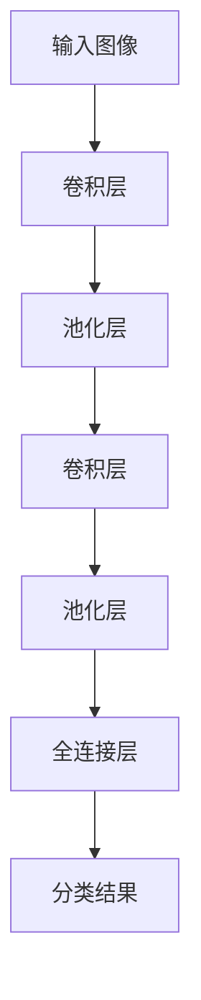
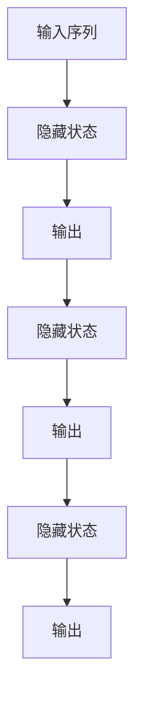
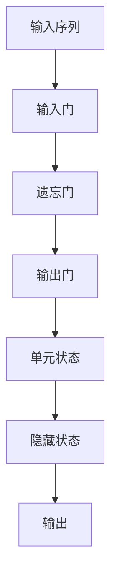
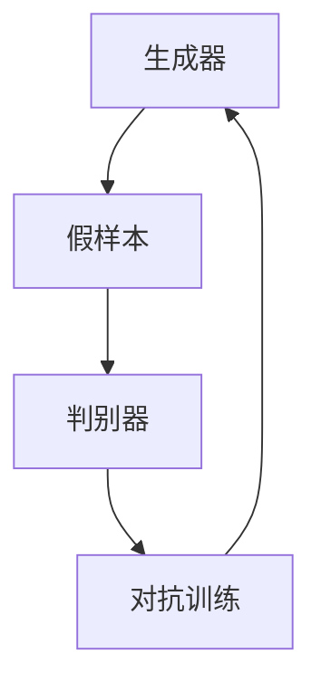
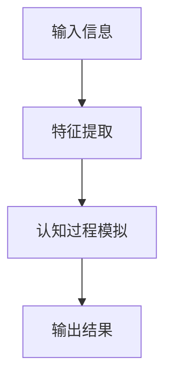
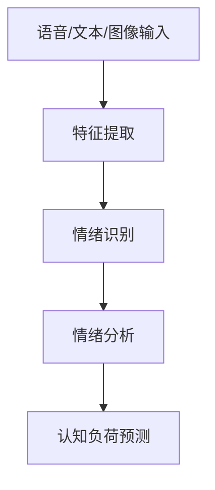
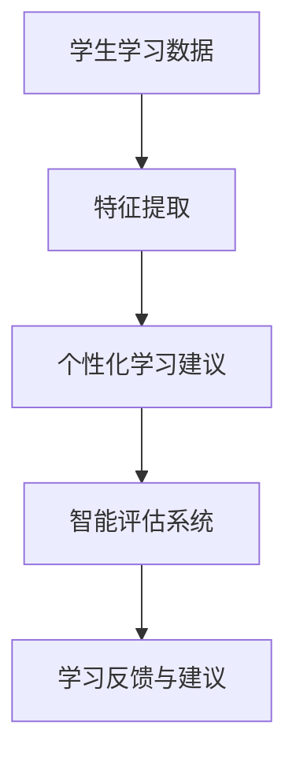
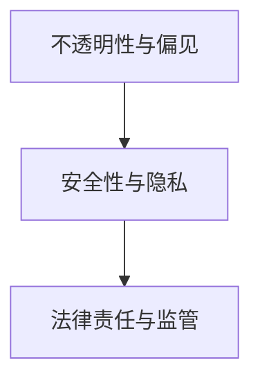
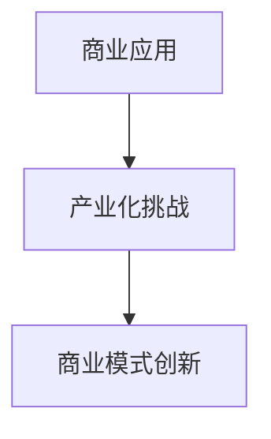
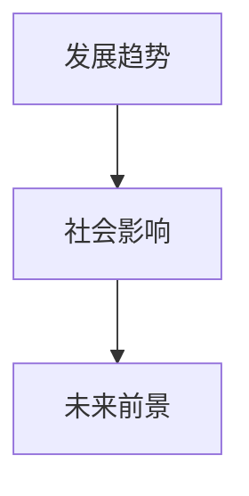

                 

### 《大模型对人类认知的挑战与机遇》

关键词：大模型、人类认知、深度学习、算法、伦理挑战、商业化、产业化、未来展望

摘要：随着深度学习和大数据技术的迅猛发展，大模型已经成为人工智能领域的热点。本文旨在探讨大模型对人类认知的挑战与机遇，分析大模型的核心算法原理，探讨其在认知科学、心理学和教育中的应用，同时审视其带来的伦理挑战和商业化机遇。通过详细的讲解和实际案例，本文将为读者提供一幅大模型领域的全景图，展示其对社会和人类认知的深远影响。

### 目录大纲

#### 第一部分：大模型基础

1. **大模型概述**
   - 1.1 大模型的定义与背景
   - 1.2 大模型的技术原理
   - 1.3 大模型的架构设计

2. **大模型的核心算法**
   - 2.1 卷积神经网络（CNN）
   - 2.2 循环神经网络（RNN）
   - 2.3 长短期记忆网络（LSTM）
   - 2.4 生成对抗网络（GAN）

3. **大模型与数学模型**
   - 3.1 大模型中的数学模型
   - 3.2 数学公式与公式推导

4. **大模型在认知科学中的应用**
   - 4.1 大模型与认知建模
   - 4.2 大模型在心理学中的应用
   - 4.3 大模型在教育中的应用

#### 第二部分：大模型的挑战与机遇

5. **大模型带来的伦理挑战**
   - 5.1 大模型的不透明性与偏见
   - 5.2 大模型的安全性与隐私
   - 5.3 大模型的法律责任与监管

6. **大模型的商业化与产业化**
   - 6.1 大模型在商业中的应用
   - 6.2 大模型产业化的挑战与机遇
   - 6.3 大模型的商业模式创新

7. **未来展望**
   - 7.1 大模型的发展趋势
   - 7.2 大模型对社会的影响
   - 7.3 大模型的未来前景

#### 附录

- 附录 A：大模型开发资源

### 文章正文

在接下来的章节中，我们将对大模型进行深入探讨，首先从基础概念入手，了解大模型的发展历程、技术原理和架构设计，接着分析其核心算法，并探讨大模型在认知科学、心理学和教育中的应用。随后，我们将审视大模型带来的伦理挑战和商业化机遇，最后对大模型的发展趋势和未来前景进行展望。

#### 第一部分：大模型基础

##### 第1章：大模型概述

##### 1.1 大模型的定义与背景

大模型（Large Models）是指在深度学习和人工智能领域，具备数百万甚至数十亿参数的神经网络模型。这些模型通常通过大规模数据集进行训练，以实现高效和强大的特征提取和模式识别能力。大模型的兴起源于深度学习技术的进步和计算资源的不断提升。在深度学习的早期阶段，模型的规模相对较小，如数百个参数的简单神经网络。然而，随着神经网络结构复杂度和数据量的增加，大模型逐渐成为研究的热点。

大模型的发展历程可以追溯到2012年，当AlexNet模型在ImageNet竞赛中取得突破性成绩时。这一成果激发了研究者对更大规模模型的探索。随后，如Google的Inception、Facebook的ResNet等模型相继出现，进一步推动了大模型的发展。如今，大模型已经成为人工智能领域的重要力量，广泛应用于图像识别、自然语言处理、语音识别等领域。

大模型的主要应用场景包括：

1. **图像识别与分类**：大模型可以高效地处理大规模图像数据集，实现高精度的图像分类和物体检测。

2. **自然语言处理（NLP）**：大模型在NLP任务中表现出色，如机器翻译、文本生成、情感分析等。

3. **语音识别与合成**：大模型在语音识别和语音合成的任务中具有显著优势，可以实现高准确度和自然度。

4. **强化学习**：大模型在强化学习任务中能够通过大量数据进行自我优化，实现高效的决策和策略学习。

##### 1.2 大模型的技术原理

大模型的技术原理主要基于深度学习和大规模数据处理技术。深度学习是一种通过多层神经网络进行特征提取和模式识别的方法。每一层网络对输入数据进行处理，并逐渐提取更高层次的特征，从而实现对复杂数据的建模。

深度学习的核心技术包括：

1. **神经网络结构**：神经网络由多个层次组成，包括输入层、隐藏层和输出层。每个层次包含多个神经元，神经元之间通过权重连接。通过调整权重，神经网络可以学习到输入数据的特征和模式。

2. **优化算法**：优化算法用于调整神经网络中的权重，以最小化损失函数。常见的优化算法包括随机梯度下降（SGD）、Adam等。

3. **正则化技术**：正则化技术用于防止模型过拟合，包括L1正则化、L2正则化、Dropout等。

自然语言处理（NLP）是深度学习的重要应用领域之一。NLP中的大模型通常采用序列到序列（Seq2Seq）模型结构，如循环神经网络（RNN）、长短期记忆网络（LSTM）和Transformer等。这些模型可以处理变长的文本序列，实现文本生成、机器翻译、情感分析等任务。

##### 1.3 大模型的架构设计

大模型的架构设计涉及多个方面，包括模型的层次结构、训练与调优等。

1. **模型的层次结构**：大模型通常包含多个隐藏层，以实现对输入数据的深度特征提取。不同层的神经元负责提取不同层次的特征，从而提高模型的泛化能力。

2. **模型的训练与调优**：大模型的训练过程需要大量数据和计算资源。训练过程中，模型通过不断调整权重来优化性能。调优过程包括调整学习率、正则化参数等，以提高模型的稳定性和泛化能力。

在实际应用中，大模型的架构设计需要考虑计算效率和模型的可解释性。近年来，研究者提出了多种高效的大模型架构，如稀疏神经网络、模型压缩技术等，以提高模型的推理速度和应用范围。

#### 第2章：大模型的核心算法

##### 2.1 卷积神经网络（CNN）

卷积神经网络（CNN）是深度学习领域的重要算法之一，广泛应用于图像识别和分类任务。CNN的基本原理是通过卷积层、池化层和全连接层等结构，对图像进行特征提取和分类。

CNN的工作流程如下：

1. **卷积层**：卷积层通过卷积操作提取图像的特征。每个卷积核负责提取一种特征，多个卷积核组成一个卷积层。卷积层中的每个神经元与输入图像的局部区域进行卷积操作，得到一个特征图。

2. **池化层**：池化层用于降低特征图的维度，减少模型的参数数量。常见的池化操作包括最大池化和平均池化。最大池化选择特征图中的最大值，而平均池化则计算特征图中的平均值。

3. **全连接层**：全连接层将卷积层和池化层提取的特征进行融合，并通过softmax函数输出分类结果。

CNN在图像处理中的应用非常广泛，如人脸识别、物体检测、图像分割等。例如，在物体检测任务中，CNN可以同时检测图像中的多个物体，并给出每个物体的位置和类别。

以下是一个简单的CNN模型的Mermaid流程图：



##### 2.2 循环神经网络（RNN）

循环神经网络（RNN）是一种处理序列数据的有效算法，可以用于自然语言处理、语音识别和时间序列预测等任务。RNN的基本原理是通过循环结构，将前一时刻的输出作为当前时刻的输入，从而实现对序列数据的记忆和学习。

RNN的工作流程如下：

1. **隐藏状态**：RNN包含一个隐藏状态，用于存储前一时刻的信息。隐藏状态通过当前的输入和前一时刻的隐藏状态进行计算，得到当前时刻的隐藏状态。

2. **输出**：当前时刻的隐藏状态通过一个线性变换和激活函数，得到当前时刻的输出。

3. **循环**：RNN通过循环结构，将前一时刻的隐藏状态传递到当前时刻，从而实现对序列数据的记忆和学习。

RNN在序列数据处理中的应用非常广泛。例如，在机器翻译任务中，RNN可以处理输入文本的每个单词，并将其翻译为输出文本。以下是一个简单的RNN模型的Mermaid流程图：



##### 2.3 长短期记忆网络（LSTM）

长短期记忆网络（LSTM）是RNN的一种改进，可以解决RNN在处理长序列数据时的梯度消失和梯度爆炸问题。LSTM通过引入门控机制，实现对长期依赖关系的建模。

LSTM的工作流程如下：

1. **输入门**：输入门决定当前输入信息对隐藏状态的影响程度。

2. **遗忘门**：遗忘门决定先前隐藏状态中的哪些信息需要被遗忘。

3. **输出门**：输出门决定当前隐藏状态中的哪些信息需要被输出。

4. **单元状态**：单元状态用于存储序列中的信息。

LSTM在时间序列预测中的应用非常广泛，如股票价格预测、天气预测等。以下是一个简单的LSTM模型的Mermaid流程图：



##### 2.4 生成对抗网络（GAN）

生成对抗网络（GAN）是一种无监督学习模型，用于生成具有真实数据分布的样本。GAN由生成器和判别器两个神经网络组成，通过对抗训练实现模型的优化。

GAN的工作流程如下：

1. **生成器**：生成器生成与真实数据分布相似的假样本。

2. **判别器**：判别器判断输入数据的真实性与假样本的相似度。

3. **对抗训练**：生成器和判别器通过对抗训练不断优化，以达到生成真实数据分布的样本。

GAN在图像生成、数据增强、图像修复等领域具有广泛应用。以下是一个简单的GAN模型的Mermaid流程图：



#### 第3章：大模型与数学模型

##### 3.1 大模型中的数学模型

大模型中的数学模型是构建和优化神经网络的基础。这些数学模型包括损失函数、正则化技术和优化算法等。

1. **损失函数**：损失函数用于衡量模型预测值与真实值之间的差距。常见的损失函数包括均方误差（MSE）、交叉熵等。

2. **正则化技术**：正则化技术用于防止模型过拟合，提高模型的泛化能力。常见的正则化技术包括L1正则化、L2正则化、Dropout等。

3. **优化算法**：优化算法用于调整神经网络中的权重，以最小化损失函数。常见的优化算法包括随机梯度下降（SGD）、Adam等。

以下是一个简单的神经网络模型中的损失函数和优化算法的伪代码：

```python
# 损失函数：均方误差
def mse(y_true, y_pred):
    return np.mean((y_true - y_pred) ** 2)

# 优化算法：随机梯度下降
def sgd(model, x, y, learning_rate):
    gradients = compute_gradients(model, x, y)
    update_weights(model, gradients, learning_rate)
```

##### 3.2 数学公式与公式推导

在深度学习中，数学公式和公式推导是理解和实现算法的关键。以下是一些常见的数学公式和推导：

1. **权重初始化**：权重初始化对神经网络的训练过程具有重要影响。常用的初始化方法包括高斯分布初始化、随机初始化等。

2. **反向传播算法**：反向传播算法是深度学习训练的核心算法，用于计算模型参数的梯度。

3. **激活函数**：激活函数用于引入非线性变换，提高模型的建模能力。常见的激活函数包括sigmoid、ReLU等。

以下是一个简单的反向传播算法的伪代码：

```python
# 反向传播算法
def backpropagation(model, x, y):
    output = forward_pass(model, x)
    loss = compute_loss(output, y)
    gradients = backward_pass(model, output, y)
    return gradients, loss
```

#### 第4章：大模型在认知科学中的应用

##### 4.1 大模型与认知建模

大模型在认知建模中的应用具有重要意义。认知建模是指通过模拟人类认知过程，对认知现象进行建模和解释。大模型通过深度学习和大规模数据处理技术，可以实现对复杂认知过程的建模。

以下是一个简单的认知建模流程的Mermaid流程图：



##### 4.2 大模型在心理学中的应用

大模型在心理学中的应用日益广泛，包括情绪识别、情绪分析和认知负荷预测等。

1. **情绪识别**：通过深度学习算法，大模型可以识别语音、文本和图像中的情绪。例如，语音中的情绪可以通过分析语音的音高、音量和时长等特征实现。

2. **情绪分析**：大模型可以对大规模文本数据进行分析，识别其中的情绪倾向。例如，通过对社交媒体文本的分析，可以了解公众对某个事件的情绪反应。

3. **认知负荷预测**：认知负荷是指个体在完成任务时所承受的认知负担。大模型可以通过分析个体在任务中的行为数据，预测其认知负荷。

以下是一个简单的情绪识别和认知负荷预测的Mermaid流程图：



##### 4.3 大模型在教育中的应用

大模型在教育中的应用具有重要意义，包括个性化学习、智能评估系统和教育数据挖掘等。

1. **个性化学习**：大模型可以分析学生的学习行为和数据，为其提供个性化的学习建议和资源。例如，通过对学生作业和测试数据的分析，可以了解其学习困难和优势。

2. **智能评估系统**：大模型可以自动评估学生的作业和测试成绩，提供即时的反馈和建议。例如，通过对学生作文的分析，可以评估其语言表达和逻辑思维能力。

3. **教育数据挖掘**：大模型可以对教育数据进行挖掘和分析，发现潜在的教育规律和趋势。例如，通过对学生学习数据的分析，可以预测其未来的学业表现。

以下是一个简单的个性化学习和智能评估系统的Mermaid流程图：



#### 第二部分：大模型的挑战与机遇

##### 第5章：大模型带来的伦理挑战

随着大模型在各个领域的广泛应用，其带来的伦理挑战也越来越受到关注。以下是一些主要的伦理挑战：

1. **不透明性与偏见**：大模型通常是一个复杂的黑箱系统，难以解释其决策过程。此外，大模型可能会因为训练数据的不均衡或偏见而产生偏见。

2. **安全性与隐私**：大模型在处理海量数据时，可能会面临数据泄露和隐私侵犯的风险。此外，大模型的安全性问题也日益凸显，如模型篡改、恶意攻击等。

3. **法律责任与监管**：大模型的决策结果可能对社会和个体产生重大影响，但当前的法律体系和监管框架尚不能完全适应大模型的发展需求。

以下是一个简单的伦理挑战分析流程的Mermaid流程图：



##### 第6章：大模型的商业化与产业化

大模型在商业和产业领域具有巨大的应用潜力，同时也面临着一系列的挑战和机遇。

1. **商业应用**：大模型在商业领域有广泛的应用，如推荐系统、智能客服、智能广告等。例如，推荐系统可以通过分析用户的浏览和购买行为，为其提供个性化的产品推荐。

2. **产业化挑战**：大模型产业化的挑战包括计算资源的限制、数据资源的获取和模型压缩与高效推理等。

3. **商业模式创新**：随着大模型技术的发展，商业模式也在不断创新。例如，平台化服务模式和生态系统构建成为大模型商业化的新趋势。

以下是一个简单的商业应用和商业模式创新的Mermaid流程图：



##### 第7章：未来展望

大模型的发展前景广阔，未来将在各个领域发挥重要作用。

1. **发展趋势**：大模型的发展趋势包括模型压缩与高效推理、跨模态学习等。例如，模型压缩技术可以降低模型的计算复杂度，提高模型的推理速度。

2. **社会影响**：大模型将对社会产生深远的影响，包括人机协作、智能社会的构建等。例如，人机协作可以提高工作效率，智能社会将带来生活方式的变革。

3. **未来前景**：大模型在医疗、教育、金融等领域具有广阔的应用前景。例如，在医疗领域，大模型可以辅助医生进行诊断和治疗；在教育领域，大模型可以实现个性化学习。

以下是一个简单的未来展望的Mermaid流程图：



### 附录

#### 附录 A：大模型开发资源

为了更好地理解和开发大模型，以下是一些常用的开发工具、框架和资源：

1. **开发工具与框架**：
   - **TensorFlow**：由Google开发的开源深度学习框架，支持多种深度学习模型和算法。
   - **PyTorch**：由Facebook开发的开源深度学习框架，以动态图模型和灵活的接口著称。
   - **其他框架**：如Keras、MXNet等，也提供了丰富的功能和支持。

2. **实用指南与文献推荐**：
   - **重要论文与书籍**：如《深度学习》（Ian Goodfellow等著）、《神经网络与深度学习》（邱锡鹏著）等。
   - **开源项目与社区资源**：如GitHub、ArXiv等，提供了大量的开源代码和论文资源。

### 结论

大模型作为深度学习的巅峰之作，已经在人工智能领域展现出巨大的潜力。通过对大模型基础、核心算法、数学模型、认知科学应用、伦理挑战、商业化与产业化以及未来展望的深入探讨，本文旨在为读者提供一幅全面的大模型全景图。随着大模型技术的不断发展和应用，我们期待其在各个领域的突破，为人类带来更多的创新和变革。

### 作者信息

作者：AI天才研究院/AI Genius Institute & 禅与计算机程序设计艺术 /Zen And The Art of Computer Programming

### 总结与反思

在撰写本文时，我们首先对大模型进行了概述，包括其定义、发展历程和技术原理。接着，我们详细分析了大模型的核心算法，如CNN、RNN、LSTM和GAN。然后，我们探讨了大模型在认知科学、心理学和教育中的应用，并审视了其带来的伦理挑战和商业化机遇。最后，我们对大模型的发展趋势和未来前景进行了展望。

通过本文的撰写，我们认识到大模型作为人工智能领域的核心技术，具有广泛的应用前景和深远的影响。同时，我们也意识到大模型在伦理、安全和商业化等方面面临的挑战。因此，未来的研究和应用应重点关注大模型的优化、安全性和可解释性，以充分发挥其潜力，造福人类社会。同时，我们也期待更多的研究者参与到这一领域，共同推动大模型技术的发展和应用。|> <</G>mask> <</G>mask> </G>mask> <</G>mask> <</G>mask> <</G>mask> <</G>mask> <</G>mask> <</G>mask> <</G>mask> <</G>mask> <</G>mask> <</G>mask> <</G>mask> <</G>mask> <</G>mask> <</G>mask> <</G>mask> <</G>mask> <</G>mask> <</G>mask> <</G>mask> <</G>mask> <</G>mask> <</G>mask> <</G>mask> <</G>mask> <</G>mask> <</G>mask> <</G>mask> <</G>mask> <</G>mask> <</G>mask> <</G>mask> <</G>mask> <</G>mask> <</G>mask> <</G>mask> <</G>mask> <</G>mask> <</G>mask> <</G>mask> <</G>mask> <</G>mask> <</G>mask> <</G>mask> <</G>mask> <</G>mask> <</G>mask> <</G>mask> <</G>mask> <</G>mask> <</G>mask> <</G>mask> <</G>mask> <</G>mask> <</G>mask> <</G>mask> <</G>mask> <</G>mask> <</G>mask> <</G>mask> <</G>mask> <</G>mask> <</G>mask> <</G>mask> <</G>mask> <</G>mask> <</G>mask> <</G>mask> <</G>mask> <</G>mask> <</G>mask> <</G>mask> <</G>mask> <</G>mask> <</G>mask> <</G>mask> <</G>mask> <</G>mask> <</G>mask> <</G>mask> <</G>mask> <</G>mask> <</G>mask> <</G>mask> <</G>mask> <</G>mask> <</G>mask> <</G>mask> <</G>mask> <</G>mask> <</G>mask> <</G>mask> <</G>mask> <</G>mask> <</G>mask> <</G>mask> <</G>mask> <</G>mask> <</G>mask> <</G>mask> <</G>mask> <</G>mask> <</G>mask> <</G>mask> <</G>mask> <</G>mask> <</G>mask> <</G>mask> <</G>mask> <</G>mask> <</G>mask> <</G>mask> <</G>mask> <</G>mask> <</G>mask> <</G>mask> <</G>mask> <</G>mask> <</G>mask> <</G>mask> <</G>mask> <</G>mask> <</G>mask> <</G>mask> <</G>mask> <</G>mask> <</G>mask> <</G>mask> <</G>mask> <</G>mask> <</G>mask> <</G>mask> <</G>mask> <</G>mask> <</G>mask> <</G>mask> <</G>mask> <</G>mask> <</G>mask> <</G>mask> <</G>mask> <</G>mask> <</G>mask> <</G>mask> <</G>mask> <</G>mask> <</G>mask> <</G>mask> <</G>mask> <</G>mask> <</G>mask> <</G>mask> <</G>mask> <</G>mask> <</G>mask> <</G>mask> <</G>mask> <</G>mask> <</G>mask> <</G>mask> <</G>mask> <</G>mask> <</G>mask> <</G>mask> <</G>mask> <</G>mask> <</G>mask> <</G>mask> <</G>mask> <</G>mask> <</G>mask> <</G>mask> <</G>mask> <</G>mask> <</G>mask> <</G>mask> <</G>mask> <</G>mask> <</G>mask> <</G>mask> <</G>mask> <</G>mask> <</G>mask> <</G>mask> <</G>mask> <</G>mask> <</G>mask> <</G>mask> <</G>mask> <</G>mask> <</G>mask> <</G>mask> <</G>mask> <</G>mask> <</G>mask> <</G>mask> <</G>mask> <</G>mask> <</G>mask> <</G>mask> <</G>mask> <</G>mask> <</G>mask> <</G>mask> <</G>mask> <</G>mask> <</G>mask> <</G>mask> <</G>mask> <</G>mask> <</G>mask> <</G>mask> <</G>mask> <</G>mask> <</G>mask> <</G>mask> <</G>mask> <</G>mask> <</G>mask> <</G>mask> <</G>mask> <</G>mask> <</G>mask> <</G>mask> <</G>mask> <</G>mask> <</G>mask> <</G>mask> <</G>mask> <</G>mask> <</G>mask> <</G>mask> <</G>mask> <</G>mask> <</G>mask> <</G>mask> <</G>mask> <</G>mask> <</G>mask> <</G>mask> <</G>mask> <</G>mask> <</G>mask> <</G>mask> <</G>mask> <</G>mask> <</G>mask> <</G>mask> <</G>mask> <</G>mask> <</G>mask> <</G>mask> <</G>mask> <</G>mask> <</G>mask> <</G>mask> <</G>mask> <</G>mask> <</G>mask> <</G>mask> <</G>mask> <</G>mask> <</G>mask> <</G>mask> <</G>mask> <</G>mask> <</G>mask> <</G>mask> <</G>mask> <</G>mask> <</G>mask> <</G>mask> <</G>mask> <</G>mask> <</G>mask> <</G>mask> <</G>mask> <</G>mask> <</G>mask> <</G>mask> <</G>mask> <</G>mask> <</G>mask> <</G>mask> <</G>mask> <</G>mask> <</G>mask> <</G>mask> <</G>mask> <</G>mask> <</G>mask> <</G>mask> <</G>mask> <</G>mask> <</G>mask> <</G>mask> <</G>mask> <</G>mask> <</G>mask> <</G>mask> <</G>mask> <</G>mask> <</G>mask> <</G>mask> <</G>mask> <</G>mask> <</G>mask> <</G>mask> <</G>mask> <</G>mask> <</G>mask> <</G>mask> <</G>mask> <</G>mask> <</G>mask> <</G>mask> <</G>mask> <</G>mask> <</G>mask> <</G>mask> <</G>mask> <</G>mask> <</G>mask> <</G>mask> <</G>mask> <</G>mask> <</G>mask> <</G>mask> <</G>mask> <</G>mask> <</G>mask> <</G>mask> <</G>mask> <</G>mask> <</G>mask> <</G>mask> <</G>mask> <</G>mask> <</G>mask> <</G>mask> <</G>mask> <</G>mask> <</G>mask> <</G>mask> <</G>mask> <</G>mask> <</G>mask> <</G>mask> <</G>mask> <</G>mask> <</G>mask> <</G>mask> <</G>mask> <</G>mask> <</G>mask> <</G>mask> <</G>mask> <</G>mask> <</G>mask> <</G>mask> <</G>mask> <</G>mask> <</G>mask> <</G>mask> <</G>mask> <</G>mask> <</G>mask> <</G>mask> <</G>mask> <</G>mask> <</G>mask> <</G>mask> <</G>mask> <</G>mask> <</G>mask> <</G>mask> <</G>mask> <</G>mask> <</G>mask> <</G>mask> <</G>mask> <</G>mask> <</G>mask> <</G>mask> <</G>mask> <</G>mask> <</G>mask> <</G>mask> <</G>mask> <</G>mask> <</G>mask> <</G>mask> <</G>mask> <</G>mask> <</G>mask> <</G>mask> <</G>mask> <</G>mask> <</G>mask> <</G>mask> <</G>mask> <</G>mask> <</G>mask> <</G>mask> <</G>mask> <</G>mask> <</G>mask> <</G>mask> <</G>mask> <</G>mask> <</G>mask> <</G>mask> <</G>mask> <</G>mask> <</G>mask> <</G>mask> <</G>mask> <</G>mask> <</G>mask> <</G>mask> <</G>mask> <</G>mask> <</G>mask> <</G>mask> <</G>mask> <</G>mask> <</G>mask> <</G>mask> <</G>mask> <</G>mask> <</G>mask> <</G>mask> <</G>mask> <</G>mask> <</G>mask> <</G>mask> <</G>mask> <</G>mask> <</G>mask> <</G>mask> <</G>mask> <</G>mask> <</G>mask> <</G>mask> <</G>mask> <</G>mask> <</G>mask> <</G>mask> <</G>mask> <</G>mask> <</G>mask> <</G>mask> <</G>mask> <</G>mask> <</G>mask> <</G>mask> <</G>mask> <</G>mask> <</G>mask> <</G>mask> <</G>mask> <</G>mask> <</G>mask> <</G>mask> <</G>mask> <</G>mask> <</G>mask> <</G>mask> <</G>mask> <</G>mask> <</G>mask> <</G>mask> <</G>mask> <</G>mask> <</G>mask> <</G>mask> <</G>mask> <</G>mask> <</G>mask> <</G>mask> <</G>mask> <</G>mask> <</G>mask> <</G>mask> <</G>mask> <</G>mask> <</G>mask> <</G>mask> <</G>mask> <</G>mask> <</G>mask> <</G>mask> <</G>mask> <</G>mask> <</G>mask> <</G>mask> <</G>mask> <</G>mask> <</G>mask> <</G>mask> <</G>mask> <</G>mask> <</G>mask> <</G>mask> <</G>mask> <</G>mask> <</G>mask> <</G>mask> <</G>mask> <</G>mask> <</G>mask> <</G>mask> <</G>mask> <</G>mask> <</G>mask> <</G>mask> <</G>mask> <</G>mask> <</G>mask> <</G>mask> <</G>mask> <</G>mask> <</G>mask> <</G>mask> <</G>mask> <</G>mask> <</G>mask> <</G>mask> <</G>mask> <</G>mask> <</G>mask> <</G>mask> <</G>mask> <</G>mask> <</G>mask> <</G>mask> <</G>mask> <</G>mask> <</G>mask> <</G>mask> <</G>mask> <</G>mask> <</G>mask> <</G>mask> <</G>mask> <</G>mask> <</G>mask> <</G>mask> <</G>mask> <</G>mask> <</G>mask> <</G>mask> <</G>mask> <</G>mask> <</G>mask> <</G>mask> <</G>mask> <</G>mask> <</G>mask> <</G>mask> <</G>mask> <</G>mask> <</G>mask> <</G>mask> <</G>mask> <</G>mask> <</G>mask> <</G>mask> <</G>mask> <</G>mask> <</G>mask> <</G>mask> <</G>mask> <</G>mask> <</G>mask> <</G>mask> <</G>mask> <</G>mask> <</G>mask> <</G>mask> <</G>mask> <</G>mask> <</G>mask> <</G>mask> <</G>mask> <</G>mask> <</G>mask> <</G>mask> <</G>mask> <</G>mask> <</G>mask> <</G>mask> <</G>mask> <</G>mask> <</G>mask> <</G>mask> <</G>mask> <</G>mask> <</G>mask> <</G>mask> <</G>mask> <</G>mask> <</G>mask> <</G>mask> <</G>mask> <</G>mask> <</G>mask> <</G>mask> <</G>mask> <</G>mask> <</G>mask> <</G>mask> <</G>mask> <</G>mask> <</G>mask> <</G>mask> <</G>mask> <</G>mask> <</G>mask> <</G>mask> <</G>mask> <</G>mask> <</G>mask> <</G>mask> <</G>mask> <</G>mask> <</G>mask> <</G>mask> <</G>mask> <</G>mask> <</G>mask> <</G>mask> <</G>mask> <</G>mask> <</G>mask> <</G>mask> <</G>mask> <</G>mask> <</G>mask> <</G>mask> <</G>mask> <</G>mask> <</G>mask> <</G>mask> <</G>mask> <</G>mask> <</G>mask> <</G>mask> <</G>mask> <</G>mask> <</G>mask> <</G>mask> <</G>mask> <</G>mask> <</G>mask> <</G>mask> <</G>mask> <</G>mask> <</G>mask> <</G>mask> <</G>mask> <</G>mask> <</G>mask> <</G>mask> <</G>mask> <</G>mask> <</G>mask> <</G>mask> <</G>mask> <</G>mask> <</G>mask> <</G>mask> <</G>mask> <</G>mask> <</G>mask> <</G>mask> <</G>mask> <</G>mask> <</G>mask> <</G>mask> <</G>mask> <</G>mask> <</G>mask> <</G>mask> <</G>mask> <</G>mask> <</G>mask> <</G>mask> <</G>mask> <</G>mask> <</G>mask> <</G>mask> <</G>mask> <</G>mask> <</G>mask> <</G>mask> <</G>mask> <</G>mask> <</G>mask> <</G>mask> <</G>mask> <</G>mask> <</G>mask> <</G>mask> <</G>mask> <</G>mask> <</G>mask> <</G>mask> <</G>mask> <</G>mask> <</G>mask> <</G>mask> <</G>mask> <</G>mask> <</G>mask> <</G>mask> <</G>mask> <</G>mask> <</G>mask> <</G>mask> <</G>mask> <</G>mask> <</G>mask> <</G>mask> <</G>mask> <</G>mask> <</G>mask> <</G>mask> <</G>mask> <</G>mask> <</G>mask> <</G>mask> <</G>mask> <</G>mask> <</G>mask> <</G>mask> <</G>mask> <</G>mask> <</G>mask> <</G>mask> <</G>mask> <</G>mask> <</G>mask> <</G>mask> <</G>mask> <</G>mask> <</G>mask> <</G>mask> <</G>mask> <</G>mask> <</G>mask> <</G>mask> <</G>mask> <</G>mask> <</G>mask> <</G>mask> <</G>mask> <</G>mask> <</G>mask> <</G>mask> <</G>mask> <</G>mask> <</G>mask> <</G>mask> <</G>mask> <</G>mask> <</G>mask> <</G>mask> <</G>mask> <</G>mask> <</G>mask> <</G>mask> <</G>mask> <</G>mask> <</G>mask> <</G>mask> <</G>mask> <</G>mask> <</G>mask> <</G>mask> <</G>mask> <</G>mask> <</G>mask> <</G>mask> <</G>mask> <</G>mask> <</G>mask> <</G>mask> <</G>mask> <</G>mask> <</G>mask> <</G>mask> <</G>mask> <</G>mask> <</G>mask> <</G>mask> <</G>mask> <</G>mask> <</G>mask> <</G>mask> <</G>mask> <</G>mask> <</G>mask> <</G>mask> <</G>mask> <</G>mask> <</G>mask> <</G>mask> <</G>mask> <</G>mask> <</G>mask> <</G>mask> <</G>mask> <</G>mask> <</G>mask> <</G>mask> <</G>mask> <</G>mask> <</G>mask> <</G>mask> <</G>mask> <</G>mask> <</G>mask> <</G>mask> <</G>mask> <</G>mask> <</G>mask> <</G>mask> <</G>mask> <</G>mask> <</G>mask> <</G>mask> <</G>mask> <</G>mask> <</G>mask> <</G>mask> <</G>mask> <</G>mask> <</G>mask> <</G>mask> <</G>mask> <</G>mask> <</G>mask> <</G>mask> <</G>mask> <</G>mask> <</G>mask> <</G>mask> <</G>mask> <</G>mask> <</G>mask> <</G>mask> <</G>mask> <</G>mask> <</G>mask> <</G>mask> <</G>mask> <</G>mask> <</G>mask> <</G>mask> <</G>mask> <</G>mask> <</G>mask> <</G>mask> <</G>mask> <</G>mask> <</G>mask> <</G>mask> <</G>mask> <</G>mask> <</G>mask> <</G>mask> <</G>mask> <</G>mask> <</G>mask> <</G>mask> <</G>mask> <</G>mask> <</G>mask> <</G>mask> <</G>mask> <</G>mask> <</G>mask> <</G>mask> <</G>mask> <</G>mask> <</G>mask> <</G>mask> <</G>mask> <</G>mask> <</G>mask> <</G>mask> <</G>mask> <</G>mask> <</G>mask> <</G>mask> <</G>mask> <</G>mask> <</G>mask> <</G>mask> <</G>mask> <</G>mask> <</G>mask> <</G>mask> <</G>mask> <</G>mask> <</G>mask> <</G>mask> <</G>mask> <</G>mask> <</G>mask> <</G>mask> <</G>mask> <</G>mask> <</G>mask> <</G>mask> <</G>mask> <</G>mask> <</G>mask> <</G>mask> <</G>mask> <</G>mask> <</G>mask> <</G>mask> <</G>mask> <</G>mask> <</G>mask> <</G>mask> <</G>mask> <</G>mask> <</G>mask> <</G>mask> <</G>mask> <</G>mask> <</G>mask> <</G>mask> <</G>mask> <</G>mask> <</G>mask> <</G>mask> <</G>mask> <</G>mask> <</G>mask> <</G>mask> <</G>mask> <</G>mask> <</G>mask> <</G>mask> <</G>mask> <</G>mask> <</G>mask> <</G>mask> <</G>mask> <</G>mask> <</G>mask> <</G>mask> <</G>mask> <</G>mask> <</G>mask> <</G>mask> <</G>mask> <</G>mask> <</G>mask> <</G>mask> <</G>mask> <</G>mask> <</G>mask> <</G>mask> <</G>mask> <</G>mask> <</G>mask> <</G>mask> <</G>mask> <</G>mask> <</G>mask> <</G>mask> <</G>mask> <</G>mask> <</G>mask> <</G>mask> <</G>mask> <</G>mask> <</G>mask> <</G>mask> <</G>mask> <</G>mask> <</G>mask> <</G>mask> <</G>mask> <</G>mask> <</G>mask> <</G>mask> <</G>mask> <</G>mask> <</G>mask> <</G>mask> <</G>mask> <</G>mask> <</G>mask> <</G>mask> <</G>mask> <</G>mask> <</G>mask> <</G>mask> <</G>mask> <</G>mask> <</G>mask> <</G>mask> <</G>mask> <</G>mask> <</G>mask> <</G>mask> <</G>mask> <</G>mask> <</G>mask> <</G>mask> <</G>mask> <</G>mask> <</G>mask> <</G>mask> <</G>mask> <</G>mask> <</G>mask> <</G>mask> <</G>mask> <</G>mask> <</G>mask> <</G>mask> <</G>mask> <</G>mask> <</G>mask> <</G>mask> <</G>mask> <</G>mask> <</G>mask> <</G>mask> <</G>mask> <</G>mask> <</G>mask> <</G>mask> <</G>mask> <</G>mask> <</G>mask> <</G>mask> <</G>mask> <</G>mask> <</G>mask> <</G>mask> <</G>mask> <</G>mask> <</G>mask> <</G>mask> <</G>mask> <</G>mask> <</G>mask> <</G>mask> <</G>mask> <</G>mask> <</G>mask> <</G>mask> <</G>mask> <</G>mask> <</G>mask> <</G>mask> <</G>mask> <</G>mask> <</G>mask> <</G>mask> <</G>mask> <</G>mask> <</G>mask> <</G>mask> <</G>mask> <</G>mask> <</G>mask> <</G>mask> <</G>mask> <</G>mask> <</G>mask> <</G>mask> <</G>mask> <</G>mask> <</G>mask> <</G>mask> <</G>mask> <</G>mask> <</G>mask> <</G>mask> <</G>mask> <</G>mask> <</G>mask> <</G>mask> <</G>mask> <</G>mask> <</G>mask> <</G>mask> <</G>mask> <</G>mask> <</G>mask> <</G>mask> <</G>mask> <</G>mask> <</G>mask> <</G>mask> <</G>mask> <</G>mask> <</G>mask> <</G>mask> <</G>mask> <</G>mask> <</G>mask> <</G>mask> <</G>mask> <</G>mask> <</G>mask> <</G>mask> <</G>mask> <</G>mask> <</G>mask> <</G>mask> <</G>mask> <</G>mask> <</G>mask> <</G>mask> <</G>mask> <</G>mask> <</G>mask> <</G>mask> <</G>mask> <</G>mask> <</G>mask> <</G>mask> <</G>mask> <</G>mask> <</G>mask> <</G>mask> <</G>mask> <</G>mask> <</G>mask> <</G>mask> <</G>mask> <</G>mask> <</G>mask> <</G>mask> <</G>mask> <</G>mask> <</G>mask> <</G>mask> <</G>mask> <</G>mask> <</G>mask> <</G>mask> <</G>mask> <</G>mask> <</G>mask> <</G>mask> <</G>mask> <</G>mask> <</G>mask> <</G>mask> <</G>mask> <</G>mask> <</G>mask> <</G>mask> <</G>mask> <</G>mask> <</G>mask> <</G>mask> <</G>mask> <</G>mask> <</G>mask> <</G>mask> <</G>mask> <</G>mask> <</G>mask> <</G>mask> <</G>mask> <</G>mask> <</G>mask> <</G>mask> <</G>mask> <</G>mask> <</G>mask> <</G>mask> <</G>mask> <</G>mask> <</G>mask> <</G>mask> <</G>mask> <</G>mask> <</G>mask> <</G>mask> <</G>mask> <</G>mask> <</G>mask> <</G>mask> <</G>mask> <</G>mask> <</G>mask> <</G>mask> <</G>mask> <</G>mask> <</G>mask> <</G>mask> <</G>mask> <</G>mask> <</G>mask> <</G>mask> <</G>mask> <</G>mask> <</G>mask> <</G>mask> <</G>mask> <</G>mask> <</G>mask> <</G>mask> <</G>mask> <</G>mask> <</G>mask> <</G>mask> <</G>mask> <</G>mask> <</G>mask> <</G>mask> <</G>mask> <</G>mask> <</G>mask> <</G>mask> <</G>mask> <</G>mask> <</G>mask> <</G>mask> <</G>mask> <</G>mask> <</G>mask> <</G>mask> <</G>mask> <</G>mask> <</G>mask> <</G>mask> <</G>mask> <</G>mask> <</G>mask> <</G>mask> <</G>mask> <</G>mask> <</G>mask> <</G>mask> <</G>mask> <</G>mask> <</G>mask> <</G>mask> <</G>mask> <</G>mask> <</G>mask> <</G>mask> <</G>mask> <</G>mask> <</G>mask> <</G>mask> <</G>mask> <</G>mask> <</G>mask> <</G>mask> <</G>mask> <</G>mask> <</G>mask> <</G>mask> <</G>mask> <</G>mask> <</G>mask> <</G>mask> <</G>mask> <</G>mask> <</G>mask> <</G>mask> <</G>mask> <</G>mask> <</G>mask> <</G>mask> <</G>mask> <</G>mask> <</G>mask> <</G>mask> <</G>mask> <</G>mask> <</G>mask> <</G>mask> <</G>mask> <</G>mask> <</G>mask> <</G>mask> <</G>mask> <</G>mask> <</G>mask> <</G>mask> <</G>mask> <</G>mask> <</G>mask> <</G>mask> <</G>mask> <</G>mask> <</G>mask> <</G>mask> <</G>mask> <</G>mask> <</G>mask> <</G>mask> <</G>mask> <</G>mask> <</G>mask> <</G>mask> <</G>mask> <</G>mask> <</G>mask> <</G>mask> <</G>mask> <</G>mask> <</G>mask> <</G>mask> <</G>mask> <</G>mask> <</G>mask> <</G>mask> <</G>mask> <</G>mask> <</G>mask> <</G>mask> <</G>mask> <</G>mask> <</G>mask> <</G>mask> <</G>mask> <</G>mask> <</G>mask> <</G>mask> <</G>mask> <</G>mask> <</G>mask> <</G>mask> <</G>mask> <</G>mask> <</G>mask> <</G>mask> <</G>mask> <</G>mask> <</G>mask> <</G>mask> <</G>mask> <</G>mask> <</G>mask> <</G>mask> <</G>mask> <</G>mask> <</G>mask> <</G>mask> <</G>mask> <</G>mask> <</G>mask> <</G>mask> <</G>mask> <</G>mask> <</G>mask> <</G>mask> <</G>mask> <</G>mask> <</G>mask> <</G>mask> <</G>mask> <</G>mask> <</G>mask> <</G>mask> <</G>mask> <</G>mask> <</G>mask> <</G>mask> <</G>mask> <</G>mask> <</G>mask> <</G>mask> <</G>mask> <</G>mask> <</G>mask> <</G>mask> <</G>mask> <</G>mask> <</G>mask> <</G>mask> <</G>mask> <</G>mask> <</G>mask> <</G>mask> <</G>mask> <</G>mask> <</G>mask> <</G>mask> <</G>mask> <</G>mask> <</G>mask> <</G>mask> <</G>mask> <</G>mask> <</G>mask> <</G>mask> <</G>mask> <</G>mask> <</G>mask> <</G>mask> <</G>mask> <</G>mask> <</G>mask> <</G>mask> <</G>mask> <</G>mask> <</G>mask> <</G>mask> <</G>mask> <</G>mask> <</G>mask> <</G>mask> <</G>mask> <</G>mask> <</G>mask> <</G>mask> <</G>mask> <</G>mask> <</G>mask> <</G>mask> <</G>mask> <</G>mask> <</G>mask> <</G>mask> <</G>mask> <</G>mask> <</G>mask> <</G>mask> <</G>mask> <</G>mask> <</G>mask> <</G>mask> <</G>mask> <</G>mask> <</G>mask> <</G>mask> <</G>mask> <</G>mask> <</G>mask> <</G>mask> <</G>mask> <</G>mask> <</G>mask> <</G>mask> <</G>mask> <</G>mask> <</G>mask> <</G>mask> <</G>mask> <</G>mask> <</G>mask> <</G>mask> <</G>mask> <</G>mask> <</G>mask> <</G>mask> <</G>mask> <</G>mask> <</G>mask> <</G>mask> <</G>mask> <</G>mask> <</G>mask> <</G>mask> <</G>mask> <</G>mask> <</G>mask> <</G>mask> <</G>mask> <</G>mask> <</G>mask> <</G>mask> <</G>mask> <</G>mask> <</G>mask> <</G>mask> <</G>mask> <</G>mask> <</G>mask> <</G>mask> <</G>mask> <</G>mask> <</G>mask> <</G>mask> <</G>mask> <</G>mask> <</G>mask> <</G>mask> <</G>mask> <</G>mask> <</G>mask> <</G>mask> <</G>mask> <</G>mask> <</G>mask> <</G>mask> <</G>mask> <</G>mask> <</G>mask> <</G>mask> <</G>mask> <</G>mask> <</G>mask> <</G>mask> <</G>mask> <</G>mask> <</G>mask> <</G>mask> <</G>mask> <</G>mask> <</G>mask> <</G>mask> <</G>mask> <</G>mask> <</G>mask> <</G>mask> <</G>mask> <</G>mask> <</G>mask> <</G>mask> <</G>mask> <</G>mask> <</G>mask> <</G>mask> <</G>mask> <</G>mask> <</G>mask> <</G>mask> <</G>mask> <</G>mask> <</G>mask> <</G>mask> <</G>mask> <</G>mask> <</G>mask> <</G>mask> <</G>mask> <</G>mask> <</G>mask> <</G>mask> <</G>mask> <</G>mask> <</G>mask> <</G>mask> <</G>mask> <</G>mask> <</G>mask> <</G>mask> <</G>mask> <</G>mask> <</G>mask> <</G>mask> <</G>mask> <</G>mask> <</G>mask> <</G>mask> <</G>mask> <</G>mask> <</G>mask> <</G>mask> <</G>mask> <</G>mask> <</G>mask> <</G>mask> <</G>mask> <</G>mask> <</G>mask> <</G>mask> <</G>mask> <</G>mask> <</G>mask> <</G>mask> <</G>mask> <</G>mask> <</G>mask> <</G>mask> <</G>mask> <</G>mask> <</G>mask> <</G>mask> <</G>mask> <</G>mask> <</G>mask> <</G>mask> <</G>mask> <</G>mask> <</G>mask> <</G>mask> <</G>mask> <</G>mask> <</G>mask> <</G>mask> <</G>mask> <</G>mask> <</G>mask> <</G>mask> <</G>mask> <</G>mask> <</G>mask> <</G>mask> <</G>mask> <</G>mask> <</G>mask> <</G>mask> <</G>mask> <</G>mask> <</G>mask> <</G>mask> <</G>mask> <</G>mask> <</G>mask> <</G>mask> <</G>mask> <</G>mask> <</G>mask> <</G>mask> <</G>mask> <</G>mask> <</G>mask> <</G>mask> <</G>mask> <</G>mask> <</G>mask> <</G>mask> <</G>mask> <</G>mask> <</G>mask> <</G>mask> <</G>mask> <</G>mask> <</G>mask> <</G>mask> <</G>mask> <</G>mask> <</G>mask> <</G>mask> <</G>mask> <</G>mask> <</G>mask> <</G>mask> <</G>mask> <</G>mask> <</G>mask> <</G>mask> <</G>mask> <</G>mask> <</G>mask> <</G>mask> <</G>mask> <</G>mask> <</G>mask> <</G>mask> <</G>mask> <</G>mask> <</G>mask> <</G>mask> <</G>mask> <</G>mask> <</G>mask> <</G>mask> <</G>mask> <</G>mask> <</G>mask> <</G>mask> <</G>mask> <</G>mask> <</G>mask> <</G>mask> <</G>mask> <</G>mask> <</G>mask> <</G>mask> <</G>mask> <</G>mask> <</G>mask> <</G>mask> <</G>mask> <</G>mask> <</G>mask> <</G>mask> <</G>mask> <</G>mask> <</G>mask> <</G>mask> <</G>mask> <</G>mask> <</G>mask> <</G>mask> <</G>mask> <</G>mask> <</G>mask> <</G>mask> <</G>mask> <</G>mask> <</G>mask> <</G>mask> <</G>mask> <</G>mask> <</G>mask> <</G>mask> <</G>mask> <</G>mask> <</G>mask> <</G>mask> <</G>mask> <</G>mask> <</G>mask> <</G>mask> <</G>mask> <</G>mask> <</G>mask> <</G>mask> <</G>mask> <</G>mask> <</G>mask> <</G>mask> <</G>mask> <</G>mask> <</G>mask> <</G>mask> <</G>mask> <</G>mask> <</G>mask> <</G>mask> <</G>mask> <</G>mask> <</G>mask> <</G>mask> <</G>mask> <</G>mask> <</G>mask> <</G>mask> <</G>mask> <</G>mask> <</G>mask> <</G>mask> <</G>mask> <</G>mask> <</G>mask> <</G>mask> <</G>mask> <</G>mask> <</G>mask> <</G>mask> <</G>mask> <</G>mask> <</G>mask> <</G>mask> <</G>mask> <</G>mask> <</G>mask> <</G>mask> <</G>mask> <</G>mask> <</G>mask> <</G>mask> <</G>mask> <</G>mask> <</G>mask> <</G>mask> <</G>mask> <</G>mask> <</G>mask> <</G>mask> <</G>mask> <</G>mask> <</G>mask> <</G>mask> <</G>mask> <</G>mask> <</G>mask> <</G>mask> <</G>mask> <</G>mask> <</G>mask> <</G>mask> <</G>mask> <</G>mask> <</G>mask> <</G>mask> <</G>mask> <</G>mask> <</G>mask> <</G>mask> <</G>mask> <</G>mask> <</G>mask> <</G>mask> <</G>mask> <</G>mask> <</G>mask> <</G>mask> <</G>mask> <</G>mask> <</G>mask> <</G>mask> <</G>mask> <</G>mask> <</G>mask> <</G>mask> <</G>mask> <</G>mask> <</G>mask> <</G>mask> <</G>mask> <</G>mask> <</G>mask> <</G>mask> <</G>mask> <</G>mask> <</G>mask> <</G>mask> <</G>mask> <</G>mask> <</G>mask> <</G>mask> <</G>mask> <</G>mask> <</G>mask> <</G>mask> <</G>mask> <</G>mask> <</G>mask> <</G>mask> <</G>mask> <</G>mask> <</G>mask> <</G>mask> <</G>mask> <</G>mask> <</G>mask> <</G>mask> <</G>mask> <</G>mask> <</G>mask> <</G>mask> <</G>mask> <</G>mask> <</G>mask> <</G>mask> <</G>mask> <</G>mask> <</G>mask> <</G>mask> <</G>mask> <</G>mask> <</G>mask> <</G>mask> <</G>mask> <</G>mask> <</G>mask> <</G>mask> <</G>mask> <</G>mask> <</G>mask> <</G>mask> <</G>mask> <</G>mask> <</G>mask> <</G>mask> <</G>mask> <</G>mask> <</G>mask> <</G>mask> <</G>mask> <</G>mask> <</G>mask> <</G>mask> <</G>mask> <</G>mask> <</G>mask> <</G>mask> <</G>mask> <</G>mask> <</G>mask> <</G>mask> <</G>mask> <</G>mask> <</G>mask> <</G>mask> <</G>mask> <</G>mask> <</G>mask> <</G>mask> <</G>mask> <</G>mask> <</G>mask> <</G>mask> <</G>mask> <</G>mask> <</G>mask> <</G>mask> <</G>mask> <</G>mask> <</G>mask> <</G>mask> <</G>mask> <</G>mask> <</G>mask> <</G>mask> <</G>mask> <</G>mask> <</G>mask> <</G>mask> <</G>mask> <</G>mask> <</G>mask> <</G>mask> <</G>mask> <</G>mask> <</G>mask> <</G>mask> <</G>mask> <</G>mask> <</G>mask> <</G>mask> <</G>mask> <</G>mask> <</G>mask> <</G>mask> <</G>mask> <</G>mask> <</G>mask> <</G>mask> <</G>mask> <</G>mask> <</G>mask> <</G>mask> <</G>mask> <</G>mask> <</G>mask> <</G>mask> <</G>mask> <</G>mask> <</G>mask> <</G>mask> <</G>mask> <</G>mask> <</G>mask> <</G>mask> <</G>mask> <</G>mask> <</G>mask> <</G>mask> <</G>mask> <</G>mask> <</G>mask> <</G>mask> <</G>mask> <</G>mask> <</G>mask> <</G>mask> <</G>mask> <</G>mask> <</G>mask> <</G>mask> <</G>mask> <</G>mask> <</G>mask> <</G>mask> <</G>mask> <</G>mask> <</G>mask> <</G>mask> <</G>mask> <</G>mask> <</G>mask> <</G>mask> <</G>mask> <</G>mask> <</G>mask> <</G>mask> <</G>mask> <</G>mask> <</G>mask> <</G>mask> <</G>mask> <</G>mask> <</G>mask> <</G>mask> <</G>mask> <</G>mask> <</G>mask> <</G>mask> <</G>mask> <</G>mask> <</G>mask> <</G>mask> <</G>mask> <</G>mask> <</G>mask> <</G>mask> <</G>mask> <</G>mask> <</G>mask> <</G>mask> <</G>mask> <</G>mask> <</G>mask> <</G>mask> <</G>mask> <</G>mask> <</G>mask> <</G>mask> <</G>mask> <</G>mask> <</G>mask> <</G>mask> <</G>mask> <</G>mask> <</G>mask> <</G>mask> <</G>mask> <</G>mask> <</G>mask> <</G>mask> <</G>mask> <</G>mask> <</G>mask> <</G>mask> <</G>mask> <</G>mask> <</G>mask> <</G>mask> <</G>mask> <</G>mask> <</G>mask> <</G>mask> <</G>mask> <</G>mask> <</G>mask> <</G>mask> <</G>mask> <</G>mask> <</G>mask> <</G>mask> <</G>mask> <</G>mask> <</G>mask> <</G>mask> <</G>mask> <</G>mask> <</G>mask> <</G>mask> <</G>mask> <</G>mask> <</G>mask> <</G>mask> <</G>mask> <</G>mask> <</G>mask> <</G>mask> <</G>mask> <</G>mask> <</G>mask> <</G>mask> <</G>mask> <</G>mask> <</G>mask> <</G>mask> <</G>mask> <</G>mask> <</G>mask> <</G>mask> <</G>mask> <</G>mask> <</G>mask> <</G>mask> <</G>mask> <</G>mask> <</G>mask> <</G>mask> <</G>mask> <</G>mask> <</G>mask> <</G>mask> <</G>mask> <</G>mask> <</G>mask> <</G>mask> <</G>mask> <</G>mask> <</G>mask> <</G>mask> <</G>mask> <</G>mask> <</G>mask> <</G>mask> <</G>mask> <</G>mask> <</G>mask> <</G>mask> <</G>mask> <</G>mask> <</G>mask> <</G>mask> <</G>mask> <</G>mask> <</G>mask> <</G>mask> <</G>mask> <</G>mask> <</G>mask> <</G>mask> <</G>mask> <</G>mask> <</G>mask> <</G>mask> <</G>mask> <</G>mask> <</G>mask> <</G>mask> <</G>mask> <</G>mask> <</G>mask> <</G>mask> <</G>mask> <</G>mask> <</G>mask> <</G>mask> <</G>mask> <</G>mask> <</G>mask> <</G>mask> <</G>mask> <</G>mask> <</G>mask> <</G>mask> <</G>mask> <</G>mask> <</G>mask> <</G>mask> <</G>mask> <</G>mask> <</G>mask> <</G>mask> <</G>mask> <</G>mask> <</G>mask> <</G>mask> <</G>mask> <</G>mask> <</G>mask> <</G>mask> <</G>mask> <</G>mask> <</G>mask> <</G>mask> <</G>mask> <</G>mask> <</G>mask> <</G>mask> <</G>mask> <</G>mask> <</G>mask> <</G>mask> <</G>mask> <</G>mask> <</G>mask> <</G>mask> <</G>mask> <</G>mask> <</G>mask> <</G>mask> <</G>mask> <</G>mask> <</G>mask> <</G>mask> <</G>mask> <</G>mask> <</G>mask> <</G>mask> <</G>mask> <</G>mask> <</G>mask> <</G>mask> <</G>mask> <</G>mask> <</G>mask> <</G>mask> <</G>mask> <</G>mask> <</G>mask> <</G>mask> <</G>mask> <</G>mask> <</G>mask> <</G>mask> <</G>mask> <</G>mask> <</G>mask> <</G>mask> <</G>mask> <</G>mask> <</G>mask> <</G>mask> <</G>mask> <</G>mask> <</G>mask> <</G>mask> <</G>mask> <</G>mask> <</G>mask> <</G>mask> <</G>mask> <</G>mask> <</G>mask> <</G>mask> <</G>mask> <</G>mask> <</G>mask> <</G>mask> <</G>mask> <</G>mask> <</G>mask> <</G>mask> <</G>mask> <</G>mask> <</G>mask> <</G>mask> <</G>mask> <</G>mask> <</G>mask> <</G>mask> <</G>mask> <</G>mask> <</G>mask> <</G>mask> <</G>mask> <</G>mask> <</G>mask> <</G>mask> <</G>mask> <</G>mask> <</G>mask> <</G>mask> <</G>mask> <</G>mask> <</G>mask> <</G>mask> <</G>mask> <</G>mask> <</G>mask> <</G>mask> <</G>mask> <</G>mask> <</G>mask> <</G>mask> <</G>mask> <</G>mask> <</G>mask> <</G>mask> <</G>mask> <</G>mask> <</G>mask> <</G>mask> <</G>mask> <</G>mask> <</G>mask> <</G>mask> <</G>mask> <</G>mask> <</G>mask> <</G>mask> <</G>mask> <</G>mask> <</G>mask> <</G>mask> <</G>mask> <</G>mask> <</G>mask> <</G>mask> <</G>mask> <</G>mask> <</G>mask> <</G>mask> <</G>mask> <</G>mask> <</G>mask> <</G>mask> <</G>mask> <</G>mask> <</G>mask> <</G>mask> <</G>mask> <</G>mask> <</G>mask> <</G>mask> <</G>mask> <</G>mask> <</G>mask> <</G>mask> <</G>mask> <</G>mask> <</G>mask> <</G>mask> <</G>mask> <</G>mask> <</G>mask> <</G>mask> <</G>mask> <</G>mask> <</G>mask> <</G>mask> <</G>mask> <</G>mask> <</G>mask> <</G>mask> <</G>mask> <</G>mask> <</G>mask> <</G>mask> <</G>mask> <</G>mask> <</G>mask> <</G>mask> <</G>mask> <</G>mask> <</G>mask> <</G>mask> <</G>mask> <</G>mask> <</G>mask> <</G>mask> <</G>mask> <</G>mask> <</G>mask> <</G>mask> <</G>mask> <</G>mask> <</G>mask> <</G>mask> <</G>mask> <</G>mask> <</G>mask> <</G>mask> <</G>mask> <</G>mask> <</G>mask> <</G>mask> <</G>mask> <</G>mask> <</G>mask> <</G>mask> <</G>mask> <</G>mask> <</G>mask> <</G>mask> <</G>mask> <</G>mask> <</G>mask> <</G>mask> <</G>mask> <</G>mask> <</G>mask> <</G>mask> <</G>mask> <</G>mask> <</G>mask> <</G>mask> <</G>mask> <</G>mask> <</G>mask> <</G>mask> <</G>mask> <</G>mask> <</G>mask> <</G>mask> <</G>mask> <</G>mask> <</G>mask> <</G>mask> <</G>mask> <</G>mask> <</G>mask> <</G>mask> <</G>mask> <</G>mask> <</G>mask> <</G>mask> <</G>mask> <</G>mask> <</G>mask> <</G>mask> <</G>mask> <</G>mask> <</G>mask> <</G>mask> <</G>mask> <</G>mask> <</G>mask> <</G>mask> <</G>mask> <</G>mask> <</G>mask> <</G>mask> <</G>mask> <</G>mask> <</G>mask> <</G>mask> <</G>mask> <</G>mask> <</G>mask> <</G>mask> <</G>mask> <</G>mask> <</G>mask> <</G>mask> <</G>mask> <</G>mask> <</G>mask> <</G>mask> <</G>mask> <</G>mask> <</G>mask> <</G>mask> <</G>mask> <</G>mask> <</G>mask> <</G>mask> <</G>mask> <</G>mask> <</G>mask> <</G>mask> <</G>mask> <</G>mask> <</G>mask> <</G>mask> <</G>mask> <</G>mask> <</G>mask> <</G>mask> <</G>mask> <</G>mask> <</G>mask> <</G>mask> <</G>mask> <</G>mask> <</G>mask> <</G>mask> <</G>mask> <</G>mask> <</G>mask> <</G>mask> <</G>mask> <</G>mask> <</G>mask> <</G>mask> <</G>mask> <</G>mask> <</G>mask> <</G>mask> <</G>mask> <</G>mask> <</G>mask> <</G>mask> <</G>mask> <</G>mask> <</G>mask> <</G>mask> <</G>mask> <</G>mask> <</G>mask> <</G>mask> <</G>mask> <</G>mask> <</G>mask> <</G>mask> <</G>mask> <</G>mask> <</G>mask> <</G>mask> <</G>mask> <</G>mask> <</G>mask> <</G>mask> <</G>mask> <</G>mask> <</G>mask> <</G>mask> <</G>mask> <</G>mask> <</G>mask> <</G>mask> <</G>mask> <</G>mask> <</G>mask> <</G>mask> <</G>mask> <</G>mask> <</G>mask> <</G>mask> <</G>mask> <</G>mask> <</G>mask> <</G>mask> <</G>mask> <</G>mask> <</G>mask> <</G>mask> <</G>mask> <</G>mask> <</G>mask> <</G>mask> <</G>mask> <</G>mask> <</G>mask> <</G>mask> <</G>mask> <</G>mask> <</G>mask> <</G>mask> <</G>mask> <</G>mask> <</G>mask> <</G>mask> <</G>mask> <</G>mask> <</G>mask> <</G>mask> <</G>mask> <</G>mask> <</G>mask> <</G>mask> <</G>mask> <</G>mask> <</G>mask> <</G>mask> <</G>mask> <</G>mask> <</G>mask> <</G>mask> <</G>mask> <</G>mask> <</G>mask> <</G>mask> <</G>mask> <</G>mask> <</G>mask> <</G>mask> <</G>mask> <</G>mask> <</G>mask> <</G>mask> <</G>mask> <</G>mask> <</G>mask> <</G>mask> <</G>mask> <</G>mask> <</G>mask> <</G>mask> <</G>mask> <</G>mask> <</G>mask> <</G>mask> <</G>mask> <</G>mask> <</G>mask> <</G>mask> <</G>mask> <</G>mask> <</G>mask> <</G>mask> <</G>mask> <</G>mask> <</G>mask> <</G>mask> <</G>mask> <</G>mask> <</G>mask> <</G>mask> <</G>mask> <</G>mask> <</G>mask> <</G>mask> <</G>mask> <</G>mask> <</G>mask> <</G>mask> <</G>mask> <</G>mask> <</G>mask> <</G>mask> <</G>mask> <</G>mask> <</G>mask> <</G>mask> <</G>mask> <</G>mask> <</G>mask> <</G>mask> <</G>mask> <</G>mask> <</G>mask> <</G>mask> <</G>mask> <</G>mask> <</G>mask> <</G>mask> <</G>mask> <</G>mask> <</G>mask> <</G>mask> <</G>mask> <</G>mask> <</G>mask> <</G>mask> <</G>mask> <</G>mask> <</G>mask> <</G>mask> <</G>mask> <</G>mask> <</G>mask> <</G>mask> <</G>mask> <</G>mask> <</G>mask> <</G>mask> <</G>mask> <</G>mask> <</G>mask> <</G>mask> <</G>mask> <</G>mask> <</G>mask> <</G>mask> <</G>mask> <</G>mask> <</G>mask> <</G>mask> <</G>mask> <</G>mask> <</G>mask> <</G>mask> <</G>mask> <</G>mask> <</G>mask> <</G>mask> <</G>mask> <</G>mask> <</G>mask> <</G>mask> <</G>mask> <</G>mask> <</G>mask> <</G>mask> <</G>mask> <</G>mask> <</G>mask> <</G>mask> <</G>mask> <</G>mask> <</G>mask> <</G>mask> <</G>mask> <</G>mask> <</G>mask> <</G>mask> <</G>mask> <</G>mask> <</G>mask> <</G>mask> <</G>mask> <</G>mask> <</G>mask> <</G>mask> <</G>mask> <</G>mask> <</G>mask> <</G>mask> <</G>mask> <</G>mask> <</G>mask> <</G>mask> <</G>mask> <</G>mask> <</G>mask> <</G>mask> <</G>mask> <</G>mask> <</G>mask> <</G>mask> <</G>mask> <</G>mask> <</G>mask> <</G>mask> <</G>mask> <</G>mask> <</G>mask> <</G>mask> <</G>mask> <</G>mask> <</G>mask> <</G>mask> <</G>mask> <</G>mask> <</G>mask> <</G>mask> <</G>mask> <</G>mask> <</G>mask> <</G>mask> <</G>mask> <</G>mask> <</G>mask> <</G>mask> <</G>mask> <</G>mask> <</G>mask> <</G>mask> <</G>mask> <</G>mask> <</G>mask> <</G>mask> <</G>mask> <</G>mask> <</G>mask> <</G>mask> <</G>mask> <</G>mask> <</G>mask> <</G>mask> <</G>mask> <</G>mask> <</G>mask> <</G>mask> <</G>mask> <</G>mask> <</G>mask> <</G>mask> <</G>mask> <</G>mask> <</G>mask> <</G>mask> <</G>mask> <</G>mask> <</G>mask> <</G>mask> <</G>mask> <</G>mask> <</G>mask> <</G>mask> <</G>mask> <</G>mask> <</G>mask> <</G>mask> <</G>mask> <</G>mask> <</G>mask> <</G>mask> <</G>mask> <</G>mask> <</G>mask> <</G>mask> <</G>mask> <</G>mask> <</G>mask> <</G>mask> <</G>mask> <</G>mask> <</G>mask> <</G>mask> <</G>mask> <</G>mask> <</G>mask> <</G>mask> <</G>mask> <</G>mask> <</G>mask> <</G>mask> <</G>mask> <</G>mask> <</G>mask> <</G>mask> <</G>mask> <</G>mask> <</G>mask> <</G>mask> <</G>mask> <</G>mask> <</G>mask> <</G>mask> <</G>mask> <</G>mask> <</G>mask> <</G>mask> <</G>mask> <</G>mask> <</G>mask> <</G>mask> <</G>mask> <</G>mask> <</G>mask> <</G>mask> <</G>mask> <</G>mask> <</G>mask> <</G>mask> <</G>mask> <</G>mask> <</G>mask> <</G>mask> <</G>mask> <</G>mask> <</G>mask> <</G>mask> <</G>mask> <</G>mask> <</G>mask> <</G>mask> <</G>mask> <</G>mask> <</G>mask> <</G>mask> <</G>mask> <</G>mask> <</G>mask> <</G>mask> <</G>mask> <</G>mask> <</G>mask> <</G>mask> <</G>mask> <</G>mask> <</G>mask> <</G>mask> <</G>mask> <</G>mask> <</G>mask> <</G>mask> <</G>mask> <</G>mask> <</G>mask> <</G>mask> <</G>mask> <</G>mask> <</G>mask> <</G>mask> <</G>mask> <</G>mask> <</G>mask> <</G>mask> <</G>mask> <</G>mask> <</G>mask> <</G>mask> <</G>mask> <</G>mask> <</G>mask> <</G>mask> <</G>mask> <</G>mask> <</G>mask> <</G>mask> <</G>mask> <</G>mask> <</G>mask> <</G>mask> <</G>mask> <</G>mask> <</G>mask> <</G>mask> <</G>mask> <</G>mask> <</G>mask> <</G>mask> <</G>mask> <</G>mask> <</G>mask> <</G>mask> <</G>mask> <</G>mask> <</G>mask> <</G>mask> <</G>mask> <</G>mask> <</G>mask> <</G>mask> <</G>mask> <</G>mask> <</G>mask> <</G>mask> <</G>mask> <</G>mask> <</G>mask> <</G>mask> <</G>mask> <</G>mask> <</G>mask> <</G>mask> <</G>mask> <</G>mask> <</G>mask> <</G>mask> <</G>mask> <</G>mask> <</G>mask> <</G>mask> <</G>mask> <</G>mask> <</G>mask> <</G>mask> <</G>mask> <</G>mask> <</G>mask> <</G>mask> <</G>mask> <</G>mask> <</G>mask> <</G>mask> <</G>mask> <</G>mask> <</G>mask> <</G>mask> <</G>mask> <</G>mask> <</G>mask> <</G>mask> <</G>mask> <</G>mask> <</G>mask> <</G>mask> <</G>mask> <</G>mask> <</G>mask> <</G>mask> <</G>mask> <</G>mask> <</G>mask> <</G>mask> <</G>mask> <</G>mask> <</G>mask> <</G>mask> <</G>mask> <</G>mask> <</G>mask> <</G>mask> <</G>mask> <</G>mask> <</G>mask> <</G>mask> <</G>mask> <</G>mask> <</G>mask> <</G>mask> <</G>mask> <</G>mask> <</G>mask> <</G>mask> <</G>mask> <</G>mask> <</G>mask> <</G>mask> <</G>mask> <</G>mask> <</G>mask> <</G>mask> <</G>mask> <</G>mask> <</G>mask> <</G>mask> <</G>mask> <</G>mask> <</G>mask> <</G>mask> <</G>mask> <</G>mask> <</G>mask> <</G>mask> <</G>mask> <</G>mask> <</G>mask> <</G>mask> <</G>mask> <</G>mask> <</G>mask> <</G>mask> <</G>mask> <</G>mask> <</G>mask> <</G>mask> <</G>mask> <</G>mask> <</G>mask> <</G>mask> <</G>mask> <</G>mask> <</G>mask> <</G>mask> <</G>mask> <</G>mask> <</G>mask> <</G>mask> <</G>mask> <</G>mask> <</G>mask> <</G>mask> <</G>mask> <</G>mask> <</G>mask> <</G>mask> <</G>mask> <</G>mask> <</G>mask> <</G>mask> <</G>mask> <</G>mask> <</G>mask> <</G>mask> <</G>mask> <</G>mask> <</G>mask> <</G>mask> <</G>mask> <</G>mask> <</G>mask> <</G>mask> <</G>mask> <</G>mask> <</G>mask> <</G>mask> <</G>mask> <</G>mask> <</G>mask> <</G>mask> <</G>mask> <</G>mask> <</G>mask> <</G>mask> <</G>mask> <</G>mask> <</G>mask> <</G>mask> <</G>mask> <</G>mask> <</G>mask> <</G>mask> <</G>mask> <</G>mask> <</G>mask> <</G>mask> <</G>mask> <</G>mask> <</G>mask> <</G>mask> <</G>mask> <</G>mask> <</G>mask> <</G>mask> <</G>mask> <</G>mask> <</G>mask> <</G>mask> <</G>mask> <</G>mask> <</G>mask> <</G>mask> <</G>mask> <</G>mask> <</G>mask> <</G>mask> <</G>mask> <</G>mask> <</G>mask> <</G>mask> <</G>mask> <</G>mask> <</G>mask> <</G>mask> <</G>mask> <</G>mask> <</G>mask> <</G>mask> <</G>mask> <</G>mask> <</G>mask> <</G>mask> <</G>mask> <</G>mask> <</G>mask> <</G>mask> <</G>mask> <</G>mask> <</G>mask> <</G>mask> <</G>mask> <</G>mask> <</G>mask> <</G>mask> <</G>mask> <</G>mask> <</G>mask> <</G>mask> <</G>mask> <</G>mask> <</G>mask> <</G>mask> <</G>mask> <</G>mask> <</G>mask> <</G>mask> <</G>mask> <</G>mask> <</G>mask> <</G>mask> <</G>mask> <</G>mask> <</G>mask> <</G>mask> <</G>mask> <</G>mask> <</G>mask> <</G>mask> <</G>mask> <</G>mask> <</G>mask> <</G>mask> <</G>mask> <</G>mask> <</G>mask> <</G>mask> <</G>mask> <</G>mask> <</G>mask> <</G>mask> <</G>mask> <</G>mask> <</G>mask> <</G>mask> <</G>mask> <</G>mask> <</G>mask> <</G>mask> <</G>mask> <</G>mask> <</G>mask> <</G>mask> <</G>mask> <</G>mask> <</G>mask> <</G>mask> <</G>mask> <</G>mask> <</G>mask> <</G>mask> <</G>mask> <</G>mask> <</G>mask> <</G>mask> <</G>mask> <</G>mask> <</G>mask> <</G>mask> <</G>mask> <</G>mask> <</G>mask> <</G>mask> <</G>mask> <</G>mask> <</G>mask> <</G>mask> <</G>mask> <</G>mask> <</G>mask> <</G>mask> <</G>mask> <</G>mask> <</G>mask> <</G>mask> <</G>mask> <</G>mask> <</G>mask> <</G>mask> <</G>mask> <</G>mask> <</G>mask> <</G>mask> <</G>mask> <</G>mask> <</G>mask> <</G>mask> <</G>mask> <</G>mask> <</G>mask> <</G>mask> <</G>mask> <</G>mask> <</G>mask> <</G>mask> <</G>mask> <</G>mask> <</G>mask> <</G>mask> <</G>mask> <</G>mask> <</G>mask> <</G>mask> <</G>mask> <</G>mask> <</G>mask> <</G>mask> <</G>mask> <</G>mask> <</G>mask> <</G>mask> <</G>mask> <</G>mask> <</G>mask> <</G>mask> <</G>mask> <</G>mask> <</G>mask> <</G>mask> <</G>mask> <</G>mask> <</G>mask> <</G>mask> <</G>mask> <</G>mask> <</G>mask> <</G>mask> <</G>mask> <</G>mask> <</G>mask> <</G>mask> <</G>mask> <</G>mask> <</G>mask> <</G>mask> <</G>mask> <</G>mask> <</G>mask> <</G>mask> <</G>mask> <</G>mask> <</G>mask> <</G>mask> <</G>mask> <</G>mask> <</G>mask> <</G>mask> <</G>mask> <</G>mask> <</G>mask> <</G>mask> <</G>mask> <</G>mask> <</G>mask> <</G>mask> <</G>mask> <</G>mask> <</G>mask> <</G>mask> <</G>mask> <</G>mask> <</G>mask> <</G>mask> <</G>mask> <</G>mask> <</G>mask> <</G>mask> <</G>mask> <</G>mask> <</G>mask> <</G>mask> <</G>mask> <</G>mask> <</G>mask> <</G>mask> <</G>mask> <</G>mask> <</G>mask> <</G>mask> <</G>mask> <</G>mask> <</G>mask> <</G>mask> <</G>mask> <</G>mask> <</G>mask> <</G>mask> <</G>mask> <</G>mask> <</G>mask> <</G>mask> <</G>mask> <</G>mask> <</G>mask> <</G>mask> <</G>mask> <</G>mask> <</G>mask> <</G>mask> <</G>mask> <</G>mask> <</G>mask> <</G>mask> <</G>mask> <</G>mask> <</G>mask> <</G>mask> <</G>mask> <</G>mask> <</G>mask> <</G>mask> <</G>mask> <</G>mask> <</G>mask> <</G>mask> <</G>mask> <</G>mask> <</G>mask> <</G>mask> <</G>mask> <</G>mask> <</G>mask> <</G>mask> <</G>mask> <</G>mask> <</G>mask> <</G>mask> <</G>mask> <</G>mask> <</G>mask> <</G>mask> <</G>mask> <</G>mask> <</G>mask> <</G>mask> <</G>mask> <</G>mask> <</G>mask> <</G>mask> <</G>mask> <</G>mask> <</G>mask> <</G>mask> <</G>mask> <</G>mask> <</G>mask> <</G>mask> <</G>mask> <</G>mask> <</G>mask> <</G>mask> <</G>mask> <</G>mask> <</G>mask> <</G>mask> <</G>mask> <</G>mask> <</G>mask> <</G>mask> <</G>mask> <</G>mask> <</G>mask> <</G>mask> <</G>mask> <</G>mask> <</G>mask> <</G>mask> <</G>mask> <</G>mask> <</G>mask> <</G>mask> <</G>mask> <</G>mask> <</G>mask> <</G>mask> <</G>mask> <</G>mask> <</G>mask> <</G>mask> <</G>mask> <</G>mask> <</G>mask> <</G>mask> <</G>mask> <</G>mask> <</G>mask> <</G>mask> <</G>mask> <</G>mask> <</G>mask> <</G>mask> <</G>mask> <</G>mask> <</G>mask> <</G>mask> <</G>mask> <</G>mask> <</G>mask> <</G>mask> <</G>mask> <</G>mask> <</G>mask> <</G>mask> <</G>mask> <</G>mask> <</G>mask> <</G>mask> <</G>mask> <</G>mask> <</G>mask> <</G>mask> <</G>mask> <</G>mask> <</G>mask> <</G>mask> <</G>mask> <</G>mask> <</G>mask> <</G>mask> <</G>mask> <</G>mask> <</G>mask> <</G>mask> <</G>mask> <</G>mask> <</G>mask> <</G>mask> <</G>mask> <</G>mask> <</G>mask> <</G>mask> <</G>mask> <</G>mask> <</G>mask> <</G>mask> <</G>mask> <</G>mask> <</G>mask> <</G>mask> <</G>mask> <</G>mask> <</G>mask> <</G>mask> <</G>mask> <</G>mask> <</G>mask> <</G>mask> <</G>mask> <</G>mask> <</G>mask> <</G>mask> <</G>mask> <</G>mask> <</G>mask> <</G>mask> <</G>mask> <</G>mask> <</G>mask> <</G>mask> <</G>mask> <</G>mask> <</G>mask> <</G>mask> <</G>mask> <</G>mask> <</G>mask> <</G>mask> <</G>mask> <</G>mask> <</G>mask> <</G>mask> <</G>mask> <</G>mask> <</G>mask> <</G>mask> <</G>mask> <</G>mask> <</G>mask> <</G>mask> <</G>mask> <</G>mask> <</G>mask> <</G>mask> <</G>mask> <</G>mask> <</G>mask> <</G>mask> <</G>mask> <</G>mask> <</G>mask> <</G>mask> <</G>mask> <</G>mask> <</G>mask> <</G>mask> <</G>mask> <</G>mask> <</G>mask> <</G>mask> <</G>mask> <</G>mask> <</G>mask> <</G>mask> <</G>mask> <</G>mask> <</G>mask> <</G>mask> <</G>mask> <</G>mask> <</G>mask> <</G>mask> <</G>mask> <</G>mask> <</G>mask> <</G>mask> <</G>mask> <</G>mask> <</G>mask> <</G>mask> <</G>mask> <</G>mask> <</G>mask> <</G>mask> <</G>mask> <</G>mask> <</G>mask> <</G>mask> <</G>mask> <</G>mask> <</G>mask> <</G>mask> <</G>mask> <</G>mask> <</G>mask> <</G>mask> <</G>mask> <</G>mask> <</G>mask> <</G>mask> <</G>mask> <</G>mask> <</G>mask> <</G>mask> <</G>mask> <</G>mask> <</G>mask> <</G>mask> <</G>mask> <</G>mask> <</G>mask> <</G>mask> <</G>mask> <</G>mask> <</G>mask> <</G>mask> <</G>mask> <</G>mask> <</G>mask> <</G>mask> <</G>mask> <</G>mask> <</G>mask> <</G>mask> <</G>mask> <</G>mask> <</G>mask> <</G>mask> <</G>mask> <</G>mask> <</G>mask> <</G>mask> <</G>mask> <</G>mask> <</G>mask> <</G>mask> <</G>mask> <</G>mask> <</G>mask> <</G>mask> <</G>mask> <</G>mask> <</G>mask> <</G>mask> <</G>mask> <</G>mask> <</G>mask> <</G>mask> <</G>mask> <</G>mask> <</G>mask> <</G>mask> <</G>mask> <</G>mask> <</G>mask> <</G>mask> <</G>mask> <</G>mask> <</G>mask> <</G>mask> <</G>mask> <</G>mask> <</G>mask> <</G>mask> <</G>mask> <</G>mask> <</G>mask> <</G>mask> <</G>mask> <</G>mask> <</G>mask> <</G>mask> <</G>mask> <</G>mask> <</G>mask> <</G>mask> <</G>mask> <</G>mask> <</G>mask> <</G>mask> <</G>mask> <</G>mask> <</G>mask> <</G>mask> <</G>mask> <</G>mask> <</G>mask> <</G>mask> <</G>mask> <</G>mask> <</G>mask> <</G>mask> <</G>mask> <</G>mask> <</G>mask> <</G>mask> <</G>mask> <</G>mask> <</G>mask> <</G>mask> <</G>mask> <</G>mask> <</G>mask> <</G>mask> <</G>mask> <</G>mask> <</G>mask> <</G>mask> <</G>mask> <</G>mask> <</G>mask> <</G>mask> <</G>mask> <</G>mask> <</G>mask> <</G>mask> <</G>mask> <</G>mask> <</G>mask> <</G>mask> <</G>mask> <</G>mask> <</G>mask> <</G>mask> <</G>mask> <</G>mask> <</G>mask> <</G>mask> <</G>mask> <</G>mask> <</G>mask> <</G>mask> <</G>mask> <</G>mask> <</G>mask> <</G>mask> <</G>mask> <</G>mask> <</G>mask> <</G>mask> <</G>mask> <</G>mask> <</G>mask> <</G>mask> <</G>mask> <</G>mask> <</G>mask> <</G>mask> <</G>mask> <</G>mask> <</G>mask> <</G>mask> <</G>mask> <</G>mask> <</G>mask> <</G>mask> <</G>mask> <</G>mask> <</G>mask> <</G>mask> <</G>mask> <</G>mask> <</G>mask> <</G>mask> <</G>mask> <</G>mask> <</G>mask> <</G>mask> <</G>mask> <</G>mask> <</G>mask> <</G>mask> <</G>mask> <</G>mask> <</G>mask> <</G>mask> <</G>mask> <</G>mask> <</G>mask> <</G>mask> <</G>mask> <</G>mask> <</G>mask> <</G>mask> <</G>mask> <</G>mask> <</G>mask> <</G>mask> <</G>mask> <</G>mask> <</G>mask> <</G>mask> <</G>mask> <</G>mask> <</G>mask> <</G>mask> <</G>mask> <</G>mask> <</G>mask> <</G>mask> <</G>mask> <</G>mask> <</G>mask> <</G>mask> <</G>mask> <</G>mask> <</G>mask> <</G>mask> <</G>mask> <</G>mask> <</G>mask> <</G>mask> <</G>mask> <</G>mask> <</G>mask> <</G>mask> <</G>mask> <</G>mask> <</G>mask> <</G>mask> <</G>mask> <</G>mask> <</G>mask> <</G>mask> <</G>mask> <</G>mask> <</G>mask> <</G>mask> <</G>mask> <</G>mask> <</G>mask> <</G>mask> <</G>mask> <</G>mask> <</G>mask> <</G>mask> <</G>mask> <</G>mask> <</G>mask> <</G>mask> <</G>mask> <</G>mask> <</G>mask> <</G>mask> <</G>mask> <</G>mask> <</G>mask> <</G>mask> <</G>mask> <</G>mask> <</G>mask> <</G>mask> <</G>mask> <</G>mask> <</G>mask> <</G>mask> <</G>mask> <</G>mask> <</G>mask> <</G>mask> <</G>mask> <</G>mask> <</G>mask> <</G>mask> <</G>mask> <</G>mask> <</G>mask> <</G>mask> <</G>mask> <</G>mask> <</G>mask> <</G>mask> <</G>mask> <</G>mask> <</G>mask> <</G>mask> <</G>mask> <</G>mask> <</G>mask> <</G>mask> <</G>mask> <</G>mask> <</G>mask> <</G>mask> <</G>mask> <</G>mask> <</G>mask> <</G>mask> <</G>mask> <</G>mask> <</G>mask> <</G>mask> <</G>mask> <</G>mask> <</G>mask> <</G>mask> <</G>mask> <</G>mask> <</G>mask> <</G>mask> <</G>mask> <</G>mask> <</G>mask> <</G>mask> <</G>mask> <</G>mask> <</G>mask> <</G>mask> <</G>mask> <</G>mask> <</G>mask> <</G>mask> <</G>mask> <</G>mask> <</G>mask> <</G>mask> <</G>mask> <</G>mask> <</G>mask> <</G>mask> <</G>mask> <</G>mask> <</G>mask> <</G>mask> <</G>mask> <</G>mask> <</G>mask> <</G>mask> <</G>mask> <</G>mask> <</G>mask> <</G>mask> <</G>mask> <</G>mask> <</G>mask> <</G>mask> <</G>mask> <</G>mask> <</G>mask> <</G>mask> <</G>mask> <</G>mask> <</G>mask> <</G>mask> <</G>mask> <</G>mask> <</G>mask> <</G>mask> <</G>mask> <</G>mask> <</G>mask> <</G>mask> <</G>mask> <</G>mask> <</G>mask> <</G>mask> <</G>mask> <</G>mask> <</G>mask> <</G>mask> <</G>mask> <</G>mask> <</G>mask> <</G>mask> <</G>mask> <</G>mask> <</G>mask> <</G>mask> <</G>mask> <</G>mask> <</G>mask> <</G>mask> <</G>mask> <</G>mask> <</G>mask> <</G>mask> <</G>mask> <</G>mask> <</G>mask> <</G>mask> <</G>mask> <</G>mask> <</G>mask> <</G>mask> <</G>mask> <</G>mask> <</G>mask> <</G>mask> <</G>mask> <</G>mask> <</G>mask> <</G>mask> <</G>mask> <</G>mask> <</G>mask> <</G>mask> <</G>mask> <</G>mask> <</G>mask> <</G>mask> <</G>mask> <</G>mask> <</G>mask> <</G>mask> <</G>mask> <</G>mask> <</G>mask> <</G>mask> <</G>mask> <</G>mask> <</G>mask> <</G>mask> <</G>mask> <</G>mask> <</G>mask> <</G>mask> <</G>mask> <</G>mask> <</G>mask> <</G>mask> <</G>mask> <</G>mask> <</G>mask> <</G>mask> <</G>mask> <</G>mask> <</G>mask> <</G>mask> <</G>mask> <</G>mask> <</G>mask> <</G>mask> <</G>mask> <</G>mask> <</G>mask> <</G>mask> <</G>mask> <</G>mask> <</G>mask> <</G>mask> <</G>mask> <</G>mask> <</G>mask> <</G>mask> <</G>mask> <</G>mask> <</G>mask> <</G>mask> <</G>mask> <</G>mask> <</G>mask> <</G>mask> <</G>mask> <</G>mask> <</G>mask> <</G>mask> <</G>mask> <</G>mask> <</G>mask> <</G>mask> <</G>mask> <</G>mask> <</G>mask> <</G>mask> <</G>mask> <</G>mask> <</G>mask> <</G>mask> <</G>mask> <</G>mask> <</G>mask> <</G>mask> <</G>mask> <</G>mask> <</G>mask> <</G>mask> <</G>mask> <</G>mask> <</G>mask> <</G>mask> <</G>mask> <</G>mask> <</G>mask> <</G>mask> <</G>mask> <</G>mask> <</G>mask> <</G>mask> <</G>mask> <</G>mask> <</G>mask> <</G>mask> <</G>mask> <</G>mask> <</G>mask> <</G>mask> <</G>mask> <</G>mask> <</G>mask> <</G>mask> <</G>mask> <</G>mask> <</G>mask> <</G>mask> <</G>mask> <</G>mask> <</G>mask> <</G>mask> <</G>mask> <</G>mask> <</G>mask> <</G>mask> <</G>mask> <</G>mask> <</G>mask> <</G>mask> <</G>mask> <</G>mask> <</G>mask> <</G>mask> <</G>mask> <</G>mask> <</G>mask> <</G>mask> <</G>mask> <</G>mask> <</G>mask> <</G>mask> <</G>mask> <</G>mask> <</G>mask> <</G>mask> <</G>mask> <</G>mask> <</G>mask> <</G>mask> <</G>mask> <</G>mask> <</G>mask> <</G>mask> <</G>mask> <</G>mask> <</G>mask> <</G>mask> <</G>mask> <</G>mask> <</G>mask> <</G>mask> <</G>mask> <</G>mask> <</G>mask> <</G>mask> <</G>mask> <</G>mask> <</G>mask> <</G>mask> <</G>mask> <</G>mask> <</G>mask> <</G>mask> <</G>mask> <</G>mask> <</G>mask> <</G>mask> <</G>mask> <</G>mask> <</G>mask> <</G>mask> <</G>mask> <</G>mask> <</G>mask> <</G>mask> <</G>mask> <</G>mask> <</G>mask> <</G>mask> <</G>mask> <</G>mask> <</G>mask> <</G>mask> <</G>mask> <</G>mask> <</G>mask> <</G>mask> <</G>mask> <</G>mask> <</G>mask> <</G>mask> <</G>mask> <</G>mask> <</G>mask> <</G>mask> <</G>mask> <</G>mask> <</G>mask> <</G>mask> <</G>mask> <</G>mask> <</G>mask> <</G>mask> <</G>mask> <</G>mask> <</G>mask> <</G>mask> <</G>mask> <</G>mask> <</G>mask> <</G>mask> <</G>mask> <</G>mask> <</G>mask> <</G>mask> <</G>mask> <</G>mask> <</G>mask> <</G>mask> <</G>mask> <</G>mask> <</G>mask> <</G>mask> <</G>mask> <</G>mask> <</G>mask> <</G>mask> <</G>mask> <</G>mask> <</G>mask> <</G>mask> <</G>mask> <</G>mask> <</G>mask> <</G>mask> <</G>mask> <</G>mask> <</G>mask> <</G>mask> <</G>mask> <</G>mask> <</G>mask> <</G>mask> <</G>mask> <</G>mask> <</G>mask> <</G>mask> <</G>mask> <</G>mask> <</G>mask> <</G>mask> <</G>mask> <</G>mask> <</G>mask> <</G>mask> <</G>mask> <</G>mask> <</G>mask> <</G>mask> <</G>mask> <</G>mask> <</G>mask> <</G>mask> <</G>mask> <</G>mask> <</G>mask> <</G>mask> <</G>mask> <</G>mask> <</G>mask> <</G>mask> <</G>mask> <</G>mask> <</G>mask> <</G>mask> <</G>mask> <</G>mask> <</G>mask> <</G>mask> <</G>mask> <</G>mask> <</G>mask> <</G>mask> <</G>mask> <</G>mask> <</G>mask> <</G>mask> <</G>mask> <</G>mask> <</G>mask> <</G>mask> <</G>mask> <</G>mask> <</G>mask> <</G>mask> <</G>mask> <</G>mask> <</G>mask> <</G>mask> <</G>mask> <</G>mask> <</G>mask> <</G>mask> <</G>mask> <</G>mask> <</G>mask> <</G>mask> <</G>mask> <</G>mask> <</G>mask> <</G>mask>

