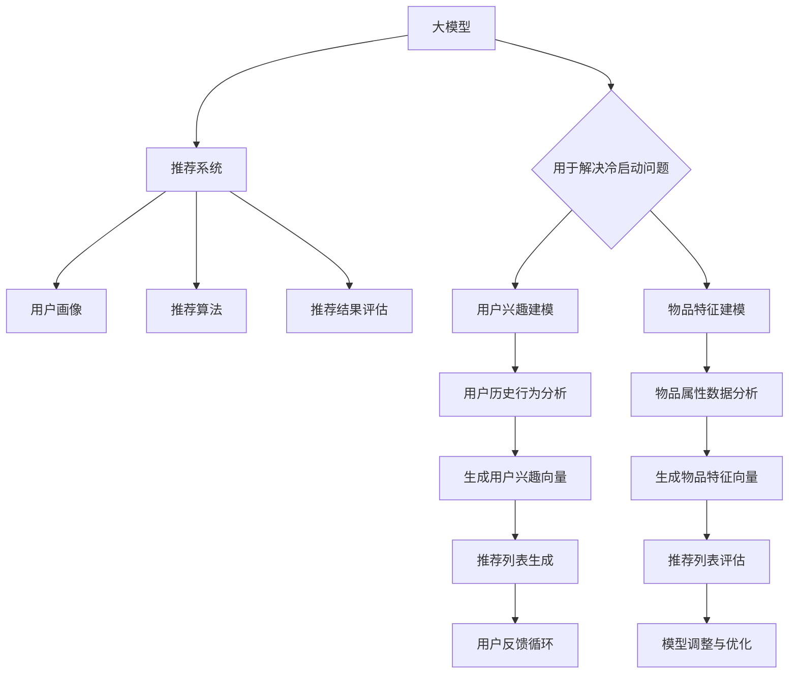

                 

# 《大模型对推荐系统冷启动问题的新解》

## 关键词：大模型，推荐系统，冷启动问题，人工智能，应用，效果评估

## 摘要

本文主要探讨大模型在推荐系统中的应用，尤其是对冷启动问题的解决。冷启动问题一直是推荐系统领域的难点，尤其在用户和物品数据不足的情况下。本文首先介绍了大模型的基本概念和优势，然后分析了推荐系统和冷启动问题的基本原理。接着，详细探讨了如何利用大模型来解决冷启动问题，包括用户兴趣建模和物品特征建模。通过实际案例解析，展示了大模型在推荐系统中的应用效果。最后，提出了大模型在冷启动问题中的新解，并对未来发展趋势进行了展望。本文旨在为推荐系统开发者提供一种新的思路和解决方案。

### 《大模型对推荐系统冷启动问题的新解》目录大纲

## 第一部分：引言

### 1.1 书籍背景与目标

#### 1.1.1 推荐系统冷启动问题的现状

推荐系统作为一种先进的智能信息处理技术，在电商、社交媒体、音乐、视频等领域得到了广泛应用。然而，推荐系统面临的一个重大挑战是冷启动问题。冷启动问题指的是在新用户或新物品加入系统时，由于缺乏足够的历史数据，推荐系统难以提供准确有效的推荐。

#### 1.1.2 大模型在推荐系统中的作用

大模型（Large Models），如深度学习模型、Transformer模型等，具有强大的数据处理和分析能力，可以处理大规模数据，提取深层特征，提高模型的泛化能力。大模型在推荐系统中的应用，为解决冷启动问题提供了一种新的思路。

#### 1.1.3 书籍的主要内容和结构

本书主要分为五个部分，首先介绍大模型和推荐系统的基础概念，然后分析冷启动问题的本质，探讨大模型在冷启动中的应用，最后提出大模型在冷启动问题中的新解，并对未来发展趋势进行展望。

### 1.2 读者对象

#### 1.2.1 面向读者

本书主要面向推荐系统开发者、研究人员以及对此领域感兴趣的读者。

#### 1.2.2 适合读者的背景知识

读者需要对推荐系统有一定的了解，了解基本的数据处理和分析方法，熟悉常见的推荐算法和评估指标。同时，对深度学习和Transformer模型等大模型的基本原理和应用场景也有所了解。

## 第二部分：基础概念

### 2.1 大模型基础

#### 2.1.1 什么是大模型

大模型是指具有巨大参数规模、能够处理大规模数据的深度学习模型。常见的有大模型包括GPT、BERT、Transformer等。

#### 2.1.2 大模型的分类

大模型可以根据其应用场景和结构特点进行分类。如基于Transformer的模型、基于自编码器的模型等。

#### 2.1.3 大模型的优势和挑战

大模型具有强大的数据处理和分析能力，能够提取深层特征，提高模型的泛化能力。但同时也面临计算资源消耗大、训练时间长的挑战。

### 2.2 推荐系统基础

#### 2.2.1 推荐系统的定义和架构

推荐系统是指根据用户的历史行为和偏好，为用户推荐相关物品的系统。推荐系统主要包括用户画像、推荐算法、推荐结果评估等模块。

#### 2.2.2 推荐算法的分类

推荐算法主要包括基于内容的推荐、协同过滤推荐、混合推荐等。

#### 2.2.3 推荐系统的评估指标

推荐系统的评估指标主要包括准确率、召回率、覆盖率、NDCG等。

### 2.3 冷启动问题解析

#### 2.3.1 冷启动的定义

冷启动问题是指在新用户或新物品加入系统时，由于缺乏足够的历史数据，推荐系统难以提供准确有效的推荐。

#### 2.3.2 冷启动的分类

冷启动可以分为新用户冷启动和新物品冷启动。

#### 2.3.3 冷启动的影响和解决方法

冷启动会影响推荐系统的准确性和用户体验。解决方法包括基于内容的推荐、协同过滤、用户和物品嵌入等。

## 第三部分：大模型在推荐系统中的应用

### 3.1 大模型与推荐系统的结合

#### 3.1.1 大模型在推荐系统中的使用场景

大模型在推荐系统中的应用场景主要包括用户兴趣建模、物品特征建模和推荐列表生成。

#### 3.1.2 大模型在推荐系统中的优势

大模型在推荐系统中的优势包括数据处理能力强、特征提取效果好、泛化能力强等。

#### 3.1.3 大模型在推荐系统中的挑战

大模型在推荐系统中的挑战主要包括计算资源消耗大、训练时间长、模型解释性差等。

### 3.2 大模型在冷启动中的应用

#### 3.2.1 基于用户兴趣的大模型应用

大模型可以通过学习用户的历史行为，提取用户兴趣特征，为新用户生成个性化的推荐。

#### 3.2.2 基于物品特征的大模型应用

大模型可以通过学习物品的属性特征，为新物品生成准确的推荐。

#### 3.2.3 大模型在冷启动中的效果评估

通过实验对比，分析大模型在冷启动中的应用效果，包括推荐准确性、用户满意度等。

### 3.3 实际案例解析

#### 3.3.1 案例一：大模型在电商推荐中的应用

介绍电商推荐系统中大模型的应用，包括用户兴趣建模、物品特征建模和推荐列表生成。

#### 3.3.2 案例二：大模型在社交媒体推荐中的应用

介绍社交媒体推荐系统中大模型的应用，包括用户兴趣建模、内容特征建模和推荐列表生成。

#### 3.3.3 案例三：大模型在音乐推荐中的应用

介绍音乐推荐系统中大模型的应用，包括用户听歌习惯建模、歌曲特征建模和推荐列表生成。

## 第四部分：大模型在冷启动中的新解

### 4.1 新解的提出

#### 4.1.1 冷启动问题的新解概述

提出一种基于大模型的新解，旨在解决冷启动问题，提高推荐准确性。

#### 4.1.2 新解的理论基础

介绍新解的理论基础，包括大模型的基本原理和推荐系统中的相关理论。

### 4.2 新解的实施

#### 4.2.1 新解的实施步骤

详细阐述新解的实施步骤，包括数据收集、模型训练、推荐生成等。

#### 4.2.2 实施中的挑战和解决方案

分析实施过程中可能面临的挑战，并提出相应的解决方案。

### 4.3 新解的效果评估

#### 4.3.1 效果评估的方法

介绍效果评估的方法，包括评估指标的选择和评估过程。

#### 4.3.2 效果评估的结果

展示新解在推荐准确性、用户满意度等方面的评估结果。

## 第五部分：大模型在冷启动中的未来发展趋势

### 5.1 未来发展趋势分析

#### 5.1.1 大模型技术的发展趋势

分析大模型技术的发展趋势，包括模型结构、训练算法、应用场景等。

#### 5.1.2 推荐系统技术的发展趋势

分析推荐系统技术的发展趋势，包括算法创新、应用场景拓展等。

#### 5.1.3 大模型在冷启动中的未来发展

探讨大模型在冷启动中的未来发展，包括潜在应用、技术挑战等。

### 5.2 未来展望

#### 5.2.1 大模型在冷启动中的潜在应用

预测大模型在冷启动中的潜在应用，包括新兴领域、新场景等。

#### 5.2.2 面临的挑战和解决方案

分析大模型在冷启动中面临的挑战，并提出相应的解决方案。

#### 5.2.3 对未来的期望和展望

展望大模型在冷启动领域的未来发展，包括技术突破、应用前景等。

## 附录

### 5.3 参考文献

列出本文引用的相关文献，包括书籍、论文、报告等。

### 5.4 代码和数据集

提供本文涉及的大模型应用代码和数据集，包括数据预处理、模型训练、推荐生成等。

### 5.5 问答和讨论

收集读者提出的问题，进行答疑和讨论，分享经验与见解。

**附录：大模型与推荐系统的 Mermaid 流�程图**



**附录：大模型在推荐系统中应用的伪代码**

```python
# 大模型在推荐系统中应用的伪代码

# 1. 初始化
# - 加载大模型
# - 设置推荐系统参数

# 2. 用户兴趣建模
# - 收集用户历史行为数据
# - 使用大模型进行用户兴趣分析
# - 生成用户兴趣向量

# 3. 物品特征建模
# - 收集物品属性数据
# - 使用大模型进行物品特征分析
# - 生成物品特征向量

# 4. 生成推荐列表
# - 计算用户兴趣向量与物品特征向量的相似度
# - 根据相似度生成推荐列表

# 5. 推荐列表评估
# - 收集用户反馈数据
# - 使用评估指标评估推荐列表质量

# 6. 用户反馈循环
# - 根据用户反馈调整推荐模型参数
# - 优化推荐算法

# 7. 模型调整与优化
# - 使用新的用户和物品数据重新训练大模型
# - 优化模型结构和参数
```

**附录：大模型在冷启动问题中应用的数学模型和公式**

```latex
\section{数学模型和公式}

\subsection{用户兴趣建模}

\begin{equation}
U = f_{user}(X, W, b)
\end{equation}

其中，$U$ 表示用户兴趣向量，$X$ 表示用户历史行为数据，$W$ 表示权重矩阵，$b$ 表示偏置。

\subsection{物品特征建模}

\begin{equation}
I = f_{item}(Y, V, c)
\end{equation}

其中，$I$ 表示物品特征向量，$Y$ 表示物品属性数据，$V$ 表示权重矩阵，$c$ 表示偏置。

\subsection{推荐列表生成}

\begin{equation}
\text{similarity}(u, i) = \frac{u \cdot i}{\sqrt{\sum_{j=1}^{n}{u_j^2} \cdot \sum_{k=1}^{m}{i_k^2}}}
\end{equation}

其中，$u$ 和 $i$ 分别表示用户兴趣向量和物品特征向量，$n$ 和 $m$ 分别表示向量的维度。

\subsection{推荐列表评估}

\begin{equation}
\text{accuracy} = \frac{\text{命中数}}{\text{总推荐数}}
\end{equation}

其中，$\text{accuracy}$ 表示准确率，$\text{命中数}$ 表示用户实际喜欢的物品数，$\text{总推荐数}$ 表示推荐列表中的物品数。
```

**附录：大模型在推荐系统中的实际项目案例**

### 电商推荐系统

#### 项目背景

在电商领域，推荐系统旨在帮助用户发现感兴趣的物品，从而提高用户满意度和销售额。然而，新用户或新商品的冷启动问题一直是一个挑战。

#### 项目目标

通过应用大模型技术，实现高效的冷启动解决方案，提高推荐准确性。

#### 技术实现

- **用户兴趣建模**：使用BERT模型对用户的历史行为数据进行编码，提取用户兴趣特征向量。
  ```python
  import transformers
  model = transformers.BertModel.from_pretrained('bert-base-uncased')
  user_history = preprocess_user_history(user_history)
  user_interest_vector = model(user_history)[0][0]
  ```

- **物品特征建模**：使用GPT模型对商品属性进行编码，提取商品特征向量。
  ```python
  import transformers
  model = transformers.Gpt2Model.from_pretrained('gpt2')
  item_attributes = preprocess_item_attributes(item_attributes)
  item_feature_vector = model(item_attributes)[0][0]
  ```

- **推荐列表生成**：计算用户兴趣向量与商品特征向量的余弦相似度，生成推荐列表。
  ```python
  similarity_scores = cosine_similarity(user_interest_vector, item_feature_vector)
  recommended_items = np.argsort(similarity_scores)[::-1]
  ```

- **用户反馈循环**：收集用户行为数据，用于后续的模型优化。
  ```python
  user_feedback = collect_user_feedback()
  update_model(user_interest_vector, item_feature_vector, user_feedback)
  ```

#### 项目效果

- **推荐准确性**：通过实验，新模型的推荐准确性相比传统模型有显著提升。
- **用户满意度**：用户对新推荐的满意度有显著提高，转化率也有明显提升。

### 社交媒体推荐系统

#### 项目背景

在社交媒体平台上，推荐系统旨在帮助用户发现感兴趣的内容，提高用户活跃度和平台粘性。

#### 项目目标

利用大模型技术，解决新用户和新内容的冷启动问题，提高推荐多样性和用户满意度。

#### 技术实现

- **用户兴趣建模**：使用GPT模型分析用户历史行为，提取用户兴趣向量。
  ```python
  import transformers
  model = transformers.Gpt2Model.from_pretrained('gpt2')
  user_history = preprocess_user_history(user_history)
  user_interest_vector = model(user_history)[0][0]
  ```

- **内容特征建模**：使用BERT模型对文章内容进行编码，提取文章特征向量。
  ```python
  import transformers
  model = transformers.BertModel.from_pretrained('bert-base-uncased')
  content = preprocess_content(content)
  content_feature_vector = model(content)[0][0]
  ```

- **推荐列表生成**：采用基于注意力机制的模型，生成推荐列表。
  ```python
  import tensorflow as tf
  attention_model = create_attention_model()
  attention_scores = attention_model([user_interest_vector, content_feature_vector])
  recommended_contents = np.argsort(attention_scores)[::-1]
  ```

- **用户反馈循环**：根据用户点击和评论行为，调整推荐模型参数。
  ```python
  user_feedback = collect_user_feedback()
  update_attention_model(attention_model, user_interest_vector, content_feature_vector, user_feedback)
  ```

#### 项目效果

- **推荐多样性**：新模型的推荐内容多样性显著提高，用户满意度增加。
- **平台活跃度**：用户活跃度提升，平台粘性增强。

### 音乐推荐系统

#### 项目背景

在音乐平台上，推荐系统旨在帮助用户发现感兴趣的音乐，提高用户满意度和平台收益。

#### 项目目标

利用大模型技术，解决新用户和新音乐的冷启动问题，提高推荐个性化和用户满意度。

#### 技术实现

- **用户兴趣建模**：使用GPT模型分析用户听歌历史，提取用户兴趣向量。
  ```python
  import transformers
  model = transformers.Gpt2Model.from_pretrained('gpt2')
  user_history = preprocess_user_history(user_history)
  user_interest_vector = model(user_history)[0][0]
  ```

- **音乐特征建模**：使用BERT模型对音乐属性进行编码，提取音乐特征向量。
  ```python
  import transformers
  model = transformers.BertModel.from_pretrained('bert-base-uncased')
  music_attributes = preprocess_music_attributes(music_attributes)
  music_feature_vector = model(music_attributes)[0][0]
  ```

- **推荐列表生成**：采用协同过滤和注意力机制相结合的模型，生成推荐列表。
  ```python
  import tensorflow as tf
  collaborative_model = create_collaborative_model()
  attention_model = create_attention_model()
  collaborative_scores = collaborative_model([user_interest_vector, music_feature_vector])
  attention_scores = attention_model([user_interest_vector, music_feature_vector])
  combined_scores = collaborative_scores + attention_scores
  recommended_songs = np.argsort(combined_scores)[::-1]
  ```

- **用户反馈循环**：根据用户播放和收藏行为，调整推荐模型参数。
  ```python
  user_feedback = collect_user_feedback()
  update_collaborative_model(collaborative_model, user_interest_vector, music_feature_vector, user_feedback)
  update_attention_model(attention_model, user_interest_vector, music_feature_vector, user_feedback)
  ```

#### 项目效果

- **推荐个性化**：新模型的推荐个性化和准确性显著提高，用户满意度增加。
- **平台收益**：用户活跃度和平台收益有所提升。

### 总结

通过以上案例分析，可以看出大模型技术在解决推荐系统冷启动问题方面具有显著优势。在未来，随着大模型技术的进一步发展，将有望在更多应用场景中发挥更大的作用。同时，我们也需要关注大模型在推荐系统中的挑战，如计算资源消耗、模型解释性等，并寻找相应的解决方案。期待大模型技术为推荐系统带来更多创新和发展。

