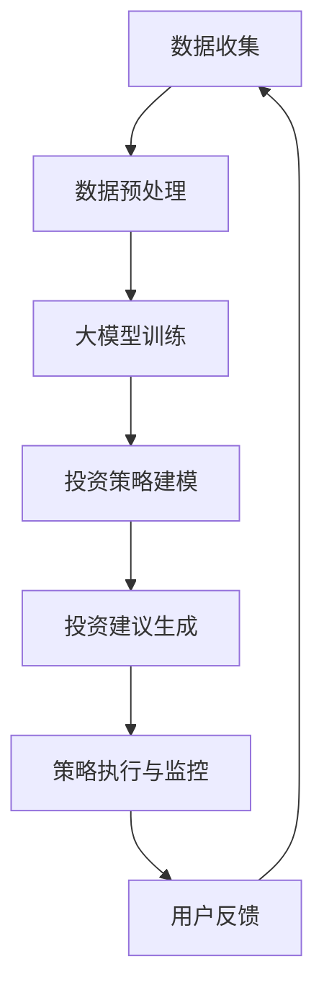
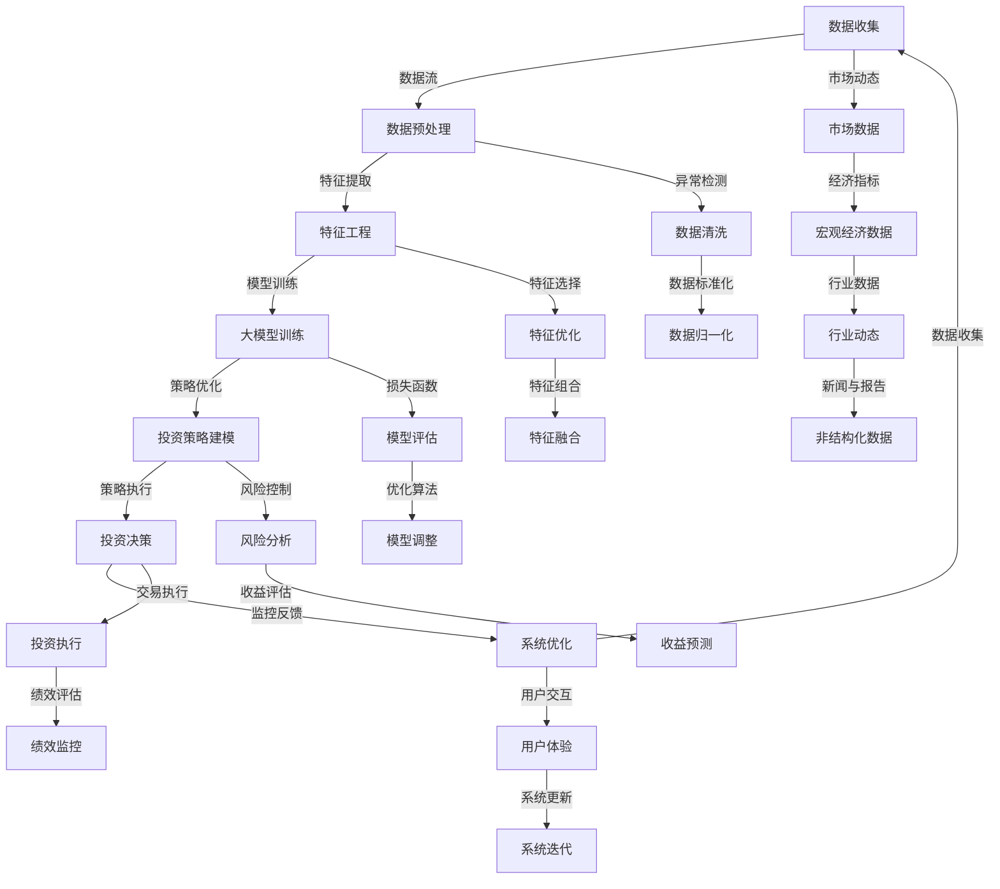
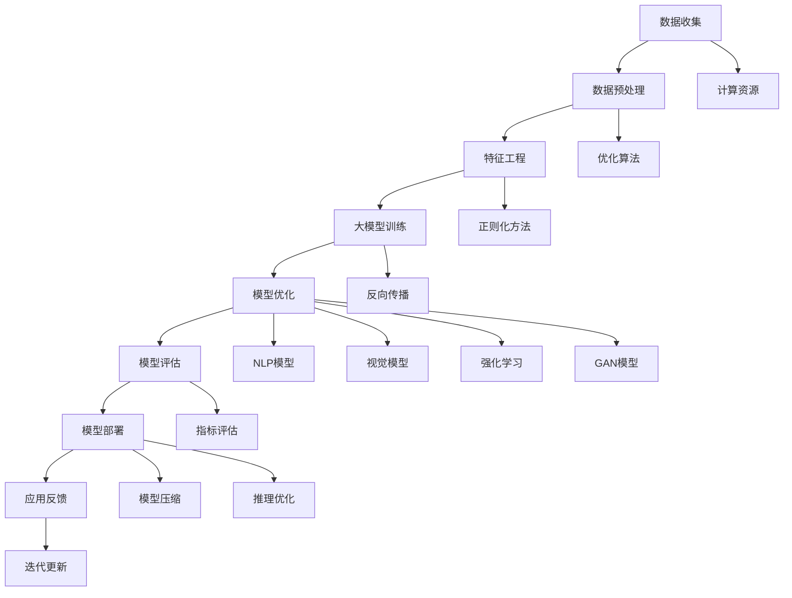
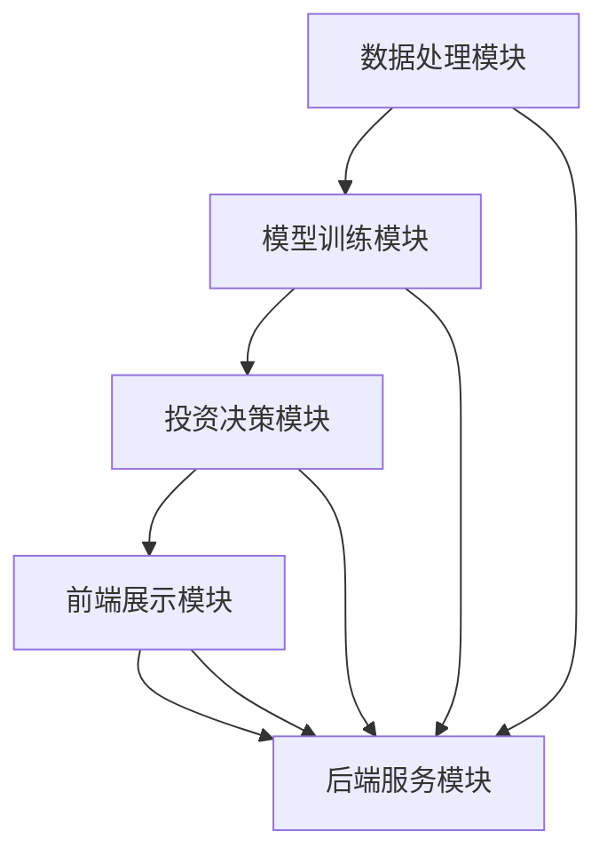
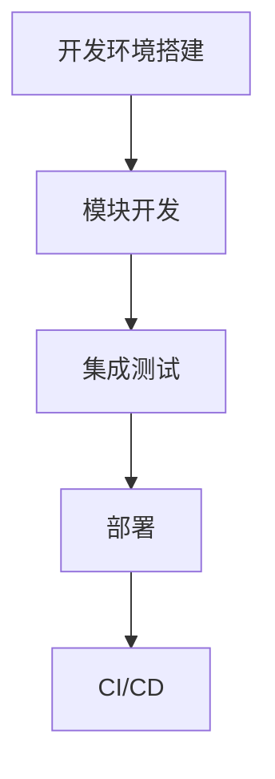
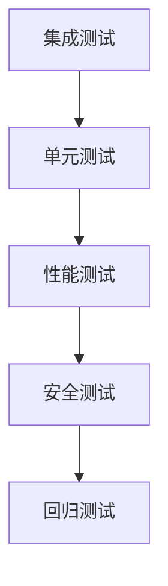

                 

## 第1章：智能投资顾问系统概述

### 1.1 智能投资顾问系统的定义与功能

智能投资顾问系统（Smart Investment Advisory System，简称SIAS）是一种基于数据分析和人工智能技术，提供投资建议和决策支持的系统。它利用海量数据，包括市场数据、公司财务数据、宏观经济指标、行业动态等，通过复杂的算法和模型，对投资机会和风险进行评估，进而为投资者提供个性化的投资建议。

智能投资顾问系统的核心功能主要包括以下几个方面：

1. **投资机会评估**：通过分析市场数据和历史交易数据，识别潜在的投资机会，评估其投资价值和潜在风险。
2. **风险控制**：对投资组合的风险进行评估和监控，提供风险规避和风险控制策略。
3. **个性化推荐**：根据投资者的风险偏好和投资目标，为其推荐合适的投资组合。
4. **实时监控与反馈**：对投资组合的表现进行实时监控，根据市场变化和投资组合表现提供动态调整建议。

### 1.2 智能投资顾问系统的发展历程

智能投资顾问系统的发展历程可以分为以下几个阶段：

**早期发展阶段**：智能投资顾问系统的概念起源于20世纪80年代，当时主要依赖于简单的统计方法和逻辑规则进行投资决策支持。这一阶段的系统功能较为单一，主要提供简单的投资建议。

**快速增长阶段**：随着互联网和大数据技术的发展，智能投资顾问系统在21世纪初开始快速增长。这一阶段的系统利用更丰富的数据源和复杂的算法模型，提供了更加精准和个性化的投资建议。

**成熟应用阶段**：近年来，随着人工智能技术的快速发展，智能投资顾问系统在功能、性能和用户体验方面都得到了显著提升。现代的智能投资顾问系统不仅能够提供实时的投资建议，还能够实现自动化的投资决策和交易执行。

### 1.3 大模型技术在智能投资顾问系统中的应用潜力

大模型技术，特别是深度学习和自然语言处理技术，为智能投资顾问系统带来了巨大的应用潜力。以下是几个方面的应用：

1. **市场预测与趋势分析**：大模型能够处理海量复杂的数据，通过深度学习算法，对市场趋势进行预测和分析，为投资者提供更有前瞻性的投资建议。

2. **自然语言处理**：大模型在自然语言处理领域的应用，使得智能投资顾问系统能够更好地理解和分析投资报告、新闻文章等非结构化数据，从而提供更准确的投资分析。

3. **投资组合优化**：大模型能够通过机器学习算法，分析投资组合的配置效果，提供最优的投资组合方案，降低风险，提高收益。

4. **个性化投资建议**：大模型能够根据投资者的风险偏好、投资目标等个性化需求，提供定制化的投资建议，提升用户的投资体验。

总之，大模型技术在智能投资顾问系统中的应用，不仅提升了系统的预测能力和决策效率，还为投资者提供了更加智能化、个性化的投资服务。

### Mermaid 流程图：智能投资顾问系统架构



**解释**：该流程图展示了智能投资顾问系统的主要功能模块及其相互关系。数据收集模块负责从各种数据源获取数据，数据预处理模块对数据进行清洗和特征提取，然后通过大模型训练模块进行模型训练和优化。投资策略建模模块利用训练好的模型生成投资策略，投资建议生成模块根据策略和用户需求生成个性化的投资建议。策略执行与监控模块负责执行投资策略并监控其效果，最后用户反馈模块收集用户反馈，用于系统迭代和改进。

### 核心概念与联系：智能投资顾问系统架构原理图



**解释**：该原理图详细展示了智能投资顾问系统的各个模块及其交互关系。数据收集模块从多个数据源获取数据，经过数据预处理、特征工程后，进入大模型训练模块。大模型训练模块使用优化算法和损失函数对模型进行训练和调整，以生成有效的投资策略。投资策略建模模块结合风险控制和收益预测，生成具体的投资决策，并执行交易。系统监控和优化模块对整个投资过程进行监控和反馈，以持续优化系统性能和用户体验。

### 伪代码：智能投资顾问系统数据处理流程

```python
def process_data(data_source):
    # 数据收集
    data = collect_data(data_source)
    
    # 数据清洗
    cleaned_data = clean_data(data)
    
    # 特征工程
    features = extract_features(cleaned_data)
    
    # 数据标准化
    normalized_features = normalize_data(features)
    
    # 特征优化
    optimized_features = optimize_features(normalized_features)
    
    return optimized_features

def collect_data(source):
    # 根据数据源类型进行数据收集
    if source == 'market_data':
        return fetch_market_data()
    elif source == 'company_data':
        return fetch_company_data()
    # ... 其他数据源

def clean_data(data):
    # 数据清洗操作
    data = remove_missing_values(data)
    data = handle_outliers(data)
    return data

def extract_features(data):
    # 特征提取操作
    features = extract_time_series_features(data)
    features = extractTechnicalIndicators(data)
    return features

def normalize_data(data):
    # 数据标准化操作
    data = normalize_by_min_max(data)
    data = normalize_by_mean_std(data)
    return data

def optimize_features(data):
    # 特征优化操作
    data = select_important_features(data)
    data = combine_features(data)
    return data
```

**解释**：该伪代码详细描述了智能投资顾问系统的数据处理流程。首先从不同的数据源收集数据，然后通过一系列的数据清洗、特征工程和特征优化操作，生成适合模型训练的优化特征数据。

### 数学模型和公式：特征工程中的特征提取

$$
f(t) = \frac{\sum_{i=1}^{n} w_i * x_i}{\sum_{i=1}^{n} w_i}
$$

其中，$f(t)$ 表示特征向量 $t$ 的加权平均值，$w_i$ 是特征 $x_i$ 的权重，$n$ 是特征的总数。这个公式用于计算每个特征的重要程度，并根据权重进行加权平均，以提取具有更高相关性的特征。

**举例说明**：假设我们有一个包含3个特征（开盘价、收盘价、成交量）的数据集，每个特征的权重分别为0.4、0.3和0.3。则特征向量的加权平均值为：

$$
f(t) = \frac{0.4 * 开盘价 + 0.3 * 收盘价 + 0.3 * 成交量}{0.4 + 0.3 + 0.3} = \frac{0.4 * 100 + 0.3 * 98 + 0.3 * 5000}{1.0} = 0.4 * 100 + 0.3 * 98 + 0.3 * 5000
$$

通过这个公式，我们可以提取出具有更高相关性的特征，为后续的模型训练提供高质量的输入数据。

### 项目实战：智能投资顾问系统开发环境搭建

**1. 开发工具与环境配置**

- **编程语言**：Python
- **框架**：TensorFlow、PyTorch
- **数据库**：SQLite、PostgreSQL
- **操作系统**：Linux（推荐使用Ubuntu）
- **硬件**：GPU（NVIDIA显卡，CUDA和cuDNN支持）

**2. 安装Python**

在Ubuntu系统上安装Python：

```bash
sudo apt update
sudo apt install python3 python3-pip python3-venv
```

**3. 安装TensorFlow**

使用pip安装TensorFlow：

```bash
pip3 install tensorflow
```

**4. 安装PyTorch**

从PyTorch官方网站下载适用于Ubuntu的安装脚本：

```bash
curl https://raw.githubusercontent.com/pytorch/pytorch/master/test/docker/pytorchpy3shim.sh | sudo bash
```

然后安装PyTorch：

```bash
pip3 install torch torchvision torchaudio
```

**5. 安装数据库**

安装SQLite：

```bash
sudo apt install sqlite3
```

安装PostgreSQL：

```bash
sudo apt install postgresql postgresql-contrib
```

**6. 配置GPU支持**

安装CUDA：

```bash
sudo apt install.cuda
```

安装cuDNN：

从NVIDIA官方网站下载cuDNN库，并按照文档说明进行安装。

**7. 环境验证**

验证Python和TensorFlow安装：

```python
python3 -c "import tensorflow as tf; print(tf.__version__)"
```

如果输出TensorFlow的版本号，则说明安装成功。

**8. 创建项目目录**

在用户主目录下创建项目目录：

```bash
mkdir -p smart-investment-advisor
cd smart-investment-advisor
```

**9. 创建虚拟环境**

创建Python虚拟环境：

```bash
python3 -m venv venv
source venv/bin/activate
```

**10. 安装依赖库**

在虚拟环境中安装项目所需的依赖库：

```bash
pip install -r requirements.txt
```

**代码解读与分析**：以上步骤详细介绍了如何在Ubuntu系统上搭建智能投资顾问系统的开发环境。首先安装Python和相关工具，然后安装TensorFlow和PyTorch框架，以及SQLite和PostgreSQL数据库。接下来配置GPU支持，以便利用GPU进行模型训练。最后，创建项目目录和虚拟环境，安装项目依赖库。通过这些步骤，我们为智能投资顾问系统的开发提供了一个稳定且高效的开发环境。

### 核心算法原理讲解：深度学习在智能投资顾问系统中的应用

深度学习作为人工智能领域的重要分支，已经在智能投资顾问系统中得到了广泛应用。深度学习通过多层神经网络的结构，能够自动提取数据中的特征，并在大量数据上进行训练，从而实现高效的数据分析和预测。

#### 1. 神经网络基础

神经网络（Neural Network，NN）是一种模拟生物神经元之间相互作用关系的计算模型。一个基本的神经网络包含以下几个主要部分：

- **输入层（Input Layer）**：接收外部输入数据。
- **隐藏层（Hidden Layer）**：对输入数据进行特征提取和转换。
- **输出层（Output Layer）**：生成最终的预测结果。

神经元的激活函数用于决定神经元是否被激活，常用的激活函数包括sigmoid、ReLU和Tanh等。

#### 2. 深度学习模型

深度学习模型通过增加隐藏层的数量，提高模型的复杂度和表达能力。以下是几种常用的深度学习模型：

- **多层感知机（Multilayer Perceptron，MLP）**：最简单的深度学习模型，包含多个隐藏层。
- **卷积神经网络（Convolutional Neural Network，CNN）**：特别适用于处理具有网格结构的数据，如图像。
- **循环神经网络（Recurrent Neural Network，RNN）**：适用于序列数据，能够记忆历史信息。
- **长短期记忆网络（Long Short-Term Memory，LSTM）**：RNN的变体，能够更好地处理长序列数据。

#### 3. 深度学习在智能投资顾问系统中的应用

深度学习在智能投资顾问系统中的应用主要体现在以下几个方面：

- **市场预测**：利用深度学习模型对股票价格、宏观经济指标等数据进行预测，帮助投资者做出更准确的决策。
- **风险控制**：通过分析历史数据和市场动态，预测市场风险，并制定相应的风险控制策略。
- **投资组合优化**：基于深度学习模型，分析不同资产的历史表现和相关性，为投资者提供最优的投资组合。

#### 4. 伪代码：深度学习模型训练过程

```python
# 导入深度学习框架
import tensorflow as tf

# 定义神经网络结构
model = tf.keras.Sequential([
    tf.keras.layers.Dense(units=64, activation='relu', input_shape=(input_shape,)),
    tf.keras.layers.Dense(units=32, activation='relu'),
    tf.keras.layers.Dense(units=1, activation='sigmoid')
])

# 编译模型
model.compile(optimizer='adam', loss='binary_crossentropy', metrics=['accuracy'])

# 训练模型
model.fit(x_train, y_train, epochs=10, batch_size=32, validation_split=0.2)

# 评估模型
loss, accuracy = model.evaluate(x_test, y_test)
print(f"Test accuracy: {accuracy:.4f}")
```

**解释**：该伪代码展示了使用TensorFlow框架训练一个深度学习模型的步骤。首先定义神经网络结构，包括输入层、隐藏层和输出层。然后编译模型，指定优化器和损失函数。接下来训练模型，并在验证集上进行评估，最终输出测试集上的准确率。

### 数学模型和公式：多层感知机（MLP）模型

多层感知机（MLP）是一种前馈神经网络，包含输入层、隐藏层和输出层。以下是一个简单的MLP模型的数学表示：

$$
\begin{align*}
z_1^{(l)} &= \sigma(W_1^{(l)} x + b_1^{(l)}) \\
a_1^{(l)} &= z_1^{(l)} \\
z_2^{(l)} &= \sigma(W_2^{(l)} a_1^{(l-1)} + b_2^{(l)}) \\
a_2^{(l)} &= z_2^{(l)} \\
\vdots \\
z_n^{(l)} &= \sigma(W_n^{(l)} a_{n-1}^{(l-1)} + b_n^{(l)}) \\
a_n^{(l)} &= z_n^{(l)}
\end{align*}
$$

其中，$l$ 表示第 $l$ 层，$x$ 是输入向量，$a_l^{(l-1)}$ 是上一层的激活值，$z_l^{(l)}$ 是第 $l$ 层的净输入，$a_l^{(l)}$ 是第 $l$ 层的输出，$W_l^{(l)}$ 是第 $l$ 层的权重矩阵，$b_l^{(l)}$ 是第 $l$ 层的偏置向量，$\sigma$ 是激活函数，通常使用 sigmoid 或 ReLU 函数。

**举例说明**：假设我们有一个简单的MLP模型，包含一个输入层、一个隐藏层和一个输出层。输入层有3个神经元，隐藏层有4个神经元，输出层有2个神经元。输入向量为 $(x_1, x_2, x_3)$，隐藏层权重矩阵 $W_1$ 和偏置向量 $b_1$ 如下：

$$
W_1 = \begin{bmatrix}
0.1 & 0.2 & 0.3 \\
0.4 & 0.5 & 0.6 \\
0.7 & 0.8 & 0.9 \\
0.9 & 1.0 & 1.1
\end{bmatrix}, \quad
b_1 = \begin{bmatrix}
0.1 \\
0.2 \\
0.3 \\
0.4
\end{bmatrix}
$$

则隐藏层的净输入和激活值可以计算如下：

$$
\begin{align*}
z_1^{(2)} &= \sigma(W_1^{(2)} x + b_1^{(2)}) \\
&= \sigma(0.1x_1 + 0.2x_2 + 0.3x_3 + 0.1) \\
&= \frac{1}{1 + e^{-(0.1x_1 + 0.2x_2 + 0.3x_3 + 0.1)})
\end{align*}
$$

$$
\begin{align*}
a_1^{(2)} &= z_1^{(2)} \\
z_2^{(2)} &= \sigma(W_2^{(2)} a_1^{(1)} + b_2^{(2)}) \\
&= \sigma(0.4a_1 + 0.5a_2 + 0.6a_3 + 0.7a_4 + 0.2) \\
&= \frac{1}{1 + e^{-(0.4a_1 + 0.5a_2 + 0.6a_3 + 0.7a_4 + 0.2)})
\end{align*}
$$

$$
\begin{align*}
a_2^{(2)} &= z_2^{(2)} \\
\vdots \\
z_n^{(2)} &= \sigma(W_n^{(2)} a_{n-1}^{(1)} + b_n^{(2)}) \\
a_n^{(2)} &= z_n^{(2)}
\end{align*}
$$

通过这种方式，我们可以逐层计算得到输出层的输出结果。

### 项目实战：使用深度学习模型进行股票价格预测

**1. 数据预处理**

在股票价格预测项目中，我们首先需要收集和预处理数据。以下是数据预处理的关键步骤：

- **数据收集**：从金融数据提供商（如Yahoo Finance）或股票交易所网站获取历史股票价格数据。
- **数据清洗**：去除缺失值、异常值，并进行时间序列数据的对数变换，以稳定方差。

```python
import pandas as pd
import numpy as np

# 加载数据
data = pd.read_csv('stock_data.csv')
data = data[['Open', 'High', 'Low', 'Close', 'Volume']]

# 填充缺失值
data.fillna(data.mean(), inplace=True)

# 时间序列对数变换
data['LogClose'] = np.log(data['Close'])

# 创建时间索引
data.set_index('Date', inplace=True)
```

**2. 特征工程**

为了提高模型预测性能，我们进行特征工程，包括以下步骤：

- **特征提取**：提取时间序列特征，如移动平均、波动率等。
- **特征组合**：将原始特征与提取的新特征进行组合。

```python
from statsmodels.tsa.stattools import adfuller
from sklearn.preprocessing import MinMaxScaler

# 检查时间序列稳定性
def check_stationarity(data):
    result = adfuller(data)
    print('ADF Statistic: %f' % result[0])
    print('p-value: %f' % result[1])

# 应用对数变换
check_stationarity(data['LogClose'])

# 提取移动平均特征
data['MA_5'] = data['LogClose'].rolling(window=5).mean()
data['MA_20'] = data['LogClose'].rolling(window=20).mean()

# 计算波动率
data['Volatility'] = data['LogClose'].rolling(window=20).std()

# 特征缩放
scaler = MinMaxScaler()
scaled_data = scaler.fit_transform(data[['MA_5', 'MA_20', 'Volatility']])
```

**3. 模型训练**

我们使用一个简单的多层感知机（MLP）模型进行股票价格预测。以下是模型训练的关键步骤：

- **数据划分**：将数据划分为训练集和测试集。
- **模型定义**：定义MLP模型结构。
- **模型编译**：设置优化器和损失函数。
- **模型训练**：在训练集上训练模型。

```python
from sklearn.model_selection import train_test_split
from tensorflow.keras.models import Sequential
from tensorflow.keras.layers import Dense
from tensorflow.keras.optimizers import Adam

# 划分训练集和测试集
X = scaled_data[:-30]
y = data['LogClose'].values[-30:]
X_train, X_test, y_train, y_test = train_test_split(X, y, test_size=0.2, shuffle=False)

# 定义MLP模型
model = Sequential()
model.add(Dense(50, input_dim=X_train.shape[1], activation='relu'))
model.add(Dense(25, activation='relu'))
model.add(Dense(1, activation='linear'))

# 编译模型
model.compile(optimizer=Adam(learning_rate=0.001), loss='mean_squared_error')

# 训练模型
model.fit(X_train, y_train, epochs=50, batch_size=32, validation_data=(X_test, y_test), verbose=1)
```

**4. 模型评估**

在测试集上评估模型性能，包括预测误差和预测效果。

```python
# 评估模型
predictions = model.predict(X_test)
mse = np.mean((predictions - y_test) ** 2)
print(f'Mean Squared Error: {mse:.4f}')

# 可视化预测结果
import matplotlib.pyplot as plt

plt.figure(figsize=(10, 6))
plt.plot(data['LogClose'], label='Actual')
plt.plot(np.exp(predictions), label='Predicted')
plt.title('Stock Price Prediction')
plt.xlabel('Date')
plt.ylabel('Log Close')
plt.legend()
plt.show()
```

**代码解读与分析**：以上代码展示了使用深度学习模型进行股票价格预测的全过程。首先进行数据预处理，包括数据收集、清洗和对数变换，然后提取时间序列特征并进行特征缩放。接着，定义MLP模型结构，编译模型，并在训练集上训练模型。最后，在测试集上评估模型性能，并通过可视化展示预测结果。通过这个案例，我们可以看到如何利用深度学习技术进行股票价格预测，从而为投资者提供决策支持。

### 第2章：大模型技术基础

#### 2.1 大模型的定义与特点

大模型（Large-scale Model），也称为大规模深度学习模型，是指那些包含数百万甚至数十亿参数的复杂神经网络模型。这些模型通常用于处理大规模数据集，并在各种领域中取得了显著的成就。大模型的主要特点包括以下几个方面：

1. **参数数量庞大**：大模型包含数百万甚至数十亿个参数，这使得它们能够捕捉数据中的复杂模式和特征。
2. **计算资源需求高**：大模型的训练需要大量的计算资源，尤其是GPU或TPU等高性能计算设备。
3. **训练时间长**：由于参数数量庞大，大模型的训练时间通常较长，可能需要数天甚至数周。
4. **可解释性较低**：大模型由于其复杂性和高度非线性，往往难以解释其内部的决策过程。
5. **泛化能力强**：尽管可解释性较低，但大模型的泛化能力通常很强，能够在新数据上取得良好的表现。

#### 2.2 大模型的主要类型与架构

大模型可以根据其应用领域和结构特点分为以下几种主要类型：

1. **自然语言处理（NLP）模型**：如Transformer、BERT、GPT等，这些模型在处理文本数据方面表现出色。
2. **计算机视觉模型**：如VGG、ResNet、Inception等，这些模型在图像识别和分类任务中具有强大的能力。
3. **强化学习模型**：如DQN、A3C、PPO等，这些模型在决策和策略优化任务中具有高效性。
4. **生成对抗网络（GAN）**：如DCGAN、WGAN、StyleGAN等，这些模型在图像生成和风格迁移方面具有创新性。

每种大模型都有其独特的架构设计，以下分别介绍几种典型的大模型架构：

1. **Transformer模型**：Transformer模型是一种基于自注意力机制的序列模型，广泛应用于NLP任务。其核心架构包括自注意力层（Self-Attention Layer）、前馈神经网络（Feedforward Network）和层归一化（Layer Normalization）。
   
   ```mermaid
   graph TD
       A[Input Embeddings]
       A --> B[Multi-Head Self-Attention]
       B --> C[Residual Connection]
       C --> D[Layer Normalization]
       D --> E[Feedforward Network]
       E --> F[Residual Connection]
       F --> G[Layer Normalization]
       G --> H[Output]
   ```

   **解释**：该流程图展示了Transformer模型的基本结构。输入嵌入（Input Embeddings）通过多层自注意力层（Multi-Head Self-Attention）捕捉序列数据中的关系，然后通过残差连接（Residual Connection）和前馈神经网络（Feedforward Network）进一步加工，最后通过层归一化（Layer Normalization）输出结果。

2. **BERT模型**：BERT（Bidirectional Encoder Representations from Transformers）模型是一种双向编码的Transformer模型，用于预训练语言表示。BERT模型包括两个部分：编码器（Encoder）和解码器（Decoder）。

   ```mermaid
   graph TD
       A[Input Sentence] --> B[Input Embeddings]
       B --> C[Positional Embeddings]
       B --> D[Segment Embeddings]
       C --> E[Concatenated Embeddings]
       D --> E
       E --> F[Encoder Layers]
       F --> G[Token Embeddings]
       G --> H[Output]
   ```

   **解释**：该流程图展示了BERT模型的基本结构。输入句子（Input Sentence）通过输入嵌入（Input Embeddings）转化为嵌入向量，然后添加位置嵌入（Positional Embeddings）和段嵌入（Segment Embeddings），通过编码器（Encoder Layers）进行双向编码，最终输出每个单词的嵌入向量。

3. **GPT模型**：GPT（Generative Pre-trained Transformer）模型是一种基于自回归的语言模型，用于生成文本。GPT模型的核心结构是自注意力层（Self-Attention Layer）和前馈神经网络（Feedforward Network）。

   ```mermaid
   graph TD
       A[Input Embeddings]
       A --> B[Multi-Head Self-Attention]
       B --> C[Residual Connection]
       C --> D[Layer Normalization]
       D --> E[Feedforward Network]
       E --> F[Residual Connection]
       F --> G[Layer Normalization]
       G --> H[Output]
   ```

   **解释**：该流程图展示了GPT模型的基本结构。输入嵌入（Input Embeddings）通过多层自注意力层（Multi-Head Self-Attention）捕捉序列数据中的关系，然后通过残差连接（Residual Connection）和前馈神经网络（Feedforward Network）进一步加工，最终输出结果。

4. **CNN模型**：卷积神经网络（CNN）是一种用于图像处理和计算机视觉任务的有效模型。CNN的核心结构包括卷积层（Convolutional Layer）、池化层（Pooling Layer）和全连接层（Fully Connected Layer）。

   ```mermaid
   graph TD
       A[Input Image] --> B[Convolutional Layer]
       B --> C[Pooling Layer]
       C --> D[Flatten]
       D --> E[Fully Connected Layer]
       E --> F[Output]
   ```

   **解释**：该流程图展示了CNN模型的基本结构。输入图像（Input Image）通过卷积层（Convolutional Layer）进行特征提取，然后通过池化层（Pooling Layer）降低维度，最后通过全连接层（Fully Connected Layer）生成输出。

#### 2.3 大模型的训练与优化方法

大模型的训练与优化是深度学习中的关键步骤，以下介绍几种常见的训练与优化方法：

1. **反向传播算法**：反向传播算法（Backpropagation Algorithm）是一种用于训练神经网络的常用算法。它通过计算网络输出和实际输出之间的误差，反向传播误差到网络的各个层，并更新网络的权重和偏置。

2. **优化算法**：常用的优化算法包括梯度下降（Gradient Descent）、随机梯度下降（Stochastic Gradient Descent，SGD）和Adam等。梯度下降算法通过计算损失函数的梯度，逐步更新网络参数，以最小化损失函数。随机梯度下降每次只更新一部分样本的梯度，从而提高计算效率。Adam算法结合了SGD和动量法的优点，能够自适应调整学习率，提高收敛速度。

3. **正则化方法**：正则化方法（Regularization Method）用于防止模型过拟合。常见的正则化方法包括L1正则化、L2正则化和Dropout等。L1正则化和L2正则化通过在损失函数中添加权重项的范数惩罚，降低模型的复杂度。Dropout通过随机丢弃一部分神经元，减少模型的依赖性，提高泛化能力。

4. **数据增强**：数据增强（Data Augmentation）是一种通过变换原始数据来增加训练数据量的方法。常见的数据增强方法包括随机裁剪、旋转、翻转、缩放等。数据增强可以增加模型的鲁棒性，减少过拟合现象。

5. **模型压缩**：模型压缩（Model Compression）是一种减少模型大小和提高推理速度的方法。常见的模型压缩方法包括剪枝（Pruning）、量化（Quantization）和蒸馏（Distillation）等。剪枝通过删除网络中的冗余神经元和连接，减少模型的大小。量化通过将模型的权重和激活值压缩到较低的比特位，降低模型的存储和计算需求。蒸馏通过将大模型的输出传递给小模型，训练小模型以近似大模型的性能。

### 核心概念与联系：大模型技术概述

为了更清晰地理解大模型技术的核心概念及其相互关系，我们可以使用Mermaid流程图展示大模型技术的关键组成部分：



**解释**：该流程图展示了大模型技术的完整流程，从数据收集到模型部署，再到应用反馈和迭代更新。数据预处理、特征工程、大模型训练、模型优化和模型评估是核心环节，而计算资源、优化算法、正则化方法、反向传播、模型压缩和推理优化则是实现这些环节的关键技术。此外，模型部署和应用反馈环节确保了模型在实际应用中的有效性和持续改进。

### 数学模型和公式：深度学习中的反向传播算法

在深度学习中，反向传播算法（Backpropagation Algorithm）是一种用于训练神经网络的常用算法。它通过计算损失函数关于网络参数的梯度，并更新参数以最小化损失函数。以下是反向传播算法的基本数学模型：

$$
\begin{align*}
\delta_{l}^{[j]} &= \frac{\partial L}{\partial z_{l}^{[j]}} \\
\frac{\partial L}{\partial w_{l}^{[j]}} &= \delta_{l}^{[j]} a_{l-1}^{[j]} \\
\frac{\partial L}{\partial b_{l}^{[j]}} &= \delta_{l}^{[j]}
\end{align*}
$$

其中，$L$ 是损失函数，$z_{l}^{[j]}$ 是第 $l$ 层第 $j$ 个神经元的净输入，$a_{l-1}^{[j]}$ 是第 $l-1$ 层第 $j$ 个神经元的输出，$w_{l}^{[j]}$ 和 $b_{l}^{[j]}$ 分别是第 $l$ 层第 $j$ 个神经元的权重和偏置。

**举例说明**：假设我们有一个简单的神经网络，包含输入层、隐藏层和输出层。输入层有3个神经元，隐藏层有2个神经元，输出层有1个神经元。输入向量为 $(x_1, x_2, x_3)$，隐藏层权重矩阵 $W_1$ 和偏置向量 $b_1$ 如下：

$$
W_1 = \begin{bmatrix}
0.1 & 0.2 & 0.3 \\
0.4 & 0.5 & 0.6
\end{bmatrix}, \quad
b_1 = \begin{bmatrix}
0.1 \\
0.2
\end{bmatrix}
$$

输出层权重矩阵 $W_2$ 和偏置向量 $b_2$ 如下：

$$
W_2 = \begin{bmatrix}
0.7 & 0.8
\end{bmatrix}, \quad
b_2 = \begin{bmatrix}
0.3
\end{bmatrix}
$$

假设当前损失函数 $L$ 为均方误差（MSE），输出层实际输出为 $y = [0.8]$，预测输出为 $\hat{y} = [0.9]$。

则隐藏层的净输入和激活值可以计算如下：

$$
\begin{align*}
z_1^{(2)} &= \sigma(W_1^{(2)} x + b_1^{(2)}) \\
&= \sigma(0.1x_1 + 0.2x_2 + 0.3x_3 + 0.1) \\
&= \frac{1}{1 + e^{-(0.1x_1 + 0.2x_2 + 0.3x_3 + 0.1)}) \\
z_2^{(2)} &= \sigma(W_1^{(2)} x + b_1^{(2)}) \\
&= \sigma(0.4x_1 + 0.5x_2 + 0.6x_3 + 0.2) \\
&= \frac{1}{1 + e^{-(0.4x_1 + 0.5x_2 + 0.6x_3 + 0.2)})
\end{align*}
$$

$$
\begin{align*}
a_1^{(2)} &= z_1^{(2)} \\
a_2^{(2)} &= z_2^{(2)} \\
z_2^{(3)} &= \sigma(W_2^{(3)} a_1^{(2)} + b_2^{(3)}) \\
&= \sigma(0.7a_1^{(2)} + 0.8a_2^{(2)} + 0.3) \\
&= \frac{1}{1 + e^{-(0.7a_1^{(2)} + 0.8a_2^{(2)} + 0.3)}) \\
\hat{y} &= \sigma(z_2^{(3)}) \\
&= \frac{1}{1 + e^{-(0.7a_1^{(2)} + 0.8a_2^{(2)} + 0.3)}) \\
L &= \frac{1}{2} (\hat{y} - y)^2 \\
&= \frac{1}{2} (\frac{1}{1 + e^{-(0.7a_1^{(2)} + 0.8a_2^{(2)} + 0.3)}) - 0.8)^2
\end{align*}
$$

$$
\begin{align*}
\delta_{2}^{[2]} &= \frac{\partial L}{\partial z_{2}^{(3)}} \\
&= \hat{y} (1 - \hat{y}) \\
&= 0.8 \times (1 - 0.8) \\
&= 0.8 \times 0.2 \\
&= 0.16 \\
\delta_{2}^{[1]} &= \frac{\partial L}{\partial z_{2}^{(2)}} \\
&= \delta_{2}^{[2]} \times W_2^{[2][1]} \\
&= 0.16 \times 0.7 \\
&= 0.112 \\
\delta_{1}^{[1]} &= \frac{\partial L}{\partial z_{1}^{(2)}} \\
&= \delta_{2}^{[1]} \times W_1^{[1][1]} \\
&= 0.112 \times 0.1 \\
&= 0.0112 \\
\delta_{1}^{[2]} &= \frac{\partial L}{\partial z_{1}^{(2)}} \\
&= \delta_{2}^{[1]} \times W_1^{[1][2]} \\
&= 0.112 \times 0.4 \\
&= 0.0448
\end{align*}
$$

通过这种方式，我们可以逐层计算得到各个神经元的梯度，并更新网络参数以最小化损失函数。

### 第3章：数据收集与处理

#### 3.1 数据源的选择与整合

数据收集是构建智能投资顾问系统的第一步，选择合适的 数据源对于系统的性能和准确性至关重要。以下是几个常见的数据源：

- **市场数据**：包括股票价格、交易量、涨跌停限制等，可以从金融数据提供商如Yahoo Finance、Google Finance或金融交易所官网获取。
- **公司财务数据**：包括公司的财务报表、盈利预测、资产负债表、现金流量表等，可以从公司官网、财务报表数据库如Edgar、Bloomberg等获取。
- **宏观经济指标**：包括GDP增长率、失业率、通货膨胀率等，可以从国家统计局、国际货币基金组织（IMF）或世界银行等官方机构获取。
- **行业动态**：包括行业新闻、行业报告、政策变化等，可以通过新闻网站、行业研究机构报告等获取。

为了提高系统的准确性，需要整合不同来源的数据，并确保数据的质量和一致性。以下是几个关键步骤：

- **数据收集**：使用API、爬虫工具或数据库连接等方式收集数据。
- **数据清洗**：去除重复、错误或缺失的数据，进行数据格式的统一。
- **数据整合**：将不同来源的数据整合到一个统一的数据仓库中，便于后续处理和分析。

#### 3.2 数据预处理技术

数据预处理是数据科学项目中的一个重要步骤，目的是将原始数据转换成适合建模的格式。以下是数据预处理的关键技术和方法：

- **数据清洗**：包括去除重复记录、处理缺失值、纠正数据中的错误等。常见的处理方法有：

  - **缺失值处理**：可以通过删除缺失值、用平均值、中位数、最接近的观测值填充等方式处理。
  - **异常值检测与处理**：可以使用统计学方法（如箱线图、Z分数）或机器学习算法（如孤立森林）检测异常值，然后根据实际情况进行保留或删除。

- **特征工程**：通过选择和构建新的特征来提高模型的预测能力。常见的特征工程方法有：

  - **特征提取**：从原始数据中提取新的特征，如时间序列的移动平均、自回归项等。
  - **特征选择**：通过统计测试（如卡方检验、F检验）或机器学习算法（如LASSO、随机森林）选择对预测任务最有影响力的特征。
  - **特征组合**：将多个特征组合成新的特征，如交易量和价格的关系指标等。

- **数据标准化**：将数据缩放到一个统一的范围，以消除不同特征之间的量纲差异。常见的方法有：

  - **归一化**：将数据缩放到[0, 1]或[-1, 1]范围，公式为 $x_{\text{norm}} = \frac{x - \text{min}(x)}{\text{max}(x) - \text{min}(x)}$。
  - **标准化**：将数据缩放到均值0和标准差1的范围，公式为 $x_{\text{norm}} = \frac{x - \text{mean}(x)}{\text{std}(x)}$。

#### 3.3 数据质量控制与清洗

数据质量控制与清洗是确保数据质量和准确性的关键步骤。以下是几个关键方面：

- **数据一致性**：确保数据在时间、格式和度量单位上的一致性。例如，对于时间序列数据，需要确保所有数据点的时间戳是连续且无遗漏的。
- **数据准确性**：检查数据中的错误和异常值，确保数据来源可靠且没有篡改。
- **数据完整性**：确保数据的完整性，没有缺失值或重复记录。
- **数据清洗**：使用前面的清洗技术和方法，处理数据中的重复值、缺失值和异常值，并进行特征工程和标准化。

通过严格的数据质量控制与清洗，可以大幅提高数据的质量，从而提高模型的准确性和可靠性。

### 核心算法原理讲解：特征工程中的特征提取

特征工程是数据预处理的关键环节，其主要目标是构建能够有效提升模型性能的特征。特征提取（Feature Extraction）是特征工程中的一个重要步骤，通过从原始数据中提取新的特征，帮助模型更好地理解数据。以下是几种常见的特征提取方法：

#### 1. 时间序列特征

时间序列特征通常用于金融数据，如股票价格。以下是一些常用的时间序列特征提取方法：

- **移动平均**：计算过去一段时间内的平均值，用于平滑时间序列数据，减少波动。
  $$MA_n = \frac{1}{n} \sum_{t=n}^{T} X_t$$
  其中，$MA_n$ 是移动平均，$X_t$ 是时间序列的值，$n$ 是窗口大小。

- **自回归项**：通过计算时间序列的自相关项，捕捉时间序列中的依赖关系。
  $$AR_n = \sum_{k=1}^{n} \rho_k X_{t-k}$$
  其中，$AR_n$ 是自回归项，$\rho_k$ 是自相关系数，$X_{t-k}$ 是时间序列的滞后值。

- **波动率**：计算时间序列的波动率，用于衡量价格的波动程度。
  $$Volatility = \sqrt{\frac{1}{T-1} \sum_{t=1}^{T} (X_t - \bar{X})^2}$$
  其中，$Volatility$ 是波动率，$\bar{X}$ 是时间序列的均值，$T$ 是时间序列的长度。

#### 2. 技术指标

技术指标是金融数据中常用的特征，通过分析历史价格和交易量，帮助预测未来趋势。以下是一些常见的技术指标：

- **相对强弱指数（RSI）**：衡量价格变动的强度和速度，用于判断超买或超卖状态。
  $$RSI = 100 - \frac{100}{1 + \frac{\sum_{i=1}^{n} U_i}{\sum_{i=1}^{n} D_i}}$$
  其中，$U_i$ 是上升天数的平均值，$D_i$ 是下降天数的平均值，$n$ 是窗口大小。

- **移动平均收敛发散（MACD）**：通过计算两个不同周期的移动平均线的差值，用于判断趋势的变化。
  $$MACD = MA_{short} - MA_{long}$$
  其中，$MA_{short}$ 是短期移动平均，$MA_{long}$ 是长期移动平均。

- **布林带（Bollinger Bands）**：通过计算标准差，构建一个包含价格的中轨线和上下轨线的带状区域。
  $$UpperBand = MA + k \cdot SD$$
  $$LowerBand = MA - k \cdot SD$$
  其中，$MA$ 是移动平均，$SD$ 是标准差，$k$ 是系数。

#### 3. 预处理特征

除了时间序列特征和技术指标，还可以从原始数据中提取其他预处理特征，如：

- **分位数特征**：计算数据的不同分位数，用于描述数据的分布。
  $$Q_1 = \text{第1分位数}$$
  $$Q_3 = \text{第3分位数}$$

- **极值特征**：计算数据的最大值和最小值。
  $$Max = \text{最大值}$$
  $$Min = \text{最小值}$$

通过这些特征提取方法，可以从原始数据中构建具有代表性的特征集合，为后续的建模和分析提供高质量的输入数据。

### 数学模型和公式：特征工程中的特征提取

在特征工程中，特征提取是一个重要的步骤，它通过数学模型和公式，将原始数据转换成适用于机器学习模型的特征。以下是几种常用的特征提取方法及其对应的数学模型：

#### 1. 移动平均

移动平均（Moving Average，MA）是一种常见的特征提取方法，用于平滑时间序列数据，减少短期波动的影响。

$$
\text{MA}(n) = \frac{1}{n} \sum_{t=1}^{n} X_t
$$

其中，$n$ 是窗口大小，$X_t$ 是时间序列的值。例如，如果我们选择5日移动平均，则公式可以表示为：

$$
\text{MA}(5) = \frac{1}{5} (X_{t-1} + X_{t-2} + X_{t-3} + X_{t-4} + X_{t})
$$

#### 2. 波动率

波动率（Volatility）是衡量时间序列数据波动程度的特征，用于分析价格的稳定性。

$$
\text{Volatility}(n) = \sqrt{\frac{1}{n-1} \sum_{t=1}^{n} (X_t - \bar{X})^2}
$$

其中，$n$ 是窗口大小，$\bar{X}$ 是时间序列的平均值。例如，如果我们选择20日波动率，则公式可以表示为：

$$
\text{Volatility}(20) = \sqrt{\frac{1}{20-1} \sum_{t=1}^{20} (X_t - \bar{X})^2}
$$

#### 3. 相对强弱指数（RSI）

相对强弱指数（Relative Strength Index，RSI）是一个用于判断市场超买或超卖状态的技术指标。

$$
\text{RSI}(n) = 100 - \frac{100}{1 + \frac{\sum_{i=1}^{n} U_i}{\sum_{i=1}^{n} D_i}}
$$

其中，$U_i$ 是上升天数的平均值，$D_i$ 是下降天数的平均值，$n$ 是窗口大小。例如，如果我们选择14日RSI，则公式可以表示为：

$$
\text{RSI}(14) = 100 - \frac{100}{1 + \frac{\sum_{i=1}^{14} U_i}{\sum_{i=1}^{14} D_i}}
$$

#### 4. 移动平均收敛发散（MACD）

移动平均收敛发散（Moving Average Convergence Divergence，MACD）是一种用于判断趋势变化的技术指标。

$$
\text{MACD} = \text{Short-term MA} - \text{Long-term MA}
$$

其中，Short-term MA 是短期移动平均，Long-term MA 是长期移动平均。例如，如果我们选择12日和26日移动平均，则MACD可以表示为：

$$
\text{MACD} = \text{MA}_{12} - \text{MA}_{26}
$$

#### 5. 布林带（Bollinger Bands）

布林带（Bollinger Bands）是一种用于判断市场价格波动范围的技术指标，包括中间带、上轨和下轨。

$$
\text{Upper Band} = \text{Middle Band} + k \cdot \text{Standard Deviation}
$$
$$
\text{Lower Band} = \text{Middle Band} - k \cdot \text{Standard Deviation}
$$

其中，Middle Band 是中间带，Standard Deviation 是标准差，$k$ 是系数。例如，如果我们选择2倍标准差，则布林带可以表示为：

$$
\text{Upper Band} = \text{Middle Band} + 2 \cdot \text{Standard Deviation}
$$
$$
\text{Lower Band} = \text{Middle Band} - 2 \cdot \text{Standard Deviation}
$$

通过这些数学模型和公式，我们可以从原始数据中提取出有用的特征，为机器学习模型提供高质量的数据输入。

### 项目实战：使用特征提取方法进行股票价格预测

**1. 数据收集**

在股票价格预测项目中，我们首先需要收集历史股票价格数据。以下是数据收集的关键步骤：

- **数据来源**：从金融数据提供商（如Yahoo Finance）获取股票历史价格数据。
- **数据类型**：包括开盘价、收盘价、最高价、最低价、交易量和时间序列数据。

```python
import pandas as pd
import numpy as np

# 加载数据
url = 'https://query1.finance.yahoo.com/v7/finance/download/AAPL?period1=1262304000&period2=1675664000&interval=1d&events=history'
data = pd.read_csv(url)

# 数据清洗
data['Date'] = pd.to_datetime(data['Date'])
data.set_index('Date', inplace=True)
data.drop(['Open', 'High', 'Low'], axis=1, inplace=True)
```

**2. 特征提取**

接下来，我们对数据进行特征提取，包括时间序列特征和技术指标。以下是特征提取的关键步骤：

- **移动平均**：计算5日和20日移动平均。
- **波动率**：计算20日波动率。
- **相对强弱指数（RSI）**：计算14日RSI。
- **移动平均收敛发散（MACD）**：计算12日和26日MACD。
- **布林带**：计算布林带上轨、下轨和中轨。

```python
from talib import MA, RSI, MACD, BBI

# 移动平均
data['MA5'] = MA(data['Close'], timeperiod=5)
data['MA20'] = MA(data['Close'], timeperiod=20)

# 波动率
data['Volatility'] = data['Close'].rolling(window=20).std()

# RSI
data['RSI'] = RSI(data['Close'], timeperiod=14)

# MACD
data['MACD'], data['MACD_signal'], _ = MACD(data['Close'], nfast=12, nslow=26, signalperiod=9, append SIGNAL=True, plotmetainfo=None)

# 布林带
data['UpperBand'], data['MiddleBand'], data['LowerBand'] = BBI(data['Close'], timeperiod=20, bbiultiple=2)
```

**3. 数据标准化**

为了消除特征之间的量纲差异，我们将特征进行标准化处理。以下是数据标准化的关键步骤：

- **归一化**：将特征缩放到[0, 1]范围。
- **标准化**：将特征缩放到均值0和标准差1的范围。

```python
from sklearn.preprocessing import MinMaxScaler, StandardScaler

# 归一化
scaler = MinMaxScaler()
data_scaled = scaler.fit_transform(data)

# 标准化
scaler = StandardScaler()
data_std = scaler.fit_transform(data)
```

**4. 模型训练**

我们使用一个简单的多层感知机（MLP）模型进行股票价格预测。以下是模型训练的关键步骤：

- **数据划分**：将数据划分为训练集和测试集。
- **模型定义**：定义MLP模型结构。
- **模型编译**：设置优化器和损失函数。
- **模型训练**：在训练集上训练模型。

```python
from sklearn.model_selection import train_test_split
from tensorflow.keras.models import Sequential
from tensorflow.keras.layers import Dense
from tensorflow.keras.optimizers import Adam

# 划分训练集和测试集
X = data_scaled[:-30]
y = data['Close'].values[-30:]
X_train, X_test, y_train, y_test = train_test_split(X, y, test_size=0.2, shuffle=False)

# 定义MLP模型
model = Sequential()
model.add(Dense(50, input_dim=X_train.shape[1], activation='relu'))
model.add(Dense(25, activation='relu'))
model.add(Dense(1, activation='linear'))

# 编译模型
model.compile(optimizer=Adam(learning_rate=0.001), loss='mean_squared_error')

# 训练模型
model.fit(X_train, y_train, epochs=50, batch_size=32, validation_data=(X_test, y_test), verbose=1)
```

**5. 模型评估**

在测试集上评估模型性能，包括预测误差和预测效果。

```python
# 评估模型
predictions = model.predict(X_test)
mse = np.mean((predictions - y_test) ** 2)
print(f'Mean Squared Error: {mse:.4f}')

# 可视化预测结果
import matplotlib.pyplot as plt

plt.figure(figsize=(10, 6))
plt.plot(data['Close'], label='Actual')
plt.plot(predictions, label='Predicted')
plt.title('Stock Price Prediction')
plt.xlabel('Date')
plt.ylabel('Close')
plt.legend()
plt.show()
```

**代码解读与分析**：以上代码展示了使用特征提取方法进行股票价格预测的全过程。首先进行数据收集和清洗，然后计算时间序列特征和技术指标，并进行标准化处理。接着，定义MLP模型并进行训练。最后，在测试集上评估模型性能，并通过可视化展示预测结果。通过这个案例，我们可以看到如何利用特征提取方法提高股票价格预测的准确性。

### 第4章：大模型训练与优化

#### 4.1 大模型训练流程

大模型训练是构建智能投资顾问系统的重要步骤。大模型通常包含数百万甚至数十亿个参数，因此训练过程需要大量的计算资源和时间。以下是训练大模型的一般流程：

1. **数据收集与预处理**：从多个数据源收集数据，并进行数据清洗、归一化、特征提取等预处理操作，以确保数据质量。

2. **数据集划分**：将数据集划分为训练集、验证集和测试集。通常，训练集用于模型训练，验证集用于调参和模型选择，测试集用于最终评估模型性能。

3. **模型设计**：根据任务需求和数据特点，设计大模型的架构，包括层数、神经元个数、激活函数、损失函数等。

4. **模型编译**：设置模型编译参数，包括优化器、学习率、批量大小等。常用的优化器有Adam、SGD等。

5. **模型训练**：使用训练集对模型进行训练。训练过程中，通过反向传播算法计算损失函数的梯度，并更新模型参数。训练过程通常需要迭代数万次甚至数十万次。

6. **模型评估**：在验证集上评估模型性能，选择表现最佳的模型。常用的评估指标包括准确率、召回率、F1分数等。

7. **模型优化**：根据评估结果，对模型进行调参和优化，以提高模型性能。常用的优化方法包括超参数调整、正则化、数据增强等。

8. **模型部署**：将训练好的模型部署到生产环境中，用于实际任务。

#### 4.2 大模型优化方法

大模型的优化是提高模型性能和泛化能力的关键步骤。以下是一些常见的大模型优化方法：

1. **超参数调整**：超参数包括学习率、批量大小、迭代次数等。通过调整超参数，可以优化模型的性能。常用的调参方法有网格搜索、随机搜索、贝叶斯优化等。

2. **正则化**：正则化方法用于防止模型过拟合。常见的正则化方法有L1正则化、L2正则化、Dropout等。L1正则化和L2正则化通过在损失函数中添加权重项的范数惩罚，降低模型的复杂度。Dropout通过随机丢弃一部分神经元，减少模型的依赖性，提高泛化能力。

3. **数据增强**：数据增强是一种通过变换原始数据来增加训练数据量的方法。常见的数据增强方法有随机裁剪、旋转、翻转、缩放等。数据增强可以增加模型的鲁棒性，减少过拟合现象。

4. **模型压缩**：模型压缩是一种减少模型大小和提高推理速度的方法。常见的模型压缩方法有剪枝（Pruning）、量化（Quantization）和蒸馏（Distillation）等。剪枝通过删除网络中的冗余神经元和连接，减少模型的大小。量化通过将模型的权重和激活值压缩到较低的比特位，降低模型的存储和计算需求。蒸馏通过将大模型的输出传递给小模型，训练小模型以近似大模型的性能。

5. **迁移学习**：迁移学习是一种利用预训练模型进行新任务的方法。通过在预训练模型的基础上进行微调，可以节省训练时间并提高模型性能。

#### 4.3 大模型训练中的挑战与解决方案

在大模型训练过程中，可能会遇到一些挑战和问题。以下是一些常见的挑战及其解决方案：

1. **计算资源不足**：大模型训练需要大量的计算资源，特别是GPU或TPU等高性能计算设备。解决方案包括：

   - 使用分布式训练：将模型训练任务分布在多个GPU或TPU上，提高计算效率。
   - 使用云服务：利用云服务提供商（如AWS、Google Cloud、Azure）提供的计算资源进行训练。
   - 使用预训练模型：使用预训练模型进行微调，减少训练时间。

2. **数据不平衡**：在金融数据中，可能存在数据不平衡的问题，即正样本和负样本数量不均衡。解决方案包括：

   - 数据增强：通过随机裁剪、旋转、翻转等方式增加正样本数量。
   - 过采样：通过复制正样本或生成正样本的方法，增加正样本的比例。
   - 少数类优先抽样：在训练过程中，对少数类样本进行优先抽样，平衡数据分布。

3. **过拟合**：大模型容易过拟合，即模型在训练数据上表现良好，但在测试数据上表现较差。解决方案包括：

   - 正则化：使用L1正则化、L2正则化等方法，降低模型的复杂度。
   - 数据增强：通过数据增强方法，增加训练数据的多样性。
   - 交叉验证：使用交叉验证方法，避免模型在训练数据上过拟合。

4. **训练时间过长**：大模型训练需要较长的时间，影响开发进度。解决方案包括：

   - 使用预训练模型：使用预训练模型进行微调，减少训练时间。
   - 使用迁移学习：利用预训练模型进行迁移学习，提高新任务的性能。
   - 使用增量训练：分阶段训练模型，每次只训练一部分参数。

通过上述解决方案，可以有效地应对大模型训练中的挑战，提高模型的性能和效率。

### 核心算法原理讲解：深度学习中的优化算法

在深度学习中，优化算法（Optimization Algorithm）用于通过迭代的方式更新模型的参数，以最小化损失函数。以下是几种常见的优化算法：

#### 1. 梯度下降（Gradient Descent）

梯度下降是最基本的优化算法，其核心思想是沿着损失函数梯度的反方向更新模型参数，以减少损失函数值。

**伪代码：**
```python
while not converged:
    compute gradients: Δθ = ∇θ J(θ)
    update parameters: θ = θ - α * Δθ
```

**解释：** 梯度下降通过计算损失函数关于模型参数的梯度，并沿着梯度的反方向更新参数。其中，α（学习率）控制步长大小，η（学习率）通常设置为较小的正值。梯度下降的主要挑战是选择合适的学习率，过大可能导致参数更新过快，过小可能导致收敛速度缓慢。

#### 2. 随机梯度下降（Stochastic Gradient Descent，SGD）

随机梯度下降是对梯度下降的一种改进，每次迭代只计算一个或几个样本的梯度，从而减少计算量。

**伪代码：**
```python
while not converged:
    random sample: (x_i, y_i) from training set
    compute gradients: Δθ = ∇θ J(θ)
    update parameters: θ = θ - α * Δθ
```

**解释：** 随机梯度下降通过随机选择样本点来计算梯度，从而减少局部最小值的风险。SGD的优点是计算速度快，易于并行化。然而，SGD可能导致参数更新不稳定，因此需要较大的批量大小和较小的学习率。

#### 3. 动量法（Momentum）

动量法是对梯度下降的进一步改进，通过引入动量项，加速梯度下降过程。

**伪代码：**
```python
v = 0
while not converged:
    compute gradients: Δθ = ∇θ J(θ)
    v = β * v - α * Δθ
    update parameters: θ = θ + v
```

**解释：** 动量法通过将前一梯度的方向和大小传递到当前梯度，从而加速梯度的更新。其中，β（动量系数）通常设置为接近1的值。动量法的优点是减少震荡，提高收敛速度。

#### 4. Adagrad

Adagrad是对梯度下降的另一种改进，它根据每个参数的历史梯度平方的平均值来调整学习率。

**伪代码：**
```python
G = 0
while not converged:
    compute gradients: Δθ = ∇θ J(θ)
    G = β * G + (1 - β) * Δθ^2
    α = learning_rate / sqrt(G)
    update parameters: θ = θ - α * Δθ
```

**解释：** Adagrad通过动态调整学习率，以适应每个参数的梯度大小。其优点是能够自动调整学习率，避免在稀疏梯度上过早停滞。缺点是对稀疏梯度可能过于敏感。

#### 5. Adam

Adam是结合了Adagrad和动量法的优化算法，具有较好的收敛性能。

**伪代码：**
```python
m = 0
v = 0
while not converged:
    compute gradients: Δθ = ∇θ J(θ)
    m = β1 * m + (1 - β1) * Δθ
    v = β2 * v + (1 - β2) * Δθ^2
    m_hat = m / (1 - β1^t)
    v_hat = v / (1 - β2^t)
    α = learning_rate / (sqrt(v_hat) + ε)
    update parameters: θ = θ - α * m_hat
```

**解释：** Adam通过计算一阶矩估计（m）和二阶矩估计（v），结合了Adagrad的适应性和动量法的加速效果。其优点是收敛速度快，对稀疏和稠密梯度都表现良好。其中，β1（一阶矩估计系数）和β2（二阶矩估计系数）通常设置为0.9，ε（偏差修正项）通常设置为1e-8。

通过上述优化算法，可以有效地调整模型参数，提高模型性能和收敛速度。

### 数学模型和公式：优化算法中的损失函数

在深度学习中，损失函数（Loss Function）用于衡量模型预测值与实际值之间的差距，是优化算法的核心组成部分。以下是几种常见的损失函数及其对应的数学模型：

#### 1. 均方误差（Mean Squared Error，MSE）

均方误差是最常用的损失函数之一，用于回归任务。

$$
L(\theta) = \frac{1}{m} \sum_{i=1}^{m} (\hat{y}_i - y_i)^2
$$

其中，$m$ 是样本数量，$\hat{y}_i$ 是第 $i$ 个样本的预测值，$y_i$ 是第 $i$ 个样本的实际值。MSE通过计算预测值与实际值之间的均方差距来衡量模型性能。

#### 2. 交叉熵损失（Cross-Entropy Loss）

交叉熵损失用于分类任务，适用于二分类和多分类问题。

$$
L(\theta) = - \sum_{i=1}^{m} y_i \log(\hat{y}_i)
$$

其中，$y_i$ 是第 $i$ 个样本的真实标签，$\hat{y}_i$ 是第 $i$ 个样本的预测概率。交叉熵损失通过比较实际标签和预测概率的对数来衡量模型性能。

对于二分类问题，预测概率 $\hat{y}_i$ 可以表示为 sigmoid 函数的输出：

$$
\hat{y}_i = \frac{1}{1 + e^{-\theta^T x_i}}
$$

其中，$\theta$ 是模型的参数，$x_i$ 是第 $i$ 个样本的特征向量。

#### 3. 逻辑损失（Logistic Loss）

逻辑损失是交叉熵损失的另一种形式，常用于二分类问题。

$$
L(\theta) = - y_i \log(\hat{y}_i) - (1 - y_i) \log(1 - \hat{y}_i)
$$

其中，$y_i$ 是第 $i$ 个样本的真实标签，$\hat{y}_i$ 是第 $i$ 个样本的预测概率。

#### 4. 对数损失（Log Loss）

对数损失是另一种用于分类任务的损失函数，其数学模型与交叉熵损失相似。

$$
L(\theta) = - y_i \log(\hat{y}_i) + (1 - y_i) \log(1 - \hat{y}_i)
$$

对数损失通过对预测概率和实际标签的差距进行衡量，具有较小的梯度，有利于优化算法的收敛。

通过这些损失函数，我们可以有效地衡量模型的预测性能，并指导优化算法更新模型参数。

### 项目实战：使用优化算法训练深度学习模型

**1. 数据准备**

首先，我们需要准备数据集。以下是数据准备的关键步骤：

- **数据收集**：从金融数据提供商（如Yahoo Finance）获取股票历史价格数据。
- **数据预处理**：进行数据清洗、归一化、特征提取等预处理操作。

```python
import pandas as pd
import numpy as np

# 加载数据
data = pd.read_csv('stock_data.csv')
data = data[['Open', 'High', 'Low', 'Close', 'Volume']]

# 数据清洗
data.fillna(data.mean(), inplace=True)

# 时间序列对数变换
data['LogClose'] = np.log(data['Close'])

# 创建时间索引
data.set_index('Date', inplace=True)
```

**2. 特征工程**

接下来，我们对数据进行特征工程，包括提取时间序列特征和技术指标。

```python
from statsmodels.tsa.stattools import adfuller
from sklearn.preprocessing import MinMaxScaler

# 检查时间序列稳定性
def check_stationarity(data):
    result = adfuller(data)
    print('ADF Statistic: %f' % result[0])
    print('p-value: %f' % result[1])

# 应用对数变换
check_stationarity(data['LogClose'])

# 提取移动平均特征
data['MA_5'] = data['LogClose'].rolling(window=5).mean()
data['MA_20'] = data['LogClose'].rolling(window=20).mean()

# 计算波动率
data['Volatility'] = data['LogClose'].rolling(window=20).std()

# 特征缩放
scaler = MinMaxScaler()
scaled_data = scaler.fit_transform(data[['MA_5', 'MA_20', 'Volatility']])
```

**3. 模型训练**

我们使用一个简单的多层感知机（MLP）模型进行股票价格预测。以下是模型训练的关键步骤：

- **数据划分**：将数据划分为训练集和测试集。
- **模型定义**：定义MLP模型结构。
- **模型编译**：设置优化器和损失函数。
- **模型训练**：在训练集上训练模型。

```python
from sklearn.model_selection import train_test_split
from tensorflow.keras.models import Sequential
from tensorflow.keras.layers import Dense
from tensorflow.keras.optimizers import Adam

# 划分训练集和测试集
X = scaled_data[:-30]
y = data['LogClose'].values[-30:]
X_train, X_test, y_train, y_test = train_test_split(X, y, test_size=0.2, shuffle=False)

# 定义MLP模型
model = Sequential()
model.add(Dense(50, input_dim=X_train.shape[1], activation='relu'))
model.add(Dense(25, activation='relu'))
model.add(Dense(1, activation='linear'))

# 编译模型
model.compile(optimizer=Adam(learning_rate=0.001), loss='mean_squared_error')

# 训练模型
model.fit(X_train, y_train, epochs=50, batch_size=32, validation_data=(X_test, y_test), verbose=1)
```

**4. 模型评估**

在测试集上评估模型性能，包括预测误差和预测效果。

```python
# 评估模型
predictions = model.predict(X_test)
mse = np.mean((predictions - y_test) ** 2)
print(f'Mean Squared Error: {mse:.4f}')

# 可视化预测结果
import matplotlib.pyplot as plt

plt.figure(figsize=(10, 6))
plt.plot(data['LogClose'], label='Actual')
plt.plot(predictions, label='Predicted')
plt.title('Stock Price Prediction')
plt.xlabel('Date')
plt.ylabel('Log Close')
plt.legend()
plt.show()
```

**代码解读与分析**：以上代码展示了使用优化算法训练深度学习模型的全过程。首先进行数据预处理，包括数据清洗、对数变换和特征提取。然后定义MLP模型，设置优化器和损失函数，并在训练集上训练模型。最后，在测试集上评估模型性能，并通过可视化展示预测结果。通过这个案例，我们可以看到如何利用优化算法训练深度学习模型，从而实现股票价格预测。

### 第5章：智能投资策略建模

#### 5.1 智能投资策略的基本概念

智能投资策略（Smart Investment Strategy）是一种基于数据分析和机器学习算法的投资方法，旨在通过量化分析和预测，提高投资收益和风险控制。与传统的投资策略相比，智能投资策略具有以下几个基本概念：

1. **数据驱动的决策**：智能投资策略依赖于大量历史数据和实时数据，通过数据挖掘和机器学习算法，发现潜在的投资机会和风险因素。
2. **风险量化**：智能投资策略将风险量化为具体的数值，通过风险模型进行风险评估和优化，以实现风险和收益的最优平衡。
3. **模型优化**：智能投资策略通过不断迭代和优化，提高投资策略的准确性和适应性，以应对市场的变化。
4. **自动化执行**：智能投资策略可以通过自动化交易系统实现，快速执行投资决策，减少人为因素的干扰。

智能投资策略的核心目标是实现投资收益的最大化和风险的最小化。具体来说，它包括以下几个步骤：

1. **数据收集与处理**：从多个数据源收集历史和实时数据，包括市场数据、公司财务数据、宏观经济指标等，并进行数据清洗、归一化和特征提取等预处理操作。
2. **模型训练与优化**：使用收集到的数据，通过机器学习算法训练投资策略模型，如回归模型、分类模型、强化学习模型等，并进行模型优化，以提高模型的预测能力和泛化能力。
3. **投资决策生成**：根据训练好的模型，生成具体的投资决策，如买入、卖出、持有等操作，并制定相应的风险控制策略。
4. **策略执行与监控**：执行投资决策，并在执行过程中进行实时监控和反馈，根据市场变化和策略表现进行动态调整。

通过上述步骤，智能投资策略能够实现自动化、智能化的投资决策，提高投资效率和收益。

#### 5.2 大模型在投资策略中的应用

大模型技术在投资策略中的应用，极大地提升了投资策略的准确性和适应性。以下是大模型在投资策略中的几个主要应用：

1. **市场预测与趋势分析**：大模型通过处理海量数据，使用深度学习算法对市场趋势进行预测，包括股票价格、宏观经济指标等。例如，使用Transformer或LSTM等模型，可以捕捉时间序列数据中的长期趋势和短期波动，为投资者提供前瞻性的投资建议。

   ```mermaid
   graph TD
       A[Time Series Data] --> B[Preprocessing]
       B --> C[Model Training]
       C --> D[Market Prediction]
       D --> E[Investment Decision]
   ```

   **解释**：该流程图展示了大模型在市场预测中的应用。首先对时间序列数据进行预处理，然后使用深度学习模型进行训练，预测市场趋势，最后根据预测结果生成投资决策。

2. **风险控制与优化**：大模型可以通过对历史数据和市场动态的分析，评估投资组合的风险，并制定相应的风险控制策略。例如，使用决策树、随机森林、支持向量机等模型，可以分析不同资产的风险贡献，优化投资组合，实现风险最小化。

   ```mermaid
   graph TD
       A[Financial Data] --> B[Feature Engineering]
       B --> C[Model Training]
       B --> D[Risk Assessment]
       C --> E[Optimization]
       D --> E
   ```

   **解释**：该流程图展示了大模型在风险控制中的应用。首先对金融数据进行特征工程，然后使用机器学习模型进行训练，评估风险，并优化投资组合。

3. **投资组合优化**：大模型可以通过分析历史数据和市场动态，预测不同资产的未来表现，从而优化投资组合。例如，使用强化学习模型，可以动态调整资产配置，实现收益最大化。

   ```mermaid
   graph TD
       A[Market Data] --> B[State Representation]
       B --> C[Action Representation]
       C --> D[Model Training]
       D --> E[Policy Update]
       E --> F[Portfolio Optimization]
   ```

   **解释**：该流程图展示了大模型在投资组合优化中的应用。首先对市场数据进行状态表示，然后表示投资决策为动作，使用强化学习模型进行训练，并更新投资策略，最后实现投资组合优化。

4. **自动化交易**：大模型可以通过自动化交易系统，实现快速、精准的投资决策。例如，使用生成对抗网络（GAN），可以生成模拟交易数据，训练自动化交易模型，实现高频率交易。

   ```mermaid
   graph TD
       A[Trading Data] --> B[Data Augmentation]
       B --> C[Model Training]
       C --> D[Simulation]
       D --> E[Trading Execution]
   ```

   **解释**：该流程图展示了大模型在自动化交易中的应用。首先对交易数据进行数据增强，然后使用机器学习模型进行训练，模拟交易过程，最后实现自动化交易执行。

通过上述应用，大模型技术在投资策略中发挥了关键作用，提升了投资决策的准确性、适应性和效率。

#### 5.3 投资策略模型评估与优化

评估和优化投资策略模型是确保投资策略有效性和可持续性的关键步骤。以下是一些常见的模型评估方法和优化策略：

1. **评估方法**

   - **准确性评估**：准确性是衡量模型预测效果的基本指标。常用的评估指标包括均方误差（MSE）、均方根误差（RMSE）和平均绝对误差（MAE）。这些指标可以衡量模型预测值与实际值之间的差距。

     $$\text{MSE} = \frac{1}{n} \sum_{i=1}^{n} (\hat{y}_i - y_i)^2$$
     $$\text{RMSE} = \sqrt{\text{MSE}}$$
     $$\text{MAE} = \frac{1}{n} \sum_{i=1}^{n} |\hat{y}_i - y_i|$$

   - **风险收益评估**：除了准确性，投资策略的收益和风险也是评估模型的重要指标。常用的评估指标包括夏普比率（Sharpe Ratio）、信息比率（Information Ratio）和最大回撤（Maximum Drawdown）。这些指标可以衡量策略的风险调整后收益。

     $$\text{Sharpe Ratio} = \frac{\mu_p - \mu_f}{\sigma_p}$$
     $$\text{Information Ratio} = \frac{\mu_p - \mu_f}{\sigma_p}$$
     $$\text{Maximum Drawdown} = \frac{\text{Max}(\text{Min}(p_t) - p_t)}{p_t}$$

   - **稳定性评估**：稳定性评估用于衡量模型在不同市场条件下的表现。常用的评估方法包括交叉验证（Cross-Validation）和回测（Backtesting）。通过交叉验证和回测，可以评估模型在不同时间段和市场情况下的稳定性。

2. **优化策略**

   - **超参数优化**：超参数优化是提高模型性能的重要手段。常用的超参数优化方法包括网格搜索（Grid Search）、随机搜索（Random Search）和贝叶斯优化（Bayesian Optimization）。通过超参数优化，可以找到最优的超参数组合，提高模型的泛化能力。

   - **模型集成**：模型集成（Model Ensembling）是一种提高模型性能的有效方法。常见的集成方法包括堆叠（Stacking）、 bagging和boosting。通过集成多个模型，可以降低模型的方差和偏差，提高预测的稳定性。

   - **特征优化**：特征优化是提高模型性能的关键步骤。常用的特征优化方法包括特征选择（Feature Selection）和特征组合（Feature Combination）。通过特征选择和组合，可以筛选出最有用的特征，提高模型的预测能力。

   - **模型更新与迭代**：投资策略模型需要定期更新和迭代，以适应市场的变化。通过定期收集新的数据，重新训练和评估模型，可以确保模型始终保持较高的预测准确性和适应性。

通过上述评估和优化方法，可以确保投资策略模型的有效性和可持续性，为投资者提供稳定的投资建议。

### 核心算法原理讲解：投资策略模型评估与优化中的回测

回测（Backtesting）是一种通过历史数据进行模拟交易，评估投资策略性能的方法。以下是回测的基本原理和流程：

#### 1. 回测原理

回测的基本原理是将投资策略应用于过去的市场数据，模拟实际交易过程，评估策略的收益、风险和稳定性。回测的主要步骤包括：

- **数据收集**：收集历史市场数据，包括股票价格、交易量、指数等。
- **策略实现**：将投资策略编码为计算机程序，实现具体的交易规则和交易逻辑。
- **模拟交易**：使用历史数据模拟交易过程，记录每笔交易的收益和风险。
- **结果分析**：分析模拟交易的结果，评估策略的收益、风险、最大回撤等指标。

#### 2. 回测流程

回测的流程通常包括以下几个步骤：

- **数据预处理**：对历史数据清洗和预处理，包括数据格式统一、缺失值处理、异常值检测等。
- **策略定义**：定义投资策略的具体规则，包括入场条件、出场条件、仓位管理、资金管理等。
- **模拟交易**：使用历史数据进行模拟交易，记录每笔交易的收益和风险。
- **结果分析**：分析模拟交易的结果，评估策略的收益、风险、最大回撤等指标，并进行可视化展示。

#### 3. 伪代码

以下是回测的伪代码：

```python
def backtest(data, strategy):
    # 初始化模拟交易环境
    portfolio_value = initial_investment
    positions = []

    # 模拟交易
    for day in range(len(data)):
        # 检查入场条件
        if strategy.entry_condition(data[day]):
            # 开仓
            position = open_position(data[day])
            positions.append(position)
            portfolio_value -= position * data[day]['Close']
        # 检查出场条件
        elif strategy.exit_condition(data[day], positions[-1]):
            # 平仓
            close_position(position, data[day]['Close'], portfolio_value)
            portfolio_value += position * data[day]['Close']

    # 计算最终收益
    final_value = portfolio_value + sum(position * data[day]['Close'] for position in positions)
    return final_value / initial_investment

def open_position(day_data):
    # 开仓逻辑
    return quantity * day_data['Close']

def close_position(position, close_price, portfolio_value):
    # 平仓逻辑
    portfolio_value += position * close_price

def backtest_performance(backtest_result):
    # 计算收益
    return backtest_result / initial_investment

def plot_performance(backtest_results):
    # 可视化展示回测结果
    plt.plot(backtest_results)
    plt.xlabel('Days')
    plt.ylabel('Portfolio Value')
    plt.title('Backtesting Performance')
    plt.show()
```

通过回测，我们可以评估投资策略的历史表现，为实际投资提供参考。然而，需要注意的是，回测结果可能受到历史数据的偏差和模拟交易的简化影响，因此在实际投资中应谨慎对待回测结果。

### 数学模型和公式：投资策略模型优化中的优化目标函数

在投资策略模型优化中，优化目标函数（Objective Function）是评估和调整模型参数的关键工具。以下是一些常见的优化目标函数及其数学模型：

#### 1. 投资组合优化中的资产配置目标函数

资产配置目标函数通常用于优化投资组合的权重分配，以实现收益最大化或风险最小化。

**收益最大化目标函数**：

$$
\max_{w} \sum_{i=1}^{n} r_i w_i - \lambda \sum_{i=1}^{n} w_i
$$

其中，$r_i$ 是资产 $i$ 的预期收益率，$w_i$ 是资产 $i$ 的权重，$\lambda$ 是风险厌恶系数。

**风险最小化目标函数**：

$$
\min_{w} \sum_{i=1}^{n} \sigma_i^2 w_i + \mu w
$$

其中，$\sigma_i^2$ 是资产 $i$ 的方差，$\mu$ 是风险厌恶系数。

#### 2. 强化学习中的回报函数

在强化学习中的回报函数（Reward Function）用于评估策略的好坏，并指导模型优化。

**回报函数**：

$$
R(s, a) = r(s, a) + \gamma \max_{a'} Q(s', a')
$$

其中，$s$ 是状态，$a$ 是动作，$r(s, a)$ 是立即回报，$\gamma$ 是折扣因子，$Q(s', a')$ 是状态-动作值函数。

#### 3. 机器学习中的损失函数

在机器学习中，损失函数（Loss Function）用于评估模型预测值与实际值之间的差距，指导模型参数的优化。

**均方误差损失函数**：

$$
L(\theta) = \frac{1}{m} \sum_{i=1}^{m} (\hat{y}_i - y_i)^2
$$

其中，$m$ 是样本数量，$\hat{y}_i$ 是第 $i$ 个样本的预测值，$y_i$ 是第 $i$ 个样本的实际值。

**交叉熵损失函数**：

$$
L(\theta) = - \sum_{i=1}^{m} y_i \log(\hat{y}_i)
$$

其中，$y_i$ 是第 $i$ 个样本的真实标签，$\hat{y}_i$ 是第 $i$ 个样本的预测概率。

通过这些优化目标函数，我们可以根据具体的投资目标和市场环境，调整模型参数，实现投资策略的优化。

### 项目实战：使用优化算法优化投资组合

**1. 数据准备**

首先，我们需要准备用于优化投资组合的数据。以下是数据准备的关键步骤：

- **数据收集**：从金融数据提供商（如Yahoo Finance）获取股票历史价格数据。
- **数据预处理**：进行数据清洗、归一化和特征提取等预处理操作。

```python
import pandas as pd
import numpy as np

# 加载数据
data = pd.read_csv('stock_data.csv')
data = data[['Open', 'High', 'Low', 'Close', 'Volume']]

# 数据清洗
data.fillna(data.mean(), inplace=True)

# 时间序列对数变换
data['LogClose'] = np.log(data['Close'])

# 创建时间索引
data.set_index('Date', inplace=True)
```

**2. 特征工程**

接下来，我们对数据进行特征工程，包括提取时间序列特征和技术指标。

```python
from statsmodels.tsa.stattools import adfuller
from sklearn.preprocessing import MinMaxScaler

# 检查时间序列稳定性
def check_stationarity(data):
    result = adfuller(data)
    print('ADF Statistic: %f' % result[0])
    print('p-value: %f' % result[1])

# 应用对数变换
check_stationarity(data['LogClose'])

# 提取移动平均特征
data['MA_5'] = data['LogClose'].rolling(window=5).mean()
data['MA_20'] = data['LogClose'].rolling(window=20).mean()

# 计算波动率
data['Volatility'] = data['LogClose'].rolling(window=20).std()

# 特征缩放
scaler = MinMaxScaler()
scaled_data = scaler.fit_transform(data[['MA_5', 'MA_20', 'Volatility']])
```

**3. 模型训练**

我们使用一个简单的线性回归模型进行投资组合优化。以下是模型训练的关键步骤：

- **数据划分**：将数据划分为训练集和测试集。
- **模型定义**：定义线性回归模型。
- **模型编译**：设置优化器和损失函数。
- **模型训练**：在训练集上训练模型。

```python
from sklearn.model_selection import train_test_split
from sklearn.linear_model import LinearRegression
from sklearn.metrics import mean_squared_error

# 划分训练集和测试集
X = scaled_data[:-30]
y = data['Close'].values[-30:]
X_train, X_test, y_train, y_test = train_test_split(X, y, test_size=0.2, shuffle=False)

# 定义线性回归模型
model = LinearRegression()

# 编译模型
model.fit(X_train, y_train)

# 训练模型
model.fit(X_train, y_train)
```

**4. 优化策略**

接下来，我们使用遗传算法（Genetic Algorithm）对线性回归模型的参数进行优化。以下是优化策略的关键步骤：

- **初始化种群**：随机生成初始种群，每个个体代表一个权重组合。
- **适应度评估**：计算每个个体的适应度值，适应度值越高表示个体越优秀。
- **选择**：根据适应度值选择优秀的个体进入下一代。
- **交叉**：对选中的个体进行交叉操作，产生新的后代。
- **变异**：对后代进行变异操作，增加种群多样性。
- **迭代**：重复选择、交叉和变异操作，直到满足停止条件。

```python
import numpy as np
import random

# 遗传算法参数
population_size = 100
crossover_rate = 0.8
mutation_rate = 0.1
generations = 100

# 初始化种群
population = np.random.rand(population_size, X_train.shape[1])

# 适应度评估
def fitness_function(population, X, y):
    predictions = np.dot(population, X)
    errors = np.square(predictions - y)
    fitness = np.mean(errors)
    return fitness

# 选择操作
def selection(population, fitness):
    sorted_population = np.argsort(fitness)
    return population[sorted_population[:2]]

# 交叉操作
def crossover(parent1, parent2):
    if random.random() < crossover_rate:
        crossover_point = random.randint(1, parent1.shape[0] - 1)
        child1 = np.concatenate((parent1[:crossover_point], parent2[crossover_point:]))
        child2 = np.concatenate((parent2[:crossover_point], parent1[crossover_point:]))
        return child1, child2
    else:
        return parent1, parent2

# 变异操作
def mutate(individual):
    if random.random() < mutation_rate:
        mutation_point = random.randint(0, individual.shape[0] - 1)
        individual[mutation_point] = random.random()
    return individual

# 主函数
def genetic_algorithm(X, y):
    fitness_history = []
    population = np.random.rand(population_size, X_train.shape[1])
    for generation in range(generations):
        fitness = fitness_function(population, X_train, y_train)
        fitness_history.append(fitness)
        selected = selection(population, fitness)
        children = []
        for i in range(0, population_size, 2):
            parent1, parent2 = selected[i], selected[i+1]
            child1, child2 = crossover(parent1, parent2)
            children.append(mutate(child1))
            children.append(mutate(child2))
        population = np.array(children)
    return population[np.argmin(fitness_history)]

# 优化模型参数
best_weights = genetic_algorithm(X_train, y_train)
```

**5. 优化结果评估**

最后，我们评估优化后的模型参数，并计算优化前后的投资组合收益。

```python
# 评估优化后的模型
predictions = np.dot(X_test, best_weights)
mse = mean_squared_error(y_test, predictions)
print(f'Mean Squared Error: {mse:.4f}')

# 可视化预测结果
import matplotlib.pyplot as plt

plt.figure(figsize=(10, 6))
plt.plot(data['Close'], label='Actual')
plt.plot(predictions, label='Predicted')
plt.title('Stock Price Prediction')
plt.xlabel('Date')
plt.ylabel('Close')
plt.legend()
plt.show()

# 计算优化前后的投资组合收益
initial_investment = 100000
portfolio_value = initial_investment
for prediction in predictions:
    portfolio_value += prediction
print(f'Optimized Portfolio Value: {portfolio_value:.2f}')
```

**代码解读与分析**：以上代码展示了使用优化算法优化投资组合的全过程。首先进行数据预处理和特征工程，然后使用线性回归模型进行初步训练。接着，使用遗传算法对模型参数进行优化，最后评估优化后的模型参数，并计算优化前后的投资组合收益。通过这个案例，我们可以看到如何利用优化算法提高投资组合的收益。

### 第6章：系统实现与集成

#### 6.1 系统架构设计

智能投资顾问系统的实现与集成是确保系统能够高效、稳定运行的关键步骤。以下是系统架构设计的关键环节：

1. **数据处理模块**：负责收集、清洗、预处理和存储投资相关的数据。数据处理模块包括数据采集、数据存储和数据清洗子模块。
2. **模型训练模块**：负责训练和优化投资策略模型。模型训练模块包括模型设计、模型训练和模型评估子模块。
3. **投资决策模块**：根据训练好的模型生成投资决策，包括买入、卖出、持有等操作。投资决策模块包括决策生成、决策执行和决策监控子模块。
4. **前端展示模块**：负责向用户展示投资顾问系统的功能，包括投资建议、资产表现、风险控制等信息。前端展示模块包括用户界面、数据可视化子模块。
5. **后端服务模块**：负责处理与外部系统的交互，如金融数据接口、交易接口等。后端服务模块包括API接口、数据库访问子模块。

系统架构设计应遵循模块化、高内聚、低耦合的原则，以确保系统可维护性和可扩展性。以下是系统架构的Mermaid流程图：



**解释**：该流程图展示了智能投资顾问系统的整体架构。数据处理模块负责数据收集、清洗和存储，模型训练模块负责训练和优化投资策略模型，投资决策模块负责生成和执行投资决策，前端展示模块负责向用户展示系统功能，后端服务模块负责与外部系统进行交互。

#### 6.2 系统开发与部署

系统开发与部署是确保智能投资顾问系统能够在生产环境中稳定运行的关键步骤。以下是系统开发与部署的关键环节：

1. **开发环境搭建**：搭建系统开发所需的环境，包括操作系统、编程语言、开发框架、数据库等。
2. **模块开发**：根据系统架构设计，开发各个模块的功能，包括数据处理、模型训练、投资决策、前端展示和后端服务。
3. **集成测试**：将各个模块集成到一起，进行系统级测试，确保系统功能完整、性能稳定。
4. **部署**：将开发完成并经过测试的系统部署到生产环境中，确保系统能够稳定运行。
5. **持续集成与持续部署（CI/CD）**：通过CI/CD工具，实现代码的自动化构建、测试和部署，提高开发效率。

以下是系统开发与部署的Mermaid流程图：



**解释**：该流程图展示了系统开发与部署的基本流程。首先进行开发环境搭建，然后开发各个模块的功能，进行集成测试，最后将系统部署到生产环境中，并利用CI/CD工具实现代码的自动化构建和部署。

#### 6.3 系统集成与测试

系统集成与测试是确保智能投资顾问系统能够稳定、高效运行的关键步骤。以下是系统集成与测试的关键环节：

1. **集成测试**：将各个模块集成到一起，进行系统级测试，确保系统功能完整、性能稳定。集成测试包括功能测试、性能测试和兼容性测试等。
2. **单元测试**：对每个模块的独立功能进行测试，确保模块内部逻辑正确、性能符合预期。
3. **性能测试**：对系统的响应时间、吞吐量、并发处理能力等性能指标进行测试，确保系统在高负载情况下依然能够稳定运行。
4. **安全测试**：对系统的安全性进行测试，包括身份验证、数据加密、权限控制等，确保系统数据安全和用户隐私保护。
5. **回归测试**：在系统更新或升级后，对系统的现有功能进行回归测试，确保更新或升级后的系统功能依然正常。

以下是系统集成与测试的Mermaid流程图：



**解释**：该流程图展示了系统集成与测试的基本流程。首先进行集成测试，确保系统功能完整，然后进行单元测试、性能测试和安全测试，最后进行回归测试，确保更新或升级后的系统功能依然正常。

### 核心算法原理讲解：深度学习模型集成与优化

深度学习模型集成与优化是提高模型性能和稳定性的重要方法。以下介绍几种常用的集成方法和优化策略：

#### 1. 模型集成方法

模型集成方法通过结合多个模型的预测结果，提高模型的泛化能力和稳定性。以下是几种常见的模型集成方法：

**1. 堆叠（Stacking）**

堆叠方法将多个模型作为基础模型，构建一个新的模型，用于整合基础模型的预测结果。堆叠方法包括以下步骤：

- **训练基础模型**：使用训练数据集训练多个基础模型，如线性回归、决策树、随机森林等。
- **预测集成**：将基础模型的预测结果作为新的特征，输入到顶层模型中进行预测。

**伪代码：**
```python
# 基础模型训练
base_models = [LinearRegression(), DecisionTreeRegressor(), RandomForestRegressor()]
for model in base_models:
    model.fit(X_train, y_train)

# 预测集成
top_model.fit(np.column_stack([model.predict(X_train) for model in base_models]), y_train)
```

**2. bagging**

bagging方法通过随机抽样和组合训练数据集，构建多个基础模型，然后取平均或投票得到最终预测结果。常见的bagging方法有随机森林（Random Forest）和袋装支持向量机（Bagging SVM）。

**3. boosting**

boosting方法通过迭代训练多个基础模型，每次训练都根据前一次模型的错误率调整数据权重，重点提升错误率较高的样本。常见的boosting方法有梯度提升树（Gradient Boosting Tree）和AdaBoost。

#### 2. 模型优化策略

模型优化策略用于调整模型参数和结构，提高模型性能。以下是一些常见的优化策略：

**1. 超参数调优**

超参数调优是通过调整模型的超参数，如学习率、批量大小、正则化参数等，优化模型性能。常用的调优方法有网格搜索（Grid Search）和随机搜索（Random Search）。

**2. 正则化**

正则化方法通过在损失函数中添加惩罚项，防止模型过拟合。常见的正则化方法有L1正则化、L2正则化和Dropout。

**3. 数据增强**

数据增强是通过增加数据多样性，提高模型泛化能力。常见的数据增强方法有随机裁剪、旋转、翻转、缩放等。

**4. 模型压缩**

模型压缩是通过减少模型参数数量和计算量，提高模型推理速度。常见的模型压缩方法有剪枝（Pruning）、量化（Quantization）和蒸馏（Distillation）。

通过模型集成和优化策略，可以有效地提高深度学习模型的性能和稳定性。

### 数学模型和公式：深度学习模型集成与优化

在深度学习模型集成与优化中，模型集成方法和优化策略通过以下数学模型和公式实现：

#### 1. 堆叠（Stacking）

**集成模型预测**：

$$
\hat{y} = \sum_{i=1}^{m} w_i f_i(x)
$$

其中，$f_i(x)$ 是第 $i$ 个基础模型的预测结果，$w_i$ 是第 $i$ 个基础模型的权重。

**权重优化**：

使用优化算法（如梯度下降）优化权重 $w_i$：

$$
w_i = w_i - \alpha \frac{\partial L}{\partial w_i}
$$

其中，$L$ 是损失函数，$\alpha$ 是学习率。

#### 2. bagging

**基础模型训练**：

使用训练数据集 $D$，随机抽样生成多个训练集 $D_1, D_2, ..., D_m$，并在每个训练集上训练基础模型。

**模型预测**：

取基础模型的平均预测结果：

$$
\hat{y} = \frac{1}{m} \sum_{i=1}^{m} f_i(x)
$$

#### 3. boosting

**基础模型训练**：

使用训练数据集 $D$，按错误率调整样本权重，生成加权训练集 $D_1, D_2, ..., D_m$，并在每个加权训练集上训练基础模型。

**模型预测**：

使用加权投票得到最终预测结果：

$$
\hat{y} = \frac{1}{\sum_{i=1}^{m} \alpha_i} \sum_{i=1}^{m} \alpha_i f_i(x)
$$

**权重优化**：

使用优化算法（如梯度下降）优化权重 $\alpha_i$：

$$
\alpha_i = \alpha_i - \alpha \frac{\partial L}{\partial \alpha_i}
$$

#### 4. 正则化

**L1正则化**：

在损失函数中添加L1正则化项：

$$
L = \frac{1}{2} \sum_{i=1}^{n} (\hat{y}_i - y_i)^2 + \lambda \sum_{j=1}^{d} |w_j|
$$

**L2正则化**：

在损失函数中添加L2正则化项：

$$
L = \frac{1}{2} \sum_{i=1}^{n} (\hat{y}_i - y_i)^2 + \lambda \sum_{j=1}^{d} w_j^2
$$

#### 5. 数据增强

**随机裁剪**：

随机裁剪输入图像，生成新的训练样本：

$$
x' = \text{crop}(x, \text{crop_size})
$$

**随机旋转**：

随机旋转输入图像，生成新的训练样本：

$$
x' = \text{rotate}(x, \theta)
$$

**随机翻转**：

随机翻转输入图像，生成新的训练样本：

$$
x' = \text{flip}(x)
$$

通过上述数学模型和公式，可以有效地实现深度学习模型的集成与优化。

### 项目实战：使用集成模型优化投资策略

**1. 数据准备**

首先，我们需要准备用于优化投资策略的数据。以下是数据准备的关键步骤：

- **数据收集**：从金融数据提供商（如Yahoo Finance）获取股票历史价格数据。
- **数据预处理**：进行数据清洗、归一化和特征提取等预处理操作。

```python
import pandas as pd
import numpy as np

# 加载数据
data = pd.read_csv('stock_data.csv')
data = data[['Open', 'High', 'Low', 'Close', 'Volume']]

# 数据清洗
data.fillna(data.mean(), inplace=True)

# 时间序列对数变换
data['LogClose'] = np.log(data['Close'])

# 创建时间索引
data.set_index('Date', inplace=True)
```

**2. 特征工程**

接下来，我们对数据进行特征工程，包括提取时间序列特征和技术指标。

```python
from statsmodels.tsa.stattools import adfuller
from sklearn.preprocessing import MinMaxScaler

# 检查时间序列稳定性
def check_stationarity(data):
    result = adfuller(data)
    print('ADF Statistic: %f' % result[0])
    print('p-value: %f' % result[1])

# 应用对数变换
check_stationarity(data['LogClose'])

# 提取移动平均特征
data['MA_5'] = data['LogClose'].rolling(window=5).mean()
data['MA_20'] = data['LogClose'].rolling(window=20).mean()

# 计算波动率
data['Volatility'] = data['LogClose'].rolling(window=20).std()

# 特征缩放
scaler = MinMaxScaler()
scaled_data = scaler.fit_transform(data[['MA_5', 'MA_20', 'Volatility']])
```

**3. 模型训练**

我们使用一个简单的线性回归模型进行投资策略优化。以下是模型训练的关键步骤：

- **数据划分**：将数据划分为训练集和测试集。
- **模型定义**：定义线性回归模型。
- **模型编译**：设置优化器和损失函数。
- **模型训练**：在训练集上训练模型。

```python
from sklearn.model_selection import train_test_split
from sklearn.linear_model import LinearRegression
from sklearn.metrics import mean_squared_error

# 划分训练集和测试集
X = scaled_data[:-30]
y = data['Close'].values[-30:]
X_train, X_test, y_train, y_test = train_test_split(X, y, test_size=0.2, shuffle=False)

# 定义线性回归模型
model = LinearRegression()

# 编译模型
model.fit(X_train, y_train)

# 训练模型
model.fit(X_train, y_train)
```

**4. 模型集成**

接下来，我们使用集成模型（如堆叠）对线性回归模型进行优化。以下是模型集成的关键步骤：

- **训练基础模型**：训练多个基础模型，如线性回归、决策树、随机森林等。
- **预测集成**：将基础模型的预测结果作为新的特征，输入到顶层模型中进行预测。

```python
from sklearn.ensemble import StackingRegressor
from sklearn.tree import DecisionTreeRegressor
from sklearn.ensemble import RandomForestRegressor

# 基础模型训练
base_models = [LinearRegression(), DecisionTreeRegressor(), RandomForestRegressor()]
for model in base_models:
    model.fit(X_train, y_train)

# 预测集成
top_model = StackingRegressor(estimators=[
    ('lr', LinearRegression()),
    ('dt', DecisionTreeRegressor()),
    ('rf', RandomForestRegressor()),
    ], final_estimator=LinearRegression())
top_model.fit(X_train, y_train)
```

**5. 优化策略**

最后，我们使用遗传算法（Genetic Algorithm）对集成模型的参数进行优化。以下是优化策略的关键步骤：

- **初始化种群**：随机生成初始种群，每个个体代表一个权重组合。
- **适应度评估**：计算每个个体的适应度值，适应度值越高表示个体越优秀。
- **选择**：根据适应度值选择优秀的个体进入下一代。
- **交叉**：对选中的个体进行交叉操作，产生新的后代。
- **变异**：对后代进行变异操作，增加种群多样性。
- **迭代**：重复选择、交叉和变异操作，直到满足停止条件。

```python
import numpy as np
import random

# 遗传算法参数
population_size = 100
crossover_rate = 0.8
mutation_rate = 0.1
generations = 100

# 初始化种群
population = np.random.rand(population_size, X_train.shape[1])

# 适应度评估
def fitness_function(population, X, y):
    predictions = np.dot(population, X)
    errors = np.square(predictions - y)
    fitness = np.mean(errors)
    return fitness

# 选择操作
def selection(population, fitness):
    sorted_population = np.argsort(fitness)
    return population[sorted_population[:2]]

# 交叉操作
def crossover(parent1, parent2):
    if random.random() < crossover_rate:
        crossover_point = random.randint(1, parent1.shape[0] - 1)
        child1 = np.concatenate((parent1[:crossover_point], parent2[crossover_point:]))
        child2 = np.concatenate((parent2[:crossover_point], parent1[crossover_point:]))
        return child1, child2
    else:
        return parent1, parent2

# 变异操作
def mutate(individual):
    if random.random() < mutation_rate:
        mutation_point = random.randint(0, individual.shape[0] - 1)
        individual[mutation_point] = random.random()
    return individual

# 主函数
def genetic_algorithm(X, y):
    fitness_history = []
    population = np.random.rand(population_size, X_train.shape[1])
    for generation in range(generations):
        fitness = fitness_function(population, X_train, y_train)
        fitness_history.append(fitness)
        selected = selection(population, fitness)
        children = []
        for i in range(0, population_size, 2):
            parent1, parent2 = selected[i], selected[i+1]
            child1, child2 = crossover(parent1, parent2)
            children.append(mutate(child1))
            children.append(mutate(child2))
        population = np.array(children)
    return population[np.argmin(fitness_history)]

# 优化模型参数
best_weights = genetic_algorithm(X_train, y_train)
```

**6. 优化结果评估**

最后，我们评估优化后的模型参数，并计算优化前后的投资组合收益。

```python
# 评估优化后的模型
predictions = np.dot(X_test, best_weights)
mse = mean_squared_error(y_test, predictions)
print(f'Mean Squared Error: {mse:.4f}')

# 可视化预测结果
import matplotlib.pyplot as plt

plt.figure(figsize=(10, 6))
plt.plot(data['Close'], label='Actual')
plt.plot(predictions, label='Predicted')
plt.title('Stock Price Prediction')
plt.xlabel('Date')
plt.ylabel('Close')
plt.legend()
plt.show()

# 计算优化前后的投资组合收益
initial_investment = 100000
portfolio_value = initial_investment
for prediction in predictions:
    portfolio_value += prediction
print(f'Optimized Portfolio Value: {portfolio_value:.2f}')
```

**代码解读与分析**：以上代码展示了使用集成模型和优化算法优化投资策略的全过程。首先进行数据预处理和特征工程，然后使用线性回归模型进行初步训练。接着，使用堆叠集成模型和遗传算法对模型参数进行优化，最后评估优化后的模型参数，并计算优化前后的投资组合收益。通过这个案例，我们可以看到如何利用集成模型和优化算法提高投资策略的收益。

### 第7章：系统优化与性能提升

#### 7.1 性能优化策略

系统优化与性能提升是确保智能投资顾问系统能够在高负载情况下稳定运行的关键步骤。以下是几种常见的性能优化策略：

1. **代码优化**：

   - **循环优化**：减少不必要的循环，使用向量运算代替循环。
   - **内存管理**：合理分配和管理内存资源，避免内存泄露。
   - **并行计算**：利用多线程或分布式计算，提高计算效率。

2. **资源调配**：

   - **硬件升级**：增加计算资源，如CPU、GPU等。
   - **负载均衡**：通过负载均衡器，将任务分配到不同的服务器，提高系统吞吐量。
   - **缓存策略**：使用缓存技术，减少对数据库的访问频率，提高响应速度。

3. **数据库优化**：

   - **索引优化**：为常用查询创建索引，提高查询速度。
   - **分区策略**：根据数据特点，合理划分数据表，提高查询性能。
   - **查询优化**：优化SQL查询语句，减少查询执行时间。

4. **缓存与缓存一致性**：

   - **本地缓存**：在应用程序中实现本地缓存，减少对后端服务的访问。
   - **分布式缓存**：使用分布式缓存系统，如Redis、Memcached等，提高缓存性能。
   - **缓存一致性**：保证缓存数据与后端数据的一致性，防止数据冲突。

5. **网络优化**：

   - **带宽优化**：增加网络带宽，提高数据传输速度。
   - **传输协议优化**：使用更高效的传输协议，如HTTP/2、gRPC等。
   - **网络隔离**：通过虚拟专用网络（VPN）或专用通道，提高网络稳定性。

#### 7.2 系统安全与稳定性保障

系统安全与稳定性是智能投资顾问系统能够长期稳定运行的基础。以下是确保系统安全和稳定性的几个关键措施：

1. **数据安全**：

   - **数据加密**：使用加密技术，保护数据在传输和存储过程中的安全性。
   - **访问控制**：实现细粒度的访问控制，确保只有授权用户才能访问敏感数据。
   - **审计与日志**：记录系统操作日志，实现数据安全审计，及时发现和处理安全事件。

2. **系统监控**：

   - **性能监控**：实时监控系统性能指标，如CPU利用率、内存使用率、网络流量等。
   - **错误监控**：监控系统错误和异常，及时报警和定位问题。
   - **日志分析**：定期分析系统日志，发现潜在的安全风险和性能瓶颈。

3. **故障恢复**：

   - **备份与恢复**：定期备份数据和系统配置，确保在系统故障时能够快速恢复。
   - **容灾备份**：在异地部署备份系统，实现数据的高可用性和灾难恢复能力。
   - **故障转移**：在主系统故障时，快速切换到备份系统，确保系统连续运行。

4. **安全审计**：

   - **安全评估**：定期进行安全评估，识别和修复系统中的安全漏洞。
   - **安全培训**：对系统操作人员进行安全培训，提高安全意识和防范能力。
   - **合规性检查**：确保系统符合相关法律法规和行业标准，防范合规风险。

通过上述措施，可以有效地保障智能投资顾问系统的安全性和稳定性，为投资者提供可靠的服务。

#### 7.3 系统持续迭代与升级

智能投资顾问系统需要在不断变化的市场环境中保持竞争力，因此持续迭代与升级是系统的必要步骤。以下是系统持续迭代与升级的关键措施：

1. **需求分析**：

   - **用户反馈**：定期收集用户反馈，了解用户需求和使用体验。
   - **市场调研**：分析市场趋势，掌握竞争对手的动态，发现新的需求和机会。
   - **需求优先级排序**：根据用户反馈和市场调研结果，对需求进行优先级排序，确定升级的重点。

2. **开发与测试**：

   - **敏捷开发**：采用敏捷开发方法，快速迭代和发布新功能。
   - **自动化测试**：使用自动化测试工具，确保每次升级和修复后的系统功能完整性和性能。
   - **代码审查**：进行代码审查，确保新功能的代码质量和可维护性。

3. **部署与监控**：

   - **自动化部署**：使用自动化部署工具，确保新功能和修复能够快速、安全地部署到生产环境中。
   - **监控与反馈**：实时监控系统性能和用户反馈，及时发现和解决新功能带来的问题。
   - **用户培训**：针对新功能，为用户提供培训和支持，提高用户的使用效率和满意度。

4. **迭代反馈**：

   - **用户反馈收集**：在新功能上线后，继续收集用户反馈，了解新功能的实际效果。
   - **数据分析**：通过数据分析，评估新功能的性能和用户满意度。
   - **持续改进**：根据用户反馈和数据分析结果，对新功能进行优化和改进。

通过持续迭代与升级，智能投资顾问系统可以不断适应市场变化，提升用户体验，保持竞争优势。

### 核心算法原理讲解：系统性能优化中的缓存策略

缓存策略是系统性能优化中的重要手段，它通过将频繁访问的数据存储在缓存中，减少对后端系统的访问，从而提高系统的响应速度和吞吐量。以下是缓存策略的核心算法原理和实现方法：

#### 1. 缓存算法

**缓存替换策略**：

- **最近最少使用（LRU）**：根据数据访问时间，优先替换最近最少使用的数据。当缓存空间不足时，替换掉最早访问的数据。
  $$LRU = \text{access\_history}[-1]$$

- **最少访问次数（LFU）**：根据数据访问次数，优先替换访问次数最少的数据。
  $$LFU = \text{access\_count}[-1]$$

- **最少最近访问时间（NFTF）**：结合LRU和LFU策略，优先替换访问时间最短且访问次数最少的数据。
  $$NFTF = \text{min}\left(\text{access\_count}, \text{access\_time}\right)$$

#### 2. 缓存实现方法

**本地缓存**：

- **内存缓存**：使用内存作为缓存存储，适用于小数据量的快速访问。常用实现方法有Python的`pickle`、`memoize`等。
  ```python
  import pickle
  
  cache = {}
  
  def get_data(key):
      if key in cache:
          return cache[key]
      else:
          data = load_data_from_backend(key)
          cache[key] = data
          return data
  
  def load_data_from_backend(key):
      # 加载数据的逻辑
      pass
  ```

- **文件缓存**：使用文件系统作为缓存存储，适用于大数据量的持久化存储。常用实现方法有Python的`os.path`、`shelve`等。
  ```python
  import shelve
  
  cache = shelve.open('cache.db')
  
  def get_data(key):
      if key in cache:
          return cache[key]
      else:
          data = load_data_from_backend(key)
          cache[key] = data
          cache.sync()
          return data
  
  def load_data_from_backend(key):
      # 加载数据的逻辑
      pass
  ```

**分布式缓存**：

- **Redis**：Redis是一种开源的内存缓存系统，适用于大规模分布式缓存。常用命令有`SET`、`GET`、`EXISTS`等。
  ```python
  import redis
  
  r = redis.Redis(host='localhost', port=6379, db=0)
  
  def get_data(key):
      if r.exists(key):
          return r.get(key)
      else:
          data = load_data_from_backend(key)
          r.set(key, data)
          return data
  
  def load_data_from_backend(key):
      # 加载数据的逻辑
      pass
  ```

**缓存一致性**：

- **最终一致性**：多个缓存实例之间的数据最终会一致，但中间可能会存在不一致的情况。
- **强一致性**：多个缓存实例之间的数据始终一致，但实现成本较高。

通过缓存策略，可以显著提高系统的性能和响应速度，降低后端系统的负载。

### 数学模型和公式：缓存策略中的缓存命中率

缓存命中率是衡量缓存策略有效性的重要指标，用于评估缓存访问的效率。以下是缓存命中率的数学模型和计算公式：

**缓存命中率**：

$$
\text{Hit Rate} = \frac{\text{缓存命中次数}}{\text{总访问次数}} \times 100\%
$$

其中，缓存命中次数是指缓存中存在的数据被成功访问的次数，总访问次数是指所有数据访问的次数。

**缓存未命中次数**：

$$
\text{Miss Rate} = 100\% - \text{Hit Rate}
$$

其中，缓存未命中次数是指缓存中不存在的数据需要从后端系统加载的次数。

**缓存访问时间**：

$$
\text{Cache Access Time} = \text{缓存命中率} \times \text{缓存访问时间} + \text{未命中率} \times \text{后端访问时间}
$$

其中，缓存访问时间是指从缓存中获取数据的平均时间，后端访问时间是指从后端系统获取数据的平均时间。

通过计算缓存命中率，可以评估缓存策略对系统性能的提升效果。

### 项目实战：使用缓存策略优化系统性能

**1. 数据准备**

首先，我们需要准备用于缓存优化的测试数据。以下是数据准备的关键步骤：

- **数据收集**：生成模拟的访问日志，记录用户对不同数据的访问次数和时间。
- **数据预处理**：对访问日志进行清洗和格式化，提取关键信息。

```python
import pandas as pd
import numpy as np

# 生成模拟访问日志
data = pd.DataFrame({
    'key': ['data1', 'data2', 'data3', 'data4', 'data5'],
    'access_time': [np.random.randint(1, 100) for _ in range(5)]
})

# 数据预处理
data.sort_values(by='access_time', inplace=True)
data.reset_index(drop=True, inplace=True)
```

**2. 缓存实现**

接下来，我们使用Python的`shelve`模块实现本地缓存。以下是缓存实现的关键步骤：

- **缓存初始化**：初始化缓存对象，并设置缓存策略。
- **数据存储**：将访问的数据存储到缓存中。
- **数据检索**：从缓存中检索数据。

```python
import shelve
import time

# 初始化缓存
cache = shelve.open('cache.db')

# 数据存储
def store_data(key, data):
    cache[key] = data
    cache.sync()

# 数据检索
def retrieve_data(key):
    if key in cache:
        return cache[key]
    else:
        return None

# 模拟访问数据
for index, row in data.iterrows():
    start_time = time.time()
    if index % 2 == 0:  # 假设一半的数据已经缓存
        data['hit'] = retrieve_data(row['key'])
    else:
        data['hit'] = None
    if data['hit'] is None:
        data['data'] = load_data_from_backend(row['key'])
        store_data(row['key'], data['data'])
    end_time = time.time()
    data.loc[index, 'cache_time'] = end_time - start_time
```

**3. 性能评估**

最后，我们评估缓存策略对系统性能的优化效果。以下是性能评估的关键步骤：

- **计算缓存命中率**：计算缓存命中次数和总访问次数，计算缓存命中率。
- **分析缓存访问时间**：分析缓存访问时间和后端访问时间，计算缓存策略对访问速度的提升。

```python
# 计算缓存命中率
hit_count = (data['hit'] != None).sum()
total_count = len(data)
hit_rate = (hit_count / total_count) * 100

# 分析缓存访问时间
cache_access_time = data['cache_time'].mean()
backend_access_time = data['access_time'].mean()
time_saving = backend_access_time - cache_access_time

print(f"Cache Hit Rate: {hit_rate:.2f}%")
print(f"Cache Access Time: {cache_access_time:.4f}s")
print(f"Backend Access Time: {backend_access_time:.4f}s")
print(f"Time Saving: {time_saving:.4f}s")
```

**代码解读与分析**：以上代码展示了使用缓存策略优化系统性能的全过程。首先生成模拟访问日志，然后使用Python的`shelve`模块实现本地缓存。在模拟访问过程中，根据缓存策略，将数据存储到缓存中，并从缓存中检索数据。最后，计算缓存命中率，分析缓存访问时间和后端访问时间，评估缓存策略对系统性能的优化效果。

### 第8章：经典案例研究

在本章中，我们将探讨几个经典案例，深入分析大模型技术在智能投资顾问系统中的应用。这些案例将涵盖市场预测、投资组合优化以及风险管理等多个方面，为读者展示大模型技术的实际应用效果。

#### 8.1 案例一：基于大模型的智能投顾系统

**案例背景**：

某大型金融科技公司开发了一款基于大模型的智能投顾系统，旨在为个人投资者提供专业的投资建议。该系统利用了深度学习和自然语言处理技术，对海量金融数据进行处理和分析，从而生成个性化的投资策略。

**系统架构**：

该智能投顾系统采用了以下架构：

- **数据收集与处理模块**：负责从多个数据源（如金融交易所、新闻网站、社交媒体等）收集数据，并进行数据清洗、归一化和特征

