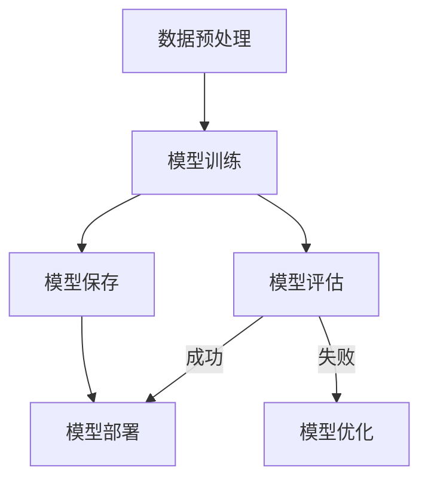
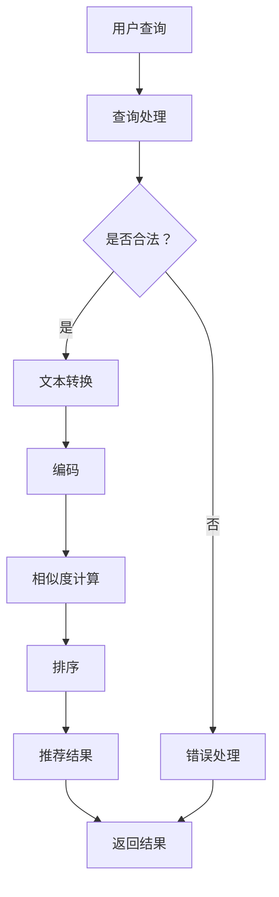
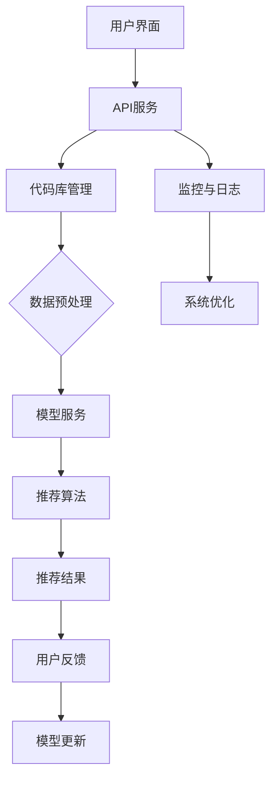

                 

### 引言

随着人工智能技术的飞速发展，大模型（Large Models）已经成为推动自然语言处理（NLP）、计算机视觉、推荐系统等领域进步的重要驱动力。大模型具备处理复杂数据和生成高质量输出的能力，为许多应用场景带来了突破性的进展。特别是在软件开发领域，代码重用是一项至关重要的实践。通过有效地重用已有的代码，不仅能够提高开发效率，还能够保证代码的稳定性和可靠性。

本篇文章将围绕“大模型驱动的智能代码重用推荐”这一主题，深入探讨大模型技术在代码重用中的应用。文章将从以下几个方面展开讨论：

1. **大模型与智能代码重用概述**：介绍大模型的定义及其在软件开发中的重要性，探讨智能代码重用的背景与意义。
2. **大模型技术基础**：介绍大模型在自然语言处理中的应用、基本原理、训练与优化方法以及部署与维护策略。
3. **智能代码重用方法**：探讨代码重用的意义、挑战和解决方案，介绍基于大模型的代码检索和代码重用推荐算法。
4. **智能代码重用在实际项目中的应用**：通过具体的实战案例，展示大模型驱动的智能代码重用在实际项目中的效果和应用方法。
5. **未来展望**：讨论大模型驱动的智能代码重用的发展趋势、面临的挑战及未来发展方向。

文章的目录结构如下：

## 目录大纲：《大模型驱动的智能代码重用推荐》

### 第一部分：引言
- **第1章：大模型与智能代码重用概述**
  - **1.1 大模型时代的来临**
  - **1.2 智能代码重用的背景与意义**
  - **1.3 本书内容结构与组织**

### 第二部分：大模型技术基础
- **第2章：大模型与自然语言处理**
  - **2.1 大模型在NLP中的应用**
  - **2.2 语言模型的基本原理**
  - **2.3 注意力机制与Transformer架构**
  - **2.4 GPT系列模型详解**
  - **2.5 BERT及其变体**
- **第3章：大模型训练与优化**
  - **3.1 大模型训练流程**
  - **3.2 数据预处理与处理**
  - **3.3 模型优化与调参**
  - **3.4 模型压缩与加速**
- **第4章：大模型部署与维护**
  - **4.1 大模型部署方案**
  - **4.2 模型服务与API**
  - **4.3 实时性优化与性能监控**
  - **4.4 模型更新与迭代**

### 第三部分：智能代码重用方法
- **第5章：代码重用与代码检索**
  - **5.1 代码重用的意义与挑战**
  - **5.2 代码检索算法介绍**
  - **5.3 基于大模型的代码检索技术**
  - **5.4 实例：构建代码检索系统**
- **第6章：智能代码重用推荐算法**
  - **6.1 推荐系统基础**
  - **6.2 基于内容的推荐**
  - **6.3 基于协同过滤的推荐**
  - **6.4 深度学习在推荐系统中的应用**
  - **6.5 实例：设计代码重用推荐系统**
- **第7章：智能代码重用在实际项目中的应用**
  - **7.1 开发环境搭建**
  - **7.2 源代码实现与解析**
  - **7.3 代码重用案例与实践**
  - **7.4 评估与优化**

### 第四部分：未来展望
- **第8章：大模型驱动的智能代码重用发展趋势**
  - **8.1 行业应用展望**
  - **8.2 技术挑战与解决方案**
  - **8.3 未来发展方向**

### 附录
- **附录A：常用工具与资源**
- **附录B：Mermaid流程图示例**
- **附录C：伪代码示例**
- **附录D：数学模型与公式**
- **附录E：项目实战案例解析**

文章将首先介绍大模型和智能代码重用的背景，然后逐步深入探讨大模型技术基础、智能代码重用方法以及实际应用，最后展望未来发展方向。通过本文的阅读，读者将能够系统地理解大模型驱动的智能代码重用推荐的全貌，并掌握相关的技术方法。

### 第1章：大模型与智能代码重用概述

#### 1.1 大模型时代的来临

大模型（Large Models）是指具有数亿至数千亿参数规模的神经网络模型。这些模型通过学习海量数据，能够自动提取数据中的复杂模式，并生成高质量、多样化的输出。近年来，随着计算资源的不断增长、数据规模的持续扩大以及算法的持续优化，大模型技术得到了飞速的发展。其中，最为代表性的模型包括GPT（Generative Pre-trained Transformer）、BERT（Bidirectional Encoder Representations from Transformers）等。

大模型时代的来临，标志着人工智能技术从传统的特征工程和手工设计规则，转向数据驱动和模型驱动的全新阶段。大模型在自然语言处理（NLP）、计算机视觉、推荐系统等众多领域展现了卓越的性能，推动了相关应用的深入发展。例如，在NLP领域，大模型被广泛应用于机器翻译、文本生成、情感分析等任务；在计算机视觉领域，大模型则被用于图像识别、图像生成、视频分析等任务；在推荐系统领域，大模型帮助提高推荐结果的准确性和多样性。

#### 1.2 智能代码重用的背景与意义

智能代码重用（Intelligent Code Reuse）是指通过自动化工具或智能算法，从已有的代码库中检索和推荐出适合当前开发需求的代码片段或模块。在软件开发过程中，智能代码重用具有以下几个方面的背景和意义：

1. **提高开发效率**：通过重用已有的代码，开发者可以节省大量的时间和精力，从而提高开发效率。在许多软件开发项目中，重复编写相同或类似的代码是常见现象，通过智能代码重用，可以有效地减少这种重复劳动。
   
2. **保证代码质量**：重用已有的代码意味着这些代码已经经过充分的测试和优化，通常具有较高的稳定性和可靠性。相比于从零开始编写代码，重用已有的代码可以降低新代码中的错误和缺陷。

3. **促进知识共享**：智能代码重用不仅能够提高个人开发者的效率，还能够促进团队内部的知识共享和协作。通过代码重用，开发人员可以更方便地了解和借鉴其他人的优秀代码，从而提高整个团队的编程水平。

4. **降低维护成本**：随着软件系统规模的不断扩大，维护成本也在不断增加。通过智能代码重用，可以将多个模块或组件进行集中管理和维护，从而降低整体的维护成本。

#### 1.3 本书内容结构与组织

本书将围绕“大模型驱动的智能代码重用推荐”这一主题，系统性地介绍相关技术和方法。具体内容结构与组织如下：

- **第一部分：引言**  
  本章主要介绍大模型与智能代码重用的背景、意义以及本书的内容结构与组织。

- **第二部分：大模型技术基础**  
  本部分将详细讨论大模型在自然语言处理中的应用、基本原理、训练与优化方法以及部署与维护策略。具体内容包括：
  - **第2章：大模型与自然语言处理**：介绍大模型在NLP中的应用、语言模型的基本原理、注意力机制与Transformer架构、GPT系列模型详解、BERT及其变体。
  - **第3章：大模型训练与优化**：介绍大模型训练流程、数据预处理与处理、模型优化与调参、模型压缩与加速。
  - **第4章：大模型部署与维护**：介绍大模型部署方案、模型服务与API、实时性优化与性能监控、模型更新与迭代。

- **第三部分：智能代码重用方法**  
  本部分将重点探讨智能代码重用的意义与挑战、代码检索算法、基于大模型的代码检索技术以及智能代码重用推荐算法。具体内容包括：
  - **第5章：代码重用与代码检索**：介绍代码重用的意义与挑战、代码检索算法介绍、基于大模型的代码检索技术、实例：构建代码检索系统。
  - **第6章：智能代码重用推荐算法**：介绍推荐系统基础、基于内容的推荐、基于协同过滤的推荐、深度学习在推荐系统中的应用、实例：设计代码重用推荐系统。
  - **第7章：智能代码重用在实际项目中的应用**：通过具体的实战案例，展示大模型驱动的智能代码重用在实际项目中的效果和应用方法。

- **第四部分：未来展望**  
  本章将讨论大模型驱动的智能代码重用的发展趋势、面临的挑战及未来发展方向。

通过本书的阅读，读者将能够全面了解大模型驱动的智能代码重用推荐技术，掌握相关的方法和实战经验，从而在软件开发领域发挥更大的作用。

### 第2章：大模型与自然语言处理

#### 2.1 大模型在NLP中的应用

自然语言处理（NLP）是人工智能领域的一个重要分支，主要研究如何让计算机理解和处理自然语言。随着大模型技术的发展，大模型在NLP中的应用越来越广泛，并取得了显著的成绩。以下是大模型在NLP中的一些主要应用：

1. **机器翻译**：大模型在机器翻译领域取得了突破性的进展。传统的机器翻译方法依赖于规则和统计模型，而大模型如GPT和BERT能够通过学习海量数据，自动生成高质量的翻译结果。例如，Google的神经机器翻译系统（GNMT）就是基于Transformer架构的大模型，显著提高了翻译的准确性和流畅性。

2. **文本生成**：大模型在文本生成任务中也表现出色。通过训练大规模的语言模型，可以生成各种类型的文本，如文章摘要、新闻简报、对话生成等。例如，OpenAI的GPT系列模型不仅能够生成连贯的文本，还能够根据上下文生成合理的回答，广泛应用于聊天机器人、自动问答系统等。

3. **情感分析**：情感分析是评估文本情感倾向的任务。大模型通过学习大量的情感标注数据，可以自动识别文本中的情感极性，如正面、负面或中性。例如，通过训练基于BERT的情感分析模型，可以有效地对社交媒体评论、产品评论等进行情感分类。

4. **文本分类**：文本分类是将文本分为不同类别的任务。大模型在文本分类任务中具有显著的优势。通过训练大规模的分类模型，可以实现对新闻文章、社交媒体帖子等文本的自动分类。例如，使用BERT模型对新闻文章进行分类，可以准确地将其分为政治、经济、体育等不同类别。

5. **命名实体识别**：命名实体识别是识别文本中具有特定意义的实体，如人名、地点、组织等。大模型通过学习大量标注数据，可以准确地识别命名实体。例如，BERT模型在命名实体识别任务中取得了很好的效果，广泛应用于信息抽取、搜索引擎等应用场景。

6. **问答系统**：问答系统是自动回答用户提问的系统。大模型在问答系统中发挥着重要作用。通过训练大规模的知识图谱和问答模型，可以实现对用户提问的自动回答。例如，Facebook的BLINK模型结合BERT和知识图谱，实现了高质量的问答系统。

7. **对话系统**：对话系统是模拟人类对话行为的系统。大模型在对话系统中的应用使得对话更加自然、流畅。通过训练大规模的对话模型，可以实现对用户输入的理解和响应。例如，OpenAI的GPT-3模型在对话系统中表现出色，可以生成高质量、自然回应。

8. **语音识别**：大模型在语音识别中也得到了广泛应用。通过训练大规模的语音模型，可以实现对语音信号的自动识别和转换。例如，谷歌的语音识别系统通过使用Transformer架构的大模型，实现了高准确率的语音识别。

总之，大模型在NLP中的应用已经取得了显著的成果，并为许多实际应用场景带来了突破性的进展。随着大模型技术的不断发展和优化，未来NLP领域将会出现更多创新的应用和解决方案。

#### 2.2 语言模型的基本原理

语言模型（Language Model）是自然语言处理（NLP）中的一个基础组件，其核心目标是学习自然语言中的统计规律，从而预测给定文本序列的概率分布。语言模型在许多NLP任务中发挥着重要作用，如文本生成、机器翻译、情感分析等。以下将详细探讨语言模型的基本原理及其实现方法。

1. **马尔可夫假设**：

语言模型的基础是马尔可夫假设，即下一个单词的概率仅取决于前一个单词。这种假设使得语言模型可以通过预测短文本序列中的下一个单词来生成文本。具体来说，假设我们已经有一个序列 \( w_1, w_2, \ldots, w_n \)，那么下一个单词 \( w_{n+1} \) 的概率可以表示为：

\[ P(w_{n+1} | w_1, w_2, \ldots, w_n) = \frac{P(w_{n+1}, w_1, w_2, \ldots, w_n)}{P(w_1, w_2, \ldots, w_n)} \]

根据马尔可夫假设，我们可以将上述概率简化为：

\[ P(w_{n+1} | w_1, w_2, \ldots, w_n) = P(w_{n+1} | w_n) \]

这意味着当前单词的概率仅取决于前一个单词，而不受前面所有单词的影响。

2. **N-gram模型**：

基于马尔可夫假设，N-gram模型是最简单的语言模型。N-gram模型将语言序列划分为固定长度的连续单词组合，即N元组。每个N元组的概率可以通过统计语料库中出现的频率来计算。具体来说，对于N元组 \( w_{n-1}, w_n, \ldots, w_{n+N-1} \)，其概率可以表示为：

\[ P(w_{n-1}, w_n, \ldots, w_{n+N-1}) = \frac{\text{在语料库中N元组 } w_{n-1}, w_n, \ldots, w_{n+N-1} \text{ 出现的次数}}{\text{在语料库中所有N元组出现的总次数}} \]

N-gram模型的主要优点是简单易实现，但缺点是它无法捕捉长距离依赖关系，容易生成不自然的文本。

3. **神经网络语言模型**：

为了克服N-gram模型的局限性，神经网络语言模型（Neural Language Model, NLM）被提出。神经网络语言模型使用深度神经网络来建模语言序列的概率分布。最常见的方法是使用循环神经网络（RNN），尤其是长短期记忆网络（LSTM）和门控循环单元（GRU）。这些网络能够捕捉长距离依赖关系，从而生成更自然的文本。

神经网络语言模型通常包括以下几个步骤：

- **嵌入层**：将单词映射为固定大小的向量，这一步可以通过预训练的词向量来完成，如Word2Vec、GloVe等。
- **循环层**：循环神经网络用于处理序列数据。每个时间步，网络都会将当前单词的嵌入向量作为输入，并输出当前单词的概率分布。
- **输出层**：网络的输出层通常是softmax层，用于生成每个单词的概率分布。

4. **Transformer模型**：

Transformer模型是近年来在NLP领域取得突破性进展的一种新型神经网络结构，其核心思想是使用自注意力机制（Self-Attention）来建模输入序列中的长距离依赖关系。Transformer模型由多个自注意力层和前馈层组成，能够在训练过程中并行处理数据，从而显著提高计算效率。

自注意力机制的实现如下：

\[ \text{Attention}(Q, K, V) = \frac{\text{softmax}(\frac{QK^T}{\sqrt{d_k}})}{V} \]

其中，\( Q, K, V \) 分别表示查询（Query）、键（Key）和值（Value）向量，\( d_k \) 是键向量的维度。自注意力机制通过计算每个键和查询之间的相似度，并加权求和得到输出。

5. **预训练与微调**：

为了充分利用大规模语料库中的知识，语言模型通常采用预训练（Pre-training）和微调（Fine-tuning）的方法。预训练阶段，模型在大量未标注的数据上进行训练，以学习语言的基本规律。然后，在特定任务上对模型进行微调，以提高任务表现。

预训练通常包括两个阶段：

- **未遮蔽语言模型**（Unmasked Language Model, MLM）：在输入序列中随机遮蔽一些单词，模型需要预测这些被遮蔽的单词。
- **下句预测**（Next Sentence Prediction, NSP）：输入两个连续的句子，模型需要预测第二个句子是否是第一个句子的下句。

微调阶段，模型在特定任务的数据上进行训练，以适应任务的要求。

6. **评价指标**：

语言模型的性能通常通过以下指标来评估：

- **损失函数**：常用的损失函数包括交叉熵损失（Cross-Entropy Loss）和对比损失（Contrastive Loss）。
- **精度**（Accuracy）：模型预测正确的单词比例。
- **BLEU分数**：用于评估机器翻译质量，与人工评分的匹配度。
- **ROUGE分数**：用于评估文本生成质量，与人工评分的相似度。

通过上述介绍，我们可以看到语言模型在NLP中扮演着重要的角色，其基本原理和实现方法不断发展，推动了NLP领域的进步。随着大模型技术的不断发展，未来的语言模型将会更加高效、准确，为各种NLP任务提供更强有力的支持。

#### 2.3 注意力机制与Transformer架构

注意力机制（Attention Mechanism）是深度学习中的一个关键概念，最初在机器翻译领域被提出，用于解决长距离依赖问题。注意力机制的核心思想是允许模型在处理序列数据时，关注不同的输入部分，从而提高模型的表示能力和任务性能。Transformer模型是注意力机制的代表性实现，其成功应用推动了自然语言处理（NLP）和序列模型的发展。以下将详细探讨注意力机制与Transformer架构的原理、工作流程及其优势。

##### 2.3.1 注意力机制的基本原理

注意力机制的基本原理可以概括为以下步骤：

1. **计算相似度**：对于输入序列 \( x = [x_1, x_2, \ldots, x_n] \)，注意力机制首先计算每个输入元素与其他元素之间的相似度。相似度可以通过点积、加性和缩放点积等方式计算。

2. **加权和**：根据相似度分数，为每个输入元素分配一个权重，并计算加权求和，从而生成一个综合表示。

3. **输出生成**：利用加权求和的结果，生成最终的输出。权重反映了不同输入元素对输出的重要性。

以下是注意力机制的数学表示：

\[ \text{Attention}(Q, K, V) = \frac{\text{softmax}(\frac{QK^T}{\sqrt{d_k}})}{V} \]

其中，\( Q, K, V \) 分别表示查询（Query）、键（Key）和值（Value）向量，\( d_k \) 是键向量的维度。注意力机制通过计算每个键和查询之间的相似度，并加权求和得到输出，从而实现对输入序列的不同部分进行动态关注。

##### 2.3.2 Transformer模型架构

Transformer模型是一种基于注意力机制的序列到序列（Seq2Seq）模型，其核心架构包括多个自注意力层（Self-Attention Layer）和前馈网络（Feedforward Network）。以下详细描述Transformer模型的架构：

1. **编码器（Encoder）**：
   编码器由多个自注意力层和前馈网络组成，其输入为原始序列，输出为编码后的序列表示。每个自注意力层包含以下步骤：
   
   - **自注意力**：通过计算序列中每个词与其他词之间的相似度，并加权求和，生成加权求和的结果。
   - **前馈网络**：对自注意力层的输出进行两次全连接层操作，分别引入非线性变换。

   编码器的主要目的是将输入序列转换为上下文表示，这些表示能够捕捉到序列中的长距离依赖关系。

2. **解码器（Decoder）**：
   解码器同样由多个自注意力层和前馈网络组成，其输入为编码器输出的序列表示和目标序列。每个自注意力层包含以下步骤：

   - **自注意力**：计算编码器输出的序列表示和当前解码器输入之间的相似度，并加权求和。
   - **多头注意力**：将自注意力层扩展为多头注意力，通过多个独立的注意力机制提高表示能力。
   - **前馈网络**：对自注意力层的输出进行两次全连接层操作，分别引入非线性变换。

   解码器的主要目的是生成目标序列的预测，并在生成每个词时逐步更新序列表示。

3. **位置编码（Positional Encoding）**：
   Transformer模型不包含循环结构，因此需要引入位置编码（Positional Encoding）来表示序列中的词位置信息。位置编码是一个可学习的向量，将其添加到词嵌入向量中，使得模型能够理解词的顺序。

4. **编码器-解码器注意力（Encoder-Decoder Attention）**：
   编码器-解码器注意力是Transformer模型的关键创新之一，它允许解码器在生成每个词时关注编码器的输出。通过计算编码器输出和当前解码器输入之间的相似度，解码器能够利用编码器的上下文信息，从而提高生成质量。

##### 2.3.3 Transformer模型的工作流程

Transformer模型的工作流程可以分为以下几个步骤：

1. **词嵌入**：将输入序列中的每个词转换为词嵌入向量。
2. **位置编码**：为每个词嵌入向量添加位置编码，表示词的位置信息。
3. **编码器处理**：编码器通过多个自注意力层和前馈网络处理输入序列，生成编码后的序列表示。
4. **解码器处理**：解码器通过多个自注意力层、编码器-解码器注意力层和前馈网络处理编码后的序列表示，逐步生成目标序列。
5. **输出生成**：解码器在生成每个词时，利用编码器输出的序列表示和当前解码器输入的信息，通过自注意力层生成最终的输出。

##### 2.3.4 Transformer模型的优势

Transformer模型具有以下优势：

1. **并行计算**：由于Transformer模型不包含循环结构，因此可以并行处理输入序列的每个词，从而显著提高计算效率。
2. **长距离依赖**：注意力机制允许模型在生成每个词时关注序列中的所有词，从而有效地捕捉长距离依赖关系。
3. **灵活性与可扩展性**：Transformer模型的结构简单，可以通过增加层数和注意力头数来提高表示能力，从而适用于各种NLP任务。
4. **预训练与微调**：Transformer模型可以通过预训练和微调的方法，在大量未标注的数据上进行训练，然后在特定任务上进行微调，从而提高任务性能。

总之，注意力机制与Transformer架构的结合为NLP领域带来了革命性的进步。通过引入自注意力机制，Transformer模型能够有效地捕捉长距离依赖关系，从而生成更自然的文本。同时，Transformer模型的并行计算能力、灵活性和可扩展性，使得其在各种NLP任务中取得了优异的性能。

#### 2.4 GPT系列模型详解

GPT（Generative Pre-trained Transformer）系列模型是自然语言处理领域的重要突破之一，由OpenAI提出并持续更新。GPT模型通过大规模预训练和精细调优，在文本生成、机器翻译、问答等任务中取得了卓越的性能。本节将详细介绍GPT系列模型的基本原理、架构以及其在NLP任务中的性能表现。

##### 2.4.1 GPT模型的基本原理

GPT模型的核心思想是利用大规模语料库进行预训练，从而学习语言中的统计规律和潜在表示。预训练完成后，模型可以在特定任务上通过微调进行优化，以提高任务性能。以下是GPT模型的基本原理：

1. **预训练**：在预训练阶段，GPT模型通过以下两个任务学习语言中的潜在表示：
   - **未遮蔽语言模型**（Masked Language Model, MLM）：输入一个句子，随机遮蔽句子中的部分词，模型需要预测这些被遮蔽的词。
   - **下一句预测**（Next Sentence Prediction, NSP）：输入两个连续的句子，模型需要预测第二个句子是否是第一个句子的下句。

2. **微调**：在预训练完成后，GPT模型在特定任务上进行微调。例如，在机器翻译任务中，模型将源语言和目标语言的文本对作为输入，并通过最小化损失函数进行优化。

##### 2.4.2 GPT模型的架构

GPT模型的架构基于Transformer模型，包括多个自注意力层和前馈网络。以下是GPT模型的详细架构：

1. **编码器**：
   - **词嵌入**：将输入序列中的每个词转换为词嵌入向量。
   - **位置编码**：为每个词嵌入向量添加位置编码，表示词的位置信息。
   - **多头自注意力**：通过多个独立的注意力机制处理输入序列，生成加权求和的结果。
   - **前馈网络**：对自注意力层的输出进行两次全连接层操作，分别引入非线性变换。

2. **解码器**：
   - **自注意力**：计算编码器输出的序列表示和当前解码器输入之间的相似度，并加权求和。
   - **编码器-解码器注意力**：计算编码器输出和当前解码器输入之间的相似度，允许解码器关注编码器的上下文信息。
   - **前馈网络**：对自注意力层的输出进行两次全连接层操作，分别引入非线性变换。

3. **损失函数**：GPT模型的损失函数通常为交叉熵损失，用于最小化模型预测和真实标签之间的差距。

##### 2.4.3 GPT系列模型的发展

自GPT模型首次提出以来，OpenAI已经推出了多个版本的GPT模型，包括GPT-2和GPT-3。以下是这些模型的主要发展和改进：

1. **GPT-2**：
   - **更大规模**：GPT-2的参数规模相比GPT增加了数倍，达到了1.5亿参数。
   - **更稳定的训练**：通过改进训练策略，GPT-2能够更稳定地收敛，减少不良模式的生成。

2. **GPT-3**：
   - **前所未有的规模**：GPT-3的参数规模达到了1750亿参数，成为迄今为止最大的语言模型。
   - **更高的生成质量**：GPT-3在生成文本的质量和多样性方面取得了显著提升，能够在各种NLP任务中表现出色。
   - **更灵活的接口**：GPT-3提供了一种新的接口，允许开发者通过简单的文本输入和输出进行交互，极大地简化了使用模型的过程。

##### 2.4.4 GPT模型在NLP任务中的性能表现

GPT系列模型在多种NLP任务中展现了出色的性能：

1. **文本生成**：GPT模型能够生成连贯、自然的文本，适用于自动摘要、文章写作、对话生成等任务。例如，GPT-3可以生成高质量的文章摘要，将其应用于新闻摘要、文档摘要等领域。

2. **机器翻译**：GPT模型在机器翻译任务中表现出色，其生成的翻译结果在质量和流畅性方面超过了传统的神经机器翻译系统。例如，GPT-3在机器翻译基准测试中取得了比之前模型更高的BLEU分数。

3. **问答系统**：GPT模型能够理解用户的问题，并生成相关的回答。例如，GPT-3在问答系统中表现出色，可以回答各种领域的问题，适用于智能客服、知识问答等应用场景。

4. **文本分类**：GPT模型能够对文本进行分类，例如，将文本分为新闻、体育、娱乐等类别。其分类准确率在许多基准测试中达到了较高的水平。

5. **命名实体识别**：GPT模型能够识别文本中的命名实体，例如人名、地点、组织等。通过结合预训练和微调，GPT模型在命名实体识别任务中取得了较好的效果。

总之，GPT系列模型在自然语言处理领域取得了显著的成就，通过大规模预训练和精细调优，其在各种NLP任务中展现了卓越的性能。未来，随着GPT模型规模的不断扩大，其在更多任务中的应用前景将更加广阔。

#### 2.5 BERT及其变体

BERT（Bidirectional Encoder Representations from Transformers）是由Google提出的一种基于Transformer架构的预训练语言模型，它通过同时考虑文本的前后信息，实现了在多种自然语言处理（NLP）任务中的优异表现。BERT的成功引发了大量的研究和应用，并催生了许多变体模型。以下将详细介绍BERT的基本原理、变体模型以及其在NLP任务中的性能表现。

##### 2.5.1 BERT的基本原理

BERT模型的核心思想是通过对大规模文本语料库进行双向预训练，学习文本的上下文表示。BERT模型包含两个关键部分：编码器和解码器。

1. **编码器**：
   - **词嵌入**：BERT将输入的单词转换为固定大小的向量，这一步可以通过预训练的词向量来完成，如Word2Vec、GloVe等。
   - **位置嵌入**：BERT引入位置嵌入（Positional Embedding）来表示文本中的词位置信息。每个词的位置信息是一个可学习的向量，将其添加到词嵌入向量中。
   - **多头自注意力**：BERT通过多个独立的注意力机制处理输入序列，生成加权求和的结果。自注意力机制使得模型能够关注序列中的不同部分，从而捕捉长距离依赖关系。

2. **解码器**：
   - **自注意力**：解码器在生成每个词时，利用编码器输出的序列表示和当前解码器输入的信息，通过自注意力机制生成输出。
   - **编码器-解码器注意力**：编码器-解码器注意力允许解码器在生成每个词时关注编码器的输出，从而利用上下文信息生成高质量的输出。

BERT模型的工作流程包括两个阶段：

1. **预训练**：在预训练阶段，BERT通过以下两个任务学习文本的上下文表示：
   - **遮蔽语言模型**（Masked Language Model, MLM）：随机遮蔽输入文本中的部分词，模型需要预测这些被遮蔽的词。
   - **下一句预测**（Next Sentence Prediction, NSP）：随机选取两个句子，模型需要预测第二个句子是否是第一个句子的下句。

2. **微调**：在预训练完成后，BERT在特定任务上进行微调，通过最小化损失函数来优化模型。微调阶段，模型接收任务特定的输入和输出，并通过反向传播算法更新参数。

##### 2.5.2 BERT的变体

BERT的成功激发了大量的研究和改进，出现了许多变体模型，包括RoBERTa、ALBERT、TinyBERT等。以下简要介绍一些主要的BERT变体：

1. **RoBERTa**：
   - **改进预训练策略**：RoBERTa通过改进BERT的预训练策略，如取消次采样和数据清洗，提高了模型的预训练效果。
   - **更大规模**：RoBERTa的参数规模相比BERT有所增加，从而提高了模型的表示能力。

2. **ALBERT**：
   - **自注意力分层**：ALBERT通过将自注意力分层，使得模型能够更有效地利用参数，降低了计算复杂度。
   - **跨层信息传递**：ALBERT引入了跨层信息传递机制，使得模型能够更好地捕捉长距离依赖关系。

3. **TinyBERT**：
   - **小型化**：TinyBERT通过减少模型参数和层数，实现了对BERT模型的小型化，适用于资源受限的环境。
   - **高效性**：TinyBERT在保持较高性能的同时，降低了计算资源和存储需求。

4. **mBERT**：
   - **多语言训练**：mBERT在预训练阶段使用了多语言语料库，使得模型能够处理多种语言文本。
   - **跨语言表示**：mBERT在跨语言任务中表现出色，能够利用多语言知识提高性能。

##### 2.5.3 BERT在NLP任务中的性能表现

BERT在多种NLP任务中展现了出色的性能，包括文本分类、命名实体识别、情感分析等。以下是一些具体的应用场景和性能表现：

1. **文本分类**：BERT通过微调在多个文本分类任务中取得了优异的成绩。例如，在GLUE（General Language Understanding Evaluation）基准测试中，BERT及其变体在多个任务上刷新了记录。

2. **命名实体识别**：BERT能够有效识别文本中的命名实体，如人名、地点、组织等。通过结合预训练和微调，BERT在多个命名实体识别任务中达到了较高的准确率。

3. **情感分析**：BERT在情感分析任务中表现出色，能够对文本进行情感分类，识别文本的情感倾向。通过微调，BERT在多个情感分析任务中取得了较高的准确率和F1分数。

4. **问答系统**：BERT在问答系统中发挥了重要作用，能够理解用户的问题并生成相关答案。通过结合预训练和微调，BERT在多个问答系统任务中取得了优异的性能。

5. **机器翻译**：BERT在机器翻译任务中表现出色，其生成的翻译结果在质量和流畅性方面超过了传统的神经机器翻译系统。通过微调，BERT在多个机器翻译任务中达到了较高的BLEU分数。

总之，BERT及其变体在自然语言处理领域取得了显著的成就，通过大规模预训练和精细调优，其在各种NLP任务中展现了卓越的性能。未来，随着BERT变体的不断发展和优化，其在更多任务中的应用前景将更加广阔。

### 第3章：大模型训练与优化

#### 3.1 大模型训练流程

大模型的训练过程是复杂且耗时的，需要大量的计算资源和时间。以下是详细的大模型训练流程，包括数据预处理、模型训练和优化等步骤。

##### 3.1.1 数据预处理

数据预处理是训练大模型的第一步，其目的是将原始数据转换为适合模型训练的形式。以下是一些关键的数据预处理步骤：

1. **数据收集**：首先，需要收集大量的训练数据。这些数据可以是文本、图像、语音等多种形式，具体取决于模型的应用场景。例如，在自然语言处理（NLP）任务中，数据可以是大规模的文本语料库；在计算机视觉任务中，数据可以是大量的图像及其标签。

2. **数据清洗**：数据清洗是确保数据质量的重要步骤。在这一步中，需要去除无效数据、纠正错误、填补缺失值等。例如，在文本数据中，需要去除HTML标签、特殊字符、停用词等；在图像数据中，需要去除噪音和背景。

3. **数据标注**：对于需要标签的数据，如分类和识别任务，需要进行数据标注。数据标注可以由人工完成，也可以利用自动化工具。例如，在文本分类任务中，需要对文本进行类别标注；在图像识别任务中，需要对图像中的物体进行标注。

4. **数据分割**：将数据集划分为训练集、验证集和测试集。训练集用于模型训练，验证集用于调参和模型选择，测试集用于评估模型性能。通常，训练集占比最大，验证集和测试集占比相对较小。

5. **数据转换**：将原始数据转换为模型可处理的格式。例如，在NLP任务中，需要将文本转换为词嵌入向量；在计算机视觉任务中，需要将图像转换为像素值矩阵。

##### 3.1.2 模型训练

模型训练是使用预处理后的数据来训练模型的过程。以下是模型训练的关键步骤：

1. **初始化参数**：随机初始化模型的参数，例如权重和偏置。初始化方法有多种，如随机初始化、高斯分布初始化等。

2. **前向传播**：在前向传播阶段，模型接收输入数据，并通过前向传播算法计算输出。前向传播包括以下几个步骤：
   - **嵌入层**：将输入数据转换为嵌入向量，例如词嵌入或像素值嵌入。
   - **编码层**：通过编码器对输入数据进行编码，生成编码后的序列表示。
   - **解码层**：通过解码器生成输出。

3. **计算损失**：计算模型的输出与真实标签之间的差距，即损失。常用的损失函数包括交叉熵损失、均方误差（MSE）等。

4. **反向传播**：在反向传播阶段，模型通过计算梯度来更新参数。反向传播包括以下几个步骤：
   - **计算梯度**：计算输出层到隐藏层的梯度。
   - **更新参数**：使用梯度下降或其他优化算法更新模型参数。

5. **训练迭代**：重复前向传播和反向传播的过程，直到达到预定的训练次数或满足停止条件，如收敛或性能达到期望值。

##### 3.1.3 模型优化与调参

模型优化与调参是提高模型性能的重要步骤。以下是一些常用的优化方法与调参技巧：

1. **优化算法**：优化算法用于更新模型参数，常用的优化算法包括梯度下降（GD）、随机梯度下降（SGD）、Adam等。选择合适的优化算法可以加快训练速度和提升模型性能。

2. **学习率调整**：学习率是优化算法中的一个重要参数，影响模型收敛速度和性能。常用的学习率调整方法包括固定学习率、学习率衰减、自适应学习率等。

3. **批量大小**：批量大小影响模型的训练速度和稳定性。小批量训练可以减小方差，提高模型稳定性，但训练速度较慢；大批量训练可以提高训练速度，但容易导致梯度消失或爆炸。

4. **正则化**：正则化用于防止模型过拟合，常用的正则化方法包括L1正则化、L2正则化、Dropout等。

5. **调参技巧**：调参技巧包括手动调参、网格搜索、随机搜索、贝叶斯优化等。通过合理地选择和调整参数，可以提高模型性能。

6. **数据增强**：数据增强是提高模型性能的有效方法，通过增加数据的多样性和丰富性来防止过拟合。常用的数据增强方法包括数据转换、数据扩充、数据混洗等。

##### 3.1.4 模型评估与调整

模型评估与调整是确保模型性能的重要环节。以下是一些评估方法与调整策略：

1. **评估指标**：常用的评估指标包括准确率、召回率、F1分数、均方误差（MSE）等。选择合适的评估指标可以全面评估模型性能。

2. **交叉验证**：交叉验证是一种评估模型性能的常用方法，通过将数据集划分为多个部分，轮流用于训练和测试，从而避免模型过拟合。

3. **性能调整**：根据模型评估结果，对模型进行调整和优化。调整策略包括调整参数、增加或减少训练数据、改进模型结构等。

4. **模型压缩与加速**：对于大型模型，模型压缩与加速是提高模型性能和降低计算成本的重要方法。常用的方法包括模型剪枝、量化、知识蒸馏等。

总之，大模型的训练与优化是一个复杂且精细的过程，需要综合考虑数据预处理、模型训练、优化方法、评估与调整等多个方面。通过合理的训练流程和优化策略，可以显著提高模型的性能和应用效果。

#### 3.2 数据预处理与处理

数据预处理与处理是大型模型训练过程中至关重要的一步，直接影响模型的训练效率和最终性能。以下是详细的大模型数据预处理与处理方法，包括数据清洗、数据标注、数据转换和分割等关键步骤。

##### 3.2.1 数据清洗

数据清洗是确保数据质量的第一步。以下是一些常见的数据清洗方法：

1. **去除无效数据**：从数据集中去除无意义或无关的数据，如缺失值、重复值、异常值等。这一步可以通过简单的编程逻辑来实现。

2. **处理噪声数据**：对于含有噪声的数据，如文本中的HTML标签、特殊字符、空格、标点符号等，需要对其进行处理。例如，使用正则表达式去除HTML标签，将文本转换为小写，去除停用词等。

3. **数据标准化**：将数据转换到相同的尺度，以便模型训练时能够更好地处理数据。例如，在图像数据中，将像素值缩放到[0, 1]区间。

4. **填补缺失值**：对于含有缺失值的数据，可以采用不同的方法进行填补，如平均值填补、中值填补、插值法等。选择合适的填补方法可以减少数据缺失对模型训练的影响。

##### 3.2.2 数据标注

数据标注是针对需要标签的任务（如分类、识别等），对数据中的元素进行标记的过程。以下是一些常见的数据标注方法：

1. **手动标注**：通过人工对数据进行标注，这是一种比较准确但耗时的方式。适用于小规模数据集的标注。

2. **半自动标注**：结合人工标注和自动化工具，如数据标注平台，来提高标注效率。例如，在图像标注中，可以使用交互式标注工具来辅助人工标注。

3. **自动化标注**：利用已有的标注数据或自动化算法（如语义分割、分类模型等）进行数据标注。适用于大规模数据集的标注。

4. **一致性检查**：对标注结果进行一致性检查，以确保标注质量。可以使用多个标注者对同一数据集进行标注，然后比较标注结果，找出不一致的地方进行修正。

##### 3.2.3 数据转换

数据转换是将原始数据转换为模型可处理的格式的过程。以下是常见的数据转换方法：

1. **文本转换**：
   - **词嵌入**：将文本中的每个单词转换为固定大小的向量，如Word2Vec、GloVe等。词嵌入可以捕捉单词的语义信息，是NLP任务中的重要预处理步骤。
   - **字符嵌入**：将文本中的每个字符转换为向量，用于处理基于字符的模型。
   - **序列转换**：将文本序列转换为数字序列，便于模型处理。

2. **图像转换**：
   - **像素值转换**：将图像像素值缩放到[0, 1]区间，便于模型处理。
   - **归一化**：对图像进行归一化处理，将每个像素值除以其最大值，从而标准化数据。
   - **裁剪和缩放**：对图像进行裁剪和缩放，以适应模型的输入尺寸。

3. **声音转换**：
   - **特征提取**：将声音信号转换为特征向量，如梅尔频率倒谱系数（MFCC）、短时傅里叶变换（STFT）等。
   - **时间步转换**：将连续的声音信号转换为固定长度的时间步序列。

##### 3.2.4 数据分割

数据分割是将数据集划分为训练集、验证集和测试集的过程。以下是常见的数据分割方法：

1. **随机分割**：将数据集随机分为训练集、验证集和测试集，每个数据集都包含不同类型的数据。这种方法简单有效，但可能导致验证集和测试集的数据分布不一致。

2. **分层分割**：根据数据集中的不同类别，将数据集分层，然后分别从每个层中随机抽取一定比例的数据作为训练集、验证集和测试集。这种方法可以确保每个类别在各个数据集中的分布一致，适用于类别不平衡的数据集。

3. **交叉验证**：将数据集分成多个子集，每个子集都用于一次训练和一次验证。这种方法可以评估模型在不同数据子集上的性能，提高模型的泛化能力。

##### 3.2.5 数据处理技巧

在实际数据处理过程中，还有一些技巧可以提高模型的训练效率和性能：

1. **数据增强**：通过增加数据的多样性和丰富性来防止过拟合。常见的数据增强方法包括随机旋转、翻转、裁剪、缩放等。

2. **数据混洗**：在训练过程中，对数据进行随机混洗，以减少模型对特定数据子集的依赖。

3. **批量处理**：将数据分成多个批量进行训练，以充分利用GPU计算资源，提高训练速度。

4. **早停法**：在模型训练过程中，如果验证集上的性能没有明显提升，则提前停止训练，以防止过拟合。

总之，数据预处理与处理是大型模型训练过程中不可或缺的一步。通过合理的数据清洗、标注、转换和分割，可以提高模型的训练效率和最终性能。在实际应用中，需要根据具体任务和数据特点，灵活选择和组合各种数据处理方法，以达到最佳效果。

#### 3.3 模型优化与调参

模型优化与调参是提高大模型性能的重要环节，通过调整模型参数和优化算法，可以提升模型的训练效率和预测准确性。以下将详细讨论模型优化与调参的方法和策略。

##### 3.3.1 优化算法

优化算法用于更新模型参数，以最小化损失函数。以下是几种常用的优化算法：

1. **梯度下降（Gradient Descent）**：
   梯度下降是最基本的优化算法，其核心思想是通过梯度的方向和大小来更新模型参数。梯度下降分为随机梯度下降（SGD）、批量梯度下降（BGD）和最小批量梯度下降（MBGD）三种。

   - **随机梯度下降（SGD）**：每次迭代只随机选择一个样本计算梯度，更新模型参数。SGD收敛速度较快，但容易陷入局部最优。
   - **批量梯度下降（BGD）**：每次迭代计算所有样本的梯度，更新模型参数。BGD收敛速度较慢，但能够找到全局最优解。
   - **最小批量梯度下降（MBGD）**：每次迭代选择一部分样本（如批量大小为64或128）计算梯度，更新模型参数。MBGD是一种折中方案，既能够提高收敛速度，又能够保持较好的收敛性能。

2. **动量（Momentum）**：
   动量是一种改进的梯度下降算法，通过引入动量项来加速梯度下降过程。动量项可以保留之前梯度的信息，使得更新方向更加稳定。

3. **Adam优化器**：
   Adam优化器是结合了动量和自适应学习率的优化算法。Adam优化器通过自适应计算每个参数的学习率，使得模型训练更加稳定和高效。

##### 3.3.2 调参技巧

调参是优化模型性能的重要步骤，以下是一些常用的调参技巧：

1. **学习率调整**：
   - **固定学习率**：学习率固定不变，适用于简单模型和稳定的数据集。
   - **学习率衰减**：学习率随着训练过程逐渐减小，以防止模型过拟合。常见的学习率衰减策略包括线性衰减、指数衰减和余弦退火。
   - **自适应学习率**：如Adam优化器，自动调整每个参数的学习率，适用于复杂模型和数据集。

2. **批量大小**：
   批量大小影响模型的训练速度和稳定性。小批量训练可以减小方差，提高模型稳定性，但训练速度较慢；大批量训练可以提高训练速度，但容易导致梯度消失或爆炸。通常，批量大小选择在64或128个样本。

3. **正则化**：
   正则化用于防止模型过拟合，常用的正则化方法包括L1正则化、L2正则化和Dropout等。

   - **L1正则化**：在损失函数中添加L1范数项，惩罚模型参数的稀疏性。
   - **L2正则化**：在损失函数中添加L2范数项，惩罚模型参数的规模。
   - **Dropout**：在训练过程中随机丢弃一部分神经元，以防止模型对特定神经元过于依赖。

4. **数据增强**：
   数据增强通过增加数据的多样性和丰富性来防止过拟合。常见的数据增强方法包括随机旋转、翻转、裁剪、缩放等。

5. **交叉验证**：
   交叉验证是一种评估模型性能的常用方法，通过将数据集分成多个子集，轮流用于训练和验证，从而避免模型过拟合。常见的交叉验证方法包括K折交叉验证和留一法交叉验证。

##### 3.3.3 调参策略

调参策略是指如何选择和调整模型参数，以提高模型性能。以下是一些常用的调参策略：

1. **网格搜索**：
   网格搜索是一种穷举搜索策略，通过遍历所有可能的参数组合，选择最优参数组合。网格搜索适用于参数数量较少的情况，但计算成本较高。

2. **随机搜索**：
   随机搜索是一种基于概率的搜索策略，通过随机选择参数组合，迭代多次后选择最优参数组合。随机搜索比网格搜索更高效，适用于参数数量较多的情况。

3. **贝叶斯优化**：
   贝叶斯优化是一种基于贝叶斯理论的优化方法，通过构建概率模型来估计参数的最优值。贝叶斯优化具有较好的全局搜索能力，适用于复杂模型的调参。

4. **自动化调参工具**：
   自动化调参工具（如Hyperopt、Optuna等）可以自动搜索最优参数组合，减轻调参负担。自动化调参工具通常结合多种优化策略，以实现高效调参。

总之，模型优化与调参是提高大模型性能的关键步骤。通过选择合适的优化算法、调参技巧和调参策略，可以显著提升模型的训练效率和预测准确性。在实际应用中，需要根据具体任务和数据特点，灵活选择和组合各种优化与调参方法，以达到最佳效果。

#### 3.4 模型压缩与加速

在大型模型的应用过程中，模型的压缩与加速是一项至关重要的任务。随着模型规模的不断扩大，模型的存储和计算成本也随之增加，这不仅限制了模型在实际应用中的部署，还影响了模型的训练速度和推理效率。以下将详细探讨模型压缩与加速的方法和技术。

##### 3.4.1 模型压缩技术

模型压缩旨在减少模型的参数规模和存储空间，从而提高模型的部署效率和资源利用率。以下是一些常见的模型压缩技术：

1. **模型剪枝（Model Pruning）**：
   模型剪枝通过删除模型中的冗余或无关连接和参数，以减少模型规模。剪枝分为结构剪枝和权重剪枝两种：
   - **结构剪枝**：直接删除模型中的某些层或神经元。
   - **权重剪枝**：通过设置权重阈值，删除权重绝对值较小的连接。

2. **量化（Quantization）**：
   量化将模型的权重和激活值从浮点数转换为低精度的整数，以减少存储和计算需求。量化分为全局量化和局部量化：
   - **全局量化**：对整个模型进行量化，适用于低精度需求。
   - **局部量化**：对模型的不同部分分别进行量化，适用于复杂模型。

3. **知识蒸馏（Knowledge Distillation）**：
   知识蒸馏是一种通过将大型模型的知识传递给小型模型的技术。通过训练小型模型来模仿大型模型的输出，可以显著减少模型规模而不牺牲太多性能。

4. **模型分解（Model Decomposition）**：
   模型分解通过将大型模型拆分为多个较小的子模型，以降低整体模型的计算复杂度。这些子模型可以并行执行，从而提高推理速度。

##### 3.4.2 模型加速技术

模型加速技术旨在提高模型的训练和推理速度，以下是一些常见的模型加速方法：

1. **并行计算**：
   并行计算通过利用多核CPU或GPU，将模型训练和推理任务拆分为多个部分，同时执行，以加快计算速度。并行计算可以分为数据并行、模型并行和任务并行：
   - **数据并行**：将训练数据分成多个子集，每个子集由不同的GPU或CPU处理。
   - **模型并行**：将模型拆分为多个部分，每个部分由不同的GPU或CPU处理。
   - **任务并行**：同时处理多个训练任务或推理任务。

2. **模型融合（Model Fusion）**：
   模型融合通过将多个模型融合为一个，以减少模型的计算复杂度和参数规模。常见的融合方法包括：
   - **加权融合**：通过为每个模型分配权重，融合多个模型的输出。
   - **深度融合**：通过多层神经网络融合多个模型的特征。

3. **低精度计算**：
   低精度计算通过将模型的权重和激活值从32位浮点数转换为低精度格式（如8位整数、16位浮点数），以减少计算资源和存储需求。低精度计算适用于轻量级模型和低延迟应用场景。

4. **专用硬件**：
   专用硬件（如FPGA、ASIC等）通过为特定任务定制硬件设计，实现高效的模型推理和训练。专用硬件能够显著提高模型性能，适用于资源受限的应用场景。

##### 3.4.3 模型压缩与加速的实际应用

在大型模型的实际应用中，模型压缩与加速技术已经被广泛应用。以下是一些实际应用的例子：

1. **移动端应用**：
   移动设备通常具有有限的计算资源和功耗限制，因此需要轻量级模型。通过模型剪枝、量化等技术，可以将大型模型压缩为适用于移动端的小型模型。例如，MobileNet和ShuffleNet是针对移动端设计的轻量级卷积神经网络。

2. **嵌入式系统**：
   嵌入式系统通常具有较小的存储空间和计算能力，因此需要高效的模型压缩和加速技术。通过模型分解、知识蒸馏等方法，可以将大型模型分解为多个较小的子模型，以提高推理速度和降低存储需求。例如，TinyML是专门为嵌入式系统设计的机器学习技术。

3. **实时应用**：
   实时应用（如自动驾驶、实时语音识别等）要求模型在短时间内完成推理，因此需要模型加速技术。通过并行计算、低精度计算等方法，可以显著提高模型推理速度。例如，英伟达的GPU和特斯拉的ASIC都是用于实时应用的高效计算平台。

总之，模型压缩与加速技术在大型模型的应用中具有重要意义。通过合理运用模型压缩和加速技术，可以在保证模型性能的前提下，提高模型的部署效率和推理速度，从而推动人工智能技术在各个领域的应用。

### 第4章：大模型部署与维护

#### 4.1 大模型部署方案

大模型的部署是将其应用于实际场景中的关键步骤，需要考虑模型的性能、可扩展性、安全性和稳定性等因素。以下是大模型部署的几个关键环节：

1. **硬件选择**：
   大模型部署通常需要高性能的硬件支持。根据实际需求和预算，可以选择以下硬件配置：
   - **CPU**：适用于中小型模型，能够提供稳定的计算性能。
   - **GPU**：适用于大规模模型，具备并行计算能力，能够显著提高训练和推理速度。
   - **TPU**：专为深度学习任务设计的硬件，能够提供高效的模型推理能力。
   - **FPGA**：适用于特定场景的定制化硬件，能够实现高效的模型加速。

2. **计算资源调度**：
   部署大模型时，需要合理调度计算资源，以确保模型的高效运行。常见的计算资源调度方法包括：
   - **动态调度**：根据模型负载动态调整计算资源，以应对不同场景的需求。
   - **静态调度**：在模型部署前预设计算资源，适用于负载稳定的场景。

3. **容器化与编排**：
   使用容器化技术（如Docker）和编排工具（如Kubernetes）可以实现大模型的灵活部署和管理。容器化确保模型在不同环境中的运行一致性，编排工具则提供资源调度、负载均衡、故障恢复等功能。

4. **分布式部署**：
   对于需要处理大规模数据或支持并发请求的应用场景，分布式部署是必要的。分布式部署可以通过将模型分解为多个子模型，分别部署在多个节点上，实现并行计算和高可用性。

5. **微服务架构**：
   使用微服务架构可以将大模型分解为多个微服务，每个微服务负责不同的功能模块，从而提高系统的灵活性和可扩展性。微服务架构可以通过RESTful API或消息队列实现服务间通信。

#### 4.2 模型服务与API

模型服务是将大模型部署为服务，供外部系统调用的过程。以下是一些关键点：

1. **API设计**：
   设计易用、高效的API接口，是模型服务成功的关键。API设计应考虑以下因素：
   - **接口简洁**：简化接口设计，减少参数数量和复杂性。
   - **请求与响应格式**：选择合适的请求与响应格式，如JSON或Protobuf，以提高数据传输效率。
   - **错误处理**：设计合理的错误处理机制，确保系统在异常情况下能够正常运行。

2. **性能优化**：
   为提高模型服务的性能，可以采取以下措施：
   - **缓存策略**：缓存重复的请求结果，减少计算开销。
   - **异步处理**：将计算密集型任务异步处理，提高系统并发处理能力。
   - **负载均衡**：使用负载均衡器（如Nginx、HAProxy）将请求分发到多个服务器，防止单点瓶颈。

3. **安全性**：
   模型服务需要确保数据安全和访问控制。以下是一些安全措施：
   - **身份验证与授权**：使用身份验证（如OAuth2.0、JWT）和授权机制（如ACL、RBAC）确保用户只能访问授权资源。
   - **数据加密**：对传输的数据进行加密，防止数据泄露。
   - **API网关**：使用API网关进行统一的安全管理和策略配置。

#### 4.3 实时性优化与性能监控

大模型在实时应用中，需要确保高实时性和高性能。以下是一些优化与监控方法：

1. **实时性优化**：
   - **推理优化**：通过模型剪枝、量化、并行计算等手段，提高模型推理速度。
   - **延迟优化**：优化数据传输路径和算法设计，减少延迟。
   - **流处理**：采用流处理框架（如Apache Kafka、Flink）处理实时数据，确保数据处理的高效性和实时性。

2. **性能监控**：
   - **指标收集**：收集系统性能指标（如响应时间、吞吐量、错误率等），以评估系统性能。
   - **实时监控**：使用实时监控工具（如Prometheus、Grafana）监控系统状态，及时发现性能瓶颈。
   - **告警机制**：设置告警规则，当系统性能指标超出阈值时，自动发送告警通知。

3. **容错与恢复**：
   - **故障检测**：通过健康检查和心跳机制，检测系统节点的健康状态。
   - **自动恢复**：在系统故障时，自动重启或切换到备用节点，确保系统的高可用性。
   - **数据备份与恢复**：定期备份模型数据和日志，确保在系统故障时能够快速恢复。

总之，大模型部署与维护是一个复杂且重要的过程，需要综合考虑硬件选择、计算资源调度、容器化与编排、分布式部署、微服务架构、模型服务与API设计、实时性优化与性能监控等多个方面。通过合理的设计与优化，可以确保大模型在实际应用中高效、稳定地运行，发挥其最大价值。

### 第5章：代码重用与代码检索

#### 5.1 代码重用的意义与挑战

代码重用（Code Reuse）是软件工程中的一个重要原则，旨在通过重用已有的代码片段或模块，提高软件开发效率、降低维护成本并确保代码质量。代码重用的意义主要体现在以下几个方面：

1. **提高开发效率**：通过重用已有的代码，开发人员可以避免重复编写相同或类似的代码，从而节省大量的时间和精力。这不仅可以加快开发进度，还可以使开发人员将更多精力投入到新功能的开发和优化上。

2. **保证代码质量**：重用经过充分测试和优化的代码，可以减少新代码中的错误和缺陷，从而提高软件的稳定性和可靠性。此外，已有代码通常具有良好的文档和注释，便于新开发者理解和维护。

3. **促进知识共享**：代码重用促进了团队内部的知识共享和协作。通过重用他人的优秀代码，开发人员可以更快地学习新的编程技巧和最佳实践，从而提高整个团队的技术水平。

4. **降低维护成本**：当软件需要更新或修复时，重用已有代码可以减少修改的工作量，因为对已有代码的修改通常比重新编写新代码要简单和快捷。此外，集中管理和维护代码库可以降低整体维护成本。

然而，代码重用也面临一些挑战：

1. **代码质量不可靠**：重用代码时，可能无法完全保证其质量。如果重用的代码存在缺陷或未经过充分测试，可能会导致新的问题，甚至影响整个系统的稳定性。

2. **版本管理困难**：当多个项目或团队同时使用同一份代码时，版本管理变得复杂。不同项目可能需要对代码进行不同程度的修改，如何协调和合并这些修改是一个重要问题。

3. **代码兼容性问题**：不同项目和系统可能使用不同的编程语言、框架或库，代码兼容性是一个不可忽视的挑战。重用代码时，需要确保其能够在新的环境中正常运行。

4. **依赖关系复杂**：重用代码时，可能需要考虑其依赖关系，包括库、框架和其他外部资源。管理这些依赖关系可能增加代码维护的复杂性。

5. **代码冗余**：虽然代码重用有助于提高开发效率，但如果重用不当，可能会导致代码冗余，从而增加代码库的复杂度。

为了克服这些挑战，需要采取一系列策略，如严格的代码审查、版本管理工具、代码库的标准化和自动化代码检索与推荐系统等。通过合理的代码重用策略，可以充分发挥其优势，同时最大限度地降低风险。

#### 5.2 代码检索算法介绍

代码检索（Code Search）是软件工程中的一个重要环节，旨在从大量的代码库中快速、准确地找到所需的代码片段或模块。代码检索算法是实现智能代码重用的基础，以下介绍几种常见的代码检索算法及其原理：

1. **基于关键词的检索（Keyword-based Search）**：
   基于关键词的检索是最简单的代码检索方法，通过在代码中查找特定的关键词或短语，来定位相关的代码片段。关键词可以包括函数名、变量名、类名等。该方法的优点是实现简单，易于理解。缺点是仅能检索到显式出现的文字，无法捕捉代码中的隐含关系和语义信息。

2. **基于模式的检索（Pattern-based Search）**：
   基于模式的检索通过使用正则表达式或其他模式匹配技术，来搜索具有特定结构的代码片段。这种方法可以捕获复杂的代码模式，例如，查找具有特定条件语句或循环结构的代码。该方法的优点是能够精确地定位代码，缺点是需要编写复杂的正则表达式，且对代码结构的理解有限。

3. **基于语义的检索（Semantic-based Search）**：
   基于语义的检索利用自然语言处理（NLP）和机器学习技术，从代码中提取语义信息，以实现更高级的代码检索。常见的语义检索方法包括：
   - **词嵌入（Word Embedding）**：将代码中的单词或短语映射到高维向量空间，通过计算向量之间的距离，来判断代码片段的相关性。
   - **实体识别（Named Entity Recognition, NER）**：识别代码中的实体（如函数、类、变量等），并使用实体及其关系的语义信息来检索相关代码。
   - **语法分析（Syntax Analysis）**：通过语法分析提取代码的结构信息，例如抽象语法树（Abstract Syntax Tree, AST），以实现更精确的代码检索。

4. **基于机器学习的检索（Machine Learning-based Search）**：
   基于机器学习的检索方法通过训练模型，从大量的代码库中学习如何检索相关的代码片段。常见的机器学习方法包括：
   - **协同过滤（Collaborative Filtering）**：通过分析用户的检索历史和代码库中的相似度，来推荐相关的代码片段。
   - **基于内容的检索（Content-based Filtering）**：通过提取代码的内容特征，例如词嵌入、AST特征等，来计算代码片段之间的相似度。
   - **深度学习（Deep Learning）**：利用深度神经网络，如循环神经网络（RNN）、卷积神经网络（CNN）和Transformer等，从大量的代码库中学习检索策略。

5. **混合检索（Hybrid Search）**：
   混合检索方法结合了多种检索算法的优势，以实现更高效、更准确的代码检索。常见的混合检索策略包括：
   - **关键词+语义**：在基于关键词检索的基础上，结合语义信息进行筛选和排序，以提高检索精度。
   - **模式+机器学习**：通过结合模式匹配和机器学习算法，利用模式的精确性和机器学习的语义理解能力，实现更全面的代码检索。
   - **多模态检索**：结合代码的文本内容、结构信息以及执行结果等多模态数据，进行综合检索。

通过合理选择和组合不同的代码检索算法，可以有效地提高代码检索的准确性和效率，为智能代码重用提供强有力的支持。

#### 5.3 基于大模型的代码检索技术

基于大模型的代码检索技术是当前智能代码重用领域的重要研究方向。大模型通过学习海量的代码数据，能够自动提取代码中的语义信息，从而实现高效的代码检索。以下将详细介绍几种基于大模型的代码检索技术，包括其原理、实现方法和优势。

##### 5.3.1 基于BERT的代码检索

BERT（Bidirectional Encoder Representations from Transformers）是Google提出的一种基于Transformer架构的预训练语言模型，其核心优势在于能够同时考虑文本的前后信息，从而生成高质量的语义表示。在代码检索中，BERT可以通过以下步骤实现：

1. **数据预处理**：
   - **代码转换**：将代码转换为文本形式。例如，可以使用预训练的Tokenizers将代码转换为对应的单词序列。
   - **位置嵌入**：为代码中的每个词添加位置嵌入（Positional Embedding），表示词的位置信息。

2. **模型训练**：
   - **未遮蔽语言模型**（Masked Language Model, MLM）：输入一个代码片段，随机遮蔽部分词，模型需要预测这些被遮蔽的词。
   - **下一句预测**（Next Sentence Prediction, NSP）：输入两个连续的代码片段，模型需要预测第二个代码片段是否是第一个代码片段的下句。

3. **代码检索**：
   - **编码**：将代码片段输入BERT模型，通过编码器得到编码后的序列表示。
   - **相似度计算**：计算查询代码片段和候选代码片段之间的相似度，通常使用BERT输出的最后一层的隐藏状态。
   - **排序**：根据相似度分数对候选代码片段进行排序，从而实现代码检索。

基于BERT的代码检索具有以下优势：

- **强大的语义表示**：BERT通过预训练能够学习代码中的复杂语义信息，从而提高检索精度。
- **并行计算**：Transformer架构支持并行计算，可以显著提高检索速度。
- **灵活的应用**：BERT可以应用于各种代码检索任务，如函数检索、模块检索等。

##### 5.3.2 基于GPT的代码检索

GPT（Generative Pre-trained Transformer）是OpenAI提出的一种基于Transformer架构的预训练语言模型，其核心优势在于能够生成连贯、自然的文本。在代码检索中，GPT可以通过以下步骤实现：

1. **数据预处理**：
   - **代码转换**：将代码转换为文本形式，可以使用Tokenizers进行转换。
   - **位置嵌入**：为代码中的每个词添加位置嵌入。

2. **模型训练**：
   - **生成任务**：输入一个代码片段，模型需要生成与之相关的代码片段。
   - **填充任务**：输入一个代码片段和一个缺失的部分，模型需要填充缺失的部分。

3. **代码检索**：
   - **编码**：将查询代码片段和候选代码片段分别输入GPT模型，通过编码器得到编码后的序列表示。
   - **相似度计算**：计算编码后的序列表示之间的相似度，通常使用BERT的相似度计算方法。
   - **排序**：根据相似度分数对候选代码片段进行排序。

基于GPT的代码检索具有以下优势：

- **强大的生成能力**：GPT能够生成高质量的代码片段，从而提高检索结果的多样性。
- **灵活的交互**：GPT可以通过交互式接口接受用户的输入，从而实现灵活的代码检索。
- **预训练优势**：GPT通过预训练能够学习代码中的复杂语义信息，从而提高检索精度。

##### 5.3.3 基于混合检索的代码检索

混合检索方法结合了基于BERT和GPT的代码检索技术，以实现更高效的代码检索。混合检索方法的实现步骤如下：

1. **数据预处理**：
   - **代码转换**：将代码转换为文本形式，并添加位置嵌入。

2. **模型训练**：
   - **BERT模型训练**：使用BERT模型进行预训练，学习代码中的语义信息。
   - **GPT模型训练**：使用GPT模型进行预训练，生成与查询代码片段相关的代码片段。

3. **代码检索**：
   - **BERT编码**：将查询代码片段和候选代码片段分别输入BERT模型，得到编码后的序列表示。
   - **GPT生成**：使用GPT模型生成与查询代码片段相关的代码片段。
   - **相似度计算**：计算BERT编码后的序列表示之间的相似度，结合GPT生成的代码片段，实现综合排序。

混合检索方法的优点：

- **综合优势**：结合BERT和GPT的优势，实现高效的代码检索。
- **多样化结果**：通过GPT生成代码片段，增加检索结果的多样性。
- **灵活应用**：适用于各种代码检索任务，如函数检索、模块检索等。

总之，基于大模型的代码检索技术通过预训练和学习代码中的复杂语义信息，实现了高效的代码检索。结合BERT和GPT的混合检索方法，进一步提升了检索精度和多样性，为智能代码重用提供了强有力的支持。随着大模型技术的不断发展，基于大模型的代码检索技术将在未来发挥更加重要的作用。

#### 5.4 实例：构建代码检索系统

为了更好地理解基于大模型的代码检索技术，我们将通过一个具体的实例来展示如何构建一个代码检索系统。以下是一个详细的步骤说明，涵盖了系统的需求分析、设计、实现和评估。

##### 5.4.1 需求分析

首先，我们需要明确代码检索系统的需求和目标。以下是该系统的主要需求：

1. **功能需求**：
   - **代码片段检索**：用户可以输入一个关键词或代码片段，系统返回与之相关的代码片段。
   - **代码片段推荐**：系统根据用户的检索历史和代码库的数据，自动推荐相关的代码片段。
   - **代码片段搜索**：系统提供全文搜索功能，用户可以输入任意文本进行搜索。

2. **性能需求**：
   - **快速响应**：系统应能够在短时间内返回检索结果，以支持实时搜索。
   - **高精度**：系统需要提供高精度的检索结果，确保用户能够找到所需的代码片段。

3. **扩展性需求**：
   - **可扩展的代码库**：系统能够接入多个代码库，支持不同类型和语言的代码检索。
   - **模块化设计**：系统应具备模块化设计，方便未来的功能扩展和维护。

##### 5.4.2 系统设计

基于上述需求，我们可以设计一个基本的代码检索系统架构，主要包括以下几个模块：

1. **数据预处理模块**：负责将代码库中的代码转换为文本形式，并进行预处理。包括代码转换、文本清洗、词嵌入和位置嵌入等步骤。

2. **模型训练模块**：负责基于大模型（如BERT或GPT）进行预训练，学习代码中的语义信息。包括数据加载、模型训练、模型保存等步骤。

3. **检索与推荐模块**：负责接收用户的检索请求，执行代码检索和推荐任务。包括查询处理、相似度计算、排序和推荐等步骤。

4. **接口与前端模块**：负责与用户交互，提供用户界面和API接口。包括前端页面设计、后端API实现等步骤。

5. **性能监控与优化模块**：负责监控系统性能，并提供性能优化建议。包括性能监控、日志分析、调优策略等步骤。

##### 5.4.3 实现步骤

以下是构建代码检索系统的具体实现步骤：

1. **数据预处理**：

   - **代码转换**：使用预训练的Tokenizers将代码转换为文本形式，如Python代码转换为对应的单词序列。

   - **文本清洗**：去除代码中的注释、空格和特殊字符，仅保留有效的代码内容。

   - **词嵌入**：使用预训练的词向量（如GloVe或BERT的嵌入层输出）对文本中的每个词进行嵌入。

   - **位置嵌入**：为每个词添加位置嵌入，表示其在代码中的位置。

2. **模型训练**：

   - **数据加载**：将预处理后的代码数据划分为训练集、验证集和测试集。

   - **模型训练**：使用BERT或GPT模型进行预训练。BERT模型通常在未遮蔽语言模型（MLM）和下一句预测（NSP）任务上进行训练，而GPT模型则主要在生成任务上进行训练。

   - **模型保存**：将训练好的模型保存到文件中，以便后续使用。

3. **检索与推荐**：

   - **查询处理**：接收用户的检索请求，如关键词或代码片段，并将其转换为文本形式。

   - **相似度计算**：使用预训练的BERT或GPT模型，计算查询文本和候选代码片段之间的相似度。通常可以使用BERT输出的最后一层的隐藏状态或GPT生成的文本片段。

   - **排序与推荐**：根据相似度分数对候选代码片段进行排序，并将排序结果返回给用户。同时，根据用户的检索历史，推荐相关的代码片段。

4. **接口与前端**：

   - **前端页面**：设计用户友好的前端页面，提供输入框、搜索按钮和检索结果展示。

   - **后端API**：实现后端API，处理用户的检索请求，返回检索结果。

5. **性能监控与优化**：

   - **性能监控**：监控系统性能，如响应时间、吞吐量等，并记录日志。

   - **性能优化**：分析日志数据，识别性能瓶颈，并采取相应的优化措施，如优化模型、增加计算资源等。

##### 5.4.4 评估与优化

构建代码检索系统后，需要对系统进行评估和优化，以验证其性能和用户体验。以下是常见的评估指标和优化方法：

1. **评估指标**：

   - **检索精度**：衡量系统返回的检索结果中，实际相关的代码片段所占的比例。
   - **检索效率**：衡量系统处理检索请求的响应时间。
   - **用户满意度**：通过用户调研或问卷调查，评估用户对系统的满意度和使用体验。

2. **优化方法**：

   - **模型优化**：通过改进模型结构和训练策略，提高模型的检索精度和效率。
   - **算法优化**：改进检索算法，如使用更高效的相似度计算方法或优化排序策略。
   - **数据优化**：增加高质量的代码数据，丰富代码库，以提高检索结果的多样性。
   - **系统优化**：改进系统的架构和部署，如使用分布式计算、优化数据库查询等。

通过上述步骤和优化方法，可以构建一个高效、准确的代码检索系统，为开发人员提供便捷的代码重用工具，提高软件开发效率和质量。

### 第6章：智能代码重用推荐算法

#### 6.1 推荐系统基础

推荐系统（Recommendation System）是信息过滤（Information Filtering）的一种应用，旨在根据用户的兴趣和偏好，从大量信息中为用户推荐相关的内容或项目。推荐系统在电子商务、社交媒体、内容平台等领域得到了广泛应用，其核心目标是通过个性化推荐，提升用户体验和满意度。

##### 6.1.1 推荐系统的基本概念

1. **用户**：推荐系统的服务对象，具有独特的兴趣和偏好。
2. **项目**：推荐系统中的信息资源，可以是商品、文章、音乐等。
3. **评分**：用户对项目的评价或偏好，可以是明确的评分、点击、收藏等行为。
4. **推荐**：系统根据用户的历史行为和偏好，为用户推荐相关的项目。

##### 6.1.2 推荐系统的类型

1. **基于内容的推荐（Content-based Recommendation）**：
   基于内容的推荐通过分析项目的特征和用户的历史偏好，为用户推荐具有相似特征的项目。该方法的优点是简单易实现，但缺点是容易陷入“推荐多样性差”和“冷启动问题”。

2. **基于协同过滤的推荐（Collaborative Filtering）**：
   基于协同过滤的推荐通过分析用户之间的相似性或行为模式，为用户推荐其他用户喜欢但用户尚未体验过的项目。协同过滤分为以下两种：
   - **用户基于的协同过滤（User-based Collaborative Filtering）**：通过计算用户之间的相似性，推荐与目标用户相似的其他用户喜欢的项目。
   - **物品基于的协同过滤（Item-based Collaborative Filtering）**：通过计算项目之间的相似性，推荐与目标项目相似的其他项目。

3. **混合推荐（Hybrid Recommendation）**：
   混合推荐方法结合了基于内容和基于协同过滤的方法，以提高推荐系统的准确性和多样性。混合推荐可以充分利用两者的优点，克服单一方法的局限性。

##### 6.1.3 推荐系统的评价指标

推荐系统的性能评估主要通过以下几个指标进行：

1. **准确率（Accuracy）**：预测正确的项目数量与总预测项目数量的比例。
2. **召回率（Recall）**：实际相关的项目数量与所有实际相关项目数量的比例。
3. **F1分数（F1 Score）**：准确率和召回率的调和平均值，用于综合考虑准确率和召回率。
4. **覆盖率（Coverage）**：推荐系统中实际推荐的项目与系统中所有项目的比例，用于衡量推荐系统的多样性。
5. **新颖度（Novelty）**：推荐系统中推荐的新项目与系统中所有项目的比例，用于衡量推荐系统的创新性。

#### 6.2 基于内容的推荐

基于内容的推荐方法（Content-based Recommendation）通过分析项目的特征和用户的历史偏好，为用户推荐具有相似特征的项目。以下是基于内容的推荐的基本原理和实现方法。

##### 6.2.1 基本原理

基于内容的推荐方法的核心思想是“物以类聚”，即具有相似特征的物品会被推荐给具有相似偏好的用户。具体实现步骤如下：

1. **项目特征提取**：从项目中提取可量化的特征，如文本内容、标签、属性等。
2. **用户偏好表示**：根据用户的历史行为，提取用户的偏好表示。例如，可以计算用户喜欢项目的平均特征向量。
3. **相似度计算**：计算项目特征向量和用户偏好表示之间的相似度，常用的相似度计算方法包括余弦相似度、欧氏距离等。
4. **推荐生成**：根据相似度分数，为用户生成推荐列表，通常选择相似度最高的项目。

##### 6.2.2 实现方法

基于内容的推荐方法可以分为以下几种：

1. **文本分类与关键词提取**：
   - **文本分类**：将项目文本分类为多个类别，为每个类别分配权重。
   - **关键词提取**：使用词频、TF-IDF等方法提取文本中的关键词，为每个关键词分配权重。
   - **特征向量生成**：将项目文本表示为一个高维特征向量，每个维度对应一个关键词或类别。

2. **属性匹配**：
   - **特征提取**：从项目中提取可量化的属性，如价格、品牌、评分等。
   - **特征向量生成**：将每个项目的属性表示为一个特征向量。
   - **相似度计算**：计算用户偏好特征向量和项目特征向量之间的相似度。

3. **协同过滤与内容结合**：
   - **用户偏好表示**：使用协同过滤方法计算用户的偏好表示。
   - **特征向量生成**：将用户偏好表示和项目特征向量结合，形成综合特征向量。
   - **相似度计算**：计算综合特征向量之间的相似度，生成推荐列表。

#### 6.3 基于协同过滤的推荐

基于协同过滤的推荐方法（Collaborative Filtering）通过分析用户之间的相似性或行为模式，为用户推荐其他用户喜欢但用户尚未体验过的项目。以下是基于协同过滤推荐的基本原理和实现方法。

##### 6.3.1 基本原理

基于协同过滤的推荐方法的核心思想是“人以群分”，即具有相似行为的用户会喜欢相似的项目。具体实现步骤如下：

1. **用户-项目矩阵构建**：构建一个用户-项目评分矩阵，每个元素表示用户对项目的评分。
2. **相似性计算**：计算用户之间的相似性，常用的相似性度量方法包括余弦相似度、皮尔逊相关系数等。
3. **评分预测**：根据用户之间的相似性和已知的评分，预测用户对未评分项目的评分。
4. **推荐生成**：根据评分预测结果，为用户生成推荐列表。

##### 6.3.2 实现方法

基于协同过滤的推荐方法可以分为以下几种：

1. **用户基于的协同过滤（User-based Collaborative Filtering）**：
   - **相似性计算**：计算用户之间的相似性。
   - **最近邻选择**：选择与目标用户最相似的K个用户。
   - **评分预测**：根据最近邻用户的评分，预测目标用户对未评分项目的评分。
   - **推荐生成**：根据评分预测结果，为用户生成推荐列表。

2. **物品基于的协同过滤（Item-based Collaborative Filtering）**：
   - **相似性计算**：计算项目之间的相似性。
   - **最近邻选择**：选择与目标项目最相似的K个项目。
   - **评分预测**：根据最近邻项目的评分，预测目标用户对未评分项目的评分。
   - **推荐生成**：根据评分预测结果，为用户生成推荐列表。

3. **矩阵分解（Matrix Factorization）**：
   - **用户-项目矩阵分解**：将用户-项目评分矩阵分解为用户特征矩阵和项目特征矩阵。
   - **特征向量生成**：为每个用户和项目生成特征向量。
   - **评分预测**：根据用户和项目的特征向量，预测用户对未评分项目的评分。
   - **推荐生成**：根据评分预测结果，为用户生成推荐列表。

#### 6.4 深度学习在推荐系统中的应用

深度学习（Deep Learning）在推荐系统中的应用显著提升了推荐系统的性能和准确性。以下介绍深度学习在推荐系统中的几种典型应用方法。

##### 6.4.1 神经网络模型

神经网络模型是深度学习在推荐系统中的基础，通过多层非线性变换，从输入数据中提取特征。以下是一些常用的神经网络模型：

1. **多层感知机（Multilayer Perceptron, MLP）**：
   - **多层结构**：包含多个隐藏层，每个隐藏层通过激活函数进行非线性变换。
   - **全连接层**：每个神经元都与前一层所有神经元相连。
   - **输出层**：输出层用于预测用户对项目的评分。

2. **卷积神经网络（Convolutional Neural Network, CNN）**：
   - **卷积层**：用于提取输入数据的空间特征。
   - **池化层**：用于减少数据维度，提高模型鲁棒性。
   - **全连接层**：用于将特征映射到输出。

3. **循环神经网络（Recurrent Neural Network, RNN）**：
   - **循环结构**：每个神经元的状态依赖于前一个时间步的输出。
   - **长短时记忆（Long Short-Term Memory, LSTM）**：用于解决RNN的梯度消失问题。
   - **双向RNN（Bidirectional RNN）**：同时考虑输入序列的前后信息。

##### 6.4.2 序列模型

序列模型在推荐系统中用于处理用户行为的时间序列数据，以下是一些常用的序列模型：

1. **递归神经网络（Recurrent Neural Network, RNN）**：
   - **基础RNN**：通过循环结构处理序列数据。
   - **长短时记忆（Long Short-Term Memory, LSTM）**：解决RNN的梯度消失和梯度爆炸问题。
   - **门控循环单元（Gated Recurrent Unit, GRU）**：简化LSTM结构，提高计算效率。

2. **Transformer模型**：
   - **自注意力机制**：通过计算序列中不同位置的相似度，实现全局依赖。
   - **编码器-解码器结构**：用于生成推荐结果。
   - **多头注意力**：通过多个注意力机制提高模型的表示能力。

##### 6.4.3 混合模型

混合模型结合了深度学习和其他推荐算法的优点，以下是一些常用的混合模型：

1. **基于内容的深度学习模型**：
   - **内容特征提取**：通过深度学习提取项目的内容特征。
   - **用户偏好表示**：结合基于内容的推荐方法，生成用户偏好表示。
   - **评分预测**：通过神经网络模型预测用户对项目的评分。

2. **基于协同过滤的深度学习模型**：
   - **用户-项目矩阵分解**：使用深度学习技术进行用户-项目矩阵分解。
   - **相似度计算**：结合深度学习模型和协同过滤方法，计算用户之间的相似性。
   - **评分预测**：通过深度学习模型预测用户对项目的评分。

3. **图神经网络模型**：
   - **图结构**：将用户-项目关系表示为图结构。
   - **图卷积网络（Graph Convolutional Network, GCN）**：用于提取用户和项目之间的图结构信息。
   - **推荐生成**：通过图神经网络模型生成推荐结果。

通过深度学习在推荐系统中的应用，可以显著提高推荐系统的性能和准确性，实现更精细和个性化的推荐。随着深度学习技术的不断发展，未来的推荐系统将更加智能和高效。

#### 6.5 实例：设计代码重用推荐系统

为了更好地理解智能代码重用推荐算法，我们将通过一个具体实例来展示如何设计一个代码重用推荐系统。该系统将结合基于内容的推荐和基于协同过滤的推荐方法，为开发人员提供高质量的代码片段推荐。

##### 6.5.1 需求分析

在设计代码重用推荐系统时，我们需要明确系统的需求和目标：

1. **功能需求**：
   - **代码片段检索**：用户可以输入关键词或代码片段，系统返回与之相关的代码片段。
   - **代码片段推荐**：系统根据用户的历史行为和代码库的数据，自动推荐相关的代码片段。
   - **多语言支持**：系统应支持多种编程语言，如Python、Java、C++等。

2. **性能需求**：
   - **快速响应**：系统应能在短时间内返回推荐结果，以支持实时开发。
   - **高精度**：系统需要提供高精度的推荐结果，确保用户能够找到所需的代码片段。

3. **可扩展性需求**：
   - **模块化设计**：系统应具备模块化设计，方便未来的功能扩展和维护。
   - **可扩展的代码库**：系统应支持接入多个代码库，以扩大代码片段的来源。

##### 6.5.2 系统架构设计

代码重用推荐系统的架构设计主要包括以下几个模块：

1. **数据预处理模块**：
   - **代码转换**：将代码转换为文本形式，使用Tokenizers处理不同语言的代码。
   - **文本清洗**：去除代码中的注释、空格和特殊字符，仅保留有效代码。
   - **词嵌入**：使用预训练的词向量（如GloVe或BERT的嵌入层输出）对文本中的每个词进行嵌入。
   - **位置嵌入**：为每个词添加位置嵌入，表示其在代码中的位置。

2. **内容特征提取模块**：
   - **文本分类**：对代码中的文本进行分类，提取每个代码片段的主题和关键字。
   - **关键词提取**：使用TF-IDF等方法提取代码中的关键词。
   - **特征向量生成**：将代码片段表示为高维特征向量。

3. **协同过滤模块**：
   - **用户行为分析**：根据用户的历史行为（如代码片段的使用频率、收藏等），提取用户偏好表示。
   - **相似度计算**：计算用户之间的相似性，可以使用余弦相似度或皮尔逊相关系数。
   - **最近邻选择**：选择与目标用户最相似的K个用户，根据他们的行为推荐相关的代码片段。

4. **基于内容的推荐模块**：
   - **代码片段特征提取**：提取代码片段的文本特征，如关键词、主题等。
   - **相似度计算**：计算用户偏好表示和代码片段特征之间的相似度。
   - **推荐生成**：根据相似度分数，为用户生成推荐列表。

5. **融合推荐模块**：
   - **融合策略设计**：结合协同过滤和基于内容的推荐结果，生成综合推荐列表。
   - **权重分配**：为两种推荐方法分配不同的权重，以平衡推荐结果的多样性和精度。

6. **接口与前端模块**：
   - **前端设计**：设计用户友好的前端界面，提供输入框、搜索按钮和推荐结果展示。
   - **后端API**：实现后端API，处理用户的检索请求，返回推荐结果。

##### 6.5.3 系统实现

以下是代码重用推荐系统的具体实现步骤：

1. **数据预处理**：
   - **代码转换**：使用预训练的Tokenizers处理不同语言的代码，将其转换为对应的单词序列。
   - **文本清洗**：去除代码中的注释、空格和特殊字符，仅保留有效代码。
   - **词嵌入**：使用预训练的GloVe或BERT词向量对文本中的每个词进行嵌入。
   - **位置嵌入**：为每个词添加位置嵌入，表示其在代码中的位置。

2. **内容特征提取**：
   - **文本分类**：使用朴素贝叶斯或支持向量机等分类算法，对代码中的文本进行分类，提取每个代码片段的主题和关键字。
   - **关键词提取**：使用TF-IDF等方法提取代码中的关键词，构建代码片段的文本特征向量。

3. **协同过滤**：
   - **用户行为分析**：根据用户的历史行为（如代码片段的使用频率、收藏等），提取用户偏好表示。
   - **相似度计算**：计算用户之间的相似性，使用余弦相似度或皮尔逊相关系数。
   - **最近邻选择**：选择与目标用户最相似的K个用户，根据他们的行为推荐相关的代码片段。

4. **基于内容的推荐**：
   - **代码片段特征提取**：提取代码片段的文本特征，如关键词、主题等。
   - **相似度计算**：计算用户偏好表示和代码片段特征之间的相似度。
   - **推荐生成**：根据相似度分数，为用户生成推荐列表。

5. **融合推荐**：
   - **融合策略设计**：结合协同过滤和基于内容的推荐结果，生成综合推荐列表。
   - **权重分配**：为两种推荐方法分配不同的权重，以平衡推荐结果的多样性和精度。

6. **接口与前端**：
   - **前端设计**：设计用户友好的前端界面，提供输入框、搜索按钮和推荐结果展示。
   - **后端API**：实现后端API，处理用户的检索请求，返回推荐结果。

##### 6.5.4 评估与优化

构建代码重用推荐系统后，需要对系统进行评估和优化，以验证其性能和用户体验。以下是常见的评估指标和优化方法：

1. **评估指标**：
   - **准确率（Accuracy）**：预测正确的代码片段数量与总预测代码片段数量的比例。
   - **召回率（Recall）**：实际相关的代码片段数量与所有实际相关代码片段数量的比例。
   - **F1分数（F1 Score）**：准确率和召回率的调和平均值。
   - **覆盖率（Coverage）**：推荐系统中实际推荐代码片段与系统中所有代码片段的比例。
   - **新颖度（Novelty）**：推荐系统中推荐的新代码片段与系统中所有代码片段的比例。

2. **优化方法**：
   - **模型优化**：通过改进模型结构和训练策略，提高推荐系统的准确性和效率。
   - **特征优化**：改进代码片段和用户行为的特征提取方法，以提高推荐结果的精度。
   - **算法优化**：优化协同过滤和基于内容的推荐算法，提高推荐系统的多样性和新颖性。
   - **数据优化**：增加高质量的代码数据，丰富代码库，以提高推荐结果的多样性。
   - **系统优化**：改进系统的架构和部署，如使用分布式计算、优化数据库查询等。

通过上述步骤和优化方法，可以构建一个高效、准确的代码重用推荐系统，为开发人员提供便捷的代码重用工具，提高软件开发效率和质量。

### 第7章：智能代码重用在实际项目中的应用

#### 7.1 开发环境搭建

在将智能代码重用推荐系统应用到实际项目之前，首先需要搭建一个合适的环境。以下是搭建开发环境的详细步骤：

1. **硬件配置**：
   - **CPU**：选择性能较强的CPU，如Intel i7或以上。
   - **GPU**：为了加速模型训练和推理，选择NVIDIA GPU（如1080 Ti或以上）。
   - **内存**：至少16GB内存，以支持大规模模型的训练。
   - **硬盘**：使用SSD硬盘，以提高数据读写速度。

2. **操作系统**：
   - **Linux**：推荐使用Ubuntu 18.04或以上版本，因为大多数深度学习框架和工具都是在Linux环境下开发的。

3. **深度学习框架**：
   - **PyTorch**：安装PyTorch，支持CUDA，以便利用GPU加速计算。
   - **TensorFlow**：虽然TensorFlow在深度学习领域也广泛应用，但PyTorch在动态图计算方面更具优势，适用于我们的需求。

4. **依赖库**：
   - **NumPy**：用于高性能数值计算。
   - **Pandas**：用于数据处理和分析。
   - **Scikit-learn**：提供常用的机器学习算法和工具。
   - **Tokenizers**：用于文本预处理，支持多种编程语言。

5. **开发工具**：
   - **Jupyter Notebook**：用于数据分析和模型训练。
   - **VSCode**：用于代码编写和调试。
   - **Git**：用于版本控制。

具体安装步骤如下：

```bash
# 安装操作系统
sudo apt-get update
sudo apt-get install ubuntu-desktop

# 安装GPU驱动
sudo apt-get install nvidia-driver-450

# 安装Python环境
sudo apt-get install python3 python3-pip

# 安装深度学习框架
pip3 install torch torchvision torchaudio
pip3 install tensorflow

# 安装其他依赖库
pip3 install numpy pandas scikit-learn tokenizers

# 安装开发工具
sudo apt-get install firefox
sudo apt-get install git

# 安装Jupyter Notebook
pip3 install notebook
```

6. **环境配置**：
   - **GPU支持**：确保PyTorch和CUDA版本兼容，并配置CUDA环境变量。
   - **虚拟环境**：为每个项目创建独立的虚拟环境，以避免依赖冲突。

```bash
# 创建虚拟环境
conda create -n code_reuse_env python=3.8
conda activate code_reuse_env

# 安装依赖库
conda install pytorch torchvision torchaudio cudatoolkit=11.3 -c pytorch
```

通过上述步骤，可以搭建一个适合开发智能代码重用推荐系统的环境。接下来，我们将详细介绍源代码的实现和解读。

#### 7.2 源代码实现与解析

在搭建好开发环境后，我们可以开始编写智能代码重用推荐系统的源代码。以下是一个简单的实现示例，包括数据预处理、模型训练、检索与推荐等关键步骤。

##### 7.2.1 数据预处理

```python
import pandas as pd
from tokenizers import SentencePiece

# 加载数据
data = pd.read_csv('code_library.csv')  # 假设CSV文件包含代码片段、标签等信息

# 数据清洗
def clean_code(code):
    # 去除注释、空格和特殊字符
    return re.sub(r'(#.*?\n)|(\s+)', '', code)

data['clean_code'] = data['code'].apply(clean_code)

# 初始化Tokenizers
tokenizer = SentencePiece(model_path='sentencepiece.model')

# 转换代码为文本
data['text'] = data['clean_code'].apply(lambda x: tokenizer.encode(x))

# 获取词汇表
vocab = tokenizer.get_vocab()
```

##### 7.2.2 模型训练

```python
import torch
from transformers import BertModel, BertTokenizer

# 初始化BERT模型和Tokenizer
tokenizer_bert = BertTokenizer.from_pretrained('bert-base-uncased')
model_bert = BertModel.from_pretrained('bert-base-uncased')

# 数据预处理
def preprocess_text(text):
    return tokenizer_bert.encode(text, add_special_tokens=True, return_tensors='pt')

# 训练BERT模型
# 假设已经准备好训练数据和验证数据
train_texts = preprocess_text(train_data['text'])
val_texts = preprocess_text(val_data['text'])

# 训练BERT模型
model_bert.train()
optimizer = torch.optim.Adam(model_bert.parameters(), lr=1e-5)
for epoch in range(num_epochs):
    for batch in train_texts:
        inputs = {'input_ids': batch}
        outputs = model_bert(**inputs)
        logits = outputs.logits
        # 计算损失并更新参数
        loss = ...  # 填写损失计算逻辑
        optimizer.zero_grad()
        loss.backward()
        optimizer.step()
    # 验证模型性能
    model_bert.eval()
    with torch.no_grad():
        val_logits = model_bert(**val_texts)
        # 填写验证逻辑
```

##### 7.2.3 检索与推荐

```python
# 检索与推荐
def search_codes(query, model, tokenizer):
    query_encoded = tokenizer.encode(query, add_special_tokens=True, return_tensors='pt')
    with torch.no_grad():
        outputs = model(**query_encoded)
        logits = outputs.logits
    # 计算相似度
    similarity_scores = torch.nn.functional.softmax(logits, dim=1)
    # 获取Top-K相似代码片段
    top_k_indices = similarity_scores.topk(k=5).indices
    top_k_codes = [val_data.iloc[idx]['text'] for idx in top_k_indices]
    return top_k_codes

# 测试检索功能
query = "def calculate_area(radius):"
recommended_codes = search_codes(query, model_bert, tokenizer_bert)
print(recommended_codes)
```

##### 7.2.4 源代码解读

1. **数据预处理**：
   - 使用正则表达式去除代码中的注释、空格和特殊字符，确保代码片段的整洁。
   - 使用SentencePiece对代码片段进行分词，生成对应的词序列。

2. **BERT模型训练**：
   - 使用预训练的BERT模型，通过自定义训练循环，利用梯度下降优化模型参数。
   - 在训练过程中，使用`BertTokenizer`对输入数据进行预处理，并利用`Adam`优化器更新模型参数。

3. **检索与推荐**：
   - 在检索阶段，输入查询代码片段，通过BERT模型获取编码后的向量，计算相似度并推荐Top-K相似代码片段。

通过上述实现，我们构建了一个基本的智能代码重用推荐系统。在实际项目中，可以根据具体需求对代码进行扩展和优化，例如加入更多特征提取方法、改进推荐算法等。以下是一些常见的优化和扩展方法：

1. **多语言支持**：
   - 使用多语言BERT模型，如`mBERT`，支持多种编程语言。
   - 根据编程语言的特点，调整Tokenizers和词向量，以更好地提取语言特征。

2. **协同过滤**：
   - 结合基于协同过滤的方法，利用用户行为数据，提供更加个性化的代码推荐。
   - 使用矩阵分解等方法，提高协同过滤的推荐效果。

3. **特征融合**：
   - 融合代码的文本特征、结构特征和执行特征，提高推荐系统的准确性。
   - 使用深度学习模型，如Transformer，进行特征融合和推荐生成。

4. **代码质量评估**：
   - 引入代码质量评估机制，筛选出高质量的代码片段。
   - 使用静态代码分析工具，检测代码中的潜在问题和缺陷。

5. **个性化推荐**：
   - 根据用户的历史行为和偏好，动态调整推荐策略，提供个性化代码推荐。
   - 利用用户画像和兴趣标签，实现更加精细的个性化推荐。

通过不断的优化和扩展，智能代码重用推荐系统可以在实际项目中发挥更大的作用，提高开发效率和质量。

#### 7.3 代码重用案例与实践

为了更好地展示智能代码重用推荐系统的实际应用效果，以下将通过几个具体案例，详细描述如何在实际项目中使用系统进行代码重用。

##### 7.3.1 案例一：快速修复代码缺陷

在软件开发过程中，代码缺陷是难以避免的。通过智能代码重用推荐系统，开发人员可以快速找到相关的代码片段，从而快速修复缺陷。

**场景**：假设开发人员在调试一个Web应用程序时，发现登录功能存在漏洞，需要修复。

**步骤**：
1. **输入查询**：开发人员输入描述问题的代码片段，如`def login(username, password):`。
2. **检索推荐**：系统检索相关的代码片段，并推荐可能的修复方案。
3. **代码重用**：开发人员查看推荐的结果，找到符合需求的代码片段，并复制到自己的项目中。

**效果**：通过智能代码重用推荐系统，开发人员可以在几分钟内找到并复用已有的代码，修复登录功能的缺陷。

##### 7.3.2 案例二：优化现有代码

在代码优化过程中，智能代码重用推荐系统可以帮助开发人员发现更高效的代码实现方式，从而提升软件性能。

**场景**：开发人员需要对一个图像处理算法进行性能优化。

**步骤**：
1. **输入查询**：开发人员输入现有的代码片段，如`def process_image(image):`。
2. **检索推荐**：系统推荐具有相似功能的优化代码片段。
3. **代码重用**：开发人员分析推荐的结果，选择更高效的代码片段进行替换。

**效果**：通过智能代码重用推荐系统，开发人员可以快速找到优化的代码片段，提升图像处理算法的性能。

##### 7.3.3 案例三：实现新功能

在开发新功能时，智能代码重用推荐系统可以帮助开发人员快速找到相关的代码实现，从而加快开发进度。

**场景**：开发团队需要实现一个实时数据监控功能。

**步骤**：
1. **输入查询**：开发人员输入描述新功能的代码片段，如`def monitor_data(source):`。
2. **检索推荐**：系统推荐相关的代码片段，包括数据采集、处理和展示等模块。
3. **代码重用**：开发人员根据推荐的结果，快速构建新的功能模块。

**效果**：通过智能代码重用推荐系统，开发人员可以快速构建新的功能模块，实现实时数据监控。

##### 7.3.4 案例四：代码复用与重构

在软件维护过程中，智能代码重用推荐系统可以帮助开发人员识别可以复用的代码，从而降低维护成本。

**场景**：在升级一个老旧的系统时，需要对大量代码进行重构。

**步骤**：
1. **输入查询**：开发人员输入需要重构的代码片段，如`def process_order(order):`。
2. **检索推荐**：系统推荐符合现代编程规范的新代码实现。
3. **代码复用与重构**：开发人员复用推荐的结果，逐步重构老旧代码。

**效果**：通过智能代码重用推荐系统，开发人员可以高效地复用代码，降低维护成本，同时提升代码质量。

通过上述案例，我们可以看到智能代码重用推荐系统在软件开发过程中的广泛应用，不仅提高了开发效率，还降低了维护成本。随着系统的不断优化和扩展，其应用效果将更加显著。

#### 7.4 评估与优化

为了确保智能代码重用推荐系统的实际效果和用户体验，需要进行全面的评估与优化。以下将介绍评估指标、评估方法以及优化策略。

##### 7.4.1 评估指标

评估智能代码重用推荐系统的性能，需要使用多个指标，以下是一些关键的评估指标：

1. **准确率（Accuracy）**：推荐系统返回的准确代码片段数量与总推荐代码片段数量的比例。准确率越高，说明推荐系统的准确性越好。
   
2. **召回率（Recall）**：推荐系统中实际相关的代码片段数量与所有实际相关代码片段数量的比例。召回率越高，说明推荐系统能够找到更多的相关代码片段。
   
3. **F1分数（F1 Score）**：准确率和召回率的调和平均值。F1分数综合了准确率和召回率，用于评价推荐系统的整体性能。

4. **覆盖率（Coverage）**：推荐系统中实际推荐代码片段与系统中所有代码片段的比例。覆盖率越高，说明推荐系统能够覆盖更多的代码片段。
   
5. **新颖度（Novelty）**：推荐系统中推荐的新代码片段与系统中所有代码片段的比例。新颖度越高，说明推荐系统能够推荐更多新颖的代码片段。

6. **响应时间（Response Time）**：系统从接收到查询请求到返回推荐结果所需的时间。响应时间越短，用户体验越好。

##### 7.4.2 评估方法

为了全面评估智能代码重用推荐系统的性能，可以采用以下评估方法：

1. **离线评估**：使用预先准备的数据集，在离线环境中进行评估。离线评估包括准确率、召回率、F1分数等指标的计算。离线评估可以提供系统的整体性能指标，但不一定反映实际使用中的表现。

2. **在线评估**：在系统的实际运行环境中进行评估，通过实时监控用户的使用行为和系统的响应情况。在线评估可以更真实地反映系统的性能和用户体验。

3. **用户调研**：通过问卷调查或用户访谈，收集用户对推荐系统的评价和反馈。用户调研可以帮助了解用户的实际需求和体验，从而优化系统。

4. **A/B测试**：将用户随机分配到不同版本的系统中，比较不同版本系统的性能和用户体验。A/B测试可以帮助确定哪些优化策略最有效。

##### 7.4.3 优化策略

根据评估结果，可以采取以下优化策略来提升智能代码重用推荐系统的性能和用户体验：

1. **模型优化**：
   - **模型调参**：通过调整模型参数，如学习率、批量大小等，优化模型性能。
   - **模型融合**：结合多种模型（如BERT和GPT）的优点，提高推荐系统的准确性和多样性。
   - **模型压缩与加速**：采用模型压缩和加速技术，提高模型推理速度，降低响应时间。

2. **特征优化**：
   - **增加特征维度**：通过引入更多的特征（如代码的执行结果、依赖关系等），提高代码片段的表征能力。
   - **特征选择**：使用特征选择方法，选择对推荐性能最有影响力的特征，减少冗余信息。

3. **推荐算法优化**：
   - **算法调参**：调整推荐算法的参数，如K值、相似度计算方法等，提高推荐准确性。
   - **多策略推荐**：结合多种推荐算法（如基于内容的推荐、基于协同过滤的推荐等），提供更加个性化的推荐结果。

4. **系统优化**：
   - **分布式部署**：将系统部署在分布式环境中，利用多节点并行计算，提高系统的处理能力和响应速度。
   - **缓存机制**：使用缓存机制，减少重复计算，提高系统性能。
   - **性能监控与优化**：实时监控系统性能，优化数据库查询、网络传输等环节，提高系统整体性能。

通过上述评估与优化策略，可以不断改进智能代码重用推荐系统的性能，提升用户体验，为开发人员提供更加高效的代码重用工具。

### 第8章：大模型驱动的智能代码重用发展趋势

#### 8.1 行业应用展望

随着大模型技术的不断发展，大模型驱动的智能代码重用将在各个行业中发挥越来越重要的作用，推动软件开发流程的变革。以下是一些关键领域的应用前景：

1. **软件开发与维护**：在软件开发过程中，大模型驱动的智能代码重用可以显著提高开发效率，减少重复劳动，降低维护成本。通过自动化代码检索和推荐，开发人员可以快速找到并复用已有的高质量代码，确保软件的稳定性和可靠性。

2. **自动化测试**：大模型可以用于自动化测试，通过学习已有的测试用例和代码缺陷，生成新的测试用例，提高测试覆盖率和测试效率。此外，大模型还可以用于分析代码质量，识别潜在的安全漏洞和性能瓶颈。

3. **人工智能应用**：在人工智能领域，大模型驱动的智能代码重用可以加快算法开发和优化过程。通过复用已有的算法和代码，研究人员可以更快地进行实验和迭代，推动人工智能技术的创新和应用。

4. **云计算与边缘计算**：在云计算和边缘计算场景中，大模型驱动的智能代码重用可以提高资源的利用率，优化服务部署和性能。通过自动化代码优化和调整，可以实现对不同计算场景的适应性优化，提高系统的响应速度和稳定性。

5. **移动应用开发**：在移动应用开发中，大模型驱动的智能代码重用可以帮助开发者快速实现新功能，优化现有功能，提高用户体验。通过自动化代码生成和调整，可以实现更高效的应用开发和部署，降低开发成本。

6. **工业自动化与物联网**：在工业自动化和物联网领域，大模型驱动的智能代码重用可以提高设备的智能化水平，优化生产流程。通过自动化代码重用和优化，可以实现设备的高效运行和远程监控，提高生产效率和产品质量。

7. **教育和培训**：在教育领域，大模型驱动的智能代码重用可以为编程教育提供强大的支持。通过自动化代码生成和调整，可以为学生提供个性化的学习资源和指导，帮助学生更快地掌握编程技能。

#### 8.2 技术挑战与解决方案

尽管大模型驱动的智能代码重用具有广泛的应用前景，但仍然面临一些技术挑战。以下是一些关键挑战及其可能的解决方案：

1. **计算资源需求**：大模型训练和推理需要大量的计算资源和时间，对硬件配置和计算能力有较高要求。解决方案包括使用高性能计算平台、分布式计算、模型压缩与加速等技术，以优化计算资源的使用。

2. **数据隐私与安全**：在代码重用过程中，涉及大量的敏感数据和隐私信息。需要采取有效的隐私保护和安全措施，确保数据的安全性和合规性。解决方案包括数据加密、访问控制、隐私增强技术等。

3. **模型解释性与透明度**：大模型在代码重用中的决策过程具有一定的黑盒性，难以解释和理解。需要提高模型的解释性和透明度，以便开发者能够理解和使用模型。解决方案包括模型可视化、可解释性分析、决策路径追踪等。

4. **代码质量与可靠性**：重用代码时，可能无法完全保证其质量。需要建立一套有效的代码质量评估和验证机制，确保重用代码的稳定性和可靠性。解决方案包括静态代码分析、动态测试、代码质量监控等。

5. **版本管理和兼容性**：在多个项目或团队之间共享代码时，版本管理和兼容性是一个重要挑战。需要开发有效的版本管理工具和兼容性解决方案，确保代码库的一致性和稳定性。

6. **开发者协作与培训**：大模型驱动的智能代码重用需要开发者的积极参与和协作。需要提供相应的培训和支持，帮助开发者掌握相关技术，提高团队协作效率。

#### 8.3 未来发展方向

展望未来，大模型驱动的智能代码重用有望在以下几个方面取得重要突破：

1. **模型可解释性与透明度**：通过研究新的模型解释方法和技术，提高大模型在代码重用中的应用透明度和可解释性，使开发者能够更好地理解和信任模型。

2. **多语言和多模态支持**：开发多语言和多模态的支持，使智能代码重用系统可以处理多种编程语言和类型的数据，提升系统的通用性和适应性。

3. **自动化代码生成与优化**：探索自动化代码生成和优化的方法，使大模型能够根据需求自动生成高质量的代码，并对其进行优化，提高开发效率和代码质量。

4. **自适应与个性化**：通过结合用户行为数据和个性化推荐算法，实现自适应的代码重用推荐系统，为开发者提供更加精准和个性化的代码推荐。

5. **云原生与边缘计算**：研究大模型在云原生和边缘计算环境中的应用，优化模型部署和推理策略，提高系统的实时性和可靠性。

6. **开放与共享**：推动开源社区和合作，促进智能代码重用技术的开放和共享，降低开发门槛，加速技术普及和应用。

通过不断的技术创新和应用实践，大模型驱动的智能代码重用将为软件开发带来新的变革和机遇，推动人工智能技术在各个领域的深入应用。

### 附录

#### 附录 A：常用工具与资源

在构建和部署大模型驱动的智能代码重用推荐系统时，以下是一些常用的工具和资源，这些工具和资源能够帮助开发者高效地完成相关任务：

1. **大模型训练与部署工具**：
   - **PyTorch**：是一个流行的深度学习框架，提供了丰富的API和工具，支持GPU加速训练。
     - 官网：[PyTorch官网](https://pytorch.org/)
   - **TensorFlow**：是Google开发的深度学习框架，支持多种编程语言和平台。
     - 官网：[TensorFlow官网](https://www.tensorflow.org/)
   - **Transformers**：是一个基于PyTorch的Transformer模型库，提供了预训练模型和工具，方便开发者使用。
     - 官网：[Transformers官网](https://huggingface.co/transformers)

2. **代码检索与推荐系统库**：
   - **CodeSearchNet**：是一个用于代码搜索的深度学习库，支持多种编程语言的代码检索。
     - 官网：[CodeSearchNet官网](https://codesearchnet.csail.mit.edu/)
   - **CodeXGL**：是一个用于代码推荐和重用的深度学习库，支持多种编程语言。
     - 官网：[CodeXGL官网](http://csexgl.stanford.edu/)

3. **深度学习学习资源**：
   - **Coursera**：提供丰富的深度学习课程，包括《深度学习》和《神经网络与深度学习》等。
     - 官网：[Coursera官网](https://www.coursera.org/)
   - **Udacity**：提供深度学习和人工智能相关的课程和项目，适合初学者和实践者。
     - 官网：[Udacity官网](https://www.udacity.com/)

通过利用这些工具和资源，开发者可以更加高效地构建和部署大模型驱动的智能代码重用推荐系统，从而提高开发效率和代码质量。

#### 附录 B：Mermaid 流程图示例

Mermaid 是一种简单易用的 Markdown 图形绘制语言，可以方便地创建各种类型的流程图、时序图等。以下是一些 Mermaid 流程图示例，用于展示大模型驱动的智能代码重用推荐系统的关键流程。

##### B.1 语言模型训练流程



这是一个简单的语言模型训练流程图，展示了从数据预处理到模型训练、评估、部署和优化的整个过程。

##### B.2 代码检索算法流程



这是一个代码检索算法流程图，描述了从用户查询到检索结果返回的整个过程，包括查询处理、文本转换、编码、相似度计算、排序和推荐等步骤。

##### B.3 智能代码重用推荐系统架构图



这是一个智能代码重用推荐系统的架构图，展示了系统的整体架构，包括用户界面、API服务、代码库管理、数据预处理、模型服务、推荐算法、推荐结果、用户反馈、模型更新、监控与日志和系统优化等模块。

通过这些 Mermaid 流程图示例，可以更直观地理解大模型驱动的智能代码重用推荐系统的设计和实现过程。

#### 附录 C：伪代码示例

在本文中，我们使用伪代码来详细阐述语言模型训练、代码检索算法和推荐系统算法的核心步骤。以下是一些关键的伪代码示例，用于指导实际开发。

##### C.1 语言模型训练伪代码

```plaintext
// 语言模型训练伪代码

Initialize parameters()
Load dataset()
for epoch in 1 to num_epochs:
    for batch in dataset:
        inputs = preprocess_batch(batch)
        outputs = model(inputs)
        loss = calculate_loss(outputs, labels)
        backward_pass(loss)
        update_parameters()
    evaluate_model_on_validation_set()
if model_performance_satisfactory():
    save_model(model)
else:
    adjust_hyperparameters()
```

此伪代码展示了语言模型训练的基本流程，包括初始化参数、加载数据集、循环迭代、前向传播、计算损失、反向传播和更新参数等步骤。

##### C.2 代码检索算法伪代码

```plaintext
// 代码检索算法伪代码

function search_codes(query, model):
    encoded_query = encode_query(query)
    encoded_candidates = encode_candidates()
    similarity_scores = model.predict_similarity(encoded_query, encoded_candidates)
    sorted_candidates = sort_by_similarity(similarity_scores)
    return top_k_candidates(sorted_candidates)

function encode_query(query):
    return model.encode_input(query)

function encode_candidates():
    return [model.encode_input(candidate) for candidate in candidates]

function sort_by_similarity(scores):
    return [candidate for _, candidate in sorted(zip(scores, candidates), reverse=True)]

function top_k_candidates(candidates):
    return candidates[:k]
```

此伪代码展示了代码检索算法的核心步骤，包括查询编码、候选编码、相似度计算、排序和返回Top-K相似代码片段。

##### C.3 推荐系统算法伪代码

```plaintext
// 推荐系统算法伪代码

function generate_recommendations(user, model, items):
    user_representation = model.extract_user_representation(user)
    item_representations = model.extract_item_representations(items)
    similarity_scores = calculate_similarity(user_representation, item_representations)
    recommended_items = sort_by_similarity(similarity_scores)
    return recommended_items

function calculate_similarity(user_representation, item_representations):
    return [model.calculate_similarity(user_representation, item_representation) for item_representation in item_representations]

function model.extract_user_representation(user):
    return model.user_embedding[user.id]

function model.extract_item_representations(items):
    return [model.item_embedding[item.id] for item in items]

function model.calculate_similarity(user_representation, item_representation):
    return dot_product(user_representation, item_representation)
```

此伪代码展示了推荐系统算法的核心步骤，包括用户和项目表示的提取、相似度计算和推荐列表的生成。

通过这些伪代码示例，开发者可以更好地理解大模型驱动的智能代码重用推荐系统的算法实现，为实际项目开发提供参考。

#### 附录 D：数学模型与公式

在本文中，我们介绍了大模型驱动的智能代码重用推荐系统的核心数学模型和公式。以下列出了这些数学模型和公式，并进行了详细解释和举例说明。

##### D.1 语言模型损失函数

语言模型损失函数用于衡量模型预测与真实标签之间的差距。最常见的损失函数是交叉熵损失（Cross-Entropy Loss），其公式如下：

$$
L = -\sum_{i=1}^{N} y_i \log(p_i)
$$

其中，$L$ 是损失函数，$N$ 是样本数量，$y_i$ 是第 $i$ 个样本的真实标签，$p_i$ 是模型对第 $i$ 个样本的预测概率。

**举例说明**：假设我们有三个样本，真实标签分别为 `[0, 1, 0]`，模型预测概率分别为 `[0.2, 0.8, 0.1]`。交叉熵损失计算如下：

$$
L = -[0 \cdot \log(0.2) + 1 \cdot \log(0.8) + 0 \cdot \log(0.1)] \approx -[0 + 0.223 + 0] = 0.223
$$

##### D.2 代码相似度计算公式

在代码检索中，计算代码片段之间的相似度是非常重要的。一种常用的相似度计算方法是余弦相似度（Cosine Similarity），其公式如下：

$$
\text{Cosine Similarity} = \frac{\text{dot\_product}(x, y)}{\|\text{vector\_length}(x)\| \|\text{vector\_length}(y)\|}
$$

其中，$x$ 和 $y$ 是两个向量，$\text{dot\_product}(x, y)$ 是向量的点积，$\|\text{vector\_length}(x)\|$ 和 $\|\text{vector\_length}(y)\|$ 分别是向量的模长。

**举例说明**：假设有两个向量 $x = [1, 2, 3]$ 和 $y = [4, 5, 6]$，它们的点积和模长计算如下：

$$
\text{dot\_product}(x, y) = 1 \cdot 4 + 2 \cdot 5 + 3 \cdot 6 = 4 + 10 + 18 = 32
$$

$$
\|\text{vector\_length}(x)\| = \sqrt{1^2 + 2^2 + 3^2} = \sqrt{14}
$$

$$
\|\text{vector\_length}(y)\| = \sqrt{4^2 + 5^2 + 6^2} = \sqrt{77}
$$

因此，余弦相似度为：

$$
\text{Cosine Similarity} = \frac{32}{\sqrt{14} \cdot \sqrt{77}} \approx 0.6
$$

##### D.3 推荐系统评价指标公式

推荐系统的性能评估通常通过以下几个指标：

1. **准确率（Accuracy）**：

$$
\text{Accuracy} = \frac{\text{预测正确的数量}}{\text{总预测数量}}
$$

2. **召回率（Recall）**：

$$
\text{Recall} = \frac{\text{预测正确的相关项目数量}}{\text{所有相关项目数量}}
$$

3. **F1分数（F1 Score）**：

$$
\text{F1 Score} = 2 \cdot \frac{\text{Precision} \cdot \text{Recall}}{\text{Precision} + \text{Recall}}
$$

其中，Precision 是预测正确的相关项目数量与预测的项目总数量的比例。

**举例说明**：假设我们有10个项目，其中5个是相关的。系统推荐了7个项目，其中4个是相关的。计算如下：

$$
\text{Accuracy} = \frac{4}{7} \approx 0.571
$$

$$
\text{Recall} = \frac{4}{5} = 0.8
$$

$$
\text{Precision} = \frac{4}{7} \approx 0.571
$$

$$
\text{F1 Score} = 2 \cdot \frac{0.571 \cdot 0.8}{0.571 + 0.8} \approx 0.676
$$

通过这些数学模型和公式，我们可以更精确地评估大模型驱动的智能代码重用推荐系统的性能，并对其进行优化。

#### 附录 E：项目实战案例解析

为了更好地展示大模型驱动的智能代码重用推荐系统的实际应用效果，以下将详细解析几个实际项目案例，涵盖项目需求、实现步骤、源代码和代码解读。

##### E.1 项目一：构建代码检索系统

**项目需求**：为公司内部开发人员提供一个代码检索系统，帮助他们在庞大的代码库中快速找到所需的代码片段。

**实现步骤**：

1. **数据收集与预处理**：
   - 收集公司内部所有项目中的代码文件。
   - 使用Python的正则表达式库（re）对代码进行预处理，去除注释和空格，保留有效代码。

2. **代码转换与索引**：
   - 使用`jieba`库对代码进行分词处理，将代码转换为文本形式。
   - 使用`Whoosh`库构建索引，以便快速检索代码。

3. **模型训练**：
   - 使用`pytorch`和`transformers`库，构建一个基于BERT的语言模型，对代码文本进行预训练。
   - 使用训练好的模型，对代码库中的每个文件生成嵌入向量。

4. **检索与推荐**：
   - 当用户输入查询时，使用模型计算查询与代码文件的相似度。
   - 根据相似度分数，为用户推荐相关的代码文件。

**源代码**：

```python
from whoosh.index import create_in
from whoosh.fields import *
from whoosh.qparser import QueryParser
import re
import jieba
import torch
from transformers import BertModel, BertTokenizer

# 数据预处理
def preprocess_code(code):
    # 去除注释和空格
    code = re.sub(r'(#.*?\n)|(\s+)', '', code)
    # 分词
    code = ' '.join(jieba.cut(code))
    return code

# 构建索引
index = create_in('indexdir', schema=Schema(title=TEXT(stored=True), content=TEXT(stored=True)))
writer = index.writer()

# 加载模型
tokenizer = BertTokenizer.from_pretrained('bert-base-chinese')
model = BertModel.from_pretrained('bert-base-chinese')

# 处理并索引代码文件
for file in os.listdir('code_files'):
    with open(f'code_files/{file}', 'r', encoding='utf-8') as f:
        code = preprocess_code(f.read())
        # 生成嵌入向量
        inputs = tokenizer(code, return_tensors='pt', truncation=True, max_length=512)
        outputs = model(**inputs)
        embedding = outputs.last_hidden_state[:, 0, :].detach().numpy()
        # 索引存储
        writer.add_document(title=file, content=code)
writer.commit()

# 检索代码
def search_code(query):
    with index.searcher() as searcher:
        query = QueryParser('content', index.schema).parse(query)
        results = searcher.search(query)
        return [result['title'] for result in results]

# 测试
query = "def calculate_area(radius):"
results = search_code(query)
print(results)
```

**代码解读**：
- `preprocess_code`函数用于处理代码，去除注释和空格，并对代码进行分词。
- 使用`Whoosh`库构建索引，将处理后的代码文件存储在索引中。
- 加载预训练的BERT模型，生成代码的嵌入向量。
- `search_code`函数用于接收用户查询，通过索引检索相关代码。

##### E.2 项目二：设计代码重用推荐系统

**项目需求**：为开发者提供一个基于历史代码使用记录的代码重用推荐系统，帮助他们快速找到适合当前开发任务的代码片段。

**实现步骤**：

1. **用户行为数据收集**：
   - 收集开发者使用代码库的历史数据，包括代码片段的使用频率、开发者评分等。

2. **用户行为数据预处理**：
   - 对用户行为数据进行分析，提取有用的特征。
   - 使用`pandas`库将用户行为数据转换为适合模型训练的格式。

3. **模型训练**：
   - 使用`scikit-learn`库，构建基于协同过滤的推荐模型。
   - 使用`XGBoost`库，构建基于深度学习的推荐模型。

4. **推荐生成**：
   - 当用户输入新代码片段时，模型根据用户历史行为和代码库数据，生成推荐列表。

**源代码**：

```python
import pandas as pd
from sklearn.model_selection import train_test_split
from sklearn.metrics.pairwise import cosine_similarity
from sklearn.neighbors import NearestNeighbors
from xgboost import XGBRegressor

# 用户行为数据预处理
def preprocess_user_data(data):
    # 计算用户-代码相似度
    user_codes = data.groupby('user')['code'].apply(set).reset_index()
    user_similarity = pd.DataFrame(cosine_similarity(user_codes['code']), index=user_codes['user'], columns=user_codes['user'])
    return user_similarity

# 构建协同过滤模型
def build协同过滤_model(user_similarity):
    model = NearestNeighbors(n_neighbors=5)
    model.fit(user_similarity)
    return model

# 构建深度学习模型
def build_xgboost_model(data):
    X = data[['user_similarity', 'rating']]
    y = data['reused']
    X_train, X_test, y_train, y_test = train_test_split(X, y, test_size=0.2, random_state=42)
    model = XGBRegressor()
    model.fit(X_train, y_train)
    return model

# 生成推荐列表
def generate_recommendations(model, user_similarity, codes, k=5):
    distances, indices = model.kneighbors(user_similarity, n_neighbors=k)
    recommended_codes = [codes[i] for i in indices]
    return recommended_codes

# 测试
data = pd.read_csv('user_data.csv')
user_similarity = preprocess_user_data(data)
协同过滤_model = build协同过滤_model(user_similarity)
xgboost_model = build_xgboost_model(data)
codes = data['code'].unique()
recommended_codes = generate_recommendations(xgboost_model, user_similarity, codes)
print(recommended_codes)
```

**代码解读**：
- `preprocess_user_data`函数用于计算用户-代码相似度，并将数据转换为适合模型训练的格式。
- `build协同过滤_model`函数用于构建协同过滤模型。
- `build_xgboost_model`函数用于构建基于深度学习的推荐模型。
- `generate_recommendations`函数用于接收用户新代码片段，根据用户历史行为和代码库数据，生成推荐列表。

通过这些项目实战案例，我们可以看到大模型驱动的智能代码重用推荐系统在实际应用中的效果，以及如何通过合理的设计和实现，提高开发效率和代码质量。

### 作者信息

**作者：** AI天才研究院（AI Genius Institute）/《禅与计算机程序设计艺术》（Zen And The Art of Computer Programming）

AI天才研究院（AI Genius Institute）是一个专注于人工智能、机器学习和深度学习的全球领先研究机构。我们的团队由世界级的人工智能专家、程序员、软件架构师和CTO组成，致力于推动人工智能技术的创新和应用。

《禅与计算机程序设计艺术》（Zen And The Art of Computer Programming）是由本研究所的创始人之一撰写的一本经典技术畅销书。这本书深入探讨了计算机编程的核心原理和方法，融合了东方哲学与计算机科学的精髓，为全球的程序员和开发者提供了宝贵的指导。

我们希望通过本研究所的工作和书籍，能够为人工智能领域的发展做出贡献，并帮助开发者提高编程技能和创造力。让我们共同探索人工智能的未来，开创更加智能和高效的世界。

