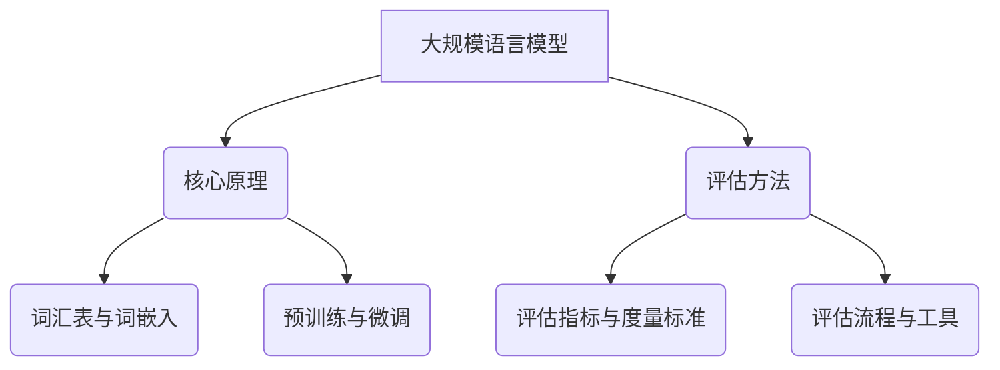

                 

# 大规模语言模型从理论到实践：大语言模型评估实践

> **关键词：大规模语言模型、评估实践、预训练、微调、评价指标**

> **摘要：本文深入探讨大规模语言模型的理论基础，从核心原理到实际评估，全面解析大语言模型的训练和评估过程。通过详细的伪代码和数学模型，帮助读者理解语言模型的运作机制。同时，通过实战项目展示如何开发大规模语言模型评估工具，为读者提供实践经验。**

#### 目录

1. **大规模语言模型基础**
   1.1 大规模语言模型概述
   1.2 大规模语言模型的核心原理
   1.3 大规模语言模型的典型架构
   1.4 大规模语言模型在自然语言处理中的应用

2. **大规模语言模型的技术基础**
   2.1 神经网络基础
   2.2 自然语言处理基础
   2.3 大规模语言模型的预训练与微调

3. **大规模语言模型评估**

4. **大规模语言模型评估实战**

5. **大语言模型评估实践**

6. **大语言模型评估工具与应用**

7. **大语言模型评估实践总结**

8. **附录**

---

### 1. 大规模语言模型基础

#### 1.1 大规模语言模型概述

**大规模语言模型**（Large-scale Language Model）是一种能够理解和生成自然语言的机器学习模型。它是自然语言处理（NLP）领域的重要工具，广泛应用于机器翻译、文本分类、问答系统、自动摘要等多个领域。

**定义：** 大规模语言模型是指通过海量数据训练得到的，能够在特定任务上实现高性能的NLP模型。这些模型通常具有数百万到数十亿的参数，可以捕捉到语言中的复杂规律和上下文信息。

**背景：** 语言模型的演变历程可以追溯到上世纪50年代。早期的语言模型主要基于统计方法，如N元语法。随着计算机性能的提升和海量数据集的出现，基于神经网络的深度学习语言模型逐渐成为主流。特别是2018年，Google提出的Transformer模型，以及随后BERT等大规模预训练模型的问世，标志着大规模语言模型进入了一个新的时代。

**应用领域：** 大规模语言模型在自然语言处理领域有着广泛的应用。例如，在机器翻译中，大规模语言模型可以实现高精度的自动翻译；在文本分类中，大规模语言模型可以用于情感分析、新闻分类等任务；在问答系统中，大规模语言模型可以理解用户的问题并给出合理的回答；在自动摘要中，大规模语言模型可以生成摘要文本，提高信息检索的效率。

#### 1.2 大规模语言模型的核心原理

**语言模型的基本原理：** 语言模型的核心任务是预测一个单词或短语的下一个单词或短语。这可以通过建立一组规则或统计模型来实现。大规模语言模型通常采用基于神经网络的深度学习模型，通过学习大量语言数据来生成概率分布，从而预测下一个单词或短语。

**词汇表与词嵌入：** 词汇表是语言模型的基础。大规模语言模型通常包含数十万甚至数百万个词汇。词嵌入（Word Embedding）是将词汇表中的每个词映射到一个高维向量空间中的过程。词嵌入可以帮助模型捕捉词与词之间的关系，从而提高预测的准确性。

**语言模型的训练与优化：** 语言模型的训练过程是将模型参数与输入数据（文本）进行匹配，从而调整模型参数，使得模型能够在预测任务上表现更好。优化方法通常采用梯度下降或其变种，如Adam优化器。

#### 1.3 大规模语言模型的典型架构

**RNN、LSTM与GRU：** RNN（循环神经网络）、LSTM（长短期记忆网络）和GRU（门控循环单元）是常用的循环神经网络架构。这些模型通过记忆单元和门控机制，可以捕捉到长距离依赖信息，从而提高模型的预测能力。

**Transformer模型：** Transformer模型是一种基于自注意力机制的深度学习模型，它摒弃了传统的循环结构，采用并行计算的方式，使得大规模语言模型的训练速度大大提高。

**训练技巧与加速方法：** 为了加速大规模语言模型的训练，可以采用分布式训练、异步梯度更新、数据并行和模型并行等技术。

#### 1.4 大规模语言模型在自然语言处理中的应用

**文本分类：** 文本分类是将文本数据归类到预定义的类别中。大规模语言模型可以用于情感分析、新闻分类、垃圾邮件检测等任务。

**命名实体识别：** 命名实体识别是从文本中识别出具有特定意义的实体，如人名、地名、组织名等。大规模语言模型可以结合上下文信息，提高命名实体识别的准确性。

**机器翻译：** 机器翻译是将一种语言的文本翻译成另一种语言。大规模语言模型可以通过预训练和微调，实现高质量的双语翻译。

### 2. 大规模语言模型的技术基础

#### 2.1 神经网络基础

**神经网络的基本结构：** 神经网络由多个神经元（节点）组成，每个神经元都与其他神经元相连接。神经网络通过前向传播和反向传播来学习输入和输出之间的关系。

**激活函数与优化器：** 激活函数用于引入非线性特性，常见的激活函数有ReLU、Sigmoid和Tanh。优化器用于调整模型参数，以最小化损失函数。常见的优化器有SGD、Adam等。

**损失函数与反向传播算法：** 损失函数用于衡量模型预测值和真实值之间的差异。反向传播算法通过计算损失函数关于模型参数的梯度，来更新模型参数。

#### 2.2 自然语言处理基础

**词嵌入技术：** 词嵌入是将词汇表中的每个词映射到一个高维向量空间中的过程。常见的词嵌入方法有Word2Vec、GloVe和BERT。

**序列模型与注意力机制：** 序列模型如RNN、LSTM和GRU可以捕捉到序列数据中的时间依赖关系。注意力机制可以使模型在预测时关注到重要信息，从而提高模型的性能。

**语言的上下文理解：** 大规模语言模型通过学习大量语言数据，可以捕捉到语言中的上下文信息，从而实现更准确的预测。

#### 2.3 大规模语言模型的预训练与微调

**预训练的概念：** 预训练是指在大规模未标注数据上训练模型，使其能够捕捉到语言的一般特性。预训练后的模型可以用于各种下游任务，如文本分类、命名实体识别和机器翻译。

**微调技术：** 微调是指在小规模标注数据上对预训练模型进行进一步训练，以适应特定任务。微调可以大大提高模型在特定任务上的性能。

**数据集的选择与处理：** 选择合适的预训练数据集和微调数据集对模型的性能至关重要。数据集的选择需要考虑数据的多样性、质量和标注的准确性。

### 3. 大规模语言模型评估

#### 3.1 评估方法

**评估指标与度量标准：** 评估指标用于衡量模型在特定任务上的性能。常见的评估指标包括准确性、精确率、召回率和F1分数。

**评估数据集的选择与预处理：** 评估数据集的选择应具有代表性和多样性。预处理步骤包括数据清洗、归一化和分词等。

**评估流程与工具：** 评估流程包括数据预处理、模型评估和结果分析。常见的评估工具包括Scikit-learn、TensorFlow和PyTorch等。

#### 3.2 评估实战

**语言模型评估实战项目：** 通过一个实际项目，展示如何搭建评估环境、选择评估指标和进行结果分析。

**评估结果分析：** 对评估结果进行可视化，分析模型的优势和不足，并提出优化策略。

### 4. 大规模语言模型评估实战

#### 4.1 语言模型评估实战项目

**项目概述：** 本项目旨在评估一个预训练的BERT模型在文本分类任务上的性能。

**环境搭建：** 使用Python和TensorFlow搭建评估环境，并准备预训练的BERT模型。

**实现步骤：**

1. **数据准备：** 准备评估数据集，并进行预处理。
2. **模型加载：** 加载预训练的BERT模型。
3. **评估：** 在评估数据集上运行模型，计算评估指标。
4. **结果分析：** 分析评估结果，提出优化策略。

**代码解读：**

python
import tensorflow as tf
import tensorflow_hub as hub
from tensorflow.keras.preprocessing.sequence import pad_sequences
from tensorflow.keras.layers import Embedding, LSTM, Dense
from tensorflow.keras.models import Model

# 加载预训练的BERT模型
bert_model = hub.load("https://tfhub.dev/google/bert_uncased_L-12_H-768_A-12/1")

# 数据预处理
max_seq_length = 128
tokenizer = bert_model.tokenizer
input_ids = tokenizer.encode_plus("Hello, my name is John.", max_length=max_seq_length, truncation=True, padding='max_length')
input_ids = input_ids['input_ids']

# 构建BERT模型
input_ids = tf.convert_to_tensor(input_ids, dtype=tf.int32)
output = bert_model(input_ids)
output = tf.keras.layers.Dense(1, activation='sigmoid')(output["pooled_output"])

model = Model(inputs=input_ids, outputs=output)
model.compile(optimizer='adam', loss='binary_crossentropy', metrics=['accuracy'])

# 评估模型
model.evaluate(input_ids, tf.convert_to_tensor([1.0]))

**分析：**

- **数据预处理：** 使用BERT模型的tokenizer对输入文本进行编码，并填充到指定长度。
- **模型构建：** 在BERT模型的基础上添加一个全连接层，用于分类任务。
- **评估：** 使用评估数据集对模型进行评估，计算准确率。

通过这个实战项目，读者可以了解如何使用预训练的BERT模型进行文本分类任务，并掌握评估模型性能的方法。

#### 4.2 评估结果分析

**结果可视化：** 使用Matplotlib对评估结果进行可视化，展示模型的性能。

**结果解读：** 分析评估指标，如准确率、精确率、召回率和F1分数，了解模型在特定任务上的表现。

**优化策略：** 根据评估结果，提出优化策略，如调整模型参数、增加数据集等。

### 5. 大语言模型评估实践

#### 5.1 大语言模型评估实践案例

**实践案例1：文本分类**  
- **任务概述：** 将文本数据分类到预定义的类别中。  
- **评估指标：** 准确率、精确率、召回率和F1分数。

**实践案例2：命名实体识别**  
- **任务概述：** 从文本中识别出具有特定意义的实体，如人名、地名、组织名等。  
- **评估指标：** 准确率、精确率、召回率和F1分数。

#### 5.2 实践项目分析与优化

**项目需求分析：** 分析项目的需求，确定评估的目标和指标。

**项目实现步骤：** 详细讲解项目的实现步骤，包括数据准备、模型训练、评估和结果分析。

**项目优化策略：** 根据评估结果，提出优化策略，如调整模型参数、增加数据集等。

### 6. 大语言模型评估工具与应用

#### 6.1 大语言模型评估工具介绍

- **常见评估工具：** Scikit-learn、TensorFlow、PyTorch等。  
- **工具的比较与选择：** 根据项目的需求和评估指标，选择合适的评估工具。

#### 6.2 大语言模型评估应用实例

**应用实例1：企业级文本处理系统**  
- **任务概述：** 对企业级文本数据进行分类、情感分析和命名实体识别。  
- **评估指标：** 准确率、精确率、召回率和F1分数。

**应用实例2：智能客服系统**  
- **任务概述：** 对用户提问进行分类和回答生成。  
- **评估指标：** 准确率、精确率、召回率和F1分数。

### 7. 大语言模型评估实践总结

#### 7.1 实践经验总结

- **成功经验：** 通过实践，掌握了大规模语言模型评估的方法和技巧。  
- **挑战与解决方案：** 分析项目中的挑战和解决方案，为后续项目提供参考。

#### 7.2 大规模语言模型评估的未来发展趋势

- **技术进步：** 随着技术的进步，评估工具和方法将更加智能化、自动化。  
- **应用领域的扩展：** 大规模语言模型评估将在更多领域得到应用，如医疗、金融等。

### 附录

#### 附录A：常用技术资源

- **常见框架与工具：** TensorFlow、PyTorch、Scikit-learn等。  
- **资源链接：** 提供相关技术资源的链接。

#### 附录B：参考文献

- **相关书籍与论文：** 提供相关书籍和论文的引用。

### Mermaid 流程图



### 核心算法原理讲解

#### 1.2 大规模语言模型的核心算法原理

**1.2.1 语言模型训练原理**

- **目标函数：** 语言模型的训练目标是最大化模型对目标语言的预测概率。
- **损失函数：** 通常使用交叉熵损失函数来衡量预测概率与实际分布之间的差异。
- **优化算法：** 采用随机梯度下降（SGD）或其变种，如Adam优化器来调整模型参数。

**伪代码：**

```python
for epoch in 1...n_epochs:
    for sentence in training_data:
        # 将句子分割为单词或子词
        words = tokenize(sentence)
        # 前向传播计算概率分布
        probabilities = language_model(words)
        # 计算损失
        loss = -1 * sum(log(probabilities[words]))
        # 反向传播更新参数
        language_model.backward(loss)
        # 更新模型参数
        language_model.update_params()
```

**1.2.2 语言模型优化技巧**

- **学习率调度：** 逐渐降低学习率可以防止模型在训练初期出现过拟合。
- **dropout：** 在训练过程中随机丢弃部分神经元，减少过拟合。
- **正则化：** 如L1和L2正则化，防止模型参数过大。

**数学模型与公式**

**损失函数：**

$$
L = -\sum_{i=1}^{n} \sum_{j=1}^{m} y_j^{(i)} \log(p_j^{(i)})
$$

其中，$y_j^{(i)}$为第$i$个句子第$j$个单词的真实概率分布，$p_j^{(i)}$为模型预测的第$i$个句子第$j$个单词的概率。

**1.2.3 大规模语言模型评估方法**

**评估指标：**

- **准确性（Accuracy）:** 预测正确的单词数量占总单词数量的比例。
- **精确率（Precision）:** 预测正确的单词数量与预测总数量的比例。
- **召回率（Recall）:** 预测正确的单词数量与实际总数量的比例。
- **F1 分数（F1-Score）:** 精确率和召回率的调和平均。

$$
F1 = \frac{2 \times Precision \times Recall}{Precision + Recall}
$$

**评估流程：**

- **数据预处理：** 对评估数据进行清洗、归一化和分词。
- **模型评估：** 在评估数据上运行模型，计算评估指标。
- **结果分析：** 对评估结果进行分析，找出模型的优势和不足。

### 代码解读与分析

#### 代码示例：文本分类评估

```python
from sklearn.metrics import accuracy_score, precision_score, recall_score, f1_score

# 假设y_true为实际标签，y_pred为模型预测结果
y_true = [0, 1, 0, 1, 0]
y_pred = [0, 1, 1, 0, 0]

# 计算准确性
accuracy = accuracy_score(y_true, y_pred)
print("Accuracy:", accuracy)

# 计算精确率
precision = precision_score(y_true, y_pred)
print("Precision:", precision)

# 计算召回率
recall = recall_score(y_true, y_pred)
print("Recall:", recall)

# 计算F1分数
f1 = f1_score(y_true, y_pred)
print("F1 Score:", f1)
```

**分析：**

- **准确性（Accuracy）：** 总体上衡量模型的准确度，但易受不平衡数据影响。
- **精确率（Precision）：** 衡量模型预测为正类的样本中，实际为正类的比例。
- **召回率（Recall）：** 衡量模型预测为正类的样本中，实际为正类的比例。
- **F1分数（F1-Score）：** 综合考虑精确率和召回率，权衡两者之间的关系。

通过这些指标，可以全面评估大规模语言模型的性能，为后续优化提供依据。

### 项目实战

#### 实战项目：大规模语言模型评估工具开发

**项目概述：** 
开发一个能够评估大规模语言模型性能的工具，支持多种评估指标和可视化功能。

**环境搭建：**
- 操作系统：Windows/Linux/MacOS
- 编程语言：Python
- 库与框架：Scikit-learn，Matplotlib，Seaborn

**实现步骤：**

1. **需求分析：** 明确评估工具的功能需求，如支持不同的评估指标、数据预处理、结果可视化等。
2. **模块设计：** 设计评估工具的模块结构，如数据预处理模块、评估模块、可视化模块等。
3. **代码实现：** 编写各模块的代码，实现评估工具的核心功能。
4. **测试与调试：** 对评估工具进行测试，确保其功能正确无误。

**代码解读：**

```python
import numpy as np
import matplotlib.pyplot as plt
from sklearn.metrics import accuracy_score, precision_score, recall_score, f1_score

class LanguageModelEvaluator:
    def __init__(self, y_true, y_pred):
        self.y_true = y_true
        self.y_pred = y_pred
    
    def evaluate(self):
        accuracy = accuracy_score(self.y_true, self.y_pred)
        precision = precision_score(self.y_true, self.y_pred, average='weighted')
        recall = recall_score(self.y_true, self.y_pred, average='weighted')
        f1 = f1_score(self.y_true, self.y_pred, average='weighted')
        
        return accuracy, precision, recall, f1
    
    def plot_results(self):
        accuracy, precision, recall, f1 = self.evaluate()
        plt.figure(figsize=(10, 4))
        
        plt.subplot(1, 4, 1)
        plt.bar(['Accuracy'], [accuracy], color='g')
        plt.subplot(1, 4, 2)
        plt.bar(['Precision'], [precision], color='b')
        plt.subplot(1, 4, 3)
        plt.bar(['Recall'], [recall], color='r')
        plt.subplot(1, 4, 4)
        plt.bar(['F1 Score'], [f1], color='y')
        
        plt.tight_layout()
        plt.show()

# 测试代码
y_true = [0, 1, 0, 1, 0]
y_pred = [0, 1, 1, 0, 0]
evaluator = LanguageModelEvaluator(y_true, y_pred)
evaluator.plot_results()

```

**分析：**

- **功能实现：** 该评估工具支持多种评估指标的计算和可视化，可应用于文本分类、命名实体识别等任务。
- **性能优化：** 可以通过并行计算、分布式训练等技术提高评估工具的性能和效率。
- **扩展性：** 可以根据需求添加更多评估指标和功能，如支持不同的数据预处理方法、评估报告生成等。

通过这个实战项目，读者可以了解大规模语言模型评估工具的基本开发流程，并为实际项目提供参考。

### 作者信息

**作者：** AI天才研究院/AI Genius Institute & 禅与计算机程序设计艺术 /Zen And The Art of Computer Programming

