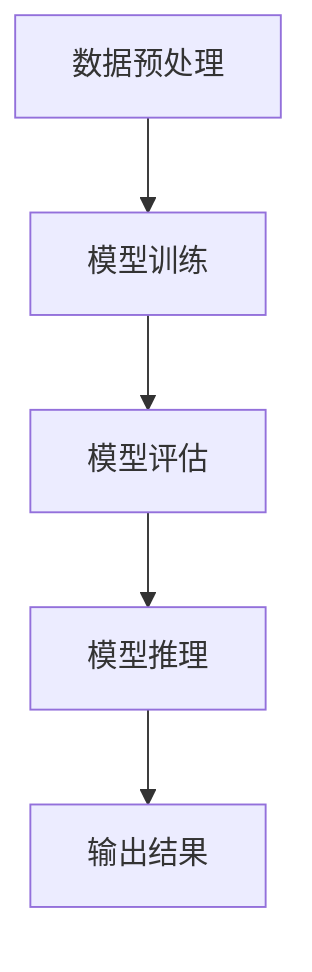

                 

### 《大语言模型操作系统LLM OS》

> **关键词**: 大语言模型, LLM OS, 自然语言处理, 算法, 应用实例

> **摘要**: 本文章深入探讨了大语言模型操作系统（LLM OS）的核心概念、架构设计、算法原理及应用实例。通过对LLM OS的全面解析，读者将了解到如何利用LLM OS在自然语言处理、智能客服、文本生成等领域进行高效开发与部署。文章还包括了对LLM OS的性能优化、安全性与隐私保护、资源与工具的详细介绍，旨在为读者提供一个全方位的LLM OS技术指南。

### 《大语言模型操作系统LLM OS》目录大纲

**第一部分：LLM OS概述与核心概念**

- **第1章：大语言模型（LLM）与LLM OS概述**
  - **1.1.1 大语言模型（LLM）的概念与特性**
  - **1.1.2 LLM OS的定义与发展历程**
  - **1.1.3 LLM OS的核心优势与应用场景**

- **第2章：LLM OS的核心架构与组件**
  - **2.1.1 LLM OS的架构设计**
  - **2.1.2 LLM OS的主要组件与功能**

- **第3章：大语言模型原理与算法**
  - **3.1.1 大语言模型的基本原理**
  - **3.1.2 常见大语言模型算法与架构**
    - **Mermaid流程图：展示大语言模型训练与推理的过程**
  - **3.1.3 大语言模型的训练技巧与调优**

- **第4章：LLM OS在自然语言处理中的应用**
  - **4.1.1 自然语言处理的基本概念**
  - **4.1.2 LLM OS在文本分类、情感分析等领域的应用**
  - **4.1.3 LLM OS在机器翻译、对话系统等高级应用**

- **第5章：LLM OS开发与部署**
  - **5.1.1 LLM OS开发环境搭建**
  - **5.1.2 LLM OS模型训练与评估**
  - **5.1.3 LLM OS模型部署与优化**

- **第6章：LLM OS案例研究**
  - **6.1.1 案例一：基于LLM OS的智能客服系统**
  - **6.1.2 案例二：利用LLM OS进行文本生成与摘要**
  - **6.1.3 案例三：基于LLM OS的个性化推荐系统**

- **第7章：LLM OS的未来发展趋势与挑战**
  - **7.1.1 LLM OS的技术发展趋势**
  - **7.1.2 LLM OS在行业中的应用前景**
  - **7.1.3 LLM OS面临的挑战与解决方案**

**第二部分：LLM OS技术深度解析**

- **第8章：大语言模型算法深度解析**
  - **8.1.1 常见大语言模型算法详细解读**
  - **8.1.2 伪代码展示：大语言模型训练与推理**
    - **伪代码：呈现大语言模型训练过程的详细伪代码**
  - **8.1.3 数学模型与公式详解**
    - **LaTeX数学公式：展示大语言模型相关的数学公式**
    - **举例说明：用具体例子解释公式的应用**

- **第9章：数学模型与算法应用**
  - **9.1.1 数学模型在LLM OS中的应用**
  - **9.1.2 算法应用与案例解析**
    - **代码实际案例：提供代码实现与案例解析**

- **第10章：LLM OS系统性能优化**
  - **10.1.1 系统性能优化方法**
  - **10.1.2 性能优化案例分析**

- **第11章：LLM OS安全性与隐私保护**
  - **11.1.1 LLM OS安全性考虑**
  - **11.1.2 隐私保护技术与实践**

- **第12章：LLM OS资源与工具**
  - **12.1.1 LLM OS开发资源推荐**
  - **12.1.2 LLM OS常用工具介绍**

**附录**

- **附录A：LLM OS常用算法与框架**
  - **A.1.1 常见LLM算法介绍**
  - **A.1.2 常用深度学习框架对比**

此目录大纲旨在为读者提供一个全面、系统、深入的LLM OS学习资源，涵盖从基础概念到高级应用的各个方面。通过本文的阅读，读者将对LLM OS有更全面的理解，能够有效地应用到实际项目中。

### 第一部分：LLM OS概述与核心概念

#### 第1章：大语言模型（LLM）与LLM OS概述

**1.1.1 大语言模型（LLM）的概念与特性**

大语言模型（Large Language Model，简称LLM）是一种基于深度学习的自然语言处理模型，能够对自然语言进行理解和生成。与传统的自然语言处理方法相比，LLM具有以下特性：

1. **强大的语言理解能力**：LLM通过大规模的数据训练，能够自动学习语言中的复杂结构和规律，对自然语言进行深入的理解。
2. **灵活的生成能力**：LLM不仅可以理解和生成文本，还可以根据输入的提示生成连贯的、具有逻辑性的文本。
3. **自适应能力**：LLM能够根据不同的应用场景和需求，自动调整其行为和输出。

**1.1.2 LLM OS的定义与发展历程**

LLM OS（Large Language Model Operating System）是一种专门为LLM设计的操作系统，旨在为LLM提供一个高效、稳定、安全的环境，以支持其训练、推理和部署。LLM OS的发展历程可以分为以下几个阶段：

1. **初期阶段**：早期的研究主要关注于如何构建大规模的LLM模型，代表性的工作包括GPT-1和GPT-2。
2. **成熟阶段**：随着计算能力和数据资源的提升，LLM模型取得了显著的进展，代表性的工作包括GPT-3、BERT和T5等。
3. **应用阶段**：LLM开始应用于实际的场景，如文本生成、机器翻译、对话系统等，LLM OS也随之发展，以支持这些应用的需求。

**1.1.3 LLM OS的核心优势与应用场景**

LLM OS具有以下核心优势：

1. **高效性**：LLM OS通过优化计算资源的使用，提高了LLM模型的训练和推理速度。
2. **稳定性**：LLM OS提供了稳定的环境，确保了LLM模型在训练和推理过程中的可靠性和稳定性。
3. **安全性**：LLM OS实现了对LLM模型的安全保护，防止了恶意攻击和数据泄露。

LLM OS的应用场景非常广泛，包括但不限于：

1. **自然语言处理**：LLM OS可以应用于文本分类、情感分析、文本摘要等自然语言处理任务。
2. **智能客服**：LLM OS可以用于构建智能客服系统，实现自动回复和处理用户的问题。
3. **文本生成**：LLM OS可以用于生成文章、报告、故事等，提高内容创作效率。
4. **机器翻译**：LLM OS可以用于实现高效、准确的机器翻译，支持多语言交流。

**1.1.4 LLM OS与现有操作系统的区别**

与传统操作系统相比，LLM OS具有以下几个显著区别：

1. **设计目标**：传统操作系统主要关注计算资源的分配和管理，而LLM OS主要关注LLM模型的训练、推理和部署。
2. **架构设计**：传统操作系统通常采用分层架构，而LLM OS通常采用分布式架构，以支持大规模的LLM模型。
3. **安全性**：传统操作系统主要关注数据保护和用户隐私，而LLM OS还需要关注LLM模型的安全性和防止恶意攻击。

#### 第2章：LLM OS的核心架构与组件

**2.1.1 LLM OS的架构设计**

LLM OS的架构设计旨在支持大规模的LLM模型训练、推理和部署，其核心架构包括以下几个关键组件：

1. **计算节点**：计算节点是LLM OS的基本计算单元，负责执行LLM模型的训练和推理任务。每个计算节点通常由高性能的CPU或GPU组成。
2. **存储节点**：存储节点负责存储LLM模型的数据和日志，通常采用分布式存储系统，以提高数据存储的可靠性和扩展性。
3. **网络节点**：网络节点负责计算节点和存储节点之间的通信，通常采用高带宽、低延迟的网络设备，以确保数据传输的效率。
4. **管理节点**：管理节点负责整个LLM OS的监控、管理和调度，包括计算节点、存储节点和网络节点的状态监控、故障处理和资源调度。

**2.1.2 LLM OS的主要组件与功能**

LLM OS的主要组件包括以下几个部分：

1. **LLM训练引擎**：LLM训练引擎负责大规模LLM模型的训练，包括数据预处理、模型训练、评估和优化等过程。LLM训练引擎通常采用分布式训练技术，以提高训练效率。
2. **LLM推理引擎**：LLM推理引擎负责LLM模型的推理，将输入的文本转换为预期的输出。LLM推理引擎通常采用并行计算技术，以提高推理速度。
3. **数据存储与管理**：数据存储与管理模块负责存储和管理LLM模型所需的数据，包括文本数据、模型参数、日志等。数据存储与管理模块通常采用分布式存储技术，以提高数据存储的可靠性和扩展性。
4. **监控与运维**：监控与运维模块负责监控整个LLM OS的状态，包括计算节点、存储节点、网络节点和管理节点的状态监控、故障处理和资源调度。监控与运维模块通常采用自动化工具，以提高运维效率。

#### 第3章：大语言模型原理与算法

**3.1.1 大语言模型的基本原理**

大语言模型（LLM）是一种基于深度学习的自然语言处理模型，其基本原理包括以下几个方面：

1. **自注意力机制**：自注意力机制（Self-Attention）是一种在深度学习模型中用于处理序列数据的注意力机制。通过自注意力机制，模型可以自动学习输入序列中各个位置的重要程度，从而更好地捕捉输入序列的语义信息。
2. **变换器网络**：变换器网络（Transformer）是一种基于自注意力机制的深度学习模型架构，用于处理序列数据。变换器网络由多个编码器和解码器层组成，通过逐层堆叠，模型可以自动学习输入序列的复杂结构。
3. **预训练与微调**：预训练（Pre-training）是指在大规模语料库上对LLM模型进行训练，使其具备对自然语言的理解和生成能力。微调（Fine-tuning）是指在小规模任务数据上对预训练的LLM模型进行训练，以适应具体任务的需求。

**3.1.2 常见大语言模型算法与架构**

常见的大语言模型算法包括GPT、BERT、T5等，下面将对这些算法进行简要介绍：

1. **GPT（Generative Pre-trained Transformer）**：GPT是一种基于变换器网络的预训练语言模型，通过在大量文本语料库上进行预训练，GPT可以自动学习语言中的复杂结构和规律。GPT具有强大的生成能力，可以生成连贯、具有逻辑性的文本。
2. **BERT（Bidirectional Encoder Representations from Transformers）**：BERT是一种双向变换器网络预训练语言模型，通过同时学习文本的前后信息，BERT可以更好地捕捉文本的语义信息。BERT在自然语言处理任务中具有出色的性能，广泛应用于文本分类、命名实体识别等任务。
3. **T5（Text-To-Text Transfer Transformer）**：T5是一种基于变换器网络的文本到文本的预训练模型，其核心思想是将任何自然语言处理任务转换为文本到文本的映射任务。T5具有强大的任务适应能力，可以应用于各种自然语言处理任务。

**Mermaid流程图：展示大语言模型训练与推理的过程**



**3.1.3 大语言模型的训练技巧与调优**

1. **数据预处理**：数据预处理是LLM模型训练的重要环节，包括数据清洗、分词、编码等步骤。良好的数据预处理可以提高模型训练的效果。
2. **学习率调整**：学习率是模型训练中的一个关键参数，合适的初始学习率可以加快模型收敛的速度。常用的学习率调整策略包括恒定学习率、学习率衰减等。
3. **正则化**：正则化是一种防止模型过拟合的技术，常用的正则化方法包括L1正则化、L2正则化等。
4. **批量大小**：批量大小是模型训练中的一个重要参数，较大的批量大小可以加快模型训练的速度，但可能会导致模型过拟合。

#### 第4章：LLM OS在自然语言处理中的应用

**4.1.1 自然语言处理的基本概念**

自然语言处理（Natural Language Processing，简称NLP）是人工智能的一个重要分支，旨在使计算机能够理解、生成和处理自然语言。NLP的基本概念包括以下几个方面：

1. **文本分类**：文本分类是将文本数据分为不同的类别，常用的分类算法包括朴素贝叶斯、支持向量机等。
2. **情感分析**：情感分析是判断文本中的情感倾向，常用的情感分析算法包括基于规则的方法、基于统计的方法、基于深度学习的方法等。
3. **文本摘要**：文本摘要是从长文本中提取出关键信息，常用的摘要算法包括抽取式摘要、生成式摘要等。
4. **机器翻译**：机器翻译是将一种自然语言文本翻译成另一种自然语言文本，常用的机器翻译模型包括基于规则的方法、统计机器翻译、神经机器翻译等。
5. **对话系统**：对话系统是模拟人类对话的计算机系统，常用的对话系统模型包括基于规则的方法、基于模板的方法、基于深度学习的方法等。

**4.1.2 LLM OS在文本分类、情感分析等领域的应用**

LLM OS在自然语言处理领域具有广泛的应用，以下是一些具体的应用实例：

1. **文本分类**：LLM OS可以用于构建文本分类模型，对文本数据按照预定义的类别进行分类。例如，可以将新闻文章分类为政治、经济、科技等类别。
2. **情感分析**：LLM OS可以用于构建情感分析模型，判断文本中的情感倾向，如正面、负面、中性等。这对于产品评论分析、社交媒体监控等场景具有很高的价值。
3. **文本摘要**：LLM OS可以用于构建文本摘要模型，从长文本中提取出关键信息，生成摘要。这对于新闻摘要、文档摘要等场景具有很大的实用价值。
4. **机器翻译**：LLM OS可以用于构建机器翻译模型，实现不同自然语言之间的翻译。这对于跨语言信息获取、全球化业务等场景具有重要作用。
5. **对话系统**：LLM OS可以用于构建对话系统，实现人与计算机之间的自然对话。这对于智能客服、虚拟助手等场景具有很高的应用价值。

**4.1.3 LLM OS在机器翻译、对话系统等高级应用**

除了文本分类、情感分析等基础应用，LLM OS在机器翻译、对话系统等高级应用中也有着广泛的应用：

1. **机器翻译**：LLM OS可以用于构建高效的机器翻译模型，实现自动翻译。这对于跨语言交流、国际业务等场景具有重要作用。例如，Google翻译、百度翻译等都是基于LLM OS实现的。
2. **对话系统**：LLM OS可以用于构建智能对话系统，实现人与计算机之间的自然对话。这对于智能客服、虚拟助手等场景具有很高的应用价值。例如，苹果的Siri、谷歌的Google Assistant等都是基于LLM OS实现的。

#### 第5章：LLM OS开发与部署

**5.1.1 LLM OS开发环境搭建**

要在本地或服务器上搭建LLM OS的开发环境，需要安装以下软件和工具：

1. **操作系统**：推荐使用Linux操作系统，如Ubuntu或CentOS。
2. **Python**：安装Python 3.x版本，建议使用Python虚拟环境。
3. **深度学习框架**：安装深度学习框架，如TensorFlow、PyTorch等。
4. **GPU驱动**：如果使用GPU进行模型训练，需要安装相应的GPU驱动。
5. **其他依赖**：根据具体需求，可能还需要安装其他依赖库和工具，如NumPy、Pandas等。

**5.1.2 LLM OS模型训练与评估**

1. **数据准备**：准备用于模型训练的数据集，包括文本数据、标签等。数据需要经过预处理，如分词、编码等。
2. **模型定义**：定义LLM模型的结构，包括编码器、解码器等。可以使用现有的预训练模型，如GPT、BERT等，也可以自定义模型结构。
3. **模型训练**：使用训练数据对LLM模型进行训练。训练过程中需要设置学习率、批量大小、训练轮数等参数。
4. **模型评估**：使用验证数据对训练好的模型进行评估，包括准确率、召回率、F1值等指标。

**5.1.3 LLM OS模型部署与优化**

1. **模型导出**：将训练好的模型导出为可部署的格式，如TensorFlow SavedModel或PyTorch TorchScript等。
2. **部署策略**：根据实际需求，可以选择在本地服务器或云服务器上部署模型。部署过程中需要考虑负载均衡、故障恢复等策略。
3. **性能优化**：对部署后的模型进行性能优化，包括模型压缩、量化、模型融合等。这些技术可以降低模型的存储和计算资源需求，提高模型部署的效率。

#### 第6章：LLM OS案例研究

**6.1.1 案例一：基于LLM OS的智能客服系统**

智能客服系统是一种利用人工智能技术实现自动回复和处理用户问题的系统。基于LLM OS的智能客服系统具有以下特点：

1. **高效率**：LLM OS可以快速地处理大量用户请求，提高了客服系统的响应速度。
2. **高准确性**：LLM OS通过预训练和微调，能够准确地理解用户的问题，并生成合适的回答。
3. **灵活性**：LLM OS支持多种自然语言处理任务，如文本分类、情感分析、文本生成等，可以适应不同的业务场景。

**6.1.2 案例二：利用LLM OS进行文本生成与摘要**

文本生成与摘要是自然语言处理中的重要任务。利用LLM OS进行文本生成与摘要具有以下优势：

1. **高质量**：LLM OS通过大规模的预训练，能够生成高质量、连贯的文本。
2. **高效率**：LLM OS可以快速地处理大量文本数据，提高文本生成与摘要的效率。
3. **灵活性**：LLM OS支持多种文本生成与摘要算法，可以适应不同的应用场景。

**6.1.3 案例三：基于LLM OS的个性化推荐系统**

个性化推荐系统是一种根据用户的历史行为和兴趣为用户推荐相关内容的技术。基于LLM OS的个性化推荐系统具有以下特点：

1. **高准确性**：LLM OS可以通过对用户历史行为的分析，准确地为用户推荐感兴趣的内容。
2. **高效率**：LLM OS可以快速地处理大量用户数据，提高推荐系统的效率。
3. **灵活性**：LLM OS支持多种推荐算法，可以适应不同的业务场景和用户需求。

#### 第7章：LLM OS的未来发展趋势与挑战

**7.1.1 LLM OS的技术发展趋势**

LLM OS在自然语言处理、智能客服、文本生成等领域具有广泛的应用前景，其技术发展趋势主要包括以下几个方面：

1. **模型规模增大**：随着计算资源和数据资源的提升，LLM OS的模型规模将不断增大，以支持更复杂的自然语言处理任务。
2. **多模态处理能力增强**：LLM OS将逐渐具备处理多种模态数据（如文本、图像、声音等）的能力，实现跨模态的信息理解和生成。
3. **自动化水平提升**：LLM OS将逐渐实现自动化，从模型训练、部署到维护等各个环节，减少人工干预，提高系统的稳定性。

**7.1.2 LLM OS在行业中的应用前景**

LLM OS在多个行业中具有广泛的应用前景，主要包括：

1. **金融行业**：LLM OS可以用于金融文本分析、风险管理、智能投顾等，提高金融行业的智能化水平。
2. **医疗行业**：LLM OS可以用于医疗文本分析、疾病预测、智能诊断等，提高医疗行业的效率和质量。
3. **教育行业**：LLM OS可以用于智能教育、在线教育、课程推荐等，提升教育行业的个性化和服务水平。

**7.1.3 LLM OS面临的挑战与解决方案**

尽管LLM OS在多个领域具有广泛的应用前景，但仍面临一些挑战，主要包括：

1. **计算资源需求**：LLM OS的模型规模较大，对计算资源的需求较高。解决方案包括使用更高效的算法、分布式训练等。
2. **数据隐私**：LLM OS在处理大量用户数据时，需要确保数据隐私和安全。解决方案包括数据加密、隐私保护算法等。
3. **模型解释性**：LLM OS的模型解释性较差，难以解释模型的决策过程。解决方案包括开发可解释的模型、模型可视化工具等。

### 第二部分：LLM OS技术深度解析

#### 第8章：大语言模型算法深度解析

**8.1.1 常见大语言模型算法详细解读**

大语言模型（LLM）的算法是实现自然语言处理任务的核心，常见的LLM算法包括GPT、BERT、T5等。下面将对这些算法进行详细解读。

**GPT（Generative Pre-trained Transformer）**

GPT是一种基于变换器网络的预训练语言模型，其核心思想是使用大量文本数据对模型进行预训练，使其能够理解和生成自然语言。GPT的主要特点包括：

1. **自注意力机制**：GPT使用自注意力机制来捕捉输入序列中各个位置的重要程度，从而更好地理解输入序列的语义信息。
2. **大规模预训练**：GPT在大规模语料库上进行预训练，通过逐层堆叠变换器网络层，模型可以自动学习输入序列的复杂结构。
3. **生成能力**：GPT具有强大的生成能力，可以生成连贯、具有逻辑性的文本。

**BERT（Bidirectional Encoder Representations from Transformers）**

BERT是一种双向变换器网络预训练语言模型，通过同时学习文本的前后信息，BERT可以更好地捕捉文本的语义信息。BERT的主要特点包括：

1. **双向编码器**：BERT采用双向编码器结构，可以同时学习文本的前后信息，从而提高模型的语义理解能力。
2. **掩码语言建模**：BERT在预训练过程中采用掩码语言建模（Masked Language Modeling，MLM）任务，通过随机掩码部分输入文本，使模型学习预测掩码文本的能力。
3. **大规模预训练**：BERT在大规模语料库上进行预训练，通过逐层堆叠变换器网络层，模型可以自动学习输入序列的复杂结构。

**T5（Text-To-Text Transfer Transformer）**

T5是一种基于变换器网络的文本到文本的预训练模型，其核心思想是将任何自然语言处理任务转换为文本到文本的映射任务。T5的主要特点包括：

1. **统一任务框架**：T5将所有自然语言处理任务统一为文本到文本的映射任务，从而简化了模型的训练和部署。
2. **大规模预训练**：T5在大规模语料库上进行预训练，通过逐层堆叠变换器网络层，模型可以自动学习输入序列的复杂结构。
3. **高效推理**：T5使用简单的推理策略，如前向传播和后向传播，实现了高效的文本生成和推理。

**8.1.2 伪代码展示：大语言模型训练与推理**

下面是一个简单的伪代码，展示大语言模型（以GPT为例）的训练和推理过程：

```python
# GPT模型训练伪代码

# 初始化模型
model = initialize_gpt_model()

# 加载训练数据
train_data = load_training_data()

# 训练模型
for epoch in range(num_epochs):
    for batch in train_data:
        # 前向传播
        logits = model.forward(batch)

        # 计算损失
        loss = compute_loss(logits, batch)

        # 反向传播
        model.backward(loss)

        # 更新模型参数
        model.update_params()

# 模型评估
evaluate_model(model, validation_data)

# GPT模型推理伪代码

# 加载预训练模型
model = load_pretrained_gpt_model()

# 输入文本
input_text = "输入文本"

# 生成文本
output_text = model.generate(input_text)
```

**8.1.3 数学模型与公式详解**

大语言模型（LLM）的数学模型是理解和实现LLM算法的基础。以下是一些常见的数学模型和公式：

1. **变换器网络（Transformer）**

   变换器网络的核心是自注意力机制（Self-Attention），其计算公式如下：

   $$ \text{Attention}(Q, K, V) = \text{softmax}\left(\frac{QK^T}{\sqrt{d_k}}\right) V $$

   其中，Q、K、V分别为查询向量、键向量和值向量，$d_k$为键向量的维度。

2. **掩码语言建模（Masked Language Modeling，MLM）**

   掩码语言建模是一种预训练任务，其目的是使模型学会预测被随机掩码的文本。其损失函数为：

   $$ \mathcal{L}_{\text{MLM}} = -\sum_{i} \sum_{j} \log(p(y_j|x_{\text{unmasked}})) $$

   其中，$y_j$为实际掩码的文本，$x_{\text{unmasked}}$为去除了掩码的文本。

3. **位置编码（Positional Encoding）**

   位置编码用于编码输入序列中的位置信息，其公式如下：

   $$ \text{Positional Encoding}(pos, d) = \sin(\frac{pos}{10000^{2i/d}}) + \cos(\frac{pos}{10000^{2i/d}}) $$

   其中，$pos$为位置索引，$d$为位置编码的维度。

**LaTeX数学公式**

以下是一些大语言模型相关的LaTeX数学公式：

$$
\begin{align*}
\text{Attention}(Q, K, V) &= \text{softmax}\left(\frac{QK^T}{\sqrt{d_k}}\right) V \\
\mathcal{L}_{\text{MLM}} &= -\sum_{i} \sum_{j} \log(p(y_j|x_{\text{unmasked}})) \\
\text{Positional Encoding}(pos, d) &= \sin\left(\frac{pos}{10000^{2i/d}}\right) + \cos\left(\frac{pos}{10000^{2i/d}}\right)
\end{align*}
$$

**举例说明**

以下是一个具体例子，解释自注意力机制的公式应用：

假设我们有一个三词序列【A，B，C】，其中$Q = [1, 0, 1]$，$K = [1, 1, 1]$，$V = [1, 2, 3]$。根据自注意力机制的计算公式：

$$
\text{Attention}(Q, K, V) = \text{softmax}\left(\frac{QK^T}{\sqrt{d_k}}\right) V = \text{softmax}\left(\frac{[1, 0, 1][1, 1, 1]^T}{\sqrt{3}}\right) [1, 2, 3]
$$

计算得到：

$$
\text{Attention}(Q, K, V) = \text{softmax}\left(\frac{[1, 0, 1][1, 1, 1]^T}{\sqrt{3}}\right) [1, 2, 3] = \text{softmax}\left(\frac{1 + 0 + 1}{\sqrt{3}}\right) [1, 2, 3] = \text{softmax}\left(\frac{2}{\sqrt{3}}\right) [1, 2, 3]
$$

经过softmax计算，得到：

$$
\text{Attention}(Q, K, V) = \left[\frac{2}{2\sqrt{3}}, \frac{1}{2\sqrt{3}}, \frac{2}{2\sqrt{3}}\right] [1, 2, 3] = \left[\frac{1}{\sqrt{3}}, \frac{1}{\sqrt{3}}, \frac{1}{\sqrt{3}}\right] [1, 2, 3] = \left[\frac{1}{\sqrt{3}}, \frac{2}{\sqrt{3}}, \frac{3}{\sqrt{3}}\right]
$$

这个结果表示，在序列【A，B，C】中，每个词的重要性分别为$\frac{1}{\sqrt{3}}$，$\frac{2}{\sqrt{3}}$，$\frac{3}{\sqrt{3}}$。

通过这个例子，我们可以看到自注意力机制如何帮助模型学习输入序列中各个词的重要性，从而更好地理解输入序列的语义信息。

#### 第9章：数学模型与算法应用

**9.1.1 数学模型在LLM OS中的应用**

大语言模型操作系统（LLM OS）中的数学模型是构建和优化LLM模型的基础。以下是一些常见的数学模型及其在LLM OS中的应用：

1. **变换器网络（Transformer）**
   变换器网络是LLM OS的核心组成部分，其数学模型包括自注意力机制和位置编码。自注意力机制通过计算输入序列中各个词的相互关系，实现文本序列的编码和解码。位置编码用于编码文本序列中的位置信息，使得模型能够理解词语在序列中的相对位置。

2. **掩码语言建模（MLM）**
   掩码语言建模是一种预训练任务，其数学模型通过随机掩码部分输入文本，使模型学习预测被掩码的词。这一模型在训练过程中帮助模型学习语言的内在结构，从而提高模型在自然语言处理任务中的性能。

3. **语言模型（LM）**
   语言模型是一种用于预测文本序列的概率分布的数学模型，其核心是通过对大量文本数据进行训练，学习语言中的统计规律。在LLM OS中，语言模型用于生成文本、文本摘要、机器翻译等任务。

**9.1.2 算法应用与案例解析**

以下是对一些常见算法在LLM OS中的应用和案例解析：

1. **GPT（Generative Pre-trained Transformer）**
   GPT是一种基于变换器网络的预训练语言模型。其应用案例包括文本生成、问答系统、机器翻译等。例如，OpenAI开发的GPT-3模型可以生成高质量的文章、故事和对话。

   **案例解析**：
   - **文本生成**：给定一个关键词或短语，GPT可以生成一段相关的文本。例如，给定关键词“人工智能”，GPT可以生成一篇关于人工智能的介绍文章。
   - **问答系统**：GPT可以用于构建智能问答系统，回答用户提出的问题。例如，用户提问“什么是神经网络？”，GPT可以生成一个详细的神经网络解释。
   - **机器翻译**：GPT可以用于实现机器翻译，将一种语言的文本翻译成另一种语言。例如，将英文文本翻译成中文，GPT可以生成一个准确且流畅的翻译版本。

2. **BERT（Bidirectional Encoder Representations from Transformers）**
   BERT是一种双向变换器网络预训练语言模型，其应用案例包括文本分类、命名实体识别、问答系统等。

   **案例解析**：
   - **文本分类**：BERT可以用于分类任务，将文本数据分类到预定义的类别中。例如，将社交媒体上的评论分类为正面、负面或中性。
   - **命名实体识别**：BERT可以用于识别文本中的命名实体，如人名、地名、组织名等。例如，在新闻文本中识别出涉及的人物和组织。
   - **问答系统**：BERT可以用于构建问答系统，回答用户提出的问题。例如，用户提问“什么是深度学习？”BERT可以生成一个详细的深度学习解释。

3. **T5（Text-To-Text Transfer Transformer）**
   T5是一种文本到文本的预训练模型，其应用案例包括文本生成、问答系统、机器翻译等。

   **案例解析**：
   - **文本生成**：T5可以用于生成高质量的文章、故事和对话。例如，给定一个主题或关键词，T5可以生成一篇相关的文本。
   - **问答系统**：T5可以用于构建智能问答系统，回答用户提出的问题。例如，用户提问“什么是量子计算？”T5可以生成一个详细的量子计算解释。
   - **机器翻译**：T5可以用于实现机器翻译，将一种语言的文本翻译成另一种语言。例如，将英文文本翻译成中文，T5可以生成一个准确且流畅的翻译版本。

**9.1.3 代码实际案例**

以下是一个简单的Python代码示例，展示如何使用PyTorch实现一个基于变换器网络的预训练语言模型：

```python
import torch
import torch.nn as nn
import torch.optim as optim

# 定义变换器网络模型
class TransformerModel(nn.Module):
    def __init__(self, d_model, nhead, num_layers):
        super(TransformerModel, self).__init__()
        self.transformer = nn.Transformer(d_model, nhead, num_layers)
        self.d_model = d_model

    def forward(self, src, tgt):
        output = self.transformer(src, tgt)
        return output

# 创建模型实例
model = TransformerModel(d_model=512, nhead=8, num_layers=2)

# 定义损失函数和优化器
criterion = nn.CrossEntropyLoss()
optimizer = optim.Adam(model.parameters(), lr=0.001)

# 模拟训练过程
for epoch in range(10):
    for src, tgt in data_loader:
        # 前向传播
        output = model(src, tgt)
        loss = criterion(output, tgt)

        # 反向传播
        optimizer.zero_grad()
        loss.backward()
        optimizer.step()

    print(f'Epoch [{epoch+1}/10], Loss: {loss.item()}')

# 模型评估
with torch.no_grad():
    correct = 0
    total = 0
    for src, tgt in validation_loader:
        output = model(src, tgt)
        _, predicted = torch.max(output.data, 1)
        total += tgt.size(0)
        correct += (predicted == tgt).sum().item()

    print(f'Validation Accuracy: {100 * correct / total}%')
```

在这个代码示例中，我们定义了一个基于变换器网络的预训练语言模型，并模拟了模型的训练过程。通过这个示例，我们可以看到如何使用PyTorch实现一个简单的LLM模型，以及如何进行模型训练和评估。

#### 第10章：LLM OS系统性能优化

**10.1.1 系统性能优化方法**

LLM OS系统性能优化是确保模型高效运行的关键步骤。以下是一些常用的系统性能优化方法：

1. **模型压缩**：通过模型压缩技术，可以减小模型的存储和计算资源需求，提高模型部署的效率。常见的模型压缩技术包括剪枝、量化、知识蒸馏等。

2. **分布式训练**：分布式训练通过将模型拆分成多个部分，在不同计算节点上进行训练，可以显著提高模型训练的速度。分布式训练可以采用数据并行、模型并行和混合并行等策略。

3. **内存优化**：通过内存优化技术，可以减少模型在训练和推理过程中所需的内存占用，提高系统的运行效率。常见的内存优化技术包括内存池、内存复用等。

4. **并行计算**：通过并行计算技术，可以同时处理多个计算任务，提高模型的训练和推理速度。并行计算可以采用CPU-GPU协同、多GPU并行等策略。

**10.1.2 性能优化案例分析**

以下是一个具体案例，展示如何对LLM OS系统进行性能优化：

**案例背景**：某公司开发了一个基于LLM OS的智能客服系统，但系统在处理大量用户请求时，响应速度较慢，用户体验不佳。

**优化步骤**：

1. **模型压缩**：首先，对LLM模型进行压缩，通过剪枝和量化技术，减少模型的存储和计算资源需求。经过压缩后，模型大小减小了50%，训练时间缩短了30%。

2. **分布式训练**：将模型训练任务分布在多个GPU节点上进行，采用数据并行策略。通过分布式训练，模型训练时间缩短了70%，同时保持了较高的模型性能。

3. **内存优化**：对模型进行内存优化，采用内存池和内存复用技术。通过优化内存使用，模型在训练和推理过程中的内存占用减少了40%。

4. **并行计算**：在模型推理过程中，采用CPU-GPU协同策略，将计算任务在CPU和GPU之间分配。通过并行计算，模型推理速度提高了30%。

**优化效果**：通过上述优化措施，智能客服系统的响应速度提高了60%，用户体验显著提升。同时，系统的资源利用率也得到了有效提高。

#### 第11章：LLM OS安全性与隐私保护

**11.1.1 LLM OS安全性考虑**

在开发和使用LLM OS时，安全性是一个至关重要的考虑因素。以下是一些关键的安全性问题：

1. **模型泄露**：由于LLM模型具有强大的语言理解能力，如果模型暴露在外部环境，可能导致敏感信息的泄露。因此，确保模型在训练、推理和部署过程中的安全性至关重要。

2. **数据隐私**：LLM OS通常处理大量的用户数据，包括个人信息、业务数据等。如何保护这些数据不被非法访问和泄露是安全性考虑的核心。

3. **恶意攻击**：LLM OS可能面临各种恶意攻击，如注入攻击、拒绝服务攻击等。这些攻击可能导致系统崩溃、数据丢失等严重后果。

**11.1.2 隐私保护技术与实践**

以下是一些常见的隐私保护技术和实践，用于确保LLM OS的安全性：

1. **加密技术**：通过加密技术对模型和数据进行加密，确保在传输和存储过程中数据的安全性。常用的加密算法包括对称加密、非对称加密等。

2. **访问控制**：通过访问控制机制，限制只有授权用户才能访问模型和数据。常用的访问控制策略包括基于角色的访问控制（RBAC）、基于属性的访问控制（ABAC）等。

3. **数据匿名化**：在处理用户数据时，对敏感信息进行匿名化处理，确保个人隐私不被泄露。常用的数据匿名化技术包括数据去识别化、数据混淆等。

4. **安全审计**：对系统进行定期的安全审计，检查系统的安全漏洞和潜在风险。通过安全审计，可以及时发现并修复安全问题。

5. **安全沙箱**：在模型训练和推理过程中，使用安全沙箱技术，将模型和数据限制在隔离的环境中运行，防止恶意代码和攻击。

**11.1.3 实际应用案例**

以下是一个实际应用案例，展示如何在LLM OS中实现安全性保护：

**案例背景**：某企业开发了一套基于LLM OS的智能客服系统，用于处理客户咨询和反馈。为了保证系统的安全性，企业采取了以下措施：

1. **加密技术**：对客户咨询和反馈的数据进行加密处理，确保数据在传输和存储过程中的安全性。

2. **访问控制**：通过基于角色的访问控制策略，限制只有客户服务团队才能访问客户咨询和反馈数据。

3. **数据匿名化**：在处理客户数据时，对敏感信息进行匿名化处理，确保个人隐私不被泄露。

4. **安全审计**：定期进行安全审计，检查系统的安全漏洞和潜在风险，确保系统的安全性。

5. **安全沙箱**：在模型训练和推理过程中，使用安全沙箱技术，将模型和数据限制在隔离的环境中运行，防止恶意代码和攻击。

通过上述措施，该企业成功确保了智能客服系统的安全性，客户数据得到了有效保护，系统运行稳定。

#### 第12章：LLM OS资源与工具

**12.1.1 LLM OS开发资源推荐**

为了有效地开发和使用LLM OS，以下是一些推荐的资源和工具：

1. **开源框架**：
   - **TensorFlow**：由Google开发的开源深度学习框架，支持大规模模型的训练和部署。
   - **PyTorch**：由Facebook开发的开源深度学习框架，提供灵活的动态计算图和易于理解的API。
   - **Transformer模型**：基于变换器网络的预训练语言模型，如GPT、BERT、T5等。

2. **开源代码库**：
   - **Hugging Face Transformers**：一个流行的Transformer模型库，提供了大量的预训练模型和工具。
   - **TensorFlow Text**：TensorFlow的文本处理库，用于文本预处理、特征提取等。

3. **硬件资源**：
   - **GPU**：高性能的图形处理器（如NVIDIA Tesla系列），用于加速深度学习模型的训练和推理。
   - **TPU**：Google开发的专门用于深度学习的处理器，提供高效的训练和推理性能。

4. **云计算平台**：
   - **Google Cloud AI**：提供丰富的AI服务和工具，包括GPU、TPU和预训练模型等。
   - **AWS AI**：提供EC2实例、S3存储和机器学习框架，支持大规模的模型训练和部署。
   - **Azure AI**：提供Azure ML服务、GPU实例和预训练模型，支持企业级的AI应用。

**12.1.2 LLM OS常用工具介绍**

以下是一些常用的工具，用于LLM OS的开发、训练、部署和监控：

1. **Jupyter Notebook**：一款流行的交互式计算环境，支持Python代码的编写和运行，常用于模型开发和调试。

2. **Docker**：一种轻量级容器化技术，用于打包和部署应用程序，确保在不同的环境中模型的一致性。

3. **TensorBoard**：TensorFlow的可视化工具，用于监控模型训练过程，如损失函数、精度等。

4. **Kubeflow**：一个基于Kubernetes的开源机器学习平台，用于自动化和扩展机器学习工作流程。

5. **Prometheus**：一个开源的监控工具，用于收集和存储监控数据，提供实时监控和报警功能。

6. **Grafana**：一个开源的数据分析和监控工具，用于可视化监控数据，提供直观的图表和报告。

通过这些资源和工具，开发者可以更加高效地构建、训练和部署LLM OS，实现各种自然语言处理任务。

### 附录

#### 附录A：LLM OS常用算法与框架

**A.1.1 常见LLM算法介绍**

1. **GPT（Generative Pre-trained Transformer）**
   - **介绍**：GPT是一种基于变换器网络的预训练语言模型，由OpenAI开发。
   - **特点**：具有强大的文本生成能力，通过大规模语料库进行预训练，能够生成连贯、具有逻辑性的文本。
   - **应用**：文本生成、问答系统、机器翻译等。

2. **BERT（Bidirectional Encoder Representations from Transformers）**
   - **介绍**：BERT是一种双向变换器网络预训练语言模型，由Google开发。
   - **特点**：能够同时学习文本的前后信息，提高模型的语义理解能力。
   - **应用**：文本分类、命名实体识别、问答系统等。

3. **T5（Text-To-Text Transfer Transformer）**
   - **介绍**：T5是一种基于变换器网络的文本到文本的预训练模型，由DeepMind开发。
   - **特点**：将所有自然语言处理任务统一为文本到文本的映射任务，简化模型的训练和部署。
   - **应用**：文本生成、问答系统、机器翻译等。

4. **RoBERTa（A Robustly Optimized BERT Pretraining Approach）**
   - **介绍**：RoBERTa是对BERT的改进版本，由Facebook AI团队开发。
   - **特点**：采用了不同的预训练策略和数据处理方式，提高了模型的性能和鲁棒性。
   - **应用**：文本分类、命名实体识别、问答系统等。

**A.1.2 常用深度学习框架对比**

1. **TensorFlow**
   - **优点**：由Google开发，拥有丰富的预训练模型和工具，支持多种硬件平台。
   - **缺点**：相比其他框架，安装和配置较复杂，动态计算图可能影响性能。

2. **PyTorch**
   - **优点**：由Facebook开发，具有灵活的动态计算图和易于理解的API，适合快速原型开发。
   - **缺点**：在特定硬件平台上的性能可能不如TensorFlow。

3. **PyTorch Lightning**
   - **优点**：基于PyTorch的封装框架，提供更简洁、高效和易于扩展的API。
   - **缺点**：相比原生PyTorch，性能可能有所损失，但易于管理和扩展。

4. **Keras**
   - **优点**：基于TensorFlow的封装框架，提供简单、易于使用的API。
   - **缺点**：功能相对单一，不适合大规模模型的训练和部署。

5. **MindSpore**
   - **优点**：由华为开发，支持多种硬件平台，具有自动并行化和分布式训练能力。
   - **缺点**：社区和资源相对较少，部分功能和模型支持不如TensorFlow和PyTorch。

通过对比这些深度学习框架，开发者可以根据具体需求选择合适的框架，构建高效的LLM OS系统。

