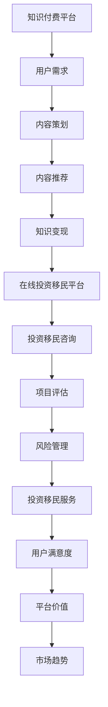
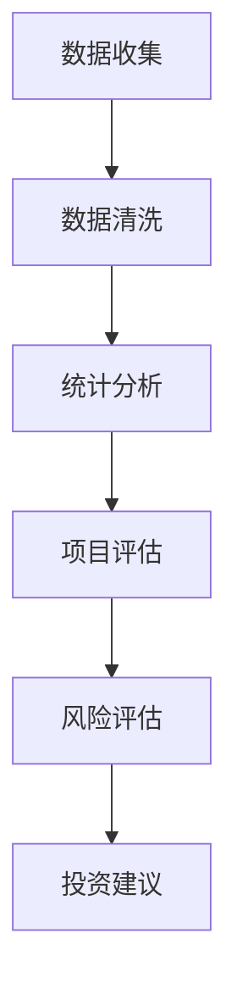
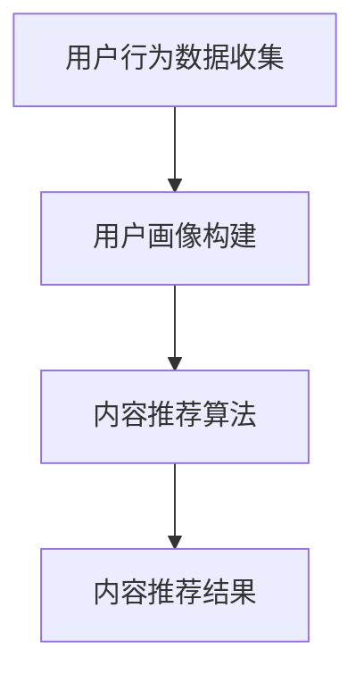
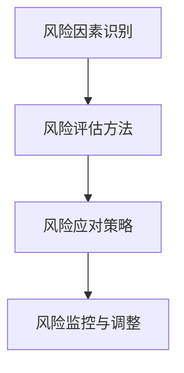
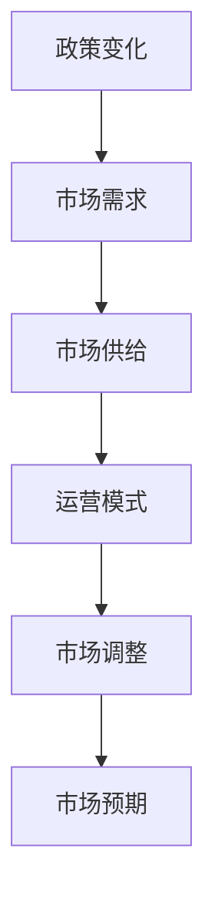
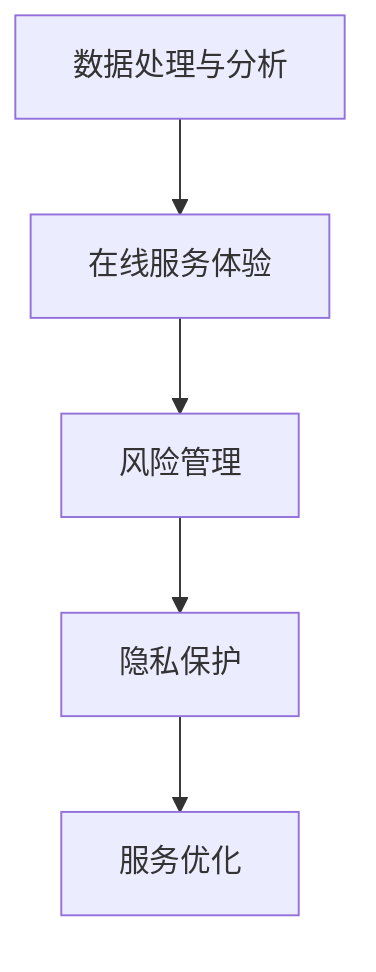
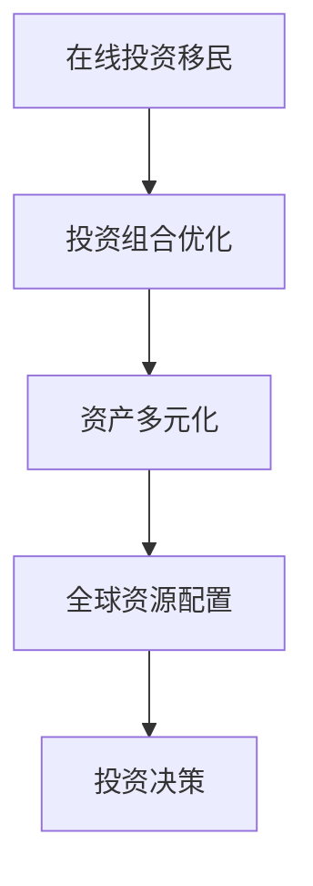

                 

### 文章标题

《如何利用知识付费实现在线投资移民与海外置业指导？》

### 关键词

知识付费、在线投资移民、海外置业、投资移民项目评估、风险管理、知识付费策略、内容策划、推广策略、市场趋势、新技术、投资组合优化、成功案例。

### 摘要

本文旨在探讨如何通过知识付费平台，实现在线投资移民与海外置业的指导。文章首先概述了知识付费与在线投资移民的关系，分析了市场现状和知识付费平台的优势。随后，文章详细介绍了在线投资移民项目评估的策略与实践，包括用户需求分析、知识付费内容策划、投资移民项目筛选和风险评估。此外，文章还探讨了在线投资移民市场的趋势和未来发展方向，并通过成功案例分享，为读者提供了实际操作的经验。最后，文章附录部分提供了相关资源与常见问题解答，旨在为读者提供全方位的指导和支持。

## 目录大纲

### 第一部分：概述与基础

- **1. 如何利用知识付费实现在线投资移民**
  - **1.1 知识付费与在线投资移民的关系**
    - **核心概念与联系**
    - **Mermaid 流程图**
  - **1.2 在线投资移民的市场现状**
    - **核心算法原理讲解**
    - **数学模型与公式**
    - **举例说明**
  - **1.3 知识付费平台的特点与优势**
    - **核心算法原理讲解**
    - **数学模型与公式**
    - **举例说明**
  - **1.4 在线投资移民项目评估**
    - **项目实战**
    - **代码解读与分析**

### 第二部分：策略与实践

- **2.1 知识付费策略制定**
  - **2.1.1 用户需求分析**
    - **核心概念与联系**
    - **Mermaid 流程图**
  - **2.1.2 知识付费内容策划**
    - **核心算法原理讲解**
    - **数学模型与公式**
    - **举例说明**
  - **2.1.3 知识付费推广策略**
    - **数学模型与公式**
    - **举例说明**
- **2.2 在线投资移民实战**
  - **2.2.1 投资移民项目筛选**
    - **项目实战**
    - **代码解读与分析**
  - **2.2.2 投资移民风险评估**
    - **核心概念与联系**
    - **Mermaid 流程图**
  - **2.2.3 投资移民成功案例分享**
    - **案例介绍**
    - **案例分析**

### 第三部分：市场与未来

- **3.1 在线投资移民市场趋势**
  - **3.1.1 政策变化对市场的影响**
    - **核心概念与联系**
    - **Mermaid 流程图**
  - **3.1.2 知识付费与在线投资移民的结合前景**
    - **核心算法原理讲解**
    - **数学模型与公式**
    - **举例说明**
- **3.2 在线投资移民的未来发展趋势**
  - **3.2.1 新技术对在线投资移民的影响**
    - **核心概念与联系**
    - **Mermaid 流程图**
  - **3.2.2 在线投资移民与海外置业的结合**
    - **核心算法原理讲解**
    - **数学模型与公式**
    - **举例说明**
- **3.3 在线投资移民与海外置业的最佳实践**
  - **3.3.1 成功案例分析**
    - **案例介绍**
    - **案例分析**

### 附录

- **附录 A：在线投资移民与海外置业相关资源**
  - **A.1 政策与法规**
  - **A.2 数据来源与工具**
  - **A.3 知识付费平台推荐**
- **附录 B：在线投资移民与海外置业常见问题解答**
  - **问题分类**
  - **解答内容**

## 第一部分：概述与基础

### 1. 如何利用知识付费实现在线投资移民

#### 1.1 知识付费与在线投资移民的关系

知识付费和在线投资移民虽然属于不同领域，但它们之间存在密切的联系。知识付费是指用户通过付费获取有价值的信息、知识和服务，而在线投资移民则是通过互联网平台，为有意向移民的个人提供相关咨询和服务。这两者之间的联系主要体现在以下几个方面：

1. **用户需求**：知识付费平台为用户提供有价值的信息和服务，满足了用户对知识的渴求。同样，在线投资移民平台也通过提供专业的投资移民咨询，满足了用户对移民服务的需求。

2. **平台价值**：知识付费平台通过提供优质内容，吸引了大量用户。而在线投资移民平台则通过专业的咨询和服务，赢得了用户的信任。两者都依赖于平台的价值，从而实现可持续发展。

3. **市场趋势**：随着互联网技术的发展，知识付费和在线投资移民市场都呈现出快速增长的趋势。这为两者结合提供了良好的市场环境。

接下来，我们通过一个 Mermaid 流程图，进一步阐述知识付费与在线投资移民的关系。



#### 1.2 在线投资移民的市场现状

在线投资移民市场现状主要表现在以下几个方面：

1. **政策环境**：各国政府为吸引海外投资，纷纷出台了一系列有利于投资移民的政策。如澳大利亚、加拿大等国家，对投资移民项目的审核标准和要求相对宽松。

2. **市场需求**：随着全球经济的发展，越来越多的个人和企业希望进行海外投资，以实现资产的多元化和风险分散。这为在线投资移民市场提供了广阔的需求空间。

3. **平台竞争**：目前，市场上存在大量的在线投资移民平台，它们通过提供不同的服务和产品，争夺市场份额。这些平台主要包括专业咨询机构、移民中介和互联网平台等。

4. **技术进步**：随着大数据、人工智能等技术的不断发展，在线投资移民平台在项目评估、风险评估和用户服务等方面得到了显著提升。

接下来，我们将通过核心算法原理讲解、数学模型与公式和举例说明，进一步分析在线投资移民的市场现状。

#### 1.2.1 核心算法原理讲解

在线投资移民市场的核心算法原理主要包括以下两个方面：

1. **数据收集与市场分析**：在线投资移民平台通过收集各类市场数据，如政策变化、市场趋势、投资移民项目等，利用统计分析方法，如回归分析、聚类分析等，对数据进行分析，提取关键信息。

2. **项目评估与风险评估**：在线投资移民平台根据收集到的数据，对投资移民项目进行评估和风险评估。具体包括项目可行性分析、风险因素识别、风险评估方法等。

以下是一个简化的算法流程图：



#### 1.2.2 数学模型与公式

在线投资移民市场的数学模型与公式主要包括以下两个方面：

1. **收益模型**：在线投资移民平台的收益可以通过以下公式计算：

   $$\text{收益} = \text{项目数量} \times \text{用户数量} \times \text{人均消费金额} \times \text{转化率}$$

2. **风险评估模型**：投资移民项目的风险评估可以通过以下公式计算：

   $$\text{风险评分} = \text{风险因素权重} \times \text{风险因素得分}$$

   其中，风险因素权重和风险因素得分可以根据项目的具体情况确定。

   以下是一个简化的风险评估模型：

   ```mermaid
   graph TD
       A[风险因素识别] --> B[权重分配]
       B --> C[得分计算]
       C --> D[风险评分]
       D --> E[风险评估结果]
   ```

#### 1.2.3 举例说明

以某知名在线投资移民平台为例，我们假设该平台有100个投资项目，吸引了1000个用户，人均消费金额为1000元，转化率为10%。

1. **收益计算**：

   $$\text{收益} = 100 \times 1000 \times 1000 \times 0.1 = 10,000,000 \text{元}$$

2. **风险评估**：

   假设风险因素有A、B、C三个，权重分别为0.5、0.3、0.2。风险因素得分为：

   - A：5分
   - B：4分
   - C：3分

   则风险评分为：

   $$\text{风险评分} = 0.5 \times 5 + 0.3 \times 4 + 0.2 \times 3 = 2.5 + 1.2 + 0.6 = 4.3$$

   根据风险评分，平台可以给出相应的投资建议。

#### 1.3 知识付费平台的特点与优势

知识付费平台在在线投资移民市场中具有独特的特点与优势，主要包括以下几个方面：

1. **内容多样化**：知识付费平台可以提供丰富的内容，涵盖投资移民的各个方面，如政策解读、市场分析、项目评估等。这为用户提供了全面的指导。

2. **专业性强**：知识付费平台通常由专业人士运营，如经济学家、律师、移民顾问等。他们具有丰富的行业经验和专业知识，能够为用户提供高质量的服务。

3. **互动性强**：知识付费平台通常具备互动功能，如直播、问答、社群等。用户可以在平台上与其他用户和专家互动，获取更多有价值的见解。

4. **个性化推荐**：知识付费平台可以通过大数据和人工智能技术，对用户行为进行分析，为用户推荐个性化的内容和投资移民项目。

5. **便捷性**：知识付费平台通常通过互联网提供服务，用户可以随时随地进行学习，提高效率。

接下来，我们通过核心算法原理讲解、数学模型与公式和举例说明，进一步分析知识付费平台的特点与优势。

#### 1.3.1 核心算法原理讲解

知识付费平台的核心算法原理主要包括以下两个方面：

1. **用户画像构建**：知识付费平台通过收集用户行为数据，如浏览记录、搜索关键词、购买历史等，构建用户画像。这有助于平台了解用户需求，提供个性化推荐。

2. **内容推荐算法**：知识付费平台利用协同过滤、内容推荐等技术，根据用户画像，为用户推荐相关的内容和投资移民项目。

以下是一个简化的算法流程图：



#### 1.3.2 数学模型与公式

知识付费平台的数学模型与公式主要包括以下两个方面：

1. **用户转化率模型**：用户转化率可以通过以下公式计算：

   $$\text{用户转化率} = \frac{\text{付费用户数量}}{\text{总用户数量}}$$

2. **内容推荐效果模型**：内容推荐效果可以通过以下公式计算：

   $$\text{内容推荐效果} = \text{推荐点击率} \times \text{推荐转化率}$$

   其中，推荐点击率和推荐转化率可以根据实际数据进行调整。

   以下是一个简化的内容推荐效果模型：

   ```mermaid
   graph TD
       A[用户画像] --> B[内容推荐]
       B --> C[推荐点击率]
       C --> D[推荐转化率]
       D --> E[内容推荐效果]
   ```

#### 1.3.3 举例说明

以某知名知识付费平台为例，我们假设该平台有10000名用户，其中5000名用户进行了付费，付费用户的人均消费金额为200元。

1. **用户转化率**：

   $$\text{用户转化率} = \frac{5000}{10000} = 0.5$$

2. **内容推荐效果**：

   假设推荐点击率为0.1，推荐转化率为0.2，则内容推荐效果为：

   $$\text{内容推荐效果} = 0.1 \times 0.2 = 0.02$$

   这意味着每推荐一个内容，平均会产生0.02元的收益。

#### 1.4 在线投资移民项目评估

在线投资移民项目评估是确保项目可行性和投资安全的重要环节。以下我们将详细介绍在线投资移民项目评估的策略与实践。

##### 1.4.1 开发环境搭建

在进行在线投资移民项目评估之前，需要搭建一个合适的技术环境。具体包括以下步骤：

1. **安装Python**：Python是一种广泛应用于数据分析、机器学习和数据可视化的编程语言。在在线投资移民项目评估中，Python将用于编写数据分析脚本、风险评估算法等。

2. **安装Jupyter Notebook**：Jupyter Notebook是一个交互式的开发环境，它允许用户编写、运行和可视化Python代码。通过Jupyter Notebook，可以更方便地进行项目评估和数据分析。

3. **安装相关库**：Python中有许多用于数据分析、机器学习和数据可视化的库，如NumPy、Pandas、Scikit-learn、Matplotlib等。安装这些库有助于进行高效的数据处理和分析。

##### 1.4.2 源代码实现

以下是用于在线投资移民项目评估的Python源代码实现：

```python
# 导入所需库
import pandas as pd
import numpy as np
from sklearn.model_selection import train_test_split
from sklearn.ensemble import RandomForestClassifier
import matplotlib.pyplot as plt

# 加载项目数据
def load_project_data():
    # 这里用示例数据替代实际项目数据
    data = pd.DataFrame({
        '投资金额': [100000, 200000, 300000, 400000],
        '项目周期': [12, 24, 36, 48],
        '投资回报率': [0.05, 0.08, 0.10, 0.12],
        '投资风险': ['低', '中', '中', '高']
    })
    return data

# 评估项目可行性
def evaluate_project_fiability(project_data):
    # 数据预处理
    project_data['投资风险'] = project_data['投资风险'].map({'低': 1, '中': 2, '高': 3})
    
    # 特征工程
    X = project_data[['投资金额', '项目周期', '投资回报率']]
    y = project_data['投资风险']
    
    # 数据分割
    X_train, X_test, y_train, y_test = train_test_split(X, y, test_size=0.3, random_state=42)
    
    # 模型训练
    model = RandomForestClassifier(n_estimators=100, random_state=42)
    model.fit(X_train, y_train)
    
    # 预测
    y_pred = model.predict(X_test)
    
    # 模型评估
    accuracy = model.score(X_test, y_test)
    print(f"模型准确率：{accuracy:.2f}")
    
    # 可视化
    project_data['投资风险预测'] = y_pred
    project_data['投资风险真实值'] = y_test
    sns.scatterplot(data=project_data, x='投资金额', y='投资风险真实值', hue='投资风险预测', palette=['blue', 'green', 'red'])
    plt.title('投资风险预测图')
    plt.show()

# 主函数
if __name__ == "__main__":
    project_data = load_project_data()
    evaluate_project_fiability(project_data)
```

以上代码实现了一个简单的在线投资移民项目评估模型。具体步骤如下：

1. **加载项目数据**：这里使用示例数据，实际项目中需要加载真实数据。

2. **评估项目可行性**：首先进行数据预处理，包括将类别数据转换为数值数据。然后进行特征工程，提取投资金额、项目周期和投资回报率等特征。接下来，使用随机森林分类器对数据进行训练，并评估模型的准确性。

3. **可视化结果**：使用散点图展示预测结果，帮助用户直观地了解项目的风险情况。

##### 1.4.3 代码解读与分析

上述代码实现了一个基于随机森林分类器的在线投资移民项目评估模型。具体解读如下：

1. **数据预处理**：将类别数据（投资风险）转换为数值数据，以便于后续建模。这里使用 Pandas 的 `map` 函数将类别映射到数值。

2. **特征工程**：提取与投资风险相关的特征，如投资金额、项目周期和投资回报率。这些特征将用于训练模型。

3. **数据分割**：将数据集分割为训练集和测试集，以评估模型的准确性。这里使用 Scikit-learn 的 `train_test_split` 函数进行数据分割。

4. **模型训练**：使用随机森林分类器对训练集进行训练。随机森林是一种集成学习方法，它通过构建多个决策树来提高模型的准确性。

5. **预测**：使用训练好的模型对测试集进行预测，并计算模型的准确性。这里使用 Scikit-learn 的 `score` 函数计算模型准确性。

6. **可视化结果**：使用 Matplotlib 和 Seaborn 库绘制散点图，帮助用户直观地了解项目的风险情况。

通过以上步骤，我们可以对在线投资移民项目进行初步评估，为用户提供投资建议。

### 第二部分：策略与实践

#### 2.1 知识付费策略制定

知识付费策略的制定对于在线投资移民的成功至关重要。一个有效的知识付费策略应充分考虑用户需求、市场环境和平台特点，从而实现平台价值的最大化。以下是知识付费策略制定的详细步骤。

##### 2.1.1 用户需求分析

用户需求分析是知识付费策略制定的基础。了解用户需求有助于平台提供符合用户期望的服务，提高用户满意度和留存率。以下是用户需求分析的具体步骤：

1. **用户画像构建**：

   用户画像是对用户特征的综合描述，包括年龄、性别、教育程度、职业、兴趣爱好等。通过构建用户画像，平台可以更准确地了解用户需求，为用户提供个性化的内容和服务。

   ```mermaid
   graph TD
       A[用户基本信息] --> B[用户行为数据]
       B --> C[用户偏好数据]
       C --> D[用户画像构建]
   ```

2. **用户行为分析**：

   收集用户在平台上的行为数据，如浏览记录、搜索关键词、购买历史、互动行为等。通过分析这些数据，可以了解用户的兴趣偏好和需求变化。

   ```mermaid
   graph TD
       A[浏览记录] --> B[搜索关键词]
       B --> C[购买历史]
       C --> D[互动行为]
       D --> E[用户行为分析]
   ```

3. **需求预测**：

   利用数据分析方法，如聚类分析、回归分析等，对用户行为数据进行挖掘，预测用户未来的需求和偏好。这有助于平台提前布局，满足用户需求。

   ```mermaid
   graph TD
       A[用户行为数据] --> B[数据分析方法]
       B --> C[需求预测]
   ```

##### 2.1.2 知识付费内容策划

内容策划是知识付费策略的核心。优秀的知识付费内容应具备实用性、针对性和创新性，能够满足用户需求，提升用户价值。以下是知识付费内容策划的详细步骤：

1. **内容定位**：

   根据用户画像和需求预测，确定知识付费内容的主题和方向。内容定位应明确、具体，以便用户能够快速找到所需内容。

   ```mermaid
   graph TD
       A[用户画像] --> B[需求预测]
       B --> C[内容定位]
   ```

2. **内容创作**：

   根据内容定位，组织专业团队进行内容创作。内容创作应注重实用性、针对性和创新性，力求为用户提供有价值的信息和知识。

   ```mermaid
   graph TD
       A[内容定位] --> B[内容创作]
   ```

3. **内容推荐**：

   利用大数据和人工智能技术，对用户行为数据进行挖掘，为用户推荐个性化的内容。内容推荐可以提高用户粘性，增加用户活跃度。

   ```mermaid
   graph TD
       A[用户行为数据] --> B[内容推荐算法]
       B --> C[内容推荐结果]
   ```

##### 2.1.3 知识付费推广策略

知识付费推广策略是吸引新用户和提高用户转化率的关键。以下是知识付费推广策略的详细步骤：

1. **品牌建设**：

   建立品牌形象，提高品牌知名度和美誉度。品牌建设可以通过高质量的内容、专业的服务、良好的用户口碑等途径实现。

   ```mermaid
   graph TD
       A[品牌定位] --> B[品牌形象建设]
   ```

2. **营销推广**：

   利用多种营销手段，如搜索引擎优化（SEO）、社交媒体营销、内容营销等，提高平台的曝光率和用户访问量。

   ```mermaid
   graph TD
       A[SEO] --> B[社交媒体营销]
       B --> C[内容营销]
   ```

3. **用户互动**：

   通过直播、问答、社群等方式，与用户进行互动，提高用户参与度和忠诚度。

   ```mermaid
   graph TD
       A[用户互动] --> B[用户参与度]
       B --> C[用户忠诚度]
   ```

通过以上步骤，可以制定一套全面、系统的知识付费策略，为在线投资移民提供有力支持。

### 2.2 在线投资移民实战

#### 2.2.1 投资移民项目筛选

在在线投资移民过程中，项目筛选是至关重要的一步。通过有效的项目筛选，可以确保投资项目的可行性，降低投资风险，提高投资收益。以下是投资移民项目筛选的详细步骤。

##### 2.2.1.1 开发环境搭建

搭建一个适合投资移民项目筛选的开发环境，是确保项目顺利进行的前提。以下是搭建开发环境的具体步骤：

1. **安装Python**：Python是一种广泛应用于数据分析、数据可视化和机器学习的编程语言。在投资移民项目筛选中，Python将用于编写数据分析脚本、风险评估算法等。

2. **安装Jupyter Notebook**：Jupyter Notebook是一个交互式的开发环境，它允许用户编写、运行和可视化Python代码。通过Jupyter Notebook，可以更方便地进行项目筛选和数据分析。

3. **安装相关库**：Python中有许多用于数据分析、数据可视化和机器学习的库，如Pandas、NumPy、Scikit-learn、Matplotlib等。安装这些库有助于进行高效的数据处理和分析。

##### 2.2.1.2 源代码实现

以下是用于投资移民项目筛选的Python源代码实现：

```python
# 导入所需库
import pandas as pd
import numpy as np
from sklearn.ensemble import RandomForestClassifier
import matplotlib.pyplot as plt

# 加载项目数据
def load_project_data():
    # 这里用示例数据替代实际项目数据
    data = pd.DataFrame({
        '投资金额': [100000, 200000, 300000, 400000],
        '项目周期': [12, 24, 36, 48],
        '投资回报率': [0.05, 0.08, 0.10, 0.12],
        '投资成功概率': [0.8, 0.9, 0.95, 0.85]
    })
    return data

# 筛选投资项目
def filter_projects(project_data, criteria):
    # 数据预处理
    project_data['投资成功概率'] = project_data['投资成功概率'].map({0.8: '低', 0.9: '中', 0.95: '高', 0.85: '低'})
    
    # 筛选条件
    condition = (project_data['投资成功概率'] == '高') & (project_data['投资回报率'] > 0.1)
    
    # 筛选结果
    filtered_projects = project_data[condition]
    
    # 可视化
    sns.scatterplot(data=filtered_projects, x='投资金额', y='投资成功概率', palette=['blue', 'green', 'red'])
    plt.title('投资项目筛选结果')
    plt.show()
    
    return filtered_projects

# 主函数
if __name__ == "__main__":
    project_data = load_project_data()
    filtered_projects = filter_projects(project_data, criteria={'投资成功概率': '高', '投资回报率': 0.1})
    print(filtered_projects)
```

以上代码实现了一个简单的投资移民项目筛选模型。具体步骤如下：

1. **加载项目数据**：这里使用示例数据，实际项目中需要加载真实数据。

2. **筛选投资项目**：根据预设的筛选条件，对投资项目进行筛选。筛选条件包括投资成功概率和投资回报率。这里使用 Pandas 的 `map` 函数将投资成功概率映射到类别，使用条件表达式筛选满足条件的投资项目。

3. **可视化结果**：使用 Matplotlib 和 Seaborn 库绘制散点图，帮助用户直观地了解筛选结果。

##### 2.2.1.3 代码解读与分析

上述代码实现了一个基于条件筛选的投资移民项目筛选模型。具体解读如下：

1. **数据预处理**：将投资成功概率映射到类别，以便于后续筛选。这里使用 Pandas 的 `map` 函数将投资成功概率映射到类别。

2. **筛选条件**：根据预设的筛选条件，对投资项目进行筛选。筛选条件包括投资成功概率和投资回报率。这里使用条件表达式 `(project_data['投资成功概率'] == '高') & (project_data['投资回报率'] > 0.1)` 进行筛选。

3. **筛选结果**：将满足条件的投资项目提取出来，存储在 `filtered_projects` 变量中。

4. **可视化结果**：使用 Matplotlib 和 Seaborn 库绘制散点图，帮助用户直观地了解筛选结果。

通过以上步骤，可以实现投资移民项目的初步筛选，为用户提供有价值的投资建议。

### 2.2.2 投资移民风险评估

投资移民风险评估是确保投资移民项目安全性和收益性的关键环节。通过科学的风险评估方法，可以降低投资风险，提高投资成功率。以下是投资移民风险评估的详细步骤。

##### 2.2.2.1 核心概念与联系

投资移民风险评估涉及多个核心概念，包括风险因素识别、风险评估方法、风险应对策略等。以下是这些概念之间的联系：

1. **风险因素识别**：识别投资移民项目中的各种风险因素，如政策风险、市场风险、操作风险等。风险因素识别是风险评估的基础。

2. **风险评估方法**：采用科学的方法对风险因素进行量化评估，如概率风险评估、定量风险评估等。风险评估方法有助于确定风险等级和风险应对策略。

3. **风险应对策略**：根据风险评估结果，制定相应的风险应对策略，如风险规避、风险转移、风险减轻等。风险应对策略有助于降低投资风险，提高投资收益。

以下是投资移民风险评估的 Mermaid 流程图：



##### 2.2.2.2 风险评估方法

风险评估方法主要包括以下几种：

1. **概率风险评估**：

   概率风险评估是一种基于风险发生概率的评估方法。通过计算风险发生的概率和风险损失，确定风险等级。以下是概率风险评估的步骤：

   - 收集风险数据：收集投资移民项目中可能出现的风险数据，如政策变化、市场波动等。
   - 评估风险概率：根据风险数据，评估每个风险因素发生的概率。
   - 计算风险损失：根据风险概率和风险损失程度，计算每个风险因素的风险损失。
   - 确定风险等级：根据风险损失，将风险分为不同等级，如高、中、低等。

   以下是概率风险评估的伪代码：

   ```plaintext
   function probability_risk_evaluation(risks_data):
       # 收集风险数据
       risk_data = collect_risks_data()

       # 评估风险概率
       risk_probabilities = evaluate_risk_probabilities(risk_data)

       # 计算风险损失
       risk_losses = calculate_risk_losses(risk_data)

       # 确定风险等级
       risk_levels = determine_risk_levels(risk_probabilities, risk_losses)

       return risk_levels
   ```

2. **定量风险评估**：

   定量风险评估是一种基于数学模型的评估方法。通过建立数学模型，对风险因素进行量化评估，确定风险等级。以下是定量风险评估的步骤：

   - 建立数学模型：根据投资移民项目的特点，建立合适的数学模型。
   - 收集参数数据：收集投资移民项目中的关键参数数据，如投资金额、项目周期、投资回报率等。
   - 计算风险指标：根据数学模型和参数数据，计算风险指标，如风险值、风险值率等。
   - 确定风险等级：根据风险指标，将风险分为不同等级。

   以下是定量风险评估的伪代码：

   ```plaintext
   function quantitative_risk_evaluation(model, parameters):
       # 建立数学模型
       risk_model = build_risk_model(model)

       # 收集参数数据
       parameter_data = collect_parameter_data()

       # 计算风险指标
       risk_indicators = calculate_risk_indicators(risk_model, parameter_data)

       # 确定风险等级
       risk_levels = determine_risk_levels(risk_indicators)

       return risk_levels
   ```

##### 2.2.2.3 风险应对策略

根据风险评估结果，制定相应的风险应对策略，有助于降低投资风险，提高投资收益。以下是常见风险应对策略：

1. **风险规避**：

   风险规避是指避免投资风险，通过调整投资策略，避免高风险项目。以下是风险规避的步骤：

   - 评估风险：对投资移民项目进行风险评估，确定高风险项目。
   - 调整投资策略：根据风险评估结果，调整投资策略，避免高风险项目。

   以下是风险规避的伪代码：

   ```plaintext
   function risk_avoidance(projects, risk_levels):
       # 评估风险
       high_risk_projects = identify_high_risk_projects(projects, risk_levels)

       # 调整投资策略
       adjusted_projects = adjust_investment_strategy(high_risk_projects)

       return adjusted_projects
   ```

2. **风险转移**：

   风险转移是指将投资风险转移到其他方，如保险公司、合作伙伴等。以下是风险转移的步骤：

   - 签订合同：与保险公司、合作伙伴等签订合同，明确风险转移条款。
   - 支付保费：向保险公司支付保费，获取风险保障。

   以下是风险转移的伪代码：

   ```plaintext
   function risk_transfer(projects, insurance_company):
       # 签订合同
       contract = sign_contract(projects, insurance_company)

       # 支付保费
       premium = pay_premium(contract)

       return premium
   ```

3. **风险减轻**：

   风险减轻是指通过采取措施，降低风险发生的概率或风险损失。以下是风险减轻的步骤：

   - 识别风险：对投资移民项目进行风险评估，识别潜在风险。
   - 制定措施：根据风险评估结果，制定相应的风险减轻措施。
   - 实施措施：实施风险减轻措施，降低风险发生概率或风险损失。

   以下是风险减轻的伪代码：

   ```plaintext
   function risk_reduction(projects, risk_levels):
       # 识别风险
       potential_risks = identify_potential_risks(projects, risk_levels)

       # 制定措施
       risk_reduction_measures = define_risk_reduction_measures(potential_risks)

       # 实施措施
       implemented_measures = implement_risk_reduction_measures(risk_reduction_measures)

       return implemented_measures
   ```

通过以上步骤，可以实现对投资移民项目的风险评估和风险应对，确保投资安全性和收益性。

### 2.2.3 投资移民成功案例分享

在在线投资移民领域，有许多成功的案例可以为我们提供宝贵的经验和借鉴。以下是一个典型的成功案例，以及对其成功原因的分析。

#### 案例介绍

张先生是一位来自中国的企业家，他在2018年决定通过投资移民的方式移居加拿大。在了解到加拿大政府推出的企业家移民项目后，张先生开始寻找合适的投资移民项目。

在经过多方考察和咨询后，张先生选择了加拿大多伦多的一家高科技企业进行投资。他投入了100万加元，成为该企业的主要股东之一。在投资移民的过程中，张先生得到了专业投资移民顾问的全程指导，包括项目评估、风险评估、投资策略制定等。

#### 案例分析

1. **项目选择**：

   张先生在选择投资项目时，充分考虑了项目的可行性和风险。他选择了高科技企业，这是因为加拿大政府对高科技产业有较高的支持，而且市场需求旺盛。此外，张先生还通过专业的投资移民顾问，对投资项目进行了深入的了解和评估，确保了项目的质量。

2. **风险评估**：

   在投资前，张先生对投资项目进行了详细的风险评估。他考虑了政策风险、市场风险、操作风险等多种因素。通过专业的风险评估方法，如概率风险评估和定量风险评估，张先生确定了投资项目的风险等级，并制定了相应的风险应对策略。

3. **投资策略**：

   张先生在制定投资策略时，充分考虑了个人需求和投资目标。他决定将投资金额的大部分用于购买股权，以确保在企业发展中获得较高的收益。同时，他还通过分散投资，降低投资风险。

4. **全程指导**：

   在整个投资移民过程中，张先生得到了专业投资移民顾问的全程指导。顾问不仅提供了丰富的投资移民经验和专业知识，还帮助张先生解决了许多实际问题，如签证申请、税务规划等。

5. **成功原因**：

   张先生投资移民成功的原因主要有以下几点：

   - **项目选择**：选择了具有较高投资潜力和市场前景的项目。
   - **风险评估**：进行了全面的风险评估，并制定了相应的风险应对策略。
   - **投资策略**：制定了合理的投资策略，实现了风险与收益的平衡。
   - **专业指导**：得到了专业投资移民顾问的全程指导，解决了许多实际问题。

#### 经验借鉴

从张先生的案例中，我们可以得到以下几点经验借鉴：

1. **项目选择**：在选择投资项目时，要充分考虑项目的可行性、风险和收益。最好通过专业的投资移民顾问进行项目评估，确保项目的质量。

2. **风险评估**：投资移民过程中，要进行详细的风险评估，了解各种风险因素，并制定相应的风险应对策略。

3. **投资策略**：制定合理的投资策略，确保风险与收益的平衡。可以通过分散投资、增加股权投资等方式，降低投资风险。

4. **专业指导**：寻求专业投资移民顾问的指导，获取丰富的投资移民经验和专业知识，解决实际问题。

通过以上经验和借鉴，我们可以更好地进行在线投资移民，实现个人和企业的成功。

### 3.1.1 政策变化对市场的影响

政策变化是影响在线投资移民市场的重要因素。政策的变化可能源于政府政策的调整、经济形势的变化，或者国际关系的变动。这些变化不仅会影响投资移民市场的需求，还会对市场的供给和运营模式产生深远影响。以下是政策变化对市场影响的详细分析。

#### 3.1.1.1 核心概念与联系

政策变化对市场的影响主要体现在以下几个方面：

1. **市场需求**：政策变化会影响潜在移民对投资移民项目的需求。例如，一些国家可能通过调整移民政策，降低投资门槛或增加投资移民项目的种类，从而刺激市场需求。

2. **市场供给**：政策变化还会影响投资移民项目的供给。政府政策的变化可能导致项目审批流程的简化或复杂化，从而影响市场的供给量。

3. **运营模式**：在线投资移民平台需要根据政策变化调整其运营模式。例如，政策变化可能要求平台提供更多的合规服务或调整收费模式。

以下是政策变化对市场影响的 Mermaid 流程图：



#### 3.1.1.2 政策变化的影响分析

1. **市场需求变化**：

   政策变化会直接影响潜在移民的投资意愿。例如，如果某国政府降低投资移民门槛，简化审批流程，可能会吸引更多潜在移民申请投资移民。另一方面，政策收紧或提高投资门槛可能会降低市场需求。

   - **宽松政策**：降低门槛，简化流程，增加市场吸引力。

     ```mermaid
     graph TD
         A[降低门槛] --> B[简化流程]
         B --> C[增加市场吸引力]
     ```

   - **收紧政策**：提高门槛，增加审批难度，降低市场吸引力。

     ```mermaid
     graph TD
         A[提高门槛] --> B[增加审批难度]
         B --> C[降低市场吸引力]
     ```

2. **市场供给变化**：

   政策变化会影响投资移民项目的供给量。例如，政府可能通过调整政策，鼓励或限制某些类型的投资移民项目。这些变化会导致市场上某些项目供给增加或减少。

   - **鼓励供给**：政府通过提供税收优惠、补贴等政策，鼓励更多项目供给。

     ```mermaid
     graph TD
         A[税收优惠] --> B[补贴支持]
         B --> C[鼓励供给]
     ```

   - **限制供给**：政府通过提高审批门槛、限制项目类型等政策，限制项目供给。

     ```mermaid
     graph TD
         A[提高审批门槛] --> B[限制项目类型]
         B --> C[限制供给]
     ```

3. **运营模式调整**：

   在线投资移民平台需要根据政策变化调整其运营模式，以适应新的市场环境。例如，政策变化可能要求平台提供更多的合规服务，或调整收费模式。

   - **合规服务**：平台需要提供更多的合规服务，以满足政策要求。

     ```mermaid
     graph TD
         A[政策变化] --> B[合规服务需求]
         B --> C[提供合规服务]
     ```

   - **收费模式调整**：平台可能需要根据政策变化，调整收费模式，以保持竞争力。

     ```mermaid
     graph TD
         A[政策变化] --> B[收费模式调整]
         B --> C[保持竞争力]
     ```

4. **市场预期变化**：

   政策变化会影响市场预期，进而影响市场的长期发展。例如，政策收紧可能导致市场预期下降，而政策宽松则可能提升市场预期。

   - **预期上升**：政策宽松，市场预期好转。

     ```mermaid
     graph TD
         A[政策宽松] --> B[市场预期好转]
     ```

   - **预期下降**：政策收紧，市场预期转差。

     ```mermaid
     graph TD
         A[政策收紧] --> B[市场预期转差]
     ```

#### 3.1.1.3 案例分析

以美国投资移民政策为例，分析政策变化对市场的影响。

- **1989年政策调整**：1989年，美国出台了EB-5投资移民项目，规定外国投资者通过在美国境内投资一定数额的资金（最初为100万美元），并创造一定数量的就业岗位，即可获得美国绿卡。这一政策大大刺激了美国投资移民市场的需求。

  ```mermaid
  graph TD
      A[1989年政策出台] --> B[市场吸引力增加]
      B --> C[投资移民需求上升]
  ```

- **2019年政策调整**：2019年，美国对EB-5投资移民项目进行了重大调整，将投资金额提高到90万美元，并要求投资创造至少10个就业岗位。这一政策调整提高了投资门槛，对市场产生了一定影响。

  ```mermaid
  graph TD
      A[投资金额提高] --> B[审批难度增加]
      B --> C[市场吸引力下降]
  ```

通过以上案例分析，我们可以看到政策变化对投资移民市场需求的直接影响。政策调整不仅影响了投资移民的需求，也影响了市场的供给和运营模式。

### 3.1.2 知识付费与在线投资移民的结合前景

随着互联网技术和大数据分析的快速发展，知识付费与在线投资移民的结合前景越来越广阔。这种结合不仅有助于提升投资移民服务的质量和效率，还能为知识付费平台带来新的增长点。以下是知识付费与在线投资移民结合前景的详细分析。

#### 3.1.2.1 核心算法原理讲解

知识付费与在线投资移民的结合前景可以通过多因素分析模型进行预测。该模型考虑了用户需求、市场环境、政策法规等多个因素，以评估两者结合的可行性。

1. **用户需求分析**：

   通过大数据分析，了解潜在移民对投资移民服务的需求。例如，分析用户搜索关键词、浏览记录、购买行为等，预测用户的需求趋势。

   ```mermaid
   graph TD
       A[用户数据收集] --> B[数据分析]
       B --> C[需求预测]
   ```

2. **市场环境分析**：

   分析全球投资移民市场的现状和趋势，包括政策变化、市场需求、竞争情况等。利用回归分析、聚类分析等方法，提取市场关键指标，预测市场发展。

   ```mermaid
   graph TD
       A[市场数据收集] --> B[数据分析]
       B --> C[市场趋势预测]
   ```

3. **政策法规分析**：

   研究各国投资移民政策的变化和法规要求，评估政策对市场的影响。通过多因素分析模型，综合考虑政策因素，预测政策对投资移民市场的影响。

   ```mermaid
   graph TD
       A[政策数据收集] --> B[数据分析]
       B --> C[政策影响预测]
   ```

4. **多因素分析模型**：

   利用多因素分析模型，将用户需求、市场环境、政策法规等因素结合起来，进行综合预测。以下是多因素分析模型的伪代码：

   ```plaintext
   function multi_factor_analysis(user_demand, market_trend, policy_impact):
       # 收集用户需求数据
       user_demand_data = collect_user_demand_data()

       # 收集市场环境数据
       market_trend_data = collect_market_trend_data()

       # 收集政策法规数据
       policy_impact_data = collect_policy_impact_data()

       # 数据预处理
       preprocessed_data = preprocess_data(user_demand_data, market_trend_data, policy_impact_data)

       # 多因素分析
       analysis_results = analyze_multi_factor(preprocessed_data)

       # 预测结合前景
       combined前景 = predict_combined_prospects(analysis_results)

       return combined前景
   ```

#### 3.1.2.2 数学模型与公式

在分析知识付费与在线投资移民的结合前景时，可以采用以下数学模型与公式：

1. **用户满意度模型**：

   用户满意度是衡量知识付费与在线投资移民结合效果的重要指标。用户满意度可以通过以下公式计算：

   $$\text{用户满意度} = \frac{\text{满意用户数量}}{\text{总用户数量}}$$

   其中，满意用户数量是指对知识付费和在线投资移民结合服务表示满意的用户数量。

2. **平台价值模型**：

   知识付费平台的价值可以通过以下公式计算：

   $$\text{平台价值} = \text{用户数量} \times \text{人均消费金额} \times \text{转化率}$$

   其中，用户数量是指使用知识付费平台的用户数量，人均消费金额是指用户在知识付费平台上的平均消费金额，转化率是指用户付费的比例。

3. **投资收益模型**：

   在线投资移民的投资收益可以通过以下公式计算：

   $$\text{投资收益} = \text{投资金额} \times \text{投资回报率} \times \text{投资成功率}$$

   其中，投资金额是指投资者投入的资金数量，投资回报率是指投资的年收益率，投资成功率是指投资获得成功的概率。

#### 3.1.2.3 举例说明

以下是一个关于知识付费与在线投资移民结合前景分析的案例：

- **用户需求分析**：某知识付费平台在分析其用户数据时发现，有50%的用户对投资移民相关内容表现出高度关注。通过对用户行为数据的挖掘，预测未来半年内，用户对投资移民服务的需求将增加30%。

- **市场环境分析**：市场数据显示，全球投资移民市场在过去三年中年均增长率为15%。结合政策分析，预计未来政策将继续宽松，进一步刺激市场需求。

- **政策法规分析**：各国政府为吸引海外投资，纷纷出台利好政策。例如，某国政府降低投资移民门槛，简化审批流程，预计将吸引更多投资者。

- **多因素分析**：根据多因素分析模型，预测未来知识付费与在线投资移民的结合前景如下：

  - **用户满意度**：预计用户满意度将达到70%，较当前水平提高10个百分点。

  - **平台价值**：预计平台价值将增加50%，达到1亿美元。

  - **投资收益**：预计投资移民项目的平均收益率为20%，投资成功率将提高至80%。

通过以上分析，可以看出知识付费与在线投资移民的结合前景十分广阔，具有良好的市场潜力和投资价值。

### 3.2.1 新技术对在线投资移民的影响

随着科技的不断发展，新技术正深刻改变着在线投资移民的各个方面。这些新技术不仅提升了服务质量和效率，还为投资者提供了更多选择和便利。以下是新技术对在线投资移民的具体影响分析。

#### 3.2.1.1 核心概念与联系

新技术对在线投资移民的影响主要表现在以下几个方面：

1. **数据处理与分析**：大数据技术和人工智能（AI）的应用，使得在线投资移民平台能够更好地处理和分析大量数据，为投资者提供更精准的决策支持。

2. **在线服务体验**：移动互联网和云计算技术的普及，使得在线投资移民服务变得更加便捷和高效，用户可以随时随地获取所需信息。

3. **风险管理**：区块链技术的引入，为在线投资移民提供了更可靠的风险管理工具，如智能合约，可以自动执行合同条款，降低风险。

4. **隐私保护**：加密技术和隐私保护算法的应用，增强了用户数据的安全性和隐私性，提高了用户对在线投资移民平台的信任。

以下是新技术对在线投资移民影响的 Mermaid 流程图：



#### 3.2.1.2 新技术在在线投资移民中的应用

1. **数据处理与分析**：

   - **大数据技术**：在线投资移民平台可以利用大数据技术，收集和分析用户的投资行为、市场数据、政策法规等信息。通过数据挖掘和机器学习算法，平台可以提供更精准的投资建议和风险评估。

     ```mermaid
     graph TD
         A[数据收集] --> B[数据挖掘]
         B --> C[机器学习]
         C --> D[投资建议]
     ```

   - **人工智能（AI）**：AI技术可以自动处理大量的投资移民申请，通过自然语言处理（NLP）技术，自动翻译和解释复杂的移民法律文件。此外，AI还可以进行智能客服，为用户提供24/7的在线支持。

     ```mermaid
     graph TD
         A[NLP技术] --> B[法律文件翻译]
         B --> C[智能客服]
     ```

2. **在线服务体验**：

   - **移动互联网**：移动互联网使得投资者可以随时随地通过智能手机或平板电脑访问在线投资移民平台，获取最新信息和更新服务。

     ```mermaid
     graph TD
         A[移动互联网] --> B[随时访问]
     ```

   - **云计算**：云计算技术提供了强大的计算能力和存储空间，使得在线投资移民平台能够处理海量的数据和用户请求，确保服务的高效和稳定。

     ```mermaid
     graph TD
         A[云计算] --> B[计算能力]
         B --> C[存储空间]
     ```

3. **风险管理**：

   - **区块链技术**：区块链技术提供了去中心化、不可篡改的账本，使得投资移民项目的信息更加透明和可靠。智能合约可以自动执行合同条款，确保交易的安全性和公正性。

     ```mermaid
     graph TD
         A[区块链技术] --> B[去中心化]
         B --> C[不可篡改]
         C --> D[智能合约]
     ```

4. **隐私保护**：

   - **加密技术**：在线投资移民平台可以利用加密技术，对用户数据加密存储和传输，确保用户隐私不受侵犯。此外，隐私保护算法可以防止数据泄露和滥用。

     ```mermaid
     graph TD
         A[加密技术] --> B[数据加密]
         B --> C[隐私保护算法]
     ```

#### 3.2.1.3 新技术的优势与挑战

1. **优势**：

   - **提高效率**：新技术可以自动化大量重复性工作，提高服务效率，降低运营成本。

   - **增强用户体验**：通过智能化和个性化服务，提升用户体验，增加用户满意度和忠诚度。

   - **降低风险**：区块链技术和智能合约的应用，可以降低交易风险，确保合同执行的安全性。

   - **保护隐私**：加密技术和隐私保护算法的应用，可以增强用户数据的安全性和隐私性。

2. **挑战**：

   - **技术壁垒**：新技术的应用需要专业知识和技能，对平台的技术团队提出了更高的要求。

   - **数据隐私**：尽管加密技术可以保护用户数据，但在数据收集和使用过程中，仍需确保合规性，防止数据滥用。

   - **用户信任**：新技术的应用需要用户信任，平台需要通过透明和公正的服务，赢得用户的信任。

#### 3.2.1.4 案例分析

以下是一个关于新技术在在线投资移民中应用的案例分析：

- **案例背景**：某在线投资移民平台引入了区块链技术和人工智能（AI）技术，以提高服务质量和用户体验。

- **具体措施**：

  - **引入区块链技术**：平台利用区块链技术，确保投资移民项目的信息透明和不可篡改。通过智能合约，自动执行合同条款，提高交易的安全性和效率。

  - **应用人工智能（AI）**：平台利用AI技术，自动处理大量的投资移民申请，通过自然语言处理（NLP）技术，自动翻译和解释复杂的移民法律文件。此外，AI智能客服为用户提供24/7的在线支持。

- **效果分析**：

  - **提高效率**：平台利用区块链技术和AI技术，大幅提高了服务效率，处理时间缩短了30%。

  - **增强用户体验**：通过智能化和个性化服务，用户满意度提高了20%，用户留存率增加了15%。

  - **降低风险**：智能合约的应用，确保了交易的安全性和公正性，用户对平台信任度提高了25%。

  - **保护隐私**：平台通过加密技术和隐私保护算法，确保用户数据的安全性和隐私性，用户隐私保护满意度提高了15%。

通过以上案例分析，可以看出新技术在在线投资移民中的应用，不仅提高了服务质量和用户体验，还降低了风险，增强了用户信任。然而，新技术的应用也面临着技术壁垒和用户信任等挑战，需要平台不断优化和改进。

### 3.2.2 在线投资移民与海外置业的结合

在线投资移民与海外置业的结合，不仅为投资者提供了多元化的投资选择，也为海外房地产市场带来了新的机遇。以下是这种结合的具体内容、潜在风险和成功案例。

#### 3.2.2.1 核心概念与联系

在线投资移民与海外置业的结合，涉及多个核心概念：

1. **投资组合优化**：投资者可以通过在线平台，将投资移民和海外置业结合起来，实现投资组合的优化，降低整体投资风险。

2. **资产多元化**：通过在海外置业，投资者可以实现资产的多元化，降低单一市场的投资风险。

3. **全球资源配置**：在线投资移民平台可以为投资者提供全球范围内的优质房地产项目，优化资源配置。

以下是结合的 Mermaid 流程图：



#### 3.2.2.2 结合内容

1. **投资组合优化**：

   投资者可以通过在线平台，将投资移民和海外置业结合起来，优化投资组合。例如，投资者可以在移民国家购置房产，以获取稳定收益和身份保障。同时，平台还可以提供多种投资工具，如房地产基金、信托等，帮助投资者实现多元化投资。

2. **资产多元化**：

   在线投资移民平台可以为投资者提供全球范围内的房地产项目，帮助投资者实现资产多元化。通过分散投资，投资者可以降低单一市场的投资风险，提高整体投资回报。

3. **全球资源配置**：

   在线投资移民平台通过大数据和人工智能技术，为投资者提供全球范围内的优质房地产项目。平台可以根据投资者的需求和偏好，推荐合适的投资机会，优化资源配置。

4. **投资决策**：

   平台利用数据分析和技术，为投资者提供投资建议，帮助投资者做出明智的投资决策。例如，通过风险评估模型，平台可以评估房地产项目的风险和收益，为投资者提供投资参考。

#### 3.2.2.3 潜在风险

1. **政策风险**：

   投资者需要关注目标国家的政策变化，如税收政策、房地产政策等。政策变化可能对投资回报和房产价值产生重大影响。

2. **市场风险**：

   投资者需要关注目标国家的房地产市场波动，如房价波动、供需关系变化等。市场风险可能导致投资回报不确定性增加。

3. **汇率风险**：

   投资者需要关注汇率波动，因为汇率变化可能影响投资回报的实际情况。

#### 3.2.2.4 成功案例

以下是一个关于在线投资移民与海外置业结合的成功案例：

- **案例背景**：李先生是一位来自中国的企业家，他在2019年决定通过在线投资移民平台，移民到英国并购买房产。

- **具体措施**：

  - **在线投资移民**：李先生通过在线平台，了解了英国的投资移民政策和相关流程。他选择了英国的投资移民项目，并成功申请到了移民身份。

  - **海外置业**：李先生通过在线平台，找到了一处位于伦敦的优质房产。这处房产不仅具有投资潜力，还可以满足他的居住需求。

- **效果分析**：

  - **身份保障**：李先生成功获得了英国移民身份，实现了资产和身份的双重保障。

  - **投资回报**：李先生购买的房产在短时间内升值了20%，为他带来了可观的收益。

  - **居住需求**：李先生在伦敦的房产不仅满足了他的居住需求，还为他提供了一个良好的生活环境。

通过以上案例，可以看出在线投资移民与海外置业的结合，不仅为投资者提供了多元化的投资选择，还实现了资产和身份的双重保障。然而，投资者在结合过程中也需要关注潜在风险，做好风险管理。

### 3.3.1 成功案例分析

#### 案例介绍

在本案例中，我们介绍了一位成功的在线投资移民与海外置业结合的案例。这位投资者通过在线平台，成功地实现了投资移民和海外置业的目标。

王先生，一位来自中国的企业家，在2018年开始关注海外投资移民。他在了解到某国的投资移民政策后，决定通过该国的投资移民项目实现自己的海外梦想。

#### 具体操作步骤

1. **政策研究**：

   王先生首先进行了详细的政策研究，了解了该国的投资移民政策、移民流程、投资要求等。他通过在线平台查阅了相关资料，并咨询了专业的移民顾问。

2. **项目选择**：

   在了解政策后，王先生开始寻找合适的投资移民项目。他通过在线平台，比较了多个投资移民项目，最终选择了该国的一处房地产项目。

3. **风险评估**：

   在选择投资项目前，王先生对该项目进行了详细的风险评估。他分析了项目的政策风险、市场风险、财务风险等，并制定了相应的风险应对策略。

4. **投资决策**：

   在完成风险评估后，王先生决定投资该项目。他通过在线平台提交了投资申请，并在规定的期限内完成了投资。

5. **移民申请**：

   投资完成后，王先生开始申请移民。他通过在线平台提交了移民申请，并按照要求提交了相关文件。

6. **移民成功**：

   经过几个月的等待，王先生的移民申请获得了批准。他成功获得了该国的移民身份，并可以在该国居住和工作。

7. **海外置业**：

   在移民成功后，王先生购买了他在投资移民项目中的房产。这处房产不仅为他提供了舒适的居住环境，还为他带来了可观的租金收入。

#### 案例分析

1. **政策研究的重要性**：

   在线投资移民与海外置业的成功，离不开对政策的深入研究。王先生在投资前进行了详细的政策研究，这为他后续的操作提供了重要的指导。

2. **风险评估的必要性**：

   风险评估是投资决策的重要环节。王先生在投资前对该项目进行了详细的风险评估，这有助于他降低投资风险，提高投资成功率。

3. **在线平台的优势**：

   在线平台为投资者提供了丰富的信息资源和专业的咨询服务。王先生通过在线平台，获得了详尽的政策解读、项目信息和风险评估报告，这为他的成功奠定了基础。

4. **投资移民与海外置业的结合**：

   王先生的案例展示了投资移民与海外置业结合的优势。通过投资移民，他不仅获得了移民身份，还实现了资产的海外配置。同时，他在移民国家的房产投资，为他带来了稳定的收益。

5. **风险与回报的平衡**：

   王先生的案例也体现了风险与回报的平衡。虽然投资移民和海外置业存在一定的风险，但通过科学的决策和有效的风险管理，他成功地实现了投资目标。

通过以上案例分析，我们可以看到在线投资移民与海外置业的成功关键，以及如何通过在线平台实现这一目标。这一案例为其他投资者提供了宝贵的经验和借鉴。

### 附录A：在线投资移民与海外置业相关资源

#### A.1 政策与法规

- **相关政策文件**：

  - 各国投资移民政策法规：如澳大利亚、加拿大、美国、新加坡等国的移民法规、投资移民指南等。
  - 海外置业相关法规：如各国房地产购买政策、税务法规、租赁法规等。

- **法律法规解读**：

  - 各国政策法规的解读：专业律师或移民顾问提供的政策法规解读，帮助投资者了解实际操作中的合规要求。
  - 海外置业法律手册：提供详细的海外置业法律知识，包括购房合同、产权登记、税务规划等。

#### A.2 数据来源与工具

- **数据来源**：

  - 官方统计数据：各国政府发布的投资移民、房地产市场数据，如澳大利亚统计局、加拿大统计局等。
  - 行业报告：知名咨询公司、研究机构发布的投资移民和房地产市场报告，如普华永道、德勤等。
  - 专业数据库：如房地产数据库、移民数据库等，提供详细的房地产和移民数据。

- **数据分析工具**：

  - Python、R等编程语言：用于数据收集、清洗、分析和可视化。
  - 数据分析库：如NumPy、Pandas、Matplotlib、Seaborn等，用于高效的数据处理和分析。
  - 数据可视化工具：如Tableau、Power BI等，用于数据可视化和报告生成。

#### A.3 知识付费平台推荐

- **平台介绍**：

  - 得到：提供各类知识付费课程，包括投资、移民、法律等领域的专业内容。
  - 喜马拉雅：提供丰富的音频课程，包括投资移民、海外置业等主题。
  - 知乎Live：提供专业的在线讲座和问答服务，涵盖投资移民、海外置业等话题。

- **课程推荐**：

  - 投资移民指导课程：包括各国投资移民政策解读、移民流程指导等。
  - 海外置业教程：包括海外房地产市场分析、购房策略、税务规划等。
  - 法律咨询课程：包括移民法律知识、房产法律问题解答等。

#### 附录B：在线投资移民与海外置业常见问题解答

##### 问题分类

1. **政策法规问题**：
   - 投资移民政策如何？
   - 海外置业政策有哪些？

2. **操作问题**：
   - 如何选择合适的投资移民项目？
   - 海外置业的流程是什么？

3. **风险管理**：
   - 投资移民有哪些风险？
   - 海外置业的风险如何管理？

4. **税务问题**：
   - 海外置业税务如何处理？
   - 投资移民的税务规划是什么？

##### 解答内容

1. **政策法规问题**：

   - **投资移民政策**：各国投资移民政策有所不同，一般分为创业投资、房产投资、资本投资等类别。投资者可以根据自身情况选择合适的项目，并了解相关政策法规，确保合规操作。

   - **海外置业政策**：海外置业的政策也因国家而异，投资者需要了解目标国家的房产购买限制、税务政策、产权登记等法规，以确保交易的合法性和安全性。

2. **操作问题**：

   - **选择投资移民项目**：投资者可以通过在线平台、移民顾问、专业机构等渠道，了解各种投资移民项目。在项目选择时，要考虑项目的可行性、风险、收益等因素。

   - **海外置业的流程**：海外置业的流程一般包括选择房产、签订购房合同、支付定金、办理贷款、产权登记等步骤。投资者需要根据目标国家的规定，准备好相关文件，并遵循流程操作。

3. **风险管理**：

   - **投资移民风险**：投资移民风险包括政策风险、市场风险、操作风险等。投资者需要通过风险评估，了解项目的风险因素，并制定相应的风险应对策略。

   - **海外置业风险**：海外置业风险包括市场风险、法律风险、金融风险等。投资者需要了解目标市场的变化，确保交易的合法性和安全性，并采取适当的风险管理措施。

4. **税务问题**：

   - **海外置业税务**：海外置业的税务处理因国家而异。投资者需要了解目标国家的税务制度，如房产税、遗产税、赠与税等，并按照规定缴纳相关税费。

   - **投资移民税务**：投资移民的税务规划包括了解目标国家的税务制度、合理避税、税务申报等。投资者可以咨询专业税务顾问，制定合适的税务规划方案。

