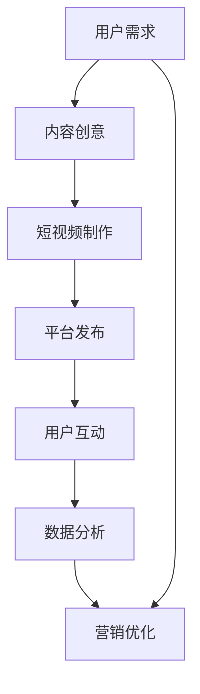

                 

### 第1章：短视频营销的基本概念

## 1.1 短视频营销的定义与特点

### 1.1.1 短视频营销的定义

短视频营销是指通过短视频平台，以创意、有趣、具有视觉冲击力的内容来吸引用户关注，从而实现品牌宣传、产品推广、用户互动等营销目标的一种营销方式。

短视频营销的核心在于利用短视频这种形式，快速传递信息，引发用户的兴趣和参与。与传统营销方式相比，短视频营销具有以下特点：

- **快速传播**：短视频内容较短，通常在几秒到几分钟之间，易于在社交网络中快速传播。
- **高互动性**：短视频允许用户进行点赞、评论、分享等互动操作，增强了用户参与感。
- **强视觉冲击**：短视频通过视觉元素如动画、特效、音乐等，增加了内容的吸引力。

### 1.1.2 短视频营销与传统营销的差异

短视频营销与传统营销有以下几点显著差异：

- **传播速度**：短视频营销具有传播速度快、覆盖面广的特点，能够在短时间内触达大量用户。
- **互动性**：短视频营销强调用户参与，用户可以通过点赞、评论、分享等方式直接参与内容创作和传播。
- **灵活性**：短视频营销可以根据用户反馈快速调整内容，实现内容的个性化推送。

### 1.1.3 短视频营销的优势

短视频营销相较于传统营销，具有以下几大优势：

- **成本低**：短视频营销的制作和传播成本较低，适合中小企业和初创公司进行品牌宣传和产品推广。
- **受众广泛**：短视频营销可以覆盖不同年龄、性别、地域的用户群体，特别是年轻用户对短视频的接受度更高。
- **效果可量化**：短视频营销的数据分析功能强大，可以实时监测视频的播放量、点赞数、评论数等关键指标，从而评估营销效果。

## 1.2 Z世代用户的特点

### 1.2.1 Z世代用户的行为习惯

Z世代是指出生于1995年至2010年之间的一代人，他们的行为习惯具有以下特点：

- **移动优先**：Z世代用户习惯于使用手机等移动设备获取信息和娱乐，短视频平台成为他们主要的媒体消费渠道。
- **追求新鲜感**：Z世代用户喜欢尝试新鲜事物，对新颖、有趣、独特的短视频内容有较高的兴趣。
- **情感驱动**：Z世代用户更注重情感共鸣和个性化体验，倾向于通过消费来展示个性和价值观。

### 1.2.2 Z世代用户的消费观念

Z世代用户的消费观念呈现出以下趋势：

- **注重性价比**：Z世代用户在消费时更注重性价比，倾向于选择物美价廉的产品和服务。
- **追求个性表达**：Z世代用户喜欢独特、个性化的产品和服务，通过消费来展示自己的个性和品味。
- **品牌忠诚度较低**：Z世代用户对品牌的忠诚度较低，更容易受到新品牌和独特营销策略的吸引。

### 1.2.3 Z世代用户的媒体偏好

Z世代用户的媒体偏好呈现出以下特点：

- **短视频平台**：Z世代用户更喜欢在短视频平台上观看内容，如抖音、快手等，因为这些平台提供了丰富多样的短视频内容。
- **社交媒体**：Z世代用户活跃在社交媒体上，如微博、微信等，这些平台是他们交流、分享和获取信息的重要渠道。
- **直播平台**：Z世代用户对直播平台的兴趣也越来越高，他们喜欢通过直播了解最新的潮流和趋势。

## 1.3 短视频营销在Z世代用户中的重要性

### 1.3.1 短视频在Z世代用户中的普及程度

随着移动互联网的快速发展，短视频在Z世代用户中的普及程度越来越高。以下是一些关键数据：

- **高普及率**：据数据显示，超过80%的Z世代用户每天使用短视频平台超过一小时。
- **高使用频率**：短视频已经成为Z世代用户日常生活中的重要组成部分，许多用户每天观看短视频的次数超过10次。

### 1.3.2 短视频营销对Z世代用户的影响

短视频营销对Z世代用户有着深远的影响：

- **改变消费决策**：短视频营销能够快速影响Z世代用户的消费决策，特别是在购买时尚、美妆、电子产品等品类时。
- **提升品牌认知**：通过短视频营销，品牌能够迅速提升在Z世代用户心中的认知度，建立良好的品牌形象。

### 1.3.3 短视频营销在Z世代用户中的市场潜力

短视频营销在Z世代用户中的市场潜力巨大：

- **巨大市场**：随着Z世代用户群体的不断扩大，短视频营销的市场规模也将持续增长。
- **持续增长**：随着短视频平台的不断发展和创新，短视频营销将继续保持高速增长态势。

### Mermaid 流程图：短视频营销的核心概念与联系



在这个流程图中，用户需求是短视频营销的起点，通过内容创意和短视频制作，将需求转化为具体的视频内容，并在短视频平台上发布。用户的互动和数据分析则是优化短视频营销的重要环节，通过不断调整和优化，提升营销效果。

---

### 第2章：短视频营销的生态系统

## 2.1 短视频平台概述

### 2.1.1 短视频平台的类型

短视频平台可以分为以下几种类型：

- **综合类短视频平台**：如抖音、快手等，这些平台提供了多样化的短视频内容，覆盖了娱乐、教育、生活等多个领域。
- **专业类短视频平台**：如美拍、微视等，这些平台专注于特定类型的短视频内容，如美妆、美食、健身等。
- **垂直类短视频平台**：如秒拍、头条视频等，这些平台围绕特定主题或行业提供短视频内容，如新闻、财经、科技等。

每种类型的短视频平台都有其独特的用户群体和内容生态，企业可以根据自身需求和目标受众选择合适的平台。

### 2.1.2 短视频平台的优势

短视频平台具有以下优势：

- **流量大**：短视频平台拥有庞大的用户群体，每天有数亿次的视频播放量，为企业提供了广阔的曝光渠道。
- **用户活跃度高**：短视频平台用户活跃度较高，用户在平台上花费的时间较长，互动性强。
- **内容多样**：短视频平台上的内容丰富多样，能够满足不同用户的需求，为企业提供了多样化的内容创作空间。

### 2.1.3 短视频平台的用户分析

短视频平台的用户群体主要特征如下：

- **年龄分布**：短视频平台的用户主要集中在90后和00后，这些用户对短视频的接受度较高。
- **性别分布**：短视频平台的用户男女比例较为均衡，但男性用户在游戏、科技等领域的内容消费上更为活跃。
- **地域分布**：短视频平台的用户主要集中在一二线城市，但随着三四线城市互联网普及率的提高，这些地区的用户数量也在逐渐增加。

### 2.2 短视频内容创作与发布

短视频内容创作与发布是一个系统的过程，包括以下几个关键步骤：

1. **内容策划**：在开始创作短视频前，首先需要进行内容策划，明确视频的主题、目标受众和创意方向。
2. **内容制作**：根据策划方案，进行视频拍摄和后期制作。在制作过程中，需要注意画面质量、声音效果、剪辑节奏等细节。
3. **内容发布**：将制作完成的短视频发布到短视频平台，并设置合适的标题、标签和封面，以提高视频的曝光率。
4. **内容运营**：在视频发布后，通过互动、推广和数据分析等手段，持续优化视频的表现和用户的参与度。

### 2.3 短视频营销工具与资源

短视频营销需要借助各种工具和资源，以下是一些常用的工具和资源：

- **短视频编辑工具**：如剪映、小影等，这些工具提供了丰富的编辑功能，可以帮助用户制作出高质量的短视频。
- **数据分析工具**：如抖音数据分析工具、快手数据分析工具等，这些工具可以帮助用户实时监控视频的表现和用户行为，为后续的营销决策提供数据支持。
- **推广工具**：如抖音营销助手、快手推广神器等，这些工具可以帮助用户在短视频平台上进行推广，提高视频的曝光率和用户参与度。

### 伪代码：短视频内容创作与发布流程

```python
# 内容策划
def plan_content():
    # 确定视频主题、目标受众和创意方向
    theme = "时尚穿搭"
    target_audience = "年轻女性"
    creative_direction = "时尚搭配技巧"

# 内容制作
def create_video():
    # 进行视频拍摄和后期制作
    camera = "手机摄像头"
    editor = "剪映"
    video = "时尚穿搭教程"

# 内容发布
def publish_video(video):
    # 发布视频到短视频平台
    platform = "抖音"
    title = "如何搭配时尚穿搭？"
    tags = ["时尚穿搭", "穿搭教程", "年轻女性"]

    # 设置标题、标签和封面
    publish_video_to_platform(platform, title, tags)

# 内容运营
def operate_content():
    # 进行互动、推广和数据分析
    interact_with_users()
    promote_video()
    analyze_data()

# 调用函数
plan_content()
create_video()
publish_video(video)
operate_content()
```

### 数学模型和公式：短视频内容传播模型

短视频内容的传播可以采用以下模型进行描述：

$$
C(t) = C_0 \cdot e^{rt}
$$

其中，$C(t)$ 表示短视频在时间 $t$ 的传播量，$C_0$ 为初始传播量，$r$ 为传播速度。

#### 详细讲解与举例说明

1. **初始传播量 $C_0$**：初始传播量取决于视频的发布质量、平台曝光度等因素。高质量的视频和热门平台的曝光度有助于提高初始传播量。
2. **传播速度 $r$**：传播速度反映了视频在用户之间传播的速度。传播速度取决于视频内容的质量、用户的兴趣和社交网络的传播机制。

#### 举例说明：

假设一个短视频在发布后第一个小时有1000次播放，第一个24小时内达到10000次播放，根据上述模型可以计算出传播速度 $r$：

$$
10000 = 1000 \cdot e^{r \cdot 24}
$$

$$
r \approx \frac{\ln(10)}{24} \approx 0.0149
$$

这意味着该短视频在第一个小时内每增加1次播放，随后24小时内平均会增加约1.49次播放。

### 结论

短视频营销作为一种新兴的营销方式，在Z世代用户中具有广泛的应用前景。通过对短视频营销的基本概念、Z世代用户的特点、短视频平台的生态系统以及内容创作与发布流程的分析，我们可以更好地理解短视频营销的核心要素和策略。同时，通过数据分析模型的应用，我们可以更科学地评估短视频营销的效果，为未来的营销活动提供有力支持。

---

### 第3章：短视频营销策略制定

## 3.1 明确营销目标

### 3.1.1 营销目标设定

制定明确的营销目标是短视频营销成功的关键步骤。营销目标应具备以下特点：

- **具体性**：目标应具体明确，如提升品牌知名度、增加产品销量、提高用户参与度等。
- **可实现性**：目标应在现有资源条件下可实现。
- **可衡量性**：目标应有明确的衡量指标，如播放量、点赞数、转化率等。

### 3.1.2 营销目标的实现途径

为了实现营销目标，我们需要制定详细的实施策略，包括以下几个方面：

- **内容策略**：通过制作有趣、有创意的短视频内容，吸引用户关注和分享。
- **互动策略**：通过互动活动（如点赞、评论、分享）提高用户参与度，增强用户粘性。
- **数据分析**：通过数据分析，了解用户行为和偏好，优化营销策略，提高转化率。

### 3.2 确定目标受众

### 3.2.1 目标受众分析

确定目标受众是制定短视频营销策略的重要一环。以下是目标受众分析的几个关键步骤：

- **年龄分析**：分析目标受众的年龄段，确定主要受众群体。
- **性别分析**：分析目标受众的性别比例，了解不同性别的用户偏好。
- **兴趣分析**：分析目标受众的兴趣爱好，了解他们喜欢观看哪些类型的短视频。

### 3.2.2 目标受众定位

在明确目标受众后，我们需要对目标受众进行精准定位，以制定更具针对性的营销策略：

- **精准定位**：针对目标受众的特点，制定具体的内容和互动策略。
- **覆盖面广**：在保证精准定位的同时，适当扩大受众覆盖面，提高营销效果。

### 3.3 制定营销计划

### 3.3.1 营销内容策划

营销内容策划是短视频营销的核心环节，以下是一些关键步骤：

- **创意构思**：根据目标受众的特点，构思有趣的短视频内容，确保内容具有吸引力。
- **内容形式**：根据短视频平台的特点，选择合适的内容形式，如剧情视频、教程视频、产品演示等。
- **内容发布**：制定内容发布计划，确保内容能够按时发布，并保持一定的频率。

### 3.3.2 营销时间安排

营销时间安排对于提升短视频营销效果至关重要，以下是一些关键点：

- **发布时间**：根据目标受众的活跃时间，选择最佳的发布时间，提高视频的曝光率。
- **活动时间**：制定线上线下活动的时间，如产品发布会、促销活动等，提高用户参与度。

### 3.3.3 营销预算分配

在制定营销计划时，合理分配营销预算是确保营销活动顺利进行的关键：

- **内容制作**：分配一定的预算用于短视频内容的创作和制作。
- **推广费用**：根据营销目标，分配一定的预算用于短视频的推广和广告投放。

### 结论

明确营销目标是短视频营销成功的第一步。通过设定具体、可实现、可衡量的营销目标，并制定详细的实现途径和策略，我们可以有效地提升品牌知名度、产品销量和用户参与度。同时，精准定位目标受众和合理安排营销时间、预算也是确保短视频营销效果的重要保障。

---

### 第4章：短视频内容创作与优化

## 4.1 短视频内容创作原则

短视频内容创作需要遵循一些基本原则，以确保内容的吸引力和效果：

### 4.1.1 创意性

创意性是短视频内容创作的关键，以下是一些提高创意性的建议：

- **独特性**：内容要有独特的视角和风格，避免与已有内容雷同。
- **创新性**：内容要具有创新性，可以通过新颖的题材、拍摄手法或特效来实现。
- **相关性**：内容要与品牌和产品相关，确保用户能够从中获取有价值的信息。

### 4.1.2 故事性

故事性是吸引观众的重要元素，以下是一些提升故事性的建议：

- **情节紧凑**：内容要有紧凑的情节，让用户产生共鸣和情感投入。
- **情感共鸣**：内容要能够触动用户的情感，如喜悦、悲伤、愤怒等。
- **人物塑造**：通过塑造鲜明的角色，增强故事的可信度和吸引力。

### 4.1.3 视觉吸引力

视觉吸引力是短视频成功的关键因素，以下是一些提升视觉吸引力的建议：

- **画面质量**：确保视频画面清晰、稳定，避免抖动和模糊。
- **特效使用**：合理使用特效，增加视觉冲击力，但不过度使用，以免分散用户注意力。
- **音乐和音效**：选择合适的背景音乐和音效，增强视频的氛围和情感表达。

## 4.2 短视频内容优化

短视频内容发布后，还需要进行优化以提高效果，以下是一些优化方法：

### 4.2.1 标题优化

标题是吸引用户点击的重要因素，以下是一些标题优化的建议：

- **简洁明了**：标题要简洁明了，能够准确传达视频内容，避免使用复杂或模糊的词汇。
- **吸引眼球**：使用有趣、新奇或引人注目的词汇，激发用户的兴趣和好奇心。
- **关键词优化**：在标题中合理使用关键词，提高视频在搜索结果中的排名。

### 4.2.2 描述优化

描述是用户了解视频内容的重要途径，以下是一些描述优化的建议：

- **详细描述**：描述要详细，帮助用户更好地理解视频内容，增加观看的可能性。
- **关键词优化**：在描述中合理使用关键词，提高视频在搜索引擎中的可见性。
- **引导互动**：在描述中加入引导性语句，鼓励用户进行评论、点赞或分享。

### 4.2.3 标签优化

标签是视频分类和搜索的重要依据，以下是一些标签优化的建议：

- **标签准确**：标签要准确，能够反映视频的主要内容，帮助用户快速找到相关视频。
- **标签多样性**：使用多样性的标签，提高视频的曝光率和被发现的概率。
- **热门标签**：结合热门标签，提高视频在热门话题中的排名。

## 4.3 短视频内容传播

短视频内容创作完成后，还需要通过多种渠道进行传播，以扩大影响力，以下是一些传播方法：

### 4.3.1 跨平台传播

跨平台传播是将短视频内容在不同平台上进行发布和推广的方法，以下是一些跨平台传播的建议：

- **同步发布**：在不同平台上同步发布视频，提高曝光率。
- **内容调整**：根据不同平台的特点，对视频内容进行调整，以适应不同平台的用户偏好。
- **互动联动**：在不同平台之间进行互动，如跨平台点赞、评论等，增加用户粘性。

### 4.3.2 社交媒体互动

社交媒体互动是通过社交媒体平台吸引用户关注和参与的方法，以下是一些社交媒体互动的建议：

- **转发分享**：鼓励用户转发和分享视频，扩大传播范围。
- **话题讨论**：围绕视频内容开展话题讨论，增加用户互动。
- **粉丝互动**：与粉丝进行互动，如回复评论、发起挑战等，提升用户参与度。

### 4.3.3 粉丝互动策略

粉丝互动策略是建立和粉丝良好关系的重要手段，以下是一些粉丝互动策略：

- **定期互动**：定期与粉丝进行互动，如发布问候、回复评论等，保持互动频率。
- **粉丝专属内容**：为粉丝提供专属内容，如独家视频、福利活动等，提高粉丝粘性。
- **粉丝反馈**：收集粉丝反馈，了解他们的需求和意见，及时调整内容策略。

### 结论

短视频内容创作与优化是短视频营销成功的关键环节。通过遵循创意性、故事性和视觉吸引力的原则，结合标题、描述和标签的优化方法，以及跨平台传播、社交媒体互动和粉丝互动策略，我们可以有效地提升短视频的吸引力和传播效果，实现营销目标。

---

### 第5章：短视频营销案例分析

## 5.1 成功的短视频营销案例介绍

以下介绍几个成功的短视频营销案例，分析其成功原因和具体实施步骤。

#### 5.1.1 案例一：品牌短视频营销

**案例简介**：某国际知名品牌在抖音平台上发布了一系列创意短视频，成功吸引了大量用户关注，提升了品牌知名度。

**成功原因**：

- **创意内容**：品牌通过独特的创意短视频，如幽默诙谐的广告、有趣的挑战等，吸引了大量用户。
- **用户互动**：品牌鼓励用户参与互动，如点赞、评论、分享等，提高了用户的参与度和粘性。
- **跨平台传播**：品牌在多个平台上同步发布短视频，通过跨平台互动，扩大了品牌的影响力。

**具体实施步骤**：

1. **内容策划**：品牌团队根据目标受众的特点，策划了一系列创意短视频，确保内容具有吸引力和共鸣力。
2. **内容制作**：品牌委托专业的短视频制作团队，制作高质量的短视频内容。
3. **发布与推广**：在抖音平台上发布短视频，并通过跨平台传播，如微博、微信等，提高视频的曝光率。
4. **互动与反馈**：品牌积极与用户互动，回复评论，举办线上活动，提高用户参与度。

#### 5.1.2 案例二：产品短视频营销

**案例简介**：某电子产品品牌在快手平台上发布了一系列产品推广短视频，通过互动活动吸引了大量用户参与，提升了产品销量。

**成功原因**：

- **互动性**：电子产品品牌通过互动活动，如产品试用、抽奖等，激发了用户的兴趣和参与欲望。
- **视觉吸引力**：品牌制作了高质量的短视频内容，通过精美的画面和音效，提高了用户的观看体验。
- **社交媒体互动**：品牌在社交媒体上积极推广短视频，通过与用户的互动，扩大了品牌的知名度。

**具体实施步骤**：

1. **内容策划**：品牌根据产品特点和目标受众，策划了一系列具有吸引力的短视频内容。
2. **内容制作**：品牌委托专业的短视频制作团队，确保视频内容的高质量和视觉吸引力。
3. **发布与推广**：在快手平台上发布短视频，并通过社交媒体互动，如微博、微信等，提高视频的曝光率。
4. **互动与反馈**：品牌积极与用户互动，回复评论，举办互动活动，如抽奖、试用等，提高用户参与度。

#### 5.1.3 案例三：内容营销

**案例简介**：某美食博主在微博平台上发布了一系列美食制作短视频，吸引了大量粉丝关注，成功打造了个人品牌。

**成功原因**：

- **内容质量**：美食博主发布的高质量短视频，内容丰富多样，吸引了大量用户关注。
- **粉丝互动**：美食博主与粉丝积极互动，回复评论，分享美食制作经验，增强了粉丝粘性。
- **跨平台传播**：美食博主在多个平台上同步发布短视频，通过跨平台互动，扩大了个人品牌的影响力。

**具体实施步骤**：

1. **内容策划**：美食博主根据粉丝喜好，策划了一系列美食制作短视频，确保内容具有吸引力和实用性。
2. **内容制作**：美食博主自己制作短视频，或委托专业的短视频制作团队，确保视频内容的高质量。
3. **发布与推广**：在微博平台上发布短视频，并通过跨平台传播，如抖音、快手等，提高视频的曝光率。
4. **互动与反馈**：美食博主积极与粉丝互动，回复评论，分享美食制作经验，增强粉丝粘性。

## 5.2 案例分析

#### 5.2.1 营销策略分析

通过上述成功案例，我们可以总结出以下营销策略：

- **创意内容**：创意性是短视频营销的核心，成功的短视频营销案例都采用了独特的创意内容，吸引了大量用户关注。
- **用户互动**：用户互动是提高短视频营销效果的关键，成功的案例都通过互动活动提高了用户的参与度和粘性。
- **跨平台传播**：跨平台传播可以扩大短视频的影响力，提高曝光率，成功的案例都在多个平台上进行了同步发布。

#### 5.2.2 内容创作技巧分析

成功的短视频营销案例都具备以下内容创作技巧：

- **故事性**：短视频内容要具备故事性，能够引发用户的共鸣，提高用户的观看体验。
- **视觉吸引力**：短视频内容要具备视觉吸引力，通过精美的画面和音效，提高用户的观看兴趣。
- **个性化**：短视频内容要个性化，与品牌和产品紧密相关，增强用户对品牌的认同感。

#### 5.2.3 数据分析与应用

成功的短视频营销案例都重视数据分析，以下是一些关键数据指标：

- **播放量**：反映视频的曝光程度，是评估短视频营销效果的重要指标。
- **点赞数**：反映用户对视频内容的喜爱程度，是衡量内容吸引力的关键指标。
- **评论数**：反映用户的参与度，是评估用户互动效果的重要指标。
- **转化率**：反映营销活动的实际效果，是衡量短视频营销成功与否的核心指标。

通过数据分析，我们可以发现用户的行为模式和偏好，优化短视频内容创作和营销策略，提高营销效果。

### 结论

成功的短视频营销案例展示了创意内容、用户互动和跨平台传播的重要性。通过分析这些案例，我们可以总结出一些有效的营销策略和内容创作技巧，为未来的短视频营销提供参考。同时，重视数据分析和应用，可以帮助我们更好地优化营销策略，提升短视频营销的效果。

---

### 第6章：短视频营销效果评估与优化

## 6.1 短视频营销效果评估指标

评估短视频营销效果的关键指标包括以下几方面：

### 6.1.1 播放量

播放量是衡量短视频曝光程度的重要指标。通过分析播放量，可以了解视频的受欢迎程度和受众范围。高播放量意味着视频内容具有一定的吸引力，但还需结合其他指标进行综合评估。

### 6.1.2 转化率

转化率是衡量短视频营销效果的核心指标之一。它反映了观看视频后实际完成指定行为的用户比例，如购买产品、注册账号、下载应用等。高转化率意味着短视频营销策略有效，能够实现商业目标。

### 6.1.3 用户互动

用户互动指标包括点赞数、评论数、分享数等。这些指标反映了用户对视频内容的兴趣和参与度。高互动意味着视频内容具备吸引力，能够激发用户的情感共鸣和参与欲望。

### 6.1.4 数据分析

数据分析是评估短视频营销效果的重要手段。通过分析用户行为数据，如用户来源、观看时长、跳出率等，可以深入了解用户行为模式，优化营销策略，提高视频效果。

## 6.2 数据分析与应用

数据分析在短视频营销中的应用主要体现在以下几个方面：

### 6.2.1 数据采集

数据采集是数据分析的基础。通过短视频平台的数据接口，可以获取视频播放量、点赞数、评论数等基础数据。同时，第三方数据分析工具也可以提供更详细的数据，如用户行为数据、地理位置数据等。

### 6.2.2 数据分析

数据分析是将采集到的数据转化为有价值信息的过程。通过数据分析，可以了解视频的受欢迎程度、用户行为模式和偏好，从而优化视频内容创作和营销策略。常用的数据分析方法包括数据可视化、趋势分析、对比分析等。

### 6.2.3 数据应用

数据应用是将分析结果应用于实际营销过程的关键。通过数据应用，可以优化视频内容创作、调整营销策略、提高视频效果。例如，根据数据分析结果，可以调整视频发布时间、优化视频标题和描述、增加互动环节等。

## 6.3 持续优化短视频营销

持续优化短视频营销是提升营销效果的重要手段。以下是一些优化策略：

### 6.3.1 营销策略调整

根据数据分析结果，定期评估营销策略的有效性，并进行调整。例如，如果播放量较低，可以尝试调整视频发布时间或优化视频内容。如果用户互动度不高，可以增加互动环节或提高视频质量。

### 6.3.2 内容创作改进

根据用户行为数据和偏好，持续改进视频内容创作。例如，如果用户喜欢故事性强的视频，可以增加故事性元素；如果用户喜欢搞笑视频，可以增加幽默元素。同时，可以尝试不同的视频形式，如剧情视频、教程视频、产品演示等。

### 6.3.3 营销工具更新

随着短视频营销工具的不断更新，及时了解并应用新工具可以提高营销效率。例如，使用短视频编辑工具可以制作更高质量的短视频，使用数据分析工具可以更深入地了解用户行为数据。

### 结论

短视频营销效果评估与优化是提升营销效果的关键环节。通过设定评估指标、进行数据分析和应用、持续优化营销策略，可以不断提高短视频营销的效果，实现商业目标。

---

### 第7章：短视频营销实战

## 7.1 短视频营销实战准备

短视频营销实战的第一步是做好充分的准备。以下是一些关键的准备步骤：

### 7.1.1 短视频平台选择

选择合适的短视频平台对于营销成功至关重要。企业应根据目标受众的偏好和平台的特点来选择合适的平台。例如，抖音适合娱乐性较强的内容，快手适合生活化较强的内容。

### 7.1.2 短视频内容策划

内容策划是短视频营销的核心。企业需要根据品牌定位和目标受众的需求，策划出有创意、有吸引力的短视频内容。内容策划应包括视频主题、目标受众、创意构思、制作风格等。

### 7.1.3 短视频发布与推广

发布短视频是短视频营销的关键环节。企业应根据目标受众的活跃时间选择合适的发布时间，以提高视频的曝光率。同时，通过社交媒体、线下活动等渠道进行推广，扩大视频的影响力。

### 7.2 短视频营销实战案例

以下介绍几个成功的短视频营销实战案例：

#### 7.2.1 案例一：品牌短视频营销

**案例简介**：某国际知名品牌通过抖音平台发布了一系列创意短视频，成功吸引了大量用户关注，提升了品牌知名度。

**成功原因**：

- **创意内容**：品牌通过独特的创意短视频，如幽默诙谐的广告、有趣的挑战等，吸引了大量用户。
- **用户互动**：品牌鼓励用户参与互动，如点赞、评论、分享等，提高了用户的参与度和粘性。
- **跨平台传播**：品牌在多个平台上同步发布短视频，通过跨平台互动，扩大了品牌的影响力。

**具体实施步骤**：

1. **内容策划**：品牌团队根据目标受众的特点，策划了一系列创意短视频，确保内容具有吸引力和共鸣力。
2. **内容制作**：品牌委托专业的短视频制作团队，制作高质量的短视频内容。
3. **发布与推广**：在抖音平台上发布短视频，并通过跨平台传播，如微博、微信等，提高视频的曝光率。
4. **互动与反馈**：品牌积极与用户互动，回复评论，举办线上活动，提高用户参与度。

#### 7.2.2 案例二：产品短视频营销

**案例简介**：某电子产品品牌在快手平台上发布了一系列产品推广短视频，通过互动活动吸引了大量用户参与，提升了产品销量。

**成功原因**：

- **互动性**：电子产品品牌通过互动活动，如产品试用、抽奖等，激发了用户的兴趣和参与欲望。
- **视觉吸引力**：品牌制作了高质量的短视频内容，通过精美的画面和音效，提高了用户的观看体验。
- **社交媒体互动**：品牌在社交媒体上积极推广短视频，通过与用户的互动，扩大了品牌的知名度。

**具体实施步骤**：

1. **内容策划**：品牌根据产品特点和目标受众，策划了一系列具有吸引力的短视频内容。
2. **内容制作**：品牌委托专业的短视频制作团队，确保视频内容的高质量和视觉吸引力。
3. **发布与推广**：在快手平台上发布短视频，并通过社交媒体互动，如微博、微信等，提高视频的曝光率。
4. **互动与反馈**：品牌积极与用户互动，回复评论，举办互动活动，如抽奖、试用等，提高用户参与度。

#### 7.2.3 案例三：内容营销

**案例简介**：某美食博主在微博平台上发布了一系列美食制作短视频，吸引了大量粉丝关注，成功打造了个人品牌。

**成功原因**：

- **内容质量**：美食博主发布的高质量短视频，内容丰富多样，吸引了大量用户关注。
- **粉丝互动**：美食博主与粉丝积极互动，回复评论，分享美食制作经验，增强了粉丝粘性。
- **跨平台传播**：美食博主在多个平台上同步发布短视频，通过跨平台互动，扩大了个人品牌的影响力。

**具体实施步骤**：

1. **内容策划**：美食博主根据粉丝喜好，策划了一系列美食制作短视频，确保内容具有吸引力和实用性。
2. **内容制作**：美食博主自己制作短视频，或委托专业的短视频制作团队，确保视频内容的高质量。
3. **发布与推广**：在微博平台上发布短视频，并通过跨平台传播，如抖音、快手等，提高视频的曝光率。
4. **互动与反馈**：美食博主积极与粉丝互动，回复评论，分享美食制作经验，增强粉丝粘性。

### 7.3 实战分析

#### 7.3.1 实战中的问题与解决方案

在短视频营销实战中，企业可能会遇到以下问题：

- **视频曝光率低**：解决方案：优化视频标题、描述和标签，提高视频的搜索排名；增加互动环节，提高视频的用户参与度。
- **用户参与度低**：解决方案：增加趣味性内容，提高用户的观看兴趣；设计互动活动，鼓励用户参与。

#### 7.3.2 实战中的经验与启示

通过短视频营销实战，企业可以总结以下经验和启示：

- **创意内容是关键**：创意性是吸引用户的关键，企业应注重创意内容策划和制作。
- **互动性是提升效果的重要因素**：通过互动活动提高用户参与度，增强用户粘性。
- **跨平台传播是扩大影响力的手段**：通过在多个平台上同步发布内容，扩大视频的影响力。

### 结论

短视频营销实战是企业提升品牌知名度和产品销量的有效手段。通过选择合适的平台、策划创意内容、发布与推广以及持续优化，企业可以不断提升短视频营销的效果，实现商业目标。

---

### 附录A：短视频营销资源与工具

为了更好地进行短视频营销，企业可以借助各种资源与工具，提高营销效率。以下是一些常用的短视频营销资源与工具：

#### A.1 短视频平台资源

- **抖音**：拥有庞大的用户基础和丰富的短视频内容，适合品牌推广和产品营销。
- **快手**：以生活化、接地气的内容为主，适合与用户建立紧密互动。
- **微博**：结合短视频和社交媒体功能，适合进行内容传播和粉丝互动。

#### A.2 短视频编辑工具

- **剪映**：功能强大，支持多种特效和剪辑功能，适合专业制作短视频。
- **小影**：操作简单，适合初学者快速制作短视频。
- **美影**：提供丰富的视频模板，适合快速生成短视频。

#### A.3 短视频数据分析工具

- **抖音数据分析工具**：提供详细的视频数据分析，帮助企业优化营销策略。
- **快手数据分析工具**：分析用户行为和平台数据，助力营销决策。
- **微博数据分析工具**：结合社交媒体数据，全面了解营销效果。

#### A.4 短视频营销工具

- **抖音营销助手**：自动点赞、评论、转发，提高视频曝光率。
- **快手推广神器**：自动发布、推广，节省营销时间。
- **微博短视频推广工具**：优化短视频内容，提高搜索排名。

#### A.5 短视频内容素材库

- **Pexels**：提供免费的高质量视频素材，适合短视频制作。
- **Videoblocks**：丰富的付费视频素材库，满足专业制作需求。
- **Shutterstock**：专业的视频素材库，提供各种高质量的创意素材。

### 结论

通过利用这些短视频营销资源与工具，企业可以更有效地进行短视频营销，提升品牌影响力，实现商业目标。

---

### 附录B：短视频营销参考资料

为了深入了解短视频营销的策略、技巧和实战案例，以下是一些建议的参考资料：

#### B.1 短视频营销书籍

- **《短视频营销实战手册：从零开始打造爆款短视频》**：详细介绍了短视频营销的实战技巧和案例。
- **《短视频营销策略：打造短视频营销力》**：深入探讨了短视频营销的核心策略和实战应用。
- **《短视频营销：如何用短视频抢占移动互联网蓝海》**：分析了短视频营销的趋势和实战经验。

#### B.2 短视频营销网站

- **抖音官网**：提供最新的短视频营销案例和趋势分析。
- **快手官网**：分享丰富的短视频营销实战经验和技巧。
- **微博短视频频道**：提供丰富的短视频内容和营销案例。

#### B.3 短视频营销社群

- **抖音营销交流群**：汇聚短视频营销从业者，分享营销经验和资源。
- **快手营销交流群**：提供快手平台营销技巧和案例分析。
- **微博短视频交流群**：探讨短视频营销策略和实战案例。

### 结论

通过阅读这些参考资料，企业可以更深入地了解短视频营销的理论和实践，为企业的短视频营销提供有益的指导和启示。

