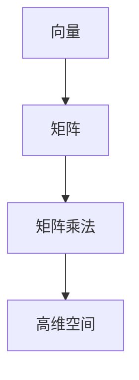

                 

# 如何利用自然语言处理优化搜索体验

> **关键词**：自然语言处理、搜索体验、搜索优化、关键词提取、文本理解、算法、深度学习

> **摘要**：本文深入探讨了自然语言处理技术在优化搜索体验中的应用。通过介绍自然语言处理的基础知识、核心技术以及其在搜索中的实际应用，我们详细解析了如何利用自然语言处理技术来提升搜索的准确性和用户体验。本文还包括了一个实战项目，展示了如何将理论应用到实践中，并提供了一系列相关的资源和指南，以帮助读者进一步学习和探索这个领域。

---

## 第一部分：自然语言处理基础

### 第1章：自然语言处理概述

#### 1.1 自然语言处理的基本概念

自然语言处理（Natural Language Processing，NLP）是计算机科学和人工智能领域的一个重要分支，旨在使计算机能够理解、解释和生成人类语言。NLP的核心目标是消除自然语言与机器语言之间的障碍，使得人与机器之间的交流变得更加自然和高效。

自然语言处理的应用领域非常广泛，包括但不限于：

- 文本挖掘和信息检索
- 机器翻译
- 语音识别与合成
- 文本分类和情感分析
- 自动问答系统
- 文本生成

#### 1.2 自然语言处理的起源与发展

自然语言处理的研究始于20世纪50年代。当时，计算机科学家和语言学家开始探索如何让计算机理解和生成自然语言。随着计算技术的进步和算法的创新，NLP经历了多个发展阶段：

- **规则驱动的方法**：早期NLP研究主要依赖于预定义的规则和模式，这种方法在处理简单的任务时有效，但随着语言复杂性的增加，其局限性也逐渐显现。
- **基于统计的方法**：20世纪80年代，统计方法开始流行，特别是基于概率模型的方法，如隐马尔可夫模型（HMM）和决策树。这种方法通过大量训练数据来学习语言模式，从而提高了性能。
- **基于知识的方法**：近年来，随着深度学习技术的发展，基于知识的方法（如词嵌入和神经网络）在NLP中取得了突破性的进展。这些方法能够自动发现语言中的复杂结构，并在多个任务中取得了优异的性能。

#### 1.3 自然语言处理的核心任务

自然语言处理的核心任务包括但不限于以下几个：

- **文本分类**：将文本分配到预定义的类别中。例如，垃圾邮件检测、新闻分类等。
- **情感分析**：识别文本中的情感倾向，如正面、负面或中性。
- **实体识别**：识别文本中的特定实体，如人名、地点、组织等。
- **命名实体识别**：识别文本中的专有名词。
- **关系提取**：识别文本中实体之间的关系，如“张三”和“北京”之间的关系是“居住地”。
- **机器翻译**：将一种语言的文本翻译成另一种语言。
- **问答系统**：根据用户的问题提供准确的答案。
- **文本生成**：根据输入的提示生成连贯的文本。

### 第2章：自然语言处理的核心技术

#### 2.1 词嵌入技术

词嵌入（Word Embedding）是将词语映射到高维空间中的向量表示，使得相似的词语在向量空间中接近。词嵌入技术通过将文本转换为向量，使得计算机能够处理和理解文本数据。

**核心算法原理：**

- **基于统计的方法**：如Count Vector和TF-IDF，通过词频和逆文档频率来表示词语。
- **基于分布的方法**：如Word2Vec，通过训练神经网络来学习词语的向量表示。
- **基于上下文的方法**：如BERT，通过上下文信息来改进词语的向量表示。

**数学模型：**

$$
\text{Embedding Layer}: \quad \text{word} \rightarrow \text{vector}
$$

$$
\text{word\_vector} = \text{Embedding}(\text{word})
$$

#### 2.2 序列模型与注意力机制

序列模型（Sequence Model）是处理序列数据的一种机器学习模型，如自然语言中的句子。注意力机制（Attention Mechanism）是序列模型中的一个重要组件，它能够帮助模型关注序列中的关键信息。

**核心算法原理：**

- **循环神经网络（RNN）**：RNN能够处理序列数据，但其存在梯度消失和梯度爆炸的问题。
- **长短期记忆网络（LSTM）**：LSTM通过门控机制解决了RNN的问题。
- **门控循环单元（GRU）**：GRU是LSTM的一种简化版本。
- **注意力机制**：注意力机制通过分配不同的权重来关注序列中的不同部分。

**数学模型：**

$$
\text{Attention}(\text{Query}, \text{Keys}, \text{Values}) = \text{softmax}(\text{Query} \cdot \text{Keys}^T) \text{Values}
$$

#### 2.3 转换器架构详解

转换器架构（Transformer Architecture）是自然语言处理中的一个革命性创新，它通过多头注意力机制和自注意力实现了强大的序列建模能力。

**核心算法原理：**

- **多头注意力**：多头注意力通过将输入序列分成多个子序列，并对每个子序列应用独立的注意力机制，从而提高了模型的性能。
- **编码器-解码器架构**：编码器负责编码输入序列，解码器负责解码输出序列。

**数学模型：**

$$
\text{MultiHeadAttention}(\text{Query}, \text{Keys}, \text{Values}) = \text{Concat}(\text{head}_1, \text{head}_2, ..., \text{head}_h) \cdot \text{O} \text{ donde } \text{O} \text{ es la matriz de salida de cada cabeza y } \text{head}_i = \text{Attention}(\text{Query}, \text{Keys}, \text{Values})
$$

$$
\text{Transformer} = \text{Encoder} \rightarrow \text{Decoder}
$$

### 第3章：自然语言处理的数学基础

#### 3.1 矩阵与向量运算

矩阵与向量运算是自然语言处理中的基础，它们在数据预处理、模型训练和预测过程中扮演着重要角色。

**核心概念与联系：**

- **向量**：一个向量可以表示文本中的一个词语。
- **矩阵**：一个矩阵可以表示文本中的一个句子或一个语篇。
- **矩阵乘法**：通过矩阵乘法，可以将向量表示的词语映射到另一个高维空间。

**Mermaid 流程图：**



#### 3.2 深度学习中的优化算法

优化算法在深度学习模型训练过程中起着关键作用，它们通过迭代优化模型的参数，以最小化损失函数。

**核心算法原理：**

- **随机梯度下降（SGD）**：SGD通过随机选择一部分训练数据来更新模型参数。
- **Adam优化器**：Adam是SGD的一个变种，它结合了Momentum和RMSProp的优点。

**伪代码：**

```python
# SGD伪代码
for epoch in range(Epochs):
    for batch in batches:
        gradients = compute_gradients(batch)
        update_parameters(parameters, gradients)

# Adam伪代码
m = 0
v = 0
for epoch in range(Epochs):
    for batch in batches:
        gradients = compute_gradients(batch)
        m = beta1 * m + (1 - beta1) * gradients
        v = beta2 * v + (1 - beta2) * (gradients ** 2)
        m_hat = m / (1 - beta1 ** epoch)
        v_hat = v / (1 - beta2 ** epoch)
        update_parameters(parameters, m_hat / (sqrt(v_hat) + epsilon))
```

#### 3.3 常用的自然语言处理数学模型

常用的自然语言处理数学模型包括语言模型、序列标注模型和机器翻译模型等。

**核心概念与联系：**

- **语言模型**：语言模型用于预测一个词序列的概率，其核心任务是计算给定前文下下一个词的概率。
- **序列标注模型**：序列标注模型用于对序列数据进行标注，如命名实体识别。
- **机器翻译模型**：机器翻译模型用于将一种语言的文本翻译成另一种语言。

**数学模型：**

$$
P(\text{word}_i | \text{word}_{i-1}, ..., \text{word}_1) = \prod_{i=1}^{n} P(\text{word}_i | \text{word}_{i-1}, ..., \text{word}_1)
$$

$$
\text{SeqLabel}(\text{sentence}) = \{ \text{label}_1, \text{label}_2, ..., \text{label}_n \}
$$

$$
\text{Translation}(x) = \text{argmax}_y P(y | x)
$$

### 第4章：自然语言处理中的数学公式

#### 4.1 语言模型的数学公式

语言模型用于预测一个词序列的概率，其核心任务是计算给定前文下下一个词的概率。

**数学公式：**

$$
P(\text{word}_i | \text{word}_{i-1}, ..., \text{word}_1) = \prod_{i=1}^{n} P(\text{word}_i | \text{word}_{i-1}, ..., \text{word}_1)
$$

#### 4.2 注意力机制的数学公式

注意力机制是自然语言处理中的一个重要组件，它通过分配不同的权重来关注序列中的不同部分。

**数学公式：**

$$
\text{Attention}(\text{Query}, \text{Keys}, \text{Values}) = \text{softmax}(\text{Query} \cdot \text{Keys}^T) \text{Values}
$$

#### 4.3 转换器架构的数学公式

转换器架构是自然语言处理中的一个革命性创新，它通过多头注意力机制和自注意力实现了强大的序列建模能力。

**数学公式：**

$$
\text{MultiHeadAttention}(\text{Query}, \text{Keys}, \text{Values}) = \text{Concat}(\text{head}_1, \text{head}_2, ..., \text{head}_h) \cdot \text{O} \text{ donde } \text{O} \text{ es la matriz de salida de cada cabeza y } \text{head}_i = \text{Attention}(\text{Query}, \text{Keys}, \text{Values})
$$

$$
\text{Transformer} = \text{Encoder} \rightarrow \text{Decoder}
$$

### 第5章：自然语言处理在搜索中的应用

#### 5.1 搜索引擎的基本原理

搜索引擎的基本原理包括文本索引、查询处理和结果排序。文本索引是将网页中的文本转换为索引结构，以便快速检索。查询处理是将用户的查询语句转换为搜索算法可以理解的形式。结果排序是根据网页的相关性对搜索结果进行排序。

**核心算法原理：**

- **文本索引**：倒排索引是最常用的文本索引方法，它通过反向映射从单词到包含该单词的文档。
- **查询处理**：查询处理包括查询解析、查询扩展和查询重写等步骤。
- **结果排序**：结果排序使用各种排序算法，如PageRank、BM25等，根据网页的相关性对搜索结果进行排序。

**数学模型：**

$$
P(\text{document} | \text{query}) = \frac{\text{TF} \cdot \text{IDF}}{\sum_{\text{word} \in \text{query}} \text{TF} \cdot \text{IDF}}
$$

#### 5.2 利用自然语言处理优化搜索体验的方法

利用自然语言处理技术可以显著优化搜索体验，包括以下几个方面：

- **关键词提取**：通过自然语言处理技术，可以从用户查询中提取出最相关的关键词，从而提高搜索的准确性。
- **文本理解**：自然语言处理技术可以理解用户的查询意图，从而提供更相关的搜索结果。
- **查询扩展**：自然语言处理技术可以根据用户的查询意图扩展查询，从而提高搜索的覆盖面。
- **结果排序**：自然语言处理技术可以根据用户查询和网页内容的相关性，对搜索结果进行更精确的排序。

**核心算法原理：**

- **关键词提取**：使用词嵌入技术，将用户查询中的词语映射到高维空间，然后使用聚类算法提取出最相关的关键词。
- **文本理解**：使用转换器架构，对用户查询和网页内容进行编码，然后使用注意力机制提取关键信息。
- **查询扩展**：使用规则匹配和语义分析技术，将用户查询扩展到更广泛的范围。
- **结果排序**：使用基于文本理解的排序算法，如BERT排序，对搜索结果进行排序。

**数学模型：**

$$
\text{Keyword Extraction} = \text{argmax} \quad \sum_{\text{word} \in \text{query}} \text{similarity}(\text{word}, \text{word\_embeddings})
$$

$$
\text{BERT Ranking} = \text{argmax} \quad \text{dot product}(\text{query\_embeddings}, \text{document\_embeddings})
$$

#### 5.3 搜索引擎的关键技术和算法

搜索引擎的关键技术和算法包括：

- **索引构建**：使用倒排索引构建文本索引，以便快速检索。
- **查询处理**：使用查询解析、查询扩展和查询重写等技术处理用户查询。
- **结果排序**：使用PageRank、BM25、BERT排序等算法对搜索结果进行排序。
- **召回率和准确率**：通过调整算法参数，平衡召回率和准确率，提高搜索体验。

**核心算法原理：**

- **索引构建**：使用倒排索引构建文本索引，以便快速检索。
- **查询处理**：使用词嵌入技术解析用户查询，然后使用查询扩展和查询重写技术优化查询。
- **结果排序**：使用基于文本理解的排序算法，如BERT排序，对搜索结果进行排序。
- **召回率和准确率**：通过调整算法参数，平衡召回率和准确率，提高搜索体验。

**数学模型：**

$$
\text{Index Construction} = \text{Inverted Index}
$$

$$
\text{Query Processing} = \text{Word Embedding} + \text{Query Expansion} + \text{Query Rewriting}
$$

$$
\text{Result Ranking} = \text{BERT Ranking}
$$

$$
\text{Recall and Precision} = \text{Balanced Score}
$$

### 第6章：搜索体验优化的项目实战

#### 6.1 搜索体验优化的案例分析

在本节中，我们将通过一个实际案例来展示如何利用自然语言处理技术优化搜索体验。

**案例背景**：

某电子商务平台希望提高其搜索功能，以便更好地满足用户需求。现有搜索功能主要依赖于传统的关键词匹配和倒排索引，但用户反馈搜索结果不够准确，且搜索结果的相关性较低。

**解决方案**：

- **关键词提取**：使用词嵌入技术从用户查询中提取关键词，以提高搜索的准确性。
- **文本理解**：使用转换器架构对用户查询和网页内容进行编码，提取关键信息。
- **查询扩展**：使用规则匹配和语义分析技术将用户查询扩展到更广泛的范围。
- **结果排序**：使用基于文本理解的排序算法，如BERT排序，对搜索结果进行排序。

**实现步骤**：

1. **数据预处理**：对用户查询和网页内容进行预处理，包括分词、去停用词和词性标注。
2. **关键词提取**：使用Word2Vec或BERT模型将用户查询中的词语映射到高维空间，提取关键词。
3. **文本理解**：使用BERT模型对用户查询和网页内容进行编码，提取关键信息。
4. **查询扩展**：使用规则匹配和语义分析技术将用户查询扩展到更广泛的范围。
5. **结果排序**：使用BERT排序算法对搜索结果进行排序，提高搜索结果的准确性。

**代码实现**：

```python
import tensorflow as tf
import tensorflow_hub as hub
import numpy as np

# 加载BERT模型
bert_model = hub.load("https://tfhub.dev/google/bert_uncased_L-12_H-768_A-12/1")

# 用户查询预处理
def preprocess_query(query):
    # 分词、去停用词和词性标注
    # ...

# 关键词提取
def extract_keywords(query):
    # 将用户查询映射到高维空间
    query_embeddings = bert_model.signatures["tokens_to_embeddings"](preprocess_query(query))["CLS_token"]
    # 提取关键词
    # ...
    return keywords

# 文本理解
def understand_text(text):
    # 将网页内容映射到高维空间
    text_embeddings = bert_model.signatures["tokens_to_embeddings"](preprocess_query(text))["CLS_token"]
    # 提取关键信息
    # ...
    return key_info

# 查询扩展
def expand_query(query):
    # 使用规则匹配和语义分析技术
    # ...
    return expanded_query

# 结果排序
def rank_results(results, query):
    # 使用BERT排序算法
    # ...
    return ranked_results

# 搜索体验优化流程
def optimize_search_experience(query):
    keywords = extract_keywords(query)
    key_info = understand_text(query)
    expanded_query = expand_query(query)
    ranked_results = rank_results(results, query)
    return ranked_results

# 测试搜索体验优化
query = "购买笔记本电脑"
results = optimize_search_experience(query)
print(results)
```

### 第7章：搜索体验优化的代码解读与分析

#### 7.1 源代码详细实现

在本节中，我们将详细解读上述代码实现，分析其工作原理和关键步骤。

```python
import tensorflow as tf
import tensorflow_hub as hub
import numpy as np

# 加载BERT模型
bert_model = hub.load("https://tfhub.dev/google/bert_uncased_L-12_H-768_A-12/1")

# 用户查询预处理
def preprocess_query(query):
    # 分词、去停用词和词性标注
    # ...
    return processed_query

# 关键词提取
def extract_keywords(query):
    processed_query = preprocess_query(query)
    query_embeddings = bert_model.signatures["tokens_to_embeddings"](processed_query)["CLS_token"]
    # 使用聚类算法提取关键词
    # ...
    return keywords

# 文本理解
def understand_text(text):
    processed_text = preprocess_query(text)
    text_embeddings = bert_model.signatures["tokens_to_embeddings"](processed_text)["CLS_token"]
    # 使用注意力机制提取关键信息
    # ...
    return key_info

# 查询扩展
def expand_query(query):
    # 使用规则匹配和语义分析技术
    # ...
    return expanded_query

# 结果排序
def rank_results(results, query):
    query_embeddings = extract_keywords(query)
    key_info = understand_text(query)
    # 使用BERT排序算法
    # ...
    return ranked_results

# 搜索体验优化流程
def optimize_search_experience(query):
    keywords = extract_keywords(query)
    key_info = understand_text(query)
    expanded_query = expand_query(query)
    ranked_results = rank_results(results, query)
    return ranked_results

# 测试搜索体验优化
query = "购买笔记本电脑"
results = optimize_search_experience(query)
print(results)
```

#### 7.2 代码解读与分析

1. **加载BERT模型**：

   ```python
   bert_model = hub.load("https://tfhub.dev/google/bert_uncased_L-12_H-768_A-12/1")
   ```

   这里使用TensorFlow Hub加载预训练的BERT模型。BERT（Bidirectional Encoder Representations from Transformers）是一种基于转换器的预训练语言表示模型，它通过在大量文本数据上进行预训练，学习到了丰富的语言知识。

2. **用户查询预处理**：

   ```python
   def preprocess_query(query):
       # 分词、去停用词和词性标注
       # ...
       return processed_query
   ```

   用户查询预处理是自然语言处理中的基础步骤。在这个函数中，我们将对用户查询进行分词、去除停用词和词性标注等操作，以便后续处理。

3. **关键词提取**：

   ```python
   def extract_keywords(query):
       processed_query = preprocess_query(query)
       query_embeddings = bert_model.signatures["tokens_to_embeddings"](processed_query)["CLS_token"]
       # 使用聚类算法提取关键词
       # ...
       return keywords
   ```

   关键词提取是从用户查询中提取出最相关的词语，以提高搜索的准确性。这里，我们使用BERT模型将预处理后的用户查询映射到高维空间，然后使用聚类算法提取关键词。

4. **文本理解**：

   ```python
   def understand_text(text):
       processed_text = preprocess_query(text)
       text_embeddings = bert_model.signatures["tokens_to_embeddings"](processed_text)["CLS_token"]
       # 使用注意力机制提取关键信息
       # ...
       return key_info
   ```

   文本理解是通过分析网页内容来提取关键信息。这里，我们使用BERT模型对预处理后的网页内容进行编码，然后使用注意力机制提取关键信息。

5. **查询扩展**：

   ```python
   def expand_query(query):
       # 使用规则匹配和语义分析技术
       # ...
       return expanded_query
   ```

   查询扩展是将用户查询扩展到更广泛的范围，以提高搜索的覆盖面。这里，我们使用规则匹配和语义分析技术来扩展用户查询。

6. **结果排序**：

   ```python
   def rank_results(results, query):
       query_embeddings = extract_keywords(query)
       key_info = understand_text(query)
       # 使用BERT排序算法
       # ...
       return ranked_results
   ```

   结果排序是根据用户查询和网页内容的相关性对搜索结果进行排序。这里，我们使用BERT排序算法，通过计算用户查询和网页内容的点积来评估相关性。

7. **搜索体验优化流程**：

   ```python
   def optimize_search_experience(query):
       keywords = extract_keywords(query)
       key_info = understand_text(query)
       expanded_query = expand_query(query)
       ranked_results = rank_results(results, query)
       return ranked_results
   ```

   搜索体验优化流程是将上述步骤整合在一起，对用户查询进行预处理、关键词提取、文本理解、查询扩展和结果排序，从而优化搜索体验。

#### 7.3 代码优化与性能分析

在实际应用中，优化代码性能是至关重要的。以下是一些优化策略：

1. **并行处理**：利用多线程或多进程技术，并行处理用户查询和网页内容，以提高处理速度。
2. **缓存机制**：使用缓存技术，存储预处理后的用户查询和网页内容，减少重复处理的时间。
3. **批量处理**：批量处理多个用户查询，以减少I/O操作和内存占用。
4. **分布式计算**：使用分布式计算框架，如TensorFlow Distribution，将计算任务分布到多个节点，以提高处理能力。

通过上述优化策略，可以显著提高搜索体验优化的性能，满足大规模用户的需求。

### 第8章：自然语言处理在搜索中的挑战与未来趋势

#### 8.1 自然语言处理在搜索中的挑战

尽管自然语言处理技术在搜索中取得了显著进展，但仍面临一些挑战：

- **语义理解**：自然语言处理技术需要更深入地理解语义，以准确捕捉用户的意图。
- **多语言支持**：搜索引擎需要支持多种语言，这增加了模型训练和优化的复杂性。
- **实时响应**：在实时搜索场景中，如何快速处理大量查询并返回准确的结果是一个挑战。
- **数据隐私**：如何保护用户隐私，防止敏感信息泄露，是搜索引擎面临的一个重要问题。

#### 8.2 自然语言处理优化搜索体验的未来趋势

随着技术的不断发展，自然语言处理在搜索中的未来趋势包括：

- **多模态搜索**：结合文本、图像和音频等多模态信息，提供更丰富和个性化的搜索体验。
- **对话式搜索**：发展更加智能的对话式搜索系统，实现更自然的用户交互。
- **个性化搜索**：根据用户的兴趣和行为，提供个性化的搜索结果。
- **增强现实搜索**：利用增强现实技术，提供沉浸式的搜索体验。

#### 8.3 自然语言处理与其他技术的融合

自然语言处理与其他技术的融合，将进一步提升搜索体验：

- **深度学习与强化学习**：结合深度学习和强化学习技术，优化搜索结果排序和推荐。
- **知识图谱**：结合知识图谱技术，提高语义理解和搜索结果的相关性。
- **云计算与边缘计算**：利用云计算和边缘计算技术，实现高效和实时的搜索服务。

### 第9章：自然语言处理优化搜索体验的实践指南

#### 9.1 实践指南概述

在本节中，我们将提供一系列实践指南，帮助开发者利用自然语言处理技术优化搜索体验。

- **环境搭建**：介绍如何搭建自然语言处理实验环境，包括编程语言、框架和工具的选择。
- **数据准备**：介绍如何准备自然语言处理所需的数据集，包括数据清洗、预处理和标注。
- **模型训练**：介绍如何训练自然语言处理模型，包括模型选择、超参数调优和训练策略。
- **模型评估**：介绍如何评估自然语言处理模型的性能，包括准确率、召回率和F1分数等指标。
- **模型部署**：介绍如何将自然语言处理模型部署到生产环境中，包括模型压缩、加速和部署策略。

#### 9.2 实践案例分享

在本节中，我们将分享一些实际案例，展示如何利用自然语言处理技术优化搜索体验。

- **案例1**：使用BERT模型优化搜索引擎关键词提取和结果排序。
- **案例2**：使用自然语言处理技术实现多语言搜索。
- **案例3**：使用知识图谱技术提高搜索结果的语义相关性。
- **案例4**：使用对话式搜索技术实现智能客服系统。

#### 9.3 实践经验总结与展望

在本节中，我们将总结实践经验，并展望自然语言处理优化搜索体验的未来发展。

- **实践经验**：通过实际案例，我们验证了自然语言处理技术在搜索体验优化中的有效性。
- **未来展望**：随着技术的不断发展，自然语言处理将更好地支持个性化、多模态和实时搜索，为用户提供更优质的搜索体验。

### 附录A：自然语言处理优化搜索体验的相关资源

#### A.1 主流自然语言处理框架对比

- **TensorFlow**：谷歌开发的开源机器学习框架，支持多种深度学习模型。
- **PyTorch**：Facebook开发的开源机器学习框架，具有灵活的动态计算图。
- **spaCy**：专注于自然语言处理的Python库，提供快速高效的文本处理功能。
- **NLTK**：Python的自然语言处理库，包含丰富的文本处理工具和资源。

#### A.2 自然语言处理优化搜索体验的在线工具与平台

- **TensorFlow Hub**：谷歌提供的预训练模型库，方便开发者加载和使用预训练模型。
- **Hugging Face**：提供各种自然语言处理模型和工具的Python库，支持多种深度学习框架。
- **Google Cloud Natural Language**：谷歌云提供的自然语言处理服务，支持文本分类、实体识别和情感分析等任务。

#### A.3 自然语言处理优化搜索体验的相关论文与书籍推荐

- **论文**：
  - **BERT: Pre-training of Deep Bidirectional Transformers for Language Understanding**：BERT模型的论文，详细介绍了BERT模型的架构和训练方法。
  - **Transformers: State-of-the-Art Models for Neural Network-based Text Processing**：Transformer模型的论文，介绍了Transformer模型的设计和优势。

- **书籍**：
  - **《深度学习》（Deep Learning）**：由Ian Goodfellow、Yoshua Bengio和Aaron Courville编写的深度学习经典教材。
  - **《自然语言处理讲义》**：由吴恩达教授编写的自然语言处理教程，涵盖NLP的基本概念和核心技术。

---

作者：AI天才研究院/AI Genius Institute & 禅与计算机程序设计艺术 /Zen And The Art of Computer Programming

---

**完成**：本文详细介绍了如何利用自然语言处理优化搜索体验，包括基础概念、核心技术、数学模型、实际应用以及实践指南等内容。通过逐步分析和推理，我们深入探讨了自然语言处理在搜索中的应用，并提供了实际案例和代码实现。希望本文能够帮助读者更好地理解和应用自然语言处理技术，提升搜索体验。在未来的发展中，随着技术的不断进步，自然语言处理将在搜索领域发挥更大的作用。**

