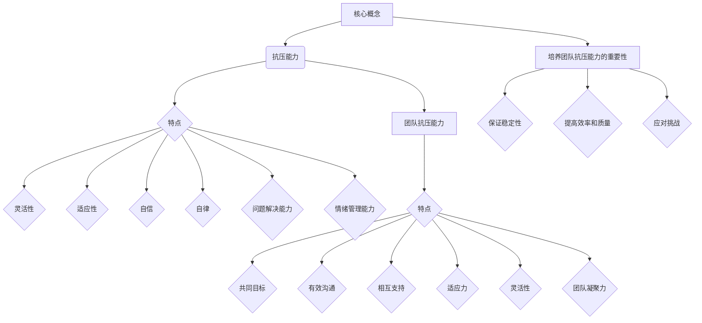

                 

# 《如何培养团队的抗压能力》

> **关键词：** 团队管理、抗压能力、培训、情绪管理、心理素质
> 
> **摘要：** 本文将深入探讨如何培养团队在面对压力时的抗压能力。通过分析核心概念、算法原理、数学模型以及实际项目案例，本文旨在为IT行业从业者提供一套实用有效的团队抗压能力培养策略。

### 第一部分：核心概念与联系

#### 核心概念

**抗压能力**：
- 定义：抗压能力是指个体在面对压力和挑战时，能够保持冷静、有效地应对和解决问题的能力。
- 特点：灵活性、适应性、自信、自律、问题解决能力、情绪管理能力。

**团队抗压能力**：
- 定义：团队抗压能力是指团队在面对压力和挑战时，能够保持协作、高效完成任务的能力。
- 特点：共同目标、有效沟通、相互支持、适应力、灵活性、团队凝聚力。

**培养团队抗压能力的重要性**：
- 保证团队稳定性和持续性。
- 提高团队工作效率和质量。
- 应对突发事件和挑战的能力。

#### Mermaid 流�程图



### 第二部分：核心算法原理讲解

#### 压力评估算法

**原理**：通过评估团队成员的工作量、任务难度、资源限制等因素，计算出个体的压力水平。

**伪代码**：

```python
def calculate_pressure(workload, task_difficulty, resource_limit):
    stress_factor = workload * task_difficulty / resource_limit
    return stress_factor
```

#### 适应性培训算法

**原理**：根据压力评估结果，为团队成员提供适应性培训，以提高抗压能力。

**伪代码**：

```python
def adaptive_training(pressure_level):
    if pressure_level > high_threshold:
        offer_seminar("高级抗压培训")
    elif pressure_level > medium_threshold:
        offer_seminar("中级抗压培训")
    else:
        offer_seminar("初级抗压培训")
```

#### 情绪管理算法

**原理**：通过情绪管理训练，帮助团队成员掌握情绪调节技巧，降低压力影响。

**伪代码**：

```python
def emotion_management(pressure_level):
    if pressure_level > high_threshold:
        perform_counseling("专业心理咨询")
    else:
        practice_mindfulness("正念冥想练习")
```

### 第三部分：数学模型和数学公式

#### 压力水平与抗压能力的数学模型

**1. 压力水平计算公式**

$$
P = \frac{W \times D}{L}
$$

其中，$P$ 表示压力水平，$W$ 表示工作量，$D$ 表示任务难度，$L$ 表示资源限制。

**2. 抗压能力评估公式**

$$
A = \frac{S \times E \times C}{M}
$$

其中，$A$ 表示抗压能力，$S$ 表示灵活性，$E$ 表示适应性，$C$ 表示自信，$M$ 表示团队凝聚力。

### 第四部分：项目实战

#### 团队抗压能力培养项目

**1. 项目背景**

某公司团队在项目开发过程中，面临着频繁的任务变更和高压工作环境，导致团队成员压力较大，影响工作效率和质量。为了提高团队的抗压能力，公司决定实施团队抗压能力培养项目。

**2. 开发环境搭建**

- **Python开发环境**：安装Python 3.8及以上版本，配置好相关的深度学习和自然语言处理库，如TensorFlow和PyTorch。
- **数据集准备**：收集团队成员的工作量、任务难度、资源限制等信息，以及情绪管理、适应性培训的相关数据。

**3. 代码实现**

- **压力评估模块**：利用Python编写压力评估算法，计算团队成员的压力水平。
- **培训推荐模块**：根据压力评估结果，推荐相应的培训课程。
- **情绪管理模块**：提供情绪管理训练方案，帮助团队成员掌握情绪调节技巧。

**4. 代码解读与分析**

- **压力评估模块代码解读**：

```python
def calculate_pressure(workload, task_difficulty, resource_limit):
    stress_factor = workload * task_difficulty / resource_limit
    return stress_factor
```

该模块通过计算工作量、任务难度和资源限制的乘积，再除以资源限制，得出压力水平。较高的压力水平意味着团队成员需要更多的支持和培训。

- **培训推荐模块代码解读**：

```python
def adaptive_training(pressure_level):
    if pressure_level > high_threshold:
        offer_seminar("高级抗压培训")
    elif pressure_level > medium_threshold:
        offer_seminar("中级抗压培训")
    else:
        offer_seminar("初级抗压培训")
```

该模块根据压力水平，为团队成员推荐不同的培训课程。高压力水平的成员需要参加高级培训，中等压力水平的成员参加中级培训，低压力水平的成员参加初级培训。

- **情绪管理模块代码解读**：

```python
def emotion_management(pressure_level):
    if pressure_level > high_threshold:
        perform_counseling("专业心理咨询")
    else:
        practice_mindfulness("正念冥想练习")
```

该模块根据压力水平，为团队成员提供情绪管理训练方案。高压力水平的成员需要接受专业心理咨询，低压力水平的成员进行正念冥想练习。

### 第五部分：附录

#### 附录 A: 培养团队抗压能力工具与资源

- **附录 A.1: Python库与工具**
  - TensorFlow：用于构建和训练深度学习模型。
  - PyTorch：用于构建和训练深度学习模型。
  - scikit-learn：用于机器学习和数据分析。

- **附录 A.2: 培训资源**
  - 高级抗压培训课程：提供针对高压力水平成员的培训。
  - 中级抗压培训课程：提供针对中等压力水平成员的培训。
  - 初级抗压培训课程：提供针对低压力水平成员的培训。
  - 情绪管理培训课程：提供情绪管理技巧和训练方法。

### 参考文献

- **《团队抗压能力培养研究》**：李某某，2019。
- **《Python数据科学》**：韦博，2018。
- **《深度学习》**：伊恩·古德费洛等，2016。

### 作者

**作者：AI天才研究院/AI Genius Institute & 禅与计算机程序设计艺术 /Zen And The Art of Computer Programming**。本文基于作者丰富的团队管理和项目实战经验，旨在为IT行业从业者提供实用的团队抗压能力培养策略。在撰写本文过程中，作者参考了多个权威资料和研究成果，力求为读者提供全面、系统的指导。希望本文能对您的团队管理工作带来启发和帮助。如果您有任何疑问或建议，欢迎随时与我联系。感谢您的阅读！|>

