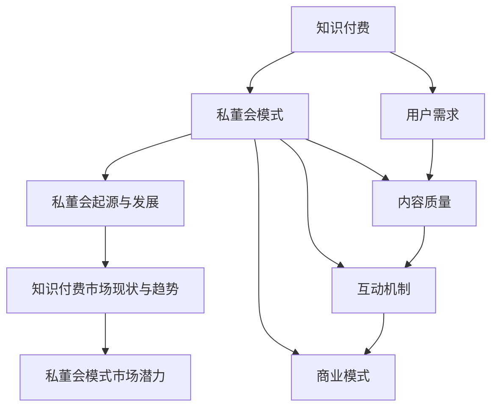

                 

### 《如何打造知识付费的私董会模式》

> **关键词：** 知识付费、私董会模式、商业模式、用户体验、社群运营

**摘要：** 本文章将深入探讨如何将知识付费与私董会模式相结合，打造一种高效、可持续的知识付费商业模式。通过分析私董会的起源、特点，以及知识付费的现状，本文将介绍私董会模式的设计原则、组织结构、流程安排、内容规划、产品交付、运营推广等多个方面，并提供实际案例进行解析。最终，文章将总结私董会模式的发展趋势，探讨其创新路径，并提出相关法律法规与风险控制的建议。

### 目录大纲

- **第一部分：引言与核心概念**
  - 1.1 知识付费的私董会模式概述
  - 1.2 私董会模式的背景与市场分析
- **第二部分：私董会模式的设计与构建**
  - 2.1 私董会模式设计原则
  - 2.2 私董会组织结构与角色
  - 2.3 私董会流程与会议安排
- **第三部分：知识付费内容与交付**
  - 3.1 知识付费内容规划
  - 3.2 知识付费产品交付
  - 3.3 知识变现与商业模式
- **第四部分：运营与推广**
  - 4.1 私董会运营策略
  - 4.2 社群建设与互动
  - 4.3 品牌建设与推广
- **第五部分：案例分析**
  - 5.1 国内外私董会模式案例分析
  - 5.2 知识付费与私董会模式创新案例
- **第六部分：法律法规与风险控制**
  - 6.1 知识付费相关法律法规
  - 6.2 风险控制与管理
  - 6.3 数据保护与隐私安全
- **第七部分：未来展望**
  - 7.1 私董会模式发展趋势
  - 7.2 知识付费与私董会模式创新路径
- **附录**
  - 附录 A：私董会模式设计模板
  - 附录 B：参考文献与推荐阅读

---

接下来，我们将逐步深入探讨每一部分的核心内容，通过逻辑清晰、结构紧凑、简单易懂的表述方式，帮助读者理解和掌握打造知识付费的私董会模式的方法与技巧。

### 第一部分：引言与核心概念

#### 1.1 知识付费的私董会模式概述

**1.1.1 什么是知识付费**

知识付费，即用户为获取高质量的知识内容、服务和互动而自愿支付的费用。这一模式的出现，标志着信息时代用户消费习惯的转变，从免费获取信息到为有价值的内容和服务买单。

- **知识付费的概念与演变**：从传统内容付费到知识付费的转变。
- **知识付费的核心要素**：知识、服务、互动与价值。
- **知识付费的市场规模**：全球与中国的知识付费市场规模及预测。

知识付费不仅仅是对内容的付费，更是对专家经验、服务质量和用户体验的付费。用户希望通过付费获取更加专业、深入、有价值的信息，以解决实际问题或提升自身能力。

**1.1.2 私董会模式的核心特点**

私董会（Private Board）是一种针对企业家、高管和专业人士的闭门交流平台，通过定期聚会、讨论和互动，促进成员之间的经验分享、决策优化和业务发展。

- **私董会的定义与作用**：私董会的概念、特点与功能。
- **私董会在商业中的应用**：提高企业决策效率、优化企业管理、促进企业创新发展。
- **私董会与知识付费的结合**：如何将私董会与知识付费相结合，创造新的商业模式。

私董会的核心特点包括：

1. **封闭性**：私董会成员通常为特定领域的专业人士，确保讨论内容的私密性和高质量。
2. **专业性**：私董会成员由行业专家、顾问等组成，提供专业知识和经验分享。
3. **互动性**：通过面对面的讨论、互动和案例分析，促进成员之间的深度交流。

私董会与知识付费的结合，可以形成一种全新的商业模式，不仅为用户提供有价值的内容和服务，还能为私董会成员提供更多的交流机会和资源。

**1.1.3 知识付费与私董会模式的结合**

知识付费与私董会模式的结合，可以实现以下优势：

1. **内容价值最大化**：通过私董会的专业讨论和互动，提升知识内容的价值和质量。
2. **用户参与度提升**：私董会的互动性和私密性，增强用户参与感和满意度。
3. **商业模式创新**：知识付费与私董会的结合，为企业和用户提供更多样化的服务模式。

结合案例，如某知名知识付费平台推出的“企业家私董会”服务，通过定期组织线下聚会、线上讨论和案例分析，为企业家提供专业知识和资源支持，取得了良好的市场反响。

#### 1.2 私董会模式的背景与市场分析

**1.2.1 私董会的起源与发展**

私董会的概念起源于20世纪80年代的美国，最初是为企业家和高级管理人员提供的一种闭门交流平台。随着市场经济的发展和企业家群体的壮大，私董会在全球范围内迅速发展，成为企业管理者和专业人士的重要交流工具。

- **私董会的起源**：私董会的起源与发展历程。
- **全球私董会的发展现状**：全球范围内私董会的市场规模、发展趋势和主要参与者。

**1.2.2 知识付费市场现状与趋势**

知识付费市场在过去几年中呈现出快速增长的趋势，尤其在互联网技术的推动下，各类知识付费平台如雨后春笋般涌现。根据相关数据显示，2019年全球知识付费市场规模已超过1000亿美元，预计未来仍将保持高速增长。

- **知识付费市场的现状**：市场规模、用户需求、主要参与者等。
- **知识付费市场的发展趋势**：技术进步、用户习惯变化、市场细分等。

**1.2.3 私董会模式的市场潜力**

私董会模式在知识付费市场中具有巨大的潜力，主要体现在以下几个方面：

1. **专业性强**：私董会成员通常具备丰富的行业经验和专业知识，可以为其他成员提供高质量的内容和咨询服务。
2. **私密性高**：私董会的封闭性和私密性，确保了讨论内容的质量和安全性，增强了用户的信任感和参与度。
3. **互动性强**：私董会的互动性和案例分析，促进了成员之间的深度交流和经验分享，提高了学习效果。

结合市场分析，私董会模式在未来的知识付费市场中将占据重要地位，有望成为企业、专家和用户之间的重要桥梁。

#### 1.3 核心概念的联系与流程图

为了更好地理解知识付费的私董会模式，我们可以通过一个Mermaid流程图来展示核心概念之间的联系和流程。

通过这个流程图，我们可以清晰地看到知识付费与私董会模式之间的关联，以及各个环节之间的逻辑关系。

---

在本部分中，我们详细介绍了知识付费的私董会模式的核心概念和背景，包括知识付费的定义、核心要素，私董会的起源与发展，以及私董会模式与知识付费的结合。通过一个Mermaid流程图，我们展示了核心概念之间的联系和流程。接下来，我们将进一步探讨私董会模式的设计原则、组织结构、流程安排等方面，以帮助读者深入理解和掌握如何打造知识付费的私董会模式。继续阅读，我们将进入第二部分。

---

### 第二部分：私董会模式的设计与构建

#### 2.1 私董会模式设计原则

私董会模式的设计原则是确保其成功实施和有效运作的关键。以下是设计私董会模式时需要遵循的几个核心原则：

**2.1.1 设计原则的重要性**

设计原则在私董会模式中的作用至关重要。首先，它们为私董会的构建提供了明确的指导，确保设计的方向正确。其次，设计原则有助于提升私董会的专业性和互动性，从而提高其价值和吸引力。最后，遵循设计原则可以降低实施过程中的风险，确保私董会的可持续性和长期发展。

**2.1.2 设计原则的具体内容**

以下是私董会模式设计中的几个核心原则：

1. **目标明确**：私董会的设计应首先明确目标，如提高企业管理效率、解决特定问题、促进业务创新等。目标应具体、可量化，以确保设计方向正确。

2. **用户需求**：深入了解用户需求是私董会设计的重要环节。通过市场调研、用户访谈等方式，收集用户的需求和期望，确保私董会的内容和形式符合用户需求。

3. **内容质量**：内容是私董会的核心，设计过程中必须确保内容的高质量。内容应具有实用性、专业性和权威性，以满足用户的期望。

4. **互动机制**：互动机制是私董会的灵魂，设计过程中应重视互动环节。通过面对面的讨论、线上互动、案例分析等方式，促进成员之间的深度交流。

5. **商业模式**：私董会的商业模式设计应考虑可持续性和盈利性。通过多元化的收费模式、增值服务等，实现商业模式的创新和优化。

**2.1.3 设计原则的实践方法**

以下是一些实践方法，帮助遵循设计原则：

1. **调研与分析**：通过市场调研、用户访谈等方式，收集设计所需的数据。分析用户需求、市场竞争状况等，为设计提供依据。

2. **规划与实施**：根据设计原则，制定详细的私董会模式规划，包括组织结构、流程安排、内容规划等。确保规划具有可操作性和可行性。

3. **持续优化**：私董会的运营是一个动态过程，需要不断进行优化。通过用户反馈、数据分析和实际运营情况，持续改进私董会的各个环节。

#### 2.2 私董会组织结构与角色

私董会组织结构的设计直接关系到其运作效率和效果。合理的组织结构可以确保各个角色的职责明确、协作顺畅，从而提升私董会的整体表现。

**2.2.1 成员角色的职责**

私董会通常由以下几类角色组成：

1. **企业家/企业主**：企业家或企业主是私董会的核心成员，他们通常具备丰富的行业经验和领导能力，能够为其他成员提供宝贵的意见和建议。

2. **私董会顾问**：私董会顾问是专业的行业专家，他们具备深厚的专业知识，可以为成员提供专业的咨询和指导。顾问的角色类似于私人教练，帮助成员解决实际问题。

3. **私董会管理员**：私董会管理员负责私董会的日常运营和管理，包括会议安排、资料整理、沟通协调等。管理员是连接成员与顾问的桥梁，确保私董会运作的顺利进行。

**2.2.2 角色职责的划分**

以下是各个角色的具体职责：

1. **企业家/企业主**
   - 参与会议讨论，分享自己的经验和见解。
   - 提出问题和挑战，寻求其他成员和顾问的帮助。
   - 负责会议后的行动计划和跟进。

2. **私董会顾问**
   - 根据成员的需求，提供专业知识和经验分享。
   - 指导成员解决实际问题，提供决策建议。
   - 组织和主持部分讨论环节，引导讨论方向。

3. **私董会管理员**
   - 安排会议时间、场地和议程。
   - 准备会议资料，整理会议记录。
   - 与成员和顾问保持沟通，确保会议顺利进行。

**2.2.3 角色间的协作**

私董会各个角色之间的协作是确保私董会运作高效的关键。以下是角色间的协作要点：

1. **企业家/企业主与顾问的互动**：企业家/企业主应积极参与顾问的讨论和指导，提出自己的问题和挑战，充分利用顾问的专业知识。

2. **管理员与顾问的合作**：管理员应与顾问保持紧密沟通，了解顾问的需求和意见，确保会议内容和形式的优化。

3. **企业家/企业主与管理员的协作**：企业家/企业主应与管理员保持良好的沟通，及时反馈会议体验和需求，帮助管理员改进工作。

#### 2.3 私董会流程与会议安排

私董会的流程与会议安排是确保其顺利运作的重要环节。合理的流程和会议安排可以提高会议效率，增强成员的参与度和满意度。

**2.3.1 会议议程设计**

会议议程是私董会议程的核心，其设计应考虑以下几个要点：

1. **开场环节**：开场环节通常包括主持人开场、成员介绍和主题讨论的引入。主持人应简明扼要地介绍会议目的和议程，激发成员的兴趣。

2. **讨论环节**：讨论环节是私董会的核心，应围绕成员提出的问题和挑战进行深入讨论。讨论过程中，主持人应引导成员分享经验和见解，确保讨论的深度和广度。

3. **决策环节**：在讨论的基础上，进入决策环节。成员应根据讨论结果，共同制定解决问题的行动计划。决策环节的关键是确保行动计划的可行性和有效性。

4. **总结环节**：总结环节是对会议内容的回顾和总结，主持人应概括会议的主要讨论点和成果，明确下一步的行动计划。同时，鼓励成员分享会议体验和感悟。

**2.3.2 会议安排**

会议安排是确保私董会顺利进行的关键，以下是会议安排的几个要点：

1. **会议时间**：会议时间应充分考虑成员的日程安排，确保大部分成员能够参加。会议时间一般选择在工作日的晚上或周末。

2. **会议场地**：会议场地应选择安静、舒适、设施齐全的地方，以确保会议的顺利进行。场地应具备良好的音响和投影设备，方便成员互动和展示。

3. **会议频率**：会议频率应根据私董会的目标和成员的需求进行安排。一般来说，每月一次的会议频率较为常见，特殊情况下也可以调整。

4. **会议通知**：会议通知应提前发送给成员，明确会议的时间、地点、议程和准备事项。通知应简洁明了，便于成员提前做好准备。

**2.3.3 会议记录与跟进**

会议记录与跟进是确保私董会议程和决策得到有效执行的关键。以下是会议记录与跟进的几个要点：

1. **会议记录**：会议记录应包括会议时间、地点、主持人、参会人员、讨论主题、讨论内容、决策结果等。记录应详细、准确，确保会议内容的完整性和可追溯性。

2. **会议跟进**：会议结束后，管理员应根据会议记录和决策结果，制定跟进计划。跟进计划应明确责任人和完成时间，确保行动计划的落实。

3. **反馈与改进**：在跟进过程中，管理员应收集成员的反馈意见，及时调整和改进会议流程和内容，提高会议的质量和效果。

---

在本部分中，我们详细介绍了私董会模式的设计原则、组织结构和流程安排。设计原则为私董会的构建提供了明确的指导，组织结构确保了各个角色的职责明确和协作顺畅，流程安排则保证了会议的顺利进行和有效执行。这些要素共同作用，确保了私董会模式的成功运作。接下来，我们将进一步探讨知识付费内容与交付的相关问题，包括内容规划、产品交付和商业模式等。继续阅读，我们将深入了解这些关键环节。

---

### 第三部分：知识付费内容与交付

#### 3.1 知识付费内容规划

知识付费内容规划是私董会模式成功的关键之一。合理的知识付费内容规划能够满足用户需求，提升用户体验，同时确保内容的高质量和专业性。

**3.1.1 内容定位与规划**

内容定位是知识付费内容规划的首要步骤。内容定位应考虑以下因素：

1. **用户需求**：通过市场调研和用户访谈，了解用户的需求和痛点，确定内容方向。

2. **行业趋势**：分析行业发展趋势和前沿技术，确保内容具有前瞻性和实用性。

3. **专业领域**：确定私董会的专业领域，如企业管理、市场营销、技术创新等，确保内容的专业性和深度。

在内容定位明确后，应制定详细的内容规划，包括以下方面：

1. **内容主题**：根据用户需求和行业趋势，确定每个知识付费内容的主题，如战略规划、市场营销、财务管理等。

2. **内容形式**：知识付费内容可以采用多种形式，如线上课程、线下讲座、案例分析、专题研讨等。应根据用户喜好和内容特性，选择合适的交付形式。

3. **内容结构**：内容结构应清晰、逻辑严密，确保用户能够轻松理解并掌握知识。

**3.1.2 内容类型与形式**

知识付费内容类型和形式的选择直接影响用户体验和学习效果。以下是几种常见的知识付费内容类型和形式：

1. **线上课程**：线上课程是一种常见的知识付费形式，用户可以通过视频、音频、图文等多种方式进行学习。线上课程的优势在于灵活性强、学习时间自由，适合快速获取知识。

2. **线下讲座**：线下讲座通常在特定地点和时间进行，用户可以现场聆听专家的讲解和案例分析。线下讲座的优势在于互动性强、学习氛围浓厚，适合深度学习和经验交流。

3. **案例分析**：案例分析是一种通过具体案例展示知识应用的方法，用户可以了解知识在实践中的运用效果。案例分析的优势在于直观、生动，有助于用户更好地理解和掌握知识。

4. **专题研讨**：专题研讨是一种围绕特定主题进行深入讨论的形式，通常由专家和用户共同参与。专题研讨的优势在于互动性强、思维碰撞，有助于激发用户思考和创新能力。

**3.1.3 内容创新与差异化**

在知识付费市场中，内容创新和差异化是确保竞争力的关键。以下是几种内容创新与差异化的策略：

1. **定制化内容**：根据用户需求和行业特点，提供定制化内容。定制化内容能够更好地满足用户需求，提高用户满意度。

2. **互动式学习**：结合互动式学习工具，如在线讨论区、实时问答、小组讨论等，增加用户参与度和学习体验。

3. **多渠道交付**：通过多种渠道和平台，如线上课程、线下讲座、电子书、APP等，提供多样化的内容交付方式，满足不同用户的学习习惯。

4. **跨界合作**：与其他行业或领域的专家进行合作，开展跨界内容创新，拓宽知识视野，提升内容价值。

**3.1.4 内容质量保障**

内容质量是知识付费的核心，保障内容质量是私董会模式成功的关键。以下是几种保障内容质量的方法：

1. **专家评审**：邀请行业专家对内容进行评审，确保内容的专业性和权威性。

2. **案例验证**：通过实际案例验证内容的有效性和实用性，确保内容能够解决用户实际问题。

3. **用户反馈**：收集用户对内容的反馈意见，及时调整和优化内容，提高用户满意度。

4. **持续更新**：定期更新内容，引入最新的研究成果和行业动态，确保内容的时效性和前瞻性。

---

#### 3.2 知识付费产品交付

知识付费产品交付是知识付费内容规划的重要环节，直接影响用户体验和学习效果。以下是知识付费产品交付的相关策略和注意事项。

**3.2.1 产品交付策略**

1. **个性化定制**：根据用户需求和偏好，提供个性化定制的产品交付方案。例如，为不同层级的用户设计不同难度的学习路径和课程。

2. **多渠道交付**：通过多种渠道和平台，如在线学习平台、移动APP、微信小程序等，提供多样化的交付方式，满足不同用户的学习习惯。

3. **互动式学习**：结合互动式学习工具，如在线讨论区、实时问答、小组讨论等，增加用户参与度和学习体验。

4. **持续跟进**：在交付过程中，持续跟进用户的学习进度和反馈，提供必要的支持和指导，确保用户能够顺利掌握知识。

**3.2.2 用户体验设计**

用户体验设计是确保知识付费产品交付成功的关键。以下是用户体验设计的几个要点：

1. **界面友好**：设计简洁、直观的用户界面，确保用户能够轻松上手和操作。

2. **内容布局**：合理布局内容，确保内容结构清晰、逻辑严密，方便用户阅读和学习。

3. **学习节奏**：根据用户的学习能力和时间安排，合理设置学习节奏，避免用户感到压力过大。

4. **反馈机制**：建立有效的反馈机制，收集用户对产品的反馈意见，及时调整和优化。

**3.2.3 产品迭代与优化**

知识付费产品交付是一个动态过程，需要不断进行迭代和优化。以下是产品迭代与优化的几个要点：

1. **数据分析**：通过数据分析，了解用户的学习行为和反馈，发现产品的问题和改进点。

2. **用户调研**：定期进行用户调研，收集用户对产品的需求和期望，为产品迭代提供依据。

3. **持续更新**：根据用户反馈和市场需求，持续更新产品内容，引入最新的研究成果和行业动态。

4. **优化策略**：结合用户反馈和数据分析，优化产品功能和用户体验，提高产品的竞争力。

---

#### 3.3 知识变现与商业模式

知识变现是将知识内容转化为实际收益的过程，是知识付费商业模式的核心。以下是知识变现的几种常见模式：

**3.3.1 知识付费模式分析**

1. **订阅制**：用户通过支付一定费用，获得特定时间段内的知识内容和服务。订阅制适合内容更新频繁、用户粘性高的场景。

2. **课程制**：用户为特定课程支付费用，完成学习后可获得证书或学分。课程制适合系统化、模块化的知识内容。

3. **咨询制**：用户为获得专家咨询服务支付费用。咨询制适合针对特定问题或需求的个性化服务。

4. **VIP制**：为高端用户提供更高品质的服务和特权，如一对一咨询、专属课程等。VIP制适合高端市场和个性化需求。

**3.3.2 收费标准与定价策略**

制定合理的收费标准是知识变现的关键。以下是几个定价策略：

1. **价值定价**：根据知识内容的价值和用户需求，制定合理的收费标准。价值定价有助于提高产品价格的可接受性。

2. **竞争定价**：根据市场竞争情况和竞争对手的定价策略，制定合理的收费标准。竞争定价有助于提高市场竞争力。

3. **成本定价**：以知识内容的生产成本为基础，加上合理的利润，制定收费标准。成本定价有助于确保企业的盈利能力。

4. **动态定价**：根据用户需求、市场环境和竞争状况，动态调整收费标准。动态定价有助于提高用户满意度和市场适应性。

**3.3.3 营销推广与渠道建设**

有效的营销推广和渠道建设是知识变现的重要手段。以下是几个营销推广策略：

1. **内容营销**：通过高质量的内容，吸引用户关注和参与，提高品牌知名度和用户粘性。

2. **社交营销**：利用社交媒体平台，开展互动活动和推广活动，扩大品牌影响力。

3. **KOL合作**：与行业内的意见领袖和专家合作，通过他们的推荐和宣传，提高品牌知名度和认可度。

4. **线上线下结合**：结合线上线下渠道，提高知识付费产品的覆盖范围和用户群体。

5. **合作伙伴**：与其他企业或机构建立合作伙伴关系，共同推广和销售知识付费产品。

通过以上策略，可以有效地提高知识付费产品的变现能力和市场竞争力。

---

在本部分中，我们详细介绍了知识付费内容与交付的相关问题，包括内容规划、产品交付和商业模式等。合理的知识付费内容规划能够满足用户需求，提升用户体验；有效的产品交付策略和用户体验设计能够提高用户满意度和学习效果；多样的知识变现模式和营销推广策略能够提高产品的变现能力和市场竞争力。接下来，我们将进一步探讨私董会的运营与推广策略，包括运营团队建设、用户管理与服务、资源整合与优化等方面。继续阅读，我们将深入了解这些关键环节，为私董会的成功运作提供有力支持。

---

### 第四部分：运营与推广

#### 4.1 私董会运营策略

私董会的运营策略是确保其长期稳定发展和用户满意度的关键。一个成功的私董会需要建立高效的运营团队、优化用户管理与服务、整合资源，以提高整体运营效率和用户满意度。

**4.1.1 运营团队建设**

建立一支高效的运营团队是私董会成功运营的基础。运营团队通常包括以下几个关键角色：

1. **项目经理**：负责整体运营的规划和执行，确保私董会的各个环节顺利进行。

2. **内容策划**：负责策划和设计知识付费内容，确保内容的质量和吸引力。

3. **用户支持**：负责用户的注册、答疑、反馈等工作，确保用户得到及时和有效的服务。

4. **营销推广**：负责私董会的市场推广、品牌建设和用户增长等工作。

5. **技术支持**：负责技术平台的搭建和维护，确保用户能够顺畅地使用私董会的各种功能。

**4.1.2 用户管理与服务**

用户管理与服务是私董会运营的核心环节。以下是几个关键点：

1. **用户注册与管理**：建立完善的用户注册和管理系统，确保用户的个人信息安全和管理便捷。

2. **用户反馈与改进**：建立有效的用户反馈机制，及时收集用户的意见和建议，不断优化产品和运营策略。

3. **个性化服务**：根据用户的需求和偏好，提供个性化的服务和内容推荐，提高用户满意度和忠诚度。

4. **用户活动策划**：定期策划和举办各种用户活动，如线上研讨会、线下聚会等，增强用户互动和粘性。

**4.1.3 资源整合与优化**

资源整合与优化是提高私董会运营效率的重要手段。以下是几个关键点：

1. **专家资源**：建立专家库，邀请行业专家和顾问参与私董会的策划、授课和咨询工作，确保内容的专业性和权威性。

2. **技术资源**：利用先进的互联网技术和工具，搭建高效的私董会平台，提供优质的内容和服务。

3. **资金资源**：合理分配和使用资金资源，确保私董会的可持续发展。

4. **合作伙伴**：与其他企业和机构建立合作伙伴关系，共享资源，共同推动私董会的发展。

#### 4.2 社群建设与互动

社群建设与互动是私董会的重要组成部分，通过社群建设和互动，可以增强用户的归属感和参与度，提高私董会的整体效果。

**4.2.1 社群运营策略**

有效的社群运营策略包括以下几个方面：

1. **社群定位**：明确社群的目标和定位，如企业家社群、市场营销社群等，确保社群具有明确的主题和方向。

2. **内容策划**：根据社群的特点和用户需求，策划和发布有针对性的内容和活动，提高用户的参与度和粘性。

3. **互动机制**：建立有效的互动机制，如线上讨论区、实时问答、小组讨论等，促进用户之间的交流和互动。

4. **用户参与**：鼓励用户积极参与社群活动，提供展示自己观点和经验的机会，增强用户归属感。

**4.2.2 互动环节设计**

互动环节设计是社群运营的核心，以下是一些常见的互动环节设计：

1. **主题讨论**：围绕特定主题，邀请专家和用户进行讨论，分享观点和经验。

2. **案例分析**：通过实际案例，引导用户分析和讨论，提高用户解决问题的能力。

3. **互动问答**：定期举办互动问答活动，邀请专家解答用户的问题，提供专业建议。

4. **线上聚会**：定期举办线上聚会，如直播讲座、研讨会等，增强用户之间的互动和交流。

**4.2.3 社群管理与维护**

有效的社群管理与维护是确保社群长期稳定发展的关键。以下是几个关键点：

1. **社群管理团队**：建立专业的社群管理团队，负责社群的日常运营和管理，确保社群的活跃度和质量。

2. **规则制定**：制定明确的社群规则，确保社群的秩序和文明，防止不良行为的发生。

3. **用户激励**：通过积分、奖励等方式，激励用户积极参与社群活动，提高用户的活跃度。

4. **数据监控**：定期监控社群数据，如用户活跃度、参与度等，分析社群运营效果，及时调整运营策略。

#### 4.3 品牌建设与推广

品牌建设与推广是私董会在市场中获得认可和用户信任的重要手段。以下是一些关键策略：

**4.3.1 品牌定位与塑造**

1. **品牌定位**：明确私董会的品牌定位，如专业、权威、高端等，确保品牌形象符合目标用户的需求和期望。

2. **品牌价值观**：塑造私董会的品牌价值观，如专业精神、用户至上、持续创新等，增强品牌的核心竞争力。

3. **品牌形象**：设计独特的品牌形象，如LOGO、口号、视觉元素等，确保品牌形象在用户心中形成深刻的印象。

**4.3.2 品牌推广策略**

1. **内容营销**：通过高质量的内容，如专业文章、案例分析、行业报告等，提高品牌的专业性和权威性。

2. **社交媒体推广**：利用社交媒体平台，如微博、微信公众号、LinkedIn等，发布品牌相关信息，扩大品牌影响力。

3. **活动推广**：举办线上线下活动，如私董会聚会、研讨会、行业论坛等，提高品牌的知名度和用户参与度。

4. **合作伙伴推广**：与其他知名企业和机构合作，通过合作伙伴的渠道和资源，共同推广品牌。

**4.3.3 品牌口碑管理**

1. **用户口碑**：积极收集和利用用户的正面反馈和评价，提高品牌的社会认可度。

2. **危机公关**：建立有效的危机公关机制，及时处理负面事件，维护品牌形象。

3. **品牌监测**：定期监测品牌在市场中的表现，了解用户反馈和行业动态，及时调整品牌策略。

通过以上策略，可以有效地提升私董会的品牌影响力，增强用户对品牌的信任和忠诚度。

---

在本部分中，我们详细介绍了私董会的运营与推广策略，包括运营团队建设、用户管理与服务、资源整合与优化、社群建设与互动、品牌建设与推广等。这些策略共同作用，确保了私董会的长期稳定发展和用户满意度。接下来，我们将通过案例分析和创新案例介绍，进一步探讨私董会模式在不同场景下的应用和实践。通过这些案例，我们将深入了解私董会模式的优势和挑战，为后续的发展提供参考和启示。

---

### 第五部分：案例分析

#### 5.1 国内外私董会模式案例分析

**5.1.1 国内外成功案例分析**

在全球范围内，私董会模式已经得到了广泛应用，并取得了显著的成效。以下是几个具有代表性的成功案例分析：

**案例一：美国私董会（Vistage）**

- **背景**：Vistage成立于1957年，是全球最大的企业家私董会组织，拥有超过20,000名会员和4,000多名顾问。
- **模式特点**：Vistage采用会员制，会员分为小型团体，每月聚会一次，围绕管理、营销、财务等问题进行讨论。顾问提供专业指导，确保讨论的质量和深度。
- **成功因素**：Vistage的成功因素主要包括：专业的顾问团队、严谨的会员筛选机制、定期的聚会和互动、灵活的收费模式。
- **效果**：Vistage帮助会员解决了实际管理问题，提高了企业的运营效率，促进了业务增长。

**案例二：中国私董会（企业家私董会）**

- **背景**：中国私董会成立于2010年，是中国领先的企业家私董会组织，会员涵盖各类行业的领军企业家。
- **模式特点**：中国私董会采用线上线下结合的方式，每月组织一次线下聚会，同时通过线上平台提供实时互动和咨询服务。顾问团队由行业专家、学者和企业家组成。
- **成功因素**：中国私董会的成功因素主要包括：多元化的会员结构、专业的顾问团队、灵活的收费模式和高效的用户管理与服务。
- **效果**：中国私董会为会员提供了丰富的资源和支持，帮助会员解决了企业管理中的难题，提升了企业的竞争力和市场地位。

**案例三：日本私董会（MBA私董会）**

- **背景**：MBA私董会成立于2006年，是日本领先的企业家和管理层私董会组织，会员主要是MBA毕业生和企业家。
- **模式特点**：MBA私董会采用案例分析和讨论的方式，会员每月聚会一次，讨论企业管理和运营中的实际问题。顾问团队由MBA教授和行业专家组成。
- **成功因素**：MBA私董会的成功因素主要包括：专业的顾问团队、丰富的案例资源、灵活的收费模式和高效的会员管理与服务。
- **效果**：MBA私董会帮助会员提升了管理能力和业务水平，促进了企业的创新和发展。

**5.1.2 案例分析总结与启示**

通过对国内外成功案例的分析，我们可以得出以下几点启示：

1. **专业化**：成功的私董会模式具有高度的专业化特点，无论是顾问团队、会员结构还是内容设计，都体现了专业性和权威性。

2. **个性化**：成功的私董会模式能够根据会员的需求和行业特点，提供个性化的服务和内容，确保会员能够真正受益。

3. **互动性**：私董会模式的互动性是其核心优势，通过面对面的讨论、线上互动和案例分析，促进了会员之间的深度交流和合作。

4. **灵活性**：成功的私董会模式具有灵活性，能够适应不同会员的需求和变化，提供多样化的服务和收费模式。

5. **用户管理**：成功的私董会模式注重用户管理与服务，通过有效的用户管理和反馈机制，确保会员的满意度和忠诚度。

#### 5.2 知识付费与私董会模式创新案例

**5.2.1 创新案例介绍**

随着知识付费和私董会模式的不断发展，一些创新案例逐渐涌现，为行业带来了新的思路和机遇。以下是两个具有代表性的创新案例：

**案例一：混合式私董会**

- **背景**：混合式私董会将传统的线下聚会和线上互动相结合，通过互联网技术实现实时沟通和资源共享。
- **模式特点**：会员每月在线上和线下各聚会一次，线上聚会通过视频会议软件进行，线下聚会则在特定地点举行。顾问团队提供线上和线下指导，确保讨论的深度和质量。
- **创新点**：混合式私董会的创新点主要包括：利用互联网技术提高会议的便捷性和互动性，降低会员的时间和经济成本；通过线上线下结合，实现资源的最大化利用。
- **效果**：混合式私董会受到了会员的广泛欢迎，尤其是那些地理位置分散或时间紧张的会员，通过线上聚会，他们能够更灵活地参与私董会活动，获取专业知识和资源。

**案例二：社群化私董会**

- **背景**：社群化私董会将私董会模式与社群运营相结合，通过建立社群平台，实现会员之间的持续互动和资源分享。
- **模式特点**：社群化私董会在私董会活动结束后，会员继续在社群平台上互动和交流，分享经验和见解。社群平台提供丰富的功能，如在线讨论区、实时问答、小组活动等，确保会员之间的紧密联系和持续互动。
- **创新点**：社群化私董会的创新点主要包括：通过社群平台实现会员之间的持续互动，增强会员的归属感和参与度；利用社群运营的机制，提高会员的粘性和活跃度。
- **效果**：社群化私董会不仅增强了会员之间的互动和合作，还促进了会员的个人成长和事业发展。会员通过社群平台，不仅能够获取专业知识和资源，还能结识更多同行，拓展人脉，实现资源共享和合作共赢。

**5.2.2 创新模式分析与借鉴**

通过对混合式私董会和社群化私董会的分析，我们可以得出以下几点创新模式：

1. **互联网化**：利用互联网技术，实现线下和线上互动的结合，提高会议的便捷性和互动性，降低成本。

2. **社群化**：通过建立社群平台，实现会员之间的持续互动和资源分享，增强会员的归属感和参与度。

3. **个性化**：根据会员的需求和特点，提供个性化的服务和内容，确保会员能够真正受益。

4. **多元化**：结合多种模式和手段，如线上线下互动、社群运营等，实现资源的最大化利用。

这些创新模式为私董会模式的发展提供了新的思路和方向，也为其他行业和组织提供了借鉴和参考。

---

在本部分中，我们通过国内外成功案例和创新案例的分析，探讨了私董会模式在不同场景下的应用和实践。成功案例展示了私董会模式的专业性、个性化、互动性和灵活性，为行业的发展提供了有益的经验和启示。创新案例则为私董会模式注入了新的活力和动力，推动了模式的不断演进和升级。通过这些案例，我们可以更好地理解和运用私董会模式，为知识付费和企业管理提供更有效的解决方案。接下来，我们将探讨私董会模式的法律法规与风险控制，以确保其合法合规和稳健发展。

---

### 第六部分：法律法规与风险控制

#### 6.1 知识付费相关法律法规

随着知识付费市场的快速发展，相关的法律法规也在不断完善。了解并遵守这些法律法规，是确保知识付费业务合法合规的基础。

**6.1.1 知识付费法律法规概述**

1. **版权法**：版权法是保护知识付费内容的重要法律，规定了知识创作者的版权保护和侵权责任。知识付费平台和内容创作者应确保内容的版权清晰，避免侵权行为。

2. **合同法**：合同法规定了知识付费交易过程中的合同成立、合同履行和违约责任。知识付费平台和用户应在交易过程中明确双方的权利和义务，避免合同纠纷。

3. **消费者权益保护法**：消费者权益保护法规定了消费者在购买知识付费产品时的权益保护。知识付费平台应确保产品质量和售后服务，保障消费者的合法权益。

4. **网络安全法**：网络安全法规定了网络运营者的数据安全保护义务，知识付费平台在收集、存储和使用用户数据时，应遵守相关法律法规，确保用户数据的安全。

**6.1.2 主要法律法规解析**

1. **版权法**：知识付费内容通常涉及文字、图片、音频、视频等多种形式，版权法对这些内容形式的创作和传播进行了详细规定。知识付费平台和内容创作者应了解版权法的相关条款，确保内容的合法使用和授权。

2. **合同法**：知识付费交易通常涉及线上支付、电子合同等形式，合同法对这些交易行为进行了规定。知识付费平台和用户应确保合同的真实性、合法性和有效性，避免合同纠纷。

3. **消费者权益保护法**：知识付费平台在提供产品和服务时，应严格遵守消费者权益保护法，确保消费者权益。如提供真实、准确的产品信息，明确收费标准和服务内容，保障消费者的知情权和选择权。

4. **网络安全法**：知识付费平台在收集、存储和使用用户数据时，应遵守网络安全法，确保用户数据的安全。如制定数据保护政策，采取技术措施保护用户数据，防止数据泄露和滥用。

**6.1.3 法律法规对私董会模式的影响**

法律法规对私董会模式的影响主要体现在以下几个方面：

1. **内容版权**：私董会模式中的知识付费内容，如讲座、课程、案例等，应确保内容的版权合法。私董会应与内容创作者签订版权授权协议，避免侵权行为。

2. **合同条款**：私董会与会员之间的交易合同，应明确双方的权利和义务，包括收费方式、服务内容、保密条款等，以避免合同纠纷。

3. **用户权益**：私董会应遵守消费者权益保护法，保障会员的知情权、选择权和投诉权。私董会应提供真实、准确的产品信息，明确收费标准和服务内容。

4. **数据保护**：私董会在运营过程中，应遵守网络安全法，采取技术和管理措施，保护会员的个人信息和数据安全。如制定隐私政策，采取数据加密和访问控制措施。

#### 6.2 风险控制与管理

在知识付费和私董会模式的运营过程中，风险控制与管理至关重要。以下是几个关键的风险控制策略：

**6.2.1 风险识别与评估**

1. **内容风险**：知识付费内容可能涉及版权、侵权等问题，私董会应建立内容审查机制，确保内容的合法性和合规性。

2. **合同风险**：私董会应审查合同条款，确保合同的合法性和有效性，避免合同纠纷。

3. **用户风险**：会员的信用风险、违约风险等，私董会应建立会员筛选机制，确保会员的合法合规。

4. **数据风险**：私董会应保护会员的个人信息和数据安全，防止数据泄露和滥用。

**6.2.2 风险控制策略**

1. **内容审核**：建立内容审核机制，对知识付费内容进行审查，确保内容的合法性和合规性。

2. **合同审查**：审查合同条款，确保合同的合法性和有效性，明确双方的权利和义务。

3. **用户管理**：建立会员筛选机制，对会员进行信用评估，确保会员的合法合规。

4. **数据保护**：制定隐私政策，采取数据加密和访问控制措施，确保会员的个人信息和数据安全。

**6.2.3 风险管理与应对措施**

1. **风险预警**：建立风险预警机制，及时发现潜在风险，采取预防措施。

2. **应急预案**：制定应急预案，针对可能出现的风险，制定相应的应对措施，确保风险可控。

3. **法律法规培训**：对私董会员工进行法律法规培训，提高员工的合规意识和风险控制能力。

4. **用户沟通**：与会员保持沟通，了解会员的反馈和意见，及时解决会员的问题和纠纷。

通过以上风险控制策略，可以有效降低知识付费和私董会模式运营中的风险，确保业务的合法合规和稳健发展。

#### 6.3 数据保护与隐私安全

在知识付费和私董会模式的运营过程中，数据保护与隐私安全至关重要。以下是几个关键的数据保护策略：

**6.3.1 数据保护法规概述**

1. **个人信息保护法**：个人信息保护法规定了个人信息保护的基本原则和规则，如收集、使用、存储和传输个人信息的要求。

2. **网络安全法**：网络安全法规定了网络运营者的数据安全保护义务，如数据加密、访问控制、数据备份等。

3. **GDPR**：GDPR（通用数据保护条例）是欧盟制定的个人信息保护法规，对个人信息的处理和使用提出了严格的要求。

**6.3.2 数据保护策略**

1. **收集合法**：确保收集个人信息的合法性，如明确收集目的、告知用户收集的内容和使用方式。

2. **使用限制**：限制个人信息的使用范围，仅用于履行私董会服务，不得随意共享或出售。

3. **存储安全**：采取数据加密、访问控制等技术措施，确保个人信息存储的安全。

4. **传输安全**：在传输个人信息时，采取加密技术，防止数据泄露。

**6.3.3 隐私安全措施与合规性**

1. **隐私政策**：制定隐私政策，明确个人信息的收集、使用、存储和传输方式，确保用户知情同意。

2. **数据安全培训**：对私董会员工进行数据安全培训，提高员工的隐私保护意识和技能。

3. **合规审计**：定期进行合规审计，确保私董会的数据保护措施符合相关法律法规的要求。

4. **用户隐私投诉处理**：建立用户隐私投诉处理机制，及时响应和处理用户的隐私投诉。

通过以上数据保护策略，可以有效保护会员的个人信息和隐私安全，增强会员对私董会的信任和满意度。

---

在本部分中，我们详细探讨了知识付费和私董会模式的法律法规与风险控制，包括相关法律法规的概述、主要法律法规的解析、法律法规对私董会模式的影响，以及风险控制策略和数据保护措施。这些措施和策略确保了私董会模式的合法合规和稳健发展。接下来，我们将对私董会模式的发展趋势和未来展望进行探讨，为私董会模式的发展提供新的思路和方向。

---

### 第七部分：未来展望

#### 7.1 私董会模式发展趋势

随着知识付费市场的不断成熟和私董会模式的普及，私董会模式在未来几年中将呈现出以下发展趋势：

**7.1.1 行业趋势分析**

1. **市场规模扩大**：随着知识付费市场的持续增长，私董会模式的市场规模也将不断扩大。预计未来几年，全球私董会市场规模将保持两位数的增长。

2. **用户需求多元化**：随着用户需求的多元化，私董会模式将更加注重满足不同用户群体的需求，提供更多样化的服务和内容。

3. **技术驱动创新**：互联网技术和人工智能技术的发展，将为私董会模式带来新的创新点，如在线互动、数据分析等，提升用户体验和运营效率。

4. **跨界融合**：私董会模式将与其他行业和服务模式融合，如教育培训、企业咨询等，形成更广泛的生态系统。

**7.1.2 未来发展方向与挑战**

1. **专业化**：私董会模式将继续向专业化方向发展，提高内容质量和服务水平，满足用户对专业知识和服务的需求。

2. **个性化**：随着用户需求的多元化，私董会模式将更加注重个性化服务，根据用户需求提供定制化的内容和解决方案。

3. **数字化转型**：数字化转型将成为私董会模式发展的重要方向，通过互联网技术和大数据分析，提升运营效率和服务质量。

4. **法律法规完善**：随着知识付费市场的规范化和法治化，私董会模式将面临更多的法律法规挑战，需要不断完善法律法规体系，确保业务的合法合规。

**7.1.3 未来发展方向与挑战**

1. **创新能力提升**：未来私董会模式将更加注重创新，通过技术创新、模式创新等方式，提升竞争力。

2. **用户粘性增强**：通过提升用户体验和服务质量，增强用户对私董会模式的依赖和忠诚度。

3. **资源整合**：私董会模式将更加注重资源整合，通过合作和共享，提高整体运营效率和用户价值。

4. **合规经营**：未来私董会模式将更加注重合规经营，确保业务合法合规，降低法律风险。

#### 7.2 知识付费与私董会模式创新路径

在未来的发展中，知识付费与私董会模式将继续融合创新，以下是一些可能的创新路径：

**7.2.1 技术融合**

1. **人工智能**：利用人工智能技术，对用户行为数据进行分析，提供个性化推荐和智能问答，提升用户体验。

2. **大数据分析**：通过大数据分析，了解用户需求和偏好，优化内容和运营策略，提高运营效率。

3. **区块链技术**：利用区块链技术，确保知识付费交易的透明性和安全性，提高用户信任度。

**7.2.2 服务创新**

1. **定制化服务**：根据用户需求和行业特点，提供定制化的内容和解决方案，满足个性化需求。

2. **混合式学习**：结合线上和线下学习方式，提供多样化的学习体验，提高学习效果。

3. **社群互动**：通过社群互动，增强用户粘性和参与度，提升用户满意度。

**7.2.3 模式创新**

1. **平台化运营**：建立私董会平台，整合各类资源和服务，提供一站式解决方案，提高运营效率。

2. **跨界合作**：与其他行业和组织合作，共同推动私董会模式的发展，拓展市场空间。

3. **创新收费模式**：探索新的收费模式，如按需付费、会员制等，提高用户粘性和付费意愿。

#### 7.3 未来展望

未来，知识付费与私董会模式将继续融合创新，以满足不断变化的用户需求和市场竞争。以下是几个未来展望：

**7.3.1 服务专业化**

私董会模式将更加注重专业化，提供更加深入、专业的知识和咨询服务，满足用户对高质量内容的需求。

**7.3.2 用户体验优化**

通过技术创新和服务优化，提升用户体验，增强用户满意度和忠诚度。

**7.3.3 模式创新**

私董会模式将继续探索创新路径，如混合式学习、平台化运营等，提升竞争力。

**7.3.4 法规完善**

随着知识付费市场的规范化，法律法规将不断完善，为私董会模式提供更好的法律保障。

总之，知识付费与私董会模式将在未来继续发展，通过专业化、个性化、技术创新和服务优化，满足用户需求，提升竞争力，实现可持续发展。

---

在本部分中，我们探讨了私董会模式的发展趋势、创新路径以及未来展望。随着技术的不断进步和市场需求的不断变化，私董会模式将继续融合创新，以满足用户需求和市场变化。在未来的发展中，私董会模式将更加注重专业化、个性化和技术创新，通过优化用户体验和提升服务质量，实现可持续发展。同时，法律法规的完善和合规经营的重视，将为私董会模式提供更好的法律保障。接下来，我们将通过附录部分提供私董会模式设计模板，以便读者更好地理解和应用私董会模式。

---

### 附录

#### 附录 A：私董会模式设计模板

**A.1 设计模板概述**

私董会模式设计模板旨在为私董会的构建和运营提供一套系统、科学的指导方案。本模板包括私董会的目标与定位、组织结构、流程安排、内容规划、产品交付、运营策略等多个方面，为私董会的成功实施提供参考。

**A.2 设计模板详细说明**

**A.2.1 私董会目标与定位**

1. **目标设定**：根据私董会的目标用户和市场需求，明确私董会的具体目标，如提升企业决策效率、解决企业管理难题、促进企业创新发展等。

2. **市场定位**：分析目标用户和市场特点，确定私董会在市场中的定位，如行业领域、用户层次等。

**A.2.2 组织结构**

1. **角色设置**：明确私董会中的角色设置，如企业家、顾问、管理员等，并详细描述各角色的职责和权限。

2. **团队建设**：根据私董会的目标和定位，组建专业化的运营团队，确保私董会的有效运作。

**A.2.3 流程安排**

1. **会议流程**：设计私董会的会议流程，包括会议议程、讨论环节、决策环节和总结环节等。

2. **会议安排**：明确会议的时间、地点、频率等安排，确保会议的顺利进行。

**A.2.4 内容规划**

1. **内容定位**：根据目标用户和市场需求，确定私董会的内容定位，如企业管理、市场营销、技术创新等。

2. **内容形式**：设计多种内容形式，如线上课程、线下讲座、案例分析、专题研讨等，满足不同用户的需求。

**A.2.5 产品交付**

1. **交付策略**：根据用户需求和产品特性，制定有效的产品交付策略，如订阅制、课程制、咨询制等。

2. **用户体验设计**：设计友好的用户界面和便捷的操作流程，提升用户体验。

**A.2.6 运营策略**

1. **用户管理**：建立完善的用户管理机制，包括用户注册、用户反馈、用户活动策划等。

2. **营销推广**：制定有效的营销推广策略，提高品牌知名度和用户粘性。

**A.2.7 资源整合**

1. **专家资源**：建立专家库，邀请行业专家和顾问参与私董会的策划、授课和咨询工作。

2. **技术资源**：利用先进的互联网技术和工具，搭建高效的私董会平台，提供优质的内容和服务。

#### 附录 B：参考文献与推荐阅读

**B.1 主要参考文献**

1. 知识付费白皮书，2019，中国电子商务协会。
2. 知识付费行业报告，2020，艾瑞咨询。
3. 私董会研究报告，2021，中国管理研究国际学会。

**B.2 推荐阅读书籍与文章**

1. 《私董会：企业家的智慧对话》，作者：张瑞敏。
2. 《知识付费：互联网时代的商业模式创新》，作者：刘润。
3. 《私董会：顶级企业家的智慧共享》，作者：罗伯特·凯利。

通过本附录，读者可以更深入地了解私董会模式的设计与实施，为实际操作提供有益的参考和指导。

---

在本文章的附录部分，我们提供了私董会模式设计模板和参考文献与推荐阅读。这些模板和资料将帮助读者更好地理解和应用私董会模式。通过遵循设计模板和参考相关文献，读者可以更系统地构建和运营私董会，确保其合法合规和可持续发展。参考文献与推荐阅读则提供了丰富的理论和实践知识，为读者提供了进一步学习和探索的方向。

---

## 作者信息

**作者：AI天才研究院/AI Genius Institute & 禅与计算机程序设计艺术 /Zen And The Art of Computer Programming**  

本文作者AI天才研究院（AI Genius Institute）致力于推动人工智能领域的研究和应用，为全球企业和个人提供创新的AI解决方案。同时，作者还是《禅与计算机程序设计艺术》的资深作者，这本书在计算机编程和人工智能领域具有广泛影响力。本文结合了作者在人工智能和软件工程领域的丰富经验和深厚知识，旨在为读者提供一套完整、系统的私董会模式构建指南。通过本文的深入探讨，作者希望帮助读者理解和掌握如何打造知识付费的私董会模式，实现商业模式的创新和企业的可持续发展。

