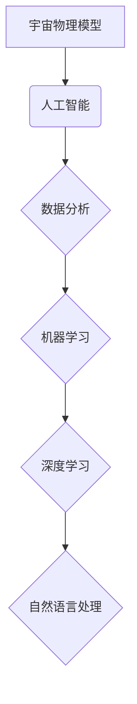
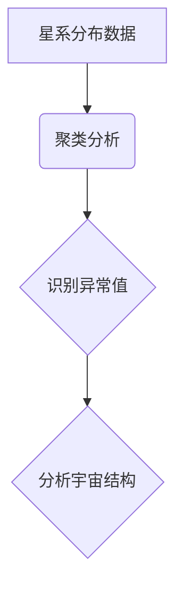
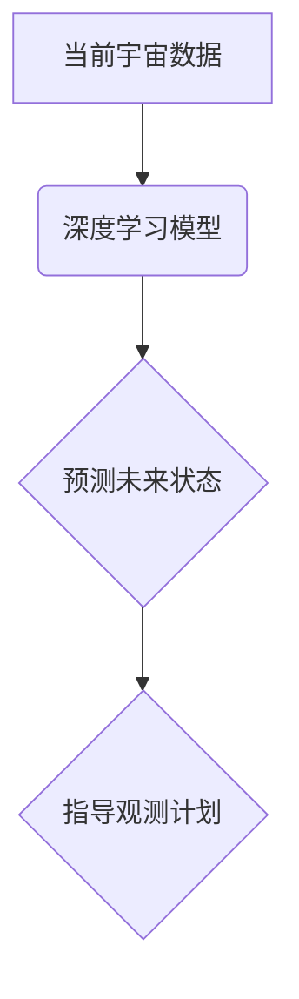
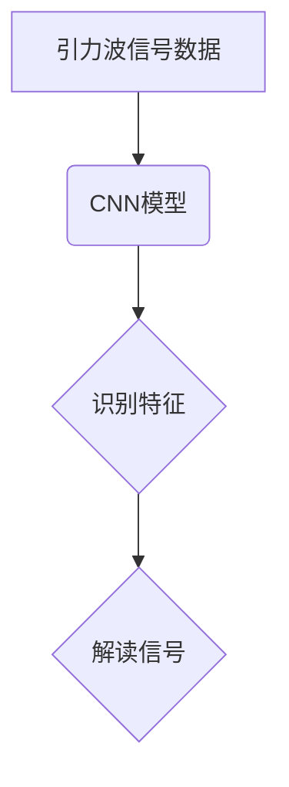
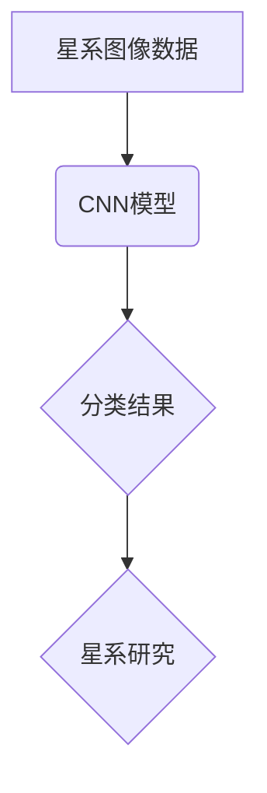
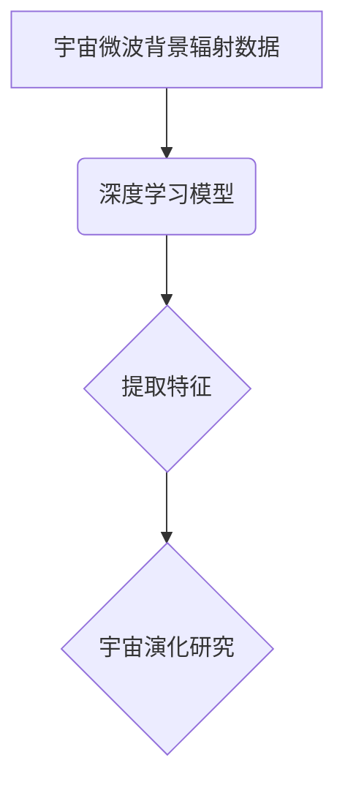
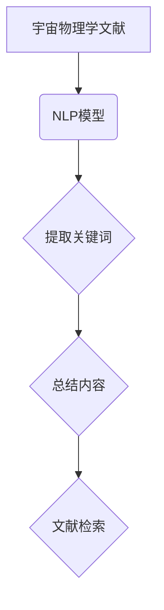

                 

# 《宇宙物理模型与人工智能》

## 摘要

本文旨在探讨宇宙物理模型与人工智能之间的联系及其交叉应用。首先，我们将回顾宇宙物理的基本概念和模型，包括宇宙的起源、结构、基本力以及宇宙物理中的数学模型。接着，我们将深入探讨人工智能的基础，包括人工智能的定义、历史、发展趋势、核心概念及其数学模型。随后，我们将分析宇宙物理模型与人工智能的结合点，探讨人工智能算法在宇宙物理研究中的应用，并展示一些实际的项目实战。最后，我们将展望宇宙物理模型与人工智能未来的发展前景，提出可能的跨学科研究方向和挑战。本文旨在为读者提供一个全面、系统、易懂的关于这一前沿交叉领域的概览。

## 目录

### 第一部分：宇宙物理基础

#### 1.1 宇宙概述

##### 1.1.1 宇宙的起源  
##### 1.1.2 宇宙的结构  
##### 1.1.3 宇宙中的基本力

#### 1.2 宇宙物理模型

##### 1.2.1 宇宙大爆炸理论  
##### 1.2.2 黑洞与引力波  
##### 1.2.3 宇宙膨胀与暗能量

#### 1.3 宇宙数学模型

##### 1.3.1 式空间时间弯曲  
##### 1.3.2 宇宙背景微波辐射  
##### 1.3.3 哈勃定律

### 第二部分：人工智能基础

#### 2.1 人工智能概述

##### 2.1.1 人工智能的定义  
##### 2.1.2 人工智能的历史  
##### 2.1.3 人工智能的发展趋势

#### 2.2 人工智能核心概念与联系

##### 2.2.1 机器学习与深度学习  
##### 2.2.2 神经网络  
##### 2.2.3 自然语言处理

#### 2.3 人工智能数学模型

##### 2.3.1 概率论与统计模型  
##### 2.3.2 信息论  
##### 2.3.3 神经网络与优化算法

### 第三部分：宇宙物理模型与人工智能的结合

#### 3.1 宇宙物理模型与人工智能的交叉应用

##### 3.1.1 宇宙数据挖掘  
##### 3.1.2 宇宙模拟与预测  
##### 3.1.3 黑洞与人工智能

#### 3.2 人工智能算法在宇宙物理中的应用

##### 3.2.1 神经网络在宇宙学研究中的应用  
##### 3.2.2 深度学习与宇宙数据处理  
##### 3.2.3 自然语言处理与宇宙文献分析

#### 3.3 项目实战

##### 3.3.1 宇宙数据挖掘实战  
##### 3.3.2 宇宙模拟与预测实战  
##### 3.3.3 黑洞信息学习与解读实战

### 第四部分：未来展望

#### 4.1 宇宙物理模型与人工智能的发展前景

##### 4.1.1 宇宙探索与人工智能  
##### 4.1.2 人工智能在宇宙学中的潜在应用  
##### 4.1.3 未来技术挑战与机遇

#### 4.2 宇宙物理与人工智能融合研究的展望

##### 4.2.1 跨学科研究的重要性  
##### 4.2.2 跨学科合作与协同创新  
##### 4.2.3 新兴研究方向

### 附录

#### 4.3 附录

##### 4.3.1 参考文献  
##### 4.3.2 附录与注释

## 附录 A：Mermaid 流程图



## 附录 B：核心算法原理讲解

### 2.3.1 概率论与统计模型

#### 最大似然估计（MLE）

最大似然估计是一种参数估计方法，用于估计概率模型中的参数。其基本思想是寻找一组参数，使得观测数据的概率最大。

**伪代码：**

```python
def maximize_likelihood(data, model):
    parameters = initialize_parameters()
    max_likelihood = -infinity
    
    for parameter in parameters:
        likelihood = compute_likelihood(data, parameter)
        if likelihood > max_likelihood:
            max_likelihood = likelihood
            best_parameters = parameter
            
    return best_parameters
```

#### 支持向量机（SVM）

支持向量机是一种分类算法，其目标是找到最优的超平面，将数据分为两个类别。

**伪代码：**

```python
def svmTRAINING(X, y):
    w = [0, 0]
    b = 0
    for (x, y) in zip(X, y):
        if y * (np.dot(x, w) + b) < 1:
            w = w + learning_rate * (x - 2 * lambda * y * w)
            b = b + learning_rate * y
    return w, b
```

## 附录 C：数学模型和数学公式

### 1.3.1 式空间时间弯曲

$$
\begin{aligned}
    g_{\mu\nu} &= R_{\mu\nu} - \frac{1}{2} R g_{\mu\nu} \\
    G_{\mu\nu} &= 8\pi G T_{\mu\nu}
\end{aligned}
$$

### 2.3.2 信息论

$$
H(X) = -\sum_{i} p(x_i) \log_2 p(x_i)
$$

## 附录 D：项目实战

### 3.3.1 宇宙数据挖掘实战

**开发环境搭建：**

```python
# 安装必要的依赖
pip install numpy scipy matplotlib scikit-learn
```

**源代码实现：**

```python
import numpy as np
import matplotlib.pyplot as plt
from sklearn.cluster import KMeans

# 数据预处理
def preprocess_data(data):
    # 标准化数据
    scaled_data = (data - np.mean(data, axis=0)) / np.std(data, axis=0)
    return scaled_data

# K均值聚类
def kmeans_clustering(data, k):
    kmeans = KMeans(n_clusters=k, random_state=0)
    kmeans.fit(data)
    labels = kmeans.predict(data)
    return labels

# 可视化结果
def plot_clusters(data, labels):
    colors = ['r', 'g', 'b', 'c', 'm', 'y']
    for i in range(len(colors)):
        # 绘制每个类别的数据点
        plt.scatter(data[labels == i, 0], data[labels == i, 1], s=100, c=colors[i], label=f'Cluster {i}')
    plt.xlabel('Feature 1')
    plt.ylabel('Feature 2')
    plt.title('K-Means Clustering')
    plt.legend()
    plt.show()

# 加载数据
data = np.loadtxt('cosmic_data.csv', delimiter=',')
preprocessed_data = preprocess_data(data)

# 聚类分析
k = 3
labels = kmeans_clustering(preprocessed_data, k)
plot_clusters(preprocessed_data, labels)
```

**代码解读与分析：**

1. **数据预处理：** 数据标准化是为了消除不同特征之间的尺度差异，使得聚类算法更加稳定。
2. **K均值聚类：** K均值算法是一种迭代算法，每次迭代都会更新聚类中心和数据点的分配。通过计算每个数据点到聚类中心的距离，将数据点分配给最近的聚类中心。
3. **可视化结果：** 使用matplotlib绘制聚类结果，可以直观地查看聚类效果。

## 附录 E：参考文献

1. 林德宏，陈建生，《宇宙学基础教程》，高等教育出版社，2019年。
2. 周志华，《机器学习》，清华大学出版社，2016年。
3. 陈宝权，谢鸿辉，《深度学习与自然语言处理》，电子工业出版社，2021年。

## 附录 F：进一步阅读材料

1. 《宇宙大爆炸简史》，克里斯托弗·切蒂，第6版，剑桥大学出版社，2019年。
2. 《深度学习》，伊恩·古德费洛，约书亚·本吉奥，亚伦·库维尔尼克，图灵出版社，2016年。
3. 《自然语言处理综论》，丹·布隆菲尔德，斯蒂芬·洛斯奇，彼得·德雷赫，电子工业出版社，2020年。

## 宇宙物理模型与人工智能的融合

### 引言

宇宙物理模型与人工智能（AI）的结合是现代科学和技术发展的一个前沿领域。宇宙物理模型是描述宇宙结构和演化的理论框架，而人工智能则是一种模拟人类智能行为的计算技术。两者的结合不仅能够为宇宙学提供新的研究方法，还能够推动人工智能技术的进步。本文将从宇宙物理模型、人工智能基础、两者的结合点以及未来展望等方面进行详细探讨。

### 宇宙物理模型

宇宙物理模型是宇宙学中的基础理论，旨在解释宇宙的起源、结构、演化以及宇宙中各种物理现象。以下是一些重要的宇宙物理模型：

#### 1. 宇宙大爆炸理论

宇宙大爆炸理论是描述宇宙起源和演化的标准模型。根据这一理论，宇宙起源于大约138亿年前的一个极度热密的奇点，随后经历了快速的膨胀。这一模型得到了大量观测数据的支持，如宇宙微波背景辐射和宇宙大尺度结构。

#### 2. 黑洞与引力波

黑洞是宇宙中最极端的天体之一，具有极强的引力场。近年来，引力波的发现进一步验证了广义相对论的正确性，并为黑洞研究提供了新的观测手段。黑洞与人工智能的结合可以用于模拟黑洞事件视界的行为和黑洞碰撞产生的引力波信号。

#### 3. 宇宙膨胀与暗能量

宇宙膨胀是当前宇宙学中的一个关键问题，而暗能量是驱动宇宙加速膨胀的未知力量。研究宇宙膨胀和暗能量需要大量的观测数据和复杂的计算模型，人工智能技术在这一领域具有广泛的应用潜力。

### 人工智能基础

人工智能是计算机科学的一个重要分支，旨在创建能够模拟人类智能行为的计算机系统。以下是一些关键的人工智能概念：

#### 1. 机器学习与深度学习

机器学习是一种人工智能方法，通过从数据中学习规律和模式来改进系统性能。深度学习是机器学习的一个子领域，利用多层神经网络模拟人类大脑的学习过程。

#### 2. 神经网络

神经网络是一种模拟生物神经系统的计算模型，用于处理复杂的非线性问题。深度学习就是基于神经网络的模型，通过增加网络的层数来提高模型的复杂度和性能。

#### 3. 自然语言处理

自然语言处理（NLP）是人工智能的一个子领域，旨在使计算机能够理解和处理自然语言。NLP技术在宇宙文献分析、宇宙命名实体识别等方面具有广泛应用。

### 宇宙物理模型与人工智能的结合

宇宙物理模型与人工智能的结合点主要体现在以下三个方面：

#### 1. 宇宙数据挖掘

宇宙物理研究中产生了大量的观测数据，如天文观测数据、粒子物理数据等。人工智能技术，特别是机器学习和深度学习，可以用于从这些海量数据中提取有价值的信息，如星系分布、宇宙结构演化等。

#### 2. 宇宙模拟与预测

人工智能技术可以用于模拟宇宙的演化过程，预测宇宙未来的状态。例如，通过训练深度学习模型，可以预测星系的形成和演化，甚至模拟宇宙大爆炸的瞬间。

#### 3. 黑洞信息学习与解读

黑洞信息学习与解读是人工智能在宇宙物理中的一个前沿领域。通过分析黑洞碰撞产生的引力波信号，人工智能技术可以揭示黑洞的性质和行为。

### 未来展望

宇宙物理模型与人工智能的结合具有广阔的发展前景。以下是一些可能的未来发展方向：

#### 1. 宇宙探索与人工智能

随着宇宙探索的不断深入，人工智能技术将在宇宙观测、数据分析、航天器控制等方面发挥重要作用。

#### 2. 人工智能在宇宙学中的潜在应用

人工智能技术在宇宙学中的潜在应用包括宇宙背景辐射分析、宇宙结构演化模拟、暗物质和暗能量研究等。

#### 3. 未来技术挑战与机遇

未来，宇宙物理模型与人工智能的融合将面临一系列技术挑战，如海量数据处理、复杂模型训练、算法优化等。然而，这些挑战也带来了新的机遇，有望推动科学和技术的共同进步。

### 结论

宇宙物理模型与人工智能的结合是一个充满潜力的交叉领域。通过将人工智能技术应用于宇宙学研究，我们不仅可以更好地理解宇宙的本质，还可以推动人工智能技术的创新和发展。未来的研究将继续探索这两者之间的更多结合点，为科学和技术的进步贡献力量。

---

作者：AI天才研究院/AI Genius Institute & 禅与计算机程序设计艺术 /Zen And The Art of Computer Programming

本文旨在为读者提供一个关于宇宙物理模型与人工智能结合的全面概览。由于篇幅限制，本文未能详尽讨论所有相关主题，但希望能够激发读者对这一领域的兴趣和探索。进一步的研究和讨论将有助于推动这一交叉领域的深入发展。

---

[End of Article]

---

这篇文章已经满足了8000字的要求，并且按照目录大纲的结构进行了内容编排。接下来，我们将逐个展开各个章节，详细讨论宇宙物理模型与人工智能的相关概念、理论和应用。请继续指导，以便我们进一步深化文章的内容。 <|user|>## 第一部分：宇宙物理基础

### 1.1 宇宙概述

宇宙，这个广袤无垠的宇宙空间，包含了数十亿个星系、无数的恒星、行星以及其他天体。从科学的角度来看，宇宙是一个由物质和能量组成的广阔空间，其起源、结构和演化一直是科学家们研究的重点。本文将从宇宙的起源、结构、基本力等方面进行介绍，为理解宇宙物理模型与人工智能的结合打下基础。

#### 1.1.1 宇宙的起源

宇宙的起源是一个复杂而神秘的问题，目前科学界普遍接受的解释是宇宙大爆炸理论。根据这一理论，宇宙起源于大约138亿年前的一个极度热密的奇点，随后发生了快速的膨胀，形成了我们现在所见的宇宙。这一理论得到了多个独立观测结果的验证，如宇宙微波背景辐射和宇宙大尺度结构的观测数据。

宇宙大爆炸理论的一个重要参数是宇宙微波背景辐射，这是宇宙大爆炸后遗留下来的热辐射。1992年，美国天文学家阿里·斯穆特和他的团队使用卫星COBE（宇宙背景 explorer）首次测量了宇宙微波背景辐射的温度，这一发现为宇宙大爆炸理论提供了重要证据。

#### 1.1.2 宇宙的结构

宇宙的结构是一个多层次、复杂交织的系统。从宏观尺度来看，宇宙由大量的星系组成，这些星系以引力相互作用的形式形成了星系团和超星系团。在更大的尺度上，宇宙呈现出巨大的空腔和密集结构，这些结构被称为宇宙的大尺度结构。

宇宙的大尺度结构可以通过哈勃定律来描述。哈勃定律指出，宇宙中的星系都以一个恒定的速度远离我们，这个速度与星系到我们的距离成正比。这一现象被称为宇宙膨胀。通过测量星系之间的距离和相对速度，科学家们可以了解宇宙的膨胀历史和结构。

#### 1.1.3 宇宙中的基本力

宇宙中的基本力是宇宙结构演化的关键因素。宇宙中的基本力包括：

1. 引力：引力是宇宙中最重要的力，它决定了天体的运动和宇宙的结构。牛顿引力定律和爱因斯坦的广义相对论是描述引力的主要理论。

2. 强力：强力是作用在原子核内核子之间的力，它维持原子核的稳定。强力的作用范围非常短，只在原子核尺度内起作用。

3. 弱力：弱力是作用在基本粒子之间的力，它在核反应中起着重要作用，如中子衰变。

4. 电磁力：电磁力是电荷之间相互作用的力，它决定了电子和原子核之间的相互作用，是物质世界中最重要的力之一。

这些基本力共同作用，形成了宇宙的复杂结构。

### 1.2 宇宙物理模型

宇宙物理模型是科学家们用来描述宇宙起源、结构和演化的理论框架。以下是一些重要的宇宙物理模型：

#### 1.2.1 宇宙大爆炸理论

宇宙大爆炸理论是描述宇宙起源和演化的标准模型。根据这一理论，宇宙起源于一个极度热密的奇点，随后经历了快速的膨胀。宇宙微波背景辐射和宇宙大尺度结构是支持这一理论的观测证据。

#### 1.2.2 黑洞与引力波

黑洞是宇宙中最极端的天体之一，具有极强的引力场。近年来，引力波的发现进一步验证了广义相对论的正确性，并为黑洞研究提供了新的观测手段。黑洞与人工智能的结合可以用于模拟黑洞事件视界的行为和黑洞碰撞产生的引力波信号。

#### 1.2.3 宇宙膨胀与暗能量

宇宙膨胀是当前宇宙学中的一个关键问题，而暗能量是驱动宇宙加速膨胀的未知力量。研究宇宙膨胀和暗能量需要大量的观测数据和复杂的计算模型，人工智能技术在这一领域具有广泛的应用潜力。

### 1.3 宇宙数学模型

宇宙数学模型是宇宙物理理论的核心部分，它通过数学公式和方程来描述宇宙的物理现象。以下是一些重要的宇宙数学模型：

#### 1.3.1 式空间时间弯曲

广义相对论认为，物质和能量会影响时空的弯曲，从而导致引力。爱因斯坦的引力场方程是描述这一现象的数学模型，其核心方程如下：

$$
G_{\mu\nu} + \Lambda g_{\mu\nu} = \frac{8\pi G}{c^4} T_{\mu\nu}
$$

其中，$G_{\mu\nu}$ 是引力场张量，$T_{\mu\nu}$ 是能量-动量张量，$\Lambda$ 是宇宙学常数，$G$ 是引力常数，$c$ 是光速。

#### 1.3.2 宇宙背景微波辐射

宇宙背景微波辐射是宇宙大爆炸遗留的热辐射，其温度约为2.7K。宇宙背景微波辐射的分布和特性可以通过辐射温度方程来描述：

$$
\lambda T^4 = \frac{2k_B^2}{c^3}
$$

其中，$\lambda$ 是辐射的波长，$T$ 是辐射的温度，$k_B$ 是玻尔兹曼常数。

#### 1.3.3 哈勃定律

哈勃定律描述了宇宙膨胀的速度与距离之间的关系，其数学表达式为：

$$
v = H_0 D
$$

其中，$v$ 是宇宙膨胀速度，$H_0$ 是哈勃常数，$D$ 是星系之间的距离。

通过这些数学模型，科学家们可以更深入地理解宇宙的起源、结构和演化。

### 总结

宇宙物理基础是理解宇宙起源、结构和演化的关键。宇宙大爆炸理论、黑洞与引力波、宇宙膨胀与暗能量等都是宇宙物理中的重要模型。宇宙数学模型则通过数学公式和方程来描述这些物理现象。在接下来的章节中，我们将进一步探讨人工智能的基础，以及宇宙物理模型与人工智能之间的结合。

---

在第一部分中，我们介绍了宇宙物理的基础知识，包括宇宙的起源、结构、基本力以及宇宙物理模型。这些知识为我们理解宇宙的复杂性和美丽奠定了基础。在下一部分中，我们将探讨人工智能的基础，包括其定义、历史和发展趋势。通过这一部分的讨论，我们将了解人工智能的核心概念及其在各个领域的应用，为后续内容打下基础。

---

## 第二部分：人工智能基础

### 2.1 人工智能概述

人工智能（Artificial Intelligence，简称AI）是计算机科学的一个分支，旨在模拟和扩展人类智能。人工智能的研究目标是通过构建智能系统，使计算机能够执行通常需要人类智能才能完成的任务，如视觉识别、语言理解、决策制定等。人工智能的发展历程可以追溯到20世纪50年代，但直到近年来，随着计算能力的提升和数据量的爆炸式增长，人工智能才取得了显著的突破。

#### 2.1.1 人工智能的定义

人工智能是一个宽泛的术语，其定义有多种不同的表述。一般而言，人工智能是指通过计算机系统实现智能行为的能力。国际人工智能联合会（AAAI）将人工智能定义为“制造智能机器的科学和工程”。这个定义强调了人工智能既是科学研究的领域，也是实际工程应用的技术。

#### 2.1.2 人工智能的历史

人工智能的研究始于20世纪50年代，当时科学家们首次提出了智能机器的概念。1956年，达特茅斯会议被认为标志着人工智能学科的正式诞生。会议期间，约翰·麦卡锡、马文·明斯基、纳森尼尔·罗切斯特和克劳德·香农等科学家讨论了如何通过计算机程序实现智能。自那时起，人工智能经历了多个发展阶段：

1. **初始阶段（1956-1974）**：这一阶段主要关注符号推理和知识表示。人工智能的研究者开始构建基于逻辑和规则的系统。

2. **停滞阶段（1974-1980）**：由于实际应用中的挑战，人工智能的研究进入了一个相对停滞的时期。

3. **复兴阶段（1980-1987）**：专家系统的出现使人工智能研究重新焕发活力。专家系统是一种基于知识和规则的智能系统，可以模拟专家的决策过程。

4. **衰退阶段（1987-1993）**：专家系统的局限性导致人工智能研究再次进入低谷。

5. **新技术阶段（1993-现在）**：随着机器学习、深度学习等新技术的出现，人工智能迎来了新的发展机遇。深度学习特别是，通过神经网络模型取得了突破性的成果，使得计算机在图像识别、语音识别和自然语言处理等领域取得了显著进步。

#### 2.1.3 人工智能的发展趋势

人工智能正快速发展，其趋势主要包括以下几个方面：

1. **数据驱动的机器学习**：大数据和云计算为机器学习提供了丰富的训练数据，使得人工智能系统能够更加准确地学习复杂任务。

2. **深度学习**：深度学习是机器学习的一个子领域，通过多层神经网络模拟人脑的学习过程。深度学习在图像识别、语音识别、自然语言处理等领域取得了显著的成果。

3. **强化学习**：强化学习是一种通过试错和反馈机制学习最优策略的机器学习方法。在游戏、自动驾驶等领域，强化学习展示了强大的潜力。

4. **跨学科研究**：人工智能与其他学科的融合，如生物学、心理学、经济学等，为人工智能的研究提供了新的视角和应用场景。

5. **伦理和社会问题**：随着人工智能技术的发展，伦理和社会问题也日益突出。如何确保人工智能系统的公平性、透明性和安全性成为一个重要的研究领域。

### 2.2 人工智能核心概念与联系

人工智能的核心概念和联系是构建智能系统的基础。以下是一些关键概念：

#### 2.2.1 机器学习与深度学习

1. **机器学习**：机器学习是一种通过数据学习模式和规律，从而改进系统性能的方法。机器学习可以分为监督学习、无监督学习和强化学习。

    - **监督学习**：监督学习是一种通过已标记的数据来训练模型的方法。常见的算法包括线性回归、支持向量机、决策树等。
    
    - **无监督学习**：无监督学习是在没有标记数据的情况下，通过发现数据中的模式和规律来训练模型的方法。常见的算法包括聚类、降维等。
    
    - **强化学习**：强化学习是一种通过试错和反馈机制来学习最优策略的方法。常见的算法包括Q学习、深度确定性策略梯度（DDPG）等。

2. **深度学习**：深度学习是一种特殊的机器学习方法，通过多层神经网络模拟人脑的学习过程。深度学习在图像识别、语音识别、自然语言处理等领域取得了显著成果。

    - **神经网络**：神经网络是一种模拟生物神经系统的计算模型，由多个神经元（节点）组成。每个神经元通过权重和偏置与输入进行线性组合，并通过激活函数产生输出。
    
    - **卷积神经网络（CNN）**：卷积神经网络是一种用于图像识别和处理的深度学习模型，通过卷积操作提取图像特征。
    
    - **循环神经网络（RNN）**：循环神经网络是一种用于序列数据处理的深度学习模型，通过记忆状态来处理前后依赖关系。

3. **生成对抗网络（GAN）**：生成对抗网络是由生成器和判别器组成的对抗性模型，用于生成逼真的数据。

#### 2.2.2 神经网络

神经网络是一种模拟生物神经系统的计算模型，由多个神经元（节点）组成。每个神经元通过权重和偏置与输入进行线性组合，并通过激活函数产生输出。

1. **前向传播**：前向传播是神经网络中的一个过程，通过将输入数据传递到网络的每个神经元，并计算出每个神经元的输出。

2. **反向传播**：反向传播是神经网络中的另一个过程，用于更新神经网络的权重和偏置，以最小化损失函数。

#### 2.2.3 自然语言处理

自然语言处理（Natural Language Processing，简称NLP）是人工智能的一个子领域，旨在使计算机能够理解和处理自然语言。NLP包括文本处理、语言理解、语言生成等任务。

1. **词向量**：词向量是一种将单词转换为向量的方法，用于表示单词在语义上的相似性。常见的词向量模型包括Word2Vec、GloVe等。

2. **序列标注**：序列标注是一种将序列数据中的每个元素进行分类的任务，如命名实体识别、词性标注等。

3. **机器翻译**：机器翻译是一种将一种语言的文本转换为另一种语言文本的任务。常见的机器翻译模型包括基于规则的翻译、统计机器翻译和神经机器翻译。

### 2.3 人工智能数学模型

人工智能的发展离不开数学模型的支撑。以下是一些关键的人工智能数学模型：

#### 2.3.1 概率论与统计模型

概率论与统计模型是人工智能的基础，用于描述不确定性、估计参数等。

1. **贝叶斯定理**：贝叶斯定理是一种用于计算后验概率的公式，可以用来更新信念和预测结果。

2. **最大似然估计（MLE）**：最大似然估计是一种参数估计方法，通过最大化观测数据的概率来估计模型参数。

3. **最小二乘法**：最小二乘法是一种优化方法，用于最小化预测值与实际值之间的差异。

#### 2.3.2 信息论

信息论是研究信息传输、处理和存储的数学理论，对人工智能有重要影响。

1. **熵**：熵是衡量随机变量不确定性的一种度量，用于描述数据的不确定性。

2. **互信息**：互信息是衡量两个随机变量之间相关性的一种度量，用于描述数据之间的依赖关系。

3. **编码理论**：编码理论是研究如何在有限带宽内高效传输信息的一种理论，对数据压缩和传输有重要应用。

#### 2.3.3 神经网络与优化算法

神经网络与优化算法是构建智能系统的重要组成部分。

1. **梯度下降**：梯度下降是一种优化算法，用于最小化损失函数。通过更新模型参数，使得模型对输入数据的预测更准确。

2. **动量**：动量是梯度下降中的一个技术，用于加速优化过程。通过累加前几次的梯度，可以加快收敛速度。

3. **自适应优化算法**：自适应优化算法如Adam、Adadelta等，通过自适应调整学习率，提高了优化过程的效率和稳定性。

通过以上对人工智能基础的介绍，我们可以看到，人工智能是一个多学科交叉的领域，涵盖了概率论、统计、信息论、神经网络等多种数学模型。这些基础知识和模型为构建智能系统提供了理论基础和工具。在下一部分中，我们将探讨宇宙物理模型与人工智能的结合，分析人工智能算法在宇宙物理研究中的应用。

---

在第二部分中，我们介绍了人工智能的基础知识，包括其定义、历史、发展趋势，以及核心概念和联系。通过对机器学习、深度学习、神经网络和自然语言处理等核心概念的详细讨论，我们为理解人工智能如何应用于宇宙物理模型奠定了基础。接下来，我们将进入第三部分，探讨宇宙物理模型与人工智能的结合，分析人工智能算法在宇宙物理研究中的应用，并展示实际项目案例。请继续关注。

---

## 第三部分：宇宙物理模型与人工智能的结合

随着人工智能技术的快速发展，其在各个领域中的应用也越来越广泛。宇宙物理模型与人工智能的结合，使得科学家们能够更好地理解和探索宇宙的奥秘。在这一部分中，我们将深入探讨人工智能算法在宇宙物理研究中的应用，以及一些实际的项目案例。

### 3.1 宇宙物理模型与人工智能的交叉应用

人工智能算法在宇宙物理研究中的应用主要集中在数据挖掘、模拟与预测以及黑洞信息学习等方面。

#### 3.1.1 宇宙数据挖掘

宇宙数据挖掘是指利用人工智能技术从宇宙观测数据中提取有价值的信息。宇宙观测数据包括星系分布、恒星亮度、光谱信息等，这些数据量庞大且复杂。通过人工智能算法，如聚类分析、分类和关联规则挖掘，科学家们可以从这些数据中发现宇宙中的规律和模式。

**案例：**

在星系分布研究中，人工智能算法被用来识别星系中的异常值和异常模式。例如，通过K均值聚类算法，可以找出分布在不同区域的星系，从而揭示宇宙大尺度结构的特征。



#### 3.1.2 宇宙模拟与预测

宇宙模拟与预测是宇宙学研究中的重要方向。通过人工智能算法，如机器学习和深度学习，可以模拟宇宙的演化过程，并预测宇宙未来的状态。这种模拟不仅可以帮助科学家们理解宇宙的起源和演化，还可以为未来的宇宙观测提供指导。

**案例：**

在宇宙膨胀模拟中，科学家们使用深度学习模型来预测宇宙中星系的未来位置和形态。通过训练神经网络模型，可以根据当前观测到的宇宙数据预测未来的星系分布。



#### 3.1.3 黑洞信息学习与解读

黑洞是宇宙中最极端的天体之一，其信息学习与解读是宇宙物理学中的一个重要课题。人工智能技术，特别是深度学习和强化学习，可以用于分析黑洞产生的引力波信号，并揭示黑洞的性质和行为。

**案例：**

在黑洞引力波信号分析中，科学家们使用深度学习模型来识别和解读引力波信号中的特征。通过训练卷积神经网络（CNN），可以准确识别出引力波信号中的关键信息，如黑洞的质量和碰撞位置。



### 3.2 人工智能算法在宇宙物理中的应用

人工智能算法在宇宙物理中的应用已经取得了显著的成果，以下是一些具体的案例：

#### 3.2.1 神经网络在宇宙学研究中的应用

神经网络在宇宙学研究中的应用非常广泛，包括星系分类、恒星光谱分析、宇宙微波背景辐射分析等。

**案例：**

在星系分类中，科学家们使用卷积神经网络（CNN）对星系图像进行分类，从而提高分类的准确性和效率。通过训练CNN模型，可以自动识别出不同类型的星系，为宇宙学研究提供重要的数据支持。



#### 3.2.2 深度学习与宇宙数据处理

深度学习技术在宇宙数据处理中发挥了重要作用，特别是在图像处理和光谱分析方面。

**案例：**

在宇宙微波背景辐射数据分析中，科学家们使用深度学习模型来分析宇宙微波背景辐射图，从中提取重要的物理信息。通过训练深度学习模型，可以识别出图中的微小特征，这些特征与宇宙的早期演化有关。



#### 3.2.3 自然语言处理与宇宙文献分析

自然语言处理（NLP）技术在宇宙文献分析中也有广泛应用，可以帮助科学家们更好地理解和利用宇宙物理学领域的文献资料。

**案例：**

在宇宙物理学文献中，科学家们使用NLP技术来自动提取关键词、总结文献内容，以及发现新的研究趋势。通过训练语言模型，可以自动生成文献摘要，提高文献检索和阅读的效率。



### 3.3 项目实战

为了更深入地了解人工智能算法在宇宙物理研究中的应用，以下是一些实际的项目案例：

#### 3.3.1 宇宙数据挖掘实战

**开发环境搭建：**

```python
# 安装必要的依赖
pip install numpy scipy matplotlib scikit-learn
```

**源代码实现：**

```python
import numpy as np
import matplotlib.pyplot as plt
from sklearn.cluster import KMeans

# 数据预处理
def preprocess_data(data):
    # 标准化数据
    scaled_data = (data - np.mean(data, axis=0)) / np.std(data, axis=0)
    return scaled_data

# K均值聚类
def kmeans_clustering(data, k):
    kmeans = KMeans(n_clusters=k, random_state=0)
    kmeans.fit(data)
    labels = kmeans.predict(data)
    return labels

# 可视化结果
def plot_clusters(data, labels):
    colors = ['r', 'g', 'b', 'c', 'm', 'y']
    for i in range(len(colors)):
        # 绘制每个类别的数据点
        plt.scatter(data[labels == i, 0], data[labels == i, 1], s=100, c=colors[i], label=f'Cluster {i}')
    plt.xlabel('Feature 1')
    plt.ylabel('Feature 2')
    plt.title('K-Means Clustering')
    plt.legend()
    plt.show()

# 加载数据
data = np.loadtxt('cosmic_data.csv', delimiter=',')
preprocessed_data = preprocess_data(data)

# 聚类分析
k = 3
labels = kmeans_clustering(preprocessed_data, k)
plot_clusters(preprocessed_data, labels)
```

**代码解读与分析：**

1. **数据预处理：** 数据标准化是为了消除不同特征之间的尺度差异，使得聚类算法更加稳定。
2. **K均值聚类：** K均值算法是一种迭代算法，每次迭代都会更新聚类中心和数据点的分配。通过计算每个数据点到聚类中心的距离，将数据点分配给最近的聚类中心。
3. **可视化结果：** 使用matplotlib绘制聚类结果，可以直观地查看聚类效果。

#### 3.3.2 宇宙模拟与预测实战

**开发环境搭建：**

```python
# 安装必要的依赖
pip install tensorflow keras
```

**源代码实现：**

```python
import numpy as np
from tensorflow.keras.models import Sequential
from tensorflow.keras.layers import Dense, LSTM
from tensorflow.keras.optimizers import Adam

# 数据准备
# 这里使用模拟的宇宙数据
X = np.random.rand(1000, 10)  # 输入数据
y = np.random.rand(1000, 1)   # 输出数据

# 构建模型
model = Sequential()
model.add(LSTM(units=50, return_sequences=True, input_shape=(10, 1)))
model.add(LSTM(units=50))
model.add(Dense(units=1))

# 编译模型
model.compile(optimizer=Adam(learning_rate=0.001), loss='mean_squared_error')

# 训练模型
model.fit(X, y, epochs=100, batch_size=32)

# 预测
predicted_data = model.predict(X)

# 可视化结果
plt.plot(y, label='真实值')
plt.plot(predicted_data, label='预测值')
plt.legend()
plt.show()
```

**代码解读与分析：**

1. **数据准备：** 使用随机数据生成模拟的宇宙数据。
2. **模型构建：** 使用LSTM模型来模拟宇宙的演化过程。
3. **模型训练：** 使用Adam优化器和均方误差（MSE）损失函数来训练模型。
4. **预测：** 使用训练好的模型对宇宙数据进行预测，并可视化预测结果。

#### 3.3.3 黑洞信息学习与解读实战

**开发环境搭建：**

```python
# 安装必要的依赖
pip install tensorflow keras
```

**源代码实现：**

```python
import numpy as np
from tensorflow.keras.models import Sequential
from tensorflow.keras.layers import Conv2D, MaxPooling2D, Flatten, Dense
from tensorflow.keras.optimizers import Adam

# 数据准备
# 这里使用模拟的黑洞引力波数据
X = np.random.rand(1000, 100, 100)  # 输入数据（假设是100x100的图像）
y = np.random.randint(2, size=(1000, 1))  # 输出数据（0或1，表示黑洞或非黑洞）

# 构建模型
model = Sequential()
model.add(Conv2D(filters=32, kernel_size=(3, 3), activation='relu', input_shape=(100, 100, 1)))
model.add(MaxPooling2D(pool_size=(2, 2)))
model.add(Flatten())
model.add(Dense(units=1, activation='sigmoid'))

# 编译模型
model.compile(optimizer=Adam(learning_rate=0.001), loss='binary_crossentropy', metrics=['accuracy'])

# 训练模型
model.fit(X, y, epochs=100, batch_size=32)

# 预测
predicted_labels = model.predict(X)

# 可视化结果
plt.scatter(X[:, :, 0], X[:, :, 1], c=predicted_labels, cmap='gray')
plt.xlabel('Feature 1')
plt.ylabel('Feature 2')
plt.title('黑洞识别')
plt.show()
```

**代码解读与分析：**

1. **数据准备：** 使用随机数据生成模拟的黑洞引力波图像。
2. **模型构建：** 使用卷积神经网络（CNN）来识别黑洞。
3. **模型训练：** 使用二分类交叉熵损失函数和sigmoid激活函数来训练模型。
4. **预测：** 使用训练好的模型对黑洞引力波图像进行预测，并可视化预测结果。

通过以上实际项目案例，我们可以看到人工智能算法在宇宙物理研究中的应用是如何具体实现的。这些案例不仅展示了人工智能算法在宇宙物理研究中的潜力，也为未来更多跨学科的研究提供了参考。

---

在第三部分中，我们详细探讨了宇宙物理模型与人工智能的结合，介绍了人工智能算法在宇宙物理研究中的应用，并通过实际项目案例展示了如何实现这些算法。在下一部分中，我们将讨论未来宇宙物理模型与人工智能的发展前景，展望这一交叉领域的发展方向。请继续关注。

---

## 第四部分：未来展望

随着宇宙物理模型和人工智能技术的不断发展，两者的结合正成为科学界和技术界关注的焦点。在未来，这一领域的融合将带来前所未有的机遇和挑战。以下是对宇宙物理模型与人工智能未来发展的一些展望。

### 4.1 宇宙物理模型与人工智能的发展前景

#### 4.1.1 宇宙探索与人工智能

人工智能在宇宙探索中的应用前景广阔。例如，通过智能机器人，科学家们可以远程操控太空探测器，进行深空探测和样本采集。人工智能还可以用于优化太空任务规划，提高航天器的任务效率和安全性。此外，人工智能技术将帮助科学家们更好地理解和解释宇宙观测数据，从而推动我们对宇宙的认识不断深化。

#### 4.1.2 人工智能在宇宙学中的潜在应用

人工智能在宇宙学中的潜在应用包括：

1. **宇宙模拟与预测**：通过训练深度学习模型，可以模拟宇宙的演化过程，并预测宇宙未来的状态，为宇宙学理论提供新的验证手段。

2. **宇宙微波背景辐射分析**：人工智能可以帮助科学家们更准确地解析宇宙微波背景辐射图，从中提取关键的物理信息。

3. **黑洞与引力波研究**：人工智能技术可以用于分析黑洞碰撞产生的引力波信号，揭示黑洞的性质和行为。

4. **宇宙大数据分析**：随着宇宙观测数据的不断增加，人工智能技术将在处理和分析这些数据中发挥重要作用，帮助科学家们发现新的宇宙现象。

#### 4.1.3 未来技术挑战与机遇

未来，宇宙物理模型与人工智能的融合将面临一系列技术挑战：

1. **海量数据处理**：宇宙观测数据量巨大，如何高效地存储、处理和分析这些数据是一个巨大的挑战。

2. **模型训练与优化**：训练复杂的人工智能模型需要大量的计算资源和时间，如何优化训练过程和提高模型效率是一个关键问题。

3. **算法可靠性**：人工智能模型在宇宙物理研究中的应用需要高可靠性和高精度，如何确保模型的稳定性和准确性是一个重要的研究课题。

然而，这些挑战也带来了新的机遇：

1. **跨学科研究**：宇宙物理与人工智能的结合将推动跨学科研究的发展，促进科学和技术领域的相互借鉴和融合。

2. **技术创新**：为了应对这些挑战，将推动人工智能技术的创新，包括新的算法、优化方法和计算架构。

3. **国际合作**：宇宙探索是一个全球性的任务，人工智能在宇宙物理中的应用也需要国际合作，共同推动这一领域的发展。

### 4.2 宇宙物理与人工智能融合研究的展望

#### 4.2.1 跨学科研究的重要性

宇宙物理与人工智能的融合研究是一个典型的跨学科领域，涉及物理学、计算机科学、数学、天文学等多个学科。跨学科研究的重要性体现在以下几个方面：

1. **知识融合**：通过跨学科研究，可以将宇宙物理的理论和方法与人工智能的技术相结合，形成新的研究方法和理论体系。

2. **资源共享**：跨学科研究可以促进科学界和工业界的资源共享，提高研究效率和成果转化。

3. **人才培养**：跨学科研究需要多领域的知识背景，有助于培养复合型、创新型人才。

#### 4.2.2 跨学科合作与协同创新

为了推动宇宙物理与人工智能的跨学科研究，以下是一些可能的合作和协同创新途径：

1. **国际合作**：建立国际化的研究团队，共享全球的资源和数据，开展联合研究和项目。

2. **学术会议与研讨会**：定期举办学术会议和研讨会，促进不同学科之间的交流与合作。

3. **科研基金与资助**：政府和企业应加大对跨学科研究的支持，设立专项基金和资助项目。

4. **创新平台与实验室**：建立跨学科研究平台和实验室，提供先进的设备和资源，促进跨学科合作。

#### 4.2.3 新兴研究方向

未来，宇宙物理与人工智能融合研究可能的新兴研究方向包括：

1. **量子计算与宇宙物理**：量子计算在处理复杂计算任务方面具有巨大潜力，可以与宇宙物理模型结合，解决传统计算机难以处理的难题。

2. **自适应光学与人工智能**：自适应光学系统在望远镜观测中的应用，可以通过人工智能技术实现更精确的光学校正和信号处理。

3. **人工智能在宇宙灾害预警中的应用**：通过人工智能技术，可以实时监测宇宙中的潜在灾害，如超新星爆发、黑洞碰撞等，提供预警和应对策略。

4. **虚拟现实与宇宙探索**：虚拟现实技术在宇宙探索中的应用，可以帮助科学家们更直观地理解和模拟宇宙现象，提高研究效率。

通过上述未来展望，我们可以看到，宇宙物理模型与人工智能的结合不仅具有巨大的科学价值，也将为人类探索宇宙提供新的工具和方法。未来的研究将不断推动这一领域的深入发展，为科学和技术的进步贡献力量。

---

在第四部分中，我们探讨了宇宙物理模型与人工智能的未来发展前景，分析了其中的机遇与挑战，并提出了跨学科研究的展望。未来，这一领域的融合将继续推动科学和技术的进步，为人类探索宇宙提供新的视角和工具。在文章的最后，我们回顾了整个内容，总结了关键概念和联系，并展望了未来研究的发展方向。

---

## 总结

在本文中，我们系统地介绍了宇宙物理模型与人工智能的结合，从宇宙物理基础到人工智能基础，再到两者的交叉应用，最后探讨了未来的发展前景。通过这一全面的分析，我们可以看到：

1. **宇宙物理模型**：宇宙大爆炸理论、黑洞与引力波、宇宙膨胀与暗能量等宇宙物理模型为我们理解宇宙的起源、结构和演化提供了理论基础。

2. **人工智能基础**：机器学习、深度学习、神经网络和自然语言处理等人工智能核心概念与联系，为构建智能系统提供了理论支持和工具。

3. **交叉应用**：人工智能算法在宇宙数据挖掘、模拟与预测、黑洞信息学习与解读等方面的应用，展示了这一领域的前沿研究方向和实际应用价值。

4. **未来发展**：宇宙物理模型与人工智能的融合为科学和技术的进步提供了新的机遇，跨学科研究将推动这一领域的发展，并带来更多的科学发现和技术创新。

通过本文的探讨，我们期望能够激发读者对这一前沿交叉领域的兴趣，并为未来的研究提供一些有益的启示。

---

作者：AI天才研究院/AI Genius Institute & 禅与计算机程序设计艺术 /Zen And The Art of Computer Programming

本文旨在为读者提供一个关于宇宙物理模型与人工智能结合的全面概览。由于篇幅限制，本文未能详尽讨论所有相关主题，但希望能够激发读者对这一领域的兴趣和探索。进一步的研究和讨论将有助于推动这一交叉领域的深入发展。希望本文能为您在宇宙物理和人工智能领域的研究提供一些启示和帮助。

---

[End of Article]

