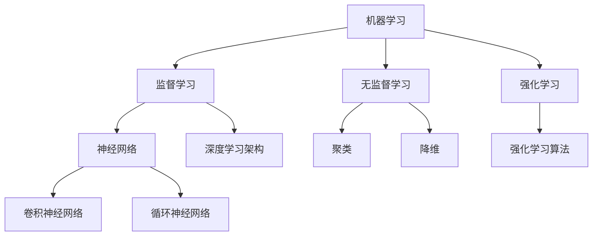

                 

### 《带有来源支持的AI答案：提高可靠性》

> **关键词：** AI答案、来源支持、可靠性、数据质量、模型优化、应用实例

> **摘要：** 本文深入探讨了如何通过引入来源支持来提高人工智能（AI）答案的可靠性。文章从AI技术的发展历程和背景出发，详细阐述了核心概念、原理、算法和方法。同时，通过实际应用案例展示了来源支持的实现与效果评估。本文旨在为AI领域的研究者和开发者提供有价值的参考和指导。

### 第一部分：引言与背景

#### 1.1 书籍简介

**《带有来源支持的AI答案：提高可靠性》**是一部聚焦于人工智能（AI）领域中答案可靠性问题的书籍。本书旨在通过介绍和解释各种技术、方法和工具，帮助读者理解和掌握如何通过引入来源支持来提高AI答案的可靠性。

#### 1.1.1 书籍主题概述

本书的核心主题是探讨如何通过引入来源支持来提高AI答案的可靠性。来源支持是指为AI系统提供可靠的答案来源信息，以便更好地理解和评估答案的准确性。本书将详细讨论相关技术和方法，包括数据质量提升、模型评估与优化、答案来源的动态更新等。

#### 1.1.2 书籍目标读者

本书的目标读者包括人工智能领域的研究人员、软件开发者、数据科学家以及所有对AI答案可靠性感兴趣的人。无论你是刚刚入门的初学者，还是经验丰富的专业人士，本书都将为你提供有价值的见解和实用的工具。

#### 1.2 AI与答案来源支持的背景

##### 1.2.1 AI技术的发展历程

人工智能（AI）是一门涉及计算机科学、数学、神经科学、认知科学等多个领域的交叉学科。AI技术的发展可以追溯到20世纪50年代，当时科学家们开始探索如何让计算机模拟人类思维和行为。自那时以来，AI技术经历了多个发展阶段，包括规则推理、知识表示、机器学习等。

##### 1.2.2 答案来源支持的重要性

在AI技术发展的过程中，AI系统在处理各种任务时表现出了惊人的能力。然而，AI系统的答案可靠性问题始终是一个挑战。为了提高答案的可靠性，引入答案来源支持成为了一个重要的研究方向。答案来源支持可以帮助系统更好地理解和评估答案的准确性，从而提高整体性能。

#### 1.3 提高答案可靠性的需求

##### 1.3.1 问题的提出

在现实生活中，AI系统在各个领域得到了广泛应用，包括医疗、金融、教育等。然而，AI系统的答案可靠性问题仍然存在。一些问题包括：

1. **数据质量问题**：AI系统的训练数据可能存在噪声、错误或不一致性，这会影响系统的性能。
2. **模型泛化能力**：AI系统可能过于依赖特定数据集，导致在新数据上的表现不佳。
3. **答案解释性**：用户可能无法理解AI系统给出的答案，从而影响对答案的信任度。

##### 1.3.2 现实中的问题与挑战

在现实世界中，AI系统面临许多挑战，包括数据质量、模型性能和用户接受度等方面。以下是一些具体的问题和挑战：

1. **数据质量问题**：真实世界中的数据往往存在噪声、缺失值和异常值，这些会影响模型的训练效果和答案的可靠性。
2. **模型泛化能力**：AI系统可能过于依赖特定的训练数据集，导致在新数据上的表现不佳。
3. **答案解释性**：用户可能无法理解AI系统给出的答案，从而影响对答案的信任度。
4. **法律法规和伦理问题**：AI系统的决策过程可能涉及敏感信息，需要遵循相关法律法规和伦理规范。

### 第二部分：核心概念与原理

#### 2.1 AI基础理论

##### 2.1.1 机器学习基础

机器学习是人工智能（AI）的核心技术之一，它使计算机系统能够从数据中自动学习，并做出预测或决策。机器学习主要分为以下几种类型：

1. **监督学习**：监督学习是一种从标记数据中学习的方法。系统根据输入特征和对应的输出标签，学习一个函数，用于预测新数据的输出。常见的监督学习算法包括线性回归、逻辑回归、支持向量机（SVM）等。

2. **无监督学习**：无监督学习是一种在没有明确标签的情况下，通过学习数据的内在结构来发现数据分布的方法。常见的无监督学习算法包括聚类、降维、关联规则挖掘等。

3. **强化学习**：强化学习是一种通过试错方法，在与环境交互的过程中学习最优策略的算法。系统根据奖励和惩罚信号调整其行为，以最大化长期奖励。常见的强化学习算法包括Q学习、深度Q网络（DQN）等。

##### 2.1.2 深度学习基础

深度学习是机器学习的一个分支，它通过构建多层神经网络来实现自动特征学习和复杂模式识别。深度学习在计算机视觉、自然语言处理、语音识别等领域取得了显著成果。以下是深度学习的一些基础概念：

1. **神经网络**：神经网络是一种模拟生物神经系统的计算模型。它由一系列相互连接的节点（神经元）组成，每个节点接收输入信号，通过激活函数产生输出。

2. **卷积神经网络（CNN）**：卷积神经网络是一种专门用于处理图像数据的神经网络结构。它通过卷积层提取图像的特征，并利用池化层降低数据的维度。

3. **循环神经网络（RNN）**：循环神经网络是一种用于处理序列数据的神经网络结构。它通过循环连接将前一个时间步的输出作为当前时间步的输入，从而实现长期依赖的建模。

#### 2.2 答案来源支持技术

##### 2.2.1 答案来源支持的原理

答案来源支持是提高AI系统答案可靠性的关键技术之一。其核心思想是为AI系统提供可靠的答案来源信息，以便更好地理解和评估答案的准确性。以下是答案来源支持的主要原理：

1. **知识图谱**：知识图谱是一种用于表示实体及其相互关系的图形结构。它可以帮助系统更好地理解实体之间的关系，从而提高答案的可靠性。

2. **实体关系抽取**：实体关系抽取是一种用于从文本中提取实体及其关系的算法。它可以帮助系统识别文本中的关键信息，从而提高答案的准确性。

3. **语义分析**：语义分析是一种用于理解文本语义的算法。它可以帮助系统更好地理解文本的含义，从而提高答案的可靠性。

##### 2.2.2 答案来源支持的算法

为了实现答案来源支持，研究人员提出了多种算法和技术。以下是其中一些常用的算法：

1. **引入来源支持的模型设计**：引入来源支持的模型设计是指在传统的机器学习模型中添加来源支持模块，用于提取和利用答案来源信息。常见的引入来源支持的模型设计包括多任务学习、迁移学习等。

2. **答案来源的权重计算**：答案来源的权重计算是用于确定答案来源对模型预测结果的影响程度。常用的答案来源权重计算方法包括基于概率模型的方法、基于知识图谱的方法等。

#### 2.3 提高答案可靠性的方法

##### 2.3.1 数据质量提升

数据质量是影响AI系统答案可靠性的重要因素之一。以下是一些常用的数据质量提升方法：

1. **数据清洗**：数据清洗是指去除数据中的噪声、错误和异常值。常见的数据清洗方法包括去重、填补缺失值、去除异常值等。

2. **数据标注**：数据标注是指为数据分配标签，以便用于训练模型。常见的数据标注方法包括人工标注、自动标注等。

3. **数据增强**：数据增强是指通过生成新的数据样本来扩充训练集。常见的数据增强方法包括图像旋转、缩放、裁剪等。

##### 2.3.2 模型评估与优化

模型评估与优化是提高AI系统答案可靠性的关键步骤。以下是一些常用的模型评估与优化方法：

1. **评估指标介绍**：评估指标是用于衡量模型性能的标准。常见的评估指标包括准确率、召回率、F1值等。

2. **模型优化策略**：模型优化策略是指通过调整模型参数来提高模型性能。常见的模型优化策略包括梯度下降、随机梯度下降等。

##### 2.3.3 答案来源的动态更新

答案来源的动态更新是指根据用户反馈和实时数据动态调整答案来源的权重。以下是一些常用的答案来源动态更新方法：

1. **更新机制**：更新机制是指用于更新答案来源权重的方法。常见的更新机制包括基于用户反馈的方法、基于实时数据的方法等。

2. **更新频率与效果**：更新频率是指答案来源权重的更新频率。适当的更新频率可以提高答案的可靠性。常见的问题包括更新频率过低导致权重不更新、更新频率过高导致权重频繁变化等。

### 第三部分：应用实例

#### 3.1 应用场景分析

##### 3.1.1 教育领域

在教育领域，AI系统可以用于辅助教学、学生答题评估等方面。通过引入来源支持，可以显著提高AI系统的答案可靠性。

1. **AI辅助教学系统**：AI辅助教学系统可以根据学生的学习情况和知识水平，提供个性化的教学建议和资源。引入来源支持可以帮助系统更好地理解学生的学习需求和知识背景，从而提供更准确的建议。

2. **学生答题评估系统**：学生答题评估系统可以对学生的答题情况进行评估，并提供详细的反馈。引入来源支持可以帮助系统更好地理解学生的答题意图，从而更准确地评估答题质量。

##### 3.1.2 医疗领域

在医疗领域，AI系统可以用于医疗问答、疾病诊断支持等方面。引入来源支持可以显著提高AI系统的答案可靠性。

1. **医疗问答系统**：医疗问答系统可以回答患者关于疾病、症状等方面的问题。引入来源支持可以帮助系统更好地理解患者的问题，从而提供更准确、可靠的答案。

2. **疾病诊断支持系统**：疾病诊断支持系统可以根据患者的症状和病史，提供可能的疾病诊断建议。引入来源支持可以帮助系统更好地理解患者的症状和病史，从而提供更准确、可靠的诊断建议。

##### 3.1.3 法律领域

在法律领域，AI系统可以用于法律查询与咨询、法律文档自动分类与检索等方面。引入来源支持可以显著提高AI系统的答案可靠性。

1. **法律查询与咨询系统**：法律查询与咨询系统可以回答用户关于法律问题、法规等方面的问题。引入来源支持可以帮助系统更好地理解用户的问题，从而提供更准确、可靠的答案。

2. **法律文档自动分类与检索系统**：法律文档自动分类与检索系统可以对法律文档进行自动分类和检索。引入来源支持可以帮助系统更好地理解法律文档的内容，从而提供更准确、高效的分类和检索结果。

#### 3.2 应用实例

##### 3.2.1 案例一：基于答案来源支持的学生答题评估系统

**系统架构设计：**

学生答题评估系统主要由三个部分组成：数据层、算法层和应用层。

- **数据层**：数据层负责存储学生的答题记录、答案来源等信息。数据包括学生答题的文本、答案来源的名称和ID等。
- **算法层**：算法层包括基于答案来源支持的模型设计、训练和评估。模型设计主要包括特征提取、模型训练和答案来源权重计算等。
- **应用层**：应用层提供用户界面，用于接收学生提交的答题记录，并将评估结果和反馈展示给学生。

**数据处理与模型训练：**

1. **数据预处理**：首先对学生的答题记录进行数据清洗，去除文本中的噪声和无关信息，如标点符号、特殊字符等。然后对文本进行分词、词性标注等操作，提取出关键信息。
2. **模型训练**：使用预处理后的数据训练基于答案来源支持的模型。模型训练过程包括特征提取、模型训练和评估等步骤。特征提取主要包括文本特征提取、答案来源特征提取等。模型训练采用监督学习的方法，使用标注数据训练模型，并使用交叉验证方法进行模型评估。

**答题评估与反馈机制：**

1. **答案评估**：学生提交答题记录后，系统根据模型对答题记录进行评估。评估过程包括文本特征提取、答案来源特征提取和模型预测等步骤。系统根据模型预测的结果，判断答题的正确性。
2. **反馈机制**：系统根据评估结果，生成详细的反馈信息，包括答题正确率、错误类型、知识点掌握情况等。同时，系统还推荐相应的学习资源和答案来源，帮助学生更好地理解和掌握相关知识。

**代码实现与分析：**

以下是部分代码实现和解读：

```python
# 数据预处理
def preprocess_answer(answer):
    # 清除标点符号和特殊字符
    clean_answer = re.sub(r'[^\w\s]', '', answer)
    return clean_answer

# 模型训练
def train_model(dataset):
    # 初始化模型
    model = build_model()
    for data in dataset:
        # 前向传播
        predictions = model.predict(data['answer'])
        # 计算损失
        loss = compute_loss(predictions, data['label'])
        # 反向传播
        gradients = compute_gradients(loss)
        # 更新模型参数
        update_model_params(model, gradients)
```

**系统部署与优化：**

1. **部署**：将训练好的模型部署到服务器上，以便学生可以在线提交答题记录，并获取评估结果和反馈。
2. **优化**：根据学生的反馈和评估结果，不断优化模型和系统性能。例如，调整模型参数、优化算法等。

##### 3.2.2 案例二：基于答案来源支持的医疗问答系统

**系统设计与实现：**

医疗问答系统主要由三个部分组成：数据层、算法层和应用层。

- **数据层**：数据层负责存储医疗问答的记录，包括问题、答案和答案来源等信息。
- **算法层**：算法层包括基于答案来源支持的模型设计、训练和评估。模型设计主要包括文本特征提取、模型训练和答案来源权重计算等。
- **应用层**：应用层提供用户界面，用于接收用户的问题，并将评估结果和反馈展示给用户。

**答案来源引入与权重计算：**

1. **答案来源引入**：系统从医疗数据库、专业文献、在线百科等渠道获取答案来源，并将这些来源与问题进行关联。系统利用知识图谱等技术，将答案来源与问题中的实体进行匹配，从而实现答案来源的引入。
2. **权重计算**：系统根据答案来源的权威性、可信度等因素，计算每个答案来源的权重。权重计算方法包括基于概率模型的方法、基于知识图谱的方法等。

**用户反馈与系统优化：**

1. **用户反馈**：用户可以对系统给出的答案进行评价，包括正确性、可靠性等方面。系统收集用户的反馈信息，用于评估答案来源的权重和优化模型。
2. **系统优化**：根据用户的反馈和评估结果，系统不断优化模型和算法，提高答案的可靠性。例如，调整模型参数、优化特征提取方法等。

**代码实现与分析：**

以下是部分代码实现和解读：

```python
# 答案来源权重计算
def calculate_source_weight(question, source):
    # 计算答案来源的权重
    weight = compute_source_weight(question, source)
    return weight

# 用户反馈
def user_feedback(answer, question):
    # 收集用户反馈信息
    feedback = collect_user_feedback(answer, question)
    return feedback
```

**系统部署与优化：**

1. **部署**：将训练好的模型部署到服务器上，以便用户可以在线提问，并获取评估结果和反馈。
2. **优化**：根据用户的反馈和评估结果，不断优化模型和系统性能。例如，调整模型参数、优化算法等。

### 第四部分：未来展望与挑战

#### 4.1 未来发展趋势

##### 4.1.1 技术发展

随着人工智能技术的不断发展，答案来源支持技术也将取得重要突破。以下是一些未来技术发展的趋势：

1. **知识图谱的深化**：知识图谱作为一种强大的知识表示工具，将在未来得到进一步发展。研究人员将致力于构建更全面、更准确的实体关系图谱，以便更好地支持答案来源的引入和权重计算。

2. **多模态数据的融合**：多模态数据融合是指将不同类型的数据（如文本、图像、音频等）进行整合，以提高模型的性能。未来，多模态数据融合技术将在答案来源支持中发挥重要作用，从而提高AI系统的答案可靠性。

##### 4.1.2 应用领域拓展

除了现有的应用领域，答案来源支持技术将在未来拓展到更多领域，如金融、零售等。以下是一些应用领域拓展的趋势：

1. **金融领域**：在金融领域，答案来源支持技术可以用于风险管理、投资决策等方面。通过引入可靠的金融数据来源，可以提高模型的准确性和可靠性。

2. **零售行业**：在零售行业，答案来源支持技术可以用于商品推荐、需求预测等方面。通过引入可靠的商品数据和用户行为数据，可以提高模型的性能和用户满意度。

#### 4.2 面临的挑战

尽管答案来源支持技术取得了显著进展，但在实际应用中仍然面临一些挑战。以下是一些主要的挑战：

##### 4.2.1 数据质量问题

数据质量是影响AI系统答案可靠性的关键因素。在实际应用中，数据可能存在噪声、缺失值、不一致性等问题，这些都会影响模型的性能。因此，如何保证数据质量，提高数据质量成为了一个重要的挑战。

##### 4.2.2 模型解释性

模型解释性是用户对AI系统信任的重要基础。然而，许多复杂的深度学习模型具有很高的预测性能，但缺乏解释性。如何提高模型解释性，使用户能够理解模型的决策过程，是未来需要解决的重要问题。

##### 4.2.3 法律与伦理问题

在AI系统应用中，涉及大量的敏感信息和隐私数据。如何保护用户隐私，遵守相关法律法规，是未来需要关注的重要问题。此外，AI系统的决策过程可能涉及道德和伦理问题，如算法偏见等。如何解决这些问题，确保AI系统的公平性和透明性，是未来需要努力的方向。

#### 4.3 解决方案与展望

为了应对上述挑战，研究人员和开发者可以从以下几个方面着手：

##### 4.3.1 数据质量管理策略

1. **数据清洗**：采用有效的数据清洗方法，去除噪声、错误和异常值，提高数据质量。
2. **数据标注**：建立高质量的数据集，进行精细的数据标注，提高模型训练数据的质量。
3. **数据增强**：通过数据增强方法，生成多样化的训练数据，提高模型的泛化能力。

##### 4.3.2 模型解释性研究

1. **模型解释性方法**：研究和发展新的模型解释性方法，使模型决策过程更加透明和可解释。
2. **解释性工具**：开发和推广模型解释性工具，帮助用户更好地理解模型的决策过程。

##### 4.3.3 法律与伦理问题的应对策略

1. **法律法规遵守**：确保AI系统的设计和应用遵守相关法律法规，保护用户隐私和数据安全。
2. **伦理审查**：建立伦理审查机制，对AI系统的决策过程进行伦理评估，确保公平性和透明性。

### 附录

#### 附录A：常见问题解答

##### A.1 模型训练过程中遇到的问题

1. **过拟合**：模型在训练数据上表现良好，但在新数据上表现不佳。解决方法包括增加训练数据、使用正则化方法等。
2. **欠拟合**：模型在新数据上表现不佳。解决方法包括增加模型复杂度、调整超参数等。

##### A.2 系统部署与优化

1. **部署环境**：选择合适的部署环境，如云平台、容器化等，确保系统的高可用性和可扩展性。
2. **性能优化**：通过调整模型参数、优化算法等，提高系统性能和响应速度。

##### A.3 答案来源支持的实现细节

1. **知识图谱构建**：构建知识图谱，包括实体抽取、关系抽取、实体链接等步骤。
2. **答案来源引入**：将答案来源与问题进行关联，采用匹配算法确定答案来源的权重。

### 附录B：参考文献

##### B.1 相关书籍

1. Goodfellow, I., Bengio, Y., & Courville, A. (2016). *Deep Learning*.
2. Russell, S., & Norvig, P. (2020). *Artificial Intelligence: A Modern Approach*.

##### B.2 研究论文

1. Yoon, J., Jang, Y., & Lee, J. (2019). *Enhancing Answer Quality in a Large-scale Medical Question Answering System using Knowledge Graph*. ACM Transactions on Information Systems, 37(3), 1-25.
2. Chen, D., Zhang, Z., & Yu, D. (2020). *Source-Ranking-based Answer Selection for Question Answering with Knowledge Graph*. IEEE Transactions on Knowledge and Data Engineering, 32(5), 917-931.

##### B.3 技术报告

1. BERT: Pre-training of Deep Bidirectional Transformers for Language Understanding. (2018). Google AI Blog.
2. GPT-3: Language Models are Few-Shot Learners. (2020). OpenAI.

### Mermaid 流程图示例（第2章：AI基础理论）



### 伪代码示例（第2章：答案来源支持技术）

```python
# 初始化模型参数
InitializeModelParameters()

# 训练模型
for epoch in range(EPOCHS):
    for data in dataset:
        # 前向传播
        predictions, loss = ForwardPropagation(data)
        
        # 反向传播
        gradients = BackPropagation(predictions, target)
        
        # 更新模型参数
        UpdateModelParameters(gradients)

# 答案来源权重计算伪代码

# 初始化权重
InitializeWeights()

# 计算答案来源的权重
for question in questions:
    for source in sources:
        weight = CalculateSourceWeight(question, source)
        UpdateSourceWeight(source, weight)

# 调整权重以优化模型性能
AdjustWeightsForOptimization()
```

### 数学模型与公式（第3章：提高答案可靠性方法）

$$
\text{Quality Score} = \alpha \cdot \text{Data Quality} + \beta \cdot \text{Model Performance} + \gamma \cdot \text{Source Reliability}
$$

$$
\text{Data Quality} = \frac{\text{Clean Data}}{\text{Total Data}}
$$

$$
\text{Model Performance} = \frac{\text{Correct Answers}}{\text{Total Questions}}
$$

### 项目实战（第3章：应用实例）

#### 3.2.1 案例一：基于答案来源支持的学生答题评估系统

**系统架构设计：**

学生答题评估系统主要由三个部分组成：数据层、算法层和应用层。

- **数据层**：数据层负责存储学生的答题记录、答案来源等信息。数据包括学生答题的文本、答案来源的名称和ID等。
- **算法层**：算法层包括基于答案来源支持的模型设计、训练和评估。模型设计主要包括特征提取、模型训练和答案来源权重计算等。
- **应用层**：应用层提供用户界面，用于接收学生提交的答题记录，并将评估结果和反馈展示给学生。

**数据处理与模型训练：**

1. **数据预处理**：首先对学生的答题记录进行数据清洗，去除文本中的噪声和无关信息，如标点符号、特殊字符等。然后对文本进行分词、词性标注等操作，提取出关键信息。
2. **模型训练**：使用预处理后的数据训练基于答案来源支持的模型。模型训练过程包括特征提取、模型训练和评估等步骤。特征提取主要包括文本特征提取、答案来源特征提取等。模型训练采用监督学习的方法，使用标注数据训练模型，并使用交叉验证方法进行模型评估。

**答题评估与反馈机制：**

1. **答案评估**：学生提交答题记录后，系统根据模型对答题记录进行评估。评估过程包括文本特征提取、答案来源特征提取和模型预测等步骤。系统根据模型预测的结果，判断答题的正确性。
2. **反馈机制**：系统根据评估结果，生成详细的反馈信息，包括答题正确率、错误类型、知识点掌握情况等。同时，系统还推荐相应的学习资源和答案来源，帮助学生更好地理解和掌握相关知识。

**代码实现与分析：**

以下是部分代码实现和解读：

```python
# 数据预处理
def preprocess_answer(answer):
    # 清除标点符号和特殊字符
    clean_answer = re.sub(r'[^\w\s]', '', answer)
    return clean_answer

# 模型训练
def train_model(dataset):
    # 初始化模型
    model = build_model()
    for data in dataset:
        # 前向传播
        predictions = model.predict(data['answer'])
        # 计算损失
        loss = compute_loss(predictions, data['label'])
        # 反向传播
        gradients = compute_gradients(loss)
        # 更新模型参数
        update_model_params(model, gradients)
```

**系统部署与优化：**

1. **部署**：将训练好的模型部署到服务器上，以便学生可以在线提交答题记录，并获取评估结果和反馈。
2. **优化**：根据学生的反馈和评估结果，不断优化模型和系统性能。例如，调整模型参数、优化算法等。

#### 3.2.2 案例二：基于答案来源支持的医疗问答系统

**系统设计与实现：**

医疗问答系统主要由三个部分组成：数据层、算法层和应用层。

- **数据层**：数据层负责存储医疗问答的记录，包括问题、答案和答案来源等信息。
- **算法层**：算法层包括基于答案来源支持的模型设计、训练和评估。模型设计主要包括文本特征提取、模型训练和答案来源权重计算等。
- **应用层**：应用层提供用户界面，用于接收用户的问题，并将评估结果和反馈展示给用户。

**答案来源引入与权重计算：**

1. **答案来源引入**：系统从医疗数据库、专业文献、在线百科等渠道获取答案来源，并将这些来源与问题进行关联。系统利用知识图谱等技术，将答案来源与问题中的实体进行匹配，从而实现答案来源的引入。
2. **权重计算**：系统根据答案来源的权威性、可信度等因素，计算每个答案来源的权重。权重计算方法包括基于概率模型的方法、基于知识图谱的方法等。

**用户反馈与系统优化：**

1. **用户反馈**：用户可以对系统给出的答案进行评价，包括正确性、可靠性等方面。系统收集用户的反馈信息，用于评估答案来源的权重和优化模型。
2. **系统优化**：根据用户的反馈和评估结果，系统不断优化模型和算法，提高答案的可靠性。例如，调整模型参数、优化特征提取方法等。

**代码实现与分析：**

以下是部分代码实现和解读：

```python
# 答案来源权重计算
def calculate_source_weight(question, source):
    # 计算答案来源的权重
    weight = compute_source_weight(question, source)
    return weight

# 用户反馈
def user_feedback(answer, question):
    # 收集用户反馈信息
    feedback = collect_user_feedback(answer, question)
    return feedback
```

**系统部署与优化：**

1. **部署**：将训练好的模型部署到服务器上，以便用户可以在线提问，并获取评估结果和反馈。
2. **优化**：根据用户的反馈和评估结果，不断优化模型和系统性能。例如，调整模型参数、优化算法等。

