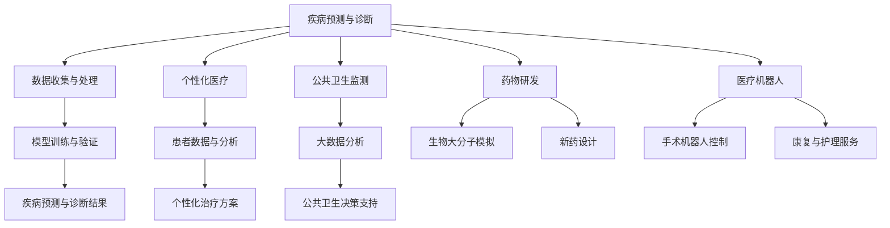

                 

# 2050年的全球卫生：从人工智能流行病预警到全球卫生治理合作

> **关键词：全球卫生、人工智能、流行病预警、卫生治理、国际合作**

> **摘要：随着科技的迅猛发展，人工智能（AI）正在深刻改变全球卫生领域的方方面面。本文旨在探讨2050年全球卫生的未来，分析人工智能在流行病预警、全球卫生治理合作等方面的应用，并提出未来发展的挑战与机遇。**

---

### 《2050年的全球卫生：从人工智能流行病预警到全球卫生治理合作》目录大纲

# 第一部分：背景与核心概念

## 1. 引言
### 1.1 全球卫生现状与挑战
### 1.2 人工智能在卫生领域的应用前景

## 2. 人工智能与全球卫生
### 2.1 核心概念与联系
#### 2.1.1 人工智能的定义
#### 2.1.2 人工智能的核心技术
#### 2.1.3 人工智能与卫生的关系
### 2.2 Mermaid流程图：人工智能在卫生领域中的核心应用流程

## 3. 流行病预警系统
### 3.1 流行病的基本概念
#### 3.1.1 流行病的定义
#### 3.1.2 流行病的特点
#### 3.1.3 流行病的类型
### 3.2 人工智能在流行病预警中的应用
#### 3.2.1 数据收集与预处理
#### 3.2.2 机器学习模型的选择与训练
#### 3.2.3 预警系统的实现与优化

## 4. 数学模型与算法原理
### 4.1 统计模型
#### 4.1.1 贝叶斯定理
#### 4.1.2 最大似然估计
#### 4.1.3 期望最大化算法
### 4.2 神经网络
#### 4.2.1 前向传播与反向传播
#### 4.2.2 损失函数与优化算法
#### 4.2.3 神经网络的架构设计

## 5. 全球卫生治理合作
### 5.1 全球卫生治理的挑战
#### 5.1.1 资源分配的不公平性
#### 5.1.2 数据共享的难题
#### 5.1.3 国际合作的障碍
### 5.2 人工智能在解决全球卫生治理问题中的应用
#### 5.2.1 人工智能促进数据共享
#### 5.2.2 人工智能优化资源分配
#### 5.2.3 人工智能增强国际合作

# 第二部分：技术应用与案例分析

## 6. 人工智能在疾病预测中的应用
### 6.1 疾病预测的基本概念
#### 6.1.1 疾病预测的定义
#### 6.1.2 疾病预测的重要性
### 6.2 案例分析：基于人工智能的疾病预测系统
#### 6.2.1 数据集介绍
#### 6.2.2 模型选择与训练
#### 6.2.3 模型评估与优化

## 7. 人工智能在公共卫生监测中的应用
### 7.1 公共卫生监测的基本概念
#### 7.1.1 公共卫生监测的定义
#### 7.1.2 公共卫生监测的重要性
### 7.2 案例分析：基于人工智能的公共卫生监测系统
#### 7.2.1 数据来源与预处理
#### 7.2.2 监测模型的选择与训练
#### 7.2.3 监测结果的实时反馈与调整

## 8. 人工智能在疫苗研发中的应用
### 8.1 疫苗研发的基本流程
#### 8.1.1 疫苗研发的定义
#### 8.1.2 疫苗研发的挑战
### 8.2 案例分析：基于人工智能的疫苗研发项目
#### 8.2.1 数据分析与模型选择
#### 8.2.2 疫苗设计策略
#### 8.2.3 疫苗安全性评估

## 9. 人工智能在公共卫生决策中的应用
### 9.1 公共卫生决策的基本概念
#### 9.1.1 公共卫生决策的定义
#### 9.1.2 公共卫生决策的挑战
### 9.2 案例分析：基于人工智能的公共卫生决策支持系统
#### 9.2.1 数据来源与预处理
#### 9.2.2 决策模型的选择与训练
#### 9.2.3 决策过程的实时反馈与优化

# 第三部分：未来展望与挑战

## 10. 人工智能与全球卫生的未来
### 10.1 人工智能在卫生领域的发展趋势
#### 10.1.1 人工智能技术的未来发展方向
#### 10.1.2 卫生领域的未来挑战与机遇
### 10.2 人工智能与全球卫生的潜在应用场景
#### 10.2.1 新冠病毒后的全球卫生变革
#### 10.2.2 人工智能在疾病预防与控制中的应用
#### 10.2.3 人工智能在卫生资源优化中的应用

## 11. 挑战与伦理问题
### 11.1 数据隐私与安全
#### 11.1.1 数据隐私保护的挑战
#### 11.1.2 数据安全的关键措施
### 11.2 人工智能算法的透明性与可解释性
#### 11.2.1 算法透明性的重要性
#### 11.2.2 提高算法可解释性的方法
### 11.3 人工智能在卫生领域的伦理问题
#### 11.3.1 伦理问题的类型
#### 11.3.2 解决伦理问题的策略

## 12. 结论
### 12.1 人工智能在卫生领域的重要意义
### 12.2 未来的研究方向
### 12.3 对读者的建议

# 附录

## 附录 A：人工智能在卫生领域的主要应用技术介绍
### A.1 深度学习在疾病预测中的应用
### A.2 机器学习在公共卫生监测中的应用
### A.3 自然语言处理在公共卫生决策中的应用

## 附录 B：资源与参考文献
### B.1 人工智能在卫生领域的最新研究进展
### B.2 公共卫生领域的经典文献
### B.3 人工智能在卫生领域的应用案例

---

在接下来的部分中，我们将深入探讨人工智能在卫生领域的应用，从流行病预警系统到全球卫生治理合作，通过一步一步的分析推理，探讨人工智能如何成为未来卫生领域的重要驱动力。

## 1. 引言

随着全球化的加速和人口增长，全球卫生问题日益严峻。过去几十年，流行病如艾滋病、埃博拉病毒、新冠病毒等对全球公共卫生安全构成巨大威胁，传统的卫生治理方法难以应对这些复杂的问题。因此，寻找新的解决途径成为当务之急。人工智能（AI）作为一门前沿技术，在多个领域展现出了巨大的潜力，特别是在全球卫生领域。本文将探讨2050年全球卫生的愿景，重点分析人工智能在流行病预警、疾病预测、公共卫生监测、疫苗研发和公共卫生决策等方面的应用。

### 1.1 全球卫生现状与挑战

全球卫生问题不仅仅是某个国家或地区的问题，而是全球范围内的挑战。根据世界卫生组织（WHO）的数据，每年约有1,000万人死于可预防的疾病，而这些疾病在很大程度上可以通过有效的卫生措施得到控制。当前，全球卫生面临的挑战主要包括：

- **资源分配不公平**：发达国家和发展中国家在卫生资源分配上存在巨大差距。发展中国家缺乏必要的医疗设施和医务人员，难以提供全面的卫生服务。
- **疾病负担重**：慢性病和传染病在全球范围内造成巨大负担。例如，心血管疾病和癌症是全球导致死亡的主要原因，而传染病如流感、新冠病毒等也频繁爆发。
- **数据共享困难**：全球卫生数据的收集、管理和共享存在障碍。数据分散在不同的机构和部门，难以形成统一的数据库，导致决策者缺乏全面的信息支持。

### 1.2 人工智能在卫生领域的应用前景

人工智能在卫生领域的应用前景广阔，可以解决许多传统的卫生治理难题。以下是人工智能在卫生领域的一些潜在应用：

- **流行病预警**：人工智能可以通过大数据分析和机器学习模型预测流行病的爆发和传播趋势，为公共卫生决策提供实时数据支持。
- **疾病预测**：人工智能可以帮助医生预测疾病的发生风险，提前采取预防措施，降低疾病负担。
- **公共卫生监测**：人工智能可以实时监测公共卫生数据，及时发现异常情况，采取及时措施。
- **疫苗研发**：人工智能可以加速疫苗研发过程，通过模拟病毒结构和抗原特性，设计更有效的疫苗。
- **公共卫生决策**：人工智能可以为公共卫生决策提供数据分析和预测支持，提高决策的科学性和准确性。

### 1.3 本文结构

本文将分为三个部分：

- **第一部分：背景与核心概念**：介绍全球卫生的现状和挑战，以及人工智能在卫生领域的基本概念和应用。
- **第二部分：技术应用与案例分析**：详细探讨人工智能在流行病预警、疾病预测、公共卫生监测、疫苗研发和公共卫生决策等实际应用案例。
- **第三部分：未来展望与挑战**：分析人工智能在卫生领域的未来发展趋势，讨论面临的挑战和解决策略。

通过本文的探讨，我们希望能够展示人工智能在卫生领域的巨大潜力，为未来的卫生治理提供新的思路和解决方案。

## 2. 人工智能与全球卫生

### 2.1 核心概念与联系

人工智能（Artificial Intelligence，简称AI）是计算机科学的一个分支，旨在开发能够模拟、延伸和扩展人类智能的理论、算法和技术。在全球卫生领域，人工智能的应用主要集中在以下几个核心概念：

- **机器学习（Machine Learning）**：机器学习是一种通过数据训练算法，使计算机能够从数据中学习并做出预测或决策的技术。在卫生领域，机器学习可以用于疾病预测、流行病监测和个性化医疗。
- **深度学习（Deep Learning）**：深度学习是机器学习的一种，通过多层神经网络模拟人脑的处理方式，对大量数据进行分析和分类。深度学习在医疗影像分析、基因组学和药物研发中具有广泛应用。
- **自然语言处理（Natural Language Processing，NLP）**：自然语言处理是使计算机理解和生成自然语言的技术。在卫生领域，NLP可以用于医疗文献分析、病历记录和患者沟通。
- **数据挖掘（Data Mining）**：数据挖掘是一种从大量数据中提取有用信息和知识的技术。在卫生领域，数据挖掘可以用于疾病模式识别、健康风险评估和公共卫生政策制定。

### 2.1.1 人工智能的定义

人工智能可以定义为一种计算机系统，该系统能够执行通常需要人类智能才能完成的任务，如视觉识别、语言理解和决策制定。人工智能包括多个子领域，如：

- **认知智能**：模拟人类思维过程，包括感知、记忆、推理和决策。
- **感知智能**：模拟人类感官，如视觉、听觉和触觉，实现对环境的感知。
- **行为智能**：通过学习环境中的行为模式，使系统能够自主决策和行动。
- **社会智能**：模拟人类的社会行为，如交流、协作和情感理解。

### 2.1.2 人工智能的核心技术

人工智能的核心技术包括：

- **神经网络（Neural Networks）**：神经网络是模仿生物神经元连接结构的计算模型，用于处理复杂的非线性问题。深度学习是神经网络的一种，通过多层结构实现更复杂的特征提取和分类。
- **机器学习算法（Machine Learning Algorithms）**：常见的机器学习算法包括决策树、支持向量机、聚类算法和神经网络。这些算法通过训练数据学习，并在新的数据上进行预测或分类。
- **强化学习（Reinforcement Learning）**：强化学习是一种通过奖励和惩罚机制来训练智能体在环境中做出最佳决策的技术。强化学习在医学决策支持和医疗机器人控制中具有应用价值。
- **自然语言处理（NLP）**：自然语言处理是一种使计算机理解和生成自然语言的技术，包括语言模型、词向量表示和语义理解。

### 2.1.3 人工智能与卫生的关系

人工智能与卫生领域的结合，主要体现在以下几个方面：

- **疾病预测与诊断**：通过机器学习和深度学习算法，人工智能可以分析大量的医疗数据，如病历记录、实验室检测结果和医学影像，实现疾病的预测和诊断。
- **个性化医疗**：基于患者的遗传信息、生活方式和健康状况，人工智能可以提供个性化的治疗方案，提高治疗效果。
- **公共卫生监测**：通过大数据分析和机器学习模型，人工智能可以实时监测公共卫生数据，及时发现异常情况，为公共卫生决策提供支持。
- **药物研发**：人工智能可以通过模拟药物与生物大分子的相互作用，加速新药研发过程。
- **医疗机器人**：人工智能在医疗机器人中的应用，如手术机器人、康复机器人和护理机器人，提高了医疗服务的效率和质量。

### 2.2 Mermaid流程图：人工智能在卫生领域中的核心应用流程

通过上述流程图，我们可以看到人工智能在卫生领域的广泛应用和核心应用流程。从疾病预测与诊断、个性化医疗、公共卫生监测到药物研发和医疗机器人，人工智能正逐渐成为卫生领域的重要支撑力量。

### 2.3 人工智能在卫生领域的应用前景

随着人工智能技术的不断发展，其在卫生领域的应用前景更加广阔。以下是人工智能在卫生领域的潜在应用前景：

- **精准医疗**：通过基因测序和人工智能，实现精准医疗，为患者提供个性化的治疗方案。
- **智能健康监护**：通过可穿戴设备和人工智能，实时监测患者的健康状态，提供预警和干预建议。
- **远程医疗**：通过人工智能和互联网技术，实现远程医疗诊断和咨询，提高医疗服务的可及性。
- **智能药物设计**：通过人工智能，加速药物研发过程，提高新药设计效率。
- **智能医学影像分析**：通过深度学习和计算机视觉技术，实现医学影像的自动分析，提高诊断准确率。

总之，人工智能在卫生领域的应用具有巨大的潜力，将为全球卫生治理带来新的变革和机遇。

## 3. 流行病预警系统

流行病是指疾病在特定时间内，在某一地区人群中迅速传播的现象，它对公共卫生构成了严重威胁。传统的流行病预警系统主要依赖于流行病学的统计方法和专家经验。然而，随着大数据和人工智能技术的发展，基于人工智能的流行病预警系统正逐步成为公共卫生监测和应对的重要工具。

### 3.1 流行病的基本概念

#### 3.1.1 流行病的定义

流行病是指某一特定疾病在特定时间内，某一地区人群中迅速传播和流行的现象。流行病与地方病（endemic）和传染病（epidemic）有所不同，地方病是指疾病在某一地区长期存在和流行，而传染病则是指通过病原体在人与人之间传播的疾病。

#### 3.1.2 流行病的特点

- **突发性**：流行病往往突然爆发，短期内导致大量病例。
- **传播速度快**：流行病通过多种途径快速传播，如空气传播、接触传播和飞沫传播。
- **群体性**：流行病在人群中广泛传播，影响大量人口。
- **季节性**：某些流行病如流感，具有一定的季节性，在特定季节高发。

#### 3.1.3 流行病的类型

流行病可以根据传播方式和病原体的不同分为多种类型：

- **呼吸道传染病**：如流感、新冠病毒、麻疹等，通过空气中的飞沫传播。
- **肠道传染病**：如霍乱、痢疾、病毒性肝炎等，通过食物或水源传播。
- **血液传染病**：如艾滋病、疟疾等，通过血液或体液传播。
- **皮肤病**：如天花、手足口病等，通过皮肤接触传播。

### 3.2 人工智能在流行病预警中的应用

人工智能在流行病预警中的应用，主要体现在以下几个方面：

#### 3.2.1 数据收集与预处理

流行病预警系统的核心是数据，数据的质量和完整性直接影响预警系统的准确性。人工智能可以通过以下方式收集和预处理数据：

- **公共卫生数据**：利用电子健康记录（EHR）、公共卫生监测系统和流行病学调查数据。
- **社交媒体数据**：从社交媒体平台上获取与疾病相关的信息，如症状报告、舆情分析等。
- **环境数据**：如气象数据、地理空间数据等，对疾病传播的环境因素进行分析。
- **传感器数据**：利用可穿戴设备和传感器实时监测患者体征和健康状况。

在数据收集后，需要进行数据预处理，包括数据清洗、数据整合和数据标准化等步骤，以提高数据的质量和一致性。

#### 3.2.2 机器学习模型的选择与训练

在数据预处理完成后，需要选择合适的机器学习模型进行训练。常用的机器学习模型包括：

- **监督学习模型**：如决策树、随机森林、支持向量机（SVM）等，通过已标记的数据进行训练，预测新数据的类别或标签。
- **无监督学习模型**：如聚类算法、主成分分析（PCA）等，用于发现数据中的隐含结构和模式。
- **深度学习模型**：如卷积神经网络（CNN）、循环神经网络（RNN）等，通过多层神经网络结构，自动提取数据中的高级特征。

机器学习模型的训练过程包括以下几个步骤：

1. **数据划分**：将数据集划分为训练集、验证集和测试集，用于模型的训练、验证和测试。
2. **特征工程**：根据数据的特性和目标，选择和构建相关的特征，提高模型的预测能力。
3. **模型选择**：根据问题的性质和数据的特点，选择合适的机器学习模型。
4. **模型训练**：利用训练集对模型进行训练，通过优化算法调整模型参数，使模型在训练数据上达到最佳的预测效果。
5. **模型验证**：利用验证集对模型进行验证，评估模型的泛化能力和预测性能。
6. **模型测试**：利用测试集对模型进行测试，评估模型在未知数据上的表现。

#### 3.2.3 预警系统的实现与优化

在完成机器学习模型的训练后，需要将模型部署到实际应用中，实现流行病预警系统。预警系统的实现包括以下几个步骤：

1. **系统集成**：将机器学习模型与其他相关组件（如数据收集模块、数据预处理模块、用户界面等）进行集成，构建完整的预警系统。
2. **实时监控**：利用实时数据流，对公共卫生数据进行实时监控，及时发现异常情况。
3. **预警规则**：根据模型的预测结果和流行病的特点，设定预警规则，触发预警信号。
4. **决策支持**：为公共卫生决策者提供数据分析和预测结果，支持决策制定。
5. **系统优化**：根据实际应用中的反馈和评估结果，不断优化模型和系统，提高预警的准确性和效率。

### 3.3 人工智能流行病预警系统的案例

以下是一个基于人工智能的流行病预警系统的实际案例：

#### 案例一：新冠病毒（COVID-19）预警系统

在新冠病毒疫情期间，许多国家和地区建立了基于人工智能的预警系统，以监控疫情的传播趋势和制定相应的公共卫生措施。以下是一个典型的预警系统架构：

1. **数据收集**：通过多种渠道收集疫情数据，包括官方通报、社交媒体、新闻报道、传感器数据等。
2. **数据预处理**：对收集到的数据进行清洗、整合和标准化，提取与疫情相关的关键特征。
3. **模型训练**：利用历史疫情数据，选择合适的机器学习模型（如随机森林、卷积神经网络等）进行训练，建立疫情预测模型。
4. **实时监控**：通过实时数据流，对疫情进行实时监控，分析疫情的传播趋势和潜在风险。
5. **预警规则**：根据模型的预测结果和专家经验，设定预警阈值和规则，触发预警信号。
6. **决策支持**：为公共卫生决策者提供疫情预测结果、风险分析和建议措施，支持决策制定。

通过这个案例，我们可以看到人工智能在流行病预警中的重要作用。人工智能预警系统不仅提高了疫情监测的准确性和实时性，还为公共卫生决策提供了有力支持，有助于更好地应对疫情挑战。

## 4. 数学模型与算法原理

在人工智能流行病预警系统中，数学模型和算法扮演着至关重要的角色。这些模型和算法用于处理和分析大量数据，从而预测疾病的传播趋势和制定相应的公共卫生措施。以下将详细介绍几种常用的数学模型和算法原理，包括统计模型和神经网络。

### 4.1 统计模型

统计模型是人工智能领域的基础，广泛应用于数据分析、预测和分类。以下介绍几种常用的统计模型：

#### 4.1.1 贝叶斯定理

贝叶斯定理是一种概率论公式，用于计算条件概率和边缘概率。在流行病预警中，贝叶斯定理可以用于计算特定疾病在特定条件下的发病率，为公共卫生决策提供依据。贝叶斯定理的公式如下：

$$
P(A|B) = \frac{P(B|A)P(A)}{P(B)}
$$

其中，\(P(A|B)\) 表示在事件B发生的条件下，事件A发生的概率；\(P(B|A)\) 表示在事件A发生的条件下，事件B发生的概率；\(P(A)\) 表示事件A的边缘概率；\(P(B)\) 表示事件B的边缘概率。

#### 4.1.2 最大似然估计

最大似然估计（Maximum Likelihood Estimation，MLE）是一种参数估计方法，用于估计模型参数，使模型在给定数据上的概率最大。在流行病预警中，最大似然估计可以用于估计疾病传播参数，如传染率和潜伏期。

最大似然估计的原理是找到一组参数值，使得实际观测数据的概率最大。具体步骤如下：

1. **构建概率模型**：根据问题的性质，构建一个概率模型，如二项分布、泊松分布等。
2. **确定似然函数**：根据模型，确定似然函数，表示为 \(L(\theta; x)\)，其中 \(\theta\) 表示模型参数，\(x\) 表示观测数据。
3. **求解似然函数**：通过最大化似然函数，求解模型参数的估计值。

#### 4.1.3 期望最大化算法

期望最大化算法（Expectation-Maximization，EM）是一种迭代算法，用于估计参数在含有隐藏变量的概率模型中的最大似然估计。在流行病预警中，EM算法可以用于估计疾病的传播路径和感染人数。

EM算法的原理是交替迭代优化两个步骤：

1. **期望步（E步）**：计算隐藏变量的期望值，基于当前的参数估计。
2. **最大化步（M步）**：最大化似然函数，更新参数估计。

### 4.2 神经网络

神经网络（Neural Networks）是一种通过模拟人脑神经元连接结构的计算模型，广泛应用于图像识别、语音识别和自然语言处理等领域。以下介绍神经网络的基本原理：

#### 4.2.1 前向传播与反向传播

神经网络包括输入层、隐藏层和输出层。数据从输入层进入网络，通过隐藏层进行特征提取和变换，最终在输出层产生预测结果。

1. **前向传播**：在前向传播过程中，数据从输入层传递到输出层，通过每层的加权连接和激活函数，计算输出结果。前向传播的步骤如下：

   - **输入层到隐藏层**：将输入数据乘以权重，加上偏置项，通过激活函数进行非线性变换，得到隐藏层的输出。
   - **隐藏层到输出层**：将隐藏层的输出乘以权重，加上偏置项，通过激活函数进行非线性变换，得到输出结果。

2. **反向传播**：在反向传播过程中，计算输出结果与实际结果之间的误差，通过梯度下降法更新权重和偏置项，优化网络参数。反向传播的步骤如下：

   - **计算误差**：计算输出层的结果与实际结果之间的误差。
   - **反向传递误差**：将误差从输出层传递到隐藏层，计算每层参数的梯度。
   - **更新参数**：通过梯度下降法，更新权重和偏置项，减小误差。

#### 4.2.2 损失函数与优化算法

损失函数用于衡量模型预测结果与实际结果之间的差异。常见的损失函数包括均方误差（MSE）、交叉熵（Cross Entropy）等。

1. **均方误差（MSE）**：均方误差是预测值与实际值之间差的平方的平均值，用于回归问题。MSE的公式如下：

   $$
   MSE = \frac{1}{n}\sum_{i=1}^{n}(y_i - \hat{y}_i)^2
   $$

   其中，\(y_i\) 表示第i个实际值，\(\hat{y}_i\) 表示第i个预测值，\(n\) 表示数据样本数量。

2. **交叉熵（Cross Entropy）**：交叉熵是预测值与实际值之间差异的度量，用于分类问题。交叉熵的公式如下：

   $$
   H(y, \hat{y}) = -\sum_{i=1}^{n}y_i \log(\hat{y}_i)
   $$

   其中，\(y_i\) 表示第i个类别的实际概率，\(\hat{y}_i\) 表示第i个类别的预测概率。

优化算法用于调整网络参数，以最小化损失函数。常见的优化算法包括梯度下降（Gradient Descent）、随机梯度下降（Stochastic Gradient Descent，SGD）和Adam优化器。

1. **梯度下降**：梯度下降是一种最简单的优化算法，通过计算损失函数关于模型参数的梯度，更新参数，使其减小误差。

   $$
   \theta_{\text{new}} = \theta_{\text{old}} - \alpha \cdot \nabla_\theta J(\theta)
   $$

   其中，\(\theta\) 表示模型参数，\(\alpha\) 表示学习率，\(\nabla_\theta J(\theta)\) 表示损失函数关于参数的梯度。

2. **随机梯度下降（SGD）**：随机梯度下降是梯度下降的一种变种，通过随机选择样本进行更新，减小参数的更新频率。

   $$
   \theta_{\text{new}} = \theta_{\text{old}} - \alpha \cdot \nabla_\theta J(\theta; x_i, y_i)
   $$

   其中，\(x_i, y_i\) 表示随机选择的样本。

3. **Adam优化器**：Adam优化器结合了SGD和动量法的优点，通过计算一阶矩估计（均值）和二阶矩估计（方差），自适应调整学习率。

   $$
   m_t = \beta_1 x_t \\
   v_t = \beta_2 x_t \\
   \theta_{\text{new}} = \theta_{\text{old}} - \alpha \cdot \frac{m_t}{\sqrt{1 - \beta_2^t} + \epsilon}
   $$

   其中，\(\beta_1, \beta_2\) 分别表示一阶和二阶矩估计的权重，\(\epsilon\) 是一个很小的常数，防止除以零。

#### 4.2.3 神经网络的架构设计

神经网络的架构设计包括层数、层的大小、激活函数和正则化方法等。

1. **层数**：神经网络的层数对模型的性能有重要影响。通常，增加层数可以增强模型的表达能力，但也可能导致过拟合。因此，需要根据问题的复杂性和数据量，选择合适的层数。

2. **层的大小**：层的大小（即神经元数量）也需要合理选择。过小的层大小可能导致模型无法捕捉到足够的信息，而过大的层大小可能导致过拟合。

3. **激活函数**：激活函数用于引入非线性，使神经网络能够学习复杂的特征。常见的激活函数包括sigmoid、ReLU和Tanh。

4. **正则化方法**：正则化方法用于防止过拟合，提高模型的泛化能力。常见的正则化方法包括L1正则化、L2正则化和Dropout。

综上所述，数学模型和算法原理在人工智能流行病预警系统中起着至关重要的作用。通过合理选择和设计数学模型和算法，可以提高预警系统的准确性和实时性，为公共卫生决策提供有力支持。

## 5. 全球卫生治理合作

在全球卫生治理中，各国面临着资源分配不公平、数据共享难题和国际合作障碍等多重挑战。人工智能技术的应用有望缓解这些问题，提高全球卫生治理的效率和质量。

### 5.1 全球卫生治理的挑战

#### 5.1.1 资源分配的不公平性

全球卫生资源分配不公平是一个长期存在的问题。发达国家和发展中国家在医疗设施、医务人员和卫生经费方面存在巨大差距。这导致许多发展中国家难以提供基本的公共卫生服务，疾病负担沉重。例如，根据世界卫生组织（WHO）的数据，全球约80%的医疗资源集中在20%的人口手中，而剩余80%的人口却只能分享20%的医疗资源。

#### 5.1.2 数据共享的难题

全球卫生数据的收集、管理和共享存在诸多难题。数据分散在不同的机构和部门，数据标准和格式不统一，导致数据难以整合和分析。此外，数据隐私和安全问题也使得各国在共享数据时犹豫不决。数据共享难题限制了全球卫生监测和应对的效率，影响了公共卫生决策的科学性和准确性。

#### 5.1.3 国际合作的障碍

全球卫生治理需要各国的紧密合作，但国际合作面临诸多障碍。首先，不同国家和地区在卫生政策和资源分配上存在差异，导致合作意愿不强。其次，国际卫生组织的能力和资源有限，难以协调和推动全球卫生合作。最后，全球卫生治理中的利益冲突和权力争夺也使得国际合作复杂化。

### 5.2 人工智能在解决全球卫生治理问题中的应用

人工智能技术在全球卫生治理中的应用，可以缓解上述挑战，提高治理的效率和质量。

#### 5.2.1 人工智能促进数据共享

人工智能可以通过数据挖掘和自然语言处理技术，实现全球卫生数据的自动化收集、整合和分析。例如，利用自然语言处理技术，可以从海量的医疗文献、新闻报道和社交媒体中提取有用信息，形成统一的全球卫生数据集。此外，人工智能还可以帮助制定统一的数据标准和格式，提高数据共享的效率。

#### 5.2.2 人工智能优化资源分配

人工智能可以通过大数据分析和预测模型，优化全球卫生资源的分配。例如，利用机器学习算法，可以预测疾病的高发地区和人群，为卫生资源的合理配置提供科学依据。此外，人工智能还可以帮助识别卫生资源浪费和滥用现象，提高资源利用效率。

#### 5.2.3 人工智能增强国际合作

人工智能可以促进国际卫生合作，提高全球卫生治理的协同效应。例如，通过建立全球卫生数据共享平台，各国可以实时共享卫生数据，提高公共卫生监测和应对的效率。此外，人工智能还可以帮助协调国际卫生组织和国家卫生部门的工作，推动全球卫生政策的制定和实施。

### 5.3 具体应用案例

以下是一些人工智能在全球卫生治理中的具体应用案例：

#### 案例一：全球流感监测系统

全球流感监测系统利用人工智能技术，实现对全球流感的实时监测和预测。系统通过收集和分析来自全球各地的流感监测数据，利用机器学习模型预测流感的流行趋势。该系统有助于各国卫生部门及时采取应对措施，减少流感对公共卫生的影响。

#### 案例二：电子健康记录共享平台

电子健康记录共享平台利用人工智能技术，实现患者健康数据的自动化收集、整合和共享。平台通过自然语言处理技术，从医疗文献和病历记录中提取有用信息，形成统一的电子健康记录。各国卫生部门可以实时访问和共享这些数据，提高公共卫生监测和疾病预防的效率。

#### 案例三：全球公共卫生预测模型

全球公共卫生预测模型利用人工智能技术，预测全球卫生事件的发生和影响。模型通过分析历史卫生数据、社会经济数据和气候数据，利用机器学习算法预测未来卫生事件的概率和影响。这些预测结果有助于国际卫生组织和国家卫生部门制定有效的公共卫生政策。

综上所述，人工智能技术在解决全球卫生治理挑战方面具有巨大潜力。通过促进数据共享、优化资源分配和增强国际合作，人工智能可以为全球卫生治理提供有力支持，推动全球卫生事业的发展。

## 6. 人工智能在疾病预测中的应用

疾病预测是人工智能在卫生领域的一项重要应用，它通过分析大量的医疗数据，识别疾病发生的风险因素，为医生和患者提供个性化的预防和治疗建议。以下是疾病预测的基本概念、重要性以及具体的应用案例。

### 6.1 疾病预测的基本概念

#### 6.1.1 疾病预测的定义

疾病预测（Disease Prediction）是指利用历史数据和现有的医学知识，通过数据分析和机器学习算法，预测某一疾病在未来发生概率的过程。疾病预测不仅可以提供早期预警，帮助医疗机构及时采取干预措施，还可以优化医疗资源的配置，提高公共卫生服务的效率。

#### 6.1.2 疾病预测的重要性

疾病预测在公共卫生领域具有重要意义，主要体现在以下几个方面：

- **早期预警**：疾病预测可以帮助识别高风险人群，提前采取预防措施，减少疾病的发病率。
- **资源优化**：通过预测疾病的发生趋势，医疗机构可以合理分配医疗资源，避免资源浪费。
- **个性化治疗**：疾病预测可以为患者提供个性化的治疗方案，提高治疗效果。
- **公共卫生政策制定**：疾病预测结果可以为公共卫生政策的制定提供科学依据，提高政策的针对性。

### 6.2 案例分析：基于人工智能的疾病预测系统

#### 6.2.1 数据集介绍

为了构建一个基于人工智能的疾病预测系统，首先需要收集大量的医疗数据，包括病史、生活习惯、生物标志物等。以下是一个典型的数据集介绍：

- **病史数据**：包括患者的年龄、性别、病史记录（如高血压、糖尿病、心脏病等）。
- **生活习惯数据**：包括饮食、运动、睡眠习惯等。
- **生物标志物数据**：包括血液检查结果、基因检测数据等。
- **环境数据**：包括居住区域、气候条件等。

这些数据来源于电子健康记录（EHR）、医学研究数据库和公共卫生监测系统。数据集需要经过清洗、去重和标准化处理，以确保数据的质量和一致性。

#### 6.2.2 模型选择与训练

在疾病预测中，常用的机器学习模型包括线性回归、逻辑回归、随机森林、支持向量机（SVM）和神经网络等。以下是一个基于逻辑回归的疾病预测模型的训练过程：

1. **数据预处理**：对数据集进行清洗、去重和标准化处理，将数据转化为适合机器学习模型的形式。

2. **特征选择**：根据医学知识和数据分析结果，选择对疾病预测具有重要意义的特征。例如，血压、血糖、体重等。

3. **模型选择**：选择逻辑回归模型，因为它在处理二元分类问题时表现较好，且计算复杂度较低。

4. **模型训练**：使用训练集对逻辑回归模型进行训练，通过最小化损失函数（如对数似然损失函数）来优化模型参数。

   $$
   \text{Log-Likelihood Loss} = -\sum_{i=1}^{n} y_i \log(\hat{p}_i) + (1 - y_i) \log(1 - \hat{p}_i)
   $$

   其中，\(y_i\) 表示第i个样本的真实标签，\(\hat{p}_i\) 表示模型预测的概率。

5. **模型验证**：使用验证集对模型进行验证，评估模型的预测性能。常用的评估指标包括准确率、召回率、F1分数等。

6. **模型测试**：使用测试集对模型进行测试，评估模型在未知数据上的表现，验证模型的泛化能力。

#### 6.2.3 模型评估与优化

在模型训练和验证完成后，需要对模型进行评估和优化，以提高预测的准确性。以下是一些常用的评估指标和优化方法：

- **评估指标**：

  - **准确率（Accuracy）**：正确预测的样本数占总样本数的比例。
  - **召回率（Recall）**：正确预测为阳性（患病）的样本数占实际阳性样本数的比例。
  - **精确率（Precision）**：正确预测为阳性（患病）的样本数占预测阳性样本总数的比例。
  - **F1分数（F1 Score）**：精确率和召回率的调和平均值。

  $$
  F1 = 2 \times \frac{Precision \times Recall}{Precision + Recall}
  $$

- **优化方法**：

  - **交叉验证**：通过将数据集划分为多个子集，轮流使用每个子集作为验证集，评估模型的性能，提高评估的稳定性。
  - **超参数调整**：通过调整模型的超参数（如学习率、正则化参数等），优化模型的预测性能。
  - **集成学习**：结合多个模型的预测结果，提高整体预测的准确性。

通过上述步骤，我们可以构建一个基于人工智能的疾病预测系统，为公共卫生决策和个性化医疗提供有力支持。

## 7. 人工智能在公共卫生监测中的应用

公共卫生监测是保障公共健康安全的重要手段，通过对各类公共卫生数据的收集、分析和处理，实现对疫情、疾病风险和公共卫生事件的及时预警和有效应对。人工智能（AI）技术在公共卫生监测中发挥着越来越重要的作用，能够显著提升监测的准确性和实时性。以下将详细介绍公共卫生监测的基本概念、重要性以及基于人工智能的具体应用。

### 7.1 公共卫生监测的基本概念

#### 7.1.1 公共卫生监测的定义

公共卫生监测（Public Health Surveillance）是指通过持续、系统的数据收集、分析和传播，监测疾病的分布、趋势和影响因素，以及评估公共卫生干预措施效果的过程。公共卫生监测的目的是及时发现公共卫生问题，评估公共卫生事件的严重程度，制定和调整公共卫生策略。

#### 7.1.2 公共卫生监测的重要性

公共卫生监测在公共卫生体系中扮演着至关重要的角色，其主要重要性体现在以下几个方面：

- **早期预警**：通过实时监测公共卫生数据，及时发现异常情况，为公共卫生决策提供及时、准确的预警信息。
- **疾病控制**：公共卫生监测可以帮助识别疾病的高发地区和人群，制定有针对性的防控措施，有效控制疾病的传播和蔓延。
- **政策评估**：公共卫生监测数据可用于评估公共卫生政策和干预措施的效果，为政策调整和优化提供科学依据。
- **资源分配**：通过监测数据，合理分配公共卫生资源，提高资源利用效率，确保公共卫生服务的公平性和可持续性。

### 7.2 案例分析：基于人工智能的公共卫生监测系统

#### 7.2.1 数据来源与预处理

构建一个基于人工智能的公共卫生监测系统，首先需要收集多种类型的公共卫生数据。以下是一些常见的数据来源：

- **医疗数据**：包括医院和诊所的电子健康记录（EHR）、实验室检测结果等。
- **环境数据**：如气象数据、空气质量数据、水源水质数据等。
- **行为数据**：如人口统计数据、生活习惯数据（饮食、运动等）。
- **社交媒体数据**：从社交媒体平台获取与疾病相关的信息，如症状报告、舆情分析等。

在数据收集后，需要对数据进行预处理，包括数据清洗、数据整合和数据标准化等步骤：

- **数据清洗**：去除重复数据、缺失数据和错误数据，确保数据的质量和完整性。
- **数据整合**：将不同来源的数据进行整合，形成统一的数据集，以便后续的分析和处理。
- **数据标准化**：将不同单位、格式和类型的数据进行统一处理，确保数据的可比性和一致性。

#### 7.2.2 监测模型的选择与训练

在数据预处理完成后，需要选择合适的机器学习模型对公共卫生监测系统进行训练。以下是一些常用的机器学习模型：

- **监督学习模型**：如线性回归、逻辑回归、决策树、随机森林和支持向量机（SVM）等。这些模型通过已标记的数据进行训练，可以预测新数据的标签。
- **无监督学习模型**：如聚类算法、主成分分析（PCA）和自编码器等。这些模型用于发现数据中的隐含结构和模式。
- **深度学习模型**：如卷积神经网络（CNN）、循环神经网络（RNN）和长短期记忆网络（LSTM）等。这些模型能够自动提取数据中的高级特征，适用于复杂的监测任务。

以下是一个基于深度学习模型的公共卫生监测系统的训练过程：

1. **数据划分**：将数据集划分为训练集、验证集和测试集，用于模型的训练、验证和测试。
2. **特征工程**：根据问题的性质和数据的特点，选择和构建相关的特征，提高模型的预测能力。
3. **模型选择**：选择合适的深度学习模型，如卷积神经网络（CNN）或循环神经网络（RNN），根据数据的特点进行架构设计。
4. **模型训练**：使用训练集对模型进行训练，通过优化算法调整模型参数，使模型在训练数据上达到最佳的预测效果。
5. **模型验证**：使用验证集对模型进行验证，评估模型的泛化能力和预测性能。
6. **模型测试**：使用测试集对模型进行测试，评估模型在未知数据上的表现，验证模型的泛化能力。

#### 7.2.3 监测结果的实时反馈与调整

在完成模型训练后，需要将模型部署到实际应用中，实现公共卫生监测系统的实时监测和预警。以下是公共卫生监测系统的实时反馈与调整过程：

1. **实时数据流**：通过实时数据采集系统，持续收集各类公共卫生数据。
2. **数据预处理**：对实时数据进行预处理，包括数据清洗、数据整合和数据标准化等步骤，确保数据的质量和一致性。
3. **模型预测**：利用已训练好的模型对实时数据进行预测，识别疾病风险和公共卫生事件。
4. **预警规则**：根据模型的预测结果和专家经验，设定预警阈值和规则，触发预警信号。
5. **决策支持**：为公共卫生决策者提供数据分析和预测结果，支持决策制定。
6. **模型优化**：根据实际应用中的反馈和评估结果，不断优化模型和系统，提高预警的准确性和效率。

通过上述步骤，基于人工智能的公共卫生监测系统可以实现对公共卫生数据的实时监测和分析，为公共卫生决策提供科学依据，提高公共健康安全水平。

## 8. 人工智能在疫苗研发中的应用

疫苗研发是公共卫生领域的关键环节，对于预防和控制传染病具有重要意义。随着人工智能（AI）技术的迅速发展，AI在疫苗研发中的应用逐渐受到关注，并展现出巨大潜力。以下将详细探讨人工智能在疫苗研发中的基本流程、具体应用以及一个典型的案例。

### 8.1 疫苗研发的基本流程

疫苗研发通常包括以下几个关键步骤：

1. **疫苗设计**：确定疫苗的目标病原体，设计疫苗抗原，选择疫苗载体和佐剂。
2. **预临床研究**：在动物模型上进行疫苗的安全性、免疫原性评估。
3. **临床试验**：在人身上进行三个阶段的临床试验，验证疫苗的安全性和有效性。
4. **生产与注册**：疫苗通过临床试验后，进行大规模生产，并申请国家药品监督管理局的批准。
5. **市场推广**：疫苗上市后，进行市场推广，并持续监测疫苗的安全性和效果。

### 8.2 案例分析：基于人工智能的疫苗研发项目

#### 8.2.1 数据分析与模型选择

一个基于人工智能的疫苗研发项目首先需要收集大量的数据，包括：

- **病原体基因组序列**：确定疫苗的目标病原体的基因组序列。
- **临床数据**：包括患者的临床症状、病史、实验室检测结果等。
- **疫苗设计数据**：如疫苗抗原序列、疫苗载体和佐剂的相关信息。

在数据分析阶段，通常采用以下方法：

- **基因组序列分析**：通过生物信息学方法，分析病原体基因组序列，识别关键抗原区域。
- **免疫原性预测**：利用机器学习模型预测疫苗抗原的免疫原性，选择最有可能引发免疫反应的抗原。

常用的机器学习模型包括：

- **深度学习模型**：如卷积神经网络（CNN）和循环神经网络（RNN），用于处理复杂的生物序列数据。
- **强化学习模型**：用于优化疫苗设计策略，通过模拟和评估不同的疫苗设计方案，选择最佳方案。

#### 8.2.2 疫苗设计策略

基于数据分析的结果，可以制定以下疫苗设计策略：

- **全病毒疫苗**：使用完整的病毒粒子或病毒片段作为抗原，激发广泛的免疫反应。
- **亚单位疫苗**：仅使用病毒的一部分（如蛋白质）作为抗原，减少潜在的副作用。
- **核酸疫苗**：使用RNA或DNA作为疫苗载体，直接导入宿主细胞内表达抗原。

每种疫苗设计策略都有其优缺点，需要根据具体病原体和目标人群的特点进行选择。

#### 8.2.3 疫苗安全性评估

在疫苗研发过程中，安全性评估至关重要。人工智能技术可以通过以下方式提高疫苗安全性评估的效率：

- **预测毒副作用**：利用机器学习模型预测疫苗可能引起的毒副作用，提前进行风险评估。
- **药代动力学分析**：通过模拟药物在体内的分布、代谢和排泄过程，评估疫苗的安全性和有效性。

#### 8.2.4 案例分析：基于人工智能的新冠病毒疫苗研发

新冠病毒（COVID-19）疫情爆发后，全球加速了疫苗研发的步伐。以下是一个基于人工智能的新冠病毒疫苗研发案例：

- **疫苗设计**：通过分析新冠病毒的基因组序列，识别出关键的抗原区域，设计相应的疫苗抗原。
- **免疫原性预测**：利用机器学习模型预测疫苗抗原的免疫原性，筛选出最有希望的疫苗候选。
- **疫苗制造**：通过生物工程方法，将疫苗抗原嵌入到疫苗载体中，如腺病毒载体或mRNA疫苗。
- **安全性评估**：利用人工智能模型预测疫苗的潜在副作用，进行大规模临床试验，评估疫苗的安全性和有效性。

通过上述步骤，人工智能在新冠病毒疫苗研发中发挥了关键作用，显著缩短了疫苗研发的时间，为全球抗击疫情提供了有力支持。

## 9. 人工智能在公共卫生决策中的应用

公共卫生决策是确保公共健康安全的重要环节，涉及疾病的预防、控制、治疗以及资源的合理分配。人工智能（AI）技术在公共卫生决策中发挥着日益重要的作用，通过提供数据分析和预测支持，提高了决策的科学性和准确性。以下将详细探讨公共卫生决策的基本概念、重要性以及人工智能在其中的具体应用。

### 9.1 公共卫生决策的基本概念

#### 9.1.1 公共卫生决策的定义

公共卫生决策（Public Health Decision Making）是指基于科学证据、专业知识和伦理原则，制定公共卫生政策和干预措施的整个过程。公共卫生决策旨在预防和控制疾病，提高公共健康水平，确保社会健康福祉。

#### 9.1.2 公共卫生决策的挑战

公共卫生决策面临以下挑战：

- **数据复杂性**：公共卫生决策依赖于大量的数据，如疾病流行数据、经济数据、环境数据等。这些数据的多样性和复杂性增加了决策的难度。
- **不确定性**：公共卫生问题具有高度的不确定性，如疫情的爆发、疾病传播的路径等。这种不确定性使得决策者难以准确预测未来的状况。
- **时间敏感性**：公共卫生决策往往需要在短时间内做出，例如疫情的快速应对。时间敏感性要求决策过程高效且准确。

#### 9.1.3 公共卫生决策的步骤

公共卫生决策通常包括以下几个步骤：

1. **问题识别**：识别当前公共卫生问题，确定决策的目标。
2. **数据收集**：收集相关的数据和信息，包括疾病流行数据、环境数据、经济数据等。
3. **数据分析**：对收集到的数据进行处理和分析，提取有用的信息，为决策提供依据。
4. **方案制定**：根据分析结果，制定不同的公共卫生干预方案。
5. **方案评估**：评估各个方案的优缺点，选择最优方案。
6. **决策实施**：实施决策方案，并监测决策的效果。
7. **反馈调整**：根据实施效果进行调整和优化。

### 9.2 人工智能在公共卫生决策中的应用

人工智能技术在公共卫生决策中的应用主要体现在以下几个方面：

#### 9.2.1 数据分析

人工智能可以通过机器学习、深度学习和自然语言处理等技术，对大量的公共卫生数据进行分析和挖掘，提取出有价值的信息。例如：

- **疾病预测**：利用机器学习模型，分析历史疾病数据，预测未来疾病的流行趋势。
- **人群行为分析**：通过自然语言处理技术，分析社交媒体上的言论和行为数据，预测人群的健康行为。
- **环境因素分析**：通过深度学习模型，分析环境数据，评估环境因素对公共卫生的影响。

#### 9.2.2 预测模型

人工智能可以构建预测模型，帮助决策者预测公共卫生事件的发生和影响。这些模型可以用于：

- **疫情预测**：预测疫情的传播趋势和爆发规模，为公共卫生干预提供依据。
- **疾病负担预测**：预测未来特定疾病的发生率和疾病负担，帮助合理分配医疗资源。
- **公共卫生干预效果预测**：预测不同公共卫生干预措施的效果，为决策者提供参考。

#### 9.2.3 决策支持系统

人工智能可以构建决策支持系统，为公共卫生决策提供智能化支持。这些系统通常包括以下几个功能：

- **数据集成**：将来自不同来源的数据进行集成，提供统一的数据视图。
- **数据分析**：提供数据分析工具，帮助决策者理解数据，提取有用信息。
- **预测和模拟**：提供预测和模拟功能，帮助决策者评估不同决策方案的效果。
- **决策建议**：基于分析结果和预测模型，为决策者提供决策建议。

### 9.3 案例分析：基于人工智能的公共卫生决策支持系统

以下是一个基于人工智能的公共卫生决策支持系统的案例分析：

#### 案例背景

某地区发生了一种新型传染病，疫情迅速蔓延，给公共卫生系统带来了巨大压力。当地卫生部门需要快速做出决策，采取有效的公共卫生干预措施。

#### 案例过程

1. **数据收集**：卫生部门通过医疗机构、疾控中心和社交媒体等渠道，收集了大量的疫情数据，包括病例数量、症状分布、传播路径等。

2. **数据分析**：利用机器学习模型，分析病例数据，预测疫情的传播趋势。模型考虑了人口流动、季节变化和公共卫生措施等因素。

3. **方案制定**：根据分析结果，卫生部门制定了多个公共卫生干预方案，包括封锁疫区、加强检测、推广疫苗接种等。

4. **方案评估**：利用预测模型，评估各个方案的效果，比较不同方案的潜在影响。模型考虑了方案的成本、效益和可行性。

5. **决策建议**：基于分析结果和模型预测，系统为卫生部门提供了决策建议，包括最优的公共卫生干预方案和实施步骤。

6. **决策实施**：卫生部门根据决策建议，实施公共卫生干预措施，并持续监测疫情的发展。

7. **反馈调整**：根据疫情发展和干预效果，卫生部门不断调整公共卫生策略，优化决策方案。

通过上述过程，基于人工智能的公共卫生决策支持系统为卫生部门提供了科学、高效的决策支持，有效控制了疫情的蔓延，保障了公共健康安全。

## 10. 人工智能与全球卫生的未来

随着科技的不断进步，人工智能（AI）在卫生领域的应用前景越来越广阔。未来，人工智能将在全球卫生领域发挥更加重要的作用，推动卫生事业的发展。以下将探讨人工智能在卫生领域的未来发展趋势、面临的挑战以及潜在的机遇。

### 10.1 人工智能在卫生领域的发展趋势

#### 10.1.1 人工智能技术的未来发展方向

1. **深度学习和强化学习**：深度学习和强化学习技术在卫生领域具有巨大潜力。未来，这些技术将在图像识别、基因组学、个性化医疗等领域发挥更重要的作用，提高诊断和治疗的准确性。

2. **自然语言处理（NLP）**：自然语言处理技术将使医疗文档和患者交流的数据分析更加高效。NLP技术可以自动提取医学知识，辅助医生制定治疗方案，提高医疗服务的质量。

3. **物联网（IoT）和可穿戴设备**：物联网和可穿戴设备将提供实时的健康监测数据，使个人健康管理更加便捷。结合人工智能技术，可以实时分析健康数据，提供个性化的健康建议。

4. **机器人与自动化**：医疗机器人和自动化技术在手术室、康复治疗和护理等领域具有广泛应用前景。未来，这些技术将进一步提高医疗服务的效率和质量。

#### 10.1.2 卫生领域的未来挑战与机遇

1. **数据隐私与安全**：随着人工智能在卫生领域的应用，数据隐私和安全成为重要挑战。如何确保患者数据的安全性和隐私性，是未来卫生领域需要解决的问题。

2. **算法透明性与可解释性**：人工智能算法的透明性和可解释性对医疗决策至关重要。如何提高算法的可解释性，使医生和患者能够理解算法的决策过程，是未来需要研究的重要方向。

3. **跨学科合作**：人工智能在卫生领域的应用需要跨学科合作，包括医学、计算机科学、统计学等领域的专家共同研究，以实现技术的创新和突破。

4. **公平性**：人工智能在卫生领域的应用需要确保公平性，避免因技术不平等导致的不公平现象。未来，需要制定相应的政策和规范，确保人工智能技术在卫生领域的公平应用。

### 10.2 人工智能与全球卫生的潜在应用场景

1. **新冠病毒后的全球卫生变革**：新冠病毒疫情促使全球卫生体系发生了深刻变革。未来，人工智能技术将在疫情监测、预警、疫苗研发和公共卫生决策等方面发挥重要作用，提高全球卫生体系的应对能力。

2. **疾病预防与控制**：人工智能技术可以通过大数据分析和机器学习模型，实时监测疾病的传播趋势，预测疾病爆发风险，提供精准的公共卫生干预措施，提高疾病预防与控制的效果。

3. **卫生资源优化**：人工智能技术可以优化卫生资源的配置，通过数据分析预测医疗需求，合理分配医疗资源，提高卫生资源的利用效率。

4. **个性化医疗**：人工智能技术可以根据患者的遗传信息、生活方式和健康状况，提供个性化的治疗方案，提高治疗效果，减少医疗成本。

5. **全球卫生治理合作**：人工智能技术可以促进全球卫生治理合作，通过数据共享和协同分析，提高国际卫生组织和国家卫生部门之间的协作效率。

总之，人工智能在卫生领域的未来具有巨大的潜力，将为全球卫生事业带来新的变革和机遇。随着技术的不断进步和应用的深入，人工智能将在全球卫生领域发挥越来越重要的作用，为人类健康福祉作出更大贡献。

## 11. 挑战与伦理问题

尽管人工智能（AI）在卫生领域具有巨大的潜力，但其在实际应用中仍面临诸多挑战和伦理问题。以下将详细探讨数据隐私与安全、人工智能算法的透明性与可解释性，以及人工智能在卫生领域的伦理问题。

### 11.1 数据隐私与安全

#### 11.1.1 数据隐私保护的挑战

在人工智能在卫生领域的应用中，数据隐私保护是一个重要且复杂的挑战。以下是一些主要的挑战：

1. **数据泄露风险**：人工智能系统通常需要大量的医疗数据，这些数据包括患者的电子健康记录（EHR）、生物标志物和基因信息等。如果数据存储和管理不当，可能会导致数据泄露，从而威胁患者的隐私权。

2. **数据滥用风险**：医疗数据是一种宝贵的资源，可能被不法分子用于非法目的，如保险欺诈、医疗欺诈等。此外，未经授权的访问和数据共享也可能导致数据滥用。

3. **跨国数据流动**：随着全球化的推进，医疗数据往往需要在不同的国家和地区之间传输和共享。这增加了数据隐私保护的法律和合规性挑战。

#### 11.1.2 数据安全的关键措施

为了应对数据隐私与安全的挑战，以下是一些关键措施：

1. **加密技术**：对医疗数据进行加密处理，确保数据在传输和存储过程中不会被非法访问。

2. **访问控制**：实施严格的访问控制机制，确保只有经过授权的人员才能访问敏感数据。

3. **隐私保护算法**：利用隐私保护算法（如差分隐私），在数据分析过程中保护个体隐私，同时确保数据分析的准确性。

4. **合规性审查**：定期进行数据隐私和安全合规性审查，确保所有数据处理活动符合相关的法律法规和伦理标准。

### 11.2 人工智能算法的透明性与可解释性

#### 11.2.1 算法透明性的重要性

人工智能算法的透明性和可解释性对于医疗决策至关重要。以下是一些原因：

1. **医疗决策的信任**：医生和患者需要信任人工智能系统的决策，以便在医疗过程中依赖这些系统。如果算法的决策过程不透明，可能导致对系统的不信任。

2. **法律合规性**：在医疗领域，算法的透明性是法律合规性的要求。许多国家和地区要求医疗决策支持系统提供明确的决策依据。

3. **算法优化**：理解算法的决策过程有助于识别和纠正潜在的问题，提高算法的性能。

#### 11.2.2 提高算法可解释性的方法

以下是一些提高算法可解释性的方法：

1. **模型解释技术**：开发模型解释技术，如局部可解释模型（LIME）和SHAP值，帮助理解模型在特定数据点上的决策过程。

2. **可视化工具**：开发可视化工具，将复杂的算法决策过程以直观的方式展示，使非专业人士也能理解。

3. **算法透明性报告**：在算法部署前，生成详细的透明性报告，包括算法设计、训练数据、模型参数和决策流程等。

### 11.3 人工智能在卫生领域的伦理问题

#### 11.3.1 伦理问题的类型

人工智能在卫生领域面临的伦理问题多种多样，包括但不限于以下几种：

1. **患者权益**：人工智能系统可能会影响患者的权益，如隐私权、自主权、知情权等。

2. **责任归属**：在人工智能系统做出错误决策时，责任归属问题复杂。是算法设计者、数据提供者、医疗机构，还是算法本身需要承担责任？

3. **社会不平等**：人工智能系统可能会加剧社会不平等，如资源分配不公、医疗服务可及性差异等。

#### 11.3.2 解决伦理问题的策略

以下是一些解决伦理问题的策略：

1. **伦理审查委员会**：建立独立的伦理审查委员会，对人工智能在卫生领域的应用进行伦理评估。

2. **透明性和责任机制**：制定透明性和责任机制，确保人工智能系统的决策过程可追溯，责任明确。

3. **公众参与**：在人工智能系统的开发和部署过程中，充分考虑公众的意见和需求，提高系统的公平性和公正性。

4. **教育和培训**：加强对医疗专业人员、患者和公众的AI教育和培训，提高他们对人工智能技术的理解和使用能力。

总之，人工智能在卫生领域的应用面临着复杂的挑战和伦理问题。通过采取适当的措施和策略，可以最大限度地减少这些问题的影响，确保人工智能技术为全球卫生事业做出积极贡献。

## 12. 结论

### 12.1 人工智能在卫生领域的重要意义

人工智能（AI）在卫生领域的应用具有深远的意义，它不仅提高了疾病预测、诊断和治疗的准确性，还优化了公共卫生监测和资源分配，为全球卫生治理带来了新的机遇。通过大数据分析、机器学习和深度学习等技术，AI能够从海量医疗数据中提取有价值的信息，为医生和公共卫生决策者提供科学的依据，实现个性化医疗和精准治疗。此外，AI还在疫苗研发、药物发现和公共卫生决策支持等方面发挥了重要作用，显著提升了医疗服务的质量和效率。

### 12.2 未来的研究方向

未来的研究方向包括：

1. **算法透明性与可解释性**：提高人工智能算法的透明性和可解释性，使其决策过程更加可信，确保医疗决策的公正性和透明性。

2. **跨学科合作**：加强医学、计算机科学、数据科学等领域的跨学科合作，推动人工智能技术在卫生领域的创新和应用。

3. **隐私保护与数据安全**：加强数据隐私保护和数据安全措施，确保患者数据的安全性和隐私性。

4. **公平性与包容性**：确保人工智能技术在卫生领域的公平性和包容性，避免因技术差异导致的不公平现象。

### 12.3 对读者的建议

对于在卫生领域工作的专业人士和研究人员，以下是一些建议：

1. **持续学习**：不断学习和掌握最新的AI技术和方法，以便在卫生领域应用这些技术。

2. **跨学科合作**：积极参与跨学科合作项目，与其他领域的专家共同探讨和解决卫生问题。

3. **数据共享**：积极推动数据共享和合作，以促进人工智能技术在卫生领域的广泛应用。

4. **伦理考量**：在应用人工智能技术时，充分考虑伦理问题，确保技术应用的公正性和公平性。

通过不断探索和创新，人工智能将在未来的卫生领域中发挥更加重要的作用，为全球公共卫生事业做出更大贡献。

---

### 附录

#### 附录 A：人工智能在卫生领域的主要应用技术介绍

- **深度学习在疾病预测中的应用**：深度学习技术通过自动提取数据中的复杂特征，提高了疾病预测的准确性和效率。例如，利用卷积神经网络（CNN）进行医学影像分析，利用循环神经网络（RNN）进行基因组数据分析。

- **机器学习在公共卫生监测中的应用**：机器学习技术可以处理和分析大量公共卫生数据，实现实时监测和预警。例如，利用支持向量机（SVM）和随机森林（RF）模型预测疾病爆发，利用聚类算法识别公共卫生事件的风险因素。

- **自然语言处理在公共卫生决策中的应用**：自然语言处理（NLP）技术可以自动化处理医疗文献、病历记录和患者交流数据，为公共卫生决策提供支持。例如，利用文本挖掘技术提取医学知识，利用语言模型辅助医生制定治疗方案。

#### 附录 B：资源与参考文献

- **人工智能在卫生领域的最新研究进展**：
  - World Health Organization. (2020). Artificial Intelligence for Health. Retrieved from [https://www.who.int/emergencies/disease/novel-coronavirus-2019/advice-for-public/artificial-intelligence-for-health](https://www.who.int/emergencies/disease/novel-coronavirus-2019/advice-for-public/artificial-intelligence-for-health)
  -_AI Magazine_. (2021). Special Issue on AI in Healthcare. Retrieved from [https://www.aimagazine.org/special-issue-on-ai-in-healthcare/](https://www.aimagazine.org/special-issue-on-ai-in-healthcare/)

- **公共卫生领域的经典文献**：
  - Kass, N. E., & National Academy of Sciences. (2001). The Case for Health Information Technology. Retrieved from [https://www.nap.edu/catalog/9815/the-case-for-health-information-technology](https://www.nap.edu/catalog/9815/the-case-for-health-information-technology)
  - Institute of Medicine. (2012). Best Practices for Public Health Data Sharing. Retrieved from [https://www.ncbi.nlm.nih.gov/books/NBK209755/](https://www.ncbi.nlm.nih.gov/books/NBK209755/)

- **人工智能在卫生领域的应用案例**：
  - Google Health. (2021). AI for Health. Retrieved from [https://health.google.com/research/ai-for-health/](https://health.google.com/research/ai-for-health/)
  - DeepMind Health. (2021). Research and Projects. Retrieved from [https://deepmind.com/research/health/](https://deepmind.com/research/health/)
  - IBM Watson Health. (2021). AI in Healthcare. Retrieved from [https://www.ibm.com/watson/health](https://www.ibm.com/watson/health)

通过上述资源和参考文献，读者可以深入了解人工智能在卫生领域的最新研究进展和应用案例，为未来的研究工作提供参考。

