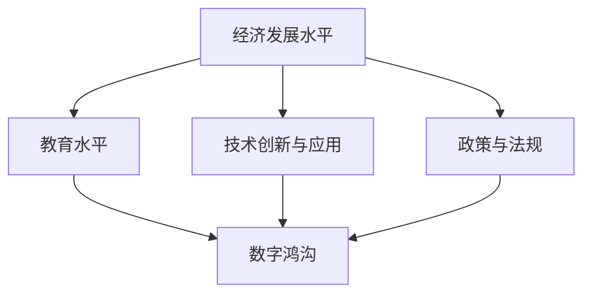

                 

# 《2050年的数字鸿沟：从数字红利到数字包容的信息平等》

> **关键词**：数字鸿沟、数字包容、信息平等、可持续发展、技术创新、政策响应

> **摘要**：本文从历史与现状、影响因素、影响与挑战、数字包容的路径与实践四个方面，探讨了数字鸿沟在2050年的演变与影响。通过分析数字鸿沟的地理分布、对个体和社会的深远影响，以及跨国合作与政策响应，揭示了数字包容的重要性。文章还探讨了数字包容的理念、关键要素、全球实践以及未来构建数字包容的路径，为全球实现信息平等提供了理论指导和实践参考。

## 目录大纲

### 第一部分：数字鸿沟的历史与现状

### 第二部分：数字鸿沟的影响与挑战

### 第三部分：数字包容的路径与实践

### 附录

## 第一部分：数字鸿沟的历史与现状

### 第1章：数字鸿沟的概念与演变

#### 1.1 数字鸿沟的定义与分类

数字鸿沟（Digital Divide）是指由于经济、社会、教育、技术等因素导致的信息获取和利用能力在不同群体之间存在的差异。根据美国国家电信和信息管理局（NTIA）的定义，数字鸿沟可以细分为以下几种类型：

1. **接入鸿沟**：指由于经济条件限制，某些人群无法获得必要的数字设备和互联网接入服务。
2. **技能鸿沟**：指由于教育和培训的差异，某些人群缺乏必要的数字技能和知识，无法有效地使用数字技术。
3. **使用鸿沟**：指由于使用频率和习惯的差异，某些人群在使用数字技术时无法达到应有的效率和效果。
4. **数字素养鸿沟**：指由于对数字技术的理解和认知水平的差异，某些人群无法理解和利用数字技术带来的机遇和改变。

#### 1.2 数字鸿沟的历史演变

数字鸿沟的历史可以追溯到20世纪90年代，随着互联网的普及，各国开始关注数字技术的应用与普及。以下是数字鸿沟历史演变的主要阶段：

1. **初始阶段（1990s）**：互联网刚刚兴起，数字鸿沟主要表现为接入鸿沟，发达国家与发达国家、城市与农村之间的差距明显。
2. **快速发展阶段（2000s）**：随着宽带互联网的普及，数字鸿沟开始向技能鸿沟和数字素养鸿沟转变，全球范围内的差距逐渐扩大。
3. **数字化转型阶段（2010s-2020s）**：移动互联网的普及使得数字鸿沟进一步加剧，数字技能和数字素养成为影响个人和社会发展的关键因素。

#### 1.3 当前数字鸿沟的现状分析

当前，全球范围内的数字鸿沟仍然存在，且呈现一些新的特点：

1. **全球性差距**：发达国家与发展中国家之间的数字鸿沟仍然明显，特别是在基础设施和技能水平方面。
2. **区域间差异**：不同地区之间的数字鸿沟差异较大，城市地区数字设施和服务较为完善，农村和偏远地区相对落后。
3. **社会分层**：数字鸿沟加剧了社会不平等，使得低收入群体、老年人和残障人士等弱势群体在数字世界中处于劣势地位。

### 第2章：数字鸿沟的影响因素

#### 2.1 经济发展水平

经济发展水平是影响数字鸿沟的重要因素之一。经济发达的国家和地区通常具备较高的基础设施建设和投资能力，能够提供更广泛的数字接入服务和更好的数字教育机会。而经济落后的国家和地区，则面临数字设备不足、网络基础设施落后等问题，导致数字鸿沟的加剧。

#### 2.2 教育水平

教育水平是影响数字鸿沟的关键因素。高质量的教育能够提高个体的数字技能和数字素养，使他们更好地利用数字技术。发达国家普遍重视数字教育，推行数字化教学和在线学习，使得数字鸿沟相对较小。而发展中国家由于教育资源匮乏，数字教育发展缓慢，导致数字鸿沟不断扩大。

#### 2.3 技术创新与应用

技术创新和应用是推动数字鸿沟缩小的重要动力。新兴技术的出现和应用，如移动互联网、云计算、大数据等，为全球范围内的数字接入和数字技能提升提供了新的机遇。然而，技术创新的速度和普及程度在不同国家和地区之间存在差异，导致数字鸿沟的存在。

#### 2.4 政策与法规

政策与法规是影响数字鸿沟的重要手段。政府通过制定相关政策和法规，可以促进数字基础设施的建设和普及，提高数字教育的质量，推动数字技能培训，从而缩小数字鸿沟。然而，政策与法规的实施效果取决于政府的管理能力和执行力。

### 第3章：数字鸿沟的地理分布

#### 3.1 全球数字鸿沟的地理分布

全球数字鸿沟的地理分布存在显著差异。发达国家如美国、德国、日本等，数字基础设施完善，互联网普及率较高，数字鸿沟相对较小。而发展中国家如印度、非洲等地，数字基础设施落后，互联网普及率较低，数字鸿沟较大。

#### 3.2 各大洲数字鸿沟的比较分析

各大洲之间的数字鸿沟也存在较大差异。欧洲和北美地区数字鸿沟相对较小，而非洲和南美洲等地数字鸿沟较大。这主要与各洲的经济发展水平、教育水平、技术创新能力以及政策法规等因素密切相关。

#### 3.3 国家内部数字鸿沟的差异

国家内部数字鸿沟的差异也较为明显。在一些国家，城市地区数字基础设施完善，互联网普及率较高，而农村和偏远地区则相对落后。此外，不同社会群体之间的数字鸿沟也较为明显，如低收入群体、老年人和残障人士等在数字接入和数字技能方面处于劣势地位。

## 第二部分：数字鸿沟的影响与挑战

### 第4章：数字鸿沟对个体的影响

#### 4.1 数字鸿沟对教育的影响

数字鸿沟对教育的影响主要体现在以下几个方面：

1. **教育资源不均衡**：数字鸿沟使得教育资源的分配不均衡，富裕家庭和发达地区能够获得更好的教育资源，而贫困家庭和落后地区则相对落后。
2. **学习机会受限**：数字鸿沟限制了贫困家庭和落后地区学生获取优质教育资源的机会，使得他们在学习过程中处于劣势地位。
3. **教育质量差异**：数字鸿沟导致教育质量的差异，富裕家庭和发达地区能够获得更好的教育质量，而贫困家庭和落后地区则面临教育资源匮乏的问题。

#### 4.2 数字鸿沟对就业的影响

数字鸿沟对就业的影响主要体现在以下几个方面：

1. **就业机会不均**：数字鸿沟使得就业机会在地域和行业间分布不均，富裕地区和发达行业拥有更多的就业机会，而贫困地区和落后行业则相对较少。
2. **技能需求差异**：数字鸿沟导致对数字技能的需求差异，富裕地区和发达行业对数字技能的需求较高，而贫困地区和落后行业则相对较低。
3. **就业稳定性**：数字鸿沟使得贫困家庭和落后地区就业者的就业稳定性较差，更容易面临失业和职业转型的问题。

#### 4.3 数字鸿沟对医疗的影响

数字鸿沟对医疗的影响主要体现在以下几个方面：

1. **医疗服务获取差异**：数字鸿沟使得医疗服务在地域和人群间获取存在差异，富裕地区和发达人群能够获得更好的医疗服务，而贫困地区和落后人群则相对困难。
2. **医疗信息获取困难**：数字鸿沟导致医疗信息的获取存在困难，贫困家庭和落后地区人群难以获取及时、准确的医疗信息。
3. **健康问题加剧**：数字鸿沟使得贫困家庭和落后地区人群面临更高的健康问题，如疾病预防、诊断和治疗等方面的困难。

### 第5章：数字鸿沟对社会的挑战

#### 5.1 数字鸿沟与社会不平等的加剧

数字鸿沟加剧了社会不平等现象，使得弱势群体在数字世界中处于更加不利的地位。这种不平等现象体现在教育、就业、医疗等多个领域，进一步扩大了贫富差距和社会分层。

#### 5.2 数字鸿沟对经济发展的制约

数字鸿沟对经济发展产生制约作用，阻碍了全球经济的整体发展。数字鸿沟使得贫困地区和落后行业无法充分利用数字技术带来的机遇，限制了经济发展潜力的发挥。

#### 5.3 数字鸿沟对国家安全的威胁

数字鸿沟对国家安全构成威胁，特别是在网络空间安全和信息战方面。数字鸿沟使得一些国家在网络安全和信息技术方面处于劣势地位，容易受到网络攻击和信息泄露的威胁。

### 第6章：数字鸿沟的跨国合作与政策响应

#### 6.1 数字鸿沟跨国合作的重要性

数字鸿沟跨国合作对于全球实现数字包容具有重要意义。通过跨国合作，可以共享数字技术、数字资源和数字经验，推动全球范围内的数字鸿沟缩小。

#### 6.2 主要国际组织在数字鸿沟领域的行动

主要国际组织在数字鸿沟领域采取了多种行动，包括：

1. **联合国**：通过发布《数字发展目标》，推动全球数字包容进程。
2. **国际电信联盟（ITU）**：致力于全球数字基础设施建设，推动互联网普及。
3. **世界银行**：提供数字基础设施和数字教育项目的资金支持。
4. **欧盟**：实施《数字单一市场战略》，推动欧盟范围内的数字包容。

#### 6.3 各国政府在数字鸿沟领域的政策与实践

各国政府在数字鸿沟领域采取了多种政策和实践，包括：

1. **基础设施建设**：加大对数字基础设施的投资，提高互联网接入率和普及率。
2. **数字教育**：推行数字化教育，提高数字素养和数字技能水平。
3. **数字技能培训**：为弱势群体提供数字技能培训，提高其就业能力和生活质量。
4. **数字权益保障**：保障弱势群体的数字权益，提高其参与数字世界的平等机会。

## 第三部分：数字包容的路径与实践

### 第7章：数字包容的理念与目标

#### 7.1 数字包容的概念

数字包容（Digital Inclusion）是指确保所有人群都能够平等地获取、使用和受益于数字技术，消除数字鸿沟，实现信息平等。数字包容强调数字技术的普及、数字技能的提升和数字权益的保障。

#### 7.2 数字包容的目标

数字包容的目标包括：

1. **消除数字鸿沟**：确保所有人群都能够平等地获取数字技术和服务。
2. **提高数字素养**：提高个体的数字技能和知识水平，使其能够有效地使用数字技术。
3. **促进数字权益保障**：保障弱势群体的数字权益，使其能够在数字世界中享有平等的机会和权益。
4. **推动可持续发展**：通过数字包容，实现经济、社会和环境的可持续发展。

#### 7.3 数字包容与可持续发展目标（SDGs）的关系

数字包容与可持续发展目标（SDGs）密切相关。联合国制定的17个可持续发展目标中，多个目标与数字包容直接相关，如消除贫困、减少不平等、保障教育、提高医疗保健水平等。数字包容是实现这些目标的重要手段。

### 第8章：数字包容的关键要素

#### 8.1 数字基础设施

数字基础设施是数字包容的基础。一个完善的数字基础设施能够提供稳定、高速的互联网接入服务，确保所有人都能平等地获取数字资源。数字基础设施的建设需要政府、企业和国际组织的共同努力。

#### 8.2 数字技能培训

数字技能培训是提高数字包容的重要手段。通过培训，个体能够掌握必要的数字技能和知识，提高其数字素养和就业能力。数字技能培训应覆盖各年龄段和各类人群，特别是弱势群体。

#### 8.3 数字权益保障

数字权益保障是确保数字包容实现的重要保障。通过制定相关政策和法规，保障弱势群体的数字权益，使其能够在数字世界中享有平等的机会和权益。数字权益保障包括隐私保护、网络安全和知识产权保护等方面。

#### 8.4 数字隐私与安全

数字隐私与安全是数字包容的重要方面。随着数字技术的广泛应用，个人隐私和安全问题日益突出。确保数字隐私和安全，保护用户数据不被滥用和泄露，是数字包容的重要组成部分。

### 第9章：数字包容的全球实践

#### 9.1 发达国家数字包容的实践

发达国家在数字包容方面取得了显著成果，为全球数字包容提供了有益的经验。以下是一些发达国家的数字包容实践：

1. **美国**：通过联邦通信委员会（FCC）的“宽带贫困项目”（BPIP），为低收入家庭提供宽带补贴，提高互联网接入率。
2. **欧盟**：实施《数字单一市场战略》，推动欧盟范围内的数字包容，提高数字教育和数字技能水平。
3. **日本**：推行“超智能社会”战略，加大对数字基础设施和数字教育的投资，提高全民数字素养。

#### 9.2 发展中国家数字包容的挑战与机遇

发展中国家在数字包容方面面临诸多挑战，但也拥有巨大的机遇。以下是一些发展中国家的数字包容挑战与机遇：

1. **挑战**：
   - **基础设施落后**：数字基础设施不足，互联网接入率低。
   - **教育水平较低**：数字教育发展缓慢，数字素养水平较低。
   - **资金短缺**：数字包容项目需要大量资金支持，但许多发展中国家财政困难。
2. **机遇**：
   - **经济发展**：数字包容有助于推动经济发展，提高就业和收入水平。
   - **技术创新**：发展中国家可以借鉴发达国家的经验，加快数字技术的创新和应用。
   - **国际合作**：通过国际合作，发展中国家可以获得资金、技术和经验支持，加快数字包容进程。

#### 9.3 数字包容的成功案例分析

以下是一些数字包容的成功案例：

1. **肯尼亚**：通过推行M-Pesa移动支付系统，提高了农村地区的金融包容性，促进了经济发展。
2. **印度**：实施“数字印度”计划，推动数字基础设施建设和数字教育普及，提高了全民数字素养。
3. **巴西**：通过“数字巴西”计划，加大对数字基础设施和数字教育的投资，提高了农村地区的数字包容水平。

### 第10章：构建数字包容的未来

#### 10.1 数字包容的政策建议

为了构建数字包容的未来，政府、企业和国际组织应采取以下政策建议：

1. **加大基础设施投资**：政府应加大对数字基础设施的投资，提高互联网接入率和覆盖范围。
2. **推行数字教育**：政府应推行数字教育，提高全民数字素养和技能水平。
3. **提供数字技能培训**：政府和企业应提供数字技能培训，帮助弱势群体提高就业能力和生活质量。
4. **保障数字权益**：政府应制定相关政策和法规，保障弱势群体的数字权益，提高其参与数字世界的平等机会。

#### 10.2 数字包容的技术创新

数字包容的技术创新是推动数字包容进程的重要动力。以下是一些数字包容的技术创新：

1. **物联网（IoT）**：通过物联网技术，实现智能家居、智能城市等应用，提高数字包容水平。
2. **人工智能（AI）**：通过人工智能技术，提供个性化教育、智能客服等服务，提高数字包容效果。
3. **区块链**：通过区块链技术，保障数字安全，提高数字信任，推动数字包容。

#### 10.3 全球数字包容的协同发展

全球数字包容的协同发展是实现数字包容目标的关键。以下是一些全球数字包容协同发展的建议：

1. **加强国际合作**：政府、企业和国际组织应加强合作，共享数字技术、数字资源和数字经验。
2. **推动数字包容政策**：各国政府应制定和推动数字包容政策，提高数字包容水平。
3. **支持发展中国家**：发达国家应支持发展中国家的数字包容项目，提供资金、技术和经验支持。

## 附录

### 附录A：数字鸿沟与数字包容相关指标与数据来源

以下是一些数字鸿沟与数字包容相关的指标与数据来源：

1. **互联网普及率**：世界银行、国际电信联盟（ITU）
2. **数字技能水平**：经合组织（OECD）、国际教育成就评估协会（IEA）
3. **数字接入状况**：联合国开发计划署（UNDP）、国际电信联盟（ITU）
4. **数字权益保障**：联合国教科文组织（UNESCO）、国际电信联盟（ITU）

### 附录B：主要国际组织与数字鸿沟相关的报告与文献

以下是一些主要国际组织与数字鸿沟相关的报告与文献：

1. **联合国《数字发展目标》**
2. **国际电信联盟（ITU）《数字包容全球报告》**
3. **经合组织（OECD）《数字素养与数字技能发展》**
4. **欧盟《数字单一市场战略》**

### 附录C：数字包容项目案例汇编

以下是一些数字包容项目案例汇编：

1. **肯尼亚M-Pesa移动支付系统**
2. **印度“数字印度”计划**
3. **巴西“数字巴西”计划**
4. **美国“宽带贫困项目”（BPIP）**

### 附录D：数字包容技术工具与平台介绍

以下是一些数字包容技术工具与平台介绍：

1. **物联网（IoT）平台**：亚马逊物联网（AWS IoT）、微软物联网（Azure IoT）
2. **人工智能（AI）平台**：谷歌机器学习（Google ML）、亚马逊机器学习（Amazon ML）
3. **区块链平台**：以太坊（Ethereum）、Hyperledger Fabric

### 附录E：数字包容教育与培训资源推荐

以下是一些数字包容教育与培训资源推荐：

1. **在线课程平台**：Coursera、edX、Udacity
2. **编程学习资源**：GitHub、LeetCode、Codecademy
3. **数字素养培训资源**：数字素养联盟（Digital Literacy Alliance）、联合国教科文组织（UNESCO）

### 附件：Mermaid 流程图与伪代码示例

#### 数字鸿沟影响因素分析流程图



#### 数字技能培训伪代码示例

```plaintext
# 设定培训目标
train_goal = "提高数字技能水平"

# 设计培训课程
course_content = [
    "基础计算机操作",
    "互联网使用技巧",
    "数字安全知识",
    "编程基础",
    "数据科学入门"
]

# 启动培训流程
for topic in course_content:
    print(f"开始培训：{topic}")
    # 培训内容实现
    # ...
    print(f"{topic}培训完成")
    
# 评估培训效果
train_evaluation = "满足培训目标"
print(f"培训效果评估：{train_evaluation}")
```

## 结束语

作者：AI天才研究院/AI Genius Institute & 禅与计算机程序设计艺术 /Zen And The Art of Computer Programming

本文通过详细分析数字鸿沟的历史与现状、影响因素、影响与挑战以及数字包容的路径与实践，探讨了数字包容的重要性。数字包容不仅有助于消除数字鸿沟，提高个体的生活质量，还能促进社会经济发展和国家安全的提升。在全球范围内，数字包容已经成为一个重要的议题，各国政府和国际组织应共同努力，推动数字包容的实现，为构建一个公平、包容、可持续的数字世界贡献力量。让我们携手并进，为实现数字包容的未来而努力。

