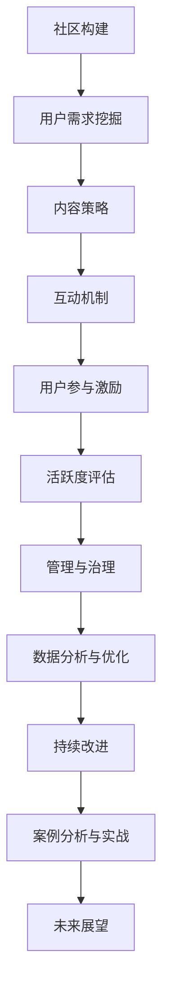

                 

# 《开发者社区运营：打造忠实用户群的秘诀》

## 关键词：
开发者社区，用户忠诚度，运营策略，互动机制，知识分享，品牌建设

## 摘要：
本文深入探讨开发者社区运营的各个方面，包括社区的重要性、构建与维护、用户需求挖掘、内容策略、互动与活跃度提升、开发者关系管理、社区数据分析与持续优化等。通过成功案例分析、实战指导和未来展望，为开发者社区运营提供系统化的策略和实战经验。

---

### 第一部分：开发者社区概述

#### 1.1 开发者社区的重要性

开发者社区是一个聚集了众多技术爱好者和专业人士的虚拟空间，它不仅是信息交流和知识分享的平台，更是技术创新和产业合作的源泉。以下是开发者社区的一些关键重要性：

- **知识共享与传播**：开发者社区汇聚了大量的技术文章、教程、开源项目和讨论，有助于知识的快速传播和共享。
- **技能提升与学习**：开发者可以在社区中学习新技能、解决技术难题，从而不断提升自身能力。
- **社交网络**：社区为开发者提供了一个结识同行、拓展人脉的机会，有助于职业发展和合作机会的发现。
- **技术趋势预测**：开发者社区的活跃讨论和趋势分析能够为技术趋势预测提供重要参考。
- **商业合作与机遇**：社区中的开发者往往拥有共同的技术兴趣和商业目标，这为商业合作和商机创造提供了可能性。

#### 1.2 社区对开发者、公司和行业的影响

- **对开发者的影响**：开发者社区为个人提供了知识共享、技能提升、社交互动的机会，有助于职业发展和个人成长。
- **对公司的影响**：公司可以通过开发者社区进行品牌推广、获取用户反馈、发现技术人才，进而促进产品优化和业务拓展。
- **对行业的影响**：开发者社区促进了技术知识的传播和创新，加速了行业的技术进步和生态建设。

#### 1.3 开发者社区的发展历史与趋势

- **早期阶段**：开发者社区起源于20世纪90年代的BBS和论坛，当时的社区以技术讨论和问题解答为主。
- **中期阶段**：随着互联网的发展，开发者社区逐渐演变为以博客、Wiki、微博等形式存在的综合性平台。
- **当前阶段**：现代开发者社区更加注重互动性、社区文化和用户忠诚度的培养，同时结合了社交媒体、开源项目和在线教育等元素。

- **未来趋势**：未来的开发者社区将更加智能化、个性化，利用大数据、人工智能等技术提升用户体验和社区活跃度，同时也会更加注重社会责任和可持续发展。

---

#### 第二部分：社区运营基础

#### 2.1 构建有效的开发者社区

构建一个有效的开发者社区需要遵循以下步骤和原则：

1. **明确目标与定位**：社区需要明确目标用户群体、服务范围和核心价值，以定位社区的发展方向。
2. **搭建平台**：选择合适的社区平台，如Discourse、GitLab、GitHub等，确保平台具备良好的用户体验和功能。
3. **设计社区架构**：设计清晰合理的社区架构，包括角色分工、权限管理、功能模块等。
4. **构建社区文化**：培养积极的社区文化，如鼓励知识分享、尊重他人、互助互信等。
5. **维护与更新**：持续关注社区动态，及时更新内容，优化用户体验。

#### 2.2 社区文化塑造与维护

社区文化的塑造与维护是社区成功的关键：

1. **核心价值观**：明确社区的核心价值观，如开放性、共享性、创新性等。
2. **激励机制**：建立激励机制，鼓励用户参与社区活动，如发布优质内容、积极参与讨论等。
3. **榜样示范**：树立榜样人物，发挥其在社区中的影响力，带动其他用户的行为。
4. **持续沟通**：定期与用户进行互动，收集用户反馈，及时调整社区策略。
5. **保持活跃**：组织线上和线下活动，提高社区活跃度，增强用户黏性。

---

#### 2.3 用户分析与需求挖掘

用户分析是社区运营的基础，通过以下步骤进行用户分析和需求挖掘：

1. **用户画像**：收集用户的基本信息、行为数据等，构建用户画像。
2. **行为分析**：分析用户在社区中的行为模式，如活跃时间、参与话题等。
3. **需求识别**：通过问卷调查、用户访谈等方式，了解用户需求和期望。
4. **需求分类**：对识别出的用户需求进行分类，如技术学习、问题解答、社交互动等。
5. **需求满足**：根据用户需求，提供相应的服务或资源，如教程、讨论区、活动等。

---

#### 2.4 内容策略与知识分享

内容策略是开发者社区的核心，以下内容策略和知识分享方法有助于提升社区价值：

1. **内容类型**：提供多样化的内容，如技术文章、教程、案例分析、开源项目等。
2. **内容发布**：定期发布高质量内容，建立内容发布计划，确保内容的持续性和规律性。
3. **知识共享**：鼓励用户分享自己的知识和经验，如开设专栏、参与讨论、组织讲座等。
4. **内容推广**：利用社交媒体、邮件列表等渠道，推广社区内容和活动，吸引更多用户参与。
5. **内容质量**：建立内容审核机制，确保内容的质量和准确性，提高用户满意度。

---

### 第三部分：社区互动与用户活跃度提升

#### 3.1 社区互动机制与工具

社区互动机制和工具是提高社区活跃度和用户参与度的关键：

1. **互动形式**：包括发帖、评论、投票、问卷调查、活动等。
2. **互动工具**：选择合适的互动工具，如评论系统、问答系统、在线聊天工具等。
3. **互动策略**：鼓励用户积极参与社区互动，如发布激励措施、组织互动活动等。
4. **互动效果评估**：定期评估互动效果，调整互动策略，提高用户参与度。

---

#### 3.2 用户参与与贡献激励

用户参与是社区活力的重要来源，以下方法可以激励用户参与和贡献：

1. **用户动机**：了解用户参与动机，如知识分享、社交互动、技能提升等。
2. **参与障碍**：识别用户参与障碍，如技术门槛、时间成本等。
3. **激励措施**：提供激励措施，如积分奖励、荣誉称号、实物奖励等。
4. **参与引导**：设计简单易用的参与机制，提供参与指南，降低用户参与门槛。
5. **参与反馈**：及时给予用户反馈，认可和鼓励用户贡献，增强用户参与感。

---

#### 3.3 社区活跃度评估与优化

社区活跃度评估是社区运营的重要环节，以下方法可以评估和优化社区活跃度：

1. **活跃度指标**：设置合适的活跃度指标，如发帖数、回复数、活动参与度等。
2. **数据分析**：利用数据分析工具，分析活跃度数据，找出活跃用户和活跃话题。
3. **优化策略**：根据活跃度数据，调整社区运营策略，如内容发布、活动策划、互动机制等。
4. **案例分析**：分析成功社区的运营经验，借鉴优秀做法，优化自身社区运营。

---

### 第四部分：开发者关系管理

#### 4.1 企业与开发者的合作模式

企业与开发者之间的合作模式是开发者社区运营的重要组成部分，以下几种合作模式值得考虑：

1. **开源合作**：企业参与开源项目，贡献代码和资源，吸引开发者参与和贡献。
2. **技术合作**：企业提供技术支持，与开发者合作解决技术难题，促进技术进步。
3. **人才合作**：企业通过社区发现和培养技术人才，建立人才储备库。
4. **市场合作**：企业与开发者合作推广产品，共同开拓市场，实现共赢。

---

#### 4.2 开发者生态建设

开发者生态建设是提升开发者社区价值和影响力的重要举措，以下方法可以构建开发者生态：

1. **生态系统概念**：理解开发者生态系统的概念，包括开发者、企业、开源项目、技术标准等。
2. **生态构建**：通过整合资源、建立合作机制、推广技术标准等方式，构建开发者生态系统。
3. **生态优势**：发挥开发者生态的优势，如资源共享、协同创新、市场拓展等。
4. **生态挑战**：应对开发者生态的挑战，如利益分配、知识产权保护、竞争与合作等。

---

#### 4.3 社区品牌建设

社区品牌建设是提升社区影响力和用户忠诚度的重要策略，以下方法可以塑造社区品牌：

1. **品牌定位**：明确社区品牌定位，如技术交流平台、开发者社区、技术学习平台等。
2. **品牌塑造**：通过内容建设、互动活动、用户体验等方式，塑造社区品牌形象。
3. **品牌传播**：利用社交媒体、线下活动等渠道，传播社区品牌，提升知名度。
4. **品牌维护**：持续关注用户反馈，优化社区服务，维护社区品牌价值。

---

### 第五部分：社区管理与持续优化

#### 5.1 社区管理与治理

社区管理与治理是确保社区健康发展的关键，以下原则和方法可以指导社区管理和治理：

1. **管理原则**：尊重用户、公平公正、透明公开、可持续性等。
2. **管理职责**：明确社区管理职责，如内容审核、用户管理、活动策划等。
3. **治理机制**：建立社区治理机制，如规章制度、投诉反馈机制、治理团队等。
4. **管理模式**：采用适当的社区管理模式，如自组织、集中管理、混合管理等。

---

#### 5.2 社区数据分析与优化

社区数据分析与优化是提升社区运营效率和质量的重要手段，以下方法可以指导社区数据分析和优化：

1. **数据收集**：收集社区运营数据，如用户行为、内容反馈、活动参与等。
2. **数据分析**：利用数据分析工具，分析数据，发现问题和机会。
3. **数据驱动**：基于数据分析结果，调整运营策略，优化社区服务。
4. **数据优化**：持续跟踪社区数据，评估优化效果，不断改进社区运营。

---

#### 5.3 持续改进与社区活力保持

持续改进和社区活力保持是社区长期发展的关键，以下策略可以保持社区活力：

1. **创新驱动**：不断引入新技术、新理念，推动社区创新和发展。
2. **用户互动**：保持与用户的密切互动，了解用户需求，提供个性化服务。
3. **内容更新**：定期发布高质量内容，保持社区内容的新鲜度和活力。
4. **活动策划**：策划多样化的活动，提高用户参与度和社区活跃度。
5. **社区文化**：培养积极的社区文化，鼓励用户参与，增强社区凝聚力。

---

### 第六部分：案例分析与实战指导

#### 6.1 成功社区案例分析

以下是一些成功开发者社区的案例分析：

1. **GitHub**：GitHub作为一个开源项目的托管平台，通过强大的社交功能、高效的代码管理和良好的用户体验，吸引了大量开发者，成为了全球最大的开源社区之一。
2. **Stack Overflow**：Stack Overflow作为一个问题解答平台，通过Q&A模式，为开发者提供了丰富的技术问答资源，帮助开发者解决技术难题，受到了广泛欢迎。
3. **Docker Community**：Docker社区通过提供丰富的教程、案例和讨论区，为开发者提供了学习和交流Docker技术的平台，促进了Docker技术的普及和应用。

#### 6.2 案例经验总结与借鉴

以下是一些成功案例的经验总结和借鉴：

1. **内容建设**：提供高质量的内容是成功社区的关键，定期发布技术文章、教程、案例等，满足用户的学习和需求。
2. **用户互动**：积极与用户互动，鼓励用户参与讨论、分享知识和经验，提高用户黏性和社区活跃度。
3. **社区文化**：建立积极的社区文化，鼓励用户尊重、互助和合作，营造良好的社区氛围。
4. **品牌建设**：通过品牌传播和推广，提升社区知名度和影响力，吸引更多用户和合作伙伴。

---

### 第七部分：未来展望

#### 7.1 开发者社区的未来趋势

开发者社区的未来发展趋势包括：

1. **智能化**：利用人工智能技术，提供个性化推荐、智能问答等，提升用户体验和社区活跃度。
2. **多元化**：社区内容将更加多元化，涵盖更多技术领域和应用场景，满足开发者多样化的需求。
3. **全球化**：开发者社区将更加全球化，跨越地域和文化差异，吸引全球开发者参与和贡献。
4. **可持续发展**：社区将更加注重可持续发展，通过环保、公益等方式，推动社区和社会的共同进步。

#### 7.2 新技术对社区运营的影响

新技术对开发者社区运营的影响包括：

1. **区块链技术**：通过区块链技术，可以构建去中心化的开发者社区，提高社区的安全性和透明度。
2. **云计算技术**：云计算技术为开发者社区提供了强大的计算和存储能力，支持大规模的数据分析和处理。
3. **物联网技术**：物联网技术为开发者社区提供了丰富的应用场景和机会，推动了社区的创新和发展。

#### 7.3 未来社区运营的挑战与机遇

未来社区运营将面临以下挑战和机遇：

1. **挑战**：用户增长放缓、内容质量下降、社区活跃度下降等。
2. **机遇**：新技术带来的创新机会、全球化趋势带来的市场机遇、用户需求变化带来的创新机会。

---

### 附录

#### 附录 A：社区运营工具与资源

以下是一些常用的社区运营工具和资源：

1. **主流社区平台对比**
   - GitHub
   - Discourse
   - Stack Overflow
   - GitLab

2. **开源社区工具介绍**
   - Jekyll
   - Markdown
   - Gitalk

3. **社区运营资源推荐**
   - 开源项目指南
   - 技术博客推荐
   - 社区运营书籍

---

**作者：AI天才研究院/AI Genius Institute & 禅与计算机程序设计艺术 /Zen And The Art of Computer Programming**

---

### 核心概念与联系（Mermaid流程图）



---

### 核心算法原理讲解（伪代码）

```python
# 伪代码：社区活跃度计算算法

def calculate_activity_score(user_activity_data):
    """
    计算用户活跃度得分。
    参数：user_activity_data - 用户活动数据列表，包括发帖数、回复数、参与讨论数等。
    返回：activity_score - 用户活跃度得分。
    """
    
    # 初始化得分
    activity_score = 0
    
    # 计算发帖、回复等活动的得分
    for activity in user_activity_data:
        if activity['type'] == 'post':
            activity_score += activity['score_post']
        elif activity['type'] == 'reply':
            activity_score += activity['score_reply']
        elif activity['type'] == 'discussion':
            activity_score += activity['score_discussion']
    
    # 根据活动总数进行加权
    activity_score *= len(user_activity_data) * 0.1
    
    # 返回最终得分
    return activity_score
```

---

### 数学模型和数学公式 & 详细讲解 & 举例说明

#### 社区用户留存率

**数学模型：**

$$
\text{留存率} = \frac{\text{次日留存用户数}}{\text{当日活跃用户数}} \times 100\%
$$

**详细讲解：**

留存率是衡量社区用户活跃度和用户忠诚度的重要指标，通过计算次日留存用户数与当日活跃用户数的比例，可以直观地反映出用户对社区的黏性和持续参与度。

**举例说明：**

假设某社区在一天内有1000个活跃用户，其中次日有800个用户再次访问，则该社区的次日留存率为：

$$
\text{留存率} = \frac{800}{1000} \times 100\% = 80\%
$$

这意味着有80%的用户在第二天仍然返回社区，显示出较高的用户留存率。

---

### 项目实战

#### 实战案例：搭建一个简单的开发者社区

1. **环境搭建**

   - **GitHub Pages**：使用GitHub Pages搭建静态网站，可以通过GitHub仓库中的Markdown文件自动生成网页。
   - **Jekyll**：安装Jekyll，这是一个流行的静态网站生成工具，支持Markdown文件格式，可以方便地生成网页。

2. **源代码实现**

   - **布局**：创建一个基础的Jekyll布局文件，如`_layouts`目录下的`default.html`，用于生成网页的布局。

     ```html
     ---
     layout: default
     title: {{ page.title }}
     date: {{ page.date }}
     ---
     
     <h1>{{ page.title }}</h1>
     <p>{{ page.date }}</p>
     <div>{{ content }}</div>
     ```

   - **Markdown文章**：在`_posts`目录下创建Markdown文件，如`2023-10-01-first-post.md`，编写文章内容。

     ```markdown
     ---
     layout: post
     title: "社区搭建实战"
     date: 2023-10-01
     ---
     
     # 社区搭建实战

     本文介绍了如何使用GitHub Pages和Jekyll搭建一个简单的开发者社区。以下是详细的步骤：

     1. **环境搭建**
        - 创建GitHub仓库，命名为`your-community`。
        - 将Jekyll安装到本地环境中。
     
     2. **布局和配置**
        - 创建`_layouts`目录和`default.html`布局文件。
        - 配置`_config.yml`文件，设置网站的基础信息。

     3. **内容发布**
        - 创建`_posts`目录，编写Markdown格式的文章。
        - 使用`jekyll build`命令生成静态网页。

     4. **部署**
        - 将生成的静态网页部署到GitHub Pages上。

     通过以上步骤，你将获得一个基本的开发者社区网站。

     ```

3. **代码解读与分析**

   - **Markdown语法**：Markdown是一种轻量级的标记语言，用于快速编写文本和格式化内容。通过Markdown，可以方便地创建标题、段落、列表、链接等。
   - **Jekyll配置**：`_config.yml`文件用于配置Jekyll的基础设置，如网站标题、描述、作者等。配置文件中的变量和指令可以自定义网站的行为和外观。
   - **静态网页生成**：Jekyll通过读取Markdown文件，生成HTML文件，从而构建静态网站。生成的HTML文件可以部署到任何静态网页托管服务上，如GitHub Pages。

---

以上是《开发者社区运营：打造忠实用户群的秘诀》的完整正文部分，包括各个章节的具体内容和详细讲解。通过本文，读者可以系统地了解开发者社区运营的核心概念、策略和实践方法，为打造一个成功且活跃的开发者社区提供参考。文章末尾的附录部分提供了社区运营工具和资源的详细介绍，以帮助读者更好地实践和应用所学知识。

---

### 附录 A：社区运营工具与资源

#### A.1 主流社区平台对比

以下是一些主流社区平台的对比，包括特点、优缺点和适用场景：

1. **GitHub**
   - **特点**：开源项目的托管平台，强大的代码管理功能，集成社交媒体功能。
   - **优点**：强大的社区氛围，丰富的开源项目，良好的用户体验。
   - **缺点**：对于非开发者可能不够友好，社交功能相对有限。
   - **适用场景**：开发者社区，开源项目协作。

2. **Discourse**
   - **特点**：全栈社区平台，自定义功能丰富，支持多种语言和主题。
   - **优点**：高度可定制，易于扩展，良好的用户体验。
   - **缺点**：部署和维护成本较高，社区初建可能需要时间培养用户。
   - **适用场景**：企业内部社区，小型开发者社区。

3. **Stack Overflow**
   - **特点**：专业的问答社区，高质量的技术问题解答，丰富的知识库。
   - **优点**：强大的问答系统，高质量的内容，广泛的用户基础。
   - **缺点**：主要面向编程问题，对其他类型的内容支持有限。
   - **适用场景**：技术问答社区，编程学习。

4. **GitLab**
   - **特点**：开源代码托管平台，集成项目管理、CI/CD等功能。
   - **优点**：功能全面，社区活跃，适合企业内部使用。
   - **缺点**：可能需要一定的技术背景来使用，社区氛围相对低调。
   - **适用场景**：企业内部开发社区，开源项目协作。

#### A.2 开源社区工具介绍

以下是一些开源的社区工具，可用于搭建和维护开发者社区：

1. **Jekyll**
   - **特点**：静态网站生成工具，支持Markdown文件，易于部署。
   - **优点**：简单易用，部署方便，高度可定制。
   - **缺点**：不适合实时互动，需要一定的技术背景。
   - **适用场景**：静态网站，博客，简单社区。

2. **Markdown**
   - **特点**：轻量级文本格式，用于编写文档和博客。
   - **优点**：简单易学，兼容性强，支持多种平台。
   - **缺点**：格式有限，不适合复杂内容排版。
   - **适用场景**：快速编写文档，博客，技术文章。

3. **Gitalk**
   - **特点**：基于GitHub的评论系统，支持Markdown，易于集成。
   - **优点**：简单易用，支持GitHub账号登录，安全可靠。
   - **缺点**：评论功能相对有限，需要GitHub账号。
   - **适用场景**：静态网站，博客，需要简单评论系统。

#### A.3 社区运营资源推荐

以下是一些社区运营相关的资源和书籍，有助于提升社区运营的能力：

1. **《社区运营实战：如何运营一个成功的线上社区》**
   - **作者**：王通
   - **内容**：详细介绍了社区运营的各个方面，包括用户分析、内容策略、活动策划等。
   - **推荐理由**：实战经验丰富，内容全面，适合初学者和有一定基础的运营者。

2. **《社交红利：互联网社会学的19个案例》**
   - **作者**：徐志斌
   - **内容**：通过案例解析，探讨了社交媒体和社区运营的原理和实践。
   - **推荐理由**：深入浅出，案例丰富，有助于理解社区运营的核心逻辑。

3. **《内容运营：如何打造高粘性社群》**
   - **作者**：李明顺
   - **内容**：介绍了内容运营的核心策略和方法，包括内容策划、推广、用户互动等。
   - **推荐理由**：系统全面，实战性强，适合内容运营和社区运营者。

4. **《社群营销实战手册》**
   - **作者**：刘克亮
   - **内容**：详细介绍了社群营销的流程和方法，包括社群定位、用户互动、活动策划等。
   - **推荐理由**：实战经验丰富，操作性强，适合希望开展社群营销的企业和个人。

---

以上是《开发者社区运营：打造忠实用户群的秘诀》的完整内容，包括核心概念、算法原理、项目实战以及附录部分。通过本文，读者可以全面了解开发者社区运营的各个方面，为构建和运营一个成功的开发者社区提供指导和参考。希望本文能为开发者社区运营者带来启示和帮助，共同推动社区的发展和进步。

