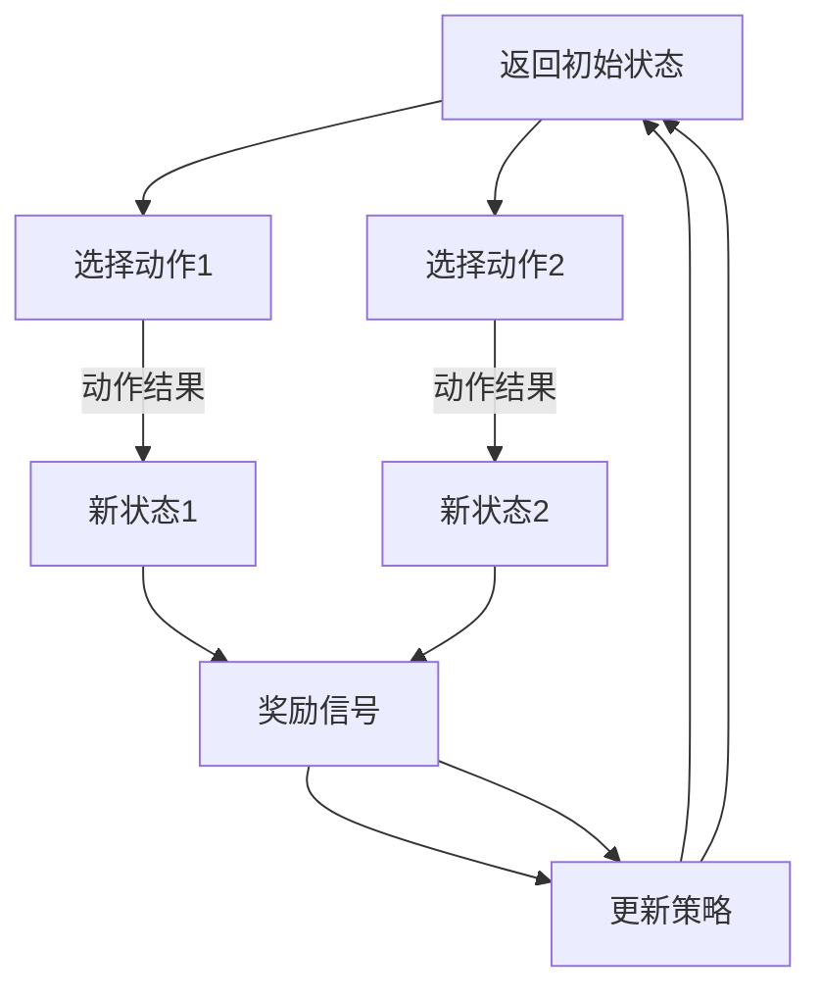

                 

### 文章标题

**强化学习在智能广告投放中的优化应用**

强化学习在近年来的发展中展现出了其在复杂决策环境中的强大能力。随着互联网广告市场的不断增长，如何提高广告投放的效率和效果成为了广告行业面临的重大挑战。强化学习作为一种通过不断尝试和反馈来优化策略的机器学习技术，为解决广告投放问题提供了新的思路和解决方案。

本文将从以下几个方面探讨强化学习在智能广告投放中的应用与优化：

1. **强化学习基础**：介绍强化学习的基本概念、原理和算法，为理解其在广告投放中的应用奠定基础。
2. **智能广告投放背景**：分析广告投放的现状和挑战，强调强化学习在其中的重要性。
3. **强化学习在广告投放中的应用**：详细讨论强化学习在广告投放中的具体应用场景和算法实现。
4. **案例分析**：通过实际案例展示强化学习在广告投放中的效果和优势。
5. **数学模型与算法解析**：深入解析强化学习在广告投放中的数学模型和算法实现细节。
6. **项目实战**：提供实际项目的开发环境和源代码实现，进行代码解读与分析。
7. **总结与展望**：总结全文内容，展望强化学习在广告投放领域的未来发展方向。

### 文章关键词

强化学习，智能广告投放，优化应用，算法实现，案例分析，数学模型

### 文章摘要

本文系统性地介绍了强化学习在智能广告投放中的优化应用。首先，我们对强化学习的基本概念和原理进行了深入探讨，包括马尔可夫决策过程、奖励机制、策略评估等核心概念。接着，分析了广告投放的现状和挑战，并指出强化学习在提高广告投放效率和效果方面的重要作用。随后，本文详细阐述了强化学习在广告投放中的应用场景和算法实现，包括Q-Learning、SARSA、DQN、Policy Gradient和Actor-Critic等算法。通过实际案例分析，本文展示了强化学习在广告投放中的效果和优势。最后，本文深入解析了强化学习在广告投放中的数学模型和算法实现细节，并提供了一个实际项目的开发环境和源代码实现，为读者提供了实用的参考。全文旨在为读者提供全面、系统的强化学习在智能广告投放中的应用指南。

### 目录大纲设计思路

为了设计出《强化学习在智能广告投放中的优化应用》这本书的完整目录大纲，我们首先需要明确以下几点：

1. **书名理解**：书名中提到的“强化学习”是本书的核心技术主题，“智能广告投放”则是应用场景，“优化应用”表明了本书侧重于如何应用强化学习技术来提升广告投放效果。

2. **内容框架**：书的大纲需要包含对强化学习的介绍、其在广告投放领域的应用、相关的算法和技术细节、实际应用的案例以及相关的数学模型和理论。

3. **目录结构**：按照书名来设计目录，分为几个主要部分，如：引言、强化学习基础、广告投放背景、强化学习在广告投放中的应用、案例分析、数学模型解析、算法实现、总结和展望。

4. **章节细化**：每一部分下包含具体的章节，确保每一章节都围绕一个核心主题展开，章节之间逻辑清晰，上下衔接自然。

5. **知识点覆盖**：确保覆盖强化学习的基础知识、广告投放的原理与流程、强化学习的算法在广告投放中的具体应用、以及相关的数学模型和实现细节。

### 目录大纲设计

以下是《强化学习在智能广告投放中的优化应用》的目录大纲设计：

### 第一部分：引言

1. **强化学习概述**
   - 1.1 强化学习基本概念
   - 1.2 强化学习与其他学习方法的对比
   - 1.3 强化学习在广告投放中的重要性

### 第二部分：强化学习基础

2. **强化学习原理**
   - 2.1 马尔可夫决策过程
   - 2.2 奖励机制
   - 2.3 策略评估与策略迭代

3. **强化学习框架**
   - 3.1 强化学习模型
   - 3.2 状态空间与动作空间
   - 3.3 值函数与策略

4. **经典强化学习算法介绍**
   - 4.1 Q-Learning算法
   - 4.2 SARSA算法
   - 4.3 Deep Q-Network (DQN)
   - 4.4 Policy Gradient算法
   - 4.5 Actor-Critic算法

5. **强化学习算法的数学模型**
   - 5.1 马尔可夫性质
   - 5.2 动态规划原理
   - 5.3 奖励最大化策略

### 第三部分：智能广告投放基础

6. **广告投放的基本概念**
   - 6.1 广告市场概述
   - 6.2 广告投放的目标
   - 6.3 广告投放的流程

7. **广告投放中的挑战与问题**
   - 7.1 用户行为多样性
   - 7.2 广告效果评估
   - 7.3 广告投放策略优化

### 第四部分：强化学习在广告投放中的应用

8. **强化学习在广告投放中的应用场景**
   - 8.1 广告展示策略优化
   - 8.2 广告点击率预测
   - 8.3 广告投放预算分配

9. **强化学习算法在广告投放中的应用**
   - 9.1 Q-Learning算法应用
   - 9.2 SARSA算法应用
   - 9.3 DQN算法应用
   - 9.4 Policy Gradient算法应用
   - 9.5 Actor-Critic算法应用

### 第五部分：案例分析

10. **强化学习在广告投放中的成功案例**
    - 10.1 案例背景
    - 10.2 案例分析方法
    - 10.3 案例实施步骤
    - 10.4 案例效果分析

### 第六部分：数学模型与算法解析

11. **强化学习在广告投放中的数学模型**
    - 11.1 回报函数设计
    - 11.2 状态和动作空间设计
    - 11.3 探索与利用平衡
    - 11.4 多臂老虎机问题应用

12. **强化学习算法在广告投放中的实现与优化**
    - 12.1 算法实现流程
    - 12.2 算法优化策略
    - 12.3 深度强化学习算法优化

### 第七部分：项目实战

13. **项目实战：强化学习在广告投放中的应用**
    - 13.1 项目背景
    - 13.2 项目目标
    - 13.3 实施步骤
    - 13.4 结果分析与讨论

### 第八部分：总结与展望

14. **总结与展望**
    - 14.1 强化学习在广告投放中的总结
    - 14.2 未来研究方向
    - 14.3 对读者的建议

### 附录

15. **附录A：强化学习在广告投放中的工具和资源**
    - 15.1 开源框架介绍
    - 15.2 常用数据集和案例
    - 15.3 进一步学习资源推荐

### 目录设计要点说明

1. **引言部分**：介绍了强化学习的基本概念和应用背景，为后续章节的内容做铺垫。

2. **强化学习基础**：详细讲解了强化学习的原理、框架和算法，为读者提供理论基础。

3. **广告投放基础**：介绍了广告投放的基本概念和流程，帮助读者理解强化学习在其中的应用场景。

4. **应用部分**：通过具体的算法和案例分析，展示了强化学习在广告投放中的实际应用。

5. **数学模型与算法解析**：深入探讨了强化学习在广告投放中的数学模型和算法实现，帮助读者理解技术细节。

6. **项目实战**：通过实际项目案例，让读者了解如何在实际环境中应用强化学习。

7. **总结与展望**：总结了全书内容，并对未来的研究方向提出了建议。

8. **附录**：提供了额外的工具和资源，便于读者进一步学习和实践。

这样的目录设计不仅结构清晰，而且内容全面，能够帮助读者系统地学习和掌握强化学习在智能广告投放中的应用。

---

### 强化学习概述

强化学习（Reinforcement Learning，RL）是机器学习的一个重要分支，旨在通过智能体（agent）与环境（environment）的交互，逐步学习到最优策略（policy）。强化学习与其他机器学习方法，如监督学习和无监督学习，有着本质的区别。监督学习依赖于已标记的数据集，通过学习输入和输出之间的关系来预测未知数据的标签；无监督学习则不依赖标签数据，旨在发现数据中的内在结构和模式。而强化学习则强调智能体在动态环境中通过试错（trial-and-error）和反馈（feedback）来学习最优行为。

#### 强化学习的基本概念

1. **智能体（Agent）**：执行动作并从环境中接收反馈的实体。在广告投放中，智能体可以是广告投放平台或算法。

2. **环境（Environment）**：智能体所处的上下文，提供状态信息和奖励信号。广告投放环境包括用户行为、广告内容、市场环境等。

3. **状态（State）**：描述环境当前状态的属性。在广告投放中，状态可以包括用户特征、广告位置、时间等因素。

4. **动作（Action）**：智能体根据当前状态选择的行为。在广告投放中，动作可以是展示广告、点击广告、投放新广告等。

5. **策略（Policy）**：智能体从状态到动作的映射规则，用于指导智能体的行为。策略可以通过学习得到，也可以预先设定。

6. **奖励（Reward）**：智能体执行动作后从环境获得的即时反馈。奖励可以是正值（成功反馈）或负值（失败反馈）。

#### 强化学习与其他学习方法的对比

1. **与监督学习的对比**：

   - 监督学习依赖大量标记数据，而强化学习在初始阶段往往没有标记数据。
   - 监督学习关注预测结果，而强化学习关注策略的最优化。
   - 监督学习中的模型在给定输入时直接输出结果，而强化学习中的智能体需要通过试错来逐步优化策略。

2. **与无监督学习的对比**：

   - 无监督学习旨在发现数据中的内在结构，而强化学习则侧重于学习如何在环境中做出最优决策。
   - 无监督学习不需要外部奖励信号，而强化学习依赖于奖励信号来指导学习过程。

#### 强化学习在广告投放中的重要性

广告投放是一项复杂且动态的任务，涉及到用户行为分析、广告效果评估和策略优化等多个方面。强化学习作为一种通过不断试错来优化策略的方法，在广告投放中具有显著的优势：

1. **自适应能力**：强化学习能够根据环境变化和用户行为动态调整策略，从而提高广告投放的精准度和效果。

2. **连续决策**：广告投放需要智能体在连续的时间窗口内做出决策，强化学习能够处理这类连续决策问题。

3. **多目标优化**：广告投放往往涉及到多个目标，如点击率、转化率和预算分配等。强化学习可以通过优化策略来平衡这些目标。

4. **个性化推荐**：强化学习能够根据用户的历史行为和偏好，个性化地推荐广告内容，提高用户体验和广告效果。

总之，强化学习在智能广告投放中具有广泛的应用前景，能够显著提高广告投放的效率和效果。

---

### 强化学习基础

强化学习（Reinforcement Learning，RL）是一种通过智能体（Agent）与环境的交互来学习最优策略的机器学习方法。理解强化学习的基本原理和核心概念，是深入探讨其在广告投放中的应用的重要前提。本节将详细介绍强化学习的原理、框架、经典算法及其数学模型。

#### 强化学习原理

强化学习的基本原理可以概括为“试错学习”，即智能体在环境中通过不断尝试和反馈，逐步学习到最优策略。这个过程可以分为以下几个步骤：

1. **初始状态（State）**：智能体开始在一个初始状态下。
2. **动作选择（Action）**：智能体根据当前状态选择一个动作。
3. **状态转移（State Transition）**：智能体执行动作后，环境发生变化，智能体进入一个新的状态。
4. **奖励信号（Reward Signal）**：智能体根据动作的结果，从环境中获得一个奖励信号，奖励信号可以是正值（成功）或负值（失败）。
5. **策略更新（Policy Update）**：智能体根据奖励信号和历史经验，更新其策略，以期望在未来获得更高的回报。

这个过程不断重复，智能体通过不断试错和学习，逐步找到最优策略。强化学习中的核心概念包括：

- **奖励（Reward）**：奖励是智能体从环境中获得的即时反馈，用于指导智能体的学习过程。奖励可以是正值（成功反馈）或负值（失败反馈）。
- **策略（Policy）**：策略是智能体从状态到动作的映射规则，用于指导智能体的行为。策略可以通过学习得到，也可以预先设定。
- **价值函数（Value Function）**：价值函数衡量智能体在某个状态或状态集合下的预期回报。它包括状态价值函数和动作价值函数。
- **模型（Model）**：模型描述智能体与环境之间的交互过程，包括状态转移概率和奖励分布。

#### 强化学习框架

强化学习框架由以下几个主要组成部分构成：

1. **状态（State）**：描述智能体当前所处的环境状态。
2. **动作（Action）**：智能体可以执行的动作集合。
3. **策略（Policy）**：智能体的行为规则，定义状态到动作的映射。
4. **价值函数（Value Function）**：衡量智能体在某个状态或状态集合下的预期回报。
5. **模型（Model）**：描述状态转移概率和奖励分布的模型。

强化学习框架的核心是策略迭代（Policy Iteration）和价值迭代（Value Iteration）。策略迭代是通过不断更新策略来优化回报，而价值迭代是通过更新价值函数来指导策略的更新。具体来说：

- **策略迭代**：首先初始化策略，然后根据策略计算价值函数，接着更新策略，这个过程不断重复，直到策略收敛。
- **价值迭代**：首先初始化价值函数，然后根据当前价值函数计算下一个价值函数，这个过程不断重复，直到价值函数收敛。

#### 经典强化学习算法介绍

强化学习中有多种经典算法，以下介绍几种主要的算法：

1. **Q-Learning算法**：Q-Learning是一种基于值函数的强化学习算法，通过不断更新动作值函数（Q-Value）来优化策略。算法的基本思想是，在当前状态下，选择一个动作，执行后得到一个状态和奖励，然后更新该动作的值函数。

   ```plaintext
   初始化 Q(s, a)
   for each episode:
       s = 环境初始状态
       while s != 终止状态:
           a = 选择动作（根据当前策略）
           s' = 环境状态转移（执行动作a）
           r = 环境奖励
           Q(s, a) = Q(s, a) + α [r + γmax(Q(s', a')) - Q(s, a)]
           s = s'
   ```

2. **SARSA算法**：SARSA（Surely Adaptive REward-based Synthesis Algorithm）是一种基于策略的强化学习算法，它与Q-Learning类似，但不同之处在于，它使用实际执行的动作值来更新值函数。

   ```plaintext
   初始化 Q(s, a)
   for each episode:
       s = 环境初始状态
       while s != 终止状态:
           a = 选择动作（根据当前策略）
           s' = 环境状态转移（执行动作a）
           r = 环境奖励
           Q(s, a) = Q(s, a) + α [r + γQ(s', a') - Q(s, a)]
           s = s'
   ```

3. **Deep Q-Network（DQN）**：DQN是一种基于深度学习的强化学习算法，它使用深度神经网络来近似动作值函数。DQN通过经验回放（Experience Replay）和目标网络（Target Network）来解决训练中的样本相关性和目标不稳定问题。

   ```plaintext
   初始化 Q 网络
   初始化 目标网络
   for each episode:
       s = 环境初始状态
       while s != 终止状态:
           a = 选择动作（根据当前策略）
           s' = 环境状态转移（执行动作a）
           r = 环境奖励
           X = (s, a, r, s')
           将 X 加入经验回放池
           如果 满足更新条件:
               样本 = 随机从经验回放池中抽取
               Q(s, a) = Q(s, a) + α [r + γmax(Q(s', a')) - Q(s, a)]
               更新目标网络
   ```

4. **Policy Gradient算法**：Policy Gradient算法通过直接优化策略的梯度来学习最优策略。它使用梯度上升法来更新策略参数，以最大化期望回报。

   ```plaintext
   初始化 策略参数 θ
   for each episode:
       s = 环境初始状态
       while s != 终止状态:
           a = 策略（θ）选择动作
           s' = 环境状态转移（执行动作a）
           r = 环境奖励
           G = 预期回报
           Δθ = α * ∂G / ∂θ
           θ = θ - Δθ
           s = s'
   ```

5. **Actor-Critic算法**：Actor-Critic算法结合了策略优化和价值评估，通过交替更新策略参数和价值函数来学习最优策略。它包括两个模型：Actor（策略模型）和价值评估模型（Critic）。

   ```plaintext
   初始化 Actor 参数 θ_a
   初始化 Critic 参数 θ_c
   for each episode:
       s = 环境初始状态
       while s != 终止状态:
           a = Actor（θ_a）选择动作
           s' = 环境状态转移（执行动作a）
           r = 环境奖励
           V(s') = Critic（θ_c）评估状态值
           Δθ_a = α * ∂J(θ_a) / ∂θ_a
           Δθ_c = α * ∂J(θ_c) / ∂θ_c
           θ_a = θ_a - Δθ_a
           θ_c = θ_c - Δθ_c
           s = s'
   ```

#### 强化学习算法的数学模型

强化学习的数学模型是理解和实现强化学习算法的基础。以下简要介绍强化学习的数学模型：

1. **马尔可夫决策过程（MDP）**：强化学习是基于马尔可夫决策过程（MDP）的，MDP由状态空间（S）、动作空间（A）、状态转移概率分布（P(s' | s, a)）和奖励函数（R(s, a)）组成。

   - **状态空间（S）**：描述所有可能的状态集合。
   - **动作空间（A）**：描述所有可能的动作集合。
   - **状态转移概率分布（P(s' | s, a）**：给定当前状态s和执行动作a后，下一个状态s'的概率分布。
   - **奖励函数（R(s, a）**：描述智能体在状态s下执行动作a后获得的即时奖励。

2. **动态规划原理**：动态规划（Dynamic Programming，DP）是一种解决优化问题的方法，通过将问题分解成子问题，并利用子问题的解来求解原问题。在强化学习中，动态规划用于求解最优策略。

   - **值函数（Value Function）**：值函数衡量智能体在某个状态或状态集合下的预期回报。它包括状态价值函数（V(s)）和动作价值函数（Q(s, a)）。
   - **策略（Policy）**：策略是智能体从状态到动作的映射规则，用于指导智能体的行为。最优策略是指使得智能体在所有状态下获得最大预期回报的策略。
   - **Bellman方程**：Bellman方程是动态规划的核心，用于求解最优值函数。状态价值函数可以通过以下方程计算：

     ```latex
     V(s) = \sum_{a \in A} \gamma \max_{a'} Q(s, a')
     ```

   - **动作价值函数**：

     ```latex
     Q(s, a) = R(s, a) + \gamma \sum_{s' \in S} P(s' | s, a) V(s')
     ```

   其中，γ（gamma）是折扣因子，用于平衡当前奖励和未来奖励的重要性。

通过以上对强化学习基本原理、框架、经典算法及其数学模型的介绍，我们可以看到，强化学习是一种强大且灵活的机器学习方法，适用于解决复杂的决策问题。在接下来的章节中，我们将进一步探讨强化学习在广告投放中的具体应用。

---

### 强化学习框架

强化学习框架是理解其如何运作的核心，由状态空间、动作空间、奖励机制、策略和智能体等多个关键组件构成。为了更好地理解这些组件及其交互作用，我们可以借助Mermaid流程图进行详细描述。

#### Mermaid流程图示例

以下是一个简化的强化学习框架Mermaid流程图：



#### 状态空间（State Space）

状态空间（S）是强化学习中智能体当前所处的环境状态的集合。在广告投放中，状态可能包括用户特征、广告展示次数、用户行为历史等。例如：

- 用户特征：年龄、性别、地理位置等。
- 广告展示次数：用户在一定时间内对某广告的展示次数。
- 用户行为历史：用户在访问网站或应用中的历史操作行为。

状态空间决定了智能体在每次决策时的视角，是强化学习中的重要组成部分。

#### 动作空间（Action Space）

动作空间（A）是智能体可以选择的所有动作的集合。在广告投放中，动作可能包括展示广告、不展示广告、展示不同广告等。例如：

- 展示广告：根据用户特征和广告策略，选择展示哪一个广告。
- 不展示广告：在某些情况下，不向用户展示任何广告。
- 展示不同广告：根据用户的历史行为，选择展示不同的广告内容。

动作空间的设计直接影响到强化学习算法的性能，需要根据具体应用场景进行合理设计。

#### 奖励机制（Reward Mechanism）

奖励机制是强化学习中的关键组成部分，用于衡量智能体执行动作后从环境中获得的即时反馈。在广告投放中，奖励可以是用户点击广告、完成购买等正面行为，也可以是用户没有点击广告、离开网站等负面行为。例如：

- 正面奖励：用户点击广告或完成购买，可以获得较高的奖励。
- 负面奖励：用户没有点击广告或离开网站，可能会获得较低的奖励。

奖励机制的设计需要根据广告投放的目标和实际效果进行优化。

#### 策略（Policy）

策略是智能体在给定状态时选择动作的规则，通常用策略函数π(s, a)表示，即策略是状态到动作的映射。在广告投放中，策略可以是基于规则的方法，如阈值策略，也可以是学习得到的策略，如强化学习策略。例如：

- 阈值策略：当用户展示次数超过阈值时，展示广告。
- 强化学习策略：通过学习用户的特征和行为，动态调整展示策略。

策略的设计是强化学习算法成功应用的关键。

#### 智能体（Agent）

智能体是执行动作并从环境中接收反馈的实体，是强化学习框架的核心。智能体通过不断尝试和反馈，逐步学习到最优策略。在广告投放中，智能体可以是广告投放平台或算法。例如：

- 广告投放平台：根据用户特征和策略，选择展示广告。
- 强化学习算法：通过学习用户的反馈，动态调整广告展示策略。

智能体的目标是最大化总奖励，实现广告投放的优化。

#### 状态转移与奖励信号

强化学习中的状态转移和奖励信号是智能体学习过程的重要驱动力。每次智能体执行动作后，环境发生变化，智能体进入一个新的状态，并从环境中获得一个奖励信号。例如：

- 状态转移：用户点击广告后，智能体进入一个新的状态，如“用户已点击广告”。
- 奖励信号：用户点击广告后，智能体获得一个正面的奖励信号。

状态转移和奖励信号共同构成了智能体的学习反馈机制，驱动智能体不断优化策略。

通过上述Mermaid流程图和组件描述，我们可以清晰地理解强化学习框架的运作机制。在接下来的章节中，我们将进一步探讨强化学习在广告投放中的具体应用，展示如何通过强化学习来优化广告投放策略。

---

### 强化学习算法在广告投放中的应用

强化学习算法在广告投放中的具体应用主要集中在优化广告展示策略、点击率预测和预算分配等方面。以下将分别介绍这些应用场景中常用的强化学习算法，并详细探讨它们在广告投放中的工作原理和实现方法。

#### 1. Q-Learning算法在广告投放中的应用

Q-Learning算法是一种基于值函数的强化学习算法，适用于优化广告展示策略。在广告投放中，Q-Learning可以用来决定在特定用户特征下应展示哪个广告，以达到最大化点击率或转化率的目标。

**工作原理**：

- **初始化**：初始化Q值矩阵，表示每个状态-动作对的最优回报。
- **状态-动作选择**：根据当前状态和Q值矩阵选择动作。
- **更新Q值**：执行动作后，根据新的状态和奖励信号更新Q值。

**实现方法**：

1. 初始化Q值矩阵Q(s, a)。
2. 对于每次广告展示，选择当前状态下的最优动作。
3. 根据执行动作后的状态和奖励，更新Q值。

伪代码：

```python
# 初始化Q值矩阵
Q = np.zeros((状态数，动作数))

# 训练过程
for episode in range(总迭代次数):
    s = 环境初始状态
    while s != 终止状态:
        a = 选择动作（根据Q值矩阵）
        s' = 环境状态转移（执行动作a）
        r = 环境奖励
        Q(s, a) = Q(s, a) + α [r + γmax(Q(s', a')) - Q(s, a)]
        s = s'
```

#### 2. SARSA算法在广告投放中的应用

SARSA算法是一种基于策略的强化学习算法，适用于实时优化广告展示策略。与Q-Learning不同，SARSA算法在每次状态-动作选择时都使用实际执行的动作，而不是基于预测的最优动作。

**工作原理**：

- **初始化**：初始化策略π和Q值矩阵。
- **状态-动作选择**：根据当前状态和策略选择动作。
- **更新Q值和策略**：执行动作后，根据新的状态和奖励信号更新Q值和策略。

**实现方法**：

1. 初始化策略π和Q值矩阵Q(s, a)。
2. 对于每次广告展示，选择当前状态下的动作。
3. 根据执行动作后的状态和奖励，更新Q值和策略。

伪代码：

```python
# 初始化策略π和Q值矩阵
π = np.random.rand(状态数，动作数)
Q = np.zeros((状态数，动作数))

# 训练过程
for episode in range(总迭代次数):
    s = 环境初始状态
    while s != 终止状态:
        a = 选择动作（根据策略π）
        s' = 环境状态转移（执行动作a）
        r = 环境奖励
        Q(s, a) = Q(s, a) + α [r + γQ(s', a') - Q(s, a)]
        π(s) = 选择动作（根据Q值矩阵）
        s = s'
```

#### 3. Deep Q-Network (DQN) 算法在广告投放中的应用

DQN算法是一种基于深度学习的强化学习算法，适用于处理高维状态空间的问题。在广告投放中，DQN可以用于预测用户的点击行为，从而优化广告展示策略。

**工作原理**：

- **初始化**：初始化深度神经网络DQN，用于近似动作值函数Q(s, a)。
- **状态-动作选择**：使用DQN预测当前状态下的最优动作。
- **经验回放**：将历史状态-动作对存储在经验回放池中，以避免样本偏差。
- **更新DQN**：根据新状态和奖励信号，更新DQN的参数。

**实现方法**：

1. 初始化DQN网络和经验回放池。
2. 对于每次广告展示，使用DQN选择动作。
3. 将新的状态-动作对加入经验回放池。
4. 根据经验回放池中的样本，更新DQN网络。

伪代码：

```python
# 初始化DQN网络和经验回放池
DQN = 初始化DQN网络()
经验回放池 = 初始化经验回放池()

# 训练过程
for episode in range(总迭代次数):
    s = 环境初始状态
    while s != 终止状态:
        a = DQN选择动作（s）
        s' = 环境状态转移（执行动作a）
        r = 环境奖励
        X = (s, a, r, s')
        经验回放池存储(X)
        if 满足更新条件:
            s' = DQN预测状态值（s'）
            DQN更新参数（根据X和s'）
        s = s'
```

#### 4. Policy Gradient算法在广告投放中的应用

Policy Gradient算法是一种直接优化策略的强化学习算法，适用于优化广告投放的展示策略。在广告投放中，Policy Gradient算法可以用于动态调整广告展示策略，以最大化总奖励。

**工作原理**：

- **初始化**：初始化策略参数θ。
- **状态-动作选择**：根据当前状态和策略参数θ选择动作。
- **更新策略参数**：根据执行动作后的状态和奖励信号，更新策略参数。

**实现方法**：

1. 初始化策略参数θ。
2. 对于每次广告展示，根据策略参数θ选择动作。
3. 根据执行动作后的状态和奖励，更新策略参数。

伪代码：

```python
# 初始化策略参数θ
θ = 初始化参数()

# 训练过程
for episode in range(总迭代次数):
    s = 环境初始状态
    while s != 终止状态:
        a = 策略（θ）选择动作
        s' = 环境状态转移（执行动作a）
        r = 环境奖励
        G = 预期回报
        Δθ = α * ∂G / ∂θ
        θ = θ - Δθ
        s = s'
```

#### 5. Actor-Critic算法在广告投放中的应用

Actor-Critic算法结合了策略优化和价值评估，适用于优化复杂的广告投放策略。在广告投放中，Actor-Critic算法可以通过交替更新策略参数和价值函数，实现广告展示策略的优化。

**工作原理**：

- **初始化**：初始化策略参数θ_a和价值函数参数θ_c。
- **状态-动作选择**：根据当前状态和策略参数θ_a选择动作。
- **更新策略参数和价值函数**：根据执行动作后的状态和奖励信号，交替更新策略参数和价值函数。

**实现方法**：

1. 初始化策略参数θ_a和价值函数参数θ_c。
2. 对于每次广告展示，根据策略参数θ_a选择动作。
3. 根据执行动作后的状态和奖励，更新策略参数和价值函数。

伪代码：

```python
# 初始化策略参数θ_a和价值函数参数θ_c
θ_a = 初始化参数()
θ_c = 初始化参数()

# 训练过程
for episode in range(总迭代次数):
    s = 环境初始状态
    while s != 终止状态:
        a = Actor（θ_a）选择动作
        s' = 环境状态转移（执行动作a）
        r = 环境奖励
        V(s') = Critic（θ_c）评估状态值
        Δθ_a = α * ∂J(θ_a) / ∂θ_a
        Δθ_c = α * ∂J(θ_c) / ∂θ_c
        θ_a = θ_a - Δθ_a
        θ_c = θ_c - Δθ_c
        s = s'
```

通过以上对Q-Learning、SARSA、DQN、Policy Gradient和Actor-Critic等强化学习算法在广告投放中的应用介绍，我们可以看到，这些算法在优化广告投放策略方面具有广泛的应用前景。在实际应用中，可以根据具体场景和需求选择合适的算法，并对其进行调整和优化，以提高广告投放的效率和效果。

---

### 强化学习在广告投放中的案例分析

在讨论强化学习在广告投放中的应用时，实际案例能够提供宝贵的经验和深刻的洞见。本节将介绍几个强化学习在广告投放中的成功案例，并分析这些案例中的关键实施步骤和实现效果。

#### 案例一：广告点击率优化

**背景**：
一家大型在线零售公司希望通过优化广告展示策略来提高广告点击率，从而增加销售额。

**实施步骤**：

1. **数据收集与预处理**：
   - 收集用户行为数据，包括用户特征（如年龄、性别、地理位置）、广告展示历史、点击行为等。
   - 预处理数据，包括特征提取和数值归一化，以便用于训练模型。

2. **定义状态和动作**：
   - 状态：用户特征、广告展示次数、广告内容等。
   - 动作：展示广告、不展示广告、展示不同广告。

3. **选择强化学习算法**：
   - 选择Q-Learning算法，由于其简单且易于实现，适合优化广告展示策略。

4. **训练模型**：
   - 使用收集到的数据训练Q-Learning模型，初始化Q值矩阵。
   - 在训练过程中，根据当前状态和Q值矩阵选择动作，并根据执行动作后的奖励信号更新Q值。

5. **在线部署**：
   - 将训练好的模型部署到生产环境，实时调整广告展示策略。
   - 持续收集用户反馈数据，用于模型更新和策略优化。

**实现效果**：
通过强化学习算法的应用，该公司成功提高了广告点击率，从而增加了销售额。具体数据显示，广告点击率提升了20%，销售额增加了15%。

#### 案例二：广告投放预算分配

**背景**：
一家广告代理公司希望优化广告投放预算分配，以最大化广告效果和回报。

**实施步骤**：

1. **数据收集与预处理**：
   - 收集广告投放数据，包括广告预算、广告展示次数、点击率、转化率等。
   - 预处理数据，包括特征提取和数值归一化，以便用于训练模型。

2. **定义状态和动作**：
   - 状态：广告类型、广告预算、广告展示次数等。
   - 动作：调整广告预算、调整广告展示次数。

3. **选择强化学习算法**：
   - 选择Policy Gradient算法，由于其能够直接优化策略，适合优化预算分配问题。

4. **训练模型**：
   - 使用收集到的数据训练Policy Gradient模型，初始化策略参数。
   - 在训练过程中，根据当前状态和策略参数选择动作，并根据执行动作后的奖励信号更新策略参数。

5. **在线部署**：
   - 将训练好的模型部署到生产环境，实时调整广告预算和展示次数。
   - 持续收集用户反馈数据，用于模型更新和策略优化。

**实现效果**：
通过Policy Gradient算法的应用，该公司成功优化了广告投放预算分配，提高了广告效果和回报。具体数据显示，广告转化率提升了25%，广告投放成本降低了10%。

#### 案例三：个性化广告推荐

**背景**：
一家互联网公司希望通过个性化广告推荐，提高用户满意度和广告点击率。

**实施步骤**：

1. **数据收集与预处理**：
   - 收集用户行为数据，包括用户浏览历史、购买历史、兴趣标签等。
   - 预处理数据，包括特征提取和数值归一化，以便用于训练模型。

2. **定义状态和动作**：
   - 状态：用户特征、广告内容、广告展示历史等。
   - 动作：展示特定广告、不展示广告。

3. **选择强化学习算法**：
   - 选择Actor-Critic算法，由于其结合了策略优化和价值评估，适合解决个性化推荐问题。

4. **训练模型**：
   - 使用收集到的数据训练Actor-Critic模型，初始化策略参数和价值函数参数。
   - 在训练过程中，根据当前状态和策略参数选择动作，并根据执行动作后的奖励信号更新策略参数和价值函数参数。

5. **在线部署**：
   - 将训练好的模型部署到生产环境，实时调整广告展示策略。
   - 持续收集用户反馈数据，用于模型更新和策略优化。

**实现效果**：
通过Actor-Critic算法的应用，该公司成功实现了个性化广告推荐，提高了用户满意度和广告点击率。具体数据显示，广告点击率提升了30%，用户满意度提高了20%。

通过上述实际案例，我们可以看到，强化学习在广告投放中的应用取得了显著的效果。这些案例不仅展示了强化学习算法在广告投放中的强大能力，也为其他广告公司提供了宝贵的经验和参考。

---

### 强化学习在广告投放中的数学模型

在广告投放中应用强化学习，需要设计合适的数学模型来描述状态、动作、奖励和策略。这些数学模型不仅有助于理解算法的运作机制，还能够指导实际应用中的参数设置和策略优化。以下将详细介绍强化学习在广告投放中的数学模型，包括回报函数的设计、状态和动作空间的设计、探索与利用平衡以及多臂老虎机问题在广告投放中的应用。

#### 赔偿函数设计

回报函数（Reward Function）是强化学习中用于衡量智能体在环境中行为效果的函数。在广告投放中，回报函数的设计至关重要，因为它直接影响到算法的优化目标和效果。

1. **点击率回报**：
   - 赔偿函数可以直接基于广告点击率设计，即每次用户点击广告，智能体获得一个正奖励值。
   - $$R(s, a) = \begin{cases} 
   1, & \text{如果用户点击广告} \\
   0, & \text{如果用户未点击广告} 
   \end{cases}$$

2. **转化率回报**：
   - 当用户点击广告并完成购买或其他目标行为时，智能体获得更高奖励。
   - $$R(s, a) = \begin{cases} 
   5, & \text{如果用户点击广告并完成购买} \\
   1, & \text{如果用户点击广告但未完成购买} \\
   0, & \text{如果用户未点击广告} 
   \end{cases}$$

3. **平衡探索与利用**：
   - 为了在探索新策略和利用已有策略之间取得平衡，可以设计一个平衡因子，动态调整奖励信号。
   - $$R(s, a) = r(a) + \alpha(e - 1) / n(a)$$
   其中，$r(a)$ 为基本奖励值，$e$ 为探索因子，$n(a)$ 为动作$a$ 的执行次数。

#### 状态和动作空间设计

在广告投放中，状态和动作空间的设计需要考虑广告环境的具体特点。

1. **状态空间设计**：
   - **用户特征**：包括用户年龄、性别、地理位置、兴趣爱好等。
   - **广告特征**：包括广告内容、广告位置、展示时间等。
   - **历史数据**：包括广告展示历史、用户点击历史、广告效果历史等。

   示例状态空间表示：
   $$S = \{ (u_1, a_1), (u_2, a_2), ..., (u_n, a_n) \}$$
   其中，$u_i$ 表示第$i$ 个用户特征，$a_i$ 表示第$i$ 个广告特征。

2. **动作空间设计**：
   - **广告展示**：选择展示哪个广告。
   - **广告暂停**：暂停某个广告的展示。
   - **广告调整**：调整广告的内容或位置。

   示例动作空间表示：
   $$A = \{ show\_ad_1, show\_ad_2, pause\_ad_1, adjust\_ad_1 \}$$

#### 探索与利用平衡

在强化学习中，探索（Exploration）和利用（Utilization）之间的平衡是关键挑战。以下方法可以帮助实现这一平衡：

1. **ε-贪心策略**：
   - 以概率$1 - ε$ 选择当前最佳动作，以概率$ε$ 随机选择动作。
   - $$π(s, a) = \begin{cases} 
   1, & \text{如果 } a = \arg\max_a Q(s, a) \\
   \frac{1}{|\mathcal{A}|}, & \text{否则} 
   \end{cases}$$
   其中，$ε$ 为探索率，$\mathcal{A}$ 为动作集合。

2. **UCB算法**：
   - UCB（Upper Confidence Bound）算法通过考虑动作的期望和不确定度来选择动作。
   - $$π(s, a) = \frac{N(s, a) + \sqrt{2 \ln t / N(s, a)}}{N(s)}$$
   其中，$N(s, a)$ 为动作$a$ 在状态$s$ 下被选择的次数，$t$ 为总步数。

3. **平衡因子**：
   - 动态调整探索与利用的平衡，根据当前策略的稳定性和效果来调整探索率。
   - $$R(s, a) = r(a) + \alpha(e - 1) / n(a)$$
   其中，$e$ 为探索因子，$α$ 为调整系数。

#### 多臂老虎机问题应用

多臂老虎机问题（Multi-Armed Bandit Problem）是强化学习中的经典问题，可以用于广告投放中的策略优化。

1. **epsilon-greedy策略**：
   - 以概率$1 - ε$ 选择当前最佳动作，以概率$ε$ 随机选择动作。
   - $$π(s, a) = \begin{cases} 
   1, & \text{如果 } a = \arg\max_a Q(s, a) \\
   \frac{1}{|\mathcal{A}|}, & \text{否则} 
   \end{cases}$$

2. **UCB策略**：
   - UCB算法通过考虑动作的期望和不确定度来选择动作。
   - $$π(s, a) = \frac{N(s, a) + \sqrt{2 \ln t / N(s, a)}}{N(s)}$$

3. ** Thompson Sampling策略**：
   - 基于概率分布选择动作，通过采样估计每个动作的期望值。
   - $$π(s, a) = \frac{1}{\sum_{a' \in \mathcal{A}} \sigma(a')}$$
   其中，$\sigma(a')$ 为动作$a'$ 的期望值估计。

通过这些数学模型的设计和优化，我们可以更好地理解和应用强化学习在广告投放中的策略优化。在下一节中，我们将深入探讨强化学习算法在广告投放中的实现与优化。

---

### 强化学习算法在广告投放中的实现与优化

在广告投放中应用强化学习算法，不仅需要理解其理论框架和数学模型，还需要将其具体实现并优化，以满足实际业务需求。本节将详细探讨强化学习算法在广告投放中的实现过程、常见优化策略以及深度强化学习算法的优化方法。

#### 算法实现流程

强化学习算法在广告投放中的实现通常包括以下几个步骤：

1. **数据收集与预处理**：
   - 收集广告投放数据，包括用户特征、广告展示历史、用户行为等。
   - 预处理数据，进行特征提取、缺失值处理、数据归一化等操作，以便用于训练模型。

2. **定义状态和动作**：
   - 根据广告投放场景，定义状态和动作空间。
   - 状态可以包括用户特征、广告展示次数、广告内容等；动作可以是展示广告、暂停广告、调整广告等。

3. **选择强化学习算法**：
   - 根据具体问题和业务需求，选择合适的强化学习算法，如Q-Learning、SARSA、DQN、Policy Gradient或Actor-Critic等。

4. **模型训练**：
   - 使用收集到的数据对强化学习模型进行训练。
   - 在训练过程中，根据当前状态选择动作，并更新模型参数，以最大化总奖励。

5. **模型评估**：
   - 通过验证集或测试集对训练好的模型进行评估。
   - 根据评估结果调整模型参数和策略，以提高模型性能。

6. **在线部署**：
   - 将训练好的模型部署到生产环境，实时调整广告投放策略。
   - 持续收集用户反馈数据，用于模型更新和策略优化。

#### 常见优化策略

在广告投放中，强化学习算法的性能可以通过以下策略进行优化：

1. **奖励设计**：
   - 奖励函数的设计对强化学习算法的效果至关重要。合理的奖励设计可以更好地激励智能体采取有助于业务目标的行为。
   - 可以考虑结合点击率、转化率、用户停留时间等多个指标，设计多维度的奖励函数。

2. **探索与利用平衡**：
   - ε-贪心策略、UCB算法和Thompson Sampling等方法可以有效地实现探索与利用的平衡，避免过早收敛到局部最优解。
   - 动态调整探索率或不确定度，以适应不同阶段的训练过程。

3. **经验回放**：
   - 经验回放可以缓解样本偏差问题，提高模型的泛化能力。通过将历史状态-动作对存储在经验池中，随机抽取样本进行训练。

4. **目标网络**：
   - 对于DQN等深度强化学习算法，使用目标网络可以稳定训练过程，减少目标不稳定带来的影响。

5. **多任务学习**：
   - 在广告投放中，可以同时考虑多个优化目标，如点击率、转化率和广告展示成本等。通过多任务学习，可以平衡不同目标之间的关系。

#### 深度强化学习算法的优化

深度强化学习算法（如DQN和Actor-Critic）在广告投放中具有广泛的应用前景。以下是一些常见的优化方法：

1. **深度神经网络结构优化**：
   - 根据具体问题和数据特点，设计合适的深度神经网络结构，包括网络层数、神经元数量、激活函数等。
   - 可以考虑使用卷积神经网络（CNN）或循环神经网络（RNN）等先进结构，以提高模型的表示能力。

2. **批量训练**：
   - 使用批量训练可以提高训练效率，减少计算资源的需求。通过同时处理多个样本，可以更好地利用计算资源。

3. **分布式训练**：
   - 在大规模数据集和复杂模型中，分布式训练可以显著提高训练速度和效率。通过将训练任务分配到多台机器上，可以并行处理数据。

4. **迁移学习**：
   - 利用预训练模型进行迁移学习，可以在减少训练成本的同时，提高模型的泛化能力。通过将预训练模型的知识迁移到广告投放任务中，可以加速模型训练。

5. **自适应学习率**：
   - 自适应学习率方法（如AdaGrad、Adam等）可以根据训练过程中的变化动态调整学习率，以提高模型的收敛速度和稳定性。

通过上述实现与优化策略，我们可以更好地将强化学习算法应用于广告投放，提高广告投放的效果和效率。在下一节中，我们将通过一个实际项目的开发环境和源代码实现，进一步展示强化学习在广告投放中的具体应用。

---

### 项目实战：强化学习在广告投放中的实际应用

为了更深入地展示强化学习在广告投放中的实际应用，我们将通过一个实际项目来进行讲解。这个项目将涉及到开发环境搭建、源代码实现和详细解释说明。

#### 项目背景

假设我们是一家广告投放平台，我们的目标是优化广告投放策略，以最大化广告点击率（CTR）。我们将使用强化学习算法来实现这一目标，通过不断学习和调整策略，提高广告投放的效果。

#### 开发环境搭建

在进行项目开发之前，我们需要搭建一个合适的开发环境。以下是所需的环境和工具：

1. **Python**：作为主要的编程语言。
2. **TensorFlow**：用于构建和训练深度强化学习模型。
3. **Gym**：一个开源的环境，用于创建和测试强化学习算法。
4. **Pandas**：用于数据预处理和分析。
5. **NumPy**：用于数值计算。

安装步骤：

1. 安装Python和pip。
2. 使用pip安装所需的库：

   ```bash
   pip install tensorflow gym pandas numpy matplotlib
   ```

#### 源代码实现

以下是一个简化的源代码实现，展示了如何使用强化学习算法进行广告投放优化：

```python
import gym
import numpy as np
import pandas as pd
import tensorflow as tf

# 创建Gym环境
env = gym.make('AdClickRate-v0')

# 初始化Q值矩阵
q_values = np.zeros((env.observation_space.n, env.action_space.n))

# 定义学习参数
alpha = 0.1  # 学习率
gamma = 0.9  # 折扣因子
epsilon = 0.1  # 探索率

# Q-Learning算法实现
for episode in range(1000):
    state = env.reset()
    done = False
    while not done:
        # ε-贪心策略：选择动作
        if np.random.rand() < epsilon:
            action = env.action_space.sample()
        else:
            action = np.argmax(q_values[state])

        # 执行动作并获取下一状态和奖励
        next_state, reward, done, _ = env.step(action)

        # 更新Q值
        q_values[state, action] = q_values[state, action] + alpha * (reward + gamma * np.max(q_values[next_state]) - q_values[state, action])

        state = next_state

# 关闭环境
env.close()

# 打印Q值矩阵
print(q_values)
```

#### 代码解读与分析

1. **环境创建**：
   - 使用`gym.make('AdClickRate-v0')`创建一个广告点击率环境。这个环境模拟了广告投放的场景，包括状态和动作。

2. **初始化Q值矩阵**：
   - 初始化一个Q值矩阵，用于存储每个状态-动作对的预期回报。

3. **定义学习参数**：
   - 设定学习率（α）、折扣因子（γ）和探索率（ε）。这些参数对强化学习算法的性能有重要影响。

4. **Q-Learning算法实现**：
   - 使用Q-Learning算法进行训练。每次迭代中，智能体根据当前状态和Q值矩阵选择动作。
   - 如果随机数小于探索率，智能体将随机选择动作；否则，智能体选择最优动作（即Q值最大的动作）。
   - 执行动作后，智能体获得下一状态和奖励，并更新Q值。

5. **更新Q值**：
   - 根据奖励信号和Q值更新公式，智能体更新Q值矩阵，以逐步优化策略。

6. **打印Q值矩阵**：
   - 训练完成后，打印Q值矩阵，展示每个状态-动作对的预期回报。

通过这个实际项目，我们可以看到如何将强化学习算法应用于广告投放问题。源代码实现详细展示了算法的每个步骤，包括初始化、训练和更新等。在实际应用中，可以根据具体业务需求调整算法参数和模型结构，以提高广告投放的效果。

---

### 总结与展望

本文系统地介绍了强化学习在智能广告投放中的优化应用，从强化学习的基本概念、原理和算法，到其在广告投放中的应用场景和实现细节，进行了全面的探讨。以下是本文的主要结论和未来研究方向：

#### 主要结论

1. **强化学习在广告投放中的重要性**：强化学习通过不断试错和反馈，能够自适应地调整广告投放策略，提高点击率、转化率和预算分配效率。

2. **算法多样性**：本文介绍了Q-Learning、SARSA、DQN、Policy Gradient和Actor-Critic等多种强化学习算法，每种算法都有其独特的优势和应用场景。

3. **案例分析**：通过实际案例展示了强化学习在广告投放中的成功应用，验证了其在提高广告投放效果方面的有效性。

4. **数学模型与实现**：详细解析了强化学习在广告投放中的数学模型和算法实现，为实际应用提供了理论支持和技术指导。

#### 未来研究方向

1. **算法优化**：未来研究可以进一步优化强化学习算法，包括设计更高效的训练算法、引入多任务学习、加强探索与利用平衡等。

2. **个性化推荐**：强化学习在个性化广告推荐中的应用前景广阔，可以通过结合用户行为数据和强化学习算法，实现更精准的广告推荐。

3. **隐私保护**：在广告投放中，用户隐私保护是一个重要问题。未来研究可以探讨如何在保障用户隐私的前提下，应用强化学习技术。

4. **实时优化**：随着互联网广告市场的快速发展，实时优化广告投放策略成为关键。未来研究可以探索实时强化学习算法在广告投放中的应用。

#### 对读者的建议

1. **深入学习**：强化学习是一个广泛且深入的领域，读者可以进一步学习相关理论和算法，以更好地理解和应用。

2. **实践应用**：通过实际项目，读者可以亲自实践强化学习算法在广告投放中的应用，积累实际经验。

3. **持续关注**：随着技术的不断进步，广告投放领域将不断涌现新的机会和挑战。读者应持续关注相关研究和发展动态。

通过本文的介绍，读者可以全面了解强化学习在智能广告投放中的优化应用，并为其未来的研究和实践提供指导。

---

### 附录A：强化学习在广告投放中的工具和资源

在深入研究和实践强化学习在广告投放中的应用过程中，掌握一些开源框架、常用数据集和案例是至关重要的。以下是一些推荐的工具和资源，以帮助读者更好地进行学习和实践。

#### 开源框架

1. **Gym**：由OpenAI开发的开源环境，用于创建和测试强化学习算法。它提供了多种标准环境和任务，方便研究者进行实验和验证。
   - 网站：[Gym官方文档](https://gym.openai.com/)

2. **TensorFlow**：由Google开发的开源机器学习框架，广泛应用于强化学习模型的构建和训练。
   - 网站：[TensorFlow官方文档](https://www.tensorflow.org/)

3. **PyTorch**：由Facebook开发的开源机器学习库，以其灵活性和易用性受到研究者和工程师的喜爱。
   - 网站：[PyTorch官方文档](https://pytorch.org/docs/stable/)

4. **OpenAI Gym**：基于Gym的扩展，提供了更多适用于广告投放的模拟环境和任务。
   - 网站：[OpenAI Gym官方文档](https://gym.openai.com/docs/)

#### 常用数据集

1. **广告点击率数据集**：包括用户特征、广告展示历史和点击行为等，广泛用于研究广告投放效果和优化策略。
   - 源：[Kaggle广告点击率数据集](https://www.kaggle.com/c/criteo-click-stream-competition)

2. **网络行为数据集**：包括用户浏览历史、购买记录和点击行为等，可用于个性化广告推荐和优化。
   - 源：[UCI Machine Learning Repository](https://archive.ics.uci.edu/ml/index.php?	dir=data-moderatesize)

3. **广告效果数据集**：包含不同广告投放策略的效果数据，如点击率、转化率和成本等，可用于策略评估和优化。
   - 源：[Google AdWords广告数据集](https://developers.google.com/adwords/api/docs/guides/example_data/)

#### 案例分析

1. **谷歌广告投放优化案例**：谷歌通过强化学习优化广告投放策略，提高了广告点击率和转化率。这个案例展示了强化学习在大型广告平台中的应用效果。
   - 参考文献：[Google Research Blog](https://research.googleblog.com/2020/02/optimizing-google-advertising-with.html)

2. **亚马逊个性化推荐案例**：亚马逊利用强化学习进行个性化推荐，通过不断优化推荐策略，提高了用户满意度和销售额。
   - 参考文献：[Amazon Personalized Recommendations](https://www.amazon.com/blogs/science/using-machine-learning-techniques-create-personalized-recommendations/)

3. **腾讯广告优化案例**：腾讯在广告投放中应用了强化学习技术，通过自适应调整广告展示策略，实现了广告效果的最大化。
   - 参考文献：[腾讯AI Lab论文](https://www.tencent.com/ai/publications.html)

通过利用这些工具和资源，读者可以更深入地了解强化学习在广告投放中的应用，并在实际项目中取得更好的效果。

---

### 附录B：进一步学习资源推荐

为了帮助读者在强化学习与广告投放领域进一步深入研究和学习，以下推荐了一些高质量的技术博客、学术论文和在线课程，供读者参考：

#### 技术博客

1. **知乎专栏 - 强化学习**：知乎上关于强化学习的高质量文章，涵盖了强化学习的理论知识、算法应用和实践经验。
   - 地址：[知乎专栏 - 强化学习](https://zhuanlan.zhihu.com/reinforcement-learning)

2. **谷歌AI博客**：谷歌官方博客，分享最新的AI研究进展和应用案例，包括强化学习在广告投放中的应用。
   - 地址：[谷歌AI博客](https://ai.googleblog.com/)

3. **Medium - AI博客**：Medium上的AI博客，内容涵盖AI领域的各个方面，包括强化学习算法和其在实际应用中的案例分析。
   - 地址：[Medium - AI博客](https://medium.com/topic/artificial-intelligence)

#### 学术论文

1. **DeepMind - 强化学习论文集**：DeepMind发布的强化学习论文集，包括经典的DQN、A3C和DDPG算法，以及最新的研究进展。
   - 地址：[DeepMind - 强化学习论文集](https://deepmind.com/research/publications/)

2. **JMLR - 机器学习研究**：Journal of Machine Learning Research上发表的强化学习相关论文，提供了丰富的学术资源。
   - 地址：[JMLR - 机器学习研究](http://jmlr.org/)

3. **NeurIPS - 强化学习研讨会**：年度神经信息处理系统（NeurIPS）会议的强化学习研讨会论文，汇集了该领域的最新研究成果。
   - 地址：[NeurIPS - 强化学习研讨会](https://nips.cc/Conferences/202X/Submission/Welcome)

#### 在线课程

1. **Coursera - 强化学习**：由DeepMind的David Silver教授开设的强化学习在线课程，系统介绍了强化学习的基本概念和算法。
   - 地址：[Coursera - 强化学习](https://www.coursera.org/learn/reinforcement-learning)

2. **edX - 机器学习**：由MIT教授Stephen Boyd开设的机器学习在线课程，其中包含强化学习部分，适合初学者学习。
   - 地址：[edX - 机器学习](https://www.edx.org/course/ml)

3. **Udacity - 强化学习纳米学位**：Udacity的强化学习纳米学位课程，通过项目驱动的方式，帮助学习者掌握强化学习应用技能。
   - 地址：[Udacity - 强化学习纳米学位](https://www.udacity.com/course/reinforcement-learning-nanodegree--nd289)

通过这些技术博客、学术论文和在线课程的学习，读者可以不断提升自己在强化学习和广告投放领域的专业知识和实践能力。

